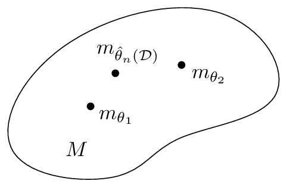

<!-- page 1 -->

arXiv:1808.08271v2 [cs.LG] 6 Sep 2020

# 信息几何初等导论

Frank Nielsen

Sony Computer Science Laboratories Inc

Tokyo, Japan

**摘要**

在本综述中，我们描述了信息流形的基本微分几何结构，阐述了信息几何的基本定理，并说明了这些信息流形在信息科学中的一些用例。本文通过简洁地介绍必要的微分几何概念以实现自洽，但为简洁起见省略了证明。

**关键词：** 微分几何；度量张量；仿射联络；度量相容性；共轭联络；对偶度量相容平行输运；信息流形；统计流形；曲率与平坦性；对偶平坦流形；Hessian流形；指数族；混合族；统计散度；参数散度；可分散度；Fisher-Rao距离；统计不变性；贝叶斯假设检验；混合聚类；α嵌入；规范自由度

## 1 引言

### 1.1 信息几何概述

我们对*信息几何*（IG）核心中的基本结构给出一个简洁而现代的视角，并报告这些信息几何流形（本文中称为"信息流形"）在统计学（贝叶斯假设检验）和机器学习（统计混合聚类）中的一些应用。

通过与*信息论*（IT）（由Claude Shannon在他著名的1948年论文[119]中开创）类比，信息论主要考虑在有噪传输信道上的消息通信，我们可以将*信息科学*（IS）定义为研究（有噪/不完美的）数据与模型族之间"通信"的领域（被假定为*先验*知识）。简而言之，信息科学寻求从数据中向模型*提炼*信息的方法。因此，信息科学涵盖信息论，但也包括概率与统计、机器学习（ML）、人工智能（AI）、数学规划等领域，仅举几例。

我们回顾了信息几何的一些关键里程碑，并在§5.2中报告了该领域先驱者的一些定义。现代信息几何的创始人Shun-ichi Amari教授在他最新教科书[8]的序言中定义信息几何如下："信息几何是一种利用现代几何探索信息世界的方法。"简而言之，信息几何从几何角度研究信息科学。这是一项数学工作，旨在定义和限定几何这一术语本身，因为几何是开放性的。通常，我们从研究问题的某种不变性开始（例如，概率分布之间距离的不变性），并由此获得一种新的几何结构（例如，一个"统计流形"）。然而，几何结构是"纯粹的"，因此可以应用于原始问题范围之外的其他应用领域（例如，统计流形的对偶结构在数学规划中的应用[57]）：几何方法[9]因此产生了一种溯因模式[103, 115]。

信息几何的一个更狭窄的定义可以表述为研究决策之几何的领域。这一定义还包括模型拟合（推断），它可以被解释为一个决策问题，如图1所示：也就是说，决定从一个参数模型族中选择哪个模型参数。这一框架由Abraham Wald [131, 132, 36]倡导，他将所有统计问题都视为统计决策问题。相异度（也宽泛地称为距离，在

<!-- page 2 -->

**图 1:** 从数据 $\mathcal{D}$ 中对模型进行参数推断 $\hat{\theta}$ 也可以被解释为一个决策问题：决定参数族模型 $M = \{m_\theta\}_{\theta \in \Theta}$ 中的哪个参数最“适合”数据。信息几何在流形 $M$ 上提供了一个微分几何结构，这对于设计和研究统计决策规则非常有用。

其他）不仅在测量数据与模型的*拟合优度*（例如，统计学中的似然、ML 中的分类器损失函数、数学规划或运筹学中的目标函数等）方面起着关键作用，而且在测量模型之间的差异（或偏差）方面也起着关键作用。

人们可能会思考为什么要采用几何方法？几何学使我们能够在与坐标无关的框架中研究“图形”的*不变性*。*几何语言*（例如，线、球或投影）也提供了有助于我们直观思考问题的功能。请注意，尽管图形可以被可视化（即，在坐标图中绘制），但它们应被视为纯粹的抽象对象，即几何图形。

几何学还使我们能够研究*等变性*：例如，三角形的质心 $c(T)$ 在任何仿射变换 $A$ 下都是等变的：$c(A.T) = A.c(T)$。在统计学中，最大似然估计量（MLE）在模型参数 $\theta$ 的单调变换 $g$ 下是等变的：$\widehat{(g(\theta))} = g(\hat{\theta})$，其中 $\theta$ 的 MLE 记为 $\hat{\theta}$。

## 1.2 综述概述

本综述的组织结构如下：

在第一部分（§2）中，我们首先简明地介绍微分几何的必要背景，以定义流形结构 $(M, g, \nabla)$，即一个配备了度量张量场 $g$ 和仿射联络 $\nabla$ 的流形 $M$。我们解释该框架如何通过陈述黎曼几何的基本定理来推广黎曼流形 $(M, g)$，该定理定义了一个唯一的无挠且度量相容的 Levi-Civita 联络，它可以从度量张量导出。

在第二部分（§3）中，我们解释信息流形的对偶结构：我们介绍共轭联络流形 $(M, g, \nabla, \nabla^*)$、统计流形 $(M, g, C)$（其中 $C$ 表示一个三次张量），并展示如何从任意给定的一对共轭联络 $(\nabla = \nabla^{-1}, \nabla^* = \nabla^1)$ 导出一族信息流形 $(M, g, \nabla^{-\alpha}, \nabla^{\alpha})$（其中 $\alpha \in \mathbb{R}$）。我们解释如何从任何光滑的（可能不对称的）距离（称为散度）获得与度量 $g$ 耦合的共轭联络 $\nabla$ 和 $\nabla^*$，介绍在考虑 Bregman 散度时得到的对偶平坦流形，并在处理概率模型的参数族时定义指数联络 $^e\nabla$ 和混合联络 $^m\nabla$，它们是与 Fisher 信息度量耦合的对偶联络。我们讨论度量张量的统计不变性概念以及统计散度的信息单调性概念 [30, 8]。由此得出，Fisher 信息度量是唯一的不变度量（至多相差一个比例因子），而 $f$-散度是唯一可分离的不变散度。

在第三部分（§4）中，我们说明如何在简单应用中运用这些信息几何结构：首先，我们在 §4.1 中描述了自然梯度下降方法及其与
