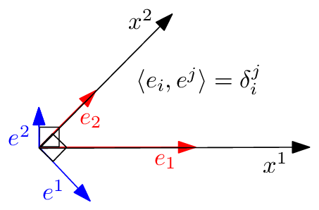
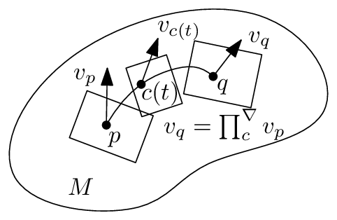
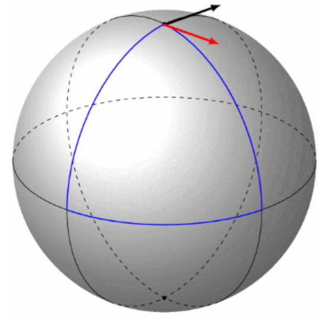
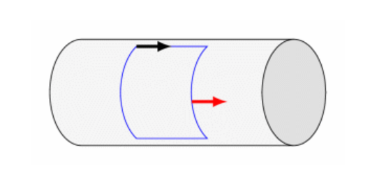
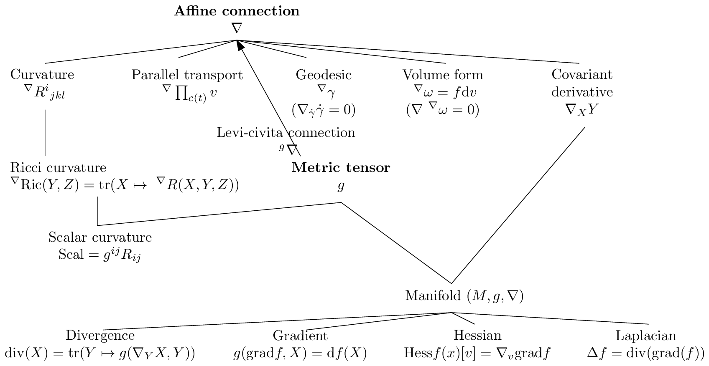

<!-- page 3 -->

黎曼梯度下降和 Bregman 镜像下降。其次，我们在§4.2中考虑对偶平坦空间中的两个应用：在第一个应用中，我们考虑 Bayesian 假设检验问题，并展示 Chernoff 信息（它定义了最佳误差指数）如何能在指数族流形的对偶平坦结构上得到几何刻画。在第二个应用中，我们展示如何在对偶平坦的混合族流形上对共享相同分量分布的统计混合进行聚类。

最后，我们在§5中总结信息几何的重要概念和结构，并提供进一步的参考文献和教科书[25, 8]，以供阅读信息几何更高级的结构和应用。我们还提到了关于基于原理的距离和散度的通用类别的近期研究。

在附录§A中，我们展示如何估计两个概率分布之间的统计$f$-散度，以确保在§B中的估计值非负；并报告多元 Gaussian 族的典范分解，这是一个具有对偶平坦结构的指数族的例子。

在每一部分的开头，我们先概述其内容。本综述中使用的符号总结见第47页。

## 2 预备知识：微分几何基础

在§2.1中，我们回顾微分几何（DG）的最基础知识，以定义一个同时配备了度量张量场$g$和仿射联络$\nabla$的流形$(M, g, \nabla)$。我们分别在§2.2和§2.3中解释这两个*独立的*度量/联络结构。从仿射联络$\nabla$出发，我们展示如何在§2.3.1中导出协变导数的概念，在§2.3.2中导出平行移动，以及在§2.3.3中导出测地线。我们进一步在§2.3.4中解释由联络诱导的流形的*内蕴曲率和挠率*，并在§2.4中陈述黎曼几何的基本定理：存在唯一的无挠 Levi-Civita 联络${}^{\text{LC}}\nabla$与度量相容（度量联络），它可以从度量张量$g$导出。因此，黎曼几何$(M, g)$是作为更一般的流形结构$(M, g, {}^{\text{LC}}\nabla)$的特例而得到的：$(M, g) \equiv (M, g, {}^{\text{LC}}\nabla)$。信息几何将进一步考虑与$(M, g, \nabla)$相关联的对偶结构$(M, g, \nabla^*)$，且这一对偶结构对将形成一个信息流形$(M, g, \nabla, \nabla^*)$。

### 2.1 微分几何概述：流形$(M, g, \nabla)$

非正式地说，一个*光滑$D$维流形*$M$是一个局部表现得像$D$维 Euclidean 空间$\mathbb{R}^D$的拓扑空间。几何对象（例如，点、球和向量场）和实体（例如，函数和微分算子）存在于$M$上，它们是*无坐标的*，但可以方便地在图册$\mathcal{A} = \{(\mathcal{U}_i, x_i)\}_i$的*任意*局部坐标系中表达，以便进行计算，其中$(\mathcal{U}_i, x_i)$为图（完全覆盖流形）。历史上，据说 René Descartes（1596-1650）在躺在床上思考如何定位天花板上的苍蝇时发明了全局 Cartesian 坐标系。在实践中，我们将使用最方便的坐标系来促进计算。在信息几何中，我们通常处理一个完全覆盖流形的单一图。

当*图变换*为$C^k$时，所得到的流形称为$C^k$流形。当流形为$C^\infty$时，称其为光滑流形。在每一点$p \in M$处，切平面$T_p$在局部最佳地线性化该流形。在任何光滑流形$M$上，我们可以定义两个*独立的*结构：

1. 一个度量张量$g$，以及
2. 一个仿射联络$\nabla$。

度量张量$g$在每个切平面$T_p$上诱导出一个*内积空间*，使人能够测量向量的大小（向量的“长度”）以及向量之间的夹角/正交性。仿射联络$\nabla$是一个微分算子，使人能够定义：

1. *协变导数算子*，它提供了一种计算向量场$Y$关于另一个向量场$X$的微分的方法：即协变导数$\nabla_X Y$，

<!-- page 4 -->

2. 平行移动 $\prod_c^\nabla$，它定义了沿任意光滑曲线 $c$ 在切平面之间运输向量的方法，
3. $\nabla$-测地线 $\gamma_\nabla$ 的概念，其被定义为自平行曲线，从而扩展了欧几里得平直性的通常概念，
4. 流形的内禀曲率和挠率。

## 2.2 度量张量场 $g$

$M$ 的切丛被定义为所有切空间的“并”：

$$TM := \cup_p T_p = \{(p,v), \quad p \in M, v \in T_p\}. \tag{1}$$

因此，$D$ 维流形 $M$ 的切丛 $TM$ 的维度为 $2D$。（切丛是以流形 $M$ 为底流形的一个纤维丛的特例。）

非正式地说，切向量 $v$ 扮演着方向导数的角色，其中 $vf$ 非正式地表示光滑函数 $f$（属于光滑函数空间 $\mathfrak{F}(M)$）沿方向 $v$ 的导数。由于流形是抽象的，并非嵌入在某个欧几里得空间中，我们不将向量视为锚定在流形上的“箭头”。相反，在微分几何中，向量可以通过多种方式理解，例如方向导数或某点处光滑曲线的等价类。也就是说，切空间也应被视为与流形一样抽象。

光滑向量场 $X$ 被定义为切丛的“截面”：$X \in \mathfrak{X}(M) = \Gamma(TM)$，其中 $\mathfrak{X}(M)$ 或 $\Gamma(TM)$ 表示光滑向量场的空间。有限 $D$ 维向量空间的一组基 $B = \{b_1, \ldots, b_D\}$ 是一个极大的线性无关向量集：向量集 $B = \{b_1, \ldots, b_D\}$ 是线性无关的，当且仅当 $\sum_{i=1}^D \lambda_i b_i = 0$ 当且仅当对所有 $i \in [D]$ 都有 $\lambda_i = 0$。也就是说，在一个线性无关的向量集中，集合中的任何向量都不能表示为其余向量的线性组合。当无法再添加另一个线性无关的向量时，该向量集就是极大线性无关的。切空间具有向量空间的代数结构。此外，对于任意向量空间 $V$，我们可以关联一个对偶余向量空间 $V^*$，它是实值线性映射的向量空间。为保持这份对信息几何的温和介绍并尽可能减少复杂性，我们在此不深入细节。使用图 $(\mathcal{U}, x)$ 上的局部坐标，向量场 $X$ 可以表示为 $X = \sum_{i=1}^D X^i e_i \stackrel{\Sigma}{=} X^i e_i$，其中对哑指标使用爱因斯坦求和约定（使用记号 $\stackrel{\Sigma}{=}$），这里 $(X)_B := (X^i)$ 表示逆变向量分量（在代数中作为“列向量”处理），对应于自然基 $B = \{e_1 = \partial_1, \ldots, e_D = \partial_D\}$，其中 $\partial_i := \frac{\partial}{\partial x_i}$。配备内积 $\langle \cdot, \cdot \rangle$ 的切平面（向量空间）构成一个内积空间。我们定义 $B = \{e_i = \partial_i\}_i$ 的互反基 $B^* = \{e^{*i} = \partial^i\}_i$，以便向量也可以使用自然互反基中的协变向量分量来表示。原始基与互反基按构造是相互正交的，如图 2 所示。

对于任意向量 $v$，其逆变分量 $v^i$（上标记号）和协变分量 $v_i$（下标记号）可以分别通过与互反基和原始基使用内积而从 $v$ 中获得：

$$v^i = \langle v, e^{*i} \rangle, \tag{2}$$
$$v_i = \langle v, e_i \rangle. \tag{3}$$

内积定义了一个度量张量 $g$ 和一个对偶度量张量 $g^*$：

$$g_{ij} := \langle e_i, e_j \rangle, \tag{4}$$
$$g^{*ij} := \langle e^{*i}, e^{*j} \rangle. \tag{5}$$

从技术上说，度量张量 $g_p : T_p M \times T_p M \rightarrow \mathbb{R}$ 是一个 2-协变张量场：

$$g \stackrel{\Sigma}{=} g_{ij} \mathrm{d}x_i \otimes \mathrm{d}x_j, \tag{6}$$

4

<!-- page 5 -->

**图 2：** 内积 $\langle\cdot,\cdot\rangle$ 空间中的原始基（红色）与对偶基（蓝色）。原始基与对偶基相互正交：$e^1$ 与 $e_2$ 正交，$e_1$ 与 $e^2$ 正交。

其中 $\otimes$ 是在成对余向量基 $\{\mathrm{d}x_i\}_i$ 上执行的并矢张量积（这些余向量对应于对偶向量基）。为简洁起见，我们不详细描述张量。张量是张量空间的一种几何实体，也可以解释为多重线性映射。逆变向量存在于向量空间中，而协变向量存在于对偶余向量空间中。我们推荐教材 [66]，其中对张量有简明且清晰的描述。

令 $G=[g_{ij}]$ 和 $G^*=[g^{*ij}]$ 表示 $D\times D$ 矩阵。根据对偶基的构造可知 $G^*=G^{-1}$。对偶基向量 $e^{*i}$ 和原始基向量 $e_i$ 可分别利用在原始基向量 $e_j$ 上定义的对偶度量 $g^*$ 和在对偶基向量 $e^{*j}$ 上定义的度量 $g$ 表示如下：

$$
e^{*i} \stackrel{\Sigma}{=} g^{*ij}e_j,
\qquad\qquad\qquad\qquad\qquad\qquad\qquad\qquad\qquad\qquad\qquad (7)
$$

$$
e_i \stackrel{\Sigma}{=} g_{ij}e^{*j}.
\qquad\qquad\qquad\qquad\qquad\qquad\qquad\qquad\qquad\qquad\qquad\quad (8)
$$

度量张量场 $g$（简称为“metric tensor”或“metric”）在切丛上定义了一个光滑对称正定双线性形式，使得对于 $u,v\in T_p$，有 $g(u,v)\geq 0\in\mathbb{R}$。我们也可以等价地写为 $g_p(u,v){:=}\langle u,v\rangle_p{:=}\langle u,v\rangle_{g(p)}{:=}\langle u,v\rangle$。两个向量 $u$ 和 $v$ 被称为正交的，记作 $u\perp v$，当且仅当 $\langle u,v\rangle=0$。向量的长度由范数 $\|u\|_p{:=}\|u\|_{g(p)}=\sqrt{\langle u,u\rangle_{g(p)}}$ 导出。利用坐标卡 $(\mathcal{U},x)$ 的局部坐标，我们得到向量的逆变/协变分量，并按如下方式用矩阵代数（按惯例使用列向量）计算度量张量：

$$
g(u,v) = (u)_B^\top \times G_{x(p)} \times (v)_B = (u)_{B^*}^\top \times G_{x(p)}^{-1} \times (v)_{B^*},
\qquad\qquad\qquad (9)
$$

因为根据原始/对偶基可知 $G\times G^*=I$，即单位矩阵。因此在任意切平面 $T_p$ 上，我们得到 Mahalanobis 距离：

$$
M_G(u,v) := \|u-v\|_G = \sqrt{\sum_{i=1}^{D}\sum_{j=1}^{D} G_{ij}(u^i-v^i)(u^j-v^j)}.
\qquad\qquad\qquad\quad (10)
$$

两个向量 $u$ 和 $v$ 的内积是一个标量（0-阶张量），可以等价地计算为：

$$
\langle u,v\rangle := g(u,v) \stackrel{\Sigma}{=} u^i v_i \stackrel{\Sigma}{=} u_i v^i.
\qquad\qquad\qquad\qquad\qquad\qquad\qquad\qquad\qquad (11)
$$

当 $\langle\cdot,\cdot\rangle_p = \kappa(p)\langle\cdot,\cdot\rangle_{\text{Euclidean}}$ 时，流形 $M$ 的度量张量 $g$ 被称为共形的。也就是说，当内积是欧几里得点积的一个标量函数 $\kappa(\cdot)$ 时。更精确地说，当这些度量定义了切平面 $T_p$ 中向量 $u$ 和 $v$ 之间的相同夹角时，我们定义度量 $g'$ 关于另一度量 $g$ 共形的概念：

$$
\frac{g'_p(u,v)}{\sqrt{g'_p(u,u)}\sqrt{g'_p(v,v)}} = \frac{g_p(u,v)}{\sqrt{g_p(u,u)}\sqrt{g_p(v,v)}}.
\qquad\qquad\qquad\qquad\qquad\qquad (12)
$$

5

<!-- page 6 -->

图 3：沿光滑曲线在切平面上对向量进行平行移动的示意图。对于一条光滑曲线 $c$，其中 $c(0)=p$ 且 $c(1)=q$，向量 $v_p \in T_p$ 被光滑地平行移动至向量 $v_q \in T_q$，使得对于任意 $t \in [0,1]$，都有 $v_{c(t)} \in T_{c(t)}$。

通常将 $g'$ 选为 Euclidean 度量。在共形几何中，我们可以像在 Euclidean 空间中一样测量切平面内向量之间的夹角，而无需任何变形。这便于在图卡中检查正交性。例如，双曲几何的 Poincaré 圆盘模型是共形的，但 Klein 圆盘模型不是共形的（原点处除外），参见 [89]。

### 2.3 仿射联络 $\nabla$

仿射联络 $\nabla$ 是定义在流形上的一种微分算子，它使我们能够定义：(1) 向量场的协变导数，(2) 沿光滑曲线在切平面上对向量的平行移动，以及 (3) 测地线。此外，仿射联络完全刻画了流形的曲率和挠率。

#### 2.3.1 向量场的协变导数 $\nabla_X Y$

联络定义了一个*协变导数*算子，它告诉我们如何依据另一个向量场 $X$ 对向量场 $Y$ 求导。协变导数算子使用传统的梯度符号 $\nabla$ 表示。因此，协变导数 $\nabla$ 是一个函数：

$$\nabla : \mathfrak{X}(M) \times \mathfrak{X}(M) \to \mathfrak{X}(M), \tag{13}$$

它具有一个特殊的下标记法 $\nabla_X Y := \nabla(X,Y)$，用于表示依据向量场 $X$ 对向量场 $Y$ 求导。

通过规定 $D^3$ 个光滑函数 $\Gamma_{ij}^k = \Gamma_{ij}^k(p)$，称为*第二类 Christoffel 符号*（Christoffel symbols of the second kind），我们定义了唯一的*仿射联络* $\nabla$，使其在图卡 $(\mathcal{U}, x)$ 的局部坐标下满足如下方程：

$$\nabla_{\partial_i} \partial_j = \Gamma_{ij}^k \partial_k. \tag{14}$$

Christoffel 符号也可写为 $\Gamma_{ij}^k := (\nabla_{\partial_i} \partial_j)^k$，其中 $(\cdot)^k$ 表示第 $k$ 个坐标。向量场 $Y$ 关于向量场 $X$ 的协变导数的第 $k$ 个分量 $(\nabla_X Y)^k$ 由下式给出：

$$(\nabla_X Y)^k \stackrel{\Sigma}{=} X^i (\nabla_i Y)^k \stackrel{\Sigma}{=} X^i \left( \frac{\partial Y^k}{\partial x^i} + \Gamma_{ij}^k Y^j \right). \tag{15}$$

Christoffel 符号*不是*张量（场），因为基变换诱导的变换规则不遵守张量的逆变/协变规则。

<!-- page 7 -->

### 2.3.2 沿光滑曲线 $c$ 的平行移动 $\prod_c^\nabla$

由于流形并未嵌入$^1$欧氏空间，我们无法将向量 $v \in T_p$ 与向量 $v' \in T_{p'}$ 相加，因为若无联络，切向量空间彼此之间并无关联。$^2$ 因此，联络 $\nabla$ 定义了如何在无穷接近的切平面 $T_p$ 与 $T_{p+dp}$ 之间建立向量的对应关系。进而，该联络使我们能够沿光滑曲线 $c(t)$（其中 $c(0)=p$，$c(1)=q$）通过滑动（以无穷小步长）的方式光滑地*输运*向量 $v \in T_p$，使得向量 $v_p \in T_p$ “对应”于向量 $v_q \in T_q$：这被称为*平行移动*。这一数学规定对于研究流形上的动力学（例如，研究流形上粒子$^3$的运动）是必要的。我们可以将沿光滑曲线 $c$ 的平行移动表示为：

$$\forall v \in T_p, \forall t \in [0,1], \quad v_{c(t)} = \prod_{c(0)\to c(t)}^\nabla v \in T_{c(t)} \tag{16}$$

平行移动在图 3 中进行了示意性说明。

### 2.3.3 $\nabla$-测地线 $\gamma_\nabla$：自平行曲线

联络 $\nabla$ 使我们得以将 $\nabla$-*测地线*定义为自平行曲线，即满足如下条件的曲线 $\gamma$：

$$\nabla_{\dot\gamma}\dot\gamma = 0. \tag{17}$$

也就是说，*速度向量* $\dot\gamma$ 沿曲线平行于自身移动（且测地线上的所有切向量彼此平行）：换言之，$\nabla$-测地线推广了“欧氏直线”的概念。在局部坐标 $(\mathcal{U}, x)$ 下，$\gamma(t) = (\gamma^k(t))_k$，自平行性等价于求解以下二阶常微分方程（ODE）：

$$\ddot{\gamma}(t) + \Gamma_{ij}^k \dot{\gamma}(t)\dot{\gamma}(t) = 0, \quad \gamma^l(t) = x^l \circ \gamma(t), \tag{18}$$

其中 $\Gamma_{ij}^k$ 为*第二类 Christoffel 符号*，满足：

$$\Gamma_{ij}^k \stackrel{\Sigma}{=} \Gamma_{ij,l}g^{lk}, \quad \Gamma_{ij,k} \stackrel{\Sigma}{=} g_{lk}\Gamma_{ij}^l, \tag{19}$$

其中 $\Gamma_{ij,l}$ 为*第一类 Christoffel 符号*。测地线是 1 维自平行子流形，而 $\nabla$-超平面类似地定义为 $D-1$ 维的自平行子流形。我们可以在下标中指明产生测地线 $\gamma$ 的联络：$\gamma_\nabla$。

测地线方程 $\nabla_{\dot\gamma(t)}\dot\gamma(t) = 0$ 既可以作为*初值问题*（IVP）求解，也可以作为*边值问题*（BVP）求解：

- *初值问题*（IVP）：固定条件 $\gamma(0)=p$ 和 $\dot\gamma(0)=v$，其中 $v \in T_p$ 为某向量。
- *边值问题*（BVP）：固定测地线的端点 $\gamma(0)=p$ 和 $\gamma(1)=q$。

### 2.3.4 流形的曲率与挠率

仿射联络 $\nabla$ 定义了一个 4D$^4$ *曲率张量* $R$（以 $(1,3)$-型张量的分量 $R^i_{jkl}$ 表示）。曲率张量的无坐标方程为：

$$R(X,Y)Z := \nabla_X\nabla_Y Z - \nabla_Y\nabla_X Z - \nabla_{[X,Y]}Z, \tag{20}$$

---

[^1]: Whitney 嵌入定理指出，任意 $D$ 维 Riemann 流形均可嵌入到 $\mathbb{R}^{2D}$ 中。

[^2]: 嵌入后，我们可以隐式地使用周围欧氏联络 $^{\text{Euc}}\nabla$，见 [2]。

[^3]: Elie Cartan 在 20 世纪 20 年代受力学中*惯性原理*的启发，引入了仿射联络的概念 [27, 3]：一个质点，若不受任何外力作用，则应沿直线以恒定速度运动。

[^4]: 由对称性约束可知，Riemann 张量在 $D$ 维中的独立分量个数为 $\frac{D^2(D^2-1)}{12}$。

<!-- page 8 -->

 

图 4：关于度量联络的平行运输：曲率效应可视为沿光滑（无穷小）环路上平行运输的角度亏损。对于球面流形，沿环路平行运输的向量不与自身重合，而对于（平坦）流形则总是与自身重合。绘图由 © CNRS 提供，http://images.math.cnrs.fr/Visualiser-la-courbure.html

其中 $[X,Y](f) = X(Y(f)) - Y(X(f))$（$\forall f \in \mathfrak{F}(M)$）是向量场的 *Lie 括号*。当联络为度量 Levi-Civita 联络时，该曲率称为 *Riemann-Christoffel 曲率张量*。在局部坐标系中，我们有：

$$R(\partial_j, \partial_k)\partial_i \stackrel{\Sigma}{=} R^l_{jki} \partial_l. \tag{21}$$

非正式地说，如式 20 所定义的曲率张量量化了协变导数的非交换程度。

当 $R = 0$ 时，配备联络 $\nabla$ 的流形 $M$ 称为平坦的（即 $\nabla$-平坦）。特别地，当能找到图 $(\mathcal{U}, x)$ 的某个特定⁵坐标系 $x$，使得 $\Gamma^k_{ij} = 0$（即所有联络系数消失）时，这一点成立。

当联络为*对称*时，流形称为*无挠的*。*对称*联络满足如下与坐标无关的方程：

$$\nabla_X Y - \nabla_Y X = [X,Y]. \tag{22}$$

使用局部图坐标，这相当于验证 $\Gamma^k_{ij} = \Gamma^k_{ji}$。挠率张量是一个 $(1,2)$-张量，定义为：

$$T(X,Y) := \nabla_X Y - \nabla_Y X - [X,Y]. \tag{23}$$

对于无挠联络，我们有第一 Bianchi 恒等式：

$$R(X,Y)Z + R(Z,X)Y + R(Y,Z)X = 0, \tag{24}$$

以及第二 Bianchi 恒等式：

$$(\nabla_V R)(X,Y)Z + (\nabla_X R)(Y,V)Z + (\nabla_Y R)(V,X)Z = 0. \tag{25}$$

一般而言，平行运输是*路径相关的*。向量在*无穷小闭合环路*（端点重合的光滑曲线）上运输的*角度亏损*与曲率相关。然而，对于*平坦联络*，平行运输不依赖于路径，并给出*绝对平行几何* [133]。图 4 展示了弯曲流形（球面流形）和平坦流形（柱面流形⁶）上沿曲线的平行运输。

仿射联络是无挠的线性联络。图 5 总结了由仿射联络 $\nabla$ 和度量张量 $g$ 诱导的微分几何中的各种概念。

---

⁵例如，Christoffel 符号在平面的直角坐标系中消失，但在其极坐标系中不消失。

⁶流形上某点的 Gaussian 曲率是极小与极大截面曲率的乘积：$\kappa_G := \kappa_{\min}\kappa_{\max}$。对于柱面，由于 $\kappa_{\min} = 0$，因此柱面的 Gaussian 曲率为 0。Gauss 的 Theorema Egregium（意为“非凡定理”）证明了 Gaussian 曲率是内蕴的，且不依赖于曲面如何嵌入到周围欧氏空间中。

<!-- page 9 -->

图 5：与仿射联络 ∇ 和度量张量 g 相关的微分几何概念。

曲率是几何中一个固有的基本概念 [22]：存在多种曲率概念：标量曲率、截面曲率、从曲面的 Gaussian 曲率到 Riemannian-Christoffel 4-张量、Ricci 对称 2-张量、Alexandrov 几何中的合成 Ricci 曲率，等等。

### 2.4 Riemannian 几何的基本定理：Levi-Civita 度量联络

根据定义，若仿射联络 ∇ 对任意向量场三元组 $(X,Y,Z)$ 均满足如下方程，则称其与 $g$ 是*度量相容*的：

$$
X\langle Y,Z\rangle = \langle \nabla_X Y, Z\rangle + \langle Y, \nabla_X Z\rangle, \tag{26}
$$

其等价地可写为：

$$
Xg(Y,Z) = g(\nabla_X Y, Z) + g(Y, \nabla_X Z) \tag{27}
$$

使用局部坐标和向量场的自然基 $\{\partial_i\}$，度量相容性等价于验证如下等式：

$$
\partial_k g_{ij} = \langle \nabla_{\partial_k} \partial_i, \partial_j \rangle + \langle \partial_i, \nabla_{\partial_k} \partial_j \rangle \tag{28}
$$

使用度量相容联络的一个性质是，向量的平行移动 $\prod^\nabla$ 保持度量：

$$
\langle u,v\rangle_{c(0)} = \left\langle \prod_{c(0)\to c(t)}^\nabla u,\ \prod_{c(0)\to c(t)}^\nabla v \right\rangle_{c(t)} \quad \forall t. \tag{29}
$$

也就是说，沿光滑曲线进行平行移动时，切平面中向量的角度（以及正交性）和长度均保持不变。

Riemannian 几何的基本定理断言，存在唯一的无挠度量相容联络：

<!-- page 10 -->

**定理 1**（Levi-Civita 度量联络）。*存在唯一的与度量相容的无挠仿射联络，称为 Levi-Civita 联络 ${}^{\mathrm{LC}}\nabla$。*

Levi-Civita 联络的 Christoffel 符号可由度量张量 $g$ 表示如下：
$$
{}^{\mathrm{LC}}\Gamma_{ij}^k \stackrel{\Sigma}{=} \frac{1}{2}g^{kl}\left(\partial_i g_{jl} + \partial_j g_{il} - \partial_l g_{ij}\right),
\tag{30}
$$
其中 $g^{ij}$ 表示逆矩阵 $g^{-1}$ 的矩阵元。

Levi-Civita 联络也可通过 *Koszul 公式* 以无坐标方式定义：
$$
2g(\nabla_X Y, Z) = X(g(Y,Z)) + Y(g(X,Z)) - Z(g(X,Y)) + g([X,Y],Z) - g([X,Z],Y) - g([Y,Z],X).
\tag{31}
$$

理论物理中研究了带挠率的度量相容联络。例如参见平坦的 Weitzenböck 联络 [15]。

度量张量 $g$ 诱导出确定流形*局部结构*的无挠度量相容 Levi-Civita 联络。然而，度量 $g$ 并不固定*整体拓扑结构*：例如，虽然圆锥和圆柱在局部上具有相同的平坦欧几里得度量，但它们表现出不同的整体结构。

### 2.5 预览：信息几何与黎曼几何

在信息几何中，我们考虑一对与度量 $g$ 耦合的共轭仿射联络 $\nabla$ 与 $\nabla^*$（通常但未必无挠）：该结构通常记为 $(M, g, \nabla, \nabla^*)$。关键性质在于这些共轭联络是度量相容的，因此诱导的对偶平行移动保持度量：
$$
\langle u, v \rangle_{c(0)} = \left\langle \prod_{c(0)\to c(t)}^{\nabla} u,\, \prod_{c(0)\to c(t)}^{\nabla^*} v \right\rangle_{c(t)}.
\tag{32}
$$

因此，黎曼流形 $(M,g)$ 可被解释为对 $\nabla = \nabla^* = {}^{\mathrm{LC}}\nabla$（唯一的无挠 Levi-Civita 度量联络）所得到的自对偶信息几何流形：$(M,g) \equiv (M,g, {}^{\mathrm{LC}}\nabla, {}^{\mathrm{LC}}\nabla^* = {}^{\mathrm{LC}}\nabla)$。然而，我们需指出，对于一对自对偶的 Levi-Civita 共轭联络，信息几何流形并不诱导出距离。这与黎曼模型 $(M,g)$ 形成对比，后者提供了由连接两点 $p=\gamma(0)$ 与 $q=\gamma(1)$ 的测地线 $\gamma$ 的长度所定义的黎曼距离 $D_\rho(p,q)$：
$$
D_\rho(p,q) \quad:=\quad \int_0^1 \|\gamma'(t)\|_{\gamma(t)} \mathrm{d}t = \int_0^1 \sqrt{g_{\gamma(t)}(\dot{\gamma}(t), \dot{\gamma}(t))} \mathrm{d}t,
\tag{33}
$$

$$
\phantom{D_\rho(p,q) \quad:=\quad} = \int_0^1 \sqrt{\dot{\gamma}(t)^\top g_{\gamma(t)} \dot{\gamma}(t)} \mathrm{d}t.
\tag{34}
$$

该测地线长度距离 $D_\rho(p,q)$ 也可解释为连接点 $p$ 到点 $q$ 的最短路径：$D_\rho(p,q) = \inf_\gamma \int_0^1 \|\gamma'(t)\|_{\gamma(t)} \mathrm{d}t$（其中 $p=\gamma(0)$ 且 $q=\gamma(1)$）。

通常，这种黎曼测地线距离没有闭式解（需要近似或估计上界），因为测地线无法被显式参数化（参见测地线射击方法 [11]）。

现在我们已经准备好介绍信息几何的关键几何结构了。
