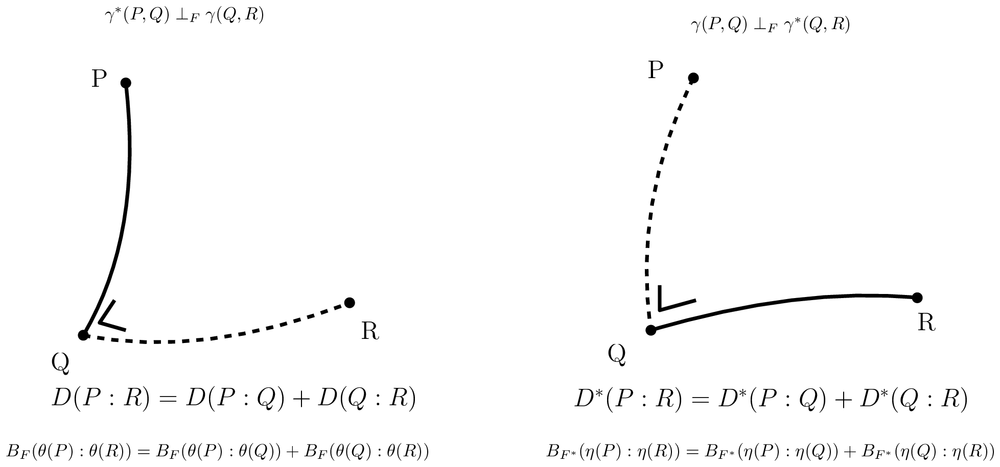

<!-- page 10 -->

## 3 信息流形

### 3.1 概述

在本部分中，我们解释信息几何中流形的*对偶结构*。在 §3.2 中，我们首先介绍核心的*共轭联络流形*（CCMs）$(M,g,\nabla,\nabla^*)$，并展示如何构建*统计流形*

<!-- page 11 -->

(SMs) $(M, g, C)$ 来自 §3.3 中的 CCM。从任意统计流形出发，我们可以构造 CCM 的一个单参数族 $(M, g, \nabla^{-\alpha}, \nabla^{\alpha})$，即信息 $\alpha$-流形。我们在 §3.5 中陈述信息几何的基本定理。这些 CCM 与 SM 的结构先验上并不与任何距离相关，但首先需要一个与度量张量 $g$ 耦合的共轭联络对 $(\nabla, \nabla^*)$。我们展示两种构造初始共轭联络对的方法。第一种方法是在 §3.6 中从任意散度 $D$ 构造一对共轭联络 $({}^D\nabla, {}^D\nabla^*)$。因此，当散度对称时，即 $D(\theta_1 : \theta_2) = D(\theta_2 : \theta_1)$，我们得到自共轭联络。当散度为 Bregman 散度（即对于严格凸且可微的 Bregman 生成元，$D = B_F$）时，我们在 §3.7 中得到对偶平坦流形（DFMs）$(M, \nabla^2 F, {}^F\nabla, {}^F\nabla^*)$。DFM 很好地推广了欧几里得几何，并展现出勾股定理。我们进一步刻画点关于子流形 a 的正交 ${}^F\nabla$-投影与对偶 ${}^F\nabla^*$-投影何时唯一。[^7] 第二种获得共轭联络对 $({}^e\nabla, {}^m\nabla)$ 的方法是从一个正则参数概率分布族 $\mathcal{P} = \{p_\theta(x)\}_\theta$ 来定义这些联络。在这种情况下，这些‘e’指数联络 ${}^e\nabla$ 和‘m’混合联络 ${}^m\nabla$ 与 Fisher 信息度量 ${}_{\mathcal{P}}g$ 相耦合。通过考虑偏度 Amari-Chentsov 三次张量 ${}_{\mathcal{P}}C$，可以恢复统计流形 $(\mathcal{P}, {}_{\mathcal{P}}g, {}_{\mathcal{P}}C)$，并由此得到一族 CCM 的单参数族 $(\mathcal{P}, {}_{\mathcal{P}}g, {}_{\mathcal{P}}\nabla^{-\alpha}, {}_{\mathcal{P}}\nabla^{+\alpha})$，即统计期望 $\alpha$-流形。在这种参数统计语境下，这些信息流形被称为期望信息流形，因为各种量都是用统计期望 $E_\cdot[\cdot]$ 来表达的。注意到这些信息流形可以一般地用于信息科学，而不仅限于传统的统计学领域。在统计学中，我们在 §3.10 中通过研究统计不变性准则来为联络、度量张量和散度的选择提供动机。我们解释如何从标准的 $f$-散度中恢复期望 $\alpha$-联络，而 $f$-散度是唯一满足信息单调性性质的可分散度。最后，在 §3.11 中，我们回顾 Fisher-Rao 期望黎曼流形，它们是装备了称为 Fisher-Rao 距离（简称 Rao 距离）的测地度量距离的黎曼流形 $(\mathcal{P}, {}_{\mathcal{P}}g)$。

## 3.2 共轭联络流形：$(M, g, \nabla, \nabla^*)$

我们从一个定义开始：

**定义 1**（共轭联络）。*称联络 $\nabla^*$ 关于度量张量 $g$ 与联络 $\nabla$ 共轭，当且仅当对于任意光滑向量场三元组 $(X, Y, Z)$ 满足如下恒等式：*

$$X\langle Y, Z \rangle = \langle \nabla_X Y, Z \rangle + \langle Y, \nabla_X^* Z \rangle, \quad \forall X, Y, Z \in \mathfrak{X}(M). \tag{35}$$

我们在记号上可将式 35 重写为：

$$Xg(Y,Z) = g(\nabla_X Y, Z) + g(Y, \nabla_X^* Z), \tag{36}$$

并进一步显式写出，对于每一点 $p \in M$，我们有：

$$X_p g_p(Y_p, Z_p) = g_p((\nabla_X Y)_p, Z_p) + g_p(Y_p, (\nabla_X^* Z)_p). \tag{37}$$

我们检查右端是一个标量，而左端是一个实值函数的方向导数，它也是一个标量。

共轭是一个对合：$(\nabla^*)^* = \nabla$。

**定义 2**（共轭联络流形）。*共轭联络流形（CCM）的结构记为 $(M, g, \nabla, \nabla^*)$，其中 $(\nabla, \nabla^*)$ 是关于度量 $g$ 的共轭联络。*

一个显著的性质是，向量的对偶平行移动保持度量。也就是说，对于任意光滑曲线 $c(t)$，当我们用原始平行移动 $\prod_c^\nabla$ 移动其中一个向量 $u$，并用对偶平行移动 $\prod_c^{\nabla^*}$ 移动另一向量 $v$ 时，内积保持不变。

[^7]: 在欧几里得几何中，利用勾股定理可以证明点 $p$ 到仿射子空间 $S$ 的正交投影是唯一的。

11

<!-- page 12 -->

$$\langle u, v \rangle_{c(0)} = \left\langle \prod_{c(0)\to c(t)}^{\nabla} u,\; \prod_{c(0)\to c(t)}^{\nabla^*} v \right\rangle_{c(t)}. \tag{38}$$

**性质 1**（对偶平行输运保持度量）。*一对共轭联络 $(\nabla, \nabla^*)$ 保持度量 $g$ 当且仅当：*

$$\forall t \in [0,1],\; \left\langle \prod_{c(0)\to c(t)}^{\nabla} u,\; \prod_{c(0)\to c(t)}^{\nabla^*} v \right\rangle_{c(t)} = \langle u, v \rangle_{c(0)}. \tag{39}$$

**性质 2。** *给定 $(M, g)$ 上的一个联络 $\nabla$（即结构 $(M, g, \nabla)$），存在唯一的共轭联络 $\nabla^*$（即对偶结构 $(M, g, \nabla^*)$）。*

我们考虑一个配备了共轭联络对 $\nabla$ 与 $\nabla^*$ 的流形 $M$，它们与度量张量 $g$ 耦合，使得对偶平行输运保持度量。我们定义平均联络 $\bar{\nabla}$：

$$\bar{\nabla} = \frac{\nabla + \nabla^*}{2}, \tag{40}$$

相应的 Christoffel 系数记为 $\bar{\Gamma}$。该平均联络与 Levi-Civita 度量联络一致：

$$\bar{\nabla} = {}^{\mathrm{LC}}\nabla. \tag{41}$$

**性质 3。** *平均联络 $\bar{\nabla}$ 是自共轭的，并且与 Levi-Civita 度量联络重合。*

### 3.3 统计流形：$(M, g, C)$

Lauritzen 于 1987 年引入了信息几何中的这一角结构 [62]。需注意，尽管它名为“统计流形”，但它是一种纯几何构造，可在统计学领域之外使用。然而，正如我们稍后将要提到的，我们总可以找到一个与统计流形 [128] 对应的统计模型 $\mathcal{P}$。我们将看到如何把共轭联络流形转化为这样的统计流形，以及如何随后从统计流形导出无限一族 CCMs。换言之，一旦我们拥有一对共轭联络，我们就能够构造一族共轭联络对。

我们定义一个完全对称⁸的三次 $(0,3)$-张量（即 3-协变张量），称为 Amari-Chentsov 张量：

$$C_{ijk} := \Gamma_{ij}^k - \Gamma_{ij}^{*k}, \tag{42}$$

或用无坐标方程表示：

$$C(X,Y,Z) := \langle \nabla_X Y - \nabla_X^* Y, Z \rangle. \tag{43}$$

使用局部基，该三次张量可表示为：

$$C_{ijk} = C(\partial_i, \partial_j, \partial_k) = \langle \nabla_{\partial_i} \partial_j - \nabla_{\partial_i}^* \partial_j, \partial_k \rangle \tag{44}$$

**定义 3**（统计流形 [62]）。*统计流形 $(M, g, C)$ 是一个配备了度量张量 $g$ 和完全对称三次张量 $C$ 的流形 $M$。*

---

⁸这意味着对于任意置换 $\sigma$，都有 $C_{ijk} = C_{\sigma(i)\sigma(j)\sigma(k)}$。度量张量是完全对称的。

12

<!-- page 13 -->

### 3.4 共轭联络流形族 $\{(M,g,\nabla^{-\alpha},\nabla^\alpha = (\nabla^{-\alpha})^*)\}_{\alpha\in\mathbb{R}}$

对于任意一对共轭联络 $(\nabla,\nabla^*)$，我们可以定义一个 $1$-*参数联络族* $\{\nabla^\alpha\}_{\alpha\in\mathbb{R}}$，称为 $\alpha$-*联络*，使得 $(\nabla^{-\alpha}, \nabla^\alpha)$ 关于度量对偶耦合，且 $\nabla^0=\bar{\nabla}={}^{\text{LC}}\nabla$，$\nabla^1=\nabla$ 以及 $\nabla^{-1}=\nabla^*$。注意到缩放的三次张量 $\alpha C$ 也是一个完全对称的三次 $3$ 阶协变张量，我们可以从统计流形 $(M,g,C)$ 导出 $\alpha$-联络如下：

$$\Gamma^\alpha_{ij,k} = \Gamma^0_{ij,k} - \frac{\alpha}{2}C_{ij,k}, \tag{45}$$

$$\Gamma^{-\alpha}_{ij,k} = \Gamma^0_{ij,k} + \frac{\alpha}{2}C_{ij,k}, \tag{46}$$

其中 $\Gamma^0_{ij,k}$ 是 Levi-Civita Christoffel 符号，且 $\Gamma_{ki,j}\stackrel{\Sigma}{=}\Gamma^l_{ij}g_{lk}$（通过指标变换）。

$\alpha$-联络 $\nabla^\alpha$ 也可以如下定义：

$$g(\nabla^\alpha_XY,Z) = g({}^{\text{LC}}\nabla_XY,Z) + \frac{\alpha}{2}C(X,Y,Z), \forall X,Y,Z\in\mathfrak{X}(M). \tag{47}$$

**定理 2**（信息 $\alpha$-流形族）。*对于任意 $\alpha\in\mathbb{R}$，$(M,g,\nabla^{-\alpha},\nabla^\alpha = (\nabla^{-\alpha})^*)$ 是一个共轭联络流形。*

$\alpha$-联络 $\nabla^\alpha$ 也可以通过取如下加权组合直接从一对共轭联络 $(\nabla,\nabla^*)$ 构造：

$$\Gamma^\alpha_{ij,k} = \frac{1+\alpha}{2}\Gamma_{ij,k} + \frac{1-\alpha}{2}\Gamma^*_{ij,k}. \tag{48}$$

### 3.5 信息几何基本定理：$\nabla$ $\kappa$-弯曲 $\Leftrightarrow$ $\nabla^*$ $\kappa$-弯曲

我们现在陈述信息几何基本定理及其推论：

**定理 3**（对偶常曲率流形）。*若无挠仿射联络 $\nabla$ 具有常曲率 $\kappa$，则其共轭无挠联络 $\nabla^*$ 必然具有相同的常曲率 $\kappa$。*

证明见 [25]（命题 8.1.4，第 226 页）。

若统计流形 $(M,g,C)$ 的诱导 $\alpha$-联络是平坦的，则称其为 $\alpha$-*平坦*的。可以证明 $R^\alpha = -R^{-\alpha}$。

我们得到以下两个推论：

**推论 1**（对偶 $\alpha$-平坦流形）。*流形 $(M,g,\nabla^{-\alpha},\nabla^\alpha)$ 是 $\nabla^\alpha$-平坦的当且仅当它是 $\nabla^{-\alpha}$-平坦的。*

**推论 2**（对偶平坦流形（$\alpha=\pm 1$））。*流形 $(M,g,\nabla,\nabla^*)$ 是 $\nabla$-平坦的当且仅当它是 $\nabla^*$-平坦的。*

（见 [9] 的定理 3.3）

现在我们定义统计结构 [46] 的常曲率概念：

**定义 4**（常曲率 $\kappa$）。*统计结构 $(M,g,\nabla)$ 被称为具有常曲率 $\kappa$，当*

$$R^\nabla(X,Y)Z = \kappa\{g(Y,Z)X - g(X,Z)Y\}, \quad \forall X,Y,Z\in\Gamma(TM),$$

*其中 $\Gamma(TM)$ 表示光滑向量场的空间。*

可以证明共轭 $\alpha$-联络 [25] 的 Riemann-Christoffel（RC）$4$-张量有如下关系：

$$g\left(R^{(\alpha)}(X,Y)Z,W\right) + g\left(Z,R^{(-\alpha)}(X,Y)W\right) = 0. \tag{49}$$

因此我们有 $g\left(R^{\nabla^*}(X,Y)Z,W\right) = -g\left(Z,R^\nabla(X,Y)W\right)$。

因此，一旦给定一对共轭联络，我们总能构造一个 $1$-参数流形族。从计算的角度来看，具有常曲率 $\kappa$ 的流形是很有意义的，因为对偶测地线具有简单的闭式表达式。

<!-- page 14 -->

### 3.6 由散度导出的共轭联络：$(M, D) \equiv (M, {}^Dg, {}^D\nabla, {}^D\nabla^* = {}^{D^*}\nabla)$

粗略地说，散度 $D(\cdot:\cdot)$ 是一种光滑距离 [138]，可能是非对称的。为了严格定义散度，我们首先引入以下便捷记号：$\partial_{i,\cdot} f(x,y) = \frac{\partial}{\partial x^i} f(x,y)$，$\partial_{\cdot,j} f(x,y) = \frac{\partial}{\partial y^j} f(x,y)$，$\partial_{ij,\cdot} f(x,y) = \frac{\partial^2}{\partial x^i \partial x^j} f(x,y)$ 以及 $\partial_{i,jk} f(x,y) = \frac{\partial}{\partial x^i}\frac{\partial^2}{\partial y^j \partial y^k} f(x,y)$，等等。

**定义 5**（散度）。流形 $M$ 上关于局部坐标卡 $\Theta \subset \mathbb{R}^D$ 的散度 $D: M \times M \to [0,\infty)$ 是一个满足以下性质的 $C^3$ 函数：

1. 对所有 $\theta, \theta' \in \Theta$ 有 $D(\theta:\theta') \geq 0$，且等号成立当且仅当 $\theta=\theta'$（不可分辨者同一律），
2. 对所有 $i,j \in [D]$ 有 $\partial_{i,\cdot} D(\theta:\theta')|_{\theta=\theta'} = \partial_{\cdot,j} D(\theta:\theta')|_{\theta=\theta'} = 0$，
3. $-\partial_{\cdot,i}\partial_{\cdot,j} D(\theta:\theta')|_{\theta=\theta'}$ 是正定的。

*对偶散度*通过交换自变量定义：

$$D^*(\theta:\theta') := D(\theta':\theta), \tag{50}$$

它也被称为*反向散度*（信息几何中的参考对偶性）。散度的参考对偶性是一个对合：$(D^*)^* = D$。

欧几里得距离是一种度量距离，但不是散度。平方欧几里得距离是一种非度量对称散度。度量张量 $g$ 给出黎曼度量距离 $D_\rho$，但它绝不是散度。

从任意给定的散度 $D$ 出发，我们可以按照 Eguchi [42, 43]（1983）的构造定义一个共轭联络流形：

**定理 4**（由散度构造流形）。$(M, {}^Dg, {}^D\nabla, {}^{D^*}\nabla)$ 是一个信息流形，其中：

$$\begin{align}
{}^Dg &:= -\partial_{i,j} D(\theta:\theta')|_{\theta=\theta'} = {}^{D^*}g, \tag{51}\\
{}^D\Gamma_{ijk} &:= -\partial_{ij,k} D(\theta:\theta')|_{\theta=\theta'}, \tag{52}\\
{}^{D^*}\Gamma_{ijk} &:= -\partial_{k,ij} D(\theta:\theta')|_{\theta=\theta'}. \tag{53}
\end{align}$$

相关联的统计流形为 $(M, {}^Dg, {}^DC)$，其中：

$${}^DC_{ijk} = {}^{D^*}\Gamma_{ijk} - {}^D\Gamma_{ijk}. \tag{54}$$

由于对任意 $\alpha \in \mathbb{R}$，$\alpha{}^DC$ 都是一个完全对称的三次张量，我们可以导出一族单参数共轭联络流形：

$$\left\{(M, {}^Dg, {}^DC^\alpha) \equiv (M, {}^Dg, {}^D\nabla^{-\alpha}, ({}^D\nabla^{-\alpha})^* = {}^D\nabla^\alpha)\right\}_{\alpha\in\mathbb{R}}. \tag{55}$$

在后续内容中，我们使用简写 $(M,D)$ 来表示由散度诱导的信息流形 $(M, {}^Dg, {}^D\nabla, {}^D\nabla^*)$。注意，由构造可知：

$${}^D\nabla^* = {}^{D^*}\nabla. \tag{56}$$

### 3.7 对偶平坦流形（Bregman 几何）：$(M, F) \equiv (M, {}^{B_F}g, {}^{B_F}\nabla, {}^{B_F}\nabla^* = {}^{B_F^*}\nabla)$

我们考虑满足非对称毕达哥拉斯定理的对偶平坦流形。这些平坦流形可以从一个典范的 Bregman 散度得到。

考虑一个*严格凸光滑函数* $F(\theta)$，称为*势函数*，其中 $\theta \in \Theta$，而 $\Theta$ 是一个开凸区域。注意，函数的凸性在仿射变换下不变。我们将一个相应的*Bregman 散度*（参数散度）与势函数 $F$ 相关联：

$$B_F(\theta:\theta') := F(\theta) - F(\theta') - (\theta-\theta')^\top \nabla F(\theta'). \tag{57}$$

<!-- page 15 -->

我们也将点 $P$ 与点 $Q$ 之间的Bregman散度记为 $D(P:Q) := B_F(\theta(P):\theta(Q))$，其中 $\theta(P)$ 表示点 $P$ 的坐标。

由Bregman生成元$^9$诱导的信息几何结构为 $(M, {}^F g, {}^F C) := (M, {}^{B_F} g, {}^{B_F} C)$，其定义为：

$$
{}^F g := {}^{B_F} g = -[\partial_i\partial_j B_F(\theta:\theta')|_{\theta'=\theta}] = \nabla^2 F(\theta), \tag{58}
$$

$$
{}^F \Gamma := {}^{B_F} \Gamma_{ij,k}(\theta) = 0, \tag{59}
$$

$$
{}^F C_{ijk} := {}^{B_F} C_{ijk} = \partial_i\partial_j\partial_k F(\theta). \tag{60}
$$

由于Christoffel符号的所有系数均为零（公式59），该信息流形是 ${}^F\nabla$-*平坦*的。Levi-Civita联络 ${}^{\mathrm{LC}}\nabla$ 由度量张量 ${}^F g$（通常不是平坦的）导出，而由 $(M, {}^F g, {}^F C)$ 可得共轭联络 $({}^F\nabla)^* = {}^F\nabla^1$。

Legendre-Fenchel变换产生*凸共轭* $F^*$，它被解释为*对偶势函数*：

$$
F^*(\eta) := \sup_{\theta\in\Theta} \{\theta^\top\eta - F(\theta)\}. \tag{61}
$$

**定理5**（Fenchel-Moreau双共轭 [52]）。*若 $F$ 为下半连续$^{10}$的凸函数，则其Legendre-Fenchel变换是对合的：$(F^*)^* = F$（双共轭）。*

在对偶平坦流形中，存在两个全局对偶仿射坐标系 $\eta = \nabla F(\theta)$ 与 $\theta = \nabla F^*(\eta)$，因此该流形可被单个坐标图覆盖。于是，若一个概率族属于指数族，则其自然参数不可能属于，例如，球面空间（那至少需要两个坐标图）。

我们有Crouzeix [32] 恒等式，它关联势函数的Hessian矩阵：

$$
\nabla^2 F(\theta)\nabla^2 F^*(\eta) = I, \tag{62}
$$

其中 $I$ 表示 $D\times D$ 单位矩阵。此Crouzeix恒等式表明 $B = \{\partial_i\}_i$ 与 $B^* = \{\partial^j\}_j$ 分别为原始基与倒基。

Bregman散度可借助Young-Fenchel（不）等式重新解释为*典范散度* $A_{F,F^*}$ [12]：

$$
B_F(\theta:\theta') = A_{F,F^*}(\theta:\eta') = F(\theta) + F^*(\eta') - \theta^\top\eta' = A_{F^*,F}(\eta':\theta). \tag{63}
$$

*对偶Bregman散度* $B_{F^*}(\theta:\theta') := B_F(\theta':\theta) = B_{F^*}(\eta:\eta')$ 给出

$$
{}^F g^{ij}(\eta) = \partial^i\partial^j F^*(\eta), \quad \partial^l :=: \frac{\partial}{\partial\eta^l} \tag{64}
$$

$$
{}^F\Gamma^{*ijk}(\eta) = 0, \quad {}^F C^{ijk} = \partial^i\partial^j\partial^k F^*(\eta) \tag{65}
$$

因此，该信息流形既是 ${}^F\nabla$-平坦的，又是 ${}^F\nabla^*$-平坦的：这种结构称为*对偶平坦流形*（DFM）。在DFM中，我们有两个全局仿射坐标系 $\theta(\cdot)$ 与 $\eta(\cdot)$，它们由一对势函数 $F$ 与 $F^*$ 的Legendre-Fenchel变换所关联。亦即 $(M, F) \equiv (M, F^*)$，并且对偶图册为 $\mathcal{A}=\{(M,\theta)\}$ 与 $\mathcal{A}^*=\{(M,\eta)\}$。

在对偶平坦流形中，任意两点 $P$ 与 $Q$ 既可通过 $\nabla$-测地线（即 $\theta$-直线）相连，也可通过 $\nabla^*$-测地线（即 $\eta$-直线）相连。一般而言，在对偶平坦流形中存在 $2^3 = 8$ 种类型的*测地三角形*。

$^9$此处，我们将Bregman生成元定义为正常的、下半连续的、严格凸的且 $C^3$ 可微的实值函数。

$^{10}$函数 $f$ 在 $x_0$ 处下半连续（lsc）当且仅当 $f(x_0) \leq \lim_{x\to x_0}\inf f(x)$。若函数 $f$ 在其定义域中所有 $x$ 处都下半连续，则称 $f$ 是下半连续的。

15

<!-- page 16 -->

$$\gamma^*(P,Q) \perp_F \gamma(Q,R)$$

$$D(P:R) = D(P:Q) + D(Q:R)$$

$$B_F(\theta(P):\theta(R)) = B_F(\theta(P):\theta(Q)) + B_F(\theta(Q):\theta(R))$$

$$\gamma(P,Q) \perp_F \gamma^*(Q,R)$$

$$D^*(P:R) = D^*(P:Q) + D^*(Q:R)$$

$$B_{F^*}(\eta(P):\eta(R)) = B_{F^*}(\eta(P):\eta(Q)) + B_{F^*}(\eta(Q):\eta(R))$$

图 6：对偶平坦空间中的对偶毕达哥拉斯定理。

在 Bregman 流形上，向量的原始平行移动不改变其逆变分量，而对偶平行移动不改变其协变分量。由于对偶联络是平坦的，因此对偶平行移动与路径无关。

此外，图 6 所示的对偶毕达哥拉斯定理 [76] 成立。令 $\gamma(P,Q) = \gamma_\nabla(P,Q)$ 表示通过点 $P$ 和 $Q$ 的 $\nabla$-测地线，$\gamma^*(P,Q) = \gamma_{\nabla^*}(P,Q)$ 表示通过点 $P$ 和 $Q$ 的 $\nabla^*$-测地线。当 $g(\dot{\gamma}_1(t_1), \dot{\gamma}_2(t_2)) = 0$ 时，曲线 $\gamma_1$ 和 $\gamma_2$ 在点 $p = \gamma_1(t_1) = \gamma_2(t_2)$ 处关于度量张量 $g$ 正交。

**定理 6**（对偶毕达哥拉斯恒等式）。

$$\gamma^*(P,Q) \perp \gamma(Q,R) \quad \Leftrightarrow \quad (\eta(P) - \eta(Q))^\top(\theta(Q) - \theta(R)) \stackrel{\Sigma}{=} (\eta_i(P) - \eta_i(Q))(\theta_i(Q) - \theta_i(R)) = 0,$$

$$\gamma(P,Q) \perp \gamma^*(Q,R) \quad \Leftrightarrow \quad (\theta(P) - \theta(Q))^\top(\eta(Q) - \eta(R)) \stackrel{\Sigma}{=} (\theta_i(P) - \theta_i(Q))(\eta_i(Q) - \eta_i(R)) = 0.$$

我们可以定义对偶 Bregman 投影并刻画这些投影在何时唯一：子流形 $S \subset M$ 被称为 $\nabla$-平坦（$\nabla^*$-平坦）当且仅当它对应于 $\theta$-坐标系（分别地，$\eta$-坐标系）中的仿射子空间。

**定理 7**（投影的唯一性）。若 $S$ 是 $\nabla^*$-平坦的，且最小化散度 $D(\theta(P):\theta(Q))$，则 $P$ 在 $S$ 上的 $\nabla$-投影 $P_S$ 唯一：

$$\nabla\text{-投影：} \quad P_S = \arg\min_{Q \in S} D(\theta(P):\theta(Q)). \tag{66}$$

若 $M \subseteq S$ 是 $\nabla$-平坦的且最小化散度 $D(\theta(Q):\theta(P))$，则对偶 $\nabla^*$-投影 $P_S^*$ 唯一：

$$\nabla^*\text{-投影：} \quad P_S^* = \arg\min_{Q \in S} D(\theta(Q):\theta(P)). \tag{67}$$

设 $S \subset M$ 且 $S' \subset M$，则我们定义 $S$ 与 $S'$ 之间的散度为

$$D(S:S') := \min_{s \in S, s' \in S'} D(s:s'). \tag{68}$$

当 $S$ 为 $\nabla$-平坦子流形且 $S'$ 为 $\nabla^*$-平坦子流形时，子流形 $S$ 与子流形 $S'$ 之间的散度 $D(S:S')$ 可用交替投影法 [8] 计算。让我们指出

16

<!-- page 17 -->

Kurose [61] 报告了一个关于对偶常曲率流形的毕达哥拉斯定理，该定理推广了对偶平坦空间的毕达哥拉斯定理。

我们将简要解释在 [20] 中详细阐述的 Bregman 球空间。令 $D$ 表示 $\Theta$ 的维度。我们利用一个额外的维度 $\theta_{D+1}$，将原始坐标 $\theta$ 提升到原始势函数 $\mathcal{F}=\{\hat{\theta}=(\theta,\theta_{D+1}=F(\theta))\ :\ \theta\in\Theta\}$。一个 Bregman 球 $\Sigma$

$$\mathrm{Ball}_F(C:r) := \{P \text{ such that } F(\theta(P))+F^*(\eta(C))-\langle\theta(P),\eta(C)\rangle\leq r\} \tag{69}$$

随后可以被提升到 $\mathcal{F}$：$\hat{\Sigma}=\{\hat{\theta}(P)\ :\ P\in\sigma\}$。边界 Bregman 球 $\sigma=\partial\Sigma$ 被提升为 $\partial\hat{\Sigma}=\hat{\sigma}$，且所有被提升的点都由一个支撑 $(D+1)$ 维超平面（维度为 $D$）所支撑：

$$H_{\hat{\sigma}} : \theta_{D+1} = \langle\theta-\theta(C),\eta(C)\rangle+F(\theta(C))+r. \tag{70}$$

令 $H_{\hat{\sigma}}^-$ 表示由 $H_{\hat{\sigma}}$ 界定且包含 $\hat{\theta}(C)=(\theta(C),F(\theta(C)))$ 的半空间。当且仅当 $\theta(P)\in H_{\hat{\sigma}}^-$ 时，点 $P$ 属于 Bregman 球 $\Sigma$，参见 [20]。反之，一个切割势函数 $\mathcal{F}$ 的 $(D+1)$ 维超平面 $H:\theta_{D+1}=\langle\theta,\eta_a\rangle+b$ 产生一个中心为 $C$ 的 Bregman 球 $\sigma_H$，其中 $\theta(C)=\nabla F^*(\eta_a)$，半径为 $r=\langle\nabla F^*(\eta_a),\eta_a\rangle-F(\theta_a)+b=F^*(\eta_a)+b$，这里 $\theta_a=\nabla F^*(\eta_a)$。由此可知，$k$ 个 Bregman 球的交集是一个 $(D-k)$ 维的 Bregman 球，并且一个 Bregman 球可以由一般位置下的 $D+1$ 个点来定义，因为增广空间中的一个超平面由 $D+1$ 个点定义。我们可以通过检查一个 $(D+2)\times(D+2)$ 行列式的符号，来判断点 $P$ 是否属于一个其边界 Bregman 球穿过 $D+1$ 个点 $P_1,\ldots,P_{D+1}$ 的 Bregman 球：

$$\mathrm{InBregmanBall}_F(P_1,\ldots,P_{d+1};P) := \mathrm{sign}\left(\left|\begin{array}{llll} 1 & \ldots & 1 & 1 \\ \theta(P_1) & \ldots & \theta(P_{D+1}) & \theta(P) \\ F(\theta(P_1)) & \ldots & F(\theta(P_{D+1})) & F(\theta(P)) \end{array}\right|\right). \tag{71}$$

我们有：

$$\mathrm{InBregmanBall}_F(P_1,\ldots,P_{d+1};P) : \left\{ \begin{array}{lcl} = -1 & \Leftrightarrow & P \in \mathrm{InBregmanBall}_F^\circ(P_1,\ldots,P_{D+1};P) \\ = 0 & \Leftrightarrow & P \in \partial\mathrm{InBregmanBall}_F(P_1,\ldots,P_{D+1};P) \\ = +1 & \Leftrightarrow & P \not\in \mathrm{InBregmanBall}_F(P_1,\ldots,P_{D+1};P) \end{array} \right. \tag{72}$$

类似地，对偶型 Bregman 球 $\Sigma^*$ 可以定义为

$$\mathrm{Ball}_F^*(C:r) := \{P \text{ such that } F(\theta(C))+F^*(\eta(P))-\langle\theta(C),\eta(P)\rangle\leq r\}, \tag{73}$$

并被提升到对偶势函数 $\mathcal{F}^*$。注意 $\mathrm{Ball}^*_F(C:r)=\mathrm{Ball}_{F^*}(C:r)$。

一般而言，我们有如下关于 Bregman 散度的四边形关系：

**性质 4**（Bregman 四参数性质 [37]）。*对于任意四个点 $P_1$、$P_2$、$Q_1$、$Q_2$，我们有如下恒等式：*

$$\begin{array}{ll} B_F(\theta(P_1):\theta(Q_1))+B_F(\theta(P_2):\theta(Q_2)) & -B_F(\theta(P_1):\theta(Q_2))-B_F(\theta(P_2):\theta(Q_1)) \\ & -(\theta(P_2)-\theta(P_1))^\top(\eta(Q_1)-\eta(Q_2))=0. \end{array} \tag{74}$$

总而言之，要定义一个对偶平坦空间，我们需要一个凸的 Bregman 生成元。当 $\alpha$-几何不是对偶平坦时（例如，Cauchy 流形 [79]），我们仍然可以通过考虑某些 Bregman 生成元（例如，用于对偶平坦 Cauchy 流形的 Bregman-Tsallis 生成元 [79]）在流形上建立对偶平坦结构。对偶平坦几何可以在更广泛的 *Hessian 流形* [120] 框架下研究，后者考虑*局部*势函数。一般而言，对偶平坦空间可以由任意光滑严格凸生成元 $F$ 构造。例如，可以在齐次锥上利用该锥的特征函数 $F$ 建立对偶平坦几何 [120]。图 7 展示了对偶平坦空间的几种常见构造。

17
