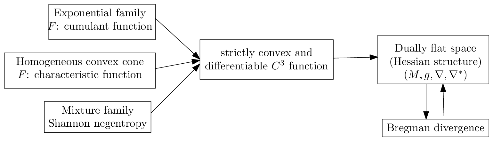
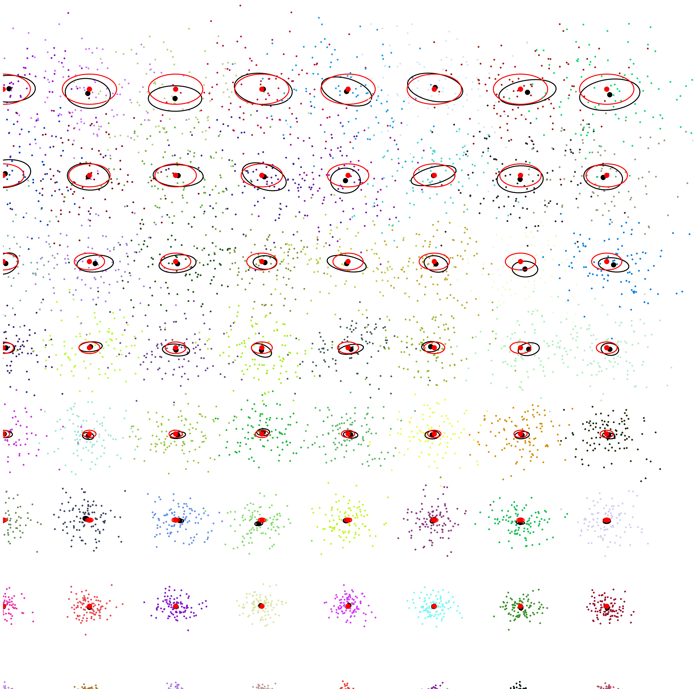
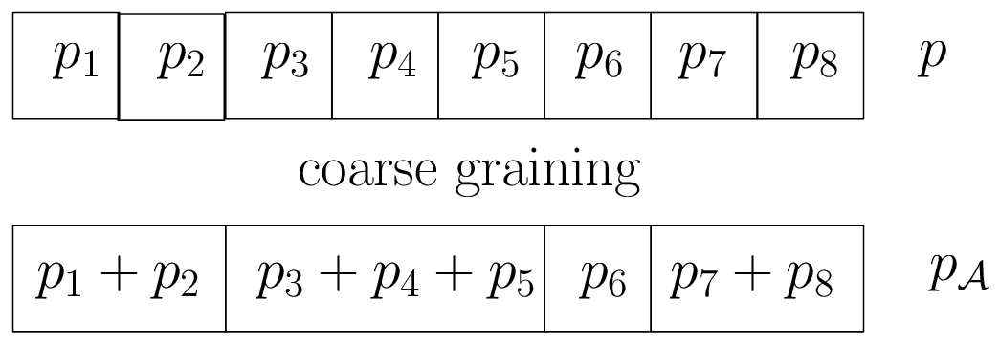

<!-- page 18 -->

图 7：与光滑且严格凸生成器相关的常见对偶平坦空间。

### 3.8 Hessian $\alpha$-几何：$(M, F, \alpha) \equiv (M, {}^F g, {}^F\nabla^{-\alpha}, {}^F\nabla^{\alpha}$ { .tutor-section }

对偶平坦流形也被称为具有由凸势函数 $F$ 诱导的 Hessian 结构 [120] 的流形。由于我们构建了两个对偶仿射联络 ${}^{B_F}\nabla = {}^F\nabla$ 与 ${}^{B_F}\nabla^* = {}^F\nabla^* = {}^{F^*}\nabla$，我们可以如下构造一族 $\alpha$-几何：

$$
{}^F g_{ij}(\theta) = \partial_i \partial_j F(\theta), \quad {}^F g^{ij}(\eta) = \partial^i \partial^j F(\eta), \tag{75}
$$

以及

$$
{}^F\Gamma^\alpha_{ijk}(\theta) = \frac{1-\alpha}{2}\partial_i\partial_j\partial_k F(\theta), \quad {}^F\Gamma^{\alpha\ *}_{ijk}(\eta) = {}^{F^*}\Gamma^\alpha_{ijk}(\eta) = \frac{1+\alpha}{2}\partial^i\partial^j\partial^k F^*(\eta). \tag{76}
$$

因此当 $\alpha = \pm 1$ 时，Hessian $\alpha$-几何是对偶平坦的。

我们现在考虑由参数统计模型诱导的信息流形。

### 3.9 参数概率分布族的期望 $\alpha$-流形：$(\mathcal{P}, {}_{\mathcal{P}}g, {}_{\mathcal{P}}\nabla^{-\alpha}, {}_{\mathcal{P}}\nabla^{\alpha})$ { .tutor-section }

非正式地说，期望流形是建立于正则参数分布族上的信息流形。在文献 [140] 中，它有时被称为“期望”流形或“期望”几何，因为度量张量 $g$ 与 Amari-Chentsov 立方张量 $C$ 的分量是用统计期望 $E_\cdot[\cdot]$ 表示的。

设 $\mathcal{P}$ 为一族参数概率分布：

$$
\mathcal{P} := \{p_\theta(x)\}_{\theta\in\Theta}, \tag{77}
$$

其中 $\theta$ 属于开参数空间 $\Theta$。该族的阶数是其参数空间的维数。我们将似然函数$^{11}$ $L(\theta; x) := p_\theta(x)$ 定义为 $\theta$ 的函数，其对应的对数似然函数为：

$$
l(\theta; x) := \log L(\theta; x) = \log p_\theta(x). \tag{78}
$$

得分向量：

$$
s_\theta = \nabla_\theta l = (\partial_i l)_i, \tag{79}
$$

它表示了似然函数 $\partial_i l {:=} \frac{\partial}{\partial\theta_i}l(\theta; x)$ 的敏感性。

对于 $\dim(\Theta) = D$，$D \times D$ 的 Fisher 信息矩阵（FIM）定义为：

$$
{}_{\mathcal{P}}I(\theta) := E_\theta\left[\partial_i l \partial_j l\right]_{ij} \succeq 0, \tag{80}
$$

其中 $\succeq$ 表示 Löwner 序。也就是说，对于两个对称正定矩阵 $A$ 和 $B$，$A \succeq B$ 当且仅当矩阵 $A-B$ 是半正定的。对于正则模型 [25]，FIM 是正定的：${}_{\mathcal{P}}I(\theta) \succ 0$，其中 $A \succ B$ 当且仅当矩阵 $A-B$ 是正定的。

---

$^{11}$似然函数是关于正比例因子模定义的函数等价类。

18

<!-- page 19 -->

FIM 在样本空间 $\mathcal{X}$ 的重参数化下不变，而在参数空间 $\Theta$ 的重参数化下协变，见 [25]。也就是说，令 $\bar{p}(x;\eta) = p(\theta(\eta); x)$。那么我们有：

$$
\bar{I}(\eta) = \left[\frac{\partial\theta_i}{\partial\eta_j}\right]_{ij}^\top I(\theta(\eta)) \left[\frac{\partial\theta_i}{\partial\eta_j}\right]_{ij}.
\tag{81}
$$

矩阵 $J_{ij} = \left[\frac{\partial\theta_i}{\partial\eta_j}\right]_{ij}$ 为 Jacobian 矩阵。

**例 1.** *例如，考虑如下分布族*

$$
\mathcal{N} = \left\{p(x; \mu, \sigma) = \frac{1}{\sqrt{2\pi}\sigma} \exp(-\frac{(x-\mu)^2}{2\sigma^2})) \ : \ (\mu, \sigma) \in \mathbb{R} \times \mathbb{R}_{++}\right\}
\tag{82}
$$

*一元正态分布。二维参数向量为 $\lambda = (\mu, \sigma)$，其中 $\mu$ 表示均值，$\sigma$ 表示标准差。正态族的另一种常见参数化为 $\lambda' = (\mu, \sigma^2)$。$\lambda'$ 参数化自然地推广到 $d$-variance 正态分布，其中 $\lambda' = (\mu, \Sigma)$，$\Sigma$ 表示协方差矩阵（当 $d=1$ 时，$\Sigma = \sigma^2$）。对于多元正态分布，$\lambda$ 参数化可理解为 $\lambda = (\mu, L^\top)$，其中 $L^\top$ 为 Cholesky 分解中的上三角矩阵（当 $d=1$ 时，$L^\top = \sigma$）。我们在 $\lambda$ 参数化与 $\lambda'$ 参数化下有如下 Fisher 信息矩阵：*

$$
I_\lambda(\lambda) = \left[\begin{array}{cc} \frac{1}{\lambda_2^2} & 0 \\ 0 & \frac{2}{\lambda_2^2} \end{array}\right] = \left[\begin{array}{cc} \frac{1}{\sigma^2} & 0 \\ 0 & \frac{2}{\sigma^2} \end{array}\right]
\tag{83}
$$

*以及*

$$
I_{\lambda'}\left(\lambda'\right) = \left[\begin{array}{cc} \frac{1}{\lambda_2} & 0 \\ 0 & \frac{1}{2\lambda_2^2} \end{array}\right] = \left[\begin{array}{cc} \frac{1}{\sigma^2} & 0 \\ 0 & \frac{1}{2\sigma^4} \end{array}\right]
\tag{84}
$$

*由于 FIM 是协变的，我们得到如下变换关系：*

$$
I_{\lambda'}\left(\lambda'\right) = J_{\lambda,\lambda'}^\top I_\lambda\left(\lambda\left(\lambda'\right)\right) J_{\lambda,\lambda'},
\tag{85}
$$

*其中*

$$
J_{\lambda',\lambda} = \left[\begin{array}{cc} 1 & 0 \\ 0 & 2\sigma \end{array}\right]
\tag{86}
$$

*于是我们可以验证*

$$
I_\lambda(\lambda) = \left[\begin{array}{cc} 1 & 0 \\ 0 & 2\sigma \end{array}\right] \left[\begin{array}{cc} \frac{1}{\sigma^2} & 0 \\ 0 & \frac{1}{2\sigma^4} \end{array}\right] \left[\begin{array}{cc} 1 & 0 \\ 0 & 2\sigma \end{array}\right] = \left[\begin{array}{cc} \frac{1}{\sigma^2} & 0 \\ 0 & \frac{2}{\sigma^2} \end{array}\right]
\tag{87}
$$

*注意无穷小长度元是不变的：* $\mathrm{d}s_\lambda = \mathrm{d}s_{\lambda'}$。

作为推论，注意到若度量张量 $g$ 可写为 $J_{\lambda,\lambda'}^\top J_{\lambda,\lambda'}$，则我们可以在任何其他坐标系中识别出 Euclidean 度量。例如，由具有可分离势函数的双平坦空间诱导的 Riemannian 几何是 Euclidean 的 [49]。

在统计学中，FIM 在无偏估计量可达到的精度方面发挥作用。对于任意无偏估计量，其方差的 Cramér-Rao 下界 [71] 为：

$$
\mathrm{Var}_\theta[\hat{\theta}_n(X)] \succeq \frac{1}{n}I^{-1}(\theta).
\tag{88}
$$

图 8 展示了单变量分布的 Cramér-Rao 下界（CRLB）：在正态参数上半空间的规则网格位置 $(\mu, \sigma)$ 处，我们重复 200 次运行（试验），利用 MLE 在 100 个独立同分布样本 $x_1, \ldots, x_n \sim N(\mu, \sigma)$ 上估计正态参数 $(\widehat{\mu}, \widehat{\sigma})$。针对试验次数计算样本均值与样本协方差矩阵，并以背景椭圆形式显示。Fisher

19

<!-- page 20 -->

Figure 8: Cramér-Rao下界可视化：红色椭圆展示了网格位置处正态分布的Fisher信息矩阵。黑色椭圆是样本协方差矩阵，以样本均值为中心，通过对网格的正态参数重复200次运行、每次采样100个iid变量计算得到。

<!-- page 21 -->

信息矩阵在网格位置处被绘制为红色椭圆：由于参数 $\mu$ 和 $\sigma$ 是正交的（对角 FIM），红色椭圆的半轴与坐标系平行。对于 MLE 估计量的样本协方差矩阵，这一点不再成立，并且样本协方差矩阵的中心偏离了网格位置。

我们报告两种重要的通用参数化概率分布族的 FIM 表达式：(1) 指数族（及其突出的多元正态族），以及 (2) 混合族。

**例 2**（指数族 $\mathcal{E}$ 的 FIM）。*指数族 [84] $\mathcal{E}$ 针对充分统计量向量 $t(x) = (t_1(x), \ldots, t_D(x))$ 和辅助承载测度 $k(x)$ 由以下典范密度定义：*

$$\mathcal{E} = \left\{ p_\theta(x) = \exp\left(\sum_{i=1}^D t_i(x)\theta_i - F(\theta) + k(x)\right) \text{ 满足 } \theta \in \Theta \right\}, \qquad (89)$$

其中 $F$ 是严格凸的累积量函数（也称为对数归一化器、对数配分函数或统计力学中的自由能）。指数族包括高斯族、Gamma 和 Beta 族、概率单纯形 $\Delta$ 等。指数族的 FIM 由下式给出：

$${}_{\mathcal{E}}I(\theta) = \mathrm{Cov}_{X\sim p_\theta(x)}[t(x)] = \nabla^2 F(\theta) = (\nabla^2 F^*(\eta))^{-1} \succ 0. \qquad (90)$$

*向量类型之外的自然参数也可用于指数族密度的典范分解：例如，我们可以使用矩阵类型来定义零中心多元高斯族或 Wishart 族，使用复数来定义复值高斯分布族，等等。然后，我们将式 89 中的项 $\sum_{i=1}^D t_i(x)\theta_i$ 替换为针对自然参数类型定义的内积（例如，向量的点积、矩阵的乘积迹，等等）。此外，自然参数可以是复合类型：例如，多元高斯分布可以写成 $\theta = (\theta_v, \theta_M)$，其中 $\theta_v$ 是向量部分，$\theta_M$ 是矩阵部分，参见 [84]。*

令 $\Sigma = [\sigma_{ij}]$ 表示协方差矩阵，$\Sigma^{-1} = [\sigma^{ij}]$ 表示多元正态分布的精度矩阵。多元高斯分布 [114, 121] $N(\mu, \Sigma)$ 的 Fisher 信息矩阵由下式给出

$$
I(\mu,\Sigma)=
\begin{array}{cc}
 & \begin{array}{cc} \mu & \Sigma=[\sigma_{ij}] \end{array}\\
\begin{array}{c} \mu \\[4pt] \Sigma=[\sigma_{kl}] \end{array} &
\left[\begin{array}{cc}
\sigma^{ij} & 0\\
0 & \sigma^{il}\sigma^{jk}+\sigma^{ik}\sigma^{jl}
\end{array}\right]
\end{array}
\qquad (91)
$$

*注意右下块矩阵是一个维度为 $d \times d \times d \times d$ 的 $4D$ 张量。FIM 中的零子块矩阵表明参数 $\mu$ 和 $\Sigma$ 彼此正交。特别地，当 $d=1$ 时，由于 $\sigma^{11}=\frac{1}{\sigma^2}$，我们恢复了单变量高斯的 Fisher 信息矩阵：*

$$
I(\mu, \Sigma) = \left[\begin{array}{cc} \frac{1}{\sigma^2} & 0 \\ 0 & \frac{1}{2\sigma^4} \end{array}\right] \qquad (92)
$$

关于使用其他典范参数化（指数族的自然/期望参数）的高斯分布 FIM，我们参见 [63]。

**例 3**（混合族 $\mathcal{M}$ 的 FIM）。*混合族针对 $D+1$ 个函数 $F_1, \ldots, F_D$ 和 $C$ 定义如下：*

$$\mathcal{M} = \left\{ p_\theta(x) = \sum_{i=1}^D \theta_i F_i(x) + C(x) \text{ 满足 } \theta \in \Theta \right\}, \qquad (93)$$

其中函数 $\{F_i(x)\}_i$ 在公共支撑 $\mathcal{X}$ 上线性无关，并满足 $\int F_i(x)\mathrm{d}\mu(x) = 0$。函数 $C$ 满足 $\int C(x)\mathrm{d}\mu(x) = 1$。混合族包括具有规定分量分布的统计混合以及概率单纯形 $\Delta$。混合族的 FIM 由下式给出：

$${}_{\mathcal{M}}I(\theta) = E_{X\sim p_\theta(x)}\left[\frac{F_i(x)F_j(x)}{(p_\theta(x))^2}\right] = \int_{\mathcal{X}} \frac{F_i(x)F_j(x)}{p_\theta(x)}\mathrm{d}\mu(x) \succ 0. \qquad (94)$$

<!-- page 22 -->

具有指定分量分布（即 D + 1 个高斯密度的凸权重组合）的高斯混合模型（GMM）族构成一个混合族 [93]。

注意，离散分布的概率单纯形既可以被建模为指数族，也可以被建模为混合族 [8]。

期望 α-几何由期望对偶 ±α-联络构建。Fisher“信息度量”张量由 FIM 构建如下：

$${}_{\mathcal{P}}g(u,v) := (u)_\theta^\top \, {}_{\mathcal{P}}I(\theta) \, (v)_\theta \tag{95}$$

期望指数联络和期望混合联络由下式给出

$${}^{e}_{\mathcal{P}}\nabla := E_\theta\left[(\partial_i\partial_j l)(\partial_k l)\right], \tag{96}$$

$${}^{m}_{\mathcal{P}}\nabla := E_\theta\left[(\partial_i\partial_j l + \partial_i l\partial_j l)(\partial_k l)\right]. \tag{97}$$

对偶结构记为 $(\mathcal{P}, {}_{\mathcal{P}}g, {}^{m}_{\mathcal{P}}\nabla, {}^{e}_{\mathcal{P}}\nabla)$，其中 Amari-Chentsov 三次张量称为偏度张量：

$$C_{ijk} := E_\theta\left[\partial_i l \partial_j l \partial_k l\right]. \tag{98}$$

由此我们可以构建一族期望信息 α-流形：

$$\left\{(\mathcal{P}, {}_{\mathcal{P}}g, {}_{\mathcal{P}}\nabla^{-\alpha}, {}_{\mathcal{P}}\nabla^{+\alpha})\right\}_{\alpha\in\mathbb{R}}, \tag{99}$$

其中

$${}_{\mathcal{P}}\Gamma^\alpha{}_{ij,k}(\theta) := E_\theta\left[\partial_i\partial_j l \partial_k l\right] + \frac{1-\alpha}{2}C_{ijk}(\theta), \tag{100}$$

$$= E_\theta\left[\left(\partial_i\partial_j l + \frac{1-\alpha}{2}\partial_i l\partial_j l\right)(\partial_k l)\right]. \tag{101}$$

Levi-Civita 度量联络可如下恢复：

$${}_{\mathcal{P}}\bar{\nabla} = \frac{{}_{\mathcal{P}}\nabla^{-\alpha} + {}_{\mathcal{P}}\nabla^{\alpha}}{2} = {}^{\text{LC}}_{\mathcal{P}}\nabla := {}^{\text{LC}}\nabla({}_{\mathcal{P}}g) \tag{102}$$

α-Riemann-Christoffel 曲率张量为：

$${}_{\mathcal{P}}R_{ijkl} = \partial_i\Gamma^\alpha_{jk,l} - \partial_j\Gamma^\alpha_{ik,l} + g^{rs}\left(\Gamma^\alpha_{ik,r}\Gamma^\alpha_{js,l} - \Gamma^\alpha_{jk,r}\Gamma^\alpha_{is,l}\right), \tag{103}$$

其中 $R^\alpha_{ijkl} = -R^{-\alpha}_{ijkl}$。我们验证期望 ±α-联络与度量相耦合：$\partial_i g_{jk} = \Gamma^\alpha_{ij,k} + \Gamma^{-\alpha}_{ik,j}$。

对于配备对偶指数/混合联络的指数族 $\mathcal{E}$ 或混合族 $\mathcal{M}$，我们得到对偶平坦流形（Bregman 几何）。

确实，对于指数/混合族，容易验证 $\nabla^e$ 和 $\nabla^m$ 的 Christoffel 符号消失：

$${}^e_{\mathcal{M}}\Gamma = {}^m_{\mathcal{M}}\Gamma = {}^e_{\mathcal{E}}\Gamma = {}^m_{\mathcal{E}}\Gamma = 0. \tag{104}$$

### 3.10 统计不变性的判据 { .tutor-section }

迄今为止，我们已经解释了如何从一对共轭联络构建信息流形（或信息 α-流形）。随后我们介绍了获得这样一对共轭联络的两种方法：（1）从参数散度出发，或（2）使用预先定义的期望指数/混合联络。我们现在提出以下问题：哪种信息流形在统计学中是有意义的？我们可以将问题细化如下：

- 哪些度量张量 $g$ 在统计学中是有意义的？

<!-- page 23 -->

图 9：当且仅当 $D(\theta_{\mathcal{A}} : \theta'_{\mathcal{A}}) \leq D(\theta : \theta')$ 时，一个散度满足信息单调性。此处，参数 $\theta$ 表示一个离散分布。

- 哪些仿射联络 $\nabla$ 在统计学中有意义？
- 哪些统计散度在统计学中有意义（从中我们可以得到度量张量和对偶联络）？

根据定义，一个*不变度量张量* $g$ 应在重要的称为马尔可夫嵌入的*统计映射*下保持内积。非正式地说，我们将 $\Delta_D$ 嵌入到 $\Delta_{D'}$ 中，其中 $D' > D$，且诱导的度量应保持不变（见 [8]，第 62 页）。

**定理 8**（Fisher 信息度量的唯一性 [26, 129]）。*Fisher 信息度量是在马尔可夫嵌入下唯一的不变度量张量，至多相差一个缩放常数。*

一个 $D$ 维参数（离散）散度满足*信息单调性*[^12]，当且仅当：

$$D(\theta_{\mathcal{A}} : \theta'_{\mathcal{A}}) \leq D(\theta : \theta') \qquad (105)$$

对于 $[D] = \{1, \ldots, D\}$（$\mathcal{A}$-归并 [34]）的任意*粗粒化划分* $\mathcal{A} = \{\mathcal{A}_i\}_{i=1}^E$，其中 $E \leq D$，且 $\theta_{\mathcal{A}}^i = \sum_{j\in\mathcal{A}_i} \theta^j$（$i \in [E]$）。这种粗粒化的概念在图 9 中做了说明。

一个*可分离散度* $D(\theta_1 : \theta_2)$ 是指可以表示为初等*标量散度* $d(x : y)$ 之和的散度：

$$D(\theta_1 : \theta_2) := \sum_i d(\theta_1^i : \theta_2^i). \qquad (106)$$

例如，平方欧氏距离 $D(\theta_1 : \theta_2) = \sum_i (\theta_1^i - \theta_2^i)^2$ 对于标量欧氏散度 $d(x : y) = (x - y)^2$ 而言是一个可分离散度。欧氏距离 $D_E(\theta_1, \theta_2) = \sqrt{\sum_i (\theta_1^i - \theta_2^i)^2}$ 则*不是*可分离的，因为存在平方根运算。

当 $D > 1$ 时，唯一不变且*可分解的*散度是 $f$-散度 [56]，其由凸泛函生成元 $f$ 定义：

$$I_f(\theta : \theta') := \sum_{i=1}^D \theta_i f\left(\frac{\theta'_i}{\theta_i}\right) \geq f(1), \quad f(1) = 0 \qquad (107)$$

*标准 $f$-散度*由满足 $f'(1) = 0$（选取 $f_\lambda(u) := f(u) + \lambda(u-1)$，因为 $I_{f_\lambda} = I_f$）且 $f''(u) = 1$（尺度固定）的 $f$-生成元定义。

统计 $f$-散度在样本空间的一对一/充分统计量变换 $y = t(x)$ 下是*不变的* [108]：$p(x;\theta) = q(y(x);\theta)$：

$$\begin{array}{rcl} I_f[p(x;\theta) : p(x;\theta')] & = & \displaystyle\int_{\mathcal{X}} p(x;\theta) f\left(\frac{p(x;\theta')}{p(x;\theta)}\right) \mathrm{d}\mu(x), \\ & = & \displaystyle\int_{\mathcal{Y}} q(y;\theta) f\left(\frac{q(y;\theta')}{q(y;\theta)}\right) \mathrm{d}\mu(y), \\ & = & I_f[q(y;\theta) : q(y;\theta')]. \end{array}$$

[^12]: 这一性质可重命名为“距离粗分箱不等式性质”。

<!-- page 24 -->

参考对偶性的对偶 $f$-散度为

$$I_f{}^*[p(x;\theta):p(x;\theta')] = I_f[p(x;\theta'):p(x;\theta)] = I_{f^\diamond}[p(x;\theta):p(x;\theta')] \tag{108}$$

对于标准共轭 $f$-生成元（菱形 $f^\diamond$ 生成元），其表达式为：

$$f^\diamond(u) := uf\left(\frac{1}{u}\right). \tag{109}$$

可以验证，当 $f$ 为标准时，$f^\diamond$ 也是一个标准 $f$-生成元。

下面我们列举一些常见的 $f$-散度例子：

- $\alpha$-散度族：

  $$I_\alpha[p:q] := \frac{4}{1-\alpha^2}\left(1-\int p^{\frac{1-\alpha}{2}}(x)q^{\frac{1+\alpha}{2}}(x)\mathrm{d}\mu(x)\right), \tag{110}$$

  由 $f(u)=\frac{4}{1-\alpha^2}(1-u^{\frac{1+\alpha}{2}})$ 得到。$\alpha$-散度包括：

  - 当 $\alpha \to 1$ 时的 Kullback-Leibler：

    $$\mathrm{KL}[p:q] = \int p(x)\log\frac{p(x)}{q(x)}\mathrm{d}\mu(x), \tag{111}$$

    对应 $f(u)=-\log u$。

  - 当 $\alpha \to -1$ 时的反向 Kullback-Leibler：

    $$\mathrm{KL}^*[p:q] = \int q(x)\log\frac{q(x)}{p(x)}\mathrm{d}\mu(x) = \mathrm{KL}[q:p], \tag{112}$$

    对应 $f(u)=u\log u$。

  - 对称平方 Hellinger 散度：

    $$H^2[p:q] = \int(\sqrt{p(x)}-\sqrt{q(x)})^2\mathrm{d}\mu(x), \tag{113}$$

    对应 $f(u)=(\sqrt{u}-1)^2$（即 $\alpha=0$ 的情形）。

  - Pearson 和 Neyman 卡方散度 [90] 等。

- Jensen-Shannon 散度：

  $$\mathrm{JS}[p:q] = \frac{1}{2}\int\left(p(x)\log\frac{2p(x)}{p(x)+q(x)} + q(x)\log\frac{2q(x)}{p(x)+q(x)}\right)\mathrm{d}\mu(x), \tag{114}$$

  对应 $f(u)=-(u+1)\log\frac{1+u}{2}+u\log u$。

- 全变差

  $$\mathrm{TV}[p:q] = \frac{1}{2}\int|p(x)-q(x)|\mathrm{d}\mu(x), \tag{115}$$

  对应 $f(u)=\frac{1}{2}|u-1|$。全变差距离是唯一的度量 $f$-散度。

$f$-拓扑是由开 $f$-球生成的拓扑，即关于 $f$-散度的开球。若拓扑 $T$ 包含拓扑 $T'$ 的所有开集，则称 $T$ 比 $T'$ 更强。Csiszar 定理 [33] 指出，当 $|\alpha|<1$ 时，$\alpha$-拓扑与全变差度量距离诱导的拓扑等价。否则，$\alpha$-拓扑比 TV 拓扑更强。

下面我们阐述 $f$ 散度的一个重要特征：

<!-- page 25 -->

**定理 9.** $f$-散度在样本空间 $\mathcal{X}$ 的微分同胚 $m(x)$ 下保持不变：设 $Y = m(X)$，且 $X_i \sim p_i$ 并满足 $Y_i = m(X_i) \sim q_i$。则我们有 $I_f[q_1 : q_2] = I_f[p_1 : p_2]$。

**例 4.** 考虑指数分布与瑞利分布，它们之间的关系如下：
$$X \sim \mathrm{Exponential}(\lambda) \Leftrightarrow Y = m(X) = \sqrt{X} \sim \mathrm{Rayleigh}\left(\sigma = \frac{1}{\sqrt{2\lambda}}\right).$$

指数分布的密度定义为
$$p_\lambda(x) = \lambda \exp(-\lambda x) \text{ 其支撑集为 } \mathcal{X} = [0, \infty),$$

而瑞利分布的密度定义为
$$q_\sigma(x) = \frac{x}{\sigma^2} \exp\left(-\frac{x^2}{2\sigma^2}\right) \text{ 其支撑集为 } \mathcal{X} = [0, \infty).$$

我们有
$$D_{\mathrm{KL}}\left[q_{\sigma_1} : q_{\sigma_2}\right] = \log\left(\frac{\sigma_2^2}{\sigma_1^2}\right) + \frac{\sigma_1^2 - \sigma_2^2}{\sigma_2^2}.$$

由此可得
$$
\begin{aligned}
D_{\mathrm{KL}}\left[p_{\lambda_1} : p_{\lambda_2}\right] &= D_{\mathrm{KL}}\left[q_{\frac{1}{\sqrt{2\lambda_1}}} : q_{\frac{1}{\sqrt{2\lambda_2}}}\right] \\
&= \log\frac{2\lambda_1}{2\lambda_2} + 2\lambda_2\left(\frac{1}{2\lambda_1} - \frac{1}{2\lambda_2}\right) \\
&= \log\left(\frac{\lambda_1}{\lambda_2}\right) + \frac{\lambda_2}{\lambda_1} - 1.
\end{aligned}
$$

一个显著的性质是，不变标准 $f$-散度可导出 Fisher 信息矩阵与 $\alpha$-联络。事实上，不变标准 $f$-散度在无穷小意义下与 Fisher 度量有如下关系：

$$\begin{array}{rcl}
I_f[p(x;\theta) : p(x;\theta+\mathrm{d}\theta)] &=& \displaystyle\int p(x;\theta)f\left(\frac{p(x;\theta+\mathrm{d}\theta)}{p(x;\theta)}\right)\mathrm{d}\mu(x) \qquad (116) \\[1em]
&\stackrel{\Sigma}{=}& \displaystyle\frac{1}{2}Fg_{ij}(\theta)\mathrm{d}\theta^i\mathrm{d}\theta^j \qquad (117)
\end{array}$$

分布参数族 $\mathcal{P}$ 上的*统计参数散度* $D$ 可导出一个等价的*参数散度* $_{\mathcal{P}}D$：
$$_{\mathcal{P}}D(\theta : \theta') := D[p(x;\theta) : p(x;\theta')]. \qquad (118)$$

于是我们可以构建由该参数散度 $_{\mathcal{P}}D(\cdot:\cdot)$ 诱导的信息流形。当 $_{\mathcal{P}}D(\cdot:\cdot) = I_f[\cdot:\cdot]$ 时，所诱导的 $\pm 1$-散度联络 $^{I_f}_{\mathcal{P}}\nabla := \,^{\mathcal{P}I_f}\nabla$ 与 $^{(I_f)^*}_{\mathcal{P}}\nabla := \,^{\mathcal{P}I_f^*}\nabla$ 正是*期望* $\pm\alpha$-*联络*（由指数/混合联络导出），且满足：
$$\alpha = 2f'''(1) + 3. \qquad (119)$$

因此，与不变统计散度所诱导的联络相一致的不变联络正是期望 $\alpha$-联络。注意，期望 $\alpha$-联络的曲率既依赖于 $\alpha$，也依赖于所考虑的统计模型 [64]。

25

<!-- page 26 -->

### 3.11 Fisher-Rao 期望黎曼流形：$(\mathcal{P}, {}_\mathcal{P}g)$ { .tutor-section }

从历史上看，对正则参数分布族 $\mathcal{P} = \{p_\theta(x)\}_\theta$ 的首次流形建模，是将 Fisher 信息矩阵（FIM）视为黎曼度量张量 $g$（见 [53, 111]），其形式为：

$$
{}_\mathcal{P}I(\theta) := E_{p_\theta}\left[\partial_i l \partial_j l\right],
\tag{120}
$$

其中 $\partial_i l {=:} \frac{\partial}{\partial \theta_i} \log p(x;\theta)$。在某些正则性条件下，我们可以将 FIM 重写为：

$$
{}_\mathcal{P}I(\theta) := -E_{p_\theta}\left[\partial_i \partial_j l\right].
\tag{121}
$$

黎曼测地度量距离 $D_\rho$ 通常被称为 Fisher-Rao 距离：

$$
D_\rho(p_{\theta_1}, p_{\theta_2}) = \int_0^1 \sqrt{\dot{\gamma}(t)^\top g_{\gamma(t)} \dot{\gamma}(t)} \mathrm{d}t,
\tag{122}
$$

其中 $\gamma$ 表示经过 $\gamma(0) = \theta_1$ 和 $\gamma(1) = \theta_2$ 的测地线。Fisher-Rao 距离也可以定义为最短路径长度：$D_\rho(p_{\theta_1}, p_{\theta_2}) = \inf_\gamma \int_0^1 \sqrt{\dot{\gamma}(t)^\top g_{\gamma(t)} \dot{\gamma}(t)} \mathrm{d}t$。

**定义 6**（Fisher-Rao 距离）。*Fisher-Rao 距离是 Fisher-Riemann 流形 $(\mathcal{P}, {}_\mathcal{P}g)$ 的测地度量距离。*

让我们给出一些 Fisher-Riemann 流形的例子：

- 分类分布族（在 [8] 中也称为有限离散分布）的 Fisher-Riemann 流形等价于球面几何 [58]（球面流形）。
- 二元位置-尺度分布族的 Fisher-Riemann 流形等价于双曲几何（双曲流形）。
- 位置分布族的 Fisher-Riemann 流形等价于欧几里得几何（欧几里得流形）。

黎曼几何的第一基本形式为 $\mathrm{d}s^2 = \langle \mathrm{d}x, \mathrm{d}x \rangle \stackrel{\Sigma}{=} g_{ij} \mathrm{d}x^i \mathrm{d}x^j$，其中 $\mathrm{d}s$ 表示线元。

将这种黎曼几何结构应用于参数概率分布族的做法最早由 Harold Hotelling [53] 提出（在 1929 年的一份手写笔记中，后重排印于 [123]），随后由 C. R. Rao [111] 独立提出（1945 年，重印于 [110]）。类似地，Jeffreys [55] 建议使用流形的体积元作为不变先验：即 1946 年提出的、以其名字命名的 Jeffreys 先验。

注意，对于概率分布的参数族 $\mathcal{P}$，黎曼结构 $(\mathcal{P}, {}_\mathcal{P}g)$ 与由对称 $f$-散度（如平方 Hellinger 散度）诱导的自对偶共轭联络流形 $(\mathcal{P}, {}_\mathcal{P}g, {}_\mathcal{P}^{I_f}\nabla, {}_\mathcal{P}^{I_f}\nabla^*)$ 是一致的。

指数映射 $\exp_p$ 在点 $p \in M$ 处提供了一种将向量 $v \in T_p$ 映射回点 $\exp_p(v) \in M$ 的方式（在良定义的情况下）。指数映射可用于参数化一条测地线 $\gamma$，满足 $\gamma(0) = p$ 且单位切向量 $\dot{\gamma}(0) = v$：$t \mapsto \exp_p(tv)$。对于测地完备的流形，指数映射处处有定义。

### 3.12 单调 $\alpha$-嵌入与度量规范自由度 { .tutor-section }

FIM 的另一个常见的数学等价表达式 [25] 由下式给出：

$$
I_{ij}(\theta) := 4 \int \partial_i\sqrt{p(x;\theta)}\partial_j\sqrt{p(x;\theta)}\mathrm{d}\mu(x).
\tag{123}
$$

FIM 的这种形式非常适合用来证明 FIM 始终是一个半正定矩阵 [25]（$I(\theta) \succeq 0$）。结果表明，我们可以利用参数族的 $\alpha$-嵌入 [139] 来定义一族 FIM 的等价表示。

<!-- page 27 -->

首先，我们定义密度的 $\alpha$-表示 $l^{\alpha}(x;\theta) := k_{\alpha}(p(x;\theta))$ 如下：

$$k_{\alpha}(u) := \left\{ \begin{array}{ll} \frac{2}{1-\alpha}u^{\frac{1-\alpha}{2}}, & \text{若 } \alpha \neq 1, \\ \log u, & \text{若 } \alpha = 1. \end{array} \right. \qquad (124)$$

函数 $l^{\alpha}(x;\theta)$ 被称为 $\alpha$-似然函数。FIM 的 $\alpha$-表示（简称为 $\alpha$-FIM）可表示为：

$$I^{\alpha}_{ij}(\theta) := \int \partial_i l^{\alpha}(x;\theta) \partial_j l^{-\alpha}(x;\theta) \mathrm{d}\mu(x). \qquad (125)$$

我们可以将 $\alpha$-FIM 紧凑地重写为 $I^{\alpha}_{ij}(\theta) = \int \partial_i l^{\alpha} \partial_j l^{-\alpha} \mathrm{d}\mu(x)$。展开 $\alpha$-FIM，我们得到：

$$I^{\alpha}_{ij}(\theta) = \left\{ \begin{array}{ll} \frac{1}{1-\alpha^2} \int \partial_i p(x;\theta)^{\frac{1-\alpha}{2}} \partial_j p(x;\theta)^{\frac{1+\alpha}{2}} \mathrm{d}\mu(x) & \text{当 } \alpha \neq \pm 1 \\ \int \partial_i \log p(x;\theta) \partial_j p(x;\theta) \mathrm{d}\mu(x) & \text{当 } \alpha \in \{-1, 1\} \end{array} \right. \qquad (126)$$

密度的 $1$-表示被称为对数表示（或 $e$-表示），$-1$-表示为混合表示（或 $m$-表示），而其 $0$-表示被称为平方根表示。$\alpha$-得分向量组 $B_{\alpha} := \{\partial_i l^{\alpha}\}_i$ 被解释为 $\alpha$-基 $B_{\alpha}$ 的切基向量。因此，FIM 与 $\alpha$ 无关。

此外，在温和条件 [25] 下，FIM 的 $\alpha$-表示可以重写为：

$$I^{\alpha}_{ij}(\theta) = -\frac{2}{1+\alpha} \int p(x;\theta)^{\frac{1+\alpha}{2}} \partial_i \partial_j l^{\alpha}(x;\theta) \mathrm{d}\mu(x). \qquad (127)$$

由于我们有：

$$\partial_i \partial_j l^{\alpha}(x;\theta) = p^{\frac{1-\alpha}{2}} \left( \partial_i \partial_j l + \frac{1-\alpha}{2} \partial_i l \partial_j l \right), \qquad (128)$$

可得：

$$I^{\alpha}_{ij}(\theta) = -\frac{2}{1+\alpha} \left( -I_{ij}(\theta) + \frac{1-\alpha}{2} I_{ij} \right) = I_{ij}(\theta). \qquad (129)$$

注意，当 $\alpha = 1$ 时，我们得到 FIM 的等价表达式（在温和条件下）：

$$I^{1}_{ij}(\theta) = -E[\nabla^2 \log p(x;\theta)]. \qquad (130)$$

特别地，当该族为具有累积量函数 $F(\theta)$ 的指数族 [84]（满足温和条件）时，我们有：

$$I(\theta) = \nabla^2 F(\theta). \qquad (131)$$

Zhang [139, 69] 进一步讨论了在 $\alpha$-几何中被混淆的表示/参考对偶性。

黎曼度量张量的规范自由度已在信息几何的 $(\rho,\tau)$-单调嵌入框架 [139, 98, 69] 下得到研究：设 $\rho$ 和 $\tau$ 为两个严格递增函数，$f$ 为一个严格凸函数，满足 $f'(\rho(u)) = \tau(u)$（其中 $f^*$ 表示其凸共轭）。注意，严格递增的实值一元函数集合在群运算取为函数复合 $\circ$ 时具有群结构。我们记 $p_{\theta}(x) = p(x;\theta)$。

$(\rho,\tau)$-度量张量 $~^{\rho,\tau}g(\theta) = [~^{\rho,\tau}g_{ij}(\theta)]_{ij}$ 可由 $(\rho,\tau)$-散度导出：

$$D_{\rho,\tau}(p:q) = \int \left( f(\rho(p(x))) + f^*(\tau(q(x))) - \rho(p(x))\tau(q(x)) \right) \mathrm{d}\nu(x) \qquad (132)$$

27

<!-- page 28 -->

我们有：

$$\begin{aligned} {}^{\rho,\tau}g_{ij}(\theta) &= \int (\partial_i \rho(p_\theta(x))) \, (\partial_j \tau(p_\theta(x))) \, \mathrm{d}\nu(x), & (133) \\ &= \int \rho'(p_\theta(x)) \tau'(p_\theta(x)) \, (\partial_i p_\theta(x)) \, (\partial_j p_\theta(x)) \, \mathrm{d}\nu(x), & (134) \\ &= \int f''(\rho(p_\theta(x))) \, (\partial_i \rho(p_\theta(x))) \, (\partial_j \rho(p_\theta(x))) \, \mathrm{d}\nu(x), & (135) \\ &= \int (f^*)''(\tau(p_\theta(x))) \, (\partial_i \tau(p_\theta(x))) \, (\partial_j \tau(p_\theta(x))) \, \mathrm{d}\nu(x). & (136) \end{aligned}$$

### 3.13 对偶平坦空间与典范 Bregman 散度 { .tutor-section }

我们已描述了如何从任意严格凸且光滑的生成元 $F$ 构建一个对偶平坦空间：由 $F(\theta)$ 出发，利用 Riemannian Hessian 度量 $\nabla^2 F(\theta)$ 构建一个 Hessian 结构，而凸共轭 $F^*(\eta)$（通过 Legendre-Fenchel 对偶得到）则产生具有 Riemannian Hessian 度量 $\nabla^2 F^*(\eta)$ 的对偶 Hessian 结构。对偶联络 $\nabla$ 与 $\nabla^*$ 与度量相耦合。这些联络由它们各自的 Christoffel 符号 $\Gamma(\theta)=0$ 与 $\Gamma^*(\eta)=0$ 定义，表明它们是平坦联络。

反之，可以证明[8]，给定两个对偶平坦联络 $\nabla$ 与 $\nabla^*$，我们可以重构两个对偶的典范严格凸势函数 $F(\theta)$ 与 $F^*(\eta)$，使得 $\eta = \nabla F(\theta)$ 且 $\theta = \nabla F^*(\eta)$。典范散度 $A_{F,F^*}$ 产生对偶 Bregman 散度 $B_F$ 与 $B_{F^*}$。

唯一的对称 Bregman 散度是平方 Mahalanobis 距离 $M_Q^2$ [20]，其 Mahalanobis 距离定义为：

$$M_Q(\theta, \theta') = \sqrt{(\theta' - \theta)^\top Q (\theta' - \theta)}. \qquad (137)$$

令 $Q = LL^\top$ 为正定矩阵 $Q \succ 0$ 的 Cholesky 分解。众所周知，Mahalanobis 距离 $M_Q$ 等价于仿射变换点上的欧氏距离：

$$\begin{aligned} M_Q^2(\theta, \theta') &= \Delta\theta^\top Q \Delta\theta, & (138) \\ &= \Delta\theta^\top LL^\top \Delta\theta, & (139) \\ &= M_I^2(L^\top \theta, L^\top \theta') = \|L^\top \theta - L^\top \theta'\|^2, & (140) \end{aligned}$$

其中 $\Delta\theta = \theta' - \theta$。

平方 Mahalanobis 距离 $M_Q^2$ 不满足三角不等式，但 Mahalanobis 距离 $M_Q$ 是一个度量距离。我们可以按如下方式将一个 Mahalanobis 距离 $M_{Q_1}$ 转换为另一个 Mahalanobis 距离 $M_{Q_2}$，反之亦然：

*证明。* 让我们利用 Cholesky 分解将矩阵写成 $Q = L^\top L \succ 0$。于是我们有

$$M_Q(\theta_1, \theta_2) = M_I(L^\top \theta_1, L^\top \theta_2) \Leftrightarrow M_I(\theta_1, \theta_2) = M_Q((L^\top)^{-1}\theta_1, ((L^\top)^{-1}\theta_2). \qquad (141)$$

于是对于两个对称正定矩阵 $Q_1 = L_1^\top L_1 \succ 0$ 与 $Q_2 = L_2^\top L_2 \succ 0$，我们有：

$$M_{Q_1}(\theta_1, \theta_2) = M_I(L_1^\top \theta_1, L_1^\top \theta_2) = M_{Q_2}((L_2^\top)^{-1}L_1^\top \theta_1, (L_2^\top)^{-1}L_1^\top \theta_2). \qquad (142)$$

由此可得：

$$M_{Q_1}(\theta_1, \theta_2) = M_{Q_2}((L_2^\top)^{-1}L_1^\top \theta_1, (L_2^\top)^{-1}L_1^\top \theta_2). \qquad (143)$$

$$\square$$

我们有 $M_Q^2(\theta_1, \theta_2) = B_F(\theta_1, \theta_2)$（Bregman 散度），其中 $F(\theta) = \frac{1}{2}\theta^\top Q\theta$，$Q \succ 0$ 为正定矩阵。凸共轭 $F^*(\eta) = \frac{1}{2}\eta^\top Q^{-1}\eta$（其中 $Q^{-1} \succ 0$）。我们有 $\eta = Q^{-1}\theta$ 以及 $\theta = Q\eta$。我们在 *对偶 Mahalanobis 散度* $M_Q^2$ 与 $M_{Q^{-1}}^2$ 之间具有如下恒等式：

$$M_Q^2(\theta_1, \theta_2) = M_{Q^{-1}}^2(\eta_1, \eta_2). \qquad (144)$$

$$28$$

<!-- page 29 -->

当Bregman生成器基于积分时，即指数族$\mathcal{E}$的对数归一化函数$F(\theta) = \log \left(\int \exp(\langle t(x),\theta\rangle)\mathrm{d}\mu(x)\right)$，或混合族$\mathcal{M}$的负Shannon熵$F(\theta) = \int m_\theta(x) \log m(\eta)\mathrm{d}\mu(x)$，相关的Bregman散度$B_{F,\mathcal{E}}$或$B_{F,\mathcal{M}}$可以被松弛并解释为一种统计距离。我们在下面解释如何得到这种重构：

- 考虑一个阶数为$D$的指数族$\mathcal{E}$，其密度根据控制测度$\mu$定义：
$$\mathcal{E} = \{p_\theta(x) = \exp(\theta^\top t(x) - F(\theta))\ :\ \theta \in \Theta\}, \tag{145}$$
其中自然参数$\theta$和充分统计量向量$t(x)$属于$\mathbb{R}^D$。我们有基于积分的Bregman生成器：
$$F(\theta) = F_{\mathcal{E}}(p_\theta) = \log\left(\int \exp(\theta^\top t(x))\mathrm{d}\mu(x)\right), \tag{146}$$
以及对偶凸共轭
$$F^*(\eta) = -h(p_\theta) = \int p(x)\log p(x)\mathrm{d}\mu(x), \tag{147}$$
其中$h(p) = -\int p(x)\log p(x)\mathrm{d}\mu(x)$表示Shannon熵。

设$\lambda(i)$表示向量$\lambda$的第$i$个坐标，让我们计算Legendre-Fenchel散度的内积$\theta_1^\top\eta_2 = \sum_i \theta_1(i)\eta_2(i)$。我们有$\eta_2(i) = E_{p_{\theta_2}}[t_i(x)]$。利用期望$E[\cdot]$的线性性质，我们发现$\sum_i \theta_1(i)\eta_2(i) = E_{p_{\theta_2}}\left[\sum_i \theta_1(i)t_i(x)\right]$。此外，我们有$\sum_i \theta_1(i)t_i(x) = (\log p_{\theta_1}(x)) + F(\theta_1)$。因此我们有：
$$\theta_1^\top \eta_2 = E_{p_{\theta_2}}\left[\log p_{\theta_1} + F(\theta_1)\right] = F(\theta_1) + E_{p_{\theta_2}}\left[\log p_{\theta_1}\right]. \tag{148}$$

由此我们得到
\begin{align}
B_{F,\mathcal{E}}[p_{\theta_1} : p_{\theta_2}] &= F(\theta_1) + F^*(\eta_2) - \theta_1^\top \eta_2, \tag{149}\\
&= F(\theta_1) - h(p_{\theta_2}) - E_{p_{\theta_2}}[\log p_{\theta_1}] - F(\theta_1), \tag{150}\\
&= E_{p_{\theta_2}}\left[\log\frac{p_{\theta_2}}{p_{\theta_1}}\right] =: D_{\mathrm{KL}^*}[p_{\theta_1} : p_{\theta_2}], \tag{151}
\end{align}

通过将指数族密度$p_{\theta_1}$和$p_{\theta_2}$松弛为任意密度$p_1$和$p_2$，我们从由基于积分的指数族对数归一化函数诱导出的对偶平坦结构中，得到$p_1$与$p_2$之间的反向KL散度：
\begin{align}
D_{\mathrm{KL}^*}[p_1 : p_2] &= E_{p_2}\left[\log\frac{p_2}{p_1}\right] = \int p_2(x)\log\frac{p_2(x)}{p_1(x)}\mathrm{d}\mu(x), \tag{152}\\
&= D_{\mathrm{KL}}[p_2 : p_1]. \tag{153}
\end{align}

这样，我们就从$B_{F,\mathcal{E}}$中恢复出了反向Kullback-Leibler散度$D_{\mathrm{KL}^*}$。

对偶散度$D^*[p_1 : p_2] := D[p_2 : p_1]$通过交换分布参数的顺序得到。我们有：
$$D_{\mathrm{KL}^*}^*[p_1 : p_2] := D_{\mathrm{KL}^*}[p_2 : p_1] = E_{p_1}\left[\log\frac{p_1}{p_2}\right] =: D_{\mathrm{KL}}[p_1 : p_2], \tag{154}$$

并且$D_{\mathrm{KL}^*}[p_1 : p_2] = D_{\mathrm{KL}^*}^*[p_2 : p_1] = D_{\mathrm{KL}}[p_2 : p_1]$。

总之，与指数族对数归一化函数相关联的规范Legendre-Fenchel散度等价于$p_{\theta_1}$与$p_{\theta_2}$之间的统计反向Kullback-Leibler散度

<!-- page 30 -->

（或交换对应密度之间的KL散度）：$D_{\mathrm{KL}}[p_{\theta_1} : p_{\theta_2}] = B_F(\theta_2 : \theta_1) = A_{F,F^*}(\theta_2 : \eta_1)$。容易验证 $D_{\mathrm{KL}}[p_{\theta_1} : p_{\theta_2}] = B_F(\theta_2 : \theta_1)$ [14, 16]。此处，我们采取了相反的方向，由 $B_F$ 构造 $D_{\mathrm{KL}}$。

我们可以引入一个辅助承载项 $k(x)$，使得密度写作 $p_\theta(x) = \exp(\theta^\top t(x) - F(\theta) + k(x))$。于是对偶凸共轭写作 [88]：$F^*(\eta) = -h(p_\theta) + E_{p_\theta}[k(x)]$。

注意到，由于Bregman生成元在仿射项意义下定义，我们可以考虑等价的生成元 $F(\theta) = -\log p_\theta(\omega)$，以替代基于积分的生成元。这种方法为构建公式提供了途径，从而绕过显式使用对数归一化来计算各种统计距离 [94]。

- 在第二个例子中，我们考虑一个混合族

$$\mathcal{M} = \left\{m_\theta = \sum_{i=1}^D \theta_i p_i(x) + (1 - \sum_{i=1}^D \theta_i) p_0(x)\right\}, \qquad (155)$$

其中 $p_0, \ldots, p_D$ 是 $D+1$ 个线性无关的概率密度。基于积分的Bregman生成元 $F$ 被选为Shannon负熵：

$$F(\theta) = F_{\mathcal{M}}(m_\theta) = -h(m_\theta) = \int m_\theta(x) \log m_\theta(x) \mathrm{d}\mu(x). \qquad (156)$$

我们有

$$\eta_i = [\nabla F(\theta)]_i = \int (p_i(x) - p_0(x)) \log m_\theta(x) \mathrm{d}\mu(x), \qquad (157)$$

且对偶凸势函数为

$$F^*(\eta) = - \int p_0(x) \log m_\theta(x) \mathrm{d}\mu(x) = h^\times(p_0 : m_\theta), \qquad (158)$$

即密度 $p_0$ 与混合体 $m_\theta$ 之间的交叉熵。让我们如下计算Legendre-Fenchel散度的内积 $\theta_1^\top \eta_2$：

$$\begin{array}{rcl} \displaystyle\sum_i \theta_1(i) \int (p_i(x) - p_0(x)) \log m_{\theta_2}(x) \mathrm{d}\mu(x) & = & \displaystyle\int \sum_i \theta_1(i) p_i(x) \log m_{\theta_2}(x) \mathrm{d}\mu(x) \\ & & \displaystyle - \sum_i \theta_1(i) p_0(x) \log m_{\theta_2}(x) \mathrm{d}\mu(x). \end{array} \qquad (159)$$

即

$$\theta_1^\top \eta_2 = \int \sum_i \theta_1(i) p_i \log m_{\theta_2} \mathrm{d}\mu - \sum_i \theta_1(i) p_0 \log m_{\theta_2} \mathrm{d}\mu. \qquad (160)$$

30
