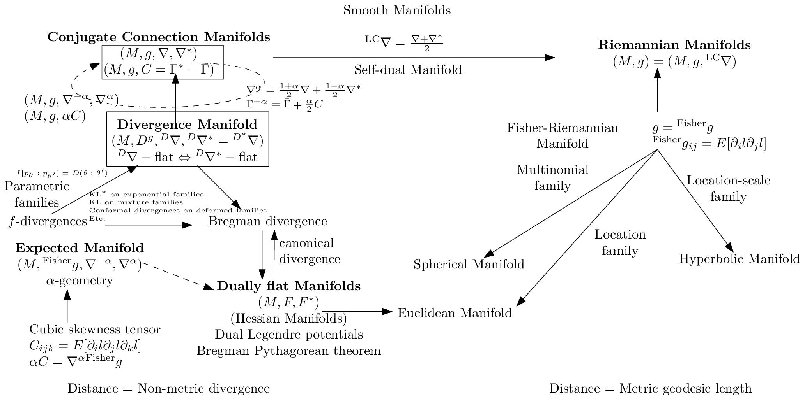
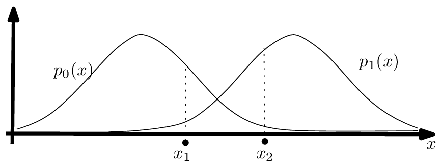
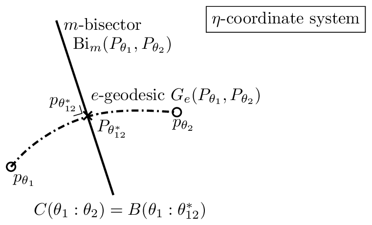
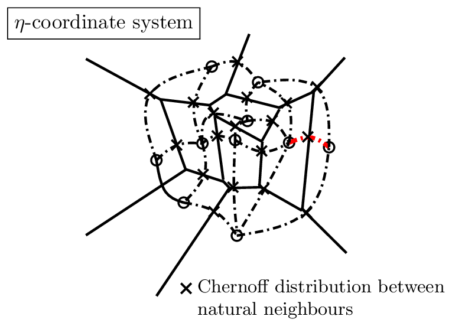
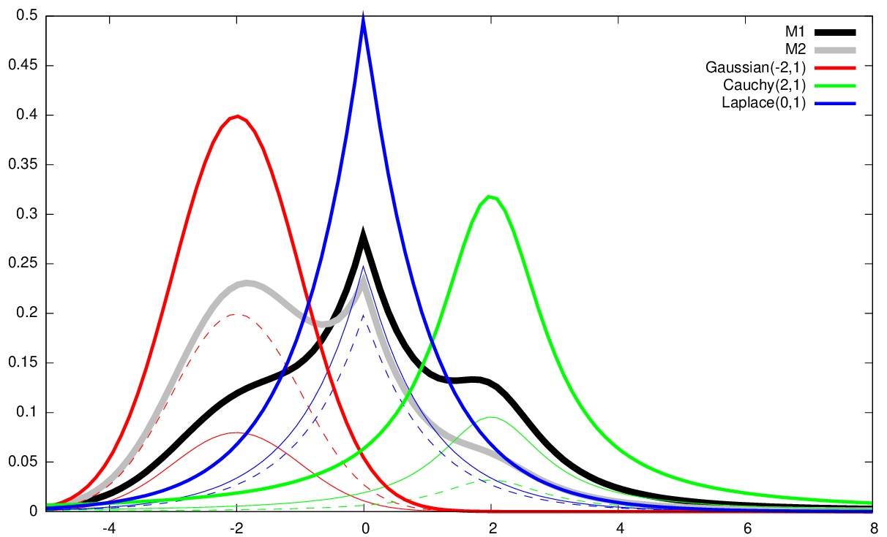

<!-- page 31 -->

因此可得如下统计距离：

$$B_{F,\mathcal{M}}[m_{\theta_1} : m_{\theta_2}] := F(\theta_1) + F^*(\eta_2) - \theta_1^\top \eta_2, \qquad (161)$$

$$\begin{aligned} &= -h(m_{\theta_1}) - \int p_0(x)\log m_{\theta_2}(x)\mathrm{d}\mu(x) - \int \sum_i \theta_1(i)p_i(x)\log m_{\theta_2}(x)\mathrm{d}\mu(x) \\ &\quad + \sum_i \theta_1(i)p_0(x)\log m_{\theta_2}(x)\mathrm{d}\mu(x), \end{aligned} \qquad (162)$$

$$= -h(m_{\theta_1}) - \int \bigl((1-\sum_i \theta_1(i))p_0(x) + \sum_i \theta_1(i)p_i(x)\bigr) \log m_{\theta_2}(x)\mathrm{d}\mu(x), \qquad (163)$$

$$= -h(m_{\theta_1}) - \int m_{\theta_1}(x)\log m_{\theta_2}(x)\mathrm{d}\mu(x), \qquad (164)$$

$$= \int m_{\theta_1}(x)\log \frac{m_{\theta_1}(x)}{m_{\theta_2}(x)}\mathrm{d}\mu(x), \qquad (165)$$

$$= D_{\mathrm{KL}}[m_{\theta_1} : m_{\theta_2}]. \qquad (166)$$

因此我们有 $D_{\mathrm{KL}}[m_{\theta_1} : m_{\theta_2}] = B_F(\theta_1 : \theta_2)$。通过将混合密度 $m_{\theta_1}$ 和 $m_{\theta_2}$ 松弛为任意密度 $m_1$ 和 $m_2$，我们发现由混合族密度的负熵诱导出的对偶平坦几何产生了一个对应于（前向）KL 散度的统计距离。也就是说，我们从 $B_{F,\mathcal{M}}$ 恢复了统计距离 $D_{\mathrm{KL}}$。请注意，一般来说，混合分布的熵没有闭式表达（因为对数和项），除非各分量分布具有两两不交的支撑集。后一种情况包括 Dirac 分布的情形，其混合表示分类分布。

对偶平坦空间可以由任意严格凸的 $C^3$ 生成函数 $F$ 构建。Vinberg 和 Koszul [120] 展示了如何为齐次锥得到这样的凸生成函数。向量空间 $V$ 中的锥 $\mathcal{C}$ 在对偶向量空间 $V^*$ 中产生一个正线性泛函的对偶锥：

$$\mathcal{C}^* := \left\{ \omega \in V^* : \forall v \in \mathcal{C}, \omega(v) \geq 0 \right\}. \qquad (167)$$

该锥的特征函数定义为

$$\chi_{\mathcal{C}}(\theta) := \int_{\mathcal{C}^*} \exp(-\omega(\theta))\mathrm{d}\omega \geq 0, \qquad (168)$$

而函数 $\log \chi_{\mathcal{C}}(\theta)$ 定义了一个 Bregman 生成函数，它诱导出一个 Hessian 结构和一个对偶平坦空间。

图 10 展示了信息几何中遇到的主要信息流形类型及其关系。

图 10：信息几何中主要信息流形类型及其关系概览。

## 4 信息几何的一些应用

信息几何 [8] 在信息科学中有着广泛的应用。例如，我们可以提到：

- 统计学：渐近推断、期望最大化（EM 以及新颖的信息几何 em）、时间序列（自回归滑动平均模型，ARMA）模型，
- 机器学习：受限玻尔兹曼机（RBMs）、神经流形与自然梯度 [124]，
- 信号处理：主成分分析（PCA）、独立成分分析（ICA）、非负矩阵分解（NMF），
- 数学规划：内点法的障碍函数，
- 博弈论：得分函数。

接下来，我们将介绍一些应用，首先从著名的自然梯度下降开始。

<!-- page 32 -->

- **共轭联络流形**
  - $(M, g, \nabla, \nabla^*)$
  - $(M, g, C = \Gamma^* - \Gamma)^{-}$
  - $(M, g, \nabla^{-\alpha}, \nabla^{\alpha})$
  - $(M, g, \alpha C)$

  - **散度流形**
    - $(M, D^g, {}^D\nabla, {}^D\nabla^* = {}^{D^*}\nabla)$
    - $D\nabla - \text{flat} \Leftrightarrow D\nabla^* - \text{flat}$

    - **参数族**
      - $I[p_\theta : p_{\theta'}] = D(\theta : \theta')$
      - KL* 在指数族上
      - KL 在混合族上
      - 在变形族上的共形散度
      - 等
    - **f-散度**

    - **期望流形**
      - $(M, g, \nabla^{-\alpha}, \nabla^{\alpha})$
      - α-几何
      - 三阶偏度张量
      - $C_{ijk} = E[\partial_i l \partial_j l \partial_k l]$
      - $\alpha C = \nabla^{\alpha} \text{Fisher } g$

    - （Bregman 散度 / 典范散度）→ **对偶平坦流形**（Hessian 流形）
      - $(M, F, F^*)$
      - 对偶 Legendre 势
      - Bregman 勾股定理
      - 距离 = 非度量散度

  - **光滑流形**
    - ${}^{LC}\nabla = \frac{\nabla+\nabla^*}{2}$
    - 自对偶流形
    - $\nabla^g = \frac{1+\alpha}{2}\nabla + \frac{1-\alpha}{2}\nabla^*$
    - $\Gamma^{\pm\alpha} = \Gamma \mp \frac{\alpha}{2}C$

    - **Riemann 流形**
      - $(M, g) = (M, g, {}^{LC}\nabla)$

      - **Fisher-Riemann 流形**
        - $g = \text{Fisher } g$
        - $\text{Fisher } g_{ij} = E[\partial_i l \partial_j l]$

        - **位置-尺度族** → **双曲流形**
        - **位置族**
        - **多项族** → **球面流形**
        - → **Euclidean 流形**

  - 距离 = 度量测地长度

**图 10：** 信息几何中主要信息流形类型及其关系的概览。

33

<!-- page 33 -->

## 4.1 Riemannian 空间中的自然梯度

Natural Gradient [6]（NG）是 Euclidean 几何中普通（Cartesian）梯度向在任意坐标系下分析的 Riemannian 空间中的梯度之延拓。我们解释自然梯度。

### 4.1.1 朴素的梯度下降方法

给定一个由参数空间 $\theta \in \Theta \subset \mathbb{R}^D$ 上的一个 $D$ 维向量 $\theta$ 参数化的实值函数 $L_\theta(\theta)$，我们希望最小化 $L_\theta$，即求解 $\min_{\theta \in \Theta} L_\theta(\theta)$。梯度下降（GD）方法，亦称最速下降法，是一种一阶局部优化过程，其首先将参数初始化为任意值（例如 $\theta_0 \in \Theta$），然后在第 $t$ 阶段迭代地将 $\theta_t$ 的当前位置更新至 $\theta_{t+1}$，如下所示：

$$
\text{GD} : \quad \theta_{t+1} = \theta_t - \alpha_t \nabla_\theta L_\theta(\theta_t). \tag{169}
$$

标量 $\alpha_t > 0$ 被称为机器学习中的步长或学习率。普通梯度（OG）$\nabla_\theta F_\theta(\theta)$（偏导数向量）表示函数图像 $\mathcal{L}_\theta = \{(\theta, L_\theta(\theta)) \;:\; \theta \in \Theta\}$ 在 $\theta$ 处的最速向量。GD 方法由 Cauchy [28]（1847）首创，其收敛到驻点的证明首次由 Curry [35]（1944）报道。

若我们使用一对一且满射的可微映射 $\eta = \eta(\theta)$（其互逆映射为 $\theta = \theta(\eta)$）对函数 $L_\theta$ 进行重新参数化，则 GD 更新规则变换为：

$$
\eta_{t+1} = \eta_t - \alpha_t \nabla_\eta L_\eta(\eta_t), \tag{170}
$$

其中

$$
L_\eta(\eta) := L_\theta(\theta(\eta)). \tag{171}
$$

因此，一般而言，这两个梯度下降位置序列 $\{\theta_t\}_t$ 与 $\{\eta_t\}_t$（分别初始化为 $\theta_0 = \theta(\eta_0)$ 与 $\eta_0 = \eta(\theta_0)$）是不同的（因为通常 $\eta(\theta) \neq \theta$），并且这两个 GD 可能达到不同的驻点。换言之，GD 的局部优化依赖于函数 $L$（即 $L_\theta$ 或 $L_\eta$）的参数化选择。例如，用梯度下降最小化关于 Celsius 度 $\theta$ 的温度函数 $L_\theta(\theta)$，可能与最小化同一温度函数 $L_\eta(\eta) = L_\theta(\theta(\eta))$（该函数关于 Fahrenheit 度 $\eta$ 表示）得到不同的结果。也就是说，GD 优化是外蕴的，因为它依赖于函数的参数化选择，且未考虑参数空间 $\Theta$ 的底层几何。

自然梯度正是针对这一问题，通过在参数流形上关于 Riemannian 度量张量场内蕴地选择最速方向来解决它。我们将阐述自然梯度下降方法，并强调其与 Riemannian 梯度下降、镜像下降乃至当参数空间为对偶平坦时的普通梯度下降之间的联系。

### 4.1.2 自然梯度及其与 Riemannian 梯度的联系

设 $(M,g)$ 是一个装备有度量张量 $g$ 的 $D$ 维 Riemannian 空间 [38]，且 $L \in C^\infty(M)$ 是流形 $M$ 上一个待最小化的光滑函数。Riemannian 梯度 [21] 利用 Riemannian 指数映射 $\exp_p : T_p \to M$ 来更新流形上的点列 $p_t$，如下所示：

$$
\text{RG} : \quad p_{t+1} = \exp_{p_t}(-\alpha_t \nabla_M L(p_t)), \tag{172}
$$

其中 Riemannian 梯度 $\nabla_M$ 根据方向导数 $\nabla_v$ 定义为：

$$
\nabla_M L(p) := \nabla_v \left( L\left(\exp_p(v)\right) \right)\bigr|_{v=0}, \tag{173}
$$

其中

$$
\nabla_v L(p) := \lim_{h \to 0} \frac{L(p + hv) - L(p)}{h}. \tag{174}
$$

<!-- page 34 -->

然而，黎曼指数映射 $\exp_p(\cdot)$ 通常在计算上是难以处理的，因为它需要求解一个二阶微分方程组 [38, 1]。因此，我们不使用 $\exp_p$，而是使用一个可计算的欧几里得收缩 $R : T_p \to \mathbb{R}^D$，它是指数映射在局部 $\theta$-坐标系中的表达：
$$\text{RetG} : \quad \theta_{t+1} = R_{\theta_t}\left(-\alpha_t \nabla_\theta L_\theta(\theta_t)\right). \tag{175}$$

使用收缩 [1] $R_p(v) = p + v$，它对应于指数映射的一阶泰勒近似，我们恢复了*自然梯度下降* [6]：
$$\text{NG} : \theta_{t+1} = \theta_t - \alpha_t g_\theta^{-1}(\theta_t) \nabla_\theta L_\theta(\theta_t). \tag{176}$$

*自然梯度* [6]（NG）
$${}^{\mathrm{NG}}\nabla L_\theta(\theta) := g_\theta^{-1}(\theta) \nabla_\theta L_\theta(\theta) \tag{177}$$

编码了*黎曼最速下降*向量，并且自然梯度下降方法产生了如下更新规则
$$\text{NG} : \theta_{t+1} = \theta_t - \alpha_t\ {}^{\mathrm{NG}}\nabla L_\theta(\theta_t). \tag{178}$$

注意，自然梯度是一个*逆变向量*，而普通梯度是一个*协变向量*。回顾一下，协变向量 $[v_i]$ 通过 $v^i = \sum_j g^{ij} v_i$ 变换为逆变向量 $[v^i]$，也就是通过使用对偶黎曼度量 $g_\eta^*(\eta) = g_\theta(\theta)^{-1}$。自然梯度在可逆的光滑参数化变换下是*不变*的。然而，自然梯度下降并*不*能保证位置 $\theta_t$ 始终停留在流形上：事实上，对于某些 $t$，当 $\Theta \neq \mathbb{R}^D$ 时，可能会出现 $\theta_t \not\in \Theta$。

**Property 5 ([21]).** *自然梯度下降使用由黎曼度量张量 $g$ 诱导的逆变梯度向量来近似内在的黎曼梯度下降。自然梯度对坐标变换是不变的。*

接下来，我们将解释当黎曼空间 $\Theta$ 为对偶平坦时，自然梯度下降与*镜像下降*和*普通梯度*之间的关系。

### 4.1.3 对偶平坦空间中的自然梯度：与 Bregman 镜像下降和普通梯度的联系

回顾一下，对偶平坦空间 $(M, g, \nabla, \nabla^*)$ 是一个流形 $M$，它配备了一对 $(\nabla, \nabla^*)$ 对偶无挠平坦联络，这些联络与黎曼度量张量 $g$ [8, 77] 相耦合，其含义是 $\frac{\nabla+\nabla^*}{2} = {}^{LC}\nabla$，其中 ${}^{LC}\nabla$ 表示唯一的度量无挠 Levi-Civita 联络。

在对偶平坦空间上，存在一对对偶全局 Hessian 结构 [120]，它们具有对偶典范 Bregman 散度 [23, 8]。对偶黎曼度量可以表示为对偶凸势函数 $F$ 和 $F^*$ 的 Hessian。Hessian 流形的例子包括*指数族流形*或*混合族流形* [86]。在由严格凸且 $C^3$ 的函数 $F$（Bregman 生成元）诱导的对偶平坦空间上，我们有两个对偶全局坐标系：$\theta(\eta) = \nabla F^*(\eta)$ 和 $\eta(\theta) = \nabla F(\theta)$，其中 $F^*$ 表示 Legendre-Fenchel 凸共轭函数 [70, 71]。在原始 $\theta$-坐标系中表达的 Hessian 度量为 $g_\theta(\theta) = \nabla^2 F(\theta)$，在对偶坐标系中表达的对偶 Hessian 度量为 $g_\eta^*(\eta) = \nabla^2 F^*(\eta)$。Crouzeix 恒等式 [32] 表明 $g_\theta(\theta) g_\eta(\eta) = I$，其中 $I$ 表示 $D \times D$ 单位矩阵。

普通梯度下降方法可以通过使用一个*邻近函数* $\Phi(\cdot, \cdot)$ 进行扩展，如下所示：
$$\text{PGD} : \quad \theta_{t+1} = \arg\min_{\theta \in \Theta} \left\{ \langle \theta, \nabla L_\theta(\theta_t) \rangle + \frac{1}{\alpha_t} \Phi(\theta, \theta_t) \right\}. \tag{179}$$

当 $\Phi(\theta, \theta_t) = \frac{1}{2}\|\theta - \theta_t\|^2$ 时，PGD 更新规则变为普通的 GD 更新规则。

34

<!-- page 35 -->

考虑将 Bregman 散度 [23] $B_F$ 用于邻近函数 $\Phi$：$\Phi(p,q)=B_F(p:q)$。那么 PGD 给出如下镜像下降（MD）：

$$\text{MD}:\quad \theta_{t+1}=\arg\min_{\theta\in\Theta}\left\{\langle\theta,\nabla L(\theta_t)\rangle+\frac{1}{\alpha_t}B_F(\theta:\theta_t)\right\}. \tag{180}$$

该镜像下降可被如下解释为自然梯度下降：

**性质 6** ([112]). *在 Hessian 流形 $(M,g=\nabla^2 F(\theta))$ 上的 Bregman 镜像下降等价于在对偶 Hessian 流形 $(M,g^*=\nabla^2 F(\eta))$ 上的自然梯度下降，其中 $F$ 为 Bregman 生成函数，$\eta=\nabla F(\theta)$ 且 $\theta=\nabla F^*(\eta)$。*

事实上，镜像下降规则给出如下自然梯度更新规则：

$$\begin{aligned} \text{NG}^*:\eta_{t+1} &= \eta_t - \alpha_t(g_\eta^*)^{-1}(\eta_t)\nabla_\eta L_\theta(\theta(\eta_t)), & (181) \\ &= \eta_t - \alpha_t(g_\eta^*)^{-1}(\eta_t)\nabla_\eta L_\eta(\eta_t), & (182) \end{aligned}$$

其中 $g_\eta^*(\eta)=\nabla^2 F^*(\eta)=(\nabla^2_\theta F(\theta))^{-1}$ 且 $\theta(\eta)=\nabla F^*(\theta)$。

该方法被称为镜像下降 [24]，因为它在*对偶空间*（即*镜像空间*）$H=\{\eta=\nabla F(\theta)\ :\ \theta\in\Theta\}$ 中执行该梯度步，从而解决了从普通 GD（式 169）的逆变向量中减去协变向量时出现的逆变/协变类型不一致问题。

现在我们证明自然梯度在对偶平坦空间或 Bregman 流形 [77] 中的如下性质：

**性质 7** ([137]). *在由势凸函数 $F$ 诱导的对偶平坦空间中，自然梯度等价于对偶参数化函数上的普通梯度：${}^{\mathrm{NG}}\nabla L_\theta(\theta)=\nabla_\eta L_\eta(\eta)$，其中 $\eta=\nabla_\theta F(\theta)$ 且 $L_\eta(\eta)=L_\theta(\theta(\eta))$。*

**证明。**令 $(M,g,\nabla,\nabla^*)$ 为一对偶平坦空间。我们有 $g_\theta(\theta)=\nabla^2 F(\theta)=\nabla_\theta\nabla_\theta F(\theta)=\nabla_\theta\eta$，因为 $\eta=\nabla_\theta F(\theta)$。待最小化的函数既可以写成 $L_\theta(\theta)=L_\theta(\theta(\eta))$，也可以写成 $L_\eta(\eta)=L_\eta(\eta(\theta))$。回顾微积分中的链式法则：

$$\nabla_\theta L_\theta(\theta) = \nabla_\theta(L_\eta(\eta(\theta))) = (\nabla_\theta\eta)(\nabla_\eta L_\eta(\eta)). \tag{183}$$

因此我们有：

$$\begin{aligned} {}^{\mathrm{NG}}\nabla L_\theta(\theta) &:= g_\theta^{-1}(\theta)\nabla_\theta L_\theta(\theta), & (184) \\ &= (\nabla_\theta\eta)^{-1}(\nabla_\theta\eta)\nabla_\eta L_\eta(\eta), & (185) \\ &= \nabla_\eta L_\eta(\eta). & (186) \end{aligned}$$

$$\square$$

由此可见，损失函数 $L_\theta(\theta)$ 上的自然梯度下降等价于*对偶参数化*损失函数 $L_\eta(\eta):=L_\theta(\theta(\eta))$ 上的普通梯度下降。简言之，${}^{\mathrm{NG}}\nabla_\theta L_\theta = \nabla_\eta L_\eta$。

### 4.1.4 自然梯度的一种应用：Natural Evolution Strategies（NESs）

自然梯度的一类很好的应用是用于黑箱最小化 [19] 的 Natural Evolution Strategies（NESs）。令 $x\in\mathbb{X}\subset\mathbb{R}^d$ 时的 $f(x)$ 为一个待最小化的实值函数。Berny [18] 提出通过考虑参数化搜索分布 $p_\lambda$ 来*松弛*优化问题 $\min_{x\in\mathbb{X}} f(x)$，并转而最小化：

$$\min_{\lambda\in\Lambda} E_{p_\lambda}[f(x)], \tag{187}$$

其中 $\lambda\in\Lambda\subset\mathbb{R}^D$ 表示搜索分布的参数空间。令 $J(\lambda)=E_{p_\lambda}[f(x)]$。当 $\mathbb{X}$ 为离散空间时，转而最小化 $J(\lambda)$ 而非 $f(x)$ 特别有用：事实上，*组合*的

<!-- page 36 -->

图 11：统计贝叶斯假设检验：最优最大后验概率（MAP）规则选择将观测值归类为具有最大似然的类别。

*优化* [18] $\min_{x\in\mathbb{X}} f(x)$ 当 $\Lambda$ 为连续参数时被替换为连续优化 $\min_{\lambda\in\Lambda} J(\lambda)$，并且可以使用普通或自然梯度下降方法。梯度 $\nabla J(\lambda)$ 被称为*搜索梯度*，它可以使用对数似然技巧 [135] 进行随机近似，如下

$$\widetilde{\nabla} J(\lambda) := \frac{1}{n}\sum_{i=1}^{n} f(x_i)\nabla \log p_\lambda(x_i) \approx \nabla J(\lambda), \tag{188}$$

其中 $x_1,\ldots,x_n \sim p_\lambda$。类似地，Fisher 信息矩阵（FIM）可以通过以下经验 FIM 近似：

$$\tilde{I}(\lambda) = \frac{1}{n}\sum_{i=1}^{n} \nabla_\lambda l_\lambda(x_i)\bigl(\nabla_\lambda l_\lambda(x_i)\bigr)^\top \approx I(\lambda), \tag{189}$$

其中 $l_\lambda(x) := \log p_\lambda(x)$ 表示对数似然函数。注意，近似 FIM 可能是退化的，并且可能不遵循真实 FIM 的结构。例如，我们有 $\nabla_\mu l(x;\mu,\sigma^2) = \frac{x-\mu}{\sigma^2}$ 以及 $\nabla_{\sigma^2} = \frac{(x-\mu)^2}{2\sigma^4} - \frac{1}{2\sigma^2}$。近似 FIM $\tilde{I}(\lambda)$ 的非对角元素接近零但通常非零，尽管期望 FIM 是对角矩阵 $I(\mu,\sigma^2) = \mathrm{diag}\left(\frac{1}{\sigma^2}, \frac{1}{2\sigma^4}\right)$。因此，我们可以估计 FIM，直到非对角元素的绝对值小于给定的 $\epsilon > 0$。对于多元正态分布，我们有 $\nabla_\mu l(x;\mu,\Sigma) = \Sigma^{-1}(x-\mu)$ 以及 $\nabla_\Sigma l(x;\mu,\Sigma) = \frac{1}{2}\bigl(\nabla_\mu l(x;\mu,\Sigma)\nabla_\mu l(x;\mu,\Sigma)^\top - \Sigma^{-1}\bigr)$。

### 4.2 对偶平坦流形的一些说明性应用

在本部分，我们描述如何利用对偶平坦结构来处理指数族 $\mathcal{E}$（在 §4.3 详述的假设检验问题中）以及混合族 $\mathcal{M}$（聚类统计混合 §4.4）。注意，对于一般的散度，$(\mathcal{E}, D)$ 与 $(\mathcal{M}, D)$ 均不是对偶平坦的。然而，当 $D = \mathrm{KL}$（即 Kullback-Leibler 散度）时，我们得到在计算上具有吸引力的对偶平坦空间，因为原始/对偶测地线在相应的全局仿射坐标系中是直线。

### 4.3 对偶平坦指数族流形中的假设检验 $(\mathcal{E}, \mathrm{KL}^*)$

给定两个概率分布 $P_0 \sim p_0(x)$ 和 $P_1 \sim p_1(x)$，我们要求将一组独立同分布的观测值 $X_{1:n} = \{x_1,\ldots,x_n\}$ 分类为来自 $P_0$ 或 $P_1$？这是一个统计决策问题 [73]。例如，$P_0$ 可以代表信号分布，$P_1$ 代表噪声分布。图 11 展示了概率分布以及任何统计决策规则所犯下的不可避免的错误（在观测值 $x_1$ 和 $x_2$ 上）。

假设两个分布 $P_0 \sim P_{\theta_0}$ 和 $P_1 \sim P_{\theta_1}$ 属于同一个*指数族* $\mathcal{E} = \{P_\theta : \theta \in \Theta\}$，并考虑具有对偶平坦结构 $(\mathcal{E}, {}^{\mathcal{E}}g, {}^{\mathcal{E}}\nabla^e, {}^{\mathcal{E}}\nabla^m)$ 的指数族流形。也就是说，该流形配备了 Fisher 信息度量张量场、期望指数联络以及共轭期望混合联络。更一般地，一个期望 α-几何

36

<!-- page 37 -->

指数族 $\mathcal{E}$ 在累积量函数 $F$ 下的表达式为：

$$g_{ij}(\theta) = \partial_i\partial_j F(\theta), \tag{190}$$

$$\Gamma^{\alpha}_{ij,k} = \frac{1-\alpha}{2}\partial_i\partial_j\partial_k F(\theta). \tag{191}$$

当 $\alpha=1$ 时，$\Gamma^{\alpha}_{ij,k}=0$ 且 $\nabla^1$ 是平坦的，而根据信息几何的基本定理，$\nabla^{-1}$ 也是平坦的。

$\pm 1$-结构也可以通过选取一个*发散流形结构*来导出，方法是选择反向 Kullback-Leibler 散度 $\mathrm{KL}^*$：

$$(\mathcal{E}, {}_\mathcal{E}g, {}_\mathcal{E}\nabla^e, {}_\mathcal{E}\nabla^m) \equiv (\mathcal{E}, \mathrm{KL}^*). \tag{192}$$

因此，Kullback-Leibler 散度 $\mathrm{KL}[P_\theta : P_{\theta'}]$ 等价于一个 Bregman 散度（针对指数族的累积量函数）：

$$\mathrm{KL}^*[P_{\theta'}:P_\theta] = \mathrm{KL}[P_\theta:P_{\theta'}] = B_F(\theta':\theta). \tag{193}$$

最优最大先验（MAP）决策规则的*最优指数误差* $\alpha^*$ 可通过最小化 *Bhattacharyya 距离* 来获得 *Chernoff 信息* [106]：

$$C[P_1,P_2] = -\log \min_{\alpha\in(0,1)} \int_{x\in\mathcal{X}} p_1^\alpha(x) p_2^{1-\alpha}(x)\mathrm{d}\mu(x) \geq 0. \tag{194}$$

在指数族流形 $\mathcal{E}$ 上，Bhattacharyya 距离：

$$B_\alpha[p_1:p_2] = -\log \int_{x\in\mathcal{X}} p_1^\alpha(x) p_2^{1-\alpha}(x)\mathrm{d}\mu(x), \tag{195}$$

等价于一个*斜 Jensen 参数散度* [83]（也称为 Burbea-Rao 散度）：

$$J_F^\alpha(\theta_1:\theta_2) = \alpha F(\theta_1) + (1-\alpha)F(\theta_2) - F(\theta_1+(1-\alpha)\theta_2). \tag{196}$$

可以证明，Chernoff 信息（对 $\alpha$ 取最小值）等价于一个 Bregman 散度：即指数族在最优指数值 $\alpha^*$ 处的 Bregman 散度。

**定理 10**（Chernoff 信息 [73]）。*属于同一指数族的两个分布之间的 Chernoff 信息等价于一个 Bregman 散度：*

$$C[P_{\theta_1}:P_{\theta_2}] = B(\theta_1:\theta_{12}^{\alpha^*}) = B(\theta_2:\theta_{12}^{\alpha^*}), \tag{197}$$

*其中 $\theta^{\alpha}_{12}=(1-\alpha)\theta_1+\alpha\theta_2$，且 $\alpha^*$ 表示最优指数误差。*

令 $\theta^*_{12}:=\theta^{\alpha^*}_{12}$ 表示最优指数误差。最优误差指数的几何结构 [73] 可在对偶平坦的指数族流形上解释如下：

$$P^* = P_{\theta_{12}^*} = G_e(P_1,P_2) \cap \mathrm{Bi}_m(P_1,P_2), \tag{198}$$

其中 $G_e$ 表示指数测地线 $\gamma_{\nabla^e}$，$\mathrm{Bi}_m$ 表示 $m$-平分面：

$$\mathrm{Bi}_m(P_1,P_2) = \{P \::\: F(\theta_1)-F(\theta_2)+\eta(P)^\top(\theta_2-\theta_1)=0\}. \tag{199}$$

图 12 展示了如何从一条与 $m$-平分面相交的指数弧（$\theta$-测地线）中检索最优误差指数。

此外，对于这一统计二元决策问题，除了考虑两个分布之外，我们还可以考虑一个包含 $n$ 个分布 $P_1,\ldots,P_n\in\mathcal{E}$ 的集合。该多重假设检验设定下误差指数的几何结构已在 [72] 中得到研究。在对偶平坦的指数族流形上，这对应于考察 Bregman Voronoi 图 [20] 中*自然邻域*（共享 Voronoi 子面）之间的指数弧。详见图 13。

37

<!-- page 38 -->

图 12：最佳指数错误率 $\alpha^*$ 的精确几何刻画（不一定具有 i 闭式）。

图 13：多假设检验情形下最佳指数错误率的几何刻画。

38

<!-- page 39 -->

图 14：阶数 $D = 2$ 的混合族示例（3 个分量：Laplacian、Gaussian 和 Cauchy 前缀分布）。

## 4.4 在双平坦混合族流形 $(\mathcal{M}, \mathrm{KL})$ 中对混合模型进行聚类

给定一组 $k$ 个指定的统计分布 $p_0(x), \ldots, p_{k-1}(x)$，它们均具有相同的支撑集 $\mathcal{X}$（例如 $\mathbb{R}$），阶数为 $D = k - 1$ 的混合族 $\mathcal{M}$ 由所有这些分量分布的严格凸组合构成 [93]：

$$
\mathcal{M} := \left\{ m(x; \theta) = \sum_{i=1}^{k-1} \theta_i p_i(x) + \left(1 - \sum_{i=1}^{k-1} \theta_i\right) p_0(x) \text{ such that } \theta_i > 0, \sum_{i=1}^{k-1} \theta_i < 1 \right\}.
$$

图 14 展示了两个通过指定 Laplacian、Gaussian 和 Cauchy 分量分布的凸组合得到的混合模型（$D=2$）。当考虑一组指定的高斯分量分布时，我们得到 $w$-Gaussian 混合模型，或简称为 $w$-GMM。

我们考虑期望信息流形 $(\mathcal{M}, {}^{\mathcal{M}}g, {}^{\mathcal{M}}\nabla^m, {}^{\mathcal{M}}\nabla^e)$，它是双平坦的，且等价于 $(M_\Theta, \mathrm{KL})$。也就是说，两个具有指定分量的混合模型（简称为 $w$-混合模型）之间的 KL 散度等价于一个 Bregman 散度，其生成函数为 $F(\theta) = -h(m_\theta)$，其中 $h(p) = \int p(x)\log p(x)\mathrm{d}\mu(x)$ 是微分 Shannon 信息（负熵）[93]：

$$
\mathrm{KL}[m_{\theta_1} : m_{\theta_2}] = B_F(\theta_1 : \theta_2).
$$

考虑一组 $n$ 个 $w$-混合模型 $\{m_{\theta_1}, \ldots, m_{\theta_n}\}$ [93]。因为 $F(\theta) = -h(m(x;\theta))$ 是混合模型的负微分熵（没有闭式表达式 [95]），所以我们用另一个相近的可处理生成函数 $\tilde{F}$ 来近似难以处理的 $F$。我们使用 Monte Carlo 随机采样，为独立同分布样本 $\mathcal{S}$ 得到 Monte Carlo 凸函数 $\tilde{F}_{\mathcal{S}}$。

因此，对于嵌套样本集 $\mathcal{S}_1 \subset \ldots \subset \mathcal{S}_m$，我们可以构建一个由可处理的双平坦流形组成的嵌套序列 $(\mathcal{M}, \tilde{F}_{\mathcal{S}_1}), \ldots, (\mathcal{M}, \tilde{F}_{\mathcal{S}_m})$，并收敛到理想混合流形 $(\mathcal{M}, F)$：$\lim_{m\to\infty} (\mathcal{M}, \tilde{F}_{\mathcal{S}_m}) = (\mathcal{M}, F)$（其中收敛性是相对于诱导的典范 Bregman 散度定义的）。该方法的一个关键优势在于，对于给定样本 $\mathcal{S}$，在双平坦流形 $(\mathcal{M}, \tilde{F}_{\mathcal{S}})$ 内进行的所有计算都是一致的，参见 [93]。

例如，我们可以在这些 $w$-GMM（Gaussian 混合模型）的 Monte Carlo 双平坦空间 [85] 上应用 Bregman $k$-means [87]，以对一组 $w$-GMM 进行聚类。图 15 展示了此类聚类的结果。

我们简要介绍了使用双平坦流形的两个应用：（1）由指数族上的统计反向 Kullback-Leibler 散度诱导的双平坦指数流形（结构 $(\mathcal{E}, \mathrm{KL}^*)$），以及（2）由统计 Kullback-Leibler 散度诱导的双平坦混合流形
