<!-- page 35 -->

# IV 大调式与自然和弦

我们的大调音阶，即音列 *c, d, e, f, g, a, b*——这些音也是希腊调式与教会调式的基础——我们可以说它是通过对自然的模仿而发现的。直觉与推断（*Kombination*）帮助我们将音最重要的特性——泛音列——从纵向（正如我们所设想的所有同时发声的音的位置）转化为横向，转化为分离的、相继出现的音。自然的原型，即音，表现出以下特性：

1. 一个乐音（*Klang*）是一种复合体，由一系列同时响起的音，即泛音，所组成；因此，它构成一个和弦。从一个基音 *C* 出发，这些泛音是：

   *c, g, c^1, e^1, g^1, (b♭^1), c^2, d^2, e^2, f^2, g^2*，等。

2. 在这一系列中，*c* 是最强的音，因为它出现的次数最多，并且因为它本身就是实际演奏或演唱出来的基音。

3. 继 *c* 之后，次强的音是 *g*，因为它在系列中出现得更早，因此比其他音出现得更频繁。

   如果我们将这个 *g* 视为一个真实的音（正如泛音列被横向实现时那样，例如，当演奏一支定调为 *c* 的圆号的五度音时），那么它自身（作为一个实际被演奏的音）也具有泛音；它们是：

   *g^1, d^2, g^2, b^2, d^3*，等；

   与此同时，这个 *g* 连同它的泛音一起，又以 *C*（圆号的基音）为前提。于是，泛音的泛音也对整体音响有所贡献。

   由此：

4. 一个实际的音（*g*）显得依赖于它下方五度的音，即 *C*。

由前述内容得出的结论是：

这个音 *C* 同样依赖于它下方五度的音，*F*。

现在，如果将 *C* 视为中点，那么它的状况可以用两种力来描述：一种向下拉，朝向 *F*；另一种向上拉，朝向 *G*：

在此，*G* 对 *C* 的依赖——严格说来，*C* 的力与 *F* 的力朝同一方向作用——可以被比作一个人双手悬吊在横梁上，以自身的力量对抗重力。他拉横梁的力，正如重力拉他的力，而

<!-- page 36 -->

24 大调式：自然和弦

同一方向。但其效果是他的力*对抗*重力，因此我们有理由这样谈论两种对抗的力。

我将经常提及这一特征，并从中得出若干结论。目前重要的是要确立这些音彼此密切相关，它们是至亲。*G* 是 *C* 的第一泛音（在 *c* 之后），而 *c* 是 *F* 的第一泛音。这样的泛音与基音（八度之后）最为相似，因此对声音的音质（*Charakteristik*）及其悦耳度贡献最大。

如果有理由假设 *G* 的泛音可以成为真实的音，那么这一假设也可以类似地应用于 *F* 的泛音。毕竟，*F* 之于 *C* 正如 *C* 之于 *G*。由此便可解释，最终形成的音阶是如何由基音及其近亲的最重要的组成部分构成的。这些近亲正是赋予基音稳定性的因素；因为基音代表着它们对立倾向之间的平衡点。这个音阶看起来像是三个因素的特性的残余，一种纵向投影，一种叠加：

| 基 | 泛 |
| 音 | 音 |
| *F* | *f* · · · *c* · · · *f* · *a* |
| *C* | *c* · · · *g* · · · *c* · *e* |
| *G* | *g* · · · *d* · · · *g* · *b* |
| | *f* *c* *g* *a* *d* *e* *b* |

将泛音相加（省略重复），我们得到我们音阶的七个音。这里它们尚未按连续顺序排列。但即便音阶顺序也可以获得，只要我们假设更高阶的泛音同样在起作用。而这一假设事实上绝非任意；我们必须假设其他泛音的存在。耳朵也可以通过将发现的音与绷紧的弦进行比较来确定它们的相对音高——弦当然会随着音的降低或升高而变长或变短。但更远的泛音也是可靠的向导。将这些也加进来，我们得到如下结果：

| 基 | 泛 |
| 音 | 音 |
| *F* | *f* · · · *c* · · *f* · *a* · *c* · (*eb*) *f* *g* *a* *b* *c* etc. *f* etc. |
| *C* | *c* · · · *g* · · *c* · *e* · *g* · (*bb*) *c* *d* *e* *f* etc. |
| *G* | *g* · · · *d* · · *g* · *b* · *d* · (*f*) *g* *a* *b* *c* *d* |
| | (*eb*) (*bb*) |
| | *c* *d* *e* *f* *g* *a* *b* *c* *d* *e* *f* *g* *a* *b* *c* *d* |

我们的 *C* 大调音阶。

这里出现了一个有趣的附带现象：

两个音 *e* 和 *b* 出现在第一八度中，但 *e* 受到 *eb* 的质疑，*b* 受到 *bb* 的质疑。这解释了为什么人们曾经质疑三度是否为协和音程，并说明了为什么 *b* [*bb*] 和 *h* [*b*] 会出现在德语的音名字母表中。

<!-- page 37 -->

大调式：自然和弦 25

由于第一个八度，无法确定哪个音是正确的。* 第二个八度（其中 *F* 和 *C* 的泛音必然听起来更微弱）使这个问题倾向于 *e* 和 *b* 得到解决。

音乐的先驱们是通过直觉还是通过推理（*Kombination*）得出这个音阶的，我们无法判断。无论如何，这并不重要。然而，我们仍可以质疑那些建立复杂学说（*Lehren*）的理论家；因为与这些学说相反，我们必须承认发现者不仅拥有本能，还具有推理的能力。因此，这里完全有可能是仅凭理性发现了正确的东西，所以功劳不应只归于耳朵，部分也应归于推理。我们不是第一批能够思考的人！

我们音阶的发现是我们音乐发展中的一件幸事，这不仅关乎它的成功，还在于我们本来也完全可能发现一个不同的音阶，例如阿拉伯人、中国人和日本人，或者吉普赛人那样。他们的音乐没有发展到我们这样的高度，这并不一定是因为他们音阶的不完善，也可能与他们不完善的乐器有关，或与某些此处无法探讨的其他情况有关。此外，我们音乐的进化也并非仅仅归功于我们的音阶。最重要的是；这个音阶并非最终定论，不是音乐的终极目标，而只是一个临时的停靠站。将耳朵引向它的泛音列，仍然包含许多必须面对的问题。如果我们暂时仍能回避这些问题，那几乎完全是由于自然音程与我们无法使用它们之间的一种妥协——这种妥协我们称之为平均律体系，它相当于一份无限期延长的停战协定。这种将自然关系简化为可处理关系的方式，不能永久阻碍音乐的发展；而耳朵将不得不去解决这些问题，*因为它具有这样的*
*倾向。* 届时，我们的音阶将转化为一种更高阶的形式，正如教会调式被转化为大调式和小调式那样。届时是否会出现四分音、八分音、三分音，或者（如 Busoni¹ 所想）六分音，还是我们将直接进入 Robert Neumann 博士计算出的五十三音音阶，² 我们无法预言。也许这种新的八度划分甚至会是非平均律的，并且与我们的音阶不会有太多共同之处。无论情况如何，用四分音或三分音进行创作的尝试——正如各地正在进行的那样——似乎是毫无意义的，因为能够演奏它们的乐器实在太少了。很可能，无论何时耳朵和想象力

\* 也许这也能解释为什么会有教会调式：人们感受到了基音的效果，但因为没有人知道它是哪个音，所以所有的音都被尝试了。而变音记号在所选定的调式中或许是偶然的，但在自然的、基本的调式中并非如此。

[¹ Ferrucio Busoni，*Sketch of a New Esthetic of Music*，载于 *Three Classics in the Aesthetic of Music*（纽约：Dover Publications，1962），第93–4页。Busoni 的著作最初于1906年在莱比锡出版，后由 Theodore Baker 翻译，G. Schirmer, Inc. 出版，*c.* 1911年，并在此文集中重印。]

[² 作者的重要（且冗长）脚注。见附录，第423–5页。在第十九章（第384页）中，Neumann 博士被描述为“一位年轻的哲学家”。]

<!-- page 38 -->

26 大调式：自然和弦

若已成熟到足以驾驭这种音乐，音阶与乐器便都将立刻就绪。可以确定的是，这一运动正在兴起，也必将引向某种成果。或许在这里，人们同样必须克服许多离题与谬误；或许这些也会导致夸大其词，或使人产生幻觉，以为此刻已经找到了终极的、不可变的东西。也许在这里，人们会再次建立法则与音阶，并赋予它们一种超越时间的审美价值。但对于有远见的人来说，那依然不会是终点。他认识到，任何材料都可以适用于艺术——只要它被充分界定，使人能够按照其假定的本性去塑造它；但又不能界定得过于清晰，以至于想象力再无未被探索的领地可以漫游，再无与宇宙建立神秘联系的空间。而且，由于我们仍然可以期待，世界将在很长一段时间内继续对我们的知性（*Verstand*）保持谜一般的姿态，所以我们可以说，尽管有所有贝克梅塞尔式的人物横加阻拦，艺术的终结尚未到来。

如果说音阶是在水平面上对音的模仿，也就是一个音接一个音，那么和弦就是在垂直面上的模仿，即多个音同时鸣响。如果说音阶是分析，那么和弦就是音的合成。和弦必须由三个不同的音构成。这类和弦中最简单的，显然就是最接近音的最简单、最显著特征的那一个，也就是由基音、大三度和纯五度构成的和弦——大三和弦。它通过省略较远的泛音并强化较近的泛音，来模仿单音的悦耳性。三和弦无疑与单音相似，但它与其原型的相似程度，并不比比方说亚述浮雕与其人体原型的相似程度更高。这样的三和弦可能在和声意义上被投入使用——也就是说，当有人发现可以先唱基音与五度，后来又加上三度时；或者也可能是因为声部进行的方式，使得它们最终汇合的恰恰是诸如此类的和弦。然而，这两种方式今天都无法被确切证实。很有可能，在多声部的写作方式能够运用这类音响之前，人们就已经觉得这种同时鸣响的声音是悦耳的了。然而，也不能排除相反的可能性：单声部旋律与音阶在和弦之前就已存在，而从单声部音乐到多声部音乐的跨越，并非通过把和弦设置为音或旋律进行的伴奏而实现，而是通过同时演唱两条或三条旋律，其中一条最终成为主旋律。无论音乐最初的岁月是怎样的，和声与多声部这两种方法至少已有四百年在同等程度上协作，推动了我们当今音乐的演进。因此，只依据其中一种原则来构建和弦是很不恰当的。一方面，把和弦表现得仿佛它们是自发萌生并发展出来的——正如和声学教学中通常所呈现的那样——是很不恰当的；另一方面，将复调仅仅解释为遵循某些约定俗成规则、却不考虑声部结合所产生的和弦的声部进行——正如对位法教学中常见的那样——也是不恰当的。更为正确的说法是，和声的发展不仅本质上受到旋律原则的深刻影响，声部可能性的发展

<!-- page 39 -->

大调式：调式和弦 27

声部进行不仅本质上受到和声原理的影响，而且在许多方面二者实际上是由彼此决定的。然而，任何一种只采用其中一种原则的处理方式，都会遇到无法纳入其体系的事实。因此才会有无数的例外。因此，在许多地方，教师才不得不以勉强给出的让步，去撤销他草率施加的禁令。而且在许多地方，教师不得不说：“唉，事情就是这样；别无他法”，却又说不出任何理由。在这种地方，学生必须接受教师强加给他的一切，将其视为既定事实；他只可以问“它的名称”，却不许问“它的性质”。

乍看之下，我在这里所说的内容似乎与我导论中关于和声教学范围的论述，以及后文关于“非和弦音”章节中的论述相矛盾。但这种矛盾只是表面的。因为，如果我指出某个和弦进行必须从旋律角度加以*解释*，这与让学生因其起源是旋律性的就以旋律方式去处理它——完全是两回事；正如经过音、换音等的情形那样，若非“非和弦音”体系如此便利，它们早就被视为和弦的组成部分了。

对和声事件的考量与判断，需要一种可理解的分类。这种分类越是能满足正当的要求，就越完备。我发现，长期沿袭的教学方法足以满足我们提出的大多数要求，但须保留两点看法：它并非一个体系，而且只能将我们带到“某一点”为止。因此，我的论述也是据此构建的。这种方法首先从调式三和弦入手，实际上就是从最简单的结构开始，并以实用的方式逐步建立体系：在这些三和弦之后，是其他调式和弦、四音与五音和弦；随后，在终止式中展示了这些调式和弦的应用之后，该方法进而讨论非调式和弦，并在此同样展示其在转调等方面的应用。我对这种方法的异议将在后文阐明。然而，它在一定程度上是可用的，我也将遵循它到那一步为止。

调（*Tonart*）的和声意义，及其所有的分支细节，只有联系到调性的概念才能被理解；因此，必须首先对此加以说明。调性是一种形式上的可能性，它从调性材料的本质中产生；是一种通过某种统一性来达到某种完整性或封闭性（*Geschlossenheit*）的可能性。为了实现这种可能性，在一部作品中必须只使用那些音响（*Klänge*）与音响序列，并且只以恰当的排列方式来使用它们；这些音响与调的基音、与作品的主音之间的关系，必须能够被轻易理解。随后，我将不得不对调性的诸多方面提出质疑，因此在此我只限于两点说明：（1）我不像在我之前的所有理论家那样，将调性视为一条永恒的法则、一条音乐的自然法则；尽管这条法则与最原始的自然模式——也就是音与基础和弦——的最简单条件是相符的。然而尽管如此，（2）学生必须彻底掌握这种效果[调性]的基础及其达成方式，这一点至关重要。

<!-- page 40 -->

28 大调式：自然和弦

当一首完整乐曲的所有和弦都以可归因于一个共同基础音的进行出现时，就可以说音乐音响（*Klang*）的观念（它被构想为纵向的）被扩展到了横向平面。其后的一切都源于这个基本前提，回溯于它，即使与之对立，也对其加以发展、补充，并最终回归于它，以至于这个基础音在各个方面都被当作中心、当作胚胎来处理。这种作曲方法的价值，即使对于那些不相信它是所有作曲不可或缺的人来说，也是不容忽视的。例如，并非每部传记都必须从主人公的出生开始，或者更远地追溯其祖先，也并非都必须以其死亡结束。这种完整性并非不可或缺，如果人们有其他目的，比如说要呈现主人公一生中某个具有特征性的时期，那么这种完整性就可以立即被舍弃。同样值得怀疑的是，一首乐曲中的所有事件总和是否必然必须指向基本前提、指向基础和弦，仅仅因为——正如我所说——这种指向通过形式的完整性保证了良好的结果，并且与材料的最简单属性相吻合。一旦提出这个问题，就值得怀疑这种指向是否仅仅与*更简单*的属性相吻合，尤其是，它是否仍然与更复杂的属性相吻合。要在这个问题上得出结论，没有必要，也不足以仅仅想到奏鸣曲和交响曲的发展部，或者想到那些音乐是连续创作（*durchkomponiert*）的歌剧中的和声关系。甚至不必考虑当代音乐。只要看一首瓦格纳、布鲁克纳或胡戈·沃尔夫的乐曲，就足以产生怀疑：在存在如此多同样可以指向别处的细节的情况下，固执地在乐曲开头和结尾维持一个共同基础音，仅仅出于原则，是否仍然是有机的；这种传统手法在这里是否仅仅因为它是传统而被使用；一种形式上的优势是否在这里没有滋生出一种形式主义的自负；调性在这里是否也许更多地意味着对一种由习俗确立的法则的纯粹外在承认，因此并非源于结构上的必要性。

然而，至于由习俗确立的法则——它们最终会被废除。教会调式的调性不就是发生了这样的事吗？我们现在很容易说"教会调式是不自然的，但我们的音阶符合自然"。它们的符合自然无疑在当初也被认为是教会调式的特性。此外——我们的大小调究竟在多大程度上符合自然，既然它们毕竟是一个平均律体系？而那些不符合自然的部分又该怎么办呢？恰恰是这些部分煽动了反叛。在教会调式中，存在着那些促使调式体系解体的元素。我们今天很容易看到这一点。例如，终止和弦几乎都是大和弦，尽管多利亚、爱奥利亚和弗里几亚调式表明是小和弦终止。这看起来不就像是基础音在结尾处从强加于它的不自然力量中解放了自己，不就像是它由于替代了自己的泛音而感受到了自然的悦耳和谐吗？也许正是这种现象将各种调式之间的区别消除到了如此程度，以至于只剩下两种类型，大调和小调，它们包含了构成每一种调式个别特征的一切元素

<!-- page 41 -->

MAJOR MODE: DIATONIC CHORDS 29

七种调式。在我们的大调和小调中也有类似的现象：最重要的是，在转调的伪装下，我们可以将几乎任何其他相当远关系的调的特性引入到每一个调中（这被称为"扩展调性"）。确实，一个调可以仅仅用非其自身自然和弦的和弦来表达；然而我们并不因此认为调性被取消。但那么调性实际上还存在吗？"实际上，即有效地"，由主音产生的效果？还是它实际上已经被取消了？

然而，正如我以前所说，学生有必要学习操纵那些产生调性的手段。因为音乐还没有发展到我们现在就可以谈论抛弃调性的程度；此外，解释其要求的必要性也来自于需要认识它在过去作品中的功能。即使现在允许我们设想一个摆脱这一原则限制性要求的未来，它仍然在今天，更不用说在我们艺术的过去中，是最重要的音乐技术之一。它是那些最有助于确保音乐作品秩序的技术之一——那种与材料相一致的秩序，它极大地促进了对音乐本质之美的无忧享受。教学的首要任务之一是唤醒学生对过去的意识，同时为他开辟未来的前景。因此，教学可以按历史方式进行，通过建立过去是什么、现在是什么以及可能是什么之间的联系。如果历史学家不仅阐述历史数据，而且阐述对历史的理解，如果他不局限于简单列举，而是试图从过去中读出未来，那么他就可以是有创造性的。

应用于我们当前的关注点，这意味着：让学生学习调性的规律和效果，就仿佛它们仍然盛行一样，但让他了解那些正导致其废除的倾向。让他知道，导致系统解体的条件就内在于其建立所依赖的条件之中。让他知道，每一个生命体内部都包含着改变、发展并最终毁灭它的东西。生命与死亡同样都存在于胚胎之中。介于两者之间的是时间。没有什么内在的东西，也就是说；仅仅是一个维度，然而这个维度必然会被完成。让学生通过这个例子认识到什么是永恒的：变化，以及什么是暂时的：存在（*das Bestehen*）。因此他会得出结论，许多被认为在审美上是根本的，即对美来说是必要的东西，决非总是根植于事物的本质之中，我们感官的不完善驱使我们去达成那些妥协，通过这些妥协我们实现了秩序。因为秩序不是由客体要求的，而是由主体要求的。¹ [学生会进一步得出结论]，许多声称是自然法则的法则实际上源于工匠正确塑造材料的斗争；而艺术家真正想要呈现的东西的适应，将其缩减以适应形式、艺术形式的边界之内，之所以必要，仅仅是因为我们无法把握未定义和无序的东西。我们称之为艺术形式的秩序不是目的本身，而是一种权宜之计。作为权宜之计，它完全是正当的，但 wherever 它声称自己更多，声称自己是美学，就必须被绝对拒绝。这不是

---

¹ 参见 *supra*，第 18 页，脚注 2 及相应正文。

<!-- page 42 -->

30 大调式：自然和弦

说某些未来的艺术作品可以没有秩序、清晰性和可理解性，但并非只有我们所构想的那样才配得上这些名称。因为自然在我们不理解她、在我们看来无序的地方，也同样是美的。一旦我们摆脱了那种认为艺术家的目标是创造美的错觉，一旦我们认识到唯有*创作的必要性*才迫使他创造出那些事后或许会被称作美的东西，那么我们也会明白：可理解性与清晰性并非艺术家必须强加于其作品的条件，而是观者希望在其作品中得到满足的条件。即使是未经训练的观者，也能在他已熟悉一段时间的作品中发现这些条件，例如在所有古老的大师之作中；在那里他有足够的时间去适应。而面对初看之下显得陌生的新作，他必须被允许拥有更多的时间。然而，天才那迅猛而光辉的洞见与其同时代人的普通洞见之间的距离虽然相对巨大，但从绝对意义上说——亦即纵观人类精神的整个演进——其洞见的进步却相当微小。因此，通向那些曾经不可理解之事的联系，最终总是会被建立起来。每当人理解了某物，便会寻找理由，发现秩序，看到清晰。[秩序、清晰] 之存在是偶然的，并非依据法则，也非出于必然；而我们将之视为法则[界定秩序与清晰]的东西，或许只不过是支配我们感知的法则，因而未必是艺术作品必须遵从的法则。而我们在艺术作品中自以为看到的[法则、秩序]，也可以类比为我们以为在镜子中看到了自己，尽管我们其实并不在那里。艺术作品能够映照出我们投射于其中的东西。我们的概念能力所强加的那些条件，即我们自身本性（*Beschaffenheit*）的镜像，可能在作品中被人观察到。然而，这一镜像揭示的并非作品本身所依据的方案，而是我们自身趋向作品的方式。现在，如果作品与其作者也处于同样的关系中，如果它映照出作者投射于其中的东西，那么*他*自以为察觉到的法则，也可能只是曾存在于其想象中的法则，而非内在于其作品之中的法则。而他对自身形式目的之所言，也可能是相对无关紧要的。它在主观上或许是正确的，但在客观上却未必如此。人只需从另一个角度去照镜子；那么他也可以相信那镜像同样是作品本身的映像，尽管那镜像实际上也是由观者投射出来的，只是这一次映像有所不同。现在，即便我们可以确信观者不会在艺术作品中看到与作品实际内容完全不同的东西——因为客体与主体确实相互作用——但误解的可能性仍然太大，以至于我们无法绝对肯定地说，那种被假定的秩序不仅仅是主体自身的秩序。尽管如此，观者自身的状态仍可以从他所看到的秩序中被推断出来。

诚然，不能断言遵守这些法则——毕竟它们可能仅仅对应于观者的状态——就能保证一件艺术作品的诞生。此外，这些法则，即便有效，也不是艺术作品所遵从的唯一法则。然而，即使恪守这些法则并不能帮助学生达到清晰、明白与美，它们至少能使他有可能避免晦涩、难懂与丑陋。积极的

<!-- page 43 -->

*自然音三和弦* 31

艺术作品的收获取决于除规律所表达者之外的其他条件，并且无法经由规律来达到。但即使是负面的东西也是收获，因为通过避免那些据推测会阻碍艺术价值实现的特例，学生可以打下基础。不是那种促进创造力的基础，而是一种能够调节它的基础，只要它愿意被调节！以这种方式进行的教学还完成了其他事情。它引导学生经历[历史]上知识斗争带来的一切错误；它引导穿越，它引导越过错误，也许也越过真理。尽管如此，它教导他了解探索是如何进行的，思维方式，错误的种类，局部有限概率的小真理如何通过被拉伸成体系而变成绝对错误。总之，他被教导构成我们思维方式的一切。这样的教学因此可以使学生甚至爱上错误，只要它们刺激了思想、智识储备的更替与更新。他学会热爱先辈的工作，即使他不能直接将其应用于自己的生活，即使他必须翻译它才能用于非常不同的用途。他学会热爱它，无论是真理还是错误，因为他在其中发现了必然性。他在那永恒的真理斗争中看到了美；他认识到实现总是人们渴望的目标，但它很容易是美的终结。他理解和谐——平衡——并不意味着不活跃因素的固定，而是最强烈能量的均衡。进入生活本身，那里有这些能量，这些斗争——这就是教学应该采取的方向。在艺术中表现生活，生活，以其灵活性、变化的可能性、其必然性；承认进化和变化是唯一永恒的法则——这条路必须比另一条路更有成果，在那条路上人们假设进化的终点，因为这样可以圆满地结束体系。

因此，我将着手通过仔细追溯过去的错误，一步一步地呈现和声关系，相信即使对那些现在正在从实践背景中消退的观念进行彻底处理，也会以上述意义使学生受益。例如，我将把调性设定为目标，并努力用一切可想像的手段达到它；我希望我能够提出一些以前也许没有提到过的手段。

自然音三和弦

我们首先在每个音阶音上构建一个与基础和弦（基音及其最近的泛音）相似的三和弦。这样做时——立即确立一个原则，该原则将在下文中有多种用途——我们将我们在先例中所见转移到其他情况，我们模仿它。然而，这些三和弦不应像原型那样作为基础和弦，而是为了调性的缘故，作为该观念的自由模仿：根音、三音、五音，即音程 1–3–5。作为这些三和弦的三音和五音，我们不写（如果我们可以说

<!-- page 44 -->

32

大调式：调内和弦

这样）*音自身的音程*；因此，在*C大调音阶*的第二个音*d*上，我们不写*f♯*和*a*，而是写*音阶音*，*f*和*a*，以确保在我们最初的练习中就能感受到调性。换言之，我们在大调音阶的七个音上构成的七个和弦，除了这同样的七个音之外不使用其他任何音——这些音就是*音阶中的音*，*调内音*。

那么，在C大调中，调内三和弦如下：

音阶中的各个音都可以作为根音，也就是说，每个音都可以作为三和弦的最低音；在这种功能中，它们被称为音级。因此，三和弦*c–e–g*中的*C*是第一级，三和弦*d–f–a*中的*D*是第二级，*e–g–b*中的*E*是第三级，以此类推。这些三和弦的结构各不相同。其中一些三和弦从最低音算起，由大三度加小三度构成纯五度；另一些三和弦中，纯五度则由相反的排列形成，即先小三度后大三度；还有一个三和弦，其减五度由两个同等大小的音程、即两个小三度构成。第一类三和弦，即*大三和弦*，存在于I、IV、V级上；第二类，即*小三和弦*，存在于II、III、VI级上；第三类，即*减三和弦*，只存在于VII级上。有一个重要的区别需要立即指出。I级上的三和弦当然是大三和弦，因为相应的大调正是由此三和弦得名的。另外另外两个构造相同的三和弦，也就是IV级和V级上的那些，也通常被称为大三和弦。在这种意义上，会使用“*F大三和弦*”和“*G大三和弦*”这样的表述。这种术语实际上是错误且误导人的。在*C大调*中，只有一个三和弦可以被称为“大三和弦”，那就是I级上的那个。另外两个在IV级和V级上的三和弦，绝不应被称为“*F大调*”或“*G大调*”，因为人们可能会误以为这些表述指的是一个调、一种调性，即*F大调*或*G大调*。同样，将II、III、VI级上的三和弦称为“*d小调*”、“*e小调*”或“*a小调*”三和弦也是错误的。最恰当的说法是使用“第一级、第二级、第三级”等，或者称“G或A上的、带有大三度或小三度的三和弦”。不论名称如何，哪些音级上是大三度、哪些是小三度很快就能学会。以下名称也被使用：I级称为主音，V级称为属音，IV级称为下属音，III级称为中音，VI级称为下中音，VII级称为减三和弦。第二级也有一个在某些情况下使用的名称。它将在适当的时候被提及。将“属音”这一用语应用于V级并不完全正确。“属音”意为“支配的”或“统治的”，因此这会暗示V级“支配”着另一个或几个其他音级。当然这只是一个隐喻，但即便如此，在我看来似乎也不妥；因为显然，第五个音，即*五度音*，在泛音列中出现得比基音晚，因此它对整体音响的重要性不如基音，

<!-- page 45 -->

*和弦的排列* 33

它出现得更早，因而也更频繁。因此，这种关系的特点是五音依赖于基音，而非相反，即基音受五音支配。如果说有什么音居于支配地位，那只能是基音；而且每一个基音又反过来受其下方五度音的支配，在该音的泛音列中，前一个基音现在位居第二，作为五音。因此，如果这个比喻成立，那么“属音”将是基音的另一个名称，因为次要之物不应被指定为支配主要之物。不过，我仍将保留“属音”这一表述，以免新术语造成混乱，也因为该和弦虽非调性的主宰者，却仍是调性的一部分，属于其上方区域，即其 *上方属音区*。但此处应预先说明，我在评估各级音——即在展示它们构成进行、和弦进行的能力——时所要讲的许多内容，都基于这一观念：主音是支配者，而属音是被支配者。

“属音”这一名称通常被如此辩解：Ist 音级是凭借 Vth 音级而出现的。那么 Ist 音级就是 Vth 音级的结果。但一样东西不可能既是一种现象的原因，同时又是该现象的结果。而且 I 实际上是 V 的原因、起源，因为 V 是 I 的泛音。诚然，I 跟随 V 出现。但在这里，我们混淆了“跟随”一词的两种含义。“跟随”意为“服从”，但也意为“跟在后面”。如果说主音跟随属音，那也只是在这种意义上：国王先派他的封臣、传令官或军需官前去，为他的到来做适当的准备。那么国王确实跟随了他的部下。然而，封臣之所以在那里，是因为国王的缘故，作为国王的追随者，而非相反。

和弦的排列

当然，和弦可以以一种纯粹图示化的方式连接，即把每个和弦看作一个块体，由另一个这样的块体——由另一个和弦——接续，正如有时在钢琴曲中出现的那样：

2 [图：两个五线谱记谱的音乐示例，标有 "for example"，显示带有弧形乐句记号的块状和弦进行]

和声连接最重要的原则，即良好的进行，并不受这种连接方式的影响。然而，正如我先前提到的，因为

<!-- page 46 -->

34 大调：自然音和弦

许多和弦连接并非源于纯粹的和声，而是源于旋律，因此有必要以这样一种方式连接和弦，使得旋律性的影响有机会得以显现。因此，和弦被呈现为由声部同时运动所产生的实体；但以这种方式呈现它们时，不应忘记驱动这些声部运动的*动力*，即动机，是缺失的。为了通过声部运动来呈现和弦进行，由于大多数和声事件平均需要四个声部，我们采用人声四种主要类型的组合：女高音、女低音、男高音和男低音。由此我们获得所谓的四声部写作。

这种人声的组合既实用又自然，正如我们在现在和以后都会看到的那样。它不仅确保了那些有助于将各声部彼此清晰区分开来的声学差异，而且还提供了那种声学上的统一性，使人同时容易将各声部听成一个连贯的整体，即和弦。即便在个别声部的局限性中，在它们相对的不完整性中，也存在着优势。* 必须在其有效性的狭窄范围内利用它们，这要求进行符合材料本质的特色使用和处理。因此，学生通过这个简单的例子学会留意一项重要的工艺原则：对现有材料的优点和缺点加以符合其特性的利用。与我们当前任务相关的人声特性如下（此外，大多数乐器也表现出类似的特性）：有一个音区，每个正常、健康的嗓音都能在其中轻松自如、毫不费力地歌唱，即中音区；还有两个需要更多努力、更容易引起疲劳的音区，即高音区和低音区。中音区听起来不如高音区或低音区那样富有表现力和感染力。然而，由于呈现和声连接主要关注的并非这些效果，而是纯粹和声性的效果，因此可以给出以下关于声部处理的原则（这一原则甚至在一定程度上符合常见做法）：一般来说，每个声部都应在其各自的中音区演唱；只有当其他条件需要时（例如声部进行上的困难、避免单调等），我们才会去使用更高或更低的音区。就这种纯粹图示性的处理而言，各声部的音域大约即二分音符所指示的范围：

---

\* 我之所以对这些事情如此费心，与其说是担心学生若不加以解释，可能会不加思索地接受并机械地套用它们，不如说是为了明确指出，这些原则并非源自美学，而是出自实际考量。如果所谓的美学实际上确实包含许多仅仅是对材料的实际处理，如果所谓的对称性或许往往不过是对材料的一种组织方式，体现出对其特性的合理关照，那么我认为写下这些观察仍然是值得的。因为实际条件可能发生变化，如果我们对材料采取不同的看法，或者目的发生改变的话。但美学却声称自己发现了永恒的法则。

<!-- page 47 -->

Spacing the Chords

35

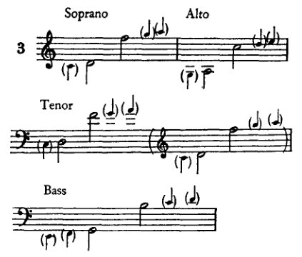

括号中的四分音符表示各音域两端的音，这些音可在必要时使用。显然，独唱音域——甚至合唱音域——实际上比此处所示的更大，或许也不尽相同，这里只求一个相当正确的平均值。主要应使用的中音区，位于最高音与最低音之上或之下四度或五度的位置，因此我们有：

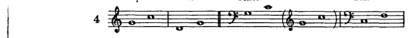

当然，学习者不能只靠中音区的音来应付，而必须使用一些高音区或低音区的音——起初自然只用相邻的音，但必要时也会用到最高或最低的音，如果别无他法的话。然而总的来说，他不应在很大程度上超出一个八度的界限；凡是想写出让歌者感到舒适的声部的人，即使在实际创作中，也会避免某一个外声部长时间专门停留在极端音区。因此学习者只应短暂进入这些音区，并尽快脱离。每当实践中对独唱或合唱声部的处理与上述不同时，那是因为作曲家在追求某些与我们现在目标无关的写作或音响效果。

各种嗓音的特点，加上经验的支持，指明了它们在合唱写作中结合的要求。如果不想让某个声部突出，那么所有声部都应选择音响潜力大致相同的音区。因为，如果一个声部在更明亮的音区演唱，而其他声部在较暗淡的音区进行，那个声部自然会相当显眼。如果刻意要让这个声部突出（例如，当内声部承担旋律时），那么让它在更具表现力的音区演唱是好的。但如果它无意中显得突出，那么指挥就得依靠音响层次的调节，他

<!-- page 48 -->

36 大调式：自然和弦

必须通过抑制突出的声部或加强较弱的声部来建立平衡。既然我们尚未涉及动机或旋律，这些问题在这里就几乎无关紧要了；然而，我们的任务本质上要求只使用那些适合特定情境、绝对必要的资源。学习这种精简之道无论对现在还是将来都只会有益于学生。

和弦可以排列成*密集*或*开放*位置。开放位置通常听起来柔和，密集位置则平均而言更为尖锐。当学生只关注以纯图示方式呈现和声关系时，将不会要求他在两种效果之间做出选择。因此，我们这里只需确认这一区别，并继续使用这两种位置，而无需追问其效果的基础或目的。密集位置定义如下：上方三个声部均演唱和弦音，其排列应紧密到无法在相邻的两个声部之间插入其他和弦音。只要距离不过大，低音与男高音之间的间距则不予考虑。如果上方三个声部中，相邻两个声部演唱的音距离足够远，以至于可以在它们之间插入一个或多个和弦音，那么该和弦即为开放位置。

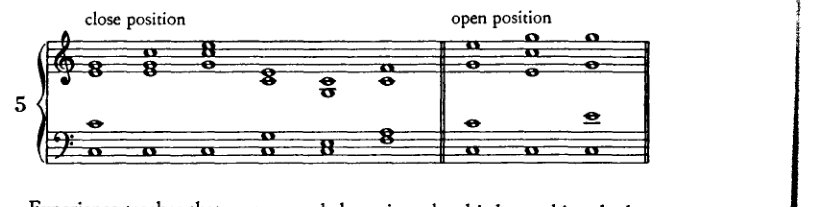

经验告诉我们，当上方三个声部中任意两个[相邻]声部之间最多不超过八度时，和弦最容易达到一般的平衡；但低音与男高音之间可以更远。当然，如果追求的不是这种平衡效果——这种情况与我们目前的任务无关——那么声部的排列就可以而且必须有所不同。

将三个和弦音分配到四个声部时，就有必要重复其中一个音。首先考虑的是根音，也称基础音，其次是五音，最后才是三音。这种优先顺序源自泛音列的本质。如果我们想通过合成来模仿自然音的音响，也就是说，如果我们想获得一种和谐性，它能唤起材料本身所固有的和谐感，那么我们就必须做与自然相似的事情。当根音——即在泛音列中出现最频繁的音——在实际和弦中也出现得更频繁时，音响就最接近自然。出于同样的原因，五音比八度[根音]较不适合重复，尽管比三音更适合。最后提到的三音将更少被重复，此外，还因为它已经作为调式——大调或小调——的决定因素而显得非常突出。既然音响效果以及其他非纯粹和声的因素不在我们这里的考虑范围之内，我们将总是以那种重复来构建我们的和弦

<!-- page 49 -->

和弦的排列 37

这是必要的。因此，由于在此处，五度音和三度音的重复起初是多余的，我们将仅限于*八度音的重复* [根音]。

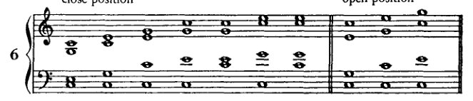

在谱例6中，C大调第一级音上的三和弦以多种开放排列与密集排列的形式呈现。学生的第一个练习是，以同样的方式，写出II、III、IV、V和VI级上的三和弦（VII级暂时省略），并遵循建议的声部音区；然后他应在其他一些调性中重复这一程序。练习须以高音谱号与低音谱号记写在两个谱表上。学生最好将女高音和女低音声部写在上方谱表（高音谱号）上，男高音和男低音写在下方谱表（低音谱号）上。通常，或根据具体情况，男高音也可能被写在上方谱表上，*此时男低音单独留在下方谱表上。此处给出的谱例大多采用C大调；然而，学生一旦在原调上掌握了一道练习，也必须在其他调性中进行练习。否则这些调性对他而言将始终是陌生的。

在此我们还应提及所谓通奏低音（thorough bass）或数字低音（figured bass）的方法，这是一种以前用于向羽管键琴演奏者提供作品和声骨架的音乐速记法。演奏者通过即兴演奏将这一骨架转化为音响，填充并充实所指示的和声。为此，人们在低音线条下方书写数字，以示意的方式表达最低音（即低音）与和弦中其他音之间的音程，但并不指明该音程是在同一八度还是在更高的八度上。例如：

\* 男高音的音域如谱例3中以低音谱号记写的那样。括号中相邻的音符（高音谱号内）指的是在*艺术歌曲*、歌剧、合唱音乐等中通常采用的记谱方式，即高音谱号中的音符按低一个八度来读。我们练习中的记谱法近似于钢琴总谱中的用法，即男高音音符无论出现在低音还是高音谱号中，均按实际写出的音高发声，也就是说，仿佛它们是写给钢琴而非人声的，*不进行八度移调*。

<!-- page 50 -->

38 大调式：自然和弦

数字 3–5–7 仅表示和弦组成音在密集排列法中的示意性顺序，但可以在 3、5 或 7 上添加一个或多个八度。数字“3”表示上方某个八度中有一个三度音；“5”表示上方有一个五度音；“7”表示一个七度音，“9”表示一个九度音，“6”表示一个六度音，等等，皆在某个八度中。至于在实际演奏中，这些音是按 3–5–7、5–3–7 还是 7–3–5 或其他顺序排列，则交由羽管键琴演奏者判断，其决定依据是声部进行的需要。和弦由与调号对应的音阶音构成，除非数字旁有特殊记号（♯、♭ 或 ♮）。原位三和弦——其符号本应为 5/3——则不标记数字。\*
 然而，如果在低音音符旁出现数字 8、5 或 3，这意味着最高声部（在我们的例子中是女高音）应唱出该 8 度、5 度或 3 度音。此时该和弦被称为八度位置、五度位置或三度位置。

自然主、副三和弦的连接

将和弦彼此连接这一问题令人满意的解决，取决于某些条件的实现。这些条件在此不是以法则或规则的形式提出，而是作为指示（正如我已经暗示过的，而且还将多次重申的那样）。法则或规则应当永远无条件地成立；而“例外反证规律”这一说法，仅对那些以例外本身作为唯一证明的规则才是成立的。然而，指示仅仅是为了传授达成某一目标的手段。因此，它们不像法则那样永恒成立，而是目标一变，它们也随之改变。尽管以下指示部分地符合作曲家的实践，但它们并非源于审美目的；相反，它们的目的是有限的：即，防止学生出现错——

\* 数字低音作为一种合理的速记法，旨在尽可能使用最少的符号。因此，只有那些并非不言自明的东西才被特别指出。每个低音音符都伴有 3 和 5，这一点被认为是不言自明的（在历史上也是如此）。这样的音符无需标记数字。另一方面，凡是有差异之处——且仅有差异之处——必须特别标明。严格按字面理解，低音音符下方的数字 6 也可以表示保留 3 和 5，并加入 6。但这里有一条补充原则来接管，用以指示 6/4 不协和音的位置；因此，可以用数字 6 代替更完整的 6/4，方法是将该单一数字专门用于单一位置，即六三和弦，而所有其他包含六度音的位置则至少用两个数字来标记。[此脚注为修订版所加。]

<!-- page 51 -->

三和弦的连接 39

有些步骤要到后面才能解释和说明。这些指示中的第一条要求，在声部进行中，首先*只去做那些为连接和弦所绝对必要的事*。这意味着每个声部只在必需时才移动；每个声部都要采取尽可能小的音程，而且不仅如此，还要采取那种能让其他声部也同样采取小音程的最小音程。因此，各声部将遵循（正如我曾听布鲁克纳说过的）*'最短路径法则'*。因此，每当两个要连接的和弦拥有一个共同音时，这个音在第二个和弦中将由与第一个和弦中相同的声部来演唱——它将被'保持'。现在，为了进一步简化任务，在我们的第一个练习中，我们只选择那些拥有一个或多个共同音的和弦（两个三和弦不可能拥有超过两个共同音），并将其中一个或多个保持，作为*和声纽带*[*共同音*]。¹ 下表展示了可供这些练习使用的和弦，也就是那些拥有共同音的和弦：

[表：两个展示音级之间共同音的表格。左表显示哪些音级与其他各音级共享共同音。右表按音级列出其拥有共同音的其他音级。]

| I | . | III | IV | V | VI | . |
|---|---|-----|----|---|----|---|
| . | II | . | IV | V | VI | VII |
| I | . | III | . | V | VI | VII |
| I | II | . | IV | . | VI | VII |
| I | II | III | . | V | . | VII |
| I | II | III | IV | . | VI | . |
| . | II | III | IV | V | . | VII |

| 音级 | 拥有共同音的音级 |
|--------|----------------------|
| I | III IV V VI |
| II | IV V VI (VII) |
| III | I V VI (VII) |
| IV | I II VI (VII) |
| V | I II III (VII) |
| VI | I II III IV |
| VII | II III IV V |

罗马数字表示音级。

可以看出，每个音级[三和弦]与除了它前面和后面紧邻的音级之外的其他所有音级都有一个共同音。这确实是显而易见的。第二音级是*d–f–a*。两个相邻音级的根音（例如*c*和*d*）彼此相隔一个音级；因此，三音（*e*和*f*）和五音（*g*和*a*）也同样相隔一个音级。因此，没有共同音。另一方面，那些根音相距五度或四度的和弦有一个共同音，而那些根音相距三度或六度的和弦则有两个。

---

¹ 'Harmonisches Band'。勋伯格在其他地方也使用过'gemeinsamer Ton'（common tone）这一表述；但他显然更偏爱'harmonisches Band'（harmonic link, or tie, or bond），或许是因为它更强调连接的概念。'Common tone'，英语中通常使用的这个表达，在这里似乎更合适。参见后文，第六章。

<!-- page 52 -->

40 大调式：自然和弦

| | | | | | | |
|:--|:--|:--|:--|:--|:--|:--|
| C | C | | | | | |
| D | | D | | | | |
| E | E | | E | | | |
| F | | F | | F | | |
| G | G | | G | | G | |
| A | | A | | A | | A |
| B | | | B | | B | B |
| C | | | | C | | C |
| D | | | | | D | D |
| E | | | | | E | |
| F | | | | | | F |

如表所示，在需要共同音的前提下，I 级可以与 III、IV、V、VI 级连接。

*在这些最初的练习中，根音应始终是和弦的最低音，即置于低音部。* 低音部应始终是最低的声部，次中音部在低音部之上，然后是 Alto 声部，最高声部为 Soprano。学生应完全避免*声部交叉*，即将较低的声部写得高于较高的声部（例如次中音高于 Alto 或 Soprano）。首先，学生应在[将承载]低音谱线的谱表下方写出罗马数字，标明要连接的和弦级数；然后他应写出第一个和弦的低音，并继续添加其他三个声部来完成第一个和弦。是采用密集排列还是开放排列，三度、五度或八度置于最高——这由他自行决定，*但在开始完成练习之前。这样，他自己设定了练习，*这一程序我们将在整个课程中遵循。在*排列*每个和弦时，学生若能按顺序先回答以下问题，将最容易避免错误：

**第一个问题：**哪个音置于低音部？（该级数的根音，即基础音。）

**第二个问题：**哪个音置于 Soprano？（根据他选择将八度、五度或三度置于最高，他的选择应通过在标明级数的罗马数字旁放置 8、5 或 3 来表示。）

**第三个问题：**缺少什么？（仍然缺少的一个或多个音将以这样的方式排列，形成密集或开放排列，由学生自行选择。）

现在进行和弦连接，学生最好*问自己以下问题：

**1.** 哪个音是根音？（记住：它置于低音部！）

---

\* 根据多年的教学经验，我强烈建议学生通过实际提出和回答这些问题来完成练习。这样做比仅仅跟随耳朵的指示或记住某种特定的音符模式，更有利于获得更深入的理解和技巧。他将很快习惯于快速思考这些问题，事实上快到即使在钢琴上完成练习时（他也应该这样做，务必如此）也不会忽略它们。这种方法的优势在于，学生在每一步都进行有思考的练习，快速思考，完全意识到自己在做什么，因此不依赖于记忆和储存在那里的一些现成方法。

<!-- page 53 -->

三和弦的连接 41

2. 哪个是共同音？（保持！）
3. 还缺少哪些音？

再者，为了避免那些要到以后才能解释的错误，我们在最初练习的开始和弦中，始终只重复八度[根音]。正如学生将会看到的，其后的和弦因此绝不会以重复五度音或三度音的形式出现。这些重复音仅在声部进行需要时才使用，因为此处我们不涉及音响效果（*Klangliches*）。

那么，我们将借助这些问题来连接 I 和 III，如下所示（例 8*a*）：

1. 低音（III 级）：*e*；
2. 共同音：*e* 和 *g*（在高音部和中音部保持）；
3. 缺少的音：*b*（次中音部从 *c* 进行到 *b*）。

请注意：学生应始终将和弦连接理解为声部运动的结果。因此，他不应说：‘我把 *b* 给次中音部’，而应该说：‘次中音部从 *c* 进行到 *b*’；他不应说：‘我把 *e* 给高音部，把 *g* 给中音部’，而应该说：‘*e* 在高音部保持，*g* 在中音部保持’。

学生必须区分 *根音* 与 *低音*。（前者是三和弦赖以建立的音，也是该级名称的由来；因此，IInd 级的根音是 *d*，IIIrd 级的是 *e*，以此类推。另一方面，低音则是被置于低音部的那个音。）在我们的最初练习中，且在给出其他指示之前，我们 *始终将根音置于低音部*。然而，稍后，根音以外的和弦成分也将进入低音部；因此，学生必须谨防混淆这两个概念。

目前我们将以全音符来作练习，不用小节线。

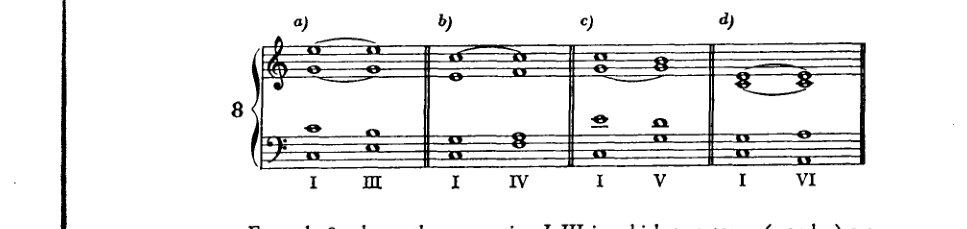

例 8*a* 展示了 I–III 的连接，其中有两个共同音（*e* 和 *g*）；在 8*b* 和 8*c* 中（分别为 I–IV 和 I–V），只有一个共同音，在 I–VI [8*d*] 中则再次有两个共同音。学生应以连线标示共同音的保持。

按照这一模式，学生现在应练习将其他各级分别与可用的和弦连接，如表所示：即，II 与 IV，然后与 V 和与 VI（*VII 级目前根本不应使用，因为它需要特殊处理*）；III 级则要与

<!-- page 54 -->

42 大调式：自然音和弦

I、V 和 VI；第 IV 级与 I、II 和 VI；依此类推，直到第 VI 级（此处也省略 VII）。

---

自然音正、副三和弦在短乐句中的连接

学生接下来的任务是用他现有的六个和弦来构建短乐句。这些乐句应在现有手段允许的范围内，表现出一定程度的多样性，并尽可能生动有趣。学生还应力求在这些练习中获得某种效果，即使目前只是雏形——这种效果我们日后将以更充分的手段、因而以更坚定的决心去追求：即在某种程度上表达调性。要创作出符合这些要求的乐句，我们必须满足一些条件。（注：同样，这些条件并非永恒不变的法则，尽管这类法则相对而言并无害处；因为几个例外就会在一瞬间将“法则”与“永恒”消解。它们更像是指导方针，只有在目标值得付出努力时才应遵循，一旦出现更高的目标，便应将其搁置一旁。）当然，乐句必须很短，因为仅有六个和弦可用，而它们可容许的连接还受到其他条件（共同音）的限制。如果重复不能从周围获得变化的色彩，或者本身不具有某种目的，就很容易变得单调，无谓地单调；否则，被重复的和弦便可能在其他和弦中取得非同寻常的意义，因为重复通常意味着加强。因此，只要我们的目的不是让某个和弦获得这种非同寻常的意义，一般应避免重复。目前，我们只能为一个和弦设定此目的，即第 I 级——确立调性的那个和弦。通过重复，我们将使这个和弦在我们的短乐句中显得突出，从而表现出调性，即使目前还不够令人信服。实现这一重复的最实际安排，就是简单地将这个和弦置于首尾；因为最初和最后的印象留下的印记最深。此外，如果尽可能推迟该和弦的重复，以便在此期间出现某种不同的东西、某种对比，就能获得一些变化。因此，我们设定的第一个条件如下：*乐句以第 I 级上的三和弦开始和结束。* 因此，由于需要共同音，倒数第二个和弦必须能够根据我们的表格与第 I 级连接：这样，它必须是 III、IV、V 或 VI。为了防止因练习过长而不可避免地出现错误，我们一开始就满足于连接四到六个和弦。其中第一个和最后一个将是 I；因此，在这两者之间最多插入两到四个其他级数，宁少勿多，因为应当*避免**重复*。

按照表格，学生现在可以自己设计练习，从第 I 级开始，然后在其后接一个与它拥有共同音的级数：例如，首先是 III。然后他将在表格中寻找一个

<!-- page 55 -->

可以跟在 III 后面的音级有 I、V 和 VI。然而由于 I 已经使用过，而且只能重复一次，它的重复会使乐句过早结束；因此他会选择 V 或 VI。为了系统地进行，我们在第一个例子中使用 V，于是到目前为止读作：I, III, V。如表所示，在 V 之后可以接 I、II 或 III；由于 I 和 III 已经用过，II 将是下一个和弦。不过这样例子至少会延伸到六个和弦。为了使第一个例子尽可能简短，我们现在用 I 来结束这个例子。因此它读作：I–III–V–I。这些连接现在应该按照建议的连接和弦的方式精确地处理，通过回答那三个问题。（见下面的例11a。）

在构建其他小乐句时，学生最好系统地推进，即再次从 I 和 III 开始，在 III 之后作不同的继续：例如，I, III, VI；在 VI 之后，一个乐句中可以接 I，另一个乐句中可以接 IV 然后接 I。当所有以 I–III 开始的情况都处理完毕后，他可以接着从 I–IV 开始，然后从 I–V，最后从 I–VI，每次都作不同的继续。

这里我们应该对声部进行多说一些。它应该是旋律性的。然而，"旋律性的"在这里不应该被理解为声部进行必须像歌曲那样富有表现力或优美、具有丰富的装饰音或甚至具有清晰的句法。这种意义上的"旋律性的"在这里是不可能的，因为所有前提条件都不具备。我们这里是在没有节奏的情况下工作，因此没有动机，[旋律性的]句法和装饰在没有节奏的情况下几乎是不可想象的。我们目前所应理解的"旋律性的"，或许最好这样表达：声部不应该是不旋律的，也就是说，它应该避免那些让我们感到不愉快的音程和音程进行。因为这类情况很难找到标准；以前被认为是不旋律的东西，今天常常被认为是旋律性的。例如，贝勒曼¹认为有必要指出，亨德尔在一条旋律中使用了一个小七度跳进。当然十五或十六世纪的作曲家不会这样做，但十六世纪的标准在十七世纪已经不再适用。大多数其他规定也是如此，比如有些人可能会根据亨德尔的旋律为我们的时代制定一些规则。这些规则甚至很难与海顿、莫扎特和贝多芬的线性技法完全吻合，更不用说舒曼、勃拉姆斯或瓦格纳的了。

然而现在应该考虑到，在纯和声操作中，旋律方面仍然处于背景位置，如前所述，因为动机缺失了，不仅排除了更丰富的装饰的必要性，而且也排除了这种装饰的契机和诱因。我们目前的

---

¹ 海因里希·贝勒曼，《对位法》（第4版；柏林：尤利乌斯·施普林格，1901），参见第104–5页。

在1938年致胡戈·莱希滕特里特的一封信中，勋伯格将贝勒曼的著作列入一份曾引起他兴趣的德国音乐理论书籍清单。他评论说，这些书"可能有助于[使美国人]摆脱他们僵化的美学观念"（《书信集》，第206–7页）。遗憾的是，贝勒曼的著作没有英译本。]

<!-- page 56 -->

44 大调式：自然和弦

我们的职责只能是写出连接和弦所必需的级进或跳进：也就是说，通常尽可能少的移动。因为声部移动越少，声部进行中的错误就越少。然而，由于外显声部——即所谓的两个外声部（女高音与低音）——的进行本身会吸引一些注意力，而且某种单调感可能会损害和声效果的印象，因此稍后有必要提及一些补救方法。目前我们只考虑低音，因为只有低音经常作较大的跳进，而其他声部大多以级进移动。所以，现在只需提及低音中可能出现的这类错误。当然，我们所说的有一部分是当今不会有人反对的进行。尽管如此，旧和声理论要求避免这些进行，在某种程度上是正确的。这些要求的理由在我们现在看来可能站不住脚。但由于我们在这些小乐句中编写的是最简单的音乐练习——其音乐效果如此原始，以至于习惯于瓦格纳和声自由风格的耳朵对它们几乎有理由不加批评——正因为它们如此简单，建议不要依赖当今的听觉，而依赖那个时代的听觉。那个时代的审美感无疑从材料中获得了与这种简单形式的总体效果相一致的满足。那么，如果这些小乐句即使在现在也应该有*风格*——正如一切应该培养艺术敏感性和形式感的东西都应该有风格一样——也就是说，如果它们即使在现在也应该在效果与手段之间表现出某种平衡，那么考虑旧和声理论给出的指示将是有益的。当我们的手段变得更丰富时，也就是说，当我们有更大的可能性储备来从材料中取得效果时，我们可以而且应该毫不犹豫地放弃这些指示。我们甚至不把这些指示当作规则，即只有通过例外才能悬置的东西。它们只是指示，仅此而已。而且很明显，不是吗，我们考虑它们只有一个原因：只有当我们对手段的使用适合其简单目的时，我们才能获得风格上正确的结果。

这些指示之一[关于低音的处理]是：*应避免同一方向上连续两个四度或五度的跳进*，因为*第一个音与最后一个音形成不协和音*。或者，说得更一般些：同一方向上的两个跳进，若其音程相加为不协和音，则听起来缺乏旋律性。

例如：

<!-- page 57 -->

*短乐句中的三和弦* 45

这一指示从旧和声学理论的角度来看是完全正确的。其指示主要针对声乐作品，这些作品经常是在没有伴奏的情况下演唱的，即*无伴奏合唱*（*a cappella*）。演唱者无论是职业歌手还是业余爱好者，大多视唱其声部，没有太多排练。这种表演中的视唱实践是所有其他要求所适应的前提。因此，为声乐写作意味着，最重要的是尽可能避免困难。由于歌手与器乐演奏者不同，既没有固定音高，也没有任何指法可以为他提供固定音高，所以某些音程即使到今天也会给他带来音准困难。即使可唱范围的范围在持续扩大，这种进步仍然比器乐音乐中相应的进步要慢。毕竟可以理解的是，耳朵不仅在同时发声的音响中、在和弦中抵制不协和音（更遥远的泛音），而且在音的连续中、在旋律线条中也是如此；耳朵不能那么快地领会它们；耳朵将它们感知为障碍，并渴望它们的消除，渴望它们的解决。耳朵之所以允许不协和音的存在，可能恰恰是因为解决，因为这种效果所引起的满足感。对听众来说，不协和音、它向解决的动力以及解决本身，可能是令人愉悦的；但对歌手来说，这种障碍可能会变得麻烦。

这两条旋律指示中的第二条写道：*任何声部不得作大于五度的跳进*（八度跳进，其效果几乎与重复同一音相同，自然是被允许的）。为什么七度跳进不应使用，从上面关于不协和跳进所说的内容已经清楚了。为什么六度跳进也不应使用，则不那么清楚。贝勒曼¹报告说，这种跳进的效果从前被认为是纤细的、弱的（*weichlich*）。这很可能属实，但必定有一个原因。我认为可以在两种情形中找到这个原因，虽然它们产生的不是纤细而是相反的东西——粗糙，但 nevertheless 解释了为什么应避免这种跳进。称一个很少使用、不习惯的音程为纤细或弱是否正确，是相当次要的问题。一个原因很可能在于六度跳进所带来的各种声部进行困难：这种跳进需要空间，而且常常出现某些禁止的平行进行（这些将在后面讨论）。

第二个原因可能是六度对耳朵来说不那么熟悉；因为，虽然在泛音列中这个音程确实作为基音的关系出现（*e–c*），但它出现在相反的方向：基音在三度之上（*c, c, g, c, e, g, c*）。因此，它实际上听起来更陌生，那么当时就应该

---
[¹ 贝勒曼，*同上*，第105页。]

<!-- page 58 -->

46 大调：调内和弦

被称为刺耳而非精致。可能由于这两个原因，六度跳进即便有也极少被使用。因此，由于缺乏使用，它听来可能显得怪异、不合常规；而且很可能只是由于误解，它才被描述为精致。

例11中现在给出一些完整的乐句，这些乐句是我们按照表格汇编而成的。

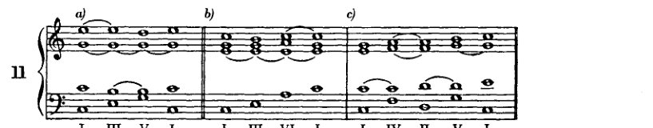

学生也可以通过选择另一种音程排列（以密集排列代替开放排列，或以开放排列代替密集排列），或将五度或八度置于最高声部而非三度，来编配这些完全相同的例子。十分有必要将每一个新的作业也在其他调中进行练习，但不是简单地通过移调，而是在每个调中重新构建该练习。

第七级音

第七级音上的三和弦，即减三和弦，需要特别考虑。其结构与我们见过的其他三和弦不同，后者至少有一个共同点：纯五度。第七级音上的三和弦含有一个减五度；这样的五度在较近的泛音中并不存在，因此听起来是不协和音。不协和音需要特别处理，以及出于何种原因，我之前在论述它出现在相继的音之间时——即在旋律进行中（同方向的两个连续五度或四度）——已经说明过了。¹ 显然，当不协和音的音同时出现时，它更加刺耳。听众可能会听不到由先后相继的音所产生的不协和音，例如，如果他忘记了前面相关的音。而由同时发声的音所产生的不协和音，他不可能听不到。

不协和音究竟是如何开始被使用的，只能凭推测。这必定发生得相当缓慢；将较远的泛音——即不协和音——与协和音相混合的尝试，起初必定只是偶尔为之，并且极为谨慎。我想象，最初不协和音仅仅是让其快速掠过，可以说，大致如下：在某一

[¹ *见前文*，第44–5页。]

<!-- page 59 -->

第七级 47

在持续的三和弦 *c–e–g* 中，可以说，一个旋律声部从一个长时值的 *g* 经由一个极为短暂的 *f* 下滑到一个长时值的 *e*。这有点像一次或多或少完整执行的滑音或滑奏（口语中称为\* 'Schmieren' [抹音、滑音]），其各个音几乎难以分辨。后来，这些音中的某一个可能被固定为音阶音。因此我认为，不协和音最初出现在从一个音经由中间音过渡到另一个音的过程中，而这种过渡源自滑音，源自缓和跳进、将不连接的音以旋律方式连接起来的意图——在此是通过音阶级进。这种意图与另一种意图，即也利用较远的泛音，恰好重合，这或许只是一个幸运的巧合，正如历史演化确实常常产生的那样。然而，也许这根本就是同一个原理，滑音只是它得以实现的形式之一。滑音也可能像音阶一样，是泛音列的横向重组。如果耳朵在中途停了下来，如果它没有选择那些实际上构成一个音的不协和泛音，而是选择了风格化且被调和的平均之音，那么这可以解释为目的与可达成性之间的一种折中，正如我先前在讨论音阶起源时所提出的那样。

使用这种触及不协和音的装饰音，在当时被允许以所谓 'Manieren' [装饰音]¹ 的形式出现，甚至可以说几乎被当时的审美趣味所要求。这些 '装饰音' 无法被记谱，因为记谱系统没有代表它们的符号；因此，相关的音型——倚音、颤音、滑音等——只能通过传统口传心授。然而，由于它们的使用，这些装饰音中所触及的不协和音属于主音的感觉，可能已逐渐渗入分析之耳的意识之中，从而产生了将至少一些出现较频繁的音固定在记谱中的欲望。

那么，经过音无非就是被固定于记谱中的一种 'Manier'。正如记谱总是落后于音响（不仅在旋律中如此，也许在节奏中更甚，在那里，由于小节线的强制，书面符号往往甚至连大致正确都谈不上），因此

---
\* 此处应当指出，音乐也有一种口语形式，可以作为解释历史发展的证据来源，正如民间口语之于书面语言一样：即民间音乐。因为除了包含自身发展过程中产生的独特产物之外，它也包含了更早时期的音乐惯例。此外，还应当审视并重新评价那些平庸与陈腐之物。在大多数情况下，它们结果并不会显得真正 *粗俗*，而只是因使用而磨损、过时。*陈腐不堪*，正如业余爱好者喜欢说的那样。

¹ 参见 C. P. E. Bach，*Essay on the True Art of Playing Keyboard Instruments*，William J. Mitchell 译（纽约：W. W. Norton, Inc.，1949 年），第 79–146 页：*Manieren*（装饰音或润饰音）“连接并赋予音以生气，并赋予重音与强调……表情因它们而增强……没有它们，最好的旋律也是空洞而无效的”（第 79 页）。

在勋伯格看来，*Manieren* 在音乐中具有更为深刻的功能；他认为它们是音乐演变的主要途径，通过它们，隐含的变成了显在的。参见下文，第 320 页，第 331–2 页，各处。]

<!-- page 60 -->

48 大调式：自然音和弦

这些装饰音的记谱法，若用以评判作曲家们无疑曾想象过的音响，当然也是不完善的。然而，它可以被理解为人类智力为了驾驭素材而必须做出的那些简化之一。此处同样盛行着一种假设，即简化对象（*Sache*）的那个体系，被当成了对象本身所固有的体系；并且我们可以有把握地假定，我们传统的不协和音处理方式，虽然最初基于一种正确的直觉，但其发展却更多地是在完善那个简化体系，而非真正达到对不协和音本质的理解。如果我在此处仍保留这种同样的不协和音处理方式，或许我也会陷入同样的错误；但我可以举出两点对我有利的考量：第一，我所给出的是遵循该体系所必需的指引，但（正如我常强调的）并非作为规则，亦非作为美学；而第二点是，我们当今的耳朵不仅受到自然加诸其上的条件的熏陶，也受到该体系所产生的条件的熏陶，该体系已成为第二自然。目前我们几乎无法，或只能逐渐地，摆脱这一人造的文化产物的影响；并且，*对自然的反思*或许对认识论有价值，却未必因此就能立刻结出艺术果实。可以肯定的是，这条通向自然之新奥秘的道路，迟早也会再次被踏上。可以肯定的是，这些奥秘届时也必将再次被稀释精简，以构成一个体系；但首要的是，必须先将旧体系清除掉。我在此所阐述的这一思想路线（*Erkenntnis*），或许可以作为达到该目的的一种手段。

由经过音所导致的不协和音记谱法，或许促成了对不协和音这一现象本身的确认。人的内心有两种冲动在相互斗争：一是对愉悦刺激之重复的要求，二是与之相反的对多样、变化、新刺激的渴求。这两种冲动常常汇合为一种相对普遍的、猛兽般的冲动：占有的冲动。接下来究竟是重复还是变化的问题，暂时被抛在一边。占有意识所带来的那种更为强烈的满足感——连同其可以朝此或彼方向作出决定的可能性——能够压制那些更为细腻的考量，并导向那种永远为所有权所特有的保守性安宁。面对究竟是重复刺激还是创新更为可取的两难困境，人类的智力在此处也同样决定占有；它创立了一个体系。

于是也可以这样想象：一个由记谱法确立的不协和经过音的偶然出现，在其带来的兴奋感被体验之后，唤起了对不那么偶然、不那么随意的重复的欲望；想更频繁地体验这种兴奋感的欲望，如何导致人们将产生它的方法据为己有。但是，倘若这种对禁忌的兴奋导致无节制的沉溺，就必须做出那种本质上可鄙的、在道德与无度欲望之间的妥协，这种妥协在此体现为对禁令以及被禁之事物本身的更宽松理解。不协和音被接受了，但一旦过度威胁出现，接纳它的大门随即被闩上。

这种对不协和音的*处理*，其中融合了心理学与实践上的考量

<!-- page 61 -->

第七音级 49

功能扮演着同样决定性的角色，也可能以这种方式产生。听众想要享受刺激，但又不想被危险过度惊吓，这种谨慎与歌手的谨慎是一致的。而作曲家既不敢破坏任何一方的兴致，便发明了一些迎合这一目标的方法：我如何将听众置于悬念之中，我如何惊吓到他，但又不过分到以至于我再也无法说，“这只是开个玩笑”？或者：我如何缓慢而谨慎地引入那些确实必须出现的东西，如果我不想让听众感到厌倦的话；我如何说服他也接受酸葡萄，以便甜葡萄——即不协和音的解决——能更加愉悦地刺激他？我如何促使歌手不由自主地唱出一个不协和音，尽管可能存在音准上的困难？我不让他察觉它的进入，并在灾难性的时刻对他耳语：“放松点！它差不多已经结束了。”谨慎的引入与悦耳的解决：这就是这套体系！

因此，预备和解决是一对保护性包装，不协和音被小心地包裹其中，这样它既不会受到伤害，也不会造成损害。

现在，将其应用到我们当前的案例——减三和弦——这意味着不协和的减五度将被预备和解决。在减三和弦中，不协和音不可能是除五度以外的某个音，这一点不仅源于与泛音的比较——在那里，基音总是带有一个纯五度——而且也源于与其他三和弦的比较，它们都带有纯五度。不协和音的处理方式有多种，首先是各种解决方式，但也有各种引入方式。我们将遇到的第一种、也是最简单的引入形式是预备。在这里，那个将要成为不协和音的音，应该已经由同一声部在前一个和弦中唱出，作为*协和音*。这一预备的目的显然如下：先将该音引入，在那里，它作为大调或小调三和弦的*协和的*组成部分，不会给歌手带来任何困难；然后保持它，同时其他声部以这样一种方式运动，使它转变为不协和音。作为我们的第一种解决形式，我们将采用一种从心理学角度看其实用性显而易见的方法。也就是说，如果在和声进行中通过插入不协和音设置了一道障碍，有点像溪流中的水坝，那么这种阻力应当会积聚一股能量，以某种可称之为“全力冲击”的方式冲破障碍。应当用一种有力的进行来跨越这道障碍。从Vth音级到Ist音级的跳进就可以被视为这样一种有力的进行。更广泛地说，这是根音向上跳进四度。\* 我在对“属音”概念的批判中已经指出，主音对属音施加了多么强烈的吸引力。我还进一步提到，每个基音都有一种被下方五度的基音所压倒、所征服的倾向。如果我们顺应基音的这种倾向，顺应它向更高、更强的单位解决的倾向——在那里它将成为一个从属成分，顺应它为比自身更伟大的事业服务的倾向，那么可以说，我们实现了

\* 其实我更该说，“向下跳进五度”。鉴于第116页注释中给出的理由，我在这里更倾向于使用这种表述。

<!-- page 62 -->

50 大调式：自然和弦

基音最迫切的渴望：也就是说，我们进行最强烈的跳进。因此很清楚，将这最强烈的跳进用于诸如不协和音出现于我们当下和声生活之中这样的特殊场合，其必要性正如我们在社会生活中为节庆场合穿上节日盛装一样。当然，也有其他手段可以解决不协和音；而且一旦它因频繁使用而失去了现在对我们所具有的那种不寻常性，我们便会不那么讲究地对待它，也不会总是立即采用最强有力的手段。

如果在解决减三和弦的不协和五度时，我们让根音向上跳进四度（或向下跳进五度），那么解决VII级的和弦就是III级和弦。¹

这里的不协和音本身通过向下移动一步，从*f*到*e*，而得到解决。不协和音与解决和弦之间可以有多种不同的关系。它可以下行、上行或保持不动；但它也可以通过跳进离开。在我们的第一个示例中，我们选择让它下行，也就是说，按级进移动到下方相邻的音级。这一处理方式的原因之一是，这个如此引人注意的声部随后便成为那个我们发现极其适合解决不协和音的基音的八度。因此，这个声部可以说确认了基音倾向的实现。但还有另一个原因，我们以后有机会再作解释[第81–2页]。

这里，若要获得完整的和弦，我们有时不得不舍弃共同音。如果共同音*b*保持不动（示例 12*b*、*c*、*d*），那么拥有*d*的声部便被迫向上或向下跳进至*g*。这种跳进常常会造成困难，例如在12*b*中，由于向下跳进，中音会低于次中音；或者，如果中音声部进行到较高的*g*，它就会高于高音。但是，正如我已经说过的（第40页），我们应该避免*声部交叉*。12*c*这一解决方式是好的，也是有用的。只是，由于这里上方声部作跳进，有必要对它的旋律线条以及后续进行给予一定的关注。另一方面，12*d*中的进行会使两个相邻声部产生过大的分离，无论中音声部向上还是向下跳进。在第一种情况下，中音与次中音相距一个十度；在第二种情况下，中音与高音相距一个十度。我们应尽可能始终避免那种排列，因为正如经验所表明的，它会产生一种不够

---

¹ 为了力求系统化并使学习者受到严格的训练，Schoenberg在此提出了一种不寻常的VII级减三和弦的解决方式，而将更常见的处理推迟到后面（Chapter VIII）再讲。

<!-- page 63 -->

VII级 51

均衡的音响。（每当这类情况出现在音乐文献中时，它可能是刻意安排的，也可能是其他更重要目标的副产品。）因此，此处12e给出的解决方案（不保持共同音）更为可取。学生可以根据乐句的需要，有时使用共同音，有时则不使用。与此相关的考量将在稍后讨论各声部的旋律倾向时进行分析。目前我只建议，最好不要过于偏离乐句开始时的声部间距，而一旦必须偏离该间距，则应尽早回到原来的状态。

在这里，我们有必要提出一个相当重要的见解。在最初的作业中，我们只写那些允许保持共同音的和弦进行。那看起来[那时]是一条规则，但它并不是。它的目的其实只是为了确保八度[根音]的重复，并避免某些其他声部进行上的困难，这些困难将在以后讨论。现在，偶尔有必要忽略共同音。因此，先前的指示被更高的必要性所中止。我们并不是在制定「规则的例外」，因为我们根本没有规则；我们有的只是指示，它既有所给予，亦有所索取。某些错误得以避免；因为，尽管这一指示确实排除了一些可能好的东西，但它也排除了另一些可能引起错误的写法。一旦学生在这种限制下获得了足够的熟练度，并且每当更高的必要性要求时，他就可以放弃这种简化。总的来说，我们确实会继续遵循这样一种做法：让声部仅作绝对必要的移动，无论多寡。然而——这一点应该在此说明——每当更高的必要性要求时，每一项指示都可以被中止。因此，这里没有永恒的法则，只有指示；只要它们没有被其他条件全部或部分地中止，它们就是有效的：也就是说，只要没有其他条件被施加。

关于VII级三和弦中哪一个音适合重复的问题，应该这样说：我们当然会优先选择根音，这不仅是因为到目前为止我们一直在做根音重复的练习，而且也是因为我们在其他三和弦中优先选择根音的同样原因。至于是三音还是五音，则是另一回事。现在三音优先于五音，因为VII级既不是大调也不是小调，而是一个减三和弦。在这里，三音并不决定调式，因此不那么显眼。另一方面，五音作为一个不协和音，是VII级中最显眼的音，单就这一点也不应重复它。此外，作为我们将要解决的不协和音，它被迫按某种特定方式移动：即向下级进。如果我们重复它，那么另一个出现该音的声部也将不得不向下级进（12f）。这样一来，就会产生某种声部进行，关于这一点稍后还要详述。目前只要说两个声部会进行同样的级进就足够了。这是多余的，因为一个声部就足够了。因此，减五度不应被重复。

现在谈预备。不协和音在前一个和弦中必须是协和的，然后在同一声部中保持下来，同时变成

<!-- page 64 -->

52 大调式：自然音和弦

不协和音。音阶中的每个音都出现在三个不同的自然音三和弦中：一次作为根音，一次作为三音，一次作为五音。我们不协和的 *f* 是 IV 的根音、II 的三音、VII 的五音；因此第四级和第二级上的和弦可供我们使用[作为预备和弦]。对于我们在 [p. 40f] 中提出的[作为指导原则的]连接协和和弦的三个问题，现在新增了一个。因此现在问题如下：

1. 哪个音是低音？
2. 哪个音是不协和音？（如果存在不协和音，那么是预备还是解决，取决于当下需要关注的是什么。）
3. 共同音？（尽可能*保持*，因此，不再是一成不变的。）
4. 缺少哪个音（或哪些音）？

例 13 展示了几种预备和解决。在 13*a*、*b* 和 *c* 中，预备是通过第四级实现的（因为这里需要预备的音是预备和弦的八度音，这被称为：*通过八度预备*），在 13*d* 和 *e* 中则通过第二级实现（*通过三音预备*）。

学生现在应该在尽可能多的例子中练习第七级的预备和解决（也包括其他调！）。音级进行应为：IV、VII、III 或 II、VII、III。*在 VII 之后，我们暂时只使用 III；在 VII 之前，只使用 IV 或 II。* 一旦学生掌握了处理第七级的足够技巧，他就应该继续在小乐句中使用它。*不言而喻，在这里 III 也必须始终跟随 VII，IV 或 II 必须引导它。* 至于其余部分，学生完全可以依照表格（p. 39）行事，其中与第七级相关的限制现已取消。

三和弦的转位

在我们迄今为止完成的作业中，和弦的各成分如何在上方声部分配实际上无关紧要；并且只施加了一个条件，即低音必须始终

<!-- page 65 -->

*三和弦的转位* 53

以根音为低音。然而，种种情况要求——也允许——让根音以外的和弦音出现在低音部。它们要求如此，也允许如此：这是一种必然，也是一种优势。这种显著的巧合几乎会出现在艺术中所有的技术考量里。倘若一种必然性除了仅能满足其最低要求之外，不能带来其他好处，那么人恐怕不会服从它；同样，倘若一种优势的出现并不依附于某些必然性的实现，那也是不大可能的。这看起来神秘，也确实如此：人因为必然性的驱使而做某事，却无意间创造了美；或者人出于创造美的冲动而行事，却因此满足了必然性。这正是那些让生活值得过的奥秘之一。这种回报会在真正的艺术与真正的道德中自动显现，令全心求索的人在高于其预期的层面感到惊喜。然而，聪慧的匠人，聪慧的艺术匠人，从一开始就会将此纳入考量。在他看来，为了眼前的一点好处而对基本结构做出本质性的改动，是不明智的。即便对有机体的基本结构只做微小改动，也会产生深远的后果。即便这些后果并非立即可见，日后也必定会出现。因此，他只有在能够预见若干可能的后果，并能预先估量和权衡其价值或无益时，才会允许这样的改动。可以肯定的是，如果这种改动违背该有机体的本性，那么其后果多半是有害的，而引起这种改动的表面上的必然性，应追溯至一种错误的判断。然而，如果这种改动确实符合该有机体的本性，符合其发展倾向，那么这种客观正确的措施不仅会带来人们预期的那些优势，还会带来其他未曾刻意追求的优势。反之，如果人出于想从一个有机体获得新的效果——即其本性所固有的效果——的愿望出发，那么结果总会表明，他同时也在服从该有机体的某种必然性，在促进其发展倾向。

将这些观念应用到我们当下的问题上，我们发现如下：任何以根音为低音的和弦排列，都最贴近地模仿了该音与其泛音之间的声学关系。一旦我们将另一个音置于最低位置，我们就偏离了自然原型。那么，这好吗？这既是好的，也是不好的；此时更好，彼时更差；此时更强，彼时更弱。毋庸置疑，给一个和弦配置根音以外的低音，即使不是更弱的效果，也至少会产生不同的效果。如果我们假设最不利的情况，即这是一种更弱的效果，那么以根音为低音、对自然音的精确模仿就是更强的。由此便产生了这样的可能：时而以更强的效果、时而以更弱的效果来配置和弦，从而赋予它时多或时少的意义。然而，这可以是一种艺术上的优势！因为，如果在较长的乐句进行中，比如说一个大约包含十个和弦的乐句，有必要重复某个和弦（毕竟我们只有七个），那么这个和弦就会比其他和弦更显突出，正如我已经指出的那样。如果它理应如此，那便一切安好；但如果它不该如此突出，却又不得不重复，那么我们就必须考虑这个的效果如何

<!-- page 66 -->

54 大调式：自然和弦

重复可以被弱化到如此程度，以至于重复的和弦不会获得不当的重要性。当按照这一目标，让同一和弦的较弱形式跟随其较强形式出现时，那么较弱形式就不容易损害较强形式的效果；而且之后第二次以较强形式重复时，仍然可能产生足够的效果。也许这正是为什么在宣叙调中六和弦——三和弦较不完整的形态——被如此频繁使用的原因：为了表达过渡，为了推迟对随后咏叹调调性的明确承诺。然而，六和弦的效果不仅较弱，而且也有所不同。这种情况自然只会带来好处。最重要的是：变化与层次。

如果说将根音以外的音放在低音部被证明是有利的，但这并不意味着可以随意放弃这些优势。因为这些优势不仅是所有和声写作的必需；不仅有必要区分和弦的效果，根据其价值进行层次处理，注意变化：所有这一切还在两个方面与低音声部的需要相吻合。一方面，除了使用六和弦之外，往往无法使低音线条更具旋律性，或赋予其更大的旋律变化；另一方面，低音声部的音域限制所施加的条件，也常常使我们选择六和弦。

因此我们发现以下情况：如果我们以让低音声部进行更具旋律性为目标，并为此使用六和弦，那么我们会获得额外的、意想不到的优势，即六和弦不会损害同一三和弦先前或随后的出现。事实上，这些重复可能只有通过使用六和弦才成为可能。此外，这一和弦为根音位置的三和弦环境带来变化。反之，如果我们以确保变化为目标而使用六和弦，那么可能获得的优势是低音更具旋律性，或许可以保持在舒适的音区，或离开不舒适的音区。又或者，如果我们因为低音否则会进入不舒适音区而选择六和弦为目标，那么前述其他优势也可能附带产生，即使我们并未主动寻求它们。当然，除了这里讨论的优势之外，还会产生其他优势。而且，正如我们以后经常看到的，三和弦转位的使用有时几乎是必要的，如果我们想要实现某些和声连接并获得某些和声效果的话。

转位的历史起源当然不应归因于此类推理。它可能根本不应归因于推理，尽管前述观点以及其他类似观点颇具吸引力：例如，相同音以不同排列也必须产生可用的音响；又如，泛音列再次为这种排列提供了模型，只要忽略足够多的最低音。转位甚至可能最初并非通过和声的方式产生，而是通过独立的声部进行——这种方式似乎最有可能——即三个或更多声部遵循其自然进行，汇聚形成这些及类似的和弦。耳朵能够认可它们，因为它们唤起了对自然模型的记忆，因此是可以理解的。

<!-- page 67 -->

*转位：六和弦* 55

三和弦转位这一术语，源于将三和弦图示形式中的最低音加以转位（“转位”的意思是：将和弦或音程中的低音移高八度，[或]将高音移低八度，而和弦的其他音保持原位）；因此*c*（14*a*）被移高八度，置于*g*之上。这样一来，三度音便成为该图示排列中的最低音，于是产生了*第一转位*。这其实本应称为六三和弦；但由于它是六和弦系列中的第一种，所以简称为*六和弦*。现在，如果我们再将这个六和弦的最低音加以转位，那么五度音就成了最低音，我们就得到了*第二转位*（14*b*），*该*

*六四和弦*。换言之，当*三度音*为低音时，三和弦处于六和弦位置；当*五度音*为低音时，则处于六四和弦位置。

就和声评价而言，也就是说，在仅判断和弦的单纯连续时，使用原位三和弦还是转位三和弦并无差别。另一方面，转位有助于创造节奏与旋律上的细微变化。因为原位作为对自然音最接近的模仿，呈现出三和弦最强的形式，那么两种与之不同的模仿，即转位，便是较弱的形式。因此，三和弦的三种形式能够提供不同程度的强调，这是不言而喻的。应当利用这一特性，这是工匠式节约原则的必然要求。转位所提供的节奏之外的旋律可能性，此前已经有所提示。

(a) 六和弦

在使用六和弦时，只施加了这样一项限制：完全不能将其用作结束和弦，且很少用作开始和弦。我们的前人为了尽可能明确地表达调性，避免一切成问题的、可疑的东西，尤其是在开头和结尾。开头和结尾应当是确定、清晰、明确的，而就这一目的而言，转位作为三和弦的较弱形式，不如原位适合。在早期文献中，故意以模糊调性开头的现象很罕见（贝多芬《第一交响曲》即以主音上的七和弦开始，该和弦导向下属和弦），而直到最近才出现了与此相对应的情况：作曲家们竟敢于构思更加不确定的结尾。现在，尽管如前所述，使用转位并不影响和声意义，但我们在练习中，开始和弦与结束和弦将始终选用原位。我们这样做，正是*因为*和声意义并未受影响：也就是说，那种原本作为开始之理由的和声意义

<!-- page 68 -->

56 大调式：自然和弦

并以第一级结束，即调性的表达。以非根音位置作为开始与结束，或许对旋律与节奏的表现力或情调具有价值，但对和声结构而言无关紧要；而且，这正是唯一可能促使我们对首尾和弦作不同安排的理由——至于这些和弦，选择根音位置是出于和声上的考虑。

然而，除此之外，只要某些固定模式（终止式等）未被涉及，那么凡同一级音能以根音位置出现的场合，六和弦的使用便被无条件地允许。这些将在后文讨论。事实上，六和弦几乎不会造成任何问题；我们之所以要对其进行更详尽的讨论，唯一的原因在于另一种转位——四六和弦——受到了限制。因为，正如我们将会看到的，这些限制同样是和声性的，也就是说，因为它们影响和声进行，所以有必要探究：为何此类限制不也同样加诸于六和弦——毕竟六和弦在本质上——在其派生方式上——与四六和弦并无差异。

较古老的理论宣称，低音是和声的基础。然而，这一点只有在低音声部总是承载着所用和声之根音的那个音乐时代才是完全正确的。和声的基础当然只能由和弦的根音构成。因为唯有在根音中，才体现出乐音（*Klang*）的推进力及其塑造进行的能力。唯有根音告诉我们进行的性质与方向。因此，唯有根音为和声上所发生的一切提供了基础。然而，一旦低音声部发展出更大的独立性，并成为我所谓第二主要声部、第二旋律时，它就必须也使用根音以外的音。此时，低音不再构成和声的基础，而不如说——最多只是——和声处理的基础，这是一个重大的区别。因为，倘若低音是 *e*，例如，而这个 *e* 是六和弦（*c* 与 *g*）的最低音，那么这个低音的 *e* 对于该和弦与下一和弦连接之性质而言就完全无关紧要。相反，正是 *c*，即根音，才是衡量和声进行之力与意义的尺度。因此，和声事件的处理就被回溯到根音关系上，即使在记谱上它确实依托于低音声部。尽管如此，低音声部被赋予异乎寻常的重要性仍反映出一种正确的直觉。它的重要性当然并不在于它是和声的基础，正如我先前所说；因为低音线条相对于由根音构成的线条而言，其实只不过是一种最低的内声部。它的重要性恰恰在于，它被当作了和声处理的基础。这一特殊角色的正当性可作如下解释：

首先，低音曾经确实就是和声的基础，也就是说，只要它包含着根音。自那时起，耳朵便习惯于将注意力集中于低音。此外，作为第二个外声部，作为音响整体的一端，它还具有特殊的突出地位。还有另一个重要的考量：与音的现象之间的类比——和弦毕竟就是对音的模仿。在音当中，它诚然是复合的，但最低音被认作是那个

<!-- page 69 -->

转位：六和弦 57

产生整个复合体，即该总体现象赖以命名的那个复合体。

然而，关于低音声部的特殊重要性，以下应被视为最重要的原因：由于音响整体的最低音，即低音，距离[听觉]上限最远，它所拥有的泛音比任何上方声部都更为清晰且强度更大。当然，这些泛音的影响力不如构成和声的音级那样显著；后者实际上被演唱出来，甚至自身也产生泛音。然而，耳朵在整体把握音的同时，也会无意识地察觉到泛音的影响。现在，如果实际声部所形成的和弦与低音的泛音相符，那么效果就类似于任何一个单音：这一整体现象以最低音，即低音来命名，并被认定为低音音级需求的实现。因此，低音在这里凭借上方声部带来的强化而显得突出且显著。然而，如果实际音级与低音的泛音不相符，那么低音上方的各要素之间便会产生冲突。这些冲突可能被感受为障碍，即[对和声进行的]阻抗，而低音——其泛音数量最多且最为可闻的参与者——的意志凌驾于其上。因此，在这里低音声部再次以特殊的显著性凸显出来。

因此，和声处理将低音作为其基础是合理的，因为该声部在此类和声情境的产生中扮演着主导角色。如果我们现在将六和弦与六四和弦同[原位]三和弦相比较，那么这一比较中的决定性因素（因为音级相同）便是低音的位置。任何区别都只能取决于这一点。现在我们发现，低音（*e* 和 *g*）的泛音与和弦的构成相矛盾。因此，无论六和弦还是六四和弦，都不及原位三和弦那样协和。就六和弦而言，音乐实践注意到这一区别，因而将其视为较不适于确定调性的和弦。然而，这两个和弦之间必定还有另一种区别，因为六四和弦甚至被视为相对不协和的。既然和弦构成音是相同的，区别便不能从它们身上寻找，而只能再次诉诸泛音。现在，如果我们也把其他和弦构成音的泛音纳入考量，并将三组泛音相互比较，我们便可得出以下结果：六四和弦的低音在其他和弦构成音的泛音中找到了更早、因而更强的支持，胜过六和弦的低音。*c* 的第二泛音是 *g*（支持根音[即建立在 *g* 上的泛音三和弦的根音]）；同样，*e* 的第二泛音是 *b*（支持三音）。另一方面，在六和弦中，*e* 只有借助 *g* 的第四泛音 *b* 才能为其五度找到支持；同样，*e* 的八度音也只作为 *c* 的第四泛音出现[见下页]。

因此，在六四和弦中，和弦音级的排列比六和弦更接近低音的泛音列。在六四和弦中，低音自身的音响在和弦音级中遭遇到*对其意志的较小阻抗*，或者（也许也可以这样看）其和弦音级更易于*承认低音声部的优势地位*，并且

<!-- page 70 -->

58 大调式：自然音和弦

服从于它。如果我们现在假设低音渴望在实际和弦音中获得尽可能接近自身的声音；也就是说，如果我们赋予它一种意愿，希望它自身的泛音占优势：那么六四和弦的低音比六和弦的低音有更多机会实现其愿望。因此，六四和弦和六和弦一样，都包含问题。两者实际上都是不协和音。但六四和弦的问题

更有希望得到解决，因此*更为紧迫、更为显著。*六和弦的问题同样真实存在，但它离解决更远。其中潜藏的运动不足以迫使行动，*可以被忽略。*然而，它的问题并非完全被忽视；这个和弦确实被认为不如原位适合确定调性。这里显示的问题当然相当微小；可以说，它们位于最小的小数位上。然而它们显然被感知到了；否则人们永远不会区分三和弦的这两种转位。既然耳朵在和弦音泛音所引起的问题上表现出如此精细的辨别力，我们有充分希望它在音乐的进一步发展中不会令我们失望，即使这一发展可能遵循一条美学家们已经能够断定将导致艺术终结的道路。*

\* 我把这段小小的离题话——正如将要看到的，它在我的书中并不起突出作用——读给一位年轻的音乐史学家听。我再次发现，要预想到所有可能提出的反对意见是多么不可能。但如果作者能在恰当的时候知道这些意见，那该多么有用；因为反驳它们通常比提出它们要容易得多。而提出反对意见其实是相当容易的！尽管如此，当以下意见被提出时，我起初还是感到困惑：如果六四和弦比六和弦是更大的不协和音，因为前者的和弦音支持低音及其泛音，那么这意味着，一般而言，和弦的不协和程度越大，低音凭借这种支持成为根音的机会就越大。反之：这种机会越小，和弦的不协和程度就越低。然而，如果这是真的，属七和弦——其低音永远不可能成为根音——应该比六四和弦更不协和。

我很快恢复过来并反驳了这一反对意见；但我没有提出反驳的全部理由——只提了一个，而且还不是最有力的一个。它们都可以包括在这里：（1）我没有说*不协和程度*增加或减少。相反，我说明的是为什么这两个和弦与协和音不完全等同。这必须指出，因为确实令人困惑，为什么三个音在一种排列中可以纯粹协和，而在其他排列中却相对不协和——这种情况没有其他

<!-- page 71 -->

*转位：六和弦* 59

六和弦，正如我所说，没有和声意义，而是旋律性的；它适合用于给低音声部带来变化，从而也给其他声部带来变化。除了一个基于如下推理的小小相对限制外，它可以自由使用。我们前面已确立，只有在其他两个音之后才考虑重复三音：因为它在泛音列中出现得比它们更晚，而且由于它作为调式决定因素相对突出，重复它只会更加强调一种本已显著的音响。因此，很清楚的是，一般而言，若想要获得一种均衡的音响，其中没有任何东西不必要地突出，那么*六和弦中三音的重复*就是多余的，也就是说*好处甚微*，因为它作为低音已经特别显眼，如果再被重复就会变得更加突出。当然，这个限制只有在上方声部之一也没有必要出现三音的情况下才成立，而这种必要性我们很快就要遇到。人只做必要之事；多余之事则应避免。

在例15中，I级上的六和弦以不同排列方式呈现，在*15a*中重复八度，在*15b*中重复五音。学生应先练习写这些和弦，然后以同样方式写其他音级上的（六和弦）。

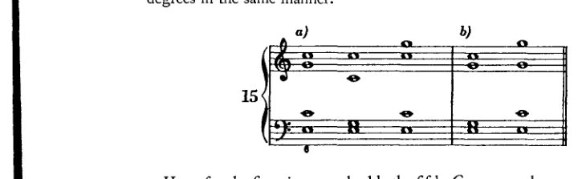

在这里，我们第一次重复五音。因此，我们必须考虑

和声中任何其他地方的平行。（2）我指出了这两个和弦之间的*区别*。这种区别不在于一个比另一个更不协和，而在于其中一个的问题比另一个的*更容易解决*。也许我们的前人更能应对这个更清晰的问题，只因为它更清晰，而对于那个不清晰的问题则不然，他们不理解其含义（*Willen*）。（3）属七和弦的低音无需为其想要成为根音的冲动寻找支持；因为它确实已经*是*一个根音。它正是*实际响出的*音的根音。（4）属七和弦（这就是我告诉那位年轻音乐史学家的理由）仅凭实际唱出的音就已经是不协和的。因此，在将属七和弦定义为不协和时，无需仅仅诉诸泛音。它比六四和弦更不协和，因为实际唱出且绝对听得见的音造成了不协和，而六和弦与六四和弦的不协和则仅由几乎听不到的音——即泛音——所产生。

我在这里讲述这段经历，仅仅是因为在我看来，它典型地反映了反对意见被提出的方式。

[此脚注在1966年第七版中被删除（见 *supra*，译者序，第xvi页）。]

<!-- page 72 -->

60 大调式：自然音和弦

此处存在一个当连接六和弦时五音被重复所产生的问题。

*平行八度与五度*

和弦连接在两个运动的声部之间产生三种关系：

1. 一个声部运动，另一个声部保持不动（*斜向进行*），例16a；
2. 一个声部下行，另一个声部上行（*反向进行*），例16b；
3. 两个声部朝同一方向运动，同时上行或同时下行（*同向进行*），例16c。

在几乎每一个四部和弦连接中，都会出现两种进行，且常常是三种全部出现。

因此，例17展示了女高音与女低音、男高音与女低音、男低音与女低音之间的斜向进行；女高音与男高音之间的同向进行；以及女高音与男低音、男高音与男低音之间的反向进行。

尽管早期理论无条件地允许斜向进行和反向进行，但它禁止同向进行，在某些情况下是有条件地禁止，在其他情况下则是绝对禁止。后一类禁止被称为平行八度和平行五度。

例18a展示平行八度，18b展示平行五度。

相关法则对禁止事项定义如下：当两个声部经由同向进行从一种八度关系进入另一种八度关系，或从一种五度关系进入另一种五度关系时，其结果就是*平行八度*与*平行五度*（开放八度与五度，开放平行）。

<!-- page 73 -->

*转位：八度与五度* 61

这条规则更严谨的表述是：两个声部以平行进行进入一个纯协和音程（八度或五度）是被禁止的。

这个版本也同样禁止所谓的*隐伏八度*和*隐伏五度*，因此也可以这样表述：当两个声部从任何同时存在的音程关系（因此也包括从八度或五度）以平行进行汇聚至八度或五度时，便会产生直接的或隐伏的平行八度或平行五度。

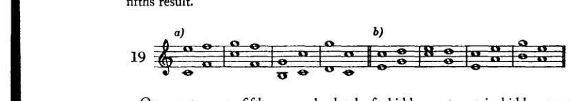

直接的平行八度或平行五度是绝对禁止的，但某些隐伏的八度或五度则在一定条件下被允许。主要是那些无法避免的情况。（*Not kennt kein Verbot!*——必要之时没有法律！）例如，在八度*中，就有那些几乎总是出现在V与I连接中的情况。

\* 虽然用“八度”和“五度”来简称“平行八度”和“平行五度”是相当不正确的，但它们的使用如此普遍，以至于我们可以容忍它们，正如我们容忍语言中一切通用说法一样。

<!-- page 74 -->

62 大调式：自然音和弦

(示例 20*a*)。此处，只有当低音下行至 *c* 才能避免隐伏八度，但这个音太低了。如果高音部旋律必须是 *g*–*b*–*c*，那么中音部与次中音部之间的隐伏五度（示例 20*b*）也不容易回避。

因此，人们确立了例外条款，宣称：如果隐伏八度和隐伏五度出现在两个内声部之间，或至多出现在一个内声部与一个外声部之间，从而不那么引人注目，那么它们是允许的。而且：当两个声部中一个级进、另一个跳进五度或四度时，隐伏八度就更容易被接受。或者说：当上声部级进时——例如从七度到八度，或从三度到四度——那是“最无可非议的”。再者：如果尖锐的不协和音转移了人们的注意力，平行五度就会“温和”一些。（它们固然不如刺耳的不协和音那样令人困扰，然而却被更加严格地禁止！）于是人们又谈论起“圆号五度”、“莫扎特五度”，以及——与那些耳朵灵敏者都听漏了的此类五度相对——“故意而为的”五度，即那些耳朵不够灵敏的人至少及时看出来的五度。然而：究竟何时可以故意做这种从根本上就被严格禁止的事，以及为什么——这却被巧妙地缄口不言。这简直无异于在问：蓄意谋杀是否比非故意杀人更可饶恕！

圆号五度

这些戒律建立在这样一种主张之上：这种平行进行取消了各声部的独立性。这是较为明智的辩护形式。另一种则干脆宣称这类进行听起来糟糕。这两种论点通过如下命题得以调和：平行八度和平行五度之所以听起来糟糕，是因为各声部的独立性被取消了。说在平行八度中，从第一个和弦进行到下一个和弦的精确瞬间，各声部的独立性似乎丧失了——这话或许不算错。但宣称它们听起来糟糕，甚至说它们听起来糟糕*是因为*各声部的独立性被取消了，那绝对是错误的；因为平行八度被用作重复，有时也用于加强音响。自然，是因为其*好*的音响效果；绝不会有人因为音响糟糕而去写平行八度。而管风琴上的混合音栓不仅为每个声部提供八度，还提供五度，所有这些音同时响——

<!-- page 75 -->

*转位：八度与五度* 63

taneously.* 为了获得更强的音响效果；但是，既然这关乎艺术之美，那么更强的音响也就是美的音响。因此，认为平行八度本身听起来糟糕，这是一种完全站不住脚的立场。这就使我们只剩下另一种观念，即它们取消了声部的独立性。诚然，每当两个声部唱相同的东西时，它们就不是绝对独立的。每当它们唱大致相同的东西，即八度时（一个八度的两个音并不完全相同），它们所唱的内容当然是相同的，但音响却不同。如果两个声部在很长一段时间内只以同度或八度演唱，那么我们就可以说，在内容上存在相对的独立性缺失。（然而即便在这里，就同度而言，我们也应当考虑音色的混合问题，每个声部对此都是以完全独立的方式作出贡献的。）然而，如果两个声部中的每一个在内容上都唱着与对方完全不同的东西，而且可以说仅仅在一个特殊的时刻或少数几个这样的时刻才汇聚到同一条轨道上，那么也许可以说，在这样的时刻它们的独立性在一定程度上被削弱了；但如果说它们实际上丧失了独立性，那肯定是一种学究式的夸大，它无视了一个事实：除了这几个时刻之外，这些声部在内容上自始至终都是相互独立的。然而，这几个时刻显然并不妨碍我们清楚地区分出内容上的本质差异。这种夸大还无视了另一个事实：这些声部在*音色*上*始终*是相互区别的。*因此，在这里，人们也很难说绝对取消了声部的独立性。*

更正确的说法是谈些别的，即某些条件，而满足这些条件是*每一种良好工艺所必需的*：假设经过深思熟虑和检验之后，一个人确定了声部的数目[用于自己的写作]，那么这个决定在乐曲的每一个单独时刻都应当被证明是正确的，因为较少的声部显然不足以

\* 本章[即这一关于平行八度与五度的章节]发表于1910年8月的《音乐》（*Die Musik*）杂志。它成为了辩论的主题，我得知了一些提出的“反对意见”。这些意见涉及管风琴的混合音栓，以及五度奥尔加农和平行三度（参见脚注[*infra*，第66、67页]）。很高兴有机会对它们作出答复。我说过，“混合音栓赋予每个声部……”——这本可以被视为理所当然，如果我知道混合音栓，我也就知道它们何时被使用。即使我没有明确地说：在全奏中。当然很清楚，当使用这些音栓时，它们赋予“所有声部……等等”。现在出现了这样的反对意见：是的，但在全奏中，然后它们[平行进行]就听不见了。这是一个荒唐可笑的反对意见。[混合音栓]之所以被加入，正是因为它们听不见！但既然如此，为什么要使用它们呢？那么为什么偏偏要把五度等等加到声部中，而不是圣经经文或炮声呢？回答是：“它们不是作为五度被听见的，而只是作为丰满、作为尖锐、作为音响的加强。”是的，但它们毕竟还是被听见了；它们究竟应该作为*什么*被听见呢？如果不从音色变化本身来听，又应该从何处听到音色变化的效果呢？作为声部进行？那么，人们会把八度重复听成声部进行吗？

[这篇关于平行八度与五度的文章并非发表于八月号，而是发表于1910年的*2tes Oktoberheft*（第96–105页）。在勋伯格此处引用的八月号中，发表的是他的一些格言。]

<!-- page 76 -->

64 大调式：自然音和弦

呈现一切，而更多则几乎不会增添任何重要的东西。因此，每个声部在每一时刻都应该有事可做，*而此事只有它自己在做。*于是，如果在一种单薄的和声织体中，目标是从 *d* 到 *e，*而一个声部就足以完成它，那么 – *如果从 d 到 e 确实是且唯一的目标 – 那就是多余的，也就是说，不好的，*如果另一个声部也从 *d* 走到 *e*。如果想不到用这个另一个声部来做别的什么，它就应该休止。但是想不出别的东西，一般说来并不是卓越技巧的标志。那就必须努力用它来做点别的！然而，如果从 *d* 到 *e* 这一步——一个声部确实足够——并*不是* *主要目标，*如果主要目标反而是两个都从 *d* 走到 *e* 的声部之间*获得八度的音响*，那么独立声部的问题就不再相关了；现在这仅仅是一个音响的问题。因此，既然平行八度听起来并不坏，也不绝对取消声部的独立性，那么以美的使徒执行其天职时所带来的那种狂热（*Pathos*）将它们逐出艺术，就是毫无意义的。它们反正从未完全屈从于这种对待，因为它们在文献中反复出现。

*在我们专门致力于和声考虑的练习中，为创造音响效果而进行的重复任务当然永远不会被布置。因此，在这些练习中我们将严格避免平行八度。* 还有另一个前面提到过的理由，会让我们做出同样的决定，即在我们的和声练习中，不仅拒绝使用平行八度，而且拒绝使用平行五度。直到大约十九世纪中叶，平行五度和平行八度几乎完全被避免，甚至从那以后也相对很少被使用；逾越这一规则的*课堂作业* 将会产生风格上不协调的结果。而学生还不知道用来创造平衡的和声手段，相反，知道这些手段的人可以无视这些禁令。学生还没有在作曲；他只是在完成和声练习，这些练习的平均可信度只有当他始终追求至少平均的质量时才能维持。既然教师无法教给学生绝对的完美，他就必须至少尽可能长久地让学生远离那些有疑问的东西。

为禁止平行五度辩护让理论家们费了更多周折。因此他们的辩护也就更容易被驳倒。有人宣称，平行五度的进行听起来不好；或者说，由于五度是一个泛音，如果它与基音平行运动，它简直就是后者的影子；如果五度要显得独立，那么它的运动就应该与基音不同；如此等等，都是同一套说法。奇怪的是，平行四度的进行只是被有条件地禁止，尽管就和声内容而言，四度和五度是完全一样的。

如果考虑到这种内容，那么平行四度也应该被禁止。严格说来，相关音级的连接根本就不应该被允许；因为内容上的生硬（*Härte*），也就是和声上的生硬，只能归因于属于和声的东西，归因于音级。然而，平行四度是允许的，如果它们被下方的三度音所“覆盖”（例22c）。平行五度不也可以同样自由地被使用吗，如果它们

<!-- page 77 -->

转位：八度与五度 65

也被这样的下方三度覆盖（例22d）吗？从和声上讲，完全没有区别。那么，既然这种平行进行听起来并不差，平行三度和平行六度甚至听起来很好，既然所有其他平行进行至少听起来有条件地好，那么只有平行五度听起来绝对差吗？例如，平行八度体现了一种极端：即（在内容上）声部独立性的完全取消，以及

（在声学上）以最完美协和音程进行。¹ 然而，平行八度至少在有条件的情况下作为重复音被允许，因为其*良好的*音响效果。平行三度和平行六度同样被允许，尽管它们也在内容上剥夺了声部的独立性，而声学上，它们是在比五度更不完美的协和音程中进行！因此，被允许的不仅仅是进行最完美协和音程的进行，因为三度比五度不完美；也不是只有不协和音程的平行进行才被允许，因为八度比五度更完美。而且，人们对平行五度提出的所有反对意见同样适用于平行八度或平行三度。*因此，必须有其他理由*[排除平行五度]。

我将尝试以更简单的方式解决这个问题。

复调的演变可以想象如下：最初的推动可能来自某人想要参与演唱通常由单个表演者演唱的歌曲的冲动。两个或更多人唱同一个旋律。如果恰好是相同类型的声音一起演唱，例如只有低沉的男声，那么很明显，只有同度演唱可以被认为是纯粹的，即演唱相同的音，最完美协和音程。如果加入女声，且旋律既不太高也不太低，那么第二种可能性就显而易见了：以第二完美协和音程演唱，即八度。但如果旋律处于这样的音域，以至于对高男声和女声来说太低，或对低音声部来说太高，那么这些声部就需要找到别的东西。只要真正的复调尚未发明（如果人们不想把八度演唱视为已经相对复调的话），这些声部别无选择，只能从某个其他协和音开始演唱同一旋律。由于同度和八度已经被使用，耳朵*必然要选择下一个最完美协和音程，即五度*。于是开始了*五度奥尔加农*，或者这里所说的

---
¹ *Vollkommenste Konsonanz*：最（近乎）完美协和音程，或两个音之间最高程度的协和一致。在下面的下一个（长）段落中，我们发现同度是"最完美协和音程"。]

<!-- page 78 -->

66 大调：自然音阶和弦

同样，四度奥尔加农\*。三度直到很久以后才被用于同样的目的，而且事实上直到更晚的时候三度才被承认为协和音程，这支持了本书中反复提到的一个假设：即不协和音与协和音之间的区别仅仅是渐进的，只是程度问题；不协和音只不过是更遥远的协和音，由于它们的遥远，耳朵要分析它们就更为费力；然而一旦分析使它们变得更易理解，它们就有机会像更近的泛音一样成为协和音。（顺便一提，未经预备的属七和弦迅速被人接受，是这一观点的又一佐证。）因此显然，耳朵在努力模仿自然的悦耳音响时，遵循*这种特定的*发展——同度、八度、五度——是走在正确道路上的。而且显然，以五度歌唱的原因与以八度歌唱的原因相同：这种声音令耳朵愉悦。此外，我们在此发现了那些往往赋予声学秘密以一种神秘莫测色彩的奇特巧合之一：即*以五度或四度歌唱，完全符合人类嗓音的音域限制。*因为男高音的音域平均比男低音高五度，女低音大约比男高音高四度到五度，而女高音同样比女低音高五度。因此，我们看到这里本能地找到了一种真正具有艺术性的解决方案：一石二鸟。

我所设想的后续演化如下：大概就在三度被承认为协和音程之后不久，反向进行与斜向进行的可能性便被发现。除了平行的同度、八度和五度之外，又出现了平行三度的可能，而且很可能不久之后，

\* 就在我[1911年]准备将这些书稿付梓之际，我很高兴地发现，里曼这样一位敏锐而深刻的思想家，也证实了我对这一演化阶段的构想。查阅迈耶的 *Konversationslexikon*，我发现那里几乎逐字写着我通过自己推理得出的结论：‘实际上，奥尔加农还不算真正的复调音乐，而只是在五度上的重复，*这是长期以来实践的声部八度重复之后最自然的一步。*’我也在这部 *Lexikon* 中找到了对 *fauxbourdon* 的解释，而我对此全然无知。（读者请原谅我；我不是学者[*Wissenschaftler*]。我是自学的，只会思考。）*Fauxbourdon* 指的是以六度和弦歌唱。这确实是演化中的下一步！里曼还说，此后不久便发现了复调音乐的真正原则，即反向进行。这恰恰是我所不知道的，而只是猜测；因为我从未读过音乐史。——关于奥尔加农的问题，我还想提另一件事：我听说‘学问’[*Wissenschaft*]怀疑是否真的存在过这种东西。当某种事物不符合其既有框架时，学问总是如此。然而奥尔加农是如此不言自明，以至于即使它碰巧不曾真实存在过，我们现在也应该将其发明出来并回溯式地安插到过去之中。但我相信它一定已经存在过——学问的怀疑反而使我更加确信自己的信念。

[迈耶的 *Konversationslexikon*（包含里曼文章的那一版）未能觅得进行校勘。在勋伯格的青年时代，这部百科全书似乎是他获取音乐知识的主要来源之一。参见 Willi Reich，*Schoenberg – a critical biography,* Leo Black 译（纽约：Praeger，1971），第3页。]

<!-- page 79 -->

*转位：八度与五度* 67

正如我所说，反向与斜向运动的可能性也同样存在，从而手段得到了极大的丰富。在我看来，以下这种深深植根于人类天性中的思路，为[平行五度之禁]这一问题提供了心理学上的解释：

以八度和五度演唱无疑以一种极其自然的方式满足了当时的品味；它符合声音的本性与人的本性，因此是美的。然而，在八度和五度上添加三度\*，并使用反向与斜向运动的可能性，很可能催生了一种令人陶醉的热情，这种热情进而将过去的一切都视为坏的，尽管它们仅仅是过时了；这种热情我们在每一次伟大进步中都能看到——不仅限于艺术。[这种热衷者]如此彻底地忘记感激前人所做的铺垫工作，以至于他憎恶那些工作，而不去想当下的进步若无它便不可能实现。是的，即便那些工作充满错误。而对过时事物的蔑视之巨，恰如它之不合情理。凡保持正确分寸感的人都会说：我个人不愿做过时的事，因为我知道新事物的好处，而且那样做不合时宜。人应当只在超越时代时才不合时宜，而不要在蹒跚落伍时才不合时宜。因此，我们今天嘲笑还写“gegen dem”的人是有道理的；但我们应该知道，既然“gegen”事实上过去确实可与第三格和第四格两用，“gegen dem”并非错误，只是过时了。¹ 而且当Schaunard用一个词“hinfüro”来刻画他的波西米亚同伴Barbemuche的风格时，他是对的，据说这个词常出现在Barbemuche的小说中。² 我认为这种

\* 此处有人提出异议：为什么同样的命运——禁令——没有降临到平行三度身上？我在别处曾引用平行三度这一具体情形作为论据来支持我的观点；此处略去不谈，仅仅是因为它似乎并非关键。既然它被当作反对意见提出，我就来分析一下。首先：平行五度被逐出音乐确实是不合理的；对它们的排斥是站不住脚的。人们甚至不能断言，将正确的认识运用于类似情况必然导致另一个正确的判断。但要求一种不合逻辑的判断绝对必须在另一种不合逻辑的判断中重演——那确实太过分了！其次：甚至根本没有必要禁止五度，因为当它们被用作唯一的和声方式时，只不过是过于质朴了。因此，三度也不必被禁止，因为它们只要不是单独使用就是好的。但是，可作为证据的是，在那些三度被单独使用的地方，它们确实被视为一种较次要的声部进行方式；我们可以引用“austerzen”[添加三度]这一说法，它明确立足于真实、实际声部的理念。然而，在加倍的复对位中，三度仅仅是填充声部：只是被添加的音响效果（*Klangliches*），它们的加入本身并未对声部进行作出任何特殊的贡献。不过最后，纯粹使用的平行三度和平行六度也同样被认为是质朴的，甚至可以说是平庸的。证据就是：其复调几乎只由这些平行音程构成的民间音乐。它们或许是平庸的，但并非不可能，而且在某些情况下（如在*Siegfried*中）可以具有艺术性。

[¹ 现在，介词*gegen*只与第四格连用：*gegen den*。]

[² 现代德语用词是*hinfort*（今后）。Schaunard和Barbemuche是十九世纪中叶戏剧*La Vie de Bohème*及小说*Scènes de la Bohème*中的人物，作者是Henri Murger。Puccini歌剧的剧本改编自这些作品。]

<!-- page 80 -->

68 大调式：自然和弦

关于艺术家之人性的观察，对于判断艺术的演进而言，与物理学同样重要。我们必须认识到，艺术的航向不仅由音的性质所决定，也同样由人的性质所决定；它是这两种因素之间的折衷，是彼此迁就的尝试。既然音——这种无生命的材料——不会主动迁就，那就得靠我们。但我们有时发现迁就颇为困难。因此，当我们成功之后，往往会高估自己的成就，而低估那些迈出预备性步伐的人的成就；那一步或许与我们这一步同样伟大，同样艰难。

禁用五度的情况必定也是如此。如果说对成就的欣喜与行会的要求相伴而行，那么这两者结合的后代只能是正统。正统不再需要为新奇的成就赢得认可，如今却承担起通过夸大来固守这一成就的任务。诚然，它确实会思考并充分利用其前提的蕴涵；然而，正是由于它的夸大，它不仅导致谬误，还筑起了一道抵御任何其他创新的壁垒。因此，我们完全可以想象，以下这些表述是如何被解读的：「不再有必要仅仅用八度和五度来作曲」；「可以在八度和五度之外加入三度」；「可以使用反向与斜向进行，也可以使用平行进行」。我是说，我们完全可以想象，这些表述被读成了什么样子：「用八度和五度作曲是不好的」；「必须把三度加到八度和五度中去」；「反向与斜向进行优于平行进行」。现在，如果考虑到这类解读被当作规则提出并被接受，而且是那种一旦违犯就要受到禁制的规则，那么就可以看出它们的起源是多么容易被遗忘：多么容易忘记*八度和五度本身并非不好*，相反，*它们本身是好的*；它们只是逐渐被视为过时的、原始的、相对缺乏艺术性的；然而，*并没有物理上或审美上的理由*，说明它们为何不应在适当的时候继续使用。如果考虑到这些以「你不可……」的形式传播了数个世纪的规则，那么显而易见，耳朵已经忘记了那种曾经被认为悦耳的音响，而它的使用之所以引起反感，是因为*新事物总带有的那种怪异感*。我要说的是，由于平行八度与五度的进行已经有几个世纪不再被实践，耳朵就倾向于将这种偶尔出现的连接视为新奇的，* 怪异的，而事实却相反

\* 这种情况也绝对地反对（我情不自禁：*情况*在说话）那些伪现代的手法，它们把整段旋律之类的东西都置于五度之上，以图从这种新奇与怪异中获利。对我来说，其效果令人不快，并非因为它看似新奇，也并非因为它实际上是古老的；同样也不是因为这种进行的优点并不比这些创新者的前辈们在类似段落中所写的六和弦进行更为出色。我觉得它令人不快，或许是由于这类方法中显而易见的恶作剧心理和卖弄炫耀：那类东西并不高尚；不过，非常可能的是，它之所以令我不快，主要是因为我越来越多地发现，对五度的禁令有其正确之处，只是被错误地理解了。我指的是对协和音的厌弃，这或许与想要把更遥远的协和音——即不协和音——引入作曲中的冲动，是同一回事的反面。[本条脚注为修订版新增。]

<!-- page 81 -->

*转位：八度与五度* 69

实际情况正是如此：它们年代久远，只是被人遗忘了。因此，每当有音乐家说：“是的，但我*仍然*会注意到这些五度。它们很显眼。而且我觉得它们听起来刺耳。”这并不能作为反驳此处观点的论据。新奇之物确实总会吸引注意力，其音响也被认为是刺耳的，尽管事实并非如此。

现在来谈谈隐蔽的八度与五度。基于正统观念，这很容易解释：仅仅为了不写出任何明示的五度或八度，向这些完全协和音程进行的平行运动便被彻底避免了。任何*以不同方式处理隐蔽平行音程的尝试皆可不予考虑*。这不仅是因为*即便明示的平行音程也并不难听*，而主要是因为这条法则*不过是教科书上的幻影*，然而在实践中，即在大师作品中，*它遭到违背的次数远比得到遵守的次数要多*。

那么，学生应如何对待平行音程这一问题？我现在想相当彻底地讨论这个问题，因为我打算日后直接回溯这次一般性讨论，而不再每次都深入其细节。可以提出这样的问题：如果平行五度与八度并不糟糕，那为何不允许学生写它们呢？我的回答是：日后他会被允许写的，但不是在现阶段。教学过程应当引导其经历历史的演进。倘若不这样做，倘若它以规则的形式提供毫无依据的终极结论，那么这些结论的僵化，由于脱离了产生它们的演进思维过程，就可能导致与我刚才揭露的错误类似的错误。正如教学可能因表述过于严格而阻碍进一步发展一样，它也会遮蔽回望过去的视野，并使许多曾经充满活力的东西变得难以理解。

出于类似的原因，我并不拥护新正字法，尽管我非常理解简洁带来的实际好处，也非常理解那种只在拼写中表达人们实际听到的语音的努力在部分上是合理的。然而，我认为如此毫不留情地剔除那些往往体现旧音节遗迹的符号是值得怀疑的。由此，追溯词根的可能性很容易丧失，而每当我们想要探究一个表述的真正、原初含义时，它便无法为我们所用。于是危险随之产生：我们的文字将变得过于贫乏，缺乏此类能够向任何人指示回归本源之路的参照点。起源最终将只为历史学家所知，并从所有人的鲜活意识中消失。

如果和声教学也以同样轻率的方式进行，那么古老大师作品中许多声部进行的问题就将超出我们的理解。还有另外一点。在整理与编配的工作中——这在那些仅以数字低音标示和声的古老作品中往往是必不可少的——我们越是忠实地再现它们的风格，就越能使这些作品易于理解——使用不恰当的声部进行技巧，将不可避免地导致内容与实际形式之间的不协调，这种不协调会令敏锐的听众感到刺耳。若学生在完成习作时不顾及这些禁忌，同样会产生这种不协调。

<!-- page 82 -->

70 大调式：自然和弦

当然，如果有人要撰写一部仅仅表达我们这些超现代主义者和声趣味的和声学教材，允许我们所做的，禁止我们所回避的，那么这里的所有这些讨论都可以弃之不顾。今天我们已经走得如此之远，以至于不再区分协和音与不协和音。或者，如果仍然存在某种区分，那至多只是我们更少地使用协和音。这也许只是对以往协和音时代的一种反应，一种或许有些夸张的逆反。但是，若因为协和音不再出现在这位或那位作曲家的作品中，就得出协和音被禁止的结论，那就会导致类似于我们先辈禁止五度所产生的那类错误。就我个人而言——但仅仅是因为并且只要我自己尚无更高明的认识——我可以轻易地对一个学生说：任何同时结合的声音，任何进行都是可能的。然而，即使在今天，我也感到，在这方面，我对这种或那种不协和音的选择同样取决于某些条件。今天我们尚不能站在距离我们所处时代的事件足够远的地方，以便洞察其背后的法则。太多非本质的东西涌入了我们意识的前景，掩盖了本质的东西。如果我站在高山草地的中央，我会看到每一株草叶。但如果我正寻找通往山顶的道路，那这些对我毫无价值。如果我站在稍远的地方，草叶就会从我视野中消失，但我却很可能看到那条道路。我认为，这条道路，即便是这条道路，也会以某种方式与已经走过的路段在逻辑上相连接。我相信，在我们超现代主义者的和声中，最终将发现那些存在于古老和声中的相同法则，只是相应地更为宽泛、更具普遍性而已。

因此，在我看来，保存过去的知识和经验是极为重要的。我希望，正是这种先前的知识和经验将向我们表明，我们所探寻的道路是多么正确。此外：如果我允许学生从一开始就无视对五度的限制，那么我同样有理由无视所有那些涉及不协和音处理、调性、转调等等的规范。这些也已经被取代了。在这里，我们同样不可忽略这样一个事实：只有一小群超现代主义作曲家走得如此之远。几乎我们这个时代的所有伟大大师——马勒、施特劳斯、雷格尔、普菲茨纳——在很大程度上仍然坚持调性，例如。一种理论，一门教程，如果只倡导目前一小群人的目标，无论其阐述的逻辑多么严谨，被批评为带有派性也并非不公。而恰恰是我旨在[在此]提供的东西，尽管它并不服务于某个特定派别——或者，更确切地说，正因为这个原因——却得出了与我持相同观点的群体所认为正确的结果。我的目的正在于此：表明人们*必须*达到这些结果。

因此，学生也不妨遵循历史发展所走过的道路。如果他学习和声学只是出于对音乐文献的兴趣，如果他只是希望借此更好地理解大师之作，那么，在他自己创作音乐模式的这段短暂时间里，他是以现代还是非现代的风格来做练习，其实并不重要。然而，重要的是，要引导他对什么

<!-- page 83 -->

*转位：和弦的连接* 71

是全新的。这一目的通过一门课程来实现，这门课程摆脱审美先入之见，揭示许多永恒法则的必死性，从而使人能够不受阻碍地审视美的演变：也就是说，审视观念如何变化；审视凭借这些变化，被传统之耳禁止的新事物如何变成讨耳朵喜欢的旧事物；审视这一新的[传统]又如何反过来拒绝另一种更新的、暂时被禁止的创新触及耳朵。然而，如果学生是一位作曲家，他应该耐心等待，看他的发展、他的天性将把他引向何方。他不应希望去写那些唯有完全成熟才能为之负责的东西，那些艺术家们几乎违背自己意愿、在服从其发展强制力的过程中写下的东西——[服从于这一强制力]，而非出于一个在形式问题上缺乏把握、任意写作之人那种缺乏管束的肆意妄为。

因此，学生在仍需接受指导期间，应避免开放八度和五度。但当他的倾向、品味和艺术理解力使他能够为之负责时，他便可以使用它们。隐伏八度他现在可以随意写作，只有少数例外，将在适当时机予以讨论。隐伏五度他可以在任何时候不受限制地使用。

*三和弦与六和弦的连接、六和弦与三和弦的连接，以及六和弦彼此之间的连接*

我们现在转而考察并完成下列三个表（A、B、C）中所示的和弦连接：

A. I的三和弦与I、III、IV、V、VI的六和弦
   II的三和弦与II、IV、V、VI、VII的六和弦
   III的三和弦与III、V、VI、I等的六和弦
   VII的三和弦与III的六和弦；

B. I的六和弦与I、III、IV、V、VI的三和弦
   II的六和弦与II、IV、V、VI、VII等的三和弦
   VII的六和弦与III的三和弦；

C. I的六和弦与III、IV、V、VI的六和弦
   II的六和弦与IV、V、VI、VII等的六和弦
   VII的六和弦与III的六和弦。

学生最好逐一完成这些表中的一切内容（在尽可能多的调中）。这里首次出现了声部进行上的困难，学生最好立即处理这类问题。他最好在开始时就获得必要的练习，以免后来在更重要的事情上失败——因为他无法驾驭声部进行。

例23中仅完成了第一级。学生现在应按照此模式完成其他各级（别忘了其他调！）。在某些情况下，他会遇到平行八度和五度，必须设法规避它们。在另一些情况下，则有必要部分地放弃

<!-- page 84 -->

72 大调式：调式和弦

保留共同音，否则会导致三音的不必要重复。

三和弦与其转位之间的相互连接称为*交换*（I–I⁶ 或 II₆–II 或 IV–IV⁶ 或 V₆–V）。没有和声变化

<!-- page 85 -->

*转位：和弦的连接* 73

（因此，交换仅具有旋律价值）两个或多个声部——在我们当前的例子中其中一个是低音部——互换角色。

学生最好将每一对和弦做两次（至少两次！）练习：一次通过加倍六和弦的八度音，一次通过加倍五度音。这总会产生不同的解决方案，并常常带来新的困难。学生应该找出这些困难，并尽可能找到两种以上的解决方案；因为几乎每一种排列都会出现不同的情况。此外，他还应尝试加倍最后一个和弦的五度音。

VII 级需要特别注意。

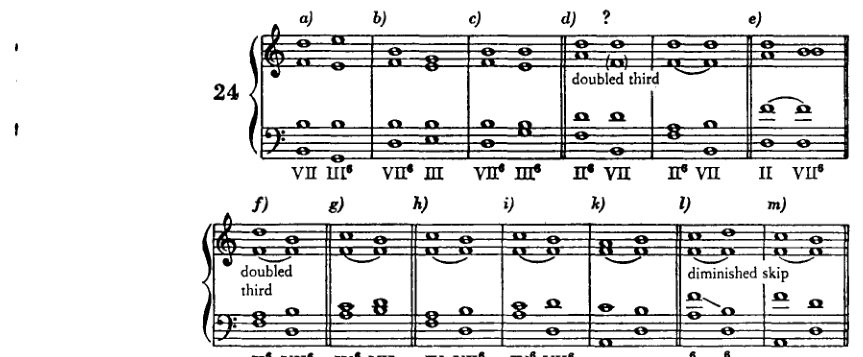

在示例 24*d* 中，我们遇到一种新的情况。这里的 IInd 级和弦是一个六和弦。因此，为预备减五度所必需的 *f* 仅在低音部出现，而该声部必须进行到下一个和弦的 *b*。因此，除非 *f* 也出现在某个上方声部中，否则减五度无法得到预备。所以，这个三音 *f* 在这里必须被加倍。由此值得注意的是，必要性如何取消了一条规则。示例 24*i* 和 24*l* 中的情况与此类似。在 24*i* 中，次中音部的 *c* 不能进行到 *b*，因为次中音部与高音部之间会形成平行八度；也不能进行到 *f*，因为这个音作为不协和音，不应被加倍。唯一其他的替代方案是将 *c* 进行到 *d*，即在 VII 的六和弦中加倍三音。同一问题的另一种解决方案见于 24*k*，其中第一个和弦的三音被加倍。在 24*l* 中，与适用于 24*i* 的类似考虑迫使次中音部作减五度跳进。按照旧规则，这样的跳进应该避免，因为它缺乏旋律性，或者更准确地说，因为它很难唱准。而且我们确实通常会避免这样的跳进（正如我之前所说），以免破坏风格上的平衡。但当必要性迫使我们作出这样的跳进时（毕竟在低音部中这是无法避免的），那么只要有可能，我们就会尝试‘解决’减音程或增音程中所包含的不协和音（即音准上的困难）。最好的方法是将 *b*，‘上行导音’，向上进行到 *c*，并将 *f*，‘下行导音’，向下

<!-- page 86 -->

74 大调：自然和弦

到 *e*。然而，由于这并非总能实现，因此例25（第5–10小节）也给出了其他一些可能性。

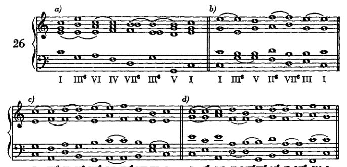

密切关注这类细节，有助于实现形式上的圆满，因此在我看来，这恰是为培养形式感奠定基础，是相当恰当的。当然，这些练习听起来仍不会特别'引人入胜'，但它们不必再像最初的那些练习那样生硬了。

学生现在可以在编写小乐句时使用六和弦，并可遵循以下指南：凡是可以使用三和弦之处，都可以写六和弦——只有开头与结尾的和弦（始终为I级）必须以根音位置出现。如果在乐句进行中有必要重复某一音级，有时选择六和弦是个好主意。但使用过多六和弦则不可取。乐句现在可以有八到十二个和弦；再长便是多余，因为那样势必需要过多的重复。例26展示了一些此类乐句。

**a)** I III⁶ VI IV VII⁶ III⁶ V I

**b)** I III⁶ V II⁶ VII⁶ III I

**c)** I IV⁶ II V⁶ III⁶ VI IV⁶ VII III I

**d)** I I⁶ VI II VII⁶ III⁶ V⁶ II VI⁶ IV I

**e)** I V⁶ III VI⁶ II⁶ VII⁶ III VI II⁶ V I

在六和弦与根音位置之间做出选择时，自然还必须考虑低音的旋律线。一般来说，只要有可能，低音就不应保持不动。有时

<!-- page 87 -->

转位：四六和弦 75

如示例 26a 所示，可以通过引入八度跳进来改变音区，从而避免这种情况；有时也可以选择六和弦代替原位，反之亦然。此外，即使中间有一两个其他音，低音的重复也可能阻碍进行。例如，若在 26a 中我将 VIth 级写成六和弦而非原位，那么即使跳进下方的八度也收效甚微。只要可能，学生就应避免此类重复，教师也应加以纠正。因为无论在哪里，正如这里一样，如果重复没有动机作为依据，它就会损害进行。然而，在 26e 中情况则不同：*c* 和 *e* 的重复几乎不会令人不适：与其说是因为一次有两个和弦介入，另一次有三个，不如说是因为每次重复低音之后，线条都朝着另一个方向继续。在判断一条低音线条好坏时，首先应当考虑的旋律原则正是变化。当音的重复不可避免时，至少应让其他音介入其间，或者改变线条的方向。从现在起，学生也应当时刻留意线条中的最高音。这个音应始终被视为高潮，也就是说，它只应出现一次；因为一般来说，它的重复比其他不太显著的音的重复更令人不适。

(b) 四六和弦

四六和弦需要不同的处理，以及其原因，前文已经提及（见 pp. 56–8）。在此我们还应回顾旧理论给出的另一个理由。四度被认为是不完全协和音程，甚至是不协和音程。这种观点反映了一种正确的直觉；因为四度确实出现在最初的泛音列中，只是方向相反 [即其根音位于上方——C–*c*–*g*–*c*]，因此比起由泛音列上行顺序产生的那些音程，它是一种较不简单的协和音程。然而，在几乎每个协和和弦中，我们都能在某两个声部之间发现四度，并且只有当其下方音位于低音声部时，我们才将其视为不协和音程。旧理论认为，如果下方有五度或三度将其“覆盖”，则它是被允许的；在所有其他情况下，它都应作为不协和音程来预备和解决。于是，四度被赋予了一种独特的说法：它的两个音时而构成不协和音程（当下方音在低音时），时而又构成协和音程（当该音被“覆盖”时）；此外，在另一种位置，即在转位中，同样的两个音却产生一种完全协和音程——五度（关于[音程的]转位，以下规则成立：每个完全协和音程的转位都产生一个完全协和音程，每个不协和音程的转位都产生一个不协和音程）。这过于矛盾，不够简洁，因而显得不自然。

在我看来，以下解释似乎更为简单：一个低音若同时并非根音，它似乎有一种冲动，要用自己的泛音来取代和弦音，也就是说，使自己成为根音。正如前文已阐明的那样（见 page 58），四六和弦的低音在其他和弦成分的泛音中，为其这种冲动找到了充分的支撑。

<!-- page 88 -->

76 大调式：自然和弦

于是，在六四和弦中存在着一种冲突：其（外在的）形式、其音响与其（内在的）构造之间是相互矛盾的。虽然其外在形式指示的是，例如，第一级，但其构造、其本能所要求的却是第五级。这种冲突确实与人们认为存在于不协和音中的那种冲突有某种相似之处，因为后者也力求更换基音。然而，在真正的不协和音中，那些音同时响起，无论如何排列都不可能成为协和音；而六四和弦中的音，在别的排列中却是绝对协和的（三和弦、六和弦）。因此，六四和弦要求解决、被当作不协和音来对待的需求，绝不像真正的不协和音那样猛烈。六四和弦与真正的不协和音仅有这一点是共同的：两者都内含一种引人注目的冲突，这种冲突似乎有权得到特殊的考量、特殊的处理。这种对[六四和弦的]特殊处理，未必非得像对待不协和音那样，仅仅由预备和解决构成。而且，所谓的六四和弦的预备与解决，与七和弦的预备及解决鲜有相似之处。但不管怎么说，有一点是确定的：六四和弦的问题虽能被感知却无法被理解，它因此始终受到一种特殊的对待。仅这一事实就足以赋予它一种独特的地位。六四和弦内在的问题也许不那么重大，或者有所不同；人们对待它的方式或许夸大了这些问题，甚至可能从未妥善地处理过它们。但是，无论其独特地位源于约定俗成还是源于自然本性，这一地位本身都是相当明确的。由于在实践中，这个和弦总被视为一种独特的现象，需要以特殊的方式使用；由于总有特定的事件先于它发生，也总有特定的事件紧随它之后，因此它产生的效果就类似于——比如说——引用一句家喻户晓的名言的片段：“爱征服……”¹ —— 人们会自动补全其前后文。只要稍稍暗示那众所周知的原因，就会唤起对那众所周知的效果的期待。听到第一个词，我们就心领神会；随后便期待着某种特定的延续。陈词滥调、固定程式就是这样起作用的。六四和弦恰恰发展成了这样一种东西：一个具有陈词滥调效果的固定程式；人们无法想象它脱离惯用的语境而出现。因此，这一公式所体现的处理方式是否恰当，对于确立它在三个多世纪以来音乐中所具有的意义，几乎无关紧要。尽管如此，考虑一下这个问题或许还是有益的。

我必须概括一下：低音成为根音的冲动得到了泛音的支持；因此，六四和弦的解决应当通过实际让其低音成为根音来实现。例如：第一级上的六四和弦在持续的 *g* 音上方进行到 V。这正是它被处理的*唯一*方式。然而，六四和弦中的冲突及其解决的倾向并非绝对强制；人不必屈服，因为支持这一倾向的只不过是泛音而已。或许可以通过转移对冲突的注意力，**小心翼翼地**绕过其倾向。如果两个突出声部之一将和声进-

---
¹ “当一切都去爱时（卡尔独自无法去恨）。”

<!-- page 89 -->

*转位：六四和弦* 77

属于一条旋律线。这个声部将注意力从纵向引向横向，从和声引向旋律。要做到这一点，一个很好的方法是在低音声部使用音阶的一个片段，三个或四个相邻的音，其中某一个——尽可能选择一个中间的音——承载六四和弦。如果耳朵捕捉到这样一种旋律进行，它就会将这种进行听作当下的主要关注点，认为转瞬即逝的六四和弦只是附带出现的，从而感到满足。

这一切也可以换一种方式解释，如下：在六四和弦中，有两个音争夺主导地位，即低音及其四度音（实际的根音）。后面的和弦是对低音或对根音的让步。如果低音获胜，那么 I 就进行到 V。然而，有时这种让步不会走那么远，而是选择一条中间路线。这时甚至可能发生三音（*Terz*）成为根音的情况（*wenn Zwei sich streiten, freut sich der Dritte*——当两方争斗，第三方得利*），即 I 进行到 III。而如果四度音（根音）不肯让步，也会出现类似的情况。这时在 I 之后出现的是 IV 或 VI。在这三种情况中，两个争夺中的和弦音事实上都失败了。在 III 中，*g* 只是三音；在 IV 和 VI 中，*c* 则分别是五音和三音。然而，每一方都因对手未获胜而感到满足；这些和弦音一旦与后者（人）接触，似乎就变得几乎和人一样心怀恶意。这另一种处理六四和弦问题的方式，便是让它以低音声部中的经过音形式出现。这两种方式与另一些不协和音的某些形式及其处理有相似之处。因此，在这里也谈论“解决”或许是正当的，尽管其他不协和音的解决有着不同的心理依据。然而，人们应当区分那些允许和声解释的形式（用低音的泛音来取代和弦音）与那些源自声部进行的形式（六四和弦作为经过和弦出现）。或者，人们必须像我这样做：相应地扩展“解决”这一概念。

所谓的预备也可以用同样的方式来解释。两个和弦音之一先已存在：如果是 IV 或 VI 在先（也可能是 II 的七和弦，其七度音为 *c*），那么先出现的是根音；如果是 V 或 III 在先，那么先出现的是低音。无论哪一个先出现，都会凭借先入为主的优势主张胜利。也可以这样看待这件事：为了准备这场冲突，至少要事先引入其中一个音；或者（为了解释六四和弦的级进引入）一条旋律性的低音线条可以缓解这一现象的生硬感。

六四和弦的惯用处理令我难以在各个方面都解释得滴水不漏，因为我觉得这种处理并不完全契合该和弦内在的问题。我很钦佩我们先辈的精微辨别力；他们正确地感觉到六四和弦是

\* 欧洲人（I 和 V），他们为了下属音（日本）和上中音[*Obermediante*]（美国）或文化的某种其他中音的利益而互相残杀。

[勋伯格在1922年的修订版中添加了这条脚注。它在1966年的第七版中被删除。]

<!-- page 90 -->

78 大调式：自然音和弦

这与三和弦并非同一回事。但我也深知，那些凭直觉发现的知识，一旦受制于正统观念的夸大处理，就会变得远离最初对自然的精妙洞察。尽管如此，我们现在仍将依照旧理论的要求来处理六四和弦（原因我已多次提及）。

根据该理论的规则，六四和弦应当

1. 预备，
2. 解决，或者应当
3. 仅作为经过和弦出现；并且
4. 低音声部在到达或离开其音时都不应跳进；它要么应当保持，要么应当在级进进行中进出。（此规则在某种程度上与第3条相符。）

六四和弦的预备与不协和音的预备不同，因为这里需要考虑两个音。我们可以预备五音（即低音）或根音；也就是说：这两个音之一应当是前一和弦的组成部分，并应在六四和弦中出现在同一声部。解决按如下方式进行：要么低音被保持，其他声部在其上方变化为一个新和弦，要么低音向上或向下移动一步，成为下一和弦的根音或三音。*六四和弦不应直接出现在另一六四和弦之前或之后。*那将意味着把一个尚未解决的问题直接置于另一个同样暂时未解决的问题旁边。这显然有悖于形式感。这种进行也会使我们想起平行五度，后者通常是因为一个调级的五音进行到另一个调级的五音而产生的。

将六四和弦作为经过和弦来处理，仅涉及低音声部。我已经指出，在这种情况下我们处理的并非一种和声手段，而是一种旋律手段；因为这种形式的效果取决于将注意力引向一条旋律进行。这样一种旋律进行就是包含三个音的音阶片段，其中心音承载着六四和弦。音阶可以被视为旋律，即使只是最简单、最原始的旋律。说它原始，是因为它缺乏分节与变化：其中音的接连只有一种原则（一步一步地）和只有一种方向（要么上行要么下行）。更复杂、更有趣的旋律则更丰富、更多样地分节。方向和音程大小变化更频繁，事实上是持续不断地变化；而那些使人得以感知该体系的重复，即使不体现多种原则，至少也体现了变奏。然而音阶仍然是一条旋律，因为它确实具有体系和结构。它是一条原始的旋律，一种相对质朴的模式；但它仍然是一条旋律，甚至是一种艺术形式。我在这里提及音阶的这种特性，是因为今后仍会经常出现这样的情况：某些看似和声的问题，实则应追溯至旋律根源，并应以旋律方式处理。例如，低音中自然音阶或（完全或部分）半音阶的良好效果，仅仅是旋律能量的结果，因此几乎更应被看作某种复调效果，而非和声效果。

这种以和声为主要目的的写作中旋律线的效果，

<!-- page 91 -->

*转位：六四和弦* 79

尽管因此未必更为优越，却极为显著，从而产生了一种足以与和声手段所带来的满足感相媲美的形式上的满足感。为此目的，并不一定要总是使用完整的音阶。音阶的一个片段，即三个或四个相邻的音，也会被视为进行，被视为旋律。此类旋律进行也常出现在那些不涉及六四和弦的和声乐句中。因此人们或许会认为，这种技巧应当更为节制地使用，以便在运用时具备所需的力度。然而，这似乎并无必要，因为这种形式的六四和弦不应引起注意；它只应悄然地一带而过。倘若音阶片段是专门为此目的而使用的手段，那么六四和弦便会不可避免地显得突出。

例27a展示了一些预备，27b展示解决；在例28中，预备与解决结合在三个和弦的进行中。

![例28的乐谱，显示两行各四小节。第一行标有"or: [I]"及罗马数字：V I⁶₄ V, V I⁶₄ V, V I⁶₄ III⁶, V I⁶₄ IV。第二行：V I⁶₄ IV⁶, IV I⁶₄ V, IV⁶ I⁶₄ V, IV⁶ I⁶₄ IV](assets/page091_fig03.jpg)

<!-- page 92 -->

80

大调式：自然音和弦

学生还应练习在第一级以外的其他音级上预备与解决六四和弦。即使这些总体上较为少见，但其中某些确实频繁出现。应特别注意第七级，因为基于前述的另一个原因，其五度音是不协和音。

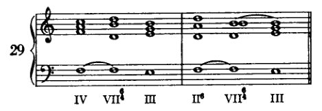

显然，这里与之前一样，只有第四级（仅原位）和第二级（仅作为六和弦）可用于预备，而解决则只能用第三级（仅原位）。因此，含第七级的进行只能写作：IV, VII⁶₄, III 或 II₆, VII⁶₄, III。

a) [图：钢琴谱表，带罗马数字分析：I III⁶₄ VI II⁶ VII⁶₄ III⁶ I⁶ IV I]

b) [图：钢琴谱表，带罗马数字分析：I VI II IV⁶₄ VII III I]

c) [图：钢琴谱表，带罗马数字分析：I III VI I⁶₄ IV VII⁶₄ III V I]

d) [图：钢琴谱表，带罗马数字分析：I V⁶ III⁶ VI III⁶ V⁶ II⁶ V⁶ III V I]

例30给出了几个小乐句。在30d中，第三级和第六级各出现了三次。我无意推荐这些重复，但仍将它们放在此处，以便学生看到如何仅仅通过一个变化丰富的低音就能使之得到改善。

<!-- page 93 -->

七和弦

81

**七和弦**

七和弦由根音上叠置三个三度构成；也就是说，由根音、三音、五音和七音组成。七音是不协和音，因此属于那种出于使用更远泛音的愿望而产生的现象。我在讨论 VIIth级 时已经提到，它们可能进入通用用法的一种途径：作为经过音；例如，一个原本要跳越三度的声部，通过给出中间不协和的部分，来连接这个音程的两个外音。声部转瞬即逝地给出这些音，仅仅是一带而过，不加强调（在弱拍上），以免引起对它们的注意。不协和音的另一种用法，可能是较晚出现的形式，*带着强调*（在强拍上）引入它。这种用法是如何产生的，可以设想如下：假设一个声部要唱音进行 *f–e*。这个旋律进行可以用两个和弦来伴奏：*f* 也许由 IVth级 伴奏，*e* 由 Ist级 伴奏。现在，也许在乐句的某个特定点上，人们希望呈现这个进行，使其更有力，作为某种必然性的实现；或者相反，人们希望在和声中也表达这个进行在该特定点上所显现的必然性（这些目的反映了艺术技艺中极为高超的推理）：那么，为此目的最合适的手段之一，就是将第一个音变成不协和音。IV–I 的进行允许旋律进行 *f–e*，但这个进行并不要求这一旋律步骤。首先，*f* 同样完全可以进行到 *g*，其次，IVth级 后面也同样完全可以接 IInd级 或 VIIth级 或其他某个级。如果能在 *f–e* 这个进行下方配置一种和声，赋予它以必然性的力量，那么这个进行的效果就会更有机。这当然不容易做到，因为没有什么手段能绝对迫使 *f* 只进行到 *e* 而不去别处。然而，可以通过在 *f* 下方设置一个与它不协和的和弦，来赋予 *f* 以突出性。它由此成为一个不能不经特殊考虑就放过去的事件。我已经指出过 [参见 pp. 46ff.]，就 VIIth级 而言，在简单的和声进行中，不协和音是特别引人注目的；并且我曾指出，在这种环境中，它的出现总是必然要求使用强有力的手段。这里也是如此。如果 *f* 变成了一个不协和音，因而成为一个突出的音，那么，为了带来解决，必须使和声以这样的能量进行，以至于那种它似乎追随本能而前行的冲量承担起一切责任，从而也承担起这个不协和音的责任。在前面的那次讨论中，我们确定根音向上四度跳进似乎特别适合这种目的。在那里，这个跳进发生在同一个音 *f* 上，其根音 *B* 向上跳到了 *E*。但 *f* 也可以作为 Vth级（*G*）的七音而成为不协和音。那么，最适合解决的级是 Ist级（*C*）。通过这种解决，一种必然性的氛围似乎迫使 *f* 进行到 *e*。将 *f* 带到 *c* 是不利的，因为这种无动机的跳进没有说服力。解决到 *g* 也同样不利，因为 *g* 已经出现在前面的和弦中 [即在 V₇ 和弦中]，而且，作为解决的音，会

<!-- page 94 -->

82 大调式：自然和弦

因此它无法足够有力地宣告一个新的协和音程已经通过它的影响而产生了。因此，*f* 最好进行到 *e*。

这里展示了使 *f* 成为不协和音可以达到什么目的。它并非不可避免地必须进行到 *e*（这种必然性并不存在）；但如果它确实进行到 *e*，那将是最令人满意的延续，只要没有其他因素干扰。我们从*解决*所获得的满足感中了解到这个不协和音的价值。这种满足感是由强烈的根音进行与不协和音的补充运动相结合而产生的。目前我们将在七和弦的解决中使用这种方法，因为它直接体现了我们基本假设的最简单含义。但当然，还有其他形式的不协和音解决。这些将在后面讨论，当我们从基本音更简单的、更自然的功能推进到更复杂的、更人为的功能时。目前我们将使用这种最简单的处理不协和音的方式，并在七和弦的解决中使用我们为 VII 级三和弦选择的相同根音进行：*根音将向上跳进四度*。在这里，下行解决的不协和音成为新和弦的三音，而在解决 VII 级三和弦的和弦中，它成为了八度音。

我们*预备*七和弦的方式与预备 VII 上的三和弦相同。要预备的音应该在前一个和弦中是协和音。因此，如果我们想要预备 I 级上的七和弦，这个和弦的七音 *b* 在前一个和弦中可以是 VII 级三和弦的根音（八度）、III 级三和弦的五音，或 V 级三和弦的三音。那么，有三种可能的预备方式，我们将依次考察。首先我们选择在根音向上跳进四度时通过三音预备的方式。关于预备和解决，这里没有什么在讨论 VII 级时没有说过的内容需要补充。

在这些最初的例子中，七和弦通过原位三和弦来预备和解决（转位将在后面讨论）。在

<!-- page 95 -->

七和弦 83

在解决中，若想要一个完整的和弦，通常必须将七和弦的三音（在31a中是e）下行三度到解决和弦的五音，而不是上行到实际上更近的根音。然而，根据第四个问题——“缺了什么？”——这一点是显而易见的。

必须特别注意任何出现VII级的例子，因为它包含一个不协和音。因此，在31c中，f必须下行到e，这样就无法在III级上得到一个完整的七和弦。七音和根音当然不可省略，因为它们构成了特征音程。另一方面，三音或五音可以省略，因为此处两者都不具有特别的特征性。如果两者中有一个具有特征性，那么另一个就更适合省略。例如，如果五音是减音程，或三音是大音程（如在a小调中）。在31d中，IV级上的七和弦无法完整，因为VII级——即解决和弦——需要对其f进行预备。因此，IV级的f必须重复，并省略五音或三音（31e）。在31i中，讨论的是VII级的七和弦，VII级的五音和七音都必须预备和解决，因为实际上两者都是不协和音。

在例31f中，根据上文所述，次中音声部中的b应进行到g。然而这与一条要求b进行到c的规则相矛盾。b，即音阶的第七音，被称为*导音*，更确切地说是*上行导音*。将它上行到第八音，符合上行大调音阶所给出的范例。然而，只有当它真正参与到一个旋律情境中，并且只有在它是V级的三音、且后面的和弦是I时，它才必须服从这一旋律倾向，即导音倾向。第七音具有导音特征（就旋律而言），仅在上行大调音阶中如此。在下行音阶中，b很容易进行到a；否则，例如在Ist级上的七和弦解决就不可能实现。将b进行到c的旋律必要性，此刻只能出现在最高声部中。但即便在这里，它也常常可以被忽略（尤其是当其他要求具有优先权时，总是如此）；最重要的是在终止式中，当b位于最高声部时，它通常应上行到c而非下行。

学生现在应练习在所有音级上预备并解决七和弦，起初只用由三个相关和弦构成的小乐句（在不同调性中）进行练习。然后，他应像之前一样，继续创作由八到十二个和弦组成的小乐句，在每一乐句中，除了练习先前所有的内容外，他的任务是预备一个预先确定的七和弦。根音进行的规划应像之前一样进行，始终依照该表[p. 39]。例如，他可以决定在第一个乐句中使用I级的七和弦。由于Ist级既是开始和弦也是结束和弦，并且两次都应出现在原位，因此这里很难避免单调。I级的七和弦不应在开始和弦之后过早引入，而应在至少三四个和弦介入之后再引入。因此，或许可以：I、VI、II、V，然后是I级的七和弦，在IV上的解决，最后是终止式II、V、I[例32]。

这个例子当然相当糟糕，因为II–V–I重复了。

<!-- page 96 -->

84

大调：自然和弦

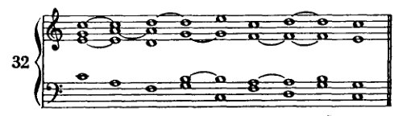

学生应当注意，此处（通过使用II的六和弦）乐句是如何从它起初的密集排列法进入开放排列法的。在这方面，他也应当追求变化。

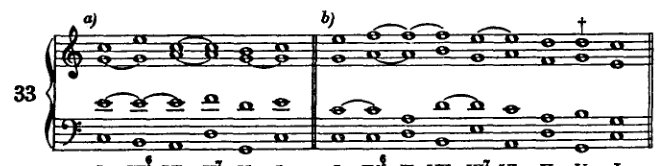

例33a涉及II的七和弦，33b则涉及III的七和弦。

既然学生已经在遵守有关平行进行的指示方面有了充分的练习，他现在偶尔可以引导某个声部不走最短的路线，如果他的意图是在旋律上改善上方声部的话（例如，在例33b的剑号†处）。当然，目前这里只考虑最高声部，而且这只能是避免过于频繁地重复某一音而可能导致的过度单调。但应当注意，单调的并不是长时保持的音；因为它不是新引入的，因此并不产生运动。乏味倒不如说是源于某一进行的重复，或是在其他两三个音介入之后对某个音的重复——如果这些音未能通过方向的显著改变来充分修饰线条的话。学生不必过于担心这类旋律问题。目前，无论他能取得怎样的流畅性都还是相当贫乏的。随着我们的手段增加，我们的目标也可以相应地提高。

现在接下来是通过五度进行预备，其条件与通过三度进行预备时相同。

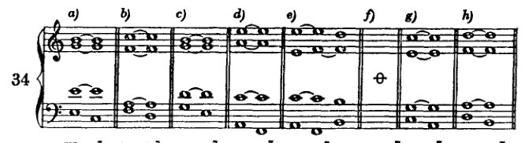

<!-- page 97 -->

七和弦 85

在这些例子中，始终有三个共同音可以作为和声连接来保持。IVth 级上七和弦的根音必须像之前一样加以重复，以便为 VIIth 级的 *f* 音做准备。VIIth 级不适合为 V 上的七和弦做准备，因为它不符合我们为预备和弦所设定的要求。预备和弦应当包含所要预备的音，且该音应为协和音；然而，在 VIIth 级三和弦中，*f* 是一个减五度，属于不协和音。人们可以忽略这一反对意见，因为 *f* 音先前已为 VIIth 级做好了准备，并且只是以同一声部一直延留下去。但这种连接存在某种薄弱之处；因为不协和音 *f* 与 *g* 形成的强烈效果，会被前面同一 *f* 与 *b* 形成的不协和音所破坏。在低音中加入 *g* 几乎无法增强效果，反而会给人造成一种印象，仿佛 *g* 之前只是被省略了而已。因此，这个进行应当被否定。

目前暂不考虑通过八度来预备七和弦。我们将在后文[第六章中]再回过头来讨论它。现在，我们只需考虑通过六和弦和六四和弦对七和弦进行预备与解决。

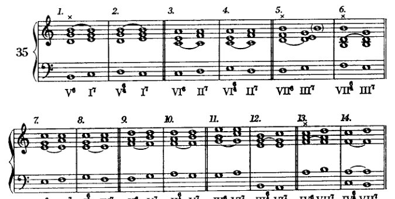

通过三度音来预备七和弦时，只要预备和弦是六和弦，就必须重复三度音（Example 35–1, 3, 5, 7, 9, 11, 13）。另一方面，通过六四和弦来预备则毫无困难。

在此处我们*必须*在六和弦中重复三度音，这一事实表明，如果给出一条规则：“六和弦中不得重复三度音”，那将是多么糟糕。我们现在看到，三度音有时不得不被重复。只要条件如此表明，我们的指示是：“重复三度音是多余的。”然而在这里，它是必要的，因此不再是多余的。即便我曾给出过一条规则，我也不会不附加说明：每一条规则都会被更强的必要性所推翻。我几乎要说，这是唯一应该给出的规则。

<!-- page 98 -->

86 大调式：自然和弦

若以 VII 的六和弦来预备 III 的七和弦（例 35–5），则后者无法以完整和弦的形式出现。五音或三音必须被省略，因为减五度 *f* 的解决迫使根音 *e* 重复。（此处还应记住另外两点：（1）显然，作为预备的 VII 级本身也必须被预备。（2）适合提出第二个问题[参见第 52 页]：“哪些音是不协和音？”因为这里存在两个：预备和弦的减五度，必须下行；以及 III 的七音，必须保持。）

通过五度进行预备时，建议优先重复预备六和弦的五度音而非八度音[根音]；当然，若不认为隐伏五度不好，也可以使用八度重复。如果重要的是保持所有上方声部，这里甚至也可以重复三音。但那并非必要（例 36–1、1a、1b）。

我无法建议将七和弦解决到六和弦。我们将在后文例 244 中看到，目前必须放弃的这种连接，在某些条件下将是可行的（例 36–16）；但目前我们必须满足于避免它。这里会出现隐伏八度（36–15），因为如果低音要走最短路径，七音与低音（根音）必须以同向进行到达同一音；而这些隐伏八度是我认为在和声写作中唯一真正糟糕的。我的理由如下：该

<!-- page 99 -->

七和弦 87

七音是一种具有倾向性的音，也就是说，是一种表现出向另一音解决之驱动力的音。在我们目前的情况下，第一个和弦的七音由下一个和弦的三音来接续。然而，这个同样的三音现在也要成为低音；如果低音声部按最短的路线进行——这是唯一合理的——那么它也将下行。（在此处，上行六度跳进将毫无用处；因为对我们的耳朵来说，六度——或许仅仅出于惯例，仅仅因为它总是被这样使用——已经更多地成为一种旋律性而非和声性的跳进。）于是，低音便走向了一个原本预期由另一声部出现的音。如果这个音在另一声部中的出现能带来满足感，那么它在低音声部中的效果却是微弱的，因为后者这种选择的任意性无法与七音强有力的必然性相抗衡。在这里，我们确实可以谈论低音声部独立性的减弱。*

另一方面，解决到六四和弦则毫无困难（Example 36–17）。

在此，与之前一样，学习者应先单独练习各个和弦连接，然后再继续构建乐句，尽可能系统地处理这个问题。

规划低音声部不再像从前那样容易。有了选择的可能性，也就有了做出良好选择的义务。应始终选择那些能让低音声部进行旋律化声部进行的转位。然而，还会出现其他条件：例如，如果有人想通过六四和弦来预备一个七和弦（学习者应始终以这种方式设定练习），那么该六四和弦本身也必须被预备；因此，学习者最好将自己设定的练习放在中间，由此倒推以确定开头，然后再确定后续部分。

例如，假设我为某个乐句设定了如下练习：由V级六四和弦预备的III级七和弦，以及由IV级六和弦预备的VII级七和弦。我的下一步是在中间写下表示音级的数字和低音线条，然后是低音音符本身（Example 37）：

---

\* 此处可能会提出这样的问题：尽管我如此强烈地谴责例外，但我自己是否也在制造一个例外。针对这个问题，我提出以下几点供考虑：事实上，这种情况是一个例外，但——这一点很重要——它是对一条我并未制定的规则的例外。相反，它是对一条我所驳斥的规则的例外。而如果我在这里赋予一条我所驳斥的规则以有效性，那这仍然算不上是一个例外。因为我的驳斥并不否认数个世纪以来作曲家们都遵循这条规则；它所断言的毋宁是，这种遵循是没有根据的。因此，我并未质疑这条规则在实践中被遵守这一事实；我只是表明这样做是没有道理的 [cf. p. 69]。然而，如果这条规则确实有一丝一毫的根据，那么这个特定的进行便是最明显的例子之一。这些隐伏八度实际上几乎和开放八度一样糟糕。如果我建议避免开放八度，那么我也可以禁止那些我发现几乎与开放八度同样糟糕的隐伏八度。请这样理解：‘……我发现几乎与开放八度同样糟糕的。’的确，我认为开放八度到底有多糟糕？这个问题的答案在我的驳斥中必然已经显而易见了！

<!-- page 100 -->

88

主要调式：自然和弦

[音乐记谱：低音谱号，带音符与和弦标记 V⁶₄ III⁷ VI IV⁶₄ VII⁷ III]

在V的六四和弦的*d*之前，我只能将*d、e*或*c*作为低音。低音*e*可能是：III级、I级六和弦，或VI级六四和弦；*e*六四立即被排除，否则我们将有两个相邻的六四和弦；*e*作为III级也不建议采用，因为III级在两和弦之后就会出现。I的六和弦是可能的，但它会导致*e*音的重复，我们应尽可能避免。因此，只有*d*或*c*能选作前一个低音。用*d*的话，只能是II或VII。VII级被排除，因为它必须解决到III级；剩下II级，如果它不意味着持续低音就好了——这至少是线条美感上的一个小缺陷。如果*c*在*d*之前，那么目前只能考虑I级；因为IV和VI与V没有共同音。那么最佳方案是在开始和弦（I）之后立即引入这个七和弦的准备和弦，即V的六四和弦。

或者：

[音乐记谱：低音谱号，两小节，和弦标记 ♯ ♯ III⁷ I IV II ♯ III⁷]

例38展示了如何以不同方式构建这个开头。例39给出了整个练习的完成版本。

[音乐记谱：大谱表，高音谱号与低音谱号，和弦标记 I V⁶₄ III⁷ VI IV⁶₄ VII⁷ III V I]

这里又出现了另一个困难；因为III的七和弦解决到*a*，而IV的六和弦准备VII的七和弦从*a*开始。要绕过这个困难，至少得插入三四个和弦，而且即使那样是否能得到好的低音也成问题。如果不选择最根本的修正方案——避免在如此短的示例中将这两个和弦进行并列，并用另一个进行替代第二个或第一个——那么用持续的*a*连接这两个和弦进行是最无可非议的解决方案。然而这并非必要，因为在特定情况下找到最佳方案就足够了；毕竟，学生产出完美无瑕的作品并不总是最重要的，重要的是他

<!-- page 101 -->

*七和弦的转位* 89

有机会来思考一切相关之事。这种智力体操，即使其结果并非毫无错误，却往往能比写出毫无瑕疵的范例带来能力上更大的进步。后者只有在为学生扫清一切困难时才可能实现，这样就免去了他选择的麻烦，但同时也减少了他完成之事的乐趣。他自己找到的解决办法，尽管可能有更多缺陷，不仅给他带来更多愉悦，也更强烈地锻炼了所涉及的肌肉。

## 七和弦的转位

与三和弦一样，七和弦也可以转位；也就是说：除了根音以外的某个成分可以出现在低音声部。当三音为低音时，该和弦称为五六和弦（更准确地说：五六三和弦）；当五音在低音时，称为三四和弦（更准确地说：六四三和弦）；而当七音在低音时，则称为二和弦（更准确地说：六四二和弦）。

现在，七和弦的转位可以出于与三和弦转位相同的原因而使用：使低音声部获得变化的可能性，并避免令人不快的重复。此处不再给出新的指示。

在例40*b*中，I的五六和弦被预备并解决了。通过三音（V级）来预备时，原位、六和弦以及六四和弦都适用；通过五音（III）来预备时，原位和六和弦适用，但六四和弦不适用（因为低音从*b*到*e*的跳进）。五六和弦可以解决到原位（根音进行总是一个上行四度）或六和弦，然而不能解决到六四和弦。在将五六和弦解决到六和弦时，可以优先，因为隐伏

<!-- page 102 -->

90

大调式：自然音和弦

八度，乃至低音与下行七音之间的反向运动。但这并非绝对必要。此处所述对其他音级上的五六和弦同样成立；只有 VII 的限制需要特别考量。

对四三和弦的处理从前附有一些限制，因为若忽略七音，它就是一个六四和弦（因为五音处于低音声部），即一个附加了七音的六四和弦。学生确实可以那样处理四三和弦，仿佛它是一个六四和弦。那就意味着：低音不要以跳进（*sprungweise*）的方式进入和离开，不要连续写两个四三和弦，也不要将四三和弦与六四和弦相连。然而，这种处理并非绝对必要；因为它太常被鲜活的[实践]范例所否定，在那里我们经常能碰到如例 40c 中那样的进行。

例 40d 展示了通过三音和五音预备四三和弦，并解决到原位与六和弦。六四和弦因“跳进”而不可能（40d-3 和 4）。

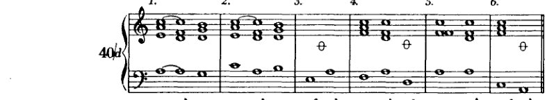

预备二和弦的七音当然意味着它必须先在低音声部提前引入。因此，[如今]只有少数进行是可能的。它的解决只能到六和弦，因为七音必须下行。

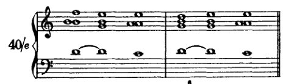

<!-- page 103 -->

*七和弦的转位* 91

就 VII 级而言，我们有如下进行：

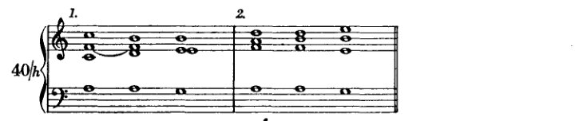

此处必须牢记，不仅七音，而且减五度也必须被预备和解决；请特别注意谱例 40g–1，其中低音声部的 *f* 也必须被预备。显然，与前面某些情况一样，有必要重复三音，例如当五六和弦解决到六和弦时（40f–2）；或者预备六和弦的三音必须被重复（40f–5），以预备减五度。此处省略了用 IV 的六和弦来预备三四和弦，因为减五度必须被预备（40g–2，同样适用于 40g–4 和 6）。此外，三四和弦不能解决到六和弦，因为 *f* 不应上行，而应下行。二和弦只能通过 IV 级六和弦以及 II 级六四和弦来预备。

学生现在应在不同调中练习预备和解决七和弦的转位，然后再着手编写短小的乐句。

<!-- page 104 -->

92 大调式：自然和弦

七和弦彼此之间的连接

如果我们只保留我们规则中最重要的一条，即七音须下行一步解决；如果我们忽视强根音进行的要求；并且如果我们满足于这样一种预备，即预备音在前一和弦中为协和音（因此它是自由的；可以说，并没有一条为它规定的必由之路！）——有了这些通融，我们便可以将一个七和弦与另一个七和弦相连接。只要满足这两个条件：预备音必须是协和音，且解决须通过七音的下行来实现。这与我讨论 VIIth 级音时所宣告的程序相符。在那里我曾指出，只要这种不协和音在我们的和声生活中仍是一种引人注目的现象，它就需要这样谨慎的处理[见第50页]。

例40k显示了一个三四和弦借助一个七和弦来预备（借助三音），以及一个五六和弦借助同一个七和弦来预备[此处的预备音是五音]。例40l显示了若干此类连接的序列，其中当然

<!-- page 105 -->

*七和弦的连接* 93

七和弦的位置（转位）由当时的低音决定。这样一种进行，特别是如此延伸的一种，实际上并不使我们感兴趣。展示它只是因为，在较古老的作品中，某种类似的东西常常为动机的模进重复构成和声框架。

在例40m中展示了一些连接，其中低音跳进，同时七音解决，而一个协和音准备另一个七和弦。在解决过程中，另外两个声部交换位置[即那些不含七音的声部]。

一旦学生掌握了处理不协和音的一些技巧，这里施加的许多限制就会被取消。但现在还不行；因为从那些限制的观点出发，仍然有一些事情需要考虑。这样一来，肯定有人会问：如果可以用更简单的方式做到，为什么不立刻简化呢？

对此建议，我要提出如下反对意见：这个和声体系的特点，在对不协和音的处理中显现得最为鲜明。确实，因为它只不过是一套*观察和运用*事物的方式，而非事物*本身*的体系，所以人们完全可以抛开这一切，对学生说：'写你耳朵所要求的！'但这种逻辑并不容易让人接受。我们每个人都不甚清晰地感到，如果让初学者听凭他耳朵的自行裁量，他写出的东西固然未必就是错的——即使它们不符合我们对艺术秩序的观念——但同时却也未必就是对的。我们每个人都不甚清晰地感到，这种自称是自然的秩序中存在着矛盾，然而它却被处于自然状态、未经教化者的良好听觉所否定：被否定，因为它不是自然秩序，而是人为的；因为它是学习、文化的产物。诚然，自然可以容许多样化的解释，以至于我们甚至能把我们的人工制品、我们的文化产物（*unser Künstliches*）也纳入自然之中；而且无疑也可以像我们的体系一样自然地从自然中推断出其他体系。但也同样不自然！因为这不过是对一种看似自然的（完美的）事物的人为的（不完美的）表现，而学生应当被教授的正是这一事物的本质。关于这一点我们必须清楚：我们并不是在教他永恒的法则，不是自然颁布的作为唯一法则的不变的艺术法则！相反，由于我们无法把握无序之物，我们的任务是将我们艺术的传统技艺以一套封闭理论的形式呈现给他，仿佛它是植根于自然的、*从自然中推断出来*的。这套理论确实*可以*从自然中推断出来。这是可能的，但也仅此而已！即使我们的艺术及其理论在某种程度上有正当理由诉诸自然，一个未受过此艺术训练的人，如果他创作出不同的东西，也不一定就是错的。

<!-- page 106 -->

94 大调式：自然和弦

因为艺术将可感知之物化为可表达之物。因此，人可以以不同的方式感知，也可以以不同的方式表达。然而，最重要的是，艺术不像自然那样是某种给定之物，而是某种已成之物。那么它也可能成为与现在不同的样子。艺术演化的路径，即历史发展，或许往往比它从中发展而来的自然更能表明它已成为什么。因此，如果人们希望以传统意义上的和声体系来教导学生，有时引导他沿着艺术的路径而非自然的路径前行，会更为贴切。而艺术的路径，即使不总是最短的，仍然可以通行。即使它不总是通向自然的事实——只要它通向艺术的事实就足够了。如果它真的只通向所有可想象的艺术事实，那么它有时也可能是一条迂回之路，穿过那些对其方向没有影响的现象，也就是说，那些影响已无法被清晰辨认的现象。它至少是一条路径。一条新路径可能更短，可能避免多余的迂回和耽搁。然而，谁能确切地知道，确切到随时都能为未来发展承担责任的地步，这些迂回和耽搁中哪些实际上是多余的，实际上对未来的发展毫无影响呢？

如果真的要让学生在对待不协和音方面拥有即时的自由，这种自由的界限问题仍然不能不予回答。而我或许可以容许自己享有那种奢侈。我对有天赋学生的耳朵抱有如此完全的信任，以至于我确信即使那样，他也能找到正确的道路。我与学生相处以及我自己发展的经验，也能使我在遵循这一道路时感到安心。尽管如此，我在自己和他人身上都看到，了解这些事物的更多知识的需求会产生，甚至要将它们如此彻底地吸收，以至于将它们理解为秩序、理解为具有连贯性。此外，也有一些人的天赋特点需要指导，其中一些人或许只是为了节省时间。自己摸索所花费的时间确实并非绝对浪费时间，即使在犯错时也是如此。然而，如果有一只可靠而谨慎的手引路，这些时间可以被更经济地利用。
