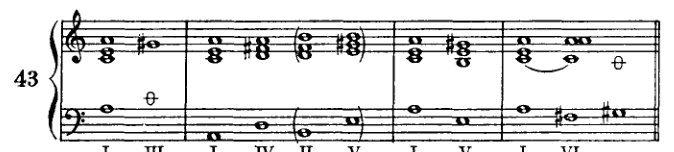
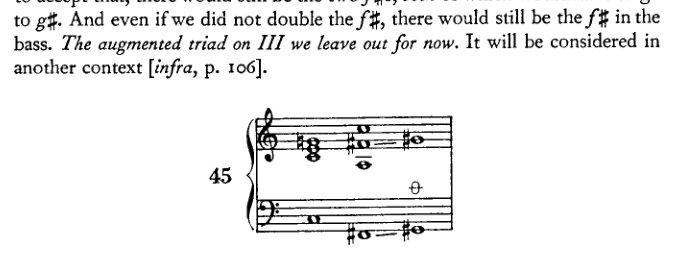
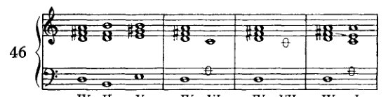
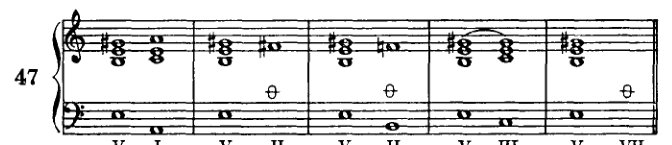
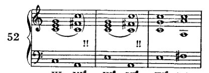
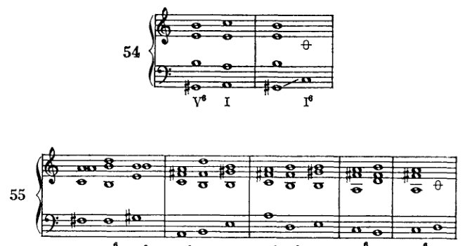
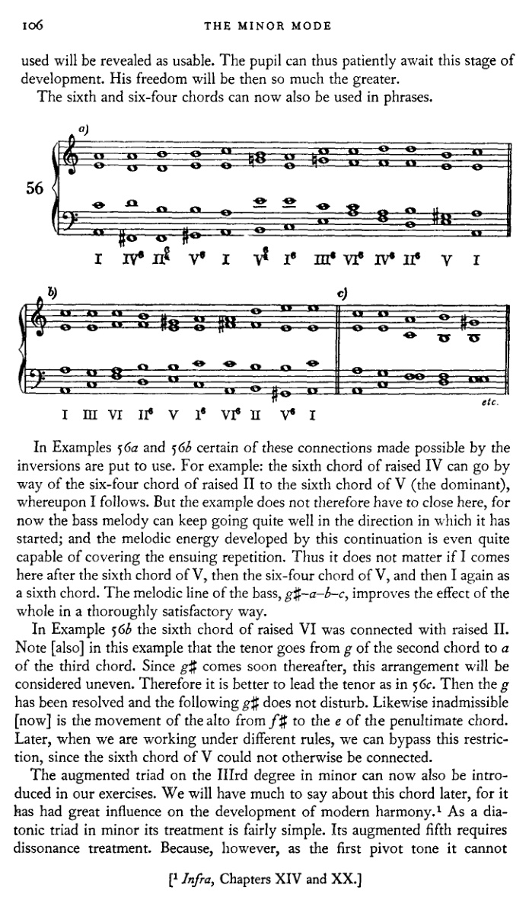
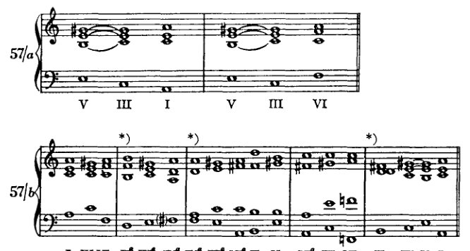
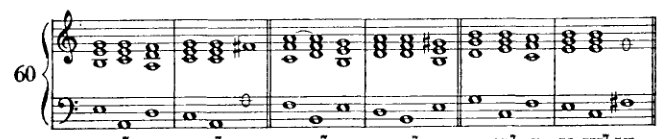
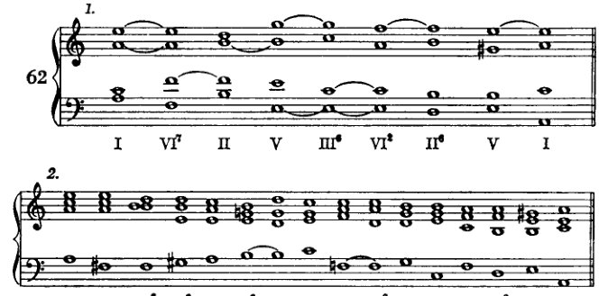

<!-- page 107 -->

# V 小调式

到目前为止，我们的练习都只是在大调式中进行的。现在我们要继续将所学应用到小调式中。但首先，我们必须对小调式的本质有清晰的认识。小调式和大调式都是七种教会调式的遗存。我们今天的大调式即古老的伊奥尼亚调式，我们的小调式即爱奥利亚调式。其他教会调式的起音如下：多利亚调式以d开始，弗里几亚调式以e开始，利底亚调式以f开始，混合利底亚调式以g开始，以及下弗里几亚调式以b开始。

这些调式中的每一种都由一个自然音列的七个音组成：例如，在音列c、d、e、f、g、a、b中，多利亚调式从d开始，读作：d、e、f、g、a、b、c。这些音阶，如同我们的大调式和小调式一样，可以移调，因此实际上有八十四种音阶可用；但诚然，并非所有移调都被普遍使用。关于教会调式的更详细记述，可以在某部较古老的著作中查阅。¹ 我在这里只讨论与我们的任务相关的特征：就我所能发现的而言，那些影响了历史演变的特征。若要阐明那种作为我们自己基础的、和声上的形式感，它们不仅应该，而且必须被加以考虑，* 因此，应当指出，教会调式有一种倾向，即模仿伊奥尼亚调式的某种特征，其第七音是一个上行导音，也就是说，一个仅比第八音低半音的音。我已经说过，我认为这种倾向是教会调式解体的原因。它们的区别性特征因此被抵消了，各个调式彼此之间变得如此相似，以至于最终只剩下两种可以清楚区分的主要类型：*大调式*，它汇集了伊奥尼亚调式及其他大调类调式的特征；以及*小调式*，它汇集了爱奥利亚调式及其他小调类调式的特征。因此，小调式纯粹是综合的，是艺术的产物，试图将它表现为某种自然赋予的东西是徒劳的；它的自然性并非直接的，而是，如同

\* 在小调式的讨论中纳入教会调式这一想法，我得自马克斯·勒文加德 [或 Loewengard。这位教育家撰写了多种理论教科书，其中包括一部 *Lehrbuch der Harmonie*（1892），该书经历了多个德文版，并由 Frederick L. Liebing 译成英文（*A Manual of Harmony*，1907），以及由 Theodore Baker 译成英文（*Harmony Modernized*，1910）。这些译本均未提及教会调式。原著及另一译本（1905），以及 Loewengard 的其他著作，均未能查阅。]

[¹ 鉴于许多学术著作中已包含此主题的详尽资料，此处似乎无须编者注释——除非是为了建议将勋伯格对教会调式的引述（此处及第十章，*et passim*）与海因里希·申克（Heinrich Schenker）在其著作 *Harmony* 中的观点进行比较，Oswald Jonas 编，Elisabeth Mann Borgese 译（Chicago: University of Chicago Press, 1954），第45–76页。鉴于勋伯格本人对申克著作的引述（例如 *infra*，第119页，附录第428页），这一建议尤具特殊相关性。]

<!-- page 108 -->

96

小调式

与教会调式的那种关系不同，它是间接的。诚然，大调与小调是历史地演化而来的，它们对此前的一切进行了本质性的简化（因为它们是一个总和，涵盖了七种古老调式中曾出现的一切）；诚然，大调与小调所呈现的二元对立具有一种象征力量，暗示着高级秩序形式：它令我们想到男性与女性（*Zweigeschlechtlichkeit*），并依据吸引（*Lust*）与排斥（*Unlust*）来划定表现力的范围。这些情况当然可以被援引，用以支持那种错误学说，即这两种调式是唯一真正自然的、终极的、永恒的。据说自然的意志在它们之中得到了实现。但对我来说，其含义有所不同：*我们离自然的意志更近了*。但我们距离它仍然很远；天使，我们更高的本性（*Übernatur*），是无性的；而精神不知排斥（*Unlust*）为何物。

我们的先辈无疑也曾像我们认为大调与小调那样，认为教会调式同样完美。数字七与数字二具有同等的象征力量；而学界所认可的两种主要表现范围，当年显然曾被想象力奉为神圣的七种所取代。倘若有人向他们展示未来：他们的七种中有五种将被抛弃——正如这里有人向我们展示未来那样：剩下的两种最终也将合为一种——那么他们也会像我们的同时代人那样，反对这种可能性。他们会谈论无法无天、混乱、缺乏个性（*Charakteristik*）、艺术手段的贫乏等等；他们的抱怨听起来会跟今天的抱怨一模一样，假如现在有某种别的东西正在演化出来，某种不同于那些喜爱炉边安逸的人所愿见的东西——那些人不愿理解，每一次进步中，若要在一方面有所得，就必定要在另一方面有所失。

预备工作即是一种投入；然而进步——也就是收益——之中，预备工作依然存在，纵使它不再包含过去的一切，最重要的部分却仍然保留。而且，从历史角度看，每一次进步都只是预备工作。因此，不存在不可逾越的成就高峰，因为高峰本身只是相对于已被超越的高峰而言的。所以，我也不相信民族生命中存在不可避免的衰亡。我相信，要不是一场与文明演化的相关因素完全无关的事件——民族大迁徙——从中干预，罗马人本可以甚至超越他们发展的最高阶段。[^1] 诚然，当时一个民族的活力首先可以体现在其军事力量上。但请不要忘记：是一种 *Kultur*（一种高级文明）被一种 *Unkultur*（被野蛮人）所征服；并不是一个 *Kultur* 失败了、变得不再有创造力、精疲力竭而不得不被废弃。这种废弃本可以在有机体内部通过革命来完成，革命会剔除坏死的器官，同时保留有机体本身。民族大迁徙实际上才必须被视为罗马人颓废的过度文明（*Überkultur*）的一个后果，倘若人们要把

[^1]: 更字面的译法是：“我不相信罗马人本还不能超越他们发展的最高阶段，假如没有一件事干预的话……”

<!-- page 109 -->

小调式                                                          97

罗马的毁灭，直至国家活力的衰退。即便是悲观主义者也不愿走得那么远，那些人在四面八方嗅到衰败与没落的气息，而勇敢者却在其中发现新活力的痕迹。¹ 教会调式的衰落，正是那种必然的衰亡过程，从中萌生出大调与小调的新生命。即使我们的调性正在解体，它也已经蕴含着下一个艺术现象的萌芽。在文化中，没有什么是一成不变的；一切都只是为更高发展阶段所做的准备，为一个此刻只能想象、揣测的未来所做的准备。进化尚未完成，巅峰尚未跨过。一切才刚刚开始，而巅峰只会——或者也许永远不会——到来，因为它将永远被超越。“那是最后一波浪，”古斯塔夫·马勒有一次指着一条河对勃拉姆斯说，当时后者在一阵悲观情绪中谈到他所认为的音乐制高点，并认为那是最后的巅峰。

那么，我们当今的小调就是古老的爱奥利亚调式，其音阶为：a、b、c、d、e、f、g。有时，当第七音要上行至第八音时，第七音便被转变为导音，也就是说，用 g♯ 代替 g。然而，这一变化产生了增音程 f–g♯，在较古老的音乐中这是要尽可能避免的。因此 f♯ 也代替了 f，于是，在需要导音之处，音阶就变为：e、f♯、g♯、a。f–g♯ 这个音程难以唱准，即使在今天大概也依然如此。要把它唱得完全准确当然不易。而这类音程的使用，很可能大大加剧了合唱团在无伴奏合唱时保持音高的困难。有人或许会提出异议：古老的键盘音乐同样避免这类音程，尽管在键盘上任何音程都同样容易弹奏；因此，以音准困难为理由并不能解释这个问题。这一异议可以这样予以驳斥：这类音程之所以难以唱准，是因为它们难以想象，而正是由于这一原因，它们也难以被感知。此外，就风格本质而言，器乐与声乐从未被区别对待。这意味着表达的内容与方式在和声、对位、旋律与曲式中始终保持一致。在键盘音乐的显著旋律位置上使用增音程，势必也会导致这类音程在声乐中的运用。然而，由于音乐实践是以声乐为导向的，因此这类音程之被避免便是可以理解的了，不仅在声乐中如此，在器乐创作中亦然。

只有在意图使用导音之处，才用一个升高了的音来代替第七音，并因此也代替第六音。如果这不是目的，那么就保留未改动的音阶音。因此，将这两个音的处理建立在所谓的和声小调之上是不正确的。在我看来，唯一正确的方法是以爱奥利亚调式为出发点。毕竟它也具有旋律小调的特征。然而，我们必须牢记，升高了的音只有在需要导音时才被使用，也就是说，用于 a 音上的终止式。只有在那时，g♯ 才被用来代替 g，而选用 f♯ 也纯粹是为了 g♯。因此，小调有两种形式

[¹ 勋伯格在其修订版中于此处添加了一条脚注，内容是关于第一次世界大战后果的一些评论（见附录，第425页）。该脚注在第七版中被删除。]

<!-- page 110 -->

98

**小调式**

音阶，两者合称为旋律小调音阶：*上行*形式，以升高第七级和第六级音替代自然音；以及*下行*形式，使用未经改变的普通音列。两种形式不混合使用。上行进行中只能出现升高音，下行进行中只能出现自然音。此处所述内容，总结为规则，即构成*小调式枢纽音法则（Wendepunktgesetze）*：¹

*第一枢纽音，g♯：* g♯ 必须进行到 a；因为 g♯ 仅用于导音进行。g♯ 之后在任何情况下都不可接 g 或 f，g♯ 也不可进行到 f♯（至少目前如此）。

*第二枢纽音，f♯：* f♯ 必须进行到 g♯；因为它仅为了 g♯ 而出现。在任何情况下都不可接 g，当然也不可接 f。也不可接 e、d、a 等（至少目前如此）。

*第三枢纽音，g：* g 必须进行到 f，因为它属于音阶的下行形式。其后不可接 f♯ 或 g♯。

*第四枢纽音，f：* f 必须进行到 e，因为它属于音阶的下行形式。其后不可接 f♯。

遵守这些指示是不可或缺的，因为没有它们，小调式的特征几乎无法显现。我们必须暂时搁置半音进行，因为我们尚未解释其条件。对升高第六级和第七级音的任何其他处理，都很容易消除调性感，而我们最初希望保持调性感绝对纯粹和明确。一旦我们拥有更丰富的手段，就能轻易将更大胆的离调、表面的离键控制在界限之内。但目前我们几乎无法做到这一点。第三和第四枢纽音以后可以参照爱奥尼亚调式稍作自由处理。只要不替代升高音，该调式就对应于伊奥尼亚调式，对应于我们的关系大调[即音相同]。枢纽音法则更多针对现代旋律小调，其中爱奥尼亚调式中常见的处理很少出现：即相当长的段落中没有升高音，其中当然第六级和第七级自然音可以自由进行。在这种意义上，即使现在也可以允许更自由的处理。那么 a 可以接在 g 之后（例如在不显眼的内声部中），或者 g 可以接在 f 之后。但这些在升高音附近的进行，很容易产生类似所谓对斜关系（即将讨论 [第102页]）所产生的不均匀印象。在这种情况下，g 或 f 应该可以说是需要"解决"：在升高音出现之前，g 应该进行到 f，f 进行到 e。即使现在更自由地处理 f 和 g，关于——

[¹ 罗伯特·亚当斯将术语 *Wendepunktgesetze* 译为"转折点"（《和声理论》，第49页）。勋伯格在其《和声的结构功能》（纽约：W. W. 诺顿，1954年）第9–10页及各处，称这些交替的第六级和第七级音为"替代音"，因为他说，人不是"升高"或"降低"音，而是替代，例如在上行 a 小调音阶中以 g♯ 替代 g，在下行音阶中以 g 替代 g♯。（参见下文第100页勋伯格的脚注，以及第387页。）在本译本中，如同亚当斯的译本一样，保留了勋伯格原有的隐喻 *Wendepunkte*——但此处译为"枢纽音"。]

<!-- page 111 -->

*小调中的自然三和弦*  99

要求 *g* 和 *f* 变为 *f#* 和 *g#* 仍然完全成立。然而，更实际的做法是将这种较自由的处理 [对 *f* 和 *g*] 留待以后。

正如我们所处理的，*a*小调音阶乃是一个从 *a* 开始的*C*大调音阶，它在特定情况下（导音）允许第七音升高半音；并且，出于旋律原因，为了第七音的缘故，第六音也可以升高。如果这些音不升高，那么一切都与关系大调相同。如果这些音升高，则适用关于枢纽音的指示。

## 小调中的自然三和弦

谱例41展示了小调中可能的三和弦。它们比大调多六个，因为升高音自然参与和弦构成；而且三和弦的顺序、种类与构成（*Zusammensetzung*）也截然不同。因此，一级是小和弦。在二级上我们找到一个减三和弦和一个小和弦，在三级上一个大和弦以及一种形式对我们而言很新的和弦。（它就是所谓的增三和弦，我们将给予特别关注。[^1] 它由两个大三度构成，二者相加等于一个增五度。增五度不出现在最初的泛音列中，因此是不协和音。）在四级上，以及五级上，出现一个小和弦和一个大和弦。在六级上，以及七级上，出现一个大三和弦和一个减三和弦。关于这些和弦的连接，应遵守以下指示：和之前一样，我们首先只选择具有一个或多个共同音（*harmonisches Band*）的和弦；因此我们可以继续使用先前给出的表格 [p. 39]。那些没有出现升高音的和弦，在它们*彼此之间*的连接上没有任何困难。这里的关系与关系大调中的并无不同。当然，这里出现的减和弦将一如既往地被处理：也就是说，II级上的三和弦 *b–d–f*（与大调的VII级相同），经由IV级 *d–f–a* 和VI级 *f–a–c* 作预备，并解决到V级 *e–g–b*。它也可以解决到V级 *e–g#–b*，如后文所示。另一方面，当这些三和弦与含有升高音的三和弦连接时，以及当后者*彼此之间*连接时，必须遵守处理枢纽音的指示。这里自然会产生一些困难，并且有一长串目前尚不能使用的连接。

学生将在那些问题 [p. 52] 的引导下再次进行工作。

[^1]: 下文，第106–7页及第十四章。

<!-- page 112 -->

100

## 小调式

根据枢音法则所规定的新条件，第二个问题现在应读作：

第二个问题：要处理的是哪些不协和音（不协和音类）或枢音（具有规定进行路径的音）？

例42展示了第一级与相关未升高音级的连接；\* 所有这些连接都很容易完成。学生可依此模式练习其他未升高音级。（起初仅使用原位，如前所述。）

例43尝试连接含有升高第六音或第七音的和弦。第一级与增三和弦（III）的连接目前应暂时略过。另一方面，与升高IV级的连接效果相当好，只是它受制于某种特定的续进，因为在升高IV级之后，目前除了升高II级外，其他任何音级都不能跟随。与升高V级的连接进行顺畅；但与升高VI级的连接目前尚不可用，因为VI级是一个减三和弦，因此必须由根音进——

\* “升高的”或“未升高的音级”这两种表述在两方面是不准确的：（1）这些音仅在我们的记谱法中被升高（以♯或♮表示）；但在其他方面，它们并非被升高，而是被更高的音替代了。在半音进行中，我们可以谈论“升高”音；因此，在此处［此处］以及谈及副属和弦时，都应避免这种表述。（2）音级本身并没有被升高，而只是使用了升高的音，或者说以这类音替代了原有音。也许，为了准确和完整，人们应当说：x级，带大三度、纯五度或增五度。但这太冗长了。也可以说“上行的x级”，或“上行的”（如果采用上行音阶的音），和“下行的”。然而，我倾向于使用“升高的”和“未升高的”，因为它们灵活且简短，而且并不比“变化的”“上行变化和下行变化”这类说法更错误。因为“altered”同样可能意指将两者混淆（verwechselt），而不是像音乐日常语言中所假定的那样，指“被改变的”（verändert）。［“Altered”：在不完全丧失同一性的前提下改变某些方面。G♯不是g的变化形式，至少在我们的记谱法之外不是，而是另一个不同的音。——勋伯格在修订版中添加了这条脚注。］

<!-- page 113 -->

*小调中的自然音三和弦*        101

上行四度的进行——然而低音中的$f\sharp$必须走向$g\sharp$（枢音第二法则），因此不能跳进。¹

示例44[1和2]展示了II（减三和弦）与V的连接，分别由IV和VI作准备。（准备并解决！）

示例44-3展示了升II与IV的连接。这种连接当然可行，但并不实用；因为正如我们稍后将会看到的，IV之后唯一的选择又将是II，而II之前又只能是IV，正如其他示例所示。因此，该进行将变成：IV–II–IV–II。这无疑是多余的重复。升II可以毫无困难地进入升V。但II–VI被排除，因为VI必须被排除，II–VII也同样被排除，因为VII目前同样不可用，这一点稍后将会说明。

未升高的III级自然不能与含有$f\sharp$或$g\sharp$的和弦连接。如果我们忽略枢音第三法则（而我们不能忽略它），唯一可考虑使用的音级是VI。那么这两个音级或许可以通过将$g$进行到$c$来连接，从而绕过$g$–$f\sharp$这一步；但这样一来，$c$（减五度）就将没有准备，而且即使我们愿意接受这一点，仍然会有两个$f\sharp$，它们两者都必须走向$g\sharp$。而即使我们不重复$f\sharp$，低音中仍然会有$f\sharp$。*III级上的增三和弦我们暂不考虑。*它将在另一语境中讨论[*下文*，第106页]。

在未升高的IV之后唯一能够跟随的升高三和弦将是V，因为

---
¹ 要理解勋伯格为何排除某些进行，或对它们施加限制，读者应牢记当前有效的规则（或更确切地说，“指示”）。它们如下：

1. 仅用原位（直至*下文*，第105页）；
2. 需要共同音；
3. 枢音；
4. 不协和音（且仅允许使用的不协和音）须经准备，随后通过根音上行四度解决。

<!-- page 114 -->

102

小调式

升高的III和VII被排除在外。但V暂时也被排除，因为没有共同音。我们无法将未升高的IV与升高的II或VI连接，这是很清楚的，因为*f*不能进行到*f*♯；而另一个声部进行到*f*♯，则为所谓的交叉关系法则所禁止。

这一法则如下：某一音的半音升高或降低，应当发生在该音此前处于未升高或未降低状态时所在的同一个声部中。这意味着，如果两个连续的和弦分别使用*f*和*f*♯，那么原先拥有*f*的同一个声部必须去唱*f*♯。因此，举例来说，如果女低音刚刚唱了*f*，那么男高音就不应在下一个和弦中唱*f*♯。我不愿以最严格的程度来应用这一法则，因为实际用法常常与之矛盾。过去，这一法则恰恰与此相反，即：某一音的半音升高永远不会在同一个声部中出现，只要*f*在前面出现，就必须由另一个声部来唱*f*♯。这两者都不是审美法则。它们不如说是试图克服音准困难的两种不同尝试。要将一个半音程唱得完全准确，确实不容易。我倾向于上述第一种法则的表述，因为半音进行通常能产生良好的旋律线。鉴于我们关于枢纽音的指示，这些音的处理会自行调节，并且是以不同的方式；¹ 因此，半音进行暂时被排除在外。

升高的IV可以顺畅地连接到升高的II，但与未升高的II的连接则被排除。它不能与升高的VI（减三和弦）连接，因为后者的减五度*c*必须有所预备。我们也省略了与VII上的减三和弦（*g*♯–*b*–*d*）的连接，因为这个三和弦目前尚不可用。它需要特殊的考量，这将在后文讨论。甚至升高的IV与I的连接也不可能，因为*f*♯应当进行到*g*♯。

未升高的V级音不能与包含*f*♯或*g*♯的和弦相连接（其道理与未升高的IV不能如此连接相同）。在

[¹ “And differently”（*und anders*）：据推测，勋伯格的意思是，处理枢纽音的指示与支配交叉关系的两条规则均不相同。枢纽音的使用取决于旋律线的走向。]

<!-- page 115 -->

*小调中的自然三和弦* 103

另一方面，升高的V级容易与I连接；但与升高的II级、未升高的II级以及VII级的连接必须省略。因为g♯不能进行到f♯，所以升高的II级不适用；而未升高的II级是一个减三和弦，其减五度f必须预备。与III级的连接暂时被排除。

未升高的VI级不能与包含f♯或（至少是暂时地）g♯的和弦连接。VI级的减三和弦f♯-a-c现在完全不能使用，因为f♯应当进行到g♯，而减三和弦却要求根音作四度进行。

现在，又要来构造小乐句了。一般而言，建议少用带有升高音程的音级，多用未升高的音级。在一个同时出现未升高和升高音级的练习中，篇幅必然较长，因为通常必须使用若干和弦才能从一个区域过渡到另一个区域。通常来说，显而易见的是应将升高音级置于终止式附近，因为它们毕竟是为了终止式而存在的。带有变音的和弦进行必须总是进行到I级。如果将这些和弦引入中间部分，就会产生重复。此外，目前只有在I或II之后才能引入升高音级。学习者应将V级用作倒数第二个和弦，并且始终使用升高的音程（作为属和弦）。在数字低音中，升高音级通过在表示所升高音程的数字旁加注升号或还原号来标记：例如3♯、5♯等（或在c小调中为3♮、5♮）。

在谱例49-1中，除了终止式中的V级外，只选用了未升高的和弦。在谱例49-2中，除了两个I级和弦外，其余都是升高的。如果我们不打算在I级之后继续，这两个例子都不能再延长多少。谱例49-1有可能在II级之后通过未升高的V级加以扩展；然而，那样我们就需要另一组和弦来进入终止式，例如：II、V、III、VI、II、V、I。这显然与前面的进行几乎相同，并且

<!-- page 116 -->

104 小调式

因此几乎没有任何优势。当然，以一种完全不同的方式结束也是允许的，即将I直接置于VI之后。在任何情况下，学生都不得在III之后直接结束，因为这个和弦包含*g*，而g不能进行到*a*；此外，对于终止式，我们更应引入导音*g♯*。IV–I终止式也是可能的。然而，这种终止式，以及VI–I终止式，学生只有在某个例子否则会过长时才可以写。只有在那时。在所有其他情况下，他都应该将V作为倒数第二个和弦来推进。一般来说，仅用这些手段想不出很多例子，而且在那些例子中也不可能有很多变化；因此，学生应尽可能在更多的调中练习这仅有的一点内容。

<!-- page 117 -->

*小三和弦的转位* 105

---

**小三和弦的转位**

通过使用六和弦与六四和弦，一些此前无法实现的连接变得可行了。除此之外，关于转位并无新的内容可言。大调转位中先前允许的做法，此处同样适用：也就是说，六和弦是完全自由的；至于六四和弦，其低音我们既不以跳进到达，也不以跳进离开。

例50至55中出现了一些在使用转位之前[在前一节中]不可能实现的连接。学生将能够发现更多此类连接。只是，他必须严格遵守关于枢纽音的指示，且不可忘记减五度暂时仍须预备和解决，因此不得重复。例如，我们不能以跳进离开升IV级的六和弦，因为其中的 *f♯* 应当进行到 *g♯*；但或许可以通过将II级中的 *f♯* 置于另一声部，然后让该声部承担 *f♯* 到 *g♯* 的进行，以此来进行到升II级（例53*a*）。这样，和声要求固然可以得到满足，旋律要求却不能，而这些指示正是源于旋律要求的。日后学生自然能够更加自如地处理这些问题；而我认为，他最好暂且等待，避免这种处理方式，直到他对小调式的特性形成了一种可靠的形式感（*Formgefühl*）。我已经说明了为何理论中不能出现例外。但如果我想拓宽此处过于局限的范围，就不得不做出例外。一旦我处理小音阶的观点被充分运用，这些限制将如何自行解除，很快便会显现出来。多余的东西将会自行消除，而通常

<!-- page 118 -->

106 小调式

所使用的和弦将被证明是可用的。学生因此可以耐心地等待这一发展阶段。届时他的自由度将会更大。

六和弦和六四和弦现在也可以用于乐句中。

在示例 56a 和 56b 中，某些由转位所实现的连接被加以运用。例如：升 IV 的六和弦可以通过升 II 的六四和弦进行到 V（属音）的六和弦，随后接 I。但示例因此不必在此处结束，因为低音旋律可以很好地继续它已经开始的进行方向；而这种延续所发展出的旋律能量甚至完全能够掩盖随后的重复。因此，如果此处 V 的六和弦之后接 I，然后是 V 的六四和弦，再然后是作为六和弦的 I，这都无关紧要。低音的旋律线 g♯–a–b–c 以完全令人满意的方式改善了整体效果。

在示例 56b 中，升 VI 的六和弦与升 II 相连接。请注意该示例中，男高音从第二和弦的 g 进行到第三和弦的 a。由于随后不久就出现 g♯，这种安排将被认为是不平稳的。因此最好将男高音如 56c 中那样进行。这样 g 就得到了解决，随后的 g♯ 便不构成干扰。同样不可容许的是女中音从 f♯ 到倒数第二和弦的 e 的进行。稍后，当我们在不同规则下工作时，我们可以绕过这一限制，因为否则 V 的六和弦将无法连接。

小调 III 级上的增三和弦现在也可以引入我们的练习中。关于这个和弦我们以后还有很多要说的，因为它对现代和声的发展产生了巨大影响。¹ 作为小调中的自然音三和弦，它的处理相当简单。它的增五度需要按照不协和音来处理。然而，由于它作为第一个枢轴音不能

---
¹ 见后文，第十四章和第二十章。

<!-- page 119 -->

*小调中的三和弦转位* 107

下降，而解决——此处首次——通过上升来实现。不过，增五度可以像我们先前处理不协和音时那样进行预备。实际上，目前只有V级可用于这一任务，但正如我们即将看到的，VII级也可以使用。解决和弦为I和VI。

让我们立即指出该和弦的某一特性：从c到e的距离为四个半音，从e到g♯同样为四个半音，而从g♯到根音的再次出现，亦即八度，又是四个半音。因此，音e和g♯将八度划分为三个完全相等的部分。该三和弦的构造值得注意，因为任意两音之间的距离始终相同，以至在转位中，各音之间的相互关系并不改变。因此，这个和弦本质上与迄今所考虑的所有和弦都不同。这一特性——关于它后文还有更多内容要讨论——使得即便现在也能允许某种我们很快将对所有其他和弦允许的做法（在下一章中）：即，它可以与那些没有共同音的和弦相连接。此外，我们可以省去增五度的预备。这种自由度给我们的短乐句构造带来了许多极为有利的可能性。同时，枢轴音的规律当然必须严格遵守。之所以即便现在我们更自由地处理这个和弦，而其他和弦仍受诸多限制，可作如下解释：这些限制条件的表述仅以一种非常松散的方式适用于增三和弦。我将不得不以不同的方式表述它们，而在我们实际上正处于放宽其他限制的阶段，我不想这样做。

\* 相邻音级的连接将在下一章讨论。——在57b的第四个例子中使用VI——而不解决减五度——同样是过早的，此处出现仅为了完整起见。

因此，例57a和57b所示的连接是可能的：III之前可以是I、II、IV、VI以及（如例58所示）VII；III之后可以是I、IV、VI和V（II不能跟在III后面，因为g♯必须进行到a）。

<!-- page 120 -->

108 小调式

VII上的减三和弦应当（作为减和弦）先由（IV或II）预备，再解决（到III）。

当然，减五度和根音都不能重复，因为减五度应当下行，而根音作为导音应当上行。因此，只有三音可以重复。

这两个和弦的讨论不得不推迟，因为我们只有借助三和弦的转位才能使用它们。此次推迟别无其他原因。

小调式中的七和弦
及其转位

通过使用升高和未升高的音，我们在每一级上都能获得两个七和弦，在VII级上甚至多达四个。如果我们遵循先前给出的指示，那么这里所得到的一切并非都能立即使用。显然，未升高音的七和弦与未升高音的三和弦之连接是没有问题的。在那些含有一个升高音的七和弦中，有些只是有条件地可用，而另一些，以及那些含有两个升高音的（在VII级上 *g♯–b–d–f♯*），根据我们的指示，目前是绝对不可用的。

<!-- page 121 -->

*七和弦及其转位* 109

[乐谱：例60，罗马数字分析 I IV⁷ VII VI IV⁷ VII V⁷ I II V⁷ I III VII⁷ II I V⁷ II IV VII⁷ III II VII⁷]

例60展示了不含升高音的七和弦的预备与解决：以三音和五音预备，以根音上行四度进行解决。这一切仍按以往的方式进行，无需新的规则。根据我们现有的规则，这些七和弦与含有升高音程的三和弦的连接仅有一种情况可行：II级七和弦解决到带大三度的V级。其他均不适用：例如，I级七和弦不可行，因为*g*不能进行到*f♯*，等等。

在例61中，我们将考察含有升高音的和弦。

[乐谱：例61，罗马数字分析 I⁷ IV II⁷ V V III⁷ VI VII III⁷ I IV⁷ VII VI IV⁷ VII]

[乐谱：例61续，罗马数字分析 II V⁷ I VII V⁷ I III VI⁷ II I VI⁷ IV VII⁷ II VII⁷]

[乐谱：例61续，上标"a)"，罗马数字分析 VII⁷ VII⁷ III⁷ VI⁶ IV⁷ VII⁶ III VI⁷ II⁶ V⁶ VII⁷ III⁶ VI⁶]

例如，我们发现I级七和弦*a–c–e–g♯*目前对我们不适用，因为七音*g♯*作为导音应上行，但作为七音应下行。II级(*b–d–f♯–a*)的*f♯*和*a*都应进行到*g♯*，一个作为支点音，另一个作为七音；但*g♯*不能重复，因为倘若如此，两个*g♯*都必须进行到*a*（平行同度或八度）。

<!-- page 122 -->

110 小调

VII级上的三和弦不能作为III级的预备，因为*g*♯不应跳进。出于同样的原因，VI级的七和弦不能解决到II级（原位），尽管解决到II级的六四和弦自然是可行的。同样的理由也暂时排除了VII级七和弦，*g*♯–*b*–*d*–*f*，的使用。VII级上的其他七和弦，*g*–*b*–*d*–*f*♯ 和 *g*♯–*b*–*d*–*f*♯，不能使用，因为七音*f*♯必须进行到*g*♯——但也因为这些和弦很容易导致离调。IV级的七和弦不能解决到未升高的VII级，因为*f*♯必须进行到*g*♯；也不能解决到升高的VII级，因为那会导致*g*♯的重复。通过使用VII级的六四和弦来解决，可以避免这种重复。通过使用所涉及的三个和弦的转位，许多可能性自然就会出现。学生至此想必已能够自行考察这些并认识到它们的可能性。因此，我可以不再对它们作进一步考察了。

这些和弦中的大多数在这里也被证明部分无法使用（暂时地！），通常根本不被考虑，而是直接被判定为不可用。但我不愿这样做，因为即使按照我们极其严格的基本规则，其中一些仍可通过转位以及与其他转位和弦连接来使用。无论如何，日后自会出现使用其中若干和弦的可能性。尽可能多地接纳和弦——最终甚至包括那些总体上相当少用的和弦——总是更为中肯的，因为它们丰富了一个调的和声可能性；与其先验地排除那些仅仅因为无法按规则连接就不常见的和弦，不如接纳它们，这样更为中肯，也更符合我们的目标。如果我们将七和弦解决为六四和弦，那么更多的可能性便会出现（例61*a*）。

学生现在应在短小的乐句中练习七和弦的预备与解决。例62给出了一些范例。

<!-- page 123 -->

*七和弦及其转位* 111

3.

[带罗马数字分析的乐谱: I IV⁶ II⁶/₅ III⁶ VI⁷ II⁶/₄ V⁶/₅ I IV⁷ VII⁶/₅ III⁷ VI⁶/₅ IV III⁶ VI II⁶/₄ V I]

4.

[带罗马数字分析的乐谱: I IV⁶ VII III⁶/₄ VI⁶/₅ III⁶/₄ VI II⁶/₅ V⁶ I⁶ VI⁶/₅ II V I]

关于小调中七和弦的*转位*，同样没有新的规则需要遵循；只需遵循前面已给出的那些即可。同样，转位的使用使某些先前被排除的连接成为可能，主要是因为升高的第六音或第七音，如果它位于低音声部且声部进行允许，可以先被保持，然后再继续前进。显然，七和弦在这里可以相互连接。即使这些连接中有许多在音乐中很少出现，学生仍最好把所有内容都练习一遍。这将提高他的洞察力与技巧，那也是一种收获。此外：难道我们所做的一切都必须有[直接的]好处吗？
