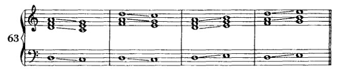
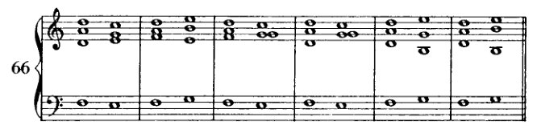
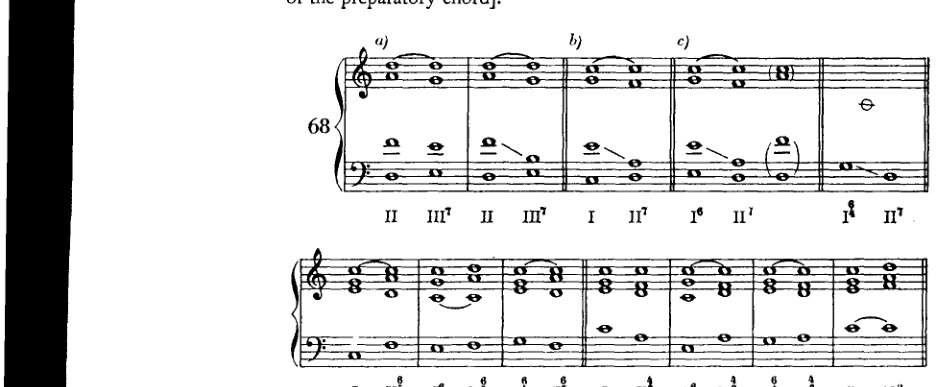
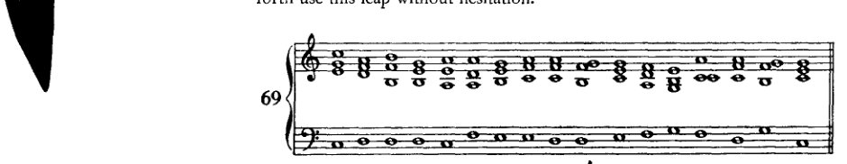

<!-- page 124 -->

# VI 没有共同音的和弦连接  
*(HARMONISCHES BAND)*¹

没有共同音的和弦连接之所以最初被省略，仅仅是因为这可能会导致声部进行上的困难，并且根音进行的规划也很容易变得不那么理想。如果我们现在在我们的练习中引入这类连接，就必须考虑一些克服这些困难的措施。首先是声部进行上的困难。其他问题我们将在下一章中详细讨论。

这里涉及的连接是一个音级与其两个相邻音级——即紧前一个与紧后一个——之间的连接：例如 II 与 I 和 III 的连接。如果我们让所有声部都走最近的路线，就会产生平行八度和平行五度。

因此，在这里最近的路线是不可能的。为了避免平行进行，我们必须使用反向进行。建议学生事先弄清楚哪些声部存在平行进行的危险。

如果我们使用六和弦，则更容易避免五度和八度。

[¹ 见前文，第 39 页。]

<!-- page 125 -->

无共同音的和弦 113

在连接两个这样的六和弦时，最好将其中一个的三音加以重复，尽管不这样做也仍然可以连接。

在此我想提一下旧理论¹的一个假设：即在连接两个相邻音级时，具体而言是从较低音级到较高音级（例67，II 与 III），第一个和弦是某个七和弦的不完整代表，该七和弦的根音——此处缺失——位于下方三度（亦即 VII 的七和弦）；并且旧理论假设，在从较高音级连接到低音级时（例67，III–II），第一个和弦代表一个根音与三音均缺失的九和弦。旧理论对七和弦与九和弦中每一个音的解决都有精确的方法，反行进行也就自然产生。尽管这一假设有些复杂，但它确有可取之处：它也将这些连接回溯到上四度根音进行，亦即最强的进行。

我在这里提及这一假设，是因为在另一处 [p. 117]——对我而言似乎更重要的一个场合——我将提出类似的论证。因此我赞同这种解释，但我并不建议在此从这个观点出发去处理这些连接。在我看来，这样做是多余的。

在我们着手以小型乐句来展开这些连接之前，我们将

[¹ 参见 Simon Sechter（1788–1867），*Die Grundsätze der musikalischen Komposition, Erste Abtheilung: Die richtige Folge der Grundharmonien, oder vom Fundamentalbass und dessen Umkehrungen und Stellvertretern*（《音乐作曲原理，第一部分：基本和声的正确进行，或基础低音及其转位与替代》）（莱比锡：Breitkopf und Härtel，1853），第32–4页。关于 Schoenberg 受“旧理论”影响的另一例，参见下文，第270页，他在该处直接提到了 Sechter 的名字。]

<!-- page 126 -->

114

无共同音的和弦

现在再增加通过八度音[即预备和弦的根音]来准备七和弦的方法。

如果学生注意避免平行五度和平行八度，这些例子就没有新的困难。只是，在连接两个和弦的原位（如谱例68*a*）时，有时很难得到完整的和弦。这只能通过从第一个和弦的三音跳到第二个和弦的五音来实现（谱例68*b*）。如果这个跳进是减五度（谱例68*a*），由于该音程不够旋律化，实际上应该避免。但如果某种好处或必要性使得完整的和弦值得费力去求得，那么学生今后就可以毫不犹豫地使用这种跳进了。

谱例69将上述内容融入了一个小乐句。显然，这些乐句今后可以处理得更复杂。（亦需在小调中练习。）
