<!-- page 127 -->

# VII 关于获得更佳进行的若干提示；关于两个外声部的旋律处理；以及关于收束、终止、假终止和终止中的六四和弦

从现在开始，低音声部的规划变得越来越困难。若要利用诸多可能性，那么即便在这个阶段，处理这些问题也要求具备一定的进行排列技巧，因为学生确实始终是在针对某一特定实例而努力的。¹ 因为在编写这些范例时所投入的努力，要求的回报不应仅仅是图式上正确的解答；他们正接近这样一个阶段：我们必须开始赋予形式感一种比以往更为丰富的满足。总之，既然手段现在更为丰富，乐句就应当开始变得更加圆润、更加精致。例如，我们在例69中看到一个学生目前尚不易避免的缺陷，只要他还遵循最近途径法则的话。女高音声部由于从中音区开始，便无法摆脱持续下滑至低音区的倾向——至少无法以必要的力度摆脱。由此产生的单调感，即使对于一个和声进行毫无瑕疵的例子，也很容易损害其效果。正是出于这个原因，并且仅仅出于这个原因，我们才要探讨旋律问题。* 但例69还有另一处令人不安的地方。某些和弦的连接导致另一主要声部——低音——频繁地保持不动。而且即使根音进行也并非都能产生真正令人满意的和声进行。因此，我们还必须密切关注低音旋律以及根音进行。

\* 这似乎与我的一贯主张相矛盾，即和声学教学应当讲授和声的进行，而非声部进行。但这只是表面上的矛盾；因为我的论战针对的是数字低音教学法，学生通过这种教学法发展的是声部处理的技巧，而非和声处理的技巧。此外，和声用法往往由声部进行的偶合所造成，这一观点恰恰相反，正是我的研究基础之一，这已在我对不协和音处理、装饰音（_Manieren_）等问题的讨论中予以说明[_supra_, pp. 47–8]。必须区分下述两种情形：一种教学方法操练声部进行（而它本应操练和声的处理）；另一种叙述方式则充分意识到声部进行对和声事件的影响，并在适合用声部进行来解释问题时赋予其应有的权利。

[¹ “……因为学生确实始终是在针对某一特定情况而努力的。” 由于可能性的数量大大增加，任何特定实例的复杂性也随之增加；因此，规则再也无法指导学生每一步的行动。他的技巧、他的“形式感”现在必须开始在规则无能为力的地方引导他。]

First of all, the root progressions. We have recognized previously that the

<!-- page 128 -->

116

更优进行的指引

根音最强烈的进行是上行四度跳进，因为这种进行似乎符合音的倾向。随着这一进行，和声中发生如下变化（例70）：

先前作为主音、根音的音，在第二个和弦中变成了从属音，即五度音。更一般地说，第二个和弦的低音属于更高的范畴、更高的力量，因为它包含了第一个音，即先前曾是根音的那个音。在G三和弦中，g是君主；但在C三和弦中，g是从属的，而c是君主。* 引发这种情形、可以说让君王凌驾于诸侯之上的进行，只能是强有力的进行。但c不仅征服了根音，它还迫使和弦的其他成分也服从其要求；而新和弦除了被征服的前根音之外，不再包含任何令人想起旧统治的成分。除那一个音外，它只包含全新的音。我们有理由假设，产生类似情形的进行也同样有力，或近乎同样有力。

下一个这样的进行是下行三度的根音进行（例71）。

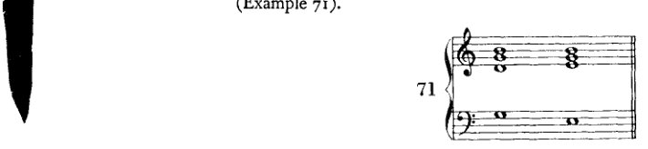

\* 这种音倾向于自身消融于更低的音中，这显然与它曾在另一个更早的阶段表现出的、成为并保持为根音的倾向相矛盾。这一矛盾即是它的问题；正从这一问题中，它才得以演进。[也就是说，演进的是调性，一种由这一冲突生成的调性理论。] 只要某个低音尚未成为根音，它唯一的驱动力就是去成为根音。一旦它成了根音，它便有了不同的目标：自身消融于更高的实体中，成为其一部分。——其实我最好说下行*五度*跳进，因为该音倾向于成为其下方五度音的一部分。仅仅为了保留音程上升与下降的隐喻，我才把*上行的*音程说成*上*行四度，把*下行的*说成*下*行四度。（这不过是一种隐喻，正如我们将音高标记为高和低一样。既然这些音字面上既不高也不低，我们完全可以用其他对立来表达这种区别：例如，尖与钝、短与长，等等。）这种命名法至少并非毫无道理；虽然音程确实在我们称为“低”的方向上“上升”，但强度却增强了。而且这是弦的重量和长度*递增*的方向。

<!-- page 129 -->

更佳和声进行的方向  117

其过程如下：前一个根音被克服，沦为单纯的三度音；而原先的三度音则变为五度音，因此得以晋升；新和弦与前一和弦的差别仅在于一个新音。虽然它是根音，但这一进行——以根音获胜的程度来衡量——尚不能被视为像向上四度进行那样有力。它仍然过多地令人回想起先前的统治；它包含了太多先前的音。然而，它仍是最强的进行之一，因为连续两次这样的进行所产生的结果等同于向上四度进行的结果，这一点即可推断（例72）。

判断根音向上二度（II-III）与向下二度（II-I）这两种进行则要稍微复杂一些。有诸多理由将它们认定为最强的根音进行，但它们在音乐中的运用却未必支持这一观点。若我们审视这些进行的结果，即和弦的构成，便会发现第一个和弦的所有音都被克服了，因为在这两种情况下，第二个和弦的所有音都是新音。在这方面，它们比迄今所考察的进行走得更远。它们将一个音级恰恰与那两个和它毫无共同之处、关系最为疏远的音级连接起来。这些进行强行建立了这种连接；也许正因如此，较早的理论[^1]以一种独特的方式解释它们：各自作为两个进行之和，其中较重要的一个是根音向上四度进行。这些和式写作：V–VI = V–III–VI（例73a）和 V–IV = V–I–IV（例73b）。

在（例73a）V（*G*）与VI（*A*）的连接中，实际上相连接的应是III级（*E*），只是后者的根音缺失了；而在V（*G*）与IV（*F*）的连接中，（隐含的）I（*C*）则起着同样的作用。

[^1]: 见前，第113页。

<!-- page 130 -->

118 更佳进行的指引

这一构想有很多可取之处，并且与阐述体系完美契合；该体系的目的正是在于以如此逻辑的统一性来容纳事件，从而开拓广阔的视野，并使例外成为多余。这一解释确实颇具说服力；但它也暗示了某种截然不同的东西。它几乎使我们相信，那些当和声喷涌而出时端坐于源头、并在其成长过程中亲历其境的先辈们，可能早已精确地知道，这样一种进行等同于一种总和；而且他们或许正是出于明确认识到的目的——例如，阻碍终止——而使用了这种概括、这种缩写，正如人们使用速记符号一样。*那么这一解释就不只是一种理论；它将是一则实录。*

这种手法——在其他情况下本应由三个和弦构成的连接，此处仅出现两个，最宜解释为缩写——确实也常在别的情境中出现。例如，正如我们后文将要看到的，同样的事情也发生在属的属（例74）上：I（六四和弦）与 V 通常出现在属的属与结束和弦之间（74a），却经常被省略（74b）。

此外，[这种缩写] 以套语（cliché）的方式运作，这一点虽已提及，但意义有所不同：一种固化的用法不必被完整写出。人人都知道 *i.e.* 的意思是“即”。人人都知道，II 级音作为属的属，总会在某处、以某种方式产生 I。因此，我们可以省略中间的和弦，并将效果紧接于原因之后。而这里想必正是如此：这种进行最终被视作一种套语，而对其的熟悉导致了冗余部分的省略。此外，在音乐中还有其他此类缩写的例子。凡是理解移调的人都会看出，正如常发生的那样，当低音提琴声部的音型比大提琴更为简单时，也是一种类似的情况。只保留了主要的细节。次要细节则被略去。即便出于别的原因。

将二度根音进行视为总和、视为缩写的这一构想，证明了老一辈大师不情愿将它们看作正常的进行；而这种态度体现在大师们对这类进行的使用中。倘若它们之中有一种是最强的进行（是哪一种呢？），那么它就必须在调性的划分中、即在终止式中，扮演一个不同的角色。然而，扮演这一主导角色的是四度根音进行。终止式进行 IV–V 绝非无足轻重，但 II–V 可以不露痕迹地取代它；而 V–I 就不能这么说。The con-

<!-- page 131 -->

更佳进行的指引 119

然而，属音区域（V）对下属音区域（IV）的追求确实作为辅助进行，伴随那最终的、决定性的进行而出现，而后者确实轻松胜任。同样，欺骗终止是一种引入次要内容的有力手段：它导致离题。它的作用总是在次要位置完成，或是为次要事物而完成，但人们期待它完成的多半是繁重的工作（*große Arbeit*）。它无疑是强有力的，甚至过于强烈，因为它将两个强进行叠加在一起。但或许对于日常使用来说过于强烈：*Allzu scharf macht schartig*（磨得太锋利反而造成缺口）。

因此，我愿将这种根音进行称为"超强"（*überstark*）进行。或者，由于我将强进行称为"上行"，\* 人们或许也可以将其描述为"越级"（*überspringend*），从而表达出这种缩略的含义。显然，强进行或上行进行，与弱进行或下行进行一起，作为正常力度的手段，通常总是允许的；而使用*超强*进行、那些"越级"的进行，则必须有特殊的场合。同样清楚的是，在此处如同在其他地方一样，使用蛮力并不能保证最强的效果。¹

现在，我将剩下的两种根音进行——上行五度和上行三度——称为*下行*进行。这里发生的情况如下：上行五度的进行（例75a）将一个先前相对从属的音变为主要音。这个五度音，一个*parvenu*（暴发户），被擢升，成为了根音。这是颓废（decadence）。有人或许会反驳说，这种晋升证明了被擢升者的力量，而且在这里根音被克服了。但被擢升者的力量仅仅在于原先根音的退让，有意地退让，将其权力让给了新的根音；它自愿地向新音屈服，因为后者，即五度音，毕竟包含于它自身之中；可以说，它只是出于其善良的本性才屈服的，正如狮子与兔子缔结友谊。同样的情况发生在上行三度的进行中，而且更为明显。在这里，先前的三度音——最弱的音程——变成了根音，而新和弦与前面的和弦仅以一个音相区别：只有五度音是新的（例75b）。因此这种进行似乎是最弱的。这种明显的弱点或许也源于这样一个事实，即

\* 海因里希·申克博士（Dr. Heinrich Schenker）在其著作《新的音乐理论与幻想》（*Neue musikalische Theorien und Phantasien*）[第一卷：*Harmonielehre*（维也纳：Universal Edition，1906年）；英文缩译本：*Harmony*，第232–40页]中也使用这一称谓来指代根音进行。只是，他（相反地）将上行四度进行称为"下行"。最近我得到这本书时，起初还以为是从中获得了这种命名法的灵感。这并非不可能，因为四年前我曾读过其中部分内容。然而后来我想起来了，并且通过向我的学生们打听得以证实，我很久以前（至少七年前）在教学中就已经使用这些表述了。因此，我们两人各自独立地得出了相似的结论。但对我来说，这是很容易解释的：任何了解勃拉姆斯（Brahms）和声的人，只要观察正确，都会得出相同的结论。

[¹ 在其 *Structural Functions of Harmony*（第6–18页）中，勋伯格（Schoenberg）使用了英文术语"strong"或"ascending"、"descending"以及"superstrong"。该著作中未出现对 *überspringend* 的翻译。]

<!-- page 132 -->

120    更佳进行的指引

将两个这样的进行并置，会产生与上行五度进行相同的结果（例75c）。

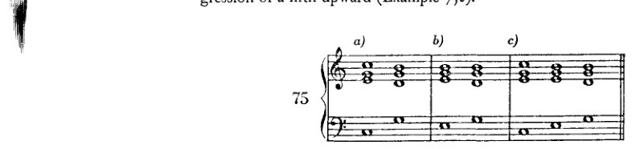

既然在此处将强进行与弱进行之间做出了如此粗糙的区分，我们现在必须强调，这并不意味着我们应当始终只使用强进行。那样一来，弱进行就会被完全排除，因为弱的进行就会被视为坏的进行。因此，正如我所说，我更倾向于用*上行*和*下行*这两个术语来对进行进行分类。我将上行四度、上行和下行二度以及下行三度称为上行进行；将上行五度和上行三度称为下行进行。这些术语旨在表明，这一种进行服务于何种目的，那一种又服务于何种目的。存在这样的目的是显而易见的；因为乐句的划分，在音乐中如同在语言中一样，需要音调与重音的起伏。因此，使用下行进行与使用上行进行一样，都是一种艺术手段。诚然，在此处我们既然无法顾及乐句的划分，*那么在规划我们的根音进行时，我们将绝对优先采用上行进行，并且主要在那些总体效果仍是上行的和弦连接中使用下行进行。* 例如，如果上行五度进行之后接上行二度进行，其结果便是下行三度进行，因此构成了和声的上行（例76a）。如果上行三度之后接上行四度（76b），或者甚至接上行二度（76c），也会得到同样的结果。

这样一来，给人的印象或多或少就像是中间的那个和弦仅仅是出于旋律上的原因而插入的。总之，下行进行在我们的练习中只应在此种意义下使用。

现在简要回顾一下：只要学生仅仅关注和声手段，并且只要他还无法企望——例如借助旋律、节奏或力度——达到某种别的效果或风格（*Charakteristik*），他就应当使用以下根音进行：上行四度、

<!-- page 133 -->

更佳进行的指引 121

上行与下行的二度，以及下行的三度——这些是上行进行。

至于下行进行，即上行的五度与三度，他只应将其用于类似例76所示的连接中。

当然，这些指示并不能无条件地保证良好的和声进行（例77*a*），也绝未穷尽良好进行的所有可能性。然而最重要的是，这些指示并非意在做出评判，而只是对效果的描述。因为，如前所述，下行进行与上行进行相连接时，也可能产生良好的进行。而一连串的下行进行也同样具有音乐性（例77*b*）。尽管如此，在学生的耳朵成为可靠的向导、使其能够独立判断新事物之前，他最好还是遵守这些指示。因为它们所提供的可能性几乎总会带来良好的结果；只有在例外情况下才会变差，而不幸选择了下行进行时，则常常会暴露出弱点。而我认为这确实应当是一门课程的目标：向学习者展示那些毫无疑问是好的东西，那些至少具有某种适度良好特质的东西；同时为他开启一种视野，使其看到那些一旦他达到成熟（*Kultur*），便能凭借自身的创造力（*Kombination*）去创造的东西。

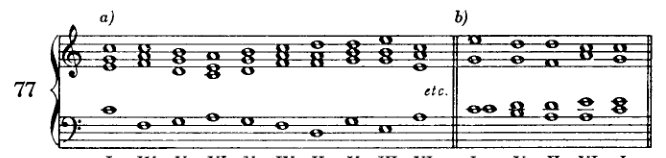

例77*a*呈现了一系列纯粹的上行进行，然而该乐句却并不算很好（当然，若仅从和声的角度来看；其上方可能有一段美妙的旋律，足以消除我此刻的所有异议）。因为如此多级进进行的并置听起来无疑单调而冷漠。在这方面，学生也会发现有必要引入变化。这意味着要避免过于统一的进行；要经常而恰当地将级进的根音运动与跳进相混合。因为一连串只有跳进的进行，就其本身而言仅作为和声是没有什么价值的；它过于机械（例78*a*、78*b*及78*c*）。

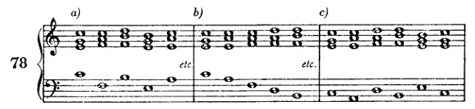

<!-- page 134 -->

122 更佳进行的指导

由此，我们进入了在规划良好乐句时必须考虑的第二个要求：对多样性的需求。若不同时提及其补充——重复——这一要求便难以把握。因为前者产生多样性，而后者赋予前者连贯性、意义与体系。而体系唯有建立在重复之上。然而重复在此对我们几乎没什么用处。在和声构造中，模进是为数不多值得斟酌的实例之一：它虽触及动机层面，却并非绝对需要一个主题。其他重复我们实际上应当避免；若无法规避，则应将其隐藏。目前我们必须放弃利用重复以取得效果的好处；但另一方面，又须提防它带来的弊端。我们的低音声部在一个调内拥有约十二至十四个音的音域。若乐句使用超过十四个和弦，那么即使将此前出现过的音移至另一八度，也不足以避免重复。令人厌烦的与其说是单个音的重复，远不如说是音的进行的重复。如果至少在重复音上方配置不同的和弦，则即便这也未必会造成干扰。而若在这些重复的和弦[音？]之间介入了足够不同的材料，则重复应完全不会带来损害。最糟糕的重复形式，莫过于将一条声线的最高音或最低音再次带回。应特别注意这两点：高点——以及（如果可以这样说的话）低点。几乎每条旋律都会有这样的音，而高点尤其不宜重复。显然，这仅适用于我们这里探讨的简单结构；在这种结构中，无法用其他手段来修正声线中可指摘之处。例如，如果在舒伯特的一首艺术歌曲（*Lied*）中，最高音在旋律中出现了好几次（例如《Mit dem grünen Lautenbande》），那自然是另一种情况；因为那里运用了其他手段来提供必要的多样性。此外，绝不能由此推断，在任何情况下忽视高点都必然产生糟糕的结果。然而最重要的是，我们要再次强调：这里与以往一样，我们并非在提出评判艺术作品的标准，而充其量只是评判学生作业的标准。我们再次只是指出某些事项：若加以注意，至少无害，有时还能带来显著的改进。因此，学生在形式感得到充分训练之前，最好克制自己不要逾越这一限制。

一串音的重复不仅在高音声部会造成不良印象，在低音声部亦然；有时即便是不同的和声配置也无法纠正这一缺陷。要规避它（低音中的79*a*，高音声部中的79*b*）通常相当容易；只需在高音声部通过跳进及时地更换音区，或在低音声部选择一个不同的转位即可。然而，某一声部中音的重复会令我们怀疑根音进行中亦存在重复。此时就必须到最初的草稿中去寻找缺陷，并在那里加以纠正。

一般而言，学生不应在努力引入大量

<!-- page 135 -->

*指南* 123

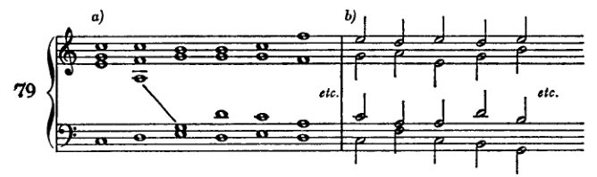

变化；因为他的任务并非写出旋律优美的东西，制造效果——他不可能在这方面成功。这里的目的更多在于避免不悦耳，而非写出引人入胜的旋律。

现在，在下面将要

**审阅并补充**

迄今为止所介绍手段的使用指南。通过遵守这些指南，学生将能够将其练习提高到稍高的水平。许多内容被排除在外，大部分只是不被接受的用法；在被允许的内容中，大部分只会找到被接受的用法。

**I. 关于根音进行**[^1]

1. *上行*根音进行，即四度上行和三度下行，可以随时出现，尽管在这里也要避免机械重复。

2. *下行*进行，即四度下行和三度上行[应使用]仅于那些如所示（第120页）产生总体上升效果的连接中。

3. "越级"进行[应]谨慎使用，直至给出更明确的指示为止；这些进行并未被排除。

**II. 和弦的使用**

**A. *大调与小调***

1. (a) *原位三和弦*可以出现在任何地方。

   (b) *六和弦*用于在声部进行，尤其是在外声部（低音和高音）中获得更丰富的变化，此外，还用于使不协和音的准备成为可能。

   (c) *六四和弦*一般而言应最谨慎使用。最佳用途是在终止式中（将在本章下一部分展示，第143–5页）。作为经过性和声出现的形式，谨慎使用，是值得推荐的，因为低音在运动。然而，那些低音必须

[^1]: 此处及后续"指南"中，勋伯格的大纲形式基本保留。

<!-- page 136 -->

124 更佳进行的指导

持留音需谨慎使用。有时它们是预备不协和音所必需的。

2. (a) *七和弦* 凡能使用三和弦之处皆可使用，只要为其提供预备与解决。然而，更可取的是在七音能使和弦产生需要解决或其他处理的倾向之处使用它们。由此，所需的进行（V–I，以及如本章后文将要展示的，V–VI 与 V–IV）可以说是不得不随之而来了。

(b) *七和弦的转位* 应在与其原位相同的条件下使用，以改善声部进行。此处，二级和弦特别适于引入六和弦。

3. *减三和弦*（起初仅在已练习过的进行中：II–VII–III 与 IV–VII–III），作为不协和音，同样适于赋予引入某个和弦（III）以一种必然性的印象。VII级上的七和弦强化了这种印象。转位的使用目的与其他和弦的转位相同。

B. *小调*

须兼顾枢纽音的要求，并注意两个区域：上行音阶（带升高音）与下行音阶（带自然音）。

1. (a) *枢纽音* 必须从一开始就予以考虑，在勾勒根音进行时即加以注意，以确保相关音级能够遵循规定的路径。

(b) 若需预备或解决某个不协和音，三和弦经常必须置于转位，尤其是当枢纽音位于低音部时。

(c) 适用于三和弦者，亦适用于七和弦。

(d) 在II级（未升高的）减三和弦及其七和弦之后，一般而言，将V级写作大三度而非小三度更为可取，因为这一音级在终止式中具有传统的意义，这一点后文将会阐明。

(e) 所有减三和弦（II、VI 与 VII），连同它们的七和弦，均可用于与大调中减三和弦相同的目的：通过不协和音，它们获得了一种明确的倾向。

(f) 增三和弦既可置于上行与下行小调音阶区域之后，亦可置于其前，其不协和性进一步增强了这种多用性。因此，它极适于从一个区域过渡到另一个区域。

2. 不可过于长久地只停留在两个区域中的某一个，否则将有损小调的特性。这一[特性] 最好通过两个区域恰当的交替与连接来表达。只有在枢纽音的所有义务都得到满足之后，才能从一个区域跨越到另一个区域。这种跨越

(a) *直接地*

(1) 从 *上行区域到下行区域*，当升高的 III、V 以及（后文将述及）VII 之后接 I 或未升高的 IV 或 VI 时（含有升高第六音的和弦之后不能接未升高的和弦）；

<!-- page 137 -->

终止与收束 125

(2) *从下行到上行*，当未升高的 II、IV 和 VI 后面跟着升高的 III、V，或者（如后文所示）VII 时。所有升高和弦都可以与 I 连接；然而，升高和弦不能跟随含有未升高第七音的和弦。

(b) *间接地*

(1) *从上行到下行*，当含有升高第六音（II、IV、VI）的和弦首先导向那些允许进行到升高第七音的和弦时；

(2) *从下行到上行*，当含有未升高第七音（III、V、VII）的和弦首先导向那些允许使用未升高第六音的和弦时。

III. *声部进行*

1. 应避免缺乏旋律性的（不协和或产生不协和的）级进或跳进。只要尚未使用变音和弦，避免此类音程是明智的。那些音程并不适用于我们在那之前所使用的和弦；

2. 应避免令人不安的音进行重复，尤其是当重复音也带有与之前相同的和声时；

3. 只要可能，高点应予以尊重，或许低点也应如此；

4. 在连续音程中使用级进与跳进时，应尽可能多样化。在此应注意保持某一中音区；

5. 如果声部通过跳进离开这一中音区，那么只要可能，级进或跳进应尽快将其引回该音区；反之亦然；如此即构成对音区变化的补偿；

6. 如果中音区是通过级进而离开的，或许可以通过八度跳进或类似手段来恢复平衡；

7. 如果某个音或某种音进行的重复不可避免，那么立即改变方向可能会有所帮助。

就这些指示的适用程度而言，它们对高音部与低音部是同样适用的。事实上，如果学生甚至能在中音声部中也遵守它们，整体效果的流畅性必将大为提升。但目前学生不必做到那一步；只要以最大的细心处理好两个外声部就足够了。

---

终止与收束¹

在瓷器或铜器这样的器皿上，例如一只花瓶，人们还不能附加

---

[¹ 'Schlüsse und Kadenzen'。通常，勋伯格将各种收束称为 'Schlüsse'（终止）。他将 'Kadenz' 一词保留给正格完全终止。——参见第305–8页，他在那里继续讨论了此处引入的话题，并尝试对收束进行分类。]

<!-- page 138 -->

126 DIRECTIONS FOR BETTER PROGRESSIONS

另一件瓷器或青铜制品，而无需经过复杂的程序。至少，它是否仍是一件花瓶，以及附加的部分是否甚至还能附着，这都是可疑的。然而，既然我们看到，一部音乐作品已抵达某一处可以进行终止的节点（例如，在奏鸣曲的反复记号处；或者更好的是，在谐谑曲的三声中部之前）；既然我们看到，在这些及类似的地方，音乐仍然继续下去——那么，即便在一部作品确实结束之处，我们也大可怀疑，这是否绝对必须是终点而绝无延续的可能。事实上（如果我们忽略形式感），在最终的主音之后，完全可以再次接续那些曾在类似位置多次出现过的和弦。

因此，我们大可发问：一部音乐作品为何、以何种方式、在何时结束？答案只能是泛泛的：一旦目标达成。然而，这目标究竟是什么，我们在此甚至几乎无法暗示：当形式感得到满足，当已发生的一切足以实现表达的渴望，当所涉及的理念已被清晰呈现，等等。对于我们的教学目的而言，唯有这一点是相关的：目标的达成。我们的习作越逊于艺术作品，我们就越容易说明它们的目标或意图是什么。我们的习作总有着这样或那样的具体目的，艺术作品则从未有之；艺术家或许有时有一个目的，或至少自以为有，而实际上他并非在执行某种目的，而是在服从自己的本能。正是由于这一区别，任何人都可以拼凑和声练习，而几乎所有人都被剥夺了创造、甚或仅仅是理解一部艺术作品的能力。即便超越寻常目的之更高领域（*无目的性*）乃是艺术家自处之地，然而，对目的之关注（*合目的性*）却构成了教授艺术技艺的唯一可靠基础。这种教学法之所以繁荣并存在，全赖于其努力将艺术家那里的极致自由确立为必须遵守的规范。而这种极致自由的力量，若从艺术技艺的近处观之，没有法则或目的是不可想象的。此处，唯有与这样一片广阔保持足够距离的人，方能窥见真正的图景。此处，近观使人狭隘，唯有怀着敬意的距离方能展现真正的伟大。

例如，我们的目的可以是预备并解决一个七和弦，将一个六和弦与一个六四和弦相连接，等等。同时，学生总可以为自己设定一个次要目的，即复习先前所学。根据前面所说，一旦这样一种目的达成，我们就应当停止；因为只有这样的谦逊才能为我们的尝试提供辩解。因此，我们应当停止的那一刻是容易确定的。然而：停止并不等于终止。停止很简单；它意味着不再继续。但终止则不同。要终止，必须运用特殊的手段。

现在我必须立刻声明，我不相信有可能构造出一种终止、一种结局，能够排除一切延续的可能性。正如 *魔笛* 与 *浮士德* 都可以容纳第二部，每一部戏剧、每一部小说也都可以有“二十年后”。而且，即使死亡标志着悲剧的终结，它也仍然不是一切的终点。因此，在音乐中同样可以继续下去，而

<!-- page 139 -->

*收束与终止式* 127

关于附加新的和弦，正如尤其在早期杰作中常见的诸多终止式以及结尾和弦的反复所确实表明的那样。然而，即便在此处，无疑也可能存在延续，乐思还可以进一步展开，或附上新的乐思。这样做可能有损于平衡（*Ebenmass*），但对此我们并无公式。而且，常有这种情况：最初被视为过度、扭曲（*Übermass*）的东西，后来却被证明是比例得当（*Ebenmass*）的。就此而言，音乐可类比为一种气体，它本身没有形状，却可以无限延展。然而，若将其引入某一形式之中，它就会充满这一形式，而其自身的质量与内容并不改变。抱着这样的想法，我不得不得出结论：要造就一个绝对令人信服且最终性的收束是困难的，是的，几乎不可能。确实，并非不可能（也许甚至是肯定的），即在每一个乐思及其展开方式之中，都蕴含着某种标示出应达到却不可逾越的边界的东西。并非不可能——尽管也不是绝对肯定——每一个乐思内部都存在某种这样的比例；然而，同样可能的是，这种比例并不在乐思之中，或至少不仅在于乐思本身，而且也在我们自身之中。只是，它因此并不必须是我们身上某种不可改变的东西，某种我们天性中被给定的、因而无法改变或发展的东西；相反，它是某种会根据不断变化的趣味、甚至根据时尚而得到修正的东西，并与时代精神（*Zeitgeist*）保持同步。我不相信黄金分割。¹ 至少我不相信它是支配我们对美的感知与感觉的唯一形式法则，它至多只是众多、无数此类法则中的一条。因此，我不相信一部作品必须刚好达到如此这般的篇幅，不能再长，也不能再短；也不相信一个动机——被视为作品由之生长的萌芽——只能容许这一种、唯一的展开形式。否则，就几乎不可能像巴赫等人反复做过的那样，用同一主题写出两首或更多不同的赋格。即便存在这样的法则，我们也尚未认识到它们。但我相信另一种东西：即每一个时代都有一种特定的形式感，一种规范，它告诉那个时代的作曲家，在展开一个乐思时必须走多远，以及不可走多远。因此，[要结束一部音乐作品] 我相信我们只是履行了被那个时代的惯例与形式感所认可的要求，这些要求在界定可能性的同时唤起期待，从而保证了一个令人满意的收束。

---

¹ 欧几里得公式——“将一条有限直线分割，使得较短部分与较长部分之比，等于较长部分与整体之比”——长久以来被美学家视为艺术中理想比例的定义。“大约从上个世纪中叶开始，它受到极为认真的对待……[自1870年代起]，几乎每一部美学著作都会包含对这一问题的某种探讨”（Herbert Read, *The Meaning of Art* [Penguin Books, 1949], p. 22).]

<!-- page 140 -->

128 更佳进行的指引

它们并不传授事物的本质，而仅仅旨在有条不紊且机械式地铺陈某种手段，以便赋予乐思一种完整性的氛围（*Geschlossenheit*）。关于调性这一课题，我将反复且详尽地论及；此处只再次述及眼下所必需者。当然，以起始之音作结的想法确有某种无可置疑的正确性，并也给人以某种自然的印象。因为所有简单的关系确实都源自音之最简朴的自然属性（来自它的第一泛音），所以基音对其所产生的结构便拥有一种特定的支配权，正因为这些结构的最重要成分可以说是它的总督、它的拥护者，它们源于它的光辉：拿破仑将他的亲眷与友朋安置于欧洲的王座之上。我想，这确实足以解释为什么人们有理由服从基音的意志：对始祖的感恩与对他的依赖。他是始，他是终。只要没有其他道德法则适用，这在道德上便是正确的。然而，另一种法则确实可以占上风！例如，如果至高无上的主宰变得虚弱，而他的臣民变得强大——这种情况在和声中屡见不鲜。正如征服者未必会长久地以独裁者身份存在一样，调性也绝不必然由基音来决定其方向，即使它是从该音衍生出来的。恰恰相反。两个这样的基音为争夺主权而斗争，确实具有某种非常吸引人的特质，正如现代和声的无数例子所示。而且即使这场斗争最终是以某一基音的胜利告终，这一胜利也并非不可避免。这唯一的问题[哪个基音应当统治]同样可以悬而未决，既然还有那么多其他问题也仍未解答。我们对问题本身的兴趣，并不亚于对所谓解决方案的兴趣。每次都追溯到祖先那里，每次都极尽详尽地展示和弦从基音派生而来的过程，是多余的；当这种血统对每个人来说都如此熟悉，并活在每个人的记忆与形式感之中时，每次都去证明它们的血统是多余的——不仅每次都绝对详尽地加以证明是多余的，而且把一切安排得让这些关系跃然眼前也是多余的。过去那种将乐曲结尾捆绑、闩锁、钉牢并封缄的繁文缛节，对于当今的形式感而言未免过于笨重，难以采用。一切源自[基]音的这一前提，同样可以予以搁置，因为每一个音本身就已经在不断提醒我们这一点了。而每当我们任由想象力驰骋时，我们当然不会将自己严格地限制在边界之内，尽管我们的肉体确有边界。

当今的形式感并不要求这种通过展开调性而产生的过度明晰性。当与基音的关系不被当作基础来处理时，一部作品对我们来说同样可以是明晰的；即使调性保持得可以说是灵活的、悬浮的（*schwebend*），它也可以是明晰的。诸多例证表明，如果调性仅仅是被暗示，是的，即使它被抹除，完整性的印象也不会有所减损。而且——这并不是说超现代音乐真的是无调的：因为也许我们只不过还不知道该如何去解释调性，或者

<!-- page 141 -->

*终止与收束* 129

某种与现代音乐中的调性相对应的东西¹——通过与无穷无尽的、可以说是流动的和声进行类比，这种类比几乎不可能表现得更为生动了，这种和声并不总是随身携带居住证明和护照，上面仔细地注明国籍和目的地。人们想知道无穷从哪里开始、在哪里停止，这确实是可爱的。如果他们对自己未曾丈量过的无穷缺乏信心，这也是可以原谅的。但是，如果艺术应该与永恒有某种共同之处，它就没有理由回避虚空。

我们祖先的形式感要求情况有所不同。对他们来说，喜剧以婚姻告终，悲剧以赎罪或报应告终，音乐作品则"以同一调性结束"。因此，对他们来说，选择音阶就意味着有义务将该音阶的第一个音当作主音，并将其呈现为作品中一切事物的始与终，呈现为其力量和意志所界定领域内的家长式统治者：它的纹章被展示在最显眼的位置，尤其是在开头和结尾。因此，他们拥有了一种实际上类似于必然性的收束可能性。

我们将不得不着手学习表达调性的技术。首先，让我们考虑我们已经开始的内容：收束，终止。一旦学生更为进步，他将在曲式学习中看到，要实现收束，除了和声手段之外，他还需要其他手段。然而，要解释这些其他手段及其功能，也就是说，在曲式学习中给予学生所需的指导，则要困难得多。困难到甚至建议现在就让他熟悉那些令人信服的收束所依赖的要素。

旋律上，调性由音阶来代表；和声上，则由自然和弦来代表。然而，单独不加强调地使用这些成分还不足以确立调性。因为某些调彼此之间如此相似，关系如此密切，以至于如果不采用特殊的、限定性的手段，往往不容易确定哪个才是真正的调。哪些调关系最为密切，这是显而易见的：那些彼此最为相似的调。首先，关系大小调（*C*大调与*a*小调）；其次是同名调（*a*小调与*A*大调）；但接下来，也是这里最危险的关系，是那些彼此仅在调号上相差一个记号（♮、♭或♯）的调（*C*大调与*G*大调，*C*大调与*F*大调）。如果说*a*小调与*A*大调之间的差异几乎在每一时刻都能感受到，仅在第五级音（作为属音）处消失，那么对于最后提到的那种关系，情况则几乎相反。几乎所有的音和大量的和弦都是两个调共有的。*C*大调与*G*大调的区别仅在于*C*大调中的*f*与*G*大调中的*f♯*，而与*F*大调的区别仅在于

---

¹ 在1922年3月的"Handexemplar . . ."中，勋伯格在这个括号备注（他在修订版中添加的）下划线，"特别是'无调性'一词"，并在页边再次写下这个词（见前文，译者序言，第xvi页）。]

<!-- page 142 -->

130 更佳进行的指引

F大调的*bb*。因此，在*C*大调中，很容易写出听起来像*G*大调或*F*大调的和声进行。

这是*C*还是*G*？

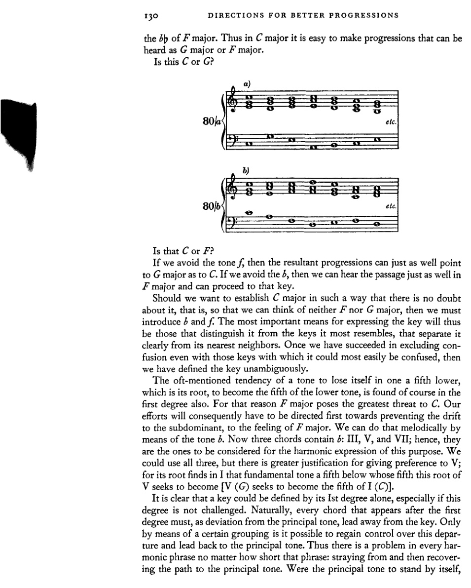

那是*C*还是*F*？

如果我们避开*f*音，那么产生的进行既可以指向*G*大调，也可以指向*C*。如果我们避开*b*，那么这段音乐听起来同样可以放在*F*大调中，并可以转入该调。

如果我们想要以毫无疑问的方式确立*C*大调，也就是说，让我们既无法想到*F*大调也无法想到*G*大调，那么我们就必须引入*b*和*f*。因此，表达调性最重要的手段，就是那些将其与最相似的调性区分开来、将其与最近的近邻调清晰分离的手段。一旦我们成功地排除了与那些最容易混淆的调性之间的混淆，那么我们就毫无歧义地定义了该调性。

一个音有迷失在下方五度音——即它的根音——之中的倾向，并试图成为这个较低音的五度音，这种时常被提及的倾向当然在第一级上也能找到。因此，*F*大调对*C*构成了最大的威胁。于是，我们的努力首先必须致力于阻止滑向下属调、阻止产生*F*大调的感觉。我们可以通过*b*音以旋律方式来做到这一点。有三个和弦包含*b*：III、V 和 VII；因此，它们正是为了和声表达这一目的而需要考虑的。我们可以使用这三个和弦，但更有理由优先选择 V；因为它的根音在 I 中找到了那个下方五度的基本音，而这个 V 的根音正试图成为该基本音的五度音 [V (*G*) 试图成为 I (*C*) 的五度音]。

显然，仅凭第一级就能定义一个调性，尤其当这一级不受挑战时。自然，在第一级之后出现的每一个和弦，作为对主音的偏离，都必须离调。只有通过某种特定的组合，才有可能重新控制这种偏离，并将其引回主音。因此，在每一个和声乐句中，无论该乐句多么短，都存在一个问题：偏离继而重新找回通往主音的道路。如果主音独立存在，

<!-- page 143 -->

*收束与终止式* 131

若不受到挑战，那么即使调性相当原始，也至少能得到明确无误的表达。主音受到挑战的频率越高，且挑战它的元素越强，恢复调性所需的手段就越有力。但和声事件越稀少，恢复调性就越简单。因此，在某些情况下，仅仅I–V–I的进行就足以清晰地确立调性。当然，旋律也可以起到辅助作用，因为它本身在另一层面上也是通过基音的功能而产生的。它甚至可以无需和声帮助而独自表达调性，例如我们熟悉的邮号旋律（例81*a*），它仅由最初的泛音构成，又如原始舞曲或民间歌曲（例81*b*）。

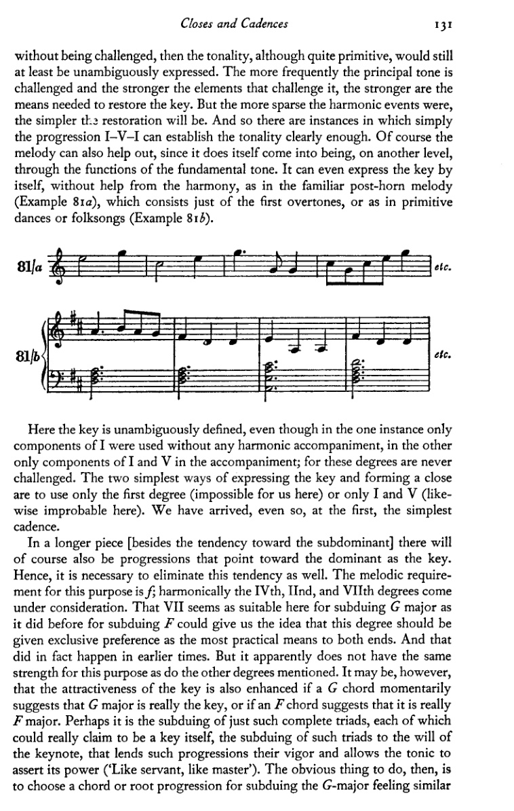

此处调性被明确地界定了，即便在前一例中仅使用了I级的构成音而没有任何和声伴奏，在后一例中伴奏里仅使用了I级和V级的构成音；因为这些级数从未受到挑战。表达调性并形成收束的最简单两种方式，是仅使用第一级（在此处对我们来说不可能），或仅使用I级和V级（在此处同样不太可能）。即便如此，我们还是已经抵达了第一种、亦即最简单的终止式。

在一首较长的作品中，[除了朝向下属调的趋势外] 当然也会有指向属调、并以其为调性中心的进行。因此，同样有必要消除这种趋势。为此，旋律上的要求是*f*；和声上则要考虑第IV级、第II级和第VII级。第VII级在此处似乎与之前用于压制*F*时一样，也适合压制G大调，这一事实可能使我们想到，应该赋予这一级数以独占的优先权，作为同时达到这两个目的的最实用手段。在早期，这确实发生过。但显然，就这一目的而言，它并不如其他提及的级数那样有力。然而，倘若一个*G*和弦暂时暗示G大调才是真正的调，或者一个*F*和弦暗示它才是真正的*F*大调，那么该调的吸引力或许也会因此增强。也许，正是对这些完整三和弦——它们每一个都本可以声称自己是一个调——的压制，正是将这些三和弦臣服于主音意志的压制，才赋予了这些进行以力量，并让主和弦得以主张其权力（“有什么样的仆人，就有什么样的主人”）。那么，显而易见要做的是，选择一个和弦或根音进行，用以压制那种G大调的感觉，类似于

<!-- page 144 -->

132 更佳进行的方向

在强度上与针对 *F* 大调所用的那个相等。能够向上四度跳进到 V 的是 II。它确实包含 *f*，但 IV 更为完整。后者以二度的音程向上进行到 V。这样一种进行，我们曾将其设想为两个进行的总和。在这里，这个总和便是：IV–V = IV–(II)–V。因此，II 级就包含在 IV–V 这一进行之中。此外，IV 还具备另一种在先前提及的意义上具有特殊吸引力的特质：它在此语境下是 G 大调最鲜明的对立面，而它与主音 *C* 的关系则与 V 级对主音的关系恰好相反。V 与 IV 这两个音级对 I 的关系方式——前者可以说是 I 完全照亮了的过去，后者则是 I 尚处于阴影中的未来——这一关系，*G* : *C* = *C* : *F*，确实就是“黄金分割”。较小的部分，过去（*G*），之于较大的部分，现在（*C*），正如较大的部分，现在（*C*），之于整体，未来（*F*）。人们或许可以得出结论：那种产生音乐的活动，那种运动，是隐含于主音自身之中的活动，是由其两颗“卫星”与它及彼此之间的关系所创造。这种关系如此完全一致、如此清晰可界定，显得如此引人注目，以至于会让人产生这样的想法：这种东西或类似之物，如果音乐真正要成为音乐，就必须存在于所有音乐之中。但这并不一定非得如此；况且，或许探索还没有进行得足够深远，因此，或许其他发现尚未被做出。因为极有可能，那些更高、更复杂的数字，那些更复杂的和声关系，本身就比质数、比不可约的更简单和声关系蕴含着更为丰富的神秘性；而正是基于这种可能性，人们对一个仍将充满有趣秘密的未来发展怀抱着希望。因此，我认为经常强调所有这些引人注目的事物是很重要的，要使它们永远不会被遗忘；因为我确信，它们也掌握着目前对我们来说尚属模糊的现象的钥匙。

因此，IV 与 V 及 I 一起，对于实现一个需要收束的调性确立，其适合性要大于 II。现在我们还必须追问：这些音级的顺序，应该是我们找到它们时所经由的路径呈现给我们的那样，即 IV(II)–V–I；还是应该是 V–IV(II)–I。显然，V–IV–I 的安排也能达到目的，因为它为该调性呈现了相同的论证。然而，IV(II)–V–I 这一序列更适于该目的，正如以下推理所表明的那样。根音进行 V–IV 当然与 IV–V 具有完全相同的价值，并且也通过以下属音级与之对立，从而相当有力地压制了属区域。但是，下属和弦若进而也感受到朝向其自身下属方向的引力，当被带向主音时，它便没有遵循自己的倾向；于是主音的出现也就相应地不那么明确。然而，在另一种进行 [IV–V] 中，所有朝向下属方向的倾向都在倒数第三个和弦，即 IV 中得到了实现。这种普遍的下行倾向现在被属和弦所克服，而属和弦随即又遵循其自然倾向向下五度进行；于是 I 便作为这一倾向的不言自明的满足而被引入。如果我们把 V–IV 设想为进行 V–I–IV（两个四度音程的进行）的总和，并类似地将 IV–V 设想为 IV–II–V（三度与四度的进行）的总和，我们也会得到相同的结果。那么这

<!-- page 145 -->

收束与终止式 133

一种进行读作：V–(I)–IV–I，其中I的重复，即便隐含，也略显薄弱；而另一种进行读作：IV–(II)–V–I，其中隐含的II证明是IV为人熟知的对手。那么我们收束的最后三个和弦最好读作：IV–V–I或II–V–I。

如果一部作品的进行使得这两种进行之一可以作为其收束来使用，那么通过和声手段实现分句的可能性便成了现实，那个同样适用于结束全曲的界限也就此确立。显然，还有其他手段可以实现收束，而且显然，它们过去和现在都与和声手段同时使用。节奏与旋律，完全无需借助外力，也能造成终止。否则，一条单声部的、无伴奏的旋律将不得不永远无休止地进行下去，而一位鼓手也将永远无法停止。当然，存在着某些和声手段，目前尚未在理论上被确定，它们形成终止式的能力——或者更确切地说，远甚于此，容许终止式的能力——与IV、II、V和I不相上下。然而，当然有可能无需同时使用所有这些手段就能实现收束。有时一种手段便已足够，有时则需要多种。然而，和声最缺乏独自完成此事的能力，若无其他手段的帮助——且绝不与它们相矛盾——而旋律却能完全独立完成。仅凭简单的现象和朴素的听觉就能证明这一点。例如，如果我们给一首在调性上明显终止的熟悉旋律配上与其不合适的和声（通过阻碍终止等手段），然后将其演奏给一个没有受过音乐训练的人——比如一个孩子——那么此人——假设他熟悉这首旋律——就会知道它在此处最后一小节结束[例82]，尽管和声并未结束。这种[和声改动]或许令人不安，但就收束感而言，它丝毫无损。

请原谅这粗野之举！

这是可以理解的。把握一部音乐作品中发生的事情，无非就是要快速地分析，确定其组成部分及其

<!-- page 146 -->

134 更佳进行的指示

连贯性。显然，在相继的方面，即旋律中，人们有更多的时间去（无意识地）解读印象，而在同时的方面，即和声中，则没有这么多时间。因此，可以清楚地理解，为什么耳朵对旋律的适应能力要强于对和声的适应能力。这也与实践相符。能够把握和声进程并将其记住的人，无疑比只能把握旋律的人达到了更高的境界。因此，横向的效力（*Wirkung*）大于纵向的。在横向方面[旋律地]形成的终止，会比在纵向方面[和声地]形成的终止更强。

那么，在我们这个时代的音乐中，还有必要通过和声终止来加强结尾吗？对于这个问题，我们可以回答：没有必要。首要的原因是，这种终止至多创造了一种结束的可能性，却并不能因此而使结束更具强制性。它们构成了一种特定音乐风格的特征，在这种风格中，只使用某些和弦，并且仅以特定的方式使用它们。在这种风格中，调性和弦占多数；因此，风格上对平衡的需求以及习惯或许要求明确调性、要求终止。然而，如果在较现代的音乐中，非调性和弦占主导地位，或者（正如我所称的）游移和弦占主导地位，那么巩固调性的必要性就值得怀疑了。

终止还可以得到进一步的加工，我们将随时留意可用于此目的的新手段。在我们迄今所学的和弦中，IV–(II)–V–I 这一进行被证明是最强的终止。但即使较弱者在某些情况下也有吸引力；因此，其他音级的适用性也应在此讨论。首先，为寻找 V 的替代者，我们将考虑 III 的适用性。这个音级与 I 有两个共同音，而在此处这是一个缺点。但它拥有导音，因此排除了 *F* 大调的可能性，而且它的根音进行相对有力（向下三度）。那么它无论如何应当是适用的。然而，它并不常用；因此，我们也不会多用，但会记住不用的原因：主要是因为它不常用。这就是说，它是可以使用的。它的效果很可能较弱；但最重要的是，它会显得陌生。VII 以前被使用的程度，我已经指出过了。它确实能确定调性，确实能导向收束和弦；但它如今也不常用，因此我们将不予考虑。它也不能被视为 IV 或 II 的替代；因为它太多嘴，忍不住要泄露紧随其后的 V 的最重要秘密：导音。此外，VII 的减五度与 V 的七音是同一音（在 *C* 大调中为 *f*）；因此，VII 还剥夺了 V 作为七和弦以更强效力导向 I 的可能性。另一方面，可以用 VI 代替 IV 或 II 置于 V 之前。这种连接的依据，或许也在于旧理论关于二度进行的假设：即实际上连接的是一个下方三度或五度的隐伏根音（IV 或 II）。VI–V–I 这一进行并不罕见，因此可供我们使用。

学生应首先在专门处理终止的练习中练习终止。从今以后，我们的每一个小乐句都以一个终止来结束，

<!-- page 147 -->

*收束与终止式* 135

为此，还需要再给出一些说明。转位通常不用于终止式的倒数第二个和弦，即 V 级。完全可以理解，此时更倾向于使用最强形式。但 V 级确实经常以七和弦形式出现，且同样仅在原位。然而 II 级不仅可以使用原位，也可以使用转位；作为七和弦时亦然，并配以相应的转位（因此不作为二和弦）。它的六四和弦很少使用，但四三和弦则相当好。IV 级的七和弦很少出现，但也并非不可能。在 IV 级三和弦的转位中，只需考虑六和弦，而不考虑六四和弦。其七和弦的转位则几乎完全不用。VI 级作为七和弦是不合适的，因为其七音必须加以解决。VI 级的转位同样几乎无法使用：六四和弦完全不能用，六和弦也很少使用，因为从 *c* 到 *g* 的进行较弱，且 *c* 会立即重复。但后者在万不得已时仍可使用。

83

<!-- page 148 -->

136 更佳进行的指导

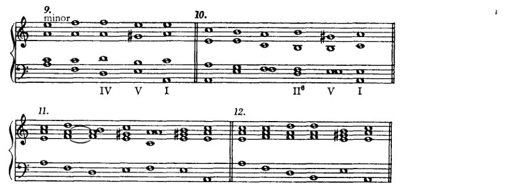

9. 小调
IV V I

10.
II⁶ V I

11.

12.

13.
II V⁷

14.

15.
VI⁶ II V⁷ I

学生最好系统地草拟终止式（以便尝试多种可能性），并按照表格，采用与他最初练习时类似的步骤。因此，首先，尝试IV–V–I的各种可能：例如，I–IV–V–I、VI–IV–V–I、III–IV–V–I等，其中IV也可以原位或六和弦的形式加以变化。然后是所有包含II–V–I和VI–V–I的情况。——至于小调，没有什么特别要说的；与大调适用同样的建议。终止式中的V以大三度出现是显而易见的；因为那个大三度正是为了终止式、为了导音而存在的。

欺骗终止

从V到I的进行称为“正格终止”，从IV到I的进行称为“变格终止”。这些只是名称、技术用语，并不能告诉我们任何具有和声意义的东西。我们刚刚考察了正格终止。至于变格终止，另一方面，我们没有理由讨论它，因为它没有特殊的和声意义。它几乎*不会在任何时候出现，除非通过熟悉的手法满足了调性确立的要求之后；因此，就终止式的主要目的而言，它并不能丰富我们的终止。更为重要

\* 除非它仅仅被用来制造古朴的音响效果，以赋予一种教会调式的风味。

<!-- page 149 -->

*阻碍终止* 137

至于和声结构，则是所谓的阻碍终止。这个术语的意思是，用 V–VI 或 V–IV 的进行来替代预期的 V–I 进行。这就是它的原始形式：V 之后预期出现 I，但它并未到来；取而代之的是 VI 或 IV。然而，只有在终止处，也就是在正格终止中，I 才预期出现在 V 之后；既然 I 没有出现，那么这就还不是终止，而只是一个阻碍终止。终止的可能性被营造出来，却没有被利用。其效果自然相当强烈；因为阻碍终止创造了再次准备实际终止的可能，并通过重复，以更强的力量来结束。

首先，我们要将阻碍终止引入正格终止，并利用它来达到上述目的，即延长终止。但有些事项必须注意。首先，由于阻碍终止源自*终止性的第V级*（也就是说，并非随便哪个 V 级），因此这个 V 必须以原位出现。V 的转位很少被用来构成阻碍终止。然而，在非终止的其他位置，V 上的和弦可以以转位形式出现在 V–VI 或 V–IV 进行中。另一方面，V 的七和弦却常用于阻碍终止中。这一点需要一些说明；因为，尽管我们确实已经遇到过七和弦不是通过根音上行四度进行来解决的情况，但到目前为止，那只发生在七和弦彼此连接之时，而且方式有所不同。

在将 V 与 VI 连接时（例84），我们可以再次设想，我们是在将一个根音低三度的九和弦，即 III，与 VI 相连接。那么显然，被视为九音的七音，以及被视为七音的五音，都要下行。

要将 V–IV 的连接建立在同样的假设之上，则是一项更为复杂的工作；因为七音不会下行，而且也不可能进行到 *e*，因为 IV 中没有 *e*（例85*a*）。

因此，我们最好对这个进行另作解释。我已经说过，不协和音的解决有不同的方式。将不协和音下行是其中一种手段。另外三种可能性是：

<!-- page 150 -->

138 更佳进行的指导

将其上行、保持，或跳进离开。如果我们发现，不协和音几乎并非如我们的教学法为了清晰组织而呈现的那样产生——也就是说，并非是在三和弦之上再叠加一个三度——而是它们很可能是旋律线条偶发现象的记谱、装饰音，那么我们就将理解其他形式的解决也可能发生。正如一个声部在上方或下方保持的 *e* 的对位中可以唱出 *g–f–e*，它也可以反向进行，*e–f–g*（例86）。这就是不协和音向上解决的原型，同时也暗含了不协和音的保持：也就是说，如果我们将 *e* 视为不协和音，那么，在 *e* 和 *f* 同时发声之后，*e* 被保持，而 *f* 继续下去。

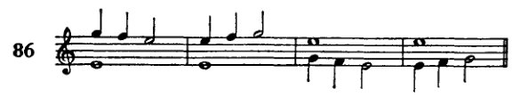

这种不协和音被称为“经过音”，传统对位法有许多规则与条件限制其使用。现在，如果我们把 V 的七和弦想象为由这种经过音形成的，那么七和弦就是一种“经过”中出现的现象，其规则则源自

它所呈现的形式。这些规则可以表述如下（就其与这里相关者而言）：七度音程可以通过将七度下行（例88*a*、88*b*）、保持（88*c*、88*d*）或上行（88*e*、88*f*）来解决。在这三种情况下，低音分别必须被保持或上行、上行或下行、被保持或跳离。这样看来，处理不协和音毕竟并非那么危险的事情。事实上，大师之作几乎允许将一条法则表述为：不协和音必须解决；也就是说，一个含有不协和音的和弦后面必须接某个其他和弦（这种说法什么也没说，但在这种情况下却是最中肯的）。一旦习惯了这种想法，那么这

<!-- page 151 -->

虚假终止 139

将根音上行四度 I–IV 的进行视为 V₇–IV 解决（例85）之基础，这种观念不再那么奇怪：十一和弦 *c–e–g–b–d–f* 在七音保持的情况下解决到 *f–a–c–f*。

例88*e* 与 88*f* 所示的处理通常不被视为和声性的。其中涉及的七和弦，因其七音上行，被视作经过和弦。然而，这种做法曾是常见实践。但和声理论的法则如下：七音必须下行；若七音保持，则根音须上行。后来，人们设立了一条例外（自然是一条例外，而非将规则构思得足够宽泛以容纳这些现象），并且说：如果如此这般……，那么就可以……，等等；七音的例外上行被允许，以获得完整的和弦。但因此[由于那是一条例外]，所谓“*böse Sieben*”[坏七度]的规则仍然成立（即一种下方音下行[一步]而七音保持，或反之，七音上行[一步]而下方音保持的七度——简言之，一种解决到八度的七度）。通过下方音下行或七音上行将七度解决到八度，这种做法继续被禁止，即便在大师作品中，这种解决在独立的声部进行中屡见不鲜。例88*d* 中的进行也因同一理由被禁止。然而，由于这一进行显然无法完全舍弃，理论便容许其解决到六和弦（例89*a*），从而确实规避了声部进行的困难（避免五度并获得完整的和弦，例89*b*、89*c*、89*d*）。但例89*d* 中的解决仍然会是可能的。如今，

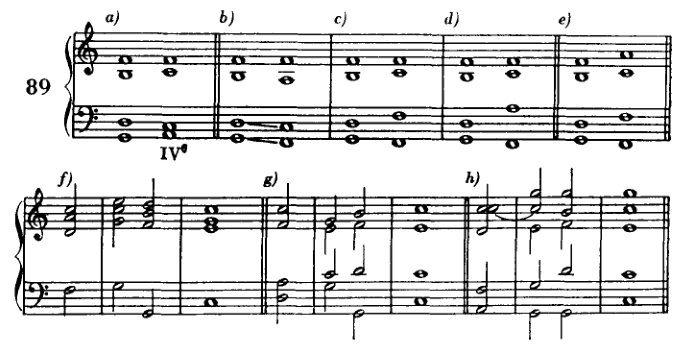

<!-- page 152 -->

140 更佳进行的指引

然而，我们不应犹豫，像例89e那样解决它：只需从不协和音跳离即可——毕竟，这一手法在例89f、89g和89h这些极为常见的形式中已是大家所熟悉的。

就连例90a中的连接，尽管在大师作品中屡见不鲜，也只能作为规则的例外才被容许；反之，若它不被容许，则例90b就不得不充当替代。

我的第一倾向是把规则表述得能够涵盖所有这些事实。然而，这样做会有危险：我也有可能排除许多好的东西（出现在大师作品中的固然是好的，但尚未出现的许多东西也可能是好的），或者我将不得不人为地设置例外。无论如何，显然随着学生能力的提高，至少那些被我证明为过于狭隘或干脆错误的规则将会被废除，并且正是在我所指出的那种意义上被废除。因此，我认为没有必要费特别大的劲去设立新规则。而且，正如以往时常做的那样，我将采取如下出路：在向学生指出这些规则在何种程度上并非绝对强制之后，我便对那种想要不顾一切规则横冲直撞的虚勇关上大门。我通过按照严格的老规则培养他的形式感来关上这扇门，使其自然而然地在适当的时机告诉他可以走多远，以及当他想要超越规则时必须如何行事。

因此，目前我们处理七和弦将只按例91a所示；我们只使用例91b中的形式（x和y其实不应被视为伪终止）和例91c（与91b相同，但从七和弦出发）；并且我们将排除一切产生*böse Sieben*（解决到八度：例92）的情况。

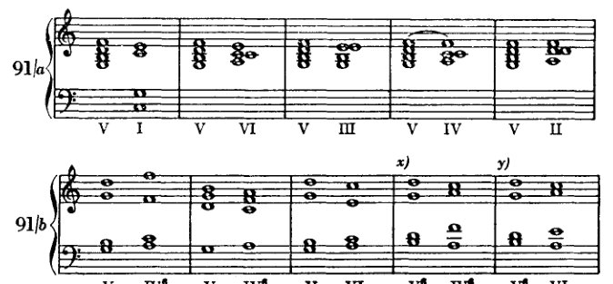

<!-- page 153 -->

*伪终止*

141

[乐谱：示例91c，展示和弦进行 V IV⁶ V IV⁶ V IV⁶ V VI V VI V II⁶ V II]

[乐谱：示例92，展示一个简短的旋律/和声片段]

只要尚未涉及那种伪终止——即我们已认定为一种特定终止技法的伪终止——这些连接也可以从七和弦的转位出发（示例93）；

[乐谱：示例93，展示带有数字低音的和弦进行，包括 ⁶₅、⁶₄ 及其他七和弦转位]

只是，那些通向六四和弦的进行也许必须谨慎对待。因为，正如已经讨论过的，六四和弦在特定语境中具有非常重要的功能，而这种特定用法已成了一种陈规。由于那种用法，每一个六四和弦，即使它出现在仅属表面相似的语境中，也会引起注意，并引发对某种特定后续进行的期待。

[乐谱：示例94，分为标有a)和b)的两个部分，展示进行 V⁷ VI 与 V⁷ IV⁶]

<!-- page 154 -->

142 更佳进行的指引

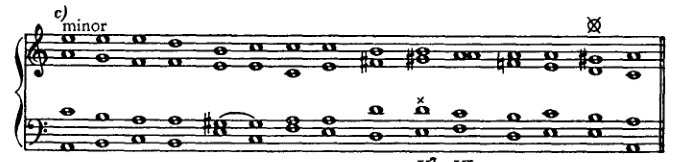

在例94的×处，使用了属七和弦的虚假终止。在⊗和†处，属七和弦未经预备就被引入。我之前说过，我们稍后应自由地处理七和弦。* 目前我们可以允许使用未经预备的属七和弦。特别是当七音作为经过音出现时，可以忽略预备，如例94c所示（旋律上的依据）。例95展示了这种经过七音的其他一些例子，其中其他的七和弦也是由经过音构成的。

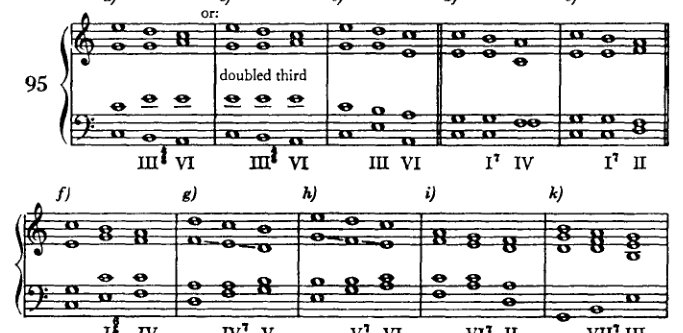

| a) | b) | c) | d) | e) |
|---|---|---|---|---|
| III⁷ VI | III⁷ VI (重复三音) | III VI | I⁷ IV | I⁷ II |

| f) | g) | h) | i) | k) |
|---|---|---|---|---|
| I⁷ IV | IV⁷ V | V⁷ VI | VI⁷ II | VII⁷ III |

| l) | m) | n) | o) | p) |
|---|---|---|---|---|
| VI I⁷ IV | I V⁷ VI | II VI II | VII⁷ | II⁷ |

这种对七和弦更为自由的处理在此并非作为任何规则的*例外*而出现，而是基于重要的前提与观察

\* 未经预备的减五度的用法将在下一章中解释。

<!-- page 155 -->

终止式中的六四和弦 143

此处屡次提出的关于不协和音多重起源及其与协和音渐层区分的种种前提。凭借这两项前提，我们得以将不协和音解决的法则分解为少数几条顾及艺术事实的不协和音处理准则。

终止式中的六四和弦¹

终止式还可以通过在 V 之前（即在 IV 或 II 之后）插入 I 来进一步扩展。其原型可能就是 I—V—I 这一终止式，我们曾将其（第 131 页）称为最初的、最简单的终止式。

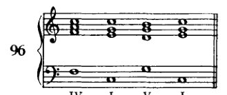

但这也以另一种方式得到解释，即作为 IV–V–I。

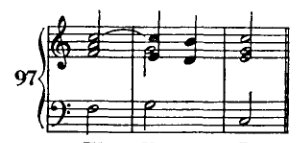

当 IV 要进行到 V 时，*c* 保持延留（装饰性地），而 *f* 则（同样装饰性地）经过 *e* 进行到 *d*。另一方面，*a* 直接进行到下一和弦的 *g* 而到达其位置。此时 *e* 为经过音；*c* 延迟其向 *b* 的进行，形成一个必须解决的不协和音，这种形式称为*延留音*。后文再详述。这种解释有很多可取之处。然而，在我看来，尽管两种解释中的任何一种单独都可能产生六四和弦，但正是这两种观念的结合才导致了这一终止式形式。在第一种情况（例 96）中，只要认识到低音中两次出现的 *c* 是一种令人不快的重复，可以通过使用转位来避免，这就足够了。六和弦也同样可用，事实上有时也确实如此。但六四和弦，它

---

¹ 参见 *supra*，第 57–58、75–80 页，以及 *infra*，第 382–383 页。]

<!-- page 156 -->

144 更好的进行方向

它确实被构思为一种需要解决的"不协和音"，并且很容易解决到V，因此更为合适，因为它几乎强制性地实现了六和弦仅仅允许的效果。然而，另一种看待这个进行的方式也同样有说服力。延留音唤起悬念，而解决则缓解了这种悬念。解决出现在所期望的和弦上，经过如此精心的准备后，该和弦的出现获得了必然性的幻觉，从而唤起一种增强的满足感。

这里提出了一些使用六四和弦的方法，这些方法也表明，仅有一种推导方式——即根据经过音和延留音来解释六四和弦的形成——是不足以解释它的（例98b、98c、98d）。在例98b中，我们不能说c是延留音，因为这种解释所要求的解决（在男高音声部）缺失了；也不能说e是经过音，因为e向上进行到g。在例98c中出现了延留音，但没有经过音，例98d也是如此。如果我们考虑另一种解释，那么六四和弦就很容易理解了。至于根音进行的判断，起源问题并不重要。将六四和弦视为延留音和经过音，我们这样标记音级（因为这里六四和弦不被算作独立现象）：IV（I⁶₄）–V–I 或 II（I⁶₄）–V–I 或 VI（I⁶₄）–V–I——因此，全都是强进行。如果我们将六四和弦视为I，则得到：IV–I–V–I、II–I–V–I、VI–I–V–I，其中有许多下行进行。然而，这些被六四和弦的准不协和音特性所补偿。我们可以假设，这种形式的六四和弦的熟悉性使人们可以不顾及其起源而将其作为陈词滥调使用，即使其前面的内容并不完全符合起源所要求的那样，而只是相似。有了这个假设，我们就可以解释例99中所展示的自由，其中II的根音位置直接跳进六四和弦，这是一种常用的终止形式。

为了避免持续g的单调（实际上并不太危险），低音很容易通过跳进八度来改变其位置。

<!-- page 157 -->

*终止式中的六四和弦* 145

我曾反复提及，六四和弦占据着一个独特的地位，并且已经指出，它之拥有这一地位究竟是源于其自身的构成还是源于惯例，这个问题必须悬而不决。我们如此频繁谈论的这种地位，正是刚刚所示的这种，即它在终止式中的地位，被用作一种延缓，可以说是一种缓冲，在属（七）和弦出现之前。由于这一形式已成为一种陈规，对它的引用会唤起人们对某一特定后续进行的期待，因此显而易见，在那些它并不具备这种后续进行的实例中，就必须谨慎处理这样的和弦：因为必须避免的恰恰是预期后续进行的出现，而由此产生的失望很容易导致不连贯。诚然，这种不连贯可以自有其魅力；但目前学生还不能追求此类效果。

<!-- page 158 -->

VIII
VII 级在大小调中
更自由的处理

作为处理不协和音的最简单方式，我们在大调 VII 级 [p. 49] 的相关内容中学习了预备和解决。如今，通过七和弦 [p. 138]，我们已经看到不协和音如何在未经预备的情况下出现——只要它是经过性的——以及解决如何也能够以另一种方式发生，也就是说，不必通过根音上行四度进行。我们在七和弦中学到的内容可以应用于减三和弦；从而使那些在实际中出现得比我们最初处理的更为频繁的形式得以使用。

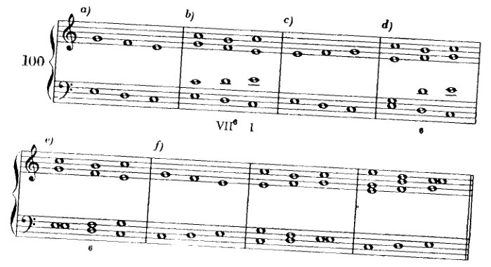

如果我们设想两个声部如示例 100a、100c 和 100f 中那样运动，那么我们就会看到，出现在 *d* 上的 VII 的六和弦，其合理性完全可以由这些声部的旋律线来证明，正如此前由预备来证明一样。现在，示例 100e 展示了一种既符合严格的对位法规则，又符合早期音乐用法的进行，但它却与我们迄今为止的做法形成鲜明对比。减五度不仅没有预备也没有解决，甚至还被重复了！

我将列举几个与 VII 三和弦最常见的连接，并且说明：一般来说，原位和四六和弦是不用的；只有六和弦这一种形式经常被使用。

在 VII–I 进行中，VII 的功能如此，以至于我们必须将其视为 V 的替代物，由此我们可以看出它与我们此前的 VII—III 进行之间的主要区别。这使我们想到，可以尝试将 VII（作为 V 的替代）用于 V 的其他常见进行中：VII–VI、VII–IV 和 VII—II。
