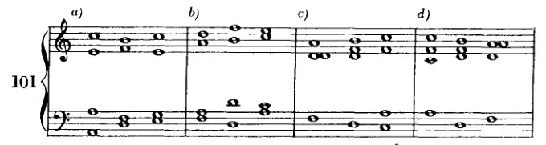
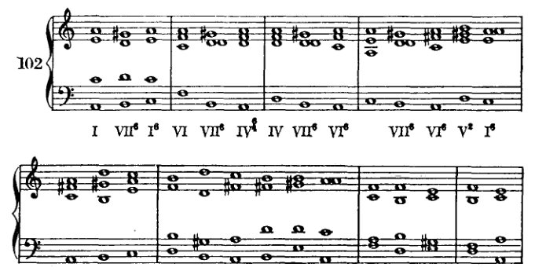

<!-- page 159 -->

对VII的较自由处理                                  147

**101**

a)                      b)                      c)                      d)

VI  VII⁶  I⁶      II⁶ · VII⁶  VI      II⁶  VII⁶  IV⁶      IV⁶  VII⁶  II⁶

小调中的减三和弦，即建立在II、VI和VII上的那些，自然也可以同样处理。

**102**

I  VII⁶  I⁶      VI  VII⁶  IV⁶      IV  VII⁶  VI⁶      VII⁶  VI⁶  V⁶  I⁶

VI⁶  VII⁶  I⁶      II⁶  VII⁶  VI⁶  II      V⁷  I      II⁶  III  II⁶  I

II⁶  I⁶  V  I      II⁶  VI⁶      VI⁶  VII⁶  I      VI⁶  V      VI⁶  III⁶

然而，支点音的规律必须严格遵守。

大调中VII的七和弦与小调中II的七和弦，使用得特别频繁且富于变化，这一点我们将在后文讨论转调时看到。关于小调中VII的七和弦，即所谓的*减七和弦*，以下几点暂且足以说明：按照我们以前的方法，我们只能将它与III连接（根音上行四度），如例103a、b、c、d所示。但现在我们已经可以看出这个极其暧昧的和弦所提供的一些可能性了。

<!-- page 160 -->

148

VII 的更自由处理

在减七和弦的某些连接中会出现隐伏五度，如例 103*f* 和 *g* 所示。因此，许多连接（103*f*）应当完全省略，或在另一些连接（103*g*）中应将三音重复，如 103*h* 所示。然而，这些隐伏五度在文献中出现得极为频繁，又极少被避免，因此我认为要求避免它们是多余的。另一方面，我建议学生省略那些 VII 解决到 I 的六四和弦的连接（103*l* 和 103*m*），理由将在后文说明。¹ 在连接减七和弦时，各声部很可能仍以最近进路为最佳；但例 104 中列出了一些常用的连接，其中声部以跳进进行。

---
¹ *见后*，第 200 页及第 240–241 页。

<!-- page 161 -->

VII级的更自由处理

149

后面将会出现诸多理由，说明为何就减七和弦而言，较其他和弦更可以使用跳进取代最简捷的声部进行。目前那个常被援引的理由就足够了：这种连接是熟悉的。于是声部不必奴性地服务于和弦的实现，而是可以自由地遵循任何出现的旋律要求。

<!-- page 162 -->

IX 转调

我们可以假设调性是主音[tonic]的功能：也就是说，构成调性的一切都源于该音并回溯于它。然而，即便它确实回溯于主音，但从该音衍生出来的东西仍有其自身的生命——在一定限度之内；它是依赖性的，但在一定程度上也是独立的。离主音最近的与它亲和力最强，离得越远的，亲和力越弱。如果我们在主音的领域中漫游，追寻其影响的痕迹，我们很快会到达那些边界，在那里调性中心的吸引力较弱，在那里统治者的权力让位，而半自由者的自决权在某些情况下可能引发整个结构体制上的动荡与变革。在这些行为时而中性、时而革命性的区域中，有两个需要加以区分：属音区和下属音区。¹ 不可能对它们进行精确界定；因为它们对主音始终强烈的参照以及其自身本能的力量——后者也在两个区域之间建立起交叉参照——所展现出的关系，无法用二维图形来表示。² 这样一种表示至少会产生一条折返自身的线，然而它又会分叉，形成从每一点向四面八方延伸的交通动脉。尽管如此，对[这两个区域的]定义可以近似如下：属于下属音区的是 IV 及其替代音 II；属于属音区的，是 V 以及与之相似的音级 III。行为相对中性的是 VI 和 VII，它们可以交替属于任一区域，或从一个区域导向另一个区域。例如，III–VI 的进行就创造了向 IV 或 II 跨越的可能性，II–VII 的进行则创造了向 III 跨越的可能性。而 II 作为 IV 的替代音，如果其后接 V，就会进入属音区。但 V 更倾向于 III 或 I，而非 II 或 IV，且 IV 更倾向于 II 或 VII，而非 V。在所有这些音级中，IV 和 V 是两个主要代表

---

¹ 此处及别处，勋伯格使用了 'Oberdominante'（上属音）一词，它比 'Dominante'（属音）更鲜明地界定了该区域与 'Subdominante'（下属音）区域的互补性。（参见他关于上五度与下五度相对于主音关系的图表与刻画，*supra*，第 23 页及以下，以及他在《和声的结构功能》中关于“区域”的理论与图表，第 19–34 页。）

² 'Schafft'（创造）、'zeigt'（显现）。关系代词 'which' 似乎有两个先行词：'reference...' 与 'force...'，二者同时也是动词 'manifests' 的主语。勋伯格显然将 'reference to the fundamental and the force of their own instincts'（*Beziehung zum Grundton und die Wirkung ihrer eigenen Triebe*）视为一个不可分割的主语。另一方面，我们不妨假定这是一种错误。然而，这种假设却值得怀疑；因为第一版中的动词为单数形式，而且在修订自己的著作时，勋伯格确实对这一段落给予了足够的关注，用 'zeigt' 替代了第一版中的 'ergibt'（产生）。]
