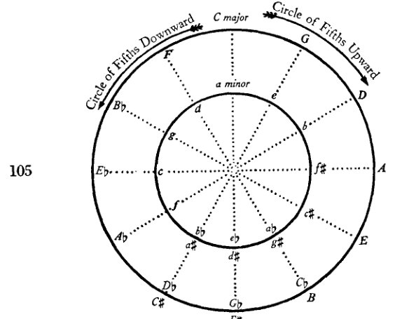
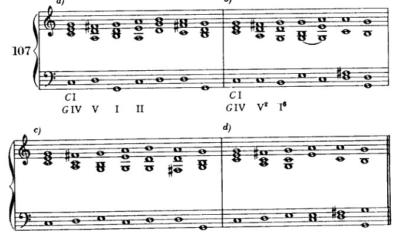
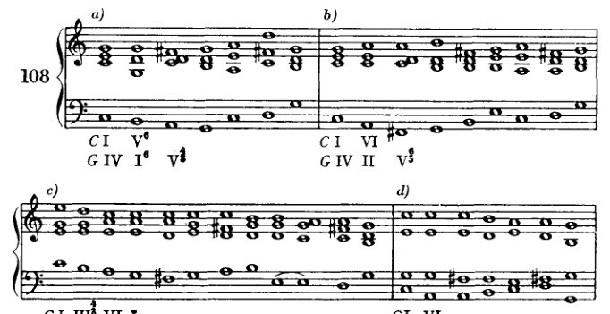
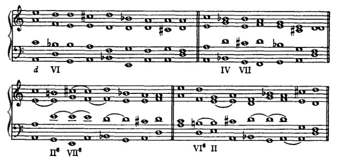
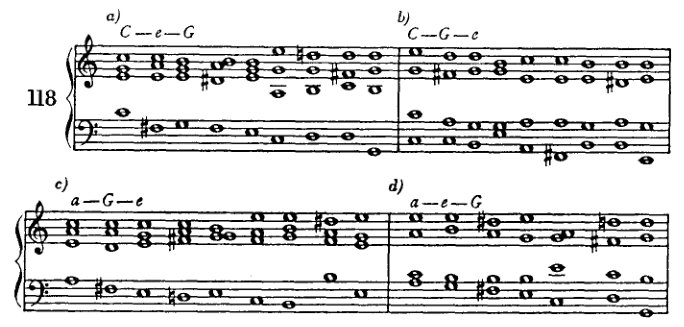
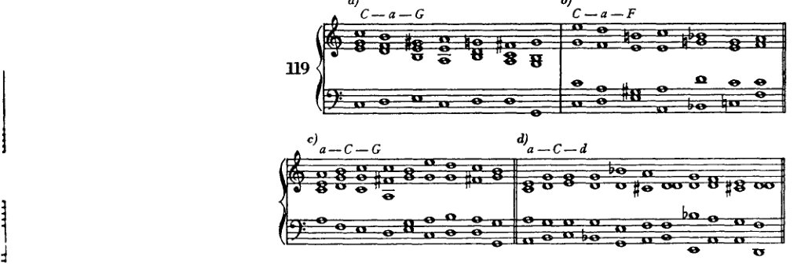
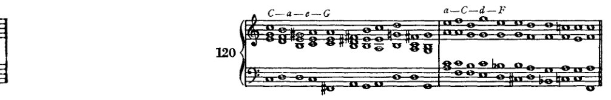
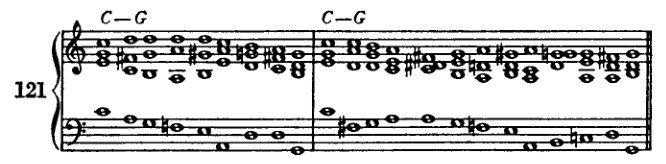

<!-- page 163 -->

转调 151

在其各自的区域中，有着最强烈的相互排斥，并且相对而言，在整个领域中，其意志之强仅次于 I。

在一个交流如此频繁的领域划定边界，或许是一项徒劳之举。因为倾向与效果之间的区分也许过于微妙。但尽管有这些交流，[边界，区别] 确实存在，即便划分得极为精细。认识到它们是有益的，后文将予以说明。此刻重要的是认识到：当副三和弦与主音的亲缘性减弱时，某些和声进行便成为可能，而它们与主音的关联必须通过特殊手段才能建立。同样重要的是认识到，调性中存在一些区域，只要被迫如此，它们便保持中立；然而一旦主音的统治哪怕只是瞬间放松，它们便准备屈从于邻近调性的诱惑。我们可能并不愿将每一个接在 I 之后的和弦都视为背离调性的开端（即便假定它能回归主调）。然而我们必须承认，属区域与下属区域各自主宰者的强烈意志，连同中立和弦顺应这一意志、乃至最终顺应另一邻近调性之意志的倾向，招致了纽带松动的危险。由这种局面，以及每一音级要么自立为主音、要么至少在另一领域中获得更重要地位的倾向，产生出一种竞争，它构成了调性内部和声事件的激荡所在。领域中最强的两位下属对独立的渴望，那些联系较松之要素的哗变，竞争各方偶尔的小胜利与收获，它们最终对主权意志的臣服，以及为共同功能而齐聚一堂——这种活动，是我们人类自身事业的反映，正是它使我们把作为艺术创造出来的东西感知为生命。

那么，置于主音之旁的每一个和弦，其引离主音的倾向至少不亚于回归主音的倾向。而如果要让生命、让艺术品诞生，我们就必须投身于这种产生运动的冲突之中。调性必须被置于丧失主权的危险之中；独立的渴求与反叛的倾向必须获得自行激活的机会；必须认可它们的胜利，不吝惜它们偶尔的领土扩张。因为统治者只能从统治有生机的臣民中获得乐趣；而有生机的臣民会去攻击与劫掠。

那么，臣民反叛的野心或许既源于暴君意欲支配的冲动，也同样源于他们自身的倾向。没有臣民的野心，暴君的冲动便无法得到满足。因此，离开主音可被解释为主音自身的一种需要；在主音自身之中，在其泛音本身之中，就蕴含着同样的冲突，可以说，这是另一个层面上的范本。即便是看似彻底的离调，到头来也成了一种手段，使主音的胜利更加辉煌夺目。而且如果我们认识到，任何置于主音旁的其他和弦，即便实际上并未引发转调，却毕竟朝那个方向倾斜，那么显而易见，即便是进入更

<!-- page 164 -->

152

转调

较远区域对主音而言可能仍是有机的——只是这种有机性更为疏远。将这些离调与主音关联起来更为困难，但并非不可能。主音若要对其宣示主权，所必须运用的手段也必须更为强硬、更具侵略性，以与那些谋求解放者更具侵略性的本质相称。主音赋予那些离它而去的音的余地越大，它就越必须以越为迅猛的七里靴般的步伐追上并俘获它们。这番努力越是巨大，胜利的效果就越是压倒性。

那么，如果我们理所当然地追随藩属 [附属和弦] 的倾向，我们便会看到离调（*Ausweichungen*）、亦即转调的必要性与可能性。只要调性的力量是无限的，这些离调便是无限的。倘若这种力量存在界限，那么压制次要和弦的倾向也将无济于事。它们仍会断绝纽带，因为它们没有界限。因此我们可以发问：调性是否强大到足以统御一切，还是并非如此？

两者皆是。它可能足够强大；也可能太过软弱。如果它相信自己，那么它就足够强大。如果它怀疑自己统治的神授之权，那么它就太过软弱。倘若它从一开始便怀着对其使命的信念，以专制姿态前行，那么它将取得胜利。但它同样可以持怀疑态度；它或许已经看到，所有被指为对其臣民有益的东西，仅仅服务于它自身的利益。它或许已经看到，它的主权对于整体的繁荣与发展并非绝对必要。它的主权是可容许的，但不是不可或缺的。[^1] 它的专制事实上可以是一种统一的纽带，但摒弃这一纽带却可能促成其他纽带的自主运作；倘若源自调性的法则——那位专制者的法则——被废除，它昔日的领地未必会因此陷入混乱，而会自动地、依循自身的旨令，为其自身制定与其本性一致的法则；[^2] 无政府状态不会接踵而至，取而代之的将是一种新的秩序。然而它或许还会补充说，这种新秩序很快就会开始与旧秩序相似，直至与旧秩序完全等同；因为秩序与变化同样是上帝的意志，而变化会持续地复归于秩序。

因此，从和弦的本性及其与主音（*Grundton*）的关系中，我们可以得出一些洞见，从而确立如下功能：

1. 从主音出发的离调与对主音的确认，其关系体现为：尽管所有次要音都进行了新的展开，无论它们离得多远，调性[^3] 最终仍会取得胜利。那么，这一[功能]实际上就是一种扩展的终止式，本质上也是每一首音乐作品——无论其规模多大——的和声布局。

2. 离调抵达一个新的调性。这在……的过程中不断发生

[^1]: [如译者序（第xix页）所述，译文保留了勋伯格偏爱不完整句子的风格，凡此手法在英语中显得有效，或至少不突兀之处，皆予保留。]

[^2]: [本段剩余部分未出现在1911年版中。]

[^3]: [在他的“Handexemplar . . .”中，勋伯格将此处以及下面第“2”点中的“Tonalität”一词画了下划线，并在页边写下“Tonart?”（调）（参见 *supra*，译者序，第xvi页）。]

<!-- page 165 -->

转调                                                                                 153

一个片段，但只是表面上的；因为这个新调性在作品中并无独立意义，而只是更详尽地表达了副和弦的倾向。这些和弦始终是在由某一调性所界定的作品中的副和弦。

3. 从一开始，主音便未明确地出现，它并非决定性的；相反，它容许其他主音与之竞争。可以说，调性被保持着悬而未决的状态，随后胜利可能归于竞争者之一，但也未必如此。

4. 和声在任何地方都不倾向于让某个主音确立其权威。所创造出来的结构，其法则似乎并非出自一个中心源泉（*Zentrum*）；至少这个中心源泉并非一个*单一的*基础音。

前两种功能我们现在就要讨论；至于第三和第四种，就现阶段能够给出的指导而言，要留到很久以后。¹ 一旦我们掌握了更丰富的和声资源，就把第一种作为终止式的延伸来详细研究。第二种，即所谓的转调（modulation），是我们眼前的任务。

正如我们所见，终止式是确立调性的手段。转调的目的则是离开调性。终止式需要将某些严格限定调性范围的和弦按特定顺序排列，而为了转调，我们必须做相反的事：我们必须回避这些和弦。我们必须构建和弦进行，这些进行不仅不会将我们束缚于原调，甚至还会界定出另一个调性。如果通过省略那些表达旧调性的元素而使调性的纽带得以松动，那么新调性就可以通过表达旧调性时所用的相同手段来达到。这些手段只需为新调性加以移调即可。这些转调手段或直接地、或经由大大小小的迂回，终将抵达那个由终止式确立新调性的点。因此，我们呈现转调的乐句将分为三个部分：

1. 表达调性，并引入一些（中性的）和弦，使其得以转向新调（不需要很多和弦；有时原调的 I chord 就足够了，因为它常常既是中性和弦，又是表达调性的和弦）；
2. 实际的转调部分，即转调和弦以及引入它所需的任何和弦；
3. 确认部分，即确立新调性的终止式。

哪些和弦能够在自身不离开原调的情况下，使乐句转向，从而让转调和弦做出决断？我们可以从之前的同一种思考中推导出它们，即我们先前据此找到适用于终止式的那些和弦。在那里，我们的目的是巩固调性，以防其因音级的倾向而过于轻易地滑向那些近关系调。而在这里，我们恰恰要顺从这些倾向。我们随后将遇到的最简单的转调，便是转向*关系小调*，以及转向*上方和下方五度*的调性，连同*它们的关系小调*。

[¹ 下文，第十四章及第十九章（第 7、8 节）至第二十二章。]

<!-- page 166 -->

154

**转调**

因此，从 *C* 大调出发：其关系小调为 *a* 小调；上方五度为 *G* 大调（及 *e* 小调）；下方五度为 *F* 大调（及 *d* 小调）。这些大调与 *C* 大调的区别仅在于调号上多出一个升号或降号（至于关系小调，正如我们所见，不过是大调内部的特殊形式而已）。与起始调（主音位于上方或下方五度）如此关联的大调，称为*五度循环圈第一圈中的调*。[^1]（小调则归算到其关系大调，而它们关联的密切程度亦按其关系大调的关联程度来表述。）

“五度循环圈”这一说法的由来，是因为各调的名称被写在一个圆圈上，使得圆周上等距相邻点之间的距离，对应于关系密切的各调之间相隔的距离，亦即主音相距五度的那些调。这些调依次以五度为间隔排列：*C、G、D、A* 等，直至回到出发点。这种回归恰似圆的周长（它也回到起点）。如果我们沿一个方向绕圈（*C、G、D、A* 等），就得到五度循环圈，或者我更愿意称之为上行五度循环圈，因为它由建立在出发点之上的一连串五度构成。如果我们沿相反方向绕圈，则得到 *C、F、B♭、E♭* 等。有人称此为四度循环圈，但这几乎没有意义；因为 *C* 到 *G* 是上行五度或下行四度，而 *C* 到 *F* 是下行五度或上行四度。因此我更愿意称这个相反方向为下行五度循环圈。[^2]

五度循环圈在一定程度上表达了两个调之间的关系。但并不完全。显然，调号上仅相差一个升号或降号的两个调，很容易比相差五个升号或降号的调关系更密切。因此，*B♭* 大调与 *E♭* 大调的关系，要比 *B♭* 大调与 *A♭* 大调的关系更近。依此，*C* 大调与 *D* 大调也应比 *C* 大调与 *A* 大调或 *E* 大调关系更近。然而，这并不完全正确。因为调号并非影响调关系的唯一因素；还有其他一些考量，稍后我们会更仔细地加以审视。例如，*C* 大调通过 *a* 小调而与 *A* 大调相关联，而这种关联比 *C* 大调与 *D* 大调之间的关联更强，这一点将会看到。因此，我们不会单独使用五度循环圈来确定关系的密切程度——那样做无异于一种价值判断——相反，我们将更多地用它来衡量距离，作为一种帮助我们更好地记住在特定情况下所发现的恰当手段的工具。

例如，在我们的五度循环圈中应当注意到，*B* 大调与 *A♭* 大调相距九个五度，也就是说，如果我们从 *A♭* 大调算起（或者从 *B* 大调按相反方向、即下行五度循环圈来算）；但如果我们从 *B* 大调顺时针方向，或从 *A♭* 大调沿下行五度循环圈来算，它们只相距三个五度。一般来说，我们将倾向于较短距离在

[^1]: 'des ersten Quintenzirkels'. 关于这一缩略表达的澄清，参见 *infra*，第 350 页，作者脚注。

[^2]: 作者的长脚注：附录，第 426 页。

<!-- page 167 -->

调式转换 155

105

选择调式转换的手段；然而很多时候我们会选择看似更长的路径，正如将要看到的，这往往是更短的途径。如果我们记得，正如我提到的，第三圈的调比第二圈的调关系更为密切，这一点就更容易理解。在五度圈中可以发现，*f*小调与*F*大调相距三个五度，*f*小调与*d*小调也仅相距三个五度，但*f*小调与*D*大调则相距六个五度。

106 *C大调（a小调）五度圈表*

| 第一圈 | (a小调) | G大调 | e小调 | F大调 | d小调 |
|:---|:---|:---|:---|:---|:---|
| 第二圈 | | D大调 | b小调 | B♭大调 | g小调 |
| 第三圈 | | A大调 | f♯小调 | E♭大调 | c小调 |
| 第四圈 | | E大调 | c♯小调 | A♭大调 | f小调 |
| 第五圈 | | B大调 | g♯小调 | D♭大调 | b♭小调 |
| 第六圈 | | F♯大调 | d♯小调 | G♭大调 | e♭小调 |
| 第七圈 | | C♯大调 | a♯小调 | C♭大调 | a♭小调 |

在例106中给出了*C*大调和*a*小调的五度圈表。学习者应将这些关系移调到其他调上。

由于第一圈的调实际上，如我们所见，是最近的近亲关系，我们将从它们开始，选择从*C*大调到*G*大调的调式转换作为第一个例子。（和之前一样，我将始终以*C*大调作为原调来给出例子，以便于复习已学内容。学习者当然也必须同时在所有其他调上进行练习。这些其他调上的练习

<!-- page 168 -->

156

转调

如果总能把握好时机，这对他来说就毫无困难。然而，如果忽略了这一点，当他面对那些始终陌生的调时，就可能会感到缺乏把握。)

能稳固确立 *C* 大调的和弦是那些包含 *f* 和 *b* 的和弦，即：IVth、IInd 和 VIIth 级（对应 *f*），以及 Vth、IIIrd 和 VIIth 级（对应 *b*）。显然，包含 *b* 的和弦不会阻碍我们进入 *G* 大调，而出现 *f* 的和弦则不适合这一目的。那么，如果 III 和 V 可被视为中性的，另一方面 II、IV 和 VII 则必须排除。然而，除了 V 和 III，还有其他一些级数相对于 *G* 大调来说是中性的：I 和 VI。这一切也可以用另一种方式来表述。可以说：由于音阶的相似性，*C* 大调和 *G* 大调有许多共同的和弦。如果我们独立地列出这些和弦中的一个，使其脱离上下文，那么我们就无法确定它属于这一个调还是那一个调。它既可以属于 *C* 大调，也可以同样好地属于 *G* 大调。究竟应按哪一种方式理解，取决于前后的进行。三和弦 *c*—*e*—*g* 可以是 *C* 大调中的 I 级，也可以是 *G* 大调中的 IV 级。后续的和弦决定了它究竟是前者还是后者。如果后面是 *f*—*a*—*c*，那么这个调当然就不是 *G* 大调；它很可能是 *C* 大调，但也可能是 *a* 小调、*F* 大调或 *d* 小调。但如果后面是 *d*—*f*♯—*a*（*G* 的 Vth 级），或 *f*♯—*a*—*c*（VIIth 级），那么它很可能是 *G* 大调或 *e* 小调，或者至少可能是这样。

这两种阐述体现了我们在最初转调中将使用的两种主要手段。一种是：使用这种能够在原调与新调之间起中介作用的*中性和弦*；另一种是：*共同和弦的重新解释*。这两种手段通常同时起作用。因此，引入中性和弦，或者至少避免那些有利于原调的其他和弦，便创造了重新解释的可能性。反之，中性和弦也因重新解释而被推向新调的方向。现在，无论我们是采用重新解释还是使用中性和弦[即，无论我们如何看待转调的这一阶段]，迟早总会到达这样一个时刻：我们必须通过某种有力的手段果断地转向新调。如果我们想一想终止式，这一手段可能是什么就立即清楚了：首先是 Vth 级；然后更一般地说：所有包含新调导音的和弦，因此经常有 III 和 VII，以及 V。显然，V 通常是最常被优先选用的。但另外两个在促成转调方面也是有效的，尤其是 VII。为了使新调的确立清晰而明确，我们将以终止式来结束整个进行。终止式的长度自然取决于转调的长度和难度。如果转调很简单，那么一个短终止式就足够了。如果转调需要更丰富的手段，那么终止式就不宜过短。然而，有时也会发生这样的情况：一个漫长的转调由于其充分性而极具说服力，以至于一个短终止式就够了；反之，有时转调是如此突然，以至于需要用一个较长的终止式来加强对新调的巩固。

在考察转调手段时，我们最好系统地进行，从最短、最简单的形式开始，然后再进入更复杂的。

<!-- page 169 -->

转调

157

从*C*大调到*G*大调。

假设*C*调已经确立。*C*大调的主音级是*G*大调的（中性和弦）IV级。 reinterpretation 可以就在这里开始。*G*大调的和弦可以跟随，包括不决定性和决定性的和弦。首先为了简洁，我们直接使用决定性和弦，*G*大调的V级，即转调和弦。然后，最简单的方式，新调的主和弦跟随，至此转调完成，除了终止式（示例107*a*）。这个终止式可以很短，因为转调本身简短而清晰。如果我们想要避免*G*大调主和弦两次重复所产生的软弱感，那么在*G*大调的V级之后，我们可以使用该主和弦的六和弦，或者使用欺骗终止（107*b*、107*c*、107*d*），或者我们可以使用V级的转位（⁶₅、⁴₃或⁴₂），这就足以将其与终止式中的V级区分开来。

在起始和弦与转调和弦之间可以有中间和弦：中性和弦，*C*大调的III、V、VI级（即*G*大调的VI、I、II级）。

示例108*a*使用*G*大调的主和弦作为中性和弦。为了低音旋律，并避免重复，它采用六和弦形式，而转调和弦

<!-- page 170 -->

158

转调

（V）是一个四三和弦。* 例108b在C大调的VI（G大调的II）之后，将G大调的V用作六五和弦。为了缓和I的重复，终止式略更复杂。例108c使用C大调的III（G大调的VI）并附加一个经过七音（[前和弦中]三音重复！），以引入C大调的VI（G大调的II）；然后它再次通过一个经过七音（一个二和弦）进行到V的六五和弦；之后它利用经过的四六和弦形成一个伪终止，导向G大调V的重复以及I的六和弦。

a) C I, G IV, V⁶, I⁶, V⁴₃

b) C I, G IV, II, V⁶₅

c) C I, III⁴₃, VI; G IV, VI⁴₃, II, V⁶₅, IV⁴₃, V, I⁶

d) C I, VI; G IV, II⁷, VII⁶₅, III

e) C I, VI⁷; G IV, II⁷, III, VI, II, V, I

f) C I; G IV, VII⁶₅, VI⁶

g) C I; G IV, III⁶, VI

h) C I, VI; G IV, II, VII⁷, III, II⁶

\* G IV–I–V：这些是下行的根音进行。然而，在IV与V之间使用I，类似于先前所述的I的四六和弦[p. 144]。人们会立刻感受到这个和弦的过渡性质，以及它只是为了导向V而使用的。如此解释，I仅被看作一个经过和弦，即旋律性的，该进行便读作：IV–(I)–V–I，全都是上行进行。

<!-- page 171 -->

转调 159

这种对转调和弦的重复往往效果很好（我称之为：再次经过该和弦）。实际上，我们在此处并不太需要这种手法，但稍后我们会用它来为转调力度和清晰度不足的地方提供额外帮助（因为重复会带来加强）。在例108*d*中，*C*的VI级七和弦，或*G*的II级，导向*G*的VII级五六和弦。后者在此充当转调手段；而其后的*G*的III级，由于*g*（I级和弦）直到该例结束才出现，可被视为I级的替代，终止式即由此开始。这个例子值得注意，因为它告诉我们，转调并不一定要绝对进行到I级，终止式可以从具有同样特征意义的某一级开始，比方说III级、VI级，甚至可能是IV级或II级。就原则而言，这个例子与例107*c*并无太大不同，在那里，转调和弦之后跟着一个欺骗性终止。只是，在107*c*中，转调和弦是V级，而这里是VII级。在例108*e*中，*G*的III级被用作转调和弦。这里同样省略了I级，而由VI级取而代之。同样地，在108*f*、108*g*和108*h*中，VII级和III级是决定性的和弦。欺骗性终止仍然非常值得推崇，因为它掩盖了目标，却又不至于使其模糊不清。当然，还可以插入其他中性和弦，并采用不同（但良好）的进行。学生在此有大量机会练习构思组合（*Kombinieren*）。

人们或许确实会偏爱这类能够避免I级和V级重复的转调。但由于消除此类重复中令人不适之处的方法有很多，而且这类重复本身也并非很不好，所以这里没有必要在价值上加以区分。万一I级确实出现了两次呢？它本就该是突出的。

转向*a*小调和*e*小调的转调，用同样的手段也能同样简单地完成。

转向*a*小调（例109）。此处的转调手段主要是V级。但II级和VII级也可以起作用。最简单的方法是将第一个和弦（*C*的I级）视为*a*小调的III级。这里，如果想让转调进行得平顺，就应当牢记适用于自然第六级和第七级的枢纽音规则。*因此，必须将*g*和*f*当作第三级和第四级

\* 在此我必须预先防止一种误解：此处的转调和弦绝不应以半音方式产生，例如通过从*C*的I级中的*g*上行到*g♯*。这其实是显而易见的。首先，我们尚未谈及半音变化；其次，我们已经明确指出，中性和弦应当置于转调和弦之前。现在，*a*小调中含有*g*的和弦当然不是中性和弦。必须记住，小调包含两种音阶：上行音阶与下行音阶。此处自然要使用上行音阶，因为我们想要形成一个终止、一个收束。而下行音阶并不包含中性和弦，或者最多只包含那些具有更远距离中性的和弦：即根据枢纽音法则，其中的第七级（及第六级）音必须先被中性化，才能容纳升高音的那些和弦。这些和弦确实在这种意义上是相对中性的，但不如那些不造成这一障碍的和弦那么中性。下文将*C*的V级作为*e*小调的相对中性和弦来引入，也只有在这种意义上才能被理解。

<!-- page 172 -->

160

转调

枢纽音；在上行音阶的音出现之前，它们必须通过向下解决来中和。稍后我们在这方面将不那么敏感，并且一旦在“副属和弦等”一章中方法变得可行，在 *g* 之后写 *f♯* 也将不再犹豫。

小调的 II 为向小调转调提供了一种良好的手段，特别是作为七和弦（六五、四三或二）时。因为它提供了将第六音（II 的减五度）导向[该调的]第五音的机会。此外，V 级很容易紧随其后（II–V）；但即使 II 构成阻碍终止（II–I 或 II 到增 III），结果仍然相当具有特征性。

[注 这些例子中的最后三个，109*l*、109*m* 和 109*n*，是在修订版中添加的，下面的例 110*k* 和 110*l* 也是如此。]

<!-- page 173 -->

转调

161

[带和弦标记的音乐谱例 i) 至 n)]

i) C I, a III; IV, VI; II, IV; VII
k) C I, a III; II, IV; VII⁶
l) VII⁶, VI⁶, II
m) VI⁶, VII⁶
n) VII⁶, VI⁷, III⁶

使用升III级（增三和弦）、VI级（[减]三和弦与七和弦）以及VII级（减三和弦与减七和弦），可以获得丰富的变化可能性。但第七音（以及第六音）的中和仍须十分谨慎。

转至 *e* 小调（例110）。C 的中性和弦为 I、III、VI 级，偶尔也有 V 级。转调手段同样是 *e* 的 V、II 和 VII 级。如同在 *a* 小调中一样，这里 *e* 小调的 II 级尤为有效。它可以紧接在 I of C 之后（例110*d*）。这个 II 级并非绝对必须进行到 V 级；I 级或 III 级也可以接在其后，从而避免重复。在转入 *a* 小调时已使用过的升II、III、VI 和 VII 级的形式，在这里部分有更好的连接。甚至升 IV 级也可使用。

110
a) C I, *e* VI, V, I⁶
b) C I, *e* VI, V⁶, I⁶

<!-- page 174 -->

162

转调

[带罗马数字分析标记的乐谱示例 c) 至 l)]

c)
C I
e VI    II    V

d)
C I
e VI    II    I

e)
C I    III    VI
e VI    I    IV    II    I

f)
C I
e VI    IV    III

g)
C I
e VI    II    III

h)
e    VII⁶

i)
e    VII

k)
VI⁶    II⁶

l)
IV    VII⁶

同样，如同所有这些转调一样，在 V 级之后应频繁使用虚假终止。在勾勒乐句时，学生应始终先写下表示根音进行的数字，和之前一样，然后再确定排列法与转位。在表示起始和弦（仍参照原调）的数字下方，他需写下第二行数字，表示这些和弦在新调中的重新解释。从

<!-- page 175 -->

转调 163

一旦进入转调和弦，数字就仅指向新调，即目标调。¹ 然而，学生必须极为严格地说明根音进行，且不得偏离我们为此所给的指示；否则他可能写出大量非惯用法的东西，并且忽略大量他应当练习并熟悉的内容。当然，他可以让自己的形式感与品味发挥作用，无论是在初步勾勒中，还是在许多[随后的]决定中。但这只是为了控制和修正——而非放纵他的奇想（*phantasieren*）。

如所见，我正在非常详尽地论述转调这一主题。大多数和声教科书并非如此，或者至少未以应有的方式论述。若我们只是向学生展示如何避免五度、八度及假关系，或如何演奏数字低音，则一事无成。若我们只是向他展示减七和弦可以解决到多少个调中，也同样一事无成。若我们以同样的方式讨论其他变化和弦，无论其变音涉及多少升降，也同样收获甚微。在那些将数字和字母写在文献范例下方的和声分析中，同样一无所成，而这些数字和字母的意义完全是表面的。正是这种肤浅性，导致了它们造成如此多的混乱。

自从这些分析开始“启发”学生以来——向他展示某人如何*不假思索地*并置了 C♭ B V – IV！*a*: V – C: V – (IV!) *b*♭: V – *a*: IV V – I *b*♭: V – *a*: IV V – A: I——关于转调的无知（*Kulturlosigkeit*）从未像今天这样严重。我们只能希望学生不要理解这种密语。我也不理解它。但遗憾的是：这种胡言乱语正是他们[分析者]所理解的。他们正是从这种东西中学习的。正是这种“不假思索”适合他们。而没有人告诉他们，这种“不假思索”根本不存在——在艺术中，一切都是“煞费苦心”的。

每当一段音乐开始转调时，这不仅是和声事件序列的结果，也是旋律与节奏事件序列的结果。对后者的考量在和声教学中没有一席之地。很好！但前者呢，即和声方面？仅仅指出“我们还可以用减七和弦做的另一件事是……”；或“增六五和弦如此这般地派生而来”；或“这八小节从 C♭ 经过 *a* 和 C 转到 *b*♭ ……”等等，是荒谬的。分析若能说明一段音乐为何（是的，*为何*！）朝某个方向转折，则会好得多。而且，由于和声教学的方法是综合性的，关于转调手段使用的指示必须从“*因为*”出发！

转调的出现方式如下：首先给出主调。然后出现它最近的亲缘关系，即最直接的后果。这些使音乐远离主调，却又通过关系——通过自然的与人为的关系——与之相连。如果作品继续下去，那么就会出现更远的进行。

---

¹ 在初版（第185页）中，本段剩余部分解除了学生“一旦他获得了一些（转调方面的）熟练度”之后进行初步勾画的义务。勋伯格曾认为，学生此时可以开始依赖他的 *Formgefühl*，即他的形式感。——参见 *supra*，勋伯格《修订版序言》。]

<!-- page 176 -->

164

转调

纽带松弛了。然而，如果整部乐曲要被统一起来，那么纽带最终必须再次收紧；而这只有当这些进行确实能够被感知为最初事件的后果时才会发生。倘若孙子身上没有祖父的丝毫特征，那还真是一种绝妙的关系！诚然，像减七和弦这样的换生儿（*Wechselbalg*）¹ 可以“不假思索地”出现。但它与祖父毫无关系。

在一部想必旨在阐释最新和声的文本中，听到这些“陈旧的观点”可能会让人觉得奇怪。但这些观点无关乎时尚；它们只是古老而已。而这正是它们的价值所在。它们包含着某种或许永恒的东西，或者至少持续得如此之久，以至于我们不妨称之为永恒。然而，永恒的不会是那些法则：不是说必须逐步转调，因为这样更容易理解；也不是说必须通过关系将后续事件与最初事件联系起来；也不是说我们的理解需要逻辑性的呈现。或许[永恒的]甚至不是这些法则中的普遍性。但它至少是这样一种情况：艺术作品将永远反映我们的思维方式、我们的感知与概念能力以及我们的情感——这些才是我们在分析时始终必须寻找的东西，而不是比如说“减七和弦甚至可以……”

例如：当勃拉姆斯在其第三交响曲（*F*大调[第一乐章]）中以*A*大调引入第二主题时，这并非因为人们“可以”同样好地以中音调引入第二主题。这毋宁说是一个主要动机、一个低音旋律（和声连接！）*f–a♭*（第三与第四小节）的后果，其诸多重复、衍生与变奏最终使得，作为一个暂时的高潮点，*f–a♭*进行有必要扩展为*f–a*进行（*F*，起始调；*A*，第二主题的调性）。因此，基本动机由起始调与第二主题的调性给定。这是一种心理学解释。但在这里，心理学解释实际上就是一种音乐解释。而每一种音乐解释必须同时是心理学的。显然，在这个意义上它也是一种自然的解释。依据人性的自然。我们的思维方式就在那里，我们的逻辑——它连同规律性一起，不仅容许多样性，甚至坚持多样性。[我们的逻辑]无法想象有原因而无结果。因此，它想要从每一个原因中看到结果，并在其艺术作品中安排原因，使得结果显而易见地从它们中产生。

不幸的是，我当然无法如此详尽地深入每一次转调中发生的一切。然而我相信，由于我不仅试图描述，而且试图权衡各种个别手段，在这方面我取得的成果不同于通常被认为足够的那些。此外，通过为某一特定原因汇集尽可能多的不同形式的结果，我正在提供丰富的资源以供考量。综合，即使只是通过发明组合（*Kombination*）的方式，由此必定会产生一个无疑比那些人所得更好的结果。

---

[¹ 参见附录，作者对第十章的脚注，第180页。]

<!-- page 177 -->

转调 165

那些不注意本质特征，而以非系统的方式或依据错误体系来提及孤立特征的方法。

例如，有一本备受推崇的和声教材¹，其中几乎完全是用属七和弦或减七和弦来进行转调的。而作者所展示的仅仅是，这些和弦中的某一个可以在每一个大三和弦或小三和弦之后直接或间接地引入，并且用这种方式可以到达任何一个调。

如果我想，我可以更迅速地了结这件事；因为我准备展示（用从文献中'按需定制'的例子！）任何一个三和弦都可以接在任何一个其他三和弦之后。

如果那实际上意味着任何调，而且如果我们真的能那样转调，那么这些步骤还会更简单。但如果有人进行一段他想讲述的旅程，他不会像乌鸦那样直飞！

在这里，最短的路是最糟糕的。从这种鸟瞰视角看待事件，是一种愚笨的看法。如果一切都熔合在一起，任何东西都可以是任何东西。区别消失了。那么，我是用属七和弦还是减七和弦做了一次糟糕的转调，就根本无关紧要了。因为转调的本质不是目标，而是路径。

我们每天必须行走的道路应该是维护良好的路，它们在一切相关方面都履行其目的：将不同的地方彼此连接，并且在现有手段允许的范围内尽可能舒适地做到这一点。

只有当一个人无法走舒适的路时，或者当一个人被一种力量感所激发，发现在征服不舒适中获得乐趣时，才会选择不舒适的路。但那是征服的乐趣，而不是不舒适的乐趣。一条必须跳过壕沟、翻越墙壁、在崎岖深渊边缘行走的路，也能通向目标——也就是说，它引领的是专家、经验丰富的徒步者、装备充足的人。但它不适合没有经验的人，不适合新手。

当然，从五楼跳下去比走下楼梯更快地到达街道——但那是以什么状态到达的呢！因此，问题不在于最短的路，而在于实用的、适当的路。只有那种权衡了出发点与目的地之间可能存在的联系，然后明智地做出选择的路，才是实用的、适当的。这种用一种万能手段（如减七和弦）来完成的转调，就是跳窗而出。自然，两种方式都是可能的。而且为什么不该跳呢？尤其是当一个人能跳的时候。是的；但谁都能跳！所以，学生能跳，对我来说并不重要。对我来说，交给他一种作曲的万能手段，一把没有原创想法、没有天职也能作曲的'钥匙'，这并不重要。但重要的是，他能领悟艺术的本质，即使他'只是'为了乐趣而学习。无论如何，为什么人就不该偶尔也在美好与真实之中找到乐趣呢？

这些转调手段，正如大多数教科书中所给出和组织的那样，并不旨在正确解决一个和声问题。它们的目的毋宁说是让学生掌握那点微薄的知识，使他能够勉强通过考试。但这对我来说是不够的。我想把目标定得稍高一些！正是出于这个原因，我认为*路径*的

---

[¹ 恩斯特·弗里德里希·里希特的*和声学教程*？– 参见上文，第15页。]

<!-- page 178 -->

166

转调

具有如此重大的意义；也正是由于这个原因，我有足够的时间从容不迫，并在途中环顾四周。

向下方第一个五度圈的转调（从 *C* 大调或 *a* 小调到 *F* 大调或 *d* 小调），尽管听起来可能令人惊讶，却要稍微困难一些。其原因可能是，正如我经常提到的，每一个音、每一个和弦似乎都对下属调怀有一种吸引力，这种吸引力几乎比我们人为到达那里所使用的手段更为强烈——和弦、音会自然地走向那里。我的意思是，在这里要做些什么来实现那个目的反而更加困难，因为这几乎是自行发生的，无需我们做任何事。主和弦本身，它那消融于下属调之中的倾向，同时也就是转调到下属调的手段。的确，这个 Ist 级（属于 *C* 大调）本身就是 V（属于 *F*），而我们要转调正是要到这个调。如果这样，这个

<!-- page 179 -->

转调

167

通往下属调的过程几乎自行发生，因此对于那些希望亲自促成转调的人来说，实际完成某件事的感觉会减弱。因此，稍后有必要更巧妙地塑造这一转调，因为我们确实希望感受到是自己完成了某件事，因为我们想要的不是向下坠落，而是向下攀爬。所以这些转调目前看起来相当简单，但它们当然并不因此就是不好的。

在 *C* 的 I 级（即 *F* 的 V 级）之后，可以立即使用 *F* 的 I 级。由于这几乎没有什么说服力，建议插入 *F* 的 V 级七和弦（例 111*b*）的原位或其转位。如果我们希望使用属七和弦之外的和弦（它确实引入了 *b*♭），那么我们可以考虑 *F* 大调的 II、IV 和 VII 级。这些音级有助于使这一转调更加多样化，哪怕仅仅是因为 I 和 V 级常常被回避，而其他和弦可以取而代之。在这里，欺骗性终止也不应被遗忘。

[注：例 112*k* 系 1922 年修订版所增补，同时增补的还有下一段的倒数第二句。]

<!-- page 180 -->

168

转调

[乐谱：标有“k）”的转调示例，并带有数字低音分析“d II⁶ VII⁶ VI⁶ II”]

在从*C*大调转调至*d*小调时，首先需要中和*c*音——即枢纽音——然后才能引入含有*c♯*的和弦。*d*小调的IV、II和VI级和弦适合完成这一任务。这些和弦实际上已经是转调和弦，随后应立即开始终止式。但如果我们希望插入V、III或VII级和弦，那么当上述和弦[IV、II、VI]中的一个或几个已经为这些和弦做好了准备之后，除此之外，其处理方式与我们之前在转调中所遵循的方法完全相同。由于低音中的*c*音作为第三枢纽音必须被消除，若干示例是不被允许的（因此，112*b*、112*e*、112*h*），而那些仅在结尾处才出现*c♯*的示例则至少是可以容忍的。¹ 使用升高音级也会带来困难，而这些示例的实际目的只能在于展示这些困难。[在第一个和弦中]建议以重复五音（112*a*）或三音（112*f*）来代替重复八度。

接下来是第一圈的转调，从*a*小调开始：*a*小调到*C*大调，到*G*大调和*e*小调，到*F*大调和*d*小调。*A*小调是一种从*a*开始的*C*大调[形式]。因此，*a*音可以立即被视为*C*大调的VI级；如此一来，转调便与之前的方法相同。

*a*小调到*C*大调

[乐谱：示例113，三小节的钢琴谱，显示从a小调到C大调的转调]

从*a*小调到*C*大调的转调，本质上几乎不过是一个从*C*大调VI级开始的终止式。很难采用某种特殊的转调手段。

*a*) *a*小调–*G*大调
*b*)

[乐谱：示例114，两个版本（a和b），显示从a小调到G大调的转调，带有低音分析“G V”和“G II V”]

---

¹ [勋伯格在第一版（第191页）中明确允许了这种对规则的违反。]

<!-- page 181 -->

转调 169

从 *a*小调 到 *G*大调 的转调，如同从 *C*大调 到 *F*大调 的转调一样，很容易就会非常简短，因为其中一个中性和弦被省略了（*a*小调的 III）；而 *a*小调的 I 最好直接进行到 *G*大调的 V。不过，*G*大调的 VII 或 III 也可以使用。

*a小调–e小调*

<!-- page 182 -->

170

转调

[乐谱：钢琴大谱表，罗马数字分析 "e I V I" 与 "VII"]

[乐谱：钢琴大谱表，罗马数字分析 "VII" 与 "III"]

[乐谱：钢琴大谱表，罗马数字分析 "III⁷" 与 "VI# II III-7 VI⁷"]

*A 小调转至 e 小调* 允许转调和弦（II、V 或 VII）立即出现。

**116**

[乐谱：钢琴大谱表，罗马数字分析 "II" 与 "IV"]

[乐谱：钢琴大谱表，罗马数字分析 "V" 与 "VII"]

*A 小调转至 F 大调。* V 立即出现，或中间经过 II、IV 或 VII。

**117**

[乐谱：钢琴大谱表，罗马数字分析 "d II" 与 "d IV"]

<!-- page 183 -->

转调

171

*从A minor到d minor。* 首先，中和*c*（枢纽音），也就是引入带有*bb*或*b*，¹ 这些和弦同时恰好也是转调和弦（*d* minor的IV、VI、II）；然后要么开始终止式，要么先到V再到终止式。

我们一直将小调视为大调的一种特殊形式，在某种程度上与大调相重合。这种情况也可以在转调中加以利用。如果我们说，在那些不使用升高音的地方，*a*小调与*C*大调几乎没有区别，以至于我们可能将两者混淆，那么我们就可以利用这种混淆两者的可能性，并故意将两者混淆。因此，如果我们要转到*a*小调，我们可以先转到*C*大调，然后将这个*C*大调称作*a*小调（重新解释），并在*a*小调中做出终止式。或者，如果我们要从*C*大调转到*e*小调，我们可以先转到*G*大调，并仅在终止式中表现出*e*小调。同样，到*d*小调：先到*F*大调，然后在*d*小调中做出终止式。同样的手段也可以反过来使用。也就是说，如果我们要转到一个大调，我们可以将转调设置为表面上以关系小调为目标，把这个小调的主三和弦定义为关系大调的VI，然后在终止式中进入该大调。例如，从*C*大调到*G*大调：从*C*转到*e*小调；*e*小调 = *G*大调的VI；终止式到*G*。从*C*大调到*F*大调，经由*d*小调，并仅在终止式中表现出*F*大调。

因此，这里存在一种使转调更加多样化的可能性。然而，仅仅因为这些转调运用了更丰富的手段，并不意味着其他手法就因此逊色。在一种情境中，这些可能更合适（或至少足够）；在另一种情境中，则其他的更合适。在作曲中，我们必须具备

[¹ “……或*b*”！——在修订版中加入，同时加入的还有例117的最后三个转调。]

<!-- page 184 -->

172

转调

无论是简单还是复杂的可能性，都可供我们运用。我们究竟采用后者还是前者，有时或许只是品味问题；然而，往往这也是结构问题。一般而言，我们可以说：如果要从一个大调转调到另一个大调，最好将关系小调作为中间调引入（*C*大调经由*e*小调转到*G*大调），或者反过来说，从一个小调转调到另一个小调时，则应插入关系大调（*a*小调经由*G*大调转到*e*小调）。从*a*小调转到*G*大调时，较少有必要插入*e*小调，从*C*大调转到*e*小调时，也很少需要插入*G*大调。当然，这些做法同样可行。这种丰富手法的本质在于两点：（1）中间调，以及（2）除了仅仅使用原调与新调的自然和弦之外，还能使用其他和弦的可能性。我们稍后还会回到这些考量上来[第十五章]。

只有当媒介调并非过于牢固地

<!-- page 185 -->

转调 173

确立。否则，终止式就必须相应地更长。例如，在118a中，*e*小调的I出现两次，在118c中，*G*的属和弦出现两次。两者都可能轻易地需要更长的终止式。然而，在118a中，*e*小调的属和弦仅出现一次，在118c中，*G*的主和弦则完全没有出现。如果说这里确实存在[过渡调确立得过于牢固的]危险，那么它也因此被消除了。

过渡调的概念也可以扩展到起始调的关系大调或小调。例如：*C*大调经由*a*小调转到*G*大调或*e*小调；或者，*C*大调经由*a*小调转到*F*大调或*d*小调；或者，*a*小调经由*C*大调转到*G*大调或*e*小调；以及，*a*小调经由*C*大调转到*F*或*d*。

这些转调（尤其是谱例119a和119b）确实非常简短；此外，在[终止式之前]几乎没有任何目标调的暗示。尽管如此，它们一点也不差。因为，这些乐句中的努力并不是为了达到一个*明确的*目标，而只是为了达到某个目标——也许是一个尚未确定的目标，或者，虽然目标明确，却是通过一条迂回的道路。因此，这些乐句具备某种无疑与那些目标清晰的简短转调所具有的自信直接性同等价值的特质：可以说，它们正处于*进行中*。也就是说，它们表现出一种前进的驱力，一种必定会找到目标的冲力，即便在一开始这个目标并非立即且明确地显现出来。我必须说，我认为这种“进行中”是富有生命力的作曲最重要的特征之一，而且在某些时候，它在我看来甚至比目标的明确性更为重要。我们自己确实是在路上，却不知道目标何在！

进一步的展开可以使用两个过渡调，例如，*C*大调 – *a*小调 – *e*小调 – *G*大调；或者，*a*小调 – *C*大调 – *d*小调 – *F*大调，等等。

<!-- page 186 -->

174 转调

最后，中介调的理念也可以延伸至终止式。例如：从 *C* 大调转到 *G* 大调，确实到达了 *G* 大调；然而随后，终止式起初却仿佛要转向 *e* 小调或 *a* 小调，再从这两处之一返回 *G* 大调。

