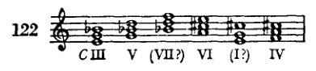
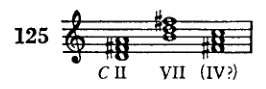
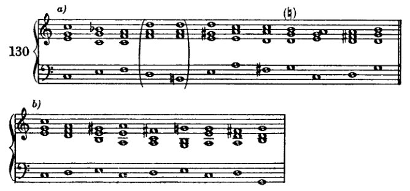
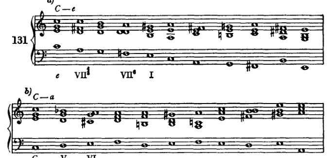
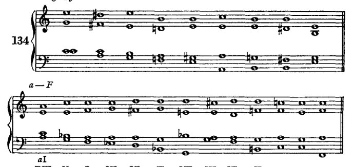
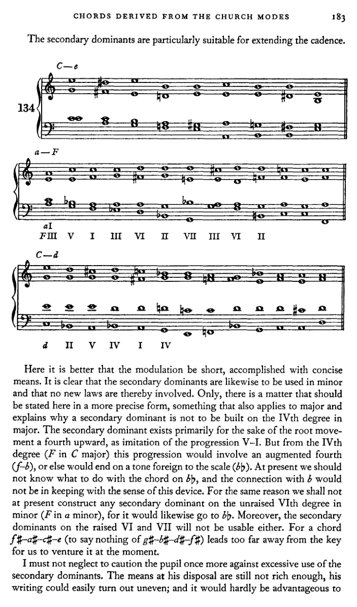
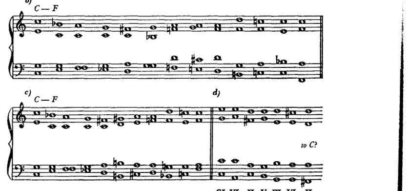
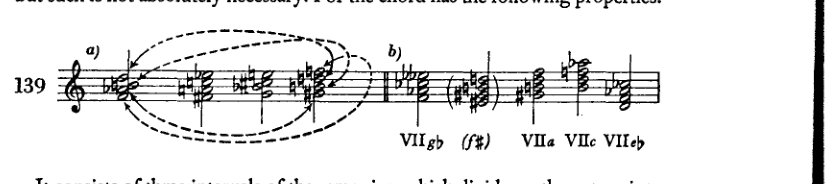

<!-- page 187 -->

# X 源自教会调式的副属和弦及其他非自然音阶和弦

我已经提到过教会调式的这一特性：即通过临时变音记号（升号、降号、还原号，它们临时且偶然地改变音阶中的自然音）在和声中产生多样性。[^1] 大多数教科书通常试图用一些与半音体系相关的说明来取代这种丰富性。[^2] 然而，这本身并非同一回事，而且由于不够系统化，对学生而言也不具备同等的价值。可以说，教会调式中所发生的一切是在没有半音体系的情况下进行的，是自然音阶式的；正如我们至今在小调中仍能看到的那样，上行时第六级和第七级音的升高与下行时降低的音一样，都属于自然音阶。现在，若将此应用于多利亚调式（以大调音阶第二音开始的教会调式，因而在*C*大调中以*d*开始），我们得到上行音*a、b、c#、d*，下行音*d、c、bb、a*。弗里吉亚调式（以第三音*e*开始）产生*b、c#、d#*（这种形式并不常用）以及*e、d、c、b*。在利底亚调式（从第四音*f*开始）中，纯四度（*bb*）与增四度（*b*）都可以使用；在混合利底亚调式（从第五音*g*开始）中，第七音（*f*）可以升高（*f#*）。爱奥利亚调式，即我们当今的小调，产生*e、f#、g#、a、g、f*。极少使用的下弗里吉亚调式的特征目前对我们来说没有意义。倘若我们的大小调确实包含了教会调式的全部和声财富，那么我们就必须以符合其意义的方式纳入这些特征。由此便可以在一个大调中使用所有出现在七个教会调式中的非自然音阶的音与和弦——这些调式是建立在我们大调音阶的七个自然音之上的。下面针对*C*大调音阶列出了对我们目前最为重要的这些非自然音阶的音与和弦。它们是：

源自多利亚调式：

源自弗里吉亚调式：

后者极少出现。

[^1]: 参见上文，第四章，第25、28页，及第五章。
[^2]: 此处，在一则长篇脚注中，勋伯格将自己的观点与里曼和申克尔的观点进行了比较。见附录，第427–9页。

<!-- page 188 -->

176  源自教会调式的和弦

**来自利底亚调式：**

这些也包含在多利亚调式中。

**混合利底亚调式：**

来自爱奥利亚调式的，就是那些我们已从小调中熟知的和弦。

当然，七和弦也是如此。

以此方式，我们追随了历史的演进，而这段历史在抵达教会调式时曾绕道而行。这使我想起我在[第25页]提出的假设，该假设将确定这些调式主音的困难视为这次绕道的原因。如果我们以一个低音强加其自身泛音、从而成为大调和弦根音的倾向为出发点，那么我们就能通过一条直接的路径，到达那条历史路径终将引领我们抵达的那一个点。仅凭这种方式，副音级上的非自然音大调三和弦就足以确立。此外，另一种常被提及的心理学解释本身也足以确立它们：即类比原则、模仿原则，它尝试将一个对象的特征转移到另一个对象上，例如，在小调中制造出升高的第七级音。在我们的研究过程中，当我们反复将那些在某一音级上（例如在第二级上）可能的东西转移到其他音级时，我们也将遵循这一原则。那些因回忆教会调式而引入的小三和弦和减三和弦，也可以用同样的方式推导出来。在所有这些推导中，不应忽视的是：这些和弦表面上是人为的，但由于它们在泛音列中有原型，因此仍可被认为是相对自然的。例如，在C的泛音中就包含e–g–b这个和弦，它诚然位置偏远；以及e–g–b♭这个和弦，它音不准；然而，尽管偏远或音准不准，两者都可以从自然的角度加以解释。然而，尽管存在此类解释的可能性，我之所以更倾向于走历史之路，首要是因为与小调——一种仍然活着的调式——的类比，非常适于指导我们处理这些和弦。

显然，我们可以通过半音体系来完成这一切（我们稍后也会这样做），也就是说，通过半音步进从一个自然音到达一个非自然音。就学生的技巧而言，效果可能是相同的；但是，除了这些联系确实也以这里所示的形式出现之外，半音程序将不那么全面，并且难以让人深入了解和声事件的历史发展及其内在联系（*Zusammenhänge*）。我们将首先走教会调式的道路，并暂时排除半音体系。因此，我们将或多或少地像我们应该处理它们那样来处理这些非自然音与和弦，如果它们属于一个

<!-- page 189 -->

源自教会调式的和弦 177

小调；因此，可以说，我们将遵循枢纽音的法则，并将其应用于我们升高或降低的那些音阶片段。那么很显然，例如，和弦 *a-c♯-e* 不会接在 *c-e-g* 和弦之后，*e-g♯-b* 也不会。[我们这样做] 当然只是暂时的——在最初的练习中。

通过这些变音记号的使用，我们得到以下和弦（例123中源自弗里吉亚调式的两个增三和弦暂且略去）：

1. 含有大三度（相当于教会调式的导音）的三和弦，位于自然音阶中本为小音程的音级上：即 II、III 和 VI 级（VII 级较少见；因为在音阶中它是减三和弦，需要同时升高两个音）。

这些是古老教会调式的属和弦。它们包含升高的（变化的）第七级音，即导音，它进行到第八级（主音 [*finalis*]）。更准确地说，II 级包含混合利底亚调式的导音，III 级包含爱奥利亚调式的导音，VI 级包含多利亚调式的导音，VII 级则包含弗里吉亚调式的导音（最后提到的那种形式很少使用，因为它很可能会取消与主音的关系）。这些和弦在教会调式中作为 V 级上的属和弦出现，而在我们的调性中，它们建立在副音级上；因此，我们称它们为*副属和弦*。* 当然，它们也可以用作七和弦，由此通过扩展，我们还可以将利底亚调式的属七和弦作为我们 IV 级上的副属和弦（例127）。

2. 一个大三和弦，*b♭-d-f*（源自多利亚或利底亚调式），然而它并不具备属和弦的性质。也许那不勒斯六和弦（稍后讨论）即源自这个和弦；
3. 一个小三和弦，*g-b♭-d*（源自多利亚或利底亚调式）；
4. 一系列减三和弦；

\* *Nebendominanten*（副属和弦）这一术语或许并非我首创，但（我记不太清了）大概是在与某位音乐家的交谈中产生的，当时我向这位音乐家提出了在副三和弦上构建属和弦的想法。我们俩谁先说出这个词，我不得而知，因此我认定*那并不是我*。

<!-- page 190 -->

178 源自教会调式的和弦

5. 最后，还有增三和弦。

所有这些和弦的处理都很简单，只要学生首先遵守枢纽音的规则。这意味着每一个非自然音都将被视为某上行或下行小调音阶的第六音或第七音。升高音属于上行，降低音属于下行。现在，根据该音是第六音还是第七音，它将随后接以全音或半音。因此，例如，*f♯* 可被视为 *g* 音阶的第七音，随后应进行到 *g*（也可能是 *e*；无论如何，*f* 不应出现在它之前）；或者它可被视为 *a* 音阶的第六音，接着 *g♯* 应随之出现。然而，也可以让这样一个音起初作为第六音出现，然后（通过重新解释）将其当作第七音来处理。*f♯* 可作为 *a* 音阶的第六音引入，但随后解决到 *g–b–d* 三和弦，这与其源自混合利底亚调式的背景相符。

为了不破坏平衡，学生不应使用太多这类非自然音和弦，尤其是在最初的练习中。如果出现了许多这样的和弦，它们至少必须后接一个同样丰富而精心设计的终止式。学生目前尚不具备实现这一目的的足够手段。还有一件事：如果学生想在转调中使用这些变化和弦，他只能将它们放在不会阻碍向目标进行的地方，就像那些需要排除的和弦一样。例如，如果要从 *C* 大调转到 *G* 大调，通过副属和弦 *c–e–g–b♭* 引入 *f–a–c* 和弦可能会造成干扰。当然，可以重新控制这种干扰，例如将这个 *f–a–c* 进行到 *e–g♯–b*，然后再导向 *a–c–e*（*G* 大调的 II 级）。然而，在学生对这些平衡问题有准确的感觉之前，他最好只使用那些即使无助于达到目标、至少也不会造成阻碍的和弦。不过，他最好将副属和弦用于终止式中，此时调性已经得到了明确的确立。

在例130*a*中，确实有一丝失衡的痕迹。*b* 音显得突兀。

<!-- page 191 -->

源自教会调式的和弦 179

人们本来更可能期待*bb*；毕竟我们一开始就力求使我们的转调能够不突兀而清晰流畅地从一个调滑向另一个调。

例130b中的解决方案更好。然而，如果我们仔细观察它，就会发现，按照先前的建议，我们其实早就可以写出这个进行：即，使用中介调（此处应为*a*小调）。我当初很不情愿地给出了涉及“中介调”这一术语的解释，因为在如此短的乐段中区分不同的调是不正确的。因此，正如我们例如不会把一个副三和弦称为*e*小调，而是称之为III级，在这里我们也宁愿不谈论调，而是谈论借助副属和弦来充实的级。一个级有时完全可以像对待一个调那样处理。但是，如果我们给每一个前面有属和弦的级都冠以调名，就会造成混淆，妨碍对整体及其内部关系的观察。例131中给出了一些转调，以展示这类变化和弦（即包含非调式音的和弦）的用法。

a) C—e
- 展示进行：*e* → VII# → VII° → I

b) C—a
- 展示进行：*C* → V → *a* I → IV → II

c) C—F
- 展示进行：FIII → II → II

d) C—e
- 展示进行：*e* → III# → VI → III → I

e) a—C
- 展示进行：*C* → II → I

<!-- page 192 -->

180 个源自教会调式的和弦

f) *a*—G

[乐谱：大谱表，高音谱号和低音谱号，一个升号的调号，标记为 "G II" 和 "II"]

g) *a*—*e*

[乐谱：大谱表，高音谱号和低音谱号，一个升号的调号，标记为 "e" 和 "IV"]

h) *a*—F

[乐谱：大谱表，高音谱号和低音谱号，一个升号的调号]

i) *a*—*d*

[乐谱：大谱表，高音谱号和低音谱号，一个升号的调号，标记有罗马数字：*a* I, *d* V, I, IV, III, VI, II, III, VI, II, V, I]

k) l)

[乐谱：两个并排的大谱表，高音谱号和低音谱号，一个升号的调号，标记为 "*a* V, *d* II"]

[注：例 131*k* 和 *l* 为修订版增补。]

在例 131c 的 × 处，一个副属和弦（位于 *F* 的 II 级上；当然，此处 *F* 大调已然生效）以欺骗终止的方式解决。这个 II 级上的副属和弦有一个名称，叫做属调的属和弦。我不清楚这个名称 [*Wechseldominante*] 从何而来，也不明白它的含义。¹

---

¹ 此处勋伯格在修订版中增加了一条脚注（附录，第 429 页）—— 一次对词源的探究。该脚注及其所附的句子均不见于第七版。]

<!-- page 193 -->

源自教会调式的和弦 181

但该和弦在终止式中充当自然音级 IInd 级的替代，通常以根音进行 II–I⁶₄–V–I；然而，重属和弦往往直接接以 V–I。

它最常用于五六或四三位置。不过，根音位置也确实经常出现。对我们而言，这里的新意仅在于，此处由*副属和弦*构成了类似阻碍终止（II–I）的进行。

当然，从其他副属和弦出发也可作此类连接。但学习者最好节制使用；否则他很容易写出许多虽非不可用，却不同寻常且与整体风格不协调的东西。

诚然，这仅作为一条规范，但如果说：副属和弦之后的阻碍终止，若转调并非借该阻碍终止完成，则显得柔和；而若由它们产生的转调未经准备，则显得生硬——这么说也未必十分离谱。柔和当然并非我们主要追求的目标，而生硬也不是我们主要要避免的东西。这些特性只不过表明了我们识别常见与罕见事物的方式。常见的东西听起来柔和，只因为它是常见的；而罕见的东西，在大多数情况下也仅因为罕见，所以听起来生硬。

当然，写出罕见的进行不可能成为我们的目标。在和声课与和声练习中，那几乎没有什么用处，因为我们无法借此使罕见的进行变成常见的。它们本可进入普遍用法的时代已经过去了。然而，即便它们如今竟要成为惯例，也只有当作曲家们采纳使用它们时才会发生。但这不大可能，因为我们已有其他更强有力的手段。再者：引入副属和弦是为了使每个音级都有一个属和弦先于它（根音上行四度）。但阻碍进行以级进、以二度移动，因而其导向与引入副属和弦的目的不相一致。

当然，若将属和弦的这一功能（即作阻碍进行）也应用于副属和弦，那固然是一种正确的类比（*Kombination*）。然而，这有些牵强，或许正因此而不太常见。这些阻碍进行确实会出现，但必须谨慎。由于它们过于牵强，也很容易导向过远的歧途。例133展示了在作此类连接时，为保持调性必须采取的做法。

在例131a中，第二个和弦（*a*上的四三和弦）可以被视为

<!-- page 194 -->

182 源自教会调式的和弦

作为属调的属和弦（*C*的II级）。那么接下来在*g*上的和弦就是*C*的V级。但后者也可能是*G*的I级；那样一来，转调在此处就已经发生了，而前面的和弦就会是*G*的V级，因此是属和弦，而非属调的属和弦。据此，第四个和弦必须被理解为带降低三音的V级，第五个和弦则为带升高三音的VI级。因此，*G*在此处会成为一个中间调，这一假设被证明是不切实际的。我们同样有理由将第六个和弦（*c*上的六和弦）视为*a*小调。那将是第二个中间调。因此，最好放弃借助中间调的解释方式，并将副属和弦与原调联系起来，只要尚未出现一列决定新调的和弦。例如，在133*d*中，确定这样的中间调会更加困难。第二个和弦，即*b*♭上的四三和弦，只能被联系到*d*小调，诚然，第五个和弦，即六三和弦*f*–*a*–*d*，也符合这种解释。但后者同样可以是*f*♯–*a*–*d*（133*g*），而这样一来，确定中间调就只有通过非常复杂的重新解释才可能实现。

<!-- page 195 -->

源自教会调式的和弦 183

副属和弦尤其适用于扩展终止式。

此处转调宜短，以简洁的手段完成。显然，副属和弦同样可用于小调，且不涉及新的法则。只是，有一件事应在此以更精确的形式加以说明，这也适用于大调，并解释了为何不能在大调的IV级上构建副属和弦。副属和弦的存在主要是为了根音上行四度的进行，以模仿V–I的进行。但从IV级（*C*大调中的*F*）出发，这一进行将涉及增四度（*f*–*b*），否则就会结束于一个音阶外音（*b*♭）。目前我们还不知道该怎样处理*b*♭上的和弦，而与*b*的连接也不符合这一手法的本意。出于同样的原因，我们目前也不在小调未经升高的VI级（*a*小调中的*F*）上构建任何副属和弦，因为它同样会走向*b*♭。此外，在升高后的VI级和VII级上的副属和弦也不可用。因为*f*♯–*a*♯–*c*♯–*e*这个和弦（更不用说*g*♯–*b*♯–*d*♯–*f*♯了）会使我们离调太远，此刻还不宜尝试。

我务必再次告诫学生不要过度使用副属和弦。他目前可支配的手段尚不够丰富，其作品很容易变得不匀称；而且这也几乎不会有什么好处，

<!-- page 196 -->

184 源自教会调式的和弦

不要为了包含大量变音副和弦而牺牲练习的流畅性。一般来说，我建议在一个包含十到十五个和弦的例子中，使用不超过三到四个副属和弦（等）。

我们也可以将几个副属和弦彼此连接，并与其他非自然音和弦连接。只是我们必须注意，这样做时不要离调太远。过度使用会产生多么糟糕的结果，如例135d所示。

这个例子中的所有七个和弦本身都可以是C大调的音级。但从第三个和弦开始（如果不是从一开始）它们很容易被理解为G大调，而从第四个开始它们就是D大调中的自然音和弦。这里出现了三个错误：(1) 这里使用的两个副属和弦都（如图所示）导向五级（C大调和G大调）。(2) 第三和第六和弦本身同时也被如此引入，仿佛它们自己也是五级。第三和弦前面是一个可以被视作G的II级的和弦，第六和弦前面是一个可以被视作D的II级的和弦：这正是转调或确立调性的方式。(3) 两个副属和弦彼此连接是危险的，因为两者都是大三和弦；因此，第二个和弦很容易听起来像主音。大三和弦作为对自然所赋予之物更近乎完美的模仿，具有更强的倾向去

<!-- page 197 -->

源自教会调式的和弦 185

比小和弦更能确立其主音地位，后者由于其不完整性，天然具有某种临时性。我们只有通过半音化地引入副属和弦才能克服这一缺陷，这将在下文讨论。以下说明可作为避免此类缺陷的准则：如果通过使用副属和弦，我们过于接近属功能区域，那么，由于借助副属和弦展开很容易暗示转调，最好立即转向下属功能区域。例如，如果我们过于突出 V 或 III，那么我们就经由 VI 转向 II 或 IV。相反，如果我们过于接近下属功能区域（II、IV），则必须设法回到属功能区域。

在学生先使用副属和弦而不带半音进行，仿佛恪守小调的自然音模式之后，他进而可以通过半音进行来产生它们。如此一来，使用它们的可能性便大为增加。此处应注意：将某音半音升高[或降低]的原因，在于获得一个上行或下行的导音。因此，升高的音应始终上行，降低的音应始终下行。只有当由此可以避免不良声部进行，或者无法以其他方式获得完整的和弦，并且该音处于内声部时，我才暂且允许从此导音跳离。除此之外，目前这种变化的目的应在声部进行中得以显现。出于同样的原因，某音的升高或降低应当可被识别为如此：升高或降低的音应直接与前面未经变化的音相连，也就是说，该升高或降低应在同一声部中相继出现。如果前和弦中有两个声部含有该音，那么只改变其中一个声部自然就足够了。另一个声部可以跳进离开。现在，我们在一定程度上可以绕开小调中枢轴音的规则。副属和弦等所提供的丰富手段使我们得以在终止式中恢复平衡。

Example 136a 展示了非自然音和弦的半音引入。这不会造成任何特别的困难。我们暂时仍将省略如 + 和 ++ 处那样的连接。建议遵循以下准则：I. 将半音进行以半音阶片段的形式，作为上行或下行的导音，旋律清晰地呈现出来。II. 由于它们具有旋律动力，最好将其交给外声部，即女高音或低音。低音声部尤其能从中获益，否则它常常会停滞不前。这种静止的低音也可以通过交换（其他转位）以及排列法的变化来避免。III. 这种副属和弦半音引入的目的与上述遵循枢轴音原则的处理方式相同。然而，半音引入具有这样的优点：它对调性的威胁较小；因为以这种方式到达的音很难让我们感觉是自然音，正如我们先前所断言的那样，属和弦永远不应通过半音化产生。因此，C 大调 VI 级和弦中的 c♯，凭借其

<!-- page 198 -->

186 源自教会调式的和弦

来自 *c* 的前引进行，将使我们不会把随后的 II 理解为主音（向 *d* 小调转调）。是的，即使这个 II 此时含有大三度，它也最多只是一个属和弦。因此，像例 135*d* 所展示的那种危险便很容易被排除了。

I. 副属和弦

[乐谱：例 136/a，包含 7 个带罗马数字分析的副属和弦进行的编号练习]

II. 增三和弦

[乐谱：3 个带罗马数字分析的增三和弦进行的编号练习]

III. 第 V 级上的人为小三和弦

[乐谱：展示第 V 级上人为小三和弦的练习，附罗马数字分析，包含 V, bV, VII, v, III, v]

IV. 人为减三和弦

[乐谱：4 个带罗马数字分析的人为减三和弦进行的编号练习]

V. 带人为减五度的七和弦

[乐谱：2 个带罗马数字分析的带人为减五度的七和弦进行的编号练习，包含 III, III⁷, V, III, VII, III 及 IV, IV?, II, IV, VII, IV]

<!-- page 199 -->

从教会调式衍生出的和弦 187

136b

C — d

d VII III IV

C — G

CI VI II III VI II
G

C — e

CI III
e VI I

C — a

CI V IV
a III VI

C — F

CI II
F V VI II

<!-- page 200 -->

188 由教会调式衍生的和弦

学习者在此处最好也不要尝试过多，以免过度劳累自己。节制\*地使用，这些手段非常有效；但滥用它们则是一种缺陷，因为即使它们也尚无法提供足够的多样性。

在从教会调式保留下来的其他和弦中，减和弦尤为有效。例如，*e–g–b♭*（或者更好，七和弦 *e–g–b♭–d*）作为 *C* 大调的 IIIrd 级，令人想起 *d* 小调的 IInd 级。因此，*a–c♯–e*（*d* 小调的 V），也就是 *C* 大调的 VI，便顺理成章地随之而来。其中一个小和弦也能产生同样的效果。例如，*g–b♭–d*：它令人想起 *d* 小调的 IV；随后是 *d* 小调的 V 或 VII，两者都可以进行到 I [*d* 小调]；这个和弦转而又是 *C* 大调的 II。然而，学习者不应将这些进行理解为仿佛其他调实际存在一般。我只想说明这些和弦多么适合用于引出副属和弦（此处为 *a–c♯–e*）。

为了使用现有这些新的手段，下面给出用法概要，以补充第 123–5 页所给出的指导原则。

---

## 指导原则

**I.** 只要根音进行允许，在任何可以使用音阶自然音级之处都可以使用副属和弦。依照副属和弦的本意，它们当然最适合出现在具有*类似属功能的根音进行之处，也就是说，按照 V–I、V–IV 和 V–VI 的模式。*因为其目的，首先就在于*通过人工导音来加强这种趋向属功能进行的倾向。*根音下行三度也经常完全可行，但它并不能提供任何显著的丰富性。根音下行四度同样会产生一些和弦连接，这些连接几乎只起经过和弦的作用（即旋律性的，就声部间距变化或转位交换的意义而言）。上行三度进行实际上毫无意义，而且在大多数情况下甚至不能被接受，因为它常常会引向尚未解释的和弦。同样的原因也排除了前述某些进行，正如说明七和弦的谱例所示（见 137A）。

---

\* 就此意义而言，这些说明性音乐谱例不应被理解为范本，因为它们是出于在尽可能小的篇幅内展示尽可能多的内容的意图而编写的。学习者可以运用所获得的指导原则来评估其因此产生的缺陷。

<!-- page 201 -->

*指南* 189

A. 副属七和弦

*a) 上行四度*

137 [含罗马数字的音乐记谱：I IV, II V, III VI, IV VI II, VII III]

*b) 上行二度*

[含罗马数字的音乐记谱：I II, I III, III IV, VI VII, VII I]

*c) 下行二度*

[含罗马数字的音乐记谱：I VII?, II I, III II, VI V]

*d) 下行三度*

[含罗马数字的音乐记谱：I VI, II VII?, III I, VI IV, VII V]

*e) 上行五度*

[含罗马数字的音乐记谱：I V, II VI, III VII?, VI III, VII II]

*f) 上行三度*

[含罗马数字的音乐记谱：I III, II IV, III V, VI I, VII II]

B. 人为增三和弦

*a)*

[含罗马数字的音乐记谱：I IV, I VI, I II, I VII]

*b)*

[含罗马数字的音乐记谱：IV VII, IV II, IV V, IV III]

*c)*

[含罗马数字的音乐记谱：V I, V III, V VI, V IV]

C. 五级上的人为小三和弦

*a) 六种根音进行*

[含罗马数字的音乐记谱：V I, V IV, V VI, V VI, V II, V VII, V III]

*b) 与人为减三和弦*

[含罗马数字的音乐记谱：V I, V IV, V V?, V III]

*c) 与含（人为）减五度的七和弦*

[含罗马数字的音乐记谱：V III, V IV, V VII]

*d) 与人为减七和弦*

[含罗马数字的音乐记谱：V I?, V — V?]

*e) 与人为增三和弦*

[含罗马数字的音乐记谱：V IV, V····V?]

<!-- page 202 -->

190

源自教会调式的和弦

D. 人为减三和弦

[乐谱：4 组五线谱，带有罗马数字分析标记]

1. III VI — III IV — III II — III I — III VII — III V

2. I IV — I II — I VII — I VI — I V — I III

3. IV VII — IV V — IV III — IV II — IV I — IV VI

4. V I — V VI — V IV — V III — V II — V VII

E. 五度人为减小的七和弦

[乐谱：多组五线谱，带有罗马数字分析标记]

1. III VI — III IV — III II — III I — III VII — III V

2. a) I — b) I

3. IV VII — IV V(II?) — IV V — IV III — IV II — IV I — IV VI

4. a) V — b) V

5. a) F) III? — b) VI — c) III — d) II — e) IV

6. a) VI — b) V — f) VI — g) II — h) III — i) IV — j) III — k) IV — l) III — m) IV — n) III — o) IV

II. *副属七和弦*可以出现在任何允许使用副属和弦且能够成功解决不协和音的地方。一般来说，它们比副属三和弦更能达到目的，因为七音通常会通过赋予方向性来增强属功能进行。

III. *人为增三和弦*应按照自然增三和弦（小调中的 III）给出的模式来使用。这个和弦当然可以在所有音级之前和之后出现，但其最重要的功能是 III–VI、III–I、III–IV 和 III–II，最后一种由于

<!-- page 203 -->

指导原则 191

复杂的声部进行。显然，可以跟随自然增三和弦的和弦也可以跟随人工增三和弦：副属和弦、人工小三和弦、人工减三和弦、含人工减五度的七和弦，以及人工减七和弦。*然而，增三和弦的主要目的是通过人工导音来为进行赋予方向*（见例137B）。

IV. 属音（V）上的*人工小三和弦*，如示例所示，特别适合进入下属功能区域（IV和II）。它也同样适用于引入更中性的音级——未升高的VI和升高的III，这在例137C（其中）*a*)项下由以V–II和V–III开头的进行展示，*c*)项下由以V–VII开头的进行展示。然而，如果我们将其V–I和V–IV进行解释为下属调（*F*大调）的II级，将其V–VI进行解释为某小调（*d*小调）的IV级，则会得到最常见的形式。（见例137C *a*)项及后续示例中的类似位置。）

V. *人工减三和弦*可以像大调中的VII级那样处理，或者——通常更好——像小调中的II级那样处理（几乎完全作为六和弦[例137D]）。然而，就几乎所有用途而言，通过添加七音获得的和弦比这些三和弦更可取，即：

VI. *含减五度的七和弦*。这些七和弦更为可取，因为对现代听觉而言，七音比减五度更能明确和弦的倾向与方向。最容易使用的是建立在III级上的那个，它靠近下属功能区域；它被插入终止式中（例137E–1）。其最常见的形式是那些引入II的进行（III–II、III–VI–II），在这些进行中它像小调（*d*小调）中的II级那样处理。如果用于引入IV，则说服力较弱，因为此时它像大调中的VII级那样使用（VII–I！）。建立在I级和V级上且含小七音的和弦目前对我们来说尚不可用，而另外两个（例137E–2*b*和4*b*）则是减七和弦，将在下一节中详细考察。建立在IV级上的那个令人联想到小调中的II级或VI级（*e*小调或*a*小调）以及大调中的VII级（*G*大调）。当它按照（*a*）小调中VI级的模式处理时，最适合融入终止式；而如果像（*e*）小调中的II级那样处理，则会对属音强调过度；如果像大调中的VII级那样处理，则因前述原因（VII–I！）而说服力较弱。

本章介绍的新手段对先前使用的和弦提出了两点补充观察。

I. 在终止式中*作为属和弦*（即作为倒数第二个和弦），我们只使用建立在V级上的大三和弦（也就是说，不是增三和弦），其大三度*并非*通过半音升高某音而获得。前面的、降低的七音（例如*C*大调中的*bb*）应作为下属特征音，首先像小调中的六级音那样向下解决。诚然，文献中有时可以找到不同的处理，但我们在此没有采用它的必要。

II. 我们现在有充分理由对某些自然音副七和弦的使用施加一些限制。在后续学习过程中，学生将越来越认识到，任何给定的和弦都可以具有多样的

<!-- page 204 -->

192 由教会调式衍生的和弦

功能，与其各种倾向相对应，因此，它并非明确无误，其意义仅由其环境决定。那么，如果我对这些副七和弦的使用加以限制，这样做是为了根据其最重要的倾向来使用它们。为此，我们可以确立以下原则：*每一个和弦*（若不受其环境阻碍）*都需要一种延续，这种延续类似于某个由完全不同的音构成、但具有相同音程的[原型]和弦的延续。*因此，大调中II、III和VI级上的七和弦的结构完全相同。现在，由于II级上的那个具有明确的、为人熟知的功能（II–V–I、II–I♯–V），耳朵因此会期待III和VI级上结构相同的那些和弦也具有相同的延续（例137F–*a*和*b*）。就这两个和弦而言，立刻就可以明显看出，其进行很难保持在调内。我们绝不应断定只有这种延续才是可能的；作为证明，我举几个例子来说明，这些和弦出现时，调性的命运绝非就此注定。尽管如此，这些例子中的用法不如遵循II级陈规的用法那样具有特征性。因此，我们可以看到，在例137F–*c*中，VI级上的副属和弦会比III级效果更好；在137F–*d*中，I级或III级上的副属和弦效果更好，而在137F–*e*中，II级上的那个效果更好；此外，在137F–*f*中，有向G大调转调的危险，但这当然很容易控制。由于这些和弦在其最具特征性的进行中尚且存疑，而在其他进行中又不明确，因此我建议在使用它们时极度节制——而且这一建议与文献中的用法是一致的。它们充其量仍可作为经过性现象（经过七和弦）具有一定的（旋律）价值。在其他情况下，最好根据所涉及的方向，用我们刚刚学过的、同级上的人工和弦来替代它们：副属七和弦、人工减七和弦等（比较例137F–*c*与*g*，*d*与*h*）。在剩余的副七和弦中，I级和IV级上的那些具有相同的结构。它们也大多只能用作经过。但几乎总是，I级的副属七和弦显然比自然七和弦效果更为明显（比较137F–*i*与*k*）。VII级上的副七和弦太容易使人想起小调中II级上的那个（七和弦），以至于我们难以轻易以其他方式使用它（137F–*m*和*n*）。学生可以轻易地将完全相同的原则应用于小调中的自然副七和弦，并且同样会相应地将自己对这些和弦的使用限制在具有特征性的范围内，对无特征性的用法进行适当的替代。

关于减七和弦

按照先前的步骤，将非自然音和弦系统地引入调内，还可以通过尝试将减七和弦也移植到它不会自然出现的地方来继续进行。首先我们

<!-- page 205 -->

减七和弦 193

应将其置于那些令人联想到小调VII级的音级上，也就是说，其根音（如同小调音阶的第七音一样）上行小二度至音阶下一个自然音级的根音。在大调中，这些音级是III级（在*C*大调中为*e*）和VII级（*b*）；在小调中，是II级（*a*小调中为*b*）、V级（*e*）和VII级（*g♯*）。这样我们就得到了两个和弦（除小调VII级上那个我们已经熟悉的之外）：*e–g–b♭–d♭* 和 *b–d–f–a♭*。那么我们当然也可以包含根音的变化，因为它们确实出现在副属和弦中，而在那里它们实际上是七音。例如，这些变化音可以这样使用：在*c♯*上（*a*的副属和弦的三音）构建减七和弦 *c♯–e–g–b♭*，或在*d♯*上（*b*的副属和弦的三音）构建减七和弦 *d♯–f♯–a–c*，等等。但是，假设根音的升高（或降低），或用这种升高或降低后的音来替代根音，这是值得怀疑的，因为这种假设离原型——即基音上的泛音三和弦——太远了。这一反对意见也适用于前面所示某些减三和弦的推导。它解释了为什么这些和弦不具有完整和弦的意义，并支持了省略根音这一观点。在我看来，这一观点在这里再次更为贴切，且蕴含更为丰富。减七和弦最重要且最简单的功能，也就是说，并非通过根音上行四度（VII到III）来解决，而是以欺骗终止的方式解决：根音上行一步（VII到I）。¹ 它以此功能最为常见。然而，理论既然已将根音上行四度认定为最简单、最自然的进行，就不能承认此处根音上行二度是最自然的。因此，更好的做法是将这个和弦的解决也追溯到根音上行四度，方法是假设减七和弦是一个省略了根音的九和弦。也就是说，例如：以*d*音为根音，构成一个（副）属和弦 *d–f♯–a–c*，并加上小九度*e♭*；或在*g*上构成和弦 *g–b–d–f–a♭*，在*e*上构成 *e–g♯–b–d–f*，等等。

这样得到的九和弦的根音（*d*）被省略，剩下减七和弦 *f♯–a–c–e♭*。现在，如果这个和弦（作为准VII级）进行到 *g–b♭–d*（准VIII级），或者，如果它来自副属和弦，则进行到 *g–b–d*，那么被省略的根音*d*实际上确实给了我们上行四度的根音进行。这一解释与我们对于欺骗终止的理解相符，并且是以三度叠置原则构建和弦的概念体系的逻辑延伸：通过在七和弦上再叠加一个三度而达到九和弦。

> [¹ 参见上文，第113页，以及第136页起，“欺骗终止”。]

<!-- page 206 -->

194 源自教会调式的和弦

这样我们可以在大调和小调的所有音级上获得非自然音的减七和弦。只有那些（省略的）根音向上四度进行不到达自然音的音级才应被*暂时*排除：例如，大调的IV级，在*C*大调中是*f*，它将不得不进行到*bb*；或者在*a*小调中，IV级是*d*，作为VII的*g#*应该接在后面。稍后，当我们讨论了那不勒斯六和弦并且在使用减七和弦方面更加熟练之后，这些进行也将可行。

减七和弦完全可以毫无准备地使用。诚然，通过级进或半音化的声部进行引入它是好的，但这并非绝对必要。因为该和弦具有以下特性：

它由三个同样大小的音程组成，这些音程将八度划分为四个相等的部分，即小三度。如果我们在其最高音上方或最低音下方再添加一个小三度，和弦中不会出现新的音响；所添加的音只是已在高八度或低八度出现的某个音的重复。这种八度划分可以从半音阶的任何音开始。但是，前三个半音相邻的低音就能产生所有可能的减七和弦音响。例如：*f、ab、cb、d*，然后是*f#、a、c、eb*，以及*g、bb、c#、e*；下一个从*g# (ab)*开始的划分产生与从*f*开始的相同的音，即*ab、cb、d、f*，而从*a*开始的划分给出*a、c、eb、f#*，以此类推。因此，就音响和构成音而言，只有三种减七和弦。然而，由于有十二个小调，每个减七和弦作为VII级，必定至少属于四个小调。因此，音响*f–ab–cb–d*可以表示（例139b）：在*gb (f#)*小调中为VII级，如果*f (e#)*被视为根音；在*a*小调中为VII级，如果*g#*是根音；在*c*小调中为VII级，如果*b*是根音；在*eb*小调中为VII级，如果*d*是根音。或者如果将其解释为省略根音的九和弦，则在这些调中是V级。（显然，记谱方式必须根据和弦的解释而改变，*b*要写作*cb*，*g#*要写作*ab*等。）因此，它的每个音都可以是根音，从而每个音也都可以是三音、减五音和减七音。如果我们转位该和弦，不会出现新的结构模式，这与大调或小调和弦的转位不同；我们仍然总是得到小三度（增二度）。因此，当减七和弦脱离上下文或出现在模糊语境中时，它将属于哪个调是不明确的。它的*g#*可以是*ab*，它的*b*可以是*cb*，等等，只有从后续部分才能弄清某个音是否是导音，以及它是上行还是下行。耳朵无法更早做出判断，并且易于适应任何解决，这使得减七和弦之后可以出现其他不同于其引入所暗示的延续。例如，一个包含*g#*的减七和弦可以接在一个包含*g*的三和弦之后。但是*g*并不一定要进行到*g#*，

<!-- page 207 -->

*减七和弦* 195

因为耳朵随时准备将其听成 *a♭*；然而，尽管有此听感，耳朵终究允许同一个音被当作 *g♯* 来处理，并继续到 *a*。因此，关于假关系的规则在一定程度上可以为减七和弦而放宽。尽管如此，我们在这里也不会做不必要的跳进，而是将所有有可能之处都以旋律性方式呈现（即近似音阶）。

这个音响 *b–d–f–a♭* 可以作为省略根音的九和弦，用于以下调性：

| | III | V | | 的 | *C* 大调。 |
| I | | | VI | | *C♯ (D♭)* 大调。 |
| | II | | | VII | *D* 大调。 |
| | | III | V | | *E♭* 大调。 |
| I | | | VI | | *E* 大调。 |
| | II | | | VII | *F* 大调。 |
| | | III | V | | *F♯ (G♭)* 大调。 |
| I | | | VI | | *G* 大调。 |
| | II | | | VII | *A♭* 大调。 |
| | | III | V | | *A* 大调。 |
| I | | | VI | | *B♭* 大调。 |
| | II | | | VII | *B* 大调。 |

| | | V | | VII¹ | *c* 小调。 |
| I | | III | | | *c♯ (d♭)* 小调。 |
| | II | | (VI) | | *d* 小调。 |
| | | | V | VII | *e♭* 小调。 |
| I | | III | | | *e* 小调。 |
| | II | | (VI) | | *f* 小调。 |
| | | | V | VII | *f♯ (g♭)* 小调。 |
| I | | III | | | *g* 小调。 |
| | II | | (VI) | | *a♭* 小调。 |
| | | | V | VII | *a* 小调。 |
| I | | III | | | *b♭* 小调。 |
| | II | | (VI) | | *b* 小调。 |

稍后，它还可以作为[未经升高的] VI 级和弦出现在 *d*、*f*、*a♭* 和 *b* 小调中（括号内），以及作为 IV 级和弦出现在 *D*、*F*、*A♭* 和 *B* 大调与小调中。但即使现在，我们已经有四十四种解释可用。后面将会看到[第十四章]，这个和弦与各调性的关系还要丰富得多；它实际上不属于任何一个调，不是任何调性独有的财产；可以说，它有权居住在任何地方，却又不是任何地方的永久居民——它是一个世界公民，或者一个流浪汉！正如我已经提到的，我把这样的和弦称为*游移和弦*。这样的和弦并不专属于某一个调；相反，它可以属于许多调，实际上属于所有的调，而无需改变其形态（甚至不需要转位；只要假设它与某个根音有关系就足够了）。

[¹ 小调中自然的、未经升高的 VII；因此，在 *c* 小调中为 *b♭*，在 *e♭* 小调中为 *d♭*，等等。]

<!-- page 208 -->

196 从教会调式衍生的和弦

此外，我们稍后将会学到，几乎所有的和弦在一定程度上都可以被当作游移和弦来处理。但是，真正游移的和弦与那些我们只是通过人为手段使其游移的和弦之间，存在着本质的区别。前者天生就是如此。它们的内在结构从一开始就清楚地表明它们与后者不同。这一点在这里已经通过减七和弦得到了明确的证实——减七和弦完全由小三度构成——稍后还将通过增三和弦得到进一步证实。游移和弦最显著的特征，是这些和弦与那些代表泛音列最简单模仿的和弦之间的一个重大差异——完全五度的缺失。值得注意的是：游移和弦并非直接通过自然途径出现，然而它们却实现了自然的意志。实际上，它们只是从我们的调性系统的逻辑发展、从其内在含义中产生出来的。它们是近亲繁殖的产物，是该系统法则之间的近亲繁殖。而恰恰是这些系统的逻辑后果，却成了系统本身的毁灭因素；系统的终结由其自身功能以如此不可逃避的残酷方式带来，这让人想到死亡是生命的必然结果。那些服务于生命的汁液，同样也服务于死亡。而恰恰是这些游移和弦，不可阻挡地导致了调性的解体，这一点在接下来的论述中将变得十分清楚。

我们不会使用减七和弦来进行向更远调性的转调，而只是用它来使道路更为顺畅，并促进那些否则听起来生硬的连接的平滑性。我们必须处处密切注意：减七和弦可能具有相当大的影响力，能够使一段音乐听起来平淡，甚至软弱。因为它作为*转调发动机*（Modulationsmotor）的决定性影响力，与其说是来自它自身离调的力量，不如说是更多地来自它那种不确定的、雌雄同体的、不成熟的特性。它本身是犹豫不决的，它有多种倾向，任何事物都可以压倒它。正是这一点构成了它的特殊影响力：谁想要成为调停者，他本人就不可以过于确定。然而，如果使用得当，减七和弦仍然能够发挥出色的作用。

有一条规则我们必须严格遵守：我们不会像通常那样使用减七和弦，把它当作药柜里的万灵药，例如阿司匹林，包治百病。对我们来说，它毋宁说是省略根音的九和弦，永远只是某个音级的特殊形式。只有在根据我们使用该音级的标准——未经改变的、作为副属和弦的、或以其他方式变化的——也能使用这个音级的地方，我们才在适当的情况下写减七和弦。首要的和最终的、决定性的考虑仍然是根音进行。学生应当据此来草拟他的练习；而关于某个进行用这种形式还是那种形式更好，用副属和弦还是减七和弦或其他手段来执行更好，这属于他思考中的第二阶段。

在例140A中，减七和弦与所有音级相连接。这些连接的许多方面毫无价值，另一些则是多余的。学生的注意力将被引向许多增音程或减音程的跳进

<!-- page 209 -->

*减七和弦* 197

[音乐记谱：例140A，七行五线谱，展示和弦进行及罗马数字分析]

音程（例140A * 处）。它们在此处失去了某些可疑的性质；因为这些音程往往几乎是不可避免的，而减七和弦的等音可能性也缓和了它们的生硬感。

在例140B中，和弦 f♯–a–c–e♭（或 d♯）以四种不同的方式使用，每次都进行到不同的和弦。在 *a*) 中，它是 VI，与 II 相连；在 *b*) 中，它是 V，进行到 I；在 *c*) 中，III 到 VI；而在 *d*) 中，VII 到 III。在 *a*) 中，*F* 调 II 级上的减七和弦 b–d–f–a♭（在 † 处）与 *F* 的 I 级相连。这个减七和弦在此当然被标记为 II 级（假定根音：g），它引入了 I 的六四和弦。然而，a♭ 却进行到 a，按照我们以前的观念，这条路径只有 g♯ 才能走；a♭ 本来应该进行到 g。但如果我们把 a♭ 写成 g♯，忽略该和弦的派生关系，并假定我们拥有的是 *F* 大调 VII 级上的九和弦（省略根音），那么进行就成了 VII–I⁶₄。这是一个不大可能的假设，因为 VII 级已被证明（如 240f. 页所示）不适于引入那种特定的、终止式的六四和弦。此外，它

<!-- page 210 -->

198

源自教会调式的和弦

[乐谱：a) C—F 转调，带有数字低音分析，显示 CI, FV, VI, II, III, VI, II, I, V, I]

[乐谱：b) C—G 转调，带有数字低音分析，显示 CI, GIV, II, V, I, III, VI, II, I]

[乐谱：c) C—G 转调，带有数字低音分析，显示 CI, GIV, VII, III, VI, II, I, V]

[乐谱：d) C—d 转调，带有数字低音分析，显示 CI, d, VII, III, II, V, I, IV, I, V, I]

[乐谱：e) a—G 转调，带有数字低音分析，显示 aI, GII, III, IV, V, I, II, V, I, IV, II, I⁴, V, I]

[乐谱：f) a—F 转调，带有数字低音分析，显示 aI, FIII, II, V, II, III, VI, II, V, I]

<!-- page 211 -->

减七和弦 199

这显然不是VII而是II，该问题可作如下解释：倘若减七和弦之后直接接V和弦，且省略I的六四和弦，那么它是否为II的一切疑问都将消除；若同名小调——*f*小调——在同样条件下处理，这一点就更加显而易见。在小调中，即便I的六四和弦紧随减七和弦之后，将其定为第二级也是无可争议的。有这三个类似情况作为支持，我们这里也必须认定，[除了]根音进行[向上四度]外别无其他。那个以*a♭*进入的音被当作*g♯*来处理，其理由在于减七和弦所有音天然具有的模糊性，以及它们由此倾向于等音变换。*a♭*作为II的九音而出现，在听觉上与*g♯*无异，而且表现得仿佛它来自*F*大调的VII。因此，一方面，从派生关系上，它获得了成为根音进行（II–I♯）一分子的权利；另一方面，从实际音响的模糊性上，它又获得了作旋律级进的许可。

例141*a*说明了隐伏根音最常见的三种进行：向上四度、向上二度、向下二度。我们可以通过声部的运动来区分它们。向上四度跳进时，四个声部全部运动（解决和弦完全由新音构成）；而

<!-- page 212 -->

200个源自教会调式的和弦

阻碍终止的上行二度进行中，两个和弦有一个共同音，其余音进行；下行二度进行中，有两个音保持，仅有一个音是新的。因此，区分这两种进行并不困难。学生应当知道自己在连接哪些音级。只有在这种情况下，才有可能给出指导，以确定音级进行的结构价值，并对进行的功能与效果做出判断。如果我们忽略对音级的参照，那么我们只剩下一堆个别案例，且必须对每个案例单独做出判断。抛开理论不谈，牢记音级究竟有何价值，只有当学生能够亲自承担起构建一个将作为和声变奏基础的模式的责任时，才能真正领会。

在例141a中，那些不解决到调内和弦的解决被省略了。它们暂时还无法使用。

例141b展示了使用一个或两个和弦转位的连接，包括阻碍终止。它们都效果很好，日后还会变得更加自由。其中只有两个连接是学生不应使用的：即标有 ⊗ 和 † 的那些。这些为何被排除，将在后文说明（第240页及后续）。在标有 § 之处，六四和弦以跳进方式到达。这【表面上的规则例外】因前述那种老生常谈式的惯用法而具有合理性，尤其适用于 I 的终止式六四和弦。

<!-- page 213 -->

准则 201

准则

*减七和弦的使用*

I. 减七和弦，作为某一音级上省略根音的九和弦，只能出现在该音级以其他形式也同样适用之处，并且该和弦中的非自然音能够按导音所要求的方向进行。（这似乎与此前赋予该和弦的运动自由相矛盾。但事实并非如此。这仅仅是为了让学生意识到：每当导音的方向无法得到遵循时，他所处理的便是另一个音级的进行，而非他所假设的那一个。因为我们目前只允许在刚刚讨论过的情况下作等音变换：大调中II级上的减七和弦[九和弦]连接I级的六四和弦。）

II. 它可以替代属七和弦或副属七和弦的所有功能，只要其后的和弦处于我们目前所知的调性范围之内（见例141a）。此外，这是它目前最重要的功能。在这一功能中，它具有极大的价值，因为它能缓和许多生硬的进行，特别是在存在假关系危险以及枢纽音出现意外问题之处。有两种连接值得特别提及：其一在例140A第3节**处，其中减七和弦在I级的终止六四和弦之后引向终止于VI或IV的欺骗性终止；其二在例141c中，该和弦作为II级发挥其功能，以引出同一六四和弦。这两种都是相当常见的用法。
