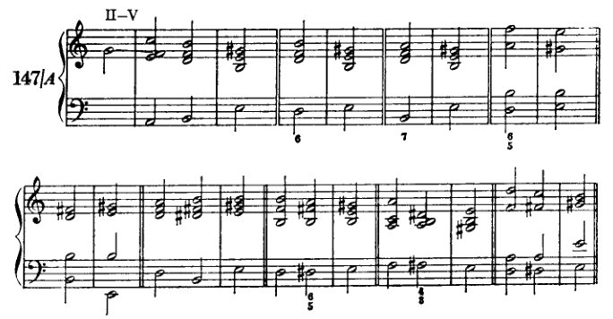
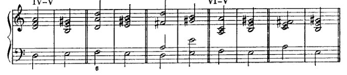
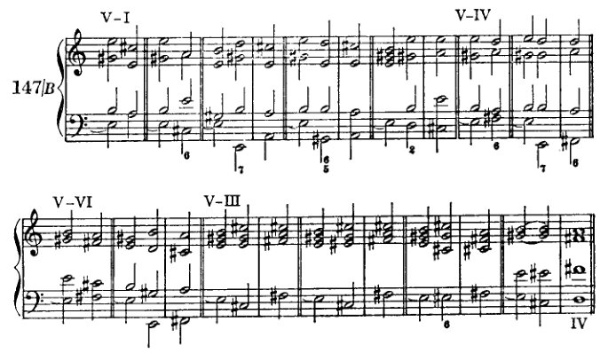
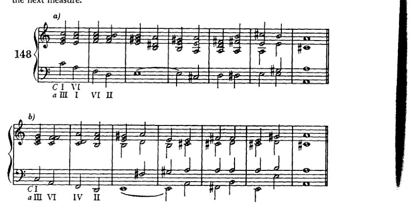
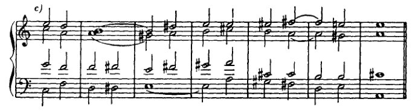
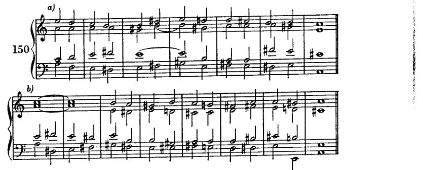
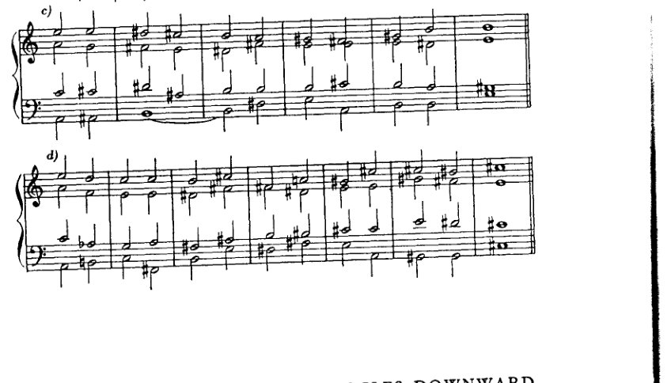
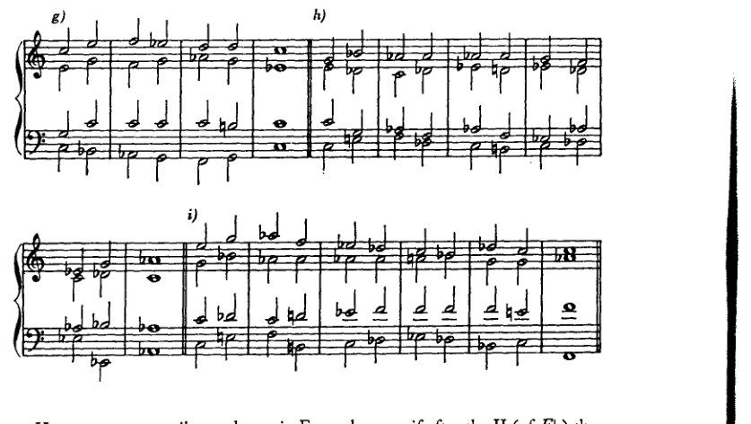

<!-- page 219 -->

XII 转调：续篇

由于向第二五度圈[*D*、*b*、*B♭*、*g*]的转调建立在比向第三、第四圈更疏远的关系之上，因此更为复杂。故而，我们将先处理后者，前者则暂缓讨论。

从*C*大调和*a*小调出发，第三圈向上的调为*A*大调和*f♯*小调，第四圈向上的调为*E*大调和*c♯*小调；第三圈向下的调为*E♭*大调和*c*小调，第四圈向下的调为*A♭*大调和*f*小调。*

---

向第三、第四圈向上转调

向第三、第四圈向上转调的最简单方式建立在*同名调关系*（*a*小调 – *A*大调，*e* – *E*，等等）之上。** 这种关系建立在主音与

---

\* "向上"的意思是：升号增多或降号减少的方向；"向下"的意思是：升号减少或降号增多的方向。当然，有时我们需要将*G♭*大调视为*F♯*大调，*C♭*视为*B*，*D♭*视为*C♯*。因此，*D♭*大调在向上绕圈中距*A*大调四步，向下则距八步。[*见前*，第155页。]

\*\* 这种方法在古典文献中出现得如此频繁，尤其当大调为目标调时，以至于我们必须将其视为最重要的方法。在那里，它主要服务于通过迂回路径导向新调，例如在过渡段落和所谓的"回归"中。这种方法的优势在于，通过同名小调的 visit，听觉为即将引入的大调主音做好了准备，然而当大调最终出现时，我们仍能确保获得调式变化所能带来的尽可能多的意外感。有所准备，却又令人惊喜；有所预期，却仍是新颖；这正是听众的感知能力与品味所要求的，任何艺术家都无法完全逃避这一[要求]。然而这里潜藏着一种自我欺骗：听众只想要他所预期发生的事情，即他能够猜测和预测的事情；但他又希望被惊喜。是对成功预测的自豪，这种因摇摆不定的自信之正当怀疑而增强的自豪，是否是预期之出现被视为如此惊喜的原因？无论如何，应当记住，听众即使在新的作品中也期待这两项要求的实现。他想要新的艺术作品，但只想要他所预期听到的；而他从根本上所预期的，乃是旧元素的新编排。但并非完全崭新的编排；且这些元素也不可过于陈旧。"现代，但不可*超现代*"——懂得玩弄这套戏法的艺术家能在短时间内满足公众，使其免于对立愿望的困境；但不久之后公众便对这些艺术家感到厌倦，从而间接证明，它确乎具有某种对优良事物的本能，即使它几乎只将这种本能用于反对优良事物。

<!-- page 220 -->

208

转调：续

大调与小调的属和弦是相同的；这个属和弦在特定条件下允许被重新解释。例如，*E–g♯–b* 是 *a* 小调和 *A* 大调的属和弦。如果这个和弦单独发声，那么小调或大调都可以紧随其后，两者皆有可能；如果它来自小调（作为 *a* 小调的 V），那么任务就在于压制并消除小调的特征，并将这个属和弦设置成可以自由转向小调或大调的状态。转向大调的可能性还因每个三和弦——尤其是具有属功能特征的三和弦——所固有的、通过根音向上四度进行而解决到大三和弦的倾向而得到进一步支持。因此，正如前面所说，这个三和弦似乎无视了调式的界限，并唤回了它自然的协和音响。

因此，显而易见的是，这种将小调（*a* 小调）转换为同名大调（*A* 大调）的程序，也可用于*从该小调的关系调*（*C* 大调）进行转调，或*转调到该大调的关系调*（*f♯* 小调）。关系大调与小调之间的关系已经多次被讨论过。*C* 大调可被视为 *a* 小调未升高音级所在的区域。如果将 *C* 大调的五级和四级——即交叉关系——当作小调中具有枢纽作用的自然七级和六级，那么距离 *a* 小调特征性的升高六级和七级就只有一步之遥。而在转向大调之后，*A* 大调也可通过同样的程序转换为 *f♯* 小调。当然，这种从 *C* 大调到 *A* 大调或 *f♯* 小调、或从 *a* 小调到 *f♯* 小调的转调程序，也可以描述为从 *C* 大调经由 *a* 小调到达 *A* 大调，经由 *a* 小调和 *A* 大调到达 *f♯* 小调，或从 *a* 小调经由 *A* 大调到达 *f♯* 小调。但这里绝不需要假设中间调；正如我先前解释过的，我建议将先于 *a* 小调的 *C* 大调解释为无特征的 *a* 小调，将 *f♯* 小调之前的 *A* 大调解释为无特征的 *f♯* 小调。应当注意将枢纽音级中立化，并且从未升高音级区域到升高音级区域的过渡，应当始终像我们先前从 *C* 大调转调到 *a* 小调时那样实现。

向上第四圈（从 *C* 或 *a* 到 *E* 或 *c♯*）的转调建立在同一原则之上：即将 *e* 小调转换为 *E* 大调。在这里，假设一个中间调 *e* 小调具有更多的依据。那么，这就是一个向上第一圈的转调，再加上一个向上第三圈的转调（1 加 3 等于 4）。然而，由于 *e* 小调的转调属三和弦可以是 *C* 的 VII 级上的副属和弦，或 *a* 的 II 级上的副属和弦，而且，此外，正如我们从 *C–e* 和 *a–e* 的转调中已经知道的，重新解释可以从第一个和弦就开始（*C* 的 I = *e* 的 VI；*a* 的 I = *e* 的 IV），所以，这里对中间调的这种辅助性概念也并非绝对必要。

我们的任务分为三个部分：

1. 引入新调的 V，首先作为同名小调的 V。此处还包括所有必要的未升高音级的中立化。

2. 将这个小调的属和弦转换为大调的属和弦，也就是说，为其重新解释做准备。

<!-- page 221 -->

*向第三与第四圈上行* 209

3. 解决到大调，如愿意，还可进一步转入其关系小调。

随后如常出现终止式。

我们将首先讨论*属音的变形*。最简单的方法是将其保持足够长的时间，以使其源自小调的渊源被淡忘，例如，借助一个延长记号。事实上，这种手段在古典作品中相当频繁地被用来取消先已确立的义务。同样，长时休止的效果在于由如下疑问所造成的悬念：既然与之前不同，现在将会发生什么？因为确实可能发生不同的事情。然而，此处不能采用这种方法，因为我们目前所能达到的意外之贫乏，只会夸大其相对的天真（它现在显得天真，是因为已被用滥了）。我们不用它的另一个原因是，我们这里并不想借助表演上的细微差别来制造效果，而只想通过和声手段。因此，我们这里宁可采用一种类似手法的两种形式：即（1）*持续声部*，尤其是其特殊情形——*持续音*。借此，作为保持整个和弦的替代方案，为了体现整个被保持的和弦，只有一个音——最重要的——即*根音*，保持不动，而其他声部则配以适当的和弦进行。以及（2）我们将采用反复*经过属音*。

此处的*持续声部*不同于最简单和弦进行中相当常见的将一个或多个声部保持较长或较短的时间；因为在这里，其他声部所构成的和弦中，被保持的音几乎难以被视为其中的一个成分。因此，这些和弦也可以与被保持的音形成不协和。通常持续的是主音或属音（包括副属音）的根音或五度音，但在某些情况下也可以是三度音。当被保持的音是低音时，持续声部即称为*持续音*（一般来说——且在本书此处，总是——它也就是根音）。持续音主要用以延缓或压缩运动。凡是在离开某一段落的和声之前希望将其收束，例如在呈示部中，或在一个决定性的转折点之前加以明确，例如在再现部之前，正如‘属音的强化’中所示——在这些时候，持续音是一种正当、有效且常用的手段。另一方面，当持续音并非为了暗示民间音乐、作为民间音乐的准引用、作为民间音乐的准引用而引入时，那种单调持续的用法在艺术上是肤浅的，主要源于懈怠的和声思维以及写作有条理的低音线条之无能。此处关于持续声部和持续音的重要法则涉及其进入与离开。（1）*进入*，持续音的开始应发生在强拍上，即第一拍。（2）持续声部在*进入点*及*离开前*应是协和的。（3）离开应发生在弱拍上。（4）其间的和弦当然应自身形成合理的进行，并且应当最为密切相关。

学生应严格遵守此处给出的节奏规定。因为

<!-- page 222 -->

210

转调：续

由于我们不关注节奏效果，节奏上的偏离对我们来说也几乎没有什么价值，尽管这些规则显然过于束缚，作曲家们经常无视它们。在我们为其选择的简单方案中，这种形式的执行仍有足够的变化可能性，使我们能够充分利用目前掌握的手段。我们不会写长而持续的踏板音，而只是满足于暗示其功能。对我们的目的来说，最重要的是要重新解释的那个属音出现两次，在踏板音的开始和结束处。将它放在这两个位置，我们最好地满足了持续声部在这些地方必须是协和的条件。这种重复是一种强化，使我们忘记了它来自小调；因为重复增加了属音本身的"重量"，而这种增加有利于它转向大调的能力。在这个过程中，耳朵在任何时候都不会忘记正在发生的事情——持续声部确保了这一点。一般来说，我们只在踏板音的开始和结束之间放一个连接和弦，这样整个结构将由三个半音符组成。因此，在第一拍（见例144）上是V，

第二拍上是连接和弦，下一拍上又是V，但尽可能用不同的排列（变奏）。在考虑为连接和弦选择哪些音级时，我们首先应排除那些使重新解释变得困难的音级。它们是那些更接近*a*小调而非*A*大调的音级，即包含主音小三度的音级：*a*小调的I、III和VI；以及那些仍然属于*C*大调区域、需要半音进行的音级（144*d*和144*e*），因为属音不应该通过半音方式产生。

然而，如下一章所示，与小调的关系

<!-- page 223 -->

上行至第三与第四圈 211

下属音的特性在于使主音得以保持控制；而且由于属音转向大调的趋势足够强烈，即使 I 和 VI 也不会造成太大损害。但更为有利的是选择和弦，例如副属和弦、人工减三和弦，以及那些无论是在 A 大调还是 a 小调中都同样适用的七和弦。这类和弦即 II 级作为属和弦的属和弦（b-d♯-f♯-a）以及减七和弦（d♯-f♯-a-c）。当然，在此处小三度 c 不会造成困难。此外，a 小调中 II、IV、VI 级上带有升高六级音的和弦也适用，即使它们包含 c。这个 c 是一个不协和音，无论如何都必须下行解决到 b（144k）。例 144b 之所以应被排除，其根音进行（III–V）已清楚表明；而在 144c（VII–V）中，VII 是一个减三和弦，需要不同的处理。

现在我们必须考察根音进行。只产生强进行的音级仅有 IV 和 VI（145e–h：V–IV–V 与 V–VI–V），而使用 I 与 II 时（VII 与 III 应予以省略）则每次都会出现下行进行（145b、c 与 i）。这显然并无坏处，尽管 I 的用处不大，因为它在离开持续音时会以大调形式出现。在 145e、f 等例中，会出现声部进行上的困难，导致减音程或增音程无法避免。a 小调中七级音与六级音的下行进行（145g 与 h）很容易

<!-- page 224 -->

212 转调：续

如果将这几个和弦已经视为*A*大调，则这是可以解释的；尤其当[属和弦、持续音]是通过重属和弦或类似方式引入时，这种解释尤其具有合理性。最为恰当的是那些V级和弦音由不协和音处理所产生的进行中浮现出来的形态。若连接和弦为七和弦，则它不能是完整的。应确保通过特征音——根音、七音，以及（如适用）减五度——来表达该不协和音。

在所谓的“停留于属和弦”¹中——也就是说，通过上方声部中的*持续声部*进行重新解释——以及在所谓的“经过属和弦”¹中，其处理方式与处理持续音时应遵循的考量相同。

这些形态与持续音之间的区别主要在于：持续声部是低音以外的声部（146*a、b、c、d、e*），因此或许会避免过于刺耳的不协和音；而在经过属和弦（146*f*和*g*）中，声部的保持则完全可以省略。此处建议使用级进的声部进行，由此连接和弦部分地通过经过音、通过旋律运动而获得合理性。V级和弦在此也可以六和弦的形式出现，无论是第一次还是第二次。重属和弦及其派生形态在此处效果很好，因为它们几乎能赋予属和弦以主和弦般的分量。这种处理通常是有利的。尤其在像此处这样，需要使该和弦引起高度注意时，这样处理是妥当的——我称此为*将和弦当作主和弦来处理*（*tonartmässig ausführen*）。

我们关于属和弦第二次出现的论述当然也同样适用于第一次。因此，引入属和弦所使用的和弦，应与连接两个属和弦时所用的相同。对此类……的总结

[¹ “Verweilen auf der Dominante”与“Durchgehen durch die Dominante”。]

<!-- page 225 -->

*上行至第三与第四圈* 213

可能性如例147A所示。（不适用的和弦已在例144f–i中标出，其中已解释了它们为何不适合这种'在属音上徘徊'。）

<!-- page 226 -->

214

转调：续

这里必须注意枢纽音——时常提醒这一点是十分恰当的；无论是*C*大调还是*a*小调作为出发调，都没有区别。显然，我们同样可以通过使用副属和弦及其他人工和弦到达所有这些音级与形式。

现在我们必须讨论离开持续音。我们的目标是I，但我们可以用各种方式推迟它（例147B）。在离开持续音时，首先要考虑的是上行的根音进行（V–I、两个阻碍终止V–VI与V–IV，以及V–III，后者最好写成III上的副属和弦）。但V–II的进行也是可以设想的，如果其后的进行良好的话。此处应尽可能改变位置[转位、排列]。离去的和弦可以直接接在后面，落在第二拍上。然而，我们也可以先插入V的七和弦或减和弦，从而使第一个明确的大调和弦落在下一小节的第一拍上。

<!-- page 227 -->

*向上通往第三与第四循环*

215

为避免练习变得过长，建议在属和弦出现之前最多使用四到六个和弦。

例149展示向 *f♯* 小调的转调。在这些转调中，与向 *A* 大调的转调一样，我们首先以前述方式进入属和弦，然后在属和弦上稍作停留之后，仅以终止式进入 *f♯*。此处，副属和弦以及关系大调（*A*）III 级上的减七和弦，非常适合用来离开属和弦。

作为附加练习，学生可以将所示的各次转调

<!-- page 228 -->

216 转调：续

朝另一方向的转调在此处仅凭终止式即可实现：例148中的那些转往 *f♯* 小调，例149中的那些转往 *A* 大调。

从 *a* 小调转调遵循相同的步骤。

<!-- page 229 -->

*上行至第三与第四度圈* 217

[乐谱：钢琴谱，标记为151，包含a)、b)、c)三个部分，A大调，低音谱表下方标有罗马数字V III VI]

在这种转调中，学生现在可以使用更多的副属和弦、减七和弦及类似的和弦，因为它们大大增强了重新解释的可能性。然而，如果他在最初的练习中再次不使用变化音和弦，或仅使用极少数，以便总能轻易看清音级进行的意义，这对他将是有利的。即使他在处理个别和弦方面已具备更高的技巧，即使他相信自己不再需要根音进行所提供的控制，他也绝不应忽视对它们给予批判性的关注。

由于在这里他首次将节奏纳入练习，学生往往会倾向于将每两小节视为一个乐句。这样的分句是不可取的，尤其是当他想要赋予上方声部更多活力时。通过模进式的重复，往往会产生动机上的束缚，使人极难从中脱身。因此，一个构思过于“旋律化”的例子通常不会很好。

如前所述，上行至*第四度圈*的转调基于相同的原理。我们不是进入*a*小调的属和弦，而是直接进入*e*小调的属和弦。*C*大调（*a*小调）与*e*小调的关系如此密切，以至于到达这个属和弦并不比到达*a*小调的属和弦更困难。我们不是将初始和弦看作*a*小调的III级，而是将其视为*e*小调的VI级。其余一切都保持不变：到达属和弦，在属和弦上逗留或重复它，离开它，然后终止。学生甚至可以通过将上行至第三度圈的转调移调（稍作改动）来构成上行至第四度圈的转调，反之亦然：

<!-- page 230 -->

218 转调：续

那些到第四级的可以移调，以构成到第三级的转调。我建议他将此方法作为补充练习来尝试。然而，一般而言，他应该独立地思考并完成每一个练习

---

**向下到第三和第四圈**

（从 *C* 大调和 *a* 小调到 *E♭* 大调和 *c* 小调，到 *A♭* 大调和 *f* 小调）

对于这种转调，我们使用一种与前述相似但不那么复杂的方法。我们在那里看到一个大调主音如何能够接在一个

<!-- page 231 -->

*下至第三与第四圈* 219

属和弦，尽管这个属和弦源自小调，尽管因此预期其后应跟随一个小调主和弦。而此处情况正好相反：大调的一级（I）被视为一个属和弦（或副属和弦，视具体情况而定），其后接着一个小三和弦。类似地，同名的调（*C* 大调与 *c* 小调）有着相同的属和弦（*g*–*b*–*d*）；因此，完全相同的 *g*–*b*–*d* 之后既可能接一个大和弦，也可能接一个小和弦。于是，若我们将起始调 *C* 大调的第一级视为这样一种属和弦（若起始调为 *a* 小调，则须先抵达这个大和弦，即 III），那么 *F* 上的小和弦便可以立即跟随，或许可借助一个七音（*b♭*）来赋予进行以方向。由于这个 *C* 此刻是属和弦（*f* 小调中的 V），此刻又是副属和弦（*c* 小调中的 I，*E♭* 大调中的 VI，*A♭* 大调中的 III），其后的这个小三和弦 *f*–*a♭*–*c* 便可解释为 I（在 *f* 小调中），也可解释为 *E♭* 大调的 II、*c* 小调的 IV，或 *A♭* 大调的 VI。由此，我们抵达了一个此前凭已有手段无法到达的领域。这种转调极其简单，因为正如一再提及的，第一级倾向于成为下方五度音的一部分，成为其五度音，亦即该音的属和弦。诚然，这种倾向是朝向一个大和弦的。但在小调中，惯例却仍然允许接一个小和弦，即便属和弦的自然倾向是朝向大和弦。

<!-- page 232 -->

220 转调：续篇

此处容易产生单调感，如例 153a 所示：若在 II（*Eb* 的）之后以最短路径（V–I）到达新调，那么便只剩下上四度的根音进行。这种情况不建议采用，尽管它非常自然；不仅因为单调，还另有原因：或许它过于自然、过于直白，使我们从中找不到丝毫造诣的痕迹。如果我们排斥此类进行，或许是有道理的，因为使用如此明显、如此廉价的手法之人，想象力未免太过贫乏。这些进行本身当然是好的。只是太好了。好得过分反而不适合我们。因此，学生应力求避免这种频繁重复的进行。使用转位、七和弦，甚至减七和弦，也帮助不大。必须注意通过阻碍终止或插入其它音级（例 153*f*）来引入更多变化。

在*四度循环转调*的下行中，阻碍终止将有助于到达目标调（153*d*）。

从 *a* 小调转调稍显困难：*a* 音会妨碍紧随其后的 *ab*（可称之为对斜关系）。为了平顺地消除 *a* 音，最好在其最显著的声部（女高音或低音）中，将它当作 *c* 小调的第六音来处理，即让它经由 *b* 进行到 *c*（例 154*a*）。减七和弦（*b*–*d*–*f*–*ab*）非常合适，因为它可以使 *a* 经由 *ab* 进行到 *g*，如 154*b* 所示。154*e* 中的解决方式更佳。在那里，这一运动发生在最显著的女高音声部，并且后续部分还引入了 *db*，从而为 *f* 小调准备了最重要的要素。

在例 154*c* 中，*C* 调 I 级上的七和弦在减七和弦之后确定了走向。这个减七和弦的音并不绝对要以半音方式出现（154*d*）。此处，并且从今以后，我们可以

<!-- page 233 -->

*下至第三与第四圈* 221

[音乐记谱：标有 a) 至 e) 的五条谱表，编号 154，展示钢琴音乐，含高音谱号与低音谱号、多声部、变音记号及数字低音符号]

也允许以增音程或减音程进行（*起初仅限减七和弦*）。
