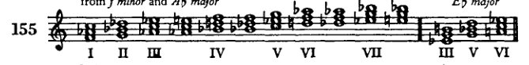
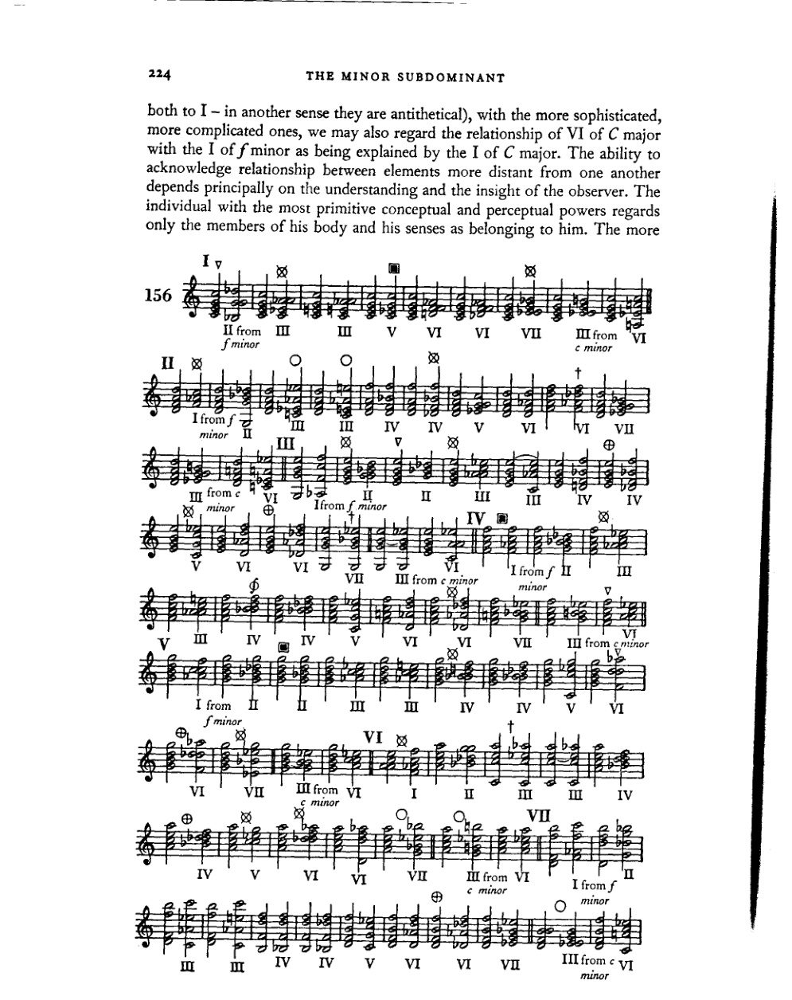
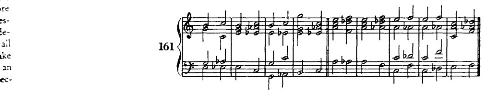

<!-- page 234 -->

XIII 与下属小调的关系

通过向下属第三、第四圈的转调，我们已经了解了主大调与下属小调的关系，即：该主调能够作为小三和弦的属调。显然，这种情况不仅用于转调，还用于扩展终止式、丰富调性内的事件。主和弦[主音]与下属小调的这种连接所产生的新关系，使我们能够向调性中引入——除了教会调式特征再现所获得的全音阶和弦之外——那些属于该下属小调和弦领域内的各调的副三和弦，即五度循环的第三、第四圈和弦。随着这些和弦的引入，调性得到了显著的扩展。在*C大调*中，它们是：

在继续研究这些新和弦的用法之前，我们应当先说明将指导我们研究的观点。我们首先问：在调性内使用这些和弦是否可容许且必要？答案必须是：这是自然的，并且符合和声的发展。就这里所考虑的意义而言，在和声发展已经使用了七声音阶的所有三到四声部组合之后，然后通过变音记号引入了其余五个音（即使在部分情况下只有一种含义：在*C大调*中当然可以有*f♯*但没有*g♭*，有*b♭*但没有*a♯*），其倾向只能是继续利用所有可用十二个半音的组合——起初仍然参照一个主音，即在调性之内。现在，当转调仅仅作为两个独立、自足的段落之间的桥梁时，如在歌剧中，那么其远近程度本质上无关紧要，因为两个段落各自都由其自身的调性框架所界定。但在一个封闭的作品中，离开主调只有在能够与主调相关联的情况下才能被证明是合理的，因为调性的意义就是和声的统一性。即使在最远的离调中，这种情况也确实可能存在，例如贝多芬的音乐中就有所体现，他在*c*小调作品中引入*b小调*的段落，在*E♭*大调作品中引入*e小调*的乐段——这是巴赫和莫扎特尚未做到的。现在在调性之内，这些段落和乐段的基本和弦，如果要能够把握后者的统一性，就必须像段落内相继的和弦那样相互关联、并置：即它们必须能够被理解为一个整体，它们必须具有连贯性。即使在较古老的音乐中，为这种转调提供合理依据的问题也不是关系的问题，而仅仅是

<!-- page 235 -->

小下属调 223

如何通过时间与空间上的适当分离以及渐进的连接来呈现这种关系的问题。但时间、空间和速度并非绝对。因此，如今我们可以将它们缩减至最小限度，并可以将从前必须保持距离且小心连接的东西直接并置。这些相互联系对我们而言是熟悉的；它们在过去的时代中已被证明，因此无需在每一部作品中重新详细阐明，而是被当作既定事实接受。

由于第一个问题已得到解答，第二个问题的答案仅具有从属的实践意义：**什么**价值是这种调性丰富化的价值，能从中获得什么优势？这里我们只谈结构价值，忽略表现价值，如情绪、性格、悬念等。作为结构的一个要点，我们已经知道和声具有形成收束、终止式、整体结尾的能力。诚然，人们可以用七个自然音和弦来区分这个整体的各个部分。然而，由于这七个和弦同样出现在各部分内部，在更大的形式中就需要对比更尖锐的手段。但和声发展得越远，表达就越冲动、越集中，和声呈现得就越快。因为并置的不仅仅是简单的乐思，而是整个复杂体；而这种更集中的陈述需要更丰富的标点、更清晰的乐句区分、一种更有动力且拥有更丰富的和弦与音级关系的和声，以便清楚地划分整体，并将主要与次要的事物区分开来。较近的关系不再能将各部分区分开来，它们只是相互连接并彼此融合。更鲜明的高光、更浓重的阴影——这些就是更遥远的和弦所能提供的作用。

我们对这些和弦使用的判断，一方面受限于教学上的考量，另一方面受限于这样一种信念：即我们的工作不可能是为那些未被使用或很少使用的项目争取一种实践所否认的重要性，一种理论如今无法创造的重要性。最后，我们的判断还受限于这个问题：这些和弦在何种程度上属于表述体系（*Darstellungssystem*），因此，它们是应当立即使用还是稍后使用。

首先，应当牢记这些和弦的来源：小下属调区域。因此，它们与副属和弦形成强烈对立，后者本质上属于属调区域（只有建立在I级上的副属和弦导向下属调，而建立在VI级上的副属和弦则同时导向属调的属调）。显然正是出于这个原因，许多进行被认为过于突兀，因此不被普遍使用。因此，小下属调关系通常用于丰富和声、对下属调区域给予更强的强调，并且不能总是与属调区域轻松而直接地连接。因为这两个区域之间的关系并非直接——这一点不应被遗忘——而是间接的。*C*大调的VI级与*f*小调的I级，只有通过它们各自与*C*大调I级之间的关系才能彼此关联：可以说，它们只是“姻亲关系”。但正如在较为低级、较为简单的关系中我们假定一个调的IV级与V级是相互关联的（通过参照

<!-- page 236 -->

224 小下属调

both to I – in another sense they are antithetical), with the more sophisticated, more complicated ones, we may also regard the relationship of VI of C major with the I of f minor as being explained by the I of C major. The ability to acknowledge relationship between elements more distant from one another depends principally on the understanding and the insight of the observer. The individual with the most primitive conceptual and perceptual powers regards only the members of his body and his senses as belonging to him. The more

<!-- page 237 -->

指南 225

培育的对象包括他的家庭。在培育的后续阶段，共同体意识被提升为对民族和种族的信仰；但在最高阶段，对邻人的爱扩展到整个物种，跨越人类，直至整个世界。即使个体在这个最高阶段成为无限中的 mere speck，他仍然能找到共鸣的回应，知道自己的关联性 [*findet er . . . zu sich*]（值得注意的是）比那些爱更为排他的人更频繁、更充分地认识到这一点。

因此，尽管在调性更为初级的关系中，若干和弦的相互关系表面上并非直接，但它们 nevertheless 具有创造统一性的能力——这种能力是耳朵必须把握的，因为在原型中，在自然所给予的音中，关系更为遥远的音也会联合形成一个复合的悦耳音响。此外，所有这些音的成分是同时发声的，耳朵区分它们的时间比它们相继发声时更少。诚然，各个音根据关系的程度在强度上有所分级，但它们确实在发声。而这种 [在我们和弦关系中的] 模仿尚未、在很长一段时间内也不会达到原型的程度。

例156展示了C大调所有七个音级与新和弦的连接。首先必须说明，这些连接无论多么不常见，没有一个是坏的或不能用的。每一种连接甚至在某种语境中都可以是唯一适合的——完全抛开它们潜在的表达价值不谈。

牢记这一前提，我们现在继续给出

---

**指南**

并加以限制。

I. 首先，导致声部进行困难的连接不常用。我们的和声在很大程度上来源于复调音乐中由声部运动所创造的事件。因此，凡是在声部进行中造成困难的东西在那里不会出现，也不常用。这类连接的例子有：C的II与f的VI、III与VII、VI与III（在†处），因平行五度的危险而被避免，还有另一个原因，后面再解释；以及：III与IV、V与VI、VI与IV、VII与VI（在⊕处），因增音程和减音程而被避免。目前学生最好完全避免这些进行。他是否会使用它们不是和声课程要讨论的问题，不取决于和声理论；这将由艺术家、由他可靠的形式感的指令来决定。他 所做的都是好的。[和声课程]只推荐常用的东西，并说明它在传统体系（*Darstellungssystem*）中的地位。

II. 引入不当的减三和弦我们当然省略（I与II、III与II、IV与c小调的VI、V与VI[在▽处]）。

<!-- page 238 -->

226 小下属调

III. *C* 大调的 IV 级与 *f* 小调的 IV 级（♯）。*f* 小调的 IV 级是下属调的下属调；鉴于下属调对主调所具有的自然影响力，调性很容易迷失是显而易见的。当然我们已经有大量手段来恢复它。但在这里，恢复的手段会比导致迷失的手段更有趣。如果警察比强盗更有趣，那就乏味了。如果我们想离调那么远，如果我们想如此激进，我们以后会发现更有趣的手段。

IV. III 与 I 的结合可能引起正当的疑虑，如果我们把和弦顺序颠倒，将 *f* 小调的 I 级与 *C* 大调的 III 级连接时尤为明显（例157*a* 和 157*b*）。在这种不熟悉的进行中，耳朵会倾向于将 *e*–*g*–*b* 这个和弦不是解释为 *C* 大调的 III 级，而是解释为 157*d* 的变体，它确实听起来与 157*c* 相似。我们之所以倾向于这样解释，部分是因为这两个和弦在任何调中都不会相邻出现，但更重要的是因为这种相似性使耳朵过于想起更舒服的解读，以至于无法接受另一种（157*c*）为正确。尽管如此，例 157*e* 和 *f* 表明，如果后续进行证实了这种解释，这个六和弦完全可以是 III 级。

V. 在某些不太远的调中有类比关系的连接——也就是说，所涉及的和弦以自然音形式出现的调，或者两个和弦中只有一个是人造属和弦的调——只要交叉关系以旋律方式处理（即作为枢纽音或半音变化），就不会产生困难。这里常常可以重新解释。

VI. 只要其他声部不需要增音程或减音程，那些可以进行半音声部进行的连接也是如此。

VII. 一如既往，判断的基础是根音进行。

例 158*a*–*g* 展示了那些与属和弦、副属和弦等容易连接的形式。因此，在 158*a* 和 *b* 中，I 级用于引入

<!-- page 239 -->

指南
227

[下属音区域的形态]，在 158c 和 158d 中为 V，在 158e 中为 II 上的副属和弦，在 158f 中为 VI 上的副属和弦，在 158g 中为 I、II、V 和 VI 上的减七和弦。这些连接并无新奇之处。它们各自都可以找到类比（在 c 小调、f 小调、g 小调和 d 小调中）。唯一的困难有时在于交叉关系的消解，如例 158h 所示。

然而，这一困难很容易通过枢纽音处理、半音手法以及减七和弦来解决，这些都是学生此时应当已经掌握的技术。

那些将同一根音上的大三和弦变为小三和弦的连接（例 156 中 [方形符号] 处）是显而易见且容易处理的。学生已从副属和弦一章 [p. 188] 中了解到在此处应如何继续，以及这类小三和弦的半音引入更多具有旋律意义而非和声意义；在该章中我们谈到了（C 大调中的）小调 V，g–bb–d，源自多利亚调式。在例 159a 中，小三和弦（降 E 上的六和弦）对后续没有影响。但在 159b 中，c 的 V 上的小三和弦（以降 B 为低音）确实为下属音区域做了准备。而在

<!-- page 240 -->

228

小下属调

159c 低音中以半音引入的 *ab* 确实使随后的六和弦 *f–ab–db* 得以不显眼的进入。

在这些大三和弦变为小三和弦的连接中，最好将三音的半音进行置于低音声部，以免该声部停滞。然而即便如此，也无法从这种进行中获得很大优势，因为整体音响变化太小。这大概就是为什么这种声部进行通常以小于其他和声的音符时值出现，也就是为什么它们最好以四分音符出现在我们这里，因为我们使用的是二分音符。

具有深远意义的是诸如C大调I级与f小调III级或VII级（A♭大调I级或V级）的连接，以及其他各级上的类似连接（例156 ⊗）。第二级上只有两种这样的连接，而其他小调和弦则有三种（例160 *f*）。这里存在的关系当然可以类推承认，但不能诉诸于我们目前所关注的亲缘程度。与这个小调和弦一样，大调和弦也有两种这样的进行。

对这些连接进行和声评价的标准仅仅是根音进行。强有力的下行三度跳进不需要推动力，而较弱的上行三度跳进则应基本上按此前所述方式评判 [第119页]。我可以忽略一种目前流行的解释，它称这种进行为"三度关系""五度关系"等；因为我认为它们恰正因为彼此相关而具有充分的依据。不管怎样，所有和弦彼此之间自然地相关联，正如所有人一样。它们是否构成一个家庭、一个民族或一个种族，当然并非没有趣味；但若将其与物种观念并置，这便不是一个本质问题了，因为物种观念提供了特殊关系所不承认的其他视角。

<!-- page 241 -->

指南 229

有一种方法始终适用于使此类和弦连接流畅且令人信服：半音体系。从前，当我们处理较简单的连接、最直接的关系时，基本调或相关调中的自然音阶片段承担了和声进行的职责。而在这里，越来越多的情况下，单一的音阶承担了所有这些功能：半音音阶。其原因不难理解。既然我们承认[自然音]音阶是一个简单的旋律，是一种基于原始且易于理解的法则的音乐形式，那么我们现在也不能否认半音音阶同样具有这一特性。其旋律力量有助于连接关系较远的元素：这就是半音体系的意义。

示例160中⊕处的连接在处理上有些困难（由于声部进行）。此处不常见的声部跳进并非总能轻易避免。初学者最好在一开始就将和弦安排成不需要这种音程的形式（示例161）。一旦掌握了此类安排，他当然可以冒险使用增音程或减音程，尤其是在内声部中。这些音程现在造成的干扰要小得多，因为旋律与和声事件越来越少地仅仅参照大调或小调音阶的模型。而在这里，预先假定某个音的重新解释（等音变换）也不再是不合适的，这通常会带来旋律上的平衡。自然，声部进行越接近大调或小调音阶，就越容易理解。即使在此处，学生仍应努力追求这样的声部进行。对于增二度，我建议遵循所谓"和声小调音阶"的模型（我认为这才是真正的*旋律*小调音阶）。

<!-- page 242 -->

230 小下属和弦

接下来是一些示例，展示这些和弦连接的潜在用法。

对于这些示例，我选择[展示这些和弦如何用于]终止式，因为每个人总会宁愿认为这些进行是转调，而非

162

<!-- page 243 -->

指南 231

而非终止式。而理论家们可能会坚称，这些是从*C*到……“再转回”的转调。这也有可能；但在此处，只有在先前提到的那种意义上才能谈论转调，即最严格地说，主和弦之后出现的任何其他和弦都已经代表了一种偏离、一次转调。这种观点认为，此处不存在更狭义上的转调，其首要优势在于教会学生将整体感知为一个统一体。这一观点无疑更符合音乐思维，例如在和声变奏中所展现的那样。主题往往明显没有离调；但在变奏中，人们使用了一些调性关系，并乐于将其视为转调，因为这样做方便得多。然而，它们并不比主题中相应的位置更像是转调。

在例156给出的连接中，那些标有○的尚未讨论。这只是一个适当的引入与延续的问题。在此，旋律性的声部进行同样是最佳选择。

例164[及随后的165]说明了通过小下属调建立关系的和弦的用法。在小调中，我建议起初仅使用通过同主音大调建立的关系：例如，在*c*小调中，那些通过*C*大调的小下属调而与之相关联的和弦。之后，学生可以利用更广泛的关系（通过关系大调，即在*c*小调中为*E♭*大调的关系）。刚开始时，这常常会让他陷入困难的境地。

<!-- page 244 -->

232

**小下属和弦**

164

<!-- page 245 -->

指南

233

在例164g中，最好将低音的*b*♭进行到*a*♭；然而，其后的进行表明——正如在例164k中，*c*进行到*d*，但最好进行到*b*♭一样——之后强有力的和弦有助于克服此类疑虑。

在例165中，首先从*c*小调出发，运用了同主音大调（*C*）的小下属关系；随后，从*a*小调出发，运用了关系大调更为广泛的联系。

*c*小调

<!-- page 246 -->

234 小下属调

学生即便到现在也必须表现出品位与形式感。我们已无法仅凭指示来驾驭繁多的可能性（*Ereignisse*）。我认为，与其大胆，不如忧虑；与其轻率地决定使用生硬（*hart*）的连接，不如犹豫不决。他必须加以甄别！而且，即使人们远远超出了此处所能呈现的内容，即使事物本身或许无所谓坏，也可能无所谓好，然而，有待发展的那种能力（*Organ*）——即形式感——通过审慎的选择，比在没有限制的情况下，会更早地被激活。

在例164d的†处，使用了所谓的“那不勒斯六和弦”。它是通过小下属调关系获得的一个六和弦，在*C*大调和*c*小调中为*f–ab–db*，在此语境中，它回溯到其在*f*小调中作为自然和弦的出现，即VI（或在*Ab*大调中为IV）。在*f*小调中，它与该调V级的连接并不是什么新东西（VI–V，例166a）。但那不勒斯六和弦的典型用法是模仿终止式中II级的用法（166b和166c）。因此，它曾被视为II级的半音变体。然而，准确地说，我们必须称它为II级的替代和弦。

也就是说，如果我们假定它是从II级半音衍生而来的变体，那就意味着根音和五音都被降低了。但根音被降低这一假设必须被断然拒绝。暂且不论降低根音的假设仅在另一种情况下被使用（即在即将讨论的增六五和弦中），因而只是那些著名特例之一；这种做法本身就是最荒谬的事情。在我们的概念中，根音是衡量关系的固定点。我们所发现的所有衡量标准的统一性，都由这些点的不可移动性来保证。因此，绝不能移动它们！！假定音阶的第二级上有两个根音：*d*和*db*（如同小调中第六、七级的情况，以及教会调式中许多位置的情况），则是另一回事。这一假设可以轻易推广到音阶的所有位置，从而将半音音阶作为考察和声事件的基础。因此，在*C*大调中可以有两个II级和弦。或许一种新理论会以半音音阶为基础建立起来；但那样的话，音级的名称大概也会有所不同。

那不勒斯六和弦出现的方式，也同样反对根音降低的假设。它的常见用法如下（167a, *b, c, d, e*）：直接接在I级之后（但也可接在诸多适合引入它的其他和弦之后），它通常解决到I级的六四和弦或到V级。
