<!-- page 247 -->

指南
235

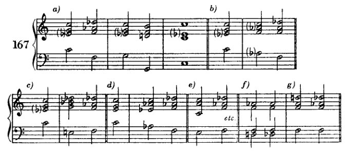

如果根音确实被降低，那么这个和弦就应该如示例 167*f* 和 *g* 所示的那样频繁出现。这些实例自然不是例外，但确实罕见。而且它们的出现并不能证明通过降低根音的推导方式，仅仅说明在适当的地方一切都是可以的。

因此，那不勒斯六和弦最好被视为终止式中 II 级的替代。在这个意义上，它有时也用作六四和弦（168*a*），甚至用作由相同音构成的原位和弦（陈词滥调效果，168*b*）。在情况（168*c*）中，如果这个和弦不再具有该和弦的典型功能（作为终止式中的替代音级），它是否仍然配得上那不勒斯六和弦这个名称，这是值得怀疑的，但并不重要。

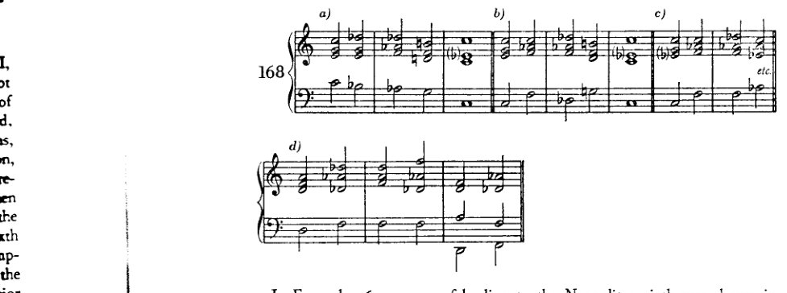

在示例 167*g* 中展示了一种引向那不勒斯六和弦的方式，其中根音和五音同时被降低。这种引入方式（假设我们要避免平行五度）只有在所涉及的声部是四度关系时，或者通过特别巧妙的声部进行（168*d*）才是可能的。显然：这种引入方式既不坏也不被禁止。但尽管有小下属调关系的媒介作用：这两个和弦的关系就像和弦之间可能达到的那样疏远。如果我们如此直接地将它们连接起来，我们就正处于可以说"所有和弦都可以相互连接"的边界上。既然这样的进行

<!-- page 248 -->

236 小调下属和弦

无论如何都很罕见，学习者暂时仍会继续回避它们。基于同样的原因（如前所述），他将略去来自其他小调和弦（III 和 VI，例 156 的 † 处）的类似连接。

每个大三和弦的六和弦都可以模仿那不勒斯六和弦的功能，包括 I 和 V 的六和弦。当然，这两个并不导向自然音阶和弦，因此现在尚不可用（169g 和 h）。如果我们继续

a) [带有高音谱号和低音谱号的五线谱，下方标记为 "II"]

b) [带有高音谱号和低音谱号的五线谱，下方标记为 "III"]

c) † [带有高音谱号和低音谱号的五线谱，下方标记为 "IV"]

d) [带有高音谱号和低音谱号的五线谱，下方标记为 "I⁶₄"]

e) [带有高音谱号和低音谱号的五线谱，下方标记为 "etc." 和 "V"]

f) [带有高音谱号和低音谱号的五线谱]

g) [带有高音谱号和低音谱号的五线谱，下方标记为 "VI"]

h) [带有高音谱号和低音谱号的五线谱，下方标记为 "VIII?" 和 "?"]

<!-- page 249 -->

指南 237

反过来看，也就是说，如果我们为自然音和弦寻找那些六和弦（有时为非自然音），使其与自然音和弦的关系正如那不勒斯六和弦与I或V的六四和弦之间的关系一样，那么我们就会得到例169中所使用的形式。

此处应当留意；与六四和弦的联系，由于六四和弦的陈规，很容易使人偏离正轨，超出这种准那不勒斯进行对该调性所具有的和声意义。当然，人们可以轻易地控制这种含混性，但必须对此加以留意。因此，建议这些和弦最好按照II–V的模式用于其另一种功能中。

在小调下属关系的领域中，仅少数连接尚未被考察。假设任何连接只要处在恰当的位置都可以是好的这一原则，我们可以说，几乎没有什么真正有价值的东西被遗漏了。

<!-- page 250 -->

XIV 在调性的边界

更多关于*减七和弦*的内容；接着是关于*增三和弦*；进一步：*增六五、增四三与增二和弦*以及*增六和弦*（在II级及其他级上）。——一些*II级的其他变音*；其他级上的相同变音。变音和弦与游移和弦的*连接*。

前一章讨论的和弦可以借助游移和弦，以更为温和、不那么突兀的方式引入。目前我们已知两种这样的和弦：减七和弦与增三和弦。我们曾见过（p. 193），倘若将减七和弦视为省略根音的九和弦，并不仅将其构建于V级，而是仿照副属和弦的做法亦构建于其他级上，那么它是如何出现在大调与小调中的。随后，在（Example 141*a*）中考察两种最常见的欺骗性终止时，通向大量异质和弦的道路便打开了，我们看到减七和弦具有卓越的能力，能将关系疏远的和弦彼此拉近，并缓和那些看似生硬的连接。正是由于这些能力，该和弦在较早的音乐中扮演了如此重要的角色。无论何处有难办之事，人们便会求助于这位无所不能的奇迹工匠。每当一部作品被称为'半音阶幻想曲与赋格'时，我们可以肯定，该和弦在创造这种半音性方面起着主导作用。但它还获得了另一种意义：它是那个时代的'表现性'和弦。凡欲表达痛苦、激动、愤怒或其他强烈情感之处——我们几乎只会发现减七和弦。巴赫、海顿、莫扎特、贝多芬、韦伯等人的音乐中皆是如此。即使在瓦格纳的早期作品中，它也扮演着同样的角色。但很快这一角色便演尽了。这位不平凡、不安分、不可靠的客人，今日在此，明日离去，却定居了下来，成了市民，沦为庸人。该和弦失去了新奇的魅力，因此也失去了它的尖锐，还有它的光彩。它对新的时代已无话可说。于是，它从艺术音乐的高领域跌落到了娱乐音乐的低领域。它仍留在那里，作为感伤事物的感伤表达。它变得平庸且柔靡。*变得*平庸！它原本并非如此。它曾是尖锐而耀眼的。然而今天，除了在那种庸俗滥情之作（*Schmachtliteratur*）中，它几乎不再被使用了——这类作品总是在事后模仿那些曾经于伟大艺术中发生过的重要事件。其他和弦取代了它的位置，有些和弦旨在取代它的表现力，有些则旨在取代它作为枢纽的便利。这些和弦包括增三和弦、某些变音和弦，以及一些音响——它们因延留音或经过音的缘故，早已在莫扎特或贝多芬的音乐中出现，而在瓦格纳的音乐中则作为独立和弦现身。然而，这些和弦中没有哪一个完全比得上

<!-- page 251 -->

*更多关于减七和弦* 239

减七和弦——实际上对它们而言是一种优势；因为这样它们就能更好地抵御平庸，因为它们不会被滥用到如此地步。然而，这些和弦也很快被用滥，很快失去了魅力；这就解释了为什么就在瓦格纳之后不久——其和声在当时人看来大胆得不可思议——人们便去寻求新的道路：减七和弦引发了这场运动，它只有在完成了自然的意志之后才会停止，也只有在我们达到模仿自然的最高可能成熟度之后才会停止：这样我们才能从外部范例转身，越来越多地转向内在，转向我们内心的那个自我。

以后我会找机会来探讨这个问题：这种和弦究竟有什么特质，在我们听来如此富于表现力。那么在这里，我只想说这一点：我重视独创性，但我不会高估它——就像大多数没有独创性的人那样。它是一种征候，虽然好东西几乎从不缺少它，但它也会出现在低劣的事物中；因此它本身并不是一个标准。然而，我确实相信新事物；我相信它就是那种*善*与那种*美*，我们以全部内在生命向着它奋力追求，正如我们追求*未来*一样不由自主、一样坚持不懈。在我们的未来某处，必定存在着一种迄今对我们仍隐而未现的*壮丽实现*，因为我们的一切奋斗永远将希望寄托于它。也许那未来是我们物种发展的一个高级阶段，到了那时，这种今天使我们不得安宁的渴望将得到满足。也许它只是死亡；但也许它也是死后更高生命的确然性。未来带来新事物，而这也许就是我们为何如此经常地、如此理所当然地将新事物与美和善等同起来的原因。

既然学生应当亲身了解[它们]，他就必须尽可能多地利用减七和弦的各种特性，以利于转调与终止。但他不应高估这种和弦的价值，也不应滥用它；否则（而这简直太可怕了）他的习作可能会变得像《特里斯坦》第一幕那样糟糕（据一位年迈的作曲教授所言，一位非常年迈的教授，实际上他已经去世了）。我们年轻人当时去听每一场瓦格纳的演出就是为了那个目的——尽管我们或许并没有意识到自己为何而去——只是为了弄清楚那位教授为何会说出那样的话；而我们却无法解释。最后我们终于明白了。那位老先生说过：'《特里斯坦》第一幕之所以如此无聊，是因为里面用了太多的减七和弦。'现在，我们终于知道了。

总的来说，学生最好暂时不要在使用

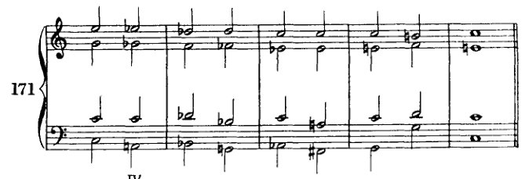

<!-- page 252 -->

240 在调性的边界上

来自小下属区域的和弦。因为即使使用这种万能手段——‘减七和弦’——也并不总能轻易恢复平衡。此外，使用一种万能手段是相当缺乏艺术性的。既无想象力又贪图方便，拙劣不堪！因此，我认为例171中的进行确实很糟糕。

我在关于转调的章节中已经解释过，为什么逐渐展开的转调更适合用作练习。根据那里给出的理由，如果借助此类[万能]手段来扩展终止式，我也同样无法认为那是好的。同时应当说，此处情况已有所不同。纳入如此繁多的关系本身已使调性成为一种更具活力的现象。它现在包含了更多不安，鉴于此，更为强烈的进行不再那么不合适。尽管如此，减七和弦虽能做许多事，却并非无所不能。因此，学生不应每次想从一个自然音和弦进行到一个非自然音和弦时都使用减七和弦。这种连接往往生硬，而且，尽管生硬本身并非灾祸，但它不符合我们当前的目标。

这些进行（例172）当然并非绝对地糟糕。它们上方可以有一个好的旋律；事实上，仅在高音部改善声部进行或许就能使其更柔和。但就其本身而言，它们比我们迄今所允许的任何进行都更为突兀、生硬。这里很大程度上将取决于声部进行。最好将每个声部都塑造得近似于某个邻近的小调或大调。在172a中，问题或许出在次中音声部，它以某种方式到达*d*♭音，而这种进行方式在例如*f*小调或A♭大调中几乎不会被使用。问题或许也出在低音那个'开放'的*a*音上，它未被中和；而在172*b*中，问题或许出在中音与次中音声部的运动中。

早些时候（第148页），我曾排除过一种在大师作品中常见的减七和弦用法。就是那种形式：V的减七和弦（省略根音的九和弦）出现在I的四六和弦之前。

旧有的规则似乎是：减七和弦可以与任何和弦连接，因此也可以与I的四六和弦连接。但是，无论它被解释为*c*小调的VII还是V——它都会削弱随后的属和弦，因为它包含了后者最重要的元素：上行与下行的导音。此外，VII通常不过是V的替代，因此根音进行便会是VII（= V）、I、V、I，这并非一种很有利的进行。尽管这种情况确实出现在

<!-- page 253 -->

*增三和弦* 241

大师们（莫扎特、贝多芬、韦伯、瓦格纳等）——因为这或许只是相对于当时和声理论所给出的其他规则而言才是错误的——学生不应使用它：和声练习并非杰作。这些大师的听觉当然是正确的，当它告诉他们减

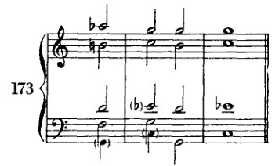

七和弦可以与任何和弦连接；然而，这种特定连接之所以是好的，并非出于他们所设想的原因，而是因为每个和弦都可以与其他任何和弦连接。当然，这必须在某些条件和某些保留之下，这些条件和保留必须首先被了解，必须首先成为一个人的形式感的一部分，并且一个人必须能够为之承担责任。因此，这类事情不是学生在其和声练习中应做的，而是艺术家在其创作自由中应做的。

---

**增三和弦**¹

增三和弦的构成与减七和弦相似。它的形式也带有某种循环性，某种回环往复的特性。如果我们将其最低音移高一个八度，那么之前最高音与当前音之间的音程，与[移调前]其他音之间的音程相同，即第一音与第二音之间、第二音与第三音之间：一个大三度（例 174*a*）。小三度将半音阶分成四个相等的部分，大三度则分成三个。正如只有三种不同的减七和弦一样，这里也只有四种不同的增三和弦（174*b*）。因此，撇开其他任何原因不谈，通过与减七和弦的类比，每个增三和弦至少属于三个小调（174*c*）。

[¹ *参见下文*，第二十章。]

<!-- page 254 -->

242 调性的前沿

如果在它所属的全部三个小调中，我们将到I级和VI级的解决视为其最重要的两个调性解决，那么我们就会发现，同一个音响——时而称作*e-g♯-c*，时而称作*e-g♯-b♯*或*e-a♭-c*——与三个

不同的根音相连，每个各两次。这些根音中的每一个，在一种情况下是大和弦的根音，在另一种情况下则是小和弦的根音。这些连接如下：

在*a*小调中，与*a-c-e*（I）和*f-a-c*（VI）
在*c♯*小调中，与*a-c♯-e*（VI）和*c♯-e-g♯*（I）
在*f*小调中，与*f-a♭-c*（I）和*d♭-f-a*（VI）。

由于在解决到大和弦（小调的III–VI）时根音作四度跳进，因此很显然，增三和弦可以用来产生主和弦；为此，可以依照副属和弦的思路，在相关大调的V级上人为地引入它们。最简便的方式是将五度音向上作半音变化。

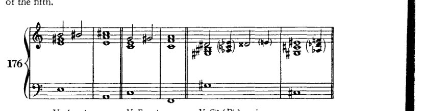

这种半音引入法也可用于副音级，在这种情况下，三音有时也会被升高（谱例177）。但这种增

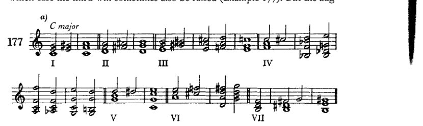

<!-- page 255 -->

*增三和弦* 243

增三和弦也可以通过其他音级以半音变化的方式引入[即通过改变和弦中除五度音以外的音](178a)，也可以不用半音变化(178b)。最后，每个音级也都可以与其他增三和弦相连接（如178c所示）。因为增三和弦的结构特性——正如它属于三个调性所示——它是一个游移和弦，如同减七和弦一样。虽然它的解决方式不如减七和弦那么多，但它与减七和弦相似，由于其模糊性，几乎可以在任何和弦之后引入。而且，它也允许增音程和减音程进行，因为一个非调式引入的音在其进入的那一刻，其意义绝非已经明确确定。

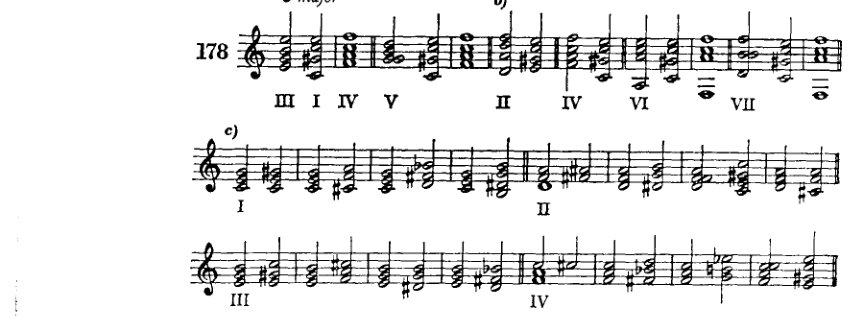

下面举一些例子。学生可以根据前述讨论中提出的各种可能性，自行随意补充更多例子。对于增三和弦，没有必要区分原位与转位。它几乎总是被重新解释的，既然如此，六四和弦的感觉几乎不可能产生。为了避免复杂的记谱

<!-- page 256 -->

244 在调性的前沿

人们常常会使用等音变换。例如，在 179d 中，应当写作 *a♯* 而不是 *b♭*；但我们倾向于避免在C大调中使用 *a♯* 这个音。

增三和弦通过强有力的进行——根音上行四度——解决到大调，即使它源自同名小调，这一特性也有利于其用于连接大调与小调。学习者将能够在转调中利用这一特性，但（如同对待减七和弦一样）我并不主张仅基于这一和弦来进行转调。自始至终，学习者最好建立并做到

<!-- page 257 -->

*其他增和弦与游移和弦* 245

为[每一次]转调制定方案，一个深思熟虑的、旨在达成目标的方案。

还有另外两种增三和弦的处理方式需要提及。它们在和声上并不重要，但也不应被排除。通过每次降低一个音，我们得到三个新的大三和弦（例180a）；通过降低每一对音，我们在同样的三个根音上得到三个小三和弦（180b）。

这些解决更可能被听作留音的解决，因为它们建立在下行根音进行（向上三度）的基础上。但它们可被用作紧随其后的强进行的准备。

---

**增六五、增四三、增二与增六和弦，以及一些其他游移和弦**

增六五和弦的推导通常按如下方式解释：在大调中，我们可以升高II级六五和弦的根音与三音，并降低其五音；在小调中，我们可以升高IV级七和弦的根音。由此我们得到两个音响相同、且各自功能也相似的和弦。*

两者都可以解决到I级的六四和弦（例182a、b）；两者也都可以解决到V级的三和弦（182c），因为，尽管记谱不同，其

---

\* 我在这里引用的这些和弦的推导方式绝不是唯一的。其他的推导方式以及它们众多不同的名称，我都只是耳闻而已。但我必须指出，显然，通常被称作“增四三和弦”的那个和弦，与该术语真正所指的那个和弦完全不同。如果增六五和弦的音以不同方式排列，使得该和弦的其他音交替出现在低音中，那么我们就只能将这些如此关联的和弦解释为某一个和弦的转位。尤其是当它们的功能完全相同时！那又何必取这么多名字？

<!-- page 258 -->

246

在调性的边界

音响是相同的。在后一种解决方式中会出现平行五度，因此谱例182d中的排列方式常被采用。或者反过来说，人们会提到“莫扎特五度”，意思是这类五度之所以被允许，并非因为它们听起来悦耳，而是因为莫扎特曾这样写过。我完全赞同这种对大师作品的尊重。因此，我认为理论至少应当容许大师们所写的一切，而大师们是从不关心是否“被容许”的。但这样一来，理论就变得更像实用性的而非理论性的了：它竭力迁就实际发生的一切，因而丧失了进行审美—理论评判的权利。然而，倘若能彻底而一贯地加以贯彻，这种[实用性]正是手艺教学的正确基础；反之，在审美—理论体系中，为了实用而引入一个特例则是荒谬的。我们对这些五度的看法与其他五度并无二致：我们认为它们听起来不错，但只要有可能，暂时还不写下它们。暂时还不：学生日后可以写。只要有可能：如果他实在无法回避，那么他现在就可以立刻写下它们。

在上述增六五和弦的推导中，我们再次遇到了升根音的假设。在一个以根音（只能是未升高的根音）为度量单位的体系中，我认为这种假设是不正确的。此外，将该和弦从两个音级推导出来是不实用的；因为这种推导不仅使功能变得模糊，也未能保留暧昧音（d♯–e♭）的等音变换解释，而后者或许能够解决[用法与推导之间的冲突]。例如，若182d出现在C大调中，按照这种推导，该音应当是d♯。因此，我认为更恰当的做法是，将增六五和弦从大调或小调II级上的九和弦，经由副属和弦，亦即从减七和弦推导出来。这样它便同时适用于大调与小调；即：（C调的）II级，副属和弦，副属七和弦，副属九七和弦；省略根音，减七和弦，降低五音。

<!-- page 259 -->

其他增和弦与漂泊和弦 247

在减七和弦中，*eb* 被重新解释为 *d#* 这一点无论如何已经被假定；因此，这个源自减七和弦的和弦也可以兼具两种含义。它如何推导出来的问题，在我看来不如什么样的和声必然性或可能性使其产生这个问题重要。回答这个问题告诉我们如何处理这个和弦，如何引入它，以及如何由它进行。它最常出现在原本会有 II 或 IV 的地方：也就是说，在终止式中，在 I 的六四和弦之前，或在属七和弦 (V) 之前（例182）。因此可以将其视为这些音级之一——II 或 IV——的替代。将其假定为 II 的替代是最为有利的，正如我刚才指出的。我们已经在 II 上见过类似的情况；此外，II–V 是[正格终止的一部分]，而 II–I 则类似于伪终止。由此看来，增六五和弦的使用是相当简单的：在大调中，它的引入方式与小调下属区域的和弦相同；在小调中，它的引入则类似于副属和弦或减七和弦。如果它出现在终止式中，那么进行到 V 或 I 是显而易见的，或者如果它可能进行到 III（182*e, f, g*），这种进行仍然很容易理解：II–V、II–I、II–III，正格进行（上行四度）以及两种最常见的伪进行（上行二度和下行二度）：三种重要的上行进行。

增六五和弦表达了什么样的必然性和可能性？事实上，我们可以对其他漂泊和弦提出同样的问题。首先，只要这类和弦适合其环境，也就是说，它们不是那种孤立的现象，因而不会脱离整体的风格，那么它们就是好的。无论它们出现在哪里，漂泊和弦通常都会联合起来，可以说，并赋予一首作品的和声一种独特的色彩（巴赫的《“半音阶”幻想曲与赋格》）。当然，既然没有东西本身是坏的，我们就不能说孤立出现的情况在每一种情况下都必然是坏的。但是很明显，大量出现的远离调性的和弦，会有利于建立一种新的*概念统一体*（*Auffassungseinheit*）：半音阶。不可忽视的是，这类现象的积累可能会摧毁调性的稳固结构。这种危险当然很容易被击退，而且调性总是可以得到加强。但如果破裂仍然发生了，其结果不一定是解体与无形。因为半音阶也是一种形式。它也有一个形式原则，一个与大调或小调音阶不同的原则，一个更简单、更统一的原则。也许正是对简单性的无意识追求将音乐家引向了这里；因为以半音阶取代大调和小调，与大调和小调取代七种教会调式无疑是同一种步骤：在可能关系的数量不变的情况下，实现关系内部更大的统一性。不管怎样，漂泊和弦表明了这样一种努力：利用半音阶及其全套导音的优势，以获得更有说服力、更强制、更柔韧的和弦连接。这么多有利条件的幸运巧合，完全可以被称为以合乎自然的方式处理素材的回报。人们可以希望，在

<!-- page 260 -->

248 在调性的边界

这件小事，即猜到了自然的意志；而追随这些诱惑，便是屈从于她的力量。有时这确实是自然的方式。她使我们渴望并享受那实现她目的的东西。¹ 或许正是通过这[对实现的]渴望本身。

增四三和弦与增二和弦应被视为同一母和弦的进一步转位：也就是说，四三和弦为第二转位，二和弦为第三转位（例184a）；或者简单地说，是增六五和弦的转位。² 因此，关于它们的处理显然无需多言。它们出现在增六五和弦可以出现的任何地方，只要旋律线条需要不同的低音。只是，增二和弦有时会造成困难，因为（例185d）低音中c的重复并不很恰当。由于这个和弦由四个音组成，因此还必须有第四个位置（例184e）。根据我从九和弦推导而来的结果，那只不过是九和弦的第四转位。根据最先提到的那种推导，它实际上必须是原位；而我们再次看到这种构想是多么不自然。关于其处理无需特别说明

---

¹ 此处插入：“[她的目的得以实现]例如，通过爱与饥饿。”这条初版（第273页）中的评注在修订时显然因疏忽而被遗漏。无论如何，它为结语提供了过渡，并使其不那么晦涩难懂。

² 此处勋伯格将d视为该和弦的默示根音；因此，严格来说，例184a中的第一个和弦（f♯–a♭–c–e♭）应为第一转位，即增六五和弦。当然，更常见的做法是将转位a♭–c–e♭–f♯称作增六五和弦，将c–e♭–f♯–a♭称作增四三和弦，以此类推。

<!-- page 261 -->

*其他增和弦与游移和弦* 249

这种位置也是如此。充其量，在将其解决到 V 的六四和弦时（例 184*f*），或许必须稍加小心。但那也不是什么新鲜事，因为它令人想起减七和弦的类似情况。¹ 解决到 I 的六和弦则非常常见（184*g* 和 *k*）。

所谓的增六和弦（184*b*）不外乎是一个没有九音（或七音，随你怎么称呼）的增六五和弦，因此它与后者的关系，大致如同 VII 上的减三和弦与 V 的七和弦、或与其自身根音（VII）上的七和弦之间的关系。这个增六和弦无需进一步解释。凡增六五和弦（或四三、或二）能去的地方，它都能去——大概是在人们不敢写平行五度的地方（184*d*）。当然，它的音也可以作不同排列（即以转位形式）。不必像其他七和弦那样预备增六五、四三、二及六和弦。因为按照推导关系充当七音的那个音，实际上只是一个减五度，由于假设的根音并不鸣响；而九音也只是一个减七度。这两者我们都已在自由使用。另一方面，假设根音的三音听起来像小七度，正如等音变换后甚至显而易见的那样（184*c*）；但在此处，作为三音，它当然不必预备。这些和弦的音响与属七和弦（在 *ab* 上：*ab*–*c*–*eb*–*gb*）完全相同；只是记谱不同。这种双重同一性是可以加以利用的，后文将予说明 [第 254 页]。

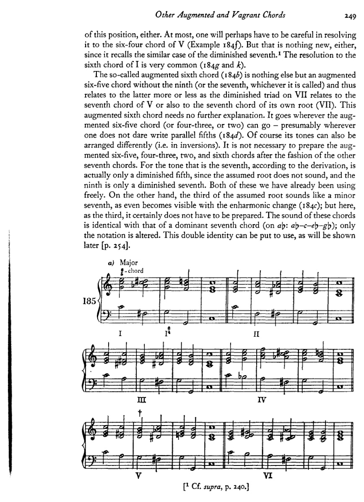

---
¹ 见前，第 240 页。

<!-- page 262 -->

250

在调性的前沿

b)

[乐谱：三行钢琴乐谱，带有罗马数字分析标记 I、V、II、III、IV、V、VI]

c) ⁴₃和弦

[乐谱：三行钢琴乐谱，带有罗马数字分析标记 II、III、IV、V、VI]

<!-- page 263 -->

其他增和弦与游移和弦

251

d) 2-和弦

[乐谱：钢琴大谱表，含高音谱号与低音谱号，多小节的和弦进行，标记为 "d) 2-和弦"]

e) 小调

[乐谱：钢琴大谱表，含高音谱号与低音谱号，三个降号的调号，多小节，标记为 "I"]

[乐谱：钢琴大谱表，含高音谱号与低音谱号，三个降号的调号，多小节，标记为 "II"]

[乐谱：钢琴大谱表，含高音谱号与低音谱号，三个降号的调号，多小节，标记为 "III"]

[乐谱：钢琴大谱表，含高音谱号与低音谱号，三个降号的调号，多小节，标记为 "III" 与 "IV"]

[乐谱：钢琴大谱表，含高音谱号与低音谱号，三个降号的调号，多小节，带剑号 (†)，标记为 "V"]

f)

[乐谱：钢琴大谱表，含高音谱号与低音谱号，三个降号的调号，多小节，标记为 "VI"]

[乐谱：钢琴大谱表，含高音谱号与低音谱号，三个降号的调号，续接前一谱表]

<!-- page 264 -->

252 调性的前沿

[乐谱：高音谱号与低音谱号的两行钢琴音乐，降E大调调号（三个降号），包含两小节和弦织体，其中有加线音符及包括降号与还原号在内的变化音]

正如我们通过类比扩展了属和弦的概念以创造出副属和弦的概念，正如我们创造出人为的减三和弦、七和弦等等——在这里，我们也同样依据 IInd 级的模式，对其他音级做出恰当的类似变音。通过这一操作，我们获得下列和弦（其他转位、four-three 与 two，以及增六和弦，学生可自行推导）：

[乐谱：标有“C大调”和“186”的钢琴大谱表，显示数字低音和弦，每组和弦下方标有罗马数字分析 I、III、IV、V；和弦中包含带有变化音的变音属七型音响]

[乐谱：标有“c小调”的钢琴大谱表，显示数字低音和弦，每组和弦下方标有罗马数字分析 VI、VII、III、VI；和弦中包含大量使用升号与降号的重度变音音响]

进行到这些和弦，要么通过大调中的下属小调关系来实现，要么通过半音方式来实现。文献中并没有太多例子可以说明这些源自其他音级的 six-five、four-three 与 two 和弦的用法。尽管如此，我在勃拉姆斯和舒曼的音乐中见过它们。此处给出的例子表明它们是可用的，尽管有时需要强有力的手段才能恢复调性。

<!-- page 265 -->

其他增和弦与游移和弦

253

<!-- page 266 -->

254

在调性的前沿

小调中

[音乐记谱：降E小调中的四组钢琴大谱表，展示带有罗马数字分析（包括 I、III、VI、V 及增六和弦重新诠释）的和声进行。第一组展示从主和弦开始并经过变化和弦的进行。第二组展示带有 III 和 VI 标记的进行。第三组展示 VI、V、VI 进行，其中带有增六和弦记谱（包括以括号标注的 (♭♭3) 与 (♭♭♭7) 变音记号）。第四组继续展示类似的半音声部进行模式。]

增六五（四三、二或六）和弦与属七和弦的音响相同，这一事实现在可以轻易地加以利用，即把其中一种当作另一种来处理（引入并延续）。例如，某个音级上的增六五和弦被视为具有相同音响的七和弦，并按照 V–I、V–VI 或 V–IV 的模式解决（例 188a）。或者，一个属（或副属）七和弦被诠释为增六五、四三或

188 a)

[音乐记谱：标有 "188 a)" 的钢琴谱表，展示小调中一个五小节的进行，从主和弦开始，经过增六和弦的重新诠释，最终和弦下方标有罗马数字 "II"。该进行展示了文中所述的解决模式，带有半音声部进行及变化的低音。]

<!-- page 267 -->

*其他增和弦与游移和弦* 255

两个和弦并相应地解决（188*b*）。这一技巧，连同副音级上那不勒斯六和弦的概念，极大地丰富了调性。

显然，这里有些和弦可以有不同的解释。但是，既然我们并不从事分析，这对我们来说就无关紧要。我们只关心一种体系，它通过组织和统一尽可能多样化的事件来激发兴趣、唤起想象。不言而喻，为了和声意义而该写 *c♯* 还是 *d♭*、*g♯* 还是 *a♭* 这类问题，绞尽脑汁是没有多大意义的。我们写最简单的。缺点在于我们不完备的记谱体系。别无其他。

在我继续就这些不同的游移和弦彼此之间的连接提出建议之前（建议：因为要阐明这里所有能做的实际上几乎是不可能的），我想先讨论另外两个同样属于游移和弦的和弦。

<!-- page 268 -->

256 在调性的前沿

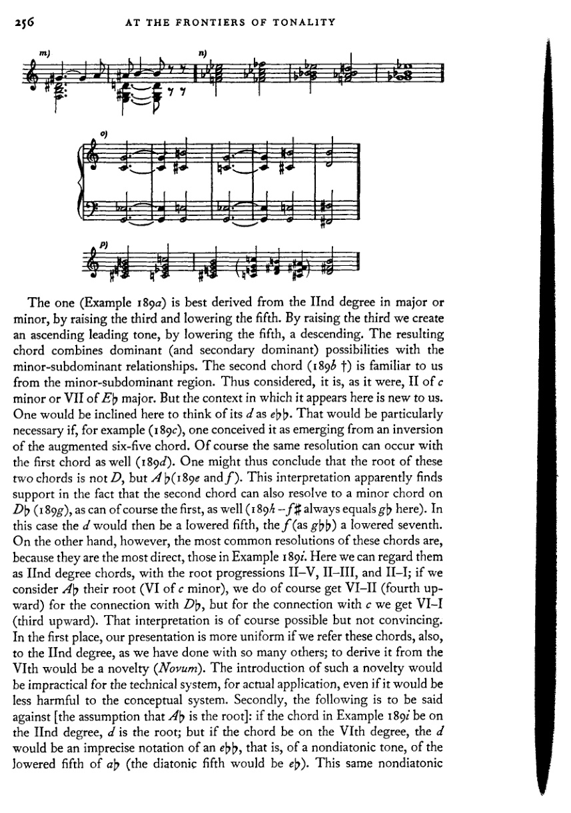

第一个和弦（例189a）最好从大调或小调的第二级音衍生而来，通过升高三音和降低五音。升高三音产生上行导音，降低五音产生下行导音。所得和弦结合了属（及副属）功能与小调下属功能关系。第二个和弦（189b †）我们从小调下属区域已经熟悉。如此看待，它可以说是 c 小调的 II 级或 E♭ 大调的 VII 级。但它在此出现的语境对我们来说是新的。人们在此倾向于将其 d 视为 e𝄫♭。如果例如（189c）将其视为增六五和弦转位衍生而来，这一点就特别必要。当然，第一个和弦也能产生同样的解决（189d）。因此可以得出结论，这两个和弦的根音不是 D，而是 A♭（189e 和 f）。这种解释显然得到以下事实的支持：第二个和弦也能解决到 D♭ 上的小和弦（189g），第一个和弦当然也可以（189h——此处 f♯ 始终等于 g♭）。在这种情况下，d 将是降低的五音，f（作为 g♭♭）是降低的七音。然而另一方面，这些和弦最常见的解决是最直接的，如例189i所示。在此我们可以将其视为第二级和弦，根音进行为 II–V、II–III 和 II–I；若将 A♭ 视为其根音（c 小调的 VI 级），则与 D♭ 的连接确实得到 VI–II（上行四度），但与 c 的连接得到的是 VI–I（上行三度）。那种解释当然可能，但并不令人信服。首先，如果也将这些和弦归于第二级音，我们的阐述会更加统一，正如我们对许多其他和弦所做的那样；从第六级音衍生则是一种新做法（*Novum*）。引入这种新做法对于技术体系、对于实际应用是不切实际的，即使它对概念体系的损害会小一些。其次，以下是对[假设 A♭ 为根音]的反驳：如果例189i中的和弦在第二级音上，d 就是根音；但如果和弦在第六级音上，d 就是 e♭♭ 的不精确记谱，即非调式音，是 a♭ 的降低五音（调式五音应为 e♭）。这同一个非调式音

<!-- page 269 -->

其他增和弦与游移和弦
257

该音现在在解决和弦（V）中，突然应当是一个*自然音*！这当然也并非不可能；但这很复杂。而采用另一种解释，这种复杂性就没有必要了。唯一可能有点难以解释的连接是与*Db*（或*dp*）和弦的连接。因为这种连接将不得不被标记为II与II。那样就不会有根音进行。但这对我们来说并不新鲜。首先，我们已经有过两个和弦进行中不存在根音进行的例子：例如，一个三和弦之后接同一音级上的七和弦，或副属和弦、副属七和弦、减七（九）和弦等等。其次，我们在将增六五和弦（II级）与那不勒斯六和弦（II级）连接时[例188*a*]，已经见过一个与我们现在讨论的这个非常相似的例子。因此，在这里做同样的假设也是相当系统的。

这样一来，我们就获得了当我们统一根音参照时在其他地方发现的同样的好处：我们可以在其他音级上进行同样的变化。于是我们就得到了例189*k*中的和弦，其中标记的那些我们已经熟悉了，VII级上的其中一个也是如此。其余的一些也许引入起来有点困难，但凭我们现在已有的手段，已不再十分困难。最重要的是，这种通过类比转移到其他音级上的做法，将清楚地表明这些和弦在多大程度上是游移的，以及分析将它们归属于这个或那个调是多么缺乏依据。

这些和弦本身并不需要如此冗长的讨论，因为它们确实并不特别复杂。但由于它们在瓦格纳的和声中扮演着重要角色，且关于它们已经著述甚多，我因此也不得不表明自己的立场。（我不了解那些著作，只是听说过。）例189*b*中的和弦，移高一个小三度并做等音变换后（189*l*），就是众所周知的所谓“特里斯坦和弦”。¹诚然，这个和弦确实解决到*E*，因此与例189*b*类似。接下来的进行应当是例189*l*中的那样，即应当指向*e♭*小调[或*d♯*]；但瓦格纳将*E*当作*a*小调的属和弦（189*m*）。关于这个和弦属于哪个音级，历来争议颇多。我希望有助于澄清这个问题，但我认为最好的方式是不提出新的来源推导。现在，我们可以把*g♯*看作上行解决到*a*的留音，在这种情况下，该和弦就具有例189*a*所示的形式；或者也可以把*a*称作经过音（经过*a♯*）进行到*b*；又或者我们还可以做最坏的假设：即“特里斯坦和弦”实际上来源于*e♭*小调（189*n*）（如果它非得从什么东西推导出来的话），并且作为游移和弦被重新解释并引入*a*小调。（最后这种解释似乎是最牵强附会的。但事实并非如此，因为*a*小调与*e♭*小调不仅共有这个和弦，还共有一些更简单的和弦。例如，*e♭*小调的VI与*a*小调的重属和弦，即II上的副属和弦，是同一和弦；而*a*小调中的那不勒斯六和弦在*e♭*小调中就是V；此外，那不勒斯

---
¹ 参见勋伯格在《和声的结构功能》中对《特里斯坦》“前奏曲”开头的分析，第77页，例85*a*。

<!-- page 270 -->

258 在调性的边界

*e♭* 小调的六级与 *a* 小调的 V 级是同一个和弦。）在这些解释中，我们采纳［关于“特里斯坦和弦”］的哪一种，似乎就是无关紧要的事了，因为一旦我们看到，当游移和弦创造出新的路径与新的行进方式时，调与调之间的关系会变得多么丰富——无论这些调有多么遥远。当然，我并非真的想说这个和弦与 *e♭* 小调有什么瓜葛。我只想表明，即便这一假设也是可以辩护的，而且每当人们指出该和弦来自何处时，实际上并未说出什么名堂。因为它可以来自任何地方。对我们而言，本质在于它的功能，而当我们了解该和弦所提供的可能性时，这一功能才会显现出来。既然没有人会费心对减七和弦做同样的事，那为什么要单独挑出这些游移和弦，并坚持不惜一切代价将它们追溯到一个调上呢？诚然，我确实曾将减七和弦与调联系起来。然而，这种联系并不应限制它的影响范围，而应系统地向学生展示它在实际运用上的各种可能性，使他得以通过推理（*Kombination*）去发现他耳朵很久以前就凭直觉认识到的东西。日后，学生最好将这些游移和弦就按其本来面目来对待，而不必将它们追溯至某个调或某个音级：无家可归的现象，令人难以置信地善于适应，又令人难以置信地缺乏独立性；间谍，窥探弱点并利用它们制造混乱；叛徒，其放弃自身个性本身就是目的；各方面的煽动者，但最重要的是：最有趣的家伙。

一旦我们放弃解释这些和弦来源的欲望，它们的效果就变得清晰得多。于是我们就明白，并非绝对必要让这类和弦只出现在其来源所要求的功能中，因为它们故乡的气候对它们的特性毫无影响。（此外，正如后文将要展示的，这一特性同样适用于许多其他和弦，尽管人们起初不会怀疑这一点。）它们在任何气候中都能生长；于是也就可以理解，*《诸神的黄昏》* 中这一和弦的另一种形式为何以同样的方式解决（Example 1890）并导向 *b* 小调。我的第一个推导（1896）毕竟被瓦格纳的另一个例子所证实；因为 Example 1890——即对 1890 中引谱的图解简化——无疑是 1896 中所示功能的一种形式，只是移低了半音。然而，我并不是说那就是它的来源；因为这个和弦在瓦格纳的音乐中以许多其他不同的解决方式出现：

等等，而且很容易再补充许多其他例子。但正如这些例子所示，解决和弦主要是那些其音可以经半音步进到达的和弦；或者它们本身就是另一些游移和弦，其来源与关系无需在声部进行中繁复地论证。

以下观察应能指导学生自行努力为这类游移和弦寻找解决：因为在此处，密切关注和弦级数的顺序、根音进行，往往并不能保证对性质的

<!-- page 271 -->

其他增和弦与游移和弦 259

正如确实经常被重申的那样，一个进行的(*Wert*)，可以通过旋律线[声部进行]的控制来取代。因此，一般而言，简单和弦与游移和弦之间，或游移和弦彼此之间的最佳连接，将是那些第二和弦尽可能只包含第一和弦中出现的音，或者可辨认出是第一和弦中某些音的半音升高或降低的连接。在最初尝试时，学生应在声部进行中明确表现出这种来源。第二和弦中的*e♭*，实际上应由第一和弦中奏出*e*（*e♭*即由该音变化而来）的同一个声部来呈现。但这在开始时才是必要的。稍后，当学生熟悉了这些现象的功能，他也可以放弃在声部进行中刻意表现这种派生关系。

然而，在以下游移和弦彼此之间的连接中，让我们牢记调性，并如此安排进行：既要表达出调性，又要使我们意识到级数关系。

我们将连接：

1. 减七和弦彼此连接（例191）；然后与：增三和弦（192）、增六五、四三及二和弦（193）、那不勒斯六和弦（194）连接；最后（195和196）也与我们上次谈到的游移和弦（p. 256）连接；
2. 增三和弦彼此连接（197）；然后与：增六五、四三及二和弦（198）、那不勒斯六和弦（199）以及其他游移和弦（200）连接；
3. 增六五、四三及二和弦与那不勒斯六和弦（201）以及与其他游移和弦（202）连接；
4. 那不勒斯六和弦与这些最后提及的游移和弦（203）连接；
5. 这些游移和弦彼此连接（204）。

减七和弦彼此之间的连接十分简单，当然，各声部均可以半音级进或跳进的方式进行（191*b*）。困难充其量也只是记谱上的。也就是说，有时很难决定该写*e♭*还是*d♯*，*g♯*还是*a♭*。让我们回顾一下那条建议

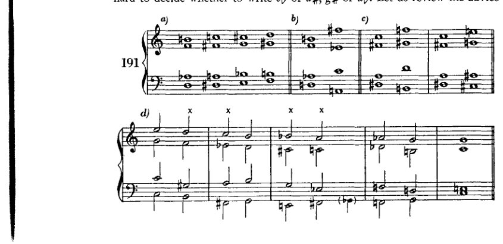

<!-- page 272 -->

260 在调性的前沿

如前所述：应以当下所讨论的段落最相似的调性为指引，而非以乐曲调号所指示的调性为准，并应尝试通过记谱法将此时的连接暂时与该假定的调性联系起来。但不可过于迂腐；我更倾向于那种避免重升号和重降号等复杂视觉形象的写法。在我看来，正确的记谱法就是那种需要最少临时记号的记谱法。通过一种能使人联想到另一种熟悉记谱法的记谱方式来表达每个和弦，将是可取的。此外，就旋律线而言，所有进行都应写成这样：至少某一声部中连续三或四个音的片段应参照大调或小调音阶，或半音阶；且从一个音阶到另一个音阶的过渡也应写成这样：它们能够出现在某种模式音阶中。这种记谱法的优势在于易于阅读，而另一种记谱法则甚至做不到它本该做的事，即：表达其派生关系。在某一进行中使用大量减七和弦是不可取的；其效果强烈，但这种强烈并无多大价值。这种效果太容易获得，不值得特别引以为豪。

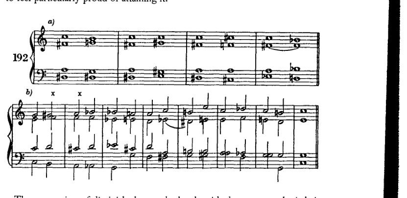

例192a展示了减七和弦与增三和弦的连接，使用了其中一个减七和弦。C大调中的一个乐句展示了其应用（192b）。

<!-- page 273 -->

*其他增和弦与漂泊和弦*

261

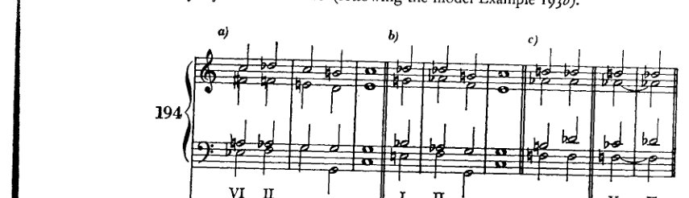

带减七的增六五、增四三与增二和弦。此处仅展示那些源自 II 的。其余的，学生不难自行尝试（按照范例 193*b* 的模式）。

那不勒斯六和弦（IInd 级）与两个减七和弦的连接非常顺畅（194*a* 与 *b*）。194*a* 中的那个应被理解为源自 VI，194*b* 中的那个则源自 *c* 小调的 I（小调下属区域）或 *C* 大调，这些解释都能产生良好的根音进行。然而，第三个只能被解释为 V。将其与 II 连接本身几乎没有什么价值，因为根音进行是下行的。这种连接也相对较弱，因为有两个共同音，只有一个作半音进行，而第三个音[第四个，即另一个音]，如果按其实际应有的记法（*b*），就必须作出一个不大可能的进行到 *d*♭。因此，如果说这种连接在和声意义上没有价值，它作为一种表现手段却可能相当有用。那

<!-- page 274 -->

262 调性的边界

《莱茵黄金》动机（194d）基于相同的根音进行¹，证实了[和声意义与表情意义之间的这一区别]（参见例173）。

例194e给出了其他音级上的那不勒斯六和弦的示例。

[乐谱：例195——钢琴谱，含高音谱号与低音谱号，多小节，包含各种和弦进行，两处标有"etc."]

[乐谱：例196a——钢琴谱，含高音谱号与低音谱号，多小节，包含各种和弦进行，两处标有"etc."]

[乐谱：例196b——钢琴谱，含高音谱号与低音谱号，多小节，包含各种和弦进行，在低音谱表下方标有"III"]

---

¹ [不存在*根音*进行；两个和弦具有相同的根音。]

<!-- page 275 -->

*其他增和弦与游移和弦* 263

[音乐记谱：钢琴谱，谱例197，标记为"a)"和"b)"]

[音乐记谱：钢琴谱，谱例197续]

[音乐记谱：钢琴谱，谱例198，标记为"a)"]

[音乐记谱：钢琴谱，谱例198，标记为"b)"]

[音乐记谱：钢琴谱，谱例199，标记为"a)"、"b)"和"c)"，注有"etc."和"not likely?"]

[音乐记谱：钢琴谱，谱例199，标记为"d)"和"e)"]

<!-- page 276 -->

264 在调性的边界

Example 199b中的两个增三和弦带来了重大困难。几乎找不到无需重新解释（等音变换）、增音程或减音程就能应付过去的位置。学生仍应避免此类连接。

要将增六五（四三或二）和弦与那不勒斯六和弦相连接，我们将前者视为属七和弦（或其中之一

<!-- page 277 -->

*其他增和弦与游移和弦* 265

其转位）的那不勒斯六和弦；因为，如前所述，增六五和弦的音响与属七和弦完全相同。在这种情况下，这个六五和弦通常这样记写：也就是说，如我们的例子所示，用*g♭*代替*f♯*。如果六五和弦在那不勒斯六和弦之后再次出现，然后进入六四和弦，就会产生一种极佳的进行（201*a*）。这种重复非常适合重新确立一个已经开始动摇的调性。

这些增和弦也常与 II 上的其他游移和弦相连接，尽管谱例 202*a* 中的和弦，由于 *f♯* 进行到 *f*，对于促成 V 的原位设置几乎不起作用（因为低音是 *g*）。但由于六四和弦[或 V 上的和弦]不必是目标，因此 202*c* 的延续也是可能的。此处的低音音程（†）以及 201*b* 中的（†），*d♭ – f♯*，当然只有在将其视为 *g♭* 并进行等音变换时才是可行的。但人们当然完全可以那样做！

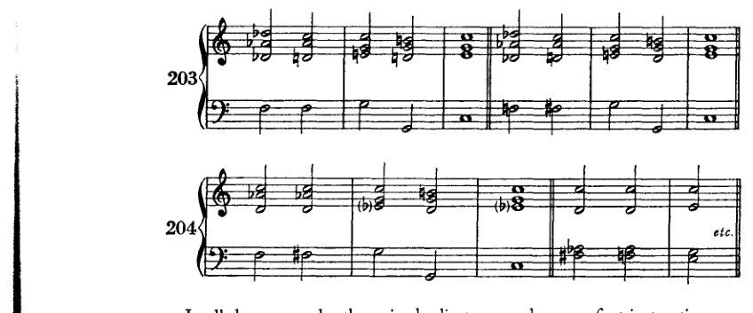

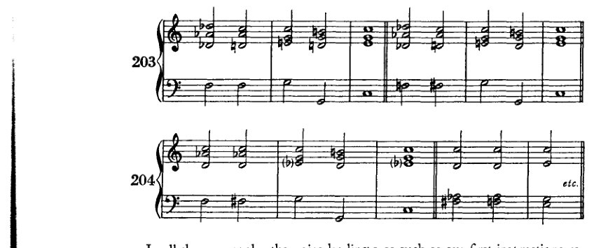

在所有这些例子中，声部进行都尽可能符合我们最初的指示。也就是说，我们避免了增音程、减音程、平行五度等。在连接出现问题的地方，增音程当然无法避免。而这时它们甚至是好的。因为必然性是最强的律令。但是，每当如这里所示，这些和弦之间的关系回溯到彼此相距甚远的调性时，那么试图将声部进行保持在一个调性之内，一个大调或小调之内，就会显得迂腐。必须演唱这种音程的歌唱者，如果想简化一个增

<!-- page 278 -->

266 在调性的前沿

音程。诚然，通过等音变换得到的音与平均律体系并不一致，而这个问题在当今的合唱音乐中造成了很大的困难。但这当然不能阻碍我们音乐的发展；因为很显然，我们在合唱创作中希望使用与器乐创作中相同的和声资源。在找到解决该问题的方法之前，或许很少会有合唱音乐被创作出来。然而，既然这一方法必须被找到，它就一定会被找到。对于器乐演奏者而言，这类音程以及另一些复杂得多的进行的音准，已不再构成什么大的困难。人们可以轻易向他们要求的范围正变得越来越广。但当然，学生绝不应试图在目前就运用所有这些可能性。他应该继续以旋律化的方式表达其声部进行中的半音化；他应该继续努力将某个声部中发生的事情尽可能长时间地与一个调性相联系，并且以最谨慎的方式进行转调。正如我一再提到的：既然他的声部不过是和声结构中必要的连接手段，既然它们的发展既不是由动机产生，也不为动机所辩护，那么除非有令人信服的理由，他绝不应偏离最简单的呈现方式。

最后，还应在此处补充减七和弦的其他几种解决可能性。

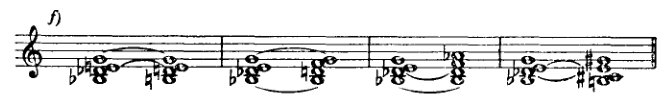

<!-- page 279 -->

*其他增和弦与游移和弦* 267

谱例205*a展示了减七和弦如何可以变为四个不同的属七和弦：每次减七和弦的一个不同音级下降*半音*并成为根音。（我们假定的根音[即把减七和弦看作省略根音的九和弦时]！）如果（205*b）我们每次保持一个音作为根音，并将其他三个音上行半音，那么我们就会得到另外四个属七和弦。用同样的方法，但在解决方面做适当调整，我们在相同的音级上得到大、小三和弦[三和弦]（205*c）。如果我们保持两个不相邻的音（减五度或增四度），并将另外两个不相邻的音上行半音，那么我们就得到第255页上呈现的变和弦的两种形式（205*d）。如果（205*e）我们保持三个音，让一个音上行，那么我们就会得到形式与大调VII级或小调II级上相同的副七和弦。如果我们保持两个相邻的音，让另外两个相邻的音上行，那么我们就会得到像大调III级上那样的副七和弦（205*f）。当三个音下降而一个音保持时，所得和弦与保持三个音、一个音上行时相同，但在其他的调中（205*g）（大调的VII级，小调的II级）[参见谱例205*e]。

我将这些连接作为补遗提及，因为：（1）它们的根音进行并非总是良好；（2）这种对和弦加以变化的方法，与本书其他部分所采用的阐述方法不一致；（3）这些连接通常只有伪和声意义：可以说，它们大多表现为和声的旋律进行，从而在节奏上顺应某一主要声部的运动。这种连接当然在转调中应用甚广，但通常是在并未意识到根音进行的情况下使用的；而这几乎毫无意义。
