<!-- page 280 -->

XV 向第二、第五和第六五度圈，向第七和第八五度圈，以及通过片段和中介调向更密切相关的五度圈的转调

对于这些转调的最初练习，学生最好暂时不用他刚刚学过的和声丰富手法。同样，他应该首先用最简单的方法进行这些转调，并使用最简单、最接近的关系。当然，通过运用前一章获得的和声资源，这些转调可以更快地完成。但重要的是，学生也要了解简单的、基本的手段，并学会仅通过这些手段就能平稳而恰当地达到目标，从而获得形式感。因此，他应该先掌握较简单的手段，然后才敢于使用较复杂的手段。对于后者，由于可能性极其繁多，指示不可能像对较简单手段那样精确。因此，在使用较复杂手段时，学生越来越需要依靠自己的形式感来加以修正。

向第二五度圈的转调，最简单地通过将其分成两个片段来完成。原调与新调很少有共同和弦。从大调向上看，共同和弦是属功能区的 III 和 V，其中 III 更接近第二五度圈；从大调向下看，共同和弦是下属功能区的 II 和 IV，其中 IV 更接近第二五度圈。当然，仅仅通过这些共同和弦进行转调并非不可能。而且在大多数教科书中，正是这样展示的。向上时，进行 I–III–V 产生的全是下行的根音进行，而 I–V–III 则相当好（例206）。

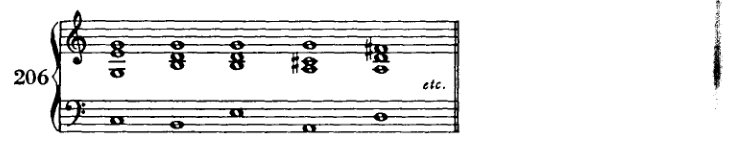

向下时，进行 I–IV–II 提供了一个可用且相当快速的转调。

<!-- page 281 -->

向各调圈的转调 269

然而，除非人真的身处必须匆忙应对的考场之中，否则他可以从容转调，可以筹划转调。人可以使得转调真正经由内在联系来完成，而非依赖偶然巧合。人可以这样做：为了取得某种特征性的效果，就动用特征性的手段。借着简单的三和弦序列向远关系调转调——这是大多数教科书所推荐的方法——是绝对糟糕的。这并非追随艺术的踪迹，而仅仅服务于诸多考试的目的；让那些没有天职的人去接受这些考试，是为了保护受召者免受被选者之害。¹ 而这正是它们[这些转调]所实现的目的：给学生提供一套方便易记的套路，很少让他失手——即便，而这也是考试最突出的结果，即便他惴惴不安。人极少有必要快速转调，当然在使用简单和声手段之处更是如此。远关系调的转调只出现在具备丰富转调手段的文献中。若有人怀疑此说，那就请看看巴赫的转调。他会发现：每当出现向远关系调的转调时，它总是渐进的、分段的，若然是突然的，那也是通过最强有力的手段达成的。通常是通过减七和弦，因为巴赫并不知晓其他强有力的转调手段。但巴赫的转调也是——这一点极为重要——通过预备性的经过音与换音来实现的，它们暗示了调性之间的关系。关键在于，一次看似突然的转调，几乎毫无例外，事先已经有所宣示：或是通过和声中某种不安或松弛，或是通过旋律中音程的变动——通常是扩大；在对位中则通过声部特有的增减 [声部？]；在力度上；也就是说，在所有相关的方面都有所宣示。此外，在声部进行中，枢纽和弦的转调潜能也常常事先得到暗示。这个和弦已经以一种暧昧的意味呈现，因此它的重新诠释随后便产生一种满足必然性的效果。而现在，据说学生仅凭和声就能完成这一切，使用的手段除了三和弦与属七和弦（属！七和弦！）之外别无其他；并且，作为整个构思的基础，他只需借助某种冷淡关系的偶然可能性即可。“因为你是我父亲姐夫的侄子，所以我是你的朋友。”我并非在倡导某种美学；我并不是说，这不美；我不会因自己不

---

[¹ 勋伯格在修订版中添加了这条评注——改写自圣经中的说法：蒙召的人多，选上的人少。如果只有“未被召者”（'Unberufene'）才须经受考试，那么“受召者”（'Berufene'）如何受到保护、免受“被选者”（'Auserwählte'）之害，这一点并不一目了然。或许他的意思是，这些考试乃是一种武器，用来保护那些资质平庸之人，使其既免受无才之辈的拖累，也免受那些罕见的天才创意之士的冲击；后者服从于自身天才的法则，因而蔑视那些被教导的法则。这些天才本应具有一种天生的天职，本应是选民，但或许既不会被考官召唤，也不会被考官选中。]

<!-- page 282 -->

270 各种调圈的转调

理解；但如果有什么东西缺乏稳重、缺乏优雅（*Ebenmass*），那就是这种转调方式。

将远距离转调分解为若干段落，就像本书中许多值得注意的内容一样，并非我的发明。它见于优秀的早期理论家（例如 S. Sechter¹）的教诲中。然而，那些肤浅的简化者，只因他们仅在结果中发现*意义*，而不在获得结果的*方式*中发现意义，便如此急于走捷径，他们在败坏旧理论的同时，也阻碍了新理论的发展。对他们来说，公式才是重要的东西；因此他们作为最终成果呈现的，不过是一种手段、一个窍门。既然对这些僵化的头脑来说，艺术必须是“理想的”，他们就把公式当作一条美学定律传下来。这些定律的为什么、何时以及怎么样，他们要么从来就不知道，要么早已忘记；因此他们认为这些定律是永恒的。然而，一种好的手艺完全可以照顾到它的实际需要，而不必诉诸美学。这一点他们永远不会理解。人们不应羞于满足材料的实际需要，并且可以公开承认这一点，不加粉饰，不加美化。这样人们就不会总是去做与正确相反的事了。那些人在一方面简化（通过压制意义，只保留其外壳，即公式），在另一方面却又使事情复杂化（通过“艺术地”粉饰这个外壳）。因此他们在一切重要事情上都失败了：因为他们给出的总是形式、公式，而非意义。他们的简单和复杂与内容的关系是不正确的。² 当必须复杂时，他们却是简单的；当可以直截了当时，他们却是繁琐的。在我自己相当狭窄的领域里，我早就明白这一点，但在另一个领域，我却不得不从一记我应得的响亮耳光中才学到它。那记耳光使我清楚地看到，我们在几乎所有领域的品味被伪装成简化者的“装饰家”（*Ornamentierer*）（正如 Adolf Loos³ 所称呼他们的）败坏到了何种程度。我曾为一架乐谱架勾画过一张草图，并把它拿给一位木匠看。它本该有两根立柱，由沉重的木撑连接在一起。我曾设想那些沉重的木撑会很美（很美！）。那位木匠，一个捷克人，甚至不能说流利的德语，他说：“没有好木匠会为你做那个。我们学到的是，连接件必须比柱子轻。”我感到无地自容。我曾把根本不实用的东西认作美，而一位懂行的木匠当然会毫不犹豫地抛弃这种美。理所当然：要节省用料！这确实是艺术的经济性；只应使用那些对于产生某种效果绝对必要的手段。其他一切都不着边际，因此是粗糙的，永远不可能美，因为它不是有机的。持不同想法的人是一个可笑的门外汉，一个没有理性、没有洞察事物本质能力的审美家（*Schönheitssucher*）。那位木匠懂他的手艺；他知道必须节省用料。我很乐意支付材料那点略微增加的成本；但在他看来这太荒谬了，因此，作为一位诚实且技艺精湛的木匠，他无法

---

¹ *Die Grundsätze der musikalischen Komposition* ..., pp. 32–4. Cf. *supra*, p. 113.]

² 也就是说，它们的简单或复杂是外在的、*a priori*，而非内在的。]

³ 建筑师，勋伯格的朋友。Cf. Schoenberg's *Letters*, pp. 144–6, 197, and 259.]

<!-- page 283 -->

向各五度圈的转调 271

不愿参与这种无稽之谈。尽管如此，我们的美学家们仍在追寻美。
他们把已发现的形式视为既定的东西，把随意的形式可能性当作形式
必然性；并声称在其中看到了永恒的法则，尽管他们自
己也知道有些形式并不适用于这些法则。于是这些形式就成了
例外。美学家们很少想到要在纯粹实用的事物中，在适合工匠、
对工匠而言合乎情理的事物中，去寻找这些形式的起源和更深层的意义。他们宁愿“在迷雾中寻路”。在
那片混沌的、原始的非理性迷雾中，即便如此，一个理性的世界
也可能偶然从中涌现。然而，随后将这种理性视为世界的理性，并将世界等同于这种理性，这是值得怀疑的。

因此，当然可以按照这些教科书所推荐的方式进行转调。
然而，我更喜欢老式的方法，尤其是在处理较简单的
和声时。在那里，转调并非被直接沿着轨道推往目的地。
相反，先在调性的多个点上打开缺口，然后至少有两到三条主流，
从不同点出发，在某处汇合以协同行动。

第二五度圈的各调彼此之间，不如第一、第三或
第四五度圈的各调那样关系密切。在第一五度圈中，
一个调的 I 级与另一个调的 V 级之间存在直接关系：*C* 大调的
I 级是 *G* 的 IV 级或 *F* 的 V 级。而在第三和第四五度圈中，
使用小调的 V 级来构成大三和弦，看起来像是这个 V 级倾向的实现，
如同一种必然。诚然，在第二圈这里，*G* 也是 *D* 大调的 IV 级，而 *F* 是 *B♭* 的
V 级；但 *C* 既不是 *D* 大调也不是 *B♭* 大调的一个音级。这种
重新解释只能按如下方式进行：*C* 的 I（V）级是 *G* 的 IV（I）级，*G* 的 I（V）级
是 *D* 的 IV（I）级；并且：*C* 的 I（IV）级是 *F* 的 V（I）级，*F* 的 I（IV）级
是 *B♭* 的 V（I）级。由此我们立刻就能看到调性组合的必要性，以及所涉及的
组合类型。最简单的方法是，将途中恰好经过的第一五度圈的调选作“过渡调”*，
也就是说，实际上是把两个第一圈的转调相加：1 加 1 等于 2。之后学生也可以
选择其他的过渡调（最终可以选择好几个）。于是，我们从：

\* 我已尽可能推迟引入过渡调这一假设，而且即便在此处，我也只能将其作为一种学习辅助手段来接受。首先，因为在我看来它是多余的；因为我们借助副属和弦，就能更为普遍地展示过渡调所完成的内容。此外，因为把一部作品中发生的一切都看作源自一个调性中心，这是可能的，而且更好。否则，几乎所有转调在艺术作品中呈现的形式就没有真正的意义。否则，如果偏离主调与返回主调并非由单一的能量来源所决定：基本调，那么回归主调也就没有真正的意义。我在这里再次假设存在过渡调，仅仅是基于我先前承认它们时的那种意义：作为学习的辅助，作为学生将复杂事物分解为部分从而使其简化的手段。只是因为那样更容易掌握。一旦半音音阶被确立为和声思维的基础，那么我们将能够甚至把这类转调也解释为调性的功能，并在此处同样假定我们并未离调。这类似于我们此刻在终止式中所做的，终止式很快将包含从前被视为转调性的一切内容，而现在仅用于表达调性。

<!-- page 284 -->

272

向各调圈的转调

*C* 大调经由 *G* 大调或 *e* 小调转至 *D* 大调

*C* 大调经由 *G* 大调或 *e* 小调转至 *b* 小调

*a* 小调经由 *G* 大调或 *e* 小调转至 *D* 大调

*a* 小调经由 *G* 大调或 *e* 小调转至 *b* 小调

*C* 大调经由 *F* 大调或 *d* 小调转至 *B♭* 大调

*C* 大调经由 *F* 大调或 *d* 小调转至 *g* 小调

*a* 小调经由 *F* 大调或 *d* 小调转至 *B♭* 大调

*a* 小调经由 *F* 大调或 *d* 小调转至 *g* 小调

中间调当然不像转调的目标调那样稳固确立；否则它也同样需要一个终止式。它保持得足够松散，以便容易从中离开，但又陈述得足够清晰，以搁置原调。只要不使用前一章所讨论的更强转调手段，学生就应当妥善处理诸如小调音阶第六音或第七音之类的敏感音。显然，我们也可以使用两个中间调，例如 *C* 经由 *G* 与 *e* 小调转至 *D*。仅举数例如下。学生现在已能够在第一五度圈中以多种方式进行转调。由此，他可以获得大量的开头与同样大量的续接。

<!-- page 285 -->

至各五度圈的转调 273

d) a—e—D

e) C—e—G—b

f) a—G—e—b

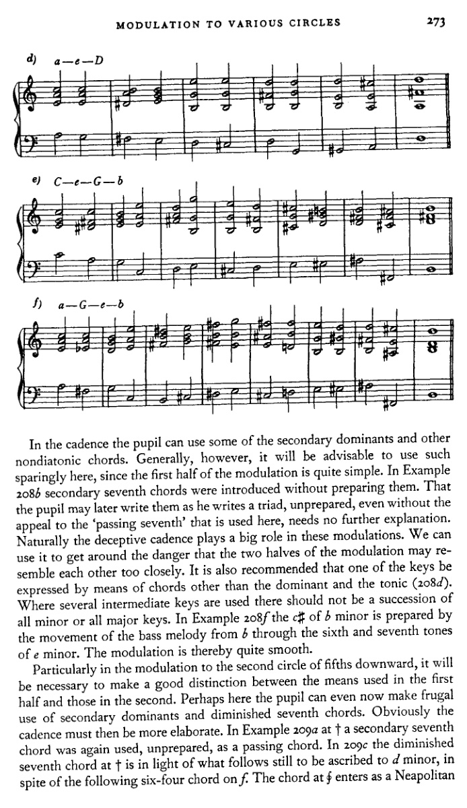

在终止式中，学生可以使用一些副属和弦及其他非自然音和弦。然而，一般来说，这里最好少用此类和弦，因为转调的前半部分相当简单。在例208*b*中，副七和弦未经预备便被引入。学生日后可以像写三和弦一样，未经预备地写出这些和弦，甚至无需借助此处所用的“经过七音”，这一点无需进一步解释。当然，阻碍终止在这些转调中扮演着重要角色。我们可以利用它来避免转调的两半部分过于相似。还建议用属和弦与主和弦以外的和弦来表达其中一个调（208*d*）。在使用多个中间调的地方，不应连续使用全小调或全大调。在例208*f*中，*b*小调的c♯由低音旋律从*b*经*e*小调的第六级和第七级音的运动所预备。因此转调相当平滑。

特别是在向下转调到第二个五度圈时，有必要将前半部分与后半部分所使用的手段明确区分开来。也许在这里，学生现在就可以节制地使用副属和弦和减七和弦。显然，终止式那时就必须更为精细。在例209*a*的†处，一个副七和弦再次未经预备地作为经过和弦使用。在209*c*中，†处的减七和弦鉴于其后的进行，仍应归属于*d*小调，尽管其后出现了*f*上的六四和弦。§处的和弦作为那不勒斯

<!-- page 286 -->

274

向各调的转调

六级音，但随后被当作B♭的IV级处理。显然，所有这些转调都可以写得更简短。但不应如此；学生尤其不应如此。相反，他应该学会充分利用所授的手段。接着

a) C—F—B♭

b) C—d—B♭

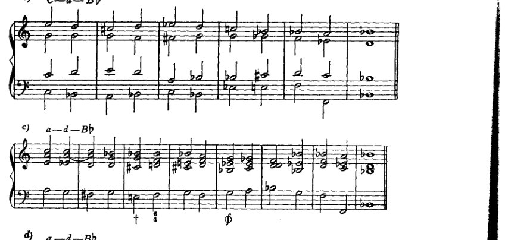

c) a—d—B♭

d) a—d—B♭

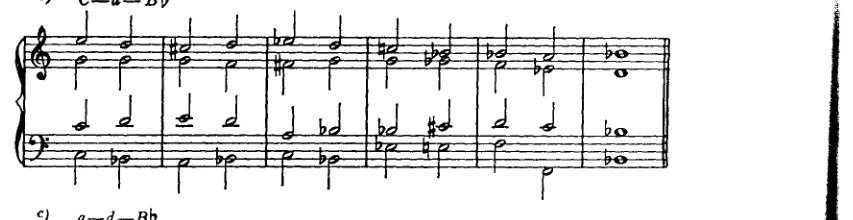

e) C—d—F—g

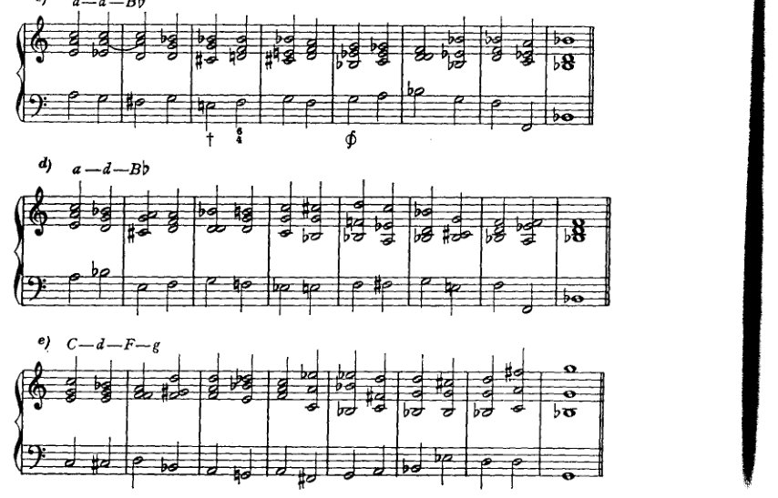

<!-- page 287 -->

向各调的转调

275

5) a—F—d—g

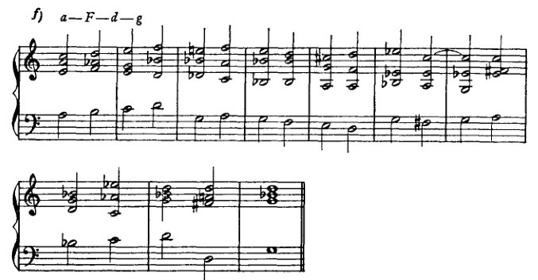

此处他拥有大量这样做的机会。我有意将这段转调处理成如此长的乐句；尽可能多地包含内容本身就是目的所在。学生的形式感很快就会使他注意到，每当他更充分地展开某一部分时，后续部分便被施加了某些义务。后续部分不能随他所愿地长或短，而是会有一些不可避免的要求：在和声或可能也在旋律线条中使用某种特定手段；总之，接续不是自由的，而是受约束的。然而，它不是受法则约束，而是受形式感约束。学生最好严格注意这一点，切勿通过压抑自身的形式良知而草率地将其略过。

一旦他用这些简单手段进行了足够的练习，就可以进而接触更复杂的。我建议他的作业大致按照前几章引入各类和弦的顺序来进行。这样，已学内容将得到复习，而[使用每种和弦的]可能性数量也会增加。

在Example 210a中，中音声部使用了两个四分音符以纳入属七和弦的七音。学生偶尔可以这样做；但他也可以自由使用七音，不顾及对斜关系，尤其是使用属七和弦时。

在210a的⊕处，这些音级被标记为II–I–II，尽管这些和弦与这些音级上的自然和弦几乎没有相似之处。但我们当然知道这个II是什么：它是那不勒斯六和弦各音的一种转位（原位）。在此以及类似情况下，为了更容易地把握根音进行，我们可以将那不勒斯六和弦想象为主和弦，并暂时称其为I。那么随后的减三和弦就是这个假想的I上的VII，而进行即为I–VII–I，这是相当熟悉的。然而，由于这里的那不勒斯六和弦位于II上，因此这个看似C♭大调I–VII–I的音级序列实际上是B♭大调II–I–II的一种形式，而这里的那不勒斯六和弦被当作一个*准*主和弦，*仿佛它是C♭大调*。学生在此不应谈论

<!-- page 288 -->

276

**至各五度圈的转调**

[音乐记谱：a) C—F—B♭ 转调示例，附带数字低音分析，显示 CI、FV、V、VI、II、VII、VI、II、IV、I、gII、VII、II、III、V、VI、II]

[音乐记谱：b) a—F—g 转调示例，附带数字低音分析，显示 B♭I、II、II、V、FII、II、I]

[音乐记谱：b) a—F—g 转调示例的续段]

不过，就 C♭ 大调而言，更应记住，他这样设想仅仅是为了有助于学习。

**第五与第六五度圈**

至这些圈的最简单转调，也将是那些被细分的转调。它们最好是两次、也可能是三次简单转调的组合（例如转至第一、第三和第四圈的转调）。因此，至第五圈的转调可以是一种组合，即 4 加 1 或 1 加 4：也就是说，先转至第四圈，再从该调转至其第一圈；或者相反，先转至第一圈，再转至该调的第四圈。至第六五度圈的转调可以由 3 加 3 构成。由于后者无论向上还是向下都会导向同一调（C 大调转至 F♯ 大调或 G♭ 大调），我们可以用向上或向下两种方式来实现 3 加 3。但通往第 6 圈的路径也可以这样组合：3 加 4 减 1，或 4 加 3 减 1，或减 1 加 3 加 4，

<!-- page 289 -->

*第五和第六圈* 277

或减1加4加3，或甚至4减1加3以及3减1加4，等等。* 人们也可以用多种方式组合出到第5圈的转调：3加3减1，或3减1加3，或4加4减3，等等。有时甚至可以使用复合方式，3加2或2加3，尽管2本身已经是复合的，1加1。至于中间调确立的程度，关于第二圈转调所说的内容在此处同样适用。副属和弦、减七和弦以及其他游移和弦在这里都会很有用。但在这里，同样建议学习者首先尝试用简单的手段进行练习。需要练习以下转调：从*C*大调和*a*小调到*D♭*大调、*b♭*小调、*B*大调、*g♯*小调、*G♭*大调、*e♭*小调、*F♯*大调和*d♯*小调。

\* 此处的加号和减号应根据当前涉及的方向来理解。因此，在五度圈下行时，减号（−）表示相反的方向，即上行。这样我们就可以用数学方式表达这些转调：到±第5个五度圈：±(4 + 1)；或到±第6个：±(3 + 4 − 1)，±(− 1 + 3 + 4)等等。

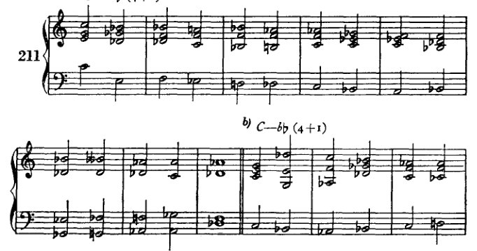

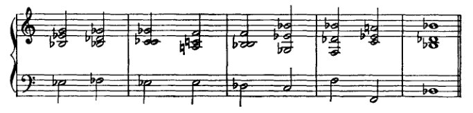

<!-- page 290 -->

278

**转调至各调圈**

**c)** C—B (1 + 4)

[音乐记谱：钢琴谱，含高音谱号与低音谱号，8小节，从C转调至B大调]

**d)** C—g# (3 − 1 + 3)

[音乐记谱：钢琴谱，含高音谱号与低音谱号，两行各8小节，从C转调至g#小调]

**e)** C—Gb (3 + 3)

[音乐记谱：钢琴谱，含高音谱号与低音谱号，两行各5小节，从C转调至Gb大调]

**f)** C—eb (3 + 3)

[音乐记谱：钢琴谱，含高音谱号与低音谱号，5小节，从C转调至eb小调]

<!-- page 291 -->

*第五和第六圈*

279

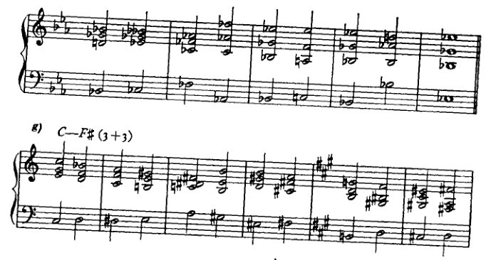

g) **C—F# (3+3)**

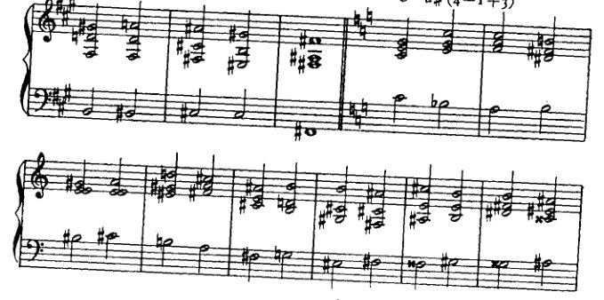

h) **C—d# (4—1+3)**

i) **a—Db (4+1)**

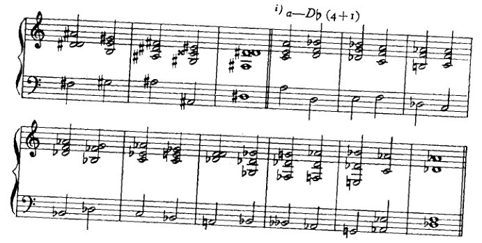

<!-- page 292 -->

280

**向各调的转调**

**k)** *a—bb (1+4)*

[乐谱：带有高音谱号和低音谱号的钢琴谱，展示从A小调向降B大调/小调的转调，数字低音标记 (1+4)]

---

**l)** *a—B (1+4)*

[乐谱：带有高音谱号和低音谱号的钢琴谱，展示从A小调向B大调的转调，两行谱表，数字低音标记 (1+4)]

---

**m)** *a—g# (−1+3+3)*

[乐谱：带有高音谱号和低音谱号的钢琴谱，展示从A小调向升G大调/小调的转调，两行谱表并以 † 符号标记特定和弦，数字低音标记 (−1+3+3)]

---

**n)** *a—Gb (4−1+3)*

[乐谱：带有高音谱号和低音谱号的钢琴谱，展示从A小调向降G大调/小调的转调，数字低音标记 (4−1+3)]

<!-- page 293 -->

第五和第六圈

281

o) a—e♭ (3—1+4)

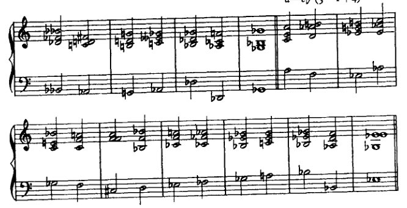

p) a—F♯ (4—1+3)

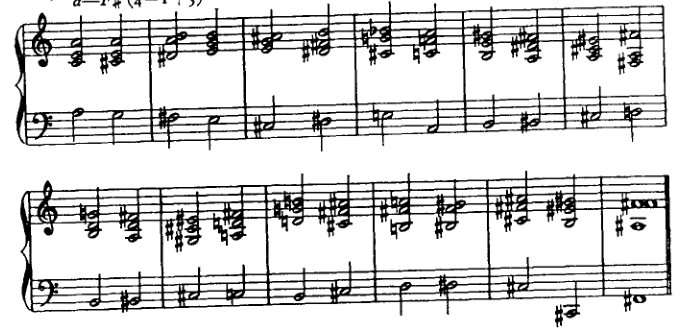

q) a—d♯ (1+4+1)

<!-- page 294 -->

282 转至各调圈的转调

在这些例子中，我大量使用了最后研究过的转调手段。例如，在211c中，C–G的转调由那不勒斯六和弦引入，而在211f中，f小调的那不勒斯六和弦本身则由适当的增四三和弦引入。这些手段使我们能够在三度、四度圈转调中省略"在属音上徘徊"。我想在此指出我的转调与我所批评的那些"快速"转调之间的区别。可以说：我把如此远关系的和弦并置在一起，毕竟我的和那些其他的"快速"转调之间没有什么区别。但有一个区别：在那些转调中，这些和弦被期望实现转调，而在我的转调中，它们只是引入转调，为转调铺平道路；它们带来那种将容许转调的不确定性。在这里，眼睛始终盯着目标，并为到达该目标做准备。我在一本非常著名的和声学教科书中¹发现了用这里所批评的手段实现的同样遥远的转调。然而，该书例子效果很好，人们可能会认为像我这样郑重其事地处理这一点是多余的。但如果仔细观察，就会注意到这些例子的作者——他是一位在曲式方面相当熟练的作曲家——遵循他的曲式感，并通过做与我本质上相同的事情来实现平滑的转调，只是无意识地：他准备了新调，即目标。正如我所说，他更多地是通过这种手段，而不是通过他实际推荐的转调手段，无意识地达到了目的。但那么他为什么不推荐前一种手段而推荐后一种呢？因为他没有意识到这种差异，他的合作者、他的撰稿人也没有意识到，后者的雄辩是语言上的[而非音乐上的]。

确实，令人满意的转调取决于这种对新调的准备！例如：在211a中，第二个和弦，低音e上的增六五和弦，已经暗示了降D大调的降g，而解决到六四和弦又是另一个这样的暗示。两者都还不是降D大调，只是朝那个方向的一步。211b中发生了类似的情况。在211c中，可以称为b小调的第三小节，指向终止式的B大调；在211k中，降b上的那不勒斯六和弦（第三小节）指向降b小调，等等。学生会在例子中发现更多这类情况。他自己当然应该努力追求类似的东西。即使结果不好，也没有什么害处。（我自己的例子当然不是什么杰出的"艺术成就"，只是意在提示、启发；绝不应被视为典范。）重要的是：人们努力追求某种东西。是否达到则是次要的。

大多数教科书中推荐的一种手段，也偶尔出现在例211中，就是*模进*。模进是一种很适合创造连贯性的重复。重复可能是单调的；正确使用的话，它能加强和强化。有许多种类的重复，在某种意义上或另一种意义上帮助创造曲式。然而，阐述它们属于曲式研究的范畴，因为它们立即引出了主题和动机的话题。因此，这里只涉及以下一般性观察。模进

---

[¹ 这一文本在勋伯格作品的任何版本中都未被确认。]

<!-- page 295 -->

*第五与第六圈* 283

是某一片段音乐的精确重复。和声模进如下：某一和声进行（至少包含两个和弦）在首次出现后立即再次出现；但第二次（这正是模进与单纯重复的区别）它从不同的音级开始，上行或下行大二度或小二度、大三度或小三度、纯四度或增四度。和声模进是一种备受青睐且非常有效的构建音乐形式的手段；因为它保证了连贯性与统一性，并且凭借其清晰、宽广的呈示，有助于听众的理解（因为它重复了听众可能在第一次听到时错过的内容）。而这一切的实现，都不需要作曲家另行构思形态不同的续段；因此，他不必多费心神，只需将两个同等形式的思想恰当地彼此衔接，不留缝隙地连接起来即可。由于模进本身是好的，所以它被大量使用。然而，这种轻松的“领土扩张”实在没什么可取之处，因此必须谴责对它的过度使用。我并不反对学生偶尔使用它。事实上，如果他已经将材料安排得能够进行模进重复，那么这种成就倒是值得称赞的。我也不反对他如建议的那样使用它，例如，可以说分两步进行转调。但我必须警告不要使用过频；因为这种工作的图式化特征，它带来的回报甚微。

在某种程度上，当伴随它的和声并非模进时，某一片段旋律的移调重复也应被视为模进。在我看来，这种模进总是更有价值，因为它不那么机械。例子可见于211*m*和211*p*的女高音声部。

学生可以自行选择其他的复合转调。比如说，如果他已为第五圈选择了4加3减2，那么转调可以如下进行：从*C*大调经过*E*大调到*C♯*大调，再（经过*F♯*大调）回到*g♯*小调（212*a*）。

但这样的方案可能过于复杂。如果要把这次转调的每一个部分都相当充分地展开，那么整个段落就会变得很长。然而，如果把它处理得很简短，那就又会回到那种过于仓促的转调，对此我只能认为它好

<!-- page 296 -->

284

转调至各圈

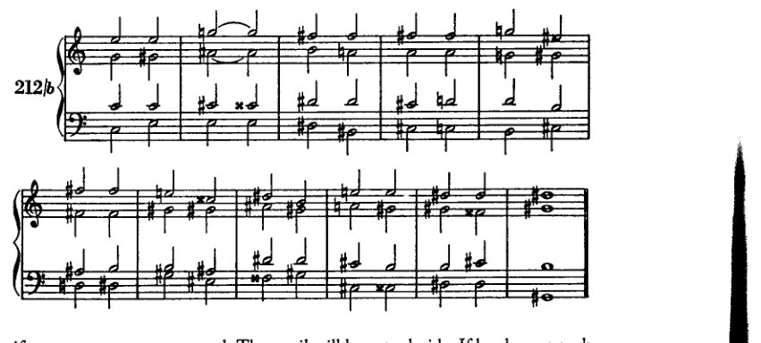

如果采用非常强烈的手段。学生必须自行决定。如果他选择这样一条繁多而复合的路径，那么他就必须考虑到这个例子将会非常冗长，并且他必须尽可能用强烈的转调手段来消除各个阶段之间的接缝。谱例212b展示了该问题的另一种解决方案，基于一个不那么复杂的方案。

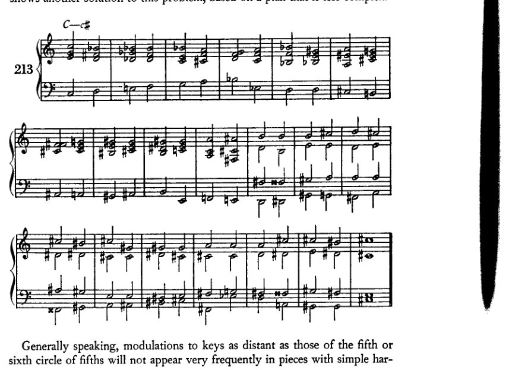

一般而言，远至五度圈第五或第六圈的转调，在织体简单、和声单纯的乐曲中并不会十分频繁地出现。

<!-- page 297 -->

*第五与第六圈* 285

和声；因为一部转调如此密集的作品需要相应更强的转调手段。因此，以简单手段完成的这类练习，绝不可能像那些转调至较近调性的作品那样顺畅，而以简单手段转调至第七、第八、第九圈等的作品亦然。后者是一些复合体，若作为反向的第五、第四、第三圈等则本可更容易到达。例如，从*C*大调转调至*Cb*、*Fb*与*Bbb*大调，在相反方向上，即是转调至*B*、*E*与*A*大调。然而，人们常常必须采取更为复杂的路径；因此学生应当练习它。但我不为此提供范例。在简单的例子中，这会显得不协调；但在复杂的例子中，由于我们在此并无理由追求复杂，它则会显得浮夸而做作。制作这类例子，对无能之人比对有大才之人更为容易。老一辈大师通常将他们的转调限制在近关系调内，即使在展开部中也是如此。尽管如此，人们仍时常发现远关系调被突然插入，以粗粝的手段、未经和声准备地作为一种意外效果（贝多芬，c小调三重奏）。¹

如Example 213所示，在如此狭小的空间内如此频繁地变换调性，仅见于后瓦格纳时代的文献中。在那里，目的当然并非抵达一个新调，而是离开一个旧调——且从一开始便从未真正立足于其中。此时，和声可以说被旋律所引导。和声的丰富性、它的不安定、它的急速曲折变化，与主旋律中这些同样的特征相对应，而和声则作为一种对位性的伴奏声部依赖于主旋律。这类东西以练习的形式出现时，很难取得好结果，正如我的Example 213所示——即使不算证明，至少也是展示：因为我肯定能写出更好的东西。尽管如此，学生仍应尝试这类练习，因为否则他将无法了解自己用于转调的资源。

> [¹ 第一乐章，展开部开头，以及末乐章将近结尾处（*eb*小调至*B*大调，*c*小调至*b*小调）。]

<!-- page 298 -->

XVI 众赞歌和声编配

我将这些练习纳入本书，尽管我对它们存有若干异议，因为我对它们的目的持有不同看法。首先：人并非去“配和声”，而是借助和声来发明。然后，人或许会做一些修正。然而，理论并不能使人注意到缺陷之处；这些是由形式感发现的。此外，修正本身也并非通过理论而找到。有时，它或许是通过大量试错而寻得；但一般说来，它来自灵感的闪现，也就是说，凭直觉、通过形式感、通过想象力而来。至少我的经验告诉我是如此；而持相反观点的，只能是那些亲自去“配和声”的人，他们因此不具备*用和声来发明旋律*的能力。我们不能否认，有些主题的和声应当与其最初被构思时有所不同。而且我们必须承认，有时在一个原本可用的初学者构思中，会在某处出现和声上的弱点，要修正它就要求为整个构思采用一种不同的和声编配。但这两种可能性都不符合我们实际上所理解的“配和声”。无论在哪一种情况下，都不是在一段原本没有和声的旋律上附加和声。在两种情况下，我们面对的都是一段已在和声上得到明确表达的旋律，其作者了解它的和声与结构，并仅仅着手去改变它。一方面，当他为了变奏而改变它时，他的任务正是如此：利用该构思内在的其他和声可能性，发掘其独特性。另一方面，当他进行修改时，所涉及的只是个别不佳之处；但整体已经配好了和声，他也知道这和声。他可能只是写错了，或者在继续展开主题时没有充分倾听和声的倾向。这种“倾听不充分”的情况，我在学生身上经常观察到。就连有天赋的学生也会如此，但这很容易克服。

但即使在进行修改时，以及在和声变奏中，新的形式也不应当是计算出来的，而应当是发明出来的。认为艺术可以被计算，这是一种错误；而美学家们对“思考型”艺术家的“任务”所持的观念，也完全是错误的。他们想让我们相信，这位艺术家的全部成就就在于以高雅的品味和精密的计算，从现有的可能性中挑选出最有效的一种。然而，艺术创造力运作于一个更高的层面。在我自己的作曲中，我不止一次地看到，初稿中不好的东西永远不会变好，即便我做上一百处修改也无济于事。但通常情况下，初稿中涌现出的形式所具有的那种流畅性，是任何修改都无法产生的。因此我想说：如果在一个构思中发现了一处缺陷，而这处缺陷无法在最初的灵感仍在发挥作用时得到修正，那么或许最好放弃这个构思，或者连同它与生俱来的缺陷一起保留下来。这个缺陷总会比那些由修改引入的缺陷更轻微。这并不是说学生不应该做修改，因为如果不这样做，老师也无法改进他。相反，学生应当充分发挥他的才智
