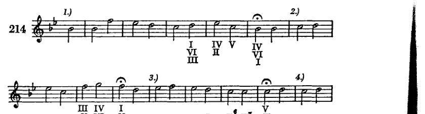
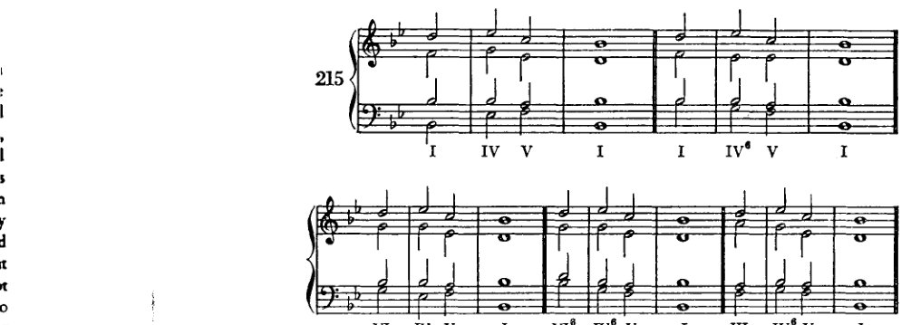
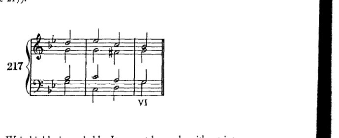
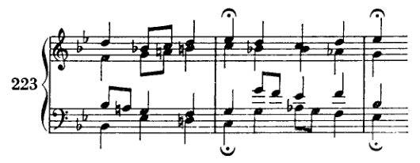
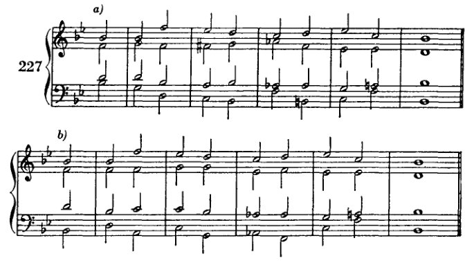

<!-- page 299 -->

合唱和声 287

与品味。他仍然是一名学生，仍在学习；他只是在练习。他只想进步到足以能够表达一些东西，如果他有任何东西要说的话。学生应该思考；但艺术家、大师，是靠感觉（*Gefühl*）来创作的。他不再需要思考，因为他已经达到了一种更高层次的自我表达需求回应。学生应该修正（*verbessern*），但他不应该产生这样的想法，即通过修正作品会变得更好（*besser*）。他能从修正中获得的益处只能是：这能使他意识到，如果作品从一开始就没有这个缺陷，它本可以如何更好。这也能帮助他知道下次该怎么做。这样他就能在创作行为中立刻更加小心；而在"诞生之际"、在最初灵感的热度尚存时进行修正，几乎不会造成任何伤害。但事后的修正很少有什么益处。

这里可能会提出一个反对意见：如果我谴责和声练习，因为艺术家不是在进行和声编配，而是与旋律一同创造和声，那么为什么我让学生通过写下根音（数字低音）并从中构建乐句来创作乐句呢？毕竟，和声编配只是一种练习，如同勾勒根音进行一样，重要的是练习给学生带来的益处。我对这一反对意见的回复如下：首先，勾勒根音进行至少有一点与实际情况相似，即在根音代表和声的程度上，学生实际上是在思考和声，即使这是通过数字的迂回方式。起初他思考的是数字，但后来，是和声（*Klänge*）！而另一方面，和声编配几乎与实际情况没有任何相似之处。其次，即使学生确实必须作为练习去做很多大师不做的事情，正如我上面所展示的，但这并不意味着学生*应该*去做大师*绝不能做*的事情！第三，我希望，通过之前所有的练习，我们已经进步到了这样一种技能程度，以至于我们不再想做这样的练习，即使它比勾勒根音进行更好。但它并不好。

那么，如果我给出和声编配的练习，我的目的不是教学生如何做我不应该做的事情；而是通过一种他的想象力（*Phantasie*）还不需要参与的范例，来加强他的形式感。他得到一段旋律。这不是他自己的；因此他对它的和声编配永远不可能像创作它时伴随的和声那样好。既然这样，他就不必为这个范例的部分失败负责，他产出的东西不完美也就无关紧要了；而且他对这段旋律的"虐待"也不会造成什么损害，因为它当然不会被永久地束缚于糟糕的和声。恰恰相反。这项工作就像年轻医生在尸体上进行的解剖练习：如果他们切得太深，没有人会受伤。如果合唱和声编配结果不好，又有什么关系呢？反正它不会被出版。但通过这样一个简单的范例，学生可以学会将他的形式感集中于旋律中发生的事情，并练习将一段旋律作为一个整体来思考，为他自己将来必须完整地创作旋律、并配以和声的时刻做准备。

因此，我将把和声编配练习用作预防，以比平时更彻底地防范那些因形式感

<!-- page 300 -->

288 众赞歌和声编配

形式感尚未经过训练。但我不会为这些练习提供现代旋律。
众赞歌旋律的形式如此简单，且距我们如此遥远，以至于我们
或许能够看透它；我们或许真能以紧密模仿所必需的精确性，
感知其关系。此外，也就不绝对有必要讲授原本属于曲式学
的内容。但更为现代的旋律，即使我只将莫扎特或贝多芬的
作品归入此类，也展现出如此复杂多样的形式，以至于学生
若无专门准备便无法驾驭它们。

当然，一个听觉敏锐的学生即使在这种情况下也可能得出良
好的解答。如果学生自行进行此类尝试，我并无异议。他最
好抄录一段贝多芬、莫扎特或勃拉姆斯的主题，或另一位大
师的作品（但必须是大师；其他的都不够好！），试着为其
配和声，然后与原作比较。最重要的是，他应该清楚自己的
和声编配比范例逊色，并应设法探究原因何在。事实上，学
生同样可以为自己听过并记住的主题配和声，然后与范例比
较。即使学生记住了原作的和声并仅凭记忆将其写下，这
一练习的目的也已达到。因为所有这些练习的目的，实际
上与其说是真正去构建一段和声（去构建！），不如说是——
若要使结果不显得生硬——巧妙地运用并以理论意识去监
控耳朵从类似案例中所*记住*的东西。

但要我自己发明旋律，让学生来承受其和声编配之苦——我
拒绝这样做，尽管我确信自己能发明出比某些和声学教材作
者竟敢写出的那种可怜东西更好的东西。这种胆量暴露了
他们在形式问题上缺乏鉴别力。如果我允许学生自由发挥他
想到的东西，那么成果即使不够流畅也无妨。因为首要目标
在于让他独立练习和声编配。出现的错误存在于他的思维中，
可以在那里解决。然而，如果我让他受制于一段给定旋律的
要求，那么这段旋律就应当好到只有大师在灵感降临时才能
创作出的程度。否则，错误将不仅存在于学生的思维中，也
存在于发明这段拙劣旋律者的缺陷思维中。届时纠正就会困
难，因为很难查明错误究竟出在和声上还是旋律上；这对学
生也不公平，因为他几乎无法抵御老师的错误。就我而言，
我没有灵感去为和声练习发明旋律。如果我有，那我也不会
把它留给我的作品，这不是因为目的太微不足道，而恰恰因
为它是一个目的。至于另外那些人——那些把自己发明的旋
律强加给学生的人——如果他们声称自己在发明这些旋律时
受到了灵感启发，考虑到那些生硬、笨拙的结果，我可不会
把这种灵感看得很高。如果学生的作业笨拙且充满错误，这
确实不是灾难，只要那笨拙是他自己的，错误也是他自己的。
他可以一遍遍地划掉它们。但如果老师在一种他绝不能失败
的方式上失败了：作为*楷模*（古斯塔夫·马勒曾用一个词如
此概括教师的本质），那就是一种罪过。A

<!-- page 301 -->

众赞歌和声配置 289

一个要求学生为自己拼凑的旋律配置和声的老师——而这些旋律并不好，也不可能好——这样的老师不配作为榜样。想要练习为更现代的旋律配置和声的学生，也应该从相关作曲家的作品中选取这些旋律。正如我说过的，我并不认为这种练习特别有必要。但谁若相信它，不妨去做；如果他按照所建议的方式去做，至少不会有害。

现在来谈众赞歌。

像每一种艺术形式一样，众赞歌也具有清晰的分段。分段（*Gliederung*）对每一个乐思而言都是必要的，就在它被表达出来的那一刻；因为，尽管我们瞬间就将一个乐思作为整体来思考，但我们无法一次性说出全部，只能一点一点地来：我们将不同的组成部分依次排列，这些部分是我们分解乐思而成的，而分解的方式与我们组合它的方式并不相同¹，从而或多或少地精确再现其内容²。

在音乐中，我们把旋律或和声进行看作乐思的组成部分。然而，这一概念只有在涉及可见或可闻之物时、在涉及音乐中那些可被感官直接感知的方面时才是正确的；它仅仅通过类比适用于构成音乐乐思实际内容的东西。但我们仍然可以假定，记谱法成功地象征了音乐乐思，而音符所展现的形式与分段对应着乐思的内在本质及其运动，正如我们身体的凹凸起伏由其内部器官的位置所决定——事实上，每一个构造良好的有机体的外在形态都与其内部组织相对应，因此其天生的外在形态不应被视为偶然的。

因此，人们可以由外在形态推知其内在本质。

众赞歌的分段是通过每个乐句结束处的停顿来实现的，这些停顿与每一行诗文的结尾相重合；这些停顿将乐思划分为若干部分。在这种简单的艺术形式中，各个部分彼此之间通过最简单的对比或互补形式相关联。这种类似马赛克般的部分组合不允许非常复杂的关系，而作为其统一元素的，则是或多或少简单重复的原则。将潜藏于乐思之中的运动引发出来、而乐思唯有通过这种运动才获得生命的，尤其是由简单的离调所产生的对比。这些对比只是适度的；它们不至于大到使连接变得困难。将它们联结在一起的是节奏运动的统一性、直率、朴素，而最重要的是调性；将它们分开、造成细分的，实际上却是一种消极的东西：在发展与连接中动机活动的几乎完全缺失。正是由于这种动机义务的缺席，各个部分才未能更紧密地联系起来；这些彼此不相连的部分相互之间没有特别的义务；或许总体而言它们只是彼此并置。

---

[¹ '……组成部分，我们对其进行分解的方式与组合的方式不同……']

[² 参见1911年版，第322页：“……我们必须把乐思分解成各个组成部分，而这些部分重新组合后，便能或多或少地精确再现其内容。”]

<!-- page 302 -->

290 众赞歌和声编配

而不是彼此关联。自然，朝向动机化活动的倾向并非完全缺失；因为那以二分音符（或四分音符）几乎不间断、均匀进行的简单节奏原则本身，在某种程度上就是一种动机，或者至少是一种接近动机性的形式原则，尽管它非常原始。自然，人们还能发现其他类型的联系；但整体的朴素性使得动机（节奏性的与旋律性的，其中作为连接元素的主要是节奏性的，几乎从来不是旋律性的）处于一种如此暧昧的状态，以至于旋律线条中的关系与连贯性几乎只能通过对立来辨认。然而，对立也是一种关系。如果众赞歌的某一行歌词旋律上行，而下一行下行，那么这就是一种起连接作用的对立。下行缓解了上行所造成的紧张；“问与答”是对这类现象的贴切比喻。由于在简单的艺术形式中，运动的主要方向总是很清晰的，所以和声显然会与旋律走同一条路；显然，和声必须力求精确地追随旋律的蕴涵与倾向，支持它们，并预先为它们的最大利益做出安排。反作用、阻碍、转向，以及所有心理上更为复杂的艺术技巧，我们都应或多或少地排除在这种直截了当的、原始的、民谣式的形式之外。由于我们处于这样一种不自然的境地——为已经给出的旋律构建和声，而和声本应是与旋律同时构思的——因此仔细观察旋律的特性是不可或缺的。在这里，人最终也是由感觉引导的；而当学生一旦学会了许多由大师配和声的众赞歌，并且自己也完成了许多之后，不再靠计算来编配，而是能够凭听觉一挥而就，这些练习才会最成功。然而，即便到了那时，有时通过计算来预知接下来的进行，也会是有利的。

众赞歌的特点，正如我所说，是在每一行歌词的结尾处都有终止式。\* 这些终止式清楚地表达了对立关系：这种对立同时又是具有凝聚力的，是那些在一个调性中必要的、表现该调性的对立。稍微夸张一点说——我马上就说明这种夸张到什么程度——我们可以把众赞歌，以及每一部更大的作品，都看作一个或多或少宏大而复杂的终止式。因此，我们会把这个大终止式的最小组成部分视为，并非所有那些

\* 让学生从一部包含由大师配和声的众赞歌集中选取旋律。他必须排除许多旋律；它们是调式性的，因此他不知该如何处理。终和弦可以作为一个区分调性与调式的特征，但这绝非总是可靠。如果这个和弦与调号一致，是相应的大调或小调主和弦，那么该众赞歌通常可以作为大调或小调来处理。但确实有许多本来可以当作大调或小调的众赞歌，其开头与结尾却与那种大调或小调相矛盾。在这类众赞歌中，这通常是因为处理手法压制了调式的特征，尽管这种处理并不一定意味着风格上的无知或缺乏技巧。这种众赞歌，如果学生选择了它，将会给他带来许多困难。

<!-- page 303 -->

众赞歌和声 291

倒不如说，出现的乃是结束诗行的和弦。将这些和弦并列在一起，便构成一个终止式。而夸张之处正在于此；因为，若要构成一个有效的终止式，这些和弦首先必须被*排定顺序*。这样一来，这个终止式看起来或许不如乐曲中实际产生这些构成它的音级的事件那样丰富。即便如此，如果布局简单，而其实施更为复杂，我们也无需惊讶。一旦我们适应了这种简单布局，那么显然，我们在此甚至可以考察最简单的终止式，也就是说，那些使用最少不同音级的终止式，因此可以想象，仅由第1级单独构成的终止式也可能足够了。然而，这是不大可能的，正如我在终止式一章中已经解释过的；因为若不利用其对比来激发那种活力、那种争夺至高地位的角逐，从而使主音获胜，调性便几乎无法被令人信服地表达出来。因此，很清楚——这也正是这个类比的目的——在从整体中拼凑出这个摘录、这个假设的终止式时，我们使用的仍然是此前那些音级，即使顺序可能有所不同。当然，首先是I，然后是V和IV：也就是说，主音以及属音区和下属音区。这些音区，因此也包括属于它们的其他和弦：III、VI和II。

这个类比中还有另一个小小的不确切之处：在终止式中，尤其是当它简短朴素时，除了第一级之外几乎不会有任何音级被重复；而在这个假设的终止式中，即便V或VI（或别的音级）被重复，虽非必然，却也绝非不可能。

这里对学生而言既重要又新颖的是，他要借助终止式将调中的各个音级加以展开，仿佛它们本身就是主音。这一程序不会带来任何困难，因为它类似于复合转调中对中间调和过渡调的运用，在那里同样会出现异调上的插段，原调的特征被完全压制，并代之以用熟悉的手法突出插段调的特征。所论音级上的收束可以——而且在大多数情况下将会——如同该音级是某调之主音一般地进行。例如，若要在C大调的III级上作这样的收束，那么终止式进行应当如同是在建立一个向e小调的转调；而这一转调理应事先有所准备。

现在，若学生面前有一首众赞歌旋律，让他查看以延长记号（𝄐）标示的乐句结尾，以确定结束音可能属于哪些音级。（我们假定，通常每一个二分音符都会出现一个新的和声。显然，一个二分音符上可以配置两个甚至更多的和弦。但我们通常应避免这种配置，只在具有特定目的时才使用它。）

第一收束处的*bb*可属于I、VI或IV；第二收束处的*f*可属于I、V或III；第三收束处的*c*可属于V或II（VII在此当然予以省略）；第四与第五收束处的*eb*可属于IV或II。整首众赞歌、即第六行的最后一和弦，自然必须是I。究竟应优先选用哪一级，须根据以下考量来决定。首先，必须表达调性。正如我们所知，主音最清晰地做到这一点，然后是属音与下属音。因此，学生将

<!-- page 304 -->

292 众赞歌和声编配

[注 如下文所示（第296页），勋伯格在此引用的是众赞歌旋律（"In dich hab ich gehoffet, Herr"），去除了巴赫的非和声音。巴赫在《马太受难曲》（第二部分）中的完整和声编配见例228。另可参考巴赫《圣诞清唱剧》（第五部分）中的另一种和声编配。]

应尽可能以主和弦结束第一行。若无法做到，则次选属和弦或下属和弦，再次之则为中音和弦、下中音和弦或上主和弦。对于其他乐句结尾，应在旋律允许的情况下，选择与第一行形成良好对比的那些和弦级：若第一行用了I，则其他行可用V、IV、III、VI或II。尽管如此，学生并非绝对必须避免所有和弦级的重复，尤其是I级；因为有时旋律本身就直接指向这种重复，更不必说乐段的精确重复或稍加变化的重复了。只要可能，他应力求通过不同的和声编配来使这种重复有所变化。在重复某个和弦级会产生不良效果之处，可用阻碍终止来解决这一问题。（后文详述。）但这种解决方案只是偶尔才需用到。仅仅靠结束音还不足以确定终止式的选择。还必须考虑前一个音，实际上常常要考虑前面两三个音。由于许多乐句仅有六到八个旋律音，有人可能会决定从结束音、从终止式开始，倒推回开头。这一程序只有部分正确；因为开头本身也必须加以考虑，特别是为了它与前一个终止式之间的关系。这种关系应当使人觉得在延长记号处似乎没有中断，仿佛和声不间断地流过延长记号。因此，所要寻找的两个和弦必须彼此关联，如同一个进行，第二个是第一个的延续；而新乐句的第一个和弦不能脱离旧乐句的最后一个和弦来选取。学生首先必须判断，在

<!-- page 305 -->

众赞歌和声 293

结束音会容许那些为终止到所选音级所必需的音级。因为，它理应是一个终止。即使它只是中部的一个收束，并非决定性的收束，它仍然是一个收束，和声应当将这一点表达清楚。目前我们尚不知除终止之外的其他收束手段。*

现在我们来考察第一乐句。从最后三个旋律音下方的数字可以看出，终止到I是相当可行的。我们可以为 *c* 选择V，为 *e♭* 选择II或IV，为 *d* 选择I、VI或III。由这些可以构成如下终止[例215]：I – IV – V – I，VI – IV – V – I，甚至III – IV – V – I。最后一种需要谨慎，因为III与IV之间并不存在这种直接的关系。III–IV的进行事实上就像阻碍终止；而阻碍终止的进行，即"超强"进行，若要以其特性相符的方式使用，必须为其"超强"的作用提供充分的理由。它唤起一种*方向的改变*（实际的阻碍终止也是如此）。因此，我们首先应当审视情况是否需要如此，阻碍终止是否是一种必要的解决方式，正如下列情形：径直向前会有偏离过远的危险；向另一方向急转则恢复了中间路线。

I IV V I I IV⁶ V I

VI IV V I VI⁶ IV⁶ V I III IV⁶ V I

or I – II – V – I, VI – II – V – I, III – II – V – I

\* 在众赞歌中，学生会倾向于运用他此前所学的一切。乍看之下，有人会说这并不好，因为给如此简单的旋律配上复杂的和声是与风格不相符的。从理论上看，这似乎是对的。然而，如果我们看看巴赫的众赞歌前奏曲，在那些如此简单的旋律周围，他的声部交织成复杂的和声，那么我们完全可以这样说：这在风格上并非不一致。否则巴赫就不会这样做了。因此，理论是错误的；因为活生生的范例才是正确的。或者，也许风格上的真实性对艺术效果而言并非必不可少。换言之，这当然可能

<!-- page 306 -->

294

众赞歌和声编配

所有这些终止式都可以使用。既然终止到一级的效果如此之好，且可以采用多种不同的方式，我们不妨认定它才是适合这条旋律的。不过，终止到六级也是可行的（例217）。

终止到四级是极不可能的。如果不引入下属关系，就无法做到这一点。此外（例218），这样做也不明智，因为该乐句的调性太容易被理解为降E大调；而且只要有可能，调性确实应该由主和弦（I）清晰地表达出来。

---

为旋律配上与其风格不符的和声。从这个角度来说，雷格的众赞歌改编或理查德·施特劳斯的民歌改编或许是完全无可指责的。话虽如此，学习者仍应将尝试局限于简单的和声：他不应使用更为疏远的调性关系；在游移和弦中，他至多可使用减七和弦，但只能偶尔为之，并且不作等音转换，而是将其作为调内某一级上的九和弦来使用。副属和弦也可以纳入，因为它们同样出现在教会调式中。如果学习者在后续练习中希望尝试更复杂的手段，我并不反对。

<!-- page 307 -->

众赞歌和声编配 295

VI级虽然可行，但也只有在必要时才应选择：例如，如果第三乐句被同一乐句反复取代的话。在众赞歌中，通常更倾向于假设[终止]和弦的根音（八度音）或五音位于旋律中，而非三音。这种假设有其历史原因：三音的发现晚于其他音，起初只被少量允许，而且在之后很长一段时间内，在显著位置上都被严格回避。如果学生现在确实优先选择根音或五音，他也不必因此而回避三音。在巴赫的音乐中，终止音常常就是和弦的三音。

如果学生现在以同样的方式检查后续乐句的结尾，他将会发现，其中一些可能如下所示：对于第二乐句：

<!-- page 308 -->

296 众赞歌和声编配

II 在此处当然是以 V 的（副）属和弦形式出现的。若考虑到前面旋律音 *c* 所允许使用的和弦无一能与 V 形成良好连接，那么便能明白，为何 II 之前的和弦不能是 V 上的六四和弦（例 219c）。出于同样的原因，该乐句也不会以 III 结束，尽管在此处找到一条出路会更为容易。转向 V 本身就带来了一个问题，即 *c* 之前那个“未解决的”*e*♭（它没有进行到 *d*！）。由于 *e*♭ 是以跳进方式离开的，因而它在进入允许 *e* 出现的区域之前并未被“处理掉”，因此应当确保 *e*♭ 在另一个声部中得到“解决”——最好是在低音声部中——通过进行到 *d*。因此，若用来为旋律中的 *c* 配和声的和弦也包含 *e*♭，如 219b、*e* 和 *f* 所示，那便是好的。但这样一来，留给转向的时间就如此之少，终止式很可能缺乏力度。无论如何，如果在旋律 *c* 下方的和弦中确实出现了 *e*♭，那么 V 的六四和弦就不能与 *f* 同时出现，因为那样 *e*♭ 将无法被处理掉。该终止式当然也可以进行到 I；但那是我们上一乐句的终止和弦，而且除此之外，它还将通过变格终止到达（正如例 218 中那样），而这在我们此前的所有终止式中还从未出现过。（变格终止将在后文讨论。）在这种[二分音符]进行中，学生要为这个终止式找到其他和声绝非易事。在巴赫的《马太受难曲》中——这首众赞歌即取自该作品（此处省略了换音与经过音以作简化）——这一行被配成了例 219g 的样子。通过在每一个二分音符上使用两个和弦，巴赫得以实现一个更清晰、和弦变化也更丰富的终止式。学生可以偶尔使用四分音符——但仅限于此目的：通过使用四分音符来实现更丰富的和声配置与更清晰的终止式，特别是在没有四分音符就无法使终止式足够有力的情况下。但仅限于此目的！（我们将众赞歌旋律记为二分音符，而巴赫记的是四分音符；我此处给出的引用已改用我们的记谱法。）学生应彻底避免那种以换音与经过音来“装饰”的普遍做法。在我们目前的学习阶段，不能将它们视为和声事件；对它们后续的研究将表明它们究竟在何种意义上才真正算作和声事件。¹

例 220 展示了第三乐句的终止式。此处别无太多选择。*a*、*b*、*e*、*f*、*g* 的形式，可能还有 *c*，会相对有用。*d* 处的形式也并非绝对不可能。但它在某种程度上会听起来较为生硬，由于

---
¹ 参见下文，第十七章。

<!-- page 309 -->

众赞歌和声编配 297

[音乐记谱：c)、d)、e)、f)、g)——五段简短的众赞歌和声编配示例，包含罗马数字分析V、I、II]

那个几乎无准备的*e*。这个*e*在*a*上的和弦中令人不安，因为被托付了*e*的这个和弦是犹豫不决的。这“就好像毫无意义”。就其本身而言，*g*处的形式（变格终止）是好的。但考虑到调性，这就令人生疑了，尤其是如果我们将它与例218中第一乐句的和声编配一并考虑时，这一点变得尤为明显。

第四和第五乐句特别值得关注（例221）。在我们的简化版中，两次都出现了相同的旋律音（巴赫通过使用装饰音对它们进行了变化[例223]）。在这里，有必要以不同的方式为这两个段落配置和声，并确保这一重复同时是一种强化。作为结束音的级数，可以考虑II或IV。因此我们明确地转向了下属调域。

221

[音乐记谱：a)、b)——两段众赞歌乐句，包含罗马数字分析I、V、I]

[音乐记谱：c)、d)、e)——三段众赞歌乐句，包含数字低音与罗马数字分析]

<!-- page 310 -->

298

众赞歌和声编配

例 221 展示了一些可能的和声编配，而在例 222 中，成对的可能和声编配以不同方式连接，构成一个进行。

<!-- page 311 -->

众赞歌和声 299

最简单的形式当然是谱例 221a，但学习者不必不惜一切代价回避它。其他形式与下属区域相配合，以各种方式时而预备导音上行至 *b*，时而预备导音下行至 *ab*。谱例 221i 中的和声配置会过于简单，因为它只包含 II 级及其属和弦（副属和弦）。一般而言，这种主-属和声配置在众赞歌中很少使用。但某些情况下它不可避免；此时学习者应宁愿选择这种简洁性，也不要写出更复杂的、效果可能反而不自然的东西。这条众赞歌旋律或许就是以如此简单的和声构思而成的，那么其他任何和声都将不合适。但在此处，这种简单性没有必要，因为尚有大量恰当而丰富的和声配置可用。谱例 221k 展示了另一种进行，学习者应尽量少用。它确实在巴赫的作品中出现，但总体而言甚为少见；况且巴赫这样做，绝不是像学习者那样出于别无选择，而是为了取得一种效果——一种目前学习者尚不具备手段去实现的效果。

要确定这两种形式的顺序，我们必须判断先转向 *E♭* 再结束于 *C* 更为有利，还是反之。巴赫采用的是这种形式：

先 II，后 IV。然而，相反的顺序通常更富表现力且更为常见；因此如何选择取决于语境。一般而言，将 II 放在 IV *之后* 肯定更好，因为随后可以经 V 到达 I。这与我们对强根音进行的认识是一致的：通过这种方式，可以将单个和弦的进行延伸至[完整乐句的]连续。只是，这一顺序并非绝对地更强。因为若我们先设 II，再设 IV，则（不完美的）小三和弦（II）之后便是（完美的）大三和弦，可以说是以“试探性的”接“确定性的”，这是一种令人信服的安排。巴赫在 IV 之后的和声配置不再使用 IV 或 II（除了在最后他再次使用了 II，但此时它作为副属和弦，实际上几乎已属于属功能区域），而是通向 I，明显偏爱 VI 及其相关和弦。也许我们不能武断地说，这一结论是 II–IV 排列的必然后果，但这种倾向是明显的。

谱例 224 展示了几种用于最后乐句的和声可能性。可能性并不多；这一结束部分是相当明确的。

<!-- page 312 -->

300 众赞歌和声编配

许多众赞歌，以及零星的个别乐句，（没有弱起）从小节的强拍开始，然后以“阴性终止”结束，也就是说，它们结束在第二拍。在这种结尾中，第一拍和第二拍通常出现同一个音。如果是这样，终止式应在第一拍完成，第二拍则重复同一个和弦。有时可以有一或多个声部在第一拍上形成“留音”，然后在第二拍解决，以保持一些进行感。如果第一拍上的音与第二拍不同，我们应首先查明这两个音（例如，若它们构成三度音程）是否属于同一个和弦（即最终和弦，它在某种程度上是预先确定的）。如果是，那么这种进行仅仅是通过改变同一和声的排列来实现的。不适用这种处理的罕见情况则稍微困难一些。此时我建议将最后两个音符都延长为全音符。第一个全音符通常会提供终止的机会。

一旦学生设计好了终止式（只要可能，在他更熟练之后，不必把它们写下来，只需记在心里并记住，这样至少还能留有一些创作的空间），他就必须决定使用哪些终止级数。在做出决定时，他应考虑以下几点：(1) 最后一个乐句必须导向主和弦。(2) 只要可能，第一个乐句也应结束在主和弦上；如果第一个不行，那么第二个肯定应该如此。这两个乐句中，如果可能，其中一个应走向五级（V）。如果绝对无法以其他方式实现，两个乐句当然都可以走向五级，或者都走向一级（I）；但此时调性必须清晰，并且要有足够的多样性（不同的女高音与低音位置，密集排列代替开放排列；不同的和声进行，等等）。(3) 一般而言，三级或六级更多地应考虑用于中间部分，四级和二级则最常用于临近结尾处，因为从下属区域上升到属区域是相当有力的。尽管如此，其他处理方式也时常出现。(4) 坦率地说，甚至夸张地讲，我们恨不得要求除了开头和结尾必须重复的一级（I）之外，任何级数都不得重复。正如我所说，这样的要求未免夸张，而且几乎从来行不通；但我们应该尽可能地朝这一目标努力。(5) 既然刚才所说的目标不易达到，就应注意通过插入不同级数上的终止式，把相同级数上的终止式分隔开来。即便这样说也太过火了（就像艺术法则中的一切那样）。在这方面，相反的做法也可能很好，重复也可以起到加强的效果。(6) 然而，最重要的是以这样一种方式为每个乐句配和声：不对旋律造成生硬处理。这关乎*感觉*，关乎*天赋*。尽管如此，我们确实

<!-- page 313 -->

众赞歌和声 301

有许多方法可以对此有所帮助。例如，我们应当注意旋律的某些特征，正如我在讨论第二乐句时所展示的那样，在那里 *e♭* 必须先被中和，*e* 才能出现。

一旦我们确定了终止式，就要选择每个乐句开头的和弦。这一选择最重要的是，乐句的开头要与前面的终止式衔接得当。正如我先前所说，只要可能，它们就应当连接起来，仿佛*没有*延长记号一样。其次，开头还应为终止的音级做好准备。最好的做法是，用开头的几个和弦立刻进入——至少接近——与终止式所选音级相对应的调性范围。这种准备几乎总是有益的，但并非总是可行。如果这种准备无法实现，那么它也可以在整个乐句的过程中逐渐完成，即使终止式彼此之间的关系相当疏远。此外，中间的突然转向往往能产生极强的效果。

例如，在《马太受难曲》（*St. Matthew Passion*）的另一首众赞歌（'Was mein Gott will . . .'）中，*b* 小调，在 *b* 音上的终止式（*b* 小调的 I 级）之后，巴赫

<!-- page 314 -->

302 众赞歌和声编配

在弱拍上转向下一终止和弦 *A* 的属音 *E*（例225*d*）。另一方面，例225*a*、*b* 和 *c* 则从容地偏向终止音 *A*（或 *f♯*）的下属音区域，即朝向 *e*、*D* 和 *b*。但例225*a* 和 *b* 是逐渐完成过渡的，而225*c* 则以一个突然的转折做出了决断。一般而言，那种在第一步就立即表明线条将走向何方的方法是更可取的，正如巴赫此处所做的。然而，他自己也常常转得更为突然：例如，《马太受难曲》中 *A♭* 大调众赞歌的第四乐句《Ich bin's, ich sollte büssen》，完全可以像例226*b* 那样轻易地转向属音。¹

然而，尽管开头的 *e♭* 实际上构成了阻碍，巴赫却选择了一个落在三级大和弦上（可以说是关系小调的属和弦）的终止式，并以一个相当出人意料的转折来完成这个终止。将这两种形式加以比较，就会看出巴赫的版本是多么有趣，尽管我当然也能为自己的版本找到更好的处理；而当我们先后将这两种形式置于众赞歌的语境中时，巴赫的版本就会显得更加有趣。这时我们会发现，在这首众赞歌中，第三和第四终止式之所以选用了其他的音级，是因为这两个乐句只是前两个乐句的重复。这些正是一位优秀的作曲家采用突然转折的依据。变化在这种风格中是最重要的要求之一。

在例227中，尝试为[我们这首众赞歌的]第一乐句配写和声。这段旋律不太好处理。它相当长，但音级变化并不丰富，学生只要将音级写在下面并寻找良好的连接，就很容易看出这一点。它将会特别

---

¹ 勋伯格在此引用的是第*五*个乐句，而非第四个。因此，下一段应该说第四和第*五*个乐句重复了前两个，而不是第三和第四个。

<!-- page 315 -->

众赞歌和声编配

303

由于旋律中反复出现的 *e*♭ 与 *c*，很难避免重复 II 或 IV 级（连同其附属音 [*Zubehör*]）。在这些方案中，或许最好的是例 227*b*，尽管它相当朴素，且低音声部中 *f* 的重复（在乐句末尾附近）也不甚高明。巴赫的解决之道精彩绝伦（例 228）。诚然，若无经过音与换音，这几乎不可能实现；因此，这些音在此处并非 *装饰性* 的，而是 *结构性* 的；它们并非偶然音，并非和弦外音，而是必要成分，是 *和弦*。一般而言，学生必须格外小心避免重复和弦，尤其要避免我所谓的“附属音”：某音级的属（或副属）和弦或其替代和弦（减三和弦，作为准 VII 级）很容易悄然混入。如前所述，要规避这种重复并非总能做到，因此获得良好结果也并不容易。我们从门德尔松的众赞歌和声编配中可以清楚地看到，即便对于大师，要在一种非己所属的风格中驾轻就熟，往往也十分困难。勃拉姆斯通常更为成功，事实上非常成功，以至于他的和声编配堪称风格模仿的杰出杰作。然而，巴赫与勃拉姆斯的众赞歌和声编配之间的差异仍相当显著。因此，我将避免在此放入任何我自己编配的范本，转而提供完整的巴赫众赞歌（例 228）。诚然，我能创作出某种水准之作，学生短期内尚无法企及。但将其立为典范、楷模——我还没有那么自负，尽管我对自己能力确有几分自信。

<!-- page 316 -->

304

众赞歌和声编配

如果学生在此注意到许多与我所给出的指示及其背后推理不相符之处，他不必担心；艺术永远不会完全等同于艺术的法则。艺术是宽广的，而艺术的法则是狭隘的。然而我相信，我所给出的指示已经足够宽泛，以至于仍有容纳实际发生情况的空间。例如，可以注意到，在§处，中音声部与次中音声部之间的距离（十一度）大于我们指示所允许的范围；但在确立这一点时，我们所谈论的是一种“平均”协和感，而这个措辞意味着在平均值之上和之下也都存在悦耳的音程排列，因此八度音程仍然是平均协和感。或者也可以注意到，在†处，中音声部并未首先解决其e♭；我在这里所说的是：“最好是……”，而不是“应该……”。除此之外——这一点也已经指出——e♭是在低音声部中得到解决的。

让学生尽可能多地用不同的旋律来练习众赞歌和声编配。同时，我首先建议他将每一条

<!-- page 317 -->

终止式 305

以至少两三种不同的方式来处理众赞歌。自然，他应当追求尽可能流畅的写作。但他即使能做到，也不会经常达到这种理想的流畅。因此，这一练习的价值仅在于处理和钻研材料；它是一种体操练习，能强化特定的肌肉。与所有此类训练一样，所期望的目标并非个别练习的优美执行，而是某些能力的培养。

终止式（*Schlüsse*）¹

在例218中，一处变格终止式（*Schluss*）被用来代替[正格]终止式（*Kadenz*）。在为众赞歌配和声时，这种情况经常是必要的，如例226a所示，在那里如果要避免 *g* 成为 *eb* 的三音，就必须使用变格终止式。变格终止式是一种公式，它无疑甚至能够结束较大的作品，但它不如正格终止式那样确定和有力。最完全的收束是通过[正格]终止式来实现的。但如此终结性的收束并非总是需要的；往往正是为了对比起见，必须使用其他种类的收束。还有另一个原因，即单独使用[正格完满]终止式（*Kadenzschluss*）可能令人不安：分句法由此会变得过于确定，或者更准确地说，过于频繁地确定。就旋律需求而言，对完全收束的需要在一首作品中顶多出现一两次；与此同时，将各个乐句保持分明但又不过分割裂的必要性，为引入诸如半终止和阻碍终止之类的不完全收束公式提供了理由。如果说[正格]终止式偏爱上行进行或等价的复合体，那么不完全终止式则可以包含下行进行。这类终止式我们有大量名称。除了正格与变格外，我们还可以提到完满终止与半终止、完全与不完全的完满终止和半终止、完全（或不完全）的正格（或变格）完满（或半）终止，以及所有这些要素的混合。例如：不完全正格半终止、变格与正格的结合……“而这些只不过是名称！”²

由于完满终止可以出现在作品中间，正如半终止与不完满终止也可以出现在末尾；再者，由于终止式（*Schlüsse*）并非分句法所绝对必需（因为没有任何形式效果仅仅取决于和声）；更进一步，由于可能性为数众多，致使无法对每一种加以命名，况且这些名称毕竟也难以刻画或界定其潜在用法：我认为，按如下方式进行分类更为实用，即学生能够

[¹ 参见 *supra*，"收束与终止式"，第125–36页。]

[² 在他的修订稿中，勋伯格大幅扩充了本章剩余部分，增加了以下终止式分类大纲。（大纲形式为勋伯格本人所定。）]

<!-- page 318 -->

306 众赞歌和声编配

通过组合与变化，自行产生全部或大多数的可能性。

I. 为此，我们首先将终止式（*Schlüsse*）分为两组：

A. 最后三个和弦以 IV (II)–V–I 序列出现者（*正格终止*）。序列 VI–V–I 中，下属功能区的克服被 VI–V 这一强有力的根音进行表面上模仿，由于缺乏更合适的分类，亦归入此类。

B. 不遵循此序列者。

II. 在两组中，均可通过以下方式做出变化：
(a) 改变和弦音的位置（转位）；
(b) 使用相关音级上的七和弦、九和弦等；
(c) 以非调内音替代调内音（副属和弦、小下属功能区和弦等）。

III. 若正三和弦（I、V、IV）被其替换和弦所取代，则两组中都会产生重要的副形式；在这些形式中，可以做出 IIa、b、c 项下所指出的同样变化。

IV. 通过将上述形式按比例转移（移调）到自然音阶的所有音级上，以及在扩展调性的意义上，转移到半音阶的所有音级上，我们得到一系列附加的终止式。这些终止式可按以下方式移调：

1. 非精确地：
(a) 仅使用自然音阶音；
(b) 部分使用非调内音；

2. 精确地（各音级被视为处于另一调中）。

注：终止式 IV–I⁶₄–V–I 在此应仅被视为 IV–V–I 的一种特殊形式：IV–(I⁶₄)–V–I。

I. *完全终止* 是 A 组中的两种形式：IV–V–I 与 II–V–I（II 作为 IV 的替换），但仅当

1. 它们导向主和弦；
2. V 为属和弦且由自然音构成；
3. I 与 V 均出现在原位。

II. 正格终止向其他音级的所有移调（无论是自然音阶上的，还是如同在另一调中那样），我们将其描述为 *类完全终止*，但将它们与半终止归为一组。例如：V(♭)–VI(♯)–II(♯)、VI–VII(♯♯₃)–III、V(♭)–I–IV、I–II(♯)–V 等（倒数第二个和弦以属和弦形式出现）。

III. 所有因转位等原因而与完全终止不同的正格终止编配形式，以及所有以不同方式编排这些音级或使用不同音级、从而产生不同关系的终止式——所有这些都称为 *半终止*。其中我们首先指出：

1. *变格终止*，其特征是在终止式本身中完全没有 V（属和弦）。另一方面，下属功能区（IV、II）通常得到非常广泛的展开，因此进行为：IV (II)–I。这通常被视为全终止或完全终止，这样做似乎是合理的，因为它常被用作乐曲的结束终止。然而，正如容易举例说明的那样，许多无可争议的半终止都可以在……的支持下令人满意地结束乐曲

<!-- page 319 -->

终止式 307

所有节奏、旋律、力度以及作曲技法中其他终止性手段；因此，就这一点而言，它们等同于完全终止。既然如此，将变格终止也视为半终止是更为正确的。

2. *阻碍终止*（IV–V–VI、II–V–VI、VI–V–IV 等）。

IV. 我们将其他导向主音的半终止分类如下：

1. 以较不具特性的音级替代基本模式 IV（II 或 VI）–V–I 中特性音级的进行：例如 IV–III–I、II–III–I、VI–III–I、IV–VII–I、II–VII–I、VI–VII–I、III–VII–I 等；

2. 以下类型：
   (a) 使用基本音级的不同序列：例如 V(♭)–IV–I、V(♭)–II–I、V–VI–I；
   (b) 以较不具特性的音级替代这些其他模式中的特性音级：例如 III(? )–IV–I、VII(?)–II(♭?)–I、III–VI–I 等；以及
   (c) 使用完全不同的音级（只要尚未归入前述类别）。

V. 我们将导向副音级的终止式分类如下：

1. *自然音*：这里仅由最后两个和弦来指示，它们不过是将先前所示的终止式移调至其他音级而已。这些移调产生许多不可用且不常见的形式。

   (a) 特别常用的，是那些导向 V 的终止式；因为它们隐约令人联想到教会调式中不完整的终止方法，所以一直被用作不完全终止，以标点并突出较长乐曲中的段落：IV–V、VI–V、II–V、I–V，甚至 III–V 也是如此。为何 IV(II)–V 是半终止，可以通过参照 IV(II)–V–I 来解释。完全终止在半途中止；它在半途中结束。

   (b) VI–V 和 I–V 移调至 I 便产生 II–I 和 IV–I：即变格终止，因此也是半终止。这些模式在其他音级上的模仿并非全都常用。

   (c) VII–I、I–II、II–III、III–IV 以及 V–VI（后者作为阻碍终止为人熟知）的半终止性质是显而易见的，因为它们都是仿照 IV–V 的模式。

   (d) 出现频率较高的一种终止式是 II–III，即所谓*弗里几亚终止*，其中 II 通常为六和弦，而 III 通常具有变化的大三度。

2. *调性（当作在另一调中处理）*：此处，人们在组合上的创造力被赋予最广阔的余地；因为如果在转调研究中所学到的技巧运用得当，并顾及风格上的限制，就能确保平稳地抵达目标。

属于此类的正格终止关系此前已讨论并分类过了。自然，在我们的变奏[终止式]中，我们所学过的 IInd 音级的变化获得优先考虑：副属和弦、减七和弦、增六五和弦和增四三和弦、那不勒斯六和弦，等等。此外，增三和弦、变化的小三和弦与减三和弦，以及所有源于小下属关系的东西，都可以像用于正格终止中那样加以使用。

<!-- page 320 -->

308 众赞歌和声编配

例229仅包含进行到副音级的终止式与半终止式示例，因为所有重要的内容都已在前文展示的终止式中为大家所熟悉。

半终止式在众赞歌和声编配中可以经常使用：主要是在旋律或和声特征需要的地方，但也可以为了求得变化，以获得更柔和的轮廓。学习者偶尔（但不可过于频繁）也可以写作伪终止式，因为在巴赫的音乐中也能随处见到这种情况。此时乐句将明显趋向于I级，但在V级之后转向VI级或IV级。
