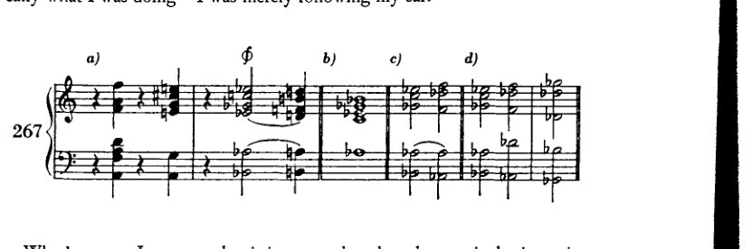
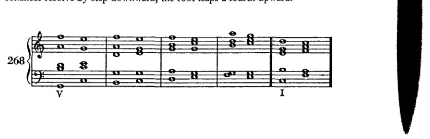
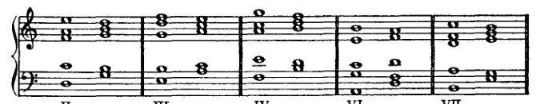

<!-- page 357 -->

344 非和声音

植根于结构上的必要性——无论其基本意义是显是隐，无论它们以更为引人注目的方式出现，还是仅仅被声部的“装饰性”运动所带动——这种关系，我说，是如此确定、如此必然，以至于这些构成和弦的声部绝不能被当真解释为漫无目标的装饰，无论它们可能在多大程度上附带地为整体的装饰性做出贡献，也无论它们的线条多么流动且相互交织。人们绝不能省略它们，正如在钢结构建筑中绝不能省略类似的部件一样。一位*Ornamentierer*（装饰师），一位装潢家，应当先把他那大胆的方案付诸试验——不要把他认为仅仅是美观的东西留待以后添加——应当先将其拿到钢结构建筑中做实际检验，再推荐给学生。而且在建造时他应当站在下面；这样他就再也不会推荐它了。只有在艺术中，我们才会发现这种良心的匮乏\*，在那里没有钢梁会掉下来砸在头上，给那最起码的智力以应有的报应。有人可能会反对说，这里不过是指定的练习罢了；学生以后当然不会再那样做了。但那些是不道德的训练，人不可能通过践行不道德来学会道德。那么，人们就只能把老师树立的榜样视为一个不应效仿的例子。但这对于学生期望过高，对于老师又要求过低。

\* 在其他工艺中，对装饰之结构目的及其他用途的理解，不幸的是，似乎也颇为浅薄；这种理解的缺失导致一些人轻率地省略装饰，另一些人则毫无道理地添加装饰。于是，我不得不把一块新表摔落好几次，才想到为什么我一直在掉它。它从我指间滑落，因为尽管它是现代的，却太光滑了。这时我才明白，我那旧表的表壳之所以刻有纹路，是为了凭借其相当粗糙的表面，更容易被握住。与这种对装饰的厌恶形成对照的，是装订工对装饰的热爱。他们显然把装订仅仅视为书籍的装饰；而且也许只有当他们能够将自己产出的大部分东西都视为装饰，因而视为无意义之物时，他们才会喜欢它，才会认为它是“艺术的”。例如，他们会在书的两端粘上一条“现成编织的”堵头布，它看起来比“缝制的”、“手工缝制的”那种“更漂亮”，却不能实现其功能，无法将书的顶部和底部固定在一起。用途对他们而言是不清楚的，因此也就是不重要的。而这绝非这种荒唐事的终结；只要想想那个专门造出来的词“aufkaschieren”就够了。为了保护纸张和布料的边缘以及线头不被磨损，人们用一层或多层粘上去的纸将它们遮盖起来（*kaschiert*，来自 *cacher*——隐藏）。而如今，只要往那容易因摩擦而磨损的硬纸板上粘一张纸，就被叫做“aufkaschieren”！[本脚注为修订版所加。]

<!-- page 358 -->

344 非和声音

基于结构上的必要性——无论其基本意义是较为显明还是较为隐晦，无论它们以更引人注目的方式出现，抑或只是由声部的‘装饰性’进行所带动——我要说，这种关系是如此确定、如此必要，以至于这些构成和弦的声部永远不能被严肃地解释为漫无目的的装饰，无论它们可能对整体的装饰做出多少偶然的贡献，也无论它们的线条多么流动与交错。

人们不能省略它们，正如不能在钢结构建筑中省略类似的东西一样。

一位 *Ornamentierer*，也就是一位装饰师，应该首先试验他大胆的方案——暂且不添加那些他自以为只是美观的东西——应该首先将其提交给钢结构建筑的实践检验，然后才能向学生推荐。

并且，在建造期间他应该站在下面；这样他就再也不会推荐它了。

只有在艺术中，我们才见到如此缺乏良知，\* 在那里没有钢梁会落到头上，给最起码的智力以应有的惩罚。

有人可能会反对说，这里涉及的只是指定的练习；当然，学生以后不会再那样做了。

但那些是不道德的任务，而且人无法通过练习不道德来学会道德。

那么人只好把教师树立的榜样当作不该做什么的榜样来看待。

但这对学生要求得太多，而对教师要求得太少了。

\* 在其他手工艺中，不幸的是，对装饰的结构目的及其他目的的理解似乎也颇为欠缺；这种理解的缺乏使一些人轻率地省略装饰，另一些人则盲目地添加装饰。

于是，一块新表我掉了好几次，才想起自己为什么老是掉它。

它从我指间滑落，是因为，尽管它是现代的，但它太光滑了。

这时我才明白，我的旧表表壳之所以刻有花纹，是为了凭借其相当粗糙的表面，使人更容易握住它。

与这种对装饰的厌恶形成对照的是，请注意装订工对装饰的热爱。

他们显然认为装订不过是书籍的装饰；而且也许只有当他们能够把自己产出的大部分视为装饰，因而视为毫无意义时，他们才喜欢它，才认为它是‘艺术的’。

例如，他们就在书的两端粘上一条‘现成编织’的堵头布，它看起来比缝制的、‘手缝’的那种‘更漂亮’，却不履行其功能，不能将书的顶部和底部固定在一起。

这种目的他们并不清楚，因此也就不重要。

而这绝不是这种胡闹的结束；只需想想那个专门造出来的词‘aufkaschieren’就够了。

为了保护纸和布的边缘以及线头不被磨损，人们用一层或多层粘上去的纸将它们遮盖起来（*kaschiert*，源自 *cacher*——隐藏）。

而现在，每当一张纸被粘贴在容易因摩擦而磨损的硬纸板上时，这就叫做‘*aufkaschieren*’！

[本脚注添加于修订版。]

<!-- page 359 -->

XVIII
几点评述
关于九
和弦

九和弦是这个体系的继子。尽管它至少与七和弦一样，是这一体系的合法产物，却仍屡次受到质疑。¹ 它为何遭到质疑，原因并不清楚。这一体系一旦仿照大三和弦来塑造小三和弦，便开始带有矫饰性。因此，通过添加七音来构成七和弦，固然不是这种初始组织的必然结果，却是一种可能的结果。然而，如果这是可能的，那么九和弦、十一和弦等等也同样可能；至少可以从中获得一项好处，即叠置三度的体系得以扩展。进一步的好处无疑在于，如今处于该体系之外、属于偶发和声领域的大量内容，仍可被纳入体系之中，且不失去根音进行所提供的控制。我自己本可以这样做；至于为何没有，我将在后文说明。²

据我所知，对九和弦最重要的反对意见在于，其转位被认为不切实际。我还怀疑存在这样一种愚蠢的阻碍，即九和弦不易以四声部写作来呈现；为了容纳九和弦，我们需要五到六个声部。人们当然可以不考虑与七和弦转位之间的类比，或至少暂时不予考虑，并至少使用已有的东西；但理论有一种倾向：每当某事物找不到范例时，便宣称它是坏的，或至少[将其视为]不可能。理论太过轻率地断言：九和弦不出现转位，因此它们是坏的；或者：九和弦不出现转位，因此它们根本不存在。当然，反过来也不对：即理论家应该去发明九和弦的转位，而不是等待作曲家去创造。理论不能也不应当带头；它应当肯定、描述、比较和组织。因此，我将仅限于为作曲家及未来的理论家们提供一些激励，以推动该体系的进一步扩展，并且避免对那些无疑已在一定程度上出现于现代作品中的形式进行系统化（*kombinieren*），但这些形式在用法上与本应在此出现的情况有着根本的不同。当理论肯定九和弦的存在时，它走在正确的道路上。那时它本可以指出九和弦的转位尚未出现，但也完全可以不发表其认为转位不好甚至不可能的意见。在这类情况下，肯定事实本身就应该足以令理论家满足。他为“和声理论提供资料”便已足够；他不必让自己陷入易受攻击的境地，也不必沉湎于美学判断，因为那样只会出丑。今天尚未被使用的东西，并不因此就是丑陋的；因为明天它可能就会被使用，到那时它便是美好的。在我的《六重奏》中，

---
¹ 参见 Schenker, *Harmony*, p. 190.
² Chapter XXI.

<!-- page 360 -->

346 关于九和弦的评述

《升华之夜》（*Verklärte Nacht*）[第 41–2 小节]，在下面的语境中，我写下了九和弦的转位，即例 267a 中 $\phi$ 处的那个，当时我并不知道自己在理论上做了什么——我只是遵循自己的耳朵。

更糟的是，我现在发现，这正是理论家们最坚决谴责的那种转位；因为，由于九音在低音部，它最直接的解决是进入四六和弦，而所谓*'böse Sieben'*[糟糕的七度]——即七度到八度的禁忌解决——会发生在两个声部之间（267c）。但四六和弦完全可以作为经过和弦出现，或者它本可以被绝对禁止（旧的理论在其他方面确实不曾回避这种粗暴的做法）；而且，如果（如 267d 所示）次中音声部跳进到 $d\flat$，这个“糟糕的七度”就可以避免。

直到现在我才理解了那个音乐会协会的反对意见——当时这令我无法理解——他们拒绝演奏我的六重奏正是基于这个和弦（其拒绝的理由实际上就是这样解释的）。很自然：九和弦的转位根本不存在；因此，也就无法演出，因为怎能演奏某种不存在的东西呢。于是我只得等了几年。诚然，当它后来真正被演出时，再也没有人注意到那里出现了一个第四转位的九和弦。当然，如今这类事情不会困扰任何值得认真对待的人。在《莎乐美》（*Salome*）中甚至还出现了其他截然不同的九和弦。仅举*一部*作品为例，它不仅被演出，而且如今甚至受到那些当年无法忍受我的九和弦的人的高度推崇。

因此，正如我所说，九和弦及其转位如今是存在的，或者至少它们可以存在。学生很容易在文献中找到例子。没有必要为其处理制定特殊的法则。如果想谨慎一些，可以采用适用于七和弦的法则：也就是说，不协和音级进下行解决，根音向上跳四度。

<!-- page 361 -->

关于九和弦的评述 347

注意五度！

但即便在这里，阻碍终止的解决实际上也必须像它在七和弦中那样奏效。因为，如果七音可以保留，那么当根音上行时，九音当然也可以保留。

所有这些都确实会出现，至少作为声部进行的现象，因而已经由此获得了正当性（例如，作为经过性和声）；而且这肯定是从

我的论述中得出的，即不协和音体系一旦容纳了声部进行中出现的这些情况，便圆满完成了其任务。倘若还试图以跳进的方式离开不协和音，那就会更进一步。

要证明九和弦的存在，除了它作为留音出现之外，其实只要提及带有大九度或小九度的属七九和弦便已足够，这种和弦是无人质疑的。倘若有人不愿接受建立在副三和弦之上的九和弦，那也至少必须承认：就副属和弦的意义而言，大九和弦与小九和弦可以在每一级音上构成，

<!-- page 362 -->

348 关于九和弦的评述

即便并非所有九和弦都能立即且无条件地用作自然和弦。

271 [音乐记谱：高音谱表，展示建立在音阶 I、II、III、IV、VI 与 VII 级上的九和弦]

只要它们包含小九度，将其与调性关联起来便不比从它们派生的减七和弦更困难；而那些包含大九度的，也肯定不比相应的七和弦更困难。显然，我们可以将它们进行所有那些七和弦中惯用的变化，例如（272）：

272 [音乐记谱：大谱表，包含高音与低音谱号，展示建立在 I 级上的变化九和弦]

当我们将它们视为游移和弦，或将它们与游移和弦相联系时，其使用的可能性是毋庸置疑的，正如我的《六重奏》中的例子，或例 273a 所示。

273 [音乐记谱：大谱表，包含高音与低音谱号，标有“a)”，展示九和弦的解决]

273a 中的解决方式取自 A[ugust] Halm 的 *和声学教程*（*Sammlung Göschen*），¹ 这本来是一部非常优秀的小著作。其中有许多一流的内容；然而他却称这些连接为“荒谬的”，并拒绝“赋予它们任何不应有的、根本性的价值”。因为他将它们置于原位（273b），因为，正如他所说，九和弦是不可转位的（尤其是在正格解决中，根音上行四度时）。

273 [音乐记谱：高音谱表，标有“b)”，展示原位的九和弦]

¹ [（莱比锡：G. J. Göschen'sche Verlagshandlung，1902），第118–19页及例97c。]

<!-- page 363 -->

关于九和弦的评述 349

然而，至少还可以尝试以另一种解决方式将其转位；若这些才是出格之处，那么如此一来便不会出现平行五度了。这样一个聪明人居然想不到这一点，尽管他已近在咫尺，实在令人惊讶。体系的眼罩！人类有能力发明那么多东西，我们有理由为之惊叹。然而，我们同样有充分的理由感到惊奇：尽管他已近在咫尺，却竟有那么多东西未曾发明出来。思想上再出格一些，对美学上的出格再少一些恐惧，情况就会好得多，好得多！学生在使用九和弦时，最好首先再次尝试最简单的应用。然后，他自然可以按照副属和弦的方式，并根据此处建议的精神，尝试各种变体，之后也可以尝试与游移和弦进行连接。当然，在这方面他最好为自己施加最严格的法则。他以这种方式发现的可容许之物越多，他的优势便越大。至于自由——那完全可以自己办到。¹

---

¹ *自由‘一个人就能办到’*。参见勋伯格在329、331、395及396页关于“自由”的论述。
