<!-- page 364 -->

XIX 若干补充与纲要性展示，以完善体系

1. 三和弦、七和弦与九和弦的变音

对于三和弦可以进行的最重要的半音变化，学习者已经在前面有关副属和弦、小下属调关系、那不勒斯六和弦、增五六和弦等内容的论述中有所掌握。以下的概括重复了已展示的内容，并补充了尚缺之处。当然，这并无意声称完备。因此，此处未提及大三度的向上变音。并非因为我认为它们不可能，因为我确实在七和弦的变音中包含了它们。而是因为，我的意图并不在于囊括一切可能之事，无论其是否见于文献。因此，此处我并未系统地进行，而多半只是提及那些我心中有例子的，或那些我认为肯定能找到例子的；是的，有时甚至包括那些我禁不住诱惑而亲自编造了一个例子的。

三和弦的每个音都可以向上或向下进行半音变音*。变音可以涉及一个音、两个音，或全部三个音。我不太能接受“根音被变音”的概念；我更倾向于认为引入了一个新的根音。我在讨论那不勒斯六和弦时已经阐述了这一观点的理由。¹

将大三和弦的三音降低，并将小三和弦的三音升高，我们就得到了已经熟悉的形式：

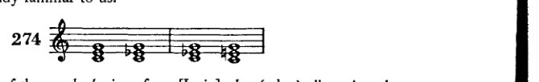

* *alterieren*一词源自[拉丁语]*alter*（另一个），故可解释为*verändern*[改变或替换]；然而，或许更宜假设：每当对一音进行变音（*alteriert*）时，乃是用*另一*音来替代调式音。这就指向了本书此处时常提及的以半音音阶替代大、小调式。音乐技术用语中的语言习惯，因其倾向于缩略表达，已将许多说法破坏得如此彻底，以至于恢复原意几乎不可能。我想，诸如“在四度五度圈向上”或“进入四度五度圈向上”这类说法便是如此，它显然是“在五度圈上向上四步（或四段、四度）”的缩略。尤其不必说的是，我使用此类缩略仅出于极大的勉强，然而每当我想将正确而古老的用法作为革新引入时，我便丧失了勇气。

[此脚注为修订版所加。]

[¹ *Supra*, pp. 234-5.]

<!-- page 365 -->

1. 某些和弦的变体

351

通过在大三和弦与小三和弦中升高或降低五音：

[Musical notation: 275 — 四个和弦，展示大三和弦与小三和弦中五音的变化]

通过在大三和弦中升高五音并降低三音：

[Musical notation: 276 — 两个带有“or:”标记的和弦，展示大三和弦中升高的五音与降低的三音]

通过在大三和弦中降低三音和五音，在小三和弦中仅降低五音：

[Musical notation: 277 — 两个和弦，展示大三和弦中降低的三音与五音，以及小三和弦中降低的五音]

通过在小三和弦中降低五音并升高三音：

[Musical notation: 278 — 两个和弦，展示小三和弦中降低的五音与升高的三音]

通过在大三和弦或小三和弦中降低根音：

[Musical notation: 279 — 两个和弦，展示大三和弦或小三和弦中降低的根音]

通过在大三和弦中降低根音和三音：

[Musical notation: 280 — 两个和弦，展示大三和弦中降低的根音与三音]

通过在大三和弦与小三和弦中升高五音并降低根音（同时作等音变换）；

[Musical notation: 281 — 两个带有“!”标记的和弦，展示升高的五音与降低的根音并带有等音变换]

通过在大三和弦中升高五音、降低三音和根音，在小三和弦中升高五音和三音、降低根音（等音变换）：

[Musical notation: 282 — 两个带有“!”标记的和弦，展示多种变化并带有等音变换]

<!-- page 366 -->

352 完善体系的补充

降低大三和弦的三音并升高根音，或升高小三和弦的根音：例283a；降低大三和弦的五音并升高根音，降低小三和弦的五音、升高三音和根音：例283b；降低大三和弦的三音和五音、升高根音，降低小三和弦的五音并升高根音：例283c。

当根音被变化时，这些变化在某些情况下会产生应归属于另一根音的和弦，如前所述。在其他情况下，若不想卷入当前无谓的记谱法之争，则作等音变换是恰当的，例如，写作c-e♭-a♭以代替c-e♭-g♯，尽管变音的规则通常给出如下：向上的变化以♯和×（或♮）表示，向下的变化以♭、♭♭或♮表示；或者更一般地说：变化音的记法是在同一音符前放置适当的变音记号。

对于这种学究式精确性所导致的繁复记谱，我更倾向于写出那个能产生熟悉和弦的记号。大多数这类和弦都可以这样做。在其他情况下，人们可以专注于个别的声部进行，并至少将*它*简单地记写出来。因此，我愿以例284c替代284b（如284d所示，出自贝多芬《钢琴奏鸣曲》作品26号的谐谑曲）。

这些变化所产生的音响本身就是和弦。若有此意愿，也可以将它们视为经过现象。人们之所以能更轻易地这样做，毕竟，若从调性的角度来思考，[可以看出]除第一度[主音]之外的一切，可以说是经过性的，或至少是在行进中的——一切都在运动之中。

例285展示较简单的实例，286展示较复杂的实例。

<!-- page 367 -->

1. 某些和弦的变音 353

285

[乐谱：钢琴大谱表，高音谱号与低音谱号，多小节包含和弦与旋律线条]

扭伤了我一

根脚趾

（拿波里六和弦）

等等。

286

[乐谱：钢琴大谱表，高音谱号与低音谱号，多小节包含和弦与旋律线条]

<!-- page 368 -->

354 完善体系的补充

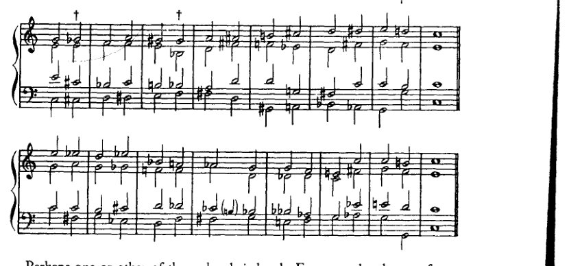

也许这些和弦中的某一个比较刺耳。例如，来自示例 283c¹ 的那个，出现在 286 的 † 处（也在其他音级上）。它听起来像一个不完整的属七和弦；三音的缺失使其显得笨拙。然而，它并非完全不可用。某个确实刺耳的和弦出现在“古典”音乐中，这一事实或许甚至能让那些敏感的人感到宽慰，只要他们想到，在这里，他们对刺耳和弦的敏感，就类似于费加罗的敏感。我们不要忘了，费加罗并没有扭伤他的脚趾：这种疼痛只是他的借口。

类似地，可以对七和弦和九和弦进行变音处理。此处完全可以忽略根音的变音。七音或九音的变音在大多数情况下不会产生新的形式。尽管如此，仍有可能将某些连接追溯至此类派生，并且只在它们以半音方式出现的地方书写。只要有人想这样做！如果一个人不甘于仅仅承认，尽管经过音（等）的旋律性出现确实唤起了变音和弦的和声性出现，但对其源头的追忆仍然绝对不必在作曲中明确写出。与背着壳的蜗牛不同，一部作品无论走到哪里，都不必永远随身拖着 a

---

[¹ 对于勋伯格对示例 283c 的错误引用，应读作示例 283b，其第二个和弦显示在上面示例 286 的第一个 † 处。第二个 † 显示同一和弦位于另一音级上。当然，记谱在两种情况下都是等音的（第一种中，G♭ 代表 F♯；第二种中，G♯ 代表 A♭）。]

<!-- page 369 -->

2. *某些和弦的变音* 355

动机词源学，一种对其存在权利的精确、合法的证明。这样的和弦极有可能是由声部进行产生的现象，但它并非因具备这一资格而被用在某个特定位置；它之所以在那里，仅仅是因为它是一个和弦，与其他任何和弦一样。

我将仅限于提出七和弦变音的可能性，并展示一些连接。

[乐谱：例287 — 两行和弦符号谱表，展示各种变音属七和弦形式，末尾标有“etc.”]

目前学生仍应坚持这一观点（让我们再次提醒自己）：一个音被变音，主要是为了构成导音。向上的变音很容易再继续向上半音；向下的变音——它产生一个下行的导音——则再继续向下半音。但也可能出现这样的情况：一个被变音的音被保持住，偶尔它也会朝着与其导音倾向所指示的方向相反的方向进行。[上述建议]至少可以作为判断例287中$\phi$处那类现象的指导，其可行性或许会受到质疑。这里只从属七和弦展示了变音。以同样方式逐一处理副七和弦和九和弦在某种程度上是多余的，因为许多形式是重复的；此外，讨论所有这些和弦将远远超出本书的篇幅。学生自己可以很容易地尝试所有这些。其他和弦当然只会导向调性的其他音级，但除此之外并无区别。至于如何引入它们，以及学生是否应该使用它们这些问题，我确实已经给出了我的答案。

[乐谱：例288 — 钢琴总谱，包含两个谱组，每个谱组有两行谱表（高音谱号和低音谱号），展示带声部进行的和弦进行]

<!-- page 370 -->

356 完善系统的补充

作为
证据
引领
替代方案
达到
正如
前者

289

290

[音乐记谱：六个系统的钢琴大谱表记谱，包含高音谱号和低音谱号，其中有包括升号、降号和还原号在内的各种变音记号的半音和声练习。音乐似乎由分布在两行谱表之间的和弦进行与四部和声声部连接练习构成。]

[页面右边缘可见部分音乐记谱：标有289和290的额外大谱表系统，带有高音谱号和低音谱号，延续至下一页]

<!-- page 371 -->

*1. 某些和弦的变音* 357

正如我们所见，即便是那些可能的应用乍一看并不明显的变音，也能产生良好的效果。自然，旋律性的声部进行促成了这种效果的一部分，于是人们会倾向于将这些变音视为半音经过音。但不应如此，因为对根音的参照作为和声分析的辅助，总是比旋律上的解释更为恰当。后者只说明了该和弦的来源；前者则对其用法与倾向给出了统一的说明。

这些连接之“审美”上的正当性无可争议。它们的和声效果本身在此处即是良好的；一旦再加上动机、旋律的力量，其使用可能性就会大大丰富。

<!-- page 372 -->

358 完善体系的补充

例289展示九和弦的变音，例290则展示运用此类变音的若干可能性。在此，我遵循让变音继续朝变化方向进行的惯例。正如七和弦可以藉由虚假进行解决，九和弦与变音九和弦当然也可以。而且，既然即使非常谨慎的理论家也承认七和弦的七音可以上行——正如几乎每本教科书中都出现的例291所证明的那样——那么人们肯定必须

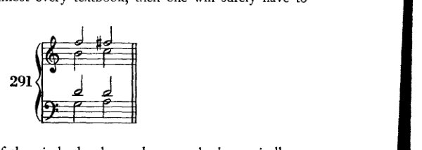

承认九和弦的九音同样可以上行，至少可以半音上行。

这自然增加了处理九和弦的可能性。

例292展示两个上行的九音。学生可以自行找出其他情况。

<!-- page 373 -->

2. 中间步骤的省略 359

2. 通过省略中间步骤
对固定模式的缩略

这里阐述的原理对我们来说还只是相对较新的。尽管如此，我不想忽略以这种形式在这里提出它，因为它能澄清许多问题。我们经常谈论套语和公式的效果，其特征如下：频繁出现的用法会成为具有明确、绝无歧义意义的固定模式。其意义如此明确无误，以至于一旦我们听到它的开头，就会立即并自动地期待惯常的延续：该公式必然导向一个预定的结论。基于这一点，我们现在甚至可以省略该公式的中间部分，将开头和结尾直接连在一起，可以说是将整个模式“缩略”，仅仅把它作为前提和结论来呈现。¹ 也许终止式进行 IV–V 已经是这样一种缩略；确实，我曾提到过，它最好被理解为代表 IV–II–V。那不勒斯六和弦直接进行到 V 的那种处理也是同一种缩略。

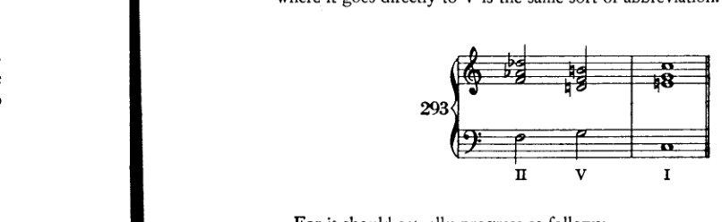

因为它实际上应该如下进行：

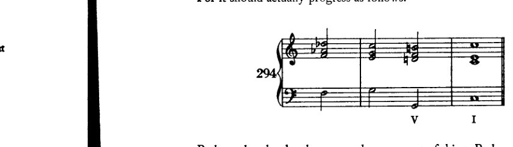

也许变格终止也是同一类现象。也许它们听起来不完整，正是因为某些东西被省略了。也就是说：不是 IV–V–I 或 II–V–I，而是 IV–I 和 II–I。同样的原则也体现在例 295a 的进行中，它源自 295b 中的进行，并出现在终止式或半终止中。

[^1]: 也就是说，中间的“推理”因不言自明而被省略。

<!-- page 374 -->

360 项补充以完善体系

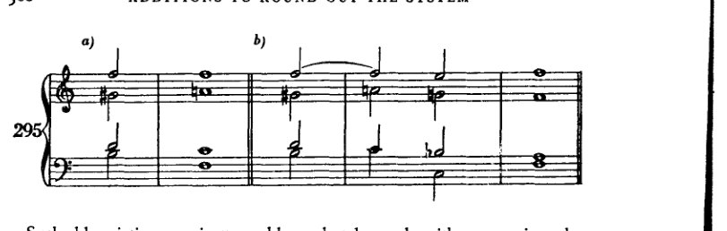

这种省略通常只能在具有明确功能的进行中实施，因此主要用于终止式。例如：

3. 三和弦与所有其他三和弦及七和弦的连接；以及所有七和弦之间的相互连接

在下面的图示中，一个大三和弦和一个小三和弦与所有其他大、小、减三和弦相连接。这些进行中的大多数已经为人熟知。少数较不常见的进行以短句形式呈现在示例 298 中。其中未考虑减三和弦。

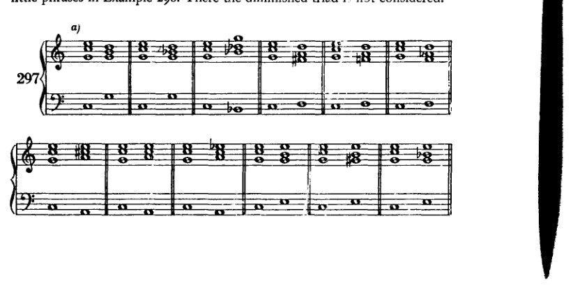

<!-- page 375 -->

3. *三和弦与七和弦全部连接*

361

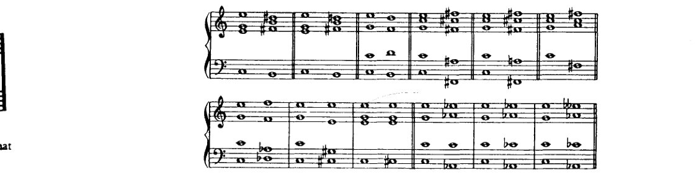

<!-- page 376 -->

362

完善体系的补充内容

298

<!-- page 377 -->

3. *三和弦与七和弦的全部连接*

363

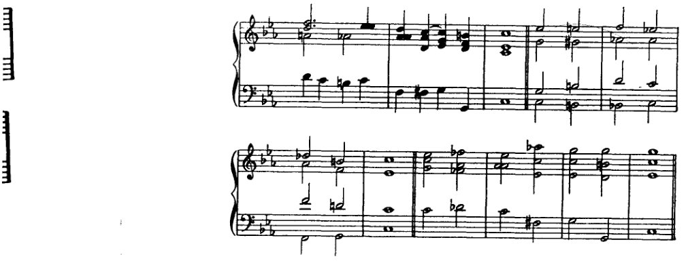

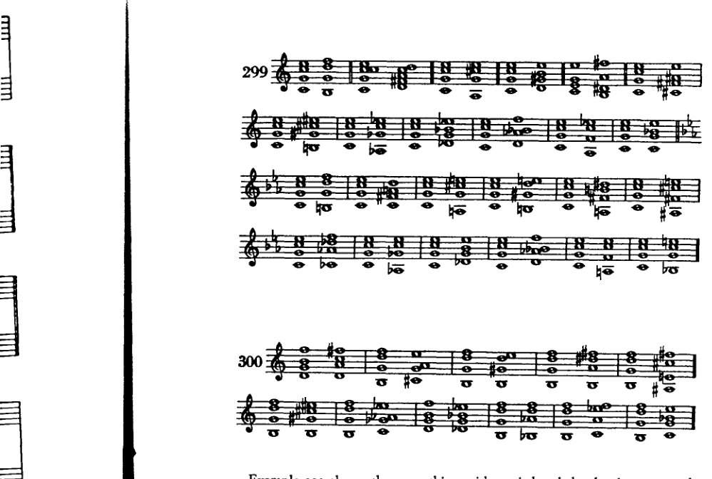

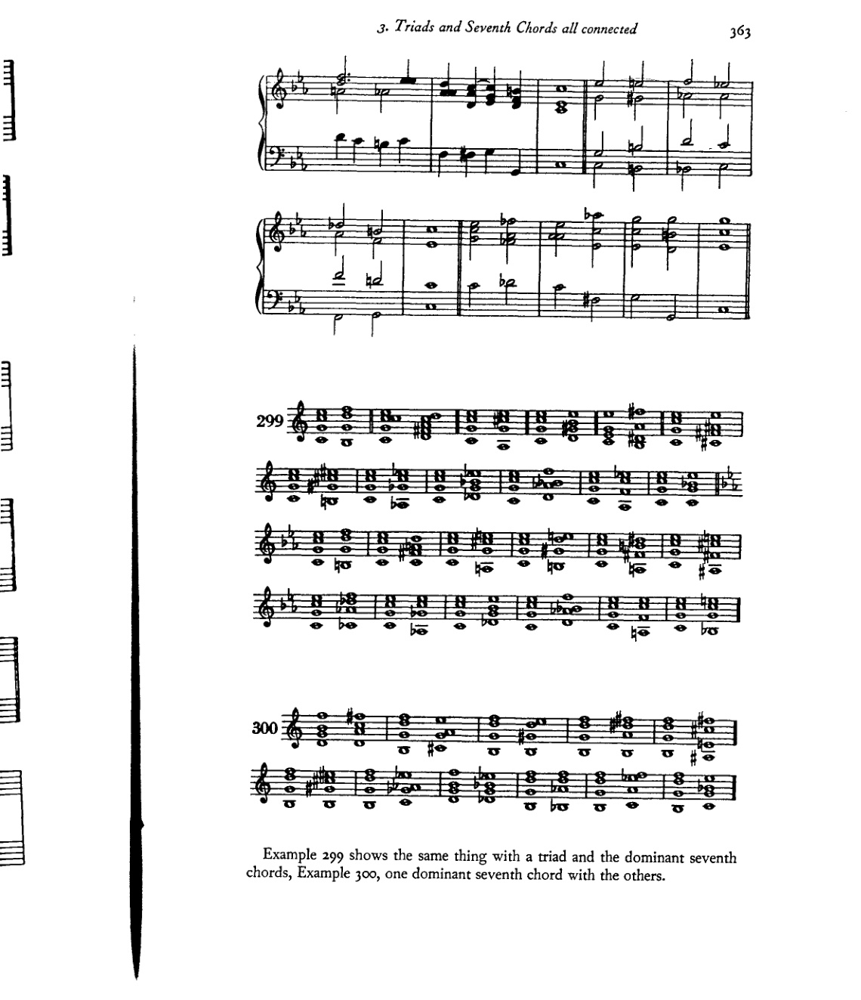

例299展示了三和弦与属七和弦的同类连接，例300展示了一个属七和弦与其他属七和弦的连接。

<!-- page 378 -->

364 完善体系的补充内容

<!-- page 379 -->

4. 一些其他的可能性

365

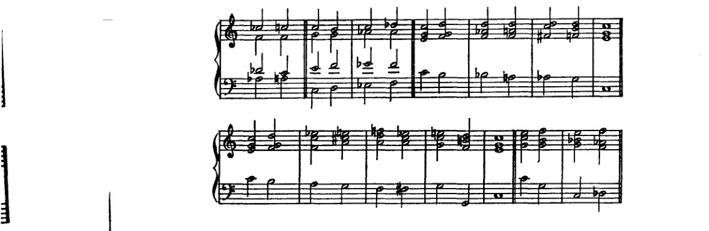

在例301和例302中，有些连接并不能立即被理解。显然，在某些条件下，它们的效果可以相当好。当然，九和弦也可以表现出同样的情况。我将让那些愿意将此作为己任的学生自己去组合这类连接。如果出现在恰当的位置，一切都可以进行得很好。女高音的旋律线与低音的旋律线对于改善效果将特别有用。但节奏也不应被完全忽视。有时，如果和弦以经过音连接起来，一段进行会得到极大的增强。然而，使用经过音、换音和留音，会引入四分音符——乃至更快的时值——这意味着运动加剧，这并非不会对后续产生影响。我建议如下：一旦学生有能力在和声的同时构思经过音、换音和留音，如果他有时使自己陷入四分音符的运动中，他最好将其持续到底，因为这种做法很可能最符合他处理节奏的能力。要使这些四分音符消失并非不可能——可以先在强拍上避免使用它们，随后在弱拍上避免，或者先在旋律中避免，然后再在中声部中避免。但这绝非易事。

4. 一些其他细节：上行七音的可能性；减七和弦的低音；莫扎特的一个和弦；八声部和弦

如果我们假设七音也可以上行，那么就有可能使用小调一级上的自然七和弦 [a–c–e–g#]。

<!-- page 380 -->

366 补充内容以使体系完备

[乐谱：Example 303，包含标记为 a) 至 g) 的各段，展示带有高音谱表和低音谱表的钢琴谱，其中包含各种和弦进行]

这个和弦可以转移到调内的其他音级，在这些音级上，尤其是与游移和弦相结合时，能产生良好的效果（Example 303e, f, g）。

另一件事，虽非供挑剔的耳朵欣赏，但确实常出现在现代音乐中，尤其是在 R. Strauss 的作品中：为减七和弦使用不同的低音。这种处理基于这样一个事实：一个减七和弦可以被解释为四种不同的九和弦。如果在四个和弦中的每一个之后（Example 304a），我们设想一个足够长的休止或一个使重新解释成为可能的事件，那么在一个进行中连接这四个和弦就毫无障碍。事实上，这种情况甚至出现在古典音乐中。然而，如果我们更快地思考这一过程，或者将重新解释设想为直接的、无中介的，那么我们就会看到（304b），如何可能在与一个减七和弦一起演奏一个由另一个不同减七和弦的四个音构成的声部。（这种“更快的思考”起着

<!-- page 381 -->

4. 其他一些可能性 367

在推动演变方面起着主导作用——在每一种意义上：正如思考得太慢（而这很容易等同于“根本不在思考”），会产生相反的效果！）此处，如果在（304c）中，每当针对减七和弦写一条音阶时，小节四分拍点上的主要音符也包含这些音，那至少可能是有帮助的。但这样的音阶也可以理解为如例304d所示，因为每一瞬间确实允许重新诠释（当一个人

快速思考时）。此处，在低音的弱八分拍上出现了构成第三个减七和弦的四个音：*e, g, b♭, d♭*。那里的五声部不协和音响在持续音形式中有类比，见例304e；它们证明是将这个 *g–f♯–a–c–e♭* 移调到另外三个低音上的结果。因此，通过304d和*e*这两种形式的结合，便可以解释在304g中，第三个减七和弦如何也能针对 *f♯–a–c–e♭* 来写：每一个别实例都可以像304e那样独立地加以解释。由于304f是显而易见的，又已经说明了其余八个音何以能出现在某一个减七和弦之上；因此，既然已经证明全部十二个音都有可能与减七和弦形成和声结合，那么任何旋律都可以用减七和弦来配和声。我们不会这样做，因为这并不有趣，而且此外还会显得刻意。不如干脆去发明一种新的、有特性的和声。但这样做是可行的！当然，这不是给挑剔的耳朵听的，而是只给好耳朵听的！给那些听觉敏锐的人！

我先前 [p. 324] 提到过莫扎特的一个和弦，正如他所用的那样，它进行得很快，作为经过和声。当然，这个和弦也可以缓慢地经过，因为那样我们甚至能更好地理解它。到那时，即使是挑剔的耳朵也应该能够领会它——并且注意到它。这个和弦（例305a）将构成一段引人入胜的进行（305b）：

<!-- page 382 -->

368 充实体系的补充

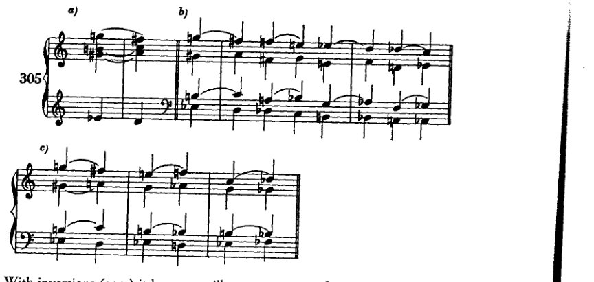

加上转位（305c），它变得更加迷人。对此无可非议；毕竟，这是莫扎特的作品！

但现在我还想指出另一个和弦，诚然，它并未出现在莫扎特的音乐中，却几乎可能出现在巴赫的作品里。例306a中从e音的跳进当然无需解释。如306b所示、在持续音上方的形式，也肯定可能出现。306c和d中的形态也是如此，它们并不罕见。如果我们将它们全部同时写出并使其同时发声，就会得到一个由八个不同音组成的和弦（306e †）。这个和弦可能如306f所示的那样出现。我不知道它是否真的出现过；但我想，鉴于我从巴赫的八声部经文歌中举出的那个例子[p. 327] — 其中出现了一个六声部和弦，对于挑剔的耳朵来说，它几乎不会比我们现在这个八声部和弦更悦耳 — 鉴于此，人们可以

<!-- page 383 -->

5. 额外的转调方案 369

肯定会说：要是巴赫写有十二声部的合唱作品，那么这个和弦毕竟还是会出现的！或者至少可能会出现——尽管九和弦并不存在！

5. 其他转调方案

原则上，我采用了旧的转调方案。然而，由于系统地引入了副属和弦、减七和弦以及漂泊和弦，其结果与通常在此所取得的成果有着本质的不同。但我使用所有这些更强的手段，只是为了使转调更加丰富，并且明确禁止将这些和弦用作实际的转调手段。应该回想起我的理由：我们有的是时间来转调！还有我的论断：在那些使用简单手段进行转调的艺术作品中，转调要么是逐渐发生的，要么就很少会走得很远[否则]。然而，当确实发生突如其来的、远离原调的离调时，那完全是另一回事；它涉及的是一种特别尖锐的对比，更应将其判定为力度而非和声。当然，它也是一种和声上的事情，即**一次**对未来和声的涉足。而在这个意义上，它也并非例外，而是符合一条可以这样表述的法则：一切活物都包含着未来。活着意味着孕育与生产。一切现存之物都朝着即将到来的东西努力。

既然我们已经了解了过去的转调，并用现今的手段扩展了我们的基础，那么我们也已到达可以尝试那些在期间已获得独立的新手段之效果的阶段。显然，如果这是我们的目的，新的法则在此可以被给出，因为新的形式就在手边。相反：我们应当正确地应用早先的法则，或者将它们延伸。这对我们来说并不困难。因为我们已经认识到，当音（或主音）是和声事件的权力中心时，它是一个足够丰富的原型，甚至能将最复杂的现象都纳入其名下。它使我们能够将其称为始祖，即使它或许只承载着可能性，而非实现。因此，我更愿意将这些更复杂的和声手段用于终止式而非转调。去表明调性并不必然因为它们的出现而瓦解，表明它们不必转调，比去证明相反的结论——即它们能够转调——更为重要。即使最简单的和弦*也能*转调。我已经表明，调性并非源于基音的任何不可避免的要求。然而，只要我们谈论转调，调性就被预设了，正如曲线预设了直线一样。一者没有另一者是不可想象的。因此，更确切地说，应将调性视为这样一个广大的区域：在其边远地带，依赖性较小的力量抵抗着中央权力的统治。如果这

<!-- page 384 -->

370 使体系完备的补充

然而，只要中心力量持续存在（这可能取决于作曲家的意愿），它便会迫使反叛者留在其统治范围之内，所有活动皆为其利益服务，为中心力量的利益服务。一切活动、一切运动都回归于它；一切都在这个圈子内运转。这一观念实际上已被艺术事实所证实。因为歌剧——那种不具备这种中心力量的唯一音乐艺术形式——不过是另一种可能性的证明：悬置的调性。但所有较古老艺术中圆整的交响形式，所有以调性为基础的形式，都表明偏离最终要回归原调。因此，调性固然可以被悬置。但如果调性存在，那么转调便是对主音的偏离，其本质与任何非主和弦几乎没有区别。它们只是大型终止式的插曲；因此，我那种主要在终止式中引入游移和弦的方法，是与艺术事实相符的。

转调不过是插曲。但这种在终止式中仅以浓缩形式呈现的插曲，也可以被单独提取出来，给予独立的处理。于是人们可以更充分地展开它；它可以不那么浓缩，以更丰富的手法加以发展，具有更大的运动独立性和更清晰的趋向。这正是我们此前在转调中所做的，也正因为此，我们养成了宽广而渐进地塑造转调的习惯。与此同时，通过更复杂的转调手段，我们学会了拓展努力的各种可能性。现在，如果我们已经掌握了让这些手段服务于某一调性的艰难任务，那么将它们用于转调必定会更加容易。由于我始终更关心培养学生的形式感，而非用难以消化的信息填满他，我现在不愿忽略提及一点此刻在我看来值得关注的事情，尤其是当我正要向他推荐以'快速'手段进行转调之时。我相信，和声的丰富性并非通过遍历大量调性来实现，而是通过对音级尽可能最丰富的运用。就此意义而言，一首巴赫的众赞歌在和声上比大多数现代作品更为丰富。曾有一位学生，他在第四小节从 *G* 大调转调至 *D♭* 大调，两三小节后又转到 *B* 大调，便以为自己写出了某种'现代'的东西。但他在 *D♭* 大调和 *B* 大调中的行为却和在 *G* 大调中一样平庸，在那里他几乎只用了主和弦与属和弦。我将所有内容移回 *G* 大调，从而向他揭示出其旋律在真实形态下的微不足道、单调乏味以及和声上的贫瘠。当我问他，是否认为把同样的庸人习气从 G 大调带到 D♭ 和 B 就算特别大胆时，他便恍然大悟。

因此，对音级丰富而多变的运用（*Stufenreichtum*）是和声艺术最本质的特征。除此之外，我们采用何种特定手段相对来说并不重要。但有一点是明确的：如果我们使用游移和弦，尤其是用它们来转调，那它们就必须与其他和声事件保持一致。否则，形式的流畅性几乎无从谈起。它们必须适应周围环境；因此，周围环境本身应当是本身就需求这类事物的。例如，在一连串纯粹的三和弦进行中，突然将其中一个三和弦重新解释为那不勒斯六和弦就会

<!-- page 385 -->

*5. 更多转调方案* 371

很难保持一致；另一方面，如此突然的转折要以简单的IV–V–I终止式来令人满意地结束，同样不太可能。当然，在艺术品中，情况则完全不同；我希望读者已经明白，我批评的并非艺术品，而只是和声练习。我也希望他记得，关于我们这种手工练习与艺术品之间的关系，我是怎么看的：它们几乎毫无共同之处。因此，连我的范例也总是显得相当生硬：它们缺乏创造的冲动，那种赋予我们形式之礼的冲动，即便它原本只意在表达。我的练习仅仅是利用一种可能性；它们并非源于某种不可避免的必要性。在这里，法则的应用构成了合理批评的基础。在这里，与艺术品可能容许的做法不同，像上述这样的程序可以被责为不当；利用一种偶然的、孤立的、'快速的'转调手段，可以被斥为不道德；在此必须说：当某个音响以属七和弦引入，随后却进行为增四三和弦时，像那种[简单的终止式]是不被使用的。这是令人厌恶的；因为其效果就如同敌人已经倒下并摔断了腿，却还要把他剁碎，或者，如果他已死了，还要补枪把他射得更死。而通过简单的终止式来结束这样一种转调所获得的满足感，无疑与一个人绊倒后却假装自己其实在跳跃时的那种托词一样，出自同一种欺骗性。一旦通过某种快速手段突然转向一个遥远的调性区域，那么只应将其用作对目标的暗示、一种提示、朝该方向的初步推进。而在那次转折之后，应有一段漫长的终止式，可以说是寻找出发点与目标之间的中间地带，以创造平衡。正如我前面要求目标的清晰性一样，在这里，乐句应凭借其'处于运动之中'，表明它正在追寻一个已被暗示的目标。

如果学生遵循我这里的建议，他的作品或许并不会比忽视这些建议时更好。那么，如果他最看重作品的流畅性，他就不必在此追随我。然而，如果他仍然尝试，他肯定会搞砸许多东西，但他将经历某种意义重大的体验。他将给自己制造困难。然而，走这条路即使失败，也比走轻松的路获得成功更为高尚。因为成功毫无意义，或者至多说明一个人让自己过得太轻松了。

怀着这些想法，我现在将为学生提供更多转调方案。

大调可以通过简单手段转入平行小调，反之，小调也可转入平行大调。

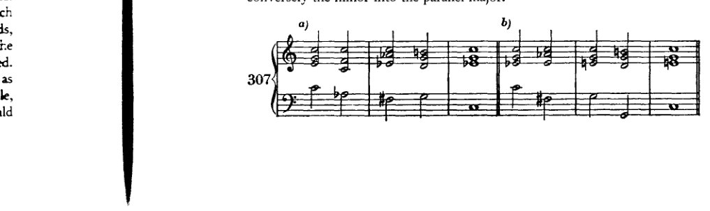

<!-- page 386 -->

372 完善系统的补充

[音乐记谱：c) 四小节高音谱号与低音谱号钢琴谱，转调和声，包含 C 大调、D♭/C♭、F 小调、G7、C 小调、F7、B♭ 等和弦。]

[音乐记谱：d) 四小节高音谱号与低音谱号钢琴谱，包含 C 小调、F 小调、B♭7、E♭ 大调等和弦。]

[音乐记谱：e) 四小节高音谱号与低音谱号钢琴谱，包含 D 大调、G 大调、C 大调、F♯ 减和弦、B7、E 小调、A7、D 小调等和弦。]

[音乐记谱：f) 六小节高音谱号与低音谱号钢琴谱，包含 E♭ 大调、A♭ 大调、D♭ 大调、G♭ 大调、C♭ 大调、F 小调、B♭7、E♭ 大调等和弦。]

自然有众多手段可以使用。这里主要使用了那不勒斯六和弦以及增六五（四三、二）和弦。

这种方案可用于向大调转调：先向平行小调进行，再将该小调转为其平行大调。反之，若目标为小调，则先转向平行大调，再将其变为小调。

308

a) C—B（经由 b）

[音乐记谱：七小节高音谱号与低音谱号钢琴谱，从 C 大调转调至 B 大调（经由 B 小调），包含各种半音阶和弦与数字低音暗示。]

b) C—B（经由 b）

[音乐记谱：七小节高音谱号与低音谱号钢琴谱，从 C 大调转调至 B 大调（经由 B 小调）的另一种版本，采用不同的声部进行与半音和声。]

<!-- page 387 -->

5. 附加转调方案 373

c) C—b—B

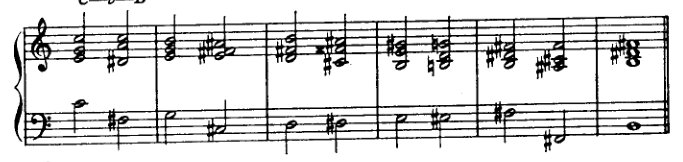

d) C—b—B

e) C—Gb—f#

f) C—D—d

g) C—Ab—ab

<!-- page 388 -->

374 完善体系的补充

b) C—E♭—e♭

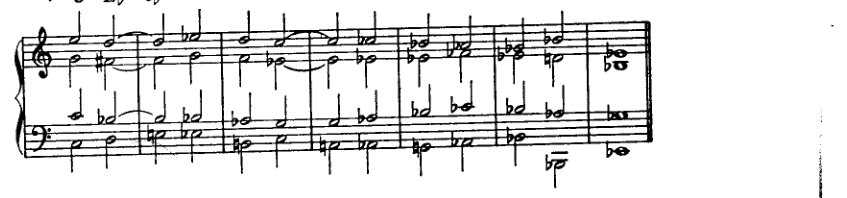

这些很容易让人想起第三和第四五度圈[第十二章]中使用的方法，这些方法建立在相似的原理之上。当然，它们也可以用不同的方式来完成。

另一种：

导向一个游移和弦、一个那不勒斯六和弦、一个增六五和弦、一个增三和弦等，从而迈出转调的第一步。

309 a) C—D♭

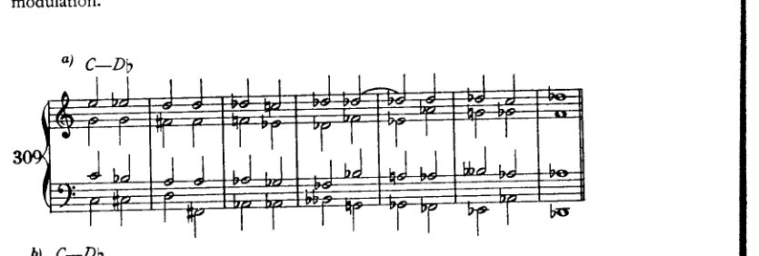

b) C—D♭

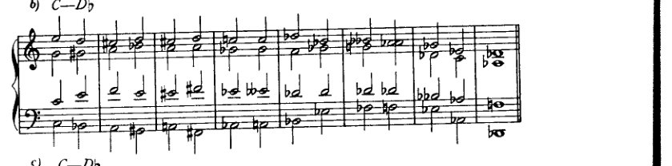

c) C—D♭

<!-- page 389 -->

5. 其他转调方案
375

d) C—D♭

e) C—f♯

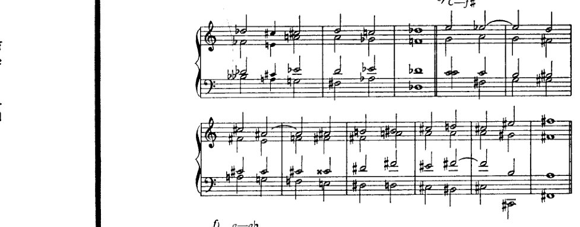

f) a—a♭

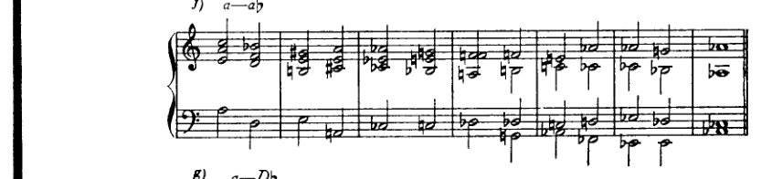

g) a—D♭

h) C—A

<!-- page 390 -->

376 完善体系的补充

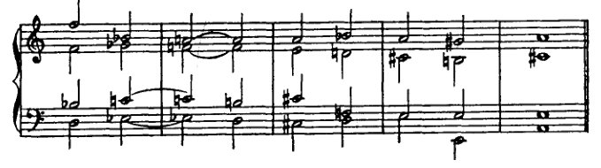

i) C—A

这可以换种说法。即：每一个大三和弦都可以解释为那不勒斯六和弦，每一个属七和弦都可以解释为增六五和弦。当然，这不应是转调的唯一手段。

例310展示了学生应该练习的内容。两个和弦（+ +）的进行以不同方式延续。在这种练习中，重要的并不在于整体必须指向某个确定的转调，而在于学生要探索这样一个和弦的枢纽可能性。

a) C—F♯

b) a—f

<!-- page 391 -->

5. *更多转调方案* 377

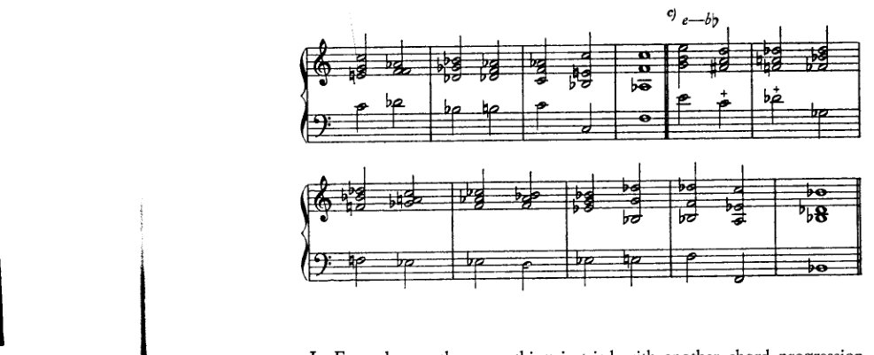

在例 311 中，用另一种和弦进行 (++) 尝试了同样的方法。

例 312 展示了如何以非常迂回的方式走向一个调。在这种转调中，至关重要的是从一开始就要暗示目标。

<!-- page 392 -->

378

补充完善系统

312

a) C—d

[乐谱：高音谱号和低音谱号的两行谱表，带有标记为 a) C—d 的和弦进行]

b) C—B

[乐谱：高音谱号和低音谱号的两行谱表，带有标记为 b) C—B 的和弦进行，跨越两个系统]

c) C—Ab

[乐谱：高音谱号和低音谱号的两行谱表，带有标记为 c) C—Ab 的和弦进行]

d) C—ab

[乐谱：高音谱号和低音谱号的两行谱表，带有标记为 d) C—ab 的和弦进行，跨越两个系统]

<!-- page 393 -->

5. 更多转调方案 379

[乐谱：四声部键盘练习，多小节，含临时变音记号，经过各种和声]

我自己并*不*认为这些例子很好，最主要是由于其中没有动机存在。通过加入更丰富的运动、换音、经过音和留音，这些例子可以很容易地得到改善，特别是如果像例313那样，个别细节实际上逐渐发展成为一个动机。但即使在这里，我也必须再次重复：让学习者只有在与其他声部同时、即时地构想出较快的音符时，才可以尝试这一点。

[乐谱：例313，扩展的四声部键盘练习，多组谱表，左侧标有"313"，包含数小节，有各种临时变音记号、连音线和节奏时值]

在这些最后的练习中，我总体上故意保留了通常所规定的那种记谱方式。我想借此表明，即使是为了阐明派生关系，它是多么不充分，却又多么严重地损害了可读性。只有在我自己根本完全无法读通的地方，我才做了等音变换。我必须请求宽恕，因为我如此轻率地对待了这个问题，因为我为[我的态度]感到骄傲。我骄傲的是，我从未花过片刻认真思考那些通常构成原因和

<!-- page 394 -->

380 完善体系的补充

无关乎学院派学者的缘由，而是从对这类事物的无知直接过渡到了[第一手的]知识。认识到这里存在一个无法解决的问题，其存在应归咎于我们记谱系统的不足。

6. 一些补充细节

与本章第四节中关于减七和弦所示内容类似：在那里我们看到了将任何旋律置于*单个*减七和弦之上的可能性。在这里，我们将反过来看，如何将旋律置于任何减七和弦（或相应的九和弦）之上。这并非新事物；即使在古典作曲家的音乐中也能找到这样的例子。

谱例314*a*中的延留音以及减七和弦上方的“返回”经过音（一种换音）都是非常熟悉的现象。九和弦前延留的*e♭*也不是什么新鲜事（314*b*）。每当这个减七和弦被归到不同的根音上（314*c*），这个旋律便获得不同的意义（不同的记谱）。它可以毫无疑问地置于三个根音（*c*、*f♯* 和 *e♭*）之上；因此，这个旋律也会出现在第四个根音上（在古典作品中），于是谱例314*d*成为可能。将前述内容组合起来便得到314*e*，其中该旋律与全部四个九和弦一同出现。同样的方法也可以应用于图式314*f*，从而使314*g*成为可能，并继而导向314*h*；然后在314*i*中，相应的九和弦通过向上四度进行解决。由这两个图式可以组合出314*k*或314*l*，而同样的可能性也适用于这个旋律（314*m*）。显然，可以用同样的方式处理314*n*，当然也可以尝试将类似的做法用于其他图式以及其他游移和弦。这些可能性之一我将在下一章中用增三和弦来展示。也许没有人会很有兴趣将这四个图式直接并排放置，就像它们在这里呈现的那样。但仅仅知道可以这样做，就使它们能够被用于更好的目的：用于和声变奏，这为乐句[或乐曲]的延续开辟了另一条路径。

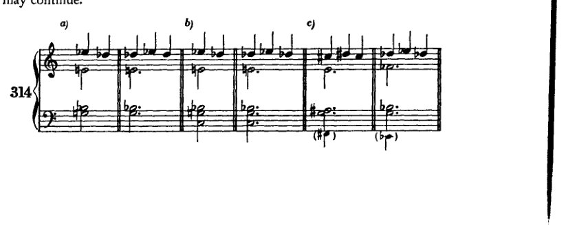

<!-- page 395 -->

6. 一些补充细节

381

[乐谱：示例 d) 至 n)，展示了多种带有高音谱号和低音谱号的钢琴乐谱片段，分别标记为 d)、e)、f)、g)、h)、i)、j)、k)、l)、m)、n)。这些示例包含半音旋律型以及不同调号中的和声进行，带有变音记号以及各种节奏型，包括八分音符音型和附点二分音符。]

另一点：一种同样并非罕见的连接，最好将其理解为减七和弦的模仿（例 315a）：
<!-- page 396 -->

382 补充内容以完善体系

这使我们很容易想起例315b；作为增六五（四三）和弦的一种解决方式，它又以315c的形式为我们所熟悉。此外，它也可以带有降低的五音（d♭——315d），或者成为一种九和弦（315e）。事实上，即使315f也并不罕见。这个进行可以对转调提供有价值的帮助。这里第一个和弦可以说具有属和弦性质，尽管低音是下行进行 [近似 IV–I?]。

关于四六和弦，还应再作一点观察，特别是它在终止式中的用法。今天，它当然被处理得相当自由。一般说来，如果使用它，它的性质通常仍会保留下来，或是通过近似旧式音乐的方式引入或解决它。最常见的是，把它放在适当加强的拍位上，由此激起通常的期待，从而保留其特有的[效果]。但是，勃拉姆斯甚至把离开四六和弦的方式处理得更自由。我所指的并不主要是《萨福颂》第三小节那样的例子：在那里，四六和弦以一种仿佛低音旋律还要继续前进的方式出现（事实上它此前[在第一小节]已经引入过这个和弦；毕竟，低音旋律由主三和弦的和弦音构成）；我也不是指同一首歌倒数第二小节中的例子，在那里，由于低音的先现而出现了一个四六和弦。¹ 我所指的，毋宁是《消息》第14—19小节那样的情形：勃拉姆斯在那里以跳进的方式自由地离开四六和弦。²

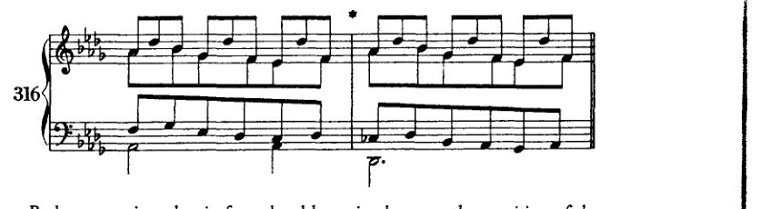

勃拉姆斯在这里把四六和弦仅仅理解为三和弦的另一种位置（像六和弦一样），它可以立即转到另一种位置，转向

---

¹ 《萨福颂》倒数第二小节中并没有这样的情况。勋伯格也许想到的是倒数第四小节中的四六和弦。

² 第18—19小节引于例316。当同一段落再次出现时（距结尾九小节处），四六和弦按常规解决：I⁶₄–V₂。]

<!-- page 397 -->

7. 游移与悬置调性 383

原位。较近代的音乐自然会对它采取更加自由的态度；因此我们看到，艺术的发展实际上证实了开篇所提的原则：一旦耳朵熟悉了不协和音，人们便不再对其大费周章。

7. 论游移与悬置调性¹

现在，在结束本章之前，我想履行先前许下的诺言：谈一谈游移与悬置调性。这种现象不易用小乐句来说明，因为它无疑涉及一部作品不同部分的结构划分（*Gliederung*）。想观察这一现象的人，在马勒及其他人的音乐中能找到许多例子。其实，要找到游移调性的例子，甚至不必远求，贝多芬的 *E* 小调四重奏（Op. 59, No. 2）末乐章即是。（其他例子：Op. 127 和 Op. 130 的末乐章，以及舒曼《钢琴五重奏》的终曲。）贝多芬以某种 *C* 大调开始，然而它不断向 *e* 小调延伸。确实（因为 *C* 多少有些疏远），它在很大程度上甚至延伸到属的属（*f♯–a♯–c♯*），这几乎可以被视为属和弦本身。既然有良好的古典范例在先，我自己写出这类东西也不必感到羞愧。我自己作品中有两个极富代表性的游移调性例子：*Orchesterlied*, Op. 8, No. 5, 'Voll jener Süsse'，主要在 *D♭* 大调与 *B* 大调之间摇摆；以及 Op. 6, No. 7（*Lied*），'Lockung'，它表现出 *E♭* 大调的调性，却在全曲中从未出现过一个足以使人将其视为纯主音的 *E♭* 大三和弦。² 唯一一次出现，它也至少是倾向于下属方向的。两者都绝非刻意造作；它们是创造出来的！因此，并非供人模仿之作。³ 但如果有人去查看它们，就会明白我

---

[¹ *Schwebend*：fluctuating（游移，悬而未决）；*aufgehoben*：suspended（失效，取消）。在 *Structural Functions of Harmony*（第 111 页）中，勋伯格明确将 *schwebende Tonalität* 译为 "suspended tonality"。该著作中未提及 *aufgehobene Tonalität* 一词。他在后期著作（第 3 页及第 164–5 页）中所谓的 "roving harmony"，与他此处对 *aufgehobene Tonalität* 的描述相符。

在此处，他试图作出如下区分：调性是暧昧的、游移不定的；或者说，调性（至少暂时地）失落了、被悬置了。]

[² 参见勋伯格在 *Structural Functions of Harmony* 第 111–13 页中对 'Lockung' 的分析。]

[³ 也就是说，这些歌曲并非单纯的练习范例。参见他在下一段末尾的论述。]

<!-- page 398 -->

384 补充内容以使体系完善

是指 [*schwebende Tonalität* 这一术语] 以及要实现它所必须具备的丰富资源。

然而，为了说明其中所涉及的内容，我将试着进一步谈谈这个问题。如果调性要游移，就必须在某处确立它。但又不能太牢固；它应该足够松散，以便能够退让。因此，选择两个拥有某些共同和弦的调性是有利的，例如那不勒斯六和弦或增六五和弦。*C* 大调和 *D♭* 大调，或者 *a* 小调和 *B♭* 大调，就是这样相关联的调性对。如果我们加入关系小调，在 *C* 大调与 *a* 小调、*D♭* 大调与 *b♭* 小调之间游移，那么新的关系就会出现：*a* 小调与 *D♭* 大调、*C* 大调与 *b♭* 小调；*b♭* 小调的属和弦就是 *a* 小调的增六五和弦，等等。显然，游移和弦将在此扮演主导角色：减七和弦、增七和弦、那不勒斯六和弦、增三和弦。我曾多次尝试组合出例子来，但我无法“凭空”做到这一点。我认为学生将比我更早发现如何做到这一点[如何编出这样的例子]。即使不是这样：他至少不必提供一个范本！

更多例证可以在瓦格纳的作品中找到。例如，*特里斯坦*前奏曲。请注意，*a* 小调虽然可以从每一段中推断出来，但在整首作品中却几乎从未被明确奏出。它总是以迂回的方式表达；通过欺骗性终止不断地回避它。

至于悬置（*aufgehoben*）调性，主题无疑是最重要的关键。它必须凭借其特征性音型为这种和声上的松散提供机会。就纯粹的和声层面而言，将几乎完全使用明确的游移和弦。每一个大调或小调三和弦都可以被解释为一个调性，即便只是转瞬即逝。古典的展开部与此相去不远。诚然，在那里，在任何特定时刻，一个调性都可能被明确无误地表达出来，却又如此缺乏支撑，以至于随时都可能消失。在文献中，现代作曲家的作品中不难找到例证，在布鲁克纳与胡戈·沃尔夫音乐的某些段落中也是如此。

8. 以半音阶作为调性的基础

我在完成本书之后撰写本章，是因为罗伯特·诺伊曼博士¹（一位年轻哲学家，其敏锐的理解力使我对他自己的著作极为好奇）提出了一些反对意见与批评。他的批评有两点：第一，在副音级上构建属和弦的原则从未被明确阐明，因此人们可以得出结论，副属和弦之所以被引入，仅仅是因为

---
¹ [*Cf. supra*, p. 25.]

<!-- page 399 -->

8. *半音音阶作为基础* 385

它们可以从教会调式中提取出来。其次，我并未在调性与某些小和弦之间建立任何关联，而只是以一份概略性的阐述（第360页及以下[例297]）一般性地引入了它们。第一种批评我认为部分缺乏根据；第二种批评则给了我一个启发。

关于第一点：

说我阐述的原则并未在任何地方被集中起来并连贯地加以陈述，这倒也不算错。这是否绝对必要，是值得怀疑的，因为它们毕竟是在适当之处反复得到应用的。尽管如此，我仍在此对它们加以概括。随后便可看出，我的阐述是何等统一，尽管它还称不上一个体系。

最为根本的是如下心理学假设：和声资源的发展主要通过有意识或无意识地对某一原型进行模仿而得到解释；由此产生的每一次模仿本身又可以成为新的原型，并转而被人模仿。

基于这一假设，以下现象得到解释：音阶作为横向的、和弦作为纵向的（忠实程度不一的）对自然原型——即音——的模仿。忠实的但不完整的纵向模仿，即大三和弦，与音阶共同产生了另一种更为间接的模仿，即小三和弦。其余自然音阶和弦则被解释为对三和弦1—3—5这一理念的模仿，并受音阶需求的调节与限制。副属和弦是基础（大）三和弦向副音级的移调，其受音阶原型的影响：音阶的第七音，即导音，乃大三和弦的三音。这一构想也出自贯穿全书的另一原则，该原则主张低音力求强加其自身的泛音，因而倾向于成为大三和弦的根音；该构想的好处在于，它允许将基础三和弦所体现的全部功能转移（模仿）到新的副属和弦之上。在这些功能中，居于首位的是向下方五度根音解决的倾向——这一倾向被证明是每一个根音最强烈的本能。必须如此表述，因为人们也会错误地说，副属和弦的存在仅仅是为了这一解决。在申克博士的“主音化过程”观念中，这一错误显而易见；¹然而，这样一种副属和弦也可能纯粹为其自身而出现，并无去往副主音的意图。一旦减七和弦被理解为V级上的九和弦，那么这一构思同样可以被移调至副音级，即副属和弦。同样的[构思]在解释II级的功能与变体时亦很明显：那不勒斯六和弦、增六五和弦、增四三和弦与增二和弦，以及其他游移和弦，皆在副音级上被模仿。同样，增三和弦也从小调被移植到大调。

接下来是小下属关系。如果像我所做的那样，将调性理解为基音的一种可能性，它单凭纵向方面就能为分析者的听觉提供一大批似乎

---
¹ 参见*下文*，附录，第428页。

<!-- page 400 -->

386 完善体系的补充

foreign harmonies（*Zusammenklängen*），那么就有可能将调制到第三、第四五度圈的一切进行理解为被调性所维系的。¹ 因此，对一种转调过程的模仿，允许将这些非自然音的现象引入到调性本身之中。在这一点上，倘若我曾建议模仿那些未通过这一关系而出现在其他音级上的连接，我或许还能更进一步。但即便如此，我们仍无法通过这种方式穷尽所有三和弦，这一点很容易证实。然而这一切究竟如何成为可能，我即刻就会说明。

若不回顾某些通过论争得出并被用于论争目的的观念，我们就无法谈论本人阐述之原理；因为这些观念，即便是否定的，即便其本身并不奠定任何基础，却也同样不亚于肯定性原理那样富有成果：倘若它们本身未能构成基础，那至少也为基础的建立扫清了地面。这些观念如下：（1）作曲教学若纯粹是手艺的教学而不顾及自然体系或美学，便已足够——这一证明。（2）仅仅认识到协和音与不协和音之间仅存在程度上的区别。（3）关于不协和音处理的三条所谓法则——下行、上行或保持——早已被一条古老现实的第四条法则所超越：从不协和音跳进离开——这一证明。（4）论题：根本不存在所谓非和声音、外于和声的音，只存在外于和声体系的音。

这一切合在一起，即便未以一种封闭的系统性论述来呈现，也已产生出艺术早已达成之成果：将更为遥远的（多部分的）音组合构想为艺术之和声资源的可能性。我所到达的仅限于此。至于无法再走得更远，我自己深知，且在本书中已多次言及。

现在来看第二项批评。

这一批评是合理的；因为我确实未曾展示一系列小三和弦之调性关系：具体而言，在*C*大调中，建立在*d*♭、*e*♭、*f*♯（*g*♭）、*a*♭与*b*上的小三和弦。当然，我并不认为这些和弦与*C*大调之间存在一种可被论证的直接、即刻的关系。然而，多亏这项批评，我想到了一些可以展示间接关系的方法。

首先应当考虑的，是随副属和弦的引入而业已展示出的那种可能性：有时可用小三和弦*g*–*b*♭–*d*来替代大三和弦*g*–*b*–*d*。而建立在音*d*♭、*e*♭与*a*♭上的大三和弦，乃是通过小下属和弦被引入的。建立在*g*♭上的那个，则已作为大调与小调中V级那不勒斯六和弦的模仿而出现；至于建立在*b*上的那个，乃是VII级上的副属和弦（此外，*b*–*d*–*f*♯亦可依照*a*小调II级的模式来构成）。因此，小三和弦替代大三和弦便是产生这一关系的一种途径。事实上，我将例290（在NB处）中的六和弦*e*♮（或*f*♭）–*a*♭–*d*♭，解释为导向下那不勒斯六和弦的经过和弦。

第二种途径，则是利用IV级的小下属功能

---

[¹ 上文，第十二章与第十三章。]

<!-- page 401 -->

8. 半音阶作为基础
387

[也就是说，在C大调中，是♭小调]。我对此有一个反对意见（尽管不是很重要的）。也就是说，那样就会是两个五度之外的调性功能，这令人不安，因为上方两个五度与之相对，所以并不很有说服力。然而，由于这一切都涉及更疏远的关系，这个反对意见并不具有很大分量。此外，这种参照当然并不能得出所有缺失的东西，只能得出其中一部分：♭上的小三和弦和♭上的大三和弦。但是与首先提到的方式 [即用小调替代大调] 结合起来，这种方式确实给出了♭、♭和♭作为小三和弦，而这种双重参照对这些调性的更疏远的关系*只会有好处*。

然而，第三种也是更重要的方式，是发展本书中已经提到的一个想法：不把我们的思维建立在自然大调的七个音上，而是建立在半音阶的十二个音上。¹ 这样一种理论可以如下展开：

I. 由音的连接所产生的所有形式（*Gestalten*）的原材料是一个由十二个音组成的系列。（这里有二十一个音名，而且它们的呈现从c开始，这与我们不完善的记谱法一致，并源于此；一种更完善的记谱法将只承认十二个音名，并为每一个音提供一个独立的符号。）

II. 从这十二个音可以构成不同的音阶（[按]历史和教学顺序[列出]）：

1. 十二个七声教会调式；
2. 十二个自然大调式和十二个自然小调式；
3. 若干在欧洲艺术音乐中不使用或至少很少使用的异国情调式（以及类似的）；最好也将两个全音音阶包括在这里，它们可以以十二个音中的任何一个作为基础音；

---

[¹ 在第一版（第434页）中，这句话之后，勋伯格突然结束了本章，如下：

'未来的理论无疑会遵循这条道路；它将由此达到这一否则困难问题的唯一正确解决。

'我在这里只补充一个小细节。我在某处曾评论说，在某种意义上，所有和弦都可以是游移的。关于这一点这里几乎没有什么可说的了，因为在图示的呈现中，我们发现了大量这样的可能性，由于这些可能性，普通的大三、小三和属七和弦被用在我们最意想不到进行的进行中。尽管如此，不应忘记这些和弦毕竟具有多重意义，仅仅因为它们出现在不同的调性中。此外，每一个大三和弦都与那不勒斯六和弦相同，每一个属七和弦都与增六五和弦相同。'

在修订版中，勋伯格添加了以下纲要。（进一步的评论，见*上文*，译者前言，第xvii页。）]

<!-- page 402 -->

388 补充内容以完善体系

4. 十二个半音阶调式；
5. 一个半音阶调式。

III. 出于风格和形式的完整性（*Geschlossenheit*）考虑，每种音阶特有的条件所衍生的特征被清晰地阐明：调性法则。

IV. 调性按以下方式扩展：
(a) 各调通过相互*模仿*和*借鉴*而变得越来越相似；
(b) 相似的事物被视为*相关*，并在特定条件下被当作同一事物处理（例如，同一根音上的和弦）。

V. 将八十四种教会调式缩减为二十四个大调和小调，并发展这二十四个调之间的相互关系，其过程如下：

1. 横向方面。
(a) 建立在同一构成和相似构成和弦基础上的关系，将教会调式分为类似大调的和类似小调的两类。
(b) 终止式的相互模仿使大调能够吸收所有类似大调的教会调式的一切特征，小调能够吸收所有类似小调的教会调式的一切特征，后来也使大调和小调彼此接近到从头到尾都相似的程度。¹
(c) 在教会调式的七乘八十四即五百八十八个三和弦中，部分不同，部分只是关系不同，其中许多相互重复，因此被归并为较少数量的调，由此剩下七乘十二即八十四个和弦，这些和弦归属于两种调式（大调和小调）；然而，每个和弦都出现在若干个大调和小调中；
(d) 上述(a)项提及的和弦关系以及
(e) 通过共同根音与五度圈中相隔一步、三步和四步的调建立更紧密的联系；
(f) 由于调的边界减少和特性简化；由于和弦和音阶片段的多重含义以及这种歧义的广泛引申；由于从音阶的必要性中产生的减三和弦以及相应的七和弦（自然三和弦的自由模仿）及其在其他音级上的模仿——由于所有这些，较远的调（五度圈中相隔两步、五步和六步的调）也变得更加容易接近。

2. 纵向方面。
纵向方面通过使用四音和弦和五音和弦分担了横向方面的部分负担。一个七和弦由于引入了音阶的四个音，比三和弦为调性确定多贡献三分之一²，九和弦则多贡献三分之二。*

---

[¹ *bis auf Anfang und Schluss* 也可译为"除了开头和结尾"。]

[² 有人可能以为勋伯格指的是三度音程 *Terz*；但他在此句中使用的词是 *Drittel*，即分数"三分之一"。]

\* 多音部和弦和真正的复调，如果正确理解的话，并非为了使一部原本乏味的作品变得现代，而是为了加快呈现的速度。

<!-- page 403 -->

8. 以半音阶为基础 389

VI. 从十二个大调和十二个小调向十二个半音调的过渡。

这一过渡在瓦格纳的音乐中已彻底完成，但其和声意义迄今尚未在理论上得到任何阐发。

VII. 多调性半音阶。

截至并包括第五点，本提纲均与我书中的论述脉络相符。由于已在多处陈述的种种原因，我将不再继续深入。在此，我还想补充另一个原因。我认为，和声理论的持续发展目前尚不可期。使用六声部或更多声部和弦的现代音乐，似乎正处于对应于复调音乐第一个时代的阶段。因此，相较于通过音级参照法来澄清和弦的功能，人们或许更容易通过一种类似于数字低音的程序来得出关于和弦结构的结论。因为显而易见，而且很可能会变得越来越清楚：我们正在转向一个新的复调风格时代，正如早期的各个时代一样，和声将成为声部进行的产物：仅仅由旋律线条来证明其合理性！

文学艺术竭力用与其内容相称的最少文字，依据该内容加以挑选、斟酌并记录，从而清晰而全面地表达思想。在音乐中，除了其最小组成部分（音、音进行、动机、*Gestalt* [样式，图形]、乐句等）的内容之外，还另有一种可资利用的精简手段，即同时发声的可能性。或许正因如此，音乐向每个人诉说的内容多于其他艺术。无论如何，据此看来，我们当今音乐成就的价值是明确无误的，且独立于时代的趣味。方法可以改变；目标是恒定的。
