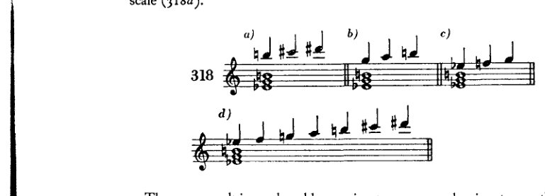
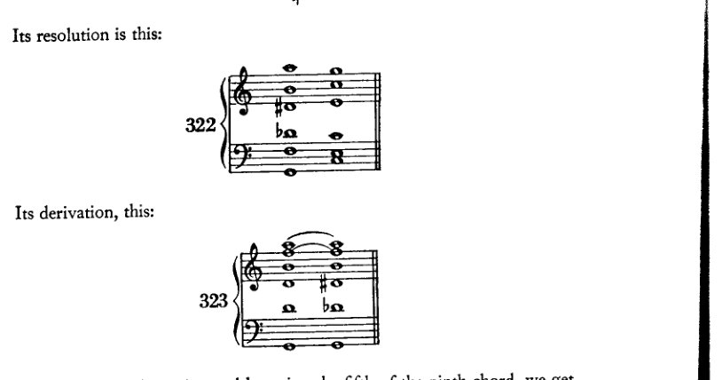
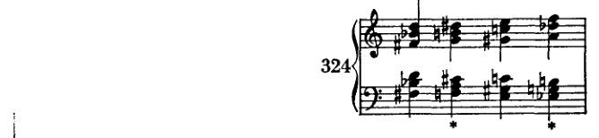
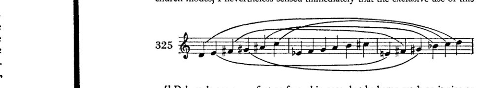
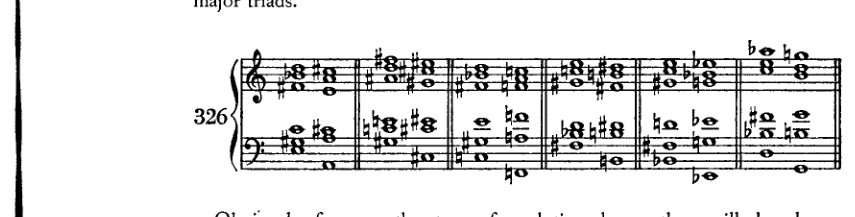
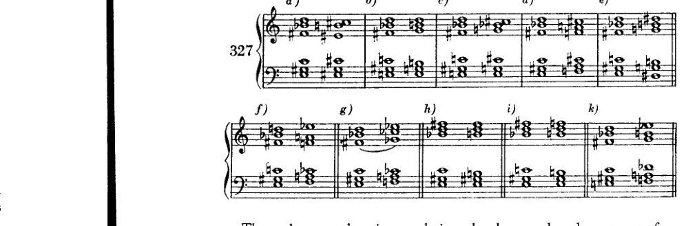

<!-- page 404 -->

XX 全音阶
及相关的五音与
六音和弦¹

大约在过去的十年里²，一种由六个彼此等距的音组成的音阶越来越频繁地出现在现代作曲家的作品中：全音阶。

[音乐记谱：C上的全音阶，从C上行至B，音符名称标记为C、D、E、F♯、G♯（A♭）、A♯（B♭），随后是第二个谱表，展示该音阶从D♭下行：D♭、C、B♭、A、G、F、E、D]

据说，现代俄罗斯作曲家或法国人（德彪西等人）是最先使用它的。我不太确定，但似乎李斯特才是最先的。今年（1910年）我听到了《唐璜幻想曲》，此前我并不熟悉这部作品，令我大为惊讶的是，我听到了全音阶。然而，有一件事我*确实*知道：当我第一次写下它时，我既不了解俄罗斯作曲家，也不了解德彪西，也不了解李斯特的这部作品；而且在更早之前，我的音乐就表现出必然导向全音阶的倾向。有些人认为全音阶源于异国情调音乐的影响。那是指异族民族的音乐，其中出现这种及其他类型的音阶。然而，就我而言，我从未接触过异国情调音乐。我与这些民族之间的联系充其量只能是心灵感应；因为我未曾利用过文化交流的其他媒介。我也不相信那些俄罗斯人或法国人——他们或许通过海路与日本人有更多接触——会特意利用这种接触来免税进口这种原材料。相反，我认为全音阶是所有当代音乐家自然而然想到的，作为音乐界最新发展的自然结果。

在维也纳，过去有一位年老的作曲教师，受雇主持教师资格认证考试。据说年复一年，他都会向考生提出如下问题：“关于增三和弦，你能说些什么？”如果考生想安全地逃出这个陷阱，他就必须回答：“增三和弦是近期德国音乐中喜爱使用的手段。”

尽管这一事实对老教授来说很可怕，但他的观察是正确的。新的德国音乐确实偏爱增三和弦，而且不仅如此，还大量使用了它。它是这样产生的：瓦格纳音乐中的“Walkürenmotif”及其他一些用法提供了出发点；一些变化的七和弦和九和弦提供了进一步的推动；我认为，通过这种方式，我们可以展示全音阶的起源，一条远比国际精神亲缘关系不那么复杂的道路。在现代作曲家的作品中，

---

[¹ 参见上文，第十四章，“增三和弦”一节。]

[² 此句自第一版起未作改动；因此，勋伯格意指大约自1900年以来。]

<!-- page 405 -->

全音阶及相关和弦 391

正如在我（的论述）中一样，可以确定有意使用全音阶的两个先驱。

其一：在增三和弦上，旋律从和弦音进行到和弦音，使用一个经过音，产生两个全音，从而将大三度分成两个相等的部分。这一进行当然可以从各个和弦音开始（例318*a、b、c*），其结果便是全音阶（318*d*）。

在带有增五度（319*a、b*）或省略五度（319*c*）的属七和弦上，经过音也能产生同样的结果。

这两种推导彼此颇为相似；因为变化的七和弦本质上无非是一个附加了七音的增三和弦，而省略五度则与增五度相同。

<!-- page 406 -->

392 全音音阶及相关和弦

同样，例320a只是将增七和弦扩展为九和弦。在全音音阶的六个音中，这个和弦包含了五个；可以理解的是，人们敢于将这同样的音相继用于旋律，又同时用于和声，如例320b所示，只需一个c♯即可完成全音音阶。

例321展示了一个包含全音音阶全部六个音的*和弦*。

它的解决如下：

它的衍生如下：

通过同时升高和降低九和弦的五音，我们得到两个音，它们与其余四个音共同构成六音。

这种衍生反映了我们耳朵进行类比（*kombiniert*）的方式：它将相似的事物联系起来，把相距甚远的事件并置，又将相邻的事件叠置。一旦实际运用了例318a、*b*和*c*中所示的三个三音音型，它们很快就会彼此靠近（318*d*），并最终同时鸣响（321）。这种集中，无论起初多么加重感知负担，却能促进简洁的陈述。

每位现代作曲家都曾在某个时候将三个相应的音阶音写于增三和弦之上，或写于带增五度的七和弦之上——或者，更准确地表达：将两个动机或动机片段上下叠置（在主导动机写作的时代，这是一种常见现象），其中一个位于增三和弦上，而另一个则构成一个三至六音的音阶片段。每位现代作曲家无疑都写过这样的片段；因此，它是

<!-- page 407 -->

全音音阶及相关和弦 393

显然，无论是施特劳斯还是德彪西，普菲茨纳还是我，抑或任何其他现代作曲家，都不是"首创者"，其他人也并非从他们那里"学来的"；相反，每个人都是独立发现的，互不影响。例如，我在我的交响诗《佩利亚斯与梅丽桑德》中使用了全音和弦——该作品创作于1902年，大约与德彪西的歌剧《佩利亚斯与梅丽桑德》同时（据我所闻，他也在该剧中首次使用了全音和弦与全音音阶¹），但至少比我接触他的音乐早了三四年的时间。在我的作品中，这些和弦呈现如下：²

通过反向进行的增三和弦进行，产生了这样的和弦：其中一方始终是增三和弦，另一方（在*处）则是全音和弦。但更早之前，在我的《古雷之歌》[1900–01]和《六重奏》[《升华之夜》——1899]中，已有暗示全音音阶的段落（在六重奏中，它出现在一个内声部，正如最近有人向我指出的那样）；随后在下一部作品[即《佩利亚斯》]中，我将它写作完整的全音音阶，而在此期间我并未接触任何其他作品。

德彪西更多地将这种和弦与音阶用作印象主义的表现手法，某种程度上作为一种音色（施特劳斯在《莎乐美》中也是如此）；但它们进入我的作品，更多是出于其和声与旋律方面的可能性：和弦是为了它们与其他和弦的连接关系，音阶则是为了它对旋律的独特影响。我从未高估全音和弦与全音音阶的价值。尽管两种这样的音阶（只可能存在两种，因为第三种将是第一种的重复）能够以类似当年八十四种教会调式被取代的方式，取代十二个自然大调与十二个自然小调，这种想法颇具诱惑力，但我当即就感觉到，单独使用这种

[^1]: 德彪西的歌剧首演于1902年，但他早在九至十年前便开始创作。同一时期的其他作品包括《牧神午后前奏曲》，其第32–33小节和第35–36小节几乎只包含两个全音音阶。鉴于勋伯格在本章开头及同一段落中的论述，若发现德彪西在更早的作品中便已首次使用这些音阶或和弦，也毫不令人惊讶。]

[^2]: 排练号32之前三小节，木管声部。]

<!-- page 408 -->

394 全音音阶与相关和弦

这样的音阶将导致表现力的削弱，抹杀一切个性（*Charakteristik*）。\* 那样的话，就只会剩下三种音阶——一对全音音阶与半音音阶——这倒会是一个相当诱人的前景，正如我曾说过的那样。然而，就在这一观念有机会在音乐演进中留下印记之际，它甚至在当时便已被抛在后面。认识到沉迷于这类音阶是违反自然且多余的，这一认识注定了该观念的消亡。任何将调性视为音乐不可或缺之条件的人，*ipso facto* 便会无视所有这些音阶。至少这理应如此；因为，倘若此处所展示的调性和声可能性在现代作品中并非偶尔、而是几乎排他性地被使用，那么对主音的参照只能被称为令人不安的非对称。而如果调性在其他情况下是一种取得恰当效果的技术，那么在此处它很容易成为一种幻象，拙劣地掩盖一种完全不当的效果。我相信这行不通：戴着镣铐与自由调情。游移和弦、与所有调的关系、全音音阶以及其他一切备受青睐之物——所有这些都应发生，调的束缚应被放宽，其肯定性因素被压制，而那些破坏它的因素却得到支持；然而尽管如此，它却应在结尾处，或在其他可能的地方，突然现身，让所有人相信它是所发生之一切的主宰！这里又是“抓了一个不会释放捕捉者的俘虏”。我可不愿坐在那个王座上，从那里放射出调性至高权力的光辉。不，我相信这类事情确实不可能成功。若要获得调性，就必须以一切合适的手段为之努力；就必须在转调中保持某种比例，正如古典主义者们实际上所做的那样；就必须舍弃那些不愿受[调性]约束的因素，只使用那些自愿融入的元素。\*\* 因此：对于一个相信调性的人，他

\* 我并非不知道，在提出这一观点时，我所说的或许与我们维也纳那位教授的话一样荒谬，他觉得《*Tristan*》乏味，因为其中出现了太多减七和弦。然而，由于我相信自己所言，我觉得不说出来的过错大于精明地保持沉默所能带给我的好处。这里有一个细微的区别：我谈论的不是已完成的作品，而是尚未写出的作品。还有另一个区别：老教授对《*Tristan*》感到厌倦，并非因为减七和弦，而是因为他根本不理解它。每当人无法理解某物时，自尊心便会取而代之，变成自负，并将原因从真正属于它的主体转移到客体之上。此外还有另一个区别[他的言论与我的之间]：在《*Tristan*》中并没有那么多减七和弦；但我此处抨击的是一种音阶的*排他性*使用，我抨击的是一些我已从学生身上看到、并且可以明确地说很糟糕的东西。在大师们的音乐中，我迄今尚未发现这种情况。倘若它出现了，我会及时收回这一判断。

\*\* 我此处所言仅表面上与我先前关于调性所说的话相矛盾：这取决于，即取决于作曲家，他是否创造调性。因为，一个人*能够*创造它，我认为是可能的。只是，一个人是否*必须*仍为之努力，甚至，是否*应当*再为之努力，我对此表示怀疑。因此，我曾提请人们注意游移调性与悬浮调性的形式可能性；

<!-- page 409 -->

全音音阶及相关和弦 395

相信音阶（*Tonreihen*）的人，那种新音阶当然必须被排除在外。但制定一种音阶，除了创造一种调性、一种特定的调性之外，还能有什么别的目的呢？是为了旋律吗？旋律需要某种特定音阶的认证吗？半音音阶难道还不够吗？至于和弦——音阶能为它们提供什么服务呢？毕竟，这些音阶是在和弦出现很久以后才被制定出来的！因此，音阶永远无法解释和弦的起源；它甚至会排除许多和弦。若不脱离音阶，有许多事情就无法做到。然而，古代调式以及我们的大调和小调，*至少与一部音乐作品中通常发生的情况是相符的*。要使创作的一般情况屈从于新音阶的束缚，这只能是那种想在受限范围内证明自己为大师的人¹的愿望，因为他所能做的太贫乏，无法达到驾驭自由的境界。

而布索尼（Busoni）和格奥尔格·卡佩伦（Georg Capellen）的实验，尽管看起来颇具巧思，也同样会受到这种批评。我尚未读过卡佩伦的书，但我一定会读。² 我喜欢他在1910年8月号《*Die Musik*》上发表的那些优美曲调。³ 它们富有表现力、引人入胜，且构思温暖。但我并不认为必须建立特殊音阶才能得到这些以及其他类型的旋律形态，也不认为必须预先制造那些本该被发明出来的东西，因为我确信这可以用别的方式做到，而且我坚信绝不能那样作曲。要发明，不要计算！人可以凭思考作曲，但绝不应刻意观察自己是如何思考的。只有在对某种调性（*Tonart*）的感觉存在于无意识中时，人才能在该调性内自由创作。我不明白，为什么一个即便在[自设的]障碍下也能发明如此优美旋律的人，不宁可依靠自己的天赋能力——这种能力即便是障碍也无法完全麻痹——反而要固守那些与滋养创作行为的土壤并不相宜的理论。

而布索尼，这位高尚而勇敢的艺术家——我非常看重并尊敬他。但他本可免去推算数百种音阶的烦恼。⁴ 要记住七种教会调式的名称，对我来说就是一件费力又麻烦的事；而那些“仅仅是名称”而已！他的五种调我都记不住。但如果我连记都记不住，又怎能用它们作曲呢——

尽管这些确实容许假定一个有效的[调性]中心，但它们表明，并不必要从外部去帮助这个中心获得一种它充其量只在内部拥有的力量。

[^1]: 暗指歌德的一句名言。参见*infra*，第396页。

[^2]: 勋伯格在此（1911年）添加了一条仓促写就的脚注，对卡佩伦的著作进行了说明和评论。见附录，第431页。

[^3]: IX, 22。卡佩伦的“曲调”是对日文文本的配乐，附于其文章《Die Akkordzither und die Exotik》（第228–32页）中。卡佩伦试图通过运用异国情调的音阶来扩展传统的大小调调性，从而发展出一种“新的、异国情调的音乐风格”。

[^4]: 参见*Three Classics . . .*所收*Sketch of a New Esthetic of Music*，第92–3页。

<!-- page 410 -->

396 全音音阶及相关和弦

甚至将它们铭记于心。我是否该像魏因加特纳那样，把它们悬于案头？不。我根本不想以魏因加特纳做任何事的方式来行事！¹

我先前关于调性所说的内容，绝不应被理解为对一部杰作的批评。例如，在马勒与施特劳斯的作品中，我发现调性仍与其主题材料的特性相当同质。因此，在此我必须说明，我认为马勒的作品是不朽的，并将其与最伟大大师的作品并列。² 然而，除此之外，诸如此类的理论思考并不能使我对所感受到的力量产生怀疑。而且在本书的不同地方，我已指出艺术家除其技巧之外尚有他物可表达；而他对我所言说的，首要的正是这种“他物”。我始终首先以此方式领会[一部作品]，之后才进行分析。我的论点旨在反驳关于调性必要性的信念，而非反驳其作者信奉调性的艺术作品所具有的力量。一位作曲家在理论上所信奉的东西，确实可能在其作品的外在方面表达出来。幸运的话，仅止于外在。但在内在层面，当本能接管时，所有理论将幸运地失效，而他在那里将表达出某种比他自己的理论以及我的理论都更为优越的东西。而如果歌德的这句话，“In der Beschränkung zeigt sich [erst] der Meister,”³ 当真具有任何意义——它当然并非艺术庸人们始终意欲其表达的意思；而且即便歌德本人原意如此，它也最不适用于他；他本人远比这句不幸格言的狭隘伟大得多——如果它当真还有任何意义，那只能是：我们想象力与概念化能力的狭隘，会对我们真实的精神与本能天性施加限制；鉴于这些限制，大师通过冲破障碍并获得自由来证明其高超技艺——即便在他自认为不自由之处，因为外部压力使他渴求限制以维持人为的平衡。我的批评

[^1]: 指挥家费利克斯·魏因加特纳（Felix Weingartner）创作过若干歌剧与交响曲，以及室内乐、钢琴与声乐作品。

在其 'Handexemplar . . .' 中（见 *supra*，译者前言，p. xvi），勋伯格于1923年5月29日写的一条边注中撤回了对魏因加特纳的此番抨击：“我已因这次攻击而以熟悉且可预见的方式受到了惩罚。但我早就想删除它了。因为这次攻击比我当时意识到的更为丑陋，且不公平。以那种方式作曲绝非不可能。然而，[音乐]结果更为重要；唯独它才应受到评判，而非其创作方式。如果结果是好的，那么方法必定是正确的。”（对魏因加特纳的攻击见于1911年的初版，并保留在1921/22年的修订版中。最终于1966年的第七版中删除。）]

[^2]: 参见 *supra*，pp. 4-5。]

[^3]: 这首十四行诗 'Natur und Kunst' 的倒数第二行已成为一句常被引用的德语格言。该诗的最后三行可意译如下：

> 欲成就伟大者，必懂得节制。
> 唯有在限制之中，大师方显身手。
> 唯法度能赐予我们自由。]

<!-- page 411 -->

全音音阶及相关和弦 397

因此，即便我曾有意如此，这也并不适用于那位追求调性的大师本人，而只适用于他的信念，只适用于那种高估了调性意义及其理论必要性的迷信。

全音音阶是一种以其色彩效果而闻名的手法。德彪西在这种意义上使用全音和弦，当然完全正当；因为他的作品既有效又优美。但我仍须指出这种和声在和声与结构上的可能性。全音和弦若被视为游移和弦，其连接可能性至少与增三和弦相当。根据它们所参照的音级，可用于转调及转调性插段。

每个音都可以作为属和弦的根音；于是有六种解决到大三和弦的方式。

显然，对于所示的任何其他解决类型，同样始终有六种移调（分别在六个音上）。因此，解决到属七和弦有六种（例327*a*），到副七和弦有六种（327*b*），到减七和弦有六种（327*c*），到两个增三和弦有六种（327*d* 和 *e*），到降五度的七和弦有六种（327*f*），到降五度的小九和弦有六种（327*g*），到大九和弦有六种（327*h*），到小九和弦有六种（327*i*），最后到另一个全音和弦也有六种（327*k*）。

这已经构成了六十多种解决，即便我们在此优先采用了半音进行或持续音。这种解决完全是在严格不协和音处理的意义上而言的。当然还可以用同样的方法找到许多其他解决方式。如果以……取代严格的解决

<!-- page 412 -->

398 全音音阶及相关和弦

如果自由处理，正如我们确实经常做的那样，那么可能性必然会大大增加。

在此我不打算以乐句形式给出任何例子；由于已经说明的原因，它们很难有好的效果。除非旋律表现出这种和声的影响，否则这类和弦几乎无法使用。但如果要*创作*这样的旋律，它们必然在各个方面都超越仅仅足以充当练习范本的东西。它们肯定会成为具有动机力量、表现力、节奏感等的旋律。我认为这类东西无法通过枯燥的练习方式来实现。学生当然可以尝试一下。我不愿这样做，以免在不必为之的地方，徒然为其他和声学教材中常见的那种反面教材再添一例。如果学生去关注现代音乐，他会找到自己需要的东西。如果他理解了正在探讨的这种和声，并且有动机去运用它，其余自然会随之而来，或者永远不会。

我经常说，某些事情日后是会被允许的。这里就适合这样做。但我仍然不想在授予这一许可时，不向学生建议他最好不要使用它。在最后一章中，我将详细讨论我主张这种克制的原因。与其说是教学上的考量——当然也包括这些——倒不如说，远更多是艺术上的考量。让学生等到他认清自己的才能再说吧！
