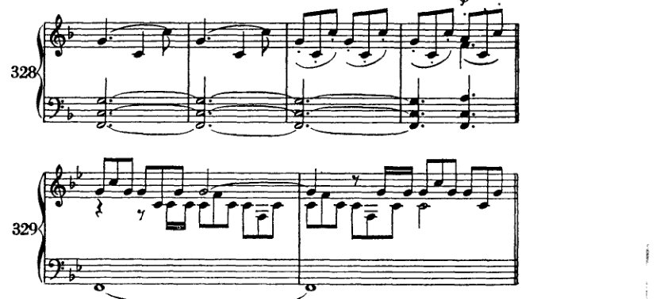
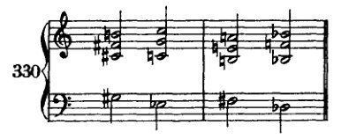
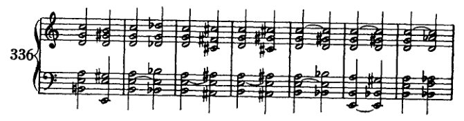
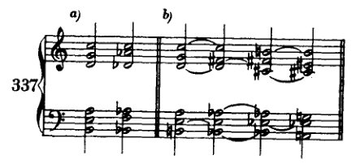
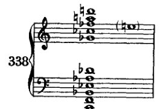

<!-- page 413 -->

XXI 以四度构建的和弦

我已指出，三度和声体系存在裂隙，而那些无法纳入该体系的和弦，则被归拢在“非和声音”的名目之下。我将这种分类揭露为一种拙劣掩饰的企图：试图用一堆庞大而未经检视的废料来填补体系中的漏洞，这堆废料如此巨大，以至于无论是那个漏洞还是体系本身，都根本无法容纳它。如果我们现在谈到以四度构建的和弦，这绝非意在建议用基于四度构造的体系来取代旧有的三度体系。¹ 诚然，四度体系由于与建立在五度之上的体系相同，依据自然之理或许同样站得住脚，并且能够比三度体系统一得多地容纳一切可设想的和弦。然而必须指出，它与当代音乐现实之间的矛盾绝非微不足道：大三和弦在旧体系中是一种简单形式，而在新体系中却是复杂的。在后一体系中，一个三和弦将记为 *d–g–c* 或 *c–g–d*，它确实具有自然依据；因为 *c*（根音）在[八度之后]的第一个泛音是 *g*，而 *g* 的第一个泛音又依次是 *d*。然而这种和声肯定不如 *c–e–g* 那样自然。² 诚然，音的意志在其他任何地方都未能如在四度和弦中这般得以实现；因为它们暗示，向下方五度音的解决实际上象征着同时鸣响的一切——不，一切鸣响之物——的统一。即便如此，四度体系仍将被迫寻求诸多自然之外的解释——但这绝不因此逊色于旧体系，因为后者若无人工辅助则更难以为继。尽管如此，我相信对[四度和声]的探讨——或多或少只是暂时地填补三度体系——应当能为理论家开拓某些新的前景。这一切是否会比以往变得更加简单，非我所能断定。因此我将避免详加论述：那样只会给原有的混乱再添新的迷乱；我只限于解释为何我要谈论四度和弦：因为它们确实出现在文献中，尽管据我所知，它们大多是以叠置四度[而非完整意义上的和弦]的形式出现。

四度和弦在音乐中最初是作为印象主义的表现手段出现的，后来成为常规技术手段的一切事物显然也是如此。例如，想一想小提琴震音初次使用时的效果；由此便不难明白，这类手法并非出自冷静的技术实验，而是源于突然的灵感

---

[¹ 形容词 'quartal' 见于 *Harvard Dictionary of Music*（Cambridge, Mass.: Harvard University Press, 1953），第619页，因此在音乐家中似乎已通行。若要与 'tertian' 类比以求一致，应使用 'quartan'，而 Webster's *Third International Dictionary* 中收录的也正是 'quartan' 这一形式。]

[² 因为，正如勋伯格在初版（第446页）中所解释的，*e* 与 *g* 均属于基音 *c* 最早的泛音之列。]

<!-- page 414 -->

以四度构建的和弦 400

由一种强烈的表达冲动所唤起。对于一种新的和声中新奇而不寻常之处，真正的作曲家只有在这样的原因下才会想到：他必须表达出某种触动他的东西，某种新的、前所未闻的东西。他的后继者们继续使用它，却仅仅将其视为一种新音响、一种技术手段；但它远不止于此：一种新音响是一个无意中发现出来的符号，一个宣告着如此彰显其个性的新人的符号。这样一种新音响，后来成为一位艺术家全部作品的特征，却往往出现得很早。以瓦格纳的音乐为例，可以看到在*罗恩格林*和*唐豪瑟*中，那些后来对他的和声风格至关重要的和弦已经出现。然而，在他的早期作品中，它们只是作为孤立的现象出现，被安排在显要的位置，出现在常常带有奇特新颖表情的地方。人们期待它们成就*一切*，达到*极致*；期待它们代表一个世界，表达一种新的情感世界；期待*它们以一种新的方式诉说那新奇之处何在：一个新的人！*在瓦格纳身上，这很容易追溯；因为他离我们尚近，我们还能记得他的新颖之处，又已足够遥远，使我们在某种程度上能将他的作品视为整体，并理解他的发展以及他身上新颖之处的发展。完全从他那个时代每个人所理解的音乐范畴之内出发，他的音乐起初只遵循一种必要性——以某种方式表达自己，毫不关心美与新奇，也不关心风格与艺术。但在他毫无察觉的情况下，指向其未来发展的特征悄然潜入。有时，仅仅是他未能完成任何音乐匠人都能完美做到的事情。此处存在障碍，将使他这股溪流找到新的河道。另一些时候，则是某种积极的东西：一种灵感，某种直接、无意识、常常是粗暴的、有时几乎是孩童般的对自身本性的肯定。但这位年轻的艺术家尚不了解自己；他尚未觉察自己在何处不同于他人，尤其不同于那既有的文献。他在总体上仍然遵循着所受教育的戒律，还不能处处突破它以顺应自己的倾向。他并非[有意识地]突破；哪里有突破，他自己并不知道。他相信自己的作品在任何时候都与公认为优秀的艺术毫无区别；突然间，他被粗暴地从梦中唤醒，因为批评的严酷现实使他意识到，自己毕竟并不那么正常——真正的艺术家本就不该是正常之辈：他无法与那些平庸的人完全保持一致，那些人是可受教化的，能够完全臣服于*文化*。他开始注意到自己喜欢什么不同于[规范]的东西；他开始注意到自己憎恶什么。*有勇气的那位艺术家，会完全顺从自己的倾向。而只有完全顺从自己倾向的人才有勇气，只有有勇气的人才是艺术家。*既有文献被抛诸脑后，教育所得被彻底摆脱，个人倾向涌现出来，障碍使溪流转向新的河道，那先前只是整幅画面中次要色调的一种色彩铺展开来，一个人格诞生了。一个新的人！这是艺术家发展的范本，也是艺术发展的范本。

<!-- page 415 -->

四度结构和弦 401

那被称作革命；¹ 而那些屈从于这种必然性并珍视它的艺术家们，则被指控犯有从政治词汇的垃圾堆里所能搜罗出的一切罪行。然而，人们却同时忘了：即便可以称之为革命，那也只是在比较的意义上；而且这种比较仅仅就*所比较之点*，亦即*相似之点*而言，并非在方方面面都成立。绝不可将一位拥有美好新观念的艺术家与纵火犯或炸弹投掷者混为一谈。精神与智慧领域中新生事物的到来，与政治革命之间，充其量只有如下相似之处：成功的事物会在一段时间内占据上风，而鉴于这一前景，旧有者便会感到来自新事物的威胁。但根本的区别更为重大：一种观念的后果，其精神与智慧的后果，是持久的，因为它们本属于精神与智慧的层面；而那些在物质事务中席卷而尽的革命，其后果则是短暂的。此外：新艺术的目的与功效从来就不是压制它的前辈——旧艺术，更遑论毁灭它。恰恰相反：没有人比那位真正带给我们新事物的艺术家更深沉、更热烈、更恭敬地热爱其前辈；因为恭敬乃是对自身处境的自觉，而热爱则是一种共同体意识。难道还需要提醒吗：门德尔松——即便他也曾是新人——发掘了巴赫，舒曼发现了舒伯特，而瓦格纳则以作品、言辞与行动，唤起了对贝多芬的最初真正理解？新事物的出现，远可作更佳的比喻——比作一棵树的开花：它是生命之树的自然生成（*Werden*）。然而，倘若有些树有意阻止这开花，那么它们肯定会把这称作革命。而冬天的保守派会与每一个春天作战，即便他们已经历了一百次春天，并且完全可以断言：说到底，那毕竟也曾成为*他们自己的*春天。短暂的记忆与贫乏的洞见，足以把生长与推翻混为一谈；足以使人相信，当新的嫩芽从那曾经的新事物中萌发时，旧事物的毁灭已迫在眉睫。

对我而言，这就是对那些新艺术手段初次登场时之印象主义特质的解释：那是生长之物青春的声响；是纯粹的情感，不带一丝意识，仍紧紧依附于[胚芽细胞]——它比我们的意识更紧密地与宇宙相连；然而，已然带有一种独特性的印记，这种独特性日后将孕育出一个独特的存在——一个因其独特的内在组织方式而从众人中凸显出来的人。[那些青春的声响是]一种日后将化为确定性的可能性的征兆，一种预感，裹挟在神秘的光泽之中。而正因为这些是属于那将我们连接于*宇宙*、连接于*自然*的[胚芽细胞]的一部分，所以它们几乎总是*首先表现为一种自然情调（*Naturstimmung*）的表达*。² 溪流令我们想起它的源头。

值得注意的是，这样一种幸运的发现从来不会完全丧失其效力，即便它仅仅代表一段发展的出发点，而这段发展终将把其初现时的形态远远抛在身后。随后的发展甚至可能

---
¹ 本段在修订版中为新增内容。
² 参见 *infra*，第403页，关于德彪西音乐的段落。

<!-- page 416 -->

402 以四度構成的和弦

將它帶到了藝術開發的頂峰，但它再也無法產生如同初次出現時那般深刻的印象。我想到的是*田園交響曲*末樂章中的號角段落，以及*特里斯坦*第二幕開頭遠處狩獵號角的聲響。這些對我們所有人的魅力肯定永不會消逝，儘管它們的基本觀念後來已遠遠超越了它們本身。

在貝多芬那裡，我們遇到的並非普通的持續低音，也[不僅僅]是一條迴避三音的旋律；在華格納那裡，也不僅僅是運用了號角的開放音，因為他讓其餘的號角也吹奏開放音以外的音。這一點當然無須解釋也能被感受到。而貝多芬無疑也察覺到了這種獨特性，他的形式感證明了這一點——這種形式感驅使他以另一種相稱的獨特性來回應這種獨特性，可以說是為了解決這種獨特性：即主音和聲在小節後半拍*節奏上引人注目的進入* ($)。

我相信現代作曲家在以四度和聲領域中的一切創作，都已蘊含在這兩個段落之中，並且源自它們。馬勒某些四度進行、*莎樂美*的「約哈南主題」、德彪西與杜卡的四度和弦，全都可以歸因於這些和弦所散發出的獨特清新感。或許我們音樂的未來正透過這種清新感訴說著。只有那些對印象極度敏感的人——印象主義者——才能聽見它。印象主義者的器官[感知]是一部調校得極其精細的機制，是一部地震儀，能記錄最輕微的動靜。最纖細的刺激能喚起他的感受力，而粗鄙則會將其粉碎。追尋這些最纖細的刺激——那些較為粗劣的天性因為只聽得見大聲的聲響而永遠無法察覺——對於真正的印象主義者是一種強烈的誘惑。那柔和的、幾乎聽不見的、因而帶有神秘感的，吸引著印象主義者，激起他的好奇心去品味從未被嘗試過的

<!-- page 417 -->

以四度构建的和弦
403

以前。因此，某种闻所未闻之物向探索者自我揭示的倾向，与探索者自身去寻觅闻所未闻之物的倾向同样强烈。而在这个意义上，每一位真正伟大的艺术家都是印象主义者：对最细微刺激的超精微反应，向他揭示了闻所未闻之物、崭新之物。

这在德彪西的音乐中尤为显著。¹ 他的印象主义以如此巨大的力量书写四度和弦，以及其它一切，以至于它们似乎与他所表现的新颖性不可分割地联系在一起；并且它们可以被正当地视为他的精神财产，尽管可以证明类似的东西此前已被写出，同时代的人也在创作。或许[它们的力量]有一部分也在于它们表现了自然的情绪；因为这听起来确实仿佛自然会以那种方式说话。而显而易见，在她的语言面前，一切其它东西都为之让路。

如同许多其他作曲家显然做过的那样，我也在未听过德彪西音乐的情况下写下了四度和弦。或许甚至更早，但肯定是在与他同时。据我所知，[我首次写下它们]是在我先前提及的交响诗 *Pelleas und Melisande*（《佩利亚斯与梅丽桑德》）[1902–03]中。

[注 参见排练号9之前的第三、四小节。]

孤立地，它们只在那里出现过一次，作为某种情绪的表达，其独特性迫使我不情愿地去寻找对我而言一种新的表现手段。我不情愿地——即便时至今日我仍记得，我当时犹豫是否要记下这个音响。然而，它强加于我的那种清晰性，使我无法将其摒弃。后来，直到很久以后，在我的 *Kammersymphonie*（《室内交响曲》）[1906]中，我才再次采用四度和弦，既未回忆起先前那个例子，在此期间也未有机会了解德彪西或杜卡斯的音乐。在这里，这些四度源于一种完全不同的表现冲动（暴风雨般的欢腾），自行塑造成一个明确的圆号主题（例331），以建筑性的方式铺展于整个

[注 《室内交响曲》的第5、6小节。]

¹ 这一想法在第一版中仅以单句表述，在修订版中被扩展形成本段。

<!-- page 418 -->

404 以四度构建的和弦

作品，并在发生的一切上留下它们的印记。因此，它们在这里并不仅仅是作为旋律或纯粹的印象主义和弦效果而出现；它们的特性渗透了整个和声结构，而且它们与其他和弦一样。

我必须请求原谅，因为我如此专门地论述自己的作品。我不得不这样做，因为我不知道在我之前是否有作曲家曾以这种意义、这种和声意义使用过这些和弦。* 当然，它们作为印象主义表现手段的使用也包含在这种和声意义之中。正如卡尔·克劳斯¹所说，当我谈论自己时，我谈论的其实也是事情本身。

并非所有形式的四度和弦都出现在这部作品或我后来的作品中。那么，这里有一些可能性。²

四声部四度和弦甚至可以通过在三度体系内的变音来构成（示例 333*b* 和 *c*）。

\* 除我之外，可能——而且确实很有可能——还有其他人写过这些和弦。也许是马勒、施特劳斯或普菲茨纳。但我不知道。它们从未引起过我的注意。也许我只是没有留意到它们。我绝无意在这里为自己争取优先权。这样做对我来说太不重要了，因为我太清楚重要的并不在此。

¹ 'Ich rede also von der Sache, wenn ich von mir rede.' —— 卡尔·克劳斯，维也纳的论战家与讽刺作家，创办、编辑并主要撰写了论战杂志《火炬》（*Die Fackel*，1899 至 1936），该杂志受到勋伯格及其弟子们的热切阅读。克劳斯对勋伯格思想与文学风格产生的深远影响值得研究。（对克劳斯作为社会批评家与作家的评价，见埃里希·海勒《被剥夺继承权的心灵》[*The Disinherited Mind*]。）

² 在第一版（第 451 页）中，这句话写作：'I shall list them here theoretically.'

<!-- page 419 -->

以四度构建的和弦

405

五部和弦亦是如此。这个和弦以及四部和弦都可以作为属和弦的替代，两者均从属和弦派生而来：四部四度和弦通过降低根音（若愿意承认根音的话）、七音和五音；五部四度和弦则通过升高和降低根音（$a\flat$ 到 $a$ 或 $b\flat b\flat$，并至 $g$），

升高和降低五音（$e\flat$ 到 $e$，$e\flat$ 到 $e\flat b\flat$），并保留三音来构成五部四度和弦。这里使用了转位。但如果不回避五度音程，当然也可以将这些和弦写成原位。

示例 335 展示了[五部和弦]与普通和弦的一些连接。六部四度和弦包含一个小九度（从低音

<!-- page 420 -->

406 以四度构建的和弦

音），因此它是四度和弦中第一个“相当尖锐”的不协和音。因此，人们会首先倾向于处理这个九度音，以某种方式加以解决。我在这里只收录那些能够产生九度音解决的连接。

请注意：这里只给出到最常见和弦的解决，甚至省略了那些使用几乎不会引起反对的不太常见的和弦，如例337a中的那种。

例337b展示了如何通过将三个音降低（*b* 到 *bb*，*a* 到 *ab*，*g* 到 *f#*）来获得六声部全音阶和弦（这种连接也出现在我的*Kammersymphonie*中），以及如果我们将剩下的三个音也降低（*c* 到 *b*，*d* 到 *c#*，*e* 到 *eb*），后者如何再次进行到一个六声部四度和弦。

显然，也可以举出七声部、八声部、九声部或更多声部的四度和弦。由于我在[音乐文献中]并不熟悉它们作为四度和弦，尽管我自己肯定已经写过它们，但我拒绝在理论上阐述它们。诚然，理论或许能在此提供一些启示，但它绝不应该，正如人们常说的那样，预先[在实际作曲中]断定将会发生什么。有一个考虑可能促使我详细阐述这个体系：通过叠加四度来构建和弦，可以产生一种包含半音阶全部十二个音的和弦

<!-- page 421 -->

四度叠置和弦 407

音阶；因此，这种结构确实体现出一种可能性，得以系统地处理我们某些人作品中已经存在的那些和声现象：七声部、八声部、九声部、十声部、十一声部和十二声部和弦。

除我本人之外，我的学生安东·冯·韦伯恩博士与阿尔班·贝尔格也写作过这样的和声。但匈牙利人贝拉·巴托克，以及维也纳人弗朗茨·施雷克尔——他们二人都遵循着一条与德彪西、杜卡，或许还有普契尼更为相近的道路——大概离[写作这样的和弦]也已不远。然而，无论当下看来，我们最有才华的年轻作曲家似乎多么倾向于朝这个方向发展，去运用这类和弦¹，现在就建立一个体系也几乎没有什么价值；因为我们与这些事件之间缺乏距离感，这使我们只能看到一幅令人困惑的景象。但正如我所说，四度叠置结构使得容纳一切和声现象成为可能；因此，如果我们假定有时也可以从[十二声部和弦的]中间省略某些音——例如一个和弦可以由第一、第二、第四和第十个音构成——那么我们也能够产生三度体系的和弦。然而，三度叠置结构，无论我们只是并置同等大小的三度，还是选择某种不等三度的特定模式，都不会产生这一结果[即全部十二个音]，因为某些音过早地重复了。将大三度与小三度交替叠置（大调和弦），我们在第九个音上得到了第二个音的重复（例339a）。小调和弦则在第八个音上产生重复（339b）。完全由小三度构成只产生四个不同的音（339c），完全由大三度构成则只产生三个（339d）。如果我们设定

一种由两个小三度与一个大三度组成的模式，那么我们将会得到十个不同的音。第十个和第十二个音是这种结构中已有音的重复，只有第十一个音是新的（339e）。此外，那种体系的

[¹ 勋伯格为修订版写了一条新脚注（此处移至附录，第432页），审视并拒绝了“atonal”（无调性）一词，以及“atonalists”（无调性主义者）。（该词在《和声学》中仅出现两次：一次在此脚注中，另一次在第128页。）第一版第454–6页的长脚注已作为正文添加到本章末尾（见下文，第408–10页）。]

<!-- page 422 -->

408 以四度构建的和弦

这种分类将远不如四度体系符合自然范例；
因为其基础是两个小三度，它与大三和弦这一概念的共同点，并不比三度构造原则与之的共同点更多。同样的反对意见也适用于例339*f*和*g*中的两种尝试。诚然，这些尝试现在确实产生了所有的音。但增三和弦——前者的基础——与减七和弦——后者的基础——无疑是该体系的人造产物。¹

不协和性渐进本质这一基本论点不仅使我有理由拒绝非和声音，更使我敢于断言三度构造体系是不充分的，并考虑四度体系的可能性；这将激怒那些古代音乐的捍卫者（此处根本无意攻击古代音乐；显然，我比他们更理解它，也更热烈地尊崇它），更将激怒那些固守一种因被误解而过时的美学的教科书编写者。于是，我得知恰恰有这样一个人，由于一次不慎，其注意被引向手稿的几页纸以及关于本书内容的一些叙述，便称本书为现代音乐的一部伟大辩护。对此我并非真的不快，但我必须否认，因为那不是事实。因为现代音乐更需要的是演奏，而非辩护。² 我们愈是看到攻击者们在以批评对抗艺术作品、以无能对抗力量、以贫瘠对抗创造力之时，只是在自我毁灭，我们抵御攻击的兴趣便愈是消退。他们在创造领域的不作为使其丧失了对未来的任何美好希望；然而当他们摆出创造的姿态，并以嘶哑的声音要求人们对其体系给予最高认可，将这些体系置于音乐作品本身之上时，这种不作为便化为了义愤。请勿将此理解为对体系的不敬。相反，我以近乎不应有的毫不嫉妒的心态，钦佩他人所具有而我所缺乏的才能——构建体系的才能。例如，海因里希·申克尔博士，尽管他从未在任何地方达到彻底的清晰，但在我看来，他正因其是为数不多的真正致力于构建体系者之一而值得关注与尊敬；当然，更因为他以与我同等的热情热爱并理解古代艺术作品，所以尽管在我们艺术的现在与未来方面我们相距甚远，但在其过去上我们却更为亲近。然而，当他在一本新的对位法著作中³（据我所闻）谈论作曲艺术的衰落，主张没有人能作任何

---

¹ 本章其余部分是对第一版中一条长脚注（第454–456页）的改写与扩充。该脚注附加于本段第四句。

² 参见1911年版（第454页，脚注）："我由不协和性渐进本质观点之发展所得出的结论——即三度体系是不充分的，而一种基于四度的体系才是可取的——将被我的对手们当作把本书称为现代音乐之伟大辩护的口实。然而它并非如此；因为，尽管现代音乐或许应当得到辩护，但那些攻击却不值得如此认真的对待。"

³ *Neue Musikalische Theorien und Phantasien*, Band II: *Kontrapunkt (Erster Halbband)* (Stuttgart: J. G. Cotta'sche Buchhandlung Nachfolger, 1910), pp. vii–xxiii, *et passim.*

<!-- page 423 -->

以四度构建的和弦 409

更有甚者，那也不比年迈体衰者怀旧“往昔美好时光”时的喃喃抱怨好到哪里去。当然，我们绝不能满足于我们的时代。但原因并非在于它已不再是那永逝的美好旧时光，而在于它尚未成为更美好、属于未来的新时代。因此，像这样毫无根据的攻击，并不足以要求我们必须为艺术进行任何辩护。此处爆发的激烈情绪在心理上是耐人寻味的；因为它表明，那些著名的旧艺术捍卫者，对于他们的辩护以及我们这场斗争的结局，内心深感不安。他们暗自怀疑并担忧，旧艺术将再度获胜，并为新艺术——那位年轻的妹妹——在她右手边赢得一个尊贵的席位。¹

再者，依照古老而明智的军事格言，任何防御问题都须以进攻解决，若果真如此，那么一场好的防御便与攻击几乎无从区分：凡追求理论知识者，却*将其建立在接受来的审美判断之上，而不去审视这种审美及这些判断是否正确*，他的理论便无非是试图为这些判断硬凑证据，因而毫无价值。在此我是公开而正大光明地发起攻击，抱着彻底消灭对方的意志；我不是在防守，他们才是。因为（这是我们之间最大的不同）我曾向自己提出过那个问题，而不是像例如里曼那样建立在空气之上；里曼为其理论能更尖锐、更严格地表述规则而自豪，却浑然不觉，也正因为这个原因，他将被迅速抛在后面。

迈尔霍费尔也是如此——若不是他那部*Der Kunstklang*，²写得如此冗长艰涩，我或许早就读过它了——他似乎也在同一道边界前止步。他也即将提出一种理论；那确实将是一项成就，因为迄今为止我们尚无一门理论。然而，他将不协和音称为协和音必要的补充，从而强调了二者之间的对立关系；正因如此，我怀疑他能否达到倘若没有做出这种美学与他自己对现象之直接感知之间的妥协，他本可以达到的远度。那将是令人惋惜的，因为在我看来，他似乎具备更深刻的理解力（除了他那繁复难解的术语，那些术语徒有名称，却无法唤起相应的概念）。尽管如此，

---

¹ 勋伯格在修订版中添加了这句话；下面的段落是对第一版中相应段落（第455页，脚注的续文）的大幅删节。下面给出此段原文开头的几句话，用以补充说明，并澄清这里或许是过度删节之处：

“但我绝不会仅仅因为这样的攻击就决定写一本书。我决定写作，是因为我相信我有一些尚未为人所知的东西要说。任何阅读本书的人都应当清楚，它涉及的是一些基本原理。最重要的是，我的方法与其他作者相比最具特色的地方：其他人将审美判断视为既定事实，并据此建立他们的理论，试图为这些判断寻找证据。但他们却忘了问自己那个最重要的问题，*这些审美判断究竟是否正确*！我认为这正是我与他人最大的不同之处，即我总是首先向自己提出这个问题……”

² Robert Mayrhofer, *Der Kunstklang*, Band I: *Das Problem der Durdiatonik* (Vienna: Universal-Edition, 1910). Cf. 'Über Konsonanz-Dissonanz', pp. 239–47.

<!-- page 424 -->

410 四度结构和弦

尽管他也从美学出发，通过与美学缔结契约，他仍有可能找到正确的东西。

当然，从某种角度来说，我比那些并非作曲家的理论家要轻松一些。我无法接受他们的美学，仅仅是因为我的想象力、我的听觉以及我的形式感坚持一种不同的美学。因为对我来说，他们竭力为之辩护的那些禁令与戒律，从一开始就被我的音乐灵感（*Einfall*）所废止，而后者却证明了相反的事实。因此，当我质问[传统的]美学是否正确时，那些话简直是不由自主地从我口中说出。最先反对它的并非我的深思熟虑，而是我的音乐直觉（*Gefühl*）。而当我之后也通过思考得出其他结论时，我这样做并非是为了捍卫什么。相反，我觉得自己只是在叙述，只是在报道、描述艺术创作的真实面貌。我的耳朵说过：是的；毕竟，耳朵就是音乐家全部的理解力！

也许我发明了许多本就已然存在的东西；但我是自己发明的，而非从阅读中学得。我自己发现了它（毕竟，这就是“发明”的含义），因为我亲身体验了它。我的经验是，我的理解方式使我无法纠正一个糟糕的灵感；于是我告诉自己：这绝非偶然，此处必定存在一条法则。这条法则就是：*灵感*（*Der Einfall*）。因此，我开始反思手艺与艺术之间的关系。经过思考，我发现艺术与手艺之间的关系，就好比酒与水。酒中当然有水，但从水开始的人是一个掺假者。人们确实可以将水与酒分开考虑；但那时便存在清晰的区别。这使我将作曲教学仅仅视为一种手艺的教学，仅此而已。于是，问题便得以解决[即由美学及其戒律所带来的问题]，因为手艺的必需条件对艺术并无约束力。因此，我可以将技艺教学置于纯粹实践的基础之上，提供服务于特定目的的明确手段（*Zweckmässigkeit*）；因为在我看来，艺术中[预设]目的的缺失（*Zwecklosigkeit*），与表现同样具有至高无上的重要性。[实用性、手段服务于目的，]对手艺来说是恰当的，甚至是不可避免的。在艺术中，它没有立足之地。但这两者实际上毫无关系。
