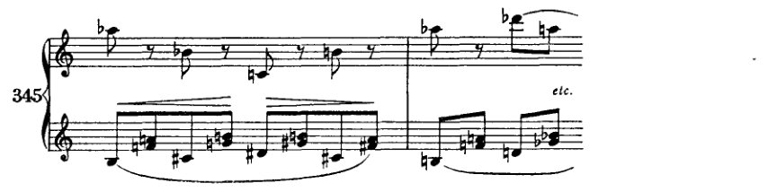
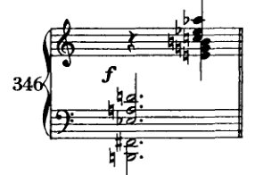

<!-- page 425 -->

XXII 六音及更多音和弦的美学评价

我不建议学生在其作曲尝试中使用此处呈现的和声，只要它们也未曾出现在其他更古老的文本中。无论他使用现代还是非现代的手段，他的努力是好是坏，取决于他天生具有某种可表达之物的才能与他表达它的能力之间的关系。教师只能影响这一关系中的一个组成部分，即表达能力。也许连这也影响不了；我怀疑这种能力甚至能否通过传授技术手段来提高。学生模仿范例的技术时，并不是在学习表达*他自己*。实际上，真正的艺术家首先是不可教的。如果我们向他展示“他必须如何做”，并且把我们的话建立在其他人也曾那样做过的事实之上，那么这也许是艺术的教学，却并非对艺术家的培养。自我表达的能力当然不取决于一个人所掌握的手段的种类和数量。但无能却取决于此。无能只能通过技术来发展；因为它并非通过自身产出而存在，而是靠他人所产出的东西来滋长。然而，真正有天分者的作品，最终与其一度作为楷模的文献之间，几乎不表现出什么外在联系。因为他尊重自己；因为通过这种自尊，他从他的初始条件中、从他的范例中进化出来，那些范例也许在一开始确实曾作为支柱，曾作为他最初学步时使用的拐杖。因为最终他不会写那种在艺术上可接受的东西（*Kunstgemäss*），而是写对*他这位艺术家*来说可接受的东西（*Künstlergemäss*）。

以下思考似乎与这种观点相矛盾：例如，莫扎特的风格与贝多芬的风格之间存在本质区别，这一点今天对每个人来说仍然是清楚的；然而，这些区别并不大到足以证明适用于一方的规律不适用于另一方。相反，莫扎特作品中有一些段落，甚至乐章，几乎可以出自贝多芬之手，而贝多芬也有一些作品几乎可以出自莫扎特之手。如果我们回溯得更远，比如回到十六或十七世纪，那么在我们眼中[and ears?]这些区别变得如此微妙，以至于我们很容易将一个作曲家的音乐误认为是另一位的。与一组物体的距离使它们在很大程度上被平均化，以至于抹去了个体的区别。在风格上，也许甚至在内容上，一位艺术家几乎无法与另一位清楚地区分开来；我们只感知到共同的特征，从中我们可以抽象出艺术上可接受的东西。然而，从某种距离来看，我们真正能察觉到的只有时代的精神（*Geist*）。能够让自己站得足够远的人，将会察觉到人类的精神。个性在这种距离上消失了，但它们所表达的——人类，人类身上最美好的东西——却变得可见。最高的顶峰对观察者来说是最容易接近的，毛细血管将最精微、最美好的东西从深处输送到这些顶峰之上，唯有它们才展现出人类的精神。因此，随着距离的增加，

<!-- page 426 -->

412

**含有六个或更多音的和弦**

起初是还原性的，却又再次放大：个体、巅峰，即便以另一种方式，也重新变得可见。人们看到它们是相关的，并看到它们如何相关，它们彼此间具有连贯性；人们不再看到近处所揭示的东西，不再看到它们曾是截然分离的；*但这些关系并非艺术的关系，亦非艺术技巧的关系；它们毋宁说是更为深层的关系。*

当然，从适中的距离观察，正如我所说，我们甚至能找到一条线，揭示技巧与艺术上可接受之物的路径。而且，如果我们承认一条曲线的最小部分可以被看作是一条无限小的直线，那么这种视觉错觉想必也适用于那标示着艺术技巧发展方式的脉络网络。撇开那些微小的偏差，那确实可以是一条线。甚至或许必须如此，因为最终目标对所有人都是共同的。还有另一共通之处：我们的终极局限。

致力于艺术沉思的眼睛必须能够聚焦于所有这些距离。距离所揭示的景象与近旁所见同样重要。但从远处我们只能沉思过去。如果我们能从远处审视当下，那我们所有的斗争都将结束。但斗争不会放过我们，尽管其结果早已注定。我们知道它的目标。我们知道谁将获胜。就像在演习中，胜利者事实上是预先决定的。尽管如此，斗争仍必须进行，而且要像一个人能够改变结果那样认真地进行。我们必须同样激情地战斗，就好像我们并不知道哪种观念将征服一样。尽管这种观念反正会胜利，即使我们不战斗，因为它的胜利是注定的。或许我们的斗争本身就是注定的；无论如何，这种激情是正当的。

近处，即当下，我们确实最强烈、最直接地感受到的，揭示了为斗争蓄势的活生生的人格，其与环境展开激烈冲突。这些人格彼此截然不同；看起来几乎好像它们毫无共同之处，好像它们会完全脱离进化的行列，好像没有什么能将它们与人类其余部分相连。而且，就像在演习中，注定要失败的一方必须设法将每一个先前已知的情势转为己用，同样，那将屈服的理念也会为其每一寸领地而斗争。正如演习中注定的胜利者不可只是袖手旁观，而必须行动，就好像他否则会被击败一样，同样，那征服的理念也以同样的活力行动，尽管它反正会胜利，即使它什么都不做。战斗姿态，所有肌肉紧绷，每一个动作都有其理由和目标。这就是正在奋斗的人格，在近处所呈现的状态。

如果说近处教会我们多样性，那么远处则教会我们普遍性。如果说当下向我们展示个体的差异，那么中等距离则展示手段的相似性；但巨大的距离又反过来将两者都抵消，展示个体是不同的，但即使如此也展示了真正连接它们的东西。它展示了关于个体最重要的东西，那对自我本性最深刻的内省与沉浸，那促使他表达的东西：人类的本性。

<!-- page 427 -->

含六个或更多音的和弦 413

真正重要的是倾听自我、深入审视自我的能力，这几乎无法后天获得；当然，它也无法被传授。普通人似乎只在少数崇高的时刻才具备这种能力，而其余时间则不是按照自己的倾向，而是按照原则生活。真正拥有原则——人性的原则——的人，按照自己的倾向生活。这些倾向当然与人性的原则相符，尽管他自己并不知晓；但或许他隐约感觉到确实如此。

而那些被视为艺术手段、被视为风格的东西，那些平庸者认为只要加以模仿就能成为艺术家的所有特征——这一切结果都不过是次要的事情，其价值最多相当于症候。诚然，离我们已远去的某个时代的大师作品之间的风格相似性，可以用我们与它们之间的外在距离来解释，而每当我们走近时，这种相似性就消失了。手段演进的直线，细察之下呈现出纷繁的复杂性。然而，构成风格的一切，最多只能标志一个人在世并与同时代人搏斗的那个时代。它不过是一种症候，让同时代人借此辨认哪些人是重要的个体。但相对于距离所揭示的东西而言，它是无关紧要的。

因此，旨在培养艺术家的教育，最多只能是帮助他倾听自我。技术，即艺术的手段，帮不了他。这种知识应当尽可能是一种隐秘的知识，唯有自己找到道路的人才能获得。倾听自我的人会掌握这种技术。通过不同于课程规定的途径，或许是迂回曲折的道路，但却带着万无一失的确定性。因为他听到的是共通的东西，而使他区别于他人的，或许不在于他「如何」听到，而在于他*确实*听到。而手段之「如何」更可能将人与艺术之「所是」隔开，而非使人靠近。

因此，我并不向学生推荐使用现代技术。当然，他应该练习这些技术，以便有能力实现精神最终所要求的任何东西。旧有的手段在这里也同样适用。更新的手段当然也不会造成什么损害。但也许它们仍然带有一种版权，一种相当傲慢的所有权，拒绝向那些不愿自己付出努力的人敞开道路。那些自己付出努力的人终究会找到它，并且是以一种赋予他们使用权的方式找到它。对他们而言，道路是敞开的；而对那些只想试手的人，愿它保持封闭。最终，更新的技术将进入公共领域；但到那时，使用它们的人至少将不再想要学习「如何表现一种个人风格」。

正因为我不推荐这些和声，所以我也无需对它们作美学评判。此外，任何自行抵达它们的人都不需要向导。他的耳朵和他的正直感会比任何艺术法则都更可靠地引导他。然而，还有一个原因使我可以轻易地省略这种评判，而无需像其他教科书那样躲在某种程式后面。较老的理论提供一个体系，而在其中出现的，正是经验可指认为美的东西。

<!-- page 428 -->

414 六音及六音以上的和弦

但其中也会出现别的东西，一些不被推荐、甚至被禁止的东西。方法如下：先确立若干可能的组合，然后将那些被认为不合适的作为例外排除。然而，一个有例外的体系算不上体系，或者说至少是不完善的。此外，我已证明，为这些例外辩护的论据大多是错误的——而在我看来，这是任何人都能从本书中学到的最重要的一点——这些例外仅仅是某种艺术趣味的表达，这种趣味与自然的关联仅在于，它落后于自然。[我已证明]这些例外只是对自然的不完美适应，而一种更充分的适应必定会导向本书所设定的目标。当然，不止于此，肯定还超越于此。[我已证明]这些规则充其量只表明了对自然给定之物渗透的程度，因此，它们并非永恒法则，而只是那种下一次成就总会将其冲刷掉的法则。那么现在，难道我也应该制定法则、亲自进行那种评价并设立例外吗？没有人会这样要求我，没有一个追随并赞同我所说之话的人会这样要求。

我猜想有人会向我提出如下问题：如果没有标准来确定什么是好、什么是坏，那么如何区分熟练者与拙劣者呢？首先，我得说，我认为区分此处所指的那种熟练与拙劣并不十分重要。这种熟练实际上只在于仔细留意并遵守所有法则，它并没有什么令人印象深刻之处。它确实很难与拙劣区分开来，但[做出这种区分]同样是多余的。然而，艺术家的技艺与此毫无关系。艺术家做任何事都不是[为了]让别人觉得[它]美；相反，他只是做他必须做的事。如果别人想把审美法则应用于他的作品，那么——如果他们离开审美法则就活不下去的话——去找适用的法则就是他们自己的事。但这些法则真的有必要吗？没有审美法则，人们就真的无法欣赏艺术作品吗？再者，那些对规范（*Tabulatur*）一无所知的门外汉的艺术感受力又怎么说呢？叔本华将庸人对伟大艺术作品的尊敬解释为对权威的信仰。¹诚然，就广大群众所表现出的尊敬而言，确是如此。但在门外汉中，我发现有些人的感知器官比大多数专业人士更为敏锐。而且我确信，有些音乐家对绘画的感受力比许多画家更强，也有些画家对音乐的感受力比大多数音乐家更强。不同意这一点的人至少也仍须看到——如果传播艺术还有什么意义的话——外行人的接受力、敏感性和辨别力是绝对必要的先决条件。如果他能对艺术做出敏感的反应，那么他肯定也能对其进行评价——如果这有必要的话！如果他能为自己做出评价，

---

¹ Cf. *Sämtliche Werke: Parerga und Paralipomena, zweiter Band* (Zweite Auflage; Wiesbaden: Eberhard Brockhaus Verlag, 1947), pp. 489–90. 叔本华写道，杰作只能由那些具有相应高度智力和精神能力的人来欣赏。不具备这种能力的人只能接受那些有判断能力的人所作出的评判。

<!-- page 429 -->

六音及以上的和弦

那么对他来说，审美法则就是多余的。既然如此，它们为谁而存在？为评论家吗？一个能用味觉分辨好坏水果的人，未必需要能用化学公式表达这种区别，也不需要公式来识别这种区别。但一个没有味觉的人该对食物作评判吗？化学公式对他又有何用？再者：他懂得如何应用它吗？如果懂：他又会为了什么目的而应用它？学生需要这些法则，好让他知道自己可以走多远吗？我刚才确实已经说过他可以走多远：远到他天性驱使他去的地方；如果他想成为艺术家，他就必须努力精确地倾听自己的天性！如果他只想做一个工匠，那么某处自会出现一道障碍；那道阻碍他成为艺术家的障碍，也会阻止他走得太远。倘若一个年轻人犯错，走得比他的天赋推动他去的更远呢！他之所以没有成为什么特别的人物，究竟是因为走得太远，还是因为走得不够远，姑且不论。但蠢人总是害怕被视为蠢人，也就是说：被识破。他们担心自己会被愚弄。这种他们的不确定性，正是要求保护之处。既然审美法则至少以这种形式不能作为目的本身，在我看来，它们的唯一目的似乎就是保护庸人不被当作傻瓜。或者，也许也在暗中保护庸人不被一种新的美所压倒。平庸之人最怕的，莫过于被迫改变他对生活的看法、他的哲学。他还为自己树立了一个理想，来表达这种恐惧：品格。所谓有品格的人，就是那种（套用卡尔·克劳斯的一句话）其动脉硬化源于他的世界观的人。

然而，以另一种形式，审美法则本身可以成为目的。作为对最大数量作品所共有的那些效果的精确描述。作为将最大数量的效果还原为尽可能少的共同原因的尝试。作为组织现象以提供视角的尝试。这本身可以是一种目的，但人们必须对此感到满足；而且，最重要的是，绝不应得出这样的结论：既然大多数艺术作品都是如此，那么所有其他作品也必定如此。这就已经足够了，超过了人们敢要求的，但也是最大限度所允许的。

有人会问，如果我希望技术是秘传知识，那我为什么又要写一本和声教科书。我可以回答：人们想要研究，想要学习，而我想教导，想传播我认为是好的东西；因此，我教。但我认为人应当学习。艺术家，也许只是为了陷入错误，然后再从中解脱出来。冲走错误的这股能量，随后也会将他身上其他一切玷污着他的羁绊一并清除。眼睛的卡他症可以通过引发眼部炎症来治愈。治愈过程不仅治愈这种炎症，也治愈实际的疾病。但艺术家也应当学习，因为并非所有人都必须从起点开始，并非所有人都必须亲身经历伴随人类知识进步而来的所有错误。人必须且可以在一定程度上依赖自己的前辈。他们的经验和观察，他们已经

<!-- page 430 -->

416 六音或更多音和弦

一部分记录在各门科学的[文献]之中；但另一部分——我不知道它是否最可靠——却存在于无意识之中，存在于本能之内。¹ 怀疑是我们的权利，也是我们的职责。然而，要使我们自己脱离本能，既困难又危险。因为，除了[关于]是非对错的认知，除了我们继承自祖先的经验与观察，除了我们承袭自他们以及我们自身过去的东西之外，在本能之中或许还存在着一种正在发展中的能力：对未来的知悉；或许还有其他一些能力，人类终有一天会有意识地拥有它们，但目前至多只能感知与渴望，却无法付诸行动。艺术家的创造活动是本能性的。意识对其影响甚微。他感觉自己所做的一切仿佛是被口授于他。仿佛他只是按照某种内在力量的意志行事，而那法则他并不知晓。他只是某种对他隐匿的意志——即本能，即他的无意识——的工具。无论那是新的还是旧的，好的还是坏的，美的还是丑的，他都不知道。他只感到一种本能的强制，必须服从。而在这本能之中，既可能表达旧的东西，也可能表达新的东西。既有依赖过去的，也有指向未来道路的。旧真理或新谬误。[这是]他的音乐天性，一如他从某位音乐先辈那里继承而来，或是通过文献习得的，但[这也]或许是一种寻求新路径的能量的流露。对或错，新或旧，美或丑——一个只感受到本能冲动的人又如何知晓？谁敢在本能之中、在无意识之中分辨是非，把从前辈继承的知识与天赋的直觉力量割裂开来？艺术家必须学习，必须研习，无论他愿不愿意；因为在他能够愿意之前，他已经学会了。在他的本能中，在他的无意识之中，蕴藏着丰富的旧有知识，无论他愿不愿意，他都会将其重新唤起。真正的艺术家既不会因从教师那里学到的东西而受损，也不会因他在有意识之前就这样学到的东西而受损。

而那些天赋平平、并非在最高意义上真正富有创造力的人——他最应该学习。对他来说，学习和研习本身就是目的。他的任务是将实际上只是信念的东西当作知识。知识使他强大；而对其他人来说，信念已足够。他无法从一开始就自行发现，也不知道如何独自超越中人之姿继续前进。如果他真要始终保持出生时那样的平凡之人，那么他就必须永远使自己上方与下方的距离保持均等；既然他上方的人在不断前进，他就必须以适当的间隔跟随在后。那些他不必去发现因为它们早已被发现的，以及那些他无法去发现因为否则他就会变得卓越的东西，他必须学习。保护他免于错误既无必要，也不可能。但教导可以将他引领到他若想做一名合格的中等之才就必须达到的地步。既然他自己无法产生有价值的东西，他至少可以被培养得能够恰当地欣赏他人创造的价值；

¹ 西格蒙德·弗洛伊德（以及荣格和阿德勒）的著作对其维也纳同时代人勋伯格以及该时期其他艺术家的影响，值得研究与推测。

<!-- page 431 -->

含六个或更多音的和弦 417

而这是一个使教书值得的目标。阿道夫·路斯说："相对说来，知道如何生产的人已经够多了，但知道如何消费的
人却相对稀少。"事实上，培养消费者甚至可以是教学的目的。当然，这不是通过审美规则，而是通过
拓宽他们的视野。

但还有另一个原因[促使我写这本书]，或许是最令人信服的：一套学习课程[一种理论或学说——*Lehre*]
的构建本身就可以是一个目的。即使不针对一个实际的学生，它也可以诉诸一个假想的学生。也许学生只是教师
的一种外在投射。教师对那个学生说话时，其实是在自言自语。"Mit mir
nur rat ich, red ich zu dir"（"我对你说话时，只是在同自己商议"）。¹ 他自我教导，是自己的老师，也是自己的学生。他允许公众旁听，而其本意其实是通过清除旧错误的瓦砾，
并在其位置上树立新的错误——也许是错误，但至少是更有远见的错误——来使自己弄清事情；
他在这里允许公众旁听，就类似于他创作并交付给公众的艺术品。他与自己和解，
而公众在倾听；因为人们知道：这关系到他们自身。

因此，我也可以不对这些新的和声进行美学评价。它迟早会来；或许不会。也许会是好的，尽管很可能不是。
我希望它会足够明智地确认：这些就是迄今被认为好的东西；其他的暂时还未得到青睐，但很可能在将来的某个时候也会被接受。
然而，我不应遗漏提及一些来自对实际作品思考的小经验和观察。显然，我只能凭直觉做到这一点；此外，这种直觉依赖于前提条件，依赖于我先天的和后天获得的
*Kultur*的影响。因此，我并不排除那些我碰巧没有提到的东西。可能是我尚未注意到它；很可能是我还不知道它。
而如果我没有写下所有通过联想或推理（*Kombination*）被认为可能的东西，或许是因为我早年教育造成的抑制阻碍了我。
在作曲时，我只凭感觉、凭形式感来做决定。这告诉我必须写什么；其他一切都被排除在外。
我写下的每一个和弦都对应着一种必然性，对应着我表现欲的一种必然性；然而，也许也对应着和声结构中一种无情但无意识的逻辑的必然性。
我深信逻辑在这里也同样存在，至少与和声中先前已被耕耘的领域一样多。
作为证明，我可以援引这样一个事实：出于外部形式考虑而对灵感、对乐思（*Einfall*）所做的修改——清醒的意识往往太容易倾向于这种修改——通常都毁坏了乐思。
这向我证明，这个乐思是强制性的，它具有必然性，其中存在的和声是乐思的组成部分，人不可对其做任何改动。

一般而言，在使用含六个或更多音的和弦时，将会出现

---
¹ 沃坦，对布伦希尔德，*Die Walküre*，第二幕，第二场。

<!-- page 432 -->

418 包含六个或更多音的和弦

通过将单个和弦音作宽距离排列来柔化不协和音的倾向。这种柔化是显而易见的。因为不协和音实际上是更远的泛音，其形象以令人满意的方式被模仿。正是从这个意义上，应该理解下面从我独幕剧《期待》¹中引出的这段谱例。

这个和弦中出现了十一个不同的音。但柔和的配器，以及不协和音被宽间距排列的事实，使其听起来相当精致。此外或许还有别的原因：这些音的各个分组被安排得如此巧妙，以至于人们很容易将它们与先前已知的形态联系起来。例如，在第一组中，我相信听觉会期待如下解决：

这种期待的解决没有出现，在此处所造成的损害并不比在简单和声中省略解决时更大。第二个和弦可以如例342*a*那样解决；这个解决可以与第一个和弦（341）的解决相结合（342*b*），而这一组合可以如342*c*那样解释。[这是]两个共有一个减七和弦的和弦的叠加；由于两个不同的低音，这个减七和弦变成了两个不同的九和弦。

¹ 第382–3小节。]

<!-- page 433 -->

六个或更多音的和弦 419

[音乐记谱：例342，包含标记为a)、b)、c)的三个和弦]

然而，这种推导并非总是适用；对较早形式的参照并非总是奏效，或者即使奏效，也只有在非常宽泛的解释下才行得通。因为我在另一个场合曾以密集得多的位置写过这样的和弦。而在我的学生安东·冯·韦伯恩的一首弦乐四重奏中，¹ 有以下片段：

[音乐记谱：例343]

弗朗茨·施雷克在他的歌剧《遥远的声音》（*Der ferne Klang*）中，在许多其他片段之中，还写下了以下这个例子：²

[音乐记谱：例344，带有"muted violins"、"pp"、"muted horns"、"etc."标记]

其中，虽然当然许多个别的音响效果都应归功于运动的声部，但与前面所给示例的相似性仍然成立：也就是说，不协和音的和弦建构能力并不取决于解决的可能性或倾向。匈牙利作曲家贝拉·巴托克在他的一些钢琴作品中也接近这些音响感觉（*Klangempfindungen*），如下面的段落所示：³

---
[¹ *Fünf Sätze für Streichquartett*, Op. 5，第一乐章，第五小节。]

[² 第一幕，第七场，第36小节。]

[³ *Fourteen Bagatelles*, Op. 6, X，第36–37小节。（纽约：Boosey and Hawkes，New Version，1950年。在这个版本中，这些小节高音声部的*bb*和*ab*反复出现，未经升高。）]

<!-- page 434 -->

420 含有六个或更多音的和弦

以下片段出自我的学生阿尔班·贝尔格，¹的一首作品，也是一个有趣的例子：

至于为何如此以及为何正确，我尚无法详细解释。总体而言，对于那些接受我关于不协和音本质之观点的人来说，这是不言自明的。但我坚信它是正确的，并且不少其他人也如此认为。这种和弦进行似乎可由半音阶加以解释。和弦进行似乎受一种倾向支配：将第一和弦中缺失的音纳入第二和弦，通常是那些高半音或低半音的音。然而，声部很少作半音进行。此外，我注意到重复音、八度很少出现。对此的解释或许是，被重复的音会凌驾于其他音之上，从而变成一种根音，而它几乎不应当是根音。或许也存在一种本能的（可能是过度的）厌恶，哪怕只是稍微联想到传统和弦。显然出于同样的原因，早期和声中的简单和弦无法在此环境中成功出现。然而，我相信它们在此处缺席另有原因。我认为它们听起来会太冰冷、太干枯、缺乏表现力。或者，也许我先前所述的内容在此处也适用。亦即，这些简单和弦——对自然的不完美模仿——在我们看来过于原始。它们缺少某种东西，例如日本绘画与我们的绘画相比时所缺少的：透视、深度。声音的透视与深度，或许正是我们在简单的三声部与四声部和声中所感到缺失的东西。正如在一幅画中，一部分注重透视而另一部分忽视透视，却又不损害效果，这几乎是不可能的；因此或许可以类比地说，这些略显空洞的声音无法与那些饱满的声音一同出现，

[¹ *Vier Lieder*, Op. 2, No. 4: 'Warm die Lüfte'，结束前的第四小节。]

<!-- page 435 -->

六音或更多音和弦 421

丰富的音响；然而，单独使用这一种*或*另一种则能确保统一性，从而产生恰当的效果。

令人惊讶，并可引出结论的是，我和那些持相似观点的人能够精确地区分五声部或六声部和弦应当何时出现，更多声部的和弦又应当在何时出现。在八声部和弦中省略一个音，或在五声部和弦中增添一个音，都不可能不损害效果。甚至连音的间距也是强制性的；一旦某个音的位置放错，意义就会改变，逻辑与效用便丧失殆尽，统一性似乎也遭到破坏。显然有法则在此支配着。它们是什么，我不得而知。或许几年后我会知晓。或许在我之后有人会发现它们。目前我们所能做的充其量只是描述。

我愿放弃进一步的描述，以便在最后提及另一个想法。在一个乐音（*Klang*）中，人们可以辨识出三种特性：它的音高、色彩[音色]与音量。迄今为止，人们仅在其运作的三个维度之一中进行测量，即我们所称的'音高'的那个维度。对其他维度的测量尝试迄今几乎未曾展开；将其结果组织成体系更是完全尚未有人尝试。因此，音色（*Klangfarbe*）——音的第二个维度——的评价，与上述这些和声的美学评价相比，仍处于远为不成熟、远为缺乏组织的状态。尽管如此，我们仍然大胆地仅凭感觉将音响相互连接、相互对比；而且迄今从未有人想到，要在此要求一种理论来确定人们做此类事情时所依循的法则。这在目前根本做不到。而且，显而易见，我们没有这些法则也照样能行。倘若对第二维度的测量尝试已经取得了显著的成果，或许我们应该区分得更加精确。但也或许不必如此。无论如何，我们对音色的注意力正变得越来越活跃，正越来越接近描述并组织它们的可能性。同时，很可能也正越来越接近限制性理论。目前，我们仅凭感觉来判断这些关系的艺术效果。所有这一切如何与自然音响的本质相关联，我们不得而知，或许还几乎无从猜测；但我们确实毫无顾虑地写作音色的进行，而它们也以某种方式满足了美感。这些进行之下隐含着什么样的体系？

正如通常所表述的那样，音色与音高之间的区分，我无法毫无保留地接受。我认为音正是凭借音色才变得可感知，而音高只是音色的一个维度。因此，音色才是主议题，音高只是一个分支。音高不过是朝着一个方向测量出的音色而已。现在，如果有可能用按音高区分的音色来构成样式——我们称之为'旋律'的进行——其连贯性（*Zusammenhang*）唤起一种类似于思维过程的效果，那么也必定有可能用另一维度的音色——即我们单纯称之为'音色'的那种东西——来构成这样的进行；这些进行相互之间的关系以一种完全等同于音高旋律中令我们感到满足的那种逻辑来运作。这看起来像是未来的幻想，而且很可能正是如此。但它是一

<!-- page 436 -->

422 包含六个或更多音的和弦

这，我坚信，必将实现。我坚信它能以前所未有的方式提升艺术所带来的感官、智力与精神上的愉悦。我坚信它将使我们更接近梦中的虚幻之物；它将扩展我们与那些今日在我们看来是无生命之物的关系，因为我们从自己的生命中赋予生命给那些对我们来说暂时死去之物，而它们之所以死去，仅仅是因为我们与之的联系太过微弱。

音色旋律！何等敏锐的感官才能感知它们！何等高度发展的精神才能在这般微妙的事物中找到乐趣！

在这样的领域中，谁敢要求理论！
