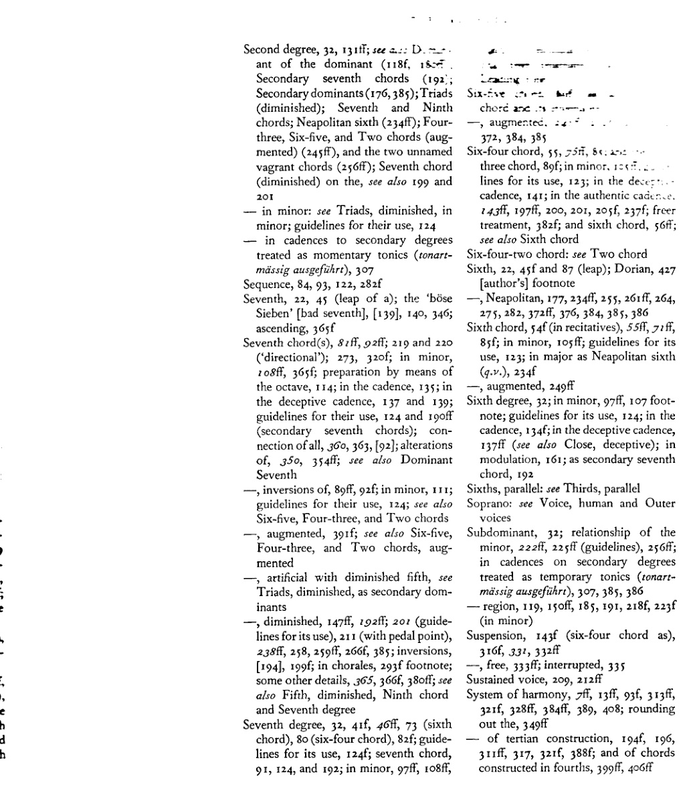

<!-- page 448 -->

主题索引

[由阿尔班·贝尔格为第一版编制（*supra*，第 3 页 . . . . . . . . . . . . . . 在第三修订版中扩充并补充了页码引用。]

（斜体数字表示该主题作为章节标题、副标题亦见于目录的页码。）

变化和弦，179、222、350ff；*参见* 三和弦、七和弦、九和弦等。

女低音：*参见* 声部

先现音，331、341

人工减与增三和弦、七和弦等：*参见* 三和弦、七和弦等。

无调性，128、432f [作者脚注]

低音：*参见* 声部与外声部的旋律进行；数字低音，13f、37f、103、389；音符与根音，41、52ff、56ff、75ff、116、176、385

终止式[正格 — *Kadenz；参见* 收束 — *Schluss*]，118f、125ff、134ff、143ff、157ff、223、247、305ff；通过省略中间步骤的简写，359f；通过使用副属和弦的扩展，178、183；小下属调，222、230f；经过音，345f [?]、[296]；游移和弦，369f；关于音阶音级，*参见* 音级及其单独条目

坎比亚塔，430 [作者]脚注

换音（*Wechselnoten*），430 [作者]脚注，296、303f、331、331f、340f

众赞歌和声编配，14、286、289ff

和弦，13ff、26ff；排列法，33ff；123（使用准则）；重新解释，156；自然音，23、27、31ff；非自然音，155、179、385f；不完整的，83ff、86；五音及以上的，311f、368、388f、390ff（全音），399 及 404ff（四度叠置），411、418f

半音体系，102（交叉关系），159 脚注（在转调中），及副属和弦，175、176、184f；在连接小下属调领域和弦时，227f；与持续音，210；半音经过音，337；半音邻音（*Wechselnoten*），341；以半音引入的和弦音，229f、259f；半音音阶，229、247、271 脚注，339、384、387ff、394、432 [作者]脚注，420

教会调式，25 脚注，28f、95ff、387f、432 [作者]脚注；136 脚注（变格终止）；290 脚注（众赞歌）；与副属和弦，175ff [含作者脚注，427]、188

收束[或终止式 — *Schluss；参见* 终止式 — *Kadenz*]，83（导音），103f（小调），125ff；正格、完全与半收束，305ff；变格，136、296（在众赞歌中），305ff、359；在副音级上，307；弗里几亚，307；当作独立调处理的音级（*tonartmässig ausgeführt*），306、307、388—，阻碍的，118f、136ff、307；在转调中，157、273；来自副属和弦，428 [作者]脚注、181；来自减七和弦，193 及 201；与持续音，214；在众赞歌中，292f；来自九和弦，347、358

共同音，39f、51f、85、112

协和音：*参见* 不协和音

对位法，13f、26f、203、312；425 及 388f [作者]脚注（复调）

交叉（或虚假）关系，98、102；关于减七和弦，195 及 201；关于小下属调领域和弦，226

音级，32f、39f、100 脚注（“升高与未升高”），199f、329、330、389；在小调中，99—，多样化使用（*Stufenreichtum*），223、370；*参见* 第一、第二 . . . 第七音级

<!-- page 449 -->

436 主题索引

—，当作独立调处理（*tonartmässig ausgeführt*），179、212（带持续音），175（在转调中），291ff（在众赞歌中）；306、307 及 388（在终止式中）

不协和音及其处理，46ff、51f、66、93f、137ff、146；在六四和弦中，47ff、56ff、75ff、143ff；在七和弦中，81ff；在增三和弦中（*参见* 增三和弦），106f；在九和弦中，346；非和弦音，322ff；更自由的处理，142f、320f、386；*参见* 经过音（*Durchgang*）

—，与协和音，18、21f、68 脚注、70、316、320f、329、386、409

属音，32f、49f、191（“指南”）；（*参见* 属七和弦）；其转换（重新解释），在转向第三和第四五度圈的转调中，209f；经过属音，209ff、212；停留于属音，*参见* 持续声部与持续音；重复属音，212f；*参见* 副属和弦、下属音

—，属音的属音，118、180ff；与持续音，211、212

— 区域，32f、118f、150f、185；与下属音区域，223

属七和弦，134；在假终止中，137f、139、142；在[正格]终止中，145、205f；在转调中，165；作为副属和弦，177；作为游移和弦，248、385；与全音和弦，391、397；*参见* 七和弦、五级及属音

属七-九和弦，347

和弦音的重复，36f、51（在减三和弦中），420；三音的重复，59、73、85f、91、108

八分之一音，25

等音变换，426f [作者]脚注、194、197ff 及 201（减七和弦）、244、246、249、264、265f、351f

异国情调[音乐]，21、25 及 [作者]脚注、423ff、387、390

五级，32f、130、131ff、136f；与数字五，318f；*参见* 属音、收束及终止式

五度（五度音程），22、26、318f（与数字五）；减五度，22、46、49ff、146f；*参见* 二级、七级及减三和弦

—，平行五度，10、60ff、68 脚注（在现代音乐中），112ff、148、331、334（带经过音）

—，五度跳进，44；减五度，*参见* 三全音；根音进行为五度，*参见* 根音进行

—，五度圈，154ff、207 脚注、350 脚注，*参见* 转调

一级，32f、42f、55f、74；作为副七和弦，192；作为六四和弦（*见该条*）；*参见* 根音及收束

四声部写作，33ff、40

四级，32；在终止式中，131ff；在变格终止中（132），136；在假终止中，136f；作为副属和弦，183；作为副七和弦，192；减七和弦与四级，194；*参见* 下属音

四三和弦，89ff（*参见* 七和弦及其转位）

—，增四三和弦，245、248ff、261、264f、372、385

四度（四度音程），22、75；利底亚四度，427 [作者]脚注

—，以四度构建的和弦，399ff

—，平行四度，64f

—，四度跳进，44；增四度，*参见* 三全音；根音进行为四度，*参见* 根音进行

根音（*Grundton*——根音或主音），21f、23ff、32、49f；与低音（*参见* 低音）；与调性，27f、127ff、150ff、372、432 [作者]脚注；根音的变化，193、234f、246、354；根音的省略，113、117、137、193ff、246；*参见* 音

指南（*参见* “第三版序言”，*上文*，4），123ff；关于根音进行，123，和弦的使用，123ff，声部进行，125；关于副属和弦的使用，188，副属七和弦的使用，

<!-- page 450 -->

主题索引 437

190，人为增大的、小调与减三和弦，190f，减五度七和弦，191；减七和弦的用法，201；小下属调区域和弦的用法，225ff

和声-旋律交互：见 旋律-和声交互
旋律的和声配置，133，286ff，287f，289f；另见 众赞歌和声配置
圆号五度，62

中介调，171ff，179，182，208，271f（含脚注 271）；另见 副属和弦
不协和音程，22，44f，46f，97，125；与减七和弦，196f，220f；与游荡和弦，265f；与小下属调区域和弦，226，229
转位：见 三和弦、七和弦与九和弦；其历史起源，54

最短路径法则，39，[84]，112
导音，73，83，95，177，185，188，[191]；在小调中，97f；作为延留音，333

大调，23ff，387ff；与小调，28f，95f，228，338，387ff；另见 同名大调与小调之间的关系
小节（*Takt*），202ff
—，拍子，204ff，209f（含持续音），300（在众赞歌中）
中音，32
外声部的旋律进行，43ff，54，59，115，122f，[125]，365；女高音，83，84，217；低音，43，56ff，74f，87f，106，209
旋律-和声交互，26f，33f，267，285，310f，329，331，354，389，393
旋律化（*Melodisieren*），14（202f）
旋律，13，26f，35，43f，76f [及 78]（六四和弦），148f，202f；在转调中，217；在众赞歌中，289f；装饰音（*Manieren*），331f，333，343

微分音（八度的更细分割）与复调，423ff [作者脚注]
中声部，125；*另见* 声部
小调，95ff，124f（准则）；终止式，136f；音阶，97ff，229，387ff；与大调，*见* 大调；三和弦，*见* 三和弦
转调，14f，150，153ff，207，230f，268；使用副属和弦，178，183；使用减七和弦，196f；使用半音经过音，338；使用增三和弦，244f，269ff；额外的转调方案，369ff
— 上行第一五度圈，155ff，168ff；下行第一五度圈，166f；上行第二五度圈，271ff；下行第二五度圈，271f，273ff；上行第三及第四五度圈，207ff，217f，374ff；下行第三及第四五度圈，218ff，374ff；第五及第六五度圈，276ff，372ff；第七、第八及第九五度圈，284f，374ff
声部进行，46f；以四分音符或八分音符，205f，228，275，296（众赞歌），343f，379；平行、斜向及反向，60，66 脚注，65ff，112（*另见* 平行五度及平行八度）
莫扎特五度，62，246

[邻音型：*见* 换音]
中和弦，150f，153，156（*见* 转调）
九度，22，358；在四度叠置和弦中，405f
九和弦，10，311，320f，345ff；转位，248，345ff；与减七和弦，192ff，238，366f，380，385；与阻碍终止，137；作为全音和弦，392；变音，350，354f，358
非和弦音，309ff，386
记谱法（*Orthographie*），426f [作者]脚注，259f，352，379f，387

八度，22；平行八度，60ff，86，112f，337（含经过音）；跳进，45，74f，144

<!-- page 451 -->

438 主题索引

奥尔加农（于五度与四度），63 脚注，65f

装饰音（*Manieren*），47f，331ff；作为不协和音的解释，137f，146，320，322

外声部，44（*另见* 低音部与高音部）；其旋律进行，*参见*

泛音，20f，23ff，36，46f，53；在六和弦与六四和弦中，54 及 56ff；与调性，151；与副属和弦，176；与非和弦音，312，318（数字五），319f；与四度叠置和弦，399

[平行三度、四度、五度、六度、八度、同度：*见各相应音程条目*]

经过（*Durchgang*），46ff；六四和弦，78ff；七和弦，81，138，146；非和弦音，322ff，330；[和弦] 与持续音，209f

经过音，10，47ff，331，336ff；在众赞歌中，296，303；*另见* 不协和音及其处理

持续音，205，209ff

乐句（*Sätzchen*），14f，42ff

音高：*见* 音的维度

枢纽音（*Wendepunktgesetze*），98f，100ff，124f（准则）；在转调中，159f，168，208，214（持续音）；与副属和弦，176f；在中断的延留音中，335

滑音，47

和弦排列法，密集与开放，36ff，40，84，214（与持续音），304（在众赞歌中）；六音及以上和弦，417ff，421；八度、五度与三度，38 及 40

四分音，25，423f [作者]脚注

和弦之间的关系，228（三度与五度关系），231，385f；各调之间的关系，154ff，223ff，269，387f；同名大小调之间的关系，207ff，218f，371f，387ff；大调与其关系小调之间，171f，207ff，387ff

和弦的重复，42，54f，[83]，157ff（在转调中），302f（在众赞歌中）

— 外声部中音的重复，74，84，122f

— 音进行的重复，84；*见* 模进

节奏，13，202，203ff，209f（与持续音），217，365；在众赞歌中，289 [*另见* 小节]

根音进行，38f，115ff，123（准则），163（在转调中），211 及 214（与持续音），226（小调下属音区和弦）。特别注意“上行”与“下行”进行（119，123）；

根音按二度进行（“跳过”），117ff，123，193；在终止式中（IV V I 及 V IV I），131f，134；与副属和弦，188；

根音按三度进行，116f，119f，123，188；

根音按四度上行，116f，123；与减三和弦，49f，100f；七和弦，81f，124，208；六五和弦，89；减七和弦，195f；增三和弦，241f；九和弦，346；副属和弦，183，188，385；

根音按四度下行，119f 脚注，123，188

根音按五度进行，*见* 根音按四度进行

音阶，23ff，25ff [及 423ff 作者脚注]（五十三音的），423ff（音级的多样性）；387ff；389 及 432f [作者]脚注（多调性的半音音阶）；393f，395f；作为旋律，76f，78f，229，260，332，337，339f；*另见* 半音音阶与全音音阶

二度，22；增二度，194；级进，333；根音按二度进行，*见* 根音进行；增二度，229

副属和弦，175，177ff，188ff，及 191f（使用准则），384ff，386；在小调中，183；与减七和弦，192ff；与持续音，210f；与增六五和弦，246f；与九和弦，347

<!-- page 452 -->

第二级, 32, 131ff; see a... D. --.
ant of the dominant (118f, 18<<...
副七和弦 (192;
副属和弦 (176,385); 三和弦
(减); 七和弦与九
和弦; 那不勒斯六和弦 (234ff); 三
四, 五六与二和弦 (aug-
mented) (245ff), 及两个未命名
的流浪和弦 (256ff); 七和弦
(减) 上的, 另见 199 及
201
— 在小调中: 见 三和弦, 减, 于
小调; 使用准则, 124
— 在终止式中，将副音级
当作临时主音处理 (tonart-
mässig ausgeführt), 307
模进, 84, 93, 122, 282f
七度, 22, 45 (跳进); “böse
Sieben” [恶劣七度], [139], 140, 346;
上行, 365f
七和弦, 81ff, 92ff; 219 及 220
(“导向性的”); 273, 320f; 在小调中,
108ff, 365f; 以八度
预备, 114; 在终止式中, 135; 在
阻碍终止中, 137 及 139;
使用准则, 124 及 190ff
(副七和弦); 连-
接全体, 360, 363, [92]; 变音
的, 350, 354ff; 另见 属
七
—, 转位, 89ff, 92f; 在小调中, 111;
使用准则, 124; 另见
五六、三四及二和弦
—, 增, 391f; 另见 五六,
三四及二和弦, aug-
mented
—, 含减五度的人为[和弦], 见
三和弦, 减, 作为副属
和弦
—, 减, 147ff, 192ff; 201 (使用准-
则), 211 (含持续音),
238ff, 258, 259ff, 266f, 385; 转位,
[194], 199f; 在众赞歌中, 293f 脚注;
其他细节, 365, 366f, 380ff; 另见
五度, 减, 九和弦
及 七级音
七级音, 32, 41f, 46ff, 73 (六
和弦), 80 (四六和弦), 82f; 使用准-
则, 124f; 七和弦,
91, 124, 及 192; 在小调中, 97ff, 108ff,

Six-... ...
chord a... ...
—, augmente... ...
372, 384, 385
四六和弦, 55, 55ff, 8... ...
three chord, 89f; 在小调中. 1... ...
lines for its use, 123; 在 dece... ...
cadence, 141; 在正格 cad... ...
143ff, 197ff, 200, 201, 205f, 237f; 更自由的
处理, 382f; 及六和弦, 56ff;
另见 六和弦
四六二和弦: 见 二和弦
六度, 22, 45f 及 87 (跳进); 多利亚, 427
[作者] 脚注
—, 那不勒斯, 177, 234ff, 255, 261ff, 264,
275, 282, 372ff, 376, 384, 385, 386
六和弦, 54f (在宣叙调中), 55ff, 71ff,
85f; 在小调中, 105ff; 使用准则
, 123; 在大调中作为那不勒斯六和弦
(g.v.), 234f
—, 增, 249ff
六级音, 32; 在小调中, 97ff, 107 脚-
注; 使用准则, 124; 在
终止式中, 134f; 在阻碍终止中,
137ff (另见 终止式, 阻碍); 在
转调中, 161; 作为副七
和弦, 192
平行六度: 见 平行三度
女高音: 见 人声 及 外
声部
下属音, 32; 小调中的关系,
222ff, 225ff (准则), 256ff;
在副音级的终止式中，
当作临时主音处理 (tonart-
mässig ausgeführt), 307, 385, 386
— 区域, 119, 150ff, 185, 191, 218f, 223f
(在小调中)
留音, 143f (作为四六和弦),
316f, 331, 332ff
—, 自由, 333ff; 中断, 335
持续声部, 209, 212ff
和声体系, 7ff, 13ff, 93f, 313ff,
321f, 328ff, 384ff, 389, 408; 完善
该体系, 349ff
— 三度叠置结构的, 194f, 196,
311ff, 317, 321f, 388f; 及四度结构
和弦, 399ff, 406ff

<!-- page 453 -->

440 主题索引

—，平均律，21、25及后页、28、47、427
[作者]脚注，314、320

[ temperament：见 System, tempered ]
Tenor：见 Voice, human 及 Middle voice
三度音，32、80、106f（小三度），134（[正格]终止式中），190f（减五度的七和弦），192（副七和弦）
三度，22、26、295；小三度，194、241；大三度，241；另见三度叠置体系
—，平行三度，65f、67脚注
—，三度根音进行：见 Root progressions
四分音，25
通奏低音：见 Bass, figured
调性，9、27及后页、70、127及后页、150及后页、154、222及后页、385f、387及后页、432f [作者]脚注；与游移和弦，247、369f；与中介调，271脚注
—，游移调性（*schwebend*），128f、153；与悬置（或消解 — *aufgehoben*），370、383f、394及后页
音，19及后页、23及后页、320、385；音的维度，321、421f；升高与降低，见 Chromaticism 及 Altered chords；另见 Doubling 及 Repetition
音色：见 Tone, dimensions of
主音，32f（见 Fundamental tone）
—，主-属和声配置，299
—，将另一音级 momentary treatment of another degree as（*tonartmässig ausführen*）：见 Degree
转调，通过将转调至四度圈的转调移调至五度三度圈，217f；终止式的转调，306
三和弦，主与副，26、27、32f、123f（使用指南），428f [作者]脚注、175及后页；自然音三和弦，32；三和弦的连接，38及后页、42及后页、71及后页、360及后页；小调中的三和弦，99及后页、177、191（人工小三和弦[属音上]的使用指南）；三和弦的变音，350及后页；三和弦的转位，52及后页、105及后页；见 Sixth chord 及 Six-four chord；
—，增三和弦，99、106f、124（使用指南）；161（转调）；作为副属和弦，178、385；人工增三和弦（使用指南），190f，调性（*tonartmässig ausgeführt*）终止式中，307；作为游移和弦，196、238、241及后页、260、264、384；另见全音和弦，391、392f
—，减三和弦，32、46、49及后页、124（使用指南）；小调中的II与VII，99、108；作为副属和弦，177、191（使用指南）；191（人工减三和弦）；225f（与小下属和弦的关系）；307（调性[*tonartmässig ausgeführt*]终止式中）；带持续音，211；另见 Second degree 及 Seventh degree
颤音，340
特里斯坦和弦，257f
三全音，73f、114
十二音列：见 Chromatic scale
二和弦，89及后页、124（另见 Seventh chord 及其转位）
—，增二和弦，245、248f、261、264、372、385

同度，平行同度，63及后页、65f；另见 Octaves, parallel
上方声部：见 Outer voice

游移和弦，134、247f、257及后页、366、385；众赞歌中，293f脚注；带经过音，338；与游移（*schwebend*）[或悬置（*aufgehoben*）]调性，384；另见减七和弦（195f、238及后页）、增三和弦（243）、九和弦（348）、全音和弦（397）等，以及II级上的两个无名和弦，255及后页、265
人声，34及后页、37、40、125
声部进行，13f、[39]、40f 及 50（声部交叉）、43及后页、50及后页、53f（带转位）、63f、67f、115脚注、[125]、185 及 258f（半音）、194 及 196f（减七和弦）、202f、225、331；另见 Melody、Fifths and Octaves, parallel 等
音量：见 Tone, dimensions of

全音和弦与全音阶，387、390及后页；处理，397f；与四度叠置和弦，406
