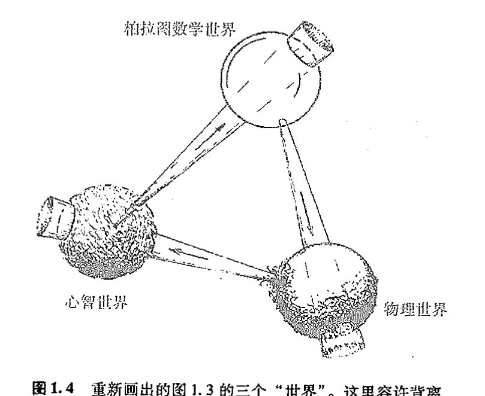

<!-- page 24 -->

第一章

# 科学的根源

## 1.1 探寻世界的成因

主宰宇宙的规律是什么？我们如何获知这些规律？这种认识怎样能帮助我们理解周围的世界并将其导向为我所用？ 7

自人类诞生以来，人们就一直深深困扰于这类问题。最初，人们力图借助日常生活中的经验来理解控制世界的种种力量。他们曾想象存在着控制周围事物的某种东西或某个人，就像他们自己设法操控事物那样。事实上，人们曾认为自身的命运一直为某些外物所左右，这些存在物具有我们所熟悉的人类的各种欲求，例如自尊、性爱、野心、愤怒、恐惧、复仇、激情、惩戒、忠诚甚至艺术气质。相应地，一些自然事件——阳光、雨露、风暴、饥荒、疾病或瘟疫——则被看作是男神或女神们受到这些欲望驱使而表现出的反复无常。而且，除了向神像祈福以外，人们并无其他举措能够影响这些事件的进程。

与此同时，另一些全然不同的自然图式也逐渐发展成型。太阳在天空中运行的精确定位以及这种运动与昼夜更替的确定关系，就是当时人类所认识到的最明显的例子。人们注意到，太阳在恒星天球中的相对定位不仅与季节的交替规律紧密相关，而且对气候有显著影响，并因此影响到植物和动物的行为。月亮的运行似乎也受到严密控制，月相就是由月亮相对于太阳的位置来决定的。人们发现，地球上海陆交界处的潮汐所具有的高度规律性正是由月亮的位置（和月相）控制的。最终，甚至对远为复杂的行星视运动，人们也开始认识到它背后的高度精确性和规律性，从而对行星运动抱有的神秘感也逐渐消失了。看来，如果天上世界确由众神的意志所左右，那么这些天神自身的行为也定然受制于数学定律的魔力。 8

同样，地上世界的诸般现象，例如温度的日（年）变化、海洋的潮涨潮落以及植物生长等，都由某些规律支配着。这些规律受天上世界的影响，且与主导众神的法则具有相同的数学规则。然而，天上物体与地上行为的这种关系有时会被夸大或者曲解，从而附上一种不恰当的重要性，

·5·

<!-- page 25 -->

**通向实在之路**

9

这就是玄秘的占星术的起源。人们花了好几个世纪才从纯粹的神秘臆测中挣脱出来，并真正科学地认识到天上的世界究竟如何影响到地上的生活。不过，人们最初就知道这种影响确实是存在的，而且支配天上世界的数学法则与地上的事物运行规律是相关的。

地上物体的行为中还有其他一些看似与此无关的规律性，其中之一就是同一区域中所有物体会朝同一方向坠落，其原因是存在着我们今天称之为引力的这么一种作用。物体有时也会从一种状态变到另一种状态，比如冰的融化或盐的溶解，但是其总量看来是永不改变的，这就是质量守恒定律。另外人们注意到，很多物质实体具有一种很重要的性质，即它们能保持自身的形状，由此产生了刚体运动的观念，进而人们才可能用精密、确凿的几何语言——欧几里得三维几何——来理解空间位置关系。后来人们进一步认识到，几何学中的“直线”与光线（或视线）的概念相同。这些观念所具有的精确性和完美性正是强烈吸引先人及今人的根源所在。

然而，尽管数学本身的确代表着某种深刻的真理，但日常生活中，万物运行所蕴含的这种数学上的精准却表现得极为有限甚至乏味。因此，为数学真实性而着魔的古人们常会任由想象力如脱缰野马般随意驰骋。例如，在占星学中，几何图案通常象征着神秘玄妙的力量，五角形和七角形具有某种魔力。而且，人们还在柏拉图正多面体与构成世界的基本元素之间附上了纯属迷信的联系（见[图1.1](assets/page025_fig01.jpg)）。好几百年后，人们才对物质、引力、几何、行星运动以及光的行为之间的真实关系有更深的理解，即我们今天所具有的知识。

**图1.1** 古希腊人对5种柏拉图正多面体和4种基本“元素”（火、气、水和土）之间所做的奇异联想，天上世界由正十二面体表示。

## 1.2 数学真理

要真正理解支配自然界的神秘力量，首先必须将真理从纯粹的迷信中剥离出来。但在可靠地完成这一任务之前，古人们还须做些预备性工作，即找到如何从数学上将真理和迷信分开的

·6·

<!-- page 26 -->

第一章 科学的根源

方法，这需要某种程序来鉴别一个给定的数学命题是否为真。除非这一预备步骤得到圆满完成，否则就没有希望从数学上认真探讨那些更加困难的、包括支配外部世界的各种力的一系列问题。认识到理解自然界的关键在于寻求颠扑不破的数学真理，这可能是科学发展的第一个主要突破。

尽管自古埃及和古巴比伦时代以来，人们就已经猜测出各种数学真理，但直到古希腊米利都的大哲学家泰勒斯（Thales，约公元前625～约前547）和萨摩斯岛的毕达哥拉斯1,*（Pythagoras，约公元前572～约前497）引入了数学证明的思想后，理解数学——从而理解科学本身——的第一块基石才得以确立。第一个引进证明概念的人可能是泰勒斯，但最先将证明用来澄清某些不如此就无法说明事情的则是毕达哥拉斯。此外，毕达哥拉斯还深刻洞察到数及各种算术概念对主导物理世界运行的重要性。据说，导致这一认识的一个重要因素，是他注意到由七弦琴或长笛发出的最为美妙的和声正好对应于各音的振动弦长或指孔气柱长的最简单长度比。因此，人们传言是他引入了所谓的“毕达哥拉斯音阶”，即作为西方音乐基础的主要音程关系的频率之比。2 著名的毕达哥拉斯定理断言，直角三角形斜边长度的平方等于两条直角边长度的平方和，这或许比任何其他事物更能说明在数的算术运算与物理空间的几何性质之间确实存在的精确关系（见第2章）。

当时，在位于今天意大利南部的克洛顿城（Croton），毕达哥拉斯拥有大批的追随者，即毕达哥拉斯学派。然而，由于他的弟子们严守机密，因而极大地削弱了这个学派对外界的影响，几乎所有曾经得到过的详细结论都在漫漫历史长河中遗失了。但尽管如此，也还是有部分结论被侥幸地泄露出来，当然其代价是惨重的——据记载，至少有一次，窃密者被处以溺毙的极刑！

不管怎么说，毕达哥拉斯学派终究对人类思想进程产生了深远的影响。有了数学证明的观念，人们第一次有可能做出确凿无疑的论断，即使到已积累了大量新知的今天，这些论断仍然像当初刚提出来的时候那样是真实可信的。自那时起，数学的这种与时间无关的真理性开始被揭示出来。

那么，究竟什么是“数学证明”呢？数学中的证明是指遵循纯粹逻辑推理因而无懈可击的论证过程，这个过程确保能从已知为正确的数学命题或某些特殊的原初命题，即正确性自明的公理出发，来推断所给命题的正确性。一个数学命题一旦通过这种方式得以建立，我们就称之为定理。

毕达哥拉斯学派的许多定理本质上都是关于几何的，而另一些命题则与数有关。这些只与数相关的命题甚至在今天都有着无可挑剔的正确性，正如它们在毕达哥拉斯时代那样。相比之下，那些通过数学证明的几何定理处境又如何呢？它们当然也保持着一目了然的正确性，然而今天，问题变得复杂化了。这个问题的实质以我们今天的知识程度来审视，当然要比毕达哥拉斯时代看得更为清楚。古人们仅知晓一种几何，即所谓欧几里得几何，而我们现在则知道还存在多种其他类型的几何。因此，但凡谈及古希腊时代的几何定理，非常要紧的一点是要明了我们涉及的

---

\* 正文中由上标数字表示的注释集中在各章末。

<!-- page 27 -->

# 通向实在之路

实际上是欧几里得几何。（我会在 [§2.4](chapter_02.md#24-双曲几何共形图像) 明确阐述这些议题，并给出一个重要的非欧几何的例子。）

欧几里得几何是一种精巧的数学结构，有着一整套独特的公理（包括一些不太确定的命题，又称公设）。这种几何提供了真实物理世界某个特定方面的极好的近似描述，即对刚体的几何形状以及刚体在三维空间中运动时相互间位置关系的描述。古希腊人对这些性质非常熟悉，它们是如此自洽，以至于人们乐于将其视为“自明”的数学真理从而直接作为公理（或公设）来看待。正如我们将在 17～19 章以及 [§27.8](chapter_27.md#278-黑-洞), 11 看到的，爱因斯坦的广义相对论——甚至狭义相对论中的闵可夫斯基时空——为物理世界提供了一种不同于欧几里得几何而且更为精确的几何描述，尽管欧几里得几何已经相当精确。因此，当我们考察几何学命题时，必须仔细判断出这种“公理”是否在任何意义上都是正确的。

但在此情形下，究竟什么才能称得上是“正确的”？生活在雅典的古希腊大哲学家柏拉图（Plato，约公元前 429～约前 347，毕达哥拉斯之后约一个世纪）早就充分认识到了这个困难。柏拉图明确指出，任何作为无懈可击的真理而出现的数学命题都不会指向任何实际的物理对象（像由沙土或木料或石料等材料制造的近似正方形、三角形、圆、球形和立方体），而是针对某种理想化客体。他想象这些理想化客体应处于与现实世界截然不同的另一个世界中。今天，我们把这个世界称作柏拉图的数学形式世界。物质世界的种种结构，比如从纸上剪下来的或标记在某个平面上的正方形、圆环或三角形，或用大理石制作的立方体、正四面体或球体，看起来虽与那些理想物非常一致，但也仅仅是相近而已。正方形、立方体、圆、球体、三角形等等这样的数学对象不是物理世界的一部分，而是存在于柏拉图那个理想的数学形式的国度中。

## 1.3 柏拉图的数学世界“真实”吗？

理念学说在那个时代曾是一种非凡的思想，直到今天它也仍是一种极具说服力的思想。然而，就任何可理解的意义而言，柏拉图的数学世界是否真的存在呢？包括哲学家在内的很多人都倾向于认为这纯属虚构——它无非是人类想象力信马由缰的产物。与之相比，柏拉图本人的观点可谓真知灼见。这种观点要求我们认真区分精确的数学存在物与周围物理世界中存在的种种近似物，甚至可以说，这种观点提供了近代科学事业得以发展的蓝图。科学家们一直在为世界——或世界的某些方面——提出模型，这些模型要经受先前的观察结果以及精心设计的实验的检验。如果模型能够通过这些严格的检验，而且其内部结构协调，那么我们就认为它是合适的。就我们目前的讨论来说，这些模型的关键在于它们本质上是纯粹的抽象数学模型。具体地说，科学模型的内在协调性的问题实质上是要求模型的各个细节都必须充分明确，而这种精度上的要求使得模型必须是一种数学模型，否则的话我们就无法确保所研究的问题--一定有明确的答案。

如果说模型本身在某种意义上也具有“存在性”，那么这种存在性只能寓于柏拉图的数学形

<!-- page 28 -->

第一章 科学的根源

式世界中。你当然可以采取相反的立场，认为模型仅仅存在于各人的头脑中，从而无需将柏拉图世界看作是任何意义上的绝对或“实在”物。但是，认为数学结构具有客观实在性的观点可以为我们提供一条重要启示。毕竟，我们每个人的头脑总是不精确、不可靠的，而且在对事物的判断上人与人之间未必就能达成一致。而科学理论所要求的精确性、可靠性和协调性则需要由某种超越任何个人（靠不住的）头脑的条件来保证。正是在数学里，我们发现了比在个人头脑牢靠得多的确定性。这难道还不能说明在我们之外存在着每个个体无法企及的某种实在么？

尽管如此，你仍可以采取另一种观点，即数学世界没有独立的存在性，它仅仅是由某些从不同头脑中提炼出来被人们一致认可的思想堆砌出来的世界。但即便是这样一种观点也仍不足以推翻上述数学实在论的论点。当我们说“被人们一致认可”的时候，这究竟是指“被神志清醒的人一致认可”，还是“被数学专业的博士们一致认可”（当然，这种质疑方式在柏拉图时代并不常用）？谁有权力可以对此发表“权威”的判决意见？这里看来出现了一个危险的逻辑循环。要判定某人是否神志正常需要某种外部标准，当谈及“权威”时也是如此，除非大家一致采纳某种非科学的标准，比如“多数人意见”原则（必须指出的是，无论这一原则对民主政治有多重要，它绝不能用作科学研究上应予采纳的一种判据）。况且，数学本身所具有的确定性也非单个数学家的洞察力所能企及。任何在数学领域里工作的人，无论是积极从事数学研究还是仅使用他人的结果，常会感到自己只是在一个远远超越自身的广漠世界里跋涉，这个世界的客观存在超出了纯属信念的范畴，无论这种信念是来自他们自己或别的专家。

如果我们换一种表述方式来讨论柏拉图世界的客观存在性或许会有助于读者理解。这里所说的存在性就是指数学真理的客观性。在我看来，柏拉图式的存在性意味着存在一种不依赖于个人观点或特定文化的客观的外在标准。这样一种“存在”还可以是数学以外的其他事物，比如道德和美感（参见[§1.5](#15-善真美)）。不过，此处我仅关心数学的客观性，因为这个议题讨论起来更加清楚明了。

让我们考察一个关于数学真理的例子，然后看看它是怎样与客观性联系起来的。1637年，费马（Pierre de Fermat，1601～1665）提出了一个著名的命题，即“费马大定理”（如果n是大于2的整数，那么就不存在这样的整数的正n次幂³：它可以写成另两个整数的正n次幂之和）。他将这个定理写在了《代数》——由公元3世纪的希腊数学家丢番图（Diophantos）所著——一书书页的空白处。在这页的空白处，费马还写道：“我已经发现了该定理的一个绝妙的证明，可惜空白处太窄写不下。”费马的这个命题在此后的350年内一直未能解决，尽管有无数杰出的数学家在共同努力。1995年，怀尔斯（Andrew Wiles，1953～）终于（在众多前辈数学家的工作基础上）给出了一个证明，这个证明的合理性现在已经为数学界所公认。

那么，是否可以说费马命题在由他本人提出之前就一直为真，或者说其合理性不过是依赖于数学家团体的某种主观判断标准的文化产物？我们不妨先假定对于该命题合理性的判定确属主观。因此，我们可以合理地设想某数学家X在1995年之前找到了这一命题的某个真实存在的

<!-- page 29 -->

通向实在之路
==================

反例。⁴在这种情况下，数学界只能承认并接受这个反例。既然X先生已经先于怀尔斯证明了费马命题是错的，那么此后怀尔斯企图证实费马命题的任何努力将不得不视为徒劳。进而，我们可以问，既然X先生的反例正确无误，那么费马完全相信他在页边写下的那个“绝妙的证明”是否仅仅是他个人的一种错觉？如果认为数学的真实性源于主观臆断，那么就可能出现以下情况：费马当初的证明的确被认为是合理的（如果他向同行们展示了这一证明过程，并且得到一致的承认），但同时这个证明却故意掩盖了出现X先生反例的可能性。我坚信，任何数学家，无论他对柏拉图主义持何种态度，都会将这种可能情况视为无稽之谈。

当然，也可能怀尔斯的论证中包含了一个错误而费马原先的命题的确是错的，或者怀尔斯的论证根本上就是错的，但费马的命题却是正确的。又或者怀尔斯的论证基本上正确，但其中含有某些“不严格的步骤”，以至于按照后来出现的某些标准，它在数学上无法得到认可。凡此种种，不一而足。不过，我们在这里真正要强调的是费马命题自身的客观性，而不是是否有人在某个时候以某种特别令人信服的方式向数学界证实（或证伪）了该命题。

应当指出的是，从数学逻辑来看，费马命题还只属于数学陈述中特别简单的一类，⁵它的客观性尤为明显。只有极少数⁶数学家会认为这类命题的正确性是主观的——虽然可能在选择更具说服力的论证方式上存在某种主观性。但是，的确存在着其他数学命题，其正确性只能当然地认为是某种“观念的产物”。最为人熟知的可能是选择公理。这个公理的内容眼下并不重要（我将在[§16.3](chapter_16.md#163-无限的不同大小)予以介绍），此处它仅仅作为一个例证。大多数数学家会认为选择公理“显然正确”，

15

而另一些人则认为这个命题还需推敲，甚至可能就是错的（我本人在某种程度上倾向于后一种观点）。还有人将这个命题的“真理性”当作观念的产物，或者说某种依赖于所选择的公理系统及论证程序规则（“形式系统”，见[§16.6](chapter_16.md#166-图灵机和哥德尔定理)）的事物。支持最后这种观点的数学家（他承认明确的数学陈述是客观的，例如上面讨论的费马命题）是相对较弱的柏拉图主义者，而那些坚信选择公理的客观真实性的数学家可谓是坚定的柏拉图主义者。

鉴于选择公理与物理世界运行背后的数学有关，我将在[§16.3](chapter_16.md#163-无限的不同大小)重新回到这个议题上来，尽管在物理理论中这一点并未得到充分认识。至于现在，读者大可不必受此问题过度搅扰。如果选择公理能用这种或那种无懈可击的数学推理方式得以解决，⁷那么它的真理性就是一个完全客观的事实。这样，无论是选择公理本身或是其否命题，都属于我所说的“柏拉图世界”这个范畴。

相反，如果这个公理只是观念或任意决断的产物，那么绝对数学形式化的柏拉图世界将既不包含选择公理本身也排斥其否命题（尽管它容许存在如下形式的命题：“由选择公理可知，事情将会如此这般”或“由如此这般的数学系统的规则可知，选择公理的确是一个定理”）。

属于柏拉图世界的数学命题一定是那些具有客观真理性的命题。的确，我认为数学客观性就是数学柏拉图主义所要强调的那种东西。但凡说某一数学命题具有柏拉图式的实在性，即是指在客观意义上它完全是真的。对其他的数学观念——比如数字7这一概念，或整数的乘法法则，或某个含有无穷多个元素的集合概念——我们可以作同样的理解，即它们都具有柏拉图式

· 10 ·

<!-- page 30 -->

第一章 科学的根源

的实在性，因为它们都是客观的观念。我认为，柏拉图式的存在就是一种客观存在，因此不应被看作是“神秘”或“非科学”的，尽管事实上有些人持有这样的观点。

与选择公理的情况类似，要判断某个具体的数学对象是否具有客观实在性有时候会非常微妙而且技术化。但尽管如此，也不是说就只有数学家才能充分领会众多数学概念的确定性。图1.2描绘的是著名的曼德布罗特集这一数学对象的不同细微部分。这个集合具有极其精细的结构，但这并非人工设计使然，而是一种完全由极为简单的数学规则生成的结构。这里我们不讨论这个规则的细节，否则会大大分散注意力。我们将把这种细节讨论放到 [§4.5](chapter_04.md#45-如何构造曼德布罗特集) 去进行。

[图：曼德布罗特集及其在不同线性放大倍数下的细节]

图1.2 (a) 曼德布罗特集。(b)，(c) 和 (d) 分别是图 (a) 上的不同区域在相应的线性放大倍数 11.6, 168.9 和 1042 下的细节。

这里我要强调的是，没有人，甚至包括曼德布罗特（Benoit Mandelbrot，1924 ~ ）本人，在他第一眼看见这个集合的精细结构中所蕴含的不可思议的复杂性时，就能够充分意识到这个集合异常丰富的特性。曼德布罗特集显然不是我们头脑想象出来的。它是一种客观的数学存在。如果我们打算为这个集合寻找一个实际对应物，那么这个对应物也一定不会存在于我们的头脑中，因为没有人能完全理解这个集合的无穷类型和无限复杂性。它也不可能存在于计算机绘制的大量示意图中，虽然这些图像的确抓住了该集合某些难以理解的复杂细节，但顶多也只是集合的一丁点近似。尽管如此，集合本身的确定性仍不容怀疑，因为当我们以越来越精细的方式审视这个集合的细节时，我们总是揭示出同样的结构，而且这一点并不取决于作出这一检验的具体是哪一位数学家或哪一台计算机。因此，曼德布罗特集只能存在于柏拉图的数学形式世界里。

我知道，有不少读者在寻找数学结构的对应物方面存在一定困难。我希望这些读者稍微拓展一下对于“存在”的理解。柏拉图世界里数学形式的存在方式与物理世界中各种对象（如桌椅）的存在方式不同。它们没有空间位置，也不在时间中。客观存在的数学观念必须被当作与

·11·

<!-- page 31 -->

通向实在之路

时间无关的对象，而不能认为是在第一次为人类认识时它们才获得了自身的存在性。曼德布罗特集那令人眩晕的细节——如图 1.2（c）和 1.2（d）所示——并不是当人们首次在计算机屏幕或打印纸上将其显示出来时才变成了客观存在物，而且也不是当它蕴含的一般观念首次被人们——实际上不是曼德布罗特本人，而是布鲁克斯（R. Brooks）和马塔尔斯基（J. P. Matalski）在 1981 年或许更早——揭示出来时其存在性才得以确立。布鲁克斯、马塔尔斯基甚至曼德布罗特本人，对图 1.2（c）和 1.2（d）所示的精细结构并没有任何真正的概念。这些结构从来就是“存在着的”。在“与时间无关”这层意义上说，无论它们在何时何地由何人揭示出来，其存在形态与我们今日所见当别无二致。

## 1.4　三个世界与三重奥秘

因此，数学存在不但有别于物理存在，也不同于人类心智所能够感知到的那种存在。但它与后二者之间存在着某种深刻而神秘的联系。图 1.3 用球体示意性地画出了这三种存在形式——物理的、心智的和柏拉图数学的——它们分属三个独立的“世界”。图中还一并画出了三个世界之间的神秘联系。有必要说明，图中所示的只是我个人的看法或偏见。

我们注意到，图中第一种神秘联系——柏拉图数学世界和物理世界之间的关系——只是数学世界的很小一部分与现实的物理世界相关联。这不难理解，现实生活中纯数学家的绝大多数研究本来就与物理学或其他学科没有太多联系（参见 [§34.9](chapter_34.md#349-美和奇迹)），尽管其研究成果经常会有意想不到的应用。第二种神秘联系体现在心智活动与一定的物理结构（明确地说，指健康、清醒的头脑）之间的关联，显然，并非大多数物理结构都能产生智能活动。一只猫的脑部活动或许真具有智能的品质，但没人会认为石块也应如此。最后是第三种神秘联系，我认为它是自明的，即绝对数学真理只对应于部分的心智活动！（通常我们更多的是对恼怒、愉悦、焦虑、兴奋等各种日常情绪的体验。）这三个事实体现为每个世界与相邻世界的关联均以小基底为出发点，三个世界按顺时针方向依次排列。我对于这三重关系的观点可以表述为后一个世界仅仅对应着前一世界的某个部分。

根据图 1.3，整个物理世界的运转受到数学定律的支配。我将在后面的章节给出支持这一论点的强有力（但不完备）的证据。据此，物理世界中的任何事物，即使是在细节上，也都受到数学原理的支配——它们可能是我们将在以后各章要学到的各种方程，也许是某些未知的、截然不同于今日所称“方程”的数学观念。如果这是正确的，那么甚至我们人类的一举一动最终都完全受数学控制。此处“控制”并不排除某些服从几率原理的随机行为。

相信很多人都会对这类观点感到不安，我自己也是如此。然而，我仍倾向于接受这样一种普遍关系，因为不如此我们就难以在受数学支配的物理行为与不受数学支配的物理行为之间清楚地划界。在我看来，这种不安一定程度上是源于我们对“数学支配”一词所抱的狭隘观念。本

·12·

<!-- page 32 -->

# 第一章 科学的根源

---

[图：柏拉图的三个世界示意图。图中上方球体标注“柏拉图 数学世界”，左下方球体标注“心智世界”，右下方球体标注“物理世界”，三者之间有带数字 1、2、3 的箭头相互连接]

**图 1.3 柏拉图的数学世界，物理世界和心智世界及其神秘联系**

书的目的之一就是要探讨并向读者展示，正确的数学观念会带给我们怎样的丰富性、力量及美感。

从图 1.2 所示的曼德布罗特集这个例子出发，我们可以一瞥这一构造所涉及的可能范围及其内在的美。但是，即使这样的结构也只是整个数学的冰山一角，因为它所展示的性态严格取决于计算。而在这之外还有难以计数的丰富的数学结构！我由衷地相信自己及朋友们的种种行为最终都受这些数学原理的主宰。你可能会好奇我怎么会有这种念头，答案很简单：我愿意带着这种想法生活。我宁可在柏拉图神话般数学世界中的那些原则的支配下采取行动，也不愿在诸如追求享乐、贪婪、侵略性暴力等最原始的动机的驱使下为所欲为。即使很多人会争辩说，如果从严格的科学意义上看，这些动机也有着一定价值。

不难想象，很多读者仍难以认同宇宙中的一切运动都完全由数学定律掌控。同样地，很多人对图 1.3 所示的另两层神秘联系——也是我的一孔之见——会表示反对。例如，他们会认为，图中所示的一切心智活动均根源于物质性的观点实际上是作者的一种僵化的科学教条。这的确是我个人的观点，但也应当承认，我们至今也还没有说得过去的科学证据来表明存在着没有物理基础的“心智”活动。另一种异议来自宗教，他们坚信存在非物质的心智活动，而且会列举出某些他们认为极为有利的证据，尽管这些证据与常规科学的发现完全相左。

图 1.3 还展示了我的另外一个观点，即柏拉图数学世界完全在人类心智所及的范围之内。这意味着，至少在原则上不存在任何不能通过逻辑推理获知的数学真理。当然，的确存在大量数学命题（简单的如算术加减运算）其复杂程度使得不可能由人脑来完成全部必要的逻辑推演，但这并不背离图 1.3 试图传达的含义，因为它们具有潜在的可认知性。值得引起我们注意的倒是可

· 13 ·

<!-- page 33 -->

通向实在之路
================

能还存在另一类根本无法通过逻辑推演来证明的数学命题，它们是真正与图 1.3 的意图相背离的数学存在。（在 [§16.6](chapter_16.md#166-图灵机和哥德尔定理) 我会用更多的篇幅来阐述这个问题，我们将讨论它与哥德尔那个广为人知的不完备定理的关系。）⁸

**图1.4** 重新画出的图 1.3 的三个“世界”。这里容许背离作者提出的三者间的相互关系。

作为对那些不认可我上述观点的读者的让步，我重新画出三个世界之间的关系，见[图 1.4](assets/page033_fig01.jpg)。在这幅图中，所有三种与我上述观点相左的可能情形都是容许的。相应地，超出数学控制的物理运动有了容身之地，不依附于任何物质结构的心智活动也成为可能，最后，该图容许存在其真实性原则上为人类推理能力和洞察力所无法企及的数学命题。

这幅扩展后的图像甚至比我所偏爱的图 1.3 具有更多潜在的神秘性。依我看，图 1.3 所表达的科学观点已经足够神秘，甚至在转换到更为包容的概念框架[图 1.4](assets/page033_fig01.jpg) 后，这些神秘之处依旧存在。为什么数学定律在被用于物理世界时会有如此非凡的精度，这仍是一个巨大的谜。（我们将在 [§19.8](chapter_19.md#198-引力场能量)，[§26.7](chapter_26.md#267-发散的路径积分费恩曼响应) 和 [§27.13](chapter_27.md#2713-异乎寻常的特殊大爆炸) 中浏览基本物理理论中某些具有极高精度的例子。）而且，不仅仅是精度，理论自身的精妙复杂之处及其表现出的数学美也是极为深奥的谜。此外，经过适当组织的物质——此处特指人（或动物）的大脑——如何能魔法般地获得意识，这无疑也是一个重大的谜团。最后，我们如何感知数学真理这件事本身也显得神秘莫测，这绝不仅仅是因为我们的大脑被训练成能够进行可靠的“计算”，其中一定存在着某种深刻得多的原因！想想吧，即便是我们当中知识最为贫乏的人也能很好地理解“零”、“一”、“二”、“三”、“四”等词语的确切含义。⁹

关于第三重奥秘的某些话题将在下一章展开（更详细的参见 [§16.5](chapter_16.md#165-数学基础方面的难题), 6），在那里我们将有机会讨论什么是数学证明。不过，本书的主旨是上述三重谜团中的第一个，即数学和真实物理世界之间的非凡关系。假使没有对数学概念的一定程度的掌握，人们绝不可能恰当理解现代科学那异乎寻常的有效性。毫无疑问，这会使那些因为要学习如此多的数学知识才能获得这种理解

·14·

<!-- page 34 -->

第一章　科学的根源

的读者深感沮丧。但是，我可以肯定地说，情况并不完全像他们担心的那样糟糕。我建议这些读者不妨一试。无论你此前持何种观点，我希望本书都能让你感到原来数学也可以这么有趣！

本书不会关注图 1.3 及 1.4 所示的第二种神秘联系，即心智活动——尤其是意识——的产生与某种适当的物理结构的关系（在 [§34.7](chapter_34.md#347-心智在物理理论中的作用) 中略有提及）。探索物理世界和相关数学定律就够我们忙的了。况且，关于心智活动的种种话题尚存在激烈的争论，卷入其中只会削弱本书的主题。不过，有一点值得在此处指出：如果不对其物质基础作更深入的了解，我们不太可能深刻地理解人类心智的本质。这当然纯属个人观点，但我坚信当务之急就是尽快实现对这个物质基础的突破性认识，这一点我们将在以后的章节里予以阐述。如果没有这些突破，那么对心智过程能取得实质性理解的任何期待都是过于乐观了。^10

## 1.5　善、真、美

图 1.3 和图 1.4 还提出了与上述相关的更进一步的话题。前面的内容把柏拉图关于“理想形式的世界”仅仅局限于数学形式上了。数学与真这一特殊的理想化概念息息相关。柏拉图本人曾坚持认为存在着另外两种基本的绝对理念，即美与善。我完全相信这类理念的存在，也相信在柏拉图世界中还存在着具有同样本性的其他绝对理念。

在后文中，我们将遇到体现着真与美之间紧密关系的例子，这些关系在阐明如何发现及接受物理理论的同时，也令人深感困惑（请特别留意 [§34.2](chapter_34.md#342-数学推动下的基础物理学), 3, 9，亦见[图 34.1](assets/page753_fig01.jpg)）。另外，美不仅在探寻物理世界背后的数学原理方面有着毋庸置疑（虽然经常很含糊）的作用，审美标准对数学概念本身的发展也是至关重要的：它不仅导致新发现，而且还是通向真理的向导。我觉得，数学家们共同持有的信念之一——在我们身外存在着一个真实的柏拉图世界——正是源于他们不断揭示出的数学概念中所潜藏的奇妙且出乎意料的美。

与本书关系不太大、但是在更广的范围内无疑非常重要的另一个问题，是关于道德这一绝对理念：何为善？何为恶？我们的头脑是如何获得这些判断的？道德与心智世界有着深刻的联系，因为它与由意识赋予的判断乃至意识本身紧密相关。难以想象如果没有知觉的存在，道德会有什么意义。随着科技的进步，理解道德得以显现的物质环境愈加显得紧迫。我相信科学问题的道德含义绝不应被剥离掉，尤其在今天这样的技术时代，这个问题显得比以往任何时候都更为重要。不过，这些话题已经越出本书的范围。在有足够的能力判别善恶之前，我们需要关注如何鉴别真伪的问题。

图 1.3 还隐藏着另一重谜，我把它留到了最后。我故意把图画成你们所见到的，就是为了凸显这一佯谬。如图所示（这的确符合我的初衷），前面的世界怎么可能完全涵盖其投射的世界呢？我不认为这会使我放弃个人的见解，相反地，这恰好指明了比上述奥秘更为深刻的另一重谜。这可能意味着三个世界其实并不孤立，而是分别反映出某个完整世界的更深刻真相的不同

<!-- page 35 -->

通向实在之路

侧面，而我们今天对此几乎一无所知。要想适当地阐明这些难题，我们还有很长的路要走。

我已经离题太远了。本章的目的是想向读者强调，数学在整个科学（无论是古代科学还是现代科学）中的核心地位。现在让我们前往柏拉图数学世界进行一番探索——至少应领略一下与物理存在的本质有着密切联系的那部分尽管较小但却非常重要的区域。

## 注 释

### § 1.2

**1.1** 不幸的是，关于毕达哥拉斯本人、他的生平、其追随者或他们的作品的所有知识几乎都不尽可信，人们只能确定上述种种在历史上确实存在过以及毕达哥拉斯确曾提出过音乐和声中的简单比值这些事实。参见 Burkert（1972）。但是，仍然有大量重要结论被普遍认为应归功于毕达哥拉斯。因此，我仅仅使用“毕达哥拉斯学派”作为一个标记，并无意于追求历史描述的准确性。

**1.2** 这是指纯的“全音阶”，它包含一组频率（与振动单元的长度成反比）24 : 27 : 30 : 36 : 40 : 45 : 48，由这组频率可以衍生出大量悦耳的和弦。通常将现代钢琴上的白键调谐到（作为在维持毕达哥拉斯纯和弦以及便于转调的要求之间的一个折衷）与这组毕达哥拉斯比值相近，按照平均律音阶，相对频率为 1 : α² : α⁴ : α⁵ : α⁷ : α⁹ : α¹¹ : α¹²，其中 α = ¹²√2 = 1.05946…。（注意：α⁵ 表示 α 的 5 次方，即 α × α × α × α × α。¹²√2 表示 2 的 12 次方根，即它的 12 次方等于 2，因此 α¹² = 2。参见注释 1.3 和 [§5.2](chapter_05.md#52-复对数概念)。）

### § 1.3

**1.3** 由注释 1.2 知，一个数的 n 次方即是将该数自乘 n 次。因此，5 的 3 次方是 125，记为 5³ = 125。3 的 4 次方等于 81，记为 3⁴ = 81，依此类推。

**1.4** 事实上，当怀尔斯于 1993 年 6 月在剑桥首次宣布其证明时，情况就已经很明朗了，不过当他在接下来的时间里对其证明进行修补时，数学界开始谣传 Noam Elkies 已经找到了费马定理的一个反例。1988 年，Elkies 曾找到过欧拉猜想——方程 x⁴ + y⁴ + z⁴ = w⁴ 没有正的解——的一个反例，从而证否了该猜想。因此，说他证伪了费马定理也并非难以置信。遗憾的是，挑起这一谣传的电子邮件发自 4 月 1 日，最后被确认为是 Henri Darmon 的一个恶作剧。见 Singh（1997），293 页。

**1.5** 用术语说，即 Π₁-句式，见 [§16.6](chapter_16.md#166-图灵机和哥德尔定理)。

**1.6** 我意识到，在某种意义上，我自己正在卷入这一断言所招致的麻烦当中。此处的要点并不是持这种极端观点的数学家是否占极小的一部分（当然，我也未曾就此问题在数学家当中做过可信的问卷调查），而是要强调的确有人非常严肃地对待这种极端观点。请读者自行判断。

**1.7** 某些读者可能会注意到哥德尔和科恩的观点，他们指出选择公理与集合论（策梅罗–弗兰克公理体系）的更为基本的标准公理无关。必须澄清的是，哥德尔和科恩的讨论本身并没有指出选择公理不能以别的方式得以解决。这种观点是有先例的，例如 Paul Cohen 在其著作（Cohen 1966，第 14 章，§13）最末一节中就表达的这一立场，只不过在那里他关注的是连续统假设而不是选择公理。见 [§16.5](chapter_16.md#165-数学基础方面的难题)。

### § 1.4

**1.8** 有意思的是，一个相信数学完全源于心智的彻底的反柏拉图主义者也必然会相信没有任何一个正确的数学论断不能被逻辑推理所把握。例如，假设费马大定理（原则上）不能被逻辑地推演出来，那么这位反柏拉图主义者也会认为判断该命题的真或伪是无意义的，因为这种判断的有效性必须来自证明或证否的心智活动。

**1.9** 见 Penrose（1997b）。

**1.10** 我本人关于可以容纳智能的物理世界的一系列观点，在 Penrose（1989，1994，1996，1997）等书中有相应的表述。

· 16 ·
