<!-- page 36 -->

第二章 古代定理和现代问题

---

**第二章**

# 古代定理和现代问题

## 2.1 毕达哥拉斯定理

让我们来考虑几何问题。上一章里我们避而不谈的所谓不同的“几何种类”究竟指的是什么？为了逐渐展开这个问题，我们先回到毕达哥拉斯那里考虑以他的名字命名的著名定理：¹ 对任何直角三角形，斜边（直角所对的边）长的平方等于另两边长的平方和（图 2.1）。我们确信这个命题成立的理由是什么呢？我们又该怎样来“证明”毕达哥拉斯定理呢？这可以有许多论证方法。我这里打算考虑两种特别明确易懂的形式，每一种强调了不同的方面。

[图：直角三角形示意图，直角边标注为 $a$、$b$，斜边标注为 $c$，下方写有公式 $a^2 + b^2 = c^2$]

图 2.1 毕达哥拉斯定理：任何直角三角形的斜边长 $c$ 的平方等于另两边长 $a$ 和 $b$ 的平方和。

[图：由两种不同大小的正方形交错排列组成的平面镶嵌图案]

图 2.2 两种不同大小正方形组成的平面镶嵌。

首先，我们来考虑图 2.2 所示的图形。它由两个不同大小的正方形组成。很“显然”，这种图案可以无限连续地重复铺排下去，以致不留缝隙亦不重叠地铺满整个平面。图案的这种重复性还反映了这样一个事实：如果我们标出大正方形的中心，则这些中心组成另一个更大的正方形体系的各个顶点，这个更大的正方形较原先的那两种有一个倾角（[图 2.3](assets/page037_fig01.jpg)），它能够单独覆盖整个平面。我们也可以以严格相同的方式对每个斜正方形进行标线，使得这些正方形的标线拟合成原先的两个正方形图案。如果我们不是取原先两个正方形中较大的那个的中心，而是取其

·17·

<!-- page 37 -->

通向实在之路

---

**图2.3** 较大的正方形的中心构成了更大的有一定倾角的正方形格子的各顶点。

**图2.4** 斜正方形格子可进行平移，由此斜格子的顶点与原正方形格子的顶点重合，图中显示了斜正方形的边长正好是（阴影）三角形的斜边长，它的另两条边的边长则分别为两原正方形的边长。

他任意点，然后将每块上相应的点按上述方式标出并连接起来，我们同样能够得到覆盖整个平面的倾斜正方形图案，新图案的大小、倾角与前述的斜正方形完全相同，只不过不加转动地移动了一个位置——即经过了所谓的平移。为简单计，我们将这个起始点选定为原图案的一个角上（图2.4）。

显然，斜正方形的面积必等同于两较小的正方形的面积和——我们可以沿前述的标线将斜正方形裁成小块，然后不加转动地移动各小块直到恢复成原先的两小正方形（例如图2.5）。此外，从图2.4还可以看出，大的斜正方形的边长是一个直角三角形的斜边长，而这个直角三角形的另两条边的边长则正好分别是两个小正方形的边长。由此我们得到毕达哥拉斯定理：直角三角形斜边的平方等于另两边的平方和。

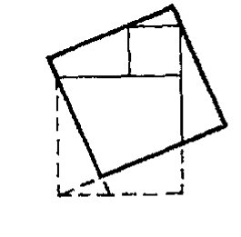

**图2.5** 从斜正方形的任意一点开始，将它裁成小块，移动各小块即可恢复原先的两小正方形。

上述论证确实给出了这一定理简单证明的实质，它使我们有“理由”相信这个定理是真的。这种明显性是那些不具明确目的仅由一连串逻辑步骤给出的更为正式的论证所不具备的。但也应指出，我们的论证里隐含了几个假定，不仅如图2.2所示的重复正方形这种看似明显的样式是一种假定，甚至图2.6的实际几何可能性——这更关键，即正方形在几何上是可能的这一点也是一种假定！我们的所谓“正方形”究竟是什么意思？通常我们认为，正方形是一种平面图形，它的所有边全相等，所有角都是直角。那何谓直角？我们说，我们可以想象有两条

**图2.6** 熟悉的等正方形格子。我们怎么知道它一定存在？

·18·

<!-- page 38 -->

第二章 古代定理和现代问题

直线在某点相互交叉，形成4个相等的角，那么这4个角中的每一个都是直角。

现在我们试着来构造一个正方形。取3条等长的线段AB、BC和CD，其中∠ABC和∠BCD是直角。D和A在线BC的同一边，如图2.7所示。问题来了：AD与其他三条线段等长吗？还有，∠DAB和∠CDA也是直角吗？按照图的左右对称性，这些角应当是彼此相等的，但它们真的就是直角吗？它只是看起来显然如此，那是因为我们熟悉正方形，也许是因为我们还记得学校里学过的某些欧几里得论述，诸如BA和CD一定是彼此“平行”的，一对平行线的“截线”与平行线形成的角对应相等，等等。从这些论述立刻可得到，∠DAB必与其补角∠ADC相等（即等于图2.7中的∠EDC，因为ADE是一直线），因此也就与∠ADC相等。一个角（∠ADC）等于其补角当且仅当它是个直角。我们还可以证明边AD必与BC等长，当然这一点也可以从平行线BA和CD的截线性质得到。因此，从欧几里得式的论证我们的确能够证明，由直角构成的正方形是真实存在的。但这里隐含了一个很深的问题。

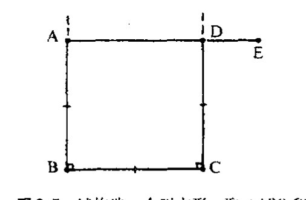

图2.7 试构造一个正方形。取∠ABC和∠BCD为直角，线段AB＝BC＝CD。我们要问：DA与这些线段等长吗？∠DAB和∠CDA也是直角吗？

## 2.2 欧几里得公设

欧几里得在构筑他的几何大厦时，对其证明所依赖的假定有过相当仔细的考虑。² 特别是，他将所谓公理——一些自明的真理，它们基本上是关于点、线等的定义——的明确命题与5个公设——一些假定，其有效性不那么确实，但从我们周围世界的几何性质来看似乎是正确的——进行了仔细的区分。这些假定中的最后一条，即所谓欧几里得第五公设，被认为比其他几条更缺少自明性，许多世纪以来，人们一直认为它应当能够从其他几条更为明确的公设中导出。欧几里得第五公设通常又称为平行公设，这里我们来研究一下这条公设。

在讨论平行公设之前，有必要指出欧几里得其他四条公设的性质。这些公设主要涉及（欧几里得）平面几何，虽然欧几里得在他后来的工作中也曾考虑过三维空间问题。他的平面几何的要素是点、直线和圆。这里，我将“直线”（或简称为“线”）看成是两端无限延伸的，相反的则称为“线段”。欧几里得第一公设是说，两点间存在（唯一的）直线段。第二公设是说，任何直线段可无限（连续地）延伸。第三公设为给定任一点及任意半径值可以有一个圆。最后，第四公设是说，所有直角都相等。³

从现代观点看，其中的一些公设略显奇怪，特别是第四公设，但我们应当意识到，欧几里得几何的这些基本概念，基本上都源自理想刚体的运动，以及由两个这样的理想刚体同时相对运动带来的全等观念。一物的直角与另一物的直角相等很可能来自这样的经验：我们移动一物使

·19·

<!-- page 39 -->

**通向实在之路**

---

得由此形成直角的线正好与移动另一物时形成的直角线重合。实际上，第四公设说的是空间的各向同性和均匀性，因此一地的图形才可能与另一地的图形具有“相同的”（即全等的）几何形状。第二和第三公设表述的是空间可无限扩张并且没有“间隙”的观念，而第一公设表述的是直线段的基本性质。虽然欧几里得看待几何的方式与我们今天的方式大相径庭，但他的前四个公设基本上包括了我们目前的（二维）完全均匀且各向同性的度规空间，范围上是无限的。实际上，按照当代宇宙学的理解，这样一种图像似乎与实际宇宙的大尺度空间性质紧密相关，我们将在[§27.11](chapter_27.md#2711-宇宙学)和[§28.10](chapter_28.md#2810-宇宙学参数观察的地位)再来讨论这个问题。

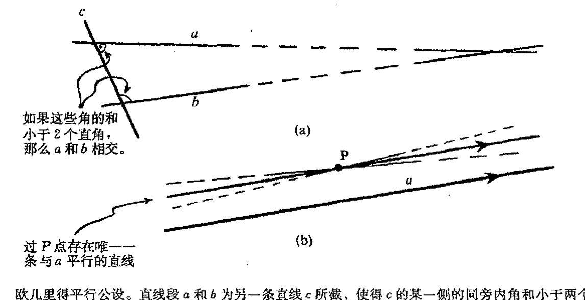

图2.8（a） 欧几里得平行公设。直线段 $a$ 和 $b$ 为另一条直线 $c$ 所截，使得 $c$ 的某一侧的同旁内角和小于两个直角，则 $a$ 和 $b$（假设可延伸到足够远）最终必相交。（b）（等价的）普莱菲尔公理：如果 $a$ 是平面上一直线，$P$ 为平面上 $a$ 外的一点，则过 $P$ 点平面上存在唯一一条直线与 $a$ 平行。

那么什么是欧几里得第五公设（或平行公设）呢？按照欧几里得对这一公设的基本描述，它可陈述为：如果平面上两条直线段 $a$ 和 $b$ 同时为另一条直线 $c$ 所截（故 $c$ 称为 $a$ 和 $b$ 的截线），使得 $c$ 的某一侧的同旁内角和小于两个直角，则 $a$ 和 $b$ 在该侧的部分经无限延伸后必在某一点相交（见图2.8（a））。这个公设的等价形式（有时称为普莱菲尔公理［Playfair's axiom］）表述为：给定一直线和直线外一点，过该点存在唯一一条直线与已知直线平行（见图2.8（b））。这里，“平行”线是指同一平面上两条彼此不相交的直线（我们知道，“线”是个指两端可充分延伸的概念，不是指欧几里得“线段”）[^2.1]。一旦有了平行公设，我们就能够着手建立正方形存在所需的性质。如果一对直线与一截线相交，使得截线的同旁内角和等于两个直角，则我们就能够证明这对直线是平行的。进一步还有，这对直线的任意一条截线都具有这样的角的性质。这差不多就是上述建立正方形论证所需的东西了。我们看到，证明所有边全相等所有角都是直角的正方形能够建立起来要用到的正是平行公设。没有平行公设，我们就不可能真正建立（通常意义上的各角都是直角的）正方形。

[^2.1]: 证明：如果平行公设的欧几里得形式成立，则必有普莱菲尔的平行线唯一性结论。

??? question "答案 [2.1]"
    设直线 $a$ 外一点为 $P$。先由通常的作图和前四公设，可过 $P$ 作一条与 $a$ 不相交的平行线，例如取一条截线并复制相应角，使同旁内角和等于两个直角；若它与 $a$ 相交，则会与欧几里得第五公设的临界情形相矛盾。

    再证唯一性。若过 $P$ 还有另一条直线 $b$ 也不与 $a$ 相交，则让一条截线穿过 $P$ 并交 $a$。由于 $b$ 与已作平行线方向不同，在截线的某一侧，$a$ 与 $b$ 的同旁内角和必小于两个直角。欧几里得第五公设于是推出 $a$ 与 $b$ 在该侧相交，这与 $b$ 平行于 $a$ 矛盾。因此平行线唯一。

·20·

<!-- page 40 -->

第二章 古代定理和现代问题

为了“严格证明”像正方形这样明显的事实我们需要对假设给予高度关注，这好像是一种数学上的矫情。我们为什么要对“正方形”这样一种人尽皆知的熟悉图形保持关注呢？一会儿我们还会看到，实际上欧几里得曾长期困扰于这一问题。欧几里得的执著不是没有道理，它与宇宙的实际几何这样的深层次问题密切相关。特别是，实际宇宙中是否存在着宇宙学尺度上的物理“正方形”，这并不是一个显然的问题。它是一个观察问题，目前的证据看起来并不一致（见 [§2.7](#27-与物理空间的关系) 和 [§28.10](chapter_28.md#2810-宇宙学参数观察的地位)）。

## 2.3 毕达哥拉斯定理的相似面积证明

下一节我们再来讨论不作平行公设假定的数学意义。相关的物理问题则放在 [§18.4](chapter_18.md#184-闵可夫斯基空间的双曲几何)、[§27.11](chapter_27.md#2711-宇宙学)、[§28.10](chapter_28.md#2810-宇宙学参数观察的地位) 和 [§34.4](chapter_34.md#344-错误理论能被实验驳倒吗) 讨论。但在讨论这些问题之前，我们先回到毕达哥拉斯定理的另一个种证明上来。

有一种最简单方法可以看出欧几里得几何中毕达哥拉斯命题的真确性。这就是考虑如下的直角三角形构形：它由斜边所对直角向斜边做垂线分割成的两个小三角形组成（[图 2.9](assets/page040_fig01.jpg)）。现在我们有了三个三角形：原三角形和由它分割而成的两个小三角形。显然，原三角形的面积等于两小三角形面积之和。

**图 2.9** 用相似三角形证明毕达哥拉斯定理。取一个直角三角形，从它的斜边所对的直角向斜边做垂线，将原三角形分割成两个小三角形。显然，两小三角形面积之和等于原三角形的面积。三个三角形彼此相似，故它们的面积正比于各自斜边长的平方。由此毕达哥拉斯定理得证。

现在我们很容易看出，这 3 个三角形是彼此相似的。就是说它们有相同的形状（尽管大小不同），或者说，我们可以通过按比例放大或缩小加上刚性移动从一个得到另一个。由此还可知，这 3 个三角形依次对应的角相同。每个小三角形都与大三角形共一个角，并且三者都有一个直角。这样第三个角也必然相同，因为三角形的内角和是一个常数。我们知道，相似的平面图形之间有一个共同性质，即它们的面积与其相应的线性维度的平方成正比。具体到三角形，这个线性维度可取为其最长的边，即斜边。而两个小三角形的斜边正好就是原三角形的两条直角边。于是（从原三角形的面积等于两小三角形面积之和这一事实）我们立刻得到，原三角形斜边的平方等于两直角边的平方和，即毕达哥拉斯定理！

同样，这个论证中有一些假设有待检验。其中最关键的是三角形的内角和是一个常数这一事实。（这个常数是 180°，但欧几里得总喜欢称其为“两个直角”。用现代更“自然的”数学语言来表述则是这样：在欧几里得几何里，三角形的内角和为 π。这是用弧度来度量一个角，而 “°” 所表示的度相当于 π/180，故我们有 180° = π。）通常的证明如[图 2.10](assets/page041_fig01.jpg) 所示。我们延长 CA 到 E，并过 A 画直线 AD 平行于 CB。于是（由平行公设），∠EAD 和 ∠ACB 相等，∠DAB 和

<!-- page 41 -->

通向实在之路

∠CBA 相等。由于 ∠EAD、∠DAB 和 ∠BAC 之和为 π（即 180° 或两个直角），因此三角形的三个角 ∠ACB、∠CBA 和 ∠BAC 之和必为 π——此即所需证明的。但注意，这里我们用到了平行公设。

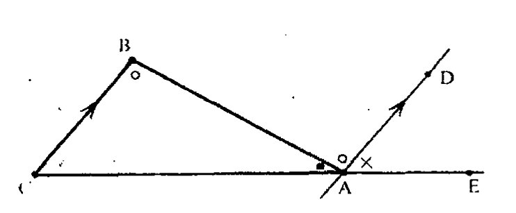

图 2.10 三角形ABC的内角和等于 π（=180°=两个直角）的证明。延长CA到E，画直线AD平行于CB。由平行公设，∠EAD和∠ACB相等，∠DAB和∠CBA相等。由于∠EAD、∠DAB和∠BAC之和为π，因此三角形的三个角∠ACB、∠CBA和∠BAC之和必为π。

33

毕达哥拉斯定理的这个证明也可以用来说明相似形的面积正比于其线性维度大小的平方这个命题。（这里我取每个三角形的斜边来表示这个线性维度。）这一事实不仅依赖于真正存在着不同大小的图形（即我们用平行公设建立起来的图2.9所示的三角形）之间的相似关系，而且取决于一些与我们如何定义非规则形状“面积”有关的更复杂的问题。这些一般性问题通常是通过求极限来解决的，眼下我不打算在此作深入讨论。但可以指出一点，它将引领我们进入与几何中数的种类有关的那些更深入的问题，我们将在 [§3.1](chapter_03.md#31-毕达哥拉斯灾难)~3 予以讨论。

上一节讨论的一个重要主题是毕达哥拉斯定理似乎取决于平行公设。这是真的吗？假定平行公设错了呢？是不是意味着毕达哥拉斯定理本身也不成立呢？提出这种可能性有什么意义？让我们试着回答这样一个问题：如果平行公设确实可以看成是不成立的，那将会怎样？我们似乎正在进入一个神秘的虚幻世界，在这里我们在学校里学的几何知识被整个倒了个个儿。但我们会发现，这么做有着更深刻的意义。

## 2.4 双曲几何：共形图像

请看图2.11。它是一幅埃舍尔（M. C. Escher，1898 ~ 1972）木刻画《圆极限I》的复制品。这幅作品为我们提供了对一种几何——所谓双曲几何（也称为罗巴切夫斯基 [Lobachevsky] 几何）——的非常精确的表示。在这种几何下，平行公设不成立，毕达哥拉斯定理也不成立，三角形的内角和不等于π。而且，对给定的大小的形状，一般不存在同等大小的相似形。

在图2.11中，埃舍尔用了一种特定的双曲几何表示，其中整个双曲平面“世界”被“挤压”到普通欧几里得平面上圆的内部。这个边界圆表示这个双曲世界的“无穷远”。在埃舍尔的画中我们可以看到，处于边界圆附近的鱼非常拥挤。但我们应当意识到，这是一种假象。想象一下，假如你是一条这样的鱼，那么不论你处于埃舍尔画的边缘还是处于它的中心，整个（双曲）世界对你来说不会两样。这种几何里的“距离”概念与欧几里得平面的距离概念不同。由于我们是从欧几里得几何的视角来看埃舍尔画的，因此接近边界圆的鱼才会看上去显得微小。但从白鱼和黑鱼本身的“双曲”几何视角上看，它们认为它们与处于中心的那些弟兄们无论大小还

·22·

<!-- page 42 -->

## 第二章 古代定理和现代问题

是形状都并无二致。另外，虽然从我们外在的欧几里得几何观点看，它们似乎越接近边界圆越挤，但从它们自己的双曲观点角度上看，边界总是在无穷远。对他们来说，既不存在边界圆，也不存在在它们之外的“欧几里得”空间。它们的整个世界是由在我们看来严格处于圆内的那些东西组成的。

**图 2.11** 埃舍尔的木刻画《圆极限 I》。它展示了双曲几何的共形表示。

用更数学化的语言来说，这种双曲几何图像是如何构造的？考虑欧几里得平面上任意一个圆。处于这个圆内部的点集代表着整个双曲平面上的点集。双曲几何的直线表现为与边界圆垂直相交的欧几里得圆的一段。可以证明，双曲几何里任意相交的两条曲线在交点处的角精确等于欧几里得几何下测得的两曲线在交点处的角。这种性质的表示称为共形表示。正是由于这一点，埃舍尔所用的双曲几何的这种特殊表示有时被称为双曲平面的共形模型。（经常也称它为庞加莱圆盘。这一术语的历史渊源将在 [§2.6](#26-双曲几何的历史渊源) 讨论。）

现在我们可以看看在双曲几何里三角形的内角和是不是等于 $π$ 了。从[图 2.12](assets/page043_fig01.jpg) 一望便知这是不对的，三角形的内角和要小于 $π$。我们或许会认为这是双曲几何不令人满意的地方，因为对三角形的内角和我们似乎得不到一个“简洁的”答案。但是我们可以从双曲三角形的内角和得到另一个特别优美和值得注意的结果。具体地说，如果三角形的三个角分别为 $α$，$β$ 和 $γ$，则我们有公式（由兰伯特（Johann Heinrich Lambert, 1728 ~ 1777）发现）：

$$
\pi - (\alpha + \beta + \gamma) = C\Delta,
$$

这里 $Δ$ 是三角形的面积，$C$ 是某个常数。这个常数的选取依赖于所测长度和面积所用的“单位”。通常我们总是取 $C = 1$。在双曲几何下，三角形的面积可以如此简单地表达，这确实是一个

<!-- page 43 -->

通向实在之路

---

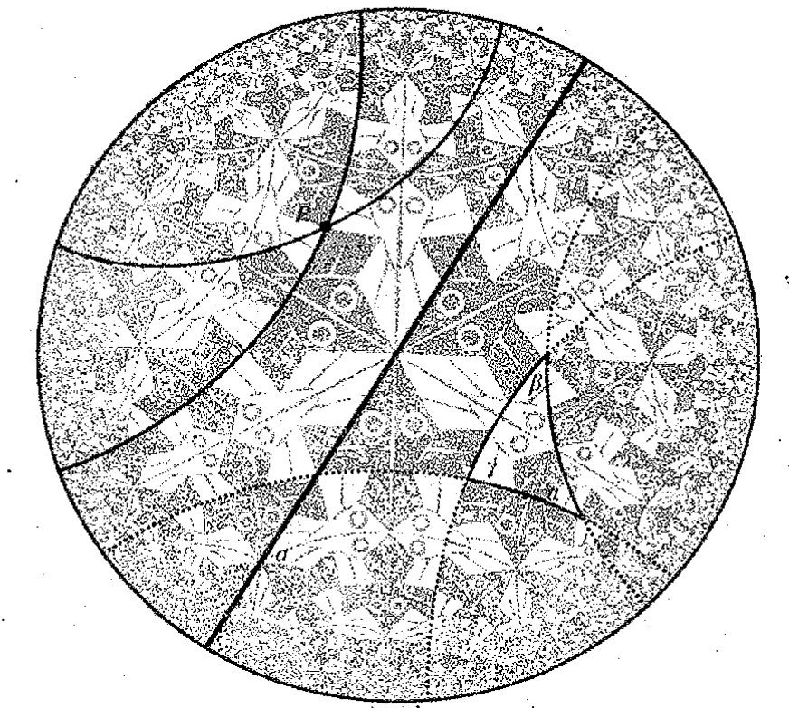

**图 2.12**　与图 2.11 相同的埃舍尔的作品，只是图中加入了双曲直线（与边界圆垂直相交的欧几里得圆或线）和一个双曲三角形。双曲角等于欧几里得角。平行公设在此显然不成立，三角形的内角和小于 $\pi$。

非比寻常的事实。在欧几里得几何里，三角形的面积不可能简单地根据它的角表示出来，而是相当复杂地取决于其边长。

实际上，共形表示下的双曲几何内容远不止这一点，我还没有描述两点间的双曲几何距离是如何定义的（在能够真正讨论面积之前，我们有必要搞清楚什么是“距离”）。这里我直接给出圆上两点 $A$ 和 $B$ 之间的双曲距离表达式：

$$\log\frac{QA\cdot PB}{QB\cdot PA},$$

这里，$P$ 和 $Q$ 是过点 $A$ 和 $B$ 且垂直于边界圆的欧几里得圆（即双曲直线）与边界圆的交点，“$QA$”等是欧几里得距离（见[图 2.13](assets/page043_fig02.jpg)）。如果要在兰伯特面积公式里出现 $C$（即 $C\neq 0$），我们只要将上述距离公式乘以 $C^{-1/2}$ 即可（$C$ 的平方根的倒数）。**\*\*** $^{4,[2.2]}$ 后面我会更清楚地说明，这个量 $C^{-1/2}$ 指的是这种几何的伪半径。

如果你对这种带“log”的数学表达式感到为难，不必着急。这种公式只是为那些想更清楚

**图 2.13**　在共形表示中，$A$ 和 $B$ 之间的双曲距离是 $\log\{QA\cdot PB/QB\cdot PA\}$，其中 $QA$ 等是欧几里得距离；$P$ 和 $Q$ 是过 $A$ 和 $B$ 的与边界圆（双曲直线）垂直的欧几里得圆与边界圆的交点。

---

**\*\* [2.2].**　你能给出一个简单的理由吗？

??? question "答案 [2.2]"
    距离若整体乘以一个常数 $\lambda$，所有长度就乘以 $\lambda$，而面积乘以 $\lambda^2$。原来取 $C=1$ 时有 $\pi-(\alpha+\beta+\gamma)=\Delta$。若新距离为旧距离乘以 $\lambda$，则新面积为 $\lambda^2\Delta$，所以同一角亏量应写成 $\lambda^{-2}\Delta_{\text{new}}$。

    因而兰伯特公式中的常数变为 $C=\lambda^{-2}$，即 $\lambda=C^{-1/2}$。这正是把距离公式乘以 $C^{-1/2}$ 的理由。
·24·

<!-- page 44 -->

## 第二章　古代定理和现代问题

地了解这一问题的人准备的。我不打算解释为什么表达式会是这个样子（例如，为什么按这种方式定义的两点间的最短双曲距离实际是沿双曲直线来量度的，还有为什么沿双曲直线测得的距离可以适当地“相加”，等等）。*[2.3]对“log”（对数）的使用我也要说声抱歉，我只能说事实就是如此。实际上，这里的对数是指自然对数（“以e为底的对数”），我将在[§5.2](chapter_05.md#52-复对数概念), 3予以详细介绍。37 我们会发现，对数真的是非常漂亮和神秘（就像e一样），同时在许多方面也非常重要。

可以证明，这种距离定义下的双曲几何具有欧几里得几何中除了与平行公设有关的那些性质之外的所有其他性质。我们可以有三角形和其他不同形状和大小的平面图形，可以在与欧几里得几何同样多的自由度下“刚性地”（保持其双曲形状和大小不变）移动这些图形，因此，像欧几里得情形下一样，所谓两个图形出现“全等”，指的是它们“可通过刚性移动使二者完全重合”。按照这种双曲几何，埃舍尔木刻画中的所有白鱼是彼此全等的，所有黑鱼亦如此。

### 2.5　双曲几何的其他表示

显然，白鱼看上去不全一样，但这是因为我们是从欧几里得几何而不是从双曲几何的视角来看他们。埃舍尔的画只是利用了双曲几何在欧几里得几何下的特殊表示，双曲几何本身则是一个更为抽象的不依赖于任何特定欧几里得表示的东西。但这种表示对我们大有裨益，它使我们能够用更熟悉、看起来更“具体”的形态，即欧几里得几何形态来看待双曲几何。除此之外，这种表示还清楚地显示了双曲几何具有相容的结构，由此可知，平行公设不可能从欧几里得几何的其他公设中得到证明。

双曲几何的确还存在其他的欧几里得几何的表示，这些表示明显不同于埃舍尔所用的共形表示。其中之一就是所谓的射影表示。在射影表示中，整个双曲平面同样被描述为欧几里得平面上圆的内部，但现在双曲直线是用欧几里得直线（而不是圆弧）来表示。这种明显简单化的代价就是现在双曲角不再等于欧几里得角，很多人认为这种代价过大了。在这种表示下，A和B两点之间的双曲距离由下式给出（图2.14）：

$$\frac{1}{2}\log\frac{\mathrm{RA}\cdot\mathrm{SB}}{\mathrm{RB}\cdot\mathrm{SA}}$$

（像在共形表示里一样，取C = 1），这里R和S是直线AB的延长线与边界圆的交点。38 我们可以按下述办法从双曲几何的共形表示中来得到这种表示：从中心沿径向扩展一个量

$$\frac{2R^2}{R^2+r_c^2}$$

---

*[2.3] 看看你能否用这个公式证明，如果A，B和C是双曲直线上递次的三个点，则双曲距离“AB”等满足“AB”+“BC”=“AC”。你可以利用[§5.2](chapter_05.md#52-复对数概念), 3所述的对数一般性质：log(ab) = loga + logb。

??? question "答案 [2.3]"
    设同一条双曲直线与边界圆交于 $P,Q$，点的次序为 $P,A,B,C,Q$。按距离公式，$AB=\log\{QA\cdot PB/(QB\cdot PA)\}$，$BC=\log\{QB\cdot PC/(QC\cdot PB)\}$。两者相加得

    $AB+BC=\log\{QA\cdot PB/(QB\cdot PA)\}+\log\{QB\cdot PC/(QC\cdot PB)\}=\log\{QA\cdot PC/(QC\cdot PA)\}$。

    右端正是 $AC$ 的公式。中间的 $PB$ 与 $QB$ 抵消，体现的是交比的乘法性。

·25·

<!-- page 45 -->

通向实在之路

---

**图2.14** 在射影表示中，双曲距离公式为 $\frac{1}{2}\log|\mathrm{RA}\cdot\mathrm{SB}/\mathrm{RB}\cdot\mathrm{SA}|$，这里 R 和 S 是欧几里得（也是双曲的）直线 AB 与边界圆的交点。

**图2.15** 为了从共形表示得到射影表示，从中心向外延伸一个因子 $2R^2/(R^2+r_c^2)$，这里 $R$ 是边界圆半径，$r_c$ 是从共形表示中一点的边界圆的中心向外的欧几里得距离。

**图2.16** 由共形表示变换到射影表示得到的图2.11的埃舍尔的画。

这里 $R$ 是边界圆半径，$r_c$ 是从共形表示中一点的边界圆的中心向外的欧几里得距离（图2.15）。$^{*〔2.4〕}$ 图2.16是按此公式将图2.11的埃舍尔的画从共形表示变换到射影表示下的图形。（尽管忽略了细节，埃舍尔的那种精确的艺术特点仍十分明显。）虽然不是那么吸引人，但它提供了一个全新的视角！

*〔2.4〕 证明这一点。（提示：你可以用图2.17所示的贝尔特拉米几何，如果愿意的话。）

??? question "答案 [2.4]"
    用半球表示最直接。设边界圆半径为 $R$，共形圆盘中一点到中心的距离为 $r_c$。把它看成北半球上一点由南极作球极平面投影得到的像。若该半球点的竖直投影到赤道平面的距离为 $r_p$，球极投影的相似三角形关系给出 $r_c=Rr_p/(R+z)$，而半球方程为 $r_p^2+z^2=R^2$。

    消去 $z$，得到 $z=R(R^2-r_c^2)/(R^2+r_c^2)$，于是 $r_p=2R^2r_c/(R^2+r_c^2)/R=2R^2r_c/(R^2+r_c^2)$。也就是说，从共形表示到射影表示，径向坐标正是乘以因子 $2R^2/(R^2+r_c^2)$。

·26·

<!-- page 46 -->

第二章 古代定理和现代问题

还有一种更直接的几何方法可用来表示这种几何，它与共形表示和射影表示都有一定联系。所有这三种表示都归功于天才的意大利几何学家贝尔特拉米（Eugenio Beltrami，1835–1900）。

考虑一个球面 $S$，它的赤道大圆恰好与双曲几何的射影表示的边界圆重合。现在我们来求 $S$ 的北半球面 $S^+$ 上的双曲几何表示，我称它为半球表示。见[图 2.17](assets/page046_fig01.jpg)。为了从平面（设为水平面）的射影表示过渡到新的球面上的表示，我们只需垂直向上投影（[图 2.17](assets/page046_fig01.jpg)(a)）。代表双曲直线的平面上的直线在 $S^+$ 上表示为与赤道大圆垂直相交的半圆。而要从 $S^+$ 上的表示得到平面上的共形表示，我们从南极进行投影（[图 2.17](assets/page046_fig01.jpg)(b)）。这就是所谓的球极平面投影，它在本书中扮演着重要角色（[§8.3](chapter_08.md#83-黎曼球面)，[§18.4](chapter_18.md#184-闵可夫斯基空间的双曲几何)，[§22.9](chapter_22.md#229-二态系统的黎曼球面) 和 [§33.6](chapter_33.md#336-作为无质量自旋粒子的扭量的几何)）。我们将在 [§8.3](chapter_08.md#83-黎曼球面) 叙述球极平面投影的两个重要性质，一个是说这种投影是共形的，因此它是保角的，就是说，投影将球面上的圆变换成平面上的圆（有一个例外，就是变换成直线）。\*[2.5]\*\*\*[2.6]

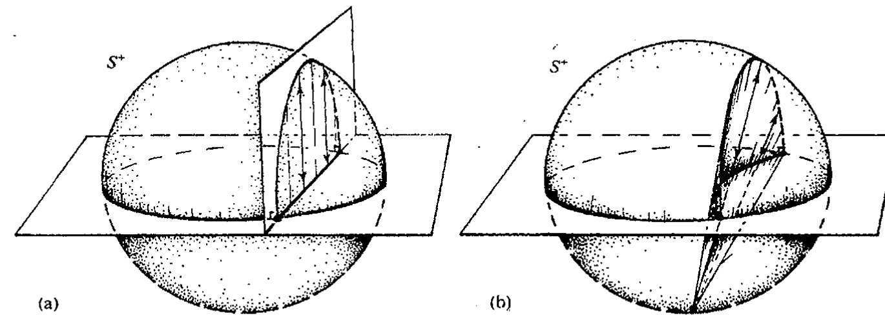

双曲几何存在着不同的欧几里得空间下的表示，这一事实强调的是，这些表示不过是双曲几何的“欧几里得模型”，切不可当作是双曲几何实际的样子。如同欧几里得几何一样（见 [§1.3](chapter_01.md#13-柏拉图的数学世界真实吗) 和序言），双曲几何有它自己的“柏拉图存在”。这些“模型”里没一个可被认为比其他的更有资格充当双曲几何的“正确”图像。每一种表示在帮助我们理解方面都有其非常重要的价值，我们之所以对欧几里得表示印象深刻，只不过是因为我们更熟悉这种框架罢了。对生长在直接体验双曲几何（而不是欧几里得几何）的智慧生物来说，用双曲几何的概念来理解欧几里得几何同样是件自然的事。在 [§18.4](chapter_18.md#184-闵可夫斯基空间的双曲几何)，我们还将遇到双曲几何的另一种模型，这就是狭义相对论的闵可夫斯基几何。

---

\*[2.5] 假定球极平面投影的这两个性质成立，且双曲几何的共形表示如 [§2.4](#24-双曲几何共形图像) 所述，证明：贝尔特拉米的半球表示是共形的，此时双曲“直线”成为垂直的半圆。

??? question "答案 [2.5]"
    从半球到共形圆盘的球极平面投影按假定是保角的。因此，若共形圆盘模型中的角就是双曲角，那么把这种角度拉回半球后仍保持不变；半球表示也就是共形的。

    同时，半球上的双曲直线来自射影模型中赤道圆盘内的欧几里得直线。垂直向上投影把这条直线提升为北半球与一个竖直平面的交线，因此是一个以赤道圆上一对端点为端点的半圆。该竖直平面垂直于赤道平面，所以这个半圆与赤道大圆正交。

\*\*\*[2.6] 你能看出如何证明这两个性质吗？（提示：在圆的情形下证明：投影锥被两个正相对倾斜的平面所截。）

??? question "答案 [2.6]"
    圆到圆的性质可这样看：球面上的一个圆是球面与某一平面的交线。从投影点向这个圆作所有射线，形成一个圆锥。这个圆锥再被目标平面截出一条圆锥曲线。由于原圆所在平面与目标平面相对于圆锥轴具有互补的倾斜关系，这个圆锥曲线仍是圆；若原圆过投影点，圆锥退化为平面，像就是直线。

    保角性可由同一几何看出。过球面上一点的两条曲线的切线投影到平面时，都在同一个通过投影点的微小切锥上作线性截取；球的切平面与像平面之间的这种中心投影在该点只差一个整体比例和旋转，不改变两条切线的夹角。因此球极平面投影保角。

·27·

<!-- page 47 -->

通向实在之路

在结束本节的时候，让我们回到双曲几何下正方形的存在性问题上来。在双曲几何里，虽然不存在四个角都是直角的正方形，但存在更为一般的其各角均小于直角的“正方形”。构造这种正方形的最简单的方法，就是画两条在 O 点成直角相交的直线。我们的“正方形”现在就是这样一种四边形，它的四个顶点是这两条直线与以 O 为中心的圆的交点 A, B, C, D（见图 22.18）。由于图形的对称性，四边形 ABCD 的四条边相等，四个角也相等。但这些角是直角吗？在双曲几何下不是。实际上它们可以是小于直角的任意（正）角，但就不能是直角。（双曲）正方形的面积越大（即上述结构中的圆越大），这个角就越小。在[图 2.19](assets/page047_fig02.jpg)(a)，我用共形模式画了双曲正方形格子，它的每个顶点上有 5 个正方形（而不是欧几里得几何的 4 个），故顶角为 $\frac{2}{5}\pi$ 或 $72^\circ$。[图 2.19](assets/page047_fig02.jpg)(b) 是用射影模型表示画出的同样的格子。我们看到，这种调整对于图 2.2 中的两正方形格子是不容许的。***〔2.7〕

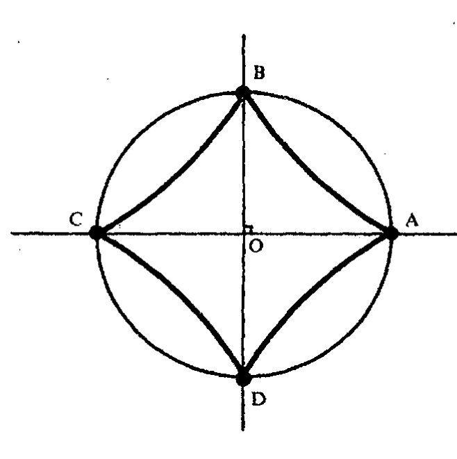

图 2.18 双曲“正方形”是一种双曲四边形，它的顶点是两条过 O 点正交的直线与以 O 为中心的圆的交点 A, B, C, D。由于图形的对称性，四边形 ABCD 的四条边相等，四个角也相等。这些角不是直角，但可以是小于 $\frac{1}{2}\pi$ 的任意正角。

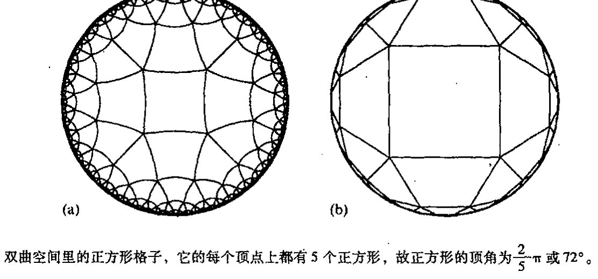

图 2.19 双曲空间里的正方形格子，它的每个顶点上都有 5 个正方形，故正方形的顶角为 $\frac{2}{5}\pi$ 或 $72^\circ$。(a) 共形表示，(b) 射影表示。

---

***〔2.7〕看看你能否用双曲矩形和正方形作类似的事情。

??? question "答案 [2.7]"
    在双曲几何中可取一个顶角为 $2\pi/n$ 的正方形，其中 $n>4$。把它绕一个顶点连续反射或旋转，就能让 $n$ 个这样的正方形围满该顶点；再沿边反射，便得到类似欧几里得方格的双曲正方形镶嵌。图 2.19 的情形是 $n=5$。

    矩形也类似：选取四边形使相对边相等、四角相等或成配对角，然后沿边反复反射。关键差别是角和不再固定为 $2\pi$ 的四分之一；双曲面积越大，角越小，因此可以有欧几里得平面中不可能的“每点五个或更多正方形”的格子。

· 28 ·

<!-- page 48 -->

## 2.6 双曲几何的历史渊源

这里我们不妨对双曲几何发现的历史做些回顾。在大约公元前300年欧几里得几何原本发表后的几个世纪里，不少数学家都试图用其他公理和公设来证明第五公设。这些努力在1733年以萨凯里（Jesuit Girolamo Saccheri，1667~1733）的史诗般的工作达到顶点。但似乎萨凯里本人一定以为他的这项倾注了毕生心血的工作是一个错误，充其量只是一个未完成的尝试——他试图通过证明每个三角形的内角和小于两直角的假设必将导致矛盾的思路来证明平行公设。虽经巨大的努力，但他仍无法从逻辑上做到这一点，最后他相当不肯定地总结道：

> 锐角假设绝对是个错误，因为它与直线性质相矛盾。^5

“锐角”假设认为，图2.8中的直线$a$和$b$有时不相交。实际上，这不仅是可能的，而且直接导致双曲几何！

萨凯里是怎么发觉他要证明的东西是不可能的呢？他用于证明欧几里得第五公设的思路是：先假设第五公设是错的，然后从这个假设推出矛盾。这是一种最为悠久且极富成效的数学推理方法——最早可能还是毕达哥拉斯引入的——称为反证法（或称归谬法）。按这种方法，为了要证明某个命题为真，我们首先得假设该命题不成立，然后从中推出矛盾。找到了矛盾也就证明了原命题为真。^6^ 在数学推理中，反证法是一种相当有力的方法，今天我们依然经常使用。杰出的数学家哈代（G. H. Hardy，1877~1947）的一番话很值得引述于此：

> 欧几里得极为偏爱的归谬法是数学家最好使的一种武器。这是一种比象棋中任何开局谋略都更为精巧的谋略：棋手可能会牺牲一个兵或其他棋子来开局，而数学家牺牲的则是整个棋局。^7

以后我们还会看到这一重要原理的其他应用（见[§3.1](chapter_03.md#31-毕达哥拉斯灾难)和[§16.4](chapter_16.md#164-康托尔对角线法), 6）。

然而，萨凯里没能从他的证明过程中发现任何矛盾。因此他无法得到对第五公设的证明。但在证明过程中，他事实上发现了远为重要的东西：一种不同于欧几里得几何的新几何——这就是[§2.4](#24-双曲几何共形图像), 5里讨论的我们现在称为双曲几何的那种几何。从欧几里得第五公设不成立的假设中，他没导出矛盾，倒是导出一堆看上去奇怪、令人难以置信但却十分有趣的定理。这些结果尽管看上去古怪，但却没有一个有矛盾。现在我们知道，萨凯里用这种方法是不可能有机会找出真正的矛盾的，因为道理很简单，从数学上具有相容性结构这一点上看，双曲几何确实是存在的。用[§1.3](chapter_01.md#13-柏拉图的数学世界真实吗)的术语来说就是，双曲几何是居于柏拉图数学形式世界里的。（双曲几何的物理实在问题见[§2.7](#27-与物理空间的关系)和[§28.10](chapter_28.md#2810-宇宙学参数观察的地位)。）

萨凯里之后不久，目光深邃的数学家兰伯特也从欧几里得第五公设不成立的假设中导出一

<!-- page 49 -->

通向实在之路

堆令人惊奇的几何结果，其中就包括 [§2.4](#24-双曲几何共形图像) 所述的用内角和来表达双曲三角形面积公式这样的漂亮结果。似乎有迹象表明，至少在他晚年，兰伯特很可能已经形成了这样的观点：从否定欧几里得第五公设出发，或许能够得到一种相容的几何。兰伯特作此猜测的理由似乎是建立在他的这样一种预想基础上的：理论上有可能存在基于“虚半径球面”（即“半径平方”为负数）的几何。兰伯特公式 $\pi - (\alpha + \beta + \gamma) = C\Delta$ 给出了双曲三角形的面积 $\Delta$，其中 $\alpha, \beta$ 和 $\gamma$ 是三角形的三个角，$C$ 是一常数（$-C$ 就是所谓双曲平面的“高斯曲率”）。这个公式看上去与更早以前哈里奥特（Thomas Hariot, 1560～1621）得到的球面三角形面积公式 $\Delta = R^2(\alpha + \beta + \gamma - \pi)$ 非常相似，所谓球面三角形是指由半径为 $R$ 的球面上的大圆弧^所框出的区域（[图 2.20](assets/page049_fig01.jpg)）。***[2.8] 为了回到兰伯特公式，我们令

$$C = -\frac{1}{R^2}$$

但是，要得到双曲几何所需的正的 $C$ 值，我们必须要求球面半径为“虚数”（即负数的平方根）。这样，半径 $R$ 由虚数 $(-C)^{-1/2}$ 给出。这也就是为什么我们把 [§2.4](#24-双曲几何共形图像) 引入的实量 $C^{-1/2}$ 称为“伪半径”。实际上，兰伯特的方法从我们当今更现代的观点（见第 4 章和 [§18.4](chapter_18.md#184-闵可夫斯基空间的双曲几何)）看是相当合理的，这说明他具有足以预见到这一点的深邃眼光。

但传统的观点（我认为有点不公正）拒绝给予兰伯特以第一个构造非欧几何的荣誉，而是认为这第一人的荣誉应当属于（半个世纪后的）大数学家高斯（Carl Friedrich Gauss, 1777～1855），因为他第一个明确接受了一种有别于欧几里得几何的充分相容的几何，在这种几何中，平行公设不成立。作为一个异常谨慎的人，同时又担心这一惊人发现将引起争论，高斯没有公布他的发现，而是采取秘而不宣。^9^ 在高斯开始此项研究的 30 年后，双曲几何又再次为其他一些人独立发现，这其中就包括波尔约（Hungarian János Bolyai, 1775～1856, 1829 年前后）和（尤其是）俄罗斯几何学家罗巴切夫斯基（Nicolai Ivanovich Lobachvsky, 1792～1856, 1826 年前后）（因此双曲几何经常也称为罗巴切夫斯基几何）。

前面所述的双曲几何的射影表示和共形表示都是由贝尔特拉米发现并于 1868 年发表，文章

---

*** [2.8] 试仅用对称性和球面总面积为 $4\pi R^2$ 这一事实证明这个球面三角公式。提示：先求由连接球面对径点的两个大圆弧框出的部分球面面积，然后切割、黏贴并利用对称性进行论证。记住[图 2.20](assets/page049_fig01.jpg)。

??? question "答案 [2.8]"
    两个夹角为 $\alpha$ 的大圆半圆围成的球面二角形面积为 $2\alpha R^2$，因为它占整个球面的比例为 $\alpha/(2\pi)$，而球面积为 $4\pi R^2$。对球面三角形及其三个对径三角形作切割计数，可知三个以角 $\alpha,\beta,\gamma$ 为角度的二角形面积之和，恰好覆盖目标三角形三次，并覆盖其对径三角形三次，而球面其余部分覆盖一次。

    等价地，利用对径对称整理可得 $2R^2(\alpha+\beta+\gamma)=2\Delta+2\pi R^2$。因此 $\Delta=R^2(\alpha+\beta+\gamma-\pi)$。当三角形很小时，角和接近 $\pi$，面积也趋近于零，这与公式一致。
·30·

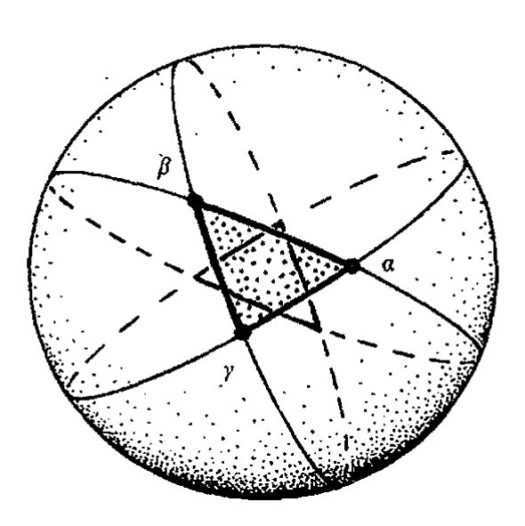

图 2.20 球面三角形的哈里奥特公式 $\Delta = R^2(\alpha + \beta + \gamma - \pi)$，其中 $\alpha, \beta$ 和 $\gamma$ 是球面三角形的三个角。在双曲三角形的兰伯特公式里，只要令 $C = -1/R^2$ 即可得到上述哈里奥特公式。

<!-- page 50 -->

第二章 古代定理和现代问题

中还包括了诸如半球表示这样的其他一些优美的表示。然而，通常人们将共形表示称为"庞加莱模型"，因为庞加莱于 1882 年对这一表示的再发现比贝尔特拉米的原创性工作更出名（主要是因为庞加莱对这一表示进行了重要的应用）。¹⁰ 无独有偶，可怜的老贝尔特拉米的射影表示则经常被冠以"克莱因表示"。在数学上，一个数学概念不以其最初发现者的名字命名，这并非鲜见。在眼下的这个例子中，至少庞加莱重新发现了共形表示（克莱因则是于 1871 年重新发现了射影表示）。数学上还有些概念其被命名的数学家甚至不知道有此结果！¹¹

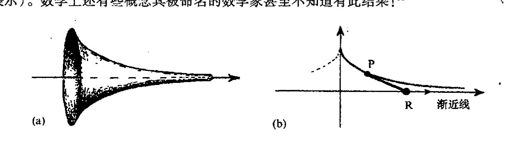

图 2.21 （a）伪球面。它可通过旋转（b）曳物线来获得。为了得到曳物线，想象在一个水平面上有一根直的轻质无摩擦刚性棒，其一端 P 固连着一个点状重物，另一端 R 沿渐近（直）线移动，于是 P 点描绘出一条曳物线。

有一种以贝尔特拉米著称的双曲几何表示（这是他 1868 年发现的），这就是所谓伪球面上的几何表示（[图 2.21](assets/page050_fig01.jpg)）。这种曲面可通过旋转曳物线来获得，牛顿在 1676 年首次研究了这种曲线及其"渐近线"。所谓渐近线是一条曲线逐步靠近的直线，当曲线趋于无穷时它与曲线渐近相切。这里，我们可以将渐近线想象成是画在质地粗糙的水平面上的。好比有一根直的轻质刚性棒，其一端 P 固连着一个点状重物，另一端 R 沿渐近线移动。于是 P 点描绘出一条曳物线。明金（F. G. Minding，1806～1885）在 1839 年发现，伪球面有一个负常数的内在几何。贝尔特拉米正是根据这个事实构造了第一个双曲几何模型。由于这种伪球面模型的双曲距离度量与沿曲面的欧几里得距离的度量相一致，因此它似乎能够说服数学家接受平面双曲几何的相容性。然而，它也是一个有点蹩脚的模型，因为它只能对双曲几何作局部表示，而不能像贝尔特拉米的其他模型那样进行整体的表示。

46

## 2.7 与物理空间的关系

双曲几何在高维下也有完美的表现。此外，存在着高维的共形表示和射影表示。对三维双曲几何，边界圆替换为边界球面。整个无限大的三维双曲几何由这个有限的欧几里得球面的内部来代表。其余的基本上与我们以前的一样。在共形表示里，三维双曲几何中的直线表现为与边界球面垂直相交的欧几里得圆，角则直接由欧几里得度量给出，距离公式同二维情形。在射影表示下，双曲直线就是欧几里得直线，距离公式也与二维情形下一样。

实际的宇宙在宇宙学尺度上的情形会是怎样的呢？我们能够期望它的空间几何是欧几里得

·31·

<!-- page 51 -->

通向实在之路

的吗？抑或它更接近于其他某种几何，例如我们在 §§ 2.4~6 所考察的著名的双曲几何（当然是其三维形式）？这确实是个严肃的问题。从爱因斯坦的广义相对论（[§17.9](chapter_17.md#179-爱因斯坦广义相对论的时空) 和 [§19.6](chapter_19.md#196-爱因斯坦场方程)）我们知道，欧几里得几何只是对实际物理空间的几何的一种（极为精确的）近似。这种物理几何甚至不是严格均匀的，总存在一些由物质密度所引起的波纹起伏。但据宇宙学家当前所能得到的最好的观察资料显示，这些波纹似乎可以在宇宙学尺度上被平均到一个相当好的程度（见 [§27.13](chapter_27.md#2713-异乎寻常的特殊大爆炸) 和 §§ 28.4~10），实际宇宙的空间几何极为接近于均匀的（分布均匀且各向同性——见 [§27.11](chapter_27.md#2711-宇宙学)）几何。至少欧几里得的前四条公设是经得起时间检验的。

有些事情需要在这里澄清一下。基本上说，满足均匀性（各点性质都一样）和各向同性（各方向性质都一样）条件的几何大致有 3 种：欧几里得型的、双曲型的和椭圆型的。欧几里得几何我们是再熟悉不过了（已存在了 23 个世纪）。双曲几何则是本章的主题。但什么是椭圆几何呢？根本上说，椭圆平面几何就是那种球面上图形所满足的几何。我们在 [§2.6](chapter_02.md#26-双曲几何的历史渊源) 讨论兰伯特的双曲几何时见到过它。[图 2.22](assets/page052_fig03.jpg)a, b, c 分别是椭圆、欧几里得和双曲三种几何下用相似的天使和魔鬼镶嵌成的埃舍尔的画，其中第三种是[图 2.11](assets/page042_fig01.jpg) 的一种有趣的替代品。（还存在三维的椭圆几何及其各种表示，在这些表示中，球面对径的两点被认为表示的是同一点。这些问题我们将放在 [§27.11](chapter_27.md#2711-宇宙学) 进行较深入的讨论。）但是，椭圆情形被认为违反了欧几里得第二和第三公设（也就包括了第一公设）。因为这是一种范围有限的几何（因此两点间可有多条线段）。

那么宇宙的大尺度空间几何的观察结果又是如何的呢？凭心而论，我们并不清楚，虽然最近出现了不少广为宣传的论调，声称欧几里得几何还是对的，它的第五公设也仍然成立，就是说平均而言，空间的几何性质仍是“欧几里得型的”。^12^ 另一方面，也有证据（一些证据来自同一类实验）较为肯定地宣称，宇宙空间总体上是双曲型的。^13^ 除此之外，也有些理论家一直在为椭圆模型进行争论，这种情形是不可能用同样支持欧几里得模型的证据来排除的（见 [§34.4](chapter_34.md#344-错误理论能被实验驳倒吗) 后半部分）。读者会注意到，这个问题仍然充满争议，经常还会引起激烈的争吵。在本书的后面几章，我将给出许多与此有关的观点（我并不打算隐瞒我自己对双曲模型的偏好，但我会尽可能公正地介绍其他观点）。

对那些像我这样为双曲几何的美所吸引，同时也对现代物理的宏大感到由衷赞叹的人来说，这种极好的几何还有另一种作用，这就是它对理解现代物理宇宙所具有的无可争议的基础性作用。按照现代的相对论理论，速度空间一定是三维双曲几何的（见 [§18.4](chapter_18.md#184-闵可夫斯基空间的双曲几何)），而不是那种在古老的牛顿理论中才成立的欧几里得几何。这将有助于我们理解解开相对论的某些谜团。例如，想象一下，一艘正以接近光速的速度掠过建筑物的飞船以差不多相同的速度向前抛射出一个物体。然而，该物体相对于建筑物的速度永远不可能超过光速。对于这种不可能性，我们在 [§18.4](chapter_18.md#184-闵可夫斯基空间的双曲几何) 可以从双曲几何角度找到一个直接的解释。这些引人入胜的问题只有在后面的章节才能够展开论述。

毕达哥拉斯定理的情形又如何呢？我们已看到，它在双曲几何下不成立。那么难道我们就这么放弃祖先传下来的这一伟大遗产吗？不会的，就双曲几何——以及所有各种从双曲几何推广

· 32 ·

<!-- page 52 -->

---

第二章　古代定理和现代问题

---

(a)

(b)

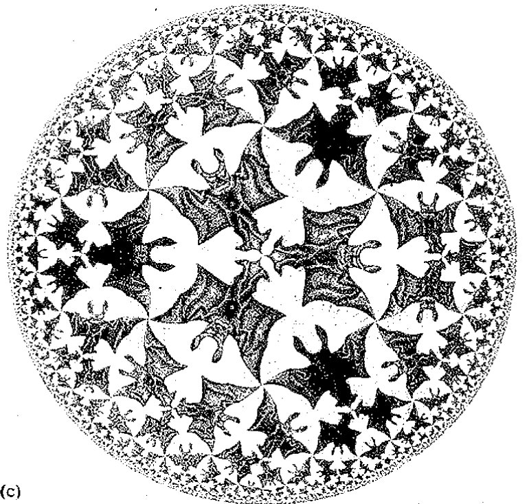

(c)

**图 2.22**　用埃舍尔的天使和魔鬼拼贴画显示的均匀平面几何的三种基本型。(a) 椭圆型（正曲率）；(b) 欧几里得型（零曲率）和 (c) 双曲型（负曲率）。它们都是共形表示（埃舍尔作品《圆极限 IV》，与图 2.17 比较）。

出来的“黎曼”几何（它们构成爱因斯坦广义相对论的基本框架，见 [§13.8](chapter_13.md#138-正交群)，[§14.7](chapter_14.md#147-度规能为你做什么)，[§18.1](chapter_18.md#181-欧几里得型与闵可夫斯基型四维空间) 和 [§19.6](chapter_19.md#196-爱因斯坦场方程)）——而言，在小尺度极限方面毕达哥拉斯定理仍起着关键性作用。何况，毕达哥拉斯定理的巨大影响早已深入到数学和物理的广泛领域（例如量子力学的“幺正”度规结构，见 [§22.3](chapter_22.md#223-幺正结构希尔伯特空间和狄拉克算符)）。尽管这一定理从某种意义上说已为“大尺度”距离上的相应定理所取代，但它在小尺度几何结构方面仍具有中心地位，它的应用范围远远超出了最初提出时的预想。

---

· 33 ·

<!-- page 53 -->

通向实在之路

---

**注 释**

**§ 2.1**

2.1 历史上究竟是谁最先证明了“毕达哥拉斯定理”，这一点很不清楚，见注释 1.1。古埃及人和古巴比伦人似乎已经知道这一定理的一些事例。毕达哥拉斯及其学派的真正作用被夸大了。

**§ 2.2**

2.2 尽管欧几里得已经非常小心，但他的工作中仍隐含了各种假设。它们主要涉及到我们今天称为“拓扑”的那些问题，这些问题在欧几里得和他的同时代人看来，似乎是“直观上显然”的。这些未经言明的假设只有到几个世纪后，特别是 19 世纪末才由希尔伯特明确指出。后文中我将略去这些说明。

2.3 例如见 Thomas (1939)。

**§ 2.4**

2.4 本书中会经常用到像 $C^{-1/2}$ 这样的“指数”记号。正如注释 1.1 已经指出的，$a^5$ 表示 $a \times a \times a \times a \times a$；相应地，对正整数 $n$，$a$ 自乘 $n$ 次的积记为 $a^n$。这种记法可扩展到负指数，故 $a^{-1}$ 就是 $a$ 的倒数 $1/a$，$a^{-n}$ 就是 $a^n$ 的倒数 $1/a^n$，或等价地 $(a^{-1})^n$。为了与 [§5.2](chapter_05.md#52-复对数概念) 的更为一般性的讨论保持一致，对正数 $a$，$a^{1/n}$ 为“$a$ 的 $n$ 次方根”，它是满足 $(a^{1n})^n = a$ 的（正）数（见注释 1.1）。进一步，$a^{mn}$ 是 $a^{1/n}$ 的 $m$ 次幂。

**§ 2.6**

2.5 Sacchri(1733), Prop. XXXIII。

2.6 极少数数学家持有所谓的直觉主义观点，这种观点不接受“反证法”，认为这一法则属非构造性的，因此有时会导致出现对某个数学对象的不具任何构造意义的断言。这个问题与 [§16.6](chapter_16.md#166-图灵机和哥德尔定理) 所讨论的问题有关，见 Heyting(1956)。

2.7 Hardy(1940), 34 页。

2.8 大圆弧是球面上的“最短”曲线（测地线）；它们处于过球面中心的平面上。

2.9 高斯的职业兴趣是在测地方面，他是否真的试图从物理空间上来判断是否存在可测量的欧几里得几何的偏差，这仍是个有争论的问题。由于他对非欧几何问题始终保持沉默，因此，如果他事实上试图这么做，他也不会对外声张，更何况（如我们现在所知）这种效应是如此之弱，他注定不会成功。目前的主流观点是，他“只是进行测地工作”，关心的是大地的曲率，而非空间曲率。但我认为很难相信他会一点不在意欧几里得几何的任何明显的偏差，见 Fauvel and Gray(1987)。

2.10 所谓“庞加莱半平面”表示最初也出自贝尔特拉米，见 Beltrami(1868)。

2.11 这一点甚至可用于高斯本人（另一方面说，他也经常超前预料到其他数学家的工作）。拓扑学上有一条重要的数学定理称为“高斯－博内定理”，它可以用所谓“高斯映射”来漂亮地证明，但这定理本身实际上是 Blaschke(W. J. E. Blaschke 1885~1962) 提出的，而优美的证明过程则是由 Olinde Rodrigues(1749~1851) 发现的。就是说，不论是结果还是证明过程甚至都不为高斯或博内所知。一些教科书中曾正确引述过更为基本的“高斯－博内定理”，见 Willmore(1959) 和 Rindler(2001)。

**§ 2.7**

2.12 宇宙总体结构的主要证据基本来源于对宇宙的微波背景辐射的细致分析，我们将在 §§ 27.7, 10, 11, 13, §§ 28.5, 10 和 § 34.14 对此进行讨论。基本参考文献见 de Bernardis *et al.* (2000)；更精确、更新的数据见 Netterfield *et al.* (2001)（有关 BOOMERanG 的）、Hanany *et al.* (2000)（有关 MAXIMA 的）和 Halverson *et al.* (2001)（有关 DASI 的）。

2.13 理论基础见 Gurzadyan and Torres (1997)；Gurzadyan and Kocharyan (1994)。相应的微波背景辐射数据分析：COBE 数据见 Gurzadyan and Kocharyan (1992)；BOOMERanG 数据见 Gurzadyan *et al.* (2002, 2003)；WMAP 数据见 Gurzadyan *et al.* (2004)。

---

· 34 ·
