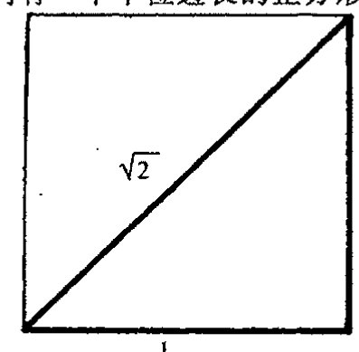

<!-- page 54 -->

第三章 物理世界里数的种类

# 第三章

# 物理世界里数的种类

## 3.1 毕达哥拉斯灾难？

现在我们回到反证法问题上来，这一方法曾被萨凯里用于他对欧几里得第五公设的证明。经典数学里有许多成功运用这种方法的例子，最著名的一个例子出自毕达哥拉斯学派，这一证明方法解决了下面这样一个数学问题，尽管给他们带来巨大麻烦：我们能找到一个其平方等于数2的有理数(即分数)吗？答案是不能，一会儿我将给出这个数学命题：不存在这样的有理数。

为什么毕达哥拉斯学派对这一发现会感到如此烦恼呢？我们知道，一个分数——也就是一个有理数——总可以表示为两个整数 $a$ 和 $b$ 的比值 $a/b$，其中 $b$ 非零。(分数的定义见前言。)毕达哥拉斯学派原来一直认为，他们的全部几何可以用有理数量度的长度来表示。有理数非常简单，用简单有限的几个概念就能说明白，而且能够用于度量距离大小。如果所有几何都能用有理数表示的话，那么事情就会变得相当简单易懂。另一方面，“有理”数的概念要求可无限操作，这对古人来说显得相当困难(原因可以有很多)。为什么不存在其平方等于数2的有理数会是一个困难呢？这还要回到毕达哥拉斯定理本身。在欧几里得几何里，如果我们有一个单位边长的正方形，那么它的对角线就是一个其平方等于 $1^2+1^2=2$ 的数(见[图 3.1](assets/page054_fig01.jpg))。如果不存在这样一个能够描述正方形对角线长的数，这无疑是几何学的灾难。开始时，毕达哥拉斯试图用能够以整数比描述的“实际的数”概念来解决这个问题。下面我们看看为什么这么做没用。

图 3.1 按毕达哥拉斯定理，单位边长的正方形有对角线 $\sqrt{2}$。

这个问题可归结为：为什么对正整数 $a$ 和 $b$，方程

$$\left(\frac{a}{b}\right)^2=2$$

无解？我们用反证法来证明不可能存在这样的 $a$ 和 $b$。为

<!-- page 55 -->

## 通向实在之路

---

此我们假设，如果这样的 $a$ 和 $b$ 存在，那么

用 $b^2$ 乘以上述方程的两边，可得到

$$a^2 = 2b^2,$$

另外，显然有 $a^2 > b^2 > 0$。¹ 现在方程的右边是偶数，故 $a$ 必为偶数（不可能是奇的，因为奇数的平方还是奇数）。不妨设 $a = 2c$ 这里 $c$ 是某个正整数。我们用 $2c$ 替换下方程里的 $a$，再平方，有

$$4c^2 = 2b^2,$$

两边再除以 2，

$$b^2 = 2c^2,$$

于是有结论 $b^2 > c^2 > 0$。这个方程除了 $b$ 取代 $a$ 和 $c$ 取代 $b$ 之外，形式与以前的完全一样，只是有一点，相应的整数较之以前变小了。现在我们不断重复这个论证过程，由此得到一个方程的无穷序列

$$a^2 = 2b^2, b^2 = 2c^2, c^2 = 2d^2, d^2 = 2e^2, \cdots,$$

这里

$$a^2 > b^2 > c^2 > d^2 > e^2 > \cdots,$$

53 所有这些整数都是正的。但一个递减的正整数序列最后必然达到零，这与这个序列的无穷性质相矛盾。带来矛盾的是我们所做的假设，即存在平方为 2 的有理数。因此，正如我们要证的，不存在这样的有理数。²

上述论证中有些要点应当挑明。首先，按照正常的数学证明程序，论证中涉及的数的性质应是“明白的”或是之前得到认可的。例如，我们利用了奇数的平方总是奇数，以及一个整数不是奇数就是偶数这些事实。我们另外用到的一个基本事实是，每个严格递减的正整数序列一定达到零。

确认论证中使用的精确假设之所以重要——尽管这些假设中有些完全是“显然”的——是因为数学家们经常对论证中并非原初所关心的其他方面感兴趣。如果这些方面的性质仍满足原假设，那么论证就仍是有效的，同时所证的命题也因此获得了比原有的更广泛的意义，因为它可以用到这些其他方面。但另一方面，如果某些所需的假设在这些新的方面不能成立，那么我们就知道了原命题在这些新的方面是不成立的。（例如，认识到如下事实很重要：在 [§2.2](chapter_02.md#22-欧几里得公设) 的毕达哥拉斯定理证明中我们用到了平行公设，因此该定理在双曲几何下是不成立的。）

54 在上述论证中，原初的对象是整数，而我们关心的那些数——有理数——则是整数的商。对于这样的数，的确不存在其平方等于 2 的情形。但还存在另一些并非整数和有理数的其他类型的数。正是 2 的平方根的需要迫使古希腊人非常不情愿地越过整数和有理数的樊篱去寻找新的数。他们发现他们不得不接受的这种新的数就是我们今天的所谓“实数”：一种我们现在用十进制无限展开来表示的数（虽然古希腊人不知道有这种表示）。实际上，2 的确有一个实数的平方根，

·36·

<!-- page 56 -->

第三章 物理世界里数的种类

即（我们将它写在下面）

$$\sqrt{2} = 1.41421356237309504880168872\cdots$$

在下一节我们还将更仔细地考虑这个“实数”的物理功用。

出于好奇，我们不妨问一句，为什么上面对“不存在2的平方根”的证明对实数（或实数比，二者是一回事）是无效的？如果我们将论证中的“整数”代换为“实数”会发生事情？我们说，基本的差别在于，严格递减的正实数（甚至其分数）序列必达到一个定值这一点是错的，因此论证在这一点上不成立。3（例如，考虑无限序列1，$\frac{1}{2}$，$\frac{1}{4}$，$\frac{1}{8}$，$\frac{1}{16}$，$\frac{1}{32}$。）人们也许还担心这种情形下“奇”和“偶”实数之间是否有差别。事实上，这种区别丝毫不造成论证困难，因为所有的实数和所有的“偶实数”一样多：对任一实数$a$，总存在一个实数$c$使得$a = 2c$，对实数两边除2总是可能的。

## 3.2 实数系

因此，古希腊人不得不接受这样一个事实：如果（欧几里得）几何概念要得以健康发展，有理数显然是不足的。今天，我们从不担心某个几何量是否会无法单用有理数来度量。这是因为我们已非常熟悉“实数”概念。虽然袖珍计算器只能以有限几位数字来表示数，但我们很快就明白，这是一个由于计算器运算能力所限得到的近似数。我们容许对理想的（柏拉图）数学数（mathematical number）作十进制无限连续展开。这种方法甚至可用于分数的十进制表示，例如像

$$\frac{1}{3} = 0.333333333\cdots,$$

$$\frac{29}{12} = 2.416666666\cdots,$$

$$\frac{9}{7} = 1.285714285714285,$$

$$\frac{237}{148} = 1.60135135135\cdots$$

分数的十进制展开总是循环的，即是说在某个数位之后，这个无穷数字列是由某个有限长数字串的无限重复构成的。在上面的这些例子中，重复数字列分别为3，6，285714和135。

[55]

古希腊人不知道十进制展开，但他们有他们自己的办法来对付无理数。实际上，他们所采用的是我们今天称为连分数的表示系统。这里我们不必深究，只予以稍许点评。一个连分数4就是一个有限或无限的表达式$a+(b+(c+(d+\cdots)^{-1})^{-1})^{-1}$，这里$a, b, c, d, \cdots$都是正整数：

$$a + \frac{1}{b + \frac{1}{c + \frac{1}{d + \cdots}}}$$

·37·

<!-- page 57 -->

# 通向实在之路

任何大于 1 的有理数都可以写成一个可穷尽的这种表达式（这里为避免歧义，我们通常要求最后的整数大于 1）。例如，$52/9 = 5 + (1 + (3 + (2)^{-1})^{-1})^{-1}$：

$$\frac{52}{9} = 5 + \frac{1}{1 + \frac{1}{3 + \frac{1}{2}}}$$

而对于小于 1 的正有理数，我们只需容许表达式中第一个整数是零。对非有理数的实数，我们只需\*[3.1] 要求这种连分数表达式可以无限重复下去，下面是一些例子⁵

$$\sqrt{2} = 1 + (2 + (2 + (2 + (2 + \cdots)^{-1})^{-1})^{-1})^{-1},$$

$$7 - \sqrt{3} = 5 + (3 + (1 + (2 + (1 + (2 + (1 + (2 + \cdots)^{-1})^{-1})^{-1})^{-1})^{-1})^{-1})^{-1})^{-1},$$

$$\pi = 3 + (7 + (15 + (1 + (292 + (1 + (1 + (1 + (2 + \cdots)^{-1})^{-1})^{-1})^{-1})^{-1})^{-1})^{-1})^{-1})^{-1}。$$

在前两个例子中，自然数的序列——即第一个例子中的 1, 2, 2, 2, … 和第二个例子中的 5, 3, 1, 2, 1, 2, … ——似乎有这样的性质：他们都是最终循环序列（在第一个例子中是 2，第二个例子中是 1, 2）。\*\*[3.2] 从前述熟悉的十进制记法我们知道，只有有理数才有（有限的或）最终循环表达式。另一方面，有理数总可以表示为一个有限的连分数，这一点可看成是古希腊人在“连分数”表示方面所达到的成就。于是，我们自然要问，哪些数会有最终循环的连分数表达式？就我们目前的知识来说，这都是一个非凡的定理，它最先是由 18 世纪的数学家约瑟夫·C·拉格朗日（以后我们还会遇到他所提出的其他重要概念，特别是在第 20 章里）证明的：那些有最终循环连分数表达式的数是所谓的二次无理数。⁶

什么是二次无理数呢？它对古希腊几何有何重要意义？我们说，这是一种可以表示为如下形式的数

$$a + \sqrt{b},$$

这里 $a$ 和 $b$ 都是分数，且 $b$ 不是一个完全平方数。这种数对欧几里得几何之所以重要，是因为它们都是可由尺规作图直接得到的无理数。（回想一下，[§3.1](#31-毕达哥拉斯灾难) 的毕达哥拉斯定理第一次引领我们来考虑 $\sqrt{2}$ 问题，还有些其他的关于欧几里得长度的简单作图问题直接让我们领略了上述形式的其他无理数。）

二次无理数的一些特例是那种 $a = 0$ 及 $b$ 为（非平方）自然数（或大于 1 的有理数）的情形：

---

\*[3.1] 试着用你的计算器（假定它有“√”和“$x^{-1}$”键）得到足够精度的这些展开式。取 $\pi = 3.141\,592\,653\,589\,793\cdots$（提示：在纸上记下十进制下每个数的整数部分，然后求小数部分的倒数；再将得到的十进制数的整数部分记下，然后再求剩余小数部分的倒数；依次类推，即可得到所需精度的展开式。）

??? question "答案 [3.1]"
    方法是不断取整数部分并倒转余数。以 $\sqrt2$ 为例，整数部分为 $1$，余数为 $\sqrt2-1$，其倒数是 $\sqrt2+1=2+(\sqrt2-1)$，所以后面不断出现 $2$，得到 $[1;2,2,2,\ldots]$。

    对 $\pi$，依次计算可得 $3$，然后 $1/(\pi-3)pprox7.0625$，取 $7$；再取余数倒数约为 $15.9966$，取 $15$；再往后得到 $1,292,1,1,1,2,\ldots$。这给出正文列出的 $\pi=3+(7+(15+(1+(292+\cdots)^{-1})^{-1})^{-1})^{-1}$ 的开头。

\*\*[3.2] 假定这就是两个连分数表达式的最终循环序列，证明：他们所代表的必定是等号左边的量。（提示：找出这个量满足的二次方程，并参考注释 3.6。）

??? question "答案 [3.2]"
    对 $\sqrt2$，设尾部循环值为 $x=1+1/(2+1/(2+\cdots))$。则 $x=1+1/(1+x)$，所以 $x^2=2$。又 $x>0$，故 $x=\sqrt2$。

    对 $7-\sqrt3$，设循环尾部 $y=1+1/(2+1/y)$，解得 $y=1+1/(2+1/y)$，即 $y^2-2y-1=0$，取正根 $y=1+\sqrt2$；把它按正文前面的有限嵌套逐级代回，可得到一个二次方程，其相应正值解为 $7-\sqrt3$。一般地，最终循环连分数总会使某个尾部量满足二次方程，所以得到二次无理数。

·38·

<!-- page 58 -->

## 第三章 物理世界里数的种类

$$\sqrt{2}, \sqrt{3}, \sqrt{5}, \sqrt{6}, \sqrt{7}, \sqrt{8}, \sqrt{10}, \sqrt{11}, \cdots$$

这种数的连分数表示特别有意思，其自然数序列有一种奇妙性质。它由某个数 $A$ 开始，然后紧接着是一个“回文”序列（即正读倒读都一样的序列）$B, C, D, \cdots, D, C, B$，再接着是 $2A$，然后又是无限重复的 $B, C, D, \cdots, D, C, B, 2A$ 序列。我们以 $\sqrt{14}$ 为例，其自然数序列为

$$3, 1, 2, 1, 6, 1, 2, 1, 6, 1, 2, 1, 6, 1, 2, 1, 6, \cdots$$

这里 $A=3$，回文序列 $B, C, D, \cdots, D, C, B$ 只有 3 个数 $1, 2, 1$。

古希腊人在这方面懂得多少呢？他们可能知道的不少——很可能我上面所说的所有事情（包括拉格朗日定理）他们都知道，只是不能对每一件事情都给出严格证明。与柏拉图同时代的泰特托斯（Theaetetos，公元前 417～前 369）似乎就已经确立了其中的大部分。甚至有证据表明，这些知识（包括上面的重复性的回文序列）在柏拉图的对话里都有所反映。⁷

虽然利用二次无理数概念使我们有办法得到适合欧几里得几何的数，但它满足不了所有的需要。在欧几里得原本的第 10 卷（最难的一卷）里，就已经考虑了形如 $\sqrt{a+\sqrt{b}}$ 这样的数（其中 $a$ 和 $b$ 均是正有理数）。这些一般都不是二次无理数，但它们却出现在尺规作图里。满足几何作图的数都是些能用自然数通过重复使用加、减、乘、除四则运算和取平方根来构造而得到的数。但其专有的运算极为复杂，而且从尺规作图以外的欧几里得几何来考虑，这些数仍是非常有限的。古希腊人采取的更为令人满意的大胆步骤——这一步实际有多大胆将在 [§16.3](chapter_16.md#163-无限的不同大小)～5 叙述——是容许完全一般化的无限连分数表达式。这种表示使得古希腊人能够得到足以描述欧几里得几何的任何数。

用现代术语来说，这些数其实就是所谓的“实数”。虽然这种数的完全令人满意的定义要到 19 世纪（戴德金、康托尔和其他人的工作）才出现，但古希腊的大数学家和天文学家、柏拉图的学生欧多克索斯（Eudoxos）早在公元前 4 世纪就已得到了这一概念的基本思想。下面我们对欧多克索斯的见解作一恰当评述。

首先我们注意到，欧几里得几何里的数可以表示为长度的比值，而不是长度本身。按此做法，具体的长度单位（像“英寸”或古希腊的“指[^1]”）是不需要的。此外，有了长度比，无论多少个比值相乘都不受限制（这样当多于 3 个的长度相乘时就不需要考虑高维“超体积”）。欧多克索斯理论的第一步就是为诸如一个长度比 $a:b$ 大于另一个长度比 $c:d$ 这样的命题提供判据。这个判据说，存在正整数 $M$ 和 $N$，使得自身相加 $M$ 次的长度 $a$ 大于自身相加 $N$ 次的长度 $b$，同时自身相加 $N$ 次的 $d$ 大于自身相加 $M$ 次的 $c$。[^3.3] 对于 $a:b$ 小于 $c:d$ 的情形也有相应的判据。对比值相等的情形则这两种判据皆失效。有了这种天才的比值“相等”的概念，欧多克索

[^1]: dactylos，古希腊长度单位，1指约为1.65厘米。——译注

[^3.3]: 你能知道为什么吗？

??? question "答案 [3.3]"
    条件是在比较两个比值 $a:b$ 与 $c:d$。若存在 $M,N$ 使 $Ma>Nb$ 且 $Nd>Mc$，则等价地说 $M/N>b/a$ 且 $M/N<d/c$，所以在两个临界比之间能夹进一个有理数 $M/N$。这说明 $a:b$ 大于 $c:d$。

    如果两个比值相等，则 $b/a=d/c$，不可能同时有一个 $M/N$ 既大于又小于同一个数。反向判据同理也失败。因此，两种“大于/小于”判据都失效时，正对应欧多克索斯意义下的相等。

<!-- page 59 -->

<!-- page 60 -->

第三章 物理世界里数的种类

或无穷和

$$1 - \frac{1}{3} + \frac{1}{5} - \frac{1}{7} + \frac{1}{9} - \cdots$$

都可以赋予实数意义。事实上，前一个式子给出无理数 $\sqrt{2}$，后一个式子给出 $\pi/4$。可取极限性是许多数学概念的基础，正是在这一点上实数显示出其特殊的力量。⁹（读者想必还记得，正如[§2.3](chapter_02.md#23-毕达哥拉斯定理的相似面积证明)所述，“求极限过程”是面积的一般定义的必要条件。）

## 3.3 物理世界里的实数

这里触及到一个深刻问题。在数学概念发展的过程中，一个重要的原始推动力就是寻找能准确反映物理世界行为的数学结构。但要用这些明晰的数学概念来检验物理世界的细节通常是不可能的，尽管这些数学概念可以直接从中抽象出来。但进步是有的，因为数学概念往往有一种似乎完全源自其自身的“动力”。数学思想的发展自然会引出各种问题。其中有些（如在求取正方形对角线长度时出现的问题）可导致原初的数学概念根据所出现的问题而发生根本性的扩展。这些扩展中，有些似乎是我们被迫做出的，有些则是出于方便、相容性或数学美等考虑做出的。这样，数学的发展似乎偏离了原先设立的方向，即不再反映物理行为。但在许多情形下，正是这种源自数学相容性和数学美的推动力，为我们带来了比预期的更深刻也更广泛地反映物理世界的数学结构和概念，就好像大自然本身也是在那些引导人类数学思想的相容性和美的判据的引领下发展的。

实数系本身就是这样一个例子。大自然没有直接证据表明物理上存在一种可扩展到任意大尺度上的“距离”概念；同样，也没有证据表明距离的概念可以运用到任意小尺度上。实际上，就没有证据表明一定存在着与几何上精确使用的实数距离相一致的“空间点”。在欧几里得时代，几乎没有证据支持说这种欧几里得“距离”可以向外扩展到譬如说 $10^{12}$ 米，¹⁰ 或向内用于 $10^{-5}$ 米。但是，正是受到数学上实数系表现出的相容性和美的激励，迄今为止所有成功应用于广泛领域的物理理论才无一例外地继续坚持这种古老的“实数”概念。虽然从欧几里得时代可获得的证据上说，这么做缺乏正当性，但我们对实数系的信心似乎已经得到了回报。今天，成功的现代宇宙学理论已将实数距离的运用范围扩展到 $10^{26}$ 米甚至更大的尺度上，而粒子物理的精确性则将这种距离概念用到了 $10^{-17}$ 米甚至更小的范围内。（物理上预期的最小尺度要比现今所用的还小18个数量级，即 $10^{-35}$ 米，这就是量子引力的“普朗克尺度”，我们将在[§31.1](chapter_31.md#311-令人费解的参数), 6～12, 14和[§32.7](chapter_32.md#327-圈量子引力的地位)对此予以讨论。）实数系应用的有效范围从欧几里得时代的 $10^{17}$ 量级的跨度扩展到今天物理理论直接用到的 $10^{43}$ 量级，增长了约26个数量级，这无可辩驳地证明了我们对数学理想化概念运用的正当性。

实际上，实数系的物理有效性要比这宽泛得多。首先，面积和体积也是可用实数来精确测量的量。体积量度是距离量度的立方（面积则是距离的平方）。这样，就体积而言，我们可以认为其

<!-- page 61 -->

## 通向实在之路

相关的跨度范围也是三次方的。在欧几里得时代，这个跨度是 $(10^{17})^3 = 10^{51}$，而在今天，则至少是 $(10^{43})^3 = 10^{129}$。除此之外，现代理论还有许多其他需要用实数来描述的物理量。最值得指出的就是时间。按照相对论，时间必须和空间结合起来形成时空概念（我们将在第 17 章讨论这个问题）。时空体积是 4 维的，我们不妨将时间跨度（在现有理论里也是 $10^{43}$）也一并加以考虑，这样，总的数量级就至少是 $10^{172}$。在后面（§ 27.13 和 § 28.7）的讨论中，我们还将看到更大的实数，尽管在某些情形下实数（而非整数）应用是否具有实质性意义这一点还不十分清楚。

对于自阿基米德始，经过伽利略和牛顿，到麦克斯韦、爱因斯坦、薛定谔、狄拉克和其他学者所创立的物理理论来说，更为重要的是，实数系在标准的微积分程式化方面始终起着必要框架的关键作用（见第 6 章）。所有成功的动力学理论都需要微积分概念来系统化。现在，常规的微积分处理都需要用到实数的无穷小性质。也就是说，在小尺度一端，原则上应用完全是在实数范围内进行的。微积分的思想奠定了其他诸如速度、动量和能量等物理概念的基础。结果，实数系以一种基础性的形式进入各种成功的物理理论。正如早先在 § 2.3 和 § 3.2 谈及面积时指出的，这里要求存在实数系小尺度结构的无穷小极限。

但是我们仍可以问一句，就最深层次的物理实在的描述而言，实数系真的是“正确的”吗？在 20 世纪初开始引入量子力学概念的时候，人们感到这大概就是见证物理世界在最小尺度上的离散或颗粒性质的层面了。[^11] 能量显然只以离散丛——或叫“量子”——的方式存在，“作用量”和“自旋”等物理量似乎也只以基本单位的离散乘积形式出现（作用量的经典概念见 §§ 20.1, 5，其量子概念见 § 26.6；自旋概念见 §§ 22.8–12）。因此，各个物理学家都试图在这种最小尺度上离散性支配着所有作用的基础上建立起各自的世界图景。

然而，正如我们现在对量子力学的理解，理论并没有迫使我们（更未引导我们）采取这样一种观点：在最小尺度上，空间、时间或能量一定取离散或颗粒性质（见第 21、22 章，特别是 § 22.13 的最后一段）。但不论怎样，自然界在根本上是离散的观念始终伴随着我们，尽管事实上量子力学就其标准形式体系来说并没有暗示这一点。例如，大量子物理学家薛定谔（Erwin Schrödinger）就曾最先提出，基本空间离散性的改变实际上是必需的：[^12]

> 当代数学家们极为熟悉的范围连续性思想是一种过分的要求，这是对我们可感知的性质的一种巨大的外推。

他将这一看法与早期希腊人关于自然界离散性的某些思想联系起来。爱因斯坦在他晚年出版的著作中也曾建议，基于离散性的（代数）理论可能是未来物理学发展的方向：[^13]

> 人们有很好的理由来说明为什么实在不能表示为连续的场……量子现象……必然引导去寻找描述实在的纯代数理论。但没人知道如何获得这种理论的基础。[^14]

其他人[^15]也追随过这种思想，见 § 33.1。在 20 世纪 50 年代后期，我自己也做过这类尝试，

· 42 ·

<!-- page 62 -->

提出了我称之为“自旋网络”的理论，其中量子力学自旋的离散性质被当作物理学综合（即基于离散而非实数基的）处理的基础性材料。（这一理论将在 [§32.6](chapter_32.md#326-自旋网络) 予以简述。）虽然我在这个方向上的见解并未发展成一种综合性理论（但后来它在某种程度上变形为“扭量理论”；见 [§33.2](chapter_33.md#332-作为光线的扭量)），但自旋网络理论现在已被其他人用作为解决量子引力的基础性问题的主要工具之一。^16 我将在第 32 章简单描述这些不同的概念。不论怎样，就业经尝试和检验的物理理论现状来看——正如它在过去 24 个世纪所经历的那样——实数仍然是我们理解物理世界的基本要素。

## 3.4 自然数需要物理世界吗？

在 [§3.2](#32-实数系) 描述戴德金对实数系的处理时，我预先假定了有理数是“意义明确的”。实际上，从整数过渡到有理数并不困难。有理数不过是整数的比（见前言）。那么整数本身又如何呢？这些数根植于物理概念吗？前两段所述的物理的离散方法无疑要依赖于自然数（即“计数数”）及其到整数的扩展（包括负数）。在希腊人那里，负数并不是实际的“数”，因此我们首先要探究的是自然数本身的物理地位。63

自然数是那些我们用 0, 1, 2, 3, 4, … 来指称的对象，就是说，它们是非负整数。（现代处理往往包括 0，这从数学的观点来看是适当的，虽然古希腊人似乎并不认为“0”是实际的数。“0”的使用要等到印度数学家引入才有可能。这一工作始于 7 世纪的婆罗摩笈多（Brahmagupta），以后分别为 9 世纪的摩珂毗罗（Mahāvira）和 12 世纪的婆什迦罗（Bhāskara）所继承。）自然数的作用是清楚而无歧义的。他们真正是最基本的“计数数”，这种数的基本功能与几何定理或物理规律无关。自然数具有熟悉的运算法则，尤其是加法运算（如 37 + 79 = 116）和乘法运算（如 37 × 79 = 2923）。这些运算使得自然数对可以组合生成新的自然数，它们与世界的几何性质无关。

然而，我们可以提出这样的问题：自然数本身是否具有一定意义？它们真的是一种独立于物理世界的实际性质的客观存在吗？我们的自然数概念依赖于我们周围世界里现存的那些持久的意义明确的各种对象。当我们打算清点东西的时候，自然数最初就这么出现了。但这给人的印象似乎自然数依赖于世间存在的可用于“清点”的那些可长期加以区分的“东西”。另一方面，假定我们周围的世界里充斥的都是些始终在变化的客体，这个世界里的自然数还是一种“自然的”概念吗？不仅如此，如果宇宙间包含的实际上只有有限个“东西”，这种情形下，“自然”数本身将会在某一点到达尽头！我们甚至可以想象一个完全由无定形无特征物质构成的宇宙，对这种宇宙来说，数量化概念恐怕根本就是不合适的。这时“自然数”概念指的是什么呢？

即使出现的是这么一种情形——这种宇宙中的居民发现我们当前的“自然数”这种数学概念难于理解，很难想象这个基础性概念还有什么重要性可言。可以有多种方法将自然数引入纯数学，这些方法似乎与物理世界的实际性质不无关系。本质上说，这里需要用到的是“集合”64

· 43 ·

<!-- page 63 -->

通向实在之路

的概念，这个概念是一种抽象，从任何意义上说，它都与物理世界的具体结构无关。实际上，对这个问题已有明确的区分，我将在后面（[§16.5](chapter_16.md#165-数学基础方面的难题)）再回到这个问题上来。眼下我们不妨暂且忽略这种细微差别。

我们来考虑这么一种引入自然数的方式（由康托尔率先提出，后由杰出的数学家冯·诺伊曼（John von Neumann，1903~1957）改进），其中自然数可通过集合的抽象概念来引入。这个程序使我们能够定义所谓的“序数”。所有集合中最简单的是“零集”或叫“空集”，其中不含任何元素！空集通常记为 $\emptyset$，我们可将这个定义写成

$$\emptyset=\{\quad\},$$

这里花括弧表示一个集合，至于其元素，就是括弧中的量。对于零集，括弧中没有任何元素，因此这种集合是名副其实的空集。我们可由 $\emptyset$ 联想到 0。接下来我们进一步，定义一个只以 $\emptyset$ 为唯一元素的集合，即集合 $\{\emptyset\}$。注意，$\{\emptyset\}$ 不等同于空集 $\emptyset$。集合 $\{\emptyset\}$ 有一个元素（即 $\emptyset$），而 $\emptyset$ 本身则没有任何元素。我们可由 $\{\emptyset\}$ 联想到自然数 1。下一步我们再来定义有两个元素的集合，这两个元素就是我们刚刚说的两个集合，即 $\emptyset$ 和 $\{\emptyset\}$，故新的集为 $\{\emptyset,\{\emptyset\}\}$，我们将它与自然数 2 联系起来。依此类推，我们将 3 与以上述 3 个集合为元素的集合 $\{\emptyset,\{\emptyset\},\{\emptyset,\{\emptyset\}\}\}$ 联系起来；将 4 与集合 $\{\emptyset,\{\emptyset\},\{\emptyset,\{\emptyset\}\},\{\emptyset,\{\emptyset\},\{\emptyset,\{\emptyset\}\}\}\}$ 联系起来；等等。这虽不是我们通常考虑的定义自然数的方式，但它却是数学家用来实现自然数定义的一种方法。（将这个定义与前言中的讨论作比较。）更重要的是，这种定义至少说明，像自然数这样的对象$^{17}$是可以无中生有的，用到的仅仅是“集合”这一抽象概念。我们得到的是一个抽象的（柏拉图）数学单元的无穷序列——分别包含了 0，1，2，3，…元素的一系列集合，每个集合代表一个自然数，完全独立于宇宙的实际物理性质。在图 1.3 中，我们想象“存在”一个独立的柏拉图数学概念——在目前情形，它就是自然数本身——但这个“存在”似乎仅凭我们头脑的想象就可以魔术般变出来，并且确实地接近它，丝毫无需借助物理宇宙的性质。戴德金的构造显示了这种“纯粹思维”的过程是如何能够深入进行的，它使我们能够同样无需借助周围世界的实际物理性质来“构造”出整个实数系。$^{18}$ 然而，如上指出，“实数”的确与我们周边世界有着直接的联系——这个“第一谜团”的神秘性质见图 1.3。

## 3.5 物理世界里的离散数

我们正在逐步取得进展。我们可以回顾一下，戴德金的构造的确利用了有理数集，而非直接用自然数集。如上所述，一旦我们有了自然数的概念，“定义”有理数并不难。但作为中间步骤，我们不妨先定义整数概念，它是自然数或自然数的负数（零的负数就是零本身）。从形式上看，给出“负数”的数学定义不存在困难：粗略地讲就是给每个自然数（除了零）加一个符号“$-$”，然后相应地给出加、减、乘、除等算术运算法则。但这里我们没有涉及负数的“物理意

·44·

<!-- page 64 -->

第三章　物理世界里数的种类

义”的问题，例如，何谓草地上有负3头牛？

我想这是清楚的，不像自然数本身，物理对象的负数概念可以没有明确的物理内容。负整数倒是有非常有价值的作用，像银行结余和其他财政交易出现的情形。但它们与物理世界有直接联系吗？我这里说的“直接联系”，不是指那种在相关信息中出现负实数的情形，例如当我们作距离测量时，取某个方向为正，那么在相反方向上测得的就为负值（对时间也可以作同样理解，从当前指向过去的方向通常认为是负的）。而我这里所说的数是个标量，它无所谓方向（或时序）。在这些场合，似乎正是有正负的整数系提供了直接的物理关联。

令人惊奇的是，只是在过去的这一百年里，整数系确与物理现实存在着直接关联这一事实才变得十分明显。第一个可用整数作适当计量的物理量的例子是电荷。¹⁹ 就目前所知（这个事实还未完全得到理论支持），任何离散的孤立物体的电荷都是某个特定值即质子（或电子，其电荷为质子的等量负值）电荷的或正、或负、或零的整数倍。²⁰ 据信，从一定意义上说；质子是由更小的称为“夸克”的粒子（和额外的称为“胶子”的无电荷粒子）组成的复合体。每个质子有3个夸克，它们的电荷值分别为 $\frac{2}{3}$，$\frac{2}{3}$，$-\frac{1}{3}$。这些分数电荷加起来正好给出质子的总电荷数1。如果夸克是基本成分，那么基本电荷单位就该是我们现在所用的三分之一。但无论怎样，所测得的电荷总是整数这一点是没错的，只不过现在是质子电荷的三分之一的整数倍。（夸克和胶子在现代粒子物理中的作用将在 §§ 25.3–7 中讨论。）

电荷只是所谓加和性量子数的一个例子。量子数是用来刻画大自然的粒子性的量。如果我们只是简单地将各组分粒子的值相加（当然还要考虑符号，就像对上面列举的质子及其组分夸克所做的处理一样），就可以导出某个复合量的值，那么这种量子数就是“加和性的”，这里我取的是实数。根据我们目前物理知识，一个非常明显的事实是，所有已知的加和性量子数²¹ 的确都属整数系，而非一般的实数，也不是简单的自然数——因为实际上总存在负值。

事实上，根据20世纪的物理学理解，物理量的负数是有明确意义的。大物理学家狄拉克于1929～1931年提出了他的反粒子理论。按照这个理论（往后我们会了解），每一种粒子都会存在相应的反粒子，反粒子的加和性量子数精确地取原粒子量子数的负数，见 §§ 24.2, 8。因此，整数系（包括负数）的确与物理世界有着明确的联系——一种只在20世纪才看得非常明显的物理联系，尽管这么多世纪以来整数一直都是在数学、商业和人类的许多其他活动中才显出其巨大价值。

然而，在这个节骨眼儿上，一个重要的限定条件必须给出。尽管在一定意义上说反质子就是负的质子，但它确实不是“减去一个质子”。其理由是，符号相反只是针对加和性的量子数而言，而在现代物理理论中，质量概念并不是一个加和性概念。这个问题将在 § 18.7 再作进一步解释。如果反质子是由“减去一个质子”得到的，那么它的质量就将是通常质子质量的负值。而实际物理粒子的质量是不允许取负值的，反质子的质量完全等同于普通质子的质量，即都是正质量。后面我们将看到，按照粒子场论的观点，存在所谓的“虚”粒子，它的质量（更确切

· 45 ·

<!-- page 65 -->

通向实在之路

地说，应是能量）可以是负的。"减去一个质子"其实就是这个虚拟的反质子。但虚粒子是无法像"实际粒子"那样独立存在的。

现在我们来问一个与有理数相关的问题。这个数系与物理世界有直接联系吗？就目前所知，情形似乎并非如此，至少在传统理论中是这样。尽管物理上有过有理数系在其中扮演一定角色的个例^22^，但很难说这些个例就反映了有理数的基础物理作用。另一方面，有理数在基础的量子力学概率方面倒可能起着特殊的作用（一个有理数概率表示多种可能性之一的选择，每一种这样的选择包含有限种可能性）。这种事情在自旋网络理论里发挥着一定的作用，见 [§32.6](chapter_32.md#326-自旋网络) 所述。但目前来看，这些概念的适当地位还不得而知。

但是还有另外一些种类的数，按照公认的理论，它们在宇宙的运行机制上似乎扮演着基本的角色。其中最重要也最突出的是复数，它带有一个看起来挺神秘的量 $\sqrt{-1}$，通常记作"i"，这个 i 是附在实数系上的。它第一次出现是在 16 世纪，但随后却遭受了几百年的冷落，数学界对复数的数学功效的认识是逐渐加深的，直到它成为一种不可或缺的、甚至是神奇的数学思维的基本要素。但我们现在发现，它们的基础作用不限于数学，这些奇怪的数在物理世界的最小尺度的运算上同样起着异乎寻常的基本作用。我们有理由感到神奇，比起作为我们在本节考虑的实数系，它更是一个数学概念与物理宇宙的深刻的运行机制相融合的突出例证。下面我们就来探讨这些神奇的数。

## 注释

### § 3.1

3.1 本书中经常用到的记号 >，<，≥，≤ 分别表示"大于"、"小于"、"大于或等于"和"小于或等于"。

3.2 有些读者或许会注意到存在一个明显更短的论证，如果我们由要求 $a/b$ 为"其中最低项"开始（即 $a$ 和 $b$ 没有公因子）的话。但是这就假定了这样一个最低项总是存在的，这虽然是对的，但需要证明。为给定分数 $A/B$ 寻找最低项表达式（隐性的或显性的——譬如说用欧几里得算法；例子见 Hardy and Wright 1945，134 页；Davenport 1952，26 页；Littlewood 1949，第 4 章；和 Penrose 1989，第 2 章）涉及类似于文中的推理，但更复杂。

3.3 人们或许会反对说，上述论证中用实数颇有些奇怪，因为"实有理数"（即实数的商）其实就是实数。但这并不能使文中所述变得无效。我们可以这么说，原论证中 $a$ 和 $b$ 取的是整数而非有理数也正是这个原因。因为如果 $a$ 和 $b$ 只是有理数，那么论证在"递减"这个问题上就会失效，即使结果本身仍是正确的。

### §3.2

3.4 从因果关系上看，像 $a+(b+(c+(d+\cdots)^{-1})^{-1})^{-1}$ 这样的表达式看起来是相当奇怪的。但它们出现在古希腊人的思想里却是非常自然的（虽然希腊人并未使用这种特殊记号）。文中寻找分数的最低项的欧几里得算法见注释 3.2。欧几里得算法（当阐明后）会精确导出这种连分数表达式。希腊人或许还将这种算法用到两个几何长度的比上。按此处考虑的最一般情形，其结果可能是无限连分数。

3.5 （证明中）有关连分数的更多内容见 Davenport(1952) 第 4 章给出的精彩评述。可以这么说，在某些方面，实数的连分数表示要比十进位制展开式更深刻也更有趣，你可以在当代数学的许多不同分支里找到其应用，包括 [§2.4](chapter_02.md#24-双曲几何共形图像),5 讨论的双曲几何。另一方面，连分数完全不适合做实际运算，而传统的十进位制表示则要容易得多。

· 46 ·

<!-- page 66 -->

第三章 物理世界里数的种类

3.6 二次无理数之所以有此称呼是因为它们是作为一般二次方程

$$Ax^2 + Bx + C = 0$$

的解而出现的，这里 $A$ 不为零，其解为

$$-\frac{B}{2A} + \sqrt{\left(\frac{B}{2A}\right)^2 - \frac{C}{A}} \quad \text{和} \quad -\frac{B}{2A} - \sqrt{\left(\frac{B}{2A}\right)^2 - \frac{C}{A}}$$

这里，为使解在实数域内，我们要求 $B^2$ 大于 $4AC$。当 $A$，$B$ 和 $C$ 是整数或有理数，且方程没有有理数解时，该方程的解就是二次无理数。

3.7 Stelios Negrepontis 教授告诉我，这个证据可从柏拉图的对话体"三部曲"《泰阿泰德》、《智者》、《政治家》中的第三部《政治家》中找到，见 Negrepontis (2000)。

3.8 关于古希腊人对空间性质的思考，见 Sorabji (1983, 1988)。

3.9 见 Hardy (1914)；Conway (1976)；Burkill (1962)。

[§3.3](#33-物理世界里的实数)

3.10 "百万百万"的科学记法"$10^{12}$"用了注释 1.1 和 2.1 所描述的指数形式。本书中，我将尽量避免使用像"百万"这样的词汇，特别是"十亿"，用科学记法要清楚得多。单词"十亿"特别容易让人糊涂，因为在美国人的使用中——现在英国也普遍采用了——"十亿"是指 $10^9$，而在英国的较老（更合逻辑）的用法中，与大多数其他欧洲国家的语言中一样，是指 $10^{12}$。像 $10^{-6}$ 这样的负指数（指"百万分之一"），采用的也是常规的科学记法。

$10^{12}$ 米的距离大约是日地距离的 7 倍。这差不多是太阳到木星的距离，虽然这个距离在欧几里得时代不可能知道，而且估计得也过小。

3.11 例子见 Russell (1927)，第 4 章。

3.12 Schrödinger (1952)，30~31 页。

3.13 见 Stachel (1993)。

3.14 Einstein (1955)，166 页。

3.15 见 Snyder (1947)；Schild (1949)；Ahmavara (1965)。

3.16 见 Ashtekar (1986)；Ashtekar and Lewandowski (2004)；Smolin (1988, 2001)；Rovelli (1998, 2003)。

[§3.4](#34-自然数需要物理世界吗)

3.17 这里的有限情形下的"序数"的概念也可以扩展到无限序数，最小的叫康托尔"$\omega$"，它是所有有限序数的有序集。

3.18 但"构造"的概念不应在过强的意义上理解。在 [§16.6](chapter_16.md#166-图灵机和哥德尔定理) 我们将发现，有许多（实际上是绝大部分）实数是无法用计算程序来得到的。

[§3.5](#35-物理世界里的离散数)

3.19 爱尔兰物理学家斯托尼（George Johnstone Stoney）于 1874 年第一个给出基本电荷的（粗略）估计值，1891 年，将这个基本单位命名为"电子"。1909 年，美国物理学家密立根（Robert Andrews Millikan）设计了著名的"油滴实验"，精确证明验证了带电体（即实验中的油滴）的电荷量是明确规定值——电子电荷的整数倍。

3.20 1959 年，利特尔顿（R. A. Lyttleton）和邦迪（H. Bondi）提出，质子和（负）电子间微小的电荷偏差（$10^{18}$ 分之一的量级）或许能解释宇宙的膨胀（这方面内容见 §§ 27.11, 13 和第 28 章）。见 Lyttleton and Bondi (1959)。不幸的是，这个理论预言的这个偏差不久就被几个实验所否定。但不管怎样，这一见解提供了一种创造性思考的范例。

3.21 我这里将"加和性"量子数与物理学家的所谓"乘积性"量子数区别开来，后者将在 §5.5 介绍。

3.22 例如，在"分数量子霍尔效应"中，人们会发现其中有理数扮演着关键角色，例子见 Fröhlich and Pedrini (2000)。
