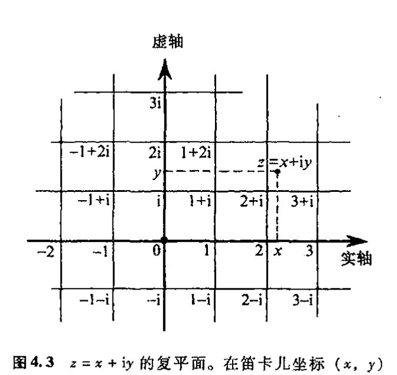
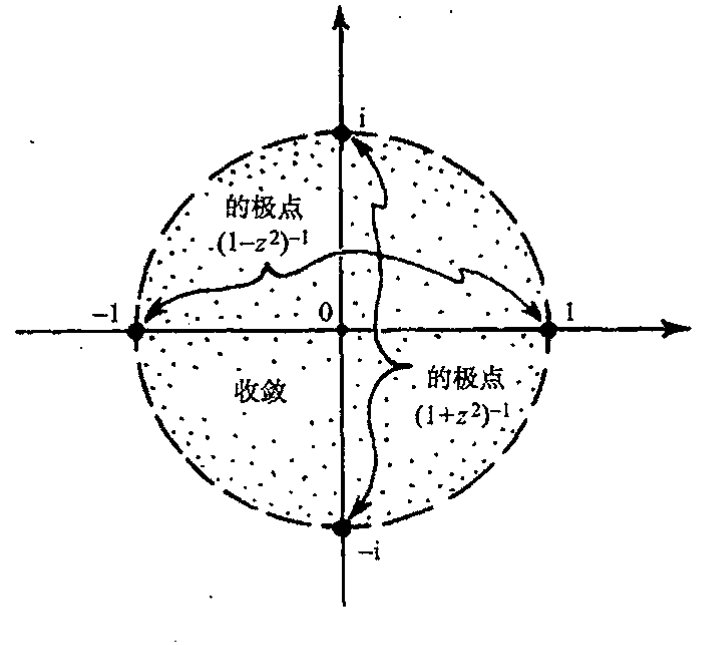

<!-- page 67 -->

通向实在之路

第四章

# 奇幻的复数

71 4.1 魔数 “i”

如果 $-1$ 有平方根会怎样？正数的平方总是正数，负数的平方也是正数（$0$ 的平方还是 $0$，因此我们几乎不用它）。我们发现，似乎不可能找到一个数其平方是负数。但这只是我们以前看到的情形，就像我们宣称 $2$ 在有理数系内没有平方根一样。在那种情形下，我们是通过将有理数系扩大到更大的数系来解决问题的，这个更大的数系就是实数系。现在这个法子应该还会有效。

它确实是有效的。实际上我们现在要做的要比从有理数扩大到实数所需做的容易得多，也远没有那么彻底。（1545 年，卡尔达诺（Gerolamo Cardano，1501 – 1576）在其著作《大术》中首次介绍了复数概念，随后，邦贝利（Raphael Bombelli，约 1528 – 约 1571）于 1572 年在其《代数》一书中引入了复数的运算方法。）我们需要做的就是引入一个称作为 “i” 的量，它是 $-1$ 的平方根，将它附在实数系上，这样 i 与实数结合组成如下表达式

$$a + ib,$$

这里 $a$ 和 $b$ 是任意实数。任何这样的组合都称作复数。易见复数的加法为：

$$(a + ib) + (c + id) = (a + c) + i(b + d)$$

形式上它与以前的一样（不过是用 $a + c$ 和 $b + d$ 取代了原先表达式中的 $a$ 和 $b$）。那乘法呢？这也容易。我们来看看怎么将 $a + ib$ 乘以 $c + id$。首先我们按代数的一般法则得到二者相乘的展开式：¹

$$(a + ib)(c + id) = ac + ibc + aid + ibid$$
$$= ac + i(bc + ad) + i^2 bd$$

由于 $i^2 = -1$，因此我们可将上式写成

$$(a + ib)(c + id) = (ac - bd) + i(bc + ad),$$

72 它与我们原先的 $a + ib$ 具有相同的形式，只不过是 $ac - bd$ 取代了 $a$，$bc + ad$ 取代了 $b$。

两复数相减也极为简单，但相除呢？我们知道，在通常的算术运算里，任何不为零的实数都

·48·

<!-- page 68 -->

# 第四章 奇幻的复数

可以作除数。现在我们就来试着用复数 $a+ib$ 除以复数 $c+id$。我们必须将后者看成非零项，这意味着 $c$ 和 $d$ 不能同时为零。故 $c^2+d^2>0$ 因此 $c^2+d^2\neq0$ 这样我们就可以用 $c^2+d^2$ 作除数。大家可通过直接练习*〔4.1〕来检验（下式两端同乘以 $c+id$）

$$\frac{(a+ib)}{(c+id)}=\frac{ac+bd}{c^2+d^2}+\mathrm{i}\,\frac{bc-ad}{c^2+d^2}.$$

这个形式也与原先的基本相同，因此也是一个复数。

当我们熟悉了这种复数的演算，我们就不再将 $a+ib$ 看成是一对数即两个实数 $a$ 和 $b$，而是一个完整的数，我们用符号 $z$ 来表示它：$z=a+ib$。可以验证，复数满足所有的代数运算规则。**〔4.2〕事实上，所有这些做起来比验证实数的每一项法则要直接得多。（对于这种验证，我们回顾一下分数所满足的代数法则就会充满信心，然后再用戴德金的“切口”来说明这些法则对实数也适用。）从这个观点看，人们对复数的疑虑持续了这么长时间，而远为复杂的从有理数到实数的扩展则在古希腊时代之后被毫不怀疑地普遍接受，这似乎很不正常。

73

推测起来，出现这种疑虑大概是因为当时人们“看”不到复数在当今物理世界里表现出的那种作用。在实数情形，我们看到，距离、时间和其他物理量都显示出对这种性质的数的需要；但复数则似乎仅仅是由那些试图得到比以往更大的数域的数学家的想象产生的一种发明。但从 §3.3 我们知道，数学上的实数与长度或时间等物理概念的联系并非如我们想象的那么清楚。我们无法直接看清戴德金切口的细节，也不清楚任意大或任意小的时间或长度在自然界是否真的存在。我们只能说，所谓“实数”，其实和复数一样也是数学家头脑的产物。但我们会发现，复数、实数甚至更多种类的数都属于一个具有惊人性质的共同体。就好像大自然本身也和我们一样，对复数系的范围和协调性留有深刻印象，于是将这个世界在最小尺度上的精确运行托付给了它。在 21~23 章，我们将更深入细致地看到它是怎么工作的。

应当说，只谈及复数的范围和协调性对这个数系来说是不公正的。在我看来，它还具有更多的只能用“魔力”来形容的品质。在本章余下部分和随后的两章，我将尽量让读者领略这种魔力的奇幻性。然后在第 7~9 章，我们再来见证复数最奇特、最出乎意料的那些方面。

在复数为人所知的过去这四百年里，复数的许多神奇性质开始逐渐显露出来。要说人们早就知道数学里有这么一种数，而且其作用和深刻的数学洞察力是单独使用实数所根本无法实现的，这一点本身就是个奇迹。我们没有任何理由期望物理世界会关照它。自卡尔达诺和邦贝利引入这些数以来，350 年过去了，其间纯粹是其数学上的作用才使人们感知到复数的神奇。毫无疑问，对所有那些对复数持怀疑态度的人来说，当他们得知，按 20 世纪最新的三夸克物理理论，在最小尺度上支配这个世界的行为规律的正是复数系时，不啻于晴天霹雳。

---

*〔4.1〕做做看。

**〔4.2〕验证这一点，相关法则为 $w+z=z+w$，$w+(u+z)=(w+u)+z$，$wz=zw$，$w(uz)=(wu)z$，$w(u+z)=wu+wz$，$w+0=w$，$w1=w$。

·49·

<!-- page 69 -->

通向实在之路

这些内容将是本书后半部分的中心议题（特别是第21～23章）。眼下我们关注的是复数的数学魔力，物理魔力留待以后再说。截至目前，我们所做的只是要求-1有平方根，且要求保留通常的算术运算法则，我们已经断言，这些要求是能够得到协调一致的满足的。它看起来并不难做到。但的确是个奇迹！

## 4.2 用复数解方程

74

在以下讨论中，我认为有必要引入更多的数学记号。对此我很抱歉。但是，不运用适当数量的记号，要认真讲清楚数学概念几乎是不可能的。我知道我们有很多对此反感的读者。对这些读者我的忠告是，只读文字，别太在意方程。最多也就浏览一遍就过去。本书里确实零散地分布有不少数学表达式，尤其是在后面的一些章节。我猜想即使你不打算彻底搞懂所有这些公式实际意味着什么，你还是能够理解全书的大部分内容。我希望如此，因为复数的魔力是一种特别值得欣赏的奇迹。如果你能运用数学记号，那么效果会更好。

首先，我们要问，其他的数有没有平方根？例如-2的平方根是什么意思？这很好解释。复数 $i\sqrt{2}$ 就是 $-2$ 的平方根，而且 $-i\sqrt{2}$ 也是。进一步说，对任何正实数 $a$，复数 $i\sqrt{a}$ 和 $-i\sqrt{a}$ 都是 $-a$ 的平方根。真正的魔力不在这里。但当我们考虑一般的复数 $a+ib$（这里 $a$ 和 $b$ 是任意实数）时情况会是怎样的呢？我们发现，复数

$$\sqrt{\frac{1}{2}\left(a+\sqrt{a^{2}+b^{2}}\right)} + i\sqrt{\frac{1}{2}\left(-a+\sqrt{a^{2}+b^{2}}\right)}$$

的平方就是 $a+ib$（它的负值也如此）。\*[4.3] 由此我们看到，即使只在单个量（即 $-1$）上附加了一个平方根，其结果里的每一个数也会自动出现平方根！这是我们在从有理数过渡到实数的讨论中不曾遇到过的事情。在那种情形下，仅仅是向有理数系引入一个 $\sqrt{2}$ 都会使我们无所适从。

但这只是刚刚开始。我们可以接着问三次根、五次根、999次根、第 $\pi$ 次根——甚至第 $i$ 次根。我们惊奇地发现，不论选什么样的复数根，也不论我们用的是什么样的复数（零除外），这个问题总有一个复数解。（事实上，正如我们将看到的，这个问题通常有许多不同的解。前面我们说过，对平方根可得到两个解，复数 $z$ 的负平方根也是 $z$ 的平方根。对开高阶次方会得到更多的解，见 §5.4。）

75

我们还只接触到复数魔力的皮毛。我刚刚陈述的只是些非常简单的东西（一旦我们有了复数的对数概念的话，见第5章）。更有意思的当属所谓“代数基本定理”，它是说，像

$$1 - z + z^{4} = 0$$

或

---

\*[4.3] 验证这一点。

·50·

<!-- page 70 -->

**第四章 奇幻的复数**

$$\pi + iz - \sqrt{417}z^3 + z^{999} = 0,$$

这样的任意多项式方程必有复数解。说得更明白点，形如

$$a_0 + a_1z + a_2z^2 + a_3z^3 + \cdots + a_nz^n = 0$$

这样的方程必有解（通常是几个不同的解），这里 $a_0, a_1, a_2, a_3, \cdots, a_n$ 是给定的复数，且 $a_n$ 不为零。²（这里 $n$ 可以取任意大的正整数。）作为比较，我们来回顾一下 i 的引进过程。实际上，引进 i 就是为了给出特定方程

$$1 + z^2 = 0$$

的解，并未作其他考虑。

在作进一步论述之前，我们有必要指出，自 1539 年前后，卡尔达诺首次知道了复数并受到其神奇性质的启发后，他一直关注着这样一个问题，那就是找出（实）三次方程（即上述的 $n=3$）的一般解的表达式。卡尔达诺发现，一般的三次方程总可以通过简单代换缩并为

$$x^3 = 3px + 2q$$

形式。这里 $p$ 和 $q$ 都是实数，我们将这个方程写成关于 $x$ 而不是 $z$ 的方程，只是要表明现在考虑的是实数解而不是复数解。卡尔达诺的复数解（见他 1545 年发表的《大术》一书）似乎是由他于 1539 年从尼古拉·丰塔纳（Nicolò Fontana，“塔尔塔利亚”〔1〕）的部分解发展而来，虽然这个部分解（也许甚至是完整解）早先（1526 年以前）已由费罗（Scipione del Ferro, 1465–1526）发现。³（费罗–）卡尔达诺解大致如下（按现代记法）：

$$x = (q+w)^{\frac{1}{3}} + (q-w)^{\frac{1}{3}},$$

这里

$$w = (q^2 - p^3)^{\frac{1}{2}}.$$

如果

$$q^2 \geqslant p^3,$$

那么这个方程在实数系下没有任何问题。这时方程只有一个实数解，就是上面的（费罗–）卡尔达诺公式正确给出的解。但如果

$$q^2 < p^3$$

即所谓不可约情形，那么尽管方程存在 3 个实数解，但上面公式里却包含了负数 $q^2 - p^3$ 的平方根，因此不引入复数是不可能做到的。实际上，正如邦贝利后来证明的（见他 1572 年出版的《代数》第 2 章），如果我们承认复数，那么所有 3 个实数解都可由上述公式正确地表示。⁴（这是说得通的，因为该公式提供了叠加了的两个复数，它们的 i 部分在求和中相互抵消，从而给出实数解。⁵）这里神秘的是，尽管这个方程看上去与复数无关——方程有实系数，解也是实的

76

---

〔1〕 Tartaglia，意为“口吃者”。——译注

·51·

<!-- page 71 -->

通向实在之路

---

（在“不可约情形”下）——但我们需要到复数领地里走一遭才能得到纯粹的实数解。如果我们固守直接但狭窄的“实数”途径，则只能是两手空空而回。（具有讽刺意味的是，如果公式里不涉及复数，则原方程的复数解就只能是这些情形。）

## 4.3 幂级数的收敛

尽管存在这些事实，可我们在感受复数魔力方面并没有走得太远。还有更多的问题有待考察！例如，其中复数堪称无价的一个领域就是弄清所谓幂级数的性态。幂级数是指如下形式的无穷和

$$a_0 + a_1 x + a_2 x^2 + a_3 x^3 + \cdots$$

由于这个和涉及到无穷多项，级数很可能是发散的，就是说，我们在求和时逐渐增加其项数，将得不到一个具体有限的值。例如，考虑级数

$$1 + x^2 + x^4 + x^6 + x^8 + \cdots$$

77

（这里我取 $a_0=1$，$a_1=0$，$a_2=1$，$a_3=0$，$a_4=1$，$a_5=0$，$a_6=1$，$\cdots$）。如果我们令 $x=1$，则依次加和每一项，有

$$1,\ 1+1=2,\ 1+1+1=3,\\1+1+1+1=4,\ 1+1+1+1+1=5,\ \text{等等}$$

我们看到，这个级数不可能趋近某个具体有限值，即它是发散的。更糟糕的是，例如当我们取 $x=2$ 时，由于每一项都比以前更大，故逐次加起来有

$$1,\ 1+4=5,\ 1+4+16=21,\ 1+4+16+64=85,\ \text{等等}$$

它显然也是发散的。另一方面，如果我们取 $x=\dfrac{1}{2}$，则有

$$1,\ 1+\frac{1}{4}=\frac{5}{4},\ 1+\frac{1}{4}+\frac{1}{16}=\frac{21}{16},\ 1+\frac{1}{4}+\frac{1}{16}+\frac{1}{64}=\frac{85}{64},\ \cdots$$

可以证明，这些值越来越趋近于极限值 $\dfrac{4}{3}$，因此级数是收敛的。

由这个级数我们不难理解，一定意义上说，级数 $x=1$ 和 $x=2$ 必定是发散的，而 $x=\dfrac{1}{2}$ 则收敛到 $\dfrac{4}{3}$，因为我们能够清楚地写出整个级数的和的答案：*〔4.4〕

$$1 + x^2 + x^4 + x^6 + x^8 + \cdots = (1-x^2)^{-1}$$。

当代入 $x=1$，我们得到答案 $(1-1^2)^{-1}=0^{-1}$，它是“无穷大”，^6 这就解释了为什么级数在 $x$ 的这个值处必定发散。当我们代入 $x=\dfrac{1}{2}$，得到答案 $\left(1-\dfrac{1}{4}\right)^{-1}=\dfrac{4}{3}$，级数确实收敛到这个特定值。

*〔4.4〕你能看出如何验证这个表达式吗？

·52·

<!-- page 72 -->

# 第四章　奇幻的复数

所有这些看似非常合理。那对 $x=2$ 又如何呢？如果代人公式，“答案”是 $(1-4)^{-1}=-\frac{1}{3}$，虽然我们知道直接相加级数各项不可能得到这个值，因为我们加的都是正的项，而 $-\frac{1}{3}$ 是负的。级数发散的理由是，当 $x=2$ 时，级数的每一项实际上都比 $x=1$ 时级数的相应各项要大。在 $x=2$ 情形，问题不在于“答案”一定是无穷大，而是我们根本无法直接通过级数求和来得到答案。在图 4.1 中，我画了这个级数的部分和（即对有限项求和），并给出了“答案” $(1-x^2)^{-1}$，我们看到，

**图 4.1** $(1-x^2)^{-1}$ 级数的部分和 $1, 1+x^2, 1+x^2+x^4$，$1+x^2+x^4+x^6$。图中显示了 $(1-x^2)^{-1}$ 在 $|x|<1$ 收敛和在 $|x|>1$ 发散。

只要 $x$ 严格$^7$限定在 $-1$ 和 $+1$ 之间，部分和的曲线就如预料的确实收敛到这个答案，即 $(1-x^2)^{-1}$。但在这个区域之外，级数则是发散的，不可能趋向任何有限值。

虽然这有点儿离题，但它有助于我们讲清下面这个重要问题。我们要问的是：将 $x=2$ 代入上述表达式所得到的结果，即

$$1+2^2+2^4+2^6+2^8+\cdots=(1-2^2)^{-1}=-\frac{1}{3}$$

有何意义？18 世纪的大数学家欧拉（Leonhard Euler）经常就这么写方程，大家拿他的这种荒谬来取笑在当时曾是一种时髦，而人们原谅他归根结底是因为在那个时候对级数“收敛”这样的问题谁都没有恰当的处理办法。事实上，级数严格的数学处理要等到 18 世纪末 19 世纪初通过柯西（Augustin Cauchy）和其他人的工作才有可能。而按照严格的数学处理，上述方程将被归于“无意义”一类。但我认为重要的是在适当意义上对它的作用做出评估，欧拉在写下这些明显谬误的方程时实际上是知道自己在做什么的，从这个意义上来说，这些方程应被看成是“正确的”。

在数学上，要求某人的方程必须有严格准确的意义这是绝对含糊不得的。但是，对那些有可能最终导致更深刻理解的“探索现象背后的事情”抱宽容态度也同样重要。如果过分追求逻辑上的严格，就很容易对事情看走眼。谁都知道，正数项的和 $1+4+16+64+256+\cdots$ 不可能等于 $-\frac{1}{3}$。相关的例子还可以举出求方程 $x^2+1=0$ 的实数解，它无解，但如果我们就这样把它丢在一边了，我们就会错过由复数的引入所带来的对数系的更深刻的理解。这种认识同样适用于如何看待求 $x^2=2$ 的有理数解的荒谬性问题。实际上，我们完全有可能给上述无穷级数的答案 “$-\frac{1}{3}$” 以一种数学解释，只是要十分小心，知道哪些是可以做的哪些是不可以做的。具体讨论

<!-- page 73 -->

通向实在之路
============

这些事情不是我们的目的，⁸ 但有必要指出，在现代物理里，尤其是在量子场论领域，这种性质的发散级数比比皆是（具体见 §§26.7, 9 和 §§31.2, 13）。要确定这样得到的“答案”是否有实际意义，或是否正确，这可是个非常有讲究的活儿。有时会有这样的事情：通过发散表达式得到的极为精确的答案很偶然地在与物理实验结果的比较中被确认了。但更多的则经常是不走运。这些微妙的处理在现代物理理论中起着非常重要的作用，人们经常在评估理论时用到它。与我们这里的讨论直接相关的是，这种对如此明显的无意义表达式的“感觉”经常取决于复数的性质。

现在我们回到级数收敛的问题上来，看看如何使复数适用于这种情形。为此，我们来考虑一个与 $(1-x^2)^{-1}$ 稍有些不同的函数 $(1+x^2)^{-1}$，看看它是否有一个合理的幂级数展开式。我们的运气不错，撞上了一个完全收敛的情形，因为 $(1+x^2)^{-1}$ 在整个实数范围内是光滑的并且是有限的。 $(1+x^2)^{-1}$ 的幂级数十分简单，只是与我们前面遇到的稍有不同：

$$1 - x^2 + x^4 - x^6 + x^8 - \cdots = (1+x^2)^{-1},$$

差别就在于现在是隔项改变符号。*[4.5] 在图 4.2 中，我像前面做的那样，分别画出了直到级数前五项的部分和以及答案 $(1+x^2)^{-1}$。

图 4.2 $(1+x^2)^{-1}$ 级数的部分和 $1, 1-x^2, 1-x^2+x^4$, $1-x^2+x^4-x^6, 1-x^2+x^4-x^6+x^8$。图中显示了 $(1+x^2)^{-1}$ 在 $|x|<1$ 收敛和在 $|x|>1$ 发散，尽管事实上函数在 $x=\pm 1$ 处性态良好。

80

令人惊讶的是，部分和仍只在 $x$ 处于 $-1$ 和 $+1$ 之间时收敛到答案。对于在这之外的 $x$，级数仍是发散的，尽管此时答案未必是无穷大，这与前面的情形不尽相同。我们可以用同样的三个值 $x=1, x=2, x=\frac{1}{2}$ 来检验这一点。我们发现，同前面一样，只在 $x=\frac{1}{2}$ 的情形下级数才收敛，且正确收敛到整个级数和的极限值 4/5：

$$x=1: 1, 0, 1, 0, 1, 0, 1, \cdots,$$
$$x=2: 1, -3, 13, -51, 205, -819, \cdots,$$
$$x=\frac{1}{2}: 1, \frac{3}{4}, \frac{13}{16}, \frac{51}{64}, \frac{205}{256}, \frac{819}{1024}, \cdots$$

我们注意到，第一种情形下的“发散”其实是级数部分和的不确定，虽然它们实际上并不趋于无穷。

因此，仅就实数范围来说，级数的实际求和与直接取得“答案”（有可能是无穷大）之间存在着令人迷惑的差异。部分和在同一位置 $(x=\pm 1)$ 存在“跳跃”（或者说，存在剧烈的上下摆动），以前我们就遇到过这种麻烦，只是现在无穷和的答案，即 $(1+x^2)^{-1}$，在这些地方没有显示

---

*[4.5] 你能看出这两个级数之间具有简单关系的基本原因吗？

· 54 ·

<!-- page 74 -->

第四章 奇幻的复数

出什么值得注意的特征。如果我们检查这个函数的复值而不是仅局限于实值，这个谜团就解开了。

## 4.4 韦塞尔复平面

为了看清这里发生的事情，我们需要用到标准欧几里得平面下的复数几何表示。韦塞尔（Caspar Wessel，1797）、阿尔冈（Jean Robert Argand，1806）、沃伦（John Warren，1828）和高斯（Carl Friedrich Gauss，1831 年之前）都曾独立地提出过复平面（见图 4.3）的思想，他们清楚地给出了复平面上复数加法和乘法的几何解释。在图 4.3 中，我用了标准的笛卡儿坐标系，$x$ 轴水平地指向右，$y$ 轴垂直地指向上。复数

$$z = x + iy$$

由平面上笛卡儿坐标点 $(x, y)$ 来表示。

现在我们来考虑实数 $x$，它相当于复数 $z = x + iy$ 在 $y = 0$ 时的特殊情形。由此我们认为图中的 $x$ 轴代表实线（即沿直线线性有序排列的全部实数）。这样，复平面直接向我们展示了实数系如何扩展成为完整的复数系的图像表示。这条实线通常被称为复平面上的“实轴”。相应地，$y$ 轴被称为“虚轴”，它由全体实数乘以 $i$ 组成。

图 4.3 $z = x + iy$ 的复平面。在笛卡儿坐标 $(x, y)$ 下，水平地向右伸展的 $x$ 轴叫实轴；垂直向上的 $y$ 轴叫虚轴。

现在我们回到此前表示为幂级数的两个函数上来。过去我们将它们看成是实变量 $x$ 的函数，即 $(1 - x^2)^{-1}$ 和 $(1 + x^2)^{-1}$，但现在我们要对其加以扩展，使其适用于复变量 $z$。这么做并没有什么困难，只需简单地分别写成 $(1 - z^2)^{-1}$ 和 $(1 + z^2)^{-1}$ 即可。在前一个实函数情形 $(1 - x^2)^{-1}$，我们很容易看出“发散”的原因出在哪里，因为函数在 $x = -1$ 和 $x = +1$ 两个位置上是奇异的（即变得无穷大）；但对 $(1 + x^2)^{-1}$，则在这两个位置上非奇异，函数完全没有实奇点。然而，从复变量 $z$ 角度看，这两个函数则要彼此对等得多。$(1 - z^2)^{-1}$ 在自原点始实轴的单位长度位置 $z = \pm 1$ 上有奇点，而现在 $(1 + z^2)^{-1}$ 也有两个奇点，位置分别在 $z = \pm i$（因为 $1 + z^2 = 0$），即自原点始虚轴的单位长度的两个位置上。

但这些复奇点怎么用来解决幂级数的收敛和发散问题呢？我们有个绝好的办法。现在，我们将幂级数看成是复变量 $z$ 而非实变量 $x$ 的函数，我们来看看在复平面 $z$ 的哪些位置上级数收敛或发散。一般认为，^9 对于任意幂级数

$$a_0 + a_1 z + a_2 z^2 + a_3 z^3 + \cdots,$$

在复平面上总存在以原点 $0$ 为中心的某个圆，称为收敛圆，它具有这样的性质：如果复数 $z$ 严格

<!-- page 75 -->

通向实在之路

处于圆内，则级数收敛到 $z$ 点的值；如果 $z$ 严格处于圆外，则级数在 $z$ 点发散。（当 $z$ 恰巧处于圆上，此时级数是收敛还是发散是个较为微妙的问题，这里不想多说，尽管这个问题与 §§9.6, 7 将要讨论的问题有一定的联系。）现在我们涉及两种在非零 $z$ 值处级数发散的极限情形，一种是收敛圆收缩为零半径的情形，另一种是收敛圆扩展到无穷大半径的情形，此时在所有 $z$ 点级数都收敛。要找出某个特定函数的收敛圆实际区域，我们可观察一下函数的奇点在复平面的什么位置，为此，我们以原点 $z=0$ 为中心，画一个不包含奇点的尽可能大的圆（即最接近原点的奇点画圆）。

具体到 $(1-z^2)^{-1}$ 和 $(1+z^2)^{-1}$ 情形，奇点是所谓极点这种简单类型（出现于某个多项式中，但其倒数形式则没有）。这里这些极点都位于原点的单位距离上。我们看到，在两种情形下，收敛圆都是以原点为中心的单位圆。二者在实轴上的点相同，均为 $z=\pm 1$（见图 4.4）。这就解释了为什么两个函数在同一区域内会有同样的收敛和发散性质——事实上这个性质在从实变量函数来看表现得并不明显。因此，复数为我们提供了洞察级数性态的深刻的理解力，这是实变量函数所不具备的。

**图 4.4** 在复平面内，函数 $(1-z^2)^{-1}$ 和 $(1+z^2)^{-1}$ 有相同的收敛圆，前者在 $z=\pm 1$ 处有极点，后者在 $z=\pm i$ 处有极点，所有这些极点都距原点等（单位）距离。

## 4.5 如何构造曼德布罗特集

为结束本章，让我们来看看另一种类型的收敛/发散问题。这就是我们在 §1.3 和图 1.2 描述的所谓曼德布罗特集这样一种异乎寻常的基础结构。实际上，这只是韦塞尔复平面的一个子集，它可以以一种相当简单的方式来定义，尽管这个集合看上去极为复杂。我们要做的就是检验下列代换的重复应用：

$$z \mapsto z^2 + c,$$

这里 $c$ 是某个取定的复数。我们可将 $c$ 看成是以 $z=0$ 为原点的复平面上的一点。于是，我们迭代这个代换就能看到点 $z$ 在复平面上的行为。如果它趋向无穷，那么给点 $c$ 着白色；如果 $z$ 限定在某个区域内而不趋向无穷，我们就给点 $c$ 着黑色。黑色区域给出的就是曼德布罗特集。

让我们更具体地描述这一过程。怎么进行迭代呢？首先，我们固定 $c$，然后取一点 $z$，作代换，于是 $z$ 变成了 $z^2+c$。再次代换，即用 $z^2+c$ 取代 $z^2+c$ 里 “$z$” 的位置，我们得到 $(z^2+c)^2+c$。再用 $(z^2+c)^2+c$ 取代 $z^2+c$ 里“$z$”的位置，于是表达式变成 $((z^2+c)^2+c)^2+c$。再用 $((z^2+c)^2$

<!-- page 76 -->

## 第四章 奇幻的复数

$+c)^2 + c$ 取代 $z^2 + c$ 里“$z$”的位置，我们得到 $(((z^2+c)^2+c)^2+c)^2+c$，等等。

现在我们来看看如果令 $z=0$ 并作这种迭代会出现什么情况。这时得到的是如下序列：

$$0, c, c^2+c, (c^2+c)^2+c, ((c^2+c)^2+c)^2+c, \cdots$$

它给出复平面上的一个点列。（在计算机上，我们可以每次独立地选择一个复数 $c$ 来纯粹数值地做此演算，而不是用上述代数表达式。从计算上考虑，每次都重新做算术运算显然要“便宜”得多。）现在，对给定的 $c$ 值，两件事必发生其一：（i）序列里的点逐渐距离原点越来越远，也就是说，序列是无界的，或者（ii）每个点都处于复平面上某个距原点一定距离的范围之内（即处于关于原点的某个圆内），也就是说，序列是有界的。图 1.2a 的白色区域就是 $c$ 的位置给出的无界序列（i），而黑色区域则是满足有界情形（ii）的 $c$ 的位置，即曼德布罗特集。

曼德布罗特集起因于这样一个事实：存在许多种不同的而且经常是高度纠缠的方式使得被迭代的序列保持有界。我们可以有各种圆和“几乎”为圆的精心组合，它们以各种巧妙的方式散布在平面上——但要从细节上搞懂这个集的异乎寻常的复杂性，就需要涉及复分析和数论的具体内容，这无疑就走得太远了。有兴趣的读者可参考 Peitgen and Richter（1986）、Peitgen and Saupe（1988）来了解更多的内容和图像（亦见 Douady and Hubbard，1985）。

## 注 释

85

**§4.1**

4.1　这些结果见练习 [4.2]。

**§4.2**

4.2　这是任何单参数 $z$ 的复多项式因式分解为线性因子

$$a_0 + a_1 z + a_2 z^2 + \cdots + a_n z^n = a_n (z-b_1)(z-b_2)\cdots(z-b_n)$$

的直接结果，*[2.1] 这个结果通常称为“代数基本定理”。

4.3　有个故事说，在卡尔达诺发誓保守秘密的条件下，塔尔塔利亚曾将这个部分解透露给卡尔达诺。这样，如果信守诺言，卡尔达诺就不能发表他的一般解。然而在这之后，1543 年，卡尔达诺到波伦亚作了次旅行，检查了费罗的遗稿并确信，这些解实际上是费罗的遗产。卡尔达诺认为这给了他发表所有这些结果的自由。1545 年，卡尔达诺在《大术》一书中发表了这些结果（并对塔尔塔利亚和费罗表示了致谢）。塔尔塔利亚不同意这种做法，这场争论产生了非常恶劣的后果（见 Wykes 1969）。

4.4　进一步了解请见 van der Waerden（1985）。

4.5　其理由是，我们将两个彼此复共轭的复数相加（见 §10.1），得到的和总是一个实数。

**§4.3**

4.6　从注释 2.4 可知，$0^{-1}$ 即 $\frac{1}{0}$，这种非法运算的“结果”可以方便地表示为“$0^{-1}=\infty$”。

4.7　“严格”意味着端点值不包括在这个范围内。

4.8　进一步信息见，例如，Hardy（1940）。

**§4.4**

4.9　例如，见 Priestly（2003），71 页——指“收敛半径”——和 Needham（2002），67 页，264 页。

---

**[4.6]** 证明这一点。（提示：证明，只要用 $z=b$ 是给定方程的解，那么这个多项式“除以” $z-b$ 就不会有余项。）

·57·
