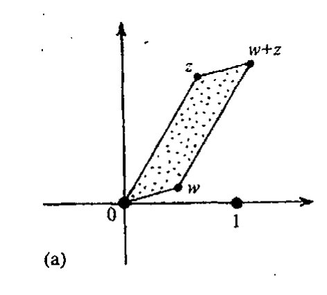
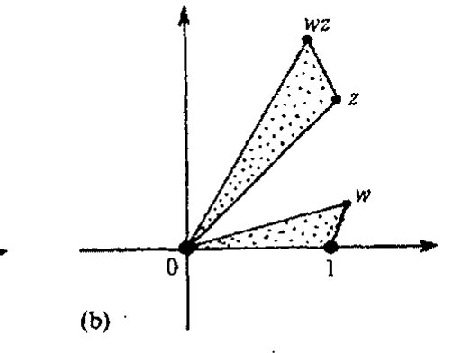
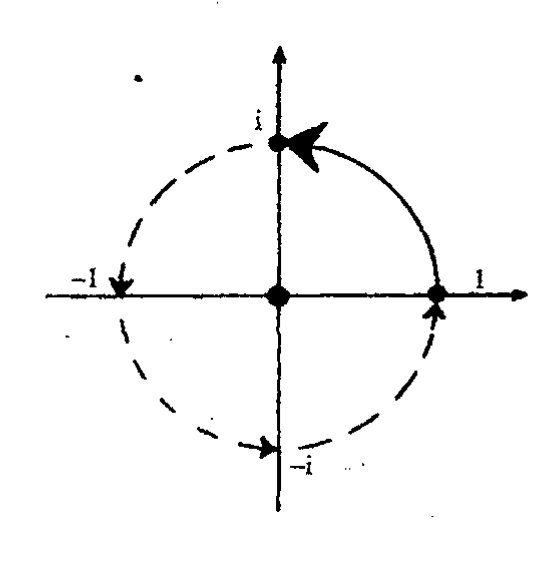
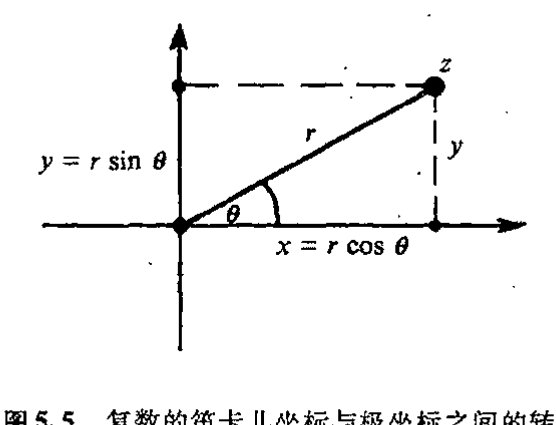
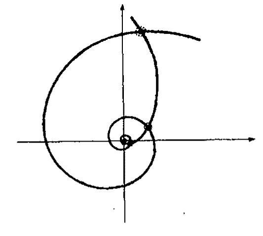
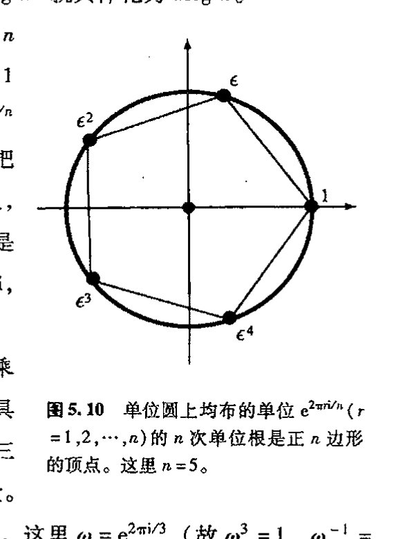

<!-- page 77 -->

通向实在之路

**第五章**

# 对数、幂和根的几何

## 5.1 复代数几何

86　　上章末讨论的复数的神奇性质包括许多方面，现在我们回头再看看其中更为基础的一些要素。首先，我们来看 §4.1 的加法和乘法规则在复平面上如何几何地表示出来。我们可以分别用[图 5.1](assets/page078_fig01.jpg)(a),(b) 的平行四边形法则和相似三角形法则来表示它们。具体来说，对于两个一般的复数 $w$ 和 $z$，点 $w+z$ 和 $wz$ 分别由以下命题确定：

点 $0$, $w$, $w + z$, $z$ 分别是平行四边形的四个顶点，

且

顶点为 $0$, $1$, $w$ 的三角形和顶点为 $0$, $z$, $wz$ 的三角形相似。

87　　（这里采用通常约定的逆时针周线取向。我的意思是说，我们沿平行四边形逆时针转一圈，从 $w$ 到 $w+z$ 的线段平行于 $0$ 到 $z$ 的线段，等等；此外，三角形间的相似关系不考虑“反射”因素。并且容许存在三角形和平行四边形按不同方式退化的特殊情形。\*\*〔5.1〕）感兴趣的读者可以用三角学和直接计算来检验这些运算法则。\*\*〔5.2〕但是，我们还有其他办法来看待这些关系，它们可以免去具体计算，而且更具洞察力。

我们先来考虑将整个复平面映射到自身的不同映射（或“变换”）的加法和乘法。任意给定的复数 $w$ 定义了一种“加法映射”和一种“乘法映射”，它们是这样的运算：当作用于任意复数 $z$ 时，前者为将 $w$ 加到 $z$ 上，后者为取 $w$ 和 $z$ 的积，就是说，

$$z \mapsto w+z \qquad \text{和} \qquad z \mapsto wz。$$

很容易看出，加法映射就是不加转动地沿复平面滑行或改变其大小或形状——一种平移变换

---

\*\*〔5.1〕 检验这些不同的可能性。

\*\*〔5.2〕 不妨试试。

·58·

<!-- page 78 -->

# 第五章 对数、幂和根的几何

---

图 5.1 复代数基本法则的几何描述。(a) 加法的平行四边形法则：0，w，w+z，z分别给出平行四边形的四个顶点。(b) 乘法的相似三角形法则：顶点为0，1，w的三角形和顶点为0，z，wz的三角形相似。

（见[§2.1](chapter_02.md#21-毕达哥拉斯定理)）——将原点0移至点w；见图5.2(a)。平行四边形法则就是对这种情形的复数。但什么是乘法映射呢？它是一种保持原点和形状不变的变换——将点1变换到点w。在一般情形下，它包括具有均匀扩展（或收缩）的（非反射）转动变换，见图5.2(b)。***[5.3]相似三角形法则有效地表明了这一点。这个映射对于我们在[§8.2](chapter_08.md#82-共形映射)的讨论有重要意义。

图5.2 (a) 加法映射“+w”提供了复平面从0到w的平移。(b) 乘法映射“×w”提供复平面关于0的转动和从1到w的扩展（或收缩）。

88

在特定的w = i的情形，乘法映射就是按右手法则（即逆时针）转过一个直角（π/2）。如果我们两次运用这一运算，则转过π，它相当于关于原点对称的反射变换；换句话说，这种乘法映射就是将每个复数z变换到其负值。它是“神秘”方程i² = -1的图像表示（图5.3）。“乘以i”的运算是通过几何上“转过一个直角”的变换来实现的。按这种观点看，这种运算的“平方”（即操作两次）似乎并不神秘，不过就是“取负值”。自然，这种观点并未除去笼罩在复代数为什么如此有效这一点上的魔力和神秘面纱，也不能告诉我们这些数的清楚的物理意义。例如，我们可以问：为什么只是平面转动，三维下情形如何？以后特别是在 [§11.2](chapter_11.md#112-四元数的物理角色), 3、[§18.5](chapter_18.md#185-作为黎曼球面的天球)、

---

***[5.3] 试不做具体计算也不用三角学来验证这一点。（提示：这是“分配律”w(z₁ + z₂) = wz₁ + wz₂的结果，它说明复平面保“线性”结构，而w(iz) = i(wz)则说明转过一个直角的转动是保角的，即直角在转动中保持不变。）

·59·

<!-- page 79 -->

通向实在之路

[§21.6](chapter_21.md#216-什么是量子实在), 9、[§22.2](chapter_22.md#222-u-的线性性以及它给-r-带来的问题), 3, 8—10、[§33.2](chapter_33.md#332-作为光线的扭量)和[§34.8](chapter_34.md#348-通向实在的漫长的数学之路)等章节，我将讨论这个问题的不同方面。

在复数的平面描述中，我们对平面上的点用的是标准的笛卡儿坐标$(x,y)$，但我们也可以用极坐标$[r,\theta]$。这里正实数$r$度量自原点始的距离，角度$\theta$度量直线自原点到点$z$的实轴按逆时针方向转过的角度，见图5.4(a)。量$r$也叫作复数$z$的模，我们经常写作

$$r = |z|,$$

$\theta$叫做幅角（在量子力学里，有时也称作相角）。对$z=0$点，我们不考虑其幅角$\theta$，但仍定义$r$为自原点的距离，此时就是$r=0$。

为清楚起见，我们可要求$\theta$的主值处于一定的象限范围内，例如$-\pi < \theta \leqq \pi$（这是标准约定）。同时我们也可以认为对幅角增加$2\pi$的整数倍而其效果不变。这使我们能够在度量角度时可以不论正反方向绕原点转任意圈（见图5.4(b)）。（这第二种观点实际上是一种更深刻的观点，它的意义我们不久就会知道。）由图5.5和基本三角函数关系我们看到，

$$x = r \cos \theta \qquad \text{和} \qquad y = r \sin \theta,$$

反过来有

$$r = \sqrt{x^2 + y^2} \qquad \text{和} \qquad \theta = \arctan \frac{y}{x},$$

![图5.4 (a) 笛卡儿坐标$(x,y)$到极坐标$[r,\theta]$的转换，我们有$z=x+iy=re^{i\theta}$，其中模$r=|z|$是自原点始的距离，幅角$\theta$是直线自原点到点$z$的实轴按逆时针方向转过的角度。(b) 如果$\theta$的主值范围取$-\pi>\theta\leqq\pi$，我们可容许$z$绕原点转动任意圈、$\theta$增加$2\pi$的整数倍而意义不变。](assets/page079_fig02.jpg)

<!-- page 80 -->

第五章 对数、幂和根的几何

这里 $\theta=\tan^{-1}(y/x)$ 量度多值函数 $\tan^{-1}$ 的某个特定值。（对那些已忘了三角函数的读者，前两个式子不过是直角三角形中一个角的正弦和余弦函数的复述："角的余弦等于邻边比上斜边"，"角的正弦等于对边比上斜边"，$r$ 就是斜边；后两个式子表示的是毕达哥拉斯定理的逆形式："角的正切等于对边比上邻边"。我们还应注意到，$\tan^{-1}$ 就是正切 $\tan$ 的反函数，而不是倒数，因此上述方程 $\theta=\tan^{-1}(y/x)$ 表示 $\tan\theta=y/x$。最后，$\tan^{-1}$ 值具有任意性，就是说，$\theta$ 可以增加 $2\pi$ 的整数倍而关系不变。）¹

## 5.2 复对数概念

现在，如[图 5.1](assets/page078_fig01.jpg)(b) 所示的两个复数的乘法的"相似三角形法则"可重新表述为如下事实：两个复数的相乘，相当于它们的幅角相加，模相乘。*[5.4] 注意，这里就幅角运算规则来说，我们实际上已将乘法转换为加法，其原理是应用了对数运算法则（两数之积的对数等于该两数的对数之和：$\log ab=\log a+\log b$），这也是计算尺（[图 5.6](assets/page080_fig01.jpg)）的工作原理，在早年的计算实践中它具有根本的重要性。² 现在我们都改用电子计算器来做乘法运算了，尽管这比计算尺或对数表快了很多，也要精确得多，但如果我们没能直接体验过对数运算的美和深刻的重要性，我们就会在理解上失去一些非常有价值的东西。我们将看到，对数在复数间的关系上具有基础性地位。在非常明确的意义上，复数的幅角实际上就是一个对数。我们试着来了解这是怎么回事儿。

图 5.6 计算尺按对数定标关系来显示数，从而使乘法运算变成为尺上距离的加和运算，其依据的公式为 $\log_b(p\times q)=\log_b p+\log_b q$。（图中显示的是乘以 2 的例子。）

从 [§4.2](chapter_04.md#42-用复数解方程) 的命题可知，取复数根实质上就是个如何理解复对数的问题。我们将发现，复对数与三角学之间存在着值得注意的关系。这些我们在此也一并考虑进来。

先回顾一下通常的对数。对数是"数的自乘"或指数运算的一种逆运算。"自乘"是一种将加法转换成乘法的运算，为什么这么说呢？我们任取一个（非零）数 $b$。于是有公式（将加法转换成乘法）

$$b^{m+n}=b^m\times b^n,$$

* [5.4] 验证这一点。

<!-- page 81 -->

通向实在之路
==========

如果 $m$ 和 $n$ 都是正整数，这是很显然的，因为等号两边都表示有 $m+n$ 个 $b$ 相乘。我们要做的就是找出一般化的法则，使其不仅适用于 $m$ 和 $n$ 不是正整数的情形，而且可用于任意复数。为此，我们需要找出“使 $b$ 自乘 $z$ 次”的正确定义，这里 $z$ 是复数。我们还需要使上述公式，即 $b^{w+z}=b^w \times b^z$，对复指数 $w$ 和 $z$ 成立。

实际上，一定意义上说，这个过程见证了 §4.1 所述的由毕达哥拉斯始，经由欧多克索斯、婆罗摩笈多，直到卡尔达诺和邦贝利（及此后）各个时期数的概念是如何一步步地从正整数发展到复数的历史。起先，人们将“$b^z$”的概念（这里 $z$ 是正整数）理解为 $z$ 个 $b$ 的简单乘积 $b \times b \times \cdots \times b$，特别是 $b^1=b$。随后（在婆罗摩笈多的引领下），我们懂得了 $z$ 可以为 $0$，认识到只需令 $b^0=1$ 就可以保持 $b^{w+z}=b^w \times b^z$ 成立。再后来又将 $z$ 扩展到负数，并基于同样的理由认识到，对于 $z=-1$ 的情形，必须将 $b^{-1}$ 定义为 $b$ 的倒数（即 $1/b$），这样 $b^{-n}$（$n$ 是自然数）就可理解为 $b^{-1}$ 的 $n$ 次幂。这以后，我们再次将 $z$ 一般化，容许 $z$ 是一个分数，依然由 $z=1/n$ 开始，这里 $n$ 是个正整数。重复应用 $b^{w+z}=b^w \times b^z$ 我们即可得出结论 $(b^z)^n=b^{zn}$；由此，令 $z=1/n$，我们即导出 $b^{1/n}$ 为 $b$ 的 $n$ 次根的事实。

92

我们可以在实数域里这么做，只要数 $b$ 始终是正的即可。然后，我们可以将 $b^{1/n}$ 看成是 $b$ 的唯一的正 $n$ 次根（这里 $n$ 是正整数），接着我们对任意有理数 $z=m/n$，将 $b^z$ 定义为 $b$ 的 $n$ 次根的 $m$ 次幂；再（利用取极限过程）将 $z$ 扩展到实数。但是，如果容许 $b$ 是负数，那么我们需要在 $z=1/2$ 处停一下，因为这时 $\sqrt{b}$ 需要引入 $i$，由此我们转向了复数。进入复数世界后，让我们喘口气，振作精神，接着走下去。

我们得这样来定义 $b^p$：对所有复数 $p, q$ 和 $b(b \neq 0)$，

$$b^{p+q} = b^p \times b^q。$$

由此，我们希望将以 $b$ 为底的对数（记为“$\log_b$”）定义为函数 $f(z)=b^z$ 的逆运算，即

$$z = \log_b w，如果 w = b^z。$$

然后我们期望

$$\log_b(p \times q) = \log_b p + \log_b q，$$

因此，这种对数概念确实将乘法转换成了加法。

## 5.3　多值性，自然对数

虽然这基本上是正确的，但这么做技术上还有些困难（这点一会儿再谈）。首先，$b^z$ 是“多值”的。就是说，“$b^z$”的意义一般来说可以有多种不同的答案。对 $\log_b w$ 来说也是如此。我们已经见过在 $z$ 为分数值时 $b^z$ 的多值性。例如，若 $z=1/2$，则“$b^z$”的意义应当是“某个数 $t$ 的平方等于 $b$”，就是说，$t^2 = t \times t = b^{\frac{1}{2}} \times b^{\frac{1}{2}} = b^{\frac{1}{2}+\frac{1}{2}} = b^1 = b$。如果某个数 $t$ 满足这种性质，那么

·62·

<!-- page 82 -->

## 第五章 对数、幂和根的几何

$-t$ 也将满足（因为 $(-t)\times(-t)=t^2=b$）。假定 $b\neq0$，我们有两个不同的 $b^{1/2}$ 解（通常写作 $\pm\sqrt{b}$）。更一般地，对 $b^{1/n}$（$n$ 为正整数 $1, 2, 3, 4, \cdots$），我们有 $n$ 个不同的复数解。事实上，只要 $n$ 是（非零）有理数，我们就一定有有限个解；如果 $n$ 是无理数，则得到的是无限多个解，93 一会儿我们就会明白这一点。

我们来试试，看如何消除这些不确定性。先从选择特定的 $b$ 开始，这里取其为基本常数 “e”，它称为自然对数的底。这么做有助于减少多值性问题。$e$ 的定义为：

$$e = 1 + \frac{1}{1!} + \frac{1}{2!} + \frac{1}{3!} + \frac{1}{4!} + \cdots = 2.718\ 281\ 828\ 5\cdots,$$

这里感叹号 “!” 表示阶乘，即

$$n! = 1 \times 2 \times 3 \times 4 \times \cdots \times n，$$

故 $1! = 1$，$2! = 2$，$3! = 6$，等等。由 $f(z)=e^z$ 定义的函数叫指数函数，通常写作 “exp”。当这个函数作用于 $z$ 时，可将其看成是 “使 e 自乘 $z$ 次”，这个 “幂” 可定义为如下的级数：

$$e^z = 1 + \frac{z}{1!} + \frac{z^2}{2!} + \frac{z^3}{3!} + \frac{z^4}{4!} + \cdots。$$

这个重要的幂级数实际上对所有 $z$ 值均收敛（因此它有无穷大的收敛圆，见 [§4.4](chapter_04.md#44-韦塞尔复平面)）。在 $b=e$ 的情形下，“$b^z$” 的多值性正是通过这个无穷和得到了一种特定的选择。例如，若 $z=1/2$，则级数给出正的量 $+\sqrt{e}$ 而不是 $-\sqrt{e}$。按照级数定义，***[5.5] $z=1/2$ 实际上给出的是 $e^{1/2}$，由 $e^z$ 知，它的平方就是 $e$，这个事实总满足所需的 “加法转乘法” 性质

$$e^{a+b} = e^a e^b，$$

故 $(e^{1/2})^2 = e^{1/2} e^{1/2} = e^{1/2+1/2} = e^1 = e$。

我们试用 $e^z$ 的这个定义来处理无歧义的对数，它定义为指数函数的反函数：

$$z = \log w，\text{如果 } w = e^z。$$

这是自然对数（我将它写成不带底符号的 “log”）。³ 从上述加法转乘法的性质，我们预期有 “乘法转加法” 的法则：

$$\log ab = \log a + \log b。$$ 94

要一眼看出这种 $e^z$ 的反函数必定存在并非易事。但是，它说明一个事实，对任意不为零的复数 $w$，总存在 $z$ 使得 $w=e^z$，因此我们可定义 $\log w = z$。但这里有个陷阱：答案不唯一。

我们怎么来表示这个答案呢？如果 $[r, \theta]$ 是 $w$ 的极坐标表示，那么我们就可以按普通的笛卡儿形式 ($z=x+iy$) 写出对数 $z$：

$$z = \log r + i\theta，$$

---

*** [5.5] 直接从级数验证这一点。（提示：按照整数指数的 “二项式定理”，$(a+b)^n$ 的 $a^p b^q$ 项的系数为 $n!/p!q!$。）

·63·

<!-- page 83 -->

通向实在之路

这里 $\log r$ 是正实数 $r$ 的普通的自然对数——实指数的反函数。为什么呢？这从图 5.7 看得很清楚，这种实对数是存在的。在图 5.7(a) 中，我们画出了 $r=e^x$ 的图像。只需将坐标轴颠倒个个儿，我们即得到反函数 $x=\log r$ 的图像如图 5.7(b)。毫不奇怪，$z=\log w$ 的实部正是普通的实对数。奇怪的倒是4 $z$ 的虚部恰好就是复数 $w$ 的幅角 $\theta$。这一事实证实了我们早先所说的复数的幅角实际就是一种对数形式的断言。

[图 5.7：(a) 函数 $r=e^x$ 的图像；(b) 反函数 $x=\log r$ 的图像]

图 5.7 为了得到正实数 $r$ 的对数，考虑图 (a) $r=e^x$ 的图像。这个图像囊括了 $r$ 的所有正值，因此，将这幅图像颠倒一下，我们就得到了关于正值 $r$ 的反函数 $x=\log r$ 的图像 (b)。

此前我们说过，复数的幅角定义存在不确定性。我们可以让 $\theta$ 加上 $2\pi$ 的任意整数倍而实际效果不变（回忆图 5.4(b)）。相应地，在 $w=e^z$ 中，对给定的 $w$ 存在多种不同的解 $z$。如果我们取定一个这样的 $z$，则 $z+2\pi i n$ 也是可能的解，其中 $n$ 是任意整数。因此，$w$ 的对数只能确定到相差一个任意倍 $2\pi i$ 的程度。必须记住，在诸如 $\log ab=\log a+\log b$ 的表达式里也存在这种不确定性，我们必须对对数做出适当的选择。

复对数的这种特征似乎是一种让人恼火的事情。然而，在 [§7.2](chapter_07.md#72-周线积分) 我们将看到，它却是复数最有力、有用和神奇性质的核心。复分析的关键全在于此。眼下我们只是试着评估一下这种不确定性的实质。

理解 $\log w$ 的这种不确定性的另一种方法是通过如下公式

$$e^{2\pi i}=1,$$

由此有，$e^{z+2\pi i}=e^z=w$，等等，这说明，对 $w$ 的代数来说，$z+2\pi i$ 的效果与 $z$ 一样（我们可以将此重复任意倍）。上述公式与著名的欧拉公式紧密相关：

$$e^{\pi i}+1=0$$

（这个公式将 5 个基本量 $0$，$1$，$i$，$\pi$ 和 $e$ 通过一个神秘的表达式联系起来）。*(5.6)

为了更好地理解这些性质，我们不妨对表达式 $z=\log r+i\theta$ 取指数，得到

---

*[5.6] 由此证明 $z+\pi i$ 是 $-w$ 的对数。

<!-- page 84 -->

第五章 对数、幂和根的几何

$$w = e^{z} = e^{\log r + i\theta} = e^{\log r}e^{i\theta} = re^{i\theta}$$

它说明，复数 $w$ 的极坐标表达式可以更明确地写成

$$w = re^{i\theta}$$

从这种方式我们看得很明白，如果两个复数相乘，得到的是它们的模的积和幅角的和（$re^{i\theta}se^{i\phi} = rse^{i(\theta+\phi)}$，故 $r$ 和 $s$ 相乘，而 $\theta$ 和 $\phi$ 相加——记住，从 $\theta + \phi$ 上减去 $2\pi$ 不会造成任何影响），就像[图 5.1](assets/page078_fig01.jpg)b 的相似三角形法则所显示的那样。以后我不再讨论记号 $[r, \theta]$，而是直接用上述表达式。注意，若 $r=1$，$\theta=\pi$，则我们得到 $-1$ 并回到图 5.4(a) 几何所示的欧拉定理 $e^{\pi i} + 1 = 0$；若 $r=1$，$\theta=2\pi$，则我们得到 $+1$ 和 $e^{2\pi i} = 1$。

$r=1$ 的圆称为复平面上的单位圆（见[图 5.8](assets/page084_fig01.jpg)）。它由 $w = e^{i\theta}$（$\theta$ 为实数）按上述表达式给出。将这个表达式与前面给出的量 $w = x + iy$ 的实部 $x = r\cos\theta$ 和虚部 $y = r\sin\theta$ 作比较，可得丰富的“柯茨-欧拉公式”5

$$e^{i\theta} = \cos\theta + i\sin\theta,$$

这个公式以复指数函数的简单性质基本包括了三角学的核心内容。

> [图 5.8](assets/page084_fig01.jpg) 由单位模长复数组成的单位圆。这些复数均满足正值 θ 的柯茨-欧拉公式 $e^{i\theta} = \cos\theta + i\sin\theta$。

我们来看看它在基本的情形下是如何工作的。特别是，当我们将基本关系 $e^{a+b} = e^{a}e^{b}$ 按实部和虚部进行展开时，立即得到*[5.7]看起来异常复杂的表达式

$$\cos(a+b) = \cos a \cos b - \sin a \sin b,$$

$$\sin(a+b) = \sin a \cos b + \cos a \sin b.$$

同样，对 $e^{3i\theta} = (e^{i\theta})^3$ 作展开，可很快得到6,*[5.8]

$$\cos 3\theta = \cos^{3}\theta - 3\cos\theta\sin^{2}\theta,$$

$$\sin 3\theta = 3\sin\theta\cos^{2}\theta - \sin^{3}\theta.$$

这种使复杂公式变成相当简单的复数表示的直接方法的确像是具有某种魔力。

## 5.4 复数幂

现在让我们回到定义 $w^{z}$（或如前面写的 $b^{x}$）的问题上来。我们可将它写成

$$w^{z} = e^{z\log w}$$

（因为我们有 $e^{z\log w} = (e^{\log w})^{z}$ 和 $e^{\log w} = w$）。同时我们注意到，由于 $\log w$ 的多值性，我们可以增

---

* [5.7] 验证一下
* [5.8] 验证一下。

<!-- page 85 -->

通向实在之路

加任意整数倍的 $2\pi i$ 到 $\log w$ 上来得到另一个容许的答案。这意味着我们可以用 $e^{z \cdot 2\pi i}$ 的任意整数倍来乘或除 $w^z$ 的一个特定值，得到的还是这个“$w^z$”。看看一般情形下由此给出的复平面上点的分布（见[图 5.9](assets/page085_fig01.jpg)）亦为快事。这些点就是两等角螺线交点。（等角螺线——或称为对数螺线——是一种与所有过极点的射线的交角都相等的平面曲线。）***[5.9]

图 5.9 不同的 $w^z\ (= e^{z \log w})$ 值。任意整数倍的 $2\pi i$ 可加到 $\log w$ 上以得到另一个容许值，这意味着我们可以用 $e^{z \cdot 2\pi i}$ 的任意整数倍来乘或除 $w^z$ 得到的还是这个“$w^z$”。在一般情形下，这些数表现为复平面上两等角螺线的交点（等角螺线是一种与所有过极点的射线的交角都相等的平面曲线）。

如果我们不注意，这种不确定性会给我们带来各种麻烦。**[5.10] 避免这些麻烦的最好方法就是采用如下规则：记号 $w^z$ 只用于 $\log w$ 的特定选择已明确了的情形。（对 $e^z$ 这一特殊情形，默认的约定为 $\log e = 1$。于是标准记号 $e^z$ 与更为一般的 $w^z$ 相一致。）一旦 $\log w$ 的这种选择得到具体化，则 $w^z$ 对所有 $z$ 有无歧义的定义。

这里还要说上几句。如果要定义“以 $b$ 为底的对数”（记为“$\log_b$”的函数），我们还得对 $\log b$ 做出规定，因为我们需要用 $w = b^z$ 来定义 $z = \log_b w$。即使如此，$\log_b w$ 仍是多值的（$\log w$ 也如此），我们可以将 $2\pi i/\log b$ 的任意整数倍加到 $\log_b w$ 上。*[5.11]

98

在过去曾使一些数学家中计的一个奇思怪想是量 $i^i$。它曾被认为是“人们能够想象的至高虚幻”。但实际上，通过规定 $\log i = \dfrac{1}{2}\pi i$，*[5.12] 我们发现它有实的答案：

$$i^i = e^{i \log i} = e^{i \frac{1}{2}\pi i} = e^{-\pi/2} = 0.207\,879\,576\cdots。$$

如果对 $\log i$ 作其他规定，那么就还存在着其他多种答案。这些答案可通过将上述量乘以 $e^{2\pi n}$ 来得到，这里 $n$ 是任意整数（或等价地，将上述量自乘 $4n + 1$ 次，这里 $n$ 是整数——正负均可 *[5.13]）。令人惊奇的是，所有这些 $i^i$ 的值都是实数。

再来看看 $z = \dfrac{1}{2}$ 时 $w^z$ 的情形。一定意义上说，我们希望仍能用两个量 $\pm\sqrt{w}$ 来表示“$w^{1/2}$”。实际上，这两个量可以简单地用先规定 $\log w$ 的一个量的值再由此规定另一个的办法来得到。这样处理导致 $w^{1/2}$ 改变符号（由欧拉公式 $e^{\pi i} = -1$）。类似地，对于 $n = 3, 4, 5, \cdots$，我们可生成

---

*** [5.9] 证明这一点。可有多少种方法？找出所有特解。

** [5.10] 解这个“疑难”：因为 $e = e^{1+2\pi i}$，故 $e = (e^{1+2\pi i})^{1+2\pi i} = e^{1+4\pi i - 4\pi^2} = e^{1-4\pi^2}$。

* [5.11] 证明这一点。

* [5.12] 为什么这是一种容许的规定？

* [5.13] 证明为什么这是有效的。

·66·

<!-- page 86 -->

第五章　对数、幂和根的几何

---

$z^n = w$ 的所有 $n$ 个解 $w^{1/n}$，只要 $\log w$ 的依次不同的值都有定义。*[5.14] 更一般地，现在可以来研究非零复数 $w$ 的 $z$ 次根的问题了，这里 $z$ 是非零复数，我们曾在 [§4.2](chapter_04.md#42-用复数解方程) 回避了这个问题。这个 $z$ 次根可表示为 $w^{1/z}$，一般来说，我们得到的是无穷多个这样的解，这要看 $\log w$ 的选择是如何规定的。通过正确选定 $\log w^{1/z}$，即规定为 $(\log w)/z$，我们得到 $(w^{1/z})^z = w$。提醒一句，更一般地，

$$(w^a)^b = w^{ab},$$

一旦我们对（右边的）$\log w$ 作出了具体规定，（左边的）$\log w^a$ 就具体化为 $a\log w$。**[5.15]

当 $z = n$ 为正整数时，事情要简单得多，我们恰好得到 $n$ 个根。此时一个特有意思的情形是 $w = 1$。在依次指定 $\log 1$ 的可能值分别等于 $0, 2\pi i, 4\pi i, 6\pi i, \cdots$ 之后，我们得到 $1^{1/n}$ 的可能值分别为 $1 = e^0, e^{2\pi i/n}, e^{4\pi i/n}, e^{6\pi i/n}, \cdots$。我们可把它们写为 $1, \epsilon, \epsilon^2, \epsilon^3, \cdots$，这里 $\epsilon = e^{2\pi i/n}$。在复平面上，它们是单位圆上均布的 $n$ 个点，称为 $n$ 次单位根。这些点是正 $n$ 边形（[图 5.10](assets/page086_fig01.jpg)）的顶点。（注意，$\log 1$ 的 $-2\pi i, -4\pi i, -6\pi i$ 等的选取同样是 $n$ 次根，只不过取的是逆序。）

对给定的 $n$，有趣的是，这 $n$ 次单位根构成所谓有限乘法群，更具体地说，就是循环群 $\mathbb{Z}_n$（见 [§13.1](chapter_13.md#131-变换群)）。我们有具有如下性质的 $n$ 个量：它们中任意两个之积给出其中的第三个量。我们也可以用一个量除以另一个量来得到第三个量。例如，考虑 $n = 3$ 的情形。现在我们有 3 个元素 $1, \omega$ 和 $\omega^2$，这里 $\omega = e^{2\pi i/3}$（故 $\omega^3 = 1, \omega^{-1} = \omega^2$）。对这些数我们有如下乘法表和除法表：

| $\times$ | $1$ | $\omega$ | $\omega^2$ |
|:---:|:---:|:---:|:---:|
| $1$ | $1$ | $\omega$ | $\omega^2$ |
| $\omega$ | $\omega$ | $\omega^2$ | $1$ |
| $\omega^2$ | $\omega^2$ | $1$ | $\omega$ |

| $\div$ | $1$ | $\omega$ | $\omega^2$ |
|:---:|:---:|:---:|:---:|
| $1$ | $1$ | $\omega^2$ | $\omega$ |
| $\omega$ | $\omega$ | $1$ | $\omega^2$ |
| $\omega^2$ | $\omega^2$ | $\omega$ | $1$ |

在复平面上，这些数由等边三角形的顶点来表示。乘以 $\omega$ 相当于使三角形逆时针转过 $\frac{2}{3}\pi$（即 $120^\circ$），乘以 $\omega^2$ 相当于使三角形顺时针转过 $\frac{2}{3}\pi$；至于除法，转动方向正好相反（见[图 5.11](assets/page087_fig01.jpg)）。

---

*[5.14] 验证这一点。

**[5.15] 证明这一点。

---

**图 5.10**　单位圆上均布的单位 $e^{2\pi r i/n}(r = 1, 2, \cdots, n)$ 的 $n$ 次单位根是正 $n$ 边形的顶点。这里 $n = 5$。

· 67 ·

<!-- page 87 -->

通向实在之路

**图 5.11** 单位三次根 1，ω 和 ω² 构成的等边三角形。乘以 ω 相当于使三角形逆时针转过 120°，乘以 ω² 则使三角形顺时针转过 120°。

---

100 **5.5 与现代粒子物理学的某些关联**

现代粒子物理学对复数这样的数很有兴趣，因为它们有可能用作乘积性量子数。在 [§3.5](chapter_03.md#35-物理世界里的离散数)，我提到过这样的事实：就目前所知，粒子物理学中的加和性（标量）量子数总是以整数计的。现在我们看到，还存在一些乘积性量子数的例子，它们似乎都是 *n* 次单位根。我知道的只是传统粒子物理学中的一些例子，其中大部分属相当无趣的 *n*=2 情形。也存在一种明显属 *n*=3 的情形和 *n*=4 的可能情形。遗憾的是，在大多数情形下，这种量子数不是普适的，就是说，它不能应用于所有粒子。正因此，我将这种量子数称之为近似的。

所谓宇称的量是一种 *n*=2 的（近似）乘积性量子数。（还存在其他的 *n*=2 的近似量子数，它们在许多方面与宇称相似，如 *g* 宇称。这里我不讨论这些情形。）复合系统的宇称概念是由其基本成分粒子的宇称（通过相乘）构成的。成分粒子的宇称可以是偶的，此时粒子的镜像反射与粒子本身相同（在近似意义上）；相反，如果粒子的宇称是奇的，那么其镜像反射就是其反粒子（见 [§3.5](chapter_03.md#35-物理世界里的离散数)，[§24.1](chapter_24.md#241-量子理论与相对论之间的张力)~3, 8 和 [§26.4](chapter_26.md#264-量子场论中的反粒子)）。由于镜像反射（或取反粒子）的概念相当于“平方到 1”（即操作两次回到出发点），这种量子数——我们称其为 ε——有性质 ε²=1，因此它必为 *n*=2 的“*n* 次单位根”（即 ε=+1 或 ε=-1）。这个概念只是近似的，因为宇称在所谓“弱相互作用”下不是守恒量，也正因此，某些粒子没有明确定义的宇称概念（见 [§25.3](chapter_25.md#253-电弱相互作用反射不对称性), 4）。

此外，在通常的描述中，宇称概念只用于所谓玻色子的粒子族。其余的粒子则属于另一族，即所谓费米子。玻色子与费米子之间的区别是非常重要的概念，也是一个有点复杂的概念，我们将在 [§23.7](chapter_23.md#237-玻色子和费米子), 8 再来谈这个问题。（作为一种现象，我们有必要搞清楚当我们将粒子态持续转过 2π（即 360°）时将发生什么事情。我们说，在这种转动下，只有玻色子恢复到原状态，而费米子则要操作两次才能回到原状态。见 [§11.3](chapter_11.md#113-四元数几何) 和 [§22.8](chapter_22.md#228-自旋和旋量)。）可以这么说，“两个费米子合成一个玻

·68·

<!-- page 88 -->

第五章　对数、幂和根的几何

色子”，“两个玻色子则仍产生一个玻色子”，而“一个玻色子和一个费米子则生成一个费米子”。因此，我们可将乘积性量子数 $-1$ 赋给费米子，而将 $+1$ 赋给玻色子，由此来描述费米子/玻色子的性质。这样我们就有了 $n=2$ 情形下的另一种乘积性量子数。就目前所知，这种量子数才是严格的乘积性量子数。

在我看来，费米子也可以有宇称概念，虽然它不是传统意义上的那种。这必须与费米子/玻色子的量子数结合起来给出一个 $n=4$ 情形下的复合乘积性量子数。对费米子，宇称值可以是 $+\mathrm{i}$ 或 $-\mathrm{i}$，其两次镜像反射具有 $2\pi$ 转动的效果。对玻色子，宇称值可以和以前一样，是 $\pm 1$。

$n=3$ 情形下的乘积性量子数就是我以前说的夸克性。（这不是一个标准的术语，通常也不指量子数这样的概念，但它反映了当今粒子物理中一个重要方面。）我在 [§3.5](chapter_03.md#35-物理世界里的离散数) 说过，所谓强子（质子、中子、$\pi$ 介子等等）这样的“强相互作用”粒子都是由夸克组成的（[§25.6](chapter_25.md#256-强相互作用粒子)）。这些夸克具有非整数倍而是 $\frac{1}{3}$ 倍电子电荷的电荷值。但是，夸克不能作为独立粒子存在，它们的复合物只能在其总电荷数加起来为电子电荷的整数倍时才可能独立存在。令 $q$ 为以电子电荷的负值为单位测得的电荷值（这样，电子本身在此单位下为 $q=-1$ 通常规定电子电荷为负值）。对夸克，我们有 $q=2/3$ 或 $-1/3$，对反夸克，$q=1/3$ 或 $-2/3$。因此，如果我们将夸克性的乘积性量子数取为 $\mathrm{e}^{-2q\pi\mathrm{i}}$，就会发现它取值 $1$，$\omega$ 和 $\omega^2$。夸克的夸克性是 $\omega$，反夸克的夸克性是 $\omega^2$。自身能够独立存在的粒子其夸克性只能是 $1$。按 [§5.4](#54-复数幂)，夸克性自由度构成循环群 $\mathbb{Z}_3$。（在 [§16.1](chapter_16.md#161-有限域)，我将在增设元素“$0$”和加法概念的基础上，阐述这个群如何扩展到有限场 $\mathbb{F}_4$。）

在本节和前节中，我展示了复数在数学方面的某些神奇性，并且暗示了它们极为有限的应用。但我没有谈及复数的另一些方面，这是我还是数学系大学生时所学到的我自认为是复数最为神奇的那些方面（见第 7 章）。在那以后，我看到了这种神奇的更多方面，其中之一就是它奇妙的互补性（我们在第 9 章末尾予以描述），这给当时还是大学生的我留下了深刻印象。当然，这些事情都基于基本的微积分概念，因此，为了向读者传递这种神奇性，我们有必要先搞清这些基础概念。这么做还有另一个理由，那就是微积分绝对是正确理解物理的基本条件！

## 注　释

### § 5.1

**5.1**　还应提到的三角函数有 $\cot\theta=\cos\theta/\sin\theta=(\tan\theta)^{-1}$，$\sec\theta=(\cos\theta)^{-1}$ 和 $\operatorname{cosec}\theta=(\sin\theta)^{-1}$。还有“双曲”函数 $\sinh t=\frac{1}{2}(\mathrm{e}^t-\mathrm{e}^{-t})$，$\cosh t=\frac{1}{2}(\mathrm{e}^t+\mathrm{e}^{-t})$，$\tanh t=\sinh t/\cosh t$，等等。注意，这些函数的反函数记为 $\cot^{-1}$，$\sinh^{-1}$，等等，就像 [§5.1](#51-复代数几何) 里的“$\tan^{-1}(y/x)$”那样。

### § 5.2

**5.2**　对数是由纳皮尔（John Napier，1550–1617）于 1614 年引入的，1624 年，布里格斯（Henry Briggs，1561–1630）将其推广应用。

### § 5.3

**5.3**　自然对数通常也作“$\ln$”。

· 69 ·

<!-- page 89 -->

通向实在之路

5.4 从迄今所建立起来的情况看，我们不能推断说公式 $z = \log r + i\theta$ 中的 "$i\theta$" 不可是 $i\theta$ 的实数倍。这需要计算。

5.5 柯茨（Cotes, 1714）得到过等价的公式 $\log(\cos\theta + i\sin\theta) = i\theta$，欧拉的 $e^{i\theta} = \cos\theta + i\sin\theta$ 第一次出现时似乎要比前者晚了 30 年（见 Euler, 1748）。

5.6 这里对 $(\cos\theta)^3$ 我用的是方便（但有些不合逻辑）的记法 $\cos^3\theta$。而记号 $\cos^{-1}\theta$ 通常则用以表示反函数 $\arccos\theta$。公式 $\sin n\theta + i\cos n\theta = (\sin\theta + i\cos\theta)^n$ 有时也称为"棣莫弗（De Moivre）定理"。亚伯拉罕·棣莫弗作为与罗杰·柯茨同时代的人，似乎也是 $e^{i\theta} = \sin\theta + i\cos\theta$ 的共同发现者之一。

·70·
