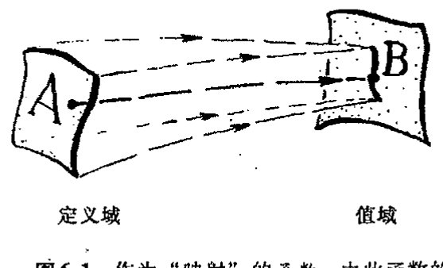
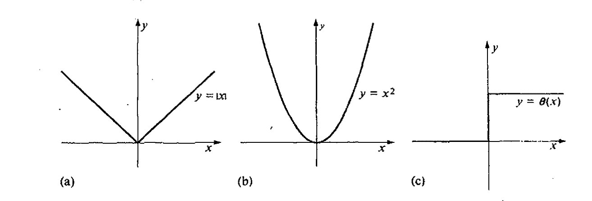
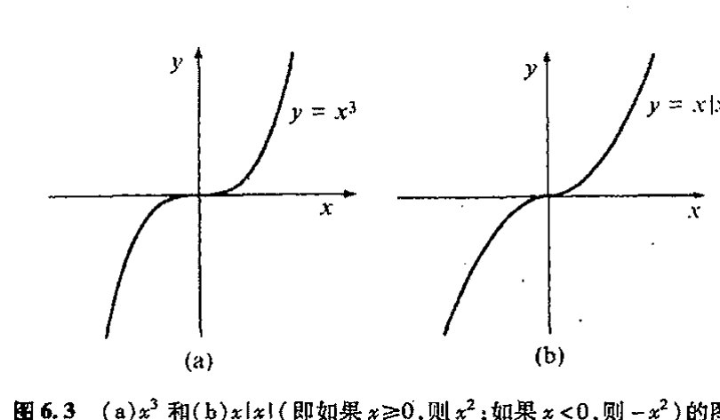
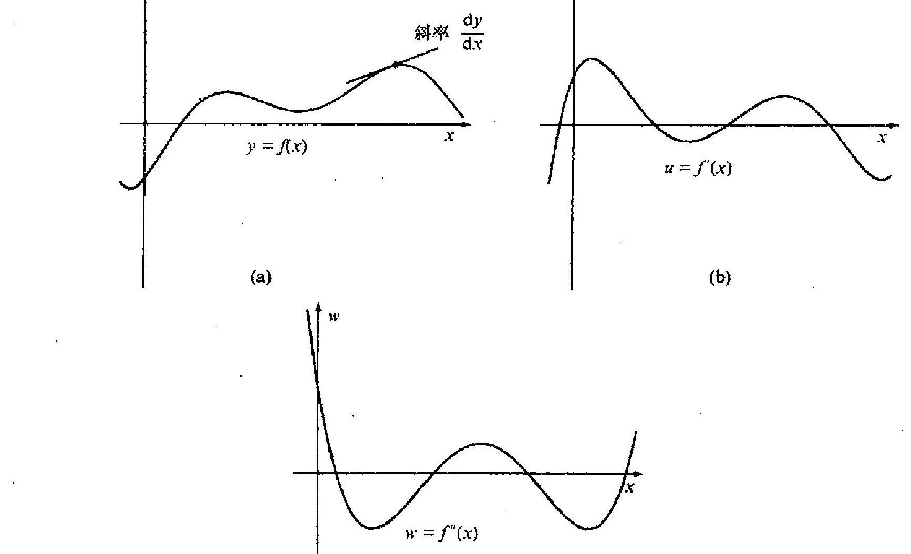
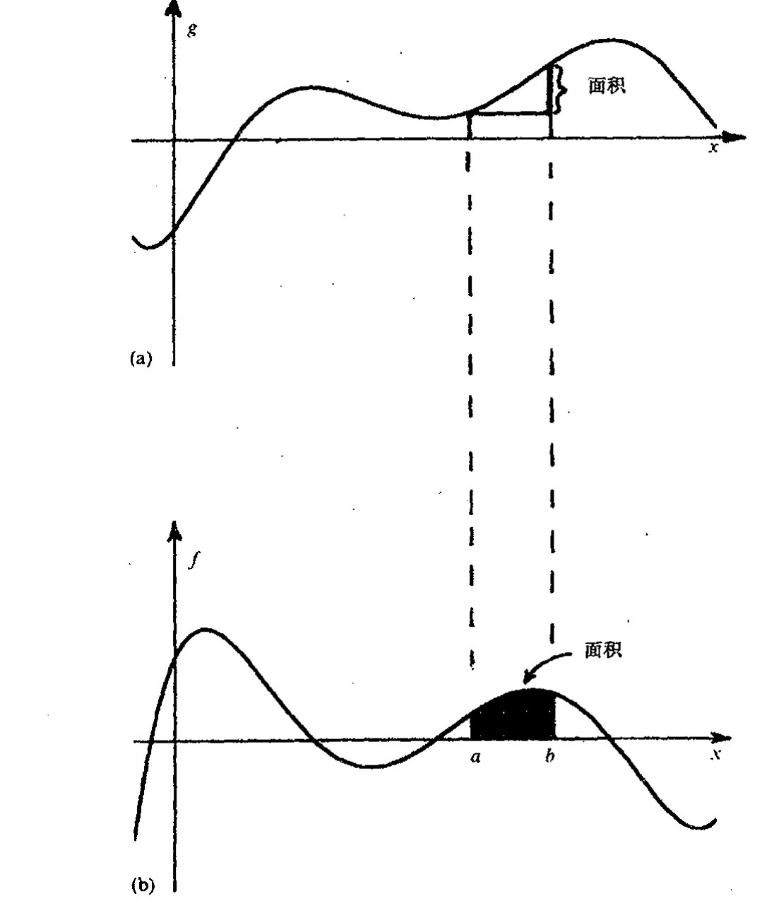

<!-- page 90 -->

# 第六章

# 实数微积分

## 6.1 如何构造实函数？

微积分——或按其更复杂的名字，数学分析——是由两个基本要素构成的：微分和积分。微分包括速度、加速度、曲线和曲面的梯度和曲率以及类似的一些概念。它们反映的是事物变化的快慢，是些根据单点最小邻域上的结构和性态来局域定义的量。而积分则涉及面积和体积、引力中心和其他一些涉及总体性质的量。它们反映的是某种形式总量的量度，这些量不局限于单个点的最小邻域上或局域的性态。一个显著的事实，即微积分基本定理，本质上是这两个要素的互逆运算。正是这一事实使得这两个重要的数学研究领域能够统合起来提供一种强有力的分析工具和计算技术。

数学分析这一主题的思想，正如它在17世纪由费马、牛顿和莱布尼茨初创时那样，可追溯到公元前3世纪的阿基米德，之所以称为“演算（calculus）”是因为它确实提供了一种计算技术，借此许多用其他概念很难把握的问题经常“自行”得到解决，这里用到的仅仅是下述一些相对简单的规则，它们经常是无需经大量深入思考即可得到应用。当然，在这种演算中，微分运算和积分运算之间有着十分明显的区别，说不上哪个“容易”哪个“困难”。在处理那些由已知函数构成的显性公式时，微分运算要“容易”些，积分要“难”些，很多情形下积分都不可能按显式进行到底。另一方面，当函数不是以公式给出，而是以数值表列出时，则积分变得“容易”，微分显得“困难”，严格来说，此时不存在通常意义上的微分。数值技术一般来讲是包含了近似的，但它有一套严格理论作保证，可以对事物拟合得非常好，而在这种场合下可用的是积分，微分则无能为力。让我们来具体地理解这一点。要处理的对象实际上都可称之为“函数”。

对欧拉等17～18世纪的数学家来说，“函数”是指那种能够以显式写下来的关系式，像$x^2$或$\sin x$或$\log(3-x+e^x)$，或由某个包含积分的公式所定义的关系式，也可以是一个明确给定的幂级数。今天，我们更愿意用“映射”的概念，它将函数定义域中某列数（或更一般的对象）A

<!-- page 91 -->

通向实在之路

“映射”为所谓函数值域的另一列数 $B$（[图 6.1](assets/page091_fig01.jpg)）。这种映射的要点是，该函数将值域 $B$ 中的一个数对应到定义域 $A$ 中的一个数。（我们可将函数看成是对属于 $A$ 的数的“检查”，其依赖的唯一标准就是看它是否能够产生一个明确属于 $B$ 的数。）这种函数相当于一种“对照表”。它不要求函数一定要以显式的公式来给出。

**图 6.1** 作为“映射”的函数，由此函数的定义域（数或其他对象的某个阵列 $A$）被“映射”到其值域（另一个阵列 $B$）。$A$ 的每个元素被赋给 $B$ 的某个具体值，虽然 $A$ 的不同元素可能得到同样的值，而另一些 $B$ 的值则无法达到。

我们来考虑一些例子。在[图 6.2](assets/page091_fig02.jpg)，我画了 3 个简单函数¹ $x^2$，$|x|$ 和 $\theta(x)$ 的图。每种情形的定义域和值域都属实数域，我们通常用字母 $\mathbb{R}$ 来代表这个实数域。“$x^2$”函数的意义就是取实数的平方。“$|x|$”（称为绝对值）函数是指：若 $x$ 非负，则函数值为 $x$；若 $x$ 是负数，则函数值取 $-x$；因此 $|x|$ 本身永远非负。函数“$\theta(x)$”的意义是：$x$ 为负值时 $\theta(x)$ 为 $0$，$x$ 为正值时 $\theta(x)$ 为 $1$；通常还定义 $\theta(0)=\frac{1}{2}$。（这个函数称为赫维塞德阶梯函数，赫维塞德（Oliver Heaviside，1850～1925）的另一项重要贡献见 [§21.1](chapter_21.md#211-非对易变量)，他更出名的是他首次提出了地球大气的“赫维塞德层”假说，这个概念对无线电广播至为关键。）这 3 个函数中的每一个从现代意义上说都是完美函数，但在欧拉那里，² 要说 $|x|$ 或 $\theta(x)$ 是“函数”是颇难接受的。

**图 6.2** (a) $|x|$，(b) $x^2$ 和 (c) $\theta(x)$ 的图像。各情形下的定义域和目标域均为实数域。

105

为什么呢？一种可能是认为，$|x|$ 和 $\theta(x)$ 的麻烦在于有太多的“如果 $x$ 如此这般，那么函数将因此那般，而如果 $x$ 是…”这样的陈述，而且还不具备函数的“漂亮形式”。但这么说有点混淆视听了，不管怎么说，我们很怀疑 $|x|$ 的真正不足是出于公式方面的原因，何况一旦我们认可 $|x|$，我们就能够写出 $\theta(x)$ 的公式：\*[6.1]

$$\theta(x)=\frac{|x|+x}{2x}$$

---

\*[6.1] 验证这一点（略去 $x=0$）。

??? question "答案 [6.1]"
    若 $x>0$，则 $|x|=x$，公式右端为 $(x+x)/(2x)=1$，正是 $\theta(x)$。若 $x<0$，则 $|x|=-x$，右端为 $(-x+x)/(2x)=0$，也正是 $\theta(x)$。

    在 $x=0$ 处公式变为 $0/0$，所以正文要求略去这一点；通常单独规定 $\theta(0)=1/2$。

·72·

<!-- page 92 -->

第六章 实数微积分

（虽然我们也不知道它在 $\theta(0)$ 处是否能得到正确的值，毕竟公式给出的是 $0/0$）。$|x|$ 的麻烦更多的在于它是不“光滑”的而非其公式是否“漂亮”。从[图6.2](assets/page091_fig02.jpg)(a)我们看到，函数图像在中心拐了个“角”。正是这个角使得 $|x|$ 在 $x=0$ 点没有完好的斜率定义。下面就让我们转到这个概念上来。

## 6.2　函数的斜率

如上所述，微分运算包括求“斜率”。从[图6.2](assets/page091_fig02.jpg)a所示的 $|x|$ 的图像我们清楚地看到，函数在原点的斜率不唯一，因为这里有个折角。但除原点之外，在其他地方斜率是唯一确定的。$|x|$ 在原点处的这种麻烦被称为 $|x|$ 在原点处不可微，换一种等价的说法，就是函数在此处不光滑。相反，如[图6.2](assets/page091_fig02.jpg)(b)所示的函数 $x^2$ 则是处处都有唯一定义的斜率，它因此也是处处可微的。 106

图6.2(c)所示的函数 $\theta(x)$ 比 $|x|$ 更麻烦，因为 $\theta(x)$ 在原点（$x=0$）处有一“跳跃”。这时我们说 $\theta(x)$ 在原点不连续。相比之下，函数 $x^2$ 和 $|x|$ 则是处处连续的。$|x|$ 在原点处的麻烦不是连续性失效而是可微性失效。（虽然连续性失效和可微性失效不是一回事，但二者实际上是彼此相关的概念，这一点我们一会儿就要谈到。）

图6.3 (a)$x^3$和(b)$x|x|$（即如果$x\geq 0$,则$x^2$;如果$x<0$,则$-x^2$）的图像。

可以想象，这两种缺失哪一种都不会令欧拉高兴，它们似乎正是 $|x|$ 和 $\theta(x)$ 不能成为“真”函数的理由。现在我们来考虑[图6.3](assets/page092_fig01.jpg)所示的两个函数。第一个是 $x^3$，它在任何意义下都称得上是函数；而第二个是 $x|x|$，它在 $x$ 非负区域的图像与 $x^2$ 相同，但在 $x$ 为负的区域相当于 $-x^2$ 吗？乍一看，两个图像彼此非常相像且肯定“光滑”。二者不仅在原点的“斜率”有绝对完好的值，即都是零（这意味着曲线在此处有水平的斜率），而且在最直接的意义上也是处处“可微”的。但是，$x|x|$ 肯定不是令欧拉满意的那种“漂亮”函数。

$x|x|$ 的“错误”在于它在原点没有定义完好的曲率，曲率的概念也涉及微分计算。实际上，“曲率”是一种与所谓“二次导数”有关的运算，就是说要做两次微分。因此我们可以说，函数 $x|x|$ 在原点不是二次可微的。我们将在[§6.3](#63-高阶导数cinfty-光滑函数)来考虑二次和更高次导数。

为了开始正确理解这些事情，我们有必要看看微分运算实际是如何进行的。为此我们得知 107

·73·

<!-- page 93 -->

通向实在之路

---

**图 6.4** 笛卡儿坐标系下的(a) $y = f(x)$, (b) 一阶导数 $u = f'(x)$ ($= dy/dx$) 和 (c) 二阶导数 $f''(x) = d^2y/dx^2$ 的图像。（注意，$f(x)$ 在 $f'(x)$ 与 $x$ 轴相交的地方有水平斜率，而在 $f''(x)$ 与 $x$ 轴相交的地方有拐点。）

道如何来度量斜率。如[图 6.4](assets/page093_fig01.jpg) 所示，我画了一条比较有代表性的函数图像 $f(x)$。[图 6.4](assets/page093_fig01.jpg)(a) 的曲线描述的是关系 $y = f(x)$。正如通常笛卡儿坐标描述的那样，这里坐标 $y$ 的值量度的是高度，$x$ 值量度的是水平位移。我曾说过，曲线在某一点 $p$ 处的斜率就是该点的 $y$ 坐标的增量除以 $x$ 坐标的增量，相当于我们在 $p$ 点作曲线的切线。（“切线”的数学定义取决于适当的求极限过程，但这不是我在这里要达到的目的。我希望读者能够明白我的这种直观描述足以满足我们当前的需要。³）斜率的标准记法是 $dy/dx$（读成 “$dy$ 比 $dx$”）。我们可将 “$dy$” 看成是 $y$ 值沿曲线的一个非常小的增量，“$dx$” 为相应的 $x$ 值的小的增量。（这里，技术上严格说来都要求取 “极限”，即是说这些小量应尽量减小到零。）

现在我们来考虑另一种曲线，即前述曲线上每一点 $p$ 的斜率值关于 $x$ 的曲线，见[图 6.4](assets/page093_fig01.jpg)(b)。这里我们再次用笛卡儿表示法，但垂直轴表示的是 $dy/dx$ 而非 $y$。水平移位则仍由 $x$ 量度。画出的这个函数通常称为 $f'(x)$，也可以写成 $dy/dx = f'(x)$。我们把 $dy/dx$ 称作 $y$ 关于 $x$ 的导数，把 $f'(x)$ 称作 $f(x)$ 的导数。⁴

·74·

<!-- page 94 -->

第六章 实数微积分

## 6.3 高阶导数；$C^\infty$ 光滑函数

现在我们来看看取二阶导数时会发生什么。这意味着我们现在是将[图 6.4](assets/page093_fig01.jpg)(b) 的斜率函数看成新的曲线 $u = f'(x)$，这里 $u$ 代表 $dy/dx$。[图 6.4](assets/page093_fig01.jpg)(c) 画出了这个“二阶”斜率函数，它是 $du/dx$ 关于 $x$ 的图像，因此 $du/dx$ 的值就是二阶曲线 $u = f'(x)$ 的斜率。它给出的就是原函数 $f(x)$ 的二阶导数，通常写成 $f''(x)$。我们用 $dy/dx$ 取代 $du/dx$ 中的 $u$，就得到 $y$ 关于 $x$ 的二阶导数，它可以写成（尽管有点不正规）$d^2y/dx^2$。

注意，原函数 $f(x)$ 有水平斜率处的 $x$ 值恰好就是 $f'(x)$ 与 $x$ 轴的交点的 $x$ 值（故对这些 $x$ 值 $dy/dx$ 为零）。这些位置也就是 $f(x)$ 取（局部）极大或极小值的位置，当我们要求函数的（局部）最大值或最小值时它们就显得非常重要了。那么二阶导数 $f''(x)$ 与 $x$ 轴的交点的点有什么意义呢？我们说这些是 $f(x)$ 的曲率为零的位置。一般来说，在这些点上，曲线 $y = f(x)$ 的“弯曲”方向会从曲线的一侧变到另一侧，我们把这种点称为拐点。（实际上，说 $f''(x)$ “度量”曲线 $y = f(x)$ 的曲率不是很准确，真正的曲率是由比 $f''(x)$ 更复杂但包括 $f''(x)$ 的表达式^5^ 给出的，当 $f''(x)$ 为零时，这个曲率也为零。）

接下来我们考虑前述的两个（表面上）看似相似的函数 $x^3$ 和 $x|x|$。在[图 6.5](assets/page095_fig01.jpg)(a), (b), (c) 中，我像在[图 6.4](assets/page093_fig01.jpg) 中做的那样画了 $x^3$ 及其一阶和二阶导数的图像，[图 6.5](assets/page095_fig01.jpg)(d), (e), (f) 则为 $x|x|$ 的相应图像。在 $x^3$ 情形，我们已看到，其一阶和二阶导数的连续性和光滑性都不成问题。实际上，它的一阶导数为 $3x^2$，二阶导数为 $6x$，二者都不会让欧拉不舒服。（一会儿我们再来讲如何得到这些显式。）但在 $x|x|$ 情形，其一阶导数出现了如[图 6.2](assets/page091_fig02.jpg)(a) 的“角”的麻烦，而二阶导数则会出现类似于[图 6.2](assets/page091_fig02.jpg)(c) 的“阶梯函数”性态。我们已经知道，这时函数的一阶导数失去了光滑性，二阶导数则连连续性也丧失了。欧拉是根本不会理会这种情形的。实际上，$x|x|$ 的一阶导数是 $2|x|$，二阶导数是 $-2 + 4\theta(x)$。（那些追求严谨的读者可能会抱怨说，我不该把 $2|x|$ 麻利地写成“一阶导数”，因为它在原点是不可微的。确实是这样，但这只是小问题：用第 9 章末引入的概念就会知道，这么做有其正当性。）

我们很容易想象，函数完全有可能在计算多阶导数时失去光滑性和连续性。事实上形为 $x^n|x|$ 的函数就是这么一个例子，其中 $n$ 可以取任意大的正整数。数学上将这种情形称为函数 $f(x)$ 是 $C^n$ 光滑的，如果它（在定义域的每个点上）有 $n$ 阶导数并且第 $n$ 阶导数连续的话。^6^ 函数 $x^n|x|$ 是 $C^n$ 光滑的，但它在原点不是 $C^{n+1}$ 光滑的。

$n$ 要多大才能使欧拉满意呢？显然，$n$ 的任何具体值都不会让他满意。欧拉想要的是那种任意阶可微的自尊的函数。数学上将这种情形称为函数 $f(x)$ 是 $C^\infty$ 光滑的，如果它对任意一个正整数 $n$ 都是 $C^n$ 光滑的话。换句话说，一个 $C^\infty$ 光滑函数必是任意阶可微的。

欧拉的函数概念大概就是这种具有 $C^\infty$ 光滑的函数。至少我们可以想象，他所要求的函数应

<!-- page 95 -->

通向实在之路

图6.5 (a)、(b)和(c)分别是 $x^3$、一阶导数 $3x^2$ 和二阶导数 $6x$ 的图像。(d)、(e)和(f)则分别是 $x|x|$、一阶导数 $2|x|$ 和二阶导数 $-2+4\theta(x)$ 的图像。

在其定义域的绝大部分场合是 $C^\infty$ 光滑的。但对 $1/x$（[图6.6](assets/page095_fig02.jpg)）情形会如何呢？它在原点显然不是 $C^\infty$ 光滑的。按今天的函数定义，它甚至在原点都无定义。但欧拉肯定会认为 $1/x$ 是一种体面的“函数”，尽管有这样的问题，因为它毕竟具有外观简单好看的形式。人们还可以看出，其实欧拉并不是非常在意他的函数是否在定义域的每一点都是 $C^\infty$ 光滑的（假定他毕竟还关心“定义域”的话）。甚至函数在奇点出错这样的事情在他看来都不要紧。但 $|x|$ 和 $\theta(x)$ 不就和 $1/x$ 一样在同样的“奇点”出错了吗？由此看来，无论我们怎么努力，我们都把握不住“欧拉式的”函数概念是否就是我们所描述的那种概念。

图6.6 $1/x$ 的图像。

111

现在我们来看另一个例子。考虑函数 $h(x)$，它定义为

$$
h(x) = \begin{cases} 0, & x \leqslant 0, \\ e^{-1/x}, & x > 0. \end{cases}
$$

这个函数的图像见[图6.7](assets/page096_fig01.jpg)。看起来它明显是光滑函数。实际上它的确是非常光滑的。它在整个实数域都是 $C^\infty$ 光滑的。（证明这一点属数学系本科生课程的内容。我记得我还是本科生的时候就

·76·

<!-- page 96 -->

# 第六章 实数微积分

做过这类的作业。[^6.2] 尽管它绝对光滑，但我们可以想象，欧拉对这种形式的函数一定是嗤之以鼻的。在欧拉看来，它显然就不是"一个函数"，而是"纠集在一块儿的两个函数"，不论你把原点处的"疮疤"捯饬得多么光滑。相反，对欧拉来说，$1/x$ 则是一个函数，尽管事实上它在原点处被难堪地"撕裂"成两半，甚至连连续都谈不上，就更甭说光滑了（[图 6.6](assets/page095_fig02.jpg)）。在欧拉看来；$h(x)$ 并不比 $|x|$ 和 $\theta(x)$ 好多少，因为在这些情形中，它们明显都是"粘合起来的两个函数"，尽管这种粘合工作做得是如此天衣无缝(对 $\theta(x)$，似乎还有"脱胶"的危险)。

图 6.7 $y = h(x)$ ($x \le 0$ 时为零，$x > 0$ 时为 $e^{-1/x}$)的图像，它是 $C^\infty$ 光滑的。

## 6.4 "欧拉的" 函数概念

我们怎么才能准确把握欧拉的这种并非两个函数粘合而成的纯粹单函数概念呢？正如 $h(x)$ 所示，$C^\infty$ 光滑是不够的。其实我们有两种完全不同的方法来解决这个问题。方法之一是用复数，它看似简单，但实际上相当复杂。要求也很简单：函数 $f(x)$ 可延拓为关于复变量 $z$ 的函数 $f(z)$ 并使 $f(z)$ 在关于 $z$ 的一阶可微的意义下是光滑的。(因此，$f(z)$ 是复数意义上的 $C^1$ 函数。)这里真正显示了复数超常的魔力，当然我们不会在此深究：如果 $f(z)$ 关于 $z$ 一阶可微，那么它到任意阶都是可微的！

下一章我们再来讨论复数的微积分问题，这里我们再看看另一种仅用实数来处理"欧拉函数概念"的方法，这就是我们在 [§2.5](chapter_02.md#25-双曲几何的其他表示) 所述的幂级数方法。(欧拉可称得上是处理幂级数的真正大师级人物。)其实，在我们考虑复数可微性之前，熟悉幂级数方法是非常有用的。局部上看，复数可微性与可展开成幂级数是等价的，这也是复数魔力的一个真正所在。

我将以适当方式对此进行叙述，眼下我们先解决实函数问题。假定某个实函数 $f(x)$ 有如下

[^6.2]: 如果你知识了得，不妨证证看。

??? question "答案 [6.2]"
    对 $x>0$，反复求导 $e^{-1/x}$，每一阶导数都可写成 $P_n(1/x)e^{-1/x}$，其中 $P_n$ 是某个多项式。这可由链式法则归纳得到。

    当 $x\to0^+$ 时，任意幂 $(1/x)^m$ 都被 $e^{-1/x}$ 压倒，故 $P_n(1/x)e^{-1/x}\to0$。左侧 $x<0$ 时函数恒为零，各阶导数也恒为零。因此在 $0$ 处把每阶导数定义为 $0$，左右极限一致；所有阶导数连续，故 $h$ 是 $C^\infty$ 的。

<!-- page 97 -->

通向实在之路

幂级数展开形式：

$$f(x) = a_0 + a_1 x + a_2 x^2 + a_3 x^3 + a_4 x^4 + \cdots$$

我们有多种办法从 $f(x)$ 确定各系数 $a_0, a_1, a_2, a_3, a_4, \cdots$。因为如果这种展开存在，则 $f(x)$ 必为 $C^\infty$ 光滑（我们不久会知道，这并非充分），因此我们有新函数 $f'(x), f''(x), f'''(x), f''''(x), \cdots$，等等。它们分别是 $f(x)$ 的一阶、二阶、三阶等等的导数。实际上我们关心的只是这些函数在原点（$x=0$）的值，我们要求 $f(x)$ 在此处 $C^\infty$ 光滑。如果 $f(x)$ 有幂级数展开式，则有结果（有时称为麦克劳林级数^7）*^(6.3)

$$a_0 = f(0), \quad a_1 = \frac{f'(0)}{1!}, \quad a_2 = \frac{f''(0)}{2!}, \quad a_3 = \frac{f'''(0)}{3!}, \quad a_4 = \frac{f''''(0)}{4!}, \cdots$$

（由 [§5.3](chapter_05.md#53-多值性自然对数) 知道，$n! = 1 \times 2 \times \cdots \times n$）那么其他方法是否也能奏效？如果各项 $a$ 值如此确定，（包含原点的某个区间上的）幂级数的和真的就能还原为 $f(x)$？

让我们回到貌似天衣无缝的 $h(x)$ 上来。你也许已注意到，这个概念在连接点（$x=0$）是有缺陷的。我们来试试看 $h(x)$ 是否真的能展开成幂级数。取 $f(x) = h(x)$，然后考虑各个系数 $a_0, a_1, a_2, a_3, a_4, \cdots$，显然，这些系数全取零，因为级数必须满足 $h(x) = 0$，无论 $x$ 是从哪边趋于原点。实际上，我们发现，从 $e^{-1/x}$ 方面看这些系数也全都是零，这也是为什么说 $h(x)$ 在原点是 $C^\infty$ 光滑的基本理由，因为从原点的两边求得的所有各阶导数都彼此相等。但这个结果却表明，幂级数展开对 $h(x)$ 来说是无效的，因为所有项都是零（见练习 6.1），因此无法求和得到 $e^{-1/x}$。这样，我们可将 $h(x)$ 在连接点 $x=0$ 的缺陷归结为：函数 $h(x)$ 不能表示成幂级数。对此我们说 $h(x)$ 在 $x=0$ 不是解析的。

在上述讨论中，我一直做的都是幂级数关于原点的展开。对函数实数定义域中的其他点，我们一样可以做类似的处理，但得将"原点"移到相应的位置上。例如，我们要在定义域中的实数 $p$ 点展开，这时就得将原先幂级数展开中的 $x$ 代换为 $x-p$：

$$f(x) = a_0 + a_1(x-p) + a_2(x-p)^2 + a_3(x-p)^3 + \cdots,$$

相应地，各系数为

$$a_0 = f(p), \quad a_1 = \frac{f'(p)}{1!}, \quad a_2 = \frac{f''(p)}{2!}, \quad a_3 = \frac{f'''(p)}{3!}, \cdots$$

这叫幂级数在 $p$ 点的展开。函数 $f(x)$ 称为在 $p$ 点是解析的，如果它在 $x-p$ 的某个区间上可以展开成上述幂级数的话。如果函数 $f(x)$ 在定义域的所有点上都是解析的，我们就说它是解析函数，或等价地，是 $C^\omega$ 光滑函数。一定意义上说，解析函数甚至比 $C^\infty$ 光滑函数"更光滑"。另外，解析函数有这样的性质：我们不可能像上面给出的 $\theta(x), |x|, x|x|, x^n|x|$ 或 $h(x)$ 那样，将两个"不同的"解析函数粘合在一起。欧拉一定很喜欢这种解析函数，它们确实都是"实实在在的"函数！

---

*\*〔6.3〕用本节末给出的法则证明这一点。*

??? question "答案 [6.3]"
    若 $f(x)=a_0+a_1x+a_2x^2+a_3x^3+\cdots$，逐项微分得 $f'(x)=a_1+2a_2x+3a_3x^2+\cdots$，所以 $f'(0)=a_1$。

    再微分得 $f''(0)=2!a_2$，三次微分得 $f'''(0)=3!a_3$，依此类推。一般地，第 $n$ 阶导数在 $0$ 处为 $n!a_n$，所以 $a_n=f^{(n)}(0)/n!$。

·78·

<!-- page 98 -->

第六章 实数微积分

然而，所有这些幂级数，哪一个驾驭起来都不是件省心的事情，即使是想象一下都未必容易。而"复"方法看起来就要省劲儿得多。何况它还能加深我们对函数的理解。例如，函数 $1/x$ 在 $x=0$ 点不是解析的，但它仍是"一个函数"。***[6.4] "幂级数哲学"可是无法直接告诉我们这一点。我们将看到，从复数观点看，$1/x$ 显然只是一个函数。

## 6.5 微分法则

在讨论这些问题前，有必要对我们实际要用到的神奇的微分计算法则先说两句——这些法则使得我们几乎可以不加考虑地对函数进行微分，当然数月的练习还是必要的！利用这些法则，我们可以直接写出许多函数的导数，特别是当这些函数是用幂级数来表示时就更是如此。

在前面的论述中，我举过个例子：$x^3$ 的导数是 $3x^2$。它是一个简单而又重要的公式的特例：$x^n$ 的导数是 $nx^{n-1}$，我们可以将其写成

$$\frac{\mathrm{d}(x^n)}{\mathrm{d}x} = nx^{n-1}。$$

（我们已经走得太远了，这里我的目的是要解释为什么这个公式能够成立。这其实不难证明，有兴趣的读者可以从任何一本有关微积分的基础教材中找到所有必要的材料。⁸ 顺便说一句，$n$ 不必是一个整数。）我们还可以将这个公式（通过乘以"$\mathrm{d}x$"）表示成更方便的形式：⁹

$$\mathrm{d}(x^n) = nx^{n-1}\mathrm{d}x。$$

我们不需要知道更多的关于如何进行幂级数微分的细节。但还有两个基本法则需要知道。首先，函数和的导数等于函数导数的和：

$$\mathrm{d}[f(x)+g(x)] = \mathrm{d}f(x) + \mathrm{d}g(x)。$$

这个法则可以扩展到对有限个函数的和。¹⁰ 其次，乘以一个常数的函数的导数等于常数乘以该函数的导数：

$$\mathrm{d}\{af(x)\} = a\,\mathrm{d}f(x)。$$

这里所谓"常数"是指不随 $x$ 变化的一个数。幂级数的系数 $a_0, a_1, a_2, a_3, a_4, \cdots$ 都是常数。有了这些法则，我们就可以直接进行幂级数的微分。*[6.5]

常数 $a$ 的另一种表示是

$$\mathrm{d}a = 0。$$

回想一下我们就会发现，上面这些法则实际上是"莱布尼茨法则"的特殊情形（$g(x)=a$）：

$$\mathrm{d}\{f(x)g(x)\} = f(x)\,\mathrm{d}g(x) + g(x)\,\mathrm{d}f(x)$$

---

***[6.4] 考虑"一个函数" $\mathrm{e}^{-1/x^2}$。证明：它在原点是 $C^\infty$ 的但不是解析的。

??? question "答案 [6.4]"
    把函数在 $x=0$ 处补定义为 $0$。对 $x\ne0$，任意阶导数都可写成 $P_n(1/x)e^{-1/x^2}$，其中 $P_n$ 为多项式。由于 $e^{-1/x^2}$ 比任何 $|x|^m$ 更快趋零，$x\to0$ 时这些导数全趋于 $0$，故可在原点连续延拓为 $0$，函数是 $C^\infty$ 的。

    但它在原点所有导数都为 $0$，所以麦克劳林级数全为零。若它在原点解析，就应在某个邻域内等于这个零级数，即恒为零；这与 $x\ne0$ 时 $e^{-1/x^2}>0$ 矛盾。因此它不是解析的。

*[6.5] 用 [§5.3](chapter_05.md#53-多值性自然对数) 给出的 $\mathrm{e}^x$ 的幂级数证明：$\mathrm{d}\mathrm{e}^x = \mathrm{e}^x \mathrm{d}x$。

??? question "答案 [6.5]"
    由 $e^x=1+x+x^2/2!+x^3/3!+\cdots$，逐项微分得 $d(e^x)=\{1+x+x^2/2!+x^3/3!+\cdots\}dx$。

    因为 $d(x^n/n!)=nx^{n-1}dx/n!=x^{n-1}dx/(n-1)!$，微分后的级数正好重新排列成原来的 $e^x$ 级数。因此 $d e^x=e^x dx$。

<!-- page 99 -->

通向实在之路

（对任意自然数 $n$，$\mathrm{d}(x^n)/\mathrm{d}x = nx^{n-1}$ 也可以从莱布尼茨法则导出 $^{**[6.6]}$）。还有一个有用公式：

$$\mathrm{d}\{f(g(x))\} = f'(g(x))g'(x)\mathrm{d}x。$$

从后两式和第一式，将 $f(x)[g(x)]^{-1}$ 代入莱布尼茨法则，我们可导出 $^{*[6.7]}$

$$\mathrm{d}\left(\frac{f(x)}{g(x)}\right) = \frac{g(x)\,\mathrm{d}f(x) - f(x)\,\mathrm{d}g(x)}{g(x)^2}。$$

有了这些法则的武装（当然还得加上多多的练习），我们无需了解为什么这些法则是有效的就可以成为“微分专家”了！这就是优越的微积分的力量。$^{*[6.8]}$ 除此之外，再加上一些特殊函数的导数，$^{**[6.9]}$ 我们就更像专家了。有了这些，就是一个生手也会很快变成微分专家俱乐部的“新成员”，让我再提供些主要的例子：$^{11}$，$^{**[6.10]}$

$$\begin{aligned}
\mathrm{d}(e^x) &= e^x \mathrm{d}x, \\[4pt]
\mathrm{d}(\log x) &= \frac{\mathrm{d}x}{x}, \\[4pt]
\mathrm{d}(\sin x) &= \cos x\,\mathrm{d}x, \\[4pt]
\mathrm{d}(\cos x) &= -\sin x\,\mathrm{d}x, \\[4pt]
\mathrm{d}(\tan x) &= \frac{\mathrm{d}x}{\cos^2 x}, \\[4pt]
\mathrm{d}(\sin^{-1} x) &= \frac{\mathrm{d}x}{\sqrt{1-x^2}}, \\[4pt]
\mathrm{d}(\cos^{-1} x) &= \frac{-\mathrm{d}x}{\sqrt{1-x^2}}, \\[4pt]
\mathrm{d}(\tan^{-1} x) &= \frac{\mathrm{d}x}{\sqrt{1+x^2}}。
\end{aligned}$$

这样就说明了我们在本节开头所指出的一点，对于显函数，微分运算是“容易”的。当然，我不是说你可以在不清醒的眯盹状态下就能习得这些知识。在一些特例中，表达式还是相当复杂的。我说“容易”，只是说进行微分有一套明确的计算程序。如果我们知道表达式的每个部分如何进行微分，那么这个计算程序就会告诉我们如何进行整个表达式的微分计算。“容易”还意味着这种计算可以在计算机上快速进行。但如果我们从反方向进行，事情就要复杂得多了。

---

$^{**}[6.6]$ 建立这个关系。

??? question "答案 [6.6]"
    对自然数 $n$，$x^n$ 是 $n$ 个 $x$ 的乘积。反复使用莱布尼茨法则，微分时每一项只对其中一个因子取微分，其余因子保持为 $x$。

    因而共有 $n$ 个相同项，每项为 $x^{n-1}dx$，所以 $d(x^n)=nx^{n-1}dx$，即 $d(x^n)/dx=nx^{n-1}$。

$^{*}[6.7]$ 导出这一点。

??? question "答案 [6.7]"
    令 $h=f/g$，则 $f=hg$。由莱布尼茨法则，$df=h\,dg+g\,dh$，所以 $g\,dh=df-h\,dg=df-(f/g)dg$。

    两边除以 $g$，得到 $dh=(g\,df-f\,dg)/g^2$。这就是商法则。

$^{*}[6.8]$ 对 $y=(1-x^2)^4$，$y=(1+x)/(1-x)$，求 $\mathrm{d}y/\mathrm{d}x$。

??? question "答案 [6.8]"
    对 $y=(1-x^2)^4$，用链式法则：$dy/dx=4(1-x^2)^3(-2x)=-8x(1-x^2)^3$。

    对 $y=(1+x)/(1-x)$，用商法则：$dy/dx=((1-x)\cdot1-(1+x)(-1))/(1-x)^2=2/(1-x)^2$。

$^{**}[6.9]$ 设 $a$ 是一常数，求 $\mathrm{d}(\log_a x)$，$\mathrm{d}(\log_x a)$，$\mathrm{d}(x^x)$。

??? question "答案 [6.9]"
    用自然对数表示：$\log_a x=(\log x)/(\log a)$，所以 $d(\log_a x)=dx/(x\log a)$。

    $\log_x a=(\log a)/(\log x)$，故 $d(\log_x a)=-(\log a)\,dx/(x(\log x)^2)$。又 $x^x=e^{x\log x}$，所以 $d(x^x)=x^x(\log x+1)dx$。

$^{**}[6.10]$ 首先，做练习 $[6.5]$；然后导出 $\mathrm{d}(e^{\log x})$ 的二阶导数；$\mathrm{d}e^{ix}$ 的三阶、四阶导数，假定复数量的求导如同实数量一样；并从较易的形式出发推导余下的式子，注意利用 $\mathrm{d}(\sin(\sin^{-1} x))$，等等公式，并注意到 $\cos^2 x + \sin^2 x = 1$。

??? question "答案 [6.10]"
    因为 $e^{\log x}=x$，一阶导数为 $1$，二阶导数为 $0$。若从链式法则算，$d(e^{\log x})=e^{\log x}d(\log x)=x(dx/x)=dx$，结果相同。

    对 $e^{ix}$，一阶到四阶导数依次为 $ie^{ix}$、$-e^{ix}$、$-ie^{ix}$、$e^{ix}$。由 $e^{ix}=\cos x+i\sin x$ 比较实部虚部，得到 $d(\sin x)=\cos x\,dx$ 与 $d(\cos x)=-\sin x\,dx$，再由 $\tan x=\sin x/\cos x$ 得 $d(\tan x)=dx/\cos^2x$。对反函数，例如 $\sin(\sin^{-1}x)=x$，微分得 $\cos(\sin^{-1}x)d(\sin^{-1}x)=dx$，而 $\cos(\sin^{-1}x)=\sqrt{1-x^2}$，故得到反正弦公式；余下反余弦、反正切公式同理。

· 80 ·

<!-- page 100 -->

第六章 实数微积分

## 6.6 积分

如本章开头所述，积分是微分的逆运算。这种运算的目的是要找出满足 $g'(x) = f(x)$ 的函数 $g(x)$，即找到方程 $\mathrm{d}y/\mathrm{d}x = f(x)$ 的解 $y = g(x)$。换一种说法，就是说，从[图 6.4](assets/page093_fig01.jpg)（或[图 6.5](assets/page095_fig01.jpg)）上看，我们现在不是要从上往下进行，而是自下往上地进行。"微积分基本定理"的美就在于这个程序可以告诉我们对每一条连续曲线如何求出其面积。我们来看[图 6.8](assets/page100_fig01.jpg)。我们知道，图（b）中曲线 $u = f(x)$ 可以从图（a）的曲线 $y = g(x)$ 得到，因为它画的是曲线的斜率，$f(x)$ 是 $g(x)$ 的导数。这些是我们前面

**图 6.8** 微积分基本定理：[图 6.4](assets/page093_fig01.jpg)（a），（b）的重新解释，读图顺序自下而上。上图曲线（a）是下图曲线（b）的面积曲线，这里面积由两条竖直线 $x = a$ 和 $x = b$、$x$ 轴和下图曲线本身所围成，它反映为上图曲线在这两点的曲线高度差 $g(b) - g(a)$。

· 81 ·

<!-- page 101 -->

通向实在之路
---

117

所做的工作，现在我们从图(b)的曲线着手。我们发现，曲线$g(x)$反映的是曲线$f(x)$下的面积。说得更清楚点儿：如果我们在图(b)中取两条竖直线，例如$x=a$和$x=b$，那么由这两条线、$x$轴和曲线本身所围成面积，将反映为图(a)的曲线在不同$x$值之间的高度差。当然，这里还应注意“正负号”。对于曲线$f(x)$在$x$轴以下的部分所围成的区域，其面积为负。另外，图中我取的是$a<b$，曲线$g(x)$的“高度差”为$g(b)-g(a)$。如果$a>b$，则正负号变号。

118

在[图6.9](assets/page101_fig01.jpg)，我试着从直观角度来说明为什么斜率和面积之间存在着这种反比关系。我们将$b$设为仅比$a$大一点点，这样，下图中所考虑的面积就是由相邻直线$x=a$和$x=b$限定的非常窄的带状区域。这个面积的度量基本上可看作是带的狭窄宽度（即$b-a$）与高度（从$x$轴到曲线）的乘积。而带的高度可用上图中曲线在该点的斜率来度量。因此带状面积就是这个斜率乘以带宽。而这个斜率乘以带宽就是上图中曲线从$a$到$b$的变化，即差$g(b)-g(a)$。因此，对很窄的条带，其面积正是由这个差来度量。宽带可看成是大量的这种窄带的叠加，这样，总面积就可以用上图中曲线的整个积分来度量。

**图6.9** 取$b$稍大于$a$，$b>a$。在下图中，相邻直线$x=a$和$x=b$限定的非常窄的带状区域大小为带的宽度$b-a$与高度（从$x$轴到曲线）的乘积。这个高度就是上图曲线在该点的斜率。因此带状面积就是这个斜率乘以带宽。这也就是上图曲线从$a$到$b$的变化，即差$g(b)-g(a)$。将许多这样的窄带叠加起来，我们发现，下图曲线的宽带面积变化即构成上图曲线。

这里我必须特别强调一点，在下曲线到上曲线的对应中，我们并未对整个图曲线的高度位置做出具体规定，我们关心的只是上曲线的高度差，因此整个曲线往上或往下平移一个常量不会有任何差别。这一点从“斜率”的解释中也可以看得很清楚，如果我们整条上曲线往上或往下移动，两点间的斜率并不改变。这就是说，如果我们在计算中加一个常量$C$到$g(x)$，则结果函

·82·

<!-- page 102 -->

## 第六章　实数微积分

数仍是对 $f(x)$ 的微分：

$$\mathrm{d}(g(x)+C)=\mathrm{d}g(x)+\mathrm{d}C=f(x)\mathrm{d}x+0=f(x)\mathrm{d}x。$$

这个函数 $g(x)$，或等价的附加了任意常数 $C$ 的 $g(x)+C$，称为 $f(x)$ 的不定积分，写成

$$\int f(x)\mathrm{d}x = g(x) + \text{常数}$$

这是关系式 $\mathrm{d}[g(x)+\text{常数}]=f(x)\mathrm{d}x$ 的另一种表达形式，因此我们通常将符号“$\int$”看成是“$\mathrm{d}$”的逆运算。如果我们要求 $x=a$ 和 $x=b$ 之间的具体面积，则相应的运算称为定积分，写成

$$\int_a^b f(x)\mathrm{d}x = g(b)-g(a)。$$

如果我们知道了函数 $f(x)$，并欲求其积分 $g(x)$，我们可没有像微分那样直接的运算法则。这里需要用到许多技巧，它们都可以在标准教科书和计算手册里找到，但仅有这些还远远不够。实际上，我们经常会发现，为了表示积分的结果，我们先前用的那些标准显函数必须拓宽，必须“发现”新函数。而在前述的例子里我们也已经看到了这一点。假定我们只熟悉那些由 $x$ 的幂组合而成的函数，对一般的幂 $x^n$，积分得到 $x^{n+1}/(n+1)$。（这其实只是用了 [§6.5](#65-微分法则) 的公式：$\mathrm{d}(x^{n+1})/\mathrm{d}x=(n+1)x^n$。）一切都很顺利，但到了 $n=-1$，情形大不相同了，因为预设的答案 $x^{n+1}/(n+1)$ 中分母变成了零，答案无效。那么我们怎么来积分 $x^{-1}$ 呢？我们幸运地注意到，[§6.5](#65-微分法则) 的公式列表里正好有这么个公式 $\mathrm{d}(\log x)=x^{-1}\mathrm{d}x$，因此 $x^{-1}$ 积分的结果是 $\log x + \text{常数}$。

这一次我们够幸运！这是因为我们刚好研究过对数函数，知道它的特性。但在其他情形，我们会发现，有时根本就不存在我们以前所知的那些函数。常常是积分本身提供了新函数的定义。在这个意义上说，显积分是“困难的”。

但另一方面，如果我们不把注意力放在显性表达式上，而是放在作为给定函数的导数或积分的函数的存在性问题上，那么情况就大不一样了。这时积分是一种平稳的运算，而微分则可能引起问题。这些特点对数值型计算也是一样的。基本上说，微分的问题在于它强烈依赖于待微函数的细节。如果我们没有待微函数的显性表达式，就有可能出问题。而积分对这种细节要求就非常不敏感，我们关心的是被积函数的宽泛的整体性质。事实上，任何其定义域为“闭”区间 $a \leqslant x \leqslant b$ 的连续函数（$C^0$ 函数）都是可积的，$^{12}$结果是 $C^1$（即 $C^1$ 光滑）的。它可再次积分，结果为 $C^2$ 型光滑函数，再积结果为 $C^3$，等等。积分使得函数越来越光滑，我们可以无止境地进行下去。另一方面，微分则使事情越来越“糟”，它可能会终止于某个点上，在此处函数变得“不可微”。

但是，对这些问题，我们也有办法使微分过程可无限连续地进行下去。其实在我容许对函数 $|x|$ 进行微分以得到 $\theta(x)$ 时，我就已经暗示了这一点。我们还可以走得更远，对 $\theta(x)$ 进行微分，尽管它在原点有无穷大的斜率，其“答案”就是所谓的狄拉克$^{13}\delta$函数——量子力学里相当重要的一个概念。$\delta$ 函数并不是通常（现代）意义上的那种将定义域映射到目标域的真正的函数，它在原点没有“值”（唯一可能的就是无穷大）。但我们在许多数学门类里都可以找到这种 $\delta$ 函数的

·83·

<!-- page 103 -->

通向实在之路

清楚的数学定义，这就是所谓的分布。

为此，我们有必要将 $C^n$ 函数概念扩展到 $n$ 可以取负整数的情形。函数 $\theta(x)$ 是 $C^{-1}$ 函数，$\delta$ 函数则是 $C^{-2}$ 函数。我们每微分一次，可微性就减少一个单位（即变负一个单位）。所有这一切似乎使得我们越来越远离欧拉的“体面函数”了，他告诉过我们不要与这种函数打交道。但事实上这些函数似乎都很有用。以后我们会发现，正是在这种地方，复数向我们展示了最神奇的魔力！但我现在还不能恰当地描述这一点，这要等到第9章以后才行。读者还得再忍耐一会儿，我们还得做些基础准备，用另一些超神奇的材料做些铺垫。

121

## 注释

### § 6.1

**6.1** 这里我采取了一种稍嫌“滥用符号”的做法。例如，$x^2$ 通常是指函数值而非函数。映射 $x$ 到 $x^2$ 的函数本身则记为 $x \mapsto x^2$，或按丘奇（1941）的《$\lambda$ 演算》一书，记为 $\lambda x[x^2]$。见 Penrose（1989），第二章。

**6.2** 在这一节里，我会不断提到欧拉所笃信的函数概念。然而，在此我要说清楚，我所谓的“欧拉”概念是指一种假设的或理想化的个体。我并没有在任何具体事例里给出莱昂纳多·欧拉自己的观点的直接信息。但我用我的“欧拉”所表述的思想距欧拉实际要表述的思想并不太远。关于欧拉的进一步文献见 Boyer（1968）；Thiele（1982）；Dunham（1999）。

### § 6.2

**6.3** 细节见 Buckill（1962）。

**6.4** 严格来说，函数 $f'$ 才是函数 $f$ 的导数；我们无法直接从 $f$ 在 $x$ 点的值得到 $f'$ 在 $x$ 点的值，见注释 6.1。

### § 6.3

**6.5** 注意：$f''(x)/[1+f'(x)^2]^{3/2}$。

**6.6** 事实上，这意味着直到包括 $n$ 阶在内的所有导数都必须是连续的，因为可微性的数学定义要求满足这种连续性。

### § 6.4

**6.7** 传统上，这个幂级数关于原点的展开叫做（并没什么历史依据）麦克劳林级数，关于任意点 $p$ 的一般展开（见本节后述）则归功于 Brook Taylor（1685～1731）。

### § 6.5

**6.8** 见 Edwards and Penney（2002）。

**6.9** 眼下就按下列公式处理，或者说“将 $\mathrm{d}x$ 乘到等号的另一边”，如果你愿意的话。我这里采用的记法与微分形式是一致的，后者将在 [§12.3](chapter_12.md#123-标量矢量和余矢量)～6 进行讨论。

**6.10** 但是，在将这一法则应用到幂级数的无穷多项求和问题时还有些技术细节需要注意。对 $x$ 严格限定在收敛圆之内的情形，这个细节可忽略，见 [§2.5](chapter_02.md#25-双曲几何的其他表示)。见 Priestly（2003）。

**6.11** 从 [§5.1](chapter_05.md#51-复代数几何) 可知，$\sin^{-1}$、$\cos^{-1}$ 和 $\tan^{-1}$ 分别是 $\sin$、$\cos$ 和 $\tan$ 的反函数。因此，$\sin(\sin^{-1} x) = x$，等等。我们得记住，这些反函数都是“多值函数”，它们的取值范围分别为 $-\frac{\pi}{2} \leqslant \sin^{-1} x \leqslant \frac{\pi}{2}$，$0 \leqslant \cos^{-1} x \leqslant \pi$ 和 $-\frac{\pi}{2} < \tan^{-1} x < \frac{\pi}{2}$。

### § 6.6

**6.12** 定义域的重要一点就在于所谓的紧致性，见 [§12.6](chapter_12.md#126-外导数)。实线上包括端点的有限区间是紧致的。

**6.13** 显然，在狄拉克之前许多年，奥利佛·赫维塞德就有了“$\delta$ 函数”。

·84·
