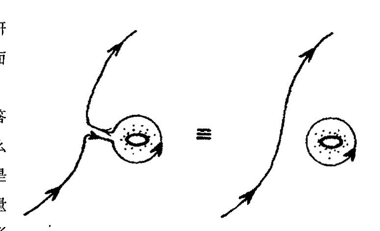
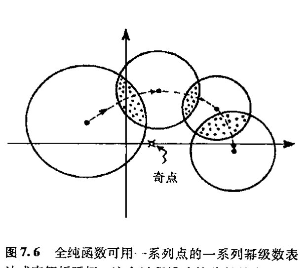
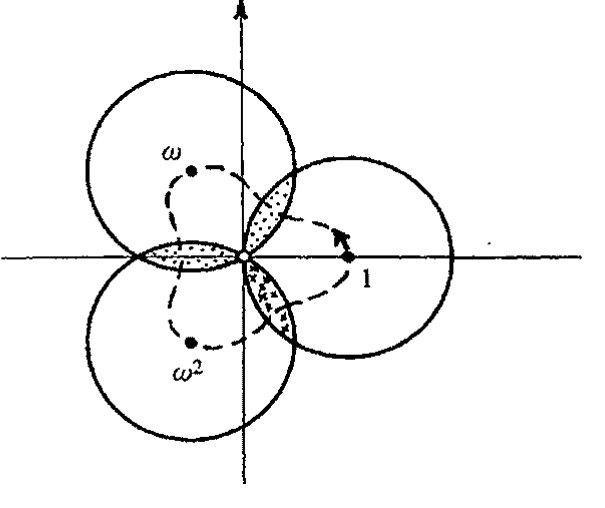

<!-- page 104 -->

第七章 复数微积分

第七章

# 复数微积分

## 7.1 复光滑，全纯函数

我们如何理解复函数 $f(z)$ 的可微概念呢？要在本书中对这个问题做充分说明显然是不合适的。¹ 即使是对 [§6.2](chapter_06.md#62-函数的斜率) 里的实函数我也没做细节展开。但我至少可以就所涉要点进行一些阐述。下面就是对实现复数微分所需的要点所作的一个简单介绍，在这之后我将对某些出人意料的方面稍作展开。

对复数微分，大体上说，我们要求复曲线 $w = f(z)$ 在函数定义域内的任意点 $z$ 上有“斜率”概念。（函数 $f(z)$ 及其变量 $z$ 都可取复值。）为使这个“斜率”概念有意义，当我们在 $z$ 的复平面上沿任意方向变动 $z$ 时，$f(z)$ 必须满足一对特定的方程，称为柯西–黎曼方程²（包括 $f(z)$ 的实部和虚部关于 $z$ 的实部和虚部的导数，见 [§10.5](chapter_10.md#105-柯西黎曼方程)）。这些方程给出了一些有关复数积分的相当有趣的结果——它使我们能够定义新的称为周线积分的积分概念。根据这种周线积分，我们可导出关于 $f(z)$ 的 $n$ 阶导数的一个漂亮公式。这样，一旦我们有了一阶导数，所有高阶导数也就迎刃而解了。

然后，我们再用这个公式得到 $f(z)$ 的泰勒级数的各个系数，同时必须证明这个级数收敛到 $f(z)$。有了这些结果之后，我们就得到了 $f(z)$ 在 $z$ 复平面上某个圆内的泰勒级数表达式，$f(z)$ 在其中有定义并可微。你会发现，这是个奇迹：复光滑的任意复函数必然都是解析的！

与此相应的是，复分析在确认某些“粘合”的 $C^\infty$ 函数（如上一章的“$h(x)$”）的求极限方面没有任何问题。复光滑的力量一定会让欧拉感到欣慰。（不幸的是，欧拉有点生不逢时，当柯西在 1821 年首次发现这种复光滑的神奇力量时，欧拉已去世 38 年了。）我们看到，复光滑为函数的“欧拉”概念提供了一种比幂级数展开更为节省的表达方式。而且从复数观点看，这种函数还带来另外的好处。回想一下，让人头痛的“$1/x$”看上去像是“一个函数”，尽管实曲线 $y = 1/x$ 是由分离的两段组成，就是说这两段之间不存在“解析的”连接点。而从复数上看，显然 $1/z$ 就是一个函数。函数在复平面上唯一“出错”的地方就是原点 $z = 0$。如果我们从复平面上抠掉这一

<!-- page 105 -->

通向实在之路

点，剩下的仍是一个连通的区域。$x<0$ 的实线部分与 $x>0$ 的部分通过复平面连接。因此，$1/z$ 确实是一个连通的复函数，这与实数情形有很大的不同。

这种意义上的复光滑（复解析）函数称为全纯的。全纯函数在我们后面的内容里占有重要的地位。我们将看到，在第8章，其重要性表现在将共形映射与黎曼曲面联系起来；在第9章则反映在傅里叶级数（波动理论的基础）上。它们在量子力学和量子场论方面也起着至关重要的作用（见[§24.3](chapter_24.md#243-量子力学里能量的正定性)和[§26.3](chapter_26.md#263-无穷维代数)）。它们还是某些新物理理论发展的基础（特别是在扭量理论（第33章）和弦论（[§31.5](chapter_31.md#315-原初的强子弦论), 11, 12）中更是如此）。

## 7.2 周线积分

诚如[§7.1](#71-复光滑全纯函数)所说，虽然这里不便于给出数学论证的所有细节，但我们不妨看看其概貌。特别是周线积分，它能给读者带来某种理解上的方便。首先，我们来回顾一下上一章给出的定积分的记法，不过现在我们要用复变量 $z$ 来取代以前的实变量 $x$：

$$\int_a^b f(z)\,dz = g(b) - g(a),$$

124

这里 $g'(z) = f(z)$。在实数情形，这个积分是从实线上一点 $a$ 积到实线上另一点 $b$。沿实线从 $a$ 到 $b$ 只有唯一一条路径。但在复公式里，我们可以将 $a$ 和 $b$ 看成是复平面上的两点。从 $a$ 到 $b$ 有不止一条路径，而是有无数条路径。柯西－黎曼方程告诉我们的是，如果我们沿着某条路径³积分，那么得到的结果与沿另一条路径得到的结果是一样的，这另一条路径可以在函数定义域内通过对第一条路径进行连续形变来得到。（见图7.1。这一性质是[§12.6](chapter_12.md#126-外导数)所述的“外运算基本定理”的一个简单情形的结果。）对某些函数，如 $1/z$，定义域有一个“洞”（对 $1/z$ 情形这个洞就是 $z=0$），因此从 $a$ 到 $b$ 可有根本不同的路径。这里所谓“根本不同的”是指在函数定义域内一条路径无法通过连续形变而成为另一条路径。在此情形下，$a$ 到 $b$ 的积分值对不同路径会有不同的答案。

图7.1 从 $a$ 到 $b$ 的不同路径。全纯函数沿某条路径积分的结果与沿 $f$ 的定义域内另一条路径得到的结果是一样的。如果某个函数的定义域内有“洞”（例如 $1/z$ 函数在 $z=0$ 处），那么路径间的形变就会有障碍，因此得到的将是不同的答案。

这里有必要澄清（或更正）一点。当我谈到一条路径可以通过连续形变而成为另一条路径时，我是指数学家所谓的同调形变，不是指同伦形变。对于同调形变，在路径上切去彼此对等的一段是合法的，只要截去的部分方向相反，见图7.2。能够通过形变由此及彼的两条路径称为属于同一个同调类。相反，同伦形变不容许这种剪切。满足不容许这种剪切的由此及彼形变的两条路径称为属于同一个同伦类。同伦曲线总是同调曲线，但反之不一定成立。在连续运动中，同伦

·86·

<!-- page 106 -->

第七章 复数微积分

和同调是等价的。因此，它们都是拓扑学的研究对象。我们后面会看到，拓扑学的各个方面在其他领域也起着重要作用。

图 7.2 在同调形变中，路径的某些部分可以彼此抵消，如果它们的路径方向正好相反的话。有时这会产生一个分离的环。

函数 $f(z)=1/z$ 就是一种路径不同调时答案不唯一的函数。我们从对数上可看到为什么必然如此。在上一章末我们曾指出，$\log z$ 是 $1/z$ 的不定积分。（实际上，我们只针对实变量 $x$ 进行过论述，但个中道理对相应的复数情形也是适用的。这是一个一般性的原理，我们也用到其他显函数上。）因此我们有

$$\int_a^b \frac{dz}{z} = \log b - \log a$$

但从 [§5.3](chapter_05.md#53-多值性自然对数) 我们知道，复对数可以有不同的“答案”，而且我们可以从一个答案连续变换到另一个答案。为了说明这一点，我们固定 $a$ 而使 $b$ 变动。我们可以让 $b$ 沿正向（逆时针）绕原点连续转一周（[图 7.3](assets/page106_fig02.jpg)(a)），最后回到原出发地。从 [§5.3](chapter_05.md#53-多值性自然对数) 可知，$\log b$ 的虚部就是幅角（即 $b$ 沿正向绕实轴转过的角，见图 5.4(b)）。因此转动带来的是幅角严格增加 $2\pi i$（[图 7.3](assets/page106_fig02.jpg)(b)）。这样，当积分路径沿正向绕原点转一周，积分值也增加了 $2\pi i$。

我们可以按闭周线来重新得到这个结果，其存在性是复分析最具特色和最有力的一个方面。我们来考虑两条路径之间的差别，就是说，我们先将第二条路径变换成第一条，然后再按反方向对第一条进行变换（[图 7.3](assets/page106_fig02.jpg)(c)）。我们在同调的意义上来考虑这种差别，因此可以截去“返回

图 7.3 （a）从 $a$ 到 $b$ 积分 $z^{-1} dz$ 得到 $\log b - \log a$。（b）固定 $a$，令 $b$ 绕原点逆时针转一圈，则 $\log b$ 增加 $2\pi i$。（c）然后沿原路径再返回到 $a$。（d）当自 $a$ 始的重合路径被切去后，剩下的是一个逆时针闭周线积分 $\oint z^{-1} dz = 2\pi i$。

<!-- page 107 -->

通向实在之路
===========

126 两次”的部分，并对余下部分通过连续变形进行取直。于是我们得到一条闭合路径——周线——仅绕原点转一圈的环（[图 7.3](assets/page106_fig02.jpg)(d)），它与 $a$ 或 $b$ 的位置无关。这是一个（闭）周线积分的例子，通常用符号 $\oint$ 表示。我们发现，*[7.1]

e-1$，则 $z^n$ 在避开可能奇点的区域内有原函数 $z^{n+1}/(n+1)$。沿任意闭周线积分原函数的全微分，起点和终点相同，所以积分为 $0$。

    对 $n\ge0$，这在整个复平面上成立。对 $n<-1$，虽然原点是奇点，但 $z^{n+1}/(n+1)$ 仍是在去掉原点后的单值原函数；绕原点一圈后原函数值不变，因此闭周线积分仍为 $0$。唯一例外是 $n=-1$，原函数是多值的 $\log z$，绕原点会增加 $2\pi i$。

$$\oint \frac{dz}{z} = 2\pi i$$

当然，在用这个符号时，我们必须仔细弄清楚实际所用的周线是哪一条——或干脆说，用的周线属哪个同调类。如果周线绕了两次（沿正向），则我们得到的是 $4\pi i$。如果是沿反向（即顺时针）绕原点一次，则答案是 $-2\pi i$。

127 有趣的是，用闭周线得到非平凡解的这种性质强烈依赖于复对数的多值性，这是对数定义所带来的繁复性的一个特点。这并不奇怪，实际上，复分析的力量正取决于此。在下面的两个自然段里，我将概述这种性质的含义。我希望非数学出身的读者能够从中有所领悟。我相信这种讨论能够反映出数学论证中所具有的那种地道的、惊人的性质。

## 7.3 复光滑幂级数

上述表达式是著名的柯西公式的一个特殊情形（常数函数 $f(z) = 2\pi i$），它是根据围绕原点的周线积分来表示一个全纯函数的值：⁴

$$\frac{1}{2\pi i} \oint \frac{f(z)}{z} dz = f(0)$$

这里，$f(z)$ 在原点是全纯的（即在任何包括原点的区域内都是光滑的），周线是仅包围原点的某个环——或是去掉原点的函数定义域内同调于该周线的任何一个环。由此，我们有一个明显的事实，即函数在原点的取值完全等同于它在原点周边的一系列点上的取值。（柯西公式基本上就是柯西–黎曼方程与上述表达式 $\oint z^{-1} dz = 2\pi i$ 在取小环极限时的共同推论，这里不打算给出细节证明。）

如果在柯西公式里不用 $1/z$，而是用 $1/z^{n+1}$，这里 $n$ 是某个正整数，则我们得到的是“高阶”柯西公式，它给出 $f(z)$ 在原点的 $n$ 阶导数 $f^{(n)}(z)$：

$$\frac{n!}{2\pi i} \oint \frac{f(z)}{z^{n+1}} dz = f^{(n)}(0)$$

（$n!$ 见 [§5.3](chapter_05.md#53-多值性自然对数)。）我们可以指出，这个公式经 $f(z)$ 的幂级数检验是“正确的”，*[7.2]但这相当于用未经证明的结果来举证，因为我们还不知道其幂级数展开是否存在，甚至不知道 $f(z)$ 的 $n$ 阶导数是否存在。现在我们只知道 $f(z)$ 是复光滑的，并不知道它是否具有高于一阶的可微性。但是，我们就先用该公式作为 $f(z)$ 在原点的 $n$ 阶导数的定义。然后再将这个“定义”与麦克劳林公式 $a_n =$

---

*[7.1] 解释：当 $n$ 为不等于 $-1$ 的整数时，为什么有 $\oint z^n dz = 0$？

??? question "答案 [7.1]"
    若 $n\ne -1$，则 $z^n$ 在避开可能奇点的区域内有原函数 $z^{n+1}/(n+1)$。沿任意闭周线积分原函数的全微分，起点和终点相同，所以积分为 $0$。

    对 $n\ge 0$，这在整个复平面上成立。对 $n<-1$，虽然原点是奇点，但 $z^{n+1}/(n+1)$ 仍是在去掉原点后的单值原函数；绕原点一圈后原函数值不变，因此闭周线积分仍为 $0$。唯一例外是 $n=-1$，原函数是多值的 $\log z$，绕原点会增加 $2\pi i$。

*[7.2] 将 $f(z)$ 的麦克劳林级数代入积分来证明这一点。

??? question "答案 [7.2]"
    设 $f(z)=\sum_{r\ge 0}a_r z^r$，并把它代入积分：$\oint f(z)z^{-n-1}dz=\sum_{r\ge 0}a_r\oint z^{r-n-1}dz$。由 [7.1]，除非指数 $r-n-1=-1$，即 $r=n$，所有项的积分都为零。

    剩下的一项是 $a_n\oint z^{-1}dz=2\pi i a_n$。乘上 $n!/(2\pi i)$，得到 $n!a_n$。而麦克劳林级数中 $a_n=f^{(n)}(0)/n!$，所以结果正是 $f^{(n)}(0)$。

·88·

<!-- page 108 -->

## 第七章 复数微积分

$f^{(n)}(0)/n!$ 相结合来求得幂级数的系数（见[§6.4](chapter_06.md#64-欧拉的-函数概念)）

$$a_0 + a_1 z + a_2 z^2 + a_3 z^3 + a_4 z^4 + \cdots,$$

经过一番工作，我们能够证明这个级数确实在含原点的某个区域内收敛到 $f(z)$。因此，函数在原点附近有由公式给出的 $n$ 阶导数。***[7.3] 这种做法包含了证明的要点，它说明包围原点的区域上的复光滑确实意味着函数在原点是（复）解析的（即是全纯的）。

rac{1}{2\pi i}\oint_C f(\zeta)/(\zeta-z)\,d\zeta$，其中 $z$ 在圆内。

    当 $|z|<|\zeta|$ 时，$1/(\zeta-z)=\zeta^{-1}(1-z/\zeta)^{-1}=\zeta^{-1}\sum_{n\ge0}(z/\zeta)^n$。代回并逐项积分，得 $f(z)=\sum_{n\ge0}\left\{
rac{1}{2\pi i}\oint_C f(\zeta)\zeta^{-n-1}d\zeta
ight\}z^n$。这给出一个在小圆内收敛的幂级数，并且其系数就是高阶柯西公式给出的导数系数。因此复光滑推出局部解析。

显然，在上面的讨论中，原点没有任何特殊性。像[§5.3](chapter_05.md#53-多值性自然对数)所做的一样，利用泰勒级数我们同样可以给出 $f(z)$ 关于复平面上另一点 $p$ 点处的幂级数。为此我们只要将原点移至 $p$ 点就可得到“原点位移后”的柯西公式

$$\frac{1}{2\pi i} \oint \frac{f(z)}{(z-p)} dz = f(p),$$

和 $n$ 阶导数表达式

$$\frac{n!}{2\pi i} \oint \frac{f(z)}{(z-p)^{n+1}} dz = f^{(n)}(p),$$

这里周线环绕的是复平面上的 $p$ 点。因此，复光滑意味着在定义域内处处解析（全纯性）。

我选择说明论证的基础，即局部上看，复光滑意味着解析性，而不是单纯地要求读者盲目相信其结果，是因为这是一种数学家经常采用的得到结果的有效方法。不论是论证的前提（$f(z)$ 是复光滑的）还是结果（$f(z)$ 是解析的）都不包含对周线积分概念或复对数多值性概念的暗示。但是，这些内容为找到正确答案提供了关键线索。我们很难看出有什么“直接”的方法能够做到这一点。关键还在于数学的可鉴赏性。复对数本身的诱人性质就是我们用其进行研究的一个原因。这种内在的魅力显然与对数在其他领域可能的应用无关。其实在很大程度上我们对周线积分的考虑也是如此。基本概念里总具有某种异乎寻常的优美品质，这包括自由的拓扑性和高度的精确性。***[7.4] 何况还不仅仅是这些完美品质——周线积分还为各不同领域提供了一种强有力的有用的数学工具，它具有复数的各种神奇性质。特别是，它提供了一种估算定积分和无穷级数求和的神奇方法。***[7.5]***[7.6] 它在物理和工程上，在数学的其他分支上，都有许多应用。欧拉要是知道该有多高兴！

e0}1/m^2-\pi^2/3=0$。因此 $2\sum_{m\ge1}1/m^2=\pi^2/3$，即 $\sum_{m\ge1}1/m^2=\pi^2/6$。正文末式若写作 $\pi/6$，应为少了一个平方。

---

*** [7.3] 至少从形式上证明所有这些，不必是严格论证。

??? question "答案 [7.3]"
    形式证明的核心是把柯西公式当作起点。取围绕原点的小圆 $C$，若 $f$ 在圆及其内部全纯，则 $f(z)=(2\pi i)^{-1}\oint_C f(\zeta)/(\zeta-z)\,d\zeta$，其中 $z$ 在圆内。

    当 $|z|<|\zeta|$ 时，$1/(\zeta-z)=\zeta^{-1}(1-z/\zeta)^{-1}=\zeta^{-1}\sum_{n\ge 0}(z/\zeta)^n$。代回并逐项积分，得 $f(z)=\sum_{n\ge 0}\{(2\pi i)^{-1}\oint_C f(\zeta)\zeta^{-n-1}d\zeta\}z^n$。这给出一个在小圆内收敛的幂级数，并且其系数就是高阶柯西公式给出的导数系数。因此复光滑推出局部解析。

*** [7.4] 在一个闭周线 $\Gamma$ 上，或在除了 $f$ 有极点的有限点集之外的 $\Gamma$ 内，函数 $f(z)$ 处处是全纯的。从[§4.4](chapter_04.md#44-韦塞尔复平面)我们知道，在 $z=\alpha$ 位置上出现 $n$ 阶极点的 $f(z)$ 有形式 $h(z)/(z-\alpha)^n$，这里 $h(z)$ 在 $\alpha$ 位置是正则函数。证明：$\oint f(z) dz = 2\pi i \times \{$ 这些极点的留数之和 $\}$，其中极点 $\alpha$ 上的留数为 $h^{n-1}(\alpha)/(n-1)!$。

??? question "答案 [7.4]"
    在每个极点 $\alpha$ 附近写 $f(z)=h(z)/(z-\alpha)^n$，并把 $h$ 在 $\alpha$ 展开为 $h(z)=\sum_{r\ge 0}h^{(r)}(\alpha)(z-\alpha)^r/r!$。于是 $f$ 的洛朗展开中 $(z-\alpha)^{-1}$ 的系数是 $h^{(n-1)}(\alpha)/(n-1)!$，这就是留数。

    将原周线在同调意义下收缩为围绕各极点的小圆之和。除 $(z-\alpha)^{-1}$ 项外，小圆积分全为零；该项积分为 $2\pi i$。所以 $\oint f(z)dz=2\pi i$ 乘以所有极点留数之和。

*** [7.5] 通过在如下组成的闭周线 $\Gamma$ 上积分 $ze^{iz}$ 证明 $\int_0^\infty x^{-1} \sin x \, dx = \frac{\pi}{2}$，该周线由从 $-R$ 到 $-\varepsilon$、从 $\varepsilon$ 到 $R$，（$R>\varepsilon>0$）两部分和上半平面上半径分别为 $R$ 和 $\varepsilon$ 的两个半圆弧组成。然后令 $\varepsilon \to 0$ 和 $R \to \infty$。

??? question "答案 [7.5]"
    应积分的函数应理解为 $e^{iz}/z$（题中文字若写成 $ze^{iz}$，与所求积分不符）。在上半平面的钥匙孔形周线上，$e^{iz}/z$ 除原点外全纯；原点由小半圆避开。

    大半圆上因 $e^{iz}=e^{ix-y}$ 衰减，积分在 $R\to\infty$ 时趋于 $0$。小半圆绕原点上方顺时针走过半圈，贡献趋于 $-i\pi$。实轴两段给出主值 $\int_{-\infty}^{\infty}e^{ix}/x\,dx$。总和为零，故该主值为 $i\pi$。取虚部即得 $\int_{-\infty}^{\infty}\sin x/x\,dx=\pi$；被积函数为偶函数，所以 $\int_0^\infty x^{-1}\sin x\,dx=\pi/2$。

*** [7.6] 通过在大周线上（譬如说以原点为中心的边长 $2N+1$ 的正方形，$N$ 是一个大数）积分 $f(z)=z^{-2}\cot\pi z$（见注释5.1），然后令 $N\to\infty$ 来证明 $1+\frac{1}{2^2}+\frac{1}{3^2}+\frac{1}{4^2}+\cdots=\frac{\pi}{6}$。（提示：利用练习[7.5]，求出 $f(z)$ 的极点和留数。并证明为什么当 $N\to\infty$ 时 $f(z)$ 的周线积分趋于零。）

??? question "答案 [7.6]"
    标准归一化通常取 $f(z)=\pi z^{-2}\cot\pi z$。在非零整数 $m$ 处，$\cot\pi z$ 的留数为 $1/\pi$，所以 $\pi z^{-2}\cot\pi z$ 的留数为 $1/m^2$。在 $z=0$，用 $\pi\cot\pi z=1/z-\pi^2z/3+\cdots$，得 $\pi z^{-2}\cot\pi z=z^{-3}-(\pi^2/3)z^{-1}+\cdots$，留数为 $-\pi^2/3$。

    大正方形上积分趋于零，于是所有留数之和为零：$\sum_{m\ne 0}1/m^2-\pi^2/3=0$。因此 $2\sum_{m\ge 1}1/m^2=\pi^2/3$，即 $\sum_{m\ge 1}1/m^2=\pi^2/6$。正文末式若写作 $\pi/6$，应为少了一个平方。

·89·

<!-- page 109 -->

通向实在之路

## 7.4 解析延拓

现在我们有了绝好的结果：某区域上的复光滑等价于在该区域的任一点上存在幂级数展开。但我应当把这里的“区域”解释得更清楚一点。技术上说，我这里指的是数学家们所谓的开区域。所谓某一点 $a$ 处于区域内，是指存在一个以 $a$ 为圆心的圆，它的内部也都处于该区域内。这么说可能不是很直观，让我们来看一个例子。一个单点不是一个开区域，也不是通常的曲线。但复平面上单位圆的内部，即那些距原点距离严格小于单位长的点组成的点集，则是开区域。这是因为任何一个严格处于该圆之内的点，不论它多么靠近边界，总可以用一个更小的圆来包围，而这个更小的圆的内部仍严格处于单位圆内（[图 7.4](assets/page109_fig01.jpg)）。另一方面，由那些距原点距离严格小于或等于单位长的点组成的闭圆盘则不是开区域，因为此时包括了圆周边界，而圆周上的任意一点则不具有上述性质，即不存在包围该点的一个圆，其内部均处于该区域之内。

现在我们来考虑某个全纯函数 $f(z)$ 的定义域$^5$ $D$，这里我们取 $D$ 为开区域。在 $D$ 上的每一点，函数 $f(z)$ 都是复光滑的。因此，由上述可知，如果我们取定 $D$ 中某一点 $p$，则在含 $p$ 的某个适当区域内有 $f(z)$ 关于 $p$ 的收敛的幂级数。这个“适当”区域有多大呢？大致可以这么说，对一个特定的 $p$，幂级数不可能在整个 $D$ 上都成立。回忆一下 [§4.4](chapter_04.md#44-韦塞尔复平面) 的收敛圆可知，这是以 $p$ 为中心的某个圆（半径可以无限大），对严格处于该圆内的点，幂级数收敛，但对严格处于该圆外的点 $z$ 则不收敛。假定 $f(z)$ 在 $q$ 点有奇点，即在该点上 $f(z)$ 不可能延拓同时保持复光滑（例如，原点 $q=0$ 是 $f(z)=1/z$ 的奇点，见 [§7.1](#71-复光滑全纯函数)。奇点通常是指函数的“奇异点”，正则点则是函数非奇异的地方，从而也是全纯的地方），那么收敛圆就不能大到将 $q$ 包含到其内部。因此我们有大大小小一系列收敛圆（通常数目上无限大），它们总合起来覆盖整个 $D$，而不是用单独一个圆来覆盖它。$f(z)=1/z$ 的情形图示了这个问题（[图 7.5](assets/page109_fig02.jpg)）。这里定义域 $D$ 是去掉

·90·

<!-- page 110 -->

第七章 复数微积分

---

原点的复平面。如果在D中选取一点p,则收敛圆就是以p为圆心过原点的圆。***[7.7] 我们需要无穷多个这样的圆来覆盖整个区域D。

这向我们提出了一个重要的解析延拓的问题。假定有一个在某定义域D内全纯的函数 $f(z)$，我们来考虑这样一个问题：我们能够将D延拓到更大的区域 $D'$ 使得 $f(z)$ 在 $D'$ 上也是全纯的吗？例如，$f(z)$ 取特定收敛圆内收敛的幂级数形式，我们要将 $f(z)$ 延拓到圆外。这常常是可能的。在[§4.4](chapter_04.md#44-韦塞尔复平面)，我们考虑了级数 $1-z^2+z^4-z^6+\cdots$，它有单位圆作为收敛圆，同时可自然延拓到函数 $(1+z^2)^{-1}$，它在去掉两点 $+i$ 和 $-i$ 的整个复平面上是全纯的。因此，这个例子表明，函数确实可解析延拓到远大于原初给定的定义域上。

在这个例子中，我们能够写出一个清楚的函数公式，但在更多的场合下这并不容易。尽管如此，我们毕竟有了一个用以解析延拓的一般程序。我们可以这么来做：先从某个小区域开始，在该区域上我们有全纯函数 $f(z)$ 的一个局部有效的幂级数表达式。然后我们试着沿某条路径在不同点不断重复应用幂级数来延拓函数。我们沿路径取一系列点，并对每个点取幂级数，这样就得到了一系列幂级数表达式。只要这一系列收敛圆的内部是相互重叠的，这么做就是可行的（图7.6）。这个程序执行完，则

图7.6 全纯函数可用一系列点的一系列幂级数表达式来解析延拓。这个过程沿连接路径是唯一的，如果相应的收敛圆相互重叠的话。

结果函数也就由函数在原区域的取值和沿路径的延拓唯一地确定了。

因此，这个解析延拓的过程显示了全纯函数的“刚性”。而在实 $C^\infty$ 函数情形，对函数的作用我们可能会“随时改变主意”（像[§6.3](chapter_06.md#63-高阶导数cinfty-光滑函数)的光滑补丁 $h(x)$，它对所有负的 $x$ 值会突然取零而“截断”），而这在全纯函数上是不可能发生的。函数一旦在原区域取定，路径也取定，则函数拓展的选择是唯一的。事实上，这一性质对实变量的实解析函数也是成立的，它们不仅有类似的“刚性”，而且路径也基本上是唯一的，只有一个方向或沿实线方向。而在复函数情形，由于二维复平面上路径的自由度要大得多，因此解析延拓也更有趣。

为了说明这一点，我们仍来考虑 $\log z$。由于它在原点的奇异性，显然它在原点没有幂级数展开式。但如果我们愿意，我们可以作关于点 $p=1$ 的展开，即得到级数***[7.8]

$$\log z = (z-1) - \frac{1}{2}(z-1)^2 + \frac{1}{3}(z-1)^3 - \frac{1}{4}(z-1)^4 + \cdots$$

收敛圆是以 $z=1$ 为圆心的单位圆。我们围绕原点按逆时针方向取一系列这样的单位圆来进行解

---

*** [7.7] $f(z)=1/z$ 在点 $p$ 的幂级数是什么？

??? question "答案 [7.7]"
    把 $z$ 写成 $p+(z-p)$，则 $1/z=1/(p+(z-p))=p^{-1}(1+(z-p)/p)^{-1}$。在 $|z-p|<|p|$ 内使用几何级数，得到 $1/z=p^{-1}-p^{-2}(z-p)+p^{-3}(z-p)^2-p^{-4}(z-p)^3+\cdots$。

    收敛半径正是到奇点 $0$ 的距离 $|p|$，这就是图 7.5 所说的收敛圆。

*** [7.8] 导出这个级数。

??? question "答案 [7.8]"
    写 $z=1+u$。由于 $d\log(1+u)/du=1/(1+u)$，而 $1/(1+u)=1-u+u^2-u^3+\cdots$ 在 $|u|<1$ 内成立，逐项积分并用 $\log 1=0$ 确定常数，得 $\log(1+u)=u-u^2/2+u^3/3-u^4/4+\cdots$。

    令 $u=z-1$，即得到正文中的展开。其收敛半径为 $1$，因为最近的奇点/分支点在 $z=0$。

<!-- page 111 -->

通向实在之路

析延拓。我们可以取关于点 1，$\omega$，$\omega^2$，等等最后回到 1 的一系列幂级数，这样围绕原点转一圈最后回到出发点（[图 7.7](assets/page111_fig01.jpg)）。图中我用了 [§5.4](chapter_05.md#54-复数幂) 末讨论的三次方单位根 $1$，$\omega=e^{2\pi i/3}$ 和 $\omega^2=e^{4\pi i/3}$，绕原点的路径取等边三角形。当然，我也可以取 $1$，i，$-1$，$-i$，$1$，那样要稍微麻烦点儿。但不管怎样，我们都没必要写出幂级数，因为我们已经知道了函数本身的明确答案，即 $\log z$。问题是当我们绕原点转了一圈后，发现已将函数唯一地扩展为不同于起初的一个新的值。就是说，我们转了一圈，函数增加了 $2\pi i$。如果我们沿反方向转一圈，则需从原函数值上减去 $2\pi i$。因此，解析延拓的唯一性可以是非常敏感的，它唯一取决于所取的路径。对比 $\log z$ 更复杂的多值函数，我们依然可以通过较增加一个常数（如 $2\pi i$）更复杂的操作来得到某个值。

顺便指出，解析延拓的概念不必特指幂级数，尽管事实上它们在我的一些描述中很管用。例如，在数论里，就有另一类级数起着重要作用，它们称为狄利克雷级数。其中最重要的当属（欧拉–）黎曼 $\zeta$ 函数，^6^ 它定义为下述的无限和 ^7

$$\zeta(z)=1^{-z}+2^{-z}+3^{-z}+4^{-z}+5^{-z}+\cdots,$$

当 $z$ 的实部大于 1 时它收敛到全纯函数 $\zeta(z)$。这个函数的解析延拓在去掉点 $z=1$ 之外的整个复平面上是唯一的（并且是“单值的”）。如今最重要的未解决数学问题大概要算是黎曼猜想了，它与解析延拓了的 $\zeta$ 函数的零点有关，即与 $\zeta(z)=0$ 的解有关。对 $z=-2,-4,-6,\cdots$ 容易看出它们是 $\zeta(z)=0$ 的解，这些是实零点。黎曼猜想认为，所有其余的零点都处于 $\operatorname{Re}(z)=\frac{1}{2}$ 的直线上，就是说，仅当 $z$ 的实部等于 $\frac{1}{2}$ 时，$\zeta(z)$ 为零（除非 $z$ 是负偶数）。所有的数值计算都支持这个猜想，但它的真理性至今尚不得而知。它对素数理论有着基本的深远影响。^8

注　释

134　[§7.1](chapter_07.md#71-复光滑全纯函数)

7.1　对那些想系统了解这个问题的几何细节的读者，我建议你们去看 Needham（1997）。

7.2　我将在 [§10.5](chapter_10.md#105-柯西黎曼方程) 引入偏微分概念之后再给出这些公式。

[§7.2](chapter_07.md#72-周线积分)

7.3　说得更明确点儿，$f$ “沿”路径 $z=p(t)$（$p$ 是实参数 $t$ 的光滑复值函数）的积分可表示为定积分
$$\int_u^v f(p(t))\,p'(t)\,\mathrm{d}t=\int_a^b f(z)\,\mathrm{d}z\,,$$
这里 $p(u)$ 是路径起点 $a$ 的值，$p(v)$ 是终点 $b$ 的值。

[§7.3](chapter_07.md#73-复光滑幂级数)

· 92 ·

<!-- page 112 -->

# 第七章 复数微积分

7.4 柯西公式必定为真的“理由”是，对绕原点的小闭合圆环，$f(z)$ 实际上可看成是一个常数 $f(0)$，于是这种情形退回到 [§7.2](#72-周线积分) 的研究。

7.5 这是这方面术语让人烦恼的地方。“域（domain）”有两重意义。一个是“复平面上连通的开区域”，我们这里不用这重意义。另一个就是我们这里所用的（如前 [§6.1](chapter_06.md#61-如何构造实函数)）函数 $f$ 被定义的复平面区域，它不必是开的或是连通的。

7.6 欧拉最早考虑了这种 $\zeta$ 函数，但通常总是用黎曼来命名，以纪念他在将这个函数拓展到复平面上所做的基础性工作。

7.7 注意这个级数与通常幂级数 $(-z)+(-z)^2+(-z)^3+\cdots=-z(1+z)^{-1}$ 之间“上下”的奇妙关系。

7.8 有关 $\zeta$ 函数和黎曼猜想的进一步内容请见 Apostol（1976），Priestley（2003）。通俗评述见 Derbyshire（2003），du Sautoy（2003），Sabbagh（2002），Devlin（1988，2002）。
