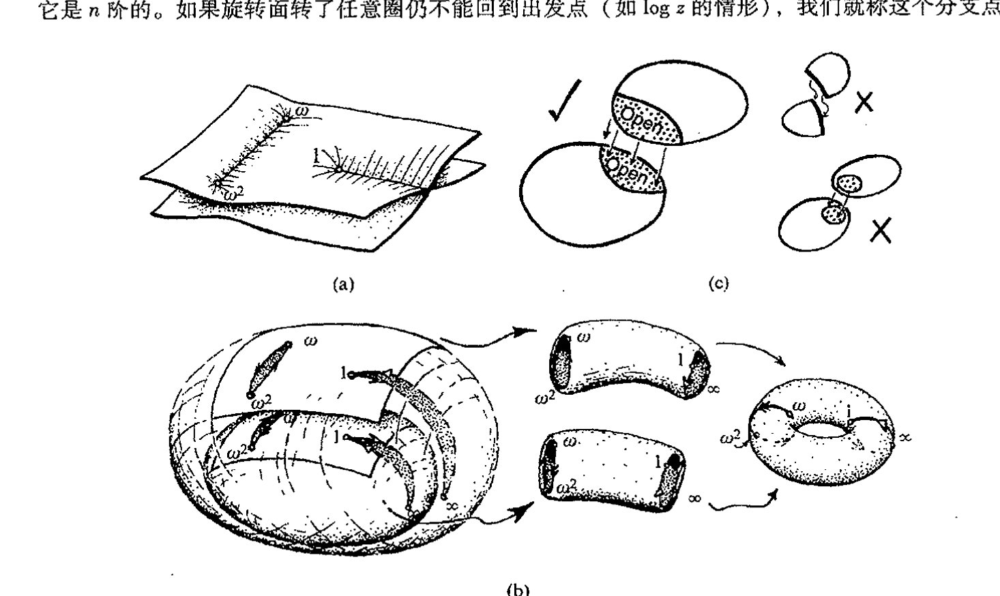
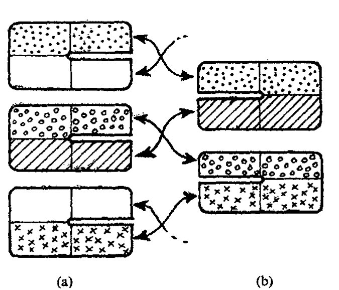
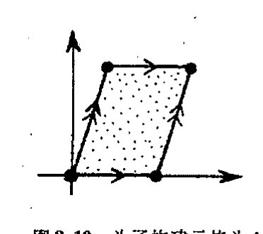
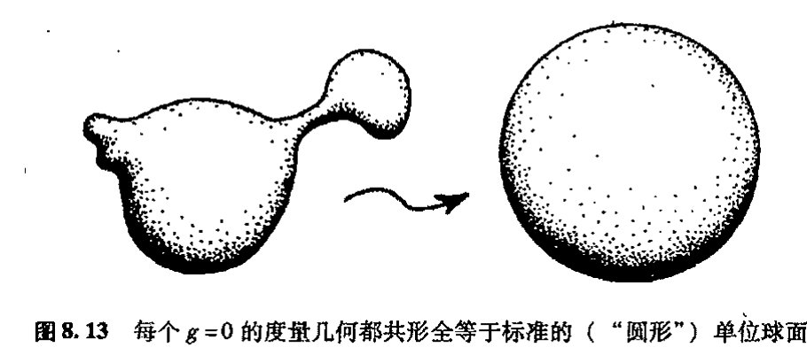
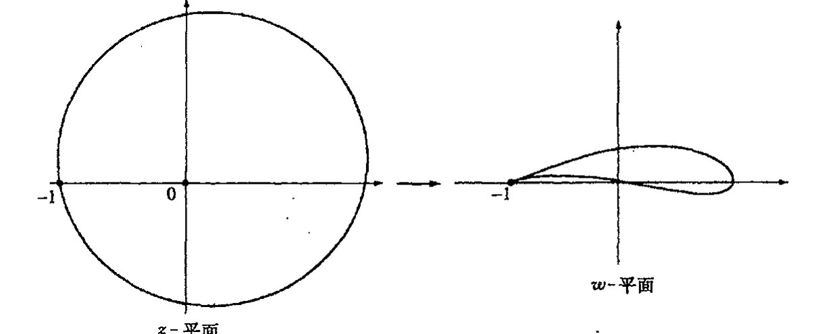

<!-- page 113 -->

通向实在之路

第八章

# 黎曼曲面和复映射

## 8.1 黎曼曲面概念

这里，我们给出一种理解对数函数——或其他任意“多值函数”——的解析延拓的方法，这就是基于所谓黎曼曲面的方法。黎曼的思想是将函数看成是定义在这样一种定义域上，它不是复平面的简单子集，而是一个多层区域。以 log z 为例，其图像就是一个绕垂直轴旋转而下直到复平面的倾斜螺旋面，见[图 8.1](assets/page113_fig01.jpg)。对数函数在这个多叶螺旋复平面上是单值的，因为我们每绕原点一周，对数就增加 2πi，这个值就处于上一叶的螺旋面上。这里各对数值之间不会有任何冲突，因为它的定义域是一种展开的环绕空间——黎曼曲面的一个例证——这是一种细节上不同于复平面本身的空间。

图 8.1 log z 的黎曼曲面，其图像是一个绕垂直轴旋转而下的倾斜螺旋面。

引入这一思想的黎曼（Bernhardt Riemann，1826～1866）是最伟大的数学家之一，在他短暂的一生里，他提出的许多数学思想深刻改变了数学的进程。在 [136] 本书中，我们还将遇到他的其他一些贡献，例如作为爱因斯坦广义相对论基础的那些概念（黎曼的另一项极其重要的贡献见第 7 章末尾所述）。在黎曼引入我们今天称之为“黎曼曲面”这一概念之前，数学家们一直对如何处理这些所谓的“多值函数”（对数只是其中最简单的一个例子）莫衷一是。为严格起见，许多人感到有必要以某种我个人很不赞同的方式来处理这类函数。（附带说一下，我在大学里学的仍旧是这种方式，尽管这距黎曼划时代的论文发表已过去了近一个世纪。）特别是，对数函数的定义域会被从原点到无穷远拉一条线这样一种随意的方式所“割裂”。在我看来，这是对庄严的数学结构的一种粗鲁的损毁。黎曼教导我们，应当用不同的方式来处理事情。全纯函数为什么必须像普通“函数”那样，理解为固定定义域到确定值域的映射？

·94·

<!-- page 114 -->

## 第八章 黎曼曲面和复映射

这实在是让人很不舒服。在解析延拓中我们看到，全纯函数“自己有脑子”确定自身的定义域该是什么样，这与我们最初派分给它的复平面区域基本无关。我们可以将函数的定义域表示为与函数有关的黎曼曲面，但这个定义域不是提前给定的。正是函数本身的显形式告诉我们定义域实际用的是哪一种黎曼曲面。

不久我们还将遇到各种其他类型的黎曼曲面。这个优美的概念在现代试图找到数学物理的新的基础——主要指弦论（[§31.5](chapter_31.md#315-原初的强子弦论), 13），也包括扭量理论（[§33.2](chapter_33.md#332-作为光线的扭量), 10）——方面发挥着重要作用。事实上，$\log z$ 的黎曼曲面只是这种曲面里最简单的一种。它只是提示我们其中都有什么。函数 $z^a$ 的黎曼曲面要比 $\log z$ 稍有意思些，但这也只是在 $a$ 为有理数时是如此。当 $a$ 是无理数时，$z^a$ 的黎曼曲面具有和 $\log z$ 的一样的结构，而在 $a$ 是有理数时，假设其最简形式为 $a=m/n$，则旋转面转了 $n$ 圈后将回到出发点。*[8.1]在所有这些例子中，原点 $z=0$ 称为分支点。如果旋转面转了 $n$ 圈后回到出发点（在 $z^{m/n}$ 中，$m$ 和 $n$ 无公因子），我们就说这个分支点有有限阶，或称它是 $n$ 阶的。如果旋转面转了任意圈仍不能回到出发点（如 $\log z$ 的情形），我们就称这个分支点

**图8.2** (a)由两叶构建的$(1-z^3)^{1/2}$的黎曼曲面，它在 $1,\omega,\omega^2$（和$\infty$）等处有阶数为 $2$ 的分支点。(b)为了看出$(1-z^3)^{1/2}$的黎曼曲面是拓扑上的环面，我们将(a)的面想象成带有割缝（分别为从 $\omega$ 到 $\omega^2$ 和从 $1$ 到 $\infty$）的两个黎曼球面，它们沿箭头所指方向粘合起来，形成相应的拓扑柱面，最后再粘合成环面。(c)为了构建黎曼曲面（或一般流形），我们将坐标空间的拼块粘合起来——这些拼块是复平面的开区域部分。拼块之间必须存在（开集）重叠（而且在并的情形下，例如上述的最后一种情形，必须不存在“非豪斯道夫分支”，见图 12.5(b)和[§12.2](chapter_12.md#122-流形与坐标拼块)）。

*[8.1] 解释为什么。

·95·

<!-- page 115 -->

通向实在之路

137

是无穷阶的。

表达式$(1-z^3)^{1/2}$对这一思想做了更清楚的注解。这个函数有3个分支点，分别是$z=1$，$z=\omega$和$z=\omega^2$（这里$\omega=e^{2\pi i/3}$，见[§5.4](chapter_05.md#54-复数幂)，[§7.4](chapter_07.md#74-解析延拓)），故$1-z^3=0$，另外还有一个“无穷分支点”。如果我们在每个分支点的紧邻域内绕分支点完整地转一圈（对“无穷分支点”，这意味着要绕一个大圈），会发现函数改变了正负号，再绕一圈，函数值又变回原初的值。因此我们看到，所有分支点都是2阶的。我们有两叶来构成黎曼曲面，它们按图8.2(a)所示的方式粘合起来。在图8.2(b)里，我采用某种拓扑弯曲来说明黎曼曲面实际上是一种环面拓扑结构，就像环状面包圈，只是多了4个小洞，它们对应于4个分支点本身。实际上，这些洞可以（用4个单点）毫不含糊地填补起来，这样黎曼曲面就有了严格的环面拓扑。**[8.2]

**[8.2] 试作$(1-z^4)^{1/2}$。

·96·

138

黎曼曲面是一般流形概念的第一个例子。流形是一种局部（即在点的足够小邻域内）“弯曲”的空间，它看上去像通常的欧几里得空间。我们在第10和12章里还会遇到更多的流形。在现代物理的许多领域中，流形概念都是至关重要的概念。特别是在爱因斯坦的广义相对论中，它具有核心地位。流形可看成是由许多不同的拼块拼贴而成的，这种拼贴是无缝的，这一点与[§6.3](chapter_06.md#63-高阶导数cinfty-光滑函数)末尾的$h(x)$函数大不一样。无缝拼贴的性质是指两个拼块之间总能够保证有适当的（开集）重叠（见图8.2(c)和[§12.2](chapter_12.md#122-流形与坐标拼块)的图12.5）。

在黎曼曲面情形，流形（即黎曼曲面本身）是由不同的“叶”所对应的复平面拼块粘合成一个整体而构成的。像上面的情形一样，最后也有几个有限阶分支点留下的“洞”，而这些洞也一样可以补起来。对于无穷阶分支点，事情要复杂些，这里很难作简单的一般性叙述。

作为例子，让我们来看看对数函数的“螺旋上升”的黎曼曲面。在纸模型上作这种粘合的一个方法，是按如下方式依次交替地取拼块进行粘合：(a) -拼块为去掉非负实数的复平面，(b) -拼块去掉非正实数的复平面。每个(a) -拼块的上半部分与下一个(b) -拼块的上半部分粘合，每个(b) -拼块的下半部分与下一个(a) -拼块的下半部分粘合，见图8.3。

图8.3 我们可通过如下依次交替地取拼块进行粘合的方式来构建$\log z$的黎曼曲面；(a)为去掉非负实数的复平面拼块，(b)为去掉非正实数的复平面拼块。每个(a)-拼块的上半部分与下一个(b)-拼块的上半部分粘合，每个(b)-拼块的下半部分与下一个(a)-拼块的下半部分粘合。

初始位置和无穷远位置上是无穷阶分支点——由此我们惊奇地发现，整个螺旋上升结构恰好等价于带有一个单洞的球面，这个洞同样可以补

<!-- page 116 -->

第八章 黎曼曲面和复映射

上从而形成完整的球面。**[8.3]

## 8.2 共形映射

有了流形之后，我们来考虑从一个拼块到另一个拼块的过渡过程中哪些局域结构得以保留。通常我们讨论的是实流形，各种不同的拼块都是（固定维）欧几里得空间的一部分，它们沿不同的（开）重合区域粘合成一个整体。相邻拼块的局域结构之间的匹配通常只是一个如何保持连续或光滑的问题。我们到 [§10.2](chapter_10.md#102-光滑偏导数) 再来讨论这个问题。但在黎曼曲面情形，我们关心的是复光滑，由 [§7.1](chapter_07.md#71-复光滑全纯函数) 我们知道，这是一个更为复杂的问题，涉及柯西－黎曼方程。虽然我们还未直接与它打过交道（我们在 [§10.5](chapter_10.md#105-柯西黎曼方程) 讨论这个问题），但不妨先了解一下这个方程所含结构的几何意义。这个结构非常完美、非常灵活和有力，它引出了具有广泛应用的数学概念。[139]

这个概念就是共形几何概念。大致上说，在共形几何里，我们感兴趣的是形状而不是大小，这里指的是无限小尺度下的形状。在从一个（开）平面区域到另一个（开）平面区域的共形映射下，有限大小的形状通常是要变形的，但无限小的形状则保持不变。我们认为这种性质可以用到平面上的小（无限小的）圆上。在共形映射下，这些小圆可扩张也可收缩，但不会变形成小椭圆。见图 8.4。

[图 8.4：共形映射下小圆保持圆形，非共形映射下小圆变为椭圆]

图 8.4 在共形映射下，小（无限小的）圆可扩张也可收缩，但不会变形成小椭圆。

为了加深对共形变换的理解，我们来看[图 2.11](assets/page042_fig01.jpg) 给出的埃舍尔的画，它提供了一种如 [§2.4](chapter_02.md#24-双曲几何共形图像) 所述的欧几里得平面下双曲平面的共形表示（贝尔特拉米的“庞加莱圆盘”）。双曲平面是非常对称的。特别是存在这样的变换，它将埃舍尔画的中心部分变换到紧靠约束圆内侧的相应的狭窄部分。我们可以把这种变换表示成取约束圆内部到自身的欧几里得平面的共形移动。显然，这样一种变换通常不保持单个图形的大小（因为中间部分远大于边缘部分），但形状大致可保持不变。当每个图形的细节取得越小，这种保形性就越精确，因此无限小形状就得以完全保持不变。读者或许会发现，有一种略微不同的特性更有用：共形变换下不变的曲线间夹角。它刻画了变换的共形本质。

对于某些函数 $f(z)$ 的复光滑（全纯）性，这种共形性质能作什么呢？我们试试看如何得到复光滑几何内容的直观图像。让我们回到函数 $f$ 的“映射”观点，将关系 $w=f(z)$ 看成是一种 $z$ 复平面（函数 $f$ 的定义域）到 $w$ 复平面（值域）的映射，见[图 8.5](assets/page117_fig01.jpg)。我们要问：什么样的局部几何性质能够[140]

** [8.3] 你能看出这是怎么回事吗？（提示：考虑变量 $w(=\log z)$ 的黎曼球面，见 [§8.3](#83-黎曼球面)。）

·97·

<!-- page 117 -->

通向实在之路

将映射塑造成全纯的？答案令人称奇。$f$ 的全纯性实际上等价于共形且非反射的映射（非反射——或保定向——是指变换中保形的小块形状不是反射的，即不是“颠倒的”，见 [§12.6](chapter_12.md#126-外导数)）。

图 8.5 映射 $w=f(z)$ 分别在 $z$ 复平面有开区域的定义域，在 $w$ 复平面有开区域的值域。函数 $f$ 的全纯性等价于这种共形且非反射的映射。

141

$w = f(z)$ 变换中的“光滑”概念是指在无限小极限情形下变换是如何操作的。先考虑实数情形，我们再回到 [§6.2](chapter_06.md#62-函数的斜率) 的实函数 $f(x)$ 情形，见图 6.4 的 $y = f(x)$ 的图。如果函数图在某一点有明确定义的切线，则函数 $f$ 在该点上是光滑的。我们可以通过想象来画这条切线：将过该点的曲线逐步放大，只要它是光滑的，那么随着放大倍数逐渐提高，过该点的曲线就会越来越像直线，最后在无穷大放大倍数的极限下它就等效为切线。复光滑的情形类似，只是需要把这一思想应用到从 $z$ 复平面到 $w$ 复平面的映射上。为了检验这种映射的无穷小性质，我们在一个平面上画出点 $z$ 的紧邻域，并将它映射到另一个平面上 $w$ 的紧邻域。而要检验点的这种紧邻域性质，我们想象用一个巨大的系数分别将 $z$ 和 $w$ 的邻域放大，在极限情形下，从 $z$ 的扩充邻域到 $w$ 的扩充邻域的映射就变成了简单的平面线性变换，但如果它是全纯的，那么这种变换基本上就是 [§5.1](chapter_05.md#51-复代数几何) 所研究的变换之一。由此可知，在一般情形下，从 $z$ 的邻域到 $w$ 的邻域的变换可简单地看成是一种带均匀扩充（或收缩）的转动，见 5.2(b)。也就是说，小的形状（或夹角）是不变的，而且没有反射，这说明这种映射确实是共形且非反射的。

我们来看几个例子。映射的特例之一是如 [§5.1](chapter_05.md#51-复代数几何) 所示的使 $z$ 加上一个常数 $b$ 或乘上一个常数 $a$（[图 5.2](assets/page078_fig03.jpg)），它们显然不仅是全纯的（$z + b$ 和 $az$ 显然都是可微的），也是共形的。这些是一般组合（非齐次线性）变换

$$w = az + b$$

的特例。这种变换给出平面的欧几里得运动（非反射）与均匀扩张（或收缩）的组合。事实上，它们是唯一的全复 $z$ 平面到全复 $w$ 平面的（非反射）共形映射。除此之外，它们还具有实际圆——不止是无限小圆——映射到实际圆，以及直线映射到直线的非常特殊的性质。

另一种简单全纯函数是互反函数

$$w = z^{-1},$$

它把去掉原点的复平面映射到去掉原点的复平面。神奇的是，这种变换也把实际圆映射到实际圆[^8.4]（这里我们认为直线是一种特殊的圆——即半径无穷大的圆）。这个变换与实轴的反射

[^8.4]: 证明这一点。

· 98 ·

<!-- page 118 -->

第八章 黎曼曲面和复映射

合在一起，就构成所谓的反演。而将它与前面考虑的非齐次线性映射相结合，则得到更一般的变换*[8.5]：

$$w = \frac{az + b}{cz + d},$$

它称作双线性或默比乌斯变换。由前面所述，这些变换也必定将圆映射为圆（直线看作是圆的一种特殊情形）。这个默比乌斯变换实际上将去掉点 $-d/c$ 的整个复平面映射到去掉点 $a/c$ 的整个复平面——作为完全非平庸映射的变换，我们要求 $ad \neq bc$（分子不是分母的固定倍数）。

注意，从 $z$ 平面去掉的点其值（$z = -d/c$）将给出“$w = \infty$”；相应地，从 $w$ 平面去掉的点其值（$w = a/c$）将给出“$z = \infty$”。实际上，如果我们将“$\infty$”包括进定义域和值域，那么整个变换将更具总体意义。这就是关于最简单（紧）黎曼曲面的一种思考方法：黎曼球面。

## 8.3 黎曼球面

简单地将额外的点“$\infty$”结合到复平面并不能使 $\infty$ 的邻域是否满足无缝结构要求这一问题得到彻底解决，对出现在其他地方的奇点同样如此。我们处理这个问题的方法，是将球面看作是由两个“坐标拼块”拼合而成的，一个是 $z$ 平面，另一个是 $w$ 平面。除两点外，整个球面划分为 $z$ 坐标和 $w$ 坐标（经由默比乌斯变换而关联）。而这两个点中，一个只有 $z$ 坐标（此处 $w$ 是“无穷远”），另一个只有 $w$ 坐标（此处 $z$ 是“无穷远”）。我们用 $z$ 或 $w$ 或同时用二者来定义所需的共形结构，这里同时用二者得到的共形结构与使用其中一种得到的是一样的，因为两坐标间关系是全纯的。

事实上，在 $z$ 和 $w$ 之间，我们不需要像一般默比乌斯变换那样复杂的变换。考虑下述这种特别简单的默比乌斯变换就已足够：

$$w = \frac{1}{z}, \qquad z = \frac{1}{w},$$

这里 $z = 0$ 和 $w = 0$ 都给出对方拼块上的 $\infty$。我在[图 8.6](assets/page119_fig01.jpg) 说明了这个变换如何映射 $z$ 的实轴和虚轴。

所有这些以一种相当抽象的方式定义了黎曼球面。通过[图 8.7](assets/page119_fig02.jpg)(a) 所示的几何，我们可以更清楚地看出为什么黎曼球面被称为“球面”。我取 $z$ 平面来表示这个几何球面的赤道面。球面上的点通过由南极发出的所谓球极平面投影被映射到这个赤道面上。这好比我从南极经赤道面上点 $z$ 画一条三维空间里的直线。这条直线再次与球面相遇的地方就是复数 $z$ 所代表的球面上的点。球面上有一个点，即南极点本身，他代表的是 $z = \infty$。为了看出 $w$ 如何符合这一图像，我们想象它的复平面是颠倒过来的（$w = 1, i, -1, -i$ 分别对应于 $z = 1, -i, -1, i$），而且球极

*[8.5] 验证：变换 $z \mapsto Az + B$, $z \mapsto z^{-1}$, $z \mapsto Cz + D$ 的结果确实是一种双映射。

·99·

<!-- page 119 -->

通向实在之路

---

**图8.6** 通过 $w=1/z$, $z=1/w$ 从 $z$ 复平面和 $w$ 复平面拼贴黎曼球面。（这里 $z$ 的网格线也显示在 $w$-复平面上。）除了原点 $z=0$ 和 $w=0$ 二者互给出对方拼块上的"$\infty$"点之外，其他区域均重叠。

**图8.7** (a) 作为单位球面的黎曼球面，其赤道面与（水平的）$z$ 复平面上的单位圆重合。球面上的点经南极点发出的直线被投影（按球极投影方式）到 $z$ 平面上，南极点本身给出 $z=\infty$。(b) 作为 $w$ 平面的赤道面的再解释。它被颠倒过来，但实轴不变，球极投影现在则由北极点（$w=\infty$）发出，这里 $w=1/z$。(c) 实轴是这个黎曼球面上的大圆，像垂直而不是水平画出的单位圆。

144

平面投影是从北极发出的（图8.7(b)）。**[8.6]** 球极平面投影的一个重要而又漂亮的性质是它把球面上的圆映射为平面上的圆（或直线）。¹ 因此，在球面上，双线性（默比乌斯）变换将圆变成圆。这个显著的事实对我们将在 [§18.5](chapter_18.md#185-作为黎曼球面的天球) 要遇到的相对论具有重要意义（它还与旋量理论和扭量理论有着深刻联系，见 [§22.8](chapter_22.md#228-自旋和旋量)，[§24.7](chapter_24.md#247-狄拉克方程)，[§33.2](chapter_33.md#332-作为光线的扭量), 4）。

我们注意到，从黎曼球面的观点看，实轴实则为“另一个圆”，与单位圆没有本质的区别，只是画在了垂直方向上而不是水平方向上（图8.7(c)）。通过转动我们就能由此及彼。转动是共形的，因此它可由球面到自身的全纯映射给出。实际上，取整个黎曼球面到自身的每一个（非

---

**[8.6]** 验证这两个球极平面投影的关系是 $w=z^{-1}$。

·100·

<!-- page 120 -->

第八章 黎曼曲面和复映射

反射）共形映射都是由双线性（默比乌斯）变换实现的，因此我们所考虑的特定转动可明确表现为双线性变换给定的两个复参数 $z$ 和 $t$ 的黎曼球面之间的关系^{***[8.7]}

$$t=\frac{z-1}{iz+i},\quad z=\frac{-t+i}{t+i}。$$

在[图 8.8](assets/page120_fig01.jpg) 中，我画出了 $t$ 和 $z$ 的复平面间的对应关系，其中特地标出了由实轴界定的 $t$ 的上半平面如何被映射到由单位圆界定的 $z$ 的单位圆盘。这个特殊变换对我们下一章的讨论很重要。

图 8.8 $t$ 和 $z$ 的复平面间的对应关系 $t=(z-1)/(iz+i)$，$z=(-t+i)/(t+i)$。由实轴界定的 $t$ 的上半平面被映射到由单位圆界定的 $z$ 的单位圆盘。

黎曼球面是最简单的紧——或者叫“闭”——黎曼曲面。^2 “紧”的概念见 [§12.6](chapter_12.md#126-外导数)。相反，前面所述的对数函数的“螺旋上升的”黎曼曲面则是非紧的。对于 $(1-z^3)^{1/2}$ 的黎曼曲面情形，我们需要补上分支点带来的四个洞来使它成为紧的（如果不补，它就是非紧的），这种“紧致化”就是我们通常要做的。正如早先所说的，用有限阶分支点来进行这种“填洞”工作总是可能的。在 [§8.1](#81-黎曼曲面概念) 我们看到，对于对数情形，我们可以用一个单点来填原点和无穷远点两处的分支点以便得到紧的黎曼曲面。实际上，存在一种紧黎曼曲面的完全分类（黎曼本人的成就），这种分类对许多领域（包括弦论）都是重要的。下面我来简单介绍一下这种分类。

## 8.4 紧黎曼曲面的亏格

首先我们按照曲面的拓扑来对其进行分类，就是说，按照曲面在连续变换中保持不变的性质来分类。二维可定向（见 [§12.6](chapter_12.md#126-外导数) 末）紧曲面是非常简单的。它可由称之为曲面亏格的单个自然数来给定。大致上说，我们要做的就是数一数曲面具有的“环柄”数。对于球面，亏格是 0，

---

*** [8.7] 证明这一点。

·101·

<!-- page 121 -->

通向实在之路

环面的亏格是 $1$。日常所用的茶杯的曲面亏格也是 $1$（$1$ 个环柄），因此它与环面在拓扑上是相同的。常吃的纽结状椒盐饼的亏格是 $3$。[图 8.9](assets/page121_fig01.jpg) 是一些例子。

**图 8.9** 黎曼曲面的亏格就是它的“环柄”数目。球面的亏格是 $0$，环面或茶杯状曲面的亏格是 $1$。常吃的纽结状椒盐饼的亏格是 $3$。

**图 8.10** 为了构建亏格为 $1$ 的黎曼曲面，我们取平行四边形界定的复平面区域，其顶点分别（依次标定）为 $0, 1, 1+p, p$，然后将对边粘合起来。量 $p$ 给出的是黎曼曲面的模。

$146$

除了亏格 $0$ 之外，亏格本身并不能确定曲面。我们还需要知道某些复参数，它们称为模。让我用环面（亏格 $1$）来解释这个问题。构造亏格 $1$ 的黎曼曲面的一种简单方法，是取一个由平行四边形界定的复平面区域，譬如说顶点分别为 $0, 1, 1+p, p$（依次标定）的区域，见[图 8.10](assets/page121_fig02.jpg)。现在，我们想象将这个四边形的对边粘合起来，即 $0$ 到 $1$ 的边与 $p$ 到 $1+p$ 的边相粘，$0$ 到 $p$ 的边与 $1$ 到 $1+p$ 的边相粘。（只要愿意，我们总能够找到其他拼块来覆盖缝。）粘合生成的黎曼曲面就是拓扑上等价的环面。可以证明，对不同的 $p$ 值，结果曲面通常并不彼此等价。就是说，我们不可能运用全纯映射从一个变换到另一个。（但也存在某些零散的等价关系，像用 $1+p$ 或用 $-p$ 或 $1/p$ 来取代 $p$ 形成的曲面之间的关系。***[8.8]）

**图 8.11** 两个不等价的环面拓扑型黎曼曲面。

$147$

考虑[图 8.11](assets/page121_fig03.jpg) 所示的两种情形，我们很容易从直观上理解不是所有具有相同拓扑的黎曼曲面都可以等价的。对其中的一个图形我取非常小的 $p$ 值，我们得到的是一个细长的环面，而另一个图形的 $p$ 值则取得接近 $i$，故而环面肥美。直观上可以很清楚地看出，这二者之间不可能共形等价，事实也的确是这样。

对亏格 $1$ 只存在一个复模数 $p$，但对亏格 $2$ 我们发现有三个复模数。为了能像对亏格 $1$ 我们构造了平行四边形那样，通过粘贴来构造亏格 $2$ 的黎曼曲面，我们可以用双曲平面来构造所需的

*** [8.8] 证明这些位移给出全纯等价的空间。找出所有使这些等价物产生黎曼曲面的额外对称性的特殊 $p$ 值。

·102·

<!-- page 122 -->

## 第八章　黎曼曲面和复映射

形状，见[图 8.12](assets/page122_fig01.jpg)。这对更高亏格的情形也是成立的。对亏格 $g$（这里 $g \geqslant 2$）的复模数 $m$，有 $m = 3g - 3$。

图 8.12　超双曲平面的八角形区域，通过粘合产生亏格 2 的黎曼曲面。

人们或许会奇怪，复模数的公式 $3g-3$ 怎么会对所有亏格值 $g=2,3,4,5,\cdots$ 都有效，而只对 $g=0$ 或 $1$ 失效。对此我们有实际的“理由”，它必须结合复参数 $s$ 一起来考察，这个参数是规定黎曼曲面的不同的连续（全纯）自变换性质所需的。对 $g \geqslant 2$，不存在这种连续自变换（虽然存在离散的自变换），故 $s=0$。但对 $g=1$，[图 8.10](assets/page121_fig02.jpg) 的平行四边形的复平面可在平面内任意方向上平移（无转动的刚性运动）。位移量（和方向）可用单个复参数 $a$ 来具体确定，因此平移可通过 $z \mapsto z + a$ 来实现，故当 $g=1$ 时 $s=1$。在球面（亏格 0）情形，自变换是通过双线性变换来实现的，即 $z \mapsto (az+b)/(cz+d)$。这里自由度由三个³独立比值 $a:b:c:d$ 给定。因此对 $g=0$ 情形，我们有 $s=3$。[148] 这样，对所有情形，确定自变换所需的复模数和复参数之间的差 $m-s$ 满足

$$m - s = 3g - 3。$$

（这个公式还与更深层次的问题有关，但这已超出本书的范围了。⁴）

很显然，在通过共形（全纯）变换来改变黎曼曲面的表观“形状”，但同时保持黎曼曲面的结构性质不变方面，存在着相当大的自由度。例如，在球面拓扑情形，有许多度量几何都是可行的（如[图 8.13](assets/page122_fig02.jpg) 所示）；但它们都共形于标准（“圆形的”）单位球面。（在 [§14.7](chapter_14.md#147-度规能为你做什么) 我会更清楚地说明“度量”的概念。）而对于高亏格情形，表观上数量很大的关于曲面“形状”的自由度能够被削减为由上述公式给定的有限的几个复模数。但是，曲面的形状也还存在一些不受这种共性自由度（即由模本身规定的那些参数）约束的总体性质。这种自由度的应用在多大程度上有效是一个较难定论的问题。

图 8.13　每个 $g=0$ 的度量几何都共形全等于标准的（“圆形”）单位球面。

·103·

<!-- page 123 -->

通向实在之路

## 8.5　黎曼映射定理

但是，涉及全纯变换的众多自由度的判定可通过著名的黎曼映射定理来取得。这个定理是说，如果我们在复平面上有某个由非自交闭环界定的闭区域（见注释 8.1），则存在全纯映射将该区域匹配到闭单位圆（见[图 8.14](assets/page123_fig01.jpg)）。（环的“驯顺性”可以适当放宽，但这些避免不了环带有拐角或其他更糟糕的使环线不可导的形状，例子见[图 8.14](assets/page123_fig01.jpg)。）我们甚至可以比这走得更远，以相当随意的方式在环上取三个点 $a, b, c$，并认为它们映射到单位圆上的三个点 $a', b', c'$（譬如说 $a' = 1, b' = \omega, c' = \omega^2$），唯一的限定是点 $a, b, c$ 绕环的次序必须与 $a', b', c'$ 绕单位圆的次序相同。而且映射必须是唯一确定的。另一种唯一确定映射的方法，是在环上只取一点 $a$，而将另一点 $j$ 取在环内，然后认为 $a$ 映射到单位圆上的点 $a'$（譬如说 $a' = 1$），$j$ 映射到单位圆内的点 $j'$（譬如说 $j' = 0$）。

**图 8.14**　黎曼映射定理认为，由简单闭环（不必光滑）界定的复平面上的任何开区域都能够全纯映射到单位圆的内部，边界亦可作相应的映射。

现在，让我们想象着我们是在黎曼球面上而不是在复平面上应用黎曼映射定理。从黎曼球面的观点看，闭环的“内部”与环的“外部”具有相同的地位（如同从另一侧来看球面），因此定理可以平等地应用于环的外部和内部。这样，就存在一种“相反”形式的黎曼映射定理，它是说，复平面上环的外部可以映射到单位圆的外部，其唯一性可通过下述简单要求来保证：环上指定点 $a$ 映射到单位圆上的指定点 $a'$（譬如说 $a' = 1$），而 $j$ 和 $j'$ 则为 $\infty$ 所取代。⁵

这种所需的映射经常能够明确地实现，原因是它能够提供物理上感兴趣问题的解，例如对流过翼型物体的气流（在理想情形下，气流是所谓“无粘滞”、“不可压缩”和“非转动”的）的处理。我记得当我还是数学系本科生的时候，我曾对此感到非常惊讶，特别是著名的茹科夫斯基（E. N. Zhoukowski, 1847 ~ 1921）翼型变换理论，如[图 8.15](assets/page124_fig01.jpg) 所示，它可以通过如下变换明确地给出

$$w = \frac{1}{2}\left(z + \frac{1}{z}\right),$$

· 104 ·

<!-- page 124 -->

# 第八章 黎曼曲面和复映射

---

**图8.15** 茹科夫斯基变换 $w=\frac{1}{2}(z+1/z)$ 将过 $z=-1$ 的圆的外部变到翼型截面,使得通过机翼的气流模式变得可计算。

这是一种关于过点 $z = -1$ 的圆的变换。这个形状与 20 世纪 30 年代的飞机机翼截面形状非常相似，因此机翼附近的（理想）气流可直接从圆截面 “翼” 的形状得到，而后者又可以从另一种全纯变换来得到。（我曾被告知，飞机机翼之所以如此普遍地采用这种形状，就是因为人们可根据茹科夫斯基变换理论从数学上对它进行研究。我相信这不是真的！）

当然，这些知识的应用还涉及具体的假设和简化。不仅零粘滞性、不可压缩性和非旋转流体是出于方便而作的假设，而且将流体视同与翼长等长因此实质上的三维问题被完全缩减为二维问题也是非常大胆的简化。很明显，流过机翼流体的实际计算在数学处理上要远为复杂得多。但在实际处理过程中，我们没有理由认为我们可以抛开对像茹科夫斯基变换那样的全纯函数的直接完美的应用。你可以争辩说，在发现复数能够诱人地应用于现实世界里这个显然非常重要的问题方面，的确有着很强的幸运成分。大气无疑是由数目巨大的单个基本颗粒组成的（事实上，每立方厘米大约有 $10^{20}$ 个），因此气流的宏观描述涉及相当数量上的平均和近似。但这并不是说我们就一定需要空气动力学的数学方程将支配这些单粒子的物理定律的每一个数学公式都包括进来。

151

.在 §4.1 我曾指出过在 “最小尺度” 的物理作用上复数实际所扮演的 “超凡且又基本的角色”，在支配粒子行为方面（见 [§21.2](chapter_21.md#212-量子哈密顿量)）的确存在这样的全纯函数。但对于宏观系统，一般来说这种 “复结构” 变得完全被埋没了，只有在非常特殊的情况下（像上面所说的气流问题），复数和全纯几何才能表现出其自然的用途。但还有些场合，其中基本的复结构甚至可以在宏观水平上表现出来。这种情形有时我们能在麦克斯韦电磁理论和其他波动现象中看到，在相对论中也存在这种特别令人称奇的事例（见 [§18.5](chapter_18.md#185-作为黎曼球面的天球)）。在下一章，我们将看到复数和全纯函数在现象背后表现出的神奇性。

·105·

<!-- page 125 -->

通向实在之路

注释

§ 8.3

8.1 见练习 [2.5]。

8.2 在涉及曲面（或更一般的流形即 $n$ 维曲面，见第 12 章）方面，“闭合”一词的使用存在术语上的混乱。对于流形，“闭合”意味着“紧致但无界”，这与拓扑意义上单纯的“闭”概念大不相同，后者是 [§7.4](chapter_07.md#74-解析延拓) 讨论的“开”概念的互补概念。（拓扑上说，一个“闭集”就是一个包含了其所有极限点的集合。闭集的补集是开集，反之一样——这里，集合 S 在某个外围拓扑空间 V 内的“补集”是 V 的不在 S 内的元素组成的集合。）上面所说的“紧致但无界”概念中的“（边）界”一词也存在混乱，但本书不打算讨论它。对第 12 章所述的通常流形（即无界流形），“闭”流形概念（与拓扑流形概念相反）等价于“紧”流形概念。为了避免混淆，本书中我通常只用“紧”而不用“闭”这个词，只是在下述情形下是例外：对拓扑圆 $S^1$ 的实一维流形，我们用“闭曲线”来称呼；对空间紧致（即包含紧类空超曲面，见 [§27.11](chapter_27.md#2711-宇宙学)）的宇宙模型，我们称闭宇宙。

§ 8.4

8.3 如果我们将 $a, b, c, d$ 中的每一个都乘（重定标）以同一个非零复数，则变换不受影响，但如果我们分别改变它们，则变换也随之改变。这个总体重定标自由度减少了变换的一个独立参数，使之从 4 减为 3。

8.4 这可以说是另一个长长的故事的开始，其高潮是非常一般且强有力的阿蒂亚－辛格（Atiyah-Singer 1963）定理。

§ 8.5

8.5 应当指出，只有对精确为圆的环，两种黎曼映射定理的组合才可以给出完全光滑的黎曼球面。

---

· 106 ·
