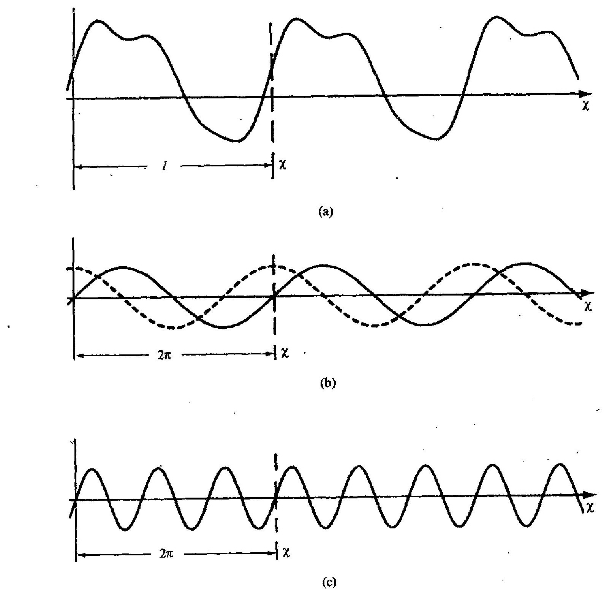
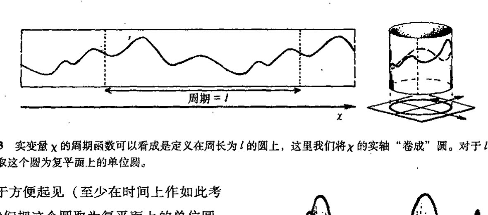
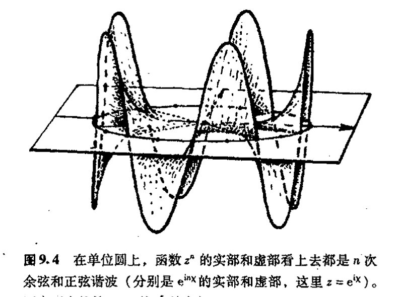
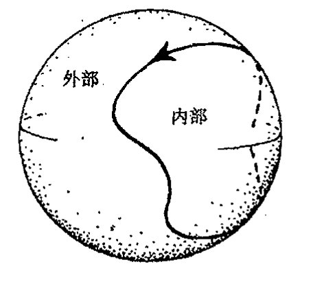
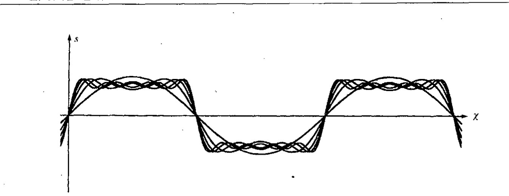
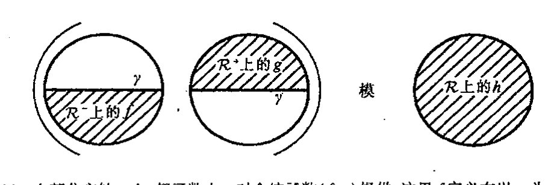

<!-- page 126 -->

第九章　傅里叶分解和超函数

第九章

# 傅里叶分解和超函数

## 9.1　傅里叶级数　153

让我们回到[§6.1](chapter_06.md#61-如何构造实函数)提出的欧拉和他的同时代人认为是可接受的“实在函数”问题上来。在[§7.1](chapter_07.md#71-复光滑全纯函数)，我们已说明了全纯（复解析）函数可能是欧拉最为满意的函数。但今天的大多数数学家会认为这样一种“函数”概念限定得毫无道理。孰对孰错？在本章末我们会给出这个问题的令人惊奇的答案。但首先我们得搞懂问题是什么。

在将数学应用到物理世界的问题的过程中，经常需要一种灵活性，而这是全纯函数和它的实搭档——解析（即$C^\infty$）函数——都不具有的。由于解析函数的唯一性（见[§7.4](chapter_07.md#74-解析延拓)的描述），定义在复平面某个连通开区域$\mathcal{D}$上的全纯函数的总体行为是完全确定的，如果我们知道了它在$\mathcal{D}$的某个小开子区域上的行为的话。类似地，定义在实线$\mathbb{R}$的某个连通片断$\mathcal{R}$上的实变量解析函数也是完全确定的，一旦函数在$\mathcal{R}$的某个小开子区域上已知的话。这种刚性对于物理系统的实际模型来说似乎是不恰当的。

当我们考虑波的传播时，会发现这种刚性显得特别别扭。波的传播，包括像射频波或光的电磁信号的发送，其功效大都在于信息可通过这种方式传递。毕竟信号传递的全部意义就在于能够使接受者得到意想不到的信息。如果信号形式必须采用解析函数的形式，那么就不可能在信息中“改变主意”。信号的任何一小部分都会使整个信号始终完全确定。而实际上我们经常是根据如何不连续，或偏离解析性来研究波的传播的。

我们来考虑如何从数学上描述波。研究波的一种最有效的方式是通过著名的傅里叶分析来进行。约瑟夫·傅里叶（Joseph Fourier，1768~1830）是一位法国数学家。他一直关注的一个问题是如何将周期性振荡分解成“正弦波”分量。在音乐中，这个问题基本上就是如何将某个乐音表示成其组分“纯的基音”。“周期”一词是指经过一定时间周期就严格重复自身的模式（譬如说振荡物体的物理位移），它也可以指空间上的周期，像晶体、壁纸或远海水波等表现出的重

154

·107·

<!-- page 127 -->

通向实在之路

---

复性模式。数学上，我们说一个函数 $f$（譬如说关于实变量 $\chi$ 的函数¹）是周期性的，是指对所有 $\chi$，满足

$$f(\chi+l)=f(\chi),$$

这里 $l$ 是表示周期的固定数。因此，如果我们将 $y=f(\chi)$ 的图像沿 $\chi$ 轴“平移”一个量 $l$，它看上去将和以前一样（[图9.1（a）](assets/page127_fig01.jpg)）。（傅里叶用以处理函数的方法——傅里叶变换——将在[§9.4](#94-傅里叶变换)描述。）

“纯的基音”是一些像 $\sin\chi$ 或 $\cos\chi$ 这样的振荡模式（[图9.1（b）](assets/page127_fig01.jpg)）。这些模式有周期 $2\pi$，因为

$$\sin(\chi+2\pi)=\sin\chi,\quad\cos(\chi+2\pi)=\cos\chi,$$

这些关系在单复数 $e^{i\chi}=\cos\chi+i\sin\chi$ 的周期性中是显然的，

图9.1 周期函数。（a）如果对所有 $\chi$ 有 $f(\chi)=f(\chi+l)$，我们说函数 $f(\chi)$ 有周期 $l$，这意味着如果我们将 $y=f(\chi)$ 的图像沿 $\chi$ 轴移动 $l$，它看上去将和以前一样。（b）“纯基音” $\sin\chi$ 或 $\cos\chi$（如点画线所示）有周期 $l=2\pi$。（c）“高次谐频”纯音在周期 $l$ 的时间里振荡数次，它们仍有周期 $l$，同时还有更小的周期（如 $\sin3\chi$ 有周期 $l=2\pi$，同时还有更小的周期 $2\pi/3$）。

·108·

<!-- page 128 -->

第九章　傅里叶分解和超函数

$$e^{i(\chi+2\pi)} = e^{i\chi}.$$

我们在[§5.3](chapter_05.md#53-多值性自然对数)就见过它。如果我们打算把周期定为 $l$ 而不是 $2\pi$，那么我们就必须“重定标”函数中的 $\chi$，取 $e^{i2\pi\chi/l}$ 而不是 $e^{i\chi}$。相应地，实部和虚部 $\cos(2\pi\chi/l)$ 和 $\sin(2\pi\chi/l)$ 也有周期 $l$。但这不是唯一的。在周期 $l$ 内，振荡未必就只一次，函数可以振荡两次、三次直到 $n$ 次，这里 $n$ 是任意正整数（[图9.1](assets/page127_fig01.jpg)(c)），故我们发现，

$$e^{i\cdot 2\pi n\chi/l},\quad \sin\left(\frac{2\pi n\chi}{l}\right),\quad \cos\left(\frac{2\pi n\chi}{l}\right)$$

中的每一个都有周期 $l$（此外还有较小的周期 $l/n$）。在音乐中，这些表达式（$n=2, 3, 4, \cdots$）称为高次谐音。

傅里叶提出（并解决）的一个问题是如何将一般的周期为 $l$ 的函数 $f(\chi)$ 表示为纯基音的和。对每个 $n$，一般来说纯基音对总的和声的贡献表现为不同的幅度，而这种差异主要取决于波形（即取决于函数 $y=f(\chi)$ 图像的形状）。[图9.2](assets/page129_fig01.jpg)展示了一些简单的例子。但通常，对 $f(\chi)$ 有贡献的各种纯基音的数目是无限的。更具体地说，傅里叶所要求的，是 $f(\chi)$ 到其各纯基音分量的分解系数 $c,\,a_1,\,b_1,\,a_2,\,b_2,\,a_3,\,b_3,\,a_4,\,\dots$

$$f(\chi) = c + a_1\cos\omega\chi + b_1\sin\omega\chi + a_2\cos2\omega\chi + b_2\sin2\omega\chi + a_3\cos3\omega\chi + b_3\sin3\omega\chi + \cdots,$$

这里，为使表达式看上去更简洁，我是按照角频率 $\omega$ 来写的（这里的“$\omega$”与[§5.4](chapter_05.md#54-复数幂), 5的“$\omega$”不相干），$\omega=2\pi/l$。

有些读者可能会认为这个 $f(\chi)$ 表达式还是看起来太复杂——他们是对的。如果我们将 $\cos$ 和 $\sin$ 整合为复指数形式（$e^{iA\chi}=\cos A\chi + i\sin A\chi$），这个公式就漂亮多了，因此，

$$f(\chi) = \cdots + \alpha_{-2}e^{-2i\omega\chi} + \alpha_{-1}e^{-i\omega\chi} + \alpha_0 + \alpha_1 e^{i\omega\chi} + \alpha_2 e^{2i\omega\chi} + \alpha_3 e^{3i\omega\chi} + \cdots,$$

这里\*[9.1]

$$a_n = \alpha_n + \alpha_{-n}\quad b_n = i\alpha_n - i\alpha_{-n},\quad c = \alpha_0$$

其中 $n=1,\,2,\,3,\,4,\,\dots$。如果我们取 $z=e^{i\omega\chi}$，并定义函数 $F(z)$ 为 $f(\chi)$ 的同型复变量 $z$ 的函数，那么这个表达式会更简洁。这时我们有

$$F(z) = \cdots + \alpha_{-2}z^{-2} + \alpha_{-1}z^{-1} + \alpha_0 z^0 + \alpha_1 z^1 + \alpha_2 z^2 + \alpha_3 z^3 + \cdots,$$

这里

$$F(z) = F(e^{i\omega\chi}) = f(\chi).$$

我们还可以通过运用求和号 $\sum$ 使它变得更简洁，“$\sum$”的意义是“对所有整数 $r$ 值，将所有项加起来”：

$$F(z) = \sum \alpha_r z^r.$$

---

\*[9.1] 证明这一点。

??? question "答案 [9.1]"
    用欧拉公式 $\cos n\omega\chi=(e^{in\omega\chi}+e^{-in\omega\chi})/2$ 和 $\sin n\omega\chi=(e^{in\omega\chi}-e^{-in\omega\chi})/(2i)$。若 $f$ 写成实三角级数 $c+\sum_{n>0}(a_n\cos n\omega\chi+b_n\sin n\omega\chi)$，则 $e^{in\omega\chi}$ 的系数是 $(a_n-ib_n)/2$，$e^{-in\omega\chi}$ 的系数是 $(a_n+ib_n)/2$。

    反解即 $a_n=\alpha_n+\alpha_{-n}$，$b_n=i\alpha_n-i\alpha_{-n}$，常数项为 $c=\alpha_0$。

·109·

<!-- page 129 -->

通向实在之路

---

**图9.2** 周期函数的傅里叶分解的例子。波的形状（图像的尖锐程度）取决于傅里叶系数。各函数极其傅里叶分量如下：(a) $f(x)=\frac{2}{3}+2\sin x+\frac{1}{3}\cos 2x+\frac{1}{4}\sin 2x+\frac{1}{3}\sin 3x$。(b) $f(x)=\frac{1}{2}+\sin x-\frac{1}{3}\cos 2x-\frac{1}{4}\sin 2x-\frac{1}{5}\sin 3x$。

这看上去有点像幂级数（[§4.3](chapter_04.md#43-幂级数的收敛)）。只是容许出现负幂次项。它称为洛朗级数。在下一节里

·110·

<!-- page 130 -->

第九章 傅里叶分解和超函数

我们将看到这个表达式的重要性。**[9.2]

## 9.2 圆上的函数

洛朗级数确实为我们提供了一种傅里叶级数的简洁的表达式。但这种表达式隐含着关于傅里叶分解的另一种有趣的观点。由于周期函数可无穷次地重复出现，因此我们可认为这种（实变量 $\chi$ 的）函数是定义在圆上的（[图 9.3](assets/page130_fig01.jpg)），这里函数的周期 $l$ 就是圆的周长，$\chi$ 度量绕过圆的弧长。这些弧长不是直线，而是绕圆进行，因此周期性自动包含其中。

**图9.3** 实变量 $\chi$ 的周期函数可以看成是定义在周长为 $l$ 的圆上，这里我们将 $\chi$ 的实轴“卷成”圆。对于 $l=2\pi$，我们取这个圆为复平面上的单位圆。

出于方便起见（至少在时间上作如此考虑），我们把这个圆取为复平面上的单位圆，其周长为 $2\pi$，也就是说，周期 $l$ 是 $2\pi$。相应地，

$$\omega = 1 \text{，故 } z = e^{i\chi}。$$

（对其他的周期值，我们只需适当重定标变量 $\chi$ 来重申 $\omega$。）由傅里叶分解的各个“纯基音”表示的不同的 $\cos$ 和 $\sin$ 项，现在可简单地表示为 $z$ 的正或负次幂，即第 $n$ 阶谐波的 $z^{\pm n}$。在单位圆上，这些幂恰好给出我们所需的 $\cos$ 和 $\sin$ 振荡项，见[图 9.4](assets/page130_fig02.jpg)。

**图9.4** 在单位圆上，函数 $z^n$ 的实部和虚部看上去都是 $n$ 次余弦和正弦谐波（分别是 $e^{inx}$ 的实部和虚部，这里 $z=e^{ix}$）。图中画出的是 $n=5$ 的 $z^5$ 的实部。

现在我们有了非常简练的表达周期函数 $f(\chi)$ 的傅里叶分解的方法。我们把 $f(x) = F(z)$ 看成是定义在 $z$ 平面的单位圆上，这里 $z=e^{ix}$，于是傅里叶分解正好是这个函数在复参数 $z$ 下的洛朗级数表示。但好处还不仅限于简练。这种表示还提供了对傅里叶级数性质及其所表示的函数

---

**\*\* [9.2]** 证明：若 $F$ 在单位圆上是解析的，则系数 $a_n$ 从而 $a_n$, $b_n$ 和 $c_n$ 可由公式 $a_n = (2\pi i)^{-1} \oint z^{-n-1} F(z) dz$ 获得。

??? question "答案 [9.2]"
    若 $F(z)=\sum_{m=-\infty}^{\infty}\alpha_m z^m$ 在单位圆附近的圆环内解析，则 $z^{-n-1}F(z)=\sum_m \alpha_m z^{m-n-1}$。沿单位圆积分时，除 $m=n$ 的 $z^{-1}$ 项外，其余幂次积分为零。

    因而 $(2\pi i)^{-1}\oint z^{-n-1}F(z)dz=\alpha_n$。再由 [9.1] 的关系即可得到通常正弦、余弦系数。

· 111 ·

<!-- page 131 -->

通向实在之路

性质的更深刻的认识。从本书的最终目的来说，更紧要的是它与量子力学有着重要联系，因此有助于加深我们对大自然的理解。这一切还反映了复数的神奇性，因为当 $z$ 越出单位圆时我们仍能够用洛朗级数表达式。业已证明，对 $z$ 处于单位圆上的情形，这个级数会依据 $z$ 在单位圆外时级数的性态来告诉我们某些关于 $F(z)$ 的重要信息。

159
现在，让我们（从 [§4.4](chapter_04.md#44-韦塞尔复平面)）回顾一下收敛圆的概念，就是说，在这个圆内幂级数收敛，而在圆外幂级数发散。洛朗级数也有非常类似的对应概念：收敛圆环。这是复平面上严格处于两个以原点为圆心的同心圆之间的区域（[图 9.5](assets/page132_fig01.jpg)(a)）。一旦我们有了通常幂级数的收敛圆的概念，对此很容易理解。具有正幂的级数部分³
$$
F^- = \alpha_1 z^1 + \alpha_2 z^2 + \alpha_3 z^3 + \cdots
$$

160
有普通的收敛圆，其半径譬如说为 $A$，对所有其模小于 $A$ 的 $z$ 值，级数收敛。而对于具有负幂的级数部分，即
$$
F^+ = \cdots + \alpha_{-3} z^{-3} + \alpha_{-2} z^{-2} + \alpha_{-1} z^{-1},
$$
我们将其理解为倒参数 $w = 1/z$ 的普通幂级数。它在 $w$ - 平面内有收敛圆，譬如说其半径为 $1/B$，对所有其模小于 $1/B$ 的 $w$ 值，级数收敛。（我们这里讨论的实际上是第 8 章所述的黎曼球面——见[图 8.7](assets/page119_fig02.jpg)，$z$ 坐标对应于一个半球，$w$ 坐标对应于另一个半球，见[图 9.5](assets/page132_fig01.jpg)(b)。下一节我们再探讨这种黎曼球面的特性。）因此，对于其模大于 $B$ 的 $z$ 值，级数的负幂部分将收敛。只要 $B < A$，这两个收敛区域就将重叠，于是我们得到整个洛朗级数的收敛圆环。注意，函数 $f(\chi) = F(e^{i\chi}) = F(z)$ 的整个傅里叶级数或洛朗级数是由
$$
F(z) = F^+ + \alpha_0 + F^-
$$
给定的，这里必须包括附加的常数项 $\alpha_0$。

在目前情形，我们要求的是在单位圆上收敛，因为正是在此我们才有 $z = e^{i\chi}$（对实数 $\chi$），当 $z$ 处在单位圆上时，$f(\chi)$ 的傅里叶级数收敛问题其实就是 $F(z)$ 的洛朗级数的收敛问题。因此，我们似乎需要 $B < 1 < A$ 来保证单位圆确实处于收敛圆环之内。对傅里叶级数的收敛性而言，这是否意味着我们必须要求单位圆处于收敛圆环之内？

如果 $f(\chi)$ 是解析的（即 $C^\omega$），情形确实如此。于是函数 $f(\chi)$ 可扩展为函数 $F(z)$，它在包括单位圆的某个开区域上是全纯的。⁴ 但如果 $f(\chi)$ 不是解析的，那么就会出现一种有趣的情形。在这种情形下，要么收敛圆环收缩变成单位圆本身——严格说来，对真正的收敛圆环这是不容许的，因为收敛圆环必须是开区域，而单位圆则不是——要么单位圆变成收敛圆环的外边界或内边界。这些问题在 §§ 9.6, 7 会变得很重要。

161
眼下，我们先考虑 $f(\chi)$ 不是解析的会发生什么情况，并考虑 $f(\chi)$ 为解析时的较简单情形。然后我们有 $z$ 平面内严格处于 $F(z)$ 的真正收敛圆环内的单位圆，它由（以原点为圆心）半径 $A$ 和 $B$ 的圆界定（$B < 1 < A$）。洛朗级数的正幂部分 $F^-$ 收敛到 $z$ 平面内其模小于 $A$ 的那些点；负幂

· 112 ·

<!-- page 132 -->

# 第九章 傅里叶分解和超函数

部分 $F^{+}$ 则收敛到 $z$ 平面内其模大于 $B$ 的那些点。因此，二者都收敛到收敛圆环本身之内（在非常平凡的意义上，常数项 $a_0$ 显然对所有 $z$ 均“收敛”）。这使我们看到，$f(z)$ “劈裂”为两部分，一部分全纯成分处于外圆之内，另一部分全纯成分处于内圆之外，它们分别定义为级数表达式 $F^{-}$ 和 $F^{+}$。

关于常数项 $a_0$ 是否包含于 $F^{-}$ 或 $F^{+}$ 内这一点还有些模糊之处。实际上，存留这点模糊或许更好。因为 $F^{-}$ 和 $F^{+}$ 之间存在对称性，如果我们采用黎曼球面的图像，这点会变得更清楚（[图 9.5](assets/page132_fig01.jpg)b）。它使我们有了一种更完整的图像，下面让我们来探讨这一问题。

图 9.5 (a) 洛朗级数 $F(z)=F^{+}+a_0+F^{-}$ 的收敛圆环，这里 $F^{+}=\cdots+a_{-3} z^{-3}+a_{-2} z^{-2}+a_{-1} z^{-1}$，$F^{-}= a_1z^1+a_2z^2+a_3z^3+\cdots$。由 $w=z^{-1}$，$F^{+}$ 的收敛半径为 $A$，$F^{-}$ 的为 $B^{-1}$。(b) 黎曼球面上（见图 8.7）的情形亦同样，这里 $z$ 指扩展了的北半球，$w\left(=z^{-1}\right)$ 指扩展了的南半球。

## 9.3 黎曼球面上的频率剖分

坐标 $z$ 和 $w(=1 / z)$ 给出了两个覆盖黎曼球面的拼块。单位圆变成了球的赤道面，圆环现在成了赤道面的“项圈”。我们把劈裂的 $F(z)$ 看成是两部分的和，一部分全纯地扩展到南半球——称为 $F(z)$ 的正频率部分——如 $F^{+}(z)$ 所定义，并加上所选的常数项；另一部分全纯地扩展到北半球——称为 $F(z)$ 的负频率部分——如 $F^{-}(z)$ 所定义，并加上常数项的剩余部分。如果我们忽略掉常数项，那么这个劈裂就唯一地取决于向两半球扩展的全纯性要求。**[9.3]

这么做常常是方便的：我们用画在黎曼球面上的圆（或其他闭曲线）的取向来指称圆的“内”或“外”。单位圆在 $z$ 平面上的标准取向是按标准 $\theta$ - 坐标增加的方向即逆时针方向为正方向的。如果我们颠倒这个取向（例如用 $-\theta$ 取代 $\theta$），则正、负频率发生交换。一般闭环的取向约定也与此一致。如果“钟面”处于环内，则取向是逆时针的；反之，如果“钟面”处于环外，

** [9.3] 你能看出为什么吗？

??? question "答案 [9.3]"
    正频率部分只含 $z,z^2,\ldots$，所以可全纯延拓到单位圆内部；负频率部分只含 $z^{-1},z^{-2},\ldots$，改用 $w=1/z$ 后就是 $w,w^2,\ldots$，所以可全纯延拓到外部即北半球。

    若两个这样的分解只差一个既能延拓到南半球又能延拓到北半球的函数，那么它给出整个黎曼球面上的全纯函数。紧黎曼球面上的全纯函数只能是常数。因此除常数项如何分配外，分解唯一。

· 113 ·

<!-- page 133 -->

通向实在之路

则取向是顺时针的。这种约定规定了有向闭环的“内”和“外”。[图 9.6](assets/page133_fig01.jpg) 能够澄清这一问题。

162

在 [§24.3](chapter_24.md#243-量子力学里能量的正定性) 和 [§26.2](chapter_26.md#262-产生算符和湮没算符)-4 我们将看到，函数剖分为正、负两个频率部分这一点对量子理论至关重要，特别是对量子场论。我这里给出的具体公式并不是这种频率剖分的最常见的形式，但它在许多不同场合（特别是在旋量理论中，见 [§33.10](chapter_33.md#3310-扭量与正负频率剖分)）有莫大的好处。常用公式并不像关心傅里叶展开那样直接关心全纯性的扩张。正频率部分通常由 $e^{-inx}$ 的倍数给定，这里 $n$ 为正。相反，$e^{inx}$ 的倍数给出负频率部分。正频率函数完全由正频率分量组成。

然而，这种描述并未完全反映出频率剖分的全部内容。有许多黎曼球面到自身的全纯映射，它们将每个半球映射到自身，但却不保北极或南极点（即 $z=0$ 或 $z=\infty$ 的点）。**[9.4] 这些映射保正/负频率剖分，但不保单个的傅里叶分量 $e^{-inx}$ 或 $e^{inx}$。因此，剖分为正、负频率的问题（对量子理论至为关键）是比挑出单个傅里叶分量更为一般的概念。

在通常的量子力学讨论中，正/负频率剖分涉及的是时间 $t$ 的函数，我们一般并不把时间看成是走过一个圆，但我们可以用简单的变换从 $\chi$ 绕圆行一圈来得到 $t$ 的整个范围：从“过去的极限” $t=-\infty$ 到“未来的极限” $t=\infty$。这里我将 $\chi$ 的取值范围规定为两极限 $\chi=-\pi$ 和 $\chi=\pi$ 之间区域（因此 $z=e^{i\chi}$ 按逆时针方向行遍复平面上整个单位圆，从 $z=-1$ 出发最后又回到 $z=-1$，见[图 9.7](assets/page133_fig02.jpg)）。这样的变换可由下式给出

$$t = \tan \frac{1}{2}\chi。$$

163

**图 9.6** 安排给黎曼球面上闭环的“内”和“外”的定向定义如下：环内定向为“钟面”的逆时针方向（环外为顺时针方向）。

**图 9.7** 在量子力学里，正/负两个频率剖分是指时间 $t$ 的未必是周期性的函数。如果我们用 $t$ 到 $z$（$=e^{i\chi}$）的变换，那么在整个 $t$ 区域（从 $-\infty$ 到 $+\infty$）上，我们仍可运用图 9.5 的剖分，这时我们按逆时针绕单位圆转圈，从 $z=-1$ 出发又回到 $z=-1$，故 $\chi$ 从 $-\pi$ 到 $\pi$。）

---

**[9.4]** 这些映射中哪些是显映射？

??? question "答案 [9.4]"
    在本书的用法中，“显映射”指由明确公式给出的点到点映射。圆盘与上半平面之间的默比乌斯变换、圆上变量 $z=e^{i\theta}$ 与角变量之间的对应，以及后面把圆极限为实线的变换，都是显映射。

    相比之下，单纯把一个函数分成正、负频率部分不是底空间点的显映射，而是对函数空间的线性操作；它由投影或周线积分给出，不是正文所说的几何显映射。

· 114 ·

<!-- page 134 -->

这个关系图由[图 9.8](assets/page134_fig01.jpg) 给出，简单的几何解释见[图 9.9](assets/page134_fig02.jpg)。

图 9.8　t = tan χ/2 的图像。

这个特殊变换的一个好处是它全纯地扩展到了整个黎曼球面，我们在 [§8.3](chapter_08.md#83-黎曼球面) 就考虑过这个变换（见[图 8.8](assets/page120_fig01.jpg)），它把单位圆（z 平面）变成实直线（t 平面）：**[9.5]

$$t=\frac{z-1}{iz+i},\quad z=\frac{-t+i}{t+i}。$$

z 平面上单位圆的内部对应于 t 平面的上半部，z 单位圆的外部对应于 t 平面的下半部。因此，t 的正频率函数是那些全纯扩展到 t 的下半平面的函数，负频率函数则全纯扩展到 t 的上半平面。（但技术上有一点需要额外考虑，这就是 t 平面的“∞”。但如果我们是在黎曼球面上考虑问题，而不是在复 t 平面上考虑问题，则这一点很容易处理。）

图 9.9　t = tan χ/2 的几何。

然而，时间坐标 t 下“正频率”概念的标准表述并不是按我在这里给出的特定形式来陈述的，而是按照 f(χ) 的所谓傅里叶变换来进行的。答案与我给出的实际上是一样的，⁵ 但由于傅里叶变换从各方面说对量子力学都是至关重要的，因此在这里有必要解释一下什么是傅里叶变换。

## 9.4　傅里叶变换

根本上说，傅里叶变换是傅里叶级数在周期函数 f(χ) 的周期 l 越来越大以至无穷时的极限情形。在这种极限情形下，函数 f(χ) 的周期没有任何限制：它就是一个普通函数。⁶ 当我们研

---

**[9.5] 证明：这个式子给出与上面给出的相同的 t。

??? question "答案 [9.5]"
    由第 8 章的变换 $t=(z-1)/(iz+i)$，把 $z=e^{i\theta}$ 代入。分子、分母同时乘以 $e^{-i\theta/2}$，得 $t=(e^{i\theta/2}-e^{-i\theta/2})/(i(e^{i\theta/2}+e^{-i\theta/2}))$。

    用 $e^{ia}-e^{-ia}=2i\sin a$、$e^{ia}+e^{-ia}=2\cos a$，得到 $t=\tan(\theta/2)$。这就是圆上角变量与实线变量之间的同一 Cayley 对应。

· 115 ·

<!-- page 135 -->

通向实在之路

究波的传播和“不可预料”信号的发送等问题时，这会带来相当大的好处，因为我们不必非要坚持信号以周期形式出现了。傅里叶级数容许我们将这种“一次性的”信号按周期性的“纯基音”来分析。实际上，它是通过将函数 $f(\chi)$ 取周期 $l \to \infty$ 来实现的。随着周期 $l$ 取得越来越大，纯基音谐频（对某个正实数 $n$，周期为 $l/n$）也就越来越接近我们所取的任意正实数。（我们知道，任意正实数可用有理数任意逼近。）这个事实告诉我们，现在任何频率的纯基音都可以是一个傅里叶分量。我们现在不是要把 $f(\chi)$ 表示成离散的傅里叶分量的和，而是要将 $f(\chi)$ 表示成所有频率的连续和，这意味着将 $f(\chi)$ 表示成关于频率的积分（见 [§6.6](chapter_06.md#66-积分)）。

让我们概要地看看它是如何工作的。首先，周期 $l$ 的周期函数 $f(x)$ 的傅里叶分解的“最简洁”表达式为：

$$F(z) = \sum \alpha_r z^r, \qquad \text{这里 } z = e^{i\omega x}$$

（角频率 $\omega = 2\pi/l$）。我们取初始周期 $2\pi$，这样 $\omega = 1$。现在我们来试着增加周期到某个大数 $N$ 倍（故 $l = 2\pi N$），由此频率降低了相同倍数（即 $\omega = N^{-1}$）。原用作基本纯基音的振荡波现在变成了这个新的低频波的 $N$ 次谐波，而用作 $n$ 次谐波的纯基音现在则成了 $(nN)$ 次谐波。当我们取 $N$ 趋向无穷的极限时，要通过标签“谐频数”（即数字 $n$）来跟踪某个具体的振荡分量就显得不合适了，因为这个数字总在变化。也就是说，在上面的求和中用整数 $r$ 来指称振荡分量已经不合适了，因为一个固定的 $r$ 值标称一个具体的谐频（$r = \pm n$ 表示第 $n$ 次谐波），而不是示踪某个具体的基音频率。示踪某个具体的基音频率的是 $r/N$，因此我们需要有新的变量来标称它。请记住，在后面章节（特别是在 [§21.11](chapter_21.md#2111-动量空间描述)）的傅里叶变换的重要应用中，我们将把这个 $N$ 趋向无穷时的新变量称为“$p$”，它表示某个量子力学粒子（其位置由 $x$ 量度）的动量。^7^ 在这种极限情形下，我们也可以反过来用 $x$ 来取代 $\chi$，如有必要的话。通过如下所述我们会发现，在取极限后，$\chi$ 实际上已变成 $z$ 的实部。

对有限的 $N$，我们有

$$p = \frac{r}{N}。$$

在 $N \to \infty$ 的极限情形下，参数 $p$ 成了连续变量。由于求和中的“系数 $\alpha_r$”依赖于连续的实值参数 $p$ 而非离散的整数参数 $r$，因此我们可将 $\alpha_r$ 对 $r$ 的依赖关系写成标准的函数形式 $g(p)$ 而不是下标形式 $g_p$。实际工作中，我们对求和 $\sum \alpha_r z^r$ 中的 $\alpha_r$ 作替换

$$\alpha_r \mapsto g(p)，$$

但必须记住，随着 $N$ 取得越来越大，处于 $p$ 值的某个小区间内的项数也越来越多（基本上正比于 $N$，因为我们考虑的是处于该区间的分数 $n/N$）。与此同时，量 $g(p)$ 实际上可看成是对密度的量度，因此在求和号 $\sum$ 变成积分号 $\int$ 的极限情形下，$g(p)$ 必须后附一个 $\mathrm{d}p$。最后，考虑求和 $\sum \alpha_r z^r$ 中的 $z^r$ 项。我们有 $z = e^{i\omega x}$，这里 $\omega = N^{-1}$；因此 $z = e^{ix/N}$，$z^r = e^{irx/N} = e^{ixp}$。将这些式子合起来，取极限 $N \to \infty$，我们得到表达式

·116·

<!-- page 136 -->

$$\sum \alpha_r z^r \rightarrow \int_{-\infty}^{\infty} g(p) e^{i\chi p} dp,$$

它就是我们的函数 $f(\chi)$。实际过程中常在这个积分上附加一项标度因子 $(2\pi)^{-1/2}$，这样，用 $f(\chi)$ 表示 $g(p)$ 的逆运算就与用 $g(p)$ 表示的 $f(\chi)$ 具有完全相同的对称形式：

$$f(\chi) = (2\pi)^{-1/2} \int_{-\infty}^{\infty} g(p) e^{i\chi p} dp, g(p) = (2\pi)^{-1/2} \int_{-\infty}^{\infty} f(\chi) e^{-i\chi p} d\chi.$$

函数 $f(\chi)$ 和 $g(p)$ 称为互为傅里叶变换。***[9.6]

## 9.5 傅里叶变换的频率剖分

如果定义在整个实线上的（复）函数 $f(\chi)$ 的傅里叶变换 $g(p)$ 对所有 $p \geqslant 0$ 均为零，则称 $f(\chi)$ 为正频率。这时 $f(\chi)$ 就只由 $p < 0$ 的 $e^{i\chi p}$ 的分量组成。（欧拉一定又要替 $g(p)$ 担心了（见 [§6.1](chapter_06.md#61-如何构造实函数)），它明显是由 $p < 0$ 时的非零函数与 $p > 0$ 时的零"粘合"而成的。但它似乎体现了 $f(\chi)$ 完美的"全纯"特性。）表示这种"正频率"条件的另一种方法是依据 $f(\chi)$ 的全纯可扩展性质，我们在讲述傅里叶级数前谈到过这种性质。现在我们将变量 $\chi$ 取为实轴上的点（故在实轴上有 $\chi = x$），在黎曼球面上，这个"实轴"（包括点"$\chi = \infty$"）是实圆（[图 8.7](assets/page119_fig02.jpg)c）。这个圆将球面分成了两个半圆，凸向"外"的对应于标准复平面图形的下半平面。$f(\chi)$ 为正频率的条件现在全纯地扩展为这个凸向"外"的半球面。

但当我们比较这两种"正频率"定义时，有一个问题需要注意。它牵涉到我们如何处理点 $z = \infty$，因为函数 $f(\chi)$ 一般在这里总是奇异的。实际上，只要我们采用下面（[§9.7](#97-超函数)）要说的"超函数"观点，$z = \infty$ 处的奇异性就不会引起实质性的困难。对"$f(\infty)$"也采取类似的适当处理，我们可以证明，我在上面给出的这两种正频率定义基本上是彼此一致的。⁸

对有兴趣的读者，根据黎曼球面来检验一下与 [§9.4](#94-傅里叶变换) 中取极限有关的几何是有益的，这种取极限过程使我们从傅里叶级数过渡到傅里叶变换。让我们回到早先考虑的 $z$ 平面描述。对周期 $2\pi$ 的函数 $f(\chi)$，这里 $\chi$ 度量单位圆的弧长。假定我们以持续增大步长的方式改变周期，使之取一系列比 $2\pi$ 更大的值，同时仍取 $\chi$ 为圆的弧长。这可以通过考虑一系列越来越大的圆来实现，但为了使取极限过程不失几何意义，我们假定这些圆全都在 $\chi = 0$ 点彼此相切（[图 9.10](assets/page137_fig01.jpg)(a)）。下面为简单计，我们取这个点为原点 $z = 0$（不是 $z = 1$），所有圆均处下半平面。这样，初始圆对应周期 $l = 2\pi$，该单位圆的圆心在 $z = -i$，而不是原点。对周期 $l > 2\pi$ 的那些圆，其圆心处于复平面上 $C = -il/2\pi$ 的位置，在 $l \rightarrow \infty$ 的极限情形，我们得到实轴本身（故 $\chi = x$），"圆心"沿负的

*** [9.6] 概要说明，如何利用练习 [9.2] 的周线积分表达式 $\alpha_n = (2\pi i)^{-1} \oint z^{-n-1} F(z) dz$ 的极限形式从 $f(\chi)$ 得到 $g(p)$？

??? question "答案 [9.6]"
    令圆半径或周期趋于无穷，使离散频率 $n\omega$ 变成连续变量 $p$，相邻频率间隔为 $\Delta p=\omega$。傅里叶系数 $\alpha_n$ 乘以适当的尺度因子后趋向连续频谱密度 $g(p)$。

    练习 [9.2] 的周线积分在这个极限中变成沿实频率轴的积分核提取公式，也就是通常的傅里叶变换。直观地说，洛朗系数求取从“取圆上的第 $n$ 个模式”变成“取实线上频率 $p$ 的模式”。

<!-- page 137 -->

通向实在之路

**图9.10** $l \to \infty$ 时的正频率条件，这里 $l$ 是 $f(\chi)$ 的周期。（a）由 $l=2\pi$ 开始，定义在单位圆上的 $f$ 的圆心在 $z=-i$。随着 $l$ 增加，圆的半径为 $l$，圆心在 $C=-il/2\pi$ 的位置。在每一种情形下，$\chi$ 为顺时针测得的圆弧长。正频率表示 $f$ 可全纯地扩展到圆内，在 $l=\infty$ 极限情形下，则扩展到下半平面。（b）同样，在黎曼球面上，对有限的 $l$，傅里叶级数可由关于 $z=-il/2\pi$ 的洛朗级数得到，但是在球面上这个点不是圆心，并且随着取 $l=\infty$ 极限，该点变成无穷远点 $\infty$，这时傅里叶级数变成傅里叶变换。

虚轴方向移至无穷远。在每一种情形，我们现在都取 $\chi$ 为顺时针测得的圆弧长（在极限情形，则为沿实轴的正距离），且在原点 $\chi=0$。由于现在圆是非标准（顺时针）取向，它们的"外侧"即为它们的内部（见 [§9.3](#93-黎曼球面上的频率剖分)，[图9.6](assets/page133_fig01.jpg)），因此正频率条件指的就是这个内部。现在我们将 $\chi$ 和 $z$ 之间的关系表示成**[9.7]

$$z = \frac{il}{2\pi}(e^{-i\chi} - 1)。$$

对有限的 $l$，我们可通过点 $C=-il/2\pi$ 处的洛朗级数将 $f(\chi)$ 表示成傅里叶级数，并通过取极限 $l \to \infty$ 得到傅里叶变换。在有限 $l$ 的情形下，当 $f(\chi)$ 的全纯可扩展性延伸到相关圆的内部时，我们得到正频率条件；而在 $l \to \infty$ 的极限情形下，$f(\chi)$ 的这种全纯可扩展性延伸到整个下半平面，以便与上述条件相一致。

那么洛朗级数在 $l \to \infty$ 的极限情形下会怎样呢？这时我们需要借助黎曼球面来理解。对有限的 $l$ 值，点 $C(=-il/2\pi)$ 是 $\chi$ 圆的圆心，但在黎曼球面上，点 $C$ 已不再像圆心。随着 $l$ 的递增，$C$ 沿黎曼球面上表示虚轴的圆向外运动（[图9.10](assets/page137_fig01.jpg)(b)），点 $C(=-il/2\pi)$ 越来越不像圆心。最后，在 $l=\infty$ 的极限情形下，$C$ 变成黎曼球面上的点 $z=\infty$。但当 $C=\infty$，我们发现它实际上是处在本当是圆心的圆上！（这个圆就是现在的实轴。）因此，取关于这个点的幂级数将出现奇异（或"奇点"）——当然这是预料之中的，因为我们不再能得到各项的和，只能得到连续的积分。

---

**[9.7]** 导出这个表达式。

??? question "答案 [9.7]"
    从 $z=(i-t)/(i+t)$ 出发，令 $t$ 趋于实轴上的变量并把圆上接近点 $z=1$ 的小弧放大。若写 $t=\tan(\theta/2)$，则反解为 $e^{i\theta}=(i-t)/(i+t)$，或者等价地 $t=i(1-z)/(1+z)$。

    因此当圆被放大到实线时，圆内/圆外的全纯延拓分别转化为实线上半平面/下半平面的全纯延拓，这就是正文表达式的来源。

· 118 ·

<!-- page 138 -->

第九章 傅里叶分解和超函数

## 9.6 哪种函数是适当的？

现在让我们回到本章开头提出的关于适当可用的"函数"种类的问题上来。我们可以提出如下问题：哪一种函数可用来表示傅里叶变换？将注意力仅限定在解析（即 C^ω）函数上是不恰当的，因为如我们上面所见，正频率函数 f(χ) ——它当然是解析的了——的傅里叶变换 g(p) 显然是一种从非零函数到零函数的非解析"粘合"的结果。一个函数和它的傅里叶变换之间是对称的，因此采用这样一种非标准形式似乎不合道理。另外还应当指出，f(χ) 在点 χ=∞ 的行为关系到正/负频率剖分，而且只有在相当特殊的场合下 f(χ) 在 ∞ 才是（C^ω）解析的（因为这要求 f(χ) 在 χ→+∞ 和 χ→-∞ 之间严格匹配）。除此之外，我们还不能忽略当初研究傅里叶变换的物理动机，即这种变换应使我们能够处理那种传递"不曾预料的"（非解析）信息的信号。因此，我们必须回到本章开头我们所面临的问题上来：我们应当采用哪一种函数作为"实在"函数？

一方面我们知道，欧拉和他的同时代人可能满足于将一个全纯（或解析）函数当作他们心仪的那种"函数"；而另一方面，这些函数对许多数学和物理方面的问题，包括波传播的问题，显得无能为力，因此函数概念必须向更一般的意义上拓展。这些观点中哪一个更"正确"呢？普遍存在这样一种看法，认为第一种观点的支持者都是些"老古董"，那些摩登的概念肯定都偏向于第二种观点，因此全纯或解析函数只是一般的"函数"概念里一种非常特殊的情形。但这就是我们必须采取的"正确"态度吗？让我们试着用 18 世纪的思想框架来思考这一问题。

**图 9.11** 不连续周期函数（具有完全看似合理的傅里叶表示）：(a) 方波，(b) 锯齿波。

先看 19 世纪初的约瑟夫·傅里叶。在傅里叶向人们展示说某些周期函数，像[图 9.11](assets/page138_fig01.jpg) 描述的方波或锯齿波，具有完全看似合理的傅里叶表示时，那些属于"解析"（欧拉）学派的老学究们一定吃惊不小！当时傅里叶遇到了来自数学传统势力的一片反对之声。很多人不愿接受他的结论。例如，方波函数怎么可以用一个"公式"来表示？但正如傅里叶展示的，级数

$$s(\chi) = \sin\chi + \frac{1}{3}\sin 3\chi + \frac{1}{5}\sin 5\chi + \frac{1}{7}\sin 7\chi + \cdots$$

<!-- page 139 -->

通向实在之路

**图 9.12** 傅里叶级数 $s(\chi)=\sin\chi+\dfrac{1}{3}\sin3\chi+\dfrac{1}{5}\sin5\chi+\dfrac{1}{7}\sin7\chi+\cdots$ 的部分和，收敛到一个（像图 9.11(a) 的）方波。

实际上就是一种方波的和，这种方波是一种在两个常数 $\dfrac{1}{4}\pi$ 和 $-\dfrac{1}{4}\pi$ 之间的半周期为 $\pi$ 的振荡（[图 9.12](assets/page139_fig01.jpg)）。

170

让我们看看上述图形如何用洛朗级数来表示。我们有相当漂亮的表达式 *^{[9.8]}

??? question "答案 [9.8]"
    方波的洛朗级数只含奇数频率，因为它在半周期平移下变号。其正负频率系数可由通常傅里叶正弦级数读出：$\operatorname{sgn}(\sin\theta)=4\pi^{-1}(\sin\theta+\sin3\theta/3+\cdots)$。

    将 $\sin n\theta=(z^n-z^{-n})/(2i)$ 代入，就得到只含奇次幂的洛朗表达式。正频率和负频率部分分别是这些正幂与负幂项。

$$2\mathrm{i}s(\chi)=\cdots-\frac{1}{5}z^{-5}-\frac{1}{3}z^{-3}-z^{-1}+z+\frac{1}{3}z^{3}+\frac{1}{5}z^{5}+\cdots,$$

这里 $z=\mathrm{e}^{\mathrm{i}\chi}$。事实上，这只是一个收敛圆环退缩为单位圆（未留下开区域）的例子。但我们仍可以根据全纯函数对此予以解释，如果我们将洛朗级数分成两部分，一部分具有正幂，给出普通的 $z$ 的幂级数；另一部分具有负幂，给出 $z^{-1}$ 的幂级数。实际上它们都是已知的级数，可直接求和：**^{[9.9]}

171

$$S^{-}=z+\frac{1}{3}z^{3}+\frac{1}{5}z^{5}+\cdots=\frac{1}{2}\log\left(\frac{1+z}{1-z}\right)$$

和

$$S^{+}=\cdots-\frac{1}{5}z^{-5}-\frac{1}{3}z^{-3}-z^{-1}=-\frac{1}{2}\log\left(\frac{1+z^{-1}}{1-z^{-1}}\right),$$

由此给出 $2\mathrm{i}s(\chi)=S^{-}+S^{+}$。稍许重排这些表达式即可导出结论：$S^{-}$ 和 $-S^{+}$ 只差 $\pm\dfrac{1}{2}\mathrm{i}\pi$。

由此可知 $s(\chi)=\pm\dfrac{1}{4}\pi$。*^{[9.10]} 但我们还需要进一步了解为什么我们实际得到的是一个量在不同值之间的方波振荡。

如果我们作 [§8.3](chapter_08.md#83-黎曼球面) 给出的变换 $t=(z-1)/(\mathrm{i}z+\mathrm{i})$，会使我们欣赏接下来要发生的事变得更容

---

* [9.8] 证明这个表达式。

** [9.9] 利用 [§7.4](chapter_07.md#74-解析延拓) 末尾给出的 $\log z$ 在 $z=0$ 处的幂级数展开式，证明这个表达式。

??? question "答案 [9.9]"
    使用 $\log(1-z)=-(z+z^2/2+z^3/3+\cdots)$。把 $z$ 换成相应的圆变量后，两个对数分支的差给出跳跃；奇次项保留、偶次项相消，便得到方波的奇频率级数。

    本质上，这是把 $\log(1+z)-\log(1-z)=2(z+z^3/3+z^5/5+\cdots)$ 作为生成函数；在单位圆边界取适当分支值，就得到正文的表达式。

* [9.10] 证明这个式子（假定 $|s(\chi)|<3\pi/2$）。

??? question "答案 [9.10]"
    在 $|s(\chi)|<3\pi/2$ 的范围内，相关对数分支不会跨过切线，因此可以固定同一分支来展开。把 [9.9] 的对数级数逐项代入，并用边界两侧的分支值之差表示跳跃函数，就得到正文的方波表达式。

    这个限制的作用不是改变傅里叶系数，而是保证所选对数分支和解析延拓路径不发生额外的 $2\pi i$ 跳变。

· 120 ·

<!-- page 140 -->

第九章 傅里叶分解和超函数

易些。这个变换将 $z$ 平面上单位圆的内部变换成 $t$ 平面的上半平面（如[图 8.8](assets/page120_fig01.jpg) 所示）。对 $t$ 来说，量 $S^-$ 现在是指上半平面，$S^+$ 指下半平面，我们发现（对数里可能会差个 $2\pi i$）

$$S^- = -\frac{1}{2}\log t + \frac{1}{2}\log i,\quad S^+ = \frac{1}{2}\log t + \frac{1}{2}\log i.$$

接下来对数从相应的起始点 $t=i$（这时 $S^-=0$）和 $t=-i$（这时 $S^+=0$）开始连续地取值，我们发现，沿正实 $t-$轴有 $S^-+S^+=+\dfrac{1}{2}i\pi$，而沿负实 $t$ 轴有 $S^-+S^+=-\dfrac{1}{2}i\pi$。***[9.11] 由此我们得到结论，沿 $z$ 平面上单位圆的上半部分我们有 $s(\chi)=+\dfrac{1}{4}\pi$，而沿其下半部分我们有 $s(\chi)=-\dfrac{1}{4}\pi$。这说明，正如傅里叶所断言的，傅里叶级数确实是方波的和。

从这个例子我们得到了什么教训呢？我们已看到，一个特定的（周期）函数，它甚至不是连续的，更甭说可微了（在 $C^{-1}$ 函数意义上），能够被表示成完全合理的傅里叶级数。同样，当我们将一个函数看成是定义在单位圆上，那么它就一定能够用看起来合理的洛朗级数表示出来，虽然这个级数的收敛圆环事实上已经退缩为单位圆本身。这个洛朗级数的正半部分和负半部分各自加和成为半黎曼球面上的完美的全纯函数。一个定义在单位圆的一侧，另一个定义在另一侧。我们可将这两个函数的“和”看成是单位圆本身给出的所要求的方波。正是因为在单位圆的 $z=\pm 1$ 的两点上存在分支奇点，才使得这个和可以从一侧“跳到”另一侧，给出以这个和的形式出现的方波。这些分支奇点还使得两侧的幂级数在单位圆外不收敛。

## 9.7 超函数

这个例子只是一个很特殊的情形，但它示范了我们一般必须经历的过程步骤。我们要问，能够定义在单位圆上（黎曼球面上）并能够表示成开区间上的全纯函数 $F^+$ 和 $F^-$ 的“和”的最一般的函数形式是什么？这里 $F^+$ 定义在单位圆一侧的开区间上，$F^-$ 定义在单位圆的另一侧的开区间上，恰如我们上面所给的例子中的情形。我们发现，这个问题的答案将直接导致一个古怪但重要的概念——“超函数”。

实际上，将 $f$ 看成是 $F^-$ 和 $-F^+$ 之间的“差”将更富于启发性。这么做的一个理由是，在最一般的情形下，对实际单位圆来说，$F^-$ 或 $F^+$ 可能都不存在解析扩展，因此在圆上这种“和”意味着什么并不清楚。但是，我们可以将 $F^-$ 和 $-F^+$ 之间的差视为这两个函数间“跳跃”的表示，此时它们的定义域已在单位圆上合二为一。

复平面上曲线一侧的全纯函数与另一侧的另一个全纯函数之间“跳跃”的这一思想——这

---

***[9.11] 证明这个式子。

??? question "答案 [9.11]"
    $S^+$ 和 $S^-$ 分别是边界曲线两侧的全纯函数边值。若把同一个全纯函数同时加到两侧，二者的差不变；因此超函数只由边值差决定，而不由某个代表元唯一决定。

    对对数例子，绕过分支点时两个边值相差 $2\pi i$ 的整数倍。选择不同分支只会给两边同时加上全纯项或常数，所代表的边界跳跃即超函数不变。

·121·

<!-- page 141 -->

通向实在之路

里的两个全纯函数都无需全纯地扩展过曲线本身——实际上为我们提供了一种全新的定义在曲线上的“函数”概念。这就是（解析）曲线上超函数的定义。这是由日本数学家佐藤干夫（Sato Mikio, 1926～）^(1) 于1958年提出的一个绝妙的概念。^9^ 不久我们就会看到，佐藤实际的定义比这里用的更加优美。^10

对于超函数的定义，我们不必考虑像完整的单位圆那样的闭曲线，而是考虑曲线的某一段即可。更经常的是将超函数定义在某段实线段 γ 上。我们将 γ 看成是 a 和 b 之间的实线段，这里 a 和 b 都是实数且有 a < b。于是，定义在 γ 上的一个超函数是横越 γ 的跳跃，它从开集 R^-（以 γ 为上界）上的全纯函数 f 到开集 R^+（以 γ 为下界）上的全纯函数 g，见[图9.13](assets/page141_fig01.jpg)。

图9.13 实轴段 γ 上的超函数表示 γ 上一侧的全纯函数到另一侧的全纯函数的“跳跃”。

像这样简单地称它为“跳跃”并没有使我们了解多少这是怎么回事（数学上也很不严谨）。佐藤对这个问题的处理相当完美，他采用的是异常简洁的形式化的代数方法。我们可以用这两个全纯函数对 (f, g) 来表示这一跳跃。我们说这样的一个对 (f, g) 等价于另一个对 (f_0, g_0)，如果后者是通过在 f 和 g 上加上同一个全纯函数 h 而得到的话，这里 h 定义在由 R^- 和 R^+ 沿曲线段 γ 联合组成的（开）区域 R 上，见[图9.14](assets/page142_fig01.jpg)。我们可以说

(f, g) 等价于 (f + h, g + h),

这里全纯函数 f 和 g 分别定义在 R^- 和 R^+ 上，h 为联合区域 R 上任意全纯函数。这两个表达式都可以用来表示同一个超函数。在数学上，超函数本身指的是这种对的等价类，“约化模”^11^ 定

---

^(1) 2003年，与美国数学家泰特（John T. Tate）一起荣获2002/2003年度沃尔夫数学奖。——译者

· 122 ·

<!-- page 142 -->

---

第九章 傅里叶分解和超函数

---

**图9.14** 在部分实轴γ上，超函数由一对全纯函数(f,g)提供，这里f定义在以γ为上界的某个开区域R⁻上，g定义在以γ为下界的开区域R⁺上。γ上的实际超函数h是(f,g)与(f+h,g+h)的模，这里h是R⁻、γ和R⁺的并R上的全纯函数。

义在R上的全纯函数h。读者可以回顾一下序言里提到的与分数定义相关联的"等价类"的概念。它与这里所用的一样都是一般性概念。现在的关键是，增加h虽不影响f和g之间的"跳跃"，但h能以与这种跳跃无关的方式改变f和g。（例如，h能够改变这些函数偶尔出现的持续离开γ进入开区域R⁻和R⁺。）因此，跳跃本身可由这个等价类来表示。

读者可能真的被搞糊涂了。这种巧妙的定义似乎主要取决于我们对开区域R⁻和R⁺的任意选择，仅有的限制是它们得有共同的边界线γ。但令人惊奇的是，超函数的定义并不依赖于这种选择。按照所谓的切除定理，实际上这种超函数概念在很大程度上独立于R⁻和R⁺的具体选择，见[图9.15](assets/page142_fig02.jpg)的前3个例子。

**图9.15** 切除定理告诉我们，超函数概念与开区域R的选择无关，只要R包含给定的曲线γ。(a) 区域R-γ̄可以包含两个分离的片断（于是我们得到如图9.14所示的两个独立的全纯函数f和g）；(b) R-γ̄可以是一个单个的连通片断，这时f和g只是同一个全纯函数的两个部分。

事实上，切除定理给予我们的比这更多。我们不要求开区域R上被可移除的γ分成两部分（即R⁻和R⁺）。我们所需的是，复平面上开区域R必须包含开线段¹²γ。R-γ（即去掉γ后R所剩余的部分¹³）似乎是由两个分离部分组成，恰如我们上面一直在考虑的，但更一般的是，从R中去掉γ后留下的是一个单个连通的区域，如[图9.15](assets/page142_fig02.jpg)的后3个例子所示。在这些情形下，

---

· 123 ·

---

<!-- page 143 -->

通向实在之路

我们必须去掉 $\gamma$ 的内端点 $a$ 或 $b$，这样，我们就只有一个开集，我称它为 $\mathcal{R}-\bar{\gamma}$。在这种更一般的情形下，超函数定义为"$\mathcal{R}$ 上约化模 $\mathcal{R}-\bar{\gamma}$ 上全纯函数的全纯函数"。一个明显的事实是，$\mathcal{R}$ 的这种非常自由的选择对由此定义的"超函数"类没有任何影响。*[9.12] $a$ 和 $b$ 都处于 $\mathcal{R}$ 内的情形对超函数的积分是有用的，因为这样的话我们可用 $\mathcal{R}-\bar{\gamma}$ 内的闭周线。

所有这些都可以用到我们先前的黎曼球面上圆的情形。这时取 $\mathcal{R}$ 为整个黎曼球面较为有利，因为这时我们必须"取模"的函数是在整个黎曼球面上具有全局性的全纯函数，有一条定理是说，这些函数都只是常数。（实际上这些"常数"就是我们在 [§9.2](#92-圆上的函数) 里的 $\alpha_0$。）因此，一个定义在黎曼球面的圆上模常数的全纯函数可具体化为这个圆一侧全区域上的全纯函数和另一侧的另一个全纯函数。这给出了一种将圆上一个任意超函数唯一地剖分（模常数）成其正/负频率分量的方法。

作为结束，我们来考虑超函数的一些基本性质。我用符号 $(|f,g|)$ 来表示由分别全纯定义在 $\mathcal{R}^-$ 和 $\mathcal{R}^+$ 上的函数对 $f$ 和 $g$ 给出的超函数（这里我将 $\gamma$ 划分 $\mathcal{R}$ 成 $\mathcal{R}^-$ 和 $\mathcal{R}^+$ 的情形颠倒了过来）。因此，如果我们对同一个超函数有两个不同的表示 $(|f,g|)$ 和 $(|f_0,g_0|)$，就是说，$(|f,g|)=(|f_0,g_0|)$，那么 $f-f_0$ 和 $g-g_0$ 是两个相同的定义在 $\mathcal{R}$ 上的全纯函数 $h$，但它们分别被约束在 $\mathcal{R}^-$ 和 $\mathcal{R}^+$。我们可以直接给出这两个超函数的和、导数和一个超函数与定义在 $\gamma$ 上的解析函数 $q$ 的积：

$$\begin{aligned}
&(|f,g|)+(|f_1,g_1|)=(|f+f_1,g+g_1|),\\
&\frac{\mathrm{d}(|f,g|)}{\mathrm{d}z}=\left(\left|\frac{\mathrm{d}f}{\mathrm{d}z},\frac{\mathrm{d}g}{\mathrm{d}z}\right|\right),\\
&q(|f,g|)=(|qf,qg|).
\end{aligned}$$

这里，在最后这个表达式中，解析函数 $q$ 被全纯扩展到 $\gamma$ 的一个邻域。14,**[9.13] 我们可将 $q$ 本身表示成一个超函数 $q=(|q,0|)=(|0,-q|)$，但一般没有定义在两个超函数之间的的积。不存在积并非超函数成为广义函数的缺陷。这里可有多种处理。15 例如，狄拉克的 $\delta$ 函数（见 [§6.6](chapter_06.md#66-积分)）不能够平方就曾使许多量子场论学家陷入无尽的烦恼。

在 $\gamma=\mathbb{R}$，在 $\mathcal{R}^-$ 和 $\mathcal{R}^+$ 分别是上、下开复半平面的情形下，超函数表示的一些简单的例子可举出赫维塞德阶梯函数 $\theta(x)$ 和狄拉克（-赫维塞德）$\delta$ 函数 $\delta(x)$（$=\mathrm{d}\theta(x)/\mathrm{d}x$）（[§6.1](chapter_06.md#61-如何构造实函数), 6）：

$$\theta(x)=\left(\left|\frac{1}{2\pi\mathrm{i}}\log z,\frac{1}{2\pi\mathrm{i}}\log z-1\right|\right),$$

$$\delta(x)=\left(\left|\frac{1}{2\pi\mathrm{i}z},\frac{1}{2\pi\mathrm{i}z}\right|\right),$$

---

*[9.12] 当 $\mathcal{R}-\bar{\gamma}$ 分为 $\mathcal{R}^-$ 和 $\mathcal{R}^+$ 两部分时，为什么"$\mathcal{R}$ 上约化模 $\mathcal{R}-\bar{\gamma}$ 上全纯函数的全纯函数"就成了我们先前所给出的超函数的定义？

??? question "答案 [9.12]"
    曲线 $\bar\gamma$ 把黎曼曲面 $\mathcal R$ 的邻域分成两侧 $\mathcal R^-$ 和 $\mathcal R^+$。在约化模中，把能跨过曲线全纯延拓的函数视为零，因为它在两侧没有真正的边界跳跃。

    因而“全纯函数模去可跨越曲线全纯的函数”等价于给出一对两侧全纯函数的边值差。这正是先前把超函数定义为 $F^- - F^+$ 且模去共同全纯项的定义。

**[9.13] 这里有一些细微差别，请找出来。提示：仔细考虑有关定义域。

??? question "答案 [9.13]"
    细微处在定义域：若 $q$ 只在曲线附近的一侧或一个小邻域内解析，那么把它看作超函数时必须选择曲线两侧都可比较的邻域。若 $q$ 实际可全纯穿过 $\gamma$，则作为边值差的代表可以写成一侧为 $q$、另一侧为 $0$，但这与其他代表相差一个可约去的全纯函数。

    因此解析函数嵌入超函数并不是说“同一个全纯函数的两侧差”为零，而是要指定哪一侧代表普通函数的边界值，同时按可跨越的全纯函数取商。

·124·

<!-- page 144 -->

第九章 傅里叶分解和超函数

这里我们取对数分支 $\log 1=0$。超函数 $(|f, g|)$ 在整个实线上的积分可由 $f$ 沿紧邻实线下方的环线的积分减去 $g$ 沿紧邻实线上方的环线积分来表示（假定二者均收敛），方向均为从左到右。***[9.14] 注意，甚至当 $f$ 和 $g$ 是同一函数的解析延拓时，这个超函数仍可以是非平凡的。

超函数有多一般？它们肯定包含所有的解析函数，还包括像 $\theta(x)$ 和我们前面讨论的方波那样的不连续函数，或其他通过这类函数叠加所得到的 $C^{-1}$ 函数。实际上，所有 $C^{-1}$ 函数都是超函数的例子。此外，由于我们可通过对超函数进行微分来得到另一个超函数，而且任意 $C^{-2}$ 函数都可以由 $C^{-1}$ 函数的微分得到，因此所有 $C^{-2}$ 函数也都是超函数。我们已经看到，超函数包含狄拉克 $\delta$ 函数。我们可以不断地微分。这样，对任意整数 $n$，任何 $C^{-n}$ 函数都是一个超函数。至于 $C^{-\infty}$ 函数，也就是分布函数（[§6.6](chapter_06.md#66-积分)），情形又如何呢？是的，它们仍然全都是超函数。

通常，分布函数是作为所谓 $C^\infty$ 光滑函数的对偶空间的元素来定义的。^16^ "对偶空间"的概念将在 [§12.3](chapter_12.md#123-标量矢量和余矢量)（和 [§13.6](chapter_13.md#136-表示理论与李代数)）里描述。实际上，对任意整数 $n$，$C^n$ 函数空间的对偶（在适当意义下）就是 $C^{-2-n}$ 函数空间，这里 $n$ 可以取到无穷，$n=\infty$，如果我们有 $-2-\infty=-\infty$ 和 $-2+\infty=\infty$ 的话。相应地，$C^{-\infty}$ 函数与 $C^\infty$ 函数对偶。那么 $C^\omega$ 函数的对偶（$C^{-\omega}$）是怎样的呢？经过对"对偶"的适当定义，这些 $C^{-\omega}$ 函数同样是超函数！

我们已经转了一圈。为了尽可能使"函数"概念一般化，使之摆脱"解析"或"全纯"函数——让欧拉满意的那种函数——概念的限制，我们已领略了极其一般和灵活的超函数概念。但超函数本身又是以非常简单的方式定义在"欧拉"全纯函数概念基础上的。在我看来，这是复数最为神奇的成功的一个方面。欧拉要是能活着看到这一点那该多好！

## 注释

### §9.1

9.1 这里我用希腊字母 $\chi$ 而不用普通的似乎更自然的 $x$，只是因为我们需要将这个变量与复数 $z$ 的实部 $x$ 区别开来，后者在下述内容中扮演着重要角色。

9.2 对实变量 $\chi$，就是说，对取实数的 $a_n$，$b_n$ 和 $c$，我们并不要求 $f(\chi)$ 一定要是实的。实变量的复函数在数学上是完全合法的。$f(\chi)$ 是实的的条件是 $\alpha_{-n}$ 是 $\alpha_n$ 的复共轭。复共轭概念将在 [§10.1](chapter_10.md#101-复维和实维-179) 介绍。

### §9.2

9.3 用 "$F^-$" 表示正幂级数部分而用 "$F^+$" 表示负幂级数部分，这种看似反常的记号法主要源于量子力学文献的习惯约定（见 [§21.2](chapter_21.md#212-量子哈密顿量), 3 和 [§24.3](chapter_24.md#243-量子力学里能量的正定性)）。对此我只能说抱歉，但这不影响我对它的正确使用。

9.4 这是一个一般性的准则：对定义在实域 $\mathcal{R}$ 上的任意 $C^\omega$ 函数 $f$，我们可以"复化" $\mathcal{R}$ 来扩展到复域 $C\mathcal{R}$，它称为 $\mathcal{R}$ 的"复加厚"。它将 $\mathcal{R}$ 包含在其内部，使得 $f$ 唯一地扩展为 $C\mathcal{R}$ 上的全纯函数。

9.5 例如见 Bailey *et al.* (1982)。

### §9.4

9.6 另一方面，通常要求，当 $\chi$ 趋于正负无穷大时，$f(\chi)$ 的行为"合理"。我们在这里不必关注这一点，就我采用的方式来说，这一要求不必是限定性的。

9.7 在量子力学里，通常还引入另一个常量 $\hbar$ 来适当确定在与 $x$ 关系中的 $p$ 的标长（见 [§21.2](chapter_21.md#212-量子哈密顿量), 11），但

---

*** [9.14] 就 $q(x)$ 为解析的情形，检查 $\int q(x)\delta(x)dx=q(0)$ 中 $\delta$ 函数的标准性质。

??? question "答案 [9.14]"
    取 $\delta$ 的超函数代表为 $(2\pi i z)^{-1}$ 在原点两侧的边值差。对解析试验函数 $q$，配对就是围绕原点的小周线积分 $(2\pi i)^{-1}\oint q(z)z^{-1}dz$。

    由柯西公式，这个积分等于 $q(0)$。因此该超函数代表确实满足 $\int q(x)\delta(x)dx=q(0)$ 的标准 delta 性质。

· 125 ·

<!-- page 145 -->

通向实在之路

眼下为简单计，我取 $\hbar=1$。$\hbar$ 是普朗克常数的狄拉克形式（即 $h/2\pi$，这里 $h$ 是原始的普朗克“作用量子”）。经过适当定义基本单位，我们总可以取 $\hbar=1$。见 [§27.10](chapter_27.md#2710-黑洞熵)。

[§9.5](#95-傅里叶变换的频率剖分)

9.8 见 Bailey *et al.* (1982)。

[§9.7](#97-超函数)

9.9 见 Sato (1958, 1959, 1960)。

9.10 亦见 Bremermann (1965)，尽管在这一工作中并未明确指明使用“超函数”。

9.11 “modulo（按…取模）”概念的另一方面内容将在 [§16.1](chapter_16.md#161-有限域) 讨论（并请与注释 3.17 比较）。

9.12 这里“开端”是指端点 $a$ 和 $b$ 都不包含在 $\gamma$ 内，因此“包含”$\gamma$ 并不意味着 $\mathcal{R}$ 内包含 $a$ 和 $b$。

9.13 这种集 $\mathcal{R}$ 与 $\gamma$ 之间的“差”通常也写成 $\mathcal{R}/\gamma$。

9.14 “…的邻域”的数学定义是“包含…的开集”。

9.15 “一般化函数”概念的更标准的（“分布”）处理见 Schwartz (1966)；Friedlander (1982)；Gel'fand and Shilov (1964)；Trèves (1967)。对于“非线性”方面非常有用的另一种处理，它将“积的存在性问题”转换为“非唯一性问题”，见 Colombeau (1983, 1985) 和 Grosser *et al.* (2001)。

9.16 超函数与 [§33.9](chapter_33.md#339-扭量层上同调) 将要讨论的全纯层上同调之间也存在重要的相互联系。这些概念在高维曲面上的超函数理论中扮演着重要角色，见 Sato (1959, 1960) 以及 Harvey (1966)。

·126·
