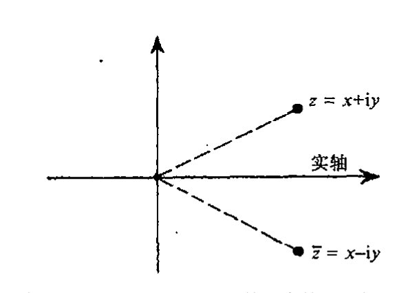
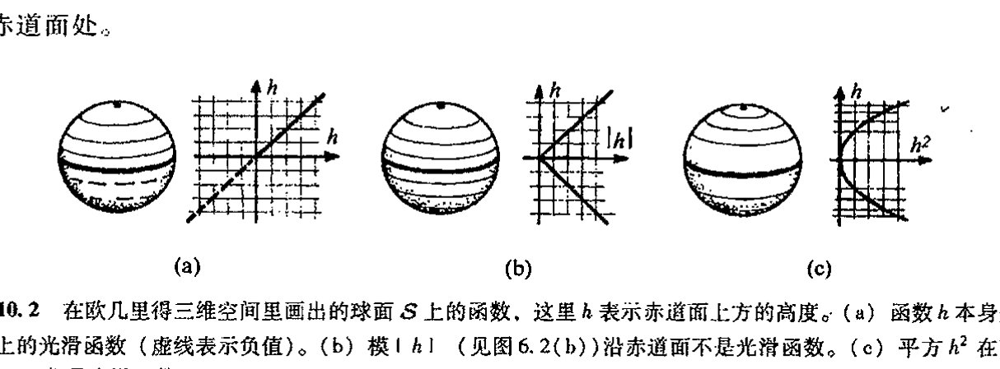
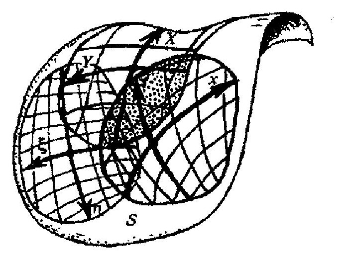

<!-- page 146 -->

第十章 曲面

# 第十章

# 曲面

## 10.1　复维和实维　179

上两个世纪数学上最突出的成就之一是处理非平直多维空间的各种技术的发展。这对本书要达到的目标至关重要，在此我向读者概述一下这些发展，当代物理全仰仗它们。

到目前为止，我们一直考虑的是一维空间。读者可能对这种说法感到奇怪，前几章叙述的不正是复平面、黎曼球面和其他各种黎曼曲面吗？但是，从全纯函数的角度看，这些曲面本质上都只是一维的，正如我们在 [§8.2](chapter_08.md#82-共形映射) 指出的，这个维是复维。我们可用一个参数将这种空间点与其他种类的（局域）空间点区别开来，虽然这个参数是个复数。因此，这些“曲面”实际上应被看成是曲线，即复曲线。我们可以将一个复数 $z$ 分成实部和虚部 $(x, y)$，即 $z = x + iy$，这里 $x$ 和 $y$ 是两个独立的实参数。但如何将一个复数按此方式进行划分已不属于全纯运算的范畴。只要我们关心的只是全纯结构，就像我们到目前为止所考虑的复空间情形，我们就必须把单个复参数看成是仅提供一维。这至少是我建议应当采取的观点。

另一方面，人们也可以采取相反的观点，就是说，全纯运算只是更一般运算的一种特例。只要愿意，$x$ 和 $y$ 就都可以分开来作为各自独立的参数来考虑。实现这一想法的适当方法是通过复共轭概念，这是一种非全纯的运算。复数 $z = x + iy$ 的复共轭是由下列形式给出的复数 $\bar{z}$（这里 $x$ 和 $y$ 均为实数）：

180

$$\bar{z} = x - iy。$$

在 $z$ 复平面内，得到一个复数的复共轭的运算相当于平面关于实线的反射（见[图 10.1](assets/page147_fig01.jpg)）。从 [§8.2](chapter_08.md#82-共形映射) 的讨论可知，全纯运算总是保复平面定向的。如果我们打算考虑（部分）倒向复平面（复平面取向上下颠倒了个个儿）的共形映射，那么我们就需要将复共轭运算包括进来。但考虑到其他标准运算（加、乘、取极限），复共轭也允许我们将映射一般化，使它们不必是共形的。实际上，部分复平面到部分复平面的任何映射（譬如说是连续变换）都可以通过共轭运算和其他

·127·

<!-- page 147 -->

通向实在之路

运算一起共同来实现。

说得具体点，我们可以将全纯函数考虑成由加法、乘法运算加上取极限构成的函数（因为这些运算足以构成幂级数，一种作为连续部分和的极限的无限和）。**[10.1] 如果再综合进复共轭，那么我们就能够生成一般的（譬如说连续的）$x$ 和 $y$ 的函数，因为我们可将 $x$ 和 $y$ 分别表示成

$$x = \frac{z + \bar{z}}{2},\quad y = \frac{z - \bar{z}}{2i}$$

图 10.1　$z = x + iy$（$x$ 和 $y$ 均为实数）的复共轭是 $\bar{z} = x - iy$，它可从 $z$ 平面关于实轴的反射来得到。

（$x$ 和 $y$ 的任何连续函数都可由实数经和、积和取极限来构成）。当考虑 $z$ 的非全纯函数时，我们启用记号 $F(z, \bar{z})$，这里 $\bar{z}$ 的意义同前。这么做是要强调，一旦离开了全纯领域，我们就必须把函数看成是定义在实二维而不是复一维空间上的。函数 $F(z,\bar{z})$ 同样可看成是由 $z$ 的实部和虚部来表示，譬如说，我们可将这个函数写成 $f(x, y)$。但尽管我们有 $f(x,y)= F(z,\bar{z})$，$f$ 的数学显式一般则不同于 $F$ 的数学显式。例如，如果 $F(z,\bar{z}) = z^2 + \bar{z}^2$，则 $f(x,y)= 2x^2 - 2y^2$。再举个例子，$F(z, \bar{z}) = z\bar{z}$，则 $f(x,y)= x^2 + y^2$，它是 $z$ 的模 $|z|$ 的平方，即**[10.2]

$$z\bar{z} = |z|^2。$$

## 10.2　光滑，偏导数

由于考虑的是不止一个变量的函数，现在我们正进入高维空间，因此有必要就高维空间下的“微积分”交代几句。正如下一章我们将清楚看到的那样，空间——即流形——可以是 $n$ 维的，这里 $n$ 是一个正实数。（$n$ 维流形经常也简作 $n$ 流形。）爱因斯坦的广义相对论用四维流形描述时空，许多现代理论甚至要用到更高维的流形。我们将在第 12 章来讨论一般的 $n$ 维流形，但在本章，出于简单计，我们只考虑实二维流形（或曲面）$\mathcal{S}$ 的情形。这样，我们可用局部（实）坐标 $x$ 和 $y$ 来标出 $\mathcal{S}$ 的不同的点（$\mathcal{S}$ 的某个局部区域上的点）。实际上，这里的讨论也可以看作是一般 $n$ 维情形的代表。

例如，一个二维曲面可以是一个普通的平面或球面。但这种曲面不是“复平面”或“黎曼曲面”，因为我们并不在意它是否像复空间那样被赋予了结构（即具有定义在该曲面上的“全纯函数”概念）。我们关心的只是它是否是光滑流形。几何上看，这意味着我们不必像对 [§8.2](chapter_08.md#82-共形映射) 的

---

**[10.1]　解释为什么减法和除法运算可以从中推出。

??? question "答案 [10.1]"
    减法可由加法和取负得到：$a-b=a+(-b)$，而 $-b$ 是满足 $b+(-b)=0$ 的加法逆元。除法可由乘法和取倒数得到：$a/b=a\cdot b^{-1}$，其中 $b^{-1}$ 满足 $bb^{-1}=1$，当然要求 $b\ne0$。

    因此只要加法、乘法以及相应逆元操作在所讨论的结构中有意义，减法和除法就不是新的基本运算。

**[10.2]　导出这两个式子。

??? question "答案 [10.2]"
    若 $z=x+iy$，则 $\bar z=x-iy$。相加得 $z+\bar z=2x$，相减得 $z-\bar z=2iy$。

    因此 $x=(z+\bar z)/2$，$y=(z-\bar z)/(2i)$。这说明把实坐标 $(x,y)$ 换成复坐标 $(z,\bar z)$ 只是同一二维实平面的另一种坐标写法。

·128·

<!-- page 148 -->

**第十章 曲 面**

黎曼曲面所做的那样在意诸如局部共形结构之类的事情，而是需要能够辨别定义在空间上的函数（即函数的定义域为该空间）是否“光滑”。

为了得到何谓“光滑”流形的直观概念，我们来考虑与立方体相对的球面（这里我谈的都是指其表面而非内部）。以球面上的光滑函数为例，我们可将表示赤道面上方高度的函数称为“高度函数”（这里球面就是普通三维欧几里得空间内的图形，赤道面向下的距离计为负）。见[图10.2](assets/page148_fig01.jpg)(a)。另一方面，如果所考虑的函数是高度函数的模（见[§6.1](chapter_06.md#61-如何构造实函数)和[图10.2](assets/page148_fig01.jpg)(b)），则赤道面向下的距离也计为正，这样，这个函数沿赤道面就不光滑了。但如果我们考虑的是高度函数的平方，那么这个函数在球面上依然是光滑的（[图10.2](assets/page148_fig01.jpg)(c)）。在所有这些情形里，函数在北极和南极点都是光滑的，尽管在极点处等高度的周线呈“奇点”状。唯一不光滑的情形出现在[图10.2](assets/page148_fig01.jpg)(b)的赤道面处。

**图10.2** 在欧几里得三维空间里画出的球面 $S$ 上的函数，这里 $h$ 表示赤道面上方的高度。(a) 函数 $h$ 本身是 $S$ 上的光滑函数（虚线表示负值）。(b) 模 $|h|$（见图6.2(b)）沿赤道面不是光滑函数。(c) 平方 $h^2$ 在整个 $S$ 上都是光滑函数。

为了加深对此的理解，我们引入曲面 $S$ 上的坐标系。这些坐标仅需应用于局部，我们可将 $S$ 想象为是由一系列局部拼块——坐标拼块——按类似于[§8.1](chapter_08.md#81-黎曼曲面概念)对黎曼曲面所做的那样“粘合”而成的。（例如对于球面，我们需要不止一块这种拼块。）在一个拼块内，光滑坐标可标示不同的点，如[图10.3](assets/page148_fig02.jpg)。

**图10.3** 在一个局部拼块内，各点用光滑（实数）坐标 $(x, y)$ 来表示。

这里坐标皆取实数值，我们不妨称其为 $x$ 和 $y$（这里没有任何暗示要将它们组合成复数形式）。假定我们有某个定义在 $S$ 上的光滑函数 $\Phi$。在现代数学的词汇里，$\Phi$ 是指从 $S$ 到实数空间 $\mathbb{R}$ 的光滑映射（如果 $\Phi$ 是 $S$ 上的复值函数，则它表示的是 $S$ 到复数空间 $\mathbb{C}$ 的光滑映射），因为 $\Phi$ 为 $S$ 的每一个点赋一个实（复）数——即 $\Phi$ 映射 $S$ 到实（复）数。这种函数有时被称为 $S$ 上的标量场。在一个特定拼块上，量 $\Phi$ 可表示为一个两坐标的函数：

$$\Phi = f(x,\ y),$$

这里量 $\Phi$ 的光滑性可用函数 $f(x,\ y)$ 的可微性来表示。

我还没解释什么是多变量函数的“可微性”。虽然直观上很清楚，但要在此给出严格定义还

<!-- page 149 -->

通向实在之路

是有点儿过于技术化了。¹ 当然作些适当说明还是必要的。

假定 $f$ 作为一对变量 $(x, y)$ 的函数是可微的，我们不妨先将 $f(x, y)$ 看成是关于单个变量 $x$ 的函数，此时 $y$ 取定为某个常数值。这样，这个函数作为单变量 $x$ 的函数（[§6.3](chapter_06.md#63-高阶导数cinfty-光滑函数)），一定是光滑的（至少 $C^1$）。进而我们将 $f(x, y)$ 看成是关于单变量 $y$ 的函数，$x$ 取定某个常数值，此时这个单变量 $y$ 的函数一定也是光滑的（$C^1$）。但这还远远不够充分。有许多关于 $x$ 和 $y$ 分别光滑的函数未必对变量对 $(x, y)$ 也一定是光滑的。\*\*\*[10.3] 光滑的充分条件是，该函数分别关于 $x$ 和 $y$ 的导数每一个都必须是变量对 $(x, y)$ 的连续函数。类似要求对变量数超过两个的函数也成立。我们用“偏导数”符号 $\partial$ 来标记关于每个变量的微分。$f(x, y)$ 关于 $x$ 和 $y$ 的偏导数分别写成

184

$$\frac{\partial f}{\partial x} \quad \text{和} \quad \frac{\partial f}{\partial y}。$$

（作为例子，我们来看看 $f(x, y)=x^2+xy^2+y^3$，这时有 $\partial f/\partial x=2x+y^2$ 和 $\partial f/\partial y=2xy+3y^2$。）如果这些量存在并连续，那么我们说 $\Phi$ 是曲面上的（$C^1$）连续函数。

我们还可以考虑高阶偏导数，$f$ 关于 $x$ 和 $y$ 的二阶偏导数分别为

$$\frac{\partial^2 f}{\partial x^2} \quad \text{和} \quad \frac{\partial^2 f}{\partial y^2}。$$

（这里显然要求 $C^2$ 连续。）还有一种“混合”的二阶导数 $\partial^2 f/\partial x\partial y$，它的意义是 $\partial(\partial f/\partial y)/\partial x$，即“$f$ 关于 $y$ 的偏导数关于 $x$ 的偏导数”。我们还可以将这个混合偏导数写成 $\partial^2 f/\partial y\partial x$。实际上，这两个量相等正是 $f$ 的（二阶）可微性的结果：\*\*\*[10.4]

$$\frac{\partial^2 f}{\partial x\partial y} = \frac{\partial^2 f}{\partial y\partial x}。$$

（两变量函数的 $C^2$ 连续性要求满足这一点。）\*\*\*[10.5] 对更高阶的导数（和更高阶的光滑性），我们有相应的量：

---

\*\*\*[10.3] 分别在 $N=2$，$1$，$\frac{1}{2}$ 三种情形下考虑实函数 $f(x,y)=xy(x^2+y^2)^{-N}$。证明：在每一种情形下，对于固定的 $y$ 值，函数都是关于 $x$ 可微（$C^\infty$）的（对调 $x$ 和 $y$，结论相同）。尽管如此，$f$ 不是坐标对 $(x, y)$ 的光滑函数。对三种不同的情形，利用不同的函数来证明这个判断：对 $N=2$ 的情形，说明该函数在原点 $(0, 0)$ 的邻域内甚至是无界的（即函数在此可以取任意大的值）；对 $N=1$ 的情形，说明该函数尽管是 $(x, y)$ 的有界函数但是不连续；对 $N=\frac{1}{2}$ 的情形，说明函数尽管连续，但沿 $x=y$ 不光滑。（提示：检验每个函数沿过 $(x, y)$ 平面上原点的直线的值。）有些读者可能会发现，用适当的计算机三维作图软件很容易搞定这些事情，如果条件容许的话——但这绝不是必需的。

\*\*\*[10.4] 证明：混合二阶导数 $\partial^2 f/\partial y\partial x$ 和 $\partial^2 f/\partial x\partial y$ 总是相等的，如果 $f(x, y)$ 是一多项式的话。（$x$ 和 $y$ 的多项式是由 $x$、$y$ 和常数仅用加法和乘法构建起来的式子。）

\*\*\*[10.5] 证明：函数 $f=xy(x^2-y^2)/(x^2+y^2)$ 的混合二阶导数在原点相等。直接说明该函数的二阶偏导数在原点处不连续。

·130·

<!-- page 150 -->

第十章 曲面

$$\frac{\partial^3 f}{\partial x^3}, \quad \frac{\partial^3 f}{\partial x^2 \partial y} = \frac{\partial^3 f}{\partial x \partial y \partial x} = \frac{\partial^3 f}{\partial y \partial x^2}, \quad \text{等等。}$$

我之所以要用不同的字母将 $f$ 与 $\Phi$ 仔细地区分开来，是因为我们打算根据各种不同坐标系下的表达式来考虑定义在曲面上的量 $\Phi$。函数 $f(x, y)$ 的数学表达式可以随拼块不同而变化，即使 $\Phi$ 在被这些拼块“覆盖”的曲面上任意特定点上的值保持不变。特别是这种情形可以出现在不同坐标拼块之间的重叠区域（[图 10.4](assets/page150_fig01.jpg)）。如果第二套坐标集记为 $(X, Y)$，则对新坐标拼块下的 $\Phi$ 值，我们有新的表达式

$$\Phi = F(X, Y)。$$

因此在两个坐标拼块之间的重叠区域，我们有

$$F(X,Y) = f(x,y)，$$

但如上所述，由量 $X$ 和 $Y$ 表示的特定的 $F$ 表达式一般不同于由 $x$ 和 $y$ 表示的 $f$ 的表达式。在重叠区，$X$ 和 $Y$ 都可能是 $x$ 和 $y$ 的复杂函数，这些函数可能必须被结合进从 $f$ 到 $F$ 的转换中去。*[10.6]

**图 10.4** 为了覆盖整个 $S$，我们必须将不同的坐标拼块“粘合”起来。$S$ 上的光滑函数 $\Phi$ 在某个拼块上有坐标表达式 $\Phi = f(x, y)$，而另一个拼块上有 $\Phi = F(X, Y)$（相应的局部坐标分别为 $(x, y)$，$(X, Y)$）。在重叠区域，$f(x,y) = F(X,Y)$，这里 $X$ 和 $Y$ 是 $x$ 和 $y$ 的光滑函数。 185

这些将一个坐标系下的坐标用另一个坐标系下的坐标来表示

$$X = X(x,y) \text{ 和 } Y = Y(x,y)$$

的函数及其反函数

$$x = x(X,Y) \text{ 和 } y = y(X,Y)$$

称为转移函数，它们表示不同拼块间坐标的转换。这些转移函数都是光滑的——为简单计，我们姑且设为 $C^\infty$ 光滑——它引出这样一个结果：量 $\Phi$ 的“光滑”概念与拼块重叠区的坐标选择无关。

## 10.3 矢量场和 1 形式

存在着一种独立于坐标选择的函数“导数”概念。对于定义在 $S$ 上的函数 $\Phi$ 来说，这个导数的标准记号为 $\mathrm{d}\Phi$，这里

$$\mathrm{d}\Phi = \frac{\partial f}{\partial x}\mathrm{d}x + \frac{\partial f}{\partial y}\mathrm{d}y。$$ 186

由此开始我们进入某些复杂主题的讨论，我们得花些功夫来适应这些描述。首先，像“$\mathrm{d}\Phi$”或“$\mathrm{d}x$”这样的量最初都看作是“无穷小”量，它们出现在我们利用微积分里的导数“$\mathrm{d}y/\mathrm{d}x$”公

*[10.6] 对 $f(x, y) = x^3 - y^3$ 找出 $F(X,Y)$ 的显形式，这里 $X = x - y$，$Y = xy$，提示：$x^2 + xy + y^2$ 用 $X, Y$ 来表达是怎样的？这与 $f$ 有什么关系？

??? question "答案 [10.6]"
    由 $X=x-y$、$Y=xy$，有 $x^2+xy+y^2=(x-y)^2+3xy=X^2+3Y$。而 $x^3-y^3=(x-y)(x^2+xy+y^2)$。

    所以 $f(x,y)=x^3-y^3=X(X^2+3Y)$，即 $F(X,Y)=X^3+3XY$。

·131·

<!-- page 151 -->

## 通向实在之路

式求极限的运算中（见[§6.2](chapter_06.md#62-函数的斜率)）。在[§6.5](chapter_06.md#65-微分法则)的某些表达式中，我曾考虑过诸如 $d(\log x)=dx/x$ 这样的运算。当时这些公式都被看成仅仅是形式上的，²像上面这个式子（$d(\log x)=dx/x$）就被认为是“更正确的”表达式 $d(\log x)/dx=1/x$ 的一种方便的写法（“两边乘以 $dx$”）。但另一方面，当我将“$d\varPhi$”写进上述公式中时，我是指它是某种称为1形式（虽然这还不是1形式的最一般的形式，见§10.4和[§12.6](chapter_12.md#126-外导数)）的几何量，这一点对像 $d(\log x)=dx/x$ 这样的式子同样有效。1形式不是“无穷小”；它有稍许不同的解释，这种重要的解释已经存在了很多年，我一会儿就会谈到它。尽管对“$d$”的解释前后差异很大，但数学表达式的形式（像[§6.5](chapter_06.md#65-微分法则)中所列的那些）——只要等号两边不除以 $dx$——则完全不变。

上面所示的公式里还存在着另一种潜在的混淆，它出现在如下情形中：我们在等号左边用 $\varPhi$，而在右边用 $f$。我提及这一点主要还是出于区分 $\varPhi$ 与 $f$ 的考虑。量 $\varPhi$ 是定义域在流形 $\mathcal{S}$ 上的函数，而 $f$ 的定义域则是某个特定坐标拼块的 $(x, y)$ 平面上的某个（开）区域。如果我要用“关于 $x$ 的偏导数”的概念，那么我就需要知道“保持另一个变量 $y$ 不变”是指什么。正是因为这一点，因此 $f$ 而不是 $\varPhi$，总是用在右边，因为 $f$ “知道” $x$ 和 $y$ 坐标是指什么，而 $\varPhi$ 则不知道这些。但即使如此，以这种方式显示的公式也还存在着弄混的可能，因为这里没涉及函数的自变量。我们将左边的 $\varPhi$ 用于二维流形 $\mathcal{S}$ 的特定点 $p$，而将 $f$ 用于 $p$ 点的特定坐标值 $(x, y)$。严格来说，为了使表达式有意义，我们必须用显式来给出。但老这么说也惹人烦，最方便的是写成如下形式：

$$d\varPhi = \frac{\partial\varPhi}{\partial x}dx + \frac{\partial\varPhi}{\partial y}dy,$$

或写成“非实体”的算符形式：

187

$$d = dx\frac{\partial}{\partial x} + dy\frac{\partial}{\partial y}。$$

我试着来解释它们的意义。这些公式是所谓链式法则的例子。如前所述，当 $\varPhi$ 是定义在 $\mathcal{S}$ 上的某个函数时，它们具有类似于“$\partial\varPhi/\partial x$”的意义。

我们怎么来理解像 $\partial/\partial x$ 这样的算符能够应用于定义在 $\mathcal{S}$ 上的 $\varPhi$ 函数，而不只是应用于变量 $x$ 和 $y$ 的函数这样的事情呢？让我们先来看看，当我们将 $\partial/\partial x$ 应用于另一坐标系 $(X, Y)$ 时，它有什么意义。“链式法则”的适当公式现在变成

$$\frac{\partial}{\partial x} = \frac{\partial X}{\partial x}\frac{\partial}{\partial X} + \frac{\partial Y}{\partial x}\frac{\partial}{\partial Y}。$$

因此，在 $(X,Y)$ 坐标系下，我们有看上去更复杂的表达式 $(\partial X/\partial x)\partial/\partial X + (\partial Y/\partial x)\partial/\partial Y$，它与 $(x,y)$ 坐标系下看起来简单的表达式 $\partial/\partial x$ 表示的是完全同样的运算。这个更复杂的表达式可以写成如下形式的一个量 $\xi$，

$$\xi = A\frac{\partial}{\partial X} + B\frac{\partial}{\partial Y},$$

• 132 •

<!-- page 152 -->

第十章 曲面

这里 $A$ 和 $B$ 都是 $X$ 和 $Y$ 的（$C^\infty$）光滑函数。在眼下用 $\xi$ 表示 $(x, y)$ 坐标系下 $\partial/\partial x$ 的特定情形，我们有 $A = \partial X/\partial x$ 和 $B = \partial Y/\partial x$。但我们可以考虑更一般的 $A$ 和 $B$ 不取具体形式的量 $\xi$。这种量 $\xi$ 称为 $\mathcal{S}$ 上的矢量场（在 $(X, Y)$ 坐标拼块下）。我们重写原始坐标系 $(x, y)$ 下的 $\xi$，发现它和 $(X, Y)$ 坐标系下的具有相同的一般形式：

$$\xi = a \frac{\partial}{\partial x} + b \frac{\partial}{\partial y}$$

（虽然函数 $a$ 和 $b$ 一般不同于 $A$ 和 $B$）。**[10.7]** 这使我们能够将矢量场从 $(X, Y)$ 拼块扩展到重叠的 $(x, y)$ 拼块。通过这种方式，取足够多的所需的拼块，我们就能将矢量场 $\xi$ 扩充到整个 $\mathcal{S}$ 上。

所有这些可能会使读者感到非常困惑！当然我的目的不是要让你看不懂，而是要找到非常基本的正确的几何概念的解析形式。我们称为“矢量场”的微分算符 $\xi$ 有一个非常明确的如[图 10.5](assets/page152_fig01.jpg) 所示的几何解释。

**图10.5** 作为 $\mathcal{S}$ 上的“小箭头场”的矢量场 $\xi$ 的几何解释。

我们将 $\xi$ 想象为描述了一个画在 $\mathcal{S}$ 上的“小箭头场”，虽然在 $\mathcal{S}$ 的某些地方，箭头可能会收缩成一点，$\xi$ 在这些地方取值为零。（为了得到更鲜明的矢量场图像，我们可以将其想象成电视上天气预报节目里的风向图。）箭头所指的方向代表着 $\xi$ 的微商这个函数的增长方向。我们将这个函数取为 $\Phi$，$\xi$ 对 $\Phi$ 的作用，即 $\xi(\Phi) = a \partial \Phi/\partial x + b \partial \Phi/\partial y$，度量 $\Phi$ 沿箭头方向的增长率，见[图 10.6](assets/page153_fig01.jpg)。箭头的大小（长度）具有根据所测得的增长率来确定“尺度”的意义。更恰当地说，我们应当把所有箭头都当作无穷小，每一个都将 $\mathcal{S}$ 上的一点 $p$（处于箭“尾”）与“相邻的” $\mathcal{S}$ 上的另一点 $p'$（处于箭“头”）连接起来。为了看得更清楚点，让我们取某个小的正数 $\epsilon$ 作为两分离点 $p$ 和 $p'$ 之间沿 $\xi$ 方向分离程度的量度。于是，差 $\Phi(p') - \Phi(p)$ 除以 $\epsilon$ 给出量 $\xi(\Phi)$ 的近似值。$\epsilon$ 取得越小，近似程度就越好。最后，当 $p'$ 无限趋近 $p$（即 $\epsilon \to 0$）时，我们就得到了实际的 $\xi(\Phi)$。有时我们也称其为 $\Phi$ 在 $\xi$ 方向上的梯度（或斜率）。

在矢量场 $\partial/\partial x$ 这一特定情形，箭头全都指向常量 $y$ 的坐标线方向。这就形象地说明了经常引起困扰的对偏导数“$\partial/\partial x$”这一标准数学概念的理解问题。我们可能一直认为表达式“$\partial/\partial x$”主要涉及的是量 $x$。但其实它更多的则是与未经言明的变量相联系，在此即为变量 $y$ 而不是 $x$。当我们考虑坐标变换时，譬如说从 $(x, y)$ 到 $(X, Y)$ 且使一个坐标维持不变，这个记号特别容易引起误解。例如，考虑如下这个非常简单的坐标变换

**[10.7]** 根据 $a$ 和 $b$ 找出 $A$ 和 $B$；通过类比，根据 $A$ 和 $B$ 写出 $a$ 和 $b$。

??? question "答案 [10.7]"
    若坐标变换给出 $X=X(x,y)$、$Y=Y(x,y)$，则链式法则给出 $\xi=A\partial/\partial X+B\partial/\partial Y$，其中 $A=a\partial X/\partial x+b\partial X/\partial y$，$B=a\partial Y/\partial x+b\partial Y/\partial y$。

    反过来若已知 $x=x(X,Y)$、$y=y(X,Y)$，则 $a=A\partial x/\partial X+B\partial x/\partial Y$，$b=A\partial y/\partial X+B\partial y/\partial Y$。矢量场本身不变，变的只是它在不同坐标基下的分量。

·133·

<!-- page 153 -->

## 通向实在之路

**图10.6** $\xi$ 对标量场 $\varPhi$ 的作用给出 $\varPhi$ 沿 $\xi$–箭头方向的增长率。我们可将这种箭头设想成无穷小量，每一个都将 $\mathcal{S}$ 上的一点 $p$（箭“尾”）与 $\mathcal{S}$ 上“相邻”的另一点 $p'$（箭“头”）连接起来，图中用一个很大的放大倍数（因子 $\epsilon^{-1}$，$\epsilon$ 是小的正数）显示了 $p$ 的邻域。差 $\varPhi(p')-\varPhi(p)$ 除以 $\epsilon$（取 $\epsilon \to 0$ 极限）给出 $\varPhi$ 在 $\xi$ 方向上的梯度 $\xi(\varPhi)$。

$$X = x,\quad Y = y + x.$$

我们发现[^10.8]

$$\frac{\partial}{\partial X} = \frac{\partial}{\partial x} - \frac{\partial}{\partial y},\quad \frac{\partial}{\partial Y} = \frac{\partial}{\partial y}.$$

我们看到，$\partial/\partial X$ 不等同于 $\partial/\partial x$，尽管事实上 $X$ 等同于 $x$——反之，在这个例子中，$\partial/\partial Y$ 则等同于 $\partial/\partial y$，尽管 $Y$ 并不等同于 $y$。这种情形就是我的同事尼克·伍德豪斯（Nick Woodhouse）所说的“微积分第二基本困惑”³另一方面，为什么 $\partial/\partial X \neq \partial/\partial x$，这在几何上很清楚，因为相应的“箭头”指向不同的坐标线（图10.7）。

现在我们来解释量 $d\varPhi$。它称为 $\varPhi$ 的梯度（或外导数），表示 $\varPhi$ 沿 $\mathcal{S}$ 的所有可能方向如何变化。$d\varPhi$ 的一种好的几何图像是借助于 $\mathcal{S}$ 的等高线系，见图10.8(a)。我们将 $\mathcal{S}$ 视为一幅普通的地图*⁴（这里“map”一词是指你旅行时随身携带的纸质地图，不是数学概念“映射”），它可以是球状的，如果我们打算将 $\mathcal{S}$ 看成是弯曲的流形的话。函数 $\varPhi$ 可以代表海拔高度。这样 $d\varPhi$ 就代表了地面相对于水平面的坡度。等高线标出的是所有海拔高度相同的位置。在 $\mathcal{S}$ 的任意一点 $p$ 上，等高线的周线方向给出梯度为零的方向（地表坡度的“斜轴”），因此它是 $p$ 点处满足 $\xi(\varPhi)=0$ 的箭头 $\xi$ 所

[^10.8]: 推导这个公式。提示：你可将“链式法则”用到 $\partial/\partial X$ 和 $\partial/\partial Y$ 上，它们可严格类比于我们早先所示的 $\partial/\partial x$ 的表达式。

??? question "答案 [10.8]"
    把 $\partial/\partial X$ 看成沿保持 $Y$ 不变、只改变 $X$ 的方向求导。由链式法则，对任意函数 $\Phi(x,y)$，有 $\partial\Phi/\partial X=(\partial x/\partial X)\partial\Phi/\partial x+(\partial y/\partial X)\partial\Phi/\partial y$。

    因而作为微分算子，$\partial/\partial X=(\partial x/\partial X)\partial/\partial x+(\partial y/\partial X)\partial/\partial y$。同理可得 $\partial/\partial Y$ 的公式。

·134·

<!-- page 154 -->

<!-- page 155 -->

通向实在之路

矢量场 $\xi$ 可看成是由两部分组成的，一部分正比于 $\partial/\partial x$，指向常数 $y$ 的坐标线方向；另一部分正比于 $\partial/\partial y$，指向常数 $x$ 的坐标线方向。因此在 $(x, y)$ 坐标系下，我们可用相关的权重因子对 $(a, b)$ 来表示 $\xi$。数字 $a$ 和 $b$ 分别表示 $\xi$ 在该坐标系下的分量，见图 10.9。（严格来说，$\xi$ 的这两个“分量”实际上是组成矢量场 $\xi$ 的两个矢量场 $a\partial/\partial x$ 和 $b\partial/\partial y$，见图 10.9——对下面 $\mathrm{d}\Phi$ 的分量我们也可作同样的理解。但“分量”一词现在在许多数学文献中已获得“坐标标签”的意义，特别是联系到张量计算的情形就更是如此，见 [§12.8](chapter_12.md#128-张量抽象指标记法和图示记法)。）

类似地，量 $\mathrm{d}\Phi$（“1 形式”）由 $\mathrm{d}x$ 和 $\mathrm{d}y$ 两项组成：

$$\mathrm{d}\Phi = u\mathrm{d}x + v\mathrm{d}y。$$

这样，$(u, v)$ 可用来表示 $\mathrm{d}\Phi$，数字 $u$ 和 $v$ 是 $\mathrm{d}\Phi$ 在同一坐标系下的分量。（实际上，这里我们有 $u = \partial\Phi/\partial x$ 和 $v = \partial\Phi/\partial y$。）1 形式 $\mathrm{d}\Phi$ 的分量 $(u, v)$ 与矢量场 $\xi$ 的分量 $(a, b)$ 之间的关系可通过量 $\xi(\Phi)$ 获得，正如我们上面看到的，这个量量度 $\Phi$ 在 $\xi$ 方向上的增长率。我们发现，*^{[10.9]} $\xi(\Phi)$ 的值由下式给出：

$$\xi(\Phi) = au + bv。$$

我们称 $au + bv$ 为 $(a, b)$ 代表的 $\xi$ 与 $(u, v)$ 代表的 $\mathrm{d}\Phi$ 之间的标量积（或内积）。这个标量积有时也写成 $\mathrm{d}\Phi \cdot \xi$，如果我们不打算考虑具体坐标系而只是抽象地表示的话。我们有

$$\mathrm{d}\Phi \cdot \xi = \xi(\Phi)。$$

这里，同一个公式之所以有两种不同的记号，是因为 $\mathrm{d}\Phi \cdot \xi$ 的运算表达式可以运用到比 $\mathrm{d}\Phi$ 的表达式更一般的 1 形式上（[§12.3](chapter_12.md#123-标量矢量和余矢量)）。如果 $\eta$ 是一个这样的 1 形式，则它有与任意矢量场 $\xi$ 的标量积 $\eta \cdot \xi$。

实际上，1 形式的定义本质上可看成是这样一个量，它和矢量场结合形成“标量积”。因此，量 $\mathrm{d}\Phi$ 与矢量场形成标量积这个事实也可以刻画为 1 形式。（在有些文献中，1 形式又称为余矢量。）在这个意义上，1 形式（余矢量）与矢量场是对偶关系。“对偶”概念在 [§12.3](chapter_12.md#123-标量矢量和余矢量) 里有较详细的叙述，在那里我们会看到这些概念在高维“曲面”（即 $n$ 流形）上的相当一般的应用。高维下 1 形式的几何意义见 [§12.3](chapter_12.md#123-标量矢量和余矢量)–5，眼下它就是等高线族。如果 $\mathrm{d}\Phi \cdot \xi = 0$（即如果 $\xi(\Phi) = 0$），

---

*^{[10.9]} 用我们早先给出的“链式法则”导出这个显性公式。

- 136 -

<!-- page 156 -->

第十章 曲 面

则这些线表示箭头 ξ 所指的方向。

## 10.5 柯西－黎曼方程

但在进入下一章要说的高维情形之前，我们先回到本章开始时提出的问题：那种能够重新解释为一维复流形的所需的二维曲面的性质是什么。基本上看，我们需要一种刻画这些全纯复值函数 Φ 的方法。全纯条件是一种局部条件，因此我们可将其看成是在每个拼块上满足的条件，并要求它在拼块间的重叠处具有相容性。在 (x, y) -拼块上，我们要求 Φ 关于复数 z = x + iy 是全纯的，在重叠的 (X, Y) 拼块上，则要求 Φ 关于复数 Z = X + iY 是全纯的。二者间的相容性由下述要求来保证：在重叠区域，Z 是 z 的全纯函数，反之亦然。（如果在 z 拼块上 Φ 是全纯的，那么 Φ 必在 Z 拼块上也是全纯的，因为全纯函数的全纯函数仍是全纯函数。**[10.10]**）

现在，我们如何根据 Φ 和 z 的实部和虚部来表示 Φ 的全纯性条件呢？这些条件就是 [§7.1](chapter_07.md#71-复光滑全纯函数) 所述的柯西－黎曼方程。但这个方程的显形式是什么样的呢？我们可以将 Φ 想象成由 z 和 z̄ 来表示（正如我们在本章开头看到的，z 的实部和虚部，即 x 和 y，可根据 z 和 z̄ 重新表示为 x = (z + z̄)/2 和 y = (z - z̄)/2i）。我们必须将这个条件表示成 Φ "仅依赖于 z"（即 "与 z̄ 无关"）。

这意味着什么呢？想象一下，如果我们不是用复共轭对 z 和 z̄，而是譬如说用独立的变量 u 和 v。我们要表达的是这样一个事实：某个作为 u 和 v 的函数的量 Ψ 实际上与 v 无关。这种独立性可表示为

$$\frac{\partial\Psi}{\partial v} = 0$$

（因为这个方程告诉我们，对每个 u 值，Ψ 关于 v 都是常数，因此 Ψ 仅与 u 相关）。⁴ 相应地，Φ "独立于 z̄" 就应当表示为

$$\frac{\partial\Phi}{\partial\bar{z}} = 0,$$

它确实表达了 Φ 的全纯性（虽然这种 "类比论证" 不应作为这一事实的证明）。⁵ 利用链式法则，我们可根据 (x, y) 坐标系下的偏导数将这个方程重新表述为：**[10.11]**

$$\frac{\partial\Phi}{\partial x} + \mathrm{i}\frac{\partial\Phi}{\partial y} = 0。$$

将 Φ 写成其实部和虚部：

$$\Phi = \alpha + \mathrm{i}\beta,$$

---

**[10.10]** 用三种不同的观点解释这一点：(a) 从一般原理出发的直觉观点（怎么才能出现 z̄?），(b) 用 [§8.2](chapter_08.md#82-共形映射) 所述的全纯映射几何，(c) 用链式法则和我们下述的柯西－黎曼方程。

??? question "答案 [10.10]"
    (a) 全纯函数只允许依赖 $z$，不能独立依赖 $\bar z$；若出现 $\bar z$，就相当于把复平面的反向结构也引入了。 (b) 几何上，全纯映射在无穷小尺度上是旋转加伸缩而非反射；$z\mapsto\bar z$ 正是反射，所以不是全纯。

    (c) 写 $f=u+iv$。若 $f=\bar z=x-iy$，则 $u=x$、$v=-y$。柯西–黎曼方程要求 $u_x=v_y$，但这里 $u_x=1$、$v_y=-1$，矛盾。

**[10.11]** 导出该式。

??? question "答案 [10.11]"
    设 $\Phi=\alpha+i\beta$ 且 $z=x+iy$。全纯性意味着 $\partial\Phi/\partial\bar z=0$，其中 $\partial/\partial\bar z=(1/2)(\partial/\partial x+i\partial/\partial y)$。

    代入得 $0=(1/2)(\alpha_x+i\beta_x+i\alpha_y-\beta_y)$。实部和虚部分别为 $\alpha_x-\beta_y=0$、$\beta_x+\alpha_y=0$，即 $\alpha_x=\beta_y$、$\alpha_y=-\beta_x$。

· 137 ·

<!-- page 157 -->

通向实在之路

这里 $\alpha$ 和 $\beta$ 都是实数，我们得到柯西–黎曼方程^6,***[10.12]

$$\frac{\partial\alpha}{\partial x}=\frac{\partial\beta}{\partial y},\qquad\frac{\partial\alpha}{\partial y}=-\frac{\partial\beta}{\partial x}。$$

由于在 $(x,y)$ 坐标拼块与 $(X,Y)$ 坐标拼块的重叠区，我们要求 $Z=X+\mathrm{i}Y$ 关于复数 $z=x+\mathrm{i}y$ 是全纯的，因此在 $(x,y)$ 与 $(X,Y)$ 之间也有柯西–黎曼方程成立：

$$\frac{\partial X}{\partial x}=\frac{\partial Y}{\partial y},\qquad\frac{\partial X}{\partial y}=-\frac{\partial Y}{\partial x}。$$

如果这个条件在任意两坐标拼块之间成立，那么经过总合我们就得到黎曼曲面 $\mathcal{S}$。（这些就是我在 [§7.1](chapter_07.md#71-复光滑全纯函数) 提到的必需的解析条件。）我们知道，这种曲面也可以看成是一维复流形。但是，按照目前的"柯西–黎曼"观点，我们认为 $\mathcal{S}$ 是一种具有特殊结构（即由柯西–黎曼方程确定的）的二维实流形。

与那种"纯粹的"坚持全纯运算并将 $\mathcal{S}$ 视为"曲线"的观点（一种对我们后述内容（第33章，[§34.8](chapter_34.md#348-通向实在的漫长的数学之路)）具有重要意义的哲学观点）相比，"柯西–黎曼"观点在许多方面都显得非常有力。例如，它容许我们利用偏微分方程的存在性理论方面的许多有用的技术来证明结果。下面我们试给出（重要的）一例。

如果柯西–黎曼方程 $\partial\alpha/\partial x=\partial\beta/\partial y$ 和 $\partial\alpha/\partial y=-\partial\beta/\partial x$ 成立，那么 $\alpha$ 和 $\beta$ 中的每一个量都将单独满足特定的方程（拉普拉斯方程）。因为我们有*[10.13]

$$\nabla^2\alpha=0,\quad\nabla^2\beta=0,$$

这里二阶导数算子 $\nabla^2$ 称为（二维）拉普拉斯算子，定义为

$$\nabla^2=\frac{\partial^2}{\partial x^2}+\frac{\partial^2}{\partial y^2}。$$

拉普拉斯算子在许多物理领域有着重要应用（[§21.2](chapter_21.md#212-量子哈密顿量)，[§22.11](chapter_22.md#2211-球谐函数)，[§24.3](chapter_24.md#243-量子力学里能量的正定性)–6）。例如，假如我们在金属丝框架上张起一层肥皂液膜，并让它的两边相对于水平面有一轻微的抬高，如[图10.10](assets/page158_fig01.jpg)所示。这样，薄膜高于水平面的高度将是拉普拉斯方程的一个解（这种垂直偏离越小，解的近似程度就越高）。^7（三维）拉普拉斯方程在牛顿引力理论（和静电理论，见17和19章）里扮演着重要角色，因为这个方程满足自由空间引力场（或静电力场）的势函数。

柯西–黎曼方程的解可由二维拉普拉斯方程的解直接导出。如果我们有满足 $\nabla^2\alpha=0$ 的 $\alpha$，则可按 $\beta=\int(\partial\alpha/\partial x)\,\mathrm{d}y$ 来构造 $\beta$；这样，我们会发现两个柯西–黎曼方程都得到满足。**[10.14] 这一事实可用来证明和演示上章末的结论。

我们具体地考虑 [§9.7](chapter_09.md#97-超函数) 末的结论，即任何定义在复平面单位圆上的连续函数 $f$ 都能够表示为

---

***[10.12] 从导数的定义出发，给出柯西–黎曼方程的一种更直接的推导。

??? question "答案 [10.12]"
    在点 $z$ 处，复导数若存在，则差商 $\{f(z+h)-f(z)\}/h$ 的极限必须与 $h$ 趋零方向无关。沿实方向取 $h=\Delta x$，极限为 $u_x+iv_x$。

    沿虚方向取 $h=i\Delta y$，极限为 $(u_y+iv_y)/i=v_y-iu_y$。令二者相等，得 $u_x=v_y$、$v_x=-u_y$，这就是柯西–黎曼方程。

*[10.13] 证明这一点。

??? question "答案 [10.13]"
    若 $u$、$v$ 满足柯西–黎曼方程 $u_x=v_y$、$u_y=-v_x$，并且二阶偏导可交换，则 $u_{xx}=v_{yx}$，$u_{yy}=-v_{xy}$。

    相加得 $u_{xx}+u_{yy}=v_{yx}-v_{xy}=0$。同理 $v_{xx}+v_{yy}=-u_{xy}+u_{yx}=0$。所以全纯函数的实部和虚部都是调和函数。

**[10.14] 证明这一点。

??? question "答案 [10.14]"
    若 $u$ 为调和函数，即 $u_{xx}+u_{yy}=0$，则希望找到 $v$ 使 $v_y=u_x$、$v_x=-u_y$。这个一阶系统的相容条件是 $(v_y)_x=(v_x)_y$，也就是 $u_{xx}=-u_{yy}$，正是调和条件。

    在单连通区域内，相容条件保证这样的 $v$ 存在；它只差一个常数唯一。于是 $u+iv$ 全纯，$v$ 称为 $u$ 的调和共轭。

·138·

<!-- page 158 -->

第十章 曲 面

**图 10.10** 张在金属丝框架上的肥皂液膜。框架的两边相对于水平面有一轻微的抬高。薄膜高于水平面的高度给出拉普拉斯方程的一个解（这种垂直偏离越小，解的近似程度就越高）。

一个超函数。这个论断还可以表述为：任何连续的 $f$ 都能够表示为两部分之和，一部分全纯地扩展到单位圆的内部，另一部分全纯地扩展到单位圆的外部。这里我们将复平面完全看成是黎曼球面。按照 [§9.2](chapter_09.md#92-圆上的函数) 的讨论，这个断言也等价于存在 $f$ 的傅立叶级数表示，这里 $f$ 被看成是一个实变量的周期函数。为简单计，我们假定 $f$ 是实值的。（复值情形可按照将 $f$ 分成实部和虚部来进行。）存在这样的定理：我们能够将 $f$ 连续地扩展到圆的内部，在圆内 $f$ 满足 $\nabla^2 f=0$。（这一事实直观上很容易理解，我们不妨借助[图 10.10](assets/page158_fig01.jpg) 对肥皂膜的讨论来说明。为此，按某个固定的小数 $\epsilon$ 将 $f$ 适当地缩小为新函数 $\epsilon f$，可以想见，现在这个金属丝框架处于复平面的单位圆上，其两边略微抬高一个量 $\epsilon f$。张起的肥皂液膜的高度在圆上和圆内分别给出 $\epsilon f$ 和 $f$。）利用上述 $g=\int(\partial f/\partial x)dy$，我们可以得到作为 $f$ 的虚部的 $g$，这样 $f+ig$ 在整个单位圆内部都是全纯的。这个步骤也适用于产生单位圆上的 $f$ 的虚部的 $g$（一般是超函数形式，因此 $f+ig$ 是负频率）。现在我们重复运用这个步骤到单位圆的外部（但仍视为是在黎曼球面上），就会发现，$f-ig$ 连续扩展到圆的外部，并且是正频率。而 $f=\frac{1}{2}(f+ig)+\frac{1}{2}(f-ig)$ 正好给出我们所需的结果。

---

## 注 释

**[§10.2](#102-光滑偏导数)**

10.1 多变量可微性的详细讨论见 Marsden and Tromba (1996)。

**[§10.3](#103-矢量场和-1-形式)**

10.2 虽然（17 世纪后半叶）莱布尼兹最初引入的 "dx" 显示出巨大的力量和灵活性，例如它可以将自身右边的量处理成代数量，但对二阶导数，这种处理没有扩展到记号 "d²x"。如果他当时对这种记号做出调整，将 $y$ 关于 $x$ 的二阶导数写成 $(d^2y-d^2x\,dy/dx)/dx^2$，那么量 "d²x" 的确是一种代数上相容的量（这里 "dx²" 表示 $dxdx$，等等）。但由于这种表达式的复杂性，还不清楚实际上如何做到这一点。

10.3 "第一基本困惑" 涉及 [§10.2](#102-光滑偏导数) 中 $f$ 和 $\varPhi$ 的使用，特别是在取偏导数时。见 Woodhouse (1987)。

**[§10.5](#105-柯西黎曼方程)**

· 139 ·

<!-- page 159 -->

通向实在之路

---

10.4　我们必须将这个条件看成是仅针对局部意义上的条件。例如，我们有定义在 $(u, v)$ 平面腰果状区域上的光滑函数 $\Phi(u, v)$，在该区域内，$\partial\Phi/\partial v = 0$，但作为 $u$ 的函数，$\Phi$ 并不是完全相容的。***[10.15]

10.5　虽然这不是柯西–黎曼方程的极其严格的论证，但它提供了取这种形式的基本理由。

10.6　实际上，早在柯西或黎曼之前的 1752 年，达朗贝尔（Jean LeRond D'Alembert，1717–1783）就发现了这些方程（见 Struik 1954，219 页）。

10.7　魏尔斯特拉斯（1866 年）根据自由全纯函数发现，实际的肥皂液膜方程（拉普拉斯方程是对它的一个近似）有一个绝好的一般解。

10.8　因为 $f$ 在圆上连续，它必是有界的（即它的值处于固定的最小值和最大值之间）。由标准定理可知，这个圆是一个紧空间。（“紧”的概念见 [§12.6](chapter_12.md#126-外导数)，Kahn 1995；Frankel 2001）。于是我们可以重新标定 $f$（将它乘以一个小的常数 $\varepsilon$），这样上下界就都变小了。肥皂液膜的类比为将 $\varepsilon f$ 的存在性扩展到圆内提供了合理的解释，它满足拉普拉斯方程。当然这不是证明，这种所谓“圆盘上的狄利克雷问题”的严格证明见 Strauss（1992）或 Brown and Churchill（2004）。

---

***〔10.15〕针对 $\Phi(u,v)=\theta(v)h(u)$ 的情形解释这一点，这里函数 $\theta$ 和 $h$ 的定义均如 [§6.1](chapter_06.md#61-如何构造实函数), 3 所示。腰果状区域必须不包括非负 $u$ 轴。

??? question "答案 [10.15]"
    取 $\theta(v)$ 为在 $v\ne0$ 处光滑、但在跨过 $v=0$ 时带有跳变性质的函数，而 $h(u)$ 在 $u>0$ 一侧按第 6 章的构造平滑地变为零。乘积 $\theta(v)h(u)$ 的奇异性只可能沿 $v=0$ 与 $u<0$ 的相交区域显现。

    若腰果状区域不包含非负 $u$ 轴，就避开了 $h(u)$ 从零到非零的接缝与 $\theta$ 的跳变共同作用的地方。在该区域内，每个局部拼块上函数都可按通常规则光滑处理，因此正文所说的局部结论成立。
·140·
