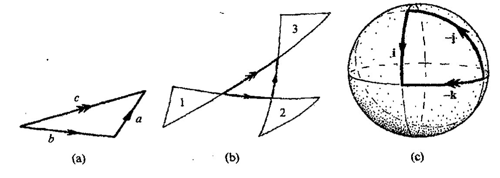
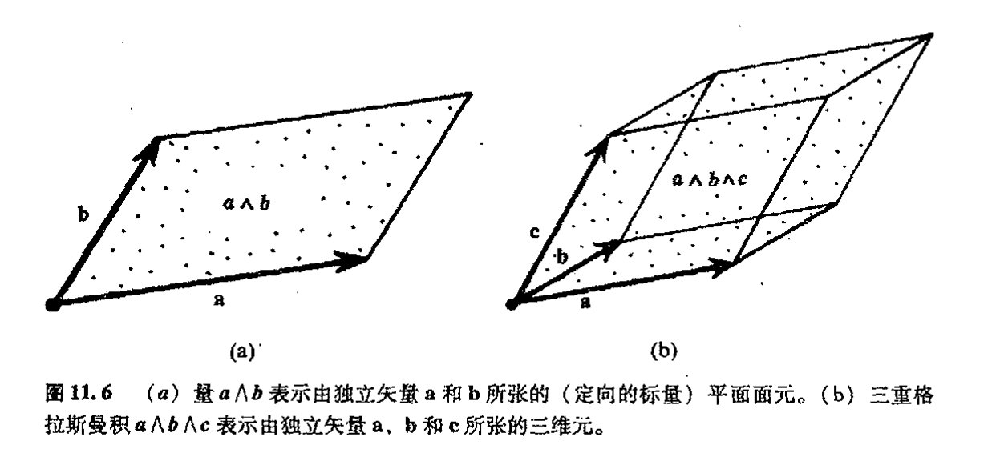

<!-- page 160 -->

第十一章 超复数

第十一章

# 超复数

## 11.1 四元数代数

198

我们如何把前面章节的内容推广到高维上去呢？我将在下一章里描述研究 $n$ 维流形的标准（现代）步骤，但出于其他一些考虑，如果我先向读者介绍一些针对高维研究而提出的早期数学思想，那么这将更富于启发性。这些早期数学思想已被证明与当今理论物理学的某些研究有着重要的直接联系。

正如前面提到的二维 Laplace 方程（一种物理上相当重要的方程）的解特性可以非常简单地用全纯函数来表示一样，复分析的美和力量曾引领着 19 世纪的数学家们去寻找可以很自然地运用于三维空间的“广义复数”。著名的爱尔兰数学家哈密顿（William Rowan Hamilton，1805–1865）就是这样一位长期深入研究这种问题的人。1843 年 10 月 16 日这天，当他与妻子沿着都柏林的皇家运河散步时，他终于找到了问题的答案。这让他兴奋不已，当即在布鲁厄姆（Brougham）桥的石墩上刻下了这个基本方程

$$\mathbf{i}^2 = \mathbf{j}^2 = \mathbf{k}^2 = \mathbf{i}\mathbf{j}\mathbf{k} = -1$$

这里三个量 $\mathbf{i}$、$\mathbf{j}$ 和 $\mathbf{k}$ 中的每一个都是独立的“$-1$ 的平方根”（如同复数符号 $i$ 一样），其一般组合

$$\boldsymbol{q} = t + u\mathbf{i} + v\mathbf{j} + w\mathbf{k},$$

称为一般四元数，其中 $t, u, v$ 和 $w$ 均为实数。这些量满足代数里除了一条之外的所有其他运算关系。这个例外——这正是这种哈密顿数的真正创新之处¹——就是乘法交换律的破坏。因为哈密顿发现\*\*[11.1]

---

\*\* [11.1] 假定只有乘法结合律 $a(bc) = (ab)c$ 成立，从哈密顿的“布鲁厄姆桥方程”出发，直接证明这些关系。

·141·

<!-- page 161 -->

通向实在之路

199

$$\mathbf{ij} = -\mathbf{ji}, \quad \mathbf{jk} = -\mathbf{kj}, \quad \mathbf{ki} = -\mathbf{ik},$$

这是对标准的乘法交换律 $ab = ba$ 的严重背离。

四元数仍然满足加法的交换律和结合律、乘法结合律、以及加法上的乘法分配律*^{[11.2]}，即

$$a + b = b + a,$$

$$a + (b + c) = (a + b) + c$$

$$a(bc) = (ab)c,$$

$$a(b + c) = ab + ac,$$

$$(a + b)c = ac + bc,$$

同样，也存在对加和性“单位元”$0$ 和乘积性“单位元”$1$ 的运算，如

$$a + 0 = a, \quad 1a = a1 = a.$$

如果撇开最后一个式子，上面这些关系式定义了代数学中所称的环。（在我看来，“环”这个概念完全没有直观性可言——如同抽象代数里许多其他术语一样——我也不知道它的起源。）如果把最后一个式子也包括进来，我们得到的是所谓幺环。

四元数还提供了所谓实数域上的矢量空间的例证。在矢量空间里，我们能够将两个元素（矢量^2）$\boldsymbol{\xi}$ 和 $\boldsymbol{\eta}$ 加起来构成二者的和 $\boldsymbol{\xi} + \boldsymbol{\eta}$，这个和服从交换律和结合律：

$$\boldsymbol{\xi} + \boldsymbol{\eta} = \boldsymbol{\eta} + \boldsymbol{\xi},$$

$$(\boldsymbol{\xi} + \boldsymbol{\eta}) + \boldsymbol{\zeta} = \boldsymbol{\xi} + (\boldsymbol{\eta} + \boldsymbol{\zeta}),$$

我们可以用“标量”（这里仅取实数 $f$ 和 $g$）乘以矢量，这样，下述分配律和结合律等均成立：

$$(f + g)\boldsymbol{\xi} = f\boldsymbol{\xi} + g\boldsymbol{\xi},$$

$$f(\boldsymbol{\xi} + \boldsymbol{\eta}) = f\boldsymbol{\xi} + f\boldsymbol{\eta},$$

$$f(g\boldsymbol{\xi}) = (fg)\boldsymbol{\xi},$$

$$1\boldsymbol{\xi} = \boldsymbol{\xi}.$$

四元数组成实数域上四维矢量空间，这是因为正好有四个独立“基”量 $\mathbf{1}$，$\mathbf{i}$，$\mathbf{j}$ 和 $\mathbf{k}$，它们张起四元数的整个空间，也就是说，任何一个四元数都能唯一地表示为这些基元的实数倍的和。以后我们还将看到这种矢量空间的许多其他例子。

200

依照上述乘法结合律，四元数还提供了一种称之为实数域上代数的例证。但哈密顿四元数的特点在于，除了乘法运算外，我们还可以有除法运算，即对于任一非零四元数 $q$，存在一个（乘积性的）逆 $q^{-1}$，它满足

$$q^{-1}q = qq^{-1} = 1,$$

由此给出一种称之为四元数除环的结构。对这个逆运算，显然有

$$q^{-1} = \bar{q}\left(\bar{q}q\right)^{-1},$$

---

* [11.2] 求两个一般四元数的和与积，从而说明这些关系式的确成立。

· 142 ·

<!-- page 162 -->

第十一章　超复数

其中 $\boldsymbol{q}$ 的（四元数型）共轭 $\bar{\boldsymbol{q}}$ 定义为

$$\bar{\boldsymbol{q}} = t - u\mathbf{i} - v\mathbf{j} - w\mathbf{k},$$

加上前面定义的 $\bar{\boldsymbol{q}} = t + u\mathbf{i} + v\mathbf{j} + w\mathbf{k}$，我们有

$$\boldsymbol{q}\bar{\boldsymbol{q}} = t^2 + u^2 + v^2 + w^2,$$

因此，除非 $\boldsymbol{q} = 0$（即 $t = u = v = w = 0$），否则实数 $\boldsymbol{q}\boldsymbol{q}^{-1}$ 不为零。这样，一旦 $\boldsymbol{q}^{-1}$ 有定义（只要 $\boldsymbol{q} \neq 0$），$(\boldsymbol{q}\boldsymbol{q}^{-1})^{-1}$ 必存在。\*[11.3]

## 11.2　四元数的物理角色

四元数为我们提供了一种非常优美的代数结构，并使我们有可能将一种神奇的计算极其自然地用于处理物理问题和三维物理空间里的几何问题。为此，哈密顿将自己生命的最后 22 年全都投入到发展这么一种四元数计算的工作中。但依我们目前的眼光看，回眸 19 世纪和 20 世纪，我们必须承认，这种英勇无畏的努力虽值得称道，但终归于失败。这不是说四元数在数学上（甚至物理上）不重要，它们在寻求代数的各种推广的舞台上的确扮演过非常重要的角色，在某种间接意义上，这种影响还相当深远，但具有原创意义的“纯四元数”最终没能成为人们所期待的那种具有非凡前途的数学大纛。

为什么它们没能成功？在为物理世界寻找“正确的”数学所作的努力方面我们应记取什么样的教训？首先，很明显，如果我们将四元数类比为高维上的复数，那么这种类比在维数上不是从二维到三维，而是从二维到四维，因为上述 $\boldsymbol{q}$ 表示里的“$t$”分量，应当相当于四维之一的“实轴”。我们真希望用 $t$ 来表示时间，³ 这样，四元数就可以用来描述四维时空而不只是空间。从 20 世纪的观点看，如果能够做到这一点那真是太好了，要知道四维时空可是我们将要在第 17 章里展开的现代相对论理论的核心内容！但事实证明，四元数并不适合用来描述时空，这主要是因为四元数的平方形式 $\boldsymbol{q}\bar{\boldsymbol{q}} = t^2 + u^2 + v^2 + w^2$ 不符合相对论的要求（这个问题我们会在以后详加讨论，见 [§13.8](chapter_13.md#138-正交群) 和 [§18.1](chapter_18.md#181-欧几里得型与闵可夫斯基型四维空间)）。哈密顿当然不知道相对论，因为他早生了一个世纪。不管怎么说，这都是一个错综复杂的问题，我不想在此多做纠缠，以后我们再来慢慢解决（见 [§13.8](chapter_13.md#138-正交群)，[§18.1](chapter_18.md#181-欧几里得型与闵可夫斯基型四维空间)–4，[§22.11](chapter_22.md#2211-球谐函数) 节末，[§28.9](chapter_28.md#289-哈特尔霍金的无界假说)，[§31.13](chapter_31.md#3113-弦量子场论是有限的吗)，[§32.2](chapter_32.md#322-阿什台卡变量的手征输入)）。

哈密顿失利的另一个原因，也可能是更主要的原因，是四元数实际上并不像人们第一眼看到的那样在数学上已臻“完美”，它们是相当蹩脚的“魔术师”。确切地说，在数学完备性方面它们还无法和复数相比，我们找不到一种全纯函数意义上的令人满意的四元数。⁴ 其原因十分简单，由前一章可知，复变量 $z$ 的全纯函数特征是它有全纯“独立的”复共轭 $\bar{z}$，而对于四元数，

---

\* [11.3] 检验 $\boldsymbol{q}^{-1}$ 定义的实际效果。

· 143 ·

<!-- page 163 -->

通向实在之路

我们发现，如果根据 $q$ 定义来寻求代数意义上 $q$ 的四元数共轭 $\bar{q}$ 的话，这种 $\bar{q}$ 只能表达为

$$\bar{q}=-\frac{1}{2}(q+\mathbf{i}q\mathbf{i}+\mathbf{j}q\mathbf{j}+\mathbf{k}q\mathbf{k})。$$

这里 $\mathbf{i}$，$\mathbf{j}$ 和 $\mathbf{k}$ 均为常量。*[11.4] 如果"四元全纯"意味着"通过加和、乘积和取极限从四元数来构建"的话，那么 $\bar{q}$ 必须是一种 $q$ 的四元全纯函数，这就把整个概念搞乱了。

我们是否有可能找到某种调整了的四元数，以便更直接地应用到物理世界？研究表明，这是可能的，但必须牺牲掉四元数用作除数（如果不为零的话）这一重要特性。如何推广到高维呢？不久我们就会看到克利福德是如何做到这一点的，以及这种推广对物理学具有的重要意义。而所有这些变化导致了对可除代数性质的放弃。

那么是否还存在保留了可除性的推广四元数呢？事实上这是存在的，但首先要明了的是，已有定理证明，除非我们将代数规则放宽到允许放弃乘法交换律，否则一切无从谈起。1843 年，在接到哈密顿来信宣称发现了四元数之后大约两个月，格雷夫斯（John Graves，1806—1870）发现存在一种"双"四元数——我们现在称之为八元数。1845 年，这种性质的数又为凯莱（Arthur Cayley，1821—1895）重新发现。八元数不遵从乘法结合律 $a(bc)=(ab)c$（尽管在限定性恒等式 $a(ab)=a^2b$ 和 $(ab)b=ab^2$ 中还残留了这种运算律的痕迹）。其结构之美在于它仍是一种可除代数，尽管是一种非结合代数。（对于每个非零 $a$，存在 $a^{-1}$ 使得 $a^{-1}(ab)=b=(ba)a^{-1}$。）八元数构成一种八维非结合可除代数，它有 7 个像四元代数里 $\mathbf{i}$，$\mathbf{j}$ 和 $\mathbf{k}$ 这样的量，这些量加上 1 共同张起八元代数的八维空间。这些基元各自的乘积律（$\mathbf{ij}=\mathbf{k}=-\mathbf{ji}$，等等）稍有些复杂，我们最好把它放到 [§16.2](chapter_16.md#162-物理上需要的是有限还是无限几何) 节里去介绍，在那里我们将给出一种优美的描述，如[图 16.3](assets/page281_fig01.jpg) 所示。令人沮丧的是，如果我们仍要保留可除代数性质的话，就无法找到一种让人满意的途径将八元数推广到更高维情形。从胡尔维茨（A. Hurwitz，1859～1919）的代数结果（1898）可知，四元（和八元）恒等式"$\bar{q}q=$ 平方和"对 1，2，4，8 以外的维数无效。事实上，除了这些维根本就不存在可除代数（零除外）。从后面 [§15.4](chapter_15.md#154-克利福德丛) 将给出的著名的拓扑定理⁵ 可知，可除代数的确只有实数、复数、四元数和八元数。

如果我们打算放弃可除性，那么就可以将四元数概念推广到更高维上去。这种推广对现代物理发展的确起着强有力的启迪作用，这就是克利福德代数概念，它是由杰出但短命的英国数学家克利福德（William Kingdon Clifford，1845～1879）于 1878 年引入的。⁶ 克利福德代数实际上有两个来源，二者都为理解高于复数描述的二维空间提供了知识准备。一个来源是我们这里讨论的哈密顿的四元数代数，另一个来源则更早，这就是由鲜为人知的德国中学教师格罗斯曼（Hermann Grassman，1809～1877）于 1844 年首次提出，并于 1862 年重新修订的格拉斯曼代数。⁷ 这种代数对当今理论物理亦有着直接影响。（具体地说，[§31.3](chapter_31.md#313-超对称代数和几何) 里的超对称概念就从根本上依赖

---

*\[11.4\] 检验该式。

· 144 ·

<!-- page 164 -->

第十一章 超复数

于这种代数。在现代物理学标准模型框架之外的任何试图发展物理学基础的尝试中，差不多都存在这种超对称概念。）因此，熟悉格拉斯曼代数和克利福德代数是极为重要的，我们将于 [§11.6](#116-格拉斯曼代数) 节和 [§11.5](#115-克利福德代数) 节分别对这两种代数展开讨论。

克利福德（和格拉斯曼）代数涉及一种来自所考虑的高维空间的新因素。在能够充分领略这一点之前，我们有必要从几何角度再来审视四元数，这也是从另一个角度来理解现代物理所必需的。

## 11.3 四元数几何

将四元数的基本量 **i**，**j** 和 **k** 视为普通欧几里得三维空间里的 3 个相互垂直（右手系）轴（如[图 11.1](assets/page164_fig01.jpg)）。现在我们回顾一下，在 [§5.1](chapter_05.md#51-复代数几何) 里，普通复数理论里的量 **i** 可按运算“乘以 **i**”来理解。在复平面上，这一运算相当于“以原点为轴按正方向（逆时针）转过一直角”。现在我们将这一理解扩展到四元数上去，将“乘以 **i**”想象为是在三维空间里以 **i** 轴为轴（因此（**j**，**k**）平面相当于复平面）按正方向（逆时针）转过一直角。同样，我们可将乘以 **j** 理解为绕 **j** 轴（按正方向）转过一直角，乘以 **k** 理解为绕 **k** 轴转过一直角。但如果这些旋转都是像复数情形下的直角旋转，则乘积关系将失效，因为如果在绕 **i** 轴转动后跟着就绕 **j** 轴转，其结果并不等于我们期望得到的绕 **k** 轴转动的结果。

取一个日常物品然后转动它，我们很容易看清楚这一点。我建议大家用一本书来进行。将合上的书平放在你面前的水平桌面上，将 **k** 轴想象为垂直指向上方，**i** 轴指向书的右侧，**j** 轴指向你的正前方，三轴均过书的中心。如果我们将书先绕 **i** 轴按正方向转过一直角，再绕 **j** 轴按正方向转过一直角，就会发现书最终处于书脊朝上的状态，这种状态是无法通过单独绕 **k** 轴转动来恢复到原初状态的（[图 11.2](assets/page164_fig02.jpg)）。

要使得上述两种转法产生相同结果，我们必须每次转过两个直角（180° 或 π），这似乎很奇怪，因为它肯定不是按我们对复数 **i** 作用理解的方式的直接类比。麻烦主要是，如果我们对一个轴连续两次运用这一运算，我们转过的是 360°（或 2π），实际上就是简单地将物体恢复到原状态，显然这相当于 **i**² = 1 而不是 **i**² = -1。但正是这种地方出现了神奇的新概念。这是一种相当微妙且十分重要的思想，从中我们可以看到这种数学对于描述像电子、质子和中子等基本粒子的量子物理来说是多么重要。正如我们将在 [§23.7](chapter_23.md#237-玻色子和费米子) 里看到的那样，

· 145 ·

<!-- page 165 -->

通向实在之路

如果没有这种作用，普通的固态物质就不可能存在，这一数学基本概念就是旋量（spinor）概念。⁸

那么什么是旋量呢？本质上说，它是这样一种对象，当它经历过 2π 角转动后，正好处于初态的相反态。这似乎有点荒谬，因为按照我们的日常经验，物体经过这种转动后总是回到初态，而不是其他状态。为了理解旋量的这种古怪性质——我指的是自旋体的性质——我们且回到前述的书上。我们得有一种办法来监测书是怎么转动的：将长纸带的一端紧夹于书页里，另一端紧固于某个固件（譬如一堆书下，如[图 11.3](assets/page165_fig01.jpg)(a)）。书绕过自身的轴转过 2π 角，使得纸带也跟着扭转。这种扭转状态在书不作进一步转动情形下是无法恢复原状的（[图 11.3](assets/page165_fig01.jpg)(b)）。但如果将书再转一周，即总共转过 4π 角，这时我们会惊奇地发现，纸带的扭转状态可以通过下述方式完全去掉：保持书的位置不动，将纸带套过书一圈（[图 11.3](assets/page165_fig01.jpg)(c)）。这说明，纸带保持书转过的 2π 转动次数的奇偶性不变，而不是全部转动次数的累加。也就是说，如果我们将纸带转过偶数次 2π 角，则纸带的扭曲状态可完全消除；而如果纸带转过的是奇数次 2π 角，那么纸带会一直保持扭转状态。纸带的这种特性对任一转轴、或对不同转轴的连续操作都成立。

图 11.3 由图 11.2 里的书代表的自旋体。书的偶数次 2π 转动相当于不转动，而奇数次 2π 转动则不然。(a) 用一端固着于一堆书下、另一端夹于转动的书内的长纸带来跟踪书的 2π 转动次数的奇偶性。(b) 书的 2π 转动使得纸带扭转，如果书不作进一步转动，纸带的这种扭转无法恢复。(c) 书的 4π 转动造成的纸带扭转可通过将纸带套过书一圈来完全去掉。

因此，为了刻画这种自旋体，我们可以想象空间有这么一个常见物体，它带着一副足够柔软的附件。这个附件可由前述的纸带来代表，它可以以任何连续方式活动，但其两端必须保持固定，一端固着于自旋体上，另一端固定在外结构上。按这种设想，我们的拖着一条纸带的"自旋书"就是这么一种位形，纸带的另一端固定于外结构上。只有当纸带可经过连续变形到书的另一种位形下的纸带状态时，我们才认为自旋书的前后两种位形是等价的。就每一本普通书的位形而言，都确切存在两种不等价的自旋书位形，其中一种是另一种的相反态。

我们来考察如果将这种设想用到四元数上能否得到各种正确的乘法律。将书置于你面前的桌上，纸带紧夹于书页间。然后使书对 **i** 轴转动书至 π 角，接着再绕 **j** 轴转过 π 角，如所预料，

·146·

<!-- page 166 -->

第十一章　超复数

我们得到的书的位形等价于书绕 **k** 轴转过 π 角的位形，这与哈密顿的 **ij** = **k** 完全一致。

这里有一点不能令人满意的地方。如果我们坚持所有转动都按右手规则进行，那么通过适当跟踪纸带的扭转轨迹，我们会发现得到的却是 **ij** = −**k**。这一点不是很重要，我们可以通过采用多种方式来改正它。例如我们可以用左手定则（即顺时针）转过 2π 而不是按右手定则来代表四元数（此时我们回到 "**ij** = **k**"），也可以将 **i**，**j**，**k** 轴的正方向定为顺时针而不是逆时针方向。当然最好还是采用一种新的乘法运算顺序的约定，即“乘积 *pq*”代表的是先行 *q* 运算再行 *p* 运算，而不是先 *p* 后 *q* 的顺序。

实际上，对这种看似古怪的约定可以有一个好的理由来说明，这得涉及算子——例如微商算子 ∂/∂x——通常我们都将其理解为作用到它右边的量，因此算子 **P** 作用到 **Φ** 上通常写成 **P**(**Φ**)，或简写成 **PΦ**。相应地，如果我们先行 **P** 作用再行 **Q** 作用到 **Φ** 上，我们总写成 **Q**(**P**(**Φ**))，或简为 **QPΦ**，也就是 **QP** 作用到 **Φ**。

我自己采用的解决这种讨厌的四元数符号问题的办法还是取标准的右手定则，对算子作用顺序也还是采用“通常的”倒序约定。对读者来说，这很简单，所有哈密顿的“布鲁厄姆桥”方程 **i**² = **j**² = **k**² = **ijk** = −1 都满足“自旋书”特性。我们要记住的是，**ijk** 现在表示的是“先 **i** 后 **j** 再 **k**”的作用顺序。⁹

## 11.4　转动如何叠加

转角的奇妙特性可用另一种方式展示出来。这是一种三维空间里转动所特有的（固有的，而不是由镜像反射得出的）表现方式，即是说，如果我们把一系列转动合起来，其总的效果可以用对某个转轴的转动来代表。问题是如何用简单的几何方法找到这个等价的转动轴，以及如何确定转过的角度大小。哈密顿找到了一种优美的方法。¹⁰让我们来看看这种方法是如何工作的，我这里采用的描述与哈密顿当初的描述稍有不同。

回想一下，在合成由简单平动引起的两个不同的平移量时，我们是用标准的三角形法则（等价于平行四边形法则，见[图 5.1](assets/page078_fig01.jpg)(a)）来得到结果。因此，我们可将第一次平动表示为一个矢量（这里指的是一段有向线段，其方向由线段上箭头表示），第二次平动表示为另一个矢量，其末端正好与第一个矢量的前端相接。直接连接第一个矢量的末端和第二个矢量的前端所给出的矢量则代表了这两个平动的叠加，见[图 11.4](assets/page167_fig01.jpg)(a)。

那么对于转动我们可否提出类似操作？答案是肯定的。现在我们将“矢量”设想为取自球面大圆的定向弧，箭头方向依然代表弧的正方向。（球面上大圆是球与过球心平面的交接。）我们可将这段“矢量弧”想象为代表着沿箭头方向的转动，转动轴通过球心且垂直于大圆所在平面。

我们可否按类似于普通平移叠加的“三角形法则”来考虑两个转动的叠加呢？应当说我们的确能够做到这一点，但这里有个“陷阱”，因为“矢量弧”所代表的转动转过的角度必须是弧

· 147 ·

<!-- page 167 -->

通向实在之路

**图11.4** （a）由有向线段表示的欧几里得平面里的平动。双箭头线段表示其他两段线段按三角形法则的叠加。（b）对于三维欧几里得空间里的转动，线段是单位球面上的大圆弧，每段弧代表一个转动（转轴垂直于圆弧所在平面），其转过的角度为这段弧长所代表的角的两倍。为了看清其叠加原理，依次以弧长构成的球面三角形的三个顶点为反射点反射形成三个外三角形。第一次转动取三角形1到三角形2，第二次转动取三角形2到三角形3，两次转动的叠加取为从三角形1到三角形3。（c）作为特例的四元数关系 **ij** = **k**（以 **i** (−**j**) = −**k** 形式出现）。每个转动的转角均为 π，但由半角 π/2 来代表。

本身角度的两倍。（为方便起见，我们取一单位长半径的球面，这样，弧所代表的角度简单地说就是沿弧测得的弧长。如果"三角形法则"成立，则转动转过该弧的转角必是这条弧长的两倍。）其道理见图11.4(b)。处于中心的曲线（球面）三角形展示了"三角形法则"，三个外三角形分别由这个中心三角形对三个顶点的相应反射所形成。两个初始转动取为从某个外三角形上某一点到第二个外三角形上相应点再到第三个外三角形的相应点，二者的叠加转动取为从第一个三角形上的该点按平行弧线直接连到第三个外三角形的相应点。我们注意到，每个这样的转动均转过两倍于初始三角形相应弧长的角。***[11.5] 在 [§18.4](chapter_18.md#184-闵可夫斯基空间的双曲几何) 节里，我们将看到相对论物理里充满了各种这类构造（图18.3）。

我们可在上面考虑的具体场合检验这种关系，并用图来示范这种四元数关系 **ij** = **k**。由 **i**，**j** 和 **k** 代表的转动取转过 π 角。因此，为了描述"三角形法则"，我们使用的弧长正好是这个角的一半，即 $\frac{1}{2}\pi$，图解如图11.4(c)（为清楚起见，图中取的是 **i**(−**j**) = −**k**）。我们还可以把关系 **i**² = −1 看作是对弧长为 π 的大圆弧的一种说明：它表示从球面上一点延伸至其对径点（用"−1"表示）。这显然不同于弧长为零或 2π 的弧，尽管二者都表示回复到原初位置的一种转动。"矢量弧"描述正确表示了"自旋体"的转动。

---

*** [11.5] 在哈密顿当初的构造中，用的是与此"对偶的"球面三角形，其顶点在大圆与转动的三个轴相交的位置上。试给出其作用原理（可以"对偶化"文中给出的幅角），转动的大小由这个对偶三角形的二倍角代表。

??? question "答案 [11.5]"
    文中用的是球面上由“半角弧”组成的三角形；对偶构造则取三个转轴与单位球面的交点作为顶点，并用连接这些顶点的大圆弧形成球面三角形。两种三角形的边角互为球面极对偶。

    在这种对偶图像中，转动的合成由沿对偶三角形边界移动给出，所得净转动角等于该对偶球面三角形面积的二倍。这里的“二倍”正对应自旋表示中半角才是自然弧长的事实。

·148·

<!-- page 168 -->

第十一章 超复数

## 11.5 克利福德代数

为了处理高维并阐明克利福德代数概念，我们必须考虑所谓“关于轴的转动”在高维下指的是什么。在 $n$ 维空间里，这种基本转动同样有“轴”，但这种轴是 $(n-2)$ 维空间，而不只是那种我们在描述普通三维转动里使用的一维直线轴。但除了这一点不同之外，关于 $(n-2)$ 维轴的转动基本上类似于我们熟悉的普通三维转动的情形，即转动完全取决于轴的取向和转角的大小。我们同样有具有下述性质的自旋体：如果使这种物体持续转过 $2\pi$ 角，其结果不是回复到初态，而是处于初态的“相反”态，但转过 $4\pi$ 角的转动则总是回到初态。

但高维转动的上述特点暗示其中存在某种“新要素”：在维数大于 3 的情形下，关于不同的 $(n-2)$ 维轴基本转动的叠加不可能总等价为关于某个 $(n-2)$ 维轴的转动。在高维情形下，一般性的转动（叠加）不可能描述得如此简单。这种（广义）转动也许有“轴”（即转动形成的空间），其维数可以取一系列不同的值。因此，对于 $n$ 维克利福德代数，我们需要对代表不同转动的各种情形加以分级。实际上，研究表明，这种分级最好是从比转过 $\pi$ 角更基本的地方开始，即从 $(n-1)$ 维（超）平面的反射开始。两个这类（关于两个垂直平面的）反射的叠加产生转过 $\pi$ 的转动，并把这种以前称为基本 $\pi$ 转动的转动看作是“次级”项，而反射则作为初级项。***[11.6]

我们用 $\boldsymbol{\gamma}_1, \boldsymbol{\gamma}_2, \boldsymbol{\gamma}_3, \cdots, \boldsymbol{\gamma}_n$ 来表示这些基本反射，这里 $\boldsymbol{\gamma}_r$ 代表在保持其他各轴不变条件下使第 $r$ 个坐标轴反向。对于适当形式的“自旋体”，沿某个坐标轴方向反射两次即得到与其初态相反的状态。因此，我们有 $n$ 个初级反射项所满足的类四元数关系式：

$$\boldsymbol{\gamma}_1^2 = -1, \quad \boldsymbol{\gamma}_2^2 = -1, \quad \boldsymbol{\gamma}_3^2 = -1, \quad \cdots, \quad \boldsymbol{\gamma}_n^2 = -1,$$

代表 $\pi$ 转动的次级项是两个不同的 $\boldsymbol{\gamma}$ 的乘积，这些积具有（与四元数非常类似的）反交换性质：

$$\boldsymbol{\gamma}_p \boldsymbol{\gamma}_q = -\boldsymbol{\gamma}_q \boldsymbol{\gamma}_p \quad (p \neq q).$$

具体到三维情形 $(n=3)$，我们可定义三个不同的“二阶”量

$$\mathbf{i} = \boldsymbol{\gamma}_2 \boldsymbol{\gamma}_3, \quad \mathbf{j} = \boldsymbol{\gamma}_3 \boldsymbol{\gamma}_1, \quad \mathbf{k} = \boldsymbol{\gamma}_1 \boldsymbol{\gamma}_2,$$

易证这三个量 $\mathbf{i}, \mathbf{j}$ 和 $\mathbf{k}$ 满足四元数代数律（哈密顿的“布鲁厄姆桥”方程）。*[11.7]

$n$ 维空间下克利福德代数的一般元素是不同个相异的 $\boldsymbol{\gamma}$ 乘积的实数倍的和（即不同个 $\boldsymbol{\gamma}$ 积的线性组合）。一级（初级）项即 $n$ 个不同的个量 $\boldsymbol{\gamma}_p$，二级（次级）项是 $\frac{1}{2}n(n-1)$ 个相互独立

***[11.6] 对于三维欧几里得空间情形，找出这种变换的几何性质，它是两个不相互垂直的平面反射的叠加。

??? question "答案 [11.6]"
    在三维欧几里得空间中，两个平面反射的合成是绕两平面交线的一次转动。若两平面的夹角为 $\theta$，则合成转动角为 $2\theta$，方向由先后反射次序决定。

    若两平面互相垂直，转角为 $\pi$；若不垂直，就得到一般的非平凡转动。这正是克利福德代数中两个单位向量乘积可表示转动的几何来源。

*[11.7] 证明这一判断。

??? question "答案 [11.7]"
    取三个相互正交的单位生成元 $\gamma_1,\gamma_2,\gamma_3$，满足 $\gamma_i^2=1$ 且 $\gamma_i\gamma_j=-\gamma_j\gamma_i$。令 $\mathbf i=\gamma_2\gamma_3$、$\mathbf j=\gamma_3\gamma_1$、$\mathbf k=\gamma_1\gamma_2$。

    则 $\mathbf i^2=(\gamma_2\gamma_3)^2=-1$，同理 $\mathbf j^2=\mathbf k^2=-1$。并且 $\mathbf i\mathbf j=\gamma_2\gamma_3\gamma_3\gamma_1=\gamma_2\gamma_1=-\gamma_1\gamma_2=-\mathbf k$；若采用相反的取向约定则得到 $\mathbf i\mathbf j=\mathbf k$。符号取决于基的取向，代数关系就是四元数关系。

· 149 ·

<!-- page 169 -->

通向实在之路

的乘积 $\gamma_p\gamma_q\ (p<q)$；三级项是 $\frac{1}{6}n(n-1)(n-2)$ 个相互独立的三重积 $\gamma_p\gamma_q\gamma_r\ (p<q<r)$；四级项是 $\frac{1}{24}n(n-1)(n-2)(n-3)$ 个相互独立的四重积；等等，最后是单一的第 $n$ 级项 $\gamma_1\gamma_2\gamma_3\cdots\gamma_n$。取遍所有这些项再加上零级项 1，我们总共有

$$1+n+\frac{1}{2}n(n-1)+\frac{1}{6}n(n-1)(n-2)+\cdots+1=2^n$$

项。***[11.8] 克利福德代数的一般元素就是这些项的线性组合。因此，在 [§11.1](#111-四元数代数) 描述的意义下，克利福德代数里的元素构成实数域上的 $2^n$ 维代数。它们构成幺环，但不是四元数的那种幺环，因为它们不构成可除环。

克利福德代数之所以重要的一个原因是它对定义旋量有重要作用。物理上，旋量最先出现在著名的狄拉克电子方程（1928）里，用来表示电子态（见第 24 章）。我们可将旋量设想为这么一种对象，即克利福德代数里的元素可作为算子作用其上，产生我们前面所讨论的自旋体的基本反射和转动。"自旋体"概念往往容易让人糊涂，不够直观。一些研究者在研究中倾向于将其视为纯粹的（克利福德）代数^11来处理。这种处理方式当然有它的好处，特别是针对一般严格的 $n$ 维讨论更是如此。但我认为不忽视其几何性质亦很重要，故在此我一直强调这一点。

在 $n$ 维情形下，^12旋量的全部空间（有时也称为自旋空间）为 $2^{n/2}$ 维（若 $n$ 是偶数）或 $2^{(n-1)/2}$ 维（若 $n$ 是奇数）。若当 $n$ 是偶数时，自旋空间劈为两相互独立的空间（有时称为"约化旋量"空间或"半旋量"空间），其中每个空间的维数是 $2^{(n-1)/2}$ 维，也就是说，全空间里的每个元素均为分别取自两约化空间的两元素之和。偶数 $n$ 维空间里的反射将一种约化自旋空间的元素转换成另一个约化自旋空间的元素。约化自旋空间的元素都有确定的"手征"，两种约化自旋空间里元素的手征正好相反。这在物理上极其重要，这里我指的是四维时空里的自旋。这两种约化自旋空间均为二维，一个代表右手系，另一个代表左手系。大自然似乎为这两种约化自旋空间安排了不同的角色，正是通过这一事实，我们才发现了不具有反射不变性的物理过程。这一发现是 20 世纪物理学最惊人的史无前例的伟大发现之一（理论预言由杨振宁和李政道提出，后由吴健雄及其领导的小组在实验上给予证实），它说明自然界里存在着一些基本作用过程，这些作用在其镜像形式下不可能出现。以后我们还会回到这些基本问题上来（[§25.3](chapter_25.md#253-电弱相互作用反射不对称性), 4，[§32.2](chapter_32.md#322-阿什台卡变量的手征输入)，[§33.4](chapter_33.md#334-作为高维旋量的扭量), 7, 11, 14）。

旋量在各种不同层面上还有着重要的应用数学价值^13（见 [§22.8](chapter_22.md#228-自旋和旋量)-11，[§23.4](chapter_23.md#234-玻姆型-epr-实验), 5，[§24.6](chapter_24.md#246-波算符的克利福德狄拉克平方根), 7，[§32.3](chapter_32.md#323-阿什台卡变量的形式), 4，[§33.4](chapter_33.md#334-作为高维旋量的扭量), 6, 8, 11），它们在计算领域能够获得实际应用。由于自旋空间里的维数（$2^{n/2}$，等等）与初始空间的维数 $n$ 之间呈"指数"关系，因此当 $n$ 较小时，旋量无疑是一种较好的实用工具。例如，对于日常四维时空，每个约化自旋空间的维数只有 2，而对现

---

***[11.8] 证明该式。提示：考虑 $(1+1)^n$ 的展开。

??? question "答案 [11.8]"
    克利福德代数的基元素可按选择多少个不同生成元来计数：选 $0$ 个给出标量 $1$，选 $1$ 个有 $n$ 个，选 $2$ 个有 $\binom n2$ 个，依此类推，选 $r$ 个有 $\binom nr$ 个。

    总维数为 $\sum_{r=0}^n\binom nr=(1+1)^n=2^n$。这就是一般元素含有 $2^n$ 个独立实系数的原因。

·150·

<!-- page 170 -->

第十一章 超复数

代的11维“M理论”（见[§31.14](chapter_31.md#3114-神奇的卡拉比丘空间m-理论)），其自旋空间有32维。

## 11.6 格拉斯曼代数

最后，让我们回到格拉斯曼代数上来。从上述讨论的观点看，我们可将格拉斯曼代数视为一种克利福德代数的退化情形。这里我们有类似于克利福德代数里 $\gamma_1, \gamma_2, \gamma_3, \cdots, \gamma_n$ 的反交换生成元 $\boldsymbol{\eta}_1, \boldsymbol{\eta}_2, \boldsymbol{\eta}_3, \cdots, \boldsymbol{\eta}_n$，但其中每个 $\boldsymbol{\eta}_s$ 的平方为零，而不是克利福德代数里的 $-1$：

$$\boldsymbol{\eta}_1^2 = 0,\ \boldsymbol{\eta}_2^2 = 0,\ \cdots,\ \boldsymbol{\eta}_n^2 = 0.$$

类似于克利福德代数情形，这里反交换律

$$\boldsymbol{\eta}_p\boldsymbol{\eta}_q = -\boldsymbol{\eta}_q\boldsymbol{\eta}_p$$

亦成立，而且格拉斯曼代数比克利福德代数更“系统化”，因为这里我们可以去掉“$p \neq q$”的限制，这样，由 $\boldsymbol{\eta}_p\boldsymbol{\eta}_p = -\boldsymbol{\eta}_p\boldsymbol{\eta}_p$ 直接就有 $\boldsymbol{\eta}_p^2 = 0$。

格拉斯曼代数的确比克利福德代数更基本也更普适。因为它仅取决于极少数局域结构。根本上说，克利福德代数需要“知道”什么代表“垂直”才可以从反射中建立起通常的转动概念，而在格拉斯曼代数里，“转动”并不是那种需要描述的概念。换句话说，“克利福德代数”和“旋量”这些概念是建立在空间度规概念基础上的，而格拉斯曼代数则不是。（度规的讨论见[§13.8](chapter_13.md#138-正交群)和[§14.7](chapter_14.md#147-度规能为你做什么)。）

格拉斯曼代数关注的是不同维下的“平面元素”这一基本概念。我们这么来考虑，将每个基本量 $\boldsymbol{\eta}_1, \boldsymbol{\eta}_2, \boldsymbol{\eta}_3, \cdots, \boldsymbol{\eta}_n$ 看作是在某个 $n$ 维空间的坐标原点上定义的一个线元或“矢量”（不是反射的超平面），每个 $\boldsymbol{\eta}$ 与 $n$ 个坐标轴中的一个轴相关联。（这些坐标轴可以是“斜的”，因为格拉斯曼代数并不关心垂直性，见图11.5。）位于原点的一般矢量是某种组合

$$\boldsymbol{a} = a_1\boldsymbol{\eta}_1 + a_2\boldsymbol{\eta}_2 + \cdots + a_n\boldsymbol{\eta}_n,$$

其中 $a_1, a_2, \cdots, a_n$ 是实数。（在复空间内，$a_i$ 也可以是复数，但两种情形在代数处理上是类似的。）为了描述由两个这种矢量 $\boldsymbol{a}, \boldsymbol{b}$ 组成的二维平面元素，这里 $\boldsymbol{b}$ 表为

$$\boldsymbol{b} = b_1\boldsymbol{\eta}_1 + b_2\boldsymbol{\eta}_2 + \cdots + b_n\boldsymbol{\eta}_n,$$

我们给出 $\boldsymbol{a}$ 对 $\boldsymbol{b}$ 的格拉斯曼积。出于避免与其他形式积混淆的考虑，我采用 $\boldsymbol{a} \wedge \boldsymbol{b}$ 来表示这种积（称为“楔积”）而不用并置符号，相应地，前面的 $\boldsymbol{\eta}_p\boldsymbol{\eta}_q$ 现在应改为 $\boldsymbol{\eta}_p \wedge \boldsymbol{\eta}_q$，$\boldsymbol{\eta}$ 的反交换律改为

$$\boldsymbol{\eta}_p \wedge \boldsymbol{\eta}_q = -\boldsymbol{\eta}_q \wedge \boldsymbol{\eta}_p.$$

<!-- page 171 -->

通向实在之路

将积的分配律（见 [§11.1](#111-四元数代数)）应用到定义积 $a \wedge b$，我们可得到更为一般的反交换性质*^{[11.9]}

$$a \wedge b = -b \wedge a,$$

这里 $a, b$ 是两任意矢量。量 $a \wedge b$ 提供了一种由 $a, b$ 组成的平面元素的代数表示（[图 11.6](assets/page171_fig01.jpg)a）。注意，这种表示不仅包含了平面元素的取向（因为 $a \wedge b$ 的符号与 $a$ 和 $b$ 的符号有关），而且也包含了其幅度大小。

图 11.6 （a）量 $a \wedge b$ 表示由独立矢量 $\mathbf{a}$ 和 $\mathbf{b}$ 所张的（定向的标量）平面面元。（b）三重格拉斯曼积 $a \wedge b \wedge c$ 表示由独立矢量 $\mathbf{a}, \mathbf{b}$ 和 $\mathbf{c}$ 所张的三维元。

我们或许会问，对应于 $a$ 表为 $(a_1, a_2, \cdots, a_n)$，$b$ 表为 $(b_1, b_2, \cdots, b_n)$，我们如何将 $a \wedge b$ 型的量表为一组分量？这里 $a_i, b_i$ 分别表示 $a$ 和 $b$ 关于 $\eta_1, \eta_2, \eta_3, \cdots, \eta_n$ 线性组合的相应系数。我们说，$a \wedge b$ 可以相应地表为 $\eta_1 \wedge \eta_2, \eta_1 \wedge \eta_3$ 等的线性组合，问题是如何确定各系数，因为这里涉及某种确定的约定选择。例如，$\eta_1 \wedge \eta_2$ 和 $\eta_2 \wedge \eta_1$ 不独立（二者互为相反），我们得在二者中选其一。但研究表明，如果将二者都包括进来，并把与之相关的系数各分一半，则表达式更具系统化。于是我们发现*^{[11.10]}，$a \wedge b$ 的系数，或者说是分量，可表为各种量 $a_{[p} b_{q]}$，这里方括号表示反对称化，其定义为

$$A_{[pq]} = \frac{1}{2}(A_{pq} - A_{qp}),$$

因此，

$$a_{[p} b_{q]} = \frac{1}{2}(a_p b_q - a_q b_p).$$

下面我们来处理三维"平面元素"。取 $a, b$ 和 $c$ 作为生成这种三维元的三个独立矢量。我们可取三重格拉斯曼积 $a \wedge b \wedge c$ 来表示这种三维元（包括其取向和大小），并发现它也有反交换律性质（见[图 11.6](assets/page171_fig01.jpg)(b)）

$$a \wedge b \wedge c = b \wedge c \wedge a = c \wedge a \wedge b = -b \wedge a \wedge c = -a \wedge c \wedge b = -c \wedge b \wedge a.$$

---

* [11.9] 证明该式。

* [11.10] 对 $n = 2$ 情形写出 $a \wedge b$ 的全部展开式，看看它是如何组成的。

· 152 ·

<!-- page 172 -->

第十一章 超复数

$a \wedge b \wedge c$ 的分量取为

$$a_{[p}b_q c_{r]} = \frac{1}{6}(a_p b_q c_r + a_q b_r c_p + a_r b_p c_q - a_q b_p c_r - a_q b_r c_q - a_r b_q c_p),$$

这里方括号同样表示反对称运算，如上式右边所示。

类似地，我们可将这种定义推广到 $r$ 个元素，这里 $r$ 可取到全空间维数 $n$。$r$ 阶楔积的分量可由各矢量分量的反对称化积表示。\*[11.11] ,\*\*[11.12] 因此，格拉斯曼代数的确提供了一套用于描述任意（有限）维基本几何线性元的有力工具。

从格拉斯曼代数具有 $r$ 阶元（这里 $r$ 是构成楔积中 $\boldsymbol{\eta}$ 的数目）这一点来看，这种代数是一种秩代数。数目 $r$（$r = 0, 1, 2, \cdots, n$）称为格拉斯曼代数元素的秩。但应当明白，秩 $r$ 代数中的一般元素不必是单一的楔积（如 $r = 3$ 情形下的 $a \wedge b \wedge c$），它可以是各种楔积之和。相应地，格拉斯曼代数中存在许多元素，它们并不直接描述 $r$ 维几何元素，这种"非几何"的格拉斯曼元还将出现在以后的讨论中（[§12.7](chapter_12.md#127-体积元求和规则)）。

一般而言，如果 $\boldsymbol{P}$ 是秩 $r$ 的元素，$\boldsymbol{Q}$ 是秩 $q$ 的元素，我们规定秩为 $(p+q)$ 的楔积 $\boldsymbol{P} \wedge \boldsymbol{Q}$ 具有分量 $P_{[a \cdots c} Q_{d \cdots f]}$，这里 $P_{a \cdots c}$ 和 $Q_{d \cdots f}$ 分别是 $\boldsymbol{P}$ 和 $\boldsymbol{Q}$ 的分量，于是有\*\*\*[11.13] , \*[11.14]

$$\boldsymbol{P} \wedge \boldsymbol{Q} = \begin{cases} +\boldsymbol{Q} \wedge \boldsymbol{P} & \text{若 } p \text{，或 } q \text{，或二者均为偶数；} \\ -\boldsymbol{Q} \wedge \boldsymbol{P} & \text{或 } p \text{ 和 } q \text{ 均为奇数。} \end{cases}$$

秩 $r$ 不变的各元素之和仍是秩 $r$ 的元素。我们也可把所有不同秩的元素加起来得到一个"混合"量，这个量没有具体的秩，但这种格拉斯曼代元素没有直接意义。

## 注 释

### §11.1

**11.1** 按 Eduard 和 Klein 的研究(1989)，高斯在 1820 年前后显然已注意到四元数的乘法律，但他没发表(Gauss,1900)。这一点曾引起 Tait(1900)和 Knott(1900)的争议。进一步细节见 Crowe(1967)。

**11.2** "矢量"这个名称有一系列意义。这里我们不要求它与 [§10.3](chapter_10.md#103-矢量场和-1-形式) 里的"矢量场"的微分概念相联系。

### §11.2

**11.3** 我并不清楚哈密顿本人怀有这种想法到什么程度。在他发现四元数之前，他一直对"时间推移"的代数处理保有浓厚兴趣。这一点可能会影响到他接受四元数的第四维，见 Crowe(1967),23~27 页。

**11.4** 不管怎么说，在全纯类四元数概念及其在物理理论的价值方面毕竟已做了许多工作。见 Gürsey(1983)；Adler(1995)。我们或许可将作为求解无质量自由场方程的扭子表达式看作是得到拉普拉斯方程解的适当的全纯函数方法的四维类比。当然这里用的是复分析，不是四元数。有关四元数和八元数的一般性参考文献见 Conway and Smith(2003)。

**11.5** 见 Adams and Atiyah(1966)。

---

\* [11.11] 写出四矢量楔积的显表达式。

\*\* [11.12] 试证：如果 $a$ 替代为 $a$ 加上某个矢量的任意实数倍，则替代后的量与这个矢量的楔积保持不变。

\*\*\* [11.13] 证明该式。

\* [11.14] 如果 $p$ 是奇数，推导 $\boldsymbol{P} \wedge \boldsymbol{P} = 0$。

·153·

<!-- page 173 -->

通向实在之路

11.6　见 Clifford(1878)。现代文献见 Hestenes and Sobczyk(2001)；Lounesto(1999)。

11.7　见 Grassmann(1844, 1862)；van der Waerden(1985)，191～192 页；Crowe(1967)，第三章。

[§11.3](#113-四元数几何)

11.8　这个词发声类似“spinnor”，不是“spynor”。

11.9　虽然我不知道是谁第一个建议用这种方法来理解四元数乘法的，但早在 1978 年赫尔辛基召开的国际数学大会上，J. H. Conway 已用这种方法来作私下讨论，见 Newman(1942)；Penrose and Rindler(1984)，41～46 页。

[§11.4](#114-转动如何叠加)

11.10　见 Pars(1968)。

[§11.5](#115-克利福德代数)

11.11　关于用克利福德代数来处理许多物理问题，见 Lasenby *et al.* (2000) 及其所附的参考文献。

11.12　见 Cartan(1966)；Brauer and Weyl(1935)；Penrose and Rindler(1986)，附录；Harvey(1990)；Budinich and Trautman(1988)。

11.13　一些例子见 Lounesto(1999)；Cartan(1966)；Crumeyrolle(1990)；Chevalley(1954)；Kamberov(2002)。

·154·
