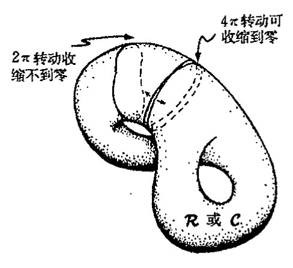
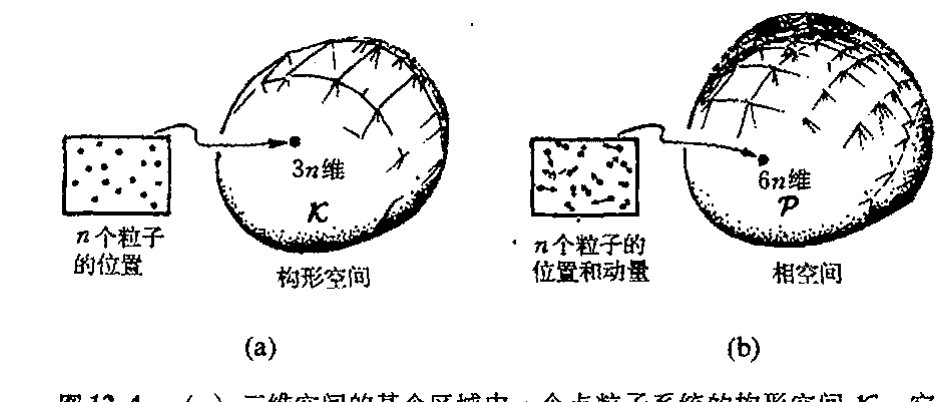
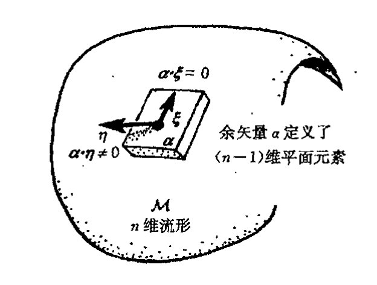
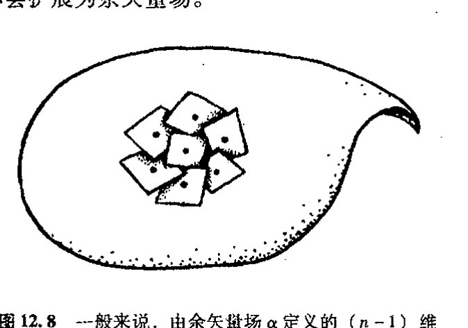
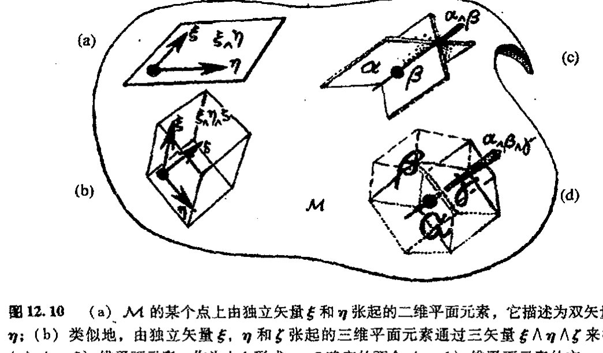
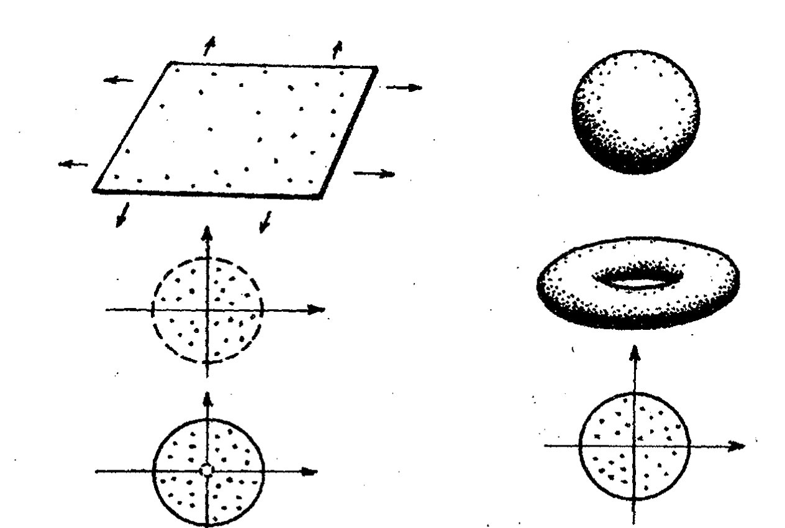
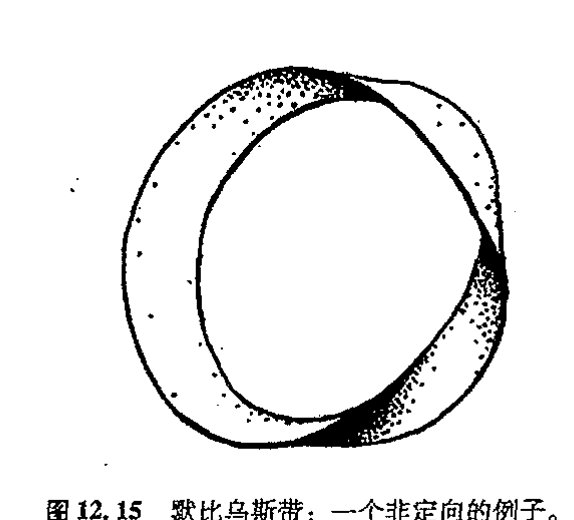
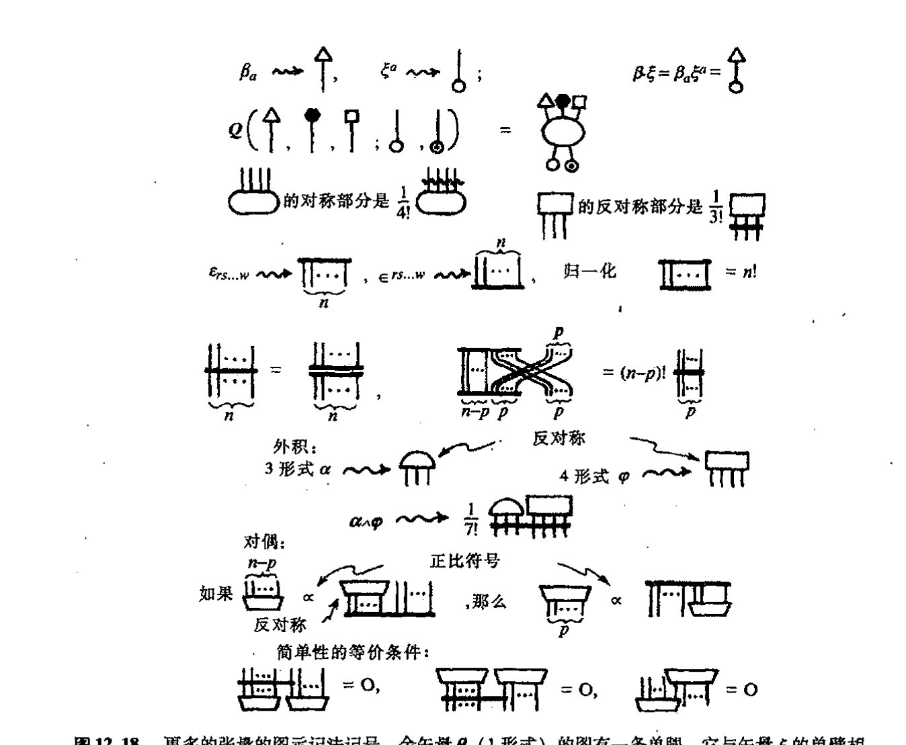

<!-- page 174 -->

第十二章

# $n$ 维流形

## 12.1 为什么要研究高维流形？

现在我们来研究建立高维流形的一般程序，这里维数 $n$ 可以是任意正整数（甚至可以为零，如果我们将单点视为零维流形的话）。对几乎所有现代物理基本理论而言，流形都是一种最基本的概念。读者或许奇怪，既然日常时空只有四维，物理上为什么会对 $n$ 维（$n>4$）流形如此感兴趣。事实上，许多现代理论，像弦论，都是在维数远大于 4 的高维“时空”里进行研究的。不久我们就会接触到这类问题（[§15.1](chapter_15.md#151-纤维丛的物理背景)，[§31.4](chapter_31.md#314-高维时空)，10–12，14–17），我们将考察这一概念在物理上应用的可行性。即使暂不考虑 $n$ 维流形是否真正适用于描述实际“时空”这个问题，物理上也还有其他一些截然不同但却十分令人信服的理由来说明流形应用的必要性。

例如，在三维欧几里得空间里，普通刚体的构形空间（以后我们称其为空间 $\mathcal{C}$）就是六维非欧几里得流形（见[图 12.1](assets/page174_fig01.jpg)）。所谓构形空间是指由刚体不同的物理定位的代表点构成的空间。

图 12.1 构形空间 $\mathcal{C}$，其中的每一点代表刚体在三维欧几里得空间 $\mathbb{E}^3$ 中的一种可能定位；$\mathcal{C}$ 是六维非欧几里得流形。

<!-- page 175 -->

通向实在之路

它有6个维是因为我们需要有3个维（自由度）来确定该刚体的力心位置，另3个维用来确定刚体的转动取向。*[12.1]那它为什么一定是非欧几里得的呢？这有许多理由，其中一个特别明显的理由是它的拓扑不同于六维欧几里得空间下的拓扑。$\mathcal{C}$ 的这种“非平凡拓扑性质”在三维空间的直接表现就是刚体的转动取向。我们把这种三维空间称为 $\mathcal{R}$。$\mathcal{R}$ 的每一点代表刚体的一种转动取向。读者一定还记得我们在前一章描述过的书的转动，这里我们仍取书作为刚体的直观表达（当然书不得打开，否则相应于书页的翻动，其构形空间就得有更多的维度）。

218

那么怎么来认识这种“非平凡拓扑性质”呢？可以想象，这不是一个简单的三维或六维流形问题，但我们有一些数学规则来判定这种性质。还记得[§8.4](chapter_08.md#84-紧黎曼曲面的亏格)里我们对黎曼曲面的考察吧（[图8.9](assets/page121_fig01.jpg)），在那里我们考察过几种不同的非平凡的二维曲面，除了黎曼球面之外，最简单的曲面是环面（亏格为1的曲面）。我们如何来辨别环面与球面之间的不同呢？方法之一是考察曲面上的闭合曲线。可以非常直观地看出，如果我们围绕环面画出一些闭合的圈，那么这些圈是无法通过连续变形收缩到零（某个单点）的；而球面上的每个闭合圈则总能够按此方式收缩到零（[图12.2](assets/page175_fig01.jpg)）。欧几里得平面上的闭合圈也可以收缩到零，因此我们说球面和平面在“可缩性”这一点

219

上是单连通的，而环面（和高亏格曲面）则由于存在不可缩的圈因而是多连通的。¹由此，我们从曲面本身得到一种区分环面（和高亏格曲面）与球面（和平面）的方法。

**图 12.2** 环面上的一些圈无法在环表面连续收缩到零（某个点），而在平面或球面上，每个闭合圈则总能够收缩到零。相应地，我们称平面和球面是单连通的，而环面（和高环柄数曲面）则是多连通的。

我们可用上述办法来区分三维流形 $\mathcal{R}$ 的拓扑与平凡的三维欧几里得拓扑，也可以用来区分六维流形 $\mathcal{C}$ 拓扑与平凡的六维欧几里得空间。我们不妨再回到[§11.3](chapter_11.md#113-四元数几何)里那本拖着条纸带的“书”上。书的每一次转动造成的书面法线取向可由 $\mathcal{R}$ 上一点来表示。如果我们连续将书转过 $2\pi$，则书面法线回到原初的取向。我们可将这整个变动结果想象为 $\mathcal{R}$ 内的某个闭合圈（[图12.3](assets/page176_fig01.jpg)）。那么能否将这一闭曲线连续地收缩到零（某个单点）呢？圈的形变相当于书本转动时书面法线的逐渐变化，直到它停止转动为止。但不要忘记，我们还有一条拖着的纸带。$2\pi$ 转动造成的纸带扭曲，是无法在书不动的条件下仅通过纸带本身的连续变动来解开的，而且在书的 $2\pi$

---

\*[12.1] 用更明白的语言解释这个维数。

· 156 ·

<!-- page 176 -->

## 第十二章　n 维流形

转动过程中，这种扭曲（或变换成奇数倍 2π 的扭曲）将始终存在。因此可以得出结论，2π 转动不可能通过实际的连续变形完全回复到非转动状态，相应地，我们也不可能在 R 上找到一个可连续收缩到零的闭合圈。三维流形 R（类似地，六维流形 C）必是多连通的，因此拓扑上它们不同于单连通的三维欧几里得空间（或六维欧几里得空间）。²

需要指出的是，R 和 C 的多连通性是一种比环面的多连通性更有趣的性质。这是因为代表 2π 转动的闭合圈有一种奇妙性质：如果这个圈再绕一次（4π 转动）的话，我们会得到一条可连续变形到一点的闭合圈***〔12.2〕。（这在环面上是不可能发生的。）R 和 C 中闭合圈的这种奇妙性质是所谓拓扑挠性的一个例子。

图 12.3 如图 12.2 所示的多连通概念可将三维流形 R（转动空间）拓扑或六维流形 C（构形空间）拓扑与“平凡的”三维欧几里得空间拓扑和六维欧几里得空间拓扑区分开。R 或 C 上表示 2π 连续转动的圈不能收缩到一点，故 R 或 C 是多连通的。但当圈横穿过两次（表示 4π 转动）后，这个圈就可缩为一点（拓扑挠性）。

从这个例子中我们可以看到，正是物理上对空间（如六维流形 C）的兴趣才使得研究不仅突破了普通时空维数的限制，而且推进到非平凡拓扑领域。实际上，对于涉及大量独立粒子的体系而言，这种与物理有关的空间维数将远大于 6，多维空间不仅以构形空间形式出现，而且还以相空间形式出现。在气体的构形空间 K 里，气体分子被描述成三维空间里的单个质点，故 K 有 3N 维，这里 N 是气体中的分子数。K 的每一点代表一种气体构形，其中每个分子的位置是独立确定的（[图 12.4](assets/page176_fig02.jpg)(a)）。在气体的相空间 P 里，我们还必须跟踪每个分子的动量（分子的质量乘以速度）变化。动量是一个矢量（有 3 个分量），因此总维数是 6N。这样，P 的每一点不仅代表所有气体分子的位置，而且还代表着每个独立粒子的运动（[图 12.4](assets/page176_fig02.jpg)(b)）。

图 12.4 （a）三维空间的某个区域中 n 个点粒子系统的构形空间 K。它有 3n 维，K 的每一点代表所有 n 个粒子的一种定位。（b）相空间 P 有 6n 维，P 的每一点代表所有 n 个粒子的定位和动量。

***〔12.2〕 说明如何利用练习〔12.8〕给出的 R 的表示来做到这一点。

??? question "答案 [12.2]"
    练习 [12.8] 给出的 $R$ 可看作把两个坐标拼块重叠部分粘合起来的过渡函数。要得到所需流形，只需取若干个欧氏开集拼块，并在重叠区域按这个 $R$ 识别坐标。

    关键是 $R$ 在重叠处是光滑且有光滑逆的，因此拼接后的空间局部仍与欧氏空间同胚，并且不同拼块上的坐标变化满足流形定义所需的相容性。

<!-- page 177 -->

通向实在之路

即使是一点点空气，也含有 $10^{19}$ 个分子，^3^ 故 $\mathcal{P}$ 有差不多 60 000 000 000 000 000 000 维！在研究涉及大量粒子的（经典）物理系统的行为方面，相空间特别有用。

## 12.2 流形与坐标拼块

现在我们来考虑如何从数学上处理 $n$ 维流形结构。$n$ 维流形 $\mathcal{M}$ 的构造可完全按类似于第 8 章和第 10 章（见 [§10.2](chapter_10.md#102-光滑偏导数)）的方法来处理，我们先用一系列坐标拼块得到曲面 $S$。但是现在对于每个拼块我们需要远比数偶 $(x, y)$ 或 $(X, Y)$ 多得多的坐标。事实上每个拼块上有 $n$ 个坐标，这里 $n$ 是 $\mathcal{M}$ 的维数，取正整数。基于这个原因，我们不再用各个不同的字母而是用（上）数字指标来区分不同的坐标

$$x^1,\ x^2,\ \cdots,\ x^n。$$

这里别犯糊涂。这些不是 $x$ 的不同幂，而是各个独立的实数。读者兴许会感到迷惑，我是不是刻意要故弄玄虚，为什么不用下指标（例如 $x_1,\ x_2,\ \cdots,\ x_n$）而非要用上指标呢？这很容易造成诸如坐标 $x^3$ 和量 $x$ 的 3 次方之间的混乱。这里犯晕的读者的确无辜，我自己就认为它不仅容易让人糊涂，偶尔甚至非常令人不快。但出于历史原因，经典张量分析（在本章后面部分我们会有更严谨的描述）的标准惯例一直就是如此。这些惯例牵涉到上下指标位置使用的严格规则，其中用于标示坐标的指标恰好就是放在上角位置。（这些规则在使用中非常有效，遗憾的是它没为坐标选择下指标约定，恐怕我们只能这么将就了。）

怎么来刻画流形 $\mathcal{M}$ 呢？我们将它看作是许多坐标拼块的“粘合”。这里每个拼块都是 $\mathbb{R}^n$ 的一个开区域，$\mathbb{R}^n$ 代表“坐标空间”，其中的点是 $n$ 元组实数 $(x^1,\ x^2,\ \cdots,\ x^n)$，大家一定还记得（[§6.1](chapter_06.md#61-如何构造实函数)）$\mathbb{R}$ 代表的是实数系。在粘合过程中，我们有所谓转移函数，它将某个拼块的坐标表示为其他拼块坐标的函数。坐标拼块之间的重叠可以在流形 $\mathcal{M}$ 的任何地方找到。这些转移函数必须满足一些约束条件以保证整个粘合过程的协调性。粘合过程如图 12.5(a) 所示。为了生成标准流形，^4^ 即所谓豪斯道夫空间，我们得格外小心。（非豪斯道夫流形可以是“分支”，如图 12.5(b) 和[图 8.2](assets/page114_fig01.jpg)(c) 所示。）豪斯道夫空间有明确的属性：对空间上两个相异的点，存在包含每一点的开集，这些开集彼此不相交（图 12.5c）。

必须明确，得到流形并不意味着就“知道”它的各个拼块，或“知道”其中某个点的具体坐标值。看待流形 $\mathcal{M}$ 的正确方法是，它可以通过拼接坐标拼块的方式建立起来，但之后我们得“忘却”这种拼接的具体过程。流形有它自己的数学结构，坐标只是辅助性的，可以按我们需要的方式重新引入。在这里介绍流形严格的数学定义（有多种表述方式）只会分散我们的注意力。^5

<!-- page 178 -->

第十二章　n维流形

[图：图12.5 (a) 坐标拼块在三重重叠区域的粘合示意图，标注“粘合得到”与“在三者重叠区需要协调”；(b) 出现非豪斯道夫空间特征“分支”的流形示意图，标注“非豪斯道夫流形”；(c) 豪斯道夫空间中相异两点具有彼此不重叠邻域的示意图，标注“豪斯道夫条件”]

图 12.5　（a）在每个三重叠合区域上，表示重叠坐标拼块的坐标平移的转移函数必须满足一种协调关系。（b）各对拼块之间的（开集）重叠区域必须适当，否则就可能出现具有非豪斯道夫空间特征的“分支”。（c）豪斯道夫空间具有这样一种性质：空间上相异的两点各有彼此不重叠的邻域。（在（b）中，为使“粘合”部分是开集，其“边界”（即出现分支的地方）必然处于分离状态，正是在这个地方豪斯道夫条件得不到满足。）

## 12.3　标量、矢量和余矢量

如同 [§10.2](chapter_10.md#102-光滑偏导数) 节所述，我们同样有流形 $\mathcal{M}$ 上的光滑函数 $\Phi$ 概念（有时候称为 $\mathcal{M}$ 上的标量场）。$\Phi$ 定义在坐标拼块上，作为这个拼块上 $n$ 维坐标的光滑函数。这里“光滑”是指“$C^\infty$ 光滑”（见 [§6.3](chapter_06.md#63-高阶导数cinfty-光滑函数)），因为由此得到的理论最为简明。在两个拼块的重叠处，一个拼块的坐标是另一个拼块坐标的光滑函数。因此在重叠区域，$\Phi$ 关于一组坐标是光滑的意味着它关于另一组坐标也是光滑的。以这种方式将局部（拼块上）定义的标量函数 $\Phi$ 的光滑性推广到整个 $\mathcal{M}$，我们就得到了整个 $\mathcal{M}$ 上函数 $\Phi$ 的光滑性。

下一步我们来定义 $\mathcal{M}$ 上的矢量场 $\xi$ 概念。几何上，我们应将矢量场理解为 $\mathcal{M}$ 上的一簇“箭头”（[图 10.5](assets/page152_fig01.jpg)），这里 $\xi$ 是这样一种量，它以微分算子形式作用在（光滑）标量场 $\Phi$ 上，产生另一个标量场 $\xi(\Phi)$。类似于 [§10.3](chapter_10.md#103-矢量场和-1-形式) 里的二维情形，$\xi(\Phi)$ 可理解为 $\Phi$ 在 $\xi$ 所代表箭头方向上的增长率。作为“微分算子”，$\xi$ 同样满足相应的代数关系（类似我们在 [§6.5](chapter_06.md#65-微分法则) 节里的情形，即 $\mathrm{d}(f+g)=\mathrm{d}f+\mathrm{d}g$，$\mathrm{d}(fg)=f\mathrm{d}g+g\mathrm{d}f$，$\mathrm{d}a=0$ 若 $a$ 为常数的话）：

$$
\xi(\Phi+\Psi)=\xi(\Phi)+\xi(\Psi), \\
\xi(\Phi\Psi)=\Phi\xi(\Psi)+\Psi\xi(\Phi), \\
\xi(k)=0 \text{ 如果 } k \text{ 是常数的话}.
$$

事实上，有定理证明，这些代数性质足以使 $\xi$ 成为一种矢量场。⁶

223

·159·

<!-- page 179 -->

通向实在之路

我们还可以用纯代数方法来定义 1 形式，它的另一个名字叫余矢量场。（一会儿我们就来说明它的几何意义。）余矢量 $\mathbf{\alpha}$ 可看作是矢量场到标量场的映射，$\mathbf{\alpha}$ 对 $\mathbf{\xi}$ 的作用写成 $\mathbf{\alpha}\cdot\mathbf{\xi}$（$\mathbf{\alpha}$ 与 $\mathbf{\xi}$ 的标积），这里，对矢量场 $\mathbf{\xi}$ 和 $\mathbf{\eta}$，以及标量场 $\Phi$，我们有线性关系：

$$\mathbf{\alpha}\cdot(\mathbf{\xi}+\mathbf{\eta})=\mathbf{\alpha}\cdot\mathbf{\xi}+\mathbf{\alpha}\cdot\mathbf{\eta},$$
$$\mathbf{\alpha}\cdot(\Phi\mathbf{\xi})=\Phi(\mathbf{\alpha}\cdot\mathbf{\xi}).$$

这些关系将余矢量定义为矢量的偶。可以证明，二者之间的这种对偶关系是对称的，因此我们有相应的关系式

$$(\mathbf{\alpha}+\mathbf{\beta})\cdot\mathbf{\xi}=\mathbf{\alpha}\cdot\mathbf{\xi}+\mathbf{\beta}\cdot\mathbf{\xi},$$
$$(\Phi\mathbf{\alpha})\cdot\mathbf{\xi}=\Phi(\mathbf{\alpha}\cdot\mathbf{\xi}),$$

上述关系给出了两个余矢量之和的定义，以及余矢量与标量之积的定义。若取余矢量空间的对偶空间，我们即得到原始的矢量空间，反之也一样。（换句话说，"余矢量"也是矢量。）

我们可将这些关系看作是定义在整个场上的，也可视其为是定义在 $\mathcal{M}$ 的某一点上的。某固定点 $o$ 上的所有矢量组成一个矢量空间。（正如在 [§11.1](chapter_11.md#111-四元数代数) 里描述的，在矢量空间内，两元素 $\mathbf{\xi}$ 和 $\mathbf{\eta}$ 相加构成二者之和 $\mathbf{\xi}+\mathbf{\eta}$，并有 $\mathbf{\xi}+\mathbf{\eta}=\mathbf{\eta}+\mathbf{\xi}$ 和 $(\mathbf{\xi}+\mathbf{\eta})+\mathbf{\zeta}=\mathbf{\xi}+(\mathbf{\eta}+\mathbf{\zeta})$，还可以用实数 $f$ 和 $g$ 等标量来乘以这些元素，即有 $(f+g)\mathbf{\xi}=f\mathbf{\xi}+g\mathbf{\xi}, f(\mathbf{\xi}+\mathbf{\eta})=f\mathbf{\xi}+f\mathbf{\eta}, f(g\mathbf{\xi})=(fg)\mathbf{\xi}, 1\mathbf{\xi}=\mathbf{\xi}$。）我们可以将这种（平直）矢量空间视为 $o$ 点紧邻域上的一种流形结构（[图 12.6](assets/page179_fig01.jpg)）。我们称这种矢量空间为 $\mathcal{M}$ 在 $o$ 点的切空间 $T_o$。对 $T_o$ 可作如下的直观理解：它是 $\mathcal{M}$ 上 $o$ 点的邻域变得越来越小时趋近的极限空间。如果我们用放大倍数越来越高的放大镜来观察 $o$ 点周围的区域，就会发现该区域变得无限"伸展开来"，在极限情形下，$\mathcal{M}$ 的"曲率"会被"熨平"，从而给出 $T_o$ 的平直结构。矢量空间 $T_o$ 有（有限）维度 $n$，因为在 $o$ 点我们可以找到一组 $n$ 个基元，即量 $\partial/\partial x^1, \cdots, \partial/\partial x^n$，它们指向各坐标轴。$T_o$ 中的任一元素都能够唯一线性地用这组基元表达出来（亦见 [§13.5](chapter_13.md#135-本征值与本征矢量)）。

**图 12.6** $n$ 维流形 $\mathcal{M}$ 在 $o$ 点的切空间 $T_o$ 可直观地理解为这样一种极限空间：当 $o$ 点的邻域变得越来越小时，我们用放大倍数越来越高的放大镜来观察它所得到的结果。（比较图 10.6。）结果空间 $T_o$ 是平直的：是一种 $n$ 维矢量空间。

按上述方法我们可构造 $T_o$ 的对偶空间（$o$ 点的余矢量空间），它称为 $\mathcal{M}$ 在 $o$ 点的余切空间 $T_o^*$，余矢量场的一个特例是标量场 $\Phi$ 的梯度（或称外导数）$\mathrm{d}\Phi$。（在二维情形下，我们已经遇到过这个记号，见 [§10.3](chapter_10.md#103-矢量场和-1-形式)。）余矢量 $\mathrm{d}\Phi$（分量 $\partial\Phi/\partial x^1, \cdots, \partial\Phi/\partial x^n$）有确定的性质：

$$\mathrm{d}\Phi\cdot\mathbf{\xi}=\mathbf{\xi}(\Phi).$$

<!-- page 180 -->

第十二章 n维流形

（见§10.4。）**[12.3] 尽管不是所有余矢量都有形式 dΦ，但对某些 Φ，它们可在任一单点上表达为这种形式。不久我们即会看到为什么这种形式不会扩展为余矢量场。

图 12.7 M 的某个点上的（非零）余矢量 α 定义了一个（n−1）维平面元素。满足 α·ξ=0 的矢量 ξ 规定了这个面元的各个方向。

图 12.8 一般来说，由余矢量场 α 定义的（n−1）维平面元素会出现扭曲，这使它们无法协调地与（n−1）维曲面族相切——尽管在 α=dΦ（Φ 是标量场）情形下，它们与 Φ=常数的曲面（图 10.8 里“等高线”的推广）相切。

余矢量与矢量在几何方面的差别是什么呢？在 M 的每一点上，一个（非零）余矢量 α 确定了一个（n−1）维平面元，该面元的各个方向由满足 α·ξ=0 的矢量 ξ 确定，见[图 12.7](assets/page180_fig01.jpg)。对于 α=dΦ 的特例，这些（n−1）维平面元均与常数 Φ 的（n−1）维曲面族*[12.4]（它是如图 10.8(a)所示的“等高线”概念的推广）相切。但一般来说，由余矢量 α 定义的（n−1）维平面元常出现扭曲，这使它们无法协调地与（n−1）维曲面族相切（见[图 12.8](assets/page180_fig02.jpg)）。⁷

具体到坐标为 x¹, x², ⋯, xⁿ 的坐标拼块情形，矢量（场）ξ 可用一组分量（ξ¹, ξ², ⋯, ξⁿ）来表示，其中每个分量表示的是 ξ 关于该坐标拼块的各偏微分算子的系数（见§10.4）

$$\mathbf{\xi} = \xi^1 \frac{\partial}{\partial x^1} + \xi^2 \frac{\partial}{\partial x^2} + \cdots + \xi^n \frac{\partial}{\partial x^n},$$

就某一点的矢量而言，ξ¹, ξ², ⋯, ξⁿ 只是 n 个实数；对于某个坐标拼块内的矢量场来说，它们是坐标 x¹, x², ⋯, xⁿ 的 n 个（光滑）函数（提醒读者注意，这里“ξⁿ”不代表 ξ 的 n 次幂）。我们知道，算子“∂/∂xʳ”表示取第 r 个坐标轴方向上的变化率，因此，上述 ξ 表达式把矢量 ξ 表示为（作为算子它相当于“取 ξ 方向变化率”）沿各坐标轴方向的那些矢量的线性组合（见[图 12.9](assets/page181_fig01.jpg)）。

类似地，在坐标拼块内，余矢量（场）α 可表为一组分量（α₁, α₂, ⋯, αₙ）：

$$\mathbf{\alpha} = \alpha_1 \mathrm{d}x^1 + \alpha_2 \mathrm{d}x^2 + \cdots + \alpha_n \mathrm{d}x^n,$$

即表为基本 1 形式（余矢量）⁸ dx¹, dx², ⋯, dxⁿ 的线性组合。几何上说，每个 dxʳ 表示除了 xʳ

---

**[12.3] 试证：这么定义的“dΦ”满足如上所述的余矢量的“线性性”要求。

??? question "答案 [12.3]"
    对切向量 $\xi$，定义 $d\Phi(\xi)=\xi(\Phi)$，即 $\Phi$ 沿 $\xi$ 的方向导数。若 $\xi$、$\eta$ 是切向量，$a,b$ 为数，则 $(a\xi+b\eta)(\Phi)=a\xi(\Phi)+b\eta(\Phi)$。

    因此 $d\Phi(a\xi+b\eta)=a\,d\Phi(\xi)+b\,d\Phi(\eta)$，这正是余矢量对矢量的线性性。

*[12.4] 为什么？

??? question "答案 [12.4]"
    在等值面 $\Phi=\text{常数}$ 上沿任意切方向移动，$\Phi$ 的变化率都为零。因此若 $\xi$ 切于该等值面，就有 $d\Phi(\xi)=0$。

    也就是说，$d\Phi$ 的核正是等值面的切平面；几何上它表示一族与等值面相切的平面元。

<!-- page 181 -->

通向实在之路

---

**图12.9** 坐标拼块 $(x^1, x^2, \cdots, x^n)$ 下的分量（这里 $n=3$）。（a）对于矢量（场）$\xi$，这些分量是 $(\xi = \xi^1 \partial/\partial x^1 + \xi^2 \partial/\partial x^2 + \cdots + \xi^n \partial/\partial x^n)$ 里的系数 $(\xi^1, \xi^2, \cdots, \xi^n)$，这里 "$\partial/\partial x^r$" 表示 "取第 $r$ 个坐标轴方向上的变化率"（亦见图10.9）。（b）对余矢量（场）$\alpha$，这些分量是 $\alpha = \alpha_1 dx^1 + \alpha_2 dx^2 + \cdots + \alpha_n dx^n$，里的系数 $(\alpha_1, \alpha_2, \cdots, \alpha_n)$，这里 "$dx^r$" 表示 "$x^r$ 的梯度"，即除了 $x^r$ 轴之外的所有其他坐标轴所张的 $(n-1)$ 维平面元素。

---

**图12.10** （a）$\mathcal{M}$ 的某个点上由独立矢量 $\xi$ 和 $\eta$ 张起的二维平面元素，它描述为双矢量 $\xi \wedge \eta$；（b）类似地，由独立矢量 $\xi$、$\eta$ 和 $\zeta$ 张起的三维平面元素通过三矢量 $\xi \wedge \eta \wedge \zeta$ 来描述；（c）$(n-2)$ 维平面元素，作为由 1 形式 $\alpha$、$\beta$ 确定的两个 $(n-1)$ 维平面元素的交，由 $\alpha \wedge \beta$ 来描述；（d）$(n-3)$ 维平面元素作为由 1 形式上 $\alpha$、$\beta$、$\gamma$ 确定的 3 个 $(n-1)$ 维平面元素的交，由 $\alpha \wedge \beta \wedge \gamma$ 来描述。

轴之外的所有其他坐标轴所张的 $(n-1)$ 维平面元（[图12.10](assets/page181_fig02.jpg)）。*^{[12.5]} 标积 $\alpha \cdot \xi$ 由下式给出：**^{[12.6]}

$$\alpha \cdot \xi = \alpha_1 \xi^1 + \alpha_2 \xi^2 + \cdots + \alpha_n \xi^n。$$

---

\*^{[12.5]} 试证：$dx^2$ 有分量 $(0, 1, 0, \cdots, 0)$，它表示与 $x^2 =$ 常数平面相切的超平面元。

\*\*^{[12.6]} 用链式法则（见 [§10.3](chapter_10.md#103-矢量场和-1-形式)）证明：对于 $\alpha = d\Phi$ 情形，表达式 $\alpha \cdot \xi$ 与 $d\Phi \cdot \xi = \xi(\Phi)$ 一致。

· 162 ·

<!-- page 182 -->

第十二章 $n$ 维流形

## 12.4 格拉斯曼积

现在我们来考虑用 [§11.6](chapter_11.md#116-格拉斯曼代数) 里定义的格拉斯曼积的概念来表示不同维张起的平面元。$\mathcal{M}$ 的某一点上的二维平面元（或 $\mathcal{M}$ 上二维平面元场）可表为量

$$\mathbf{\xi} \wedge \mathbf{\eta},$$

这里 $\mathbf{\xi}$ 和 $\mathbf{\eta}$ 是张起二维平面（见[图 11.6](assets/page171_fig01.jpg)(a) 和[图 12.10](assets/page181_fig02.jpg)(a)）的两个独立矢量（或矢量场）。量 $\mathbf{\xi} \wedge \mathbf{\eta}$ 有时被当作（简单）双矢量。按上章末所述，简单双矢量的分量据 $\mathbf{\xi}$ 和 $\mathbf{\eta}$ 的各分量可表为：

$$\xi^{[r}\eta^{s]} = \frac{1}{2}(\xi^r\eta^s - \xi^s\eta^r),$$

简单双矢量 $\mathbf{\xi} \wedge \mathbf{\eta}$ 的和 $\mathbf{\psi}$ 也称为双矢量，其分量 $\psi^{rs}$ 具有关于 $r$ 和 $s$ 的反对称性质，即 $\psi^{rs} = -\psi^{sr}$。

类似地，三维平面元（或这样的场）可表为简单三矢量

$$\mathbf{\xi} \wedge \mathbf{\eta} \wedge \mathbf{\zeta},$$

这里，矢量 $\mathbf{\xi}$，$\mathbf{\eta}$ 和 $\mathbf{\zeta}$ 张起三维平面（[图 11.6](assets/page171_fig01.jpg)(b) 和[图 12.10](assets/page181_fig02.jpg)(b)），其分量为

$$\xi^{[r}\eta^s\zeta^{t]} = \frac{1}{6}(\xi^r\eta^s\zeta^t + \xi^s\eta^t\zeta^r + \xi^t\eta^r\zeta^s - \xi^r\eta^t\zeta^s - \xi^t\eta^s\zeta^r - \xi^s\eta^r\zeta^t).$$

一般三矢量 $\mathbf{\tau}$ 有完全反对称分量 $\tau^{rst}$，它总可表为这种简单三矢量的和。我们可按这种方式来定义由简单四矢量表示的四维平面元，等等。一般 $n$ 矢量具有多个完全反对称分量集，并且它总可以表示为简单 $n$ 矢量的和。

这里有个问题让人感到迷惑。现在我们似乎有两种不同方式来表示 $(n-1)$ 维平面元：一种是 $1$ 形式（余矢量），另一种是由张起 $(n-1)$ 维平面的 $n-1$ 个独立矢量的"楔积"得到的 $(n-1)$ 维矢量。这两种方式描述的量在几何上有明显区别，但很微妙。我们可将 $1$ 形式视为一种"密度"，而对 $(n-1)$ 维矢量则不行。为了更清楚地说明这一点，我们先引入一般的 $p$ 形式概念。

为从基础抓起，我们从 $1$ 形式而不是从矢量出发来处理上述多维矢量。给定 $p$ 个独立的 $1$ 形式 $\mathbf{\alpha}, \mathbf{\beta}, \cdots, \mathbf{\delta}$，组成楔积

$$\mathbf{\alpha} \wedge \mathbf{\beta} \wedge \cdots \wedge \mathbf{\delta},$$

在坐标拼块上，它有如下分量（用 [§11.6](chapter_11.md#116-格拉斯曼代数) 引入的一般方括号指标记法）：

$$\alpha_{[r}\beta_s\cdots\delta_{u]}.$$

这个量决定了 $(n-p)$ 维平面元（或场），这种元素是不同个分别由 $\mathbf{\alpha}, \mathbf{\beta}, \cdots, \mathbf{\delta}$ 单独决定的 $(n-1)$ 维平面元的交（[图 12.10](assets/page181_fig02.jpg)(c),(d)）。这个量称为简单 $p$ 形式。在 $p$ 矢量情形下，最一般的 $p$ 形式未必能直接表示为余矢量的楔积（当然 $p = 0, 1, n-1, n$ 等情形除外），而是这些楔积的

<!-- page 183 -->

通向实在之路

各项之和。从分量上看，一般 $p$ 形式 $\mathbf{\varphi}$（在任一坐标拼块下）可表示为一组量

$$\varphi_{rs\cdots u}$$

它对各指标 $r, s, \cdots, u$ 是反对称的（这里 $r, s, \cdots, u$ 中的每一个均从 1 取到 $n$）。数目上这组量共有 $p$ 个分量。所述反对称性意味着，如果交换任意一对指标，我们将得到一个与被交换量正好相反（差一负号）的量。利用 [§11.6](chapter_11.md#116-格拉斯曼代数) 定义的方括号，我们可将这种反对称性表示为方程 **(12.7)**

$$\varphi_{[rs\cdots u]} = \varphi_{rs\cdots u}。$$

这里还要指出，作为 $p$ 形式 $\mathbf{\varphi}$ 与 $q$ 形式 $\mathbf{\chi}$ 的楔积，$(p+q)$ 形式 $\mathbf{\varphi} \wedge \mathbf{\chi}$ 有分量

$$\varphi_{[rs\cdots u}\chi_{jk\cdots m]}，$$

反对称化对所有指标均成立（这里 $\chi_{jk\cdots m}$ 是 $\mathbf{\chi}$ 的分量）。**(12.8)** 类似记法亦可应用到 $p$ 矢量与 $q$ 矢量的楔积上。

## 12.5 形式的积分

现在我们来考察 $p$ 形式的“密度”特征。我们知道，在普通物理里，物体的密度是指其单位体积的质量。这个密度是组成该物体材料的一种属性。如果我们知道一个物体的总体积及其所用材料属性，那么我们就可用“密度”概念来估算它的总质量。从数学上说，我们要做的就是对该密度作体积分。本质上，所谓密度不过是在某种区域上一种适当可积的量，即积分符号后的那个被积函数。这里要小心的是区分不同维空间的积分。（例如，“单位面积质量”是一种不同于“单位体积质量”的量。）我们发现 $p$ 形式正是这么一种在 $p$ 维空间里适当可积的量。

我们从 1 形式开始来研究这种积分。这是最简单情形，涉及的只是一维流形上某个量的积分，即沿曲线 $\gamma$ 的积分。由 [§6.6](chapter_06.md#66-积分) 里的普通（一维）积分知，这个积分可写成

$$\int f(x) \, dx，$$

这里 $x$ 是沿曲线 $\gamma$ 所取的某个实变量。我们把量“$f(x) \, dx$”视为 1 形式的记号。1 形式的记法已被精心裁剪得与通常积分记法相一致。这就是 20 世纪计算领域里著名的外演算，它是由杰出的法国数学家嘉当（Élie Cartan, 1869~1951）引入的，这个名字我们还会在第 13、14 和 17 章里遇到。这种演算与 17 世纪莱布尼茨（Gottfried Wilhelm Leibniz, 1646~1716）引入的“dx”记法可谓是珠联璧合。在嘉当框架下，我们不是把“dx”看作是“无穷小量”，而是一种适当的密度（1 形式），它用来作沿曲线的积分。

---

**(12.7)** 该解释该式。

**(12.8)** 试证：$\varphi \wedge \chi = \alpha \wedge \cdots \wedge \gamma \wedge \lambda \wedge \cdots \nu$，这里 $\varphi = \alpha \wedge \cdots \wedge \gamma$，$\chi = \lambda \wedge \cdots \nu$。

·164·

<!-- page 184 -->

第十二章 n 维流形

这种记法好在它自动地与我们欲调用的变量变化相联系。譬如说，如果我们改变参量 $x$ 到另一参量 $X$，则我们认为 1 形式 $\alpha = f(x)\,\mathrm{d}x$ 保持不变——即 $\int\!\alpha$ 保持不变——即使它关于 $x$ 或 $X$ 的显函数表达式有变化。***[12.9] 我们也可将 1 形式 $\alpha$ 看作是定义在曲线所在的更高维背景空间上的。参数 $x$ 或 $X$ 可视为这种背景空间里某个坐标拼块下的坐标。这样，当我们变到另一个坐标拼块时，很自然地就过渡到另一个坐标。我们可将这个积分简记为

$$\int\!\alpha \quad\text{或}\quad \int_{\mathcal{R}}\!\alpha,$$

这里 $\mathcal{R}$ 代表用来积分给定曲线 $\gamma$ 的某一段。

那么怎么表示高维下的区域积分呢？对二维区域，积分号后的被积函数应为 2 形式，^9^ 写成 $f(x,y)\,\mathrm{d}x\wedge\mathrm{d}y$（或类似的和），这样，我们有

$$\int_{\mathcal{R}} f(x,y)\,\mathrm{d}x\wedge\mathrm{d}y = \int_{\mathcal{R}}\!\alpha$$

（或这样的量的和），这里 $\mathcal{R}$ 是待积的二维区域面积，它取自某个给定的二维曲面。参数 $x,\,y$ 作为曲面的局域坐标，同样可用一对数偶来表示，只是记号的区分上要当心，别弄混了。如果 2 形式得自二维区域 $\mathcal{R}$ 所在的高维背景空间，那么上述计算不会有任何问题。所有这些计算均可推广到三维区域下的 3 形式和四维区域下的 4 形式，等等。嘉当微分记号下的楔积（包括 [§12.6](#126-外导数) 里的外导数）在坐标变化时同样成立。（这里无须述及繁复的“雅可比行列式”。）***[12.10]

由 [§6.6](chapter_06.md#66-积分) 的微积分基本定理可知，对于一维积分，积分运算是微分运算的逆运算，换言之，

$$\int_a^b \frac{\mathrm{d}f(x)}{\mathrm{d}x}\mathrm{d}x = f(b)-f(a)。$$

这一定理在高维下是否有相应的类比形式呢？回答是肯定的。不同维下的这种类比曾冠以不同的称呼（Ostrogradski, Gauss, Green, Kelvin, Stokes, 等等），但其一般结果，也就是嘉当的微分形式外演算的基本部分，通常称为“外演算基本定理”。^10^ 这个定理是建立在嘉当的一般外导数概念上的，下面我们就先讨论外导数这个概念。

## 12.6 外导数

定义上述重要概念的一种“非坐标”途径，就是公理化地建立外导数概念：对每个 $p=0,\,1,\,\cdots,\,n-1$，用独特的算子“d”作用到 $p$ 形式，产生 $(p+1)$ 形式。这种作用有如下性质：

---

*** [12.9] 给出显式，对定积分 $\displaystyle\int_a^b\!\alpha$，解释如何取上下限。

??? question "答案 [12.9]"
    若一维曲线上 $\alpha=f(x)dx$，则定积分就是 $\int_a^b\alpha=\int_a^b f(x)dx$。上下限由曲线的取向决定：从 $a$ 到 $b$ 为正向，从 $b$ 到 $a$ 则积分变号。

    在参数 $t$ 下，若路径为 $x=x(t)$、$t$ 从 $t_0$ 到 $t_1$，则 $\int\alpha=\int_{t_0}^{t_1}f(x(t))x'(t)dt$。这说明上下限本质上是有向边界点。

*** [12.10] 令 $\displaystyle G=\int_{-\infty}^\infty e^{-x^2}\mathrm{d}x$，解释为什么 $\displaystyle G^2=\int_{\mathbb{R}^2}e^{-(x^2+y^2)}\mathrm{d}x\wedge\mathrm{d}y$，将这个积分变换到极坐标 $(r,\,\theta)$（[§5.1](chapter_05.md#51-复代数几何)）下进行估值，由此证明 $G=\sqrt{\pi}$。

??? question "答案 [12.10]"
    因为两个一维积分相互独立，$G^2=(\int e^{-x^2}dx)(\int e^{-y^2}dy)=\int_{\mathbb R^2}e^{-(x^2+y^2)}dx\wedge dy$。

    极坐标下 $x=r\cos\theta$、$y=r\sin\theta$，面积形式变为 $dx\wedge dy=r\,dr\wedge d\theta$。于是 $G^2=\int_0^{2\pi}\int_0^\infty e^{-r^2}r\,dr\,d\theta=2\pi\cdot(1/2)=\pi$，故 $G=\sqrt\pi$。

· 165 ·

<!-- page 185 -->

通向实在之路

$$\mathbf{d}(\mathbf{\alpha}+\mathbf{\beta})=\mathbf{d}\mathbf{\alpha}+\mathbf{d}\mathbf{\beta},$$

$$\mathbf{d}(\mathbf{\alpha}\wedge\mathbf{\gamma})=\mathbf{d}\mathbf{\alpha}\wedge\mathbf{\gamma}+(-1)^{p}\mathbf{\alpha}\wedge\mathbf{d}\mathbf{\gamma},$$

$$\mathbf{d}(\mathbf{d}\mathbf{\alpha})=0,$$

这里 $\mathbf{\alpha}$ 代表 $p$ 形式，对 $0$ 形式（即标量），$\mathbf{d}\Phi$（"$\Phi$ 的梯度"）的意义与早先讨论的相同。（从 $\mathbf{d}(\Phi)\cdot\mathbf{\xi}=\mathbf{\xi}(\Phi)$ 定义式知，这里的 "d" 与 $\mathrm{d}x$ 里的 "d" 是完全相同的算子。）上面罗列的最后一个方程式经常写成

$$\mathbf{d}^{2}=0,$$

这是外导数算子 $\mathbf{d}$ 的一个关键性质。（我们会注意到，上面第二个方程里之 "所以" 出现看起来别扭的项 $(-1)^{p}$，是因为其后的 "$\mathbf{d}$" 实在是 "站错了位置"，得 "穿过" $\mathbf{\alpha}$，这里 $p$ 是反对称指标。在下面的指标记法下这一点会变得更清楚。）***[12.11]

按上述性质，作为梯度 $\mathbf{\alpha}=\mathbf{d}\Phi$ 的 $1$ 形式 $\mathbf{\alpha}$ 必然满足 $\mathbf{d}\mathbf{\alpha}=0$。*[12.12] 但不是所有 $1$ 形式都满足这一关系。事实上，若 $1$ 形式 $\mathbf{\alpha}$ 满足 $\mathbf{d}\mathbf{\alpha}=0$，则局部（即包含任一给定点的足够小开集）上，存在某个 $\Phi$ 使 $\mathbf{\alpha}=\mathbf{d}\Phi$。这是重要的庞加莱引理^[11] 的一种情形，***[12.13] 这条引理认为，如果 $p$ 形式 $\mathbf{\beta}$ 满足 $\mathbf{d}\mathbf{\beta}=0$，则对于 $(p-1)$ 形式 $\mathbf{\gamma}$，局部上 $\mathbf{\beta}$ 有形式 $\mathbf{\beta}=\mathbf{d}\mathbf{\gamma}$。

运用分量概念，我们很容易弄清什么是外导数。考虑 $p$ 形式 $\mathbf{\alpha}$。在坐标为 $(x^{1}, x^{2}, \cdots, x^{n})$ 的坐标拼块下，$\mathbf{\alpha}$ 表示为反对称分量 $\alpha_{r\cdots t}$（$=\alpha_{[r\cdots t]}$，这里 $r\cdots t$ 是 $p$ 个数，见 [§11.6](chapter_11.md#116-格拉斯曼代数)）的集合，记为

$$\mathbf{\alpha}=\sum\alpha_{r\cdots t}\mathrm{d}x^{r}\wedge\cdots\wedge\mathrm{d}x^{t},$$

这里求和（由符号 $\sum$ 表示）取遍 $r\cdots t$ 的每一个指标，每个指标均从 $1$ 取到 $n$。（有些读者不喜欢这种重复表达式，因为楔积的反对称性使得每个非零项被重复计算了 $p$ 次。但考虑到这么使用可使记法变得更清楚，因此我还是喜欢用这个表达法。）$p$ 形式 $\mathbf{\alpha}$ 的外导数是 $(p+1)$ 形式，记为 $\mathbf{d}\mathbf{\alpha}$，它有分量

$$(\mathbf{d}\mathbf{\alpha})_{qr\cdots t}=\frac{\partial}{\partial x^{[q}}\alpha_{r\cdots t]},$$

（这个记法看上去有些复杂，反对称化——这个表达式的关键——延伸到所有 $p+1$ 指标，包括导数符号后变量 $x$ 的指标）。***[12.14]，****[12.15]

---

*** [12.11] 利用上述关系，证明：$\mathbf{d}(A\mathrm{d}x+b\mathrm{d}y)=(\partial B/\partial x-\partial A/\partial y)\cdot\mathrm{d}x\mathrm{d}y$。

??? question "答案 [12.11]"
    用外导数的乘法规则，$d(A dx+B dy)=dA\wedge dx+dB\wedge dy$，因为 $d(dx)=d(dy)=0$。

    又 $dA=A_xdx+A_y dy$，$dB=B_xdx+B_y dy$。所以 $dA\wedge dx=A_y dy\wedge dx=-A_y dx\wedge dy$，$dB\wedge dy=B_x dx\wedge dy$。相加得 $(B_x-A_y)dx\wedge dy$。

* [12.12] 为什么？

??? question "答案 [12.12]"
    反对称性使任何含有两个相同微分因子的楔积为零，例如 $dx\wedge dx=0$。因此在展开外导数时，只有含不同指标并经反对称化的项留下。

    这也是为什么二阶外导数自动为零：二阶偏导数在指标中对称，而楔积在同一指标中反对称，对称与反对称缩并后相消。

*** [12.13] 假定练习 [12.10] 的结果成立，对 $p=1$ 证明庞加莱引理。

??? question "答案 [12.13]"
    对闭 1 形式 $\alpha=A dx+B dy$，闭性给出 $B_x-A_y=0$。在星形或足够小的单连通区域中，定义 $\Phi(x,y)=\int$ 从固定点到 $(x,y)$ 的 $\alpha$。

    由闭性，沿两条同端点路径的积分差等于围成区域上 $d\alpha$ 的积分，故为零，所以 $\Phi$ 与路径无关。于是 $d\Phi=\alpha$，这就是 $p=1$ 的庞加莱引理。

*** [12.14] 直接证明：在这种坐标定义下，外导数满足所有 "公理"。

??? question "答案 [12.14]"
    坐标定义为对分量取偏导后对全部指标反对称化。线性性显然来自偏导数和反对称化的线性性。对函数 $f$，它给出普通微分 $df=f_r dx^r$。

    乘法规则来自偏导数的莱布尼茨法则，再按楔积符号移动产生相应符号。最后 $d^2=0$，因为二阶偏导 $\partial_r\partial_s$ 对 $r,s$ 对称，而外形式的反对称化对 $r,s$ 反对称，所以完全相消。

**** [12.15] 试证：不论选择什么样的坐标系，只要形式分量 $\alpha_{r\cdots t}$ 的变换满足要求——形式 $\mathbf{\alpha}$ 本身在坐标变换下保持不变，那么这种坐标定义给出的是同一个量 $\mathbf{d}\mathbf{\alpha}$。提示：这种变换恒等于 [§13.8](chapter_13.md#138-正交群) 给出的 $[\begin{smallmatrix}0\\ p\end{smallmatrix}]$ 一价张量分量的被动变换。

??? question "答案 [12.15]"
    形式本身在坐标变换下不变，分量按反变/协变的张量规则和雅可比矩阵变换。把这种变换代入坐标公式时，链式法则产生的二阶坐标导数项在相关指标中对称。

    外导数公式随后对这些指标反对称化，因此二阶坐标导数项相消，剩下的正是同一个 $(p+1)$ 形式的分量变换律。故坐标公式定义的是坐标无关的 $d\alpha$。

·166·

<!-- page 186 -->

第十二章 $n$ 维流形

现在我们给出外演算基本定理。对于 $p$ 形式 $\varphi$，表达式如下（[图 12.11](assets/page186_fig01.jpg)）：

$$\int_{\mathcal{R}} d\varphi = \int_{\partial\mathcal{R}} \varphi \text{ 。}$$

这里 $\mathcal{R}$ 是某个 $(p+1)$ 维（定向）紧致区域，其（定向）$p$ 维边界（当然也是紧的）记为 $\partial\mathcal{R}$。

这里有好些词我还没来得及解释。就当前意义来说，直观上，"紧的" 是指区域 $\mathcal{R}$ 不 "趋于无穷大"，它没有 "割去的洞"，也没有 "边界被移走"。更准确地说，紧致区域 $\mathcal{R}$ 是指这样一种区域，^12^其中 $\mathcal{R}$ 内的任一无穷点列必聚合到 $\mathcal{R}$ 内一点（[图 12.12](assets/page186_fig02.jpg)(a)）。这里，聚点 $y$ 有如下性质：$\mathcal{R}$ 内包含 $y$ 的任一开集（见 [§7.4](chapter_07.md#74-解析延拓)），必包含许多无穷点列（故点列里的点将无限地靠近 $y$）。无穷维欧几里得平面是非紧的，但球面则是紧的，环面也是紧的。处于复平面单位圆（闭单位圆盘）内或圆上的点集也是紧的，但如果我们从这个集上割去圆本身，甚至仅割去圆心一点，则剩下的集合就不再是紧的了，见[图 12.13](assets/page187_fig01.jpg)。

**图 12.11** 外演算基本定理 $\int_{\mathcal{R}} d\varphi = \int_{\partial\mathcal{R}} \varphi$。(a) 经典（17 世纪）情形 $\int_a^b f'(x)dx = f(b)-f(a)$，这里和 $\mathcal{R}$ 都是曲线 $\gamma$ 上从 $a$ 到 $b$ 的以 $x$ 为参数的曲线段，因此 $\partial\gamma$ 由 $\gamma$ 的端点 $x=a$（负端起计量）和 $x=b$（正端点）组成。(b) $p$ 形式 $\varphi$ 的一般情形，$\mathcal{R}$ 是带 $p$ 维边界 $\partial\mathcal{R}$ 的定向 $(p+1)$ 维紧致区域。

**图 12.12** 紧致性。(a) 紧致空间 $\mathcal{R}$ 具有性质：$\mathcal{R}$ 内无穷点列 $p_1, p_2, p_3, \cdots$ 最终必累加到 $\mathcal{R}$ 内某个点 $y$——因此 $\mathcal{R}$ 内每个包含 $y$ 的开集 $N$ 必包含（无穷）多个序列。(b) 非紧空间不具有这种性质。

"定向的" 指的是 $R$ 的每一点上有一致的手征（[图 12.14](assets/page187_fig02.jpg)）。对零维流形或离散点集，定向就是将 "正"（+）或 "负"（−）简单赋给每个点（[图 12.14](assets/page187_fig02.jpg)(a)）；对一维流形或曲线，定向就是指定曲线的正方向，这个方向可用曲线上的箭头来表示（[图 12.14](assets/page187_fig02.jpg)(b)）；对于二维流形，定向可由带箭头的小圆圈或一段圆弧来表示（[图 12.14](assets/page187_fig02.jpg)(c)），它代表曲面上该点的切向量转动时的正方向；对于三维流形，定向由某点上三个独立矢量轴来代表，三轴间关系要么按 "右手系"，要么按 "左手系"（见 [§11.3](chapter_11.md#113-四元数几何) 和[图 11.1](assets/page164_fig01.jpg)），见[图 13.14](assets/page216_fig02.jpg)(d)。只有那种非常罕见的空间我们才无法确定其方向。默比乌斯（[图 12.15](assets/page188_fig01.jpg)）就是其中的一个（非定向的）例子。

· 167 ·

<!-- page 187 -->

通向实在之路

图 12.13 （a）一些非紧空间：无穷欧几里得平面，开单位圆盘和去掉圆心的闭圆盘。（b）紧致空间的例子：球面，环面和闭单位圆盘。（实边界线是集合的一部分，断开的边界线则不是。）

图 12.14 定向性。（a）（多分量）零维流形是一个离散点集；定向就是将"正"（+）或"负"（-）简单赋给每个点；（b）对一维流形或曲线，定向就是指定曲线的正方向，这个方向可用曲线上的箭头来表示；（c）对二维流形，定向可由带箭头的小圆弧来表示，它代表曲面上该点的切矢量转动时的正方向；（d）对三维流形，定向由某点上3个独立矢量轴来代表，三轴间关系按"右手系"（参见图11.1）

236

（定向紧致的）（$p+1$）维区域 $\mathcal{R}$ 的边界 $\partial\mathcal{R}$，由 $\mathcal{R}$ 的那些不处于 $\mathcal{R}$ 的内部的点组成。如果 $\mathcal{R}$ 是适当非病态的，则 $\partial\mathcal{R}$ 是（定向紧致的）$p$ 维区域，虽然它可能为空。$\partial\mathcal{R}$ 的边界 $\partial\partial\mathcal{R}$ 为空，故 $\partial^2 = 0$，这个关系补足了早先的 $\mathrm{d}^2 = 0$。

复平面上闭合单位圆盘的边界是个单位圆；单位球面的边界为空；有限长直圆柱（二维圆柱面）的边界由两端的两个圆组成，但二者的取向相反；有限长线段的边界由两端点组成，一个取 $+$，另一个取 $-$；见[图 12.16](assets/page188_fig02.jpg)。¹³ 前述的原始一维微积分基本定理只是外演算基本定理在 $\mathcal{R}$ 取某一线段时的一个特例。

· 168 ·

<!-- page 188 -->

第十二章 $n$ 维流形

**图 12.15** 默比乌斯带：一个非定向的例子。

**图 12.16** 性态良好的 $(p+1)$ 维定向紧致区域 $\mathcal{R}$ 的边界 $\partial\mathcal{R}$，是（定向紧致的）$p$ 维区域（可能为空），它由那些不属于 $\mathcal{R}$ 的 $(p+1)$ 维内部的 $\mathcal{R}$ 的点组成。(a) 闭合单位圆盘的边界（由复平面 $\mathbb{C}$ 内 $|z| \leqslant 1$ 给定）是个单位圆；(b) 单位球面的边界为空（$\emptyset$ 表示空集，见 [§3.4](chapter_03.md#34-自然数需要物理世界吗)）；(c) 有限长圆柱面的边界由两端的两个圆组成，它们的取向相反；(d) 有限长曲线段的边界由两端点组成，一个取 $+$，另一个取 $-$。

## 12.7 体积元，求和规则

现在我们回到 $n$ 维流形 $\mathcal{M}$ 的 $p$ 形式与 $(n-p)$ 维矢量之间的关系上来。为了理解这种关系，最好是先考察一下 $p=n$ 的极限情形。这时我们实际上研究的是 $\mathcal{M}$ 上 $n$ 形式与标量场之间的关系。对于 $n$ 形式 $\varepsilon$ 的情形，$\mathcal{M}$ 的 $o$ 点上相伴的 $n$ 维曲面元正好是 $o$ 点上整 $n$ 维切平面。$\varepsilon$ 只提供对 $n$ 维密度的量度，无所谓方向性。这种密度（假定处处不为零）有时用来代表 $n$ 维流形 $\mathcal{M}$ 的体积元。体积元可用来将 $(n-p)$ 维矢量转换为 $p$ 形式，反之亦可。（有时还存在一种用来赋给流形作为其"结构"的体积元，此时 $p$ 形式与 $(n-p)$ 维矢量之间不存在根本区别。）

怎样才能够利用体积元将 $(n-p)$ 维矢量转换到 $p$ 形式呢？我们知道，利用 $n$ 形式 $\varepsilon$ 的分量在每个坐标拼块下的表达式，$\varepsilon$ 可表为具有 $n$ 个反对称下指标的量

· 169 ·

<!-- page 189 -->

通向实在之路

$$\varepsilon_{r\cdots w}$$

（有些人喜欢将因子 $(n!)^{-1}$ 包含在这个表达式里，但我不太理会在这种地方出现的各种别扭的因子，它们会影响到我们对主要概念的注意力。）我们可以用这个量 $\varepsilon_{r\cdots w}$ 将 $(n-p)$ 维矢量 $\mathbf{\psi}$ 的分量族 $\psi^{u\cdots w}$ 转换成 $p$ 形式 $\mathbf{\alpha}$ 的分量族 $\alpha_{r\cdots t}$。下节我们将利用张量代数运算的便捷性对此作充分讨论。这种代数将 $\psi^{u\cdots w}$ 的 $n-p$ 个上指标与 $\varepsilon_{r\cdots w}$ 的 $n$ 个下指标里的 $n-p$ 个指标"粘合"，剩下的 $p$ 个不匹配的下指标正好是 $\alpha_{r\cdots t}$ 所需的，这种"粘合"运算其实就是张量的"缩并"（或"平移"），它确保每个上指标能够与相应的下指标配对，这些配对指标在求和之后的最终表达式里被消去。

缩并的原型是标积，它将余矢量 $\mathbf{\beta}$ 的分量 $\beta_r$ 和矢量 $\mathbf{\xi}$ 的分量 $\xi^r$ 这两组分量的相应元素相乘，然后对相同指标求和，从而合并成一个标量

$$\mathbf{\beta}\cdot\mathbf{\xi}=\Sigma\beta_r\xi^r,$$

238 这里求和是指相同指标 $r$（一个上标一个下标）的加和。这种求和处理可以应用到多指标量上。物理学家们发现，采用由爱因斯坦引入的这种求和约定实在太方便了。这种约定在运算上略去了实际加号，并假定，只要在某一项的上下指标位置上出现相同的指标字母，就意味着对这一对上下指标求和，求和运算总是对该指标从 1 取到 $n$。相应地，现在标积可简单写成

$$\mathbf{\beta}\cdot\mathbf{\xi}=\beta_r\xi^r.$$

利用这一约定，我们可将上述根据 $(n-p)$ 维矢量和体积元来表达 $p$ 形式的处理过程概括为

$$\alpha_{r\cdots t}\propto\varepsilon_{r\cdots tu\cdots w}\psi^{u\cdots w},$$

这里有 $n-p$ 个指标 $u,\cdots,w$ 被缩并掉。我在这里引入符号"$\propto$"代表"正比于"，表示符号两边的每一边都是另一边的非零倍数。这样表达式就不会充斥着各种复杂的因子，让人看着眼晕。有时譬如说 $(n-p)$ 维矢量 $\mathbf{\psi}$ 和 $p$ 形式 $\mathbf{\alpha}$ 互为对偶关系$^{14}$，如果这种关系（直至正比性）成立，此时还存在相应的逆运算

$$\psi^{u\cdots w}\propto\alpha_{r\cdots t}\epsilon^{r\cdots tu\cdots w},$$

这里 $\mathbf{\epsilon}$（$n$ 维矢量）是适当的体积的倒数形式，常与 $\mathbf{\varepsilon}$ 按下式"归一化"：

$$\mathbf{\varepsilon}\cdot\mathbf{\epsilon}=\varepsilon_{r\cdots w}\epsilon^{r\cdots w}=n!,$$

（尽管我们在此并不关心归一化问题）。

这些公式均属经典张量代数（[§12.8](#128-张量抽象指标记法和图示记法)）的一部分，它提供了一种强有力的操作程序（它们均可扩展到张量的微积分上，我们将在第14章再作详述），利用指数记法加上爱因斯坦求和规则，我们可得到不少东西。在这种代数里，用于反对称化的方括号和对称化的圆括号也起着重要作用：

$$\psi^{(ab)}=\frac{1}{2}(\psi^{ab}+\psi^{ba}),$$

·170·

<!-- page 190 -->

第十二章　n 维流形

$$\psi^{(abc)} = \frac{1}{6}(\psi^{abc} + \psi^{acb} + \psi^{bca} + \psi^{bac} + \psi^{cab} + \psi^{cba}),$$

等等，

其中所有定义为方括号的负号均为正号取代。

作为方括号记法优越性的另一些例子，我们来看看怎样写出简单 $p$ 形式 $\mathbf{\alpha}$ 或 $q$ 维矢量 $\mathbf{\psi}$ 的条件，即是说，如何写出 $p$ 个个体 1 形式的楔积或 $q$ 个普通矢量的楔积。根据各自的分量，相应的条件为

$$\alpha_{[r\cdots t}\alpha_{u]v\cdots w} = 0 \quad \text{或} \quad \psi^{[r\cdots t}\psi^{u]v\cdots w} = 0,$$

这里第一个因子的所有指标与第二个因子的某一个指标构成"斜对称积"。^{15}如果 $\mathbf{\alpha}$ 和 $\mathbf{\psi}$ 恰巧互为对偶，则我们可将两个条件并为

$$\psi^{r\cdots tu}\alpha_{uv\cdots w} = 0,$$

这里只有 $\mathbf{\psi}$ 的一个指标与 $\mathbf{\alpha}$ 的一个指标缩并。这样表达的对称性说明，简单 $p$ 形式的对偶是简单 $(n-p)$ 维矢量，反之也一样。***[12.16]

## 12.8　张量：抽象指标记法和图示记法

数学家和物理学家们经常在记法上发生冲突。我们可以用这两种记法来写方程 $\mathbf{\beta}\cdot\mathbf{\xi} = \beta_r\xi^r$ 的两边作为例子。数学家的记法显然与坐标无关，表达式 $\mathbf{\beta}\cdot\mathbf{\xi}$（数学文献里更常见的是 $(\mathbf{\beta}\cdot\mathbf{\xi})$ 或 $<\mathbf{\beta},\mathbf{\xi}>$ 这种记法）无须参照任何坐标系，标积运算完全是定义在几何/代数术语上的。另一方面，物理学家的表达式 $\beta_r\xi^r$ 反映的是某种坐标系下的分量。当我们从一个坐标拼块移向另一个坐标拼块时，分量形式将发生变化。进一步来说，这种记号依赖于"不良的"求和约定（这与标准的数学用法多有冲突）。但是，物理学家的记法自有其灵活方便的地方，特别是在那些数学家尚未涉足的地方用以构造一种新运算时更是如此。对于某些繁复的计算（像与上面最后一对表达式有关的那些式子），如果我们不借助指标表示，经常是简直就无法进行下去。纯数学家们经常会发现，他们不得不（为难地）诉诸"坐标拼块"的计算——当论证中有时需要用到一些基本计算量的时候——因为他们很少用到求和约定。

在我看来，这种冲突多半是人为的，只要我们改变立场就很容易解决它。当物理学家运用量"$\xi^a$"时，她或他心里通常想的是那种我一直记为 $\mathbf{\xi}$ 的实际的矢量，而不是这个矢量在某种坐标系下的分量。对"$\alpha_a$"我们同样可作此理解，它代表的是一个实际的 1 形式。实际上，这种思想完全可以通过所谓抽象指标记法^{16}这一框架来严格地体现。在这个框架下，指标不代表某种坐

---

***[12.16] 试证：为简单起见，所有这些条件均等价；在 $p=2$ 情形下证明：$\alpha_{[r}\alpha_{u]v} = 0$ 的充分性。（提示：缩并两矢量的这个表式。）

??? question "答案 [12.16]"
    若一个 2 形式简单，$\alpha=u\wedge v$，则它的系数满足普吕克关系 $\alpha_{[rs}\alpha_{uv]}=0$，等价地 $\alpha\wedge\alpha=0$。反过来，对非零 2 形式，若这些二次关系成立，就可选取一个与 $\alpha$ 缩并不为零的向量 $X$，令 $u=i_X\alpha$；条件保证 $\alpha$ 的所有分量都由 $u$ 与另一个 1 形式 $v$ 生成。

    按提示，把 $\alpha_{[r}\alpha_{u]v}=0$ 与适当向量缩并，可解出一个公共 1 形式因子；余下部分仍为 1 形式。因此 $\alpha$ 可写成两个 1 形式的楔积，即为简单形式。

<!-- page 191 -->

通向实在之路

标系下的 1, 2, …, n 之一，它只是代数表述中的一种抽象符号。这种记法在避开由具体坐标系带来的概念上缺陷（如是否简明等）的同时，保留了指标记号的实际优越性。此外，业已证明，抽象指标记法还有许多其他的实际好处，尤其是关系到有关旋量的表述方面。¹⁷

但抽象指标记法仍存在视觉上难以辨认的问题，它无法通过一个公式揭示出所有重要细节，因为指标符号本来就小，再加上精心排布，人们辨认起来非常吃力。这些困难可通过引入另一种张量代数记法来缓解。这就是我下面要讲的图示记法。

首先，我们应当清楚张量实际上是什么。在指标记法里，张量记为

$$Q_{a\cdots c}^{f\cdots h},$$

这样一个量。它有 p 个下标和 q 个上标（p, q≥0），且不必是专门对称的。我们称这种表达式为价¹⁸[$^p_q$]的张量（或[$^p_q$]价张量，[$^p_q$]张量）。从代数上说，它表示这样一个量 Q，它可视为是 p 个矢量 A, …, C 和 q 个余矢量 F, …, H 的（某种特殊的所谓多重线性¹⁹）函数

$$\mathbf{Q}(\mathbf{A},\cdots,\mathbf{C};\mathbf{F},\cdots,\mathbf{H})=A^{a}\cdots C^{c}Q_{a\cdots c}^{f\cdots h}F_{f}\cdots H_{h}。$$

在图示记法下，张量 Q 则表示为一种清楚的符号（如矩形，三角形，椭圆形，依方便而定），该符号拖着 q 条向下的线段("腿")，举着 p 条向上的线段("臂")。在任一张量表达式里，不同元素相乘可表示为某种符号的并置，它不必是线性有序的。任意两指标的缩并必然表现为上下线段的自上而下的连接。其他各种例子见[图 12.17](assets/page192_fig01.jpg) 和[图 12.18](assets/page193_fig01.jpg)，其中包括了我们遇到的各种公式的表达。作为一种记号，我们用横在各指标线段上的横杠来表示反对称化，它相当于指标记法里的方括号(虽然业已证明对涉及阶乘因子我们可方便地采用不同的约定)。"波浪"线对应于对称化。虽然图示记法通常较难印刷，但它为许多手工计算带来莫大方便，我自己已经用了 50 年!²⁰

## 12.9　复流形

最后，我们回到第 10 章提到的复流形上来。当我们将黎曼曲面视为一维曲面时，我们只能根据复平面上的全纯运算来考虑。对高维流形，我们也可以这么来对付。考虑坐标 x¹, x², …, xⁿ；现在它们均为复数 z¹, z², …, zⁿ，并且关于这些坐标的函数全是全纯函数。我们再次将流形视为由一块块坐标拼块"粘合"起来的，每块拼块是坐标空间 Cⁿ 的开区域，该空间里的点表示复数的 n 元组 (z¹, z², …, zⁿ)（从 [§10.2](chapter_10.md#102-光滑偏导数)，"C"本身就代表复数系）。表坐标变换的转移函数完全由全纯函数确定。我们可按与前述相同的方式来定义实 n 维流形下的全纯矢量场，全纯余矢量场，全纯 p 形式，全纯张量，等等。

但还存在另一种哲学立场：我们可根据实部和虚部来表示复数坐标 zʲ = xʲ + iyʲ（或者这么说吧，如果将复共轭也作为可接受函数包括进来，那么运算就不必是专门的全纯函数，见 [§10.1](chapter_10.md#101-复维和实维-179)）。于是，"复 n 维流形"不再被看作是 n 维空间，而是实 2n 维流形。当然，这是一种带

·172·

<!-- page 192 -->

第十二章 $n$ 维流形

![张量图示记法示意图，包含多种张量符号的图形表示：$Q^{abc}_{fg}$ 表示为带3个臂2条腿的椭圆，$Q^{abc}_{fg}-2Q^{bca}_{gf}$ 的图示，$\xi^a\gamma^{(d}_{ab[c}D^{e)b}_{fg]}$ 的图示（含反对称化粗横杠和波浪线），克罗内克 $\delta^a_b$、$\lambda^a_{bcd}$、$D^{ab}_{cd}$、$\xi^a$ 的图示，以及楔积 $\xi\wedge\eta$ 和 $\xi\wedge\eta\wedge\zeta$ 的展开公式](assets/page192_fig01.jpg)

图 12.17 张量的图示记法记号。$[\begin{smallmatrix} 3 \\ 2 \end{smallmatrix}]$ 价张量 $Q$ 表示为带 3 个臂 2 条腿的椭圆，一般的 $[\begin{smallmatrix} p \\ q \end{smallmatrix}]$ 价张量图有 $p$ 个臂 $q$ 条腿。在表示像 $Q^{abc}_{fg}-2Q^{bca}_{gf}$ 这样的式子时，图示记法用臂和腿的末端在纸上的位置变动来表示指标的变动，而不是诉诸指标字母。张量指标的缩并用臂和腿的连接来表示，图中展示了 $\xi^a\gamma^{(d}_{ab[c}D^{e)b}_{fg]}$ 的图。这个图同时也展示了横在各指标线段上的粗横杠所表示的反对称化，和表示对称化的波浪线。图中因子 $\frac{1}{12}$ 是（为简化计算）对称项和反对称项在图示记法中消去时产生的归一化阶乘分母（这里我们需要 $\frac{1}{2!}\times\frac{1}{3!}=\frac{1}{12}$）。在图的下半段，反对称项和对称项均写成 "无实体" 的表达式（利用 [§13.3](chapter_13.md#133-线性变换和矩阵)，图 13.6(c) 引入的克罗内克 $\delta^a_b$ 的图示）。它们被用来表示（多矢量的）楔积 $\xi\wedge\eta$ 和 $\xi\wedge\eta\wedge\zeta$。

有非常特殊的局部结构（这里指复结构）的 $2n$ 维流形。

我们有各种方法来表述这一概念。本质上说，这里需要的是一种高维下的柯西–黎曼方程（[§10.5](chapter_10.md#105-柯西黎曼方程)），但表述上不尽相同。我们来考虑流形上复矢量场与实矢量场之间的关系。可将复矢量场 $\zeta$ 表为如下形式：

$$\zeta = \xi + \mathrm{i}\eta,$$

这里 $\xi$ 和 $\eta$ 均为 $2n$ 维流形上的普通实矢量场。所谓 "复结构" 不过是告诉我们这些实矢量场是如何彼此联系的，以及为使 $\zeta$ 能够成为 "全纯的"，它们应遵从什么样的微分方程。现在，我们来考虑新的由复场 $\zeta$ 乘以 $\mathrm{i}$ 产生的复矢量场。可以看到，为了保持协调性，必有 $\mathrm{i}\zeta = -\eta + \mathrm{i}\xi$，这样实矢量场 $\xi$ 由 $-\eta$ 取代，而 $\eta$ 则由 $\xi$ 取代，实施这种替代的运算 $J$（即 $J(\xi)=-\eta$，$J(\eta)=\xi$）就是通常所指的 "复结构"。

若两次使用 $J$，相当于增加一负号（因为 $\mathrm{i}^2=-1$），故这种操作可写成

<!-- page 193 -->

通向实在之路

**图 12.18** 更多的张量的图示记法记号。余矢量 $\mathbf{\beta}$（1 形式）的图有一条单腿，它与矢量 $\mathbf{\xi}$ 的单臂相连给出二者的标积。更一般地，由 $\left[\begin{smallmatrix} p \\ q \end{smallmatrix}\right]$ 价张量 $\mathbf{Q}$ 定义的多重线性形式用图来表示，就是将 $p$ 个可变余矢量的 $p$ 个臂与腿相连，再将 $q$ 个矢量的 $q$ 条腿与臂相连（图中给出的是 $q=3$ 和 $p=2$ 情形）。一般张量的对称和反对称部分可用图 12.17 里运算中的波浪线和粗横杠来表示。横杠也可与体积 $n$ 形式 $\varepsilon_{rs\ldots w}$（$n$ 维空间）及其对偶 $n$ 矢量 $\varepsilon^{rs\ldots w}$ 的图示记法连用，给出二者的归一化 $\varepsilon_{rs\ldots w}\varepsilon^{rs\ldots w}=n!$ 等价于 $(n!\ \delta_{[r}^{a}\delta_{s}^{b}\cdots\delta_{w]}^{f}=\varepsilon^{ab\cdots f}\varepsilon_{rs\ldots w}$（$n$ 个反对称指标）和 $(\varepsilon_{a\ldots cuv\ldots w}\varepsilon^{a\ldots cee\ldots f}=p!\ (n-p)!\ \delta_{[u}^{e}\cdots\delta_{w]}^{f})$（见 [§13.3](chapter_13.md#133-线性变换和矩阵) 和图 13.6(c)）的关系也可以用图示记法表示。图中下方依次表示的是形式的外积，$p$ 形式与 $(n-p)$ 矢量的"对偶"，以及"简单性"条件。（外导数的图见图 14.18。）

$$J^2=-1\text{。}$$

这个条件定义了所谓殆复结构。为了将其具体化到实际复结构里去，有必要提出与之协调的"全纯"流形概念，这是一种 $J$ 所遵循的微分方程。${}^{21}$ 还有一条著名定理，称之为纽兰德–尼伦博格定理，${}^{22}$ 它说的是，带 $J$ 结构的 $2n$ 维实流形是解释 $m$ 维复流形的充分（还应加上必要）条件。这条定理使我们可以自由地在关于复流形的两种观点上作出选择。

---

**注释**

[§12.1](#121-为什么要研究高维流形)

12.1 这里"可缩性"是在同伦（见 [§7.2](chapter_07.md#72-周线积分)，[图 7.2](assets/page106_fig01.jpg)）意义上说的，因此不允许"消去"反向环线

· 174 ·

<!-- page 194 -->

第十二章　n 维流形

段，这种多连通属同伦论内容。见 Huggett and Jordan (2001)；Sutherland (1975)。

12.2　严格来说，这里的讨论尚未完成，因为我拿不出令人信服的理由来证明，如果两端固定，纸带的 $2\pi$ 扭转就一定不能连续地解开。***[12.17]*** 见 Penrose and Rindler (1984)，41–44 页。

12.3　这里我们将气体分子处理成点粒子。对于有内部自由度或转动自由度的分子来说，$\mathcal{P}$ 的维数要大得多。

[§12.2](chapter_12.md#122-流形与坐标拼块)

12.4　普通的“流形”概念假定，空间 $\mathcal{M}$ 首先是一种拓扑空间。对空间 $\mathcal{M}$ 赋以拓扑就是明确指出这里的点集是所谓“开”的（参见 [§7.4](chapter_07.md#74-解析延拓)）。开集具有这样的属性：两个开集的交是开集，它们的并（有限或无限）也是开集。另外，对文中所说的豪斯道夫条件，是指通常要求 $\mathcal{M}$ 的拓扑受到其他方面限制，特别是它必须满足所谓“仿紧性”要求。对这个概念以及与此相关概念的意义，有兴趣的读者可参阅 Kelley (1965)；Engelking (1968) 或其他有关普通拓扑学的标准教材。但就本书目的而言，仅需假定 $\mathcal{M}$ 是由 $\mathbb{R}^n$ 的局域有限的开区域拼块构成的就已足够，这里“局域有限”是指每个拼块仅与数量有限的其他拼块相交。

在流形定义里往往要求的最后一项条件是，它是连通的，这意味着它只包含“一个”集合（意思是它不是两个不相连的非空开集的并）。这里我不坚持这一点。如果需要连通性，我们将适时明确指出。

12.5　例如，见 Kobayashi and Nomizu (1963)；Hicks (1965)；Lang (1972)；Hawking and Ellis (1973)。定义流形 $M$ 的一种有趣方法，是直接从定义在 $\mathcal{M}$ 上的标量场的可交换代数出发重构 $\mathcal{M}$ 本身，见 Chevalley (1946)；Nomizu (1956)；Penrose and Rindler (1984)。这一想法推广到非交换代数，便有了 Alain Connes (1994) 的“非交换几何”概念，这个概念为“量子时空几何”提供了一种现代的处理手段（见 [§33.1](chapter_33.md#331-几何上具有离散元素的理论)）。

[§12.3](chapter_12.md#123-标量矢量和余矢量)

12.6　见 Helgason (2001)；Frankel (2001)。

12.7　1 形式 $\mathbf{\alpha}$ 定义的 $(n-1)$ 维平面元族与 1 参数 $(n-1)$ 维曲面族切触（故对某些标量场 $\lambda$，$\Phi$，有 $\mathbf{\alpha}=\lambda\mathrm{d}\Phi$）的一般条件是弗罗贝尼乌斯：$\mathrm{d}\mathbf{\alpha}\wedge\mathbf{\alpha}=0$，见 Flanders (1963)。

12.8　概念混乱容易出现在这种地方：例如像“$\mathrm{d}x^r$”在“经典”概念里表示无穷小位移（矢量），而在我们这里，它表示余矢量。事实上，这里采用的记法是协调一致的，但需要我们保持清醒的头脑。从上指标 $r$ 看，$\mathrm{d}x^r$ 似乎具有矢量特征，如果我们按 [§12.8](#128-张量抽象指标记法和图示记法) 将 $r$ 视作抽象指标，那么它就是矢量。另一方面，如果将 $r$ 视作数字指标，如 $r=2$，那么 $\mathrm{d}x^r$ 代表的就是余矢量，即标量 $y=x^2$（“$x^2$”不是 $x$ 的平方）的梯度 $\mathrm{d}x^2$。但这要取决于对“$\mathrm{d}$”的理解，它代表的是梯度而不是经典意义上的无穷小记号。实际上，如果我们将 $r$ 视为抽象指标，$\mathrm{d}$ 视为梯度，那么“$\mathrm{d}x^r$”其实就是（抽象的）克罗内克 $\delta$！

[§12.5](chapter_12.md#125-形式的积分)

12.9　这是一种类推，如果从“无穷小”观点来看“$\mathrm{d}x$”的话。这里从“$\mathrm{d}x\wedge\mathrm{d}y$”的反交换性质可知，我们正在定向面积测度上对密度进行运算。

12.10　这个术语是 N. M. J. Woodhouse 向我提议的。有时这个定理称为斯托克斯定理。但这似乎很不恰当，因为斯托克斯的唯一贡献就是把这个明显得自 William Thomson (1824~1907, Lord Kelvin 即开尔文勋爵) 的命题变成了（剑桥大学）史密斯奖竞赛题。

[§12.6](chapter_12.md#126-外导数)

12.11　见 Flanders (1963)。（在这本书里，凡我称为“庞加莱引理”的地方指的都是其逆定理。）

12.12　关于拓扑空间的紧致性有更为广泛应用的定义，但它不如我们这儿给出的这么直观。空间 $\mathcal{R}$ 是紧的是指，对每一种将 $\mathcal{R}$ 表为开集并 (the union of open sets) 的方式，都存在这些开集（它们的并仍在 $\mathcal{R}$ 内）的有限集合。

---

***[12.17]*** 将普通三维空间里的转动表示为矢量，其方向指向转动轴，转轴的长等于转角。证明：$\mathcal{R}$ 的拓扑可由普通球面限定的（半径为 $\pi$ 的）实心球来描述，曲面上的每一点均可叠合到其对径点。直接讨论证明：为什么表示 $2\pi$ 转动的闭圈不能连续变形到一个点。

??? question "答案 [12.17]"
    每个转动可由轴和角表示，角取 $0\le\theta\le\pi$。于是可用半径为 $\pi$ 的实心球表示：矢量方向是转轴，长度是转角。角为 $\pi$ 时，绕轴 $n$ 转半圈与绕轴 $-n$ 转半圈相同，所以边界球面上的对径点要粘合。

    表示 $2\pi$ 转动的闭圈可看作从球心沿某半径走到边界点，再从与其粘合的对径点沿相反半径回到球心。若要把它缩成一点，就必须在粘合后的空间中解开这次穿越边界的路径；但它代表 $\pi_1(SO(3))\cong\mathbb Z_2$ 的非平凡元素。因此它不能连续收缩，而走两次即 $4\pi$ 转动则可以收缩。

· 175 ·

<!-- page 195 -->

通向实在之路

12.13 有关这些问题的更多材料见 Willmore (1959)。

[§12.7](#127-体积元求和规则)

12.14 这个“对偶”概念与 [§12.3](#123-标量矢量和余矢量) 里描述的余矢量是矢量的“对偶”这种对偶概念有很大的不同。它与另一个“对偶”概念——Hodge 对偶密切相关。这种对偶性在电磁理论（[§19.2](chapter_19.md#192-麦克斯韦电磁场理论)）里多有应用，它的各种变体则在量子引力（[§31.14](chapter_31.md#3114-神奇的卡拉比丘空间m-理论)，[§32.2](chapter_32.md#322-阿什台卡变量的手征输入)，[§33.11](chapter_33.md#3311-非线性引力子)，12）和粒子物理（[§25.8](chapter_25.md#258-超越标准模型)）的各种处理中起着重要作用。遗憾的是，在所有这些场合，数学术语上的局限性有可能使人造成错觉。

12.15 见 Penrose and Rindler (1984)，165，166 页。

[§12.8](#128-张量抽象指标记法和图示记法)

12.16 见 Penrose (1968)，135～141 页；Penrose and Rindler (1984)，68～103 页；Penrose (1971)。

12.17 见 Penrose (1968)；Penrose and Rindler (1984, 1986)；Penrose (1971) 和 O'Donnell (2003)。

12.18 有时秩这个术语是指 $p+q$ 的值，但这容易让人糊涂，因为在与矩阵相关的概念里，“秩”具有独立意义。见 [§13.8](chapter_13.md#138-正交群) 里的注释 13.10。

12.19 这意味着 $A,\cdots,C; F,\cdots,H$ 里的每一个都是独立线性的，亦见 [§13.7](chapter_13.md#137-张量表示空间可约性)～10。

12.20 见 Penrose and Rindler (1984)，附录；Penrose (1971)；Cvitanović and Kennedy (1982)。

[§12.9](#129-复流形)

12.21 这个称为“由 $J$ 构造的尼詹休伊斯（Nijenhuis）张量”的表达式为零，我们可将其写成 $J_{[a}^{d}\partial J_{b]}^{c}/\partial x^{d}+J_{d}^{c}\partial J_{[a}^{d}/\partial x^{b]}=0$。

12.22 Newlander and Nirenberg (1957)。

·176·
