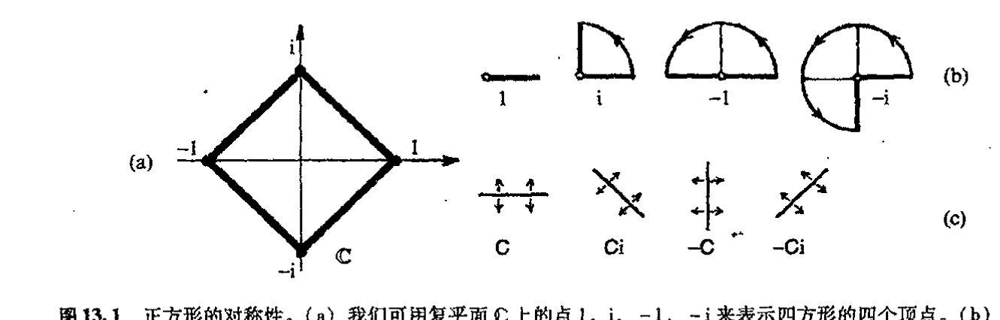
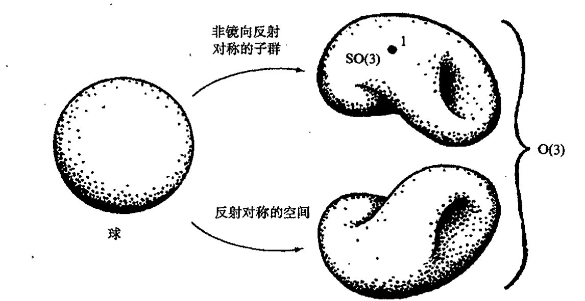
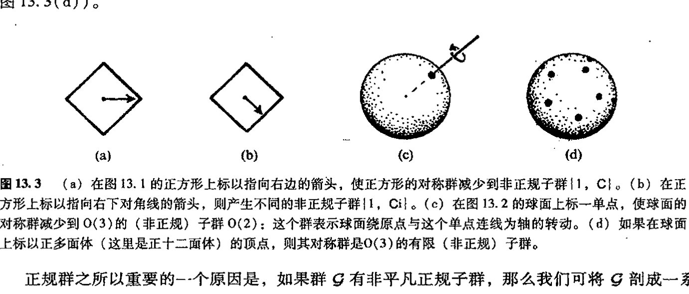
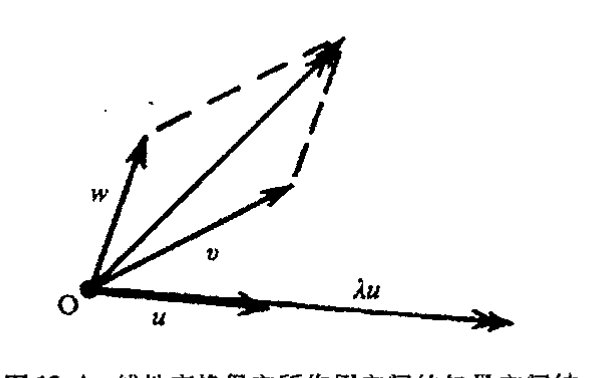
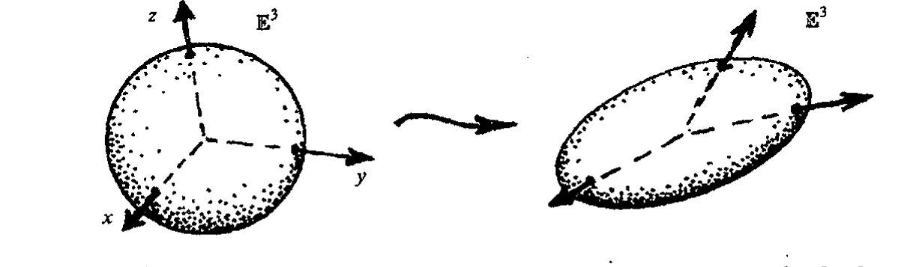
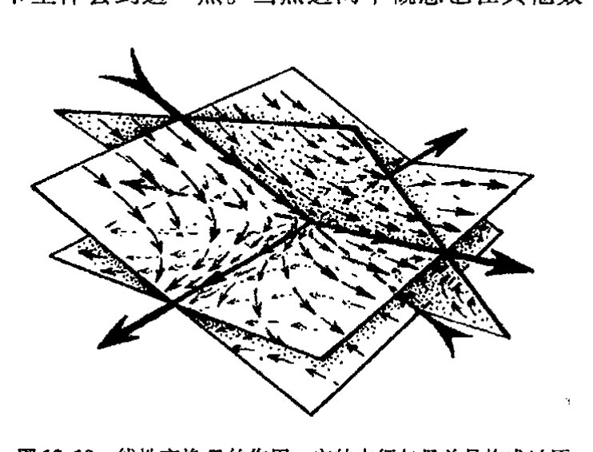
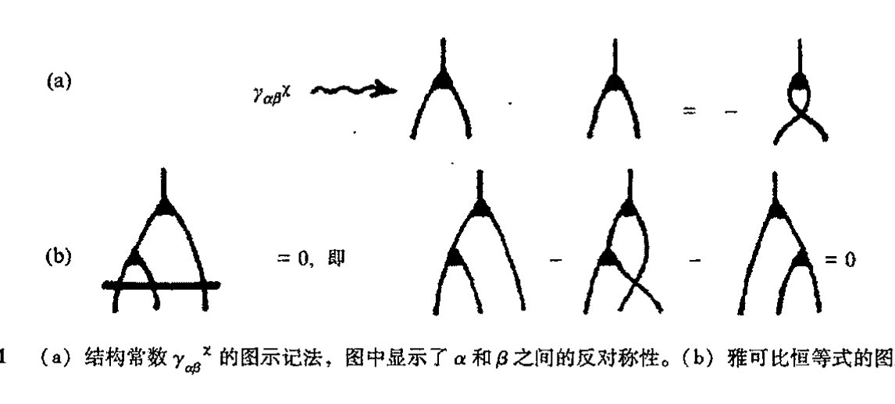
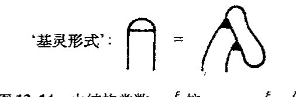
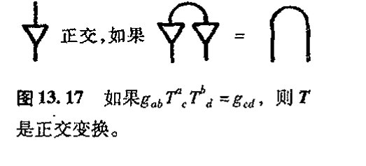

<!-- page 196 -->

# 第十三章 对称群

## 13.1 变换群

具有对称性的空间概念在现代物理里极为重要。为什么这么说呢？我们可能会认为，完全精确的对称不过是某种例外，或说是某种出于方便的近似。虽然像正方形或球面这样的对称性作为理想化的（“柏拉图的”；见[§1.3](chapter_01.md#13-柏拉图的数学世界真实吗)）数学结构的确是一种客观存在，但我们通常是将其物理原型视为这种柏拉图理想物的粗略表示。因此，世界上并不存在严格意义上的实际对称体。但从高度成功的20 世纪物理理论这一明显事实可知，所有物理相互作用（包括引力）都与这样一种概念相一致，严格说来这一概念是建立在具有对称性的物理结构基础上的，即使从基本描述上来说，这种对称性也完全称得上是严格的！ 247

这个概念指的是什么？这是一种人们称之为“规范联络”的概念。单就这个名称本身来说，我们获知不多，但这却是个十分重要的概念，它将引领我们找出应用于流形一般对象上的那种精妙的（“容易犯糊涂的”）微分概念（这些对象比诸如 $p$ 形式等概念更为一般，它们从属于外微分范畴，见第12章里的描述）。我们将用本章后的两章来讨论这些流形上的一般对象。作为预先准备，本章里我们先探讨对称群这一基本概念。这个概念在物理，化学和晶体学等领域有着重要应用，对于数学本身的许多领域里也极为重要。

我们先举个简单例子。譬如说正方形的对称是指什么？我们可以有两种不同的答案，这要依据我们是否允许正方形的取向发生翻转（即正方形翻个个儿）而定。我们先来考虑不允许取向发生翻转的情形。这时正方形的对称性是指正方形在其所在平面内转过若干个 $90^\circ$ 的结果。为方便起见，我们可像在第5章里那样，用复数来表示这些转动。将四方形的四个顶点取为复平面上的点 $1$，$i$，$-1$，$-i$（图13.1（a）），这样，基本转动可由乘以 $i$（即“$i\times$”）来表示。$i$ 的不同幂代表了所有的转动，它们可划分为如下四种（图13.1（b））： 248

$$i^0 = 1,\ i^1 = i,\ i^2 = -1,\ i^3 = -i$$

· 177 ·

<!-- page 197 -->

通向实在之路
---

第四种幂 $i^4=1$ 回到初态，因此不会有更多的元素了。这四种元素的两两乘积也是这四个元素之一。

这四个元素为我们提供了群的简单例子。群由一组元素和定义在这组元素的数偶（表记为符号并置）上的乘法律构成。这些元素满足乘法结合律：

$$a(bc)=(ab)c;$$

群中存在单位元 $1$，使得

$$1a=a1=a;$$

对群中每一个 $a$，均存在其逆 $a^{-1}$，使得 [13.1]

$$a^{-1}a=aa^{-1}=1。$$

使一物体（不必是正方形）回到自身原状态的对称运算总是满足这些代数律，我们称这些代数律为群公理。

图 13.1 正方形的对称性。(a) 我们可用复平面 $ℂ$ 上的点 $1$、$i$、$-1$、$-i$ 来表示四方形的四个顶点。(b) $ℂ$ 里的非镜向反射转动群可分别表示为乘积 $1=i^0$、$i=i^1$、$-1=i^2$、$-i=i^3$。(c) $ℂ$ 里的镜向反射转动群由 $C$（复共轭）、$Ci$、$-C$、$-Ci$ 给出。

249

回忆一下我们在第 11 章里推荐的约定，即在积 $ab$ 中，我们认为是先行 $b$ 运算，再行 $a$ 运算。我们可将 $ab$ 视为作用到其右边对象的算符，这样，对物体 $Φ$ 施加的对称作用，姑且设为 $b$，可写作 $Φ↦b(Φ)$，跟着的 $a$ 作用写成 $b(Φ)↦a(b(Φ))$。二者合成后即为 $Φ↦a(b(Φ))$，或简写为 $Φ↦ab(Φ)$。单位元的作用相当于使物体保持原状态不变（显然这总是一种对称作用），元素的逆相当于对给定对称性的逆作用，使物体回复到原状态。

在上述正方形的非镜向反射转动这个具体事例里，$ab$ 还满足交换律

$$ab=ba。$$

具有这种交换律的群称为阿贝尔群，用以纪念不幸短命的挪威数学家尼尔斯·亨里克·阿贝尔（Niels Henrik Abel, 1802~1929）¹。显然，满足复数乘法的群一定是阿贝尔群（因为单个

---

***[13.1] 证明：若对于所有 $a$，我们仅假定 $1a=a$ 和 $a^{-1}a=1$，加上结合律 $a(bc)=(ab)c$，那么就可推出：$a1=a$ 和 $aa^{-1}=1$。（提示：$a$ 不是唯一的具有逆的元素）。另一方面，试证明：为什么说 $a1=a$、$a^{-1}a=1$ 和 $a(bc)=(ab)c$ 不是充分的。

??? question "答案 [13.1]"
    由左逆与左单位可得：令 $b=a^{-1}$，则 $ba=1$。因 $b$ 也有左逆 $c$，有 $cb=1$。于是 $aa^{-1}=ab=1(ab)=(cb)(ab)=c(ba)b=c1b=cb=1$；再有 $a1=a(a^{-1}a)=(aa^{-1})a=1a=a$。但若只要求 $a1=a$、$a^{-1}a=1$ 与结合律，可能只是“右单位+左逆”的半群，因此不足以推出群公理。

·178·

<!-- page 198 -->

## 第十三章 对称群

复数的乘法总是可交换的)。我们已在第五章结尾见过这种群的另一个例子，即由单位 1 的第 $n$ 个根生成的有限循环群 $\mathbb{Z}_n$。*[13.2]

现在我们来考虑允许正方形取向作镜像反射的情形。我们仍用复数来表示这个正方形，只是要增加一种新运算，暂且记为 $\mathbf{C}$，即复共轭运算。(它使正方形关于水平线翻转，见 [§10.1](chapter_10.md#101-复维和实维-179) 里的[图 10.1](assets/page147_fig01.jpg)。) 我们发现 ([图 13.1](assets/page197_fig01.jpg)(c))，存在如下“乘法律”：*[13.3]

$$\mathbf{C}i = (-i)\mathbf{C},\ \mathbf{C}(-1) = (-1)\mathbf{C},\ \mathbf{C}(-i) = i\mathbf{C},\ \mathbf{C}\mathbf{C} = 1$$

(这里²包括今后，我将把 $(-i)\mathbf{C}$ 写成 $-i\mathbf{C}$，余类推)。事实上，我们仅从这些基本关系即可得到整个群的乘法律：**[13.4]

$$i^4 = 1,\ \mathbf{C}^2 = 1,\ \mathbf{C}i = i^3\mathbf{C},$$

由上面最后一个式子可知，这个群是非阿贝尔群。群内相异元素的总和称为群的序。具体到这个例子，群的序为 8。

现在我们考虑另一种简单情形，即普通球面的旋转对称群。类似前述，我们先考虑非镜面反射的情形。这时对称群有无限多个元素，因为我们可在三维空间里绕任意轴转过任意角来得到对称性，250
这个对称群实际上构成某种三维空间，即第 12 章里记为 $R$ 的三维流形。这里我们为这个群(三维流形)起一个正式的名称，叫 $\mathrm{SO}(3)$ 群，它是三维空间里非镜面反射的正交群。如果我们现在将反射包括进来，那么将得到一组全新的对称——称得上是另一种三维流形——它与前述的非

**图 13.2** 球的转动对称性。整个对称群 $\mathrm{O}(3)$，是不连通的三维流形，它由两部分组成。包含恒等元素 1 的那个分支叫球的非镜向反射对称的(正规)子群 $\mathrm{SO}(3)$。余下的分支叫反射对称的三维流形。

---

*[13.2] 解释为什么矢量空间是阿贝尔群——称为加法性阿贝尔群——其中群的“乘法”运算是矢量空间的“加法”运算。

??? question "答案 [13.2]"
    把群运算取为矢量加法。结合律、交换律来自矢量加法；单位元是零矢量 $0$；矢量 $v$ 的逆元是 $-v$，因为 $v+(-v)=0$。所以矢量空间在加法下是阿贝尔群。

*[13.3] 验证这些关系 (记住 $\mathbf{C}i$ 代表“先行运算 $i\times$，再行运算 $\mathbf{C}$”，等等)。(提示：你可以仅对 $1$ 和 $i$ 进行运算来检验这些关系，为什么？)

??? question "答案 [13.3]"
    复共轭满足 $\mathbf{C}(iz)=\overline{iz}=-i\bar z=(-i)\mathbf{C}(z)$，故 $\mathbf{C}i=(-i)\mathbf{C}$；同理 $\mathbf{C}(-z)=-\bar z=(-1)\mathbf{C}(z)$，$\mathbf{C}((-i)z)=i\bar z=i\mathbf{C}(z)$，且 $\mathbf{C}^2(z)=z$。只需在 $1,i$ 上检验，是因为这些运算都是实线性的，而 $1,i$ 构成复平面的实基。

**[13.4] 试证这些关系式。

??? question "答案 [13.4]"
    旋转四次回到原状，故 $i^4=1$；复共轭两次为恒等，故 $\mathbf{C}^2=1$；由 $\mathbf{C}i=(-i)\mathbf{C}$ 且 $-i=i^3$ 得 $\mathbf{C}i=i^3\mathbf{C}$。这些关系生成八个元素 $i^k$ 与 $i^k\mathbf{C}$，并决定全部乘法。

·179·

<!-- page 199 -->

通向实在之路

镜面反射的 SO(3) 群不连通，或者说这是一种涉及球面取向翻转的对称。这个群的所有元素同样构成三维流形，但这是一种非连通的三维流形，它由两个分离的连通分支组成（[图 13.2](assets/page198_fig01.jpg)）。整个群空间称为 O(3)。

这两个例子展示了两类最重要的群：有限群和连续群（或称为李群，见 [§13.6](#136-表示理论与李代数)）。虽然二者之间存在很大差别，但也有许多重要的共同性质。

## 13.2 子群和单群

群的子群概念有着特殊意义。为了说明子群，我们从某个群中选出一些元素组成新的群，它像整个群一样满足同样的乘法律和逆运算。对许多现代粒子物理理论来说，子群尤显重要。人们总是倾向于认为，自然界存在某种基本对称性，这种基本对称性将不同粒子彼此连结起来，并使得不同粒子间的相互作用彼此关联。但我们至今没有找到这样一种明白表示对称的完全群，反过来，我们倒是看到这种基本对称性发生"破缺"导致产生原始群的某个子群，这种子群表现出明显的对称性。因此，弄清楚这种假想的"基本"对称群实际会有什么样的子群这一点非常重要。为了阐明那些在自然界明显存在的对称性是否源自这种假想群的子群等问题，我还将在 [§25.5](chapter_25.md#255-电弱对称群)-8，[§26.11](chapter_26.md#2611-费恩曼图和真空选择) 和 §28.1 节里不断回到这个主题上来。

我们来研究子群的一些特例。这些例子均取自我们已考察过的那些情形。正方形的非镜面反射对称构成该正方形整个八元素对称群的四元素子群 {1, i, -1, -i}。同样，非镜面反射转动群 SO(3) 构成了完全群 O(3) 的子群。正方形的另一个对称子群由四元素 {1, -1, C, -C} 组成，第三个子群则只有两元素 {1, -1}。*[13.5] 除此之外，还存在由单位元本身构成的平凡子群 {1}（整个群本身也是一种平凡子群）。

上面列举的这些不同的子群有一种特别重要的性质，即它们都是所谓正规子群。恰当点说，正规子群的意义在于它是总群任一元素的作用只留下来一种正规子群。更专业点说，总群的每一个元素都可与正规子群进行交换。说得更明白点，假若有总群 $\mathcal{G}$ 和子群 $\mathcal{S}$，如果从群 $\mathcal{G}$ 里挑出某个元素 $g$，于是我就可以用 $\mathcal{S}g$ 来代表由所有 $\mathcal{S}$ 元素里的每一个在右边乘上 $g$（右乘以 $g$）所组成的集合。这样，具体到正方形对称群的子群 $\mathcal{S}=\{1, -1, C, -C\}$，如果我们取 $g=i$，便得到 $\mathcal{S}i=\{i, -i, Ci, -Ci\}$。类似地，记号 $g\mathcal{S}$ 代表的是由所有 $\mathcal{S}$ 元素里的每一个在左边乘上 $g$（左乘以 $g$）组成的集合。对于所举的例子，就是 $i\mathcal{S}=\{i, -i, iC, -iC\}$。$\mathcal{S}$ 要成为 $\mathcal{G}$ 的正规子群的条件，就是要求这两个集合相同，即对 $\mathcal{S}$ 中的所有 $g$，有

$$\mathcal{S}g = g\mathcal{S}。$$

通过这个例子我们看到，情形的确如此（因为 $Ci=-iC$，$-Ci=iC$）。但我们也应记住，两花括

---

*[13.5] 验证：本段里的所有这些元素集合都是子群（记住 [13.4] 里的提示）。

??? question "答案 [13.5]"
    每个列出的集合都含单位元、对乘法封闭且每个元素的逆仍在集合内。例如 $\{1,i,-1,-i\}$ 是四阶循环群；$\{1,-1,\mathbf{C},-\mathbf{C}\}$ 中 $\mathbf{C}^2=1$、$(-\mathbf{C})^2=1$、$\mathbf{C}(-\mathbf{C})=-1$，封闭；$\{1,-1\}$ 是二阶循环群；$\{1\}$ 平凡。故它们都是子群。

·180·

<!-- page 200 -->

第十三章 对称群

号里元素累加形成的集应看作是无序集（因此将 $\mathcal{S}i$ 和 $i\mathcal{S}$ 的表达式都写出来后，在所有元素累加的集合中，出现 $-iC$ 和 $iC$ 的倒序无关紧要）。

我们也可以写出正方形对称群的非正规子群，如两元素子群 $\{1, C\}$。因为有 $\{1, C\}i = \{i, Ci\}$，而 $i\{1, C\} = \{i, -Ci\}$。注意，如果在正方形上标以指向右的水平箭头（如[图 13.3](assets/page200_fig01.jpg)（a）所示），我们就会意识到这种子群是一种新的（约化）对称群。如果将箭头指向斜下方（[图 13.3](assets/page200_fig01.jpg)（b）），那么就可以得到另一个非正规子群 $\{1, Ci\}$。***[13.6] 在 $O(3)$ 里，只有唯一一个非平凡正规子群，***[13.7] 就是 $SO(3)$，但却有许多个非正规子群。如果我们在球面上选定某个有有限个点的点集，然后来求球面关于这些点的对称性，即可得到这种非正规子群。但如果只标一个点，则子群由球面绕该点到原点连线的轴转动组成（[图 13.3](assets/page200_fig01.jpg)（c））。另一方面，如果我们标出的点譬如说是规则多边形的各个顶点，那么这个子群是个有限群，它由该规则多边形的对称群组成（[图 13.3](assets/page200_fig01.jpg)（d））。

图 13.3 （a）在图 13.1 的正方形上标以指向右边的箭头，使正方形的对称群减少到非正规子群 $\{1, C\}$。（b）在正方形上标以指向右下对角线的箭头，则产生不同的非正规子群 $\{1, Ci\}$。（c）在图 13.2 的球面上标一单点，使球面的对称群减少到 $O(3)$ 的（非正规）子群 $O(2)$：这个群表示球面绕原点与这个单点连线为轴的转动。（d）如果在球面上标以正多面体（这里是正十二面体）的顶点，则其对称群是 $O(3)$ 的有限（非正规）子群。

正规群之所以重要的一个原因是，如果群 $\mathcal{G}$ 有非平凡正规子群，那么我们可将 $\mathcal{G}$ 剖成一系列较小的群。假定 $\mathcal{S}$ 是 $\mathcal{G}$ 的正规子群，那么由各个不同的 $\mathcal{S}g$ 组成的集合（这里 $g$ 取遍 $\mathcal{G}$ 中所有元素）本身构成一个群。注意，对某个给定集合 $\mathcal{S}g$，$g$ 的选取通常不唯一，我们可以有 $\mathcal{S}g_1 = \mathcal{S}g_2$，这里 $g_1, g_2$ 为 $\mathcal{G}$ 中不同元素。对任一子群 $\mathcal{S}$，形 $\mathcal{S}g$ 的集合称为 $\mathcal{G}$ 的陪集。若 $\mathcal{G}$ 是正规群，则陪集构成一个群。原因是，如果我们有两个这样的陪集 $\mathcal{S}g$ 和 $\mathcal{S}h$（$g$ 和 $h$ 均为 $\mathcal{G}$ 的元素），则可将二者的"积"定义为

$$(\mathcal{S}g)(\mathcal{S}h) = \mathcal{S}(gh),$$

易知，只要 $\mathcal{S}$ 是正规群，那么所有群公理皆满足，因为上式右边有定义，并不依赖于方程左边各陪集表达式里 $g$ 和 $h$ 的选择。***[13.8] 按这个方式定义的合成群称为 $\mathcal{G}$ 对其正规子群 $\mathcal{S}$ 的商群，记为 $\frac{\mathcal{G}}{\mathcal{S}}$。对于由相异陪集 $\mathcal{S}g$ 组成的商空间（不是群），我们往往也写成 $\frac{\mathcal{G}}{\mathcal{S}}$，即使 $\mathcal{S}$ 不是正规

*** [13.6] 检验这些判断，找出两个或更多个非正规子群，并证明不会再有更多个了。

??? question "答案 [13.6]"
    正方形二面体群 $D_4$ 的子群除平凡与全群外，还有四个反射二阶子群 $\{1,\mathbf{C}\}$、$\{1,-\mathbf{C}\}$、$\{1,i\mathbf{C}\}$、$\{1,-i\mathbf{C}\}$，它们一般非正规；另有 $\{1,-1\}$ 与旋转四阶子群等正规子群。用拉格朗日定理，子群阶只能为 $1,2,4,8$；逐一检查二阶元素和四阶闭合集合即可穷尽。
*** [13.7] 证明这一点。（提示：那些组转动会是转动不变量？）

??? question "答案 [13.7]"
    在严格的抽象群意义下，$O(3)$ 还含有中心正规子群 $\{I,-I\}$；但在正文关注的连续几何变换和李群不变量意义下，唯一非平凡真正规李子群是 $SO(3)$。

    理由是：旋转的共轭仍是同角度、但绕变换后轴的旋转；若一个正规李子群含任一非平凡连续旋转，则因轴可由共轭任意改变并由旋转角组合生成全部 $SO(3)$，故含 $SO(3)$。若它还含任一反射或反向正交变换，则乘以 $SO(3)$ 给出整个 $O(3)$。

*** [13.8] 验证这一点，并证明：如果 $\mathcal{S}$ 不是正规群，这些公理失效。

??? question "答案 [13.8]"
    若 $\mathcal{S}$ 正规，陪集乘法 $(\mathcal{S}g)(\mathcal{S}h)=\mathcal{S}gh$ 与代表元选择无关：若 $g'=sg$、$h'=th$，则 $g' h'=sgth=s(g t g^{-1})gh$，而 $g t g^{-1}\in\mathcal{S}$。单位是 $\mathcal{S}$，逆是 $\mathcal{S}g^{-1}$，结合律继承自 $\mathcal{G}$。若 $\mathcal{S}$ 非正规，代表元改变可使乘积落入不同陪集，故乘法不良定义。

<!-- page 201 -->

通向实在之路

子群。**[13.9]

没有非平凡正规子群的群称为单群。群 SO(3) 就是单群的一个例子。显然，单群是构建群理论的基本材料。19 世纪和 20 世纪里数学发展上的巨大成就之一就是找到了所有有限单群和所有连续单群。对于连续单群（即李群）这个纯数学领域的研究，始于对数学产生过巨大影响的德国数学家威廉·基灵（Wilhelm Killing，1847~1923）的工作。按伟大的几何学家和代数学家艾利耶·嘉当（我们曾在第12章里遇到过他，以后在第17章还会再次与他相会）的说法，基灵在1888~1890年间发表的这方面的基础性论文，以及他在 1894 年完成的将群理论基本建立起来的论文，是迄今为止最重要的数学论文之一。^5 即使到今天，分类研究仍然是数学和物理各学科领域内一项重要的基础性工作。基灵的工作证明，存在 4 族连续单群，即 A_m，B_m，C_m 和 D_m（m=1, 2, …），其相应的维数分别为 m(m+2), m(2m+1), m(2m+1) 和 m(2m-1)，我们称之为典型群（见 [§13.10](#1310-辛群) 节末）；另有 5 种例外群 E_6，E_7，E_8，F_4 和 G_2，其维数分别是 78，133，248，52 和 14。

有限单群的分类更为困难，完成的时间也离我们更近些，这是 20 世纪里一大群数学家历经多年（尤其是最近借助计算机）才在 1982 年最终得以完成的一项成果。^6 有限单群同样存在一些系统的有限单群族和有限个例外有限单群。其中最大的例外群是大魔群，其序为

= 808017424794512875886459904961710757005754368000000000

= 2^46 × 3^20 × 5^9 × 7^6 × 11^2 × 13^3 × 17 × 19 × 23 × 29 × 31 × 41 × 47 × 59 × 71

在当代理论物理的许多领域，例外群特别受青睐。在弦论中，E_8 群起着特别重要的作用（[§31.14](chapter_31.md#3114-神奇的卡拉比丘空间m-理论)），另外一些学者则对巨大但有限的大魔群在未来理论表述中所起作用寄予厚望。^7

单群的分类是一般群分类研究中的重要一步。如上所述，一般群总可以用单群（加上阿贝尔群）构建出来。当然，这还不是事情的全部，因为要从单群构造出另一个群我们还需要进一步的信息。这里我不想深入到其中的细节，只打算用最简明的例子说明一下其构造过程：设 𝒢 和 ℋ 是两个群，二者可合成为所谓积群 𝒢 × ℋ，其元素为数偶 (g, h)，这里 g 属于 𝒢，h 属于 ℋ，𝒢 × ℋ 的两元素 (g_1, h_1) 和 (g_2, h_2) 之间的乘法规则定义为

(g_1, h_1)(g_2, h_2) = (g_1 g_2, h_1 h_2)，

易证这里群公理皆满足。粒子物理里的许多群实际上都是单群的积群（或这类积群的简单调整型）。*[13.10]

---

** [13.9] 试解释：对于 𝒢 的任意一个有限子群 𝒮，𝒢/𝒮 元素的数目为什么是 𝒢 的阶除以 𝒮 的阶。

??? question "答案 [13.9]"
    任一陪集 $\mathcal{S}g$ 与 $\mathcal{S}$ 等势，因为映射 $s\mapsto sg$ 是一一对应。不同右陪集两两不交，且所有陪集并为 $\mathcal{G}$。所以有限情形下，陪集数为 $|\mathcal{G}|/|\mathcal{S}|$。

* [13.10] 验证：对任意两个群 𝒢 和 ℋ，𝒢 × ℋ 是一个群，并且我们可以用 ℋ 来叠合商群 (𝒢 × ℋ)/𝒢。

??? question "答案 [13.10]"
    $\mathcal{G}\times\mathcal{H}$ 的单位元是 $(1_\mathcal{G},1_\mathcal{H})$，逆元是 $(g^{-1},h^{-1})$，结合律逐分量来自 $\mathcal{G}$ 和 $\mathcal{H}$。把 $\mathcal{G}$ 视为正规子群 $\mathcal{G}\times\{1\}$，则陪集由第二分量 $h$ 标记，故 $(\mathcal{G}\times\mathcal{H})/\mathcal{G}\cong\mathcal{H}$。

· 182 ·

<!-- page 202 -->

第十三章 对称群

## 13.3 线性变换和矩阵

我们在群的一般性研究里总会遇到一类特殊的对称群。这就是矢量空间里的对称群。矢量空间的各种对称性可通过保持矢量空间结构不变的线性变换来表现。

在 [§11.1](chapter_11.md#111-四元数代数) 节和 [§12.3](chapter_12.md#123-标量矢量和余矢量) 节里，我们已分别定义了矢量空间 **V** 里的矢量加法和矢量的数乘，并说明了矢量加法的几何图像可用平行四边形法则来确定，而数乘则表现为矢量在尺度上放大（或缩小）若干倍（[图 13.4](assets/page202_fig01.jpg)）。这些运算我们通常指的都是实数域下情形，但实际上，在复矢量空间上这些关系也依然成立（由于复数的奇妙性，在许多场合下甚至更重要），尽管我们很难用图来描述。**V** 的线性变换是一种 **V** 到自身的变换，它保持 **V** 的结构不变。更一般地，我们也可将线性变换视为一个矢量空间到另一个矢量空间的变换。

**图 13.4** 线性变换保它所作用空间的矢量空间结构不变。这个结构由加和运算（按平行四边形法则）和数乘一个标量 λ（它可以是实数，在复空间情形下可以是复数）运算确定。只要原点 O 固定，这种变换保直线的"直线性"和"平行性"不变。

线性变换可清楚地表示为数的阵列，我们称之为矩阵。矩阵概念在许多数学分支里都很重要，这一节（以及 §§ 13.4, 5）里我们将利用精致的代数规则来考察一些极为有用的矩阵。实际上，§§ 13.3–7 节都可看作是一种学习矩阵理论及其在连续群里应用的快速教程。这里描述的概念对于正确理解量子理论极为重要，那些已熟悉这些内容的读者，或对即将展开的量子理论的细节无甚兴趣的读者，可以跳过这几节。

要弄明白什么是线性变换，我们不妨先来考虑三维矢量空间的情形，观察它与 [§13.1](#131-变换群) 节里讨论过的关于球面对称的转动群 O(3)（或 SO(3)）之间的关系。我们可将球面视为是嵌入在三维欧几里得空间 **E**³ 里（此空间可看作矢量空间，其原点 O 即球面的球心⁸），它在普通笛卡儿坐标系 $(x, y, z)$ 下的轨迹为 *⁽¹³·¹¹⁾

$$x^2 + y^2 + z^2 = 1$$

球面的转动现在表为关于 **E**³ 的线性变换，但这是一种称为正交变换的特殊变换，对此我们还将在 13.8 里再作讨论。

一般的线性变换通常会将球面压成或拉成椭球面，如[图 13.5](assets/page203_fig01.jpg) 所示。几何上看，线性变换是一种保持直线和"平行"线的"直线性"不变，当然还要保证原点不动的变换，但它并不保证直角或其他角不变，因此，在均匀但各向异性的变换中，几何形状会受到挤压或拉抻。

---

*⁽¹³·¹¹⁾ 对于距 o 单位距离上的点，说明如何从 [§2.1](chapter_02.md#21-毕达哥拉斯定理) 的毕达哥拉斯定理导出这个方程。

· 183 ·

<!-- page 203 -->

通向实在之路

---

**图 13.5** 作用在 **E**³ 上的线性变换（笛卡儿坐标系 *x*, *y*, *z* 下的表达式）通常会将单位球面 *x*² + *y*² + *z*² = 1 压成或拉成椭球面。正交群 O(3) 由保单位球面不变的 **E**³ 的线性变换构成。

我们如何用坐标 *x*, *y*, *z* 来表示线性变换呢？答案是每个新坐标都可表为老坐标的（均匀的）线性组合，即分别表为 *αx* + *βy* + *γz* 形式，这里 *α*, *β*, *γ* 是常数。\*\*\*〔13.12〕我们有 3 个这样的表达式，每个表达式代表一个新坐标。为了以集约形式写下所有这 3 个式子，我们不妨再启用第 12 章里的指标记法。为此将坐标改写成 (*x*¹, *x*², *x*³)，这里

$$x^1 = x,\quad x^2 = y,\quad x^3 = z。$$

（再次提醒：这里上指标不表示幂指数，见 [§12.2](chapter_12.md#122-流形与坐标拼块)）。三维欧氏空间里的某一点的坐标写为 *x*ᵃ，其中 *a* = 1, 2, 3。指标记法的好处是这种讨论可应用到多维情形。我们来考虑 *a*（和我们使用的所有其他指标字母）从 1 取到 *n* 的情形，这里 *n* 是一固定的正整数。对于前述情形，*n* = 3。

利用爱因斯坦求和约定（[§12.7](chapter_12.md#127-体积元求和规则)），指标记法下一般线性变换形式为：⁹,\*〔13.13〕

$$x^a \mapsto T^a{}_b x^b。$$

我们称这种线性变换为 ***T***。显然 ***T*** 取决于一组分量 *T*ᵃ_b。这样一组分量指的是一个 *m* × *n* 的矩阵，通常是数的方阵（但在另一些情形下，可能是 *m* × *n* 长方形阵）。在三维情形下，上述方程写成

$$\begin{pmatrix} x^1 \\ x^2 \\ x^3 \end{pmatrix} \mapsto \begin{pmatrix} T^1{}_1 & T^1{}_2 & T^1{}_3 \\ T^2{}_1 & T^2{}_2 & T^2{}_3 \\ T^3{}_1 & T^3{}_2 & T^3{}_3 \end{pmatrix} \begin{pmatrix} x^1 \\ x^2 \\ x^3 \end{pmatrix},$$

它代表 3 种独立的关系，开始的那个为 *x*¹ ↦ *T*¹₁*x*¹ + *T*¹₂*x*² + *T*¹₃*x*³。\*\*〔13.14〕

我们也可以不用指标或显式坐标，而将上述方程直接写成 **x** ↦ ***T*** **x**。如果我们愿意，还可以采用抽象指标记法（[§12.8](chapter_12.md#128-张量抽象指标记法和图示记法)），但这时 "*x*ᵃ ↦ *T*ᵃ_b *x*ᵇ" 不是分量表达式，而是代表这种抽象变换 **x** ↦ ***T*** **x**。（对于指标代表的是抽象表达式还是分量表达式这二者区别变得十分重要的场合，应当

---

\*\*\*〔13.12〕你能解释为什么吗？为简单计，请在二维情形下验证这一关系。

??? question "答案 [13.12]"
    线性变换保持加法和数乘，因此新坐标函数必须是旧坐标的线性函数。在二维中，若基向量像分别为 $(a,c)$ 与 $(b,d)$，则点 $(x,y)=x e_1+y e_2$ 的像为 $x(a,c)+y(b,d)=(ax+by,cx+dy)$，正是两个线性组合。

\*〔13.13〕在三维情形下证明该式。

??? question "答案 [13.13]"
    三维情形下，令三个新坐标分别为 $x'^1=T^1{}_1x^1+T^1{}_2x^2+T^1{}_3x^3$，$x'^2=T^2{}_1x^1+T^2{}_2x^2+T^2{}_3x^3$，$x'^3=T^3{}_1x^1+T^3{}_2x^2+T^3{}_3x^3$。用爱因斯坦求和约定，这三式统一写为 $x^a\mapsto T^a{}_b x^b$。

\*\*〔13.14〕写出这个式子的所有项，解释这个式子是如何表示为 *x*ᵃ ↦ *T*ᵃ_b *x*ᵇ 的。

??? question "答案 [13.14]"
    展开为 $x^1\mapsto T^1{}_1x^1+T^1{}_2x^2+T^1{}_3x^3$，$x^2\mapsto T^2{}_1x^1+T^2{}_2x^2+T^2{}_3x^3$，$x^3\mapsto T^3{}_1x^1+T^3{}_2x^2+T^3{}_3x^3$。这正是 $a=1,2,3$ 时 $x^a\mapsto T^a{}_b x^b$ 对重复指标 $b$ 求和的结果。

· 184 ·

<!-- page 204 -->

第十三章 对称群

有文字提示。）还有一种图示记法也可用于表述上述方程，如[图 13.6](assets/page204_fig01.jpg)a 所示。在以后叙述中，我会交替使用数字矩阵 $(T^a_{\ b})$ 和抽象线性变换 $T$ 这两种表达式，如果二者在技术上的区别不甚重要的话（前者有赖于具体矢量空间 $\mathbf{V}$ 的具体坐标系，后者则否）。

图 13.6 （a）线性变换 $x^a \mapsto T^a_{\ b}x^b$，或写成无指标的 $x \mapsto Tx$（或像 [§12.8](chapter_12.md#128-张量抽象指标记法和图示记法) 里那样把指标看作是抽象的）的图示形式。（b）线性变换 $S$，$T$，$U$ 和它们的积 $ST$ 和 $STU$ 的图示记法。我们把连续积用符号的垂直连接来表示。（c）克罗内克 $\delta^a_b$，或单位线性变换 $I$，用一段"无主体"线段表示，这样，关系 $T^a_{\ b}\delta^b_c = T^a_{\ c} = \delta^a_b T^b_{\ c}$ 在这种记法下自动满足（也可参见图 12.17）。

现在我们考虑第二种线性变换 $S$，它往往跟在 $T$ 后面使用，二者的积 $\boldsymbol{R}$（$\boldsymbol{R} = \boldsymbol{ST}$）有分量（或抽象指标）表达式

$$R^a_{\ c} = S^a_{\ b} T^b_{\ c}$$

（分量的加和约定）。*^{[13.15]} 积 $ST$ 的图示记法见[图 13.6](assets/page204_fig01.jpg)（b）。注意，在图示记法下，线性变换的连续积用符号的垂直连接来表示。从记法上看，这恰好提供了一种使用上的方便，但如果我们还能够采用水平连线来连接符号那就十分完善了。（那样的话，代数和图示记法之间的联系就更紧密了。）

单位线性变换 $\boldsymbol{I}$ 的分量通常写成 $\delta^a_b$（克罗内克 $\delta$，一种标准约定，其指标不是像通常那样错开书写）：

$$\delta^a_b = \begin{cases} 1 & \text{若 } a = b, \\ 0 & \text{若 } a \neq b, \end{cases}$$

于是我们有 *^{[13.16]}

??? question "答案 [13.16]"
    因 $\delta^b_c$ 只在 $b=c$ 时为 $1$，故 $T^a{}_b\delta^b_c$ 的求和只留下 $b=c$ 项，即 $T^a{}_c$。同理 $\delta^a_bT^b{}_c$ 只留下 $b=a$ 项，也为 $T^a{}_c$。这就是矩阵乘以单位矩阵不变。

$$T^a_{\ b} \delta^b_c = T^a_{\ c} = \delta^a_b T^b_{\ c}$$

其代数关系为 $\boldsymbol{TI} = \boldsymbol{T} = \boldsymbol{IT}$。分量 $\delta^a_b$ 的方阵沿主对角线（从左上角到右下角）为 1。对于 $n = 3$ 情形，$\boldsymbol{I}$ 为

$$\begin{pmatrix} 1 & 0 & 0 \\ 0 & 1 & 0 \\ 0 & 0 & 1 \end{pmatrix}$$

---

*^{[13.15]} $R$，$S$ 和 $T$ 之间的关系是什么？把它写成分量的 $3 \times 3$ 方阵元素的展开形式。如果你熟悉"矩阵乘法"的正规律，你会看清楚这一点。

*^{[13.16]} 验证该式。

· 185 ·

<!-- page 205 -->

通向实在之路

在图示记法下，我们可简单地用一段实线来代表克罗内克 δ，上述代数式的符号表示见[图 13.6](assets/page204_fig01.jpg)c。

将整个矢量空间向下映射到其中某个较低维区域（子空间）的线性变换称为奇异的（或称退化的，降秩的）。^10^**T** 为奇异的等价条件是存在非零矢量 **v** 使得 ^[13.17]^

??? question "答案 [13.17]"
    若 $T$ 把整个空间压到低维子空间，则核非零，故存在 $v\neq0$ 使 $Tv=0$；反之若有非零核，则不同矢量可有同一像，像空间维数小于 $n$，所以奇异。若某列全零，取对应基向量即得 $Tv=0$；若两列相同，取相应两个基向量之差；若两行相同，则行向量线性相关，行列式为零，因而矩阵奇异。

$$\boldsymbol{T}\boldsymbol{v} = 0.$$

如果变换是非奇异的，那么它有逆矩阵，^[13.18]^ **T** 的逆写成 **T**^-1^，故对于逆矩阵，有

??? question "答案 [13.18]"
    非奇异线性变换是一一对应且到上的线性自映射，因此存在唯一反变换，把每个像矢量送回原矢量；该反变换仍线性，就是逆矩阵 $T^{-1}$。所以无需显式构造即可知 $TT^{-1}=I=T^{-1}T$。

$$\boldsymbol{T}\boldsymbol{T}^{-1} = \boldsymbol{I} = \boldsymbol{T}^{-1}\boldsymbol{T},$$

我们可用图示记法来清晰方便地表示这个逆矩阵，如图 13.7。这里我引入了一种非常有用的符号来表示反对称的列维－齐维塔量 $\varepsilon_{a\cdots c}$ 和 $\epsilon^{a\cdots c}$（按 $\varepsilon_{a\cdots c}\in^{a\cdots c} = n!$ 归一化），这种反对称量最先是在 [§12.7](chapter_12.md#127-体积元求和规则) 节和[图 12.18](assets/page193_fig01.jpg) 中引入的。^[13.19]^

??? question "答案 [13.19]"
    图 12.18 的反对称收缩恒等式说明，用两个列维-齐维塔量夹住 $n-1$ 个 $T$ 并除以 $\det T$ 得到的余因子矩阵，正好满足与 $T$ 收缩后变成克罗内克 $\delta$。这就是伴随矩阵公式 $T^{-1}=(\operatorname{adj}T)/\det T$ 的图示版本，因此给出 $TT^{-1}=I=T^{-1}T$。

矩阵代数（最先由多产的英国数学家和律师亚瑟·凯莱（Arthur Carley，1821～1895）于 1858 年提出）^11^可以在非常广阔的领域找到其应用，（例如统计学，工程学，晶体学，心理学，计算机等领域，更不用说量子力学了）。这种代数包括了 [§11.3](chapter_11.md#113-四元数几何)，5，6 节里的四元代数，克利福德代数和格拉斯曼代数。我用粗黑正体大写字母（**A**，**B**，**C**，…）来表示组成矩阵的分量阵列（对于抽象的线性变换则用粗黑斜体字母来表示）。以后我们主要讨论的是 n 固定的 n × n 阵，我们可定义这种矩阵的加法和乘法概念，以下标准代数运算均成立：

$$\mathbf{A}+\mathbf{B}=\mathbf{B}+\mathbf{A}\quad\mathbf{A}+(\mathbf{B}+\mathbf{C})=(\mathbf{A}+\mathbf{B})+\mathbf{C}\quad\mathbf{A}(\mathbf{B}\mathbf{C})=(\mathbf{A}\mathbf{B})\mathbf{C},$$

$$\mathbf{A}(\mathbf{B}+\mathbf{C})=\mathbf{A}\mathbf{B}+\mathbf{A}\mathbf{C}\quad(\mathbf{A}+\mathbf{B})\mathbf{C}=\mathbf{A}\mathbf{C}+\mathbf{B}\mathbf{C}$$

（**A**+**B** 的每个元素即为相应的 **A** 的元素与 **B** 的元素之和）。但是通常乘法交换律不满足，即 **AB** ≠ **BA**。而且，如上所见，不为零的 n × n 阵未必总有逆矩阵。

还需要指出，这种代数可扩展到 m × n 阵情形，这里 m 不必等于 n。但是，m × n 阵和 p × q 阵之间的加法运算则只有在 p = m，n = q 条件下才成立；二者间的乘法要求 n = p，其结果是 m × q 阵。这种扩展型代数包括了形如 **Tx** 这样的积，这里列矢量 **x** 可看作是 n × 1 矩阵。^[13.20]^

??? question "答案 [13.20]"
    一个 $m\times n$ 矩阵表示从 $n$ 维列向量到 $m$ 维列向量的线性映射。加法只在形状相同即同为 $m\times n$ 时逐项定义；乘法 $A_{m\times n}B_{p\times q}$ 只在 $n=p$ 时定义，结果为 $m\times q$，元素为 $(AB)^i{}_j=A^i{}_kB^k{}_j$。列向量是 $n\times1$ 矩阵，所以 $Tx$ 是 $m\times1$ 列向量。

一般线性群 GL(n) 是一种 n 维矢量空间的对称群，它显然满足作为一种 n × n 非奇异矩阵的乘法群。如果矢量空间是实空间，即出现在矩阵里的相应数字均为实数，那么我们把这种完全线

---

^[13.17]^ 为什么？证明：如果分量的阵列里有一列全部是零，或有全同的两列，则必有此结果。为什么如果有两行全同也会有此结果？

^[13.18]^ 不用显式证明为什么？

^[13.19]^ 用[图 12.18](assets/page193_fig01.jpg) 给出的图示关系直接证明，这个定义给出 $\boldsymbol{T}\boldsymbol{T}^{-1}=\boldsymbol{I}=\boldsymbol{T}^{-1}\boldsymbol{T}$

^[13.20]^ 解释这一点，给出长方形矩阵的完整的代数规则。

· 186 ·

<!-- page 206 -->

性群称为 $\mathrm{GL}(n,\mathbb{R})$。我们也可以考虑复数域下情形，得到复完全线性群 $\mathrm{GL}(n,\mathbb{C})$。这些群都有正规子群，分别写作 $\mathrm{SL}(n,\mathbb{R})$ 和 $\mathrm{SL}(n,\mathbb{C})$，或简写为 $SL(n)$，称为特殊线性群，当然这么做的前提是要求底场（[§16.1](chapter_16.md#161-有限域)）$\mathbb{R}$ 和 $\mathbb{C}$ 已知。这些群可通过要求矩阵的行列式等于 1 来获得，行列式的概念我们在下节解释。

## 13.4　行列式和迹

什么叫 $n\times n$ 矩阵的行列式呢？这是由矩阵元素计算出的一个数。当且仅当矩阵是奇异阵时这个数为 0。图示记法可清楚地描述行列式，如[图 13.8](assets/page207_fig01.jpg)(a)。而它的指标记法则为

$$\frac{1}{n!}\epsilon^{ab\cdots d}T^e_{\phantom{e}b}T^f_{\phantom{f}b}\cdots T^f_{\phantom{f}d}\varepsilon_{ef\cdots h}$$

这里 $\epsilon^{a\cdots d}$ 和 $\varepsilon_{e\cdots h}$ 是反对称列维－齐维塔张量，对 $n$ 维空间情形，二者按

$$\epsilon^{a\cdots d}\varepsilon_{a\cdots d}=n!$$

归一化（还应记得 $n!=1\times2\times3\times\cdots\times n$），其中 $a,\cdots,d$ 和 $e,\cdots,h$ 数值上都是 $n$。

我们还可以将行列式写成 $\det\left(T^a_{\phantom{a}b}\right)$ 或 $\det\boldsymbol{T}$（有时也写成 $|\boldsymbol{T}|$，或组成矩阵的阵列，只是用两道竖线代替了圆括号）。具体到 $2\times2$ 和 $3\times3$ 矩阵情形，其行列式写为**[13.21]**

$$\det\begin{pmatrix} a & b \\ c & d \end{pmatrix}=ad-bc,$$

$$\det\begin{pmatrix} a & b & c \\ d & e & f \\ g & h & j \end{pmatrix}=aej-afh+bfg-bdj+cdh-ceg.$$

行列式满足一种重要而且十分明显的关系

$$\det\mathbf{AB}=\det\mathbf{A}\det\mathbf{B},$$

在图示记法（[图 13.8](assets/page207_fig01.jpg)(b)）里这种关系看得更清楚。这里的关键是有[图 12.18](assets/page193_fig01.jpg)***[13.22] 的公式化体系作保证。当用指标记法来写时，上式形同

$$\epsilon^{a\cdots c}\varepsilon_{f\cdots h}=n!\ \delta^{[a}_f\cdots\delta^{c]}_h$$

（方括号用法见 [§11.6](chapter_11.md#116-格拉斯曼代数)）和

$$\epsilon^{ab\cdots c}\varepsilon_{fb\cdots c}=(n-1)!\ \delta^a_f.$$

我们还有矩阵（或称为线性变换）的迹的概念

$$\mathrm{trace}\boldsymbol{T}=T^a_{\phantom{a}a}=T^1_{\phantom{1}1}+T^2_{\phantom{2}2}+\cdots+T^n_{\phantom{n}n}$$

---

**[13.21]** 由[图 13.8](assets/page207_fig01.jpg)(a) 的表达式出发推导这些关系。

***[13.22] 证明这些关系成立。

??? question "答案 [13.22]"
    两个完全反对称张量的收缩只能给出完全反对称的克罗内克组合；归一化由取相同有序指标时的非零排列数确定。全收缩给出 $\epsilon^{a\cdots c}\varepsilon_{f\cdots h}=n!\delta^{[a}_f\cdots\delta^{c]}_h$；若只留一个自由指标，其余 $n-1$ 个指标收缩，有 $(n-1)!$ 个排列贡献，得 $\epsilon^{ab\cdots c}\varepsilon_{fb\cdots c}=(n-1)!\delta^a_f$。

<!-- page 207 -->

通向实在之路

图 13.8 （a）$\det(T^a_{\ b})=\det T=|T|$ 的图示记法。（b）$\det(ST)=\det S\det T$ 的图示记法证明。表反对称的横杠可插在中间，因为它所穿过的指标线已经存在反对称性，见 12.17，12.18。

（即沿主对角线的各元素之和，见 [§13.3](#133-线性变换和矩阵)），其图示记法见图 13.9。与行列式不同的是，这里没有两个矩阵的积 $\mathbf{AB}$ 的迹分别与 $\mathbf{A}$ 的迹和 $\mathbf{B}$ 的迹之间的特有的关系。但有关系 *［13.23］

$$\operatorname{trace}(\mathbf{A}+\mathbf{B})=\operatorname{trace}\mathbf{A}+\operatorname{trace}\mathbf{B}.$$

行列式与迹之间存在一种重要联系，它主要用于处理"无穷小"线性变换。给定 $n\times n$ 矩阵 $\mathbf{I}+\varepsilon\mathbf{A}$，其中 $\varepsilon$ 是"无穷小"的数，这时我们可以忽略其平方 $\varepsilon^2$（包括更高阶的幂 $\varepsilon^3$，$\varepsilon^4$ 等），将行列式写成 **［13.24］

$$\det(\mathbf{I}+\varepsilon\mathbf{A})=1+\varepsilon\operatorname{trace}\mathbf{A}$$

（略去了 $\varepsilon^2$ 及其以上的高阶项）。特别地，$\operatorname{SL}(n)$ 的无穷小元素，即表示无穷小转动的 $\operatorname{SL}(n)$ 的元素，作为单位行列式（与 $\operatorname{GL}(n)$ 的行列式相反），可用迹为零的 $\mathbf{I}+\varepsilon\mathbf{A}$ 里的 $\mathbf{A}$ 来刻画。我们将在 [§13.10](#1310-辛群) 里讨论这种表示的意义。事实上，上述这些公式均可通过下式推广到有限的（即不是无穷小的）的线性变换 ***［13.25］：

$$\det e^{\mathbf{A}}=e^{\operatorname{trace}\mathbf{A}},$$

263 这里，矩阵"$e^{\mathbf{A}}$"可像普通幂指数那样作展开（[§5.3](chapter_05.md#53-多值性自然对数)），即

$$e^{\mathbf{A}}=\mathbf{I}+\mathbf{A}+\frac{1}{2}\mathbf{A}^2+\frac{1}{6}\mathbf{A}^3+\frac{1}{24}\mathbf{A}^4+\cdots.$$

我们将在 [§13.6](#136-表示理论与李代数) 和 [§14.6](chapter_14.md#146-李导数) 节再回到这些问题上来。

---

*［13.23］ 证明这一点。

**［13.24］ 证明这一点。

***［13.25］ 建立这个表达式。（提示，根据 [§13.5](#135-本征值与本征矢量) 里描述的矩阵的本征值来运用矩阵的"正则形式"。首先假定这些本征值不相等（见习题［13.27］），然后运用一般性推导证明某些本征值的相等不可能造成这一恒等式不成立。）

·188·

<!-- page 208 -->

第十三章 对称群

## 13.5 本征值与本征矢量

与线性变换相关的最重要的概念当属"本征值"和"本征矢量"。这些也是量子力学里的关键概念，我们以后会在[§21.5](chapter_21.md#215-理解波粒二象性)和[§22.1](chapter_22.md#221-量子步骤-u-和-r), 5等节里体会到这一点。当然这两个概念也在其他数学分支和应用领域扮演着重要角色。线性变换**T**的本征矢量是一个非零复矢量**v**，**T**作用到**v**上使**v**变化数倍，即是说，存在复数λ，它叫做相应的本征值，使得

$$\boldsymbol{T}\boldsymbol{v} = \lambda\boldsymbol{v}, \text{ 即 } T^a_{\;\;b}v^b = \lambda v^a.$$

我们也可将这个方程写成 $(\boldsymbol{T} - \lambda\boldsymbol{I})\boldsymbol{v} = 0$，这样，如果λ是**T**的本征值，则量**T** − λ**I**必为奇异的。反之，若**T** − λ**I**为奇异的，则λ必为**T**的本征值。注意，若**v**是本征矢量，则**v**的非零复数倍也是本征矢量。这些乘积矢量的一维复空间在变换**T**下是不变的，这是**v**作为本征矢量的一种性质（图13.10）。

**图13.10** 线性变换**T**的作用。它的本征矢量总是构成过原点的线性空间（图中的三条线）。这些空间在**T**的作用下不变。（在这个例子中，有两个（不相等的）正本征值（箭头指向外）和一个负本征值（箭头指向内）。）

由上述可知，λ成为**T**的本征值的条件是

$$\det(\boldsymbol{T} - \lambda\boldsymbol{I}) = 0.$$

将此式展开，我们得到一个关于λ的最高次幂为n的多项式方程***[13.26]。由[§4.2](chapter_04.md#42-用复数解方程)的"代数基本定理"，我们可将关于λ的多项式det(**T** − λ**I**)分解成一系列线性因子的积。它将上述方程简化为

$$(\lambda_1 - \lambda)(\lambda_2 - \lambda)(\lambda_3 - \lambda)\cdots(\lambda_n - \lambda) = 0$$

这里，复数λ₁, λ₂, ⋯, λₙ是**T**的不同的本征值。在某些特定情形下，这些因子里的某些项可以相同，这时我们有多重本征值。本征值λᵣ的重合次数m即为因子λᵣ − λ在上述乘积式中出现的次数。对于n × n矩阵，**T**的本征值的总数等于n。*[13.27]

对于重复次数r的本征值λ，相应的本征矢量空间组成维数为d的线性空间，这里1 ≤ d ≤ r。对于某些型矩阵，包括酉阵、埃尔米特阵和量子力学里最感兴趣的正规矩阵（分别见[§13.9](#139-酉群), [§22.4](chapter_22.md#224-幺正演化薛定谔绘景和海森伯绘景), 6），我们总有最大维数d = r（尽管对于给定的r，d = 1情形是最"普遍"的）。这真够幸运，要知道d < r情形可难处理多了。在量子力学里，本征值的重复数就是退化指数（参见

---

***[13.26]** 试试看你能不能用图示方式来表示这个多项式的系数。对n = 1和n = 2情形进行验证。

??? question "答案 [13.26]"
    $\det(T-\lambda I)$ 是每项从每行每列取一个元素的和；每个被取元素至多含一次 $\lambda$，故最高次数为 $n$。系数可图示为在行列式反对称符号中选取若干条 $-\lambda\delta$ 线、其余取 $T$ 线的所有反对称收缩。$n=1$ 时为 $T^1{}_1-\lambda$；$n=2$ 时为 $(a-\lambda)(d-\lambda)-bc=\lambda^2-(a+d)\lambda+(ad-bc)$。

*[13.27]** 试证：det **T** = λ₁, λ₂, ⋯, λₙ, trace**T** = λ₁ + λ₂ + ⋯ + λₙ。

??? question "答案 [13.27]"
    由特征多项式 $\det(T-\lambda I)=\prod_i(\lambda_i-\lambda)$。令 $\lambda=0$ 得 $\det T=\prod_i\lambda_i$。比较 $\lambda^{n-1}$ 项：行列式展开中该项来自取一个 $T$ 对角元和其余 $-\lambda$，系数为 $(-1)^{n-1}\operatorname{trace}T$；乘积展开中对应系数为 $(-1)^{n-1}\sum_i\lambda_i$，故 $\operatorname{trace}T=\sum_i\lambda_i$。

·189·

<!-- page 209 -->

通向实在之路

§§ 22.6, 7)。

$n$维矢量空间$\mathbf{V}$的基是$n$个线性独立矢量$e_1, e_2, \cdots, e_n$的有序集$e=(e_1, e_2, \cdots, e_n)$。这意味着对于不全为零的$\alpha_1, \alpha_2, \cdots, \alpha_2$，不存在形如$\alpha_1 e_1+\alpha_2 e_2+\cdots+\alpha_n e_n=0$的关系。$\mathbf{V}$的每个元素因此都是唯一的这些基元的线性组合。***[13.28]事实上，这一性质正是在$\mathbf{V}$作为无穷维空间这种更广泛意义上基之所以为基的根本所在，因为此时线性独立本身已不充分。

因此，如果给定一组基$e=(e_1, e_2, \cdots, e_n)$，则$\mathbf{V}$的任一元素$x$可唯一地写成（这里指标$j$不是抽象指标）

$$x=x^1 e_1+x^2 e_2+\cdots+x^n e_n=x^j e_j$$

265这里$(x^1, x^2, \cdots, x^n)$是$x$关于$e$的各分量的有序集（试与[§12.3](chapter_12.md#123-标量矢量和余矢量)比较）。非奇异线性变换$T$可将一组基变换成另一组基。进一步地，如果$e$和$f$分别是两组给定基，则总存在唯一的$T$，使每个$e_a$变换成相应的$f_j$：

$$Te_j=f_j。$$

分量总是相对于基$e$而言的，因此各基元素$e_1, e_2, \cdots, e_n$本身的分量分别为$(1,0,0,\cdots,0)$，$(0,1,0,\cdots,0),\cdots,(0,0,\cdots,0,1)$。换言之，$e_j$的分量是$(\delta_j^1,\delta_j^2,\delta_j^3,\cdots,\delta_j^n)$，*[13.29]当所有分量均取关于基$e$的分量时，$T$可表示为矩阵$(T^i_{\ j})$，这里$f_j$在基$e$下的分量为**[13.30]

$$(T^1_{\ j},\ T^2_{\ j},\ T^3_{\ j},\ \cdots,\ T^n_{\ j})。$$

这里有必要重申，线性变换与矩阵在概念上是有区别的，后者指的是取决于某个基的表达式，而前者则是不依赖于某个基的抽象关系。

现在，假定$T$的每个相重的本征值（如果存在的话）满足$d=r$，即它的本征空间维数等于重根数，于是我们可找到$\mathbf{V}$的一组基$(e_1, e_2, \cdots e_n)$，其中每个元素都是$T$的本征矢量。***[13.31]令相应的本征值为$\lambda_1, \lambda_2, \cdots, \lambda_n$：

$$Te_1=\lambda_1 e_1,\ Te_2=\lambda_2 e_2,\ \cdots,\ Te_n=\lambda_n e_n。$$

如果向前面所做的那样，$T$将基$e$变换到基$f$，则基$f$的元素正如上所示，有$f_1=\lambda_1 e_1, f_2=\lambda_2 e_2, \cdots f_n=\lambda_n e_n$。于是在基$e$下，$T$取对角阵形式

$$\begin{pmatrix} \lambda_1 & 0 & \cdots & 0 \\ 0 & \lambda_2 & \cdots & 0 \\ \vdots & \vdots & \vdots\vdots\vdots & \vdots \\ 0 & 0 & \cdots & \lambda_n \end{pmatrix},$$

---

*** [13.28] 证明这一点。

??? question "答案 [13.28]"
    若 $e_1,\ldots,e_n$ 线性独立且张成 $V$，则每个 $x$ 至少有一种表示。若有两种表示，作差得 $\sum_i(\alpha_i-\beta_i)e_i=0$；线性独立迫使所有 $\alpha_i-\beta_i=0$，故表示唯一。反过来，若每个矢量有唯一表示，则零矢量不能有非平凡线性表示，所以基矢量线性独立并张成空间。
* [13.29] 解释这种记法。

??? question "答案 [13.29]"
    $\delta^i_j$ 是克罗内克符号：当 $i=j$ 时为 $1$，否则为 $0$。因此固定 $j$ 时，列 $(\delta^1_j,\ldots,\delta^n_j)$ 只有第 $j$ 个分量为 $1$，其余为 $0$，正是基向量 $e_j$ 在自身基下的坐标。
** [13.30] 为什么？在$f$基下$e_i$的分量如何表示？

??? question "答案 [13.30]"
    因 $Te_j=f_j$，而矩阵第 $j$ 列就是 $Te_j$ 在原基 $e$ 下的分量，所以 $f_j$ 的分量为 $(T^1{}_j,\ldots,T^n{}_j)$。在 $f$ 基下表示 $e_i$，需用逆变换：若 $S=T^{-1}$，则 $e_i=S^j{}_i f_j$，故其分量是逆矩阵的第 $i$ 列。
*** [13.31] 试试你能否证明。提示：对每一个重数为$r$的本征值，取$r$个线性独立的本征矢量。证明，当所有这些矢量间的关系是连续左乘以$T$时，将导致矛盾。

??? question "答案 [13.31]"
    对每个重数为 $r$ 的本征值取其本征空间中的 $r$ 个线性独立本征矢量，总数为 $n$。若这些矢量有非平凡线性关系，把不同本征值分组为 $\sum_\alpha u_\alpha=0$，其中 $Tu_\alpha=\lambda_\alpha u_\alpha$。连续作用多项式 $\prod_{\beta\neq\alpha}(T-\lambda_\beta I)$ 可消去其他组，只留下非零倍的 $u_\alpha$，矛盾。因此它们线性独立，构成一组本征基。

·190·

<!-- page 210 -->

即 $T_1^1 = \lambda_1$，$T_2^2 = \lambda_2$，$\cdots$，$T_n^n = \lambda_n$，其余分量为零。线性变换的这种正则形式在概念上和计算上都极为重要。$^{12}$

## 13.6 表示理论与李代数

群的表示理论是一种（特别是对量子理论来说）重要的概念体系。我们在 [§13.1](#131-变换群) 讨论过群表示的一个非常简单的例子，我们看到，正方形的非镜面反射对称性可用复数表示，群的乘法表表现为复数的乘法。但用于非阿贝尔群的却没这么简单，因为复数乘法是可交换的，而线性变换（或矩阵）通常则是不可交换的。因此，我们可以将这一点当作非阿贝尔群判据的一种合理的预估。事实上，在 [§13.3](#133-线性变换和矩阵) 的开始我们就已经遇到了这种情形，在那里我们根据三维线性变换来表示转动群 O(3)。

在第 22 章我们将看到，量子力学都是用线性变换来处理的。更进一步说，各种对称群在现代粒子理论里占有极为重要的位置，这些群包括转动群 O(3)、相对论下的对称群（第 18 章）和表示基本粒子相互作用的各种对称群（第 25 章）等等。因此，这些群的表示理论，特别是根据线性变换来表示的这些群，在量子理论中扮演着极为重要的角色。

事实表明，量子理论（特别是第 26 章的量子场论）经常涉及无限维空间的线性变换。但出于简单计，这里我只谈有限维情形下的线性变换表示。我们将遇到的大多数概念都可应用到无限维表示中去，尽管在某些场合下二者存在有明显的差异。

什么是群的表示呢？对于群 $\mathcal{G}$，表示理论关心的是找出 GL($n$) 的某个子群（即 $n \times n$ 矩阵的乘法群），它具有这样的性质：对 $\mathcal{G}$ 的任一元素 $g$，存在相应的线性变换 $\boldsymbol{T}(g)$（属于 GL($n$)），使得 $\mathcal{G}$ 的乘法律在 GL($n$) 的运算中得以保留，即，对 $\mathcal{G}$ 的任意两元素 $g$，$h$，有

$$\boldsymbol{T}(g)\boldsymbol{T}(h) = \boldsymbol{T}(gh).$$

只要 $g$ 不同于 $h$，$\boldsymbol{T}(g)$ 就不等于 $\boldsymbol{T}(h)$，这时我们称这种表示是忠实的。在此情形下，我们有群 $\mathcal{G}$ 的恒同摹本，即 GL($n$) 的子群。

实际上，GL($n, \mathbb{R}$) 里的每个有限群都有一个忠实的表示，这里 $n$ 是 $\mathcal{G}$ 的阶，$^{[13.32]}$ 当然经常还存在许多不忠实表示。另一方面，下述情形则未必正确：每个（有限维的）连续群在某个 GL($n$) 上有忠实表示。但如果我们不在意群的总体面貌，那么（局部上）群表示总是可能的。$^{13}$

影响深远的原创型挪威数学家索弗斯·李（Sophus Lie，1842～1899）提出过一种能够对连续群的局部表示作完整处理的优美理论。（正因此，连续群通常被称为“李群”，见 [§13.1](#131-变换群)）。这

---

$^{[13.32]}$ 证明这一点。提示：用有限群 $\mathcal{G}$ 的个别元素来标记该元素所在的表示矩阵的每一列和每一行，如果标记了行、列的某个 $\mathcal{G}$ 元素与这个特殊矩阵所表示的 $\mathcal{G}$ 元素之间存在某种确定关系（找出这种关系！），则在矩阵的这个位置置 1，否则置 0。

??? question "答案 [13.32]"
    令有限群 $\mathcal{G}$ 的元素标记基向量 $e_h$。对每个 $g\in\mathcal{G}$ 定义线性变换 $T(g)e_h=e_{gh}$（或按约定取 $e_{hg}$）。矩阵每列恰有一个 $1$，其位置由行标等于 $gh$ 决定，其余为 $0$。于是 $T(g)T(k)e_h=T(g)e_{kh}=e_{gkh}=T(gk)e_h$，且不同 $g$ 给出不同置换，所以这是阶数维的忠实表示。

<!-- page 211 -->

通向实在之路

一理论是建立在对无穷小群元素的研究基础上的。^14这些无穷小元素定义了一种代数，即李代数，它可以给出群的局部结构的全部信息。虽然李代数不提供群的全部总体结构，但通常认为这并不重要。

什么是李代数呢？假定我们有一个矩阵（或线性变换）$I + \varepsilon A$ 用来表示某个连续群 $\mathcal{G}$ 的“无穷小”元素 $a$，这里 $\varepsilon$ 取“小量”（与 [§13.4](#134-行列式和迹) 末尾相比较）。如果用 $I + \varepsilon A$ 和 $I + \varepsilon B$ 的矩阵积来表示两元素 $a$ 和 $b$ 的积 $ab$，我们得到

$$(I + \varepsilon A)(I + \varepsilon B) = I + \varepsilon(A + B) + \varepsilon^2 AB = I + \varepsilon(A + B)$$

这里，我们忽略了二阶小量 $\varepsilon^2$，因为它“小得无法计算”了。由此可知，两无穷小元素 $a$ 和 $b$ 的群积 $ab$ 可用矩阵的和 $A + B$ 来表示。

的确，量 $A, B, \cdots$ 的和运算是李代数的一部分，但和是可交换的，而群 $\mathcal{G}$ 在这里却是非阿贝尔的，因此，如果只考虑和的话（事实上是只考虑 $\mathcal{G}$ 的维数），我们就无法把握群结构的主要实质。$\mathcal{G}$ 的非阿贝尔性质可通过群的换位子 *^{[13.33]}

$$aba^{-1}b^{-1}$$

268

来说明。我们把这个式子按 $I + \varepsilon A$，等等来展开，注意到幂级数展开式 $(I + \varepsilon A)^{-1} = I - \varepsilon A + \varepsilon^2 A^2 - \varepsilon^3 A^3 + \cdots$（这个级数很容易用 $I + \varepsilon A$ 乘以两边来检验）。现在我们将 $\varepsilon^3$ 作为“小得无法计算”加以忽略，但保留 $\varepsilon^2$ 项，于是 **^{[13.34]}

$$\begin{aligned}
&(I + \varepsilon A)(I + \varepsilon B)(I + \varepsilon A)^{-1}(I + \varepsilon B)^{-1} \\
&= (I + \varepsilon A)(I + \varepsilon B)(I - \varepsilon A + \varepsilon^2 A^2)(I - \varepsilon B + \varepsilon^2 B^2) \\
&= I - \varepsilon^2(AB - BA)
\end{aligned}$$

它告诉我们，如果要对非阿贝尔群 $\mathcal{G}$ 进行细致研究，我们就必须利用“换位子”或李括号

$$[A, B] = AB - BA。$$

这样，李代数就可以反复运用算符 $+, -$ 和括号运算 $[,]$ 来构建了，这里习惯上允许普通的数乘（可以是实数或复数）。李代数的“加法”性具有通常的矢量空间结构（如同 [§11.1](chapter_11.md#111-四元数代数) 里的四元数）。另外，李括号满足分配律，等等，即

$$[A + B, C] = [A, C] + [B, C], \quad [\lambda A, B] = \lambda[A, B],$$

反对称性

$$[A, B] = -[B, A],$$

（因此有 $[A, C + D] = [A, C] + [A, D]$，$[A, \lambda B] = \lambda[A, B]$），和称之为雅可比恒等式的精巧关系 ***^{[13.35]}

---

* [13.33] 当 $a$ 和 $b$ 可交换时为什么这个表示正好是单位群元素？

??? question "答案 [13.33]"
    若 $a$ 与 $b$ 可交换，则 $aba^{-1}b^{-1}=aa^{-1}bb^{-1}=1$，或等价地 $ab=ba$ 使 $aba^{-1}b^{-1}=baa^{-1}b^{-1}=bb^{-1}=1$。所以换位子精确测量二者不交换的偏差。

** [13.34] 详细说明这个“阶 $\varepsilon^2$”的运算。

??? question "答案 [13.34]"
    取逆到二阶：$(I+\varepsilon A)^{-1}=I-\varepsilon A+\varepsilon^2A^2+O(\varepsilon^3)$，$B$ 同理。先乘前两项得 $I+\varepsilon(A+B)+\varepsilon^2AB$；再乘 $I-\varepsilon A+\varepsilon^2A^2$ 得 $I+\varepsilon B+\varepsilon^2(AB-BA)$；最后乘 $I-\varepsilon B+\varepsilon^2B^2$ 得 $I+\varepsilon^2(AB-BA)+O(\varepsilon^3)$。若采用相反换位子顺序，符号相应反号；核心量是 $AB-BA$。

*** [13.35] 证明该式。

??? question "答案 [13.35]"
    展开 $[A,[B,C]]=A(BC-CB)-(BC-CB)A=ABC-ACB-BCA+CBA$。循环相加另两项，所有六种三重乘积分别以相反符号出现并抵消，所以 $[A,[B,C]]+[B,[C,A]]+[C,[A,B]]=0$。

· 192 ·

<!-- page 212 -->

第十三章 对称群

$$[\boldsymbol{A},[\boldsymbol{B},\boldsymbol{C}]]+[\boldsymbol{B},[\boldsymbol{C},\boldsymbol{A}]]+[\boldsymbol{C},[\boldsymbol{A},\boldsymbol{B}]]=0$$

（其更一般形式见 [§14.6](chapter_14.md#146-李导数)）。

我们可为矩阵 $\boldsymbol{A}$，$\boldsymbol{B}$，$\boldsymbol{C}$，…的矢量空间选定一个基 $(\boldsymbol{E}_1,\;\boldsymbol{E}_2,\;\cdots,\;\boldsymbol{E}_N)$（这里 $N$ 是群 $\mathcal{G}$ 的维数，如果表示是忠实的话）。由此形成不同的换位子 $[\boldsymbol{E}_\alpha,\;\boldsymbol{E}_\beta]$，我们用基元素来表示这些换位子，得到关系（用求和约定）

$$[\boldsymbol{E}_\alpha,\;\boldsymbol{E}_\beta]\;=\gamma_{\alpha\beta}^{\;\;\;\chi}\boldsymbol{E}_\chi.$$

$N^3$ 个分量 $\gamma_{\alpha\beta}^{\;\;\;\chi}$ 称为 $\mathcal{G}$ 的结构常数，它们不都相互独立，因为由上述反对称性和雅可比恒等式知，它们满足（见 [§11.6](chapter_11.md#116-格拉斯曼代数) 里的括号记法）**[13.36]**

$$\gamma_{\alpha\beta}^{\;\;\;\chi}=-\gamma_{\beta\alpha}^{\;\;\;\chi},\;\;\gamma_{[\alpha\beta}^{\;\;\;\xi}\gamma_{\chi]\xi}^{\;\;\;\zeta}=0$$

这些关系的图示记法见[图 13.11](assets/page212_fig01.jpg)。

事实很明显，忠实表示的李代数结构（根本上说，是结构常数 $\gamma_{\alpha\beta}^{\;\;\;\chi}$）足以确定群 $\mathcal{G}$ 的精确的局部性质。这里"局部"是指在"群流形" $\mathcal{G}$ 内围绕单位元素 $\boldsymbol{I}$ 的（足够小的）$N$ 维开区域

---

**[13.36]** 证明该式。

??? question "答案 [13.36]"
    由 $[E_\alpha,E_\beta]=-[E_\beta,E_\alpha]$，比较基展开系数得 $\gamma_{\alpha\beta}{}^\chi=-\gamma_{\beta\alpha}{}^\chi$。把 $A=E_\alpha,B=E_\beta,C=E_\chi$ 代入雅可比恒等式并用 $[E_\alpha,E_\beta]=\gamma_{\alpha\beta}{}^\xi E_\xi$ 展开，比较 $E_\zeta$ 的系数，即得 $\gamma_{[\alpha\beta}{}^\xi\gamma_{\chi]\xi}{}^\zeta=0$。

· 193 ·

<!-- page 213 -->

通向实在之路

$\mathcal{N}$，其中 $\tilde{\mathcal{G}}$ 的点代表 $\mathcal{G}$ 的不同元素（见[图 13.12](assets/page212_fig02.jpg)）。实际上，从李群元素 $\boldsymbol{A}$ 开始，按 [§13.4](#134-行列式和迹) 节末定义的"指数化"运算 $e^{\boldsymbol{A}}$ 方法，我们可以构造相应的实际有限的（即非无穷小的）群元素。（我们将在 [§14.6](chapter_14.md#146-李导数) 节再作稍仔细点的考虑。）因此，通过线性变换（或矩阵）得到的连续群的表示理论可大幅度转换为线性变换下李代数表示的研究，物理上经常就是这么用的。

这一点对量子力学尤为重要。在量子力学里，李代数元素本身经常被直接用来解释物理量（诸如角动量，此时群 $\mathcal{G}$ 是转动群；以后我们会在 [§22.8](chapter_22.md#228-自旋和旋量) 里看到这一点）。

李代数矩阵在结构上要比相应的李群矩阵简单得多，这是因为前者服从线性关系而不是非线性的缘故（见 [§13.10](#1310-辛群) 里经典群的情形）。量子物理家所钟爱的也正是这一点！

## 13.7　张量表示空间；可约性

从群 $\mathcal{G}$ 的某个特定表示出发，我们有多种途径来构建群 $\mathcal{G}$ 的更为精彩的表示。具体怎么做呢？假定 $\mathcal{G}$ 可表示为作用在 $n$ 维矢量空间 $\mathbf{V}$ 上的某线性变换族 $\mathcal{T}$。这个 $\mathbf{V}$ 称为 $\mathcal{G}$ 的表示空间。$\mathcal{G}$ 的元素 $t$ 可通过 $\mathcal{T}$ 内相应的线性变换 $\boldsymbol{T}$ 来表示，这里 $\boldsymbol{T}$ 对任一个属于 $\mathbf{V}$ 的 $\boldsymbol{x}$ 作用为 $\boldsymbol{x} \mapsto \boldsymbol{T}\boldsymbol{x}$。在（抽象）指标记法（[§12.7](chapter_12.md#127-体积元求和规则)）下，我们像在 [§13.3](#133-线性变换和矩阵) 里做的那样，写成 $x^a \mapsto T^a_{\ b}x^b$。图示记法表示则如[图 13.6](assets/page204_fig01.jpg)(a)。现在就让我们从给定的 $\mathbf{V}$ 开始，看看还能找到 $\mathcal{G}$ 的别的什么表示空间。

第一个例子是 [§12.3](chapter_12.md#123-标量矢量和余矢量) 里 $\mathbf{V}$ 的对偶空间 $\mathbf{V}^*$。$\mathbf{V}^*$ 的元素定义为 $\mathbf{V}$ 到标量的线性映射。在指标记法（[§12.7](chapter_12.md#127-体积元求和规则)）下，我们可写出（$\mathbf{V}^*$ 里）$\boldsymbol{y}$ 对 $\mathbf{V}$ 的元素 $\boldsymbol{x}$ 的作用 $y_ax^a$。记号 $\boldsymbol{y} \cdot \boldsymbol{x}$ 以前（[§12.3](chapter_12.md#123-标量矢量和余矢量)）一直用来表示这一点（$\boldsymbol{y} \cdot \boldsymbol{x} = y_ax^a$），但现在我们可以用矩阵记号来表示：

$$\boldsymbol{y}\boldsymbol{x} = y_ax^a,$$

这里 $\boldsymbol{y}$ 取为行矢量（即 $1 \times n$ 矩阵），$\boldsymbol{x}$ 取为列矢量（$n \times 1$ 矩阵）。变换 $\boldsymbol{x} \mapsto \mathbf{T}\boldsymbol{x}$ 现在可看作是矩阵变换。相应地，对偶空间 $\mathbf{V}^*$ 经历线性变换

$$\boldsymbol{y} \mapsto \boldsymbol{y}\mathbf{S}, \quad \text{即} \quad y_a \mapsto y_bS^b_{\ a}$$

这里 $\mathbf{S}$ 是 $\mathbf{T}$ 的逆：

$$\mathbf{S} = \mathbf{T}^{-1}, \quad \text{故} \quad S^a_{\ b}T^b_{\ c} = \delta^a_c,$$

这是因为对于 $\boldsymbol{x} \mapsto \mathbf{T}\boldsymbol{x}$，我们需要 $\boldsymbol{y} \mapsto \boldsymbol{y}\mathbf{T}^{-1}$ 来保证 $\boldsymbol{y}\boldsymbol{x}$ 在 $\mapsto$ 下保持不变。

行矢量 $\boldsymbol{y}$ 的使用使我们有了一种非标准乘法序。另一种更为常用的书写形式是借助矩阵 $\mathbf{A}$ 的转置记号 $\mathbf{A}^\mathrm{T}$。矩阵 $\mathbf{A}^\mathrm{T}$ 的元素与 $\mathbf{A}$ 的相同，只是行与列进行了交换。如果 $\mathbf{A}$ 是方阵（$n \times n$），则 $\mathbf{A}^\mathrm{T}$ 也是，其元素是 $\mathbf{A}$ 中各元素按对角线翻转了的结果（见 [§13.3](#133-线性变换和矩阵)）；如果 $\mathbf{A}$ 是长方形阵（$m \times n$），则 $\mathbf{A}^\mathrm{T}$ 是 $n \times m$，其中元素相应地作位置对调。因此，$\boldsymbol{y}^\mathrm{T}$ 是标准列矢量，我们可将 $\boldsymbol{y} \mapsto \boldsymbol{y}\mathbf{S}$ 写成

$$\boldsymbol{y}^\mathrm{T} \mapsto \mathbf{S}^\mathrm{T}\boldsymbol{y}^\mathrm{T},$$

· 194 ·

<!-- page 214 -->

第十三章 对称群

这是因为转置运算 $^{\mathsf{T}}$ 颠倒了乘法的顺序：$(\mathbf{AB})^{\mathsf{T}}=\mathbf{B}^{\mathsf{T}}\mathbf{A}^{\mathsf{T}}$。因此我们看到，表示空间 $\mathbf{V}$ 的对偶空间 $\mathbf{V}^*$ 本身就是 $\mathcal{G}$ 的表示空间。注意，逆运算 $^{-1}$ 也是乘法倒序的，$(\mathbf{AB})^{-1}=\mathbf{B}^{-1}\mathbf{A}^{-1}$，$^{*[13.37]}$ 因此，表示所需的乘法序得以恢复。

上述这些考虑可应用到 $\mathbf{V}$ 所构造的张量的不同矢量空间上，见 [§12.8](chapter_12.md#128-张量抽象指标记法和图示记法)。我们知道，（矢量空间 $\mathbf{V}$ 上）价 $\begin{bmatrix} p \\ q \end{bmatrix}$ 张量 $\boldsymbol{Q}$ 有如下指标描述

$$Q_{a\cdots c}^{f\cdots h}$$

（其中 $p$ 和 $q$ 分别为上、下指标）。我们可将两个同价的张量相加，也可用标量乘以张量，价 $\begin{bmatrix} p \\ q \end{bmatrix}$ 不变的张量构成维数为 $n^{p+q}$（分量的总数目）的矢量空间。$^{*[13.38]}$ 在抽象记法中，我们把 $\boldsymbol{Q}$ 视为属于张量积

$$\mathbf{V}^*\otimes\mathbf{V}^*\otimes\cdots\otimes\mathbf{V}^*\otimes\mathbf{V}\otimes\mathbf{V}\otimes\cdots\otimes\mathbf{V}$$

的矢量空间，它有 $q$ 个相同的对偶空间 $\mathbf{V}^*$ 和 $p$ 个相同的 $\mathbf{V}$（$p,q\geqslant 0$）。（在 [§23.3](chapter_23.md#233-量子纠缠贝尔不等式) 节我们再详细解释"张量积"概念。）从 [§12.8](chapter_12.md#128-张量抽象指标记法和图示记法) 节知，张量是作为多重线性函数来定义的。这已足以满足我们这里的需要（尽管在无穷维情形下还有些条件需要考虑，这在 [§23.8](chapter_23.md#238-玻色子和费米子的量子态) 节的多粒子量子态应用上是必需的。）$^{15}$

一旦线性变换 $x^a\mapsto T^a_{\ b}x^b$ 应用于 $\mathbf{V}$，就会在上述张量积空间里导出相应的线性变换，其表达式为$^{**[13.39]}$

$$Q_{a\cdots c}^{f\cdots h}\mapsto S^{a'}_{\ a}\cdots S^{c'}_{\ c}T^{f}_{\ f'}\cdots T^{h}_{\ h'}Q_{a'\cdots c'}^{f'\cdots h'}$$

这里指标较小，请看仔细。为了弄明白是什么与什么相加，我建议大家用图示记法，那样更清楚，如[图 13.13](assets/page216_fig01.jpg)。我们看到，$Q_{\cdots}^{\cdots}$ 的每个下标，就像 $y_a$ 那样，由逆矩阵 $\mathbf{S}=\mathbf{T}^{-1}$（或由 $\mathbf{S}^{\mathsf{T}}$）来变换；每个上标则像 $x^a$ 那样，由 $\mathbf{T}$ 来变换。相应地，$\mathbf{V}$ 上 $\begin{bmatrix} p \\ q \end{bmatrix}$ 价张量的空间也是 $\mathcal{G}$ 的 $n^{p+q}$ 维表示空间。

然而，这些表示空间都是那种所谓可约化的。我们仅以 $\begin{bmatrix} 2 \\ 0 \end{bmatrix}$ 价张量 $Q^{ab}$ 为例来说明这种性质。这种张量总可以剖分为对称部分 $Q^{(ab)}$ 和反对称部分 $Q^{[ab]}$（[§12.7](chapter_12.md#127-体积元求和规则) 和 [§11.6](chapter_11.md#116-格拉斯曼代数)）：

$$Q^{ab}=Q^{(ab)}+Q^{[ab]}$$

这里

$$Q^{(ab)}=\frac{1}{2}(Q^{ab}+Q^{ba}),\qquad Q^{[ab]}=\frac{1}{2}(Q^{ab}-Q^{ba}).$$

---

$^{*}$ [13.37] 为什么？

??? question "答案 [13.37]"
    因 $(AB)(B^{-1}A^{-1})=A(BB^{-1})A^{-1}=AA^{-1}=I$，且 $(B^{-1}A^{-1})(AB)=B^{-1}(A^{-1}A)B=B^{-1}B=I$，所以 $(AB)^{-1}=B^{-1}A^{-1}$。逆运算必须颠倒乘法顺序。

$^{*}$ [13.38] 为什么是这个数？

??? question "答案 [13.38]"
    每个上指标有 $n$ 种取值，每个下指标也有 $n$ 种取值；共 $p+q$ 个指标，因此独立分量数为 $n^{p+q}$。这些分量可任意指定并逐项相加、数乘，所以构成该维数的矢量空间。

$^{**}$ [13.39] 证明这一点。

??? question "答案 [13.39]"
    上指标像矢量一样随 $T$ 变换，下指标像对偶矢量一样随逆矩阵 $S=T^{-1}$ 变换，以保证所有自然缩并不变。对一个张量的每个上指标乘一个 $T$，每个下指标乘一个 $S$，并对旧指标求和，就得到相应的张量变换律。

· 195 ·

<!-- page 215 -->

通向实在之路

对称空间 $\mathbf{V}_+$ 的维数为 $\frac{1}{2}n(n+1)$，反对称空间 $\mathbf{V}_-$ 的维数为 $\frac{1}{2}n(n-1)$。**[13.40] 不难看出，在变换 $x^a \mapsto T^a_{\ b}x^b$ 下，我们有 $Q^{ab} \mapsto T^a_{\ c}T^b_{\ d}Q^{cd}$，其对称部分和反对称部分则分别变换到对称张量和反对称张量。*[13.41] 相应地，空间 $\mathbf{V}_+$ 和 $\mathbf{V}_-$ 分别是 $\mathcal{G}$ 的表示空间。选取 $\mathbf{V}$ 的基使前 $\frac{1}{2}n(n+1)$ 个基元素属于 $\mathbf{V}_+$，而剩下的 $\frac{1}{2}n(n-1)$ 个属于 $\mathbf{V}_-$，这样，我们就得到了由呈 $n^2 \times n^2$ 个"对角块"形式的所有矩阵构成的表示：

$$
\begin{pmatrix} \mathbf{A} & \mathbf{O} \\ \mathbf{O} & \mathbf{B} \end{pmatrix}
$$

这里 $\mathbf{A}$ 代表 $\frac{1}{2}n(n+1) \times \frac{1}{2}n(n+1)$ 阵，$\mathbf{B}$ 代表 $\frac{1}{2}n(n-1) \times \frac{1}{2}n(n-1)$ 阵，两个 $\mathbf{O}$ 代表由零构成的相应长方形矩阵块。

这种形式的表示被用作 $\mathbf{A}$ 矩阵表示和 $\mathbf{B}$ 矩阵表示的直和。因此在这个意义上，关于 $\begin{bmatrix} 2 \\ 0 \end{bmatrix}$ 价张量的表示是可约化的。**[13.42] "直和"的概念也可以扩展到较小的表示——数（可以是无穷）上。

事实上，"约化表示"有着更广泛的意义，其中之一就是基的选取，所有表示矩阵都可以更为复杂的形式

$$
\begin{pmatrix} \mathbf{A} & \mathbf{C} \\ \mathbf{O} & \mathbf{B} \end{pmatrix},
$$

呈现出来，这里 $\mathbf{A}$ 是 $p \times p$ 矩阵，$\mathbf{B}$ 是 $q \times q$ 矩阵，$\mathbf{C}$ 是 $p \times q$ 矩阵，且 $p, q \geqslant 1$（$p, q$ 皆为定值）。注意，如果表示矩阵全都以此形式出现，那么每一个 $\mathbf{A}$ 矩阵和 $\mathbf{B}$ 矩阵都单独构成 $\mathcal{G}$ 的（较小的）表示。*[13.43] 如果 $\mathbf{C}$ 矩阵元素全为零，则我们回到前述情形，即这种表示是两个较小的表示的直和。如果某个表示不是可约化的（$\mathbf{C}$ 可有可无），则称这种表示是不可约化的。如果我们在表示中从未出现过不可约化情形（此处要求 $\mathbf{C}$ 不为零），则称表示是完全约化的，这时它是不可约化表示的直和。

存在一类重要的连续群，叫半单群。这是一类已得到充分研究的群，它包括 [§13.2](#132-子群和单群) 里的单群。紧半单群有一种十分可人的性质：它的所有表示都是完全可约化的。（"紧"的定义请见

---
** [13.40] 证明这一点。

??? question "答案 [13.40]"
    对称二阶张量由对角分量 $n$ 个和非对角无序对 $n(n-1)/2$ 个决定，总维数为 $n+n(n-1)/2=n(n+1)/2$。反对称二阶张量对角元为零，非对角每个无序对只给一个自由量，总维数为 $n(n-1)/2$。
* [13.41] 解释这一点。

??? question "答案 [13.41]"
    若 $Q^{ab}=Q^{ba}$，则变换后 $Q'^{ab}=T^a{}_cT^b{}_dQ^{cd}$，交换 $a,b$ 并重命名哑指标 $c,d$ 可得 $Q'^{ba}=Q'^{ab}$。若 $Q^{ab}=-Q^{ba}$，同样得到 $Q'^{ba}=-Q'^{ab}$。所以对称部分和反对称部分分别保持在各自子空间中。
** [13.42] 证明：$\begin{bmatrix} 1 \\ 1 \end{bmatrix}$ 价张量的表示空间也是可约化的。提示：将任何张量剖分成"无迹"部分和有"迹"的部分。

??? question "答案 [13.42]"
    对 $\begin{bmatrix}1 \\ 1\end{bmatrix}$ 价张量 $Q^a{}_b$，其迹 $Q^a{}_a$ 是不变量。可分解为无迹部分 $\tilde Q^a{}_b=Q^a{}_b-\frac{1}{n}(Q^c{}_c)\delta^a_b$ 与纯迹部分 $\frac{1}{n}(Q^c{}_c)\delta^a_b$。在相似变换 $Q\mapsto TQT^{-1}$ 下，迹部分和无迹部分分别保持，所以表示可约。
* [13.43] 验证这一点。

??? question "答案 [13.43]"
    若所有表示矩阵都形如 $\begin{pmatrix}A&C\\0&B\end{pmatrix}$，则乘积仍为 $\begin{pmatrix}A_1A_2&A_1C_2+C_1B_2\\0&B_1B_2\end{pmatrix}$。因此 $A$ 块随群乘法构成一个表示，$B$ 块也构成一个表示；下方子空间不混入上方，给出不变子空间。

·196·

<!-- page 216 -->

第十三章 对称群

[§12.6](chapter_12.md#126-外导数) 和[图 12.13](assets/page187_fig01.jpg)）。这种性质可充分用于研究这样一种群的不可约化表示，其每个表示恰好是这些不可约化表示的直和。事实上，这种群的每个不可约化表示都是有限维的（但如果半单群不是紧致的，那么情况就不是这样，此时那些非完全可约化的表示也能够出现）。

什么是半单群呢？回想一下 [§13.6](#136-表示理论与李代数) 里的结构常数 $\gamma_{\alpha\beta}^{\ \ \chi}$，它规定了李括号并定义了群 $\mathcal{G}$ 的局部结构。还有一个相当重要的量，即所谓^16 “基灵形式” $\kappa$，它可用 $\gamma_{\alpha\beta}^{\ \ \chi}$ 来构建：*^[13.44]

$$\kappa_{\alpha\beta} = \gamma_{\alpha\zeta}^{\ \ \xi}\gamma_{\beta\xi}^{\ \ \zeta} = \kappa_{\beta\alpha}$$

它的图示记法见[图 13.14](assets/page216_fig02.jpg)。$\mathcal{G}$ 成为半单群的条件是矩阵 $\kappa_{\alpha\beta}$ 是非奇异的。

对半单群的紧致条件有过不少评述。对一组给定的结构常数 $\gamma_{\alpha\beta}^{\ \ \chi}$，不妨假定它们全为实数，由这些结构常数生成的可以是实李代数，也可以是复李代数。在复数情形下，我们得不到紧群 $\mathcal{G}$，这只有在实数情形下才有可能。事实上，紧致性只可能出现在 $-\kappa_{\beta\alpha}$ 是所谓正定的（其意义见 [§13.8](#138-正交群)）实数情形下。对固定的 $\gamma_{\alpha\beta}^{\ \ \chi}$，在实数群 $\mathcal{G}$ 情形下，我们总能够构造 $\mathcal{G}$ 的复化 $\mathbb{C}\mathcal{G}$（至少是局部上），在实数域，仅用同样的 $\gamma_{\alpha\beta}^{\ \ \chi}$ 即可产生，但对李代数则需有复系数。但不同的实群 $\mathcal{G}$ 往往会产生相同的^17 $\mathbb{C}\mathcal{G}$。这些不同的实数群被称为复数群的不同的实数形式。在以后的章节里我们将看到这种群的重要例子，特别是在 [§18.2](chapter_18.md#182-闵可夫斯基空间的对称群)，其中我们将进行四维欧几里得运动与狭义相对论下的洛伦兹/庞加莱对称性之间的比较。复半单李群有一种突出性质，即它只有一个紧的实数形式 $\mathcal{G}$。

图 13.13 应用到矢量空间 $\mathbf{V}$ 中 $x$ 的线性变换 $x^a \mapsto T^a_{\ b}x^b$（其中 $T$ 由白色三角来描述）通过逆变换 $S=T^{-1}$（由黑三角描述）扩展到对偶空间 $\mathbf{V}^*$，并由此扩展到 $\begin{bmatrix} p \\ q \end{bmatrix}$ 价张量 $Q$ 的空间 $\mathbf{V}^*\otimes\cdots\otimes\mathbf{V}^*\otimes\mathbf{V}\otimes\cdots\otimes\mathbf{V}$。图中显示的是 $p=3$，$q=2$ 的情形，$Q$ 由带三臂两腿的椭圆表示，且有 $Q_{ab}^{\ \ cde} \propto S^{a'}_{\ \ a}S^{b'}_{\ \ b}T^c_{\ \ c'}T^d_{\ \ d'}T^e_{\ \ e'}Q_{a'b'}^{\ \ c'd'e'}$。

图 13.14 由结构常数 $\gamma_{\alpha\zeta}^{\ \ \xi}$ 按 $\gamma_{\alpha\beta} = \gamma_{\alpha\zeta}^{\ \ \xi}\gamma_{\beta\xi}^{\ \ \zeta}$ 定义的“基灵形式” $\gamma_{\alpha\beta}$。

---

### 13.8 正交群

我们现在再回到正交群。在 [§13.3](#133-线性变换和矩阵) 的开头，我们已经看到如何用普通笛卡儿坐标系 $(x, y, z)$ 将 $\mathrm{O}(3)$ 或 $\mathrm{SO}(3)$ 忠实地表示为三维实矢量空间里的线性变换。这里球面

---

* [13.44] 为什么 $\kappa_{\alpha\beta} = \kappa_{\beta\alpha}$？

??? question "答案 [13.44]"
    $\kappa_{\alpha\beta}=\gamma_{\alpha\zeta}{}^\xi\gamma_{\beta\xi}{}^\zeta$ 是伴随表示中算子 $\operatorname{ad}E_\alpha$ 与 $\operatorname{ad}E_\beta$ 的迹，即 $\operatorname{tr}(\operatorname{ad}E_\alpha\,\operatorname{ad}E_\beta)$。迹满足 $\operatorname{tr}(AB)=\operatorname{tr}(BA)$，故交换 $\alpha,\beta$ 不变，$\kappa_{\alpha\beta}=\kappa_{\beta\alpha}$。

· 197 ·

<!-- page 217 -->

通向实在之路

$$x^2 + y^2 + z^2 = 1$$

是线性变换下的左不变量（其中上标 2 是“平方”）。现在我们把这个方程写成指标形式（[§12.7](chapter_12.md#127-体积元求和规则)），以便推广到 $n$ 维情形。在指标形式下，球面方程为

$$g_{ab} x^a x^b = 1,$$

它表示 $(x^1)^2 + \cdots + (x^n)^2 = 1$，分量 $g_{ab}$ 由

$$g_{ab} = \begin{cases} 1 & \text{若 } a = b \\ 0 & \text{若 } a \neq b \end{cases}$$

给出。在图示记法下，我建议读者用“卡箍”来表示 $g_{ab}$，如[图 13.15](assets/page217_fig01.jpg)(a) 所示；用逆（“倒卡箍”，如[图 13.15](assets/page217_fig01.jpg)(a)）来表示 $g^{ab}$（它与 $g_{ab}$ 是同一个量）：

$$g_{ba} g^{bc} = \delta_a^c = g^{cb} g_{ba}.$$

被弄糊涂了的读者有充分质疑：为什么要引入两个新记号来表示 $g_{ab}$ 和 $g^{ab}$ 这两个内容上与我在 [§13.3](#133-线性变换和矩阵) 里用 $\delta_a^c$ 代表的完全相同的矩阵分量？原因有二，首先是记号的一致性要求，其次是所处的情形不同。当我们在坐标系下进行线性变换时，按某种置换

$$x^a \mapsto t^a{}_b x^b,$$

此处 $t^a{}_b$ 是非奇异的，因此它有逆 $s^a{}_b$：

$$t^a{}_b s^b{}_c = \delta_c^a = s^a{}_b t^b{}_c.$$

我们在 [§13.3](#133-线性变换和矩阵), 7 里考虑的都是这种线性变换，但现在我们要考虑的则与此截然不同。在前述各节里，我们可将线性变换视为主动的，因此矢量空间本身被认为是活动的，而现在我们要研究的线性变换是被动的，故研究对象即矢量空间 $\mathbf{V}$ 本身是逐点固定的，而变化的只是坐标表示。对此的另一种理解是，我们前面使用的基 $(\boldsymbol{e}_1, \boldsymbol{e}_2, \cdots, \boldsymbol{e}_n)$（用作根据分量的矢量/张量等量的表示^18），现在被替代为另一组基，见[图 13.16](assets/page218_fig01.jpg)。

与我们在 [§13.7](#137-张量表示空间可约性) 里看到的张量的主动变换直接相联系的，是张量 $\boldsymbol{Q}$ 的分量 $Q_{p\cdots r}^{a\cdots c}$ 的相应的被动变换，它可表示为***[13.45]

$$Q_{p\cdots r}^{a\cdots c} \mapsto t^a{}_b \cdots t^c{}_f Q_{j\cdots l}^{d\cdots f} s^j{}_p \cdots s^l{}_r.$$

将此应用到 $\delta_b^a$ 上可知，其分量完全不变，*[13.46] 而对于 $g_{ab}$ 则不是这样。此外，一般来说，在坐标变换后，分量 $g^{ab}$ 完全不同于 $g_{ab}$（逆矩阵）。因此，增设符号 $g^{ab}$ 和 $g_{ab}$ 的理由，简单地说，就是因为唯有它们才能够象特定坐标系（笛卡儿坐标系）里的 $\delta_b^a$ 那样表示同样的分量矩阵。一般

---

***[13.45] 利用注释 13.18 来建立这个关系式。

*[13.46] 为什么？

??? question "答案 [13.46]"
    对 $\delta^a_b$ 应用被动变换得 $t^a{}_c\delta^c_d s^d{}_b=t^a{}_d s^d{}_b=\delta^a_b$，因为 $s=t^{-1}$。所以单位张量的分量在任何基下都相同。

·198·

<!-- page 218 -->

第十三章 对称群

**图 13.16** 矢量空间 **V** 里的被动变换不改变 **V** 的逐点固定性质，但改变 **V** 的坐标表示，即基 $e_1, e_2, \ldots, e_n$ 替换为另一种基底（图中展示的是 $n=3$ 情形）。

来说，分量可能是不同的。这一点对广义相对论具有重要意义，因为在广义相对论里，坐标系通常并不能取为这种特定的（笛卡儿）形式。

一般的坐标变换会使得分量 $g_{ab}$ 的矩阵变得更为复杂，虽然还不是完全一般的矩阵。它保留了对称矩阵里 $a$ 和 $b$ 之间的对称性质。"对称"项说明，各分量的方阵是关于主对角线对称的，即 $\mathbf{g}^\mathrm{T} = \mathbf{g}$（[§13.3](#133-线性变换和矩阵) 里的"转置"记法）。在指标记法下，这种对称性表现为两种等价的*^{[13.47]}形式：

$$g_{ab} = g_{ba},\quad g^{ab} = g^{ba},$$

在图示记法下的关系则见[图 13.15](assets/page217_fig01.jpg)b。

反过来考虑会怎样呢？是不是任何非奇异 $n \times n$ 实对称矩阵都可以约化为克罗内克 $\boldsymbol{\delta}$ 的分量形式？我们说这不完全对，实线性坐标变换的情形就不全是这样。能够经此变换而约化为克罗内克 $\delta$ 的分量的实对称阵，要求沿主对角线元素不为 1 或 $-1$。沿主对角线 1 的个数 $p$ 和 $-1$ 的个数 $q$ 都是一种不变量，就是说，我们不可能用另一种实线性变换来得到不同的 $p, q$ 值。不变量 $(p, q)$ 称为 **g** 的**符号差**。（符号差有时记为 $p-q$，有时也用 $+\cdots+-\cdots-$ 这样的形式来表示。）实际上，当 **g** 是奇异阵时，这一概念也是适用的，只是需要在主对角线上加上一些 0，而且 0 的数目像 1 和 $-1$ 的数目一样变成了符号差的一部分。如果我们只有 1，则 **g** 是非奇异的，且 $q=0$，此时我们称 **g** 是**正定的**。$p=1$ 和 $q \neq 0$（或 $q=1$ 和 $p \neq 0$）的非奇异矩阵 **g** 称为**洛伦兹型的**，以纪念丹麦物理学家 H. A. 洛伦兹（H. A. Lorentz, 1853~1928），他在这方面的重要工作已成为相对论理论的基石之一，见 [§17.6](chapter_17.md#176-确定不变的有限光速)~9 和 [§18.1](chapter_18.md#181-欧几里得型与闵可夫斯基型四维空间)~3。

在其他一些特定场合（见 [§20.3](chapter_20.md#203-小振动)，[§24.3](chapter_24.md#243-量子力学里能量的正定性) 和 [§29.3](chapter_29.md#293-密度矩阵)）下非常重要的正定矩阵 **A** 的另一特征，278 是对所有 $x \neq 0$，实对称阵 **A** 满足

---

*^{[13.47]} 为什么等价？

??? question "答案 [13.47]"
    若 $g_{ab}=g_{ba}$ 且 $g^{ab}$ 是逆矩阵，则矩阵语言中 $g^\mathrm{T}=g$。两边取逆得 $(g^{-1})^\mathrm{T}=g^{-1}$，即 $g^{ab}=g^{ba}$。反过来同理，对逆矩阵再取逆即可。因此二者等价。

· 199 ·

<!-- page 219 -->

通向实在之路

$$\mathbf{x}^\mathrm{T}\mathbf{A}\mathbf{x}>0$$

在指标记法下，它写成："$A_{ab}x^a x^b>0$，除非矢量 $x^a$ 为零"。**[13.48]** 如果将式子里的 $>$ 代换为 $\geqslant$，这个称述仍成立，则称 $\mathbf{A}$ 是非负定（或正半定）的（因此对某些非零 $\mathbf{x}$，现在允许 $\mathbf{x}^\mathrm{T}\mathbf{A}\mathbf{x}=0$）。

在适当场合下，我们将对称非奇异 $\begin{bmatrix}0\\2\end{bmatrix}$ 价张量 $g_{ab}$ 称为度规。而对 $g$ 不是正定的情形，则称 $g_{ab}$ 是伪度规。这个术语主要用于那些沿曲线作"距离" $\mathrm{d}s$ 定义的场合，这里 $\mathrm{d}s$ 由其平方 $\mathrm{d}s^2=g_{ab}\mathrm{d}x^a\mathrm{d}x^b$ 来定义。我们将在 [§14.7](chapter_14.md#147-度规能为你做什么) 里讨论这个概念在曲面流形（见 [§10.2](chapter_10.md#102-光滑偏导数)，[§12.1](chapter_12.md#121-为什么要研究高维流形), 2）上的应用，而在 [§17.8](chapter_17.md#178-放弃绝对时间) 的洛伦兹度规情形下，它提供了一种实际是描述相对论时间的"距离"测量。有时我们也把量

$$|\boldsymbol{v}|=(g_{ab}v^a v^b)^{1/2}$$

作为矢量 $\boldsymbol{v}$ 的长度，这里 $v^a$ 是指标形式。

我们再回到正交群 $\mathrm{O}(n)$ 的定义上来。它不过就是 $n$ 维的线性变换群——我们称其为正交变换群——它保给定的正定 $g$。"保"$g$ 是指正交变换 $\boldsymbol{T}$ 必须满足

$$g_{ab}T^a{}_c T^b{}_d=g_{cd}.$$

这是 [§13.7](#137-张量表示空间可约性) 里描述的（主动）张量变换法则应用到 $g_{ab}$ 上的一个例子（该方程的图示记法见[图 13.17](assets/page219_fig01.jpg)）。正交变换群保正定 $g$ 的另一种说法是，前述的度规形式 $\mathrm{d}s^2$ 在正交变换下保持不变。如果我们愿意，我们可以坚持认为分量 $g_{ab}$ 实际上就是克罗内克 $\delta$——当然这是指在 [§13.1](#131-变换群), 3 给出的 $\mathrm{O}(3)$ 定义下——但对群也一样，^19^不论我们取什么样的 $g_{ab}$ 的 $n\times n$ 正定阵列。**[13.49]**

图 13.17 如果 $g_{ab}T^a{}_cT^b{}_d=g_{cd}$，则 $\boldsymbol{T}$ 是正交变换。

279

通过 $g_{ab}$ 的具体如克罗内克 $\delta$ 那样的分量实现，描述正交变换的矩阵满足**[13.50]**

$$\boldsymbol{T}^{-1}=\boldsymbol{T}^\mathrm{T}。$$

这种矩阵称为正交矩阵。实正交 $n\times n$ 矩阵提供了群 $\mathrm{O}(n)$ 的一种具体实现方式。具体化到非镜面反射群 $\mathrm{SO}(n)$，我们要求其行列式为 1：**[13.51]**

$$\det\boldsymbol{T}=1$$

我们也可以考虑相应的伪正交群 $\mathrm{O}(p,q)$ 和 $\mathrm{SO}(p,q)$。这些群出自虽非奇异但也未必正定的 $g$，此时它有更为一般的符号差 $(p,q)$。$p=1,\ q=3$（或等价的 $p=3,\ q=1$）情形称为洛伦兹群，如上所述，它在相对论里起着基础性作用。我们还将发现（如果不考虑时间反演的话），洛伦兹群

---

**[13.48]** 你能确定这个判断么？

**[13.49]** 解释为什么。

??? question "答案 [13.49]"
    任意正定对称矩阵 $g$ 都可通过适当实非奇异线性变换化为 $\delta$。若 $g=L^\mathrm{T}L$，则在新坐标 $y=Lx$ 下，$g_{ab}x^a x^b=y^\mathrm{T}y$。保 $g$ 的变换与保 $\delta$ 的变换由共轭相互对应，所以得到同构的正交群 $O(n)$。

**[13.50]** 解释这个关系式。在伪正交变换情形下（定义见下一个自然段），$\boldsymbol{T}^{-1}$ 指什么？

??? question "答案 [13.50]"
    当 $g=\delta$ 时，正交条件为 $\delta_{ab}T^a{}_cT^b{}_d=\delta_{cd}$，矩阵形式即 $T^\mathrm{T}T=I$，所以 $T^{-1}=T^\mathrm{T}$。伪正交情形下，逆仍是通常矩阵逆，但由 $T^\mathrm{T}gT=g$ 得 $T^{-1}=g^{-1}T^\mathrm{T}g$，不是普通转置。

**[13.51]** 解释为什么这个式子等价于保体积形式 $\varepsilon_{a\cdots c}$，即 $\varepsilon_{a\cdots c}T^a{}_p\cdots T^c{}_r=\varepsilon_{p\cdots r}$？进一步，为什么保这种符号就充分了？

??? question "答案 [13.51]"
    对体积形式的变换满足 $\varepsilon_{a\cdots c}T^a{}_p\cdots T^c{}_r=(\det T)\varepsilon_{p\cdots r}$。因此保体积形式等价于 $\det T=1$。对正交矩阵，$T^\mathrm{T}T=I$ 给出 $(\det T)^2=1$，所以 $\det T=\pm1$；要求体积形式符号不变即排除 $-1$，得到特殊正交群。

·200·

<!-- page 220 -->

第十三章 对称群

等同于我们在 [§12.7](chapter_12.md#127-体积元求和规则) 里遇到的三维双曲空间里的对称群；（如果不考虑空间反演的话）它也等同于黎曼球面上的对称群，这种群我们曾在 [§8.2](chapter_08.md#82-共形映射) 里用双线性（默比乌斯）变换产生过。这里不宜多作解释，我们最好还是在对狭义相对论的闵可夫斯基时空几何（[§18.4](chapter_18.md#184-闵可夫斯基空间的双曲几何), 5）有了一定了解之后再来说明这些事实。我们还将从 [§33.2](chapter_33.md#332-作为光线的扭量) 看到，这些事实对扭量理论也具有重要意义。

对于固定的 $n(p+q=n)$，不同的群 $\mathrm{O}(p,q)$ 之间到底有哪些“差异”？（$n=2$ 的正定群和 $n=3$ 的洛伦兹群之间的对比见[图 13.18](assets/page220_fig01.jpg)。）应当说，它们是密切相关的，所有这些群有相同的维数 $\frac{1}{2}n(n-1)$。它们是同一个复数群 $\mathrm{O}(n,\mathbb{C})$（$\mathrm{O}(n)$ 的复化群）的所谓实形式。这个复化群的定义同 $\mathrm{O}(n)\,(=\mathrm{O}(n,\mathbb{R}))$，但允许复数型的线性变换。虽然我在本章主要谈的是实线性变换，但通

**图 13.18** (a) $\mathrm{O}(2,0)$ 与 $\mathrm{O}(1,1)$ 的对比。(b) $\mathrm{O}(3,0)$ 与 $\mathrm{O}(1,2)$ 的类似对比，图中两种情形里都是“单位圆”。对于 $\mathrm{O}(1,2)$ 情形（见 [§2.4](chapter_02.md#24-双曲几何共形图像), 5 和 [§18.4](chapter_18.md#184-闵可夫斯基空间的双曲几何)），这个“圆”是双曲面（或两个这样的双曲面）。

篇讨论在将句中字眼“实数”替换为“复数”后仍成立。（此时坐标 $x^a$ 换为复数坐标，矩阵分量也作同样处理。）唯一的根本区别，正如我们前面指出的，在于符号差概念。复线性坐标变换能够在 $g_{ab}$ 的对角化时将 $-1$ 变换为 $+1$，反之亦可，$^{[13.52]}$ 因此，现在符号差概念已没什么意义，复数下 $g$ 的唯一的不变量$^{20}$是它的秩，即对角化后的非零项的项数。对于非奇异 $g$，秩有最大值，280即 $n$。

那么这些不同的实形式之间的差别什么情况下才是重要的呢？这倒是个棘手的问题，但物

---

$^{[13.52]}$ 为什么？

??? question "答案 [13.52]"
    在复数域中，把对应坐标乘以 $i$ 会把平方项符号翻转，因为 $(ix)^2=-x^2$。因此对角项 $-1$ 可由变量替换 $y=ix$ 变成 $+1$，反之亦然。故实数情形的符号差在复线性变换下不再是不变量。

· 201 ·

<!-- page 221 -->

通向实在之路

理学家们通常对这种区别并不以为意，即使这种差别变得重要时亦如此。正定情形的好处就在于群是紧的，这时许多数学问题变得较容易处理（见 [§13.7](#137-张量表示空间可约性)）。有时人们甚至漫不经心地将紧致情形下的结果用于非紧情形（$p \neq 0 \neq q$），殊不知这通常是不对的。（例如，在紧致情形下，我们只需要考虑有限维的表示，但在非紧情形下，就需要额外考虑无穷维表示。）另一方面，也存在一些忽略二者差别反而使我们可以有更好的理解的情形。（我们可将这种情形与 [§2.4](chapter_02.md#24-双曲几何共形图像) 里伯兰特根据角的定义得到双曲三角形的面积公式的发现过程作一比较。他是由球面的虚半径来导出公式的，这一点类似于这里的符号差变化，现在符号差也容许某些坐标有虚数值。在 [§18.4](chapter_18.md#184-闵可夫斯基空间的双曲几何) 的[图 18.9](assets/page325_fig02.jpg) 里，我将把兰伯特的处理方法应用到非欧几何上来。）

O($n$, $\mathbb{C}$) 的各种可能的不同的实形式可通过一组关于矩阵元素的不等式（例如 det $T > 0$）来鉴别。量子理论的一个特性就是这种不等式经常在物理过程中被破坏。例如，一定意义上说，虚量在量子力学里有实际物理意义，因此不同符号差之间的区别有可能变得模糊不清。另一方面，我印象中物理学家们经常并不在意那些他们本该在意的东西。其实这个问题直接关系到我们对各种现代理论的检验（[§28.9](chapter_28.md#289-哈特尔霍金的无界假说)，[§31.11](chapter_31.md#3111-我们应当接受量子稳定性论证吗)，[§32.3](chapter_32.md#323-阿什台卡变量的形式)），其中许多是事后才注意到的。这就是我在 [§11.2](chapter_11.md#112-四元数的物理角色) 里提到的“错综复杂的”情形！

## 13.9　酉群

群 O($n$, $\mathbb{C}$) 提供了一种将“转动群”从实群推广到复数群的方法。但也还有另一种推广方法，从某种意义上说，这种方法甚至更有意义。这就是酉群概念。

“酉”是指什么？我们说，正交群处理的是保二次型的问题，这个问题可等价地表示为 $g_{ab}x^a x^b$ 或 $\mathbf{x}^\mathsf{T}\mathbf{g}\mathbf{x}$。对酉群来说，我们用的是复线性变换，这种变换保的则是所谓埃尔米特型（用以纪念重要的 19 世纪法国数学家 Charles Hermite，1822～1901）。

什么是埃尔米特型呢？我们还是从正交矩阵说起。不过不是讨论（关于 $x$ 的）二次型，而是（关于 $x$, $y$ 的）对称双线性型

$$\mathbf{g}(x,y) = g_{ab}x^a y^b = \mathbf{x}^\mathsf{T}\mathbf{g}\mathbf{y}$$

这个型最先是在 [§12.8](chapter_12.md#128-张量抽象指标记法和图示记法) 里作为张量的“多重线性函数”的一个具体例子提出的，并应用到 $\begin{bmatrix} 2 \\ 0 \end{bmatrix}$ 价张量 $\mathbf{g}$（令 $\mathbf{y}=\mathbf{x}$，我们就回到上述二次型）。$\mathbf{g}$ 的对称性可表为

$$\mathbf{g}(x,y) = \mathbf{g}(y,x),$$

第二个变量 $\mathbf{y}$ 的线性性表为

$$\mathbf{g}(x,\mathbf{y}+\mathbf{w}) = \mathbf{g}(x,\mathbf{y}) + \mathbf{g}(x,\mathbf{w}), \quad \mathbf{g}(x,\lambda\mathbf{y}) = \lambda\mathbf{g}(x,\mathbf{y})$$

对于双线性性，我们还要求第一个变量也满足线性性，但它首先要遵循对称关系。

· 202 ·

<!-- page 222 -->

第十三章 对称群

埃尔米特型 $h(x,y)$ 则满足埃尔米特对称性

$$h(x,y)=\overline{h(y,x)},$$

以及关于第二个变量 $y$ 的线性性：

$$h(x,y+w)=h(x,y)+h(x,w),\quad h(x,\lambda y)=\lambda h(x,y).$$

对第一个变量来说，埃尔米特对称性意味着所谓反线性性：

$$h(x+w,y)=h(x,y)+h(w,y),\quad h(\lambda x,y)=\overline{\lambda}h(x,y).$$

正如正交群保（非奇异的）对称双线性型，保非奇异埃尔米特型的复线性变换则提供酉群。

我们能用这种型做什么呢？（不必对称的）非奇异双线性型 $g$ 提供了一种将 $x,y$ 所属的矢量空间 $\mathbf{V}$ 与其对偶空间 $\mathbf{V}^*$ 等同的方法，因此，若 $\boldsymbol{v}$ 属于 $\mathbf{V}$，则 $g(\boldsymbol{v},)$ 提供了一种 $\mathbf{V}$ 上的线性映射，它把 $\mathbf{V}$ 的元素 $x$ 映射为数 $g(\boldsymbol{v},x)$。换句话说，$g(\boldsymbol{v},\quad)$ 是 $\mathbf{V}^*$ 的元素（见 [§12.3](chapter_12.md#123-标量矢量和余矢量)）。在指数记法下，这个 $\mathbf{V}^*$ 元素为余矢量 $v^a g_{ab}$，习惯上我们用同一个粗黑字母 $\boldsymbol{v}$ 来表示，但是带有下标 $g_{ab}$（见 [§14.7](chapter_14.md#147-度规能为你做什么)），即

$$v_b=v^a g_{ab}。$$

这种算符的逆可以用逆度规 $\begin{bmatrix}2\\0\end{bmatrix}$ 价张量 $g^{ab}$ 来提升 $v_a$ 的指标来实现：

$$v^a=g^{ab}v_b.$$

我们将这种方法类比到埃尔米特型上。类似前述，矢量空间 $\mathbf{V}$ 的每个元素 $\boldsymbol{v}$ 的选取给出了对偶空间 $\mathbf{V}^*$ 的元素 $h(\boldsymbol{v},\quad)$，但不同的是，这里 $h(\boldsymbol{v},\quad)$ 反线性地而不是线性地依赖于 $\boldsymbol{v}$，因此 $h(\lambda\boldsymbol{v},\quad)=\overline{\lambda}h(\boldsymbol{v},\quad)$。

等价的说法是，$h(\boldsymbol{v},\quad)$ 对 $\bar{\boldsymbol{v}}$ 是线性的，这里矢量 $\bar{\boldsymbol{v}}$ 是 $\boldsymbol{v}$ 的"复共轭"。我们来考虑由这些复共轭矢量构成的离散矢量空间 $\bar{\boldsymbol{v}}$。这种处理方法对（抽象）指标记法特别有用，这时我们不妨用 $a',b',c',\cdots$ 这样的指标"字母"来标记这些复共轭元素，这里，加撇的指标和不加撇的指标之间不允许做缩并（求和）。复共轭运算使加撇的指标和不加撇的指标进行交换。在指标记法下，埃尔米特型表示为量 $h_{a'b}$ 的阵列，其中每一型一个（下）指标，这样，

$$h(x,y)=h_{a'b}\bar{x}^{a'}y^b$$

（$\bar{x}^{a'}$ 是 $x^a$ 的复共轭），这里"埃尔米特型"表现为

$$h_{a'b}=\overline{h_{b'a}}$$

$h_{a'b}$ 阵列的作用是升降指数，但这里它将加撇的变为不加撇的，反之也一样。因此它作用的结果是产生复共轭空间的对偶空间：

$$\bar{v}_a=\bar{v}^{a'}h_{a'b},\quad v_{a'}=h_{a'b}v^b。$$

对于这些运算的逆（这里我们认为埃尔米特型是非奇异的，即分量 $h^{ab'}$ 的矩阵是非奇异的），我们有 $h_{a'b}$ 的逆 $h^{ab'}$

$$h^{ab'}h_{b'c}=\delta^a_c,\quad h_{a'b}h^{bc'}=\delta^{c'}_{a'},$$

· 203 ·

<!-- page 223 -->

通向实在之路

这是因为**[13.53]

$$\bar{v}^{a'} = \bar{v}_b h^{ba'}, \quad v^a = h^{ab'} v_{b'}.$$

其实，利用上述关系，所有加撇的指标均可通过 $h_{a'b}$（和相应的逆 $h^{ab'}$）加以消除。我们可对张量应用上述方法将加撇指标逐个消除，这样复共轭空间就与其对偶空间完全"重合"，而不是形成完全分离的空间。

这种把重合与对偶合并成复共轭概念（尽管它不常写成指标记法）的"复共轭"运算——通常也称为埃尔米特共轭运算——对量子力学以及数学和物理里许多其他相关领域（如 [§33.5](chapter_33.md#335-基本扭量几何及其坐标) 的扭量理论）具有核心重要性。在量子力学文献中，复共轭常记为剑形符"†"，有时也标为星号"*"。

我比较爱用星号，这在数学文献里更常见，因此我在这里用粗黑体星号。这里适合用星号还因为它起着矢量空间 **V** 和对偶空间 **V*** 之间的交换作用。价 $\begin{bmatrix} p \\ q \end{bmatrix}$ 的复张量（所有加撇指标都已消去）通过 * 映射为价 $\begin{bmatrix} q \\ p \end{bmatrix}$ 的张量。因此，* 的作用是使上指标变为下指标，下指标变为上指标。至于标量，* 就是普通的复共轭运算。运算 * 是一种与埃尔米特型 $h$ 本身等价的概念。

最熟悉的埃尔米特共轭运算（出现在分量 $h_{a'b}$ 取克罗内克 $\delta$ 的情形里），就是取每个分量的复共轭，同时按上标变下标、下标变上标等规则重组各分量。相应地，线性变换的各分量矩阵取这些复共轭的转置（有时称为矩阵的共轭转置），因此，对于 $2 \times 2$ 情形，我们有

$$\begin{pmatrix} a & b \\ c & d \end{pmatrix}^* = \begin{pmatrix} \bar{a} & \bar{c} \\ \bar{b} & \bar{d} \end{pmatrix}.$$

在这个意义上说，埃尔米特矩阵是一种等于埃尔米特共轭的矩阵。这个概念，以及更广义上的抽象埃尔米特算子，在量子力学里极为重要。

请注意，* 是反线性的是指，对具有相同的价的张量 **T** 和 **U**，以及任意复数 $z$，有

$$(\boldsymbol{T} + \boldsymbol{U})^* = \boldsymbol{T}^* + \boldsymbol{U}^*, \quad (z\boldsymbol{T})^* = \bar{z}\boldsymbol{T}^*.$$

* 的作用还必须保张量积，但由于指标位置颠倒，这种作用颠倒了缩并的顺序。具体地说，当 * 作用到线性变换（指具有一个上指标和一个下指标的张量）时，乘法的序是颠倒的：

$$(\boldsymbol{LM})^* = \boldsymbol{M}^*\boldsymbol{L}^*.$$

在图示记法下，这种共轭运算可以非常简洁地表示为水平面的反射，其中包括了所要求的上下指标间的交换，见[图 13.19](assets/page224_fig01.jpg)。

我们可用运算 * 来定义 **V** 的两个元素 **v** 和 **w** 之间的埃尔米特标积，即余矢量 **v*** 与矢量 **w** 的标积（不同场合可方便地用不同的记法）：

---

**[13.53] 验证这些关系，解释 $h^{ab'}$ 记号的协调性。

??? question "答案 [13.53]"
    由 $\bar v_b=\bar v^{a'}h_{a'b}$ 右乘逆 $h^{ba'}$，得 $\bar v_bh^{ba'}=\bar v^{c'}h_{c'b}h^{ba'}=\bar v^{c'}\delta^{a'}_{c'}=\bar v^{a'}$。同理由 $v_{b'}=h_{b'a}v^a$ 左乘 $h^{ab'}$ 得 $h^{ab'}v_{b'}=v^a$。记号 $h^{ab'}$ 的指标正好表示它把带撇下指标升为不带撇上指标，反之亦然。

· 204 ·

<!-- page 224 -->

第十三章 对称群

图 13.19 埃尔米特共轭（*）的运算可以非常方便地表示为水平面的反射。它使“臂”与“腿”交换，并使乘法倒序：$(ST)^* = T^* S^*$。图中还给出了埃尔米特标积 $\langle v|w \rangle = v^* w$ 的图示记法（这样，取复共轭就是把最右边的图上下倒个个儿）。

$$\langle v|w \rangle = v^* \cdot w = h(v, w)$$

（见[图 13.19](assets/page224_fig01.jpg)），我们有

$$\langle v|w \rangle = \overline{\langle w|v \rangle}.$$

具体到 $w = v$ 情形，我们得到 $v$ 关于 $*$ 的范数：

$$\|v\| = \langle v|v \rangle.$$

我们可选定 $\mathbf{V}$ 的一个基 $(e_1, e_2, \ldots, e_n)$，在这个基下，分量 $h_{a'b}$ 是简单的 $n^2$ 个复数

$$h_{a'b} = h(e_a, e_b) = \langle e_a|e_b \rangle,$$

它们组成埃尔米特矩阵的元素。基 $(e_1, e_2, \ldots e_n)$ 称为关于 $*$ 的伪正交基，条件是

$$\langle e_i|e_j \rangle = \begin{cases} \pm 1 & \text{若 } i=j \\ 0 & \text{若 } i \neq j \end{cases};$$

当其中所有 $\pm$ 符号代之以 $+$ 时，即每个 $\pm 1$ 都是 $1$ 时，我们称这个基是正交基。

伪正交基总是存在的，但它有多种选择。在这种基下，矩阵 $h_{a'b}$ 是对角矩阵，且对角线上元素仅由若干个 $1$ 和 $-1$ 组成。$1$ 的数目 $p$ 和 $-1$ 的数目 $q$ 在 $*$ 作用下不变，它与基的选取无关。这使我们可将符号差 $(p, q)$ 定义为算子 $*$ 下的不变量。

如果 $q = 0$，则称 $*$ 是正定的，在此情形下，^[21] 非零矢量的范数总是正的：^**[13.54]

??? question "答案 [13.54]"
    在正交基中，正定埃尔米特型满足 $\langle v|v\rangle=\sum_i |\alpha_i|^2$，其中 $v=\sum_i\alpha_i e_i$。若 $v\neq0$，至少一个 $\alpha_i\neq0$，于是和中至少一项正，故 $\|v\|=\langle v|v\rangle>0$。

$$v \neq 0 \quad \text{意味着} \quad \|v\| > 0.$$

注意，这里“正定”的概念是 [§13.8](#138-正交群) 里复数情形的推广。

线性变换 $T$ 的逆为 $T^*$，故

$$T^{-1} = T^*, \quad \text{即} \quad TT^* = I = T^*T$$

当 $*$ 是正定的，我们称 $T$ 是酉矩阵；其他情形下，则称 $T$ 是伪酉矩阵。^**[13.55] $T$ 是“酉矩阵”是

??? question "答案 [13.55]"
    若 $T^{-1}=T^*$，则 $(Tv)^*=v^*T^*$，所以 $(Tv)^*(Tw)=v^*T^*Tw=v^*w$，埃尔米特标积保持，因而 $h$ 保持。反之若 $h(Tv,Tw)=h(v,w)$ 对所有 $v,w$ 成立，则 $T^*T=I$；因 $T$ 可逆，也得 $TT^*=I$，故 $T^{-1}=T^*$。这正是保矢量与余矢量埃尔米特对应的条件。

---

^**[13.54] 证明这一点。

^**[13.55] 证明：这些变换正是那些保矢量 $v$ 和余矢量 $v^*$ 之间埃尔米特对应的关系式，它们也保 $h_{ab'}$。

· 205 ·

<!-- page 225 -->

通向实在之路

指当 $*$ 表示通常共轭转置运算时，矩阵 $\boldsymbol{T}$ 满足上述关系，因此有 $\boldsymbol{T}^{-1}=\overline{\boldsymbol{T}}$。

$n$ 维酉变换群，或 $(n\times n)$ 酉矩阵的群，称为酉群 $\mathrm{U}(n)$。更一般地，当 $*$ 有符号差 $(p,q)$ 时，我们有伪酉群 $\mathrm{U}(p,q)$。$^{22}$ 如果变换有单位行列式，则相应地我们有 $\mathrm{SU}(n)$ 和 $\mathrm{SU}(p,q)$。酉变换是量子力学里的基本变换（它们在纯数学的许多领域也有重要应用）。

## 13.10　辛群

从前两节里，我们了解了正交群和酉群。它们都是所谓典型群的例子，即单李群而非例外李群（[§13.2](#132-子群和单群)）。所有典型群均属于辛群族。在经典物理学（正如我们将在 [§20.4](chapter_20.md#204-辛几何的哈密顿动力学) 里看到的）和量子物理学中，辛群，特别是无穷维辛群（[§26.3](chapter_26.md#263-无穷维代数)），非常重要。

什么叫辛群呢？让我们再回到双线性型概念上来，但现在我们不取定义正交群所需的对称性（$g(\boldsymbol{x},\boldsymbol{y})=g(\boldsymbol{y},\boldsymbol{x})$），而是取反对称性

$$s(\boldsymbol{x},\boldsymbol{y})=-s(\boldsymbol{y},\boldsymbol{x}),$$

加上线性性

$$s(\boldsymbol{x},\boldsymbol{y}+\boldsymbol{w})=s(\boldsymbol{x},\boldsymbol{y})+s(\boldsymbol{x},\boldsymbol{w}),\qquad s(\boldsymbol{x},\lambda\boldsymbol{y})=\lambda s(\boldsymbol{x},\boldsymbol{y}),$$

此处第一个变量 $\boldsymbol{x}$ 的线性性遵从反对称性；我们可将不同表述下的这种反对称型记为

$$s(\boldsymbol{x},\boldsymbol{y})=x^a s_{ab} y^b=\mathbf{x}^{\mathsf{T}}\mathbf{S}\mathbf{y},$$

它与对称情形基本相同，只是这里 $s_{ab}$ 取反对称的：

$$s_{ba}=-s_{ab}\quad\text{即}\quad\mathbf{S}^{\mathsf{T}}=-\mathbf{S},$$

$\mathbf{S}$ 是 $s_{ab}$ 的分量矩阵，一般要求 $\mathbf{S}$ 是非奇异的，于是 $s_{ab}$ 有逆 $s^{ab}$，且满足$^{23}$

$$s_{ab}s^{bc}=\delta_a^c=s^{cb}s_{ba},$$

287 这里 $s^{ab}=-s^{ba}$。

我们注意到，与对称矩阵相比，反对称矩阵 $\mathbf{S}$ 等于其负的转置矩阵。切记，仅当 $n$ 是偶数时，$n\times n$ 的反对称矩阵 $\mathbf{S}$ 才是非奇异的。$^{**[13.56]}$ 这里 $n$ 是 $\mathbf{x}$ 和 $\mathbf{y}$ 所属空间 $\mathbf{V}$ 的维数，以后我们都将 $n$ 取为偶数。

$\mathrm{GL}(n)$ 的元素 $\mathbf{T}$ 保这种非奇异反对称度规 $s_{ab}$（或等价说法，双线性型 $s$），是指

$$s_{ab}T^a_{\ c}T^b_{\ d}=s_{cd},\quad\text{即}\ \mathbf{T}^{\mathsf{T}}\mathbf{S}\,\mathbf{T}=\mathbf{S}.$$

我们称这种 $\mathbf{T}$ 是辛的，由这些元素构成的群称为辛群（我们将在 [§20.4](chapter_20.md#204-辛几何的哈密顿动力学) 里看到，这是一种在经典力学相当重要的群）。但是，当我们在文献里遇到这个术语时可能还会有不清楚的地方。数学上我们把（实）辛群的严格定义为复辛群 $\mathrm{Sp}\!\left(\frac{1}{2}n,\mathbb{C}\right)$ 的实形式，这里 $T^a_{\ b}$（或 $\mathbf{T}$）是满足上述

---

$^{**}\ [13.56]$ 证明这一点。

??? question "答案 [13.56]"
    反对称矩阵满足 $S^\mathrm{T}=-S$。取行列式得 $\det S=\det S^\mathrm{T}=\det(-S)=(-1)^n\det S$。若 $n$ 为奇数，则 $\det S=-\det S$，故 $\det S=0$，矩阵必奇异。因此非奇异反对称矩阵只能在偶数维存在。

·206·

<!-- page 226 -->

第十三章 对称群

关系的复数群。这么定义下的特殊实形式是非紧的，但根据 [§13.7](#137-张量表示空间可约性) 末尾的叙述可知，$\mathrm{Sp}\left(\frac{1}{2}n,\mathbb{C}\right)$是半单群，还存在这种复群的另一种紧致的实形式，我们通常所谓的（实）辛群$\mathrm{Sp}\left(\frac{1}{2}n\right)$指的正是这种紧实单群。

怎么才能找到这些不同的实形式呢？实际上，如同正交群情形一样，实辛群也存在符号差概念，只不过不像在正交群和酉群里那么出名罢了。保$s_{ab}$的实变换辛群的符号差是一种“剖分符号差”$\left(\frac{1}{2}n,\frac{1}{2}n\right)$。对于紧实辛群，其符号差为$(n,0)$或$(0,n)$。

这些符号差是怎么定义的呢？对每一对满足$p+q=n$的自然数$p$，$q$，我们可通过取复群$\mathrm{Sp}\left(\frac{1}{2}n,\mathbb{C}\right)$里的这样一些元素来定义其“实形式”：这些元素的符号差$(p,q)$也是伪酉群的符号差，即属于$\mathrm{U}(p,q)$的（[§13.9](#139-酉群)）。由此我们得到（伪）辛群$\mathrm{Sp}(p,q)$。^{24}（换一种说法，$\mathrm{Sp}(p,q)$是$\mathrm{Sp}\left(\frac{1}{2}n,\mathbb{C}\right)$与$\mathrm{U}(p,q)$的交。）在指标记法下，$\mathrm{Sp}(p,q)$可定义为复线性变换$T^a_b$的群，它不但保上述的反对称度规$s_{ab}$，也保分量$h_{a'b}$的埃尔米特矩阵$\mathbf{H}$，即

$$\overline{T}^{a'}_{b'}T^a_b h_{a'a}=h_{b'b},$$

这里$\mathbf{H}$有符号差$(p,q)$（因此我们可找到一个伪规范正交基，使$\mathbf{H}$的主对角线上有$p$个$1$和$q$个$-1$，见[§13.9](#139-酉群)）。^{25}紧致典型辛群$\mathrm{Sp}\left(\frac{1}{2}n\right)$就是这里的$\mathrm{Sp}(n,0)$（或$\mathrm{Sp}(0,n)$），但经典物理里最重要的形式是$\mathrm{Sp}\left(\frac{1}{2}n,\frac{1}{2}n\right)$。***[13.57]

如同正交群和酉群下情形，我们可选取基底使分量$s_{ab}$有特别简单的形式。这种形式不是主对角型，因为仅有的反对称对角型矩阵是$0$。我们将$s_{ab}$的矩阵取为沿主对角线的$2\times2$个矩阵子块，每个子块形为

$$\begin{pmatrix} 0 & 1 \\ -1 & 0 \end{pmatrix}。$$

对于熟悉的剖分符号差$\mathrm{Sp}\left(\frac{1}{2}n,\frac{1}{2}n\right)$情形，我们可以取保这种形式的实线性变换。而一般情形$\mathrm{Sp}(p,q)$，通常是取符号差$(p,q)$的伪酉型变换，而不是实线性变换。***[13.58]

从具有相同的李代数（参见[§13.6](#136-表示理论与李代数)）这一点来说，对不同的（小）$p$和$q$值，某些正交群、酉群和辛群是相同的（“同构的”），或至少是局部相同（“局部同构”）的。^{26}最基本的例子是$\mathrm{SO}(2)$群，它描述圆的非镜向反射对称群，形式上与酉群$\mathrm{U}(1)$同，$\mathrm{U}(1)$是单位模复数$e^{i\theta}$（$\theta$是

---

*** [13.57] 运用这种法则找出 $\mathrm{Sp}(1)$ 和 $\mathrm{Sp}(1,1)$ 的显表达式。

*** [13.58] 对 $p=q=n/2$ 情形证明，这些不同的表达式是等价的。

??? question "答案 [13.58]"
    当 $p=q=n/2$ 时，可取基使复辛形式 $s$ 具有标准块 $\begin{pmatrix}0&1\\-1&0\end{pmatrix}$，同时埃尔米特型有同数目的正负号。把复空间按正负子空间配对后，保持 $s$ 且保持该剖分埃尔米特型的复变换，等价于在相应实结构下保持同一标准实反对称形式的实线性变换。因此交群描述与实辛矩阵描述由基变换互相转化。

·207·

<!-- page 227 -->

通向实在之路

实数）的乘积群。*^(13.59)^ 物理上看，这一点特别重要：SU(2) 和 Sp(1) 相同，并且局部也与 SO(3) 相同（最后这个群的双覆盖性质与 [§11.3](chapter_11.md#113-四元数几何) 里描述的三维空间里转动的四元数表示的二重性质一致）。这对于自旋的量子物理非常重要（[§22.8](chapter_22.md#228-自旋和旋量)）。对相对论有重要意义的是，等同于 Sp(1, C) 的 SL(2, C) 局部等同与洛伦兹群 O(1,3) 的非镜向反射部分（也是它的双覆盖）。我们还发现，SU(1,1)，Sp(1,1) 和 SO(2,1) 相同，还有其他一些例子。对扭量理论特别值得指出的是，SU(2,2) 与群 O(2,4) 中的非镜向反射部分在局部上是等同的（见 [§33.3](chapter_33.md#333-共形群紧化闵可夫斯基空间)）。

通过求矩阵方程

$$\mathbf{X}^{\mathrm{T}}\mathbf{S}+\mathbf{S}\mathbf{X}=0,\quad\text{即}\quad\mathbf{S}\mathbf{X}=(\mathbf{S}\mathbf{X})^{\mathrm{T}},$$

的解 **X**，我们可得到辛群的李代数。这样，无穷小变换（李代数元素）**X** 即为 **S**^(-1) 乘以 n×n 对称矩阵。由此可见，辛群的维数是 (1/2)n(n+1)。注意，**X** 是无迹的（即迹 **X** = 0，见 [§13.4](#134-行列式和迹)）。**^(13.60)^ 同样，依据反对称矩阵和埃尔米特矩阵的纯虚数部分，我们可分别获得正交群和酉群的李代数，二者的维数分别为 (1/2)n(n-1) 和 n^2。***^(13.61)^

在 [§13.4](#134-行列式和迹) 里我们就提到，对于有单位行列式的变换，无穷小元素 **X** 的迹为 0，这一点在辛群上自动满足，在正交群情形下，所有无穷小元素都有单位行列式。**^(13.62)^ 在酉群情形下，限定到 SU(n) 是所需的进一步条件（迹 **X** = 0），故群的维数减为 n^2 - 1。

[§13.2](#132-子群和单群) 里所指的典型群有时标以 **A**_m_, **B**_m_, **C**_m_, **D**_m_ (m = 1, 2, 3, …)，它们分别简称为 SU(m+1), SO(2m+1), Sp(m) 和 SO(2m)，即我们在 [§13.8](#138-正交群), 10 里研究过的群。从上述讨论可知，它们如 [§13.2](#132-子群和单群) 里所说的那样，分别有维数 m(m+2), (2m+1), m(2m+1) 和 m(2m-1)。因此，读者现在可一览所有典型单群。正如我们已经看到的，这些群，包括它们的某些不同（复化）的"实形式"，在物理上有着非常重要的作用。下一章我们将进一步熟悉这些群，正如本章开头所述，从现代物理角度看，所有物理相互作用均受"规范联络"的支配，其关键是依赖于其严格对称的各种空间。当然，我们还需要知道"规范理论"实际指的是什么，这些内容见第 15 章。

注释

[§13.1](#131-变换群)

13.1 阿贝尔生于 1802 年，因肺病（肺结核）卒于 1829 年，享年 26 岁。更一般的非阿贝尔群（ab ≠ ba）

---

\* [13.59] 为什么它们相同？

??? question "答案 [13.59]"
    $SO(2)$ 的元素是平面旋转矩阵 $\begin{pmatrix}\cos\theta&-\sin\theta\\ \sin\theta&\cos\theta\end{pmatrix}$。把平面点 $(x,y)$ 识别为复数 $z=x+iy$，该旋转正是 $z\mapsto e^{i\theta}z$。单位模复数在乘法下构成 $U(1)$，角度相加的群律相同，所以 $SO(2)\cong U(1)$。

\*\* [13.60] 解释：方程 **X**^T**S** + **SX** = 0 是怎么来的？为什么 **SX** = (**SX**)^T？为什么 **X** 的迹为零？给出李代数的显式。为什么它的维数是这样？

??? question "答案 [13.60]"
    令辛变换 $T=I+\varepsilon X$，代入 $T^\mathrm{T}ST=S$ 并保留一阶项，得 $X^\mathrm{T}S+SX=0$。因 $S^\mathrm{T}=-S$，该式等价于 $(SX)^\mathrm{T}=SX$，即 $SX$ 对称，所以 $X=S^{-1}A$，其中 $A$ 对称。对称 $n\times n$ 矩阵维数为 $n(n+1)/2$。又由 $\det T=1$ 或直接由 $X=S^{-1}A$ 与一反一对称的收缩为零，得 $\operatorname{trace}X=0$。

\*\*\* [13.61] 描述这些李代数并求出它们的维数。

??? question "答案 [13.61]"
    正交群令 $T=I+\varepsilon X$ 代入 $T^\mathrm{T}T=I$，得 $X^\mathrm{T}+X=0$，所以李代数是实反对称矩阵，维数 $n(n-1)/2$。酉群令 $T=I+\varepsilon X$ 代入 $T^*T=I$，得 $X^*+X=0$，所以李代数是反埃尔米特矩阵；对角元纯虚有 $n$ 个实参数，非对角每对给两个实参数，总维数 $n+2\cdot n(n-1)/2=n^2$。

\*\* [13.62] 为什么？这在几何上意味着什么？

??? question "答案 [13.62]"
    对正交群的无穷小元 $X^\mathrm{T}+X=0$，故 $\operatorname{trace}X=0$；于是 $\det(I+\varepsilon X)=1+\varepsilon\operatorname{trace}X=1$ 到一阶自动成立。几何上，反对称无穷小变换是纯旋转，不含伸缩，因而不改变无穷小体积；取连通到单位元的部分即对应保持取向的特殊正交群。

· 208 ·

<!-- page 228 -->

第十三章　对称群

则是由更为不幸、短命的法国数学家埃瓦里斯特·伽罗瓦（Evariste Galois，1811～1832）引入的。他在一次决斗中被杀，当时尚未年满21岁。决斗前夜，他匆忙写下了有关利用这些群来研究代数方程可解性的革命性的思想，现在我们称它作伽罗瓦理论。

13.2　我们还应注意，"－C"意味着"取共轭，然后乘以－1"，即－C＝（－1）C。

13.3　S代表"Special 特殊的"（意思是"单位行列式的"），从这里的上下文可知，它只是告诉我们，反向变动不予考虑；O代表"orthogonal 正交的"，它是指坐标轴的"正交性"（即直角性质）在变动中保持不变；3代表我们所考虑的是三维下的转动。

13.4　有一条著名的定理告诉我们，每个连续群不仅是光滑的（即[§6.3](chapter_06.md#63-高阶导数cinfty-光滑函数)，6里的记号C⁰实指C¹，甚至可以是C^∞），而且还是解析的（即C⁰实指C^ω）。这个结果作为著名的"希尔伯特第五问题"的解，是由Andrew Mattei Gleason，Deane Montgomery，Leo Zippin和Hidehiko Yamabe等人于1953年给出的，见Montgomery and Zippin（1955）。它在[§13.6](#136-表示理论与李代数)里可以解释用幂级数的理由。

[§13.2](#132-子群和单群)

13.5　见van der Waerden（1985），166～174页。

13.6　见Devlin（1988）。

13.7　见Conway and Norton（1972），Dolan（1996）。

[§13.3](#133-线性变换和矩阵)

13.8　我们将在[§14.1](chapter_14.md#141-流形上的微分)里看到，欧几里得空间是一种仿射空间。如果我们取特殊点（原点）O，它就变成了矢量空间。

13.9　在本书的许多地方，错开排列张量符号的指标不仅是方便的，有时甚至是必需的。在线性变换情形下，我们需要用它来表示矩阵乘法的顺序。

13.10　这是个维数r的矢量空间区域（r＜n）。我们称r为矩阵或线性变换T的秩。非奇异n×n矩阵的秩为n（"秩"的概念也用于长方形矩阵。）比较注释12.18。

13.11　矩阵理论的历史见MacDuffee（1933）。

[§13.5](#135-本征值与本征矢量)

13.12　在那些本征矢量张不起整个空间（即d小于相应的r）的奇异情形下，我们仍可找到典范形式，不过现在只允许1出现在主对角线上。这些留存下来的1恰好都在方块内，这些方块的对角线上的项就等于本征值（若当范式），见Anton and Busby（2003）。其实在若当之前两年的1868年，魏尔斯特拉斯（K. T. W. Weierstrass，1815－1897）显然就已经发现了这个范式，见Hawkins（1977）。

[§13.6](#136-表示理论与李代数)

13.13　为了说明这一点，考虑SL(n, ℝ)［即GL(n, ℝ)本身的单位行列式元素］。这个群有"双覆盖"SL̃(n, ℝ)（要求n≥3），它得自SL(n, ℝ)的方式基本上等同于[§11.3](chapter_11.md#113-四元数几何)里我们在研究带纸带的书的转动时从SO(3)很快找到SÕ(3)的情形。因此，SÕ(3)是普通三维空间里自旋客体的（非镜向反射）转动群。同样，我们可以将[§13.3](#133-线性变换和矩阵)里那些服从带有"挤压"或"拉伸"的更一般的线性变换的对象也看作是"自旋客体"，这样，我们得到局部等同于SL(n, ℝ)的群SL̃(n, ℝ)，但实际上它不可能是GL(m)的忠实表示。见注解15.9。

13.14　这个概念有明确定义，见注解13.4。

[§13.7](#137-张量表示空间可约性)

13.15　见Thirring（1983）。

13.16　这里我们再次遇到了那种变幻莫测的数学概念命名的情形。正如这个领域里习惯上与嘉当这个名字连在一起（如"嘉当子代数，嘉当积分"等）的许多重要概念实际上最初是源自基灵（见[§13.2](#132-子群和单群)）一样，我们所谓的"基灵形式"实则来自嘉当（和赫尔曼·外尔），见Hawkins（2000），[§6.2](chapter_06.md#62-函数的斜率)。但是，我们将要在[§30.6](chapter_30.md#306-基灵矢量能量流时间旅行)里遇到的"基灵向量"则的确是来自基灵的工作（Hawkins，2000，128页注释20）。

13.17　在这段上下文里，我（有意）在数学上稍显随便地使用"同样的"一词，其严格的数学用词是"同构的"。

[§13.8](#138-正交群)

·209·

<!-- page 229 -->

通向实在之路

13.18 关于如何经此过程做到这一点，我一直不十分明了。$\mathbf{V}$ 的基 $\boldsymbol{e}=(\boldsymbol{e}_1,\ \boldsymbol{e}_2,\ \cdots,\ \boldsymbol{e}_n)$ 通过性质 $\boldsymbol{e}^i\cdot\boldsymbol{e}_j=\delta^i_j$ 与其对偶基，即 $\mathbf{V}^*$ 的基 $\boldsymbol{e}^*=(\boldsymbol{e}^1,\ \boldsymbol{e}^2,\ \cdots,\ \boldsymbol{e}^n)$ 相联系。应用 [§12.8](chapter_12.md#128-张量抽象指标记法和图示记法) 里的多重线性函数到 $p$ 个对偶基元素与 $q$ 个基元素的不同组合上，我们就可以得到 $\begin{bmatrix} p \\ q \end{bmatrix}$ 价张量 $\boldsymbol{Q}$ 的分量：$Q^{f\cdots h}_{a\cdots c}=\boldsymbol{Q}\ (\boldsymbol{e}^f,\ \cdots,$ $\boldsymbol{e}^h;\ \boldsymbol{e}_a,\ \cdots,\ \boldsymbol{e}_c)$。

13.19 见注释 13.3。

13.20 见注释 13.10。读者对这一点可能会有迷惑：为什么 [§13.5](#135-本征值与本征矢量) 里的 $T^a_{\ b}$ 可以有许多不变量，即本征值 $\lambda_1,\ \lambda_2,\ \cdots,\ \lambda_n$，而 $g_{ab}$ 则没有？答案是不同的指标位置上变换的性态是不同的。

[§13.9](#139-酉群)

13.21 注意，在正定情形下，按注释 13.18 的理解，$(\boldsymbol{e}^*_1,\ \boldsymbol{e}^*_2,\ \cdots,\ \boldsymbol{e}^*_n)$ 是 $(\boldsymbol{e}_1,\ \boldsymbol{e}_2,\ \cdots,\ \boldsymbol{e}_n)$ 的对偶基。

13.22 对于固定的 $p+q=n$，群 $\mathrm{U}(p,q)$ 和 $\mathrm{GL}(n,\ \mathbb{R})$ 都具有相同的复化群即 $\mathrm{GL}\ (n,\ \mathbb{C})$，它们也都是这种复群的不同实形式。

[§13.10](#1310-辛群)

13.23 正如 $g_{ab}$ 和 $g^{ab}$ 的作用一样，我们可以用 $s_{ab}$ 和 $s^{ab}$ 来提升和降低张量的指数，这样，$v_a=s_{ab}v^b$，$v^a=s^{ab}v_b$（见 [§13.8](#138-正交群)）。但由于反对称性，我们要注意使指标的顺序保持一致。熟悉二阶旋量计算的读者（见 Penrose and Rindler1984, vol. 1）也许会注意到这里的 $s_{ab}$ 与那里计算中 $\varepsilon_{AB}$ 之间的记号上的差异。

13.24 我不太关心这些不同的实形式的标准术语和记号，因此，为目前计，我们一直都用 $\mathrm{Sp}(p,\ q)$ 记号。

13.25 事实上，$\mathrm{Sp}\left(\frac{1}{2}n,\ \mathbb{C}\right)$ 有单位行列式，因此我们不需要类似 $\mathrm{SO}(n)$ 和 $\mathrm{SU}(n)$ 那样的“$\mathrm{SSp}\left(\frac{1}{2}n\right)$”。原因是据 $s_{ab}$ 我们有关于列维–齐维塔 $\varepsilon_{\cdots}$ 的表达式（“Pfaffian”），无论 $s_{ab}$ 取什么形式，这个表达式不变。

13.26 见注释 13.17。

·210·
