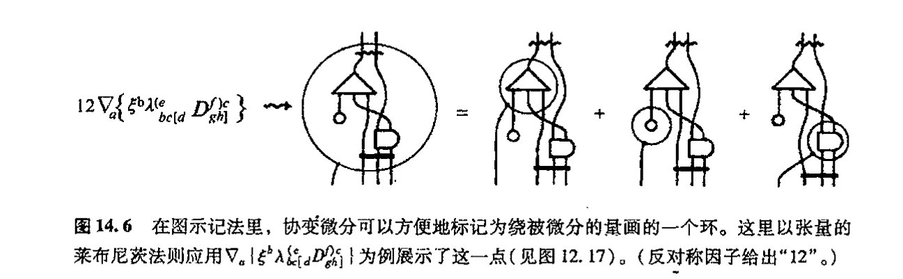
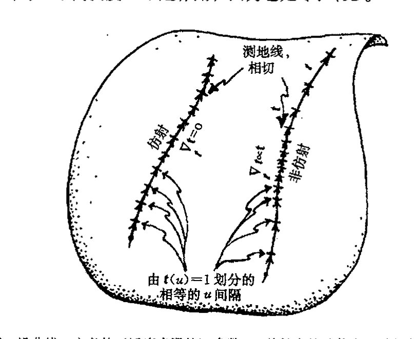
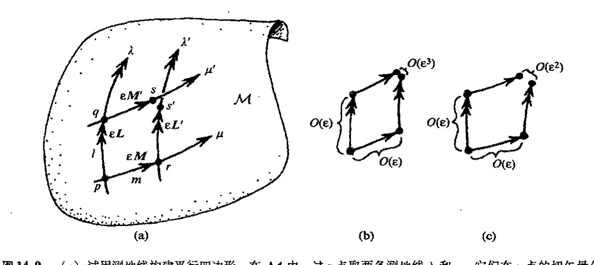
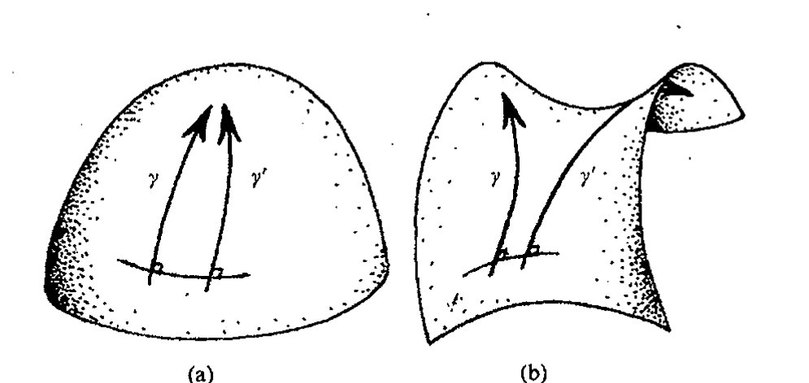
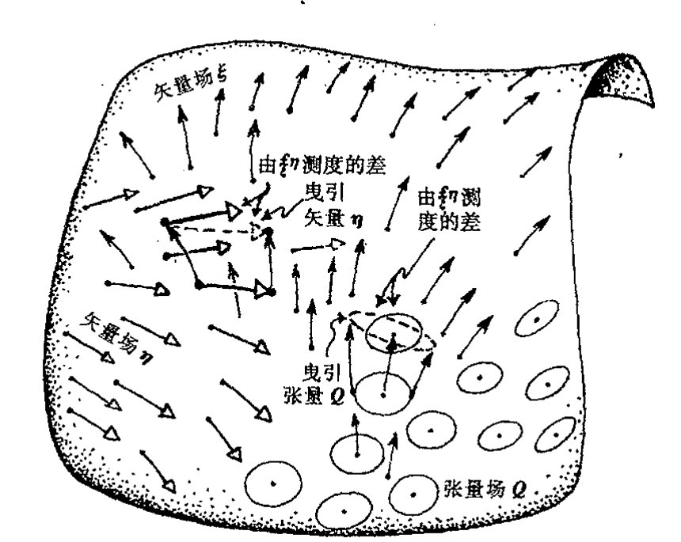
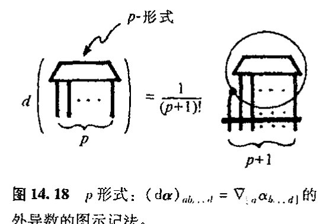
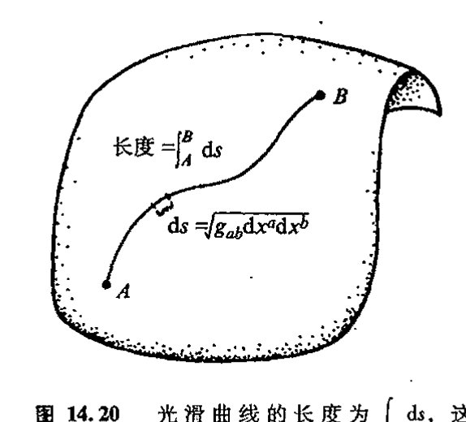
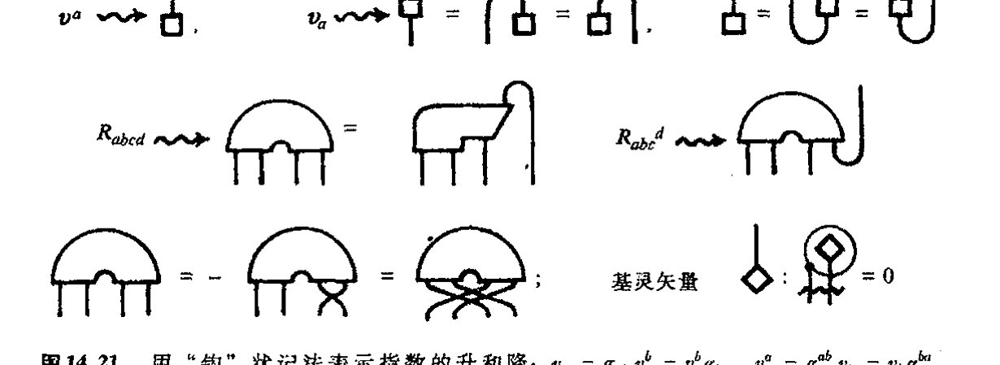

<!-- page 230 -->

第十四章 流形上的微积分

---

# 第十四章

# 流形上的微积分

## 14.1 流形上的微分

在前一章（§§ 13.3, 6, 10）我们看到，对称群可以作用于矢量空间，这种作用表现为矢量空间的线性变换。对于特定的群，我们可以认为矢量空间具有某种线性变换下不变的特定结构。这个“结构”概念是一个重要概念。例如，它可以是正交群（[§13.8](chapter_13.md#138-正交群)）下的度规结构，或是酉群（[§13.9](chapter_13.md#139-酉群)）下保持不变的埃尔米特结构。正如前面指出的，一般说来，作用在矢量空间上的群的表示理论在数学和物理的许多领域，特别是在量子理论里，非常重要。我们以后会看到（特别是在 [§22.2](chapter_22.md#222-u-的线性性以及它给-r-带来的问题)），具有埃尔米特（标积）结构的矢量空间构成量子理论的本质基础。

但是，矢量空间本身是一种非常特殊的空间，对现代物理的许多领域来说，数学上还需要一些更一般的条件。甚至古老的欧几里得几何都不是矢量空间，因为矢量空间必须有一个特别显著的特点，那就是（由零矢量给出的）原点，而在欧氏几何中每一点都是平权的。事实上，欧氏空间只是所谓仿射空间的一个例子。仿射空间很像矢量空间，只是“遗忘”了原点；实际上这种空间同样有相容的平行四边形概念。\*\*\*〔14.1〕\*\*\*\*\*\*〔14.2〕只要我们将某个点设为原点，我们就可以在其中按“平行四边形法则”定义矢量加法（见 [§13.3](chapter_13.md#133-线性变换和矩阵)，[图 13.4](assets/page202_fig01.jpg)）。

爱因斯坦卓越的广义相对论里的弯曲时空显然比矢量空间更为一般，它是一种四维流形。但这种时空几何概念要求有某种（局域）结构——一种光滑流形上的结构（见第 12 章）。类似

---

\*\*\*〔14.1〕令 $[a, b; c, d]$ 代表“$abdc$ 构成平行四边形”这一陈述（这里 $a, b, d$ 和 $c$ 像 [§5.1](chapter_05.md#51-复代数几何) 里那样依次作为各顶点）。由公理（i）对任意 $a, b$ 和 $c$，存在 $d$ 使有 $[a, b; c, d]$；（ii）如果存在 $[a, b; c, d]$，则存在 $[b, a; d, c]$ 和 $[a, c; b, d]$；（iii）如果存在 $[a, b; c, d]$ 和 $[a, b; e, f]$，则存在 $[c, d; e, f]$ 证明：当选定某个点作为原点之后，这个代数结构简化为“矢量空间”结构，但如 [§11.1](chapter_11.md#111-四元数代数) 那样没有“标量乘积”运算，就是说，我们得到的是加和性的阿贝尔群规则；见练习〔13.2〕。

??? question "答案 [14.1]"
    这些公理抽象化了平行四边形法则。给定基点 $a$，把从 $a$ 到 $b$ 的“位移”和从 $a$ 到 $c$ 的“位移”相加，定义为使 $[a,b;c,d]$ 成立的点 $d$。

    公理 (ii) 给出交换加法和反向平移的基本对称性；公理 (iii) 则保证按两种顺序作平行四边形得到同一点，即加法结合律。再以 $a$ 自身作为零位移，并用平行四边形反向构造负位移，就得到阿贝尔群结构。

\*\*\*\*〔14.2〕你能看出如何将它推广到非阿贝尔情形下吗？

??? question "答案 [14.2]"
    非阿贝尔情形中，“平行四边形闭合”的结果会依赖于先沿哪一条边移动。也就是说，先作位移 $X$ 再作 $Y$，与先作 $Y$ 再作 $X$，终点一般不同。

    推广时应把平行四边形法则替换为群乘法：边的连续拼接表示乘积，换序差异由换位子 $XYX^{-1}Y^{-1}$ 测量。无穷小地看，这个换位子给出李括号，也就是后面曲率和非阿贝尔联络中出现的结构。

·211·

<!-- page 231 -->

通向实在之路

地，（[§12.1](chapter_12.md#121-为什么要研究高维流形) 里简单考虑的）物理系统的构形空间和相空间也要求具有局域结构。我们如何来安排所需的结构呢？这样一种局域结构（在度规结构下）可提供一种对两点间“距离”的测量，或对曲面“面积”的测度（具体如 [§13.10](chapter_13.md#1310-辛群) 里的辛结构下情形），或曲线间“夹角”（如 [§8.2](chapter_08.md#82-共形映射) 里黎曼曲面的共形结构下情形），等等。正如刚刚讲的，在所有这些例子中，矢量空间概念都可以告诉我们所需的那种局域几何是什么，这就是流形 $\mathcal{M}$ 的某一点 $p$ 上的 $n$ 维切空间 $\mathcal{T}_p$（这里我们把 $\mathcal{T}_p$ 看成是紧邻 $\mathcal{M}$ 的 $p$ 点的附近区域的“无穷延展”，见[图 12.6](assets/page179_fig01.jpg)）。

相应地，我们在第 13 章里遇到过的各种群结构和张量在流形的各个点附近都有局域相关性。我们将看到，爱因斯坦弯曲时空在每个切空间上的确有一种由洛伦兹（伪）度规（[§13.8](chapter_13.md#138-正交群)）确定的局域结构，而经典力学的相空间（参见 [§12.1](chapter_12.md#121-为什么要研究高维流形)）则具有局部辛结构（[§13.10](chapter_13.md#1310-辛群)）。这两个带结构流形的例子在现代物理理论里扮演着重要角色。但在这些空间里运用的微积分该有什么样的形式呢？

正如前述，我们在第 12 章研究的 $n$ 维流形仅要求是光滑的，且不带任何特定的局域结构。在这样一种无结构光滑流形 $\mathcal{M}$ 上，没多少有意义的微积分运算。最重要的是，我们甚至没有一般的微分概念可用于这种流形 $\mathcal{M}$。

需要澄清一点，在具体坐标拼块上，我们可根据这个拼块上的坐标 $x^1, x^2, \cdots, x^n$，利用（偏）微分算子 $\partial/\partial x^1, \partial/\partial x^2, \cdots, \partial/\partial x^n$（见 [§10.2](chapter_10.md#102-光滑偏导数)）对感兴趣的各种量作简单微分（见 [§10.2](chapter_10.md#102-光滑偏导数)）。但在大多数情形下，得出的结果没什么几何意义，因为这些结果取决于所使用的坐标的具体（任意）选择。当我们从一个坐标拼块转移到另一个坐标拼块时，这些结果一般来说并不相互匹配（参见图 10.7）。

然而，在 [§12.6](chapter_12.md#126-外导数) 里我们就已经指出，微分概念之所以重要，是因为它实际上可用于一般的 $n$ 维光滑（无结构）流形——从一个坐标卡到另一个坐标卡——这就是微分形式的外导数。但这种运算受到作用范围的限制，因为它只能用于 $p$ 形式，而且还无法提供 $p$ 形式如何变化的信息。那么我们能否找到一种能够用于一般光滑流形上某些量（譬如说矢量场和张量场）的完备的“导数”概念呢？这种导数概念应当可以独立地定义在任何具体坐标上，这种坐标或许会恰好被选用来标示某个坐标拼块上的点。能有这样一种可用于流形上结构的与坐标无关的微积分当然再好不过，我们可以用它来说明矢量场和张量场是如何随位置变化的，但我们如何实现它呢？

## 14.2 平行移动

由 [§10.3](chapter_10.md#103-矢量场和-1-形式) 和 [§12.3](chapter_12.md#123-标量矢量和余矢量) 可知，对于一般的 $n$ 维光滑流形 $\mathcal{M}$ 上的标量场 $\Phi$，我们可以有对“变化率”即 1 形式 $\mathrm{d}\Phi$ 的适当度量，这里 $\mathrm{d}\Phi = 0$ 表示 $\Phi$ 在（在整个 $\mathcal{M}$ 的连通域上）是一常数。但这种度量对一般张量无效，它甚至不能用于矢量场 $\mathbf{\xi}$。为什么呢？麻烦出在这里：在一般流形里，我们没有适当的 $\mathbf{\xi}$ 为常数的概念（一会儿你就会看到），而应用于 $\mathbf{\xi}$ 的微分（“梯度”）运算

· 212 ·

<!-- page 232 -->

---

第十四章 流形上的微积分

则应当具有对常数 $\xi$ 作用结果为零的性质（正如 $\mathrm{d}\Phi=0$ 表示标量场 $\Phi$ 的恒常性那样）。更一般地，我们要求对于"不是常数"的 $\xi$，这种求导运算应当测度 $\xi$ 关于定常值的导数。

为什么在一般 $n$ 维流形 $\mathcal{M}$ 上会有矢量"恒常性"问题呢？在普通欧几里得空间内，常矢量场 $\xi$ 应有这样一种性质：作为几何描述的所有"箭头"彼此平行。这样，某种"平行化"概念必将成为 $\mathcal{M}$ 结构的一部分。对此我们或许会担心，因为我们总惦记着欧几里得第五公设问题——平行公理——它曾是第二章讨论的中心议题。例如，双曲几何就不允许有处处"平行的"矢量场。不管怎么说，"平行化"概念不是流形 $\mathcal{M}$ 仅仅因为它是光滑流形就可以拥有的性质。在[图 14.1](assets/page232_fig01.jpg) 中，我们用由两个欧几里得平面拼块组成的二维流形这一例子展示了这种困难，普通的欧几里得"平行"概念无法与拼块间的过渡相容。

图 14.1 欧几里得"平行"概念很可能在两个坐标拼块的重叠处是失效的。

为了对什么样的平行概念才是适当的这一点有所了解，我们不妨先来考察一下普通二维球面 $S^2$ 的内在几何性质。我们在 $S^2$ 上选一特定点 $p$（譬如说北极）和 $p$ 的一个特定切矢量 $v$（譬如说如[图 14.2](assets/page232_fig02.jpg) 那样，沿格林尼治子午圈方向）。在 $S^2$ 的其他点上，哪些切矢量会与 $v$"平行"呢？如果我们按标准做法简单地将 $S^2$ 嵌入到欧几里得三维空间来导出"平行"概念，那么我们

图 14.2 球面 $S^2$ 上的"平行"。取北极为 $p$ 点，其切矢量 $v$ 沿格林尼治子午圈方向。在 $S^2$ 的其他点上，哪些切矢量会与 $v$"平行"呢？(a) 直接用嵌入 $S^2$ 到 $E^3$ 而导出的"平行"概念是无效的，因为（除了沿垂直于格林尼治子午圈的大圆）与 $v$"平行"的矢量不可能保持与 $S^2$ 相切。(b) 为了弥补这一点，我们沿给定曲线 $\gamma$ 移动 $v$，并不断将 $v$ 投影到与球面相切的方向上。（把 $\gamma$ 想象成是由极多的微小片段 $p_0p_1, p_1p_2, p_2p_3, \cdots$，组成的，并对每一小段进行投影。然后随着各小段被分得越来越小，我们取极限。）这种平行移动概念既显示在格林尼治子午圈上，也显示在一般曲线 $\gamma$ 上。

将发现，在 $S^2$ 的大多数点 $q$ 上，根本就不存在这种意义下的与 $v$"平行"的 $S^2$ 的切矢量，因为 $q$ 点的切平面通常不包含 $v$ 方向。（只有过 $p$ 且垂直于 $p$ 点的格林尼治子午圈的大圆才包含这种

<!-- page 233 -->

通向实在之路

意义下平行于 $v$ 的 $S^2$ 的切矢量的点。）适当的 $S^2$ 上的平行化概念应专指切矢量。因此，当我们逐渐移动 $q$ 使之远离 $p$ 点时，我们必须尽可能地将 $v$ 的方向移向 $q$ 点的切平面。事实上，这种想法不仅可行，而且效果不错，但有个新特征需要点明，就是我们得到的平行化概念与我们如何移动 $q$ 使之远离 $p$ 点所取的路径无关。¹ 在“平行”概念里，这个路径无关性是真正的新要素，它的各种表述方式为有关粒子相互作用的现代理论的成功奠定了基础，这里当然也包括爱因斯坦广义相对论。

为了将这一点理解得更透彻些，我们来考虑 $S^2$ 上的路径 $\gamma$，它起自 $p$ 点止于 $S^2$ 上另一点 $q$。我们可以把 $\gamma$ 想象成是由极多的 $N$ 个小段 $p_0p_1$，$p_1p_2$，$p_2p_3$，$\cdots$，$p_{N-1}p_N$ 组成的，这里起点 $p_0 = p$，末段的终点 $p_N = q$。然后想象在 $\gamma$ 上移动 $v$，使得在每一小段 $p_{r-1}p_r$ 上 $v$ 均平行于该小段本身——这里用了前述意义上的周围是欧几里得三维空间这一概念——然后，将 $v$ 投影到 $p_r$ 点的切空间，见[图 14.2](assets/page232_fig02.jpg)（b）。通过这种操作，我们最终得到 $q$ 点上的切矢量，粗略地说，我们可以认为这个矢量自 $p$ 至 $q$ 一直是尽可能完全在曲面上沿 $\gamma$ 平行滑动。实际上这种操作还是多少要依赖于 $\gamma$ 近似为一系列小段的程度，但随着各小段被分得越来越小，在极限情形下可以证明，我们得到的是一个意义明确的结果，它不依赖于我们划分 $\gamma$ 成各小段的具体细节。这种操作就是所谓的 $v$ 沿 $\gamma$ 的平行移动。在[图 14.3](assets/page233_fig01.jpg) 里，我画出了自 $p$ 出发的沿 5 个不同路径（都是大圆）的平行移动看上去像是什么的样子。

那么，上述的路径相关指的是什么呢？在[图 14.4](assets/page233_fig02.jpg) 里，我在 $S^2$ 上标出了点 $p$ 和 $q$，以及自 $p$ 至 $q$ 的两条路径。一条是沿着大圆方向，另一条由经中点 $r$ 处连接的一对大圆弧组成。我们从[图 14.3](assets/page233_fig01.jpg) 的几何可以看出，沿这两条路径（其中一条有个拐角，但这无关紧要）的平行移动得到的

· 214 ·

<!-- page 234 -->

第十四章 流形上的微积分

是两个非常不同的结果，对如图情形，二者方向上差了一个直角。注意，这里的差异只是矢量的方向发生了转动。我们有理由相信，按这种特定方式定义的平行移动概念总是保持矢量的长度不变。（然而，还有不同于上述方式的其他形式的“平行移动”存在。这些问题对以后的章节（[§14.8](#148-辛流形)，[§15.7](chapter_15.md#157-丛联络的非平凡性)，8，[§19.4](chapter_19.md#194-作为规范曲率的麦克斯韦场)）很重要。）当我们将路径 $\gamma$ 取为一闭环（即 $p=q$）时，可以看到以极端方式出现的这种角度差异，在这种情形下，平行移动的切矢量的初始方向和终态方向之间很可能不同。事实上，就严格的单位半径的几何球面而言，这种差异是一个转角，如果以弧度计，该转角的值精确等于环（所包围的）的总面积。**[14.3]**

## 14.3 协变导数

我们如何才能将这种“平行移动”的概念用于定义适当的矢量场（从而一般张量场）的微分概念呢？基本思想是这样：我们可以对一个矢量（或张量）场实际沿某个方向离开点 $p$ 的行为与同一个矢量自 $p$ 点出发沿同方向的平行移动进行比较，并用前者减去后者。我们可以将这种方法应用到沿某条曲线 $\gamma$ 的有限位移上，但对于定义矢量场的（一阶）导数来说，我们只需要离开 $p$ 的无限小位移就够了，而这仅取决于曲线自 $p$ 点“出发”的方式，即仅取决于 $\gamma$ 在 $p$ 点的切矢量 $w$（[图 14.5](assets/page234_fig01.jpg)）。通常我们用符号 $\nabla$ 来表记以这种方式出现的微分概念，它称为协变导数算子，或简称为联络。

图14.5 协变导数的概念可与平行移动联系起来理解。$M$ 上矢量场 $\xi$（黑箭头）逐点而异的程度由对它偏离平行移动所提供的标准（白箭头）来量度。这种比较可沿（$p$ 点始的）整个曲线 $\gamma$ 进行，但对 $p$ 点上的一阶协变导数 $\nabla$，我们需要知道 $\gamma$ 在 $p$ 点的切矢量 $w$，它决定着 $\xi$ 在 $p$ 点沿 $w$ 方向的协变导数 $\nabla_w \xi$。

这种算子的一项基本要求（对于 $S^2$ 上按上述方式定义的概念来说，事实证明这种要求是正确的）是，算子线性地依赖于矢量 $w$。因此，由 $w$ 的位移（方向）定义的协变导数记为 $\nabla_w$，对于两个这样的位移矢量 $w$ 和 $u$，它必须满足

$$\nabla_{w+u} = \nabla_w + \nabla_u,$$

对一个标量因子 $\lambda$：

$$\nabla_{\lambda w} = \lambda \nabla_w.$$

---

**[14.3]** 看看你能否在球面三角（$S^2$ 上由大圆弧构成的三角形）的情形下验证这一判断，你可以直接运用 [§2.6](chapter_02.md#26-双曲几何的历史渊源) 里哈里奥特于 1603 年给出的有关球面三角的面积公式。

??? question "答案 [14.3]"
    对单位球面上由大圆弧围成的三角形，沿三边平行移动的总转角等于球面过剩 $A+B+C-\pi$。而哈里奥特公式给出该球面三角形面积也正是 $A+B+C-\pi$。

    因此，在单位球面上，闭合回路的平行移动 holonomy 角等于所围面积；半径不为 $1$ 时还要乘以相应曲率因子。

<!-- page 235 -->

通向实在之路

从记法上看，把矢量符号置于 $\nabla$ 之下似乎很别扭，也的确很别扭！但是，在使用像 "$\nabla_w$" 这样的表达式方面，数学家与物理学家的记法之间存有真正的分歧。对数学家而言，这个表达式表示的可能是那种我用 $\nabla$ 所表示的运算，而物理学家则倾向于将 $w$ 理解为指标而不是矢量场。在物理学家的记法里，算子 $\nabla$ 表为

$$\nabla_w = w^a \nabla_a,$$

上述的线性性直接反映出记法上的一致性：

$$(w^a + u^a)\nabla_a = w^a \nabla_a + u^a \nabla_a, \quad (\lambda w^a)\nabla_a = \lambda(w^a \nabla_a).$$

$\nabla$ 的下标的位置与它作为矢量场的对偶项是一致的（正如上述线性性所反映的，见 [§12.3](chapter_12.md#123-标量矢量和余矢量)），即 $\nabla$ 是一个余矢量算子（价 $\begin{bmatrix} 0 \\ 1 \end{bmatrix}$ 的算子）。因此，当 $\nabla$ 作用到矢量场 $\xi$（价 $\begin{bmatrix} 1 \\ 0 \end{bmatrix}$）时，其结果 $\nabla\xi$ 是一个 $\begin{bmatrix} 1 \\ 1 \end{bmatrix}$ 价的张量。这一点在指标法下非常清楚：张量 $\nabla\xi$ 的分量（或抽象指标）的表达式的记法为 $\nabla_a \xi^b$。事实上，我们有一种很自然的方式将算子 $\nabla$ 的适用范围从矢量扩展到一般价的张量，$\nabla$ 对 $\begin{bmatrix} p \\ q \end{bmatrix}$ 价张量 $T$ 的作用生成一个 $\begin{bmatrix} p \\ q+1 \end{bmatrix}$ 价的张量 $\nabla T$。其运算法则在指标记法下可方面地表达出来，但在数学家的记法里则显得别扭，我们不久就会遇到。

在作用于矢量场时，$\nabla$ 满足 [§12.6](chapter_12.md#126-外导数) 里微分算子 $\mathbf{d}$ 所满足的那些运算法则：

$$\nabla(\xi + \eta) = \nabla\xi + \nabla\eta$$

和莱布尼茨法则

$$\nabla(\lambda\xi) = \lambda\nabla\xi + \xi\nabla\lambda,$$

这里 $\xi$ 和 $\eta$ 是矢量场，$\lambda$ 是标量场。作为联络的一种正规要求，$\nabla$ 对标量的作用与梯度（外导数）$\mathbf{d}$ 对标量的作用相同：

$$\nabla\Phi = \mathbf{d}\Phi.$$

$\nabla$ 作用于一般张量场的扩展由下述两项自然要求唯一确定。**[14.4]** 第一项为（对同价张量 $T$ 和 $U$）加和性：

$$\nabla(T + U) = \nabla T + \nabla U$$

第二项是适当形式的莱布尼茨法则。这里莱布尼茨法则陈述起来有些拗口，在数学家的那种不用指标的记法下就更是如此。其大致形式（对任意价的张量 $T$ 和 $U$）是

$$\nabla(T \cdot U) = (\nabla T) \cdot U + T \cdot \nabla U.$$

但它需要解释。符号 $\cdot$ 是一种收缩积形式，$T$ 的一组上下标与 $U$ 的一组上下标缩并（允许集为空，此时积变成外积，无缩并）。在上述公式里，等号右边两项的缩并精确反映了等号左边各项，$\nabla$ 的指标字母在整个表达式前后都是相同的。

---

**[14.4]** 解释为什么是唯一的。提示：考虑 $\nabla$ 对 $\alpha \cdot \xi$ 等的作用。

??? question "答案 [14.4]"
    任意张量可由矢量、余矢量的张量积、线性组合和缩并生成。联络在矢量上的作用已给定；余矢量的导数由要求 $\nabla(\alpha\cdot\xi)=(\nabla\alpha)\cdot\xi+\alpha\cdot\nabla\xi$ 唯一确定。

    对一般张量，再用线性性和莱布尼茨法则逐个因子扩展。由于这些规则还要求与缩并相容，所以不存在额外选择，扩展唯一。

· 216 ·

<!-- page 236 -->

第十四章 流形上的微积分

在书写前述表达张量的莱布尼茨法则的公式时，数学家的记法还有一个特别不方便的地方，就是指标无所指。如果我们用 $\nabla_{\!\!\!\!\!\! w}$ 而不是 $\nabla$ 情况会好些，因为 $w$ 示踪 $\nabla$ 的指标，只要我们愿意，我们可以进行类似其他指标的操作，与矢量或余矢量场缩并每个指标（不是通过 $\nabla$ 的作用）。在我看来，用指标会使问题表达得较为清楚，但在图示记法下则更加清楚，此时微分可标记为绕被微分的量画的一个环。在[图 14.6](assets/page236_fig01.jpg) 里，我用张量的莱布尼茨法则为例展示了这一点。

$$12\nabla_a\{\xi^b\lambda_{bc[d}^{(e}D_{gh]}^{f)c}\} \longrightarrow$$

**图 14.6** 在图示记法里，协变微分可以方便地标记为绕被微分的量画的一个环。这里以张量的莱布尼茨法则应用 $\nabla_a\{\xi^b\lambda_{bc[d}^{(e}D_{gh]}^{f)c}\}$ 为例展示了这一点（见图 12.17）。（反对称因子给出"12"。）

所有这些性质在"坐标导数"算子 $\partial/\partial x^a$ 取代 $\nabla_a$ 时也是正确的。事实上，在任一坐标拼块上，我们可以用 $\partial/\partial x^a$ 来定义这个拼块上的具体联络，我称它为坐标联络。它不是一种非常令人感兴趣的联络，因为坐标是任意的。（它提供了一种"平行"概念，这个概念把所有坐标线视为"平行"。）在两个坐标拼块的重叠处，由其中一个拼块的坐标定义的联络通常与另一个拼块定义的联络不一致（见[图 14.1](assets/page232_fig01.jpg)）。尽管坐标联络不"令人感兴趣"（物理上肯定没意思），但它在阐明表达式时常常是很有用的。原因得牵涉到这样一种事实：如果我们在两个联络之间取差分，这个差分对某个张量 $\mathbf{T}$ 的作用总可以根据 $\mathbf{T}$ 和一个确定的价 $\begin{bmatrix} 1 \\ 2 \end{bmatrix}$ 的张量 $\mathbf{\Gamma}$ 用完全代数的形式（即不用微分）表达出来。***[14.5] 这使我们能够将 $\nabla$ 对 $\mathbf{T}$ 的作用清楚地表示为分量 $T_{a\cdots f}^{c\cdots i}$ 的坐标导数^2^ 加上某些涉及分量 $\Gamma_{bc}^a$ 的附加项。***[14.6]

## 14.4 曲率和挠率

坐标联络是一种相当特殊的联络，因为与一般联络不同，这种联络定义了一种与路径无关

---

***[14.5] 看看你能否证明这一点，找出明确表达式。提示：首先看两个联络之间的差分对矢量场 $\mathbf{\xi}$ 的作用，给出指标形式 $\xi^c\Gamma_{ac}^b$ 的答案；其次，证明这种联络的差分作用到余矢量 $\mathbf{\alpha}$ 上将有指标形式 $-\alpha_c\Gamma_{ab}^c$；最后，用 $\begin{bmatrix} p \\ q \end{bmatrix}$ 价张量 $\mathbf{T}$ 的定义作为 $q$ 矢量关于 $p$ 余矢量的多重线性函数（参见 [§14.2](#142-平行移动)），找出联络的差分作用到 $\mathbf{T}$ 的一般指标表达式。

??? question "答案 [14.5]"
    令 $D_a=\nabla'_a-\nabla_a$。对矢量，$D_a(f\xi^b)=fD_a\xi^b$，因为两个联络对标量的导数相同，含 $\nabla_a f$ 的项相消。因此 $D_a\xi^b=\Gamma_{ac}{}^b\xi^c$，其中 $\Gamma_{ac}{}^b$ 是张量。

    由 $D_a(\alpha_b\xi^b)=0$ 得 $D_a\alpha_b=-\Gamma_{ab}{}^c\alpha_c$。一般 $\begin{bmatrix}p\\q\end{bmatrix}$ 张量中，每个上指标给一项 $+\Gamma$，每个下指标给一项 $-\Gamma$。

***[14.6] 作为这一应用，将两个联络分别取为 $\nabla$ 和坐标联络。找出 $\nabla$ 作用于任一张量的坐标表达式，说明如何从 $\Gamma_{b1}^a=\nabla_b\delta_1^a,\ \cdots,\ \Gamma_{bn}^a=\nabla_b\delta_n^a$，即根据 $\nabla$ 对每一个坐标矢量 $\delta_1^a,\ \cdots,\ \delta_n^a$ 的作用，明确地得到分量 $\Gamma_{bc}^a$。（这里 $a$ 是矢量指标，依据 [§12.8](chapter_12.md#128-张量抽象指标记法和图示记法)，它可视为"抽象指标"，因此"$\delta_1^a$"等的确代表矢量而不只是各组分量，但 $n$ 仅表示空间维数。注意，坐标联络零化每一个坐标矢量。）

??? question "答案 [14.6]"
    取坐标联络为 $\partial_a$，则 $\nabla_a\xi^b=\partial_a\xi^b+\Gamma_{ac}{}^b\xi^c$，$\nabla_a\alpha_b=\partial_a\alpha_b-\Gamma_{ab}{}^c\alpha_c$。一般张量仍是每个上指标加 $+\Gamma$ 项、每个下指标加 $-\Gamma$ 项。

    坐标基矢量 $\delta_c{}^a$ 在坐标联络下为零，所以 $\Gamma_{bc}{}^a=\nabla_b\delta_c{}^a$。知道 $\nabla$ 对所有坐标基矢量的作用，就知道了全部克里斯托费尔分量。

· 217 ·

<!-- page 237 -->

通向实在之路

的平行性。它必然涉及坐标导数算子的交换性（我们在 [§10.2](chapter_10.md#102-光滑偏导数) 里指出过的形式 ∂²f/∂x∂y = ∂²f/∂y∂x）：

$$\frac{\partial^2}{\partial x^a \partial x^b} = \frac{\partial^2}{\partial x^b \partial x^a}。$$

换一种说法，我们可以说量 ∂²/∂xᵃ∂xᵇ 是（关于指数 a，b）对称的。不久我们就会看到它所涉及的与平行性无关的路径是指什么。对一般联络 ∇，这种对称性质对 ∇ₐ ∇ᵦ 不成立，其反对称部分 ∇₍ₐ ∇ᵦ₎ 产生两个特殊张量，一个价 [¹₂] 的称为挠率张量 τ，另一个价 [¹₃] 的称为曲率张量 R。

302

当 ∇₍ₐ ∇ᵦ₎ 作用到标量上结果不为零时就会出现挠率。在大多数物理理论里，一般认为 ∇ 是无挠的，即 τ=0，这无疑使问题得以简化。但也存在一些理论，像超引力和爱因斯坦–嘉当–席艾玛–基伯自旋/挠率理论，它们具有不为零的挠率，这种挠率在物理上有重要意义，见注释 19.10 和 [§31.3](chapter_31.md#313-超对称代数和几何)。当存在挠率时，其关于 ab 反对称的指数表达式 τₐᵦᶜ 定义为***[14.7]

$$(\nabla_a \nabla_b - \nabla_b \nabla_a)\Phi = \tau_{ab}{}^c \nabla_c \Phi。$$

在无挠情形下，***[14.8] 曲率张量 R 可定义³ 为***[14.9]

$$(\nabla_a \nabla_b - \nabla_b \nabla_a)\xi^d = R_{abc}{}^d \xi^c。$$

正像这个领域里已习以为常的那样，我们遇上了带许多小指标的那种令人沮丧的表达式，因此我认为大家用如[图 14.7](assets/page238_fig01.jpg)(a),(b) 那样的图示记法来表示这些关键表达式。不管怎样，我还是认为，对于带抽象指标的张量，这些指标量应像 [§12.8](chapter_12.md#128-张量抽象指标记法和图示记法) 那样具有适当的可读性。（在文献里，在指标的序、符号等方面存有众多不同的惯例。我一直促使读者接受我自己所使用的这套记法——至少在我是唯一作者的文章里如此！）事实上，Rₐᵦᶜᵈ 对第一对指标 ab 是反对称的，即

$$R_{bac}{}^d = -R_{abc}{}^d，$$

（见[图 14.7](assets/page238_fig01.jpg)(c)）这从 (∇ₐ∇ᵦ − ∇ᵦ∇ₐ = 2∇₍ₐ∇ᵦ₎) 的相应的反对称性上看是很明显的。不久我们就会看到这种反对称性的重要性。在无挠情形下，我们有额外的对称关系***[14.10]（[图 14.7](assets/page238_fig01.jpg)(d)）

$$R_{[abc]}{}^d = 0,\quad 即\quad R_{abc}{}^d + R_{bca}{}^d + R_{cab}{}^d = 0。$$

这一关系有时称为"比安基第一恒等式"。我称它为比安基对称性。这个比安基恒等式（[图 14.7](assets/page238_fig01.jpg)(e)）的提法说明通常还有"第二个"这种恒等式，在无挠情形下，它是***[14.11]

---

***〔14.7〕 解释为什么右边必须具有一般形式；根据 Γᵇᶜᵃ 找出分量 τᵇᶜᵃ。见练习〔14.6〕。

??? question "答案 [14.7]"
    对标量，二阶导数交换子的最高阶二阶偏导项会相消，剩下只能依赖 $\Phi$ 的一阶导数。因此可把挠率按本章约定定义为 $[\nabla_a,\nabla_b]\Phi=\tau_{ab}{}^c\nabla_c\Phi$，其中 $\tau_{ab}{}^c$ 对 $a,b$ 反对称。

    若在坐标中写 $\nabla_a\xi^c=\partial_a\xi^c+\Gamma_{ab}{}^c\xi^b$，则这个约定对应 $\tau_{ab}{}^c=\Gamma_{ba}{}^c-\Gamma_{ab}{}^c$。若采用常见的 $T_{ab}{}^c=\Gamma_{ab}{}^c-\Gamma_{ba}{}^c$，则有 $\tau=-T$。

***〔14.8〕 证明：当挠率不为零时，需要什么样的附加项才能保证表达式的一致性。

??? question "答案 [14.8]"
    有挠率时，$\nabla_a\nabla_b-\nabla_b\nabla_a$ 作用在矢量上不仅含代数的曲率作用，还会留下由挠率造成的一阶导数项。

    按 $[\nabla_a,\nabla_b]\Phi=\tau_{ab}{}^e\nabla_e\Phi$ 的约定，要定义张量性的曲率，应取 $(\nabla_a\nabla_b-\nabla_b\nabla_a-\tau_{ab}{}^e\nabla_e)\xi^d=R_{abc}{}^d\xi^c$。减去的正是作用在标量时已经出现的挠率方向导数。

***〔14.9〕 ∇ₐ∇ᵦ − ∇ᵦ∇ₐ 对余矢量的作用的相应表达式是什么？导出价 [ᵖᵩ] 的一般张量的表达式。

??? question "答案 [14.9]"
    对无挠联络，曲率在余矢量上的作用由缩并不变性确定：$0=[\nabla_a,\nabla_b](\alpha_c\xi^c)$。已知矢量项为 $R_{abd}{}^c\xi^d$，便得 $[\nabla_a,\nabla_b]\alpha_c=-R_{abc}{}^d\alpha_d$。

    对一般张量，每个上指标贡献一个 $+R$，每个下指标贡献一个 $-R$。例如 $T^c{}_d$ 给出 $R_{abe}{}^cT^e{}_d-R_{abd}{}^eT^c{}_e$。

***〔14.10〕 先解释"即"；然后从前面定义 Rₐᵦᶜᵈ 的方程出发，通过扩展 ∇₍ₐ∇ᵦ(ξᵈ∇ᵈ₁Φ) 来导出该式。（图示记法会有帮助。）

??? question "答案 [14.10]"
    第一式 $R_{[abc]}{}^d=0$ 表示对 $a,b,c$ 全反对称化为零。由于 $R$ 已对 $a,b$ 反对称，这等价于循环和 $R_{abc}{}^d+R_{bca}{}^d+R_{cab}{}^d=0$。

    在无挠情形下，可把它看成三重协变导数作用于标量或矢量时的雅可比型恒等式；几何上对应无挠平行四边形在最低阶闭合。

***〔14.11〕 从前面定义 Rₐᵦᶜᵈ 的方程出发，通过两种途径扩展 ∇₍ₐ∇ᵦ∇ᵈ₁ξᶜ 来导出这个式子。（图示记法会有帮助。）

??? question "答案 [14.11]"
    对协变导数交换子使用算子雅可比恒等式 $[\nabla_a,[\nabla_b,\nabla_c]]+\text{cyclic}=0$。将 $[\nabla_a,\nabla_b]\xi^e=R_{abd}{}^e\xi^d$ 代入，并比较任意 $\xi$ 的系数。

    在无挠情形下，一阶导数项按第一比安基恒等式相消，剩下 $\nabla_{[a}R_{bc]d}{}^e=0$，这就是第二比安基恒等式。

·218·

<!-- page 238 -->

![曲率张量的图示记法，包含五个子图 (a)-(e)：(a) 曲率张量 $R_{abc}{}^d$ 的图示表示；(b) 里奇恒等式 $(\nabla_a\nabla_b-\nabla_b\nabla_a)\xi^d = R_{abc}{}^d\xi^c$ 的图示；(c) 反对称性 $R_{bac}{}^d = -R_{abc}{}^d$ 的图示；(d) 比安基对称 $R_{[abc]}{}^d=0$ 及其简化形式 $R_{abc}{}^d+R_{bca}{}^d+R_{cab}{}^d=0$ 的图示；(e) 比安基恒等式 $\nabla_{[a}R_{bc]d}{}^e=0$ 的图示](assets/page238_fig01.jpg)

**图 14.7**　（a）曲率张量 $R_{abc}{}^d$ 的一种方便的图示记法。（b）里奇恒等式 $(\nabla_a\nabla_b-\nabla_b\nabla_a)\xi^d = R_{abc}{}^d\xi^c$。（c）反对称性 $R_{bac}{}^d = -R_{abc}{}^d$。（d）比安基对称 $R_{[abc]}{}^d=0$，它简化为 $R_{abc}{}^d+R_{bca}{}^d+R_{cab}{}^d=0$。（e）比安基恒等式 $\nabla_{[a}R_{bc]d}{}^e=0$。

$$\nabla_{[a}R_{bc]d}{}^e=0,\quad\text{即}\quad \nabla_a R_{bcd}{}^e + \nabla_b R_{cad}{}^e + \nabla_c R_{abd}{}^e = 0\text{。}$$

正如我们在 [§19.6](chapter_19.md#196-爱因斯坦场方程) 将会看到的，这个比安基恒等式对爱因斯坦场方程至为关键。

曲率是表示联络的路径依赖性的基本量（至少在局部范围是这样）。如果我们设想沿空间 $\mathcal{M}$ 内的一个小环按 $\mathbf{\nabla}$ 所定义的平行移动概念来移动矢量，回到出发点后我们将发现，正是 $\mathbf{R}$ 测度了矢量改变的程度。最容易想到的是将这个环设想为画在空间 $\mathcal{M}$ 内的"无穷小平行四边形"。（正如我们将看到的，在 $\mathbf{\nabla}$ 是无挠的情形下，这种"平行四边形"足以存在。）然而，这里先要澄清一些不同的概念。

## 14.5　测地线、平行四边形和曲率

首先，为了构建我们自己的平行四边形，我们来考虑由联络 $\mathbf{\nabla}$ 定义的测地线概念。测地线的重要性还可以有其他一些理由来说明。它们类似于欧几里得几何的直线。在前面考虑的球面 $S^2$ 的例子（[图 14.2](assets/page232_fig02.jpg)–14.4）中，测地线是球面上的大圆。更一般地，在欧几里得空间里的曲面上，测地线是长度最短的曲线（可取沿曲面张紧的弦来代表）。后面（[§17.9](chapter_17.md#179-爱因斯坦广义相对论的时空)）我们会看到，测地线对于爱因斯坦的广义相对论具有根本的重要性，它表示自由落体在时空里的路径。联络 $\mathbf{\nabla}$ 是如何提供测地线概念的呢？本质上，根据 $\mathbf{\nabla}$ 所定义的平行概念，测地线就是一条持续地"平行于自身"的曲线 $\gamma$。我们如何准确地表达这个要求呢？假定矢量 $\mathbf{t}$（即 $t^a$）沿 $\gamma$ 始终与 $\gamma$ 相切，那么要求 $\mathbf{t}$ 的方向沿 $\gamma$ 保持与自身平行这项要求可以表示为^4

$$\underset{\gamma}{\mathbf{\nabla}}\,\mathbf{t}\propto\mathbf{t},\quad\text{即}\quad t^a\nabla_a t^b \propto t^b,$$

（符号"$\propto$"表示"正比于"，见 [§12.7](chapter_12.md#127-体积元求和规则)）。当这一条件成立时，根据 $\mathbf{\nabla}$ 所定义的平行概念 $\mathbf{t}$ 可沿 $\gamma$ 伸展或收缩，但它的方向"保持不变"。如果我们希望确认不发生这种"伸或缩"，则矢量 $\mathbf{t}$ 本身沿 $\gamma$ 保持常数，于是，我们需要更强的条件：切矢量 $\mathbf{t}$ 沿 $\gamma$ 作平行移动，即要求

$$\underset{\gamma}{\mathbf{\nabla}}\,\mathbf{t}=0,\quad\text{即}\quad t^a\nabla_a t^b = 0,$$

<!-- page 239 -->

通向实在之路

沿整个 $\gamma$ 成立，这里矢量 $t$（或其指标形式 $t^a$）沿 $\gamma$ 与 $\gamma$ 相切。

根据这个更强的方程，不仅 $t$ 的方向，而且 $t$ 的“标长”沿 $\gamma$ 亦是常数。这意味着什么呢？首先要说明的是，任何曲线（不必是测地线），经（适当光滑的）坐标 $u$ 参数化之后，都与其沿曲线的切矢量 $t$ 的标长的特定选择密切相关。就是说，$t$ 代表着沿曲线对 $u$ 的微分（$\mathrm{d}/\mathrm{d}u$）。我们可以有选择地把这个条件写成

$$t(u)=1$$

或

$$\nabla_t u = 1,\quad \text{即}\quad t^a\nabla_a u = 1$$

沿曲线成立。**[14.12]

在测地线 $\gamma$ 的情形下，满足 $\nabla_t t = 0$ 的 $t$ 标长的更强的选择与称之为沿 $\gamma$ 的仿射参数 $u$ 的特定类型密切相关**[14.13]，见[图 14.8](assets/page239_fig01.jpg)。当我们有了沿曲线“距离”的适当概念后，我们通常将仿射参数取为这种距离的测度。但仿射参数更为一般。例如，在相对论里，我们需要的是针对光线的仿射参数，这里适当的“距离测度”不起作用，因为它是零！（见 [§17.8](chapter_17.md#178-放弃绝对时间) 和 [§18.1](chapter_18.md#181-欧几里得型与闵可夫斯基型四维空间)。）

**图 14.8** 对任一沿曲线 $\gamma$ 定义的（适当光滑的）参数 $u$，总是自然地伴有 $\gamma$ 的切矢量 $t$ 的场，因此，$t$ 代表沿 $\gamma$ 的 $\mathrm{d}/\mathrm{d}u$（等价于 $t(u)=1$，或 $t^a\nabla_a u = 1$）。如果 $\gamma$ 是测地线，则 $u$ 称为仿射参数，如果 $t$ 是沿 $\gamma$ 做平行移动，从而 $\nabla_t t = 0$ 而不只是 $\nabla_t t \propto t$。根据 $\nabla$，仿射参数是“等间距的”。

现在我们试用测地线来构建平行四边形。从 $\mathcal{M}$ 内某一点 $p$ 开始，由 $p$ 出发画两条测地线 $\lambda$ 和 $\mu$，它们在 $p$ 点的切矢量分别为 $L$ 和 $M$，相应的仿射参数分别为 $l$ 和 $m$。取某个正数 $\varepsilon$，并从 $p$ 点出发分别沿 $\lambda$ 量出一段仿射距离 $l=\varepsilon$ 至 $q$ 点，沿 $\mu$ 量出仿射距离 $m=\varepsilon$ 至 $r$ 点，见[图 14.9](assets/page240_fig01.jpg)

---

**[14.12] 论证所有这些条件的等价性。

??? question "答案 [14.12]"
    若曲线用参数 $u$ 表示，则切矢量 $t$ 对任意函数 $f$ 的作用就是沿曲线的 $df/du$。取 $f=u$，得到 $t(u)=1$。

    对标量，协变导数与普通微分相同，所以 $t(u)=t^a\nabla_a u=\nabla_tu$。因此这些写法只是同一参数化条件的不同记号。

**[14.13] 证明：如果 $u$ 和 $v$ 是 $\gamma$ 上关于 $t$ 的两个不同选择的仿射参数，则 $v = Au + B$，这里 $A$ 和 $B$ 沿 $\gamma$ 都是常数。

??? question "答案 [14.13]"
    设 $u$ 是仿射参数，切矢量为 $t=d/du$ 且 $\nabla_t t=0$。若 $v=v(u)$，则新切矢量为 $s=d/dv=(du/dv)t$。

    条件 $\nabla_s s=0$ 给出 $d^2u/dv^2=0$，所以 $u$ 是 $v$ 的仿射函数；等价地 $v=Au+B$。其中 $A,B$ 沿曲线为常数，且 $A\ne0$。

· 220 ·

<!-- page 240 -->

第十四章 流形上的微积分

图14.9 (a) 试用测地线构建平行四边形。在 $\mathcal{M}$ 内，过 $p$ 点取两条测地线 $\lambda$ 和 $\mu$，它们在 $p$ 点的切矢量分别为 $L$ 和 $M$，相应的仿射参数分别为 $l$ 和 $m$。从 $p$ 点出发，分别沿 $\lambda$ 取仿射距离 $l=\varepsilon$ 得到点 $q$，沿 $\mu$ 取仿射距离 $m=\varepsilon$ 得到点 $r$（这里 $\varepsilon>0$ 是某个固定的小数）。测地线段 $pq$ 和 $pr$ 分别有"带箭头长度" $\varepsilon L$ 和 $\varepsilon M$。为了构成平行四边形，我们用平行移动方式（沿 $\lambda$ $\nabla_L M=0$）将 $M$ 沿 $\lambda$ 从 $p$ 移至 $q$，由此我们得到与 $\mu$ 相邻的测地线 $\mu'$，然后，再沿新的"平行"箭头 $\varepsilon M'$ 取仿射距离 $\varepsilon$ 将 $M$ 沿 $\mu'$ 从 $q$ 移至 $s$。类似地，用平行移动方式将 $L$ 沿 $\mu$ 从 $p$ 移至 $r$，然后再沿 $\lambda'$ 方向从 $q$ 始取仿射距离 $m=\varepsilon$ 将 $L$ 沿平行箭头 $\varepsilon L'$ 从 $r$ 移至 $s'$。(b) 一般来说，$s \neq s'$，故平行四边形不精确闭合，但如果挠率 $\tau$ 为零，则间隙只是 $O(\varepsilon^3)$ 的。(c) 如果存在不为零的挠率 $\tau$，就会出现 $O(\varepsilon^2)$ 项。

(a)。（直觉上，我们认为测地线段 $pq$ 和 $pr$ 对某个小量 $\varepsilon$ 分别有"带箭头长度" $\varepsilon L$ 和 $\varepsilon M$。）为了完成平行四边形，我们需要从 $q$ 点出发沿新的测地线 $\mu'$ 按"平行"于 $M$ 的方向移动。为了取得这种"平行"条件，我们用平行移动的方法将 $M$ 沿 $\lambda$ 从 $p$ 移至 $q$（这意味着要求 $M$ 沿 $\lambda$ 满足 $\nabla_L M = 0$）。现在，我们试着设置平行四边形的最后一个顶点 $s$ 点，这个 $s$ 点由从 $q$ 出发沿 $\mu'$ 取仿射距离 $m=\varepsilon$ 而定。当然，我们也可以试着按另一条路径来确定这个最后的顶点：从 $r$ 出发沿 $\lambda'$ 取仿射距离 $l=\varepsilon$ 至终点 $s'$，这里测地线 $\lambda'$ 由从 $p$ 出发沿"平行"于 $M$ 的方向用平行移动的方法沿 $\mu$ 从 $p$ 移至 $r$ 而定。要得到一个彻底令人信服的平行四边形，我们必须要求这两个被选的终点 $s$ 和 $s'$ 是同一个点（$s=s'$）！

但是，除非在非常特殊的情形（如欧几里得几何）下，一般来说这两个点并不相同。（回忆一下我们曾在 [§2.1](chapter_02.md#21-毕达哥拉斯定理) 尝试着构造正方形！）在一定意义上，如果矢量 $\varepsilon L$ 和 $\varepsilon M$ 取得相当"小"，那么这些点将不会"非常"不同。但到底有多大程度上的差异要取决于挠率 $\tau$。为了确切理解这一点，我们需要比现在掌握的多得多的微积分知识。本质上，我们能够将这种对欧几里得几何的相关偏差看作是某种尺度上的表现，这种尺度的大小取决于小量 $\varepsilon$ 的选择。我们不太关心测度上这种偏离平直程度的实际大小，而是关心它们随 $\varepsilon$ 取得越来越小而趋近于零的速率。因此，我们对这些量的精确值无甚兴趣，而是想知道这样一个量 $Q$ 趋于零的速率是否和 $\varepsilon$，抑或和 $\varepsilon^2$ 或是 $\varepsilon^3$，或是 $\varepsilon$ 的其他某个具体函数一样快。（在 [§13.6](chapter_13.md#136-表示理论与李代数) 我们已经看到过这类事情。）这里"和…一样快"是指，在某个坐标系下表示时，$Q$ 分量的绝对值要小于 $\varepsilon$（抑或 $\varepsilon^2$，或是 $\varepsilon^3$，或是 $\varepsilon$ 的

· 221 ·

<!-- page 241 -->

通向实在之路

其他某个具体函数）的某个正常数倍。（因此“和…一样快”包括“比…还快”！）在这些情形下，我们分别说 $Q$ 是 $\varepsilon$ 阶，或 $\varepsilon^2$ 阶，或 $\varepsilon^3$ 阶等等的，分别记做 $O(\varepsilon)$，或 $O(\varepsilon^2)$，或 $O(\varepsilon^3)$ 等等。它们与具体的坐标系选择无关，而这一点也正是这种“小量级”概念之所以灵敏和重要的一个理由。我在这里的描述一直非常简约，对于尚未入门但又对此感兴趣的读者，我希望他们去研读有关这方面的著名而又全面的著作。直觉上，我们仅需记住，$O(\varepsilon^3)$ 的意思是比 $O(\varepsilon^2)$ 要小很多，而后者又比 $O(\varepsilon)$ 要小很多，依此类推。

我们回到待处理的平行四边形来。$p$ 点的初始矢量 $\varepsilon L$ 和 $\varepsilon M$ 属 $O(\varepsilon)$ 阶，因此边 $pq$ 和 $pr$ 也是 $O(\varepsilon)$ 的，$qs$ 和 $rs'$ 也是。那么“间隙” $ss'$ 会有多大呢？答案是这样的：如果联络是无挠的，$ss'$ 总是 $O(\varepsilon^3)$ 的，见[图 14.9](assets/page240_fig01.jpg)（b），事实上，这一性质完全刻画了无挠条件；如果存在不为零的挠率 $\tau$，则 $ss'$ 将以 $O(\varepsilon^2)$ 项形式出现在（某个）平行四边形上，见[图 14.9](assets/page240_fig01.jpg)（c）。有时我们（相当笼统地）说，挠率为零是平行四边形封闭的条件（意思是“接近于 $\varepsilon^2$ 阶”）。

假定现在挠率为零。我们能用这种平行四边形来解释曲率吗？的确可以。假定在 $p$ 点我们有第三个矢量 $N$，将它沿平行四边形按平行移动方式自 $p$ 经 $r$ 移到 $s'$。（当挠率为零时，这种在 $\varepsilon^2$ 阶上的比较是有意义的，因为 $s$ 和 $s'$ 之间的间隙是 $O(\varepsilon^3)$ 的，可忽略；当挠率不为零时，我们得注意会出现另外的挠率项，见练习 [14.7]。）我们发现，按 $pqs$ 平行移动的结果与按 $prs'$ 平行移动的结果之间的差为

$$\varepsilon^2 L^a M^b N^c R_{abc}{}^d。$$

这为我们提供了对曲率张量 $R$ 的非常直接的几何解释，见[图 14.10](assets/page241_fig01.jpg)。（如果我们考虑沿整个平行四边形来平行移动 $N$，起点和终点都选在 $p$ 点，并忽略平行四边形各顶点的 $O(\varepsilon^3)$ 的偏差，我们就能得到一种与上述解释等价的解释。$N$ 在起点和终点的值之间的差仍是上述量 $\varepsilon^2 L^a M^b N^c R_{abc}{}^d$。）

我们知道，$R_{abc}{}^d$ 是关于 $ab$ 反对称的。这说明上述表达式只对 $L^a M^b$，即楔积 $L \wedge M$ 的反对称部分 $L^{[a} M^{b]}$ 敏感，见 [§11.6](chapter_11.md#116-格拉斯曼代数)。因此，只有 $p$ 点的 $L$ 和 $M$ 所张起的二维平面元素之间是关联的。在 $\mathcal{M}$ 本身就是二维曲面的情形下，只有一个独立的曲率分量（因为在 $p$ 点二维平面元素与 $\mathcal{M}$ 相切）。这个分量提供的是我在 [§2.6](chapter_02.md#26-双曲几何的历史渊源) 里间接提到的二维曲面的高斯

*** [14.14] 找出这一项。

??? question "答案 [14.14]"
    对小平行四边形，沿两条路径平行移动矢量 $N$ 的差在最低非零阶由曲率给出。若两边切矢量为 $L,M$，边长阶为 $\varepsilon$，差为 $\varepsilon^2 L^aM^bN^cR_{abc}{}^d$。

    也就是说，曲率正是闭合小回路平行移动后的线性 holonomy 的二阶项；挠率为零时端点差只在更高阶出现，因而这个比较有意义。

· 222 ·

<!-- page 242 -->

曲率，它用以区别球面欧几里得平面和双曲空间里的局部测地线。在更高维下，事情更复杂，因为 $L\wedge M$ 的二维平面元素的各种不同选择会造成曲率的更多的分量。

在一种特定情形下，曲率的这种几何解释具有特别重要的意义。当矢量 $N$ 取为与 $L$ 相同时即属这种情形。此时我们可将平行四边形的边 $pq$ 和 $rs'$ 分别看作是两个邻近测地线 $\gamma$ 和 $\gamma'$ 的一段，矢量 $L$ 与这些测地线相切。$p$ 点的矢量 $\varepsilon M$ 度量 $p$ 点上 $\gamma$ 与 $\gamma'$ 之间的位移。$M$ 有时称为联络矢量。开始时测地线 $\gamma$ 和 $\gamma'$ 彼此平行（好比是沿 $pr$ 的联络矢量的两个"端点"），将矢量 $L$（$=N$）沿第二条路径 $prs'$ 以平行移动的方式移至 $s'$ 点，并使之在 $s'$ 处保持与测地线 $\gamma'$ 相切。但如果我们将 $L$ 沿第一条路径 $pqs$ 以平行移动的方式移至 $s$ 点，则我们得到 $\gamma$ 附近另一条测地线 $\gamma''$ 的起始矢量，这里 $\gamma''$ 由点 $q$ 稍"后"的位置沿平行于 $\gamma$ 的方向出发。这两个 $L$（一个在 $s'$，另一个在 $s$）的 $O(\varepsilon^3)$ 阶差，即 $\varepsilon^2 L^a M^b L^c R_{abc}{}^d$，度量 $\gamma'$ 离开 $\gamma$ 的"相对加速度"或"测地线偏差"。见[图 14.11](assets/page242_fig01.jpg)。（数学上这个测地线偏差由所谓的雅可比方程来描述。）在[图 14.12](assets/page242_fig02.jpg) 里，我展示了 $\mathcal{M}$ 分别为正和负（高斯）曲率的二维曲面时的测地线偏差。当曲率为正时，相邻测地线开始时是平行的，然后彼此弯向对方；当曲率为负时，它们彼此分开。我们将看到，这一点对 [§17.5](chapter_17.md#175-嘉当的牛顿时空) 和 [§19.6](chapter_19.md#196-爱因斯坦场方程) 里的爱因斯坦广义相对论有深远意义。

**图 14.11** 测地线偏差：在图 14.10 的平行四边形里取 $L=N$；经平行移动的切矢量 $L$ 和 $L'$ 得到的边 $pq$ 和 $rs'$，看作是分别自 $p$ 和 $r$ 出发的邻近的两条测地线 $\gamma$ 和 $\gamma'$（$\gamma$ 即为 $\lambda$，$\gamma'$ 即为 $\lambda'$）的一段，$p$ 点的联络矢量为 $M$。$\gamma$ 和 $\gamma'$ 之间的测地线偏差由 $L$ 沿路径 $prs'$ 和 $pqs$ 平行位移后的差来测定，为 $\varepsilon^2 L^a M^b L^c R_{abc}{}^d$。

**图 14.12** $\mathcal{M}$ 是二维曲面时的测地线偏差，(a)（高斯）曲率为正时，测地线 $\gamma$ 和 $\gamma'$ 彼此弯向对方，(b) 曲率为负时，它们彼此分开。

<!-- page 243 -->

通向实在之路

## 14.6 李导数

在上述平行四边形的路径依赖性的讨论中，对于联络 $\nabla$，我已经用物理学家的指标记法给予了表示。在数学家的记法下，直接写出这些特定表达式并不容易。取而代之的是，人们很自然地采用一种与此稍有不同的途径。（记法上的不同如何能促进概念上不同方向的课题研究，这很值得注意！）这条途径涉及另一种微分运算，即所谓李括号——它是 [§13.6](chapter_13.md#136-表示理论与李代数) 里引入的相同名称运算的更一般的形式。它也是称之为李导数这一重要概念的一种特殊情况。这些概念其实与联络的任何特定选取无关（因此可应用于一般的无结构光滑流形）。我倾向于先对李导数和李括号作一般性的讨论，然后在本节末我们再回过头来讨论它们与曲率和挠率的关系。

然而，对定义在流形 $\mathcal{M}$ 上的李导数，我们要求矢量场 $\mathbf{\xi}$ 在 $\mathcal{M}$ 上是预先指定的。于是李导数，写作 $\underset{\xi}{\pounds}$ 是一种关于矢量场 $\mathbf{\xi}$ 的运算。导数 $\underset{\xi}{\pounds}\mathbf{Q}$ 量度某个量 $\mathbf{Q}$ 在受到矢量场 $\mathbf{\xi}$ 的作用时产生“曳引”的变化，见[图 14.13](assets/page243_fig01.jpg)。它通常用于张量（甚至非张量项，如联络）。首先，我们只考虑矢量场 $\mathbf{\eta}(=\mathbf{Q})$ 关于另一个矢量场 $\mathbf{\xi}$ 的李导数。我们发现，它的确与 [§13.6](chapter_13.md#136-表示理论与李代数) 里引入的“李括号”的运算相同，只是范围更广。我们来看看如何把它推广到随后的张量场 $\mathbf{Q}$ 上。

**图 14.13** 定义在一般流形 $\mathcal{M}$ 上的关于 $\mathcal{M}$ 上给定光滑矢量场 $\mathbf{\xi}$ 的李导数。因此，$\underset{\xi}{\pounds}\mathbf{Q}$ 测度的是量 $\mathbf{Q}$（例如矢量场 $\mathbf{\eta}$ 或张量场 $\mathbf{Q}$）与受到 $\mathbf{\xi}$ “曳引”作用的量比较时表现出的实际变化。

回想一下，在 [§12.3](chapter_12.md#123-标量矢量和余矢量) 里，矢量场本身可以解释成作用在标量场 $\Phi$，$\Psi$，$\cdots$ 上的微分算子，它满足三条法则：(i) $\mathbf{\xi}(\Phi+\Psi)=\mathbf{\xi}(\Phi)+\mathbf{\xi}(\Psi)$，(ii) $\mathbf{\xi}(\Phi\Psi)=\Psi\mathbf{\xi}(\Phi)+\Phi\mathbf{\xi}(\Psi)$ 和 (iii)

· 224 ·

<!-- page 244 -->

$\mathbf{\xi}(k)=0$，这里 $k$ 是常数。我们可以直接证明，*\[14.15\]* 由

$$\mathbf{\omega}(\Phi)=\mathbf{\xi}(\mathbf{\eta}(\Phi))-\mathbf{\eta}(\mathbf{\xi}(\Phi))$$

定义的算子 $\mathbf{\omega}$ 满足这三条法则，只要 $\mathbf{\xi}$ 和 $\mathbf{\eta}$ 也满足这些法则，这样，$\mathbf{\omega}$ 必然也是矢量场。上述两种 $\mathbf{\xi}$ 和 $\mathbf{\eta}$ 运算的交换子经常写成（如同 [§13.6](chapter_13.md#136-表示理论与李代数) 里情形）李括号记法

$$\mathbf{\omega}=\mathbf{\xi}\mathbf{\eta}-\mathbf{\eta}\mathbf{\xi}=[\mathbf{\xi},\mathbf{\eta}]。$$

两个矢量场 $\mathbf{\xi}$ 和 $\mathbf{\eta}$ 之间的交换子的几何意义见图 14.14。如果用 $\mathbf{\xi}$ 和 $\mathbf{\eta}$（每个取为 $O(\varepsilon)$）来构造一个"带箭头的"四边形，我们就会发现，$\mathbf{\omega}$ 量度"间隙"（$O(\varepsilon^3)$ 阶）。我们可以证明，*\[14.16\]* 对易满足如下关系

$$[\mathbf{\xi},\mathbf{\eta}]=-[\mathbf{\eta},\mathbf{\xi}],\quad [\mathbf{\xi}+\mathbf{\eta},\mathbf{\zeta}]=[\mathbf{\xi},\mathbf{\zeta}]+[\mathbf{\eta},\mathbf{\zeta}],$$

$$[\mathbf{\xi},[\mathbf{\eta},\mathbf{\zeta}]]+[\mathbf{\eta},[\mathbf{\zeta},\mathbf{\xi}]]+[\mathbf{\zeta},[\mathbf{\xi},\mathbf{\eta}]]=0,$$

它们就像我们在 [§13.6](chapter_13.md#136-表示理论与李代数) 里看到的李群的无穷小元素的交换子作用。

如上定义的对易运算如何与李群的无穷小元素的代数（[§13.6](chapter_13.md#136-表示理论与李代数)）相联系呢？容我暂且离题对此作一解释。我们把群视为流形 $\mathcal{G}$（叫做群流形），它的点都是李群元素。更一般地，我们可以把李群元素作用其上的任何流形 $\mathcal{H}$ 看成是光滑的变换（像球面 $S^2$，见[图 13.2](assets/page198_fig01.jpg) 的转动群 $\mathcal{G}=\text{SO}(3)$ 的情形），但眼下我们主要关心的是群流形 $\mathcal{G}$ 而不是更一般的 $\mathcal{H}$，因为我们感兴趣的是整群 $\mathcal{G}$ 是如何关联到李代数的结构的。我们将无穷小群元素描绘成 $\mathcal{G}$（或 $\mathcal{H}$）上的特殊矢量场。就是说，我们考虑沿 $\mathcal{G}$ 上相关的矢量场使 $\mathcal{G}$ 做无穷小移动，以表示与以下运算相应的变换：用由 $\mathbf{\xi}$ 表示的无穷小元素来左乘每一个群元素。见[图 14.15](assets/page245_fig01.jpg)（a）。

取一小正数 $\varepsilon$，我们可将 $\varepsilon\mathbf{\xi}$ 视为 $\mathcal{G}$ 沿矢量场 $\mathbf{\xi}$ 作的 $O(\varepsilon)$ 位移，单位群元素 $\mathbf{I}$ 对应于零位移。两个这种无穷小群作用 $\varepsilon\mathbf{\xi}$ 和 $\varepsilon\mathbf{\eta}$ 的积，如果仅取 $O(\varepsilon)$ 阶，由二者的和 $\varepsilon\mathbf{\xi}+\varepsilon\mathbf{\eta}$ 给出。这样，表示 $\varepsilon\mathbf{\xi}$ 和 $\varepsilon\mathbf{\eta}$ 的"箭头"只需根据平行四边形法则相加（[图 14.15](assets/page245_fig01.jpg)（b））。但这些没给我们提供多少有关群结构的信息（事实上，我们只知道它的维数，因为只涉及群的单位元素 $\mathbf{I}$ 的切空间的加和结构）。为了得到群结构，我们需要精确到 $O(\varepsilon^2)$ 阶。如同 [§13.6](chapter_13.md#136-表示理论与李代数) 那样，通过观察交换子 $\mathbf{\xi}\mathbf{\eta}-\mathbf{\eta}\mathbf{\xi}=[\mathbf{\xi},\mathbf{\eta}]$ 即知我们做得到这一点。现在，$\varepsilon^2[\mathbf{\xi},\mathbf{\eta}]$ 相当于"平行四边形"的 $O(\varepsilon^2)$ 间隙，它在原点 $\mathbf{I}$ 的两条初始边为 $\varepsilon\mathbf{\xi}$ 和 $\varepsilon\mathbf{\eta}$。有关的"平行"概念来自群作用，它提供了所需的"平行移动"概念，实际上由此给出了具有挠率但无曲率的联络。***\[14.17\]* 见[图 14.15](assets/page245_fig01.jpg)（c）。

正如 [§13.6](chapter_13.md#136-表示理论与李代数) 说明的那样，这些矢量场的李代数提供了群的完整的（局部）结构。这里我们

---

*\[14.15\]* 证明这一点。

??? question "答案 [14.15]"
    定义 $\omega(\Phi)=\xi(\eta\Phi)-\eta(\xi\Phi)$。线性性显然，且对常数 $k$ 有 $\omega(k)=0$。

    对乘积 $\Phi\Psi$ 展开两次莱布尼茨法则，含二阶交叉导数的项成对相消，剩下 $\omega(\Phi)\Psi+\Phi\omega(\Psi)$。所以 $\omega$ 仍满足矢量场作为导子的三条规则。

*\[14.16\]* 演算一下。

??? question "答案 [14.16]"
    李括号定义为算子交换子 $[\xi,\eta]=\xi\eta-\eta\xi$。反对称性和双线性直接来自这个表达式。

    雅可比恒等式是任意结合代数中交换子的恒等式：把 $[\xi,[\eta,\zeta]]+[\eta,[\zeta,\xi]]+[\zeta,[\xi,\eta]]$ 展开，所有三重乘积项成对抵消。

***\[14.17\]* 试解释为什么有挠率但无曲率。

??? question "答案 [14.17]"
    在群流形上，用左平移把单位元处切空间识别到每一点，可得到全局平行标架。按这种平行移动，结果只取决于群元素的左平移结构而不取决于路径，所以曲率为零。

    但若群非阿贝尔，左不变矢量场的李括号通常非零；无穷小平行四边形二阶不闭合，这正表现为挠率。挠率分量就是李代数结构常数，至多差一个符号约定。

<!-- page 245 -->

通向实在之路

![三个关于李代数运算在连续群流形上的几何解释的示意图。(a) 群流形 𝒢 上的矢量场 ξ；(b) 单位元 I 处的切空间，显示两个无穷小位移 ξ 和 η；(c) 显示由 εξ 和 εη 构成的“平行四边形”及其 O(ε²) 间隙 ε²[ξ,η]](assets/page245_fig01.jpg)

图 14.15 李代数运算在连续群流形 𝒢 上的几何解释。（a）𝒢 的每个元素左乘以无穷小群元素 ξ（李代数元素）给出 𝒢 的无穷小位移，即 𝒢 上的矢量场 ξ。（b）精确到一阶，则两个这样的无穷小位移 ξ 和 η 的积恰好给出 ξ + η，反映的仅是（I 的）切空间的结构。（c）局部群结构出现在二阶水平 ε²[ξ,η] 上，给出了由 I 的两条边 εξ 和 εη 构成的“平行四边形”的 O(ε²) 间隙。

图 14.16 ℳ 内矢量场 ξ 的积分曲线是“跟随 ξ 箭头”的曲线 γ，即曲线的切矢量是 ξ 矢量，它由参数值 u 按 ξ(u) = 1 而定（参见 [§14.5](#145-测地线平行四边形和曲率) 和图 14.8）。假定 ℳ 和 ξ 都是解析的（即 C^ω），随着标量场 Φ，即曲线 γ 从基点 O(u=0) 延伸到点 P(u=t)，P 点的 Φ 值（假定它收敛）由 O 点的 e^(tξ)Φ，这里 e^(tξ) = 1 + tξ + (1/2)t²ξ² + (1/6)t³ξ³ + ⋯，其中 ξ^r 代表 O 点上沿 γ 的第 r 阶导数 d^r/du^r。

· 226 ·

<!-- page 246 -->

可以给出从李代数元素 $\mathbf{\xi}$ 得到普通有限（即非无穷小）群元素 $x$ 的程序。它称为指数化（参见 [§5.3](chapter_05.md#53-多值性自然对数)，[§13.4](chapter_13.md#134-行列式和迹)）：

$$x = \mathrm{e}^{\mathbf{\xi}} = \mathbf{I} + \mathbf{\xi} + \frac{1}{2}\mathbf{\xi}^2 + \frac{1}{6}\mathbf{\xi}^3 + \cdots.$$

这里 $\mathbf{\xi}^2$ 指"两次运用 $\mathbf{\xi}$ 的二阶导数算子"，余类推（$\mathbf{I}$ 是单位算子）。它本质上就是 [§6.4](chapter_06.md#64-欧拉的-函数概念) 里描述的泰勒定理。***[14.18] 于是，两个有限群元素 $x$ 和 $y$ 的积可从表达式 $\mathrm{e}^{\mathbf{\xi}}\mathrm{e}^{\mathbf{\eta}}$ 得到。它不同于完全由 $\mathbf{\xi}$ 和 $\mathbf{\eta}$ 李代数表达式^6^ 构建的表式 $\mathrm{e}^{\mathbf{\xi}+\mathbf{\eta}}$（与 [§5.3](chapter_05.md#53-多值性自然对数) 比较）。

有必要指出，这种指数化运算 $\mathrm{e}^{\mathbf{\xi}}$ 也可以用于一般流形 $\mathcal{M}$ 内的矢量场 $\mathbf{\xi}$（假定这里 $\mathcal{M}$ 和 $\mathbf{\xi}$ 都是解析的——即 $\mathrm{C}^\omega$ 光滑的，见 [§6.4](chapter_06.md#64-欧拉的-函数概念)）。由 [§12.3](chapter_12.md#123-标量矢量和余矢量)（和[图 10.6](assets/page153_fig01.jpg)）我们知道，当 $\varepsilon$ 取得很小时，$\varepsilon\mathbf{\xi}(\varPhi)$ 度量的是标量场 $\varPhi$ 在表示 $\varepsilon\mathbf{\xi}$ 的"箭头"方向上的增量 $O(\varepsilon)$。说得更准确点儿，量 $\mathrm{e}^{\mathrm{t}\mathbf{\xi}}(\varPhi)$ 度量的是我们从起点 $O$ 跟随"$\mathbf{\xi}$ 箭头"到由参数值 $u=t$ 给定的终点所取得的总值 $\varPhi$，这里参数 $u$ 是满足 $\mathbf{\xi}(u)=1$ 的分度值（参见 [§14.5](#145-测地线平行四边形和曲率) 和[图 14.8](assets/page239_fig01.jpg)）。$\mathrm{e}^{\mathrm{t}\mathbf{\xi}}(\varPhi)$ 的幂级数表达式里的所有各级导数（即在 $\mathbf{\xi}^r(\varPhi)$ 里出现的是 $r$ 级导数）取在原点的值（假定它们均收敛）。"跟随箭头"是指沿所谓 $\mathbf{\xi}$ 的"积分曲线"，即是说，沿其切矢量是 $\mathbf{\xi}$ 矢量的曲线。见[图 14.16](assets/page245_fig02.jpg)。^7

那么什么是李导数的定义？首先，我们简单地将李括号重写为 $\underset{\mathbf{\xi}}{\pounds}$（取决于 $\mathbf{\xi}$），它作用于矢量场 $\mathbf{\eta}$：

$$\underset{\mathbf{\xi}}{\pounds}\mathbf{\eta} = [\mathbf{\xi}, \mathbf{\eta}].$$

这就是 $\begin{bmatrix} 1 \\ 0 \end{bmatrix}$ 价张量 $\mathbf{\eta}$（关于 $\mathbf{\xi}$）的李导数 $\underset{\mathbf{\xi}}{\pounds}$。我们希望把它写成某种给定的无挠联络 $\nabla$ 的形式。所要求的表达式（其图示记法形式见[图 14.17](assets/page246_fig01.jpg)(a)）

$$\underset{\mathbf{\xi}}{\pounds}\mathbf{\eta} = \underset{\mathbf{\xi}}{\nabla}\mathbf{\eta} - \underset{\mathbf{\eta}}{\nabla}\mathbf{\xi}, \quad \text{即} \quad (\underset{\mathbf{\xi}}{\pounds}\mathbf{\eta})^a = \xi^a\nabla_a\eta^b - \eta^a\nabla_a\xi^b,$$

可直接由 $\mathbf{\xi}(\varPhi)=\xi^a\nabla_a\varPhi$ 等获得。***[14.19] , ***[14.20] 为了获得一般张量的李导数，我们采用这么一

*** [14.18] 试解释为什么当 $a$ 为常数时，$\mathrm{e}^{a\mathrm{d}/\mathrm{d}y}f(y) = f(y+a)$。

??? question "答案 [14.18]"
    按指数定义，$e^{a d/dy}f(y)=\sum_{r\ge0}a^r f^{(r)}(y)/r!$。这正是 $f$ 在 $y$ 点的泰勒展开。

    因此只要级数收敛，结果等于 $f(y+a)$。微分算子 $d/dy$ 的指数就是沿 $y$ 方向平移 $a$。

*** [14.19] 对 $\underset{\mathbf{\xi}}{\pounds}\mathbf{\eta}$ 导出此式。

??? question "答案 [14.19]"
    对任意标量 $\Phi$，$([\xi,\eta])(\Phi)=\xi^a\nabla_a(\eta^b\nabla_b\Phi)-\eta^a\nabla_a(\xi^b\nabla_b\Phi)$。

    若联络无挠，二阶导数项在交换中相消，留下 $(\xi^a\nabla_a\eta^b-\eta^a\nabla_a\xi^b)\nabla_b\Phi$。由于这对任意 $\Phi$ 成立，得 $(\pounds_\xi\eta)^b=\xi^a\nabla_a\eta^b-\eta^a\nabla_a\xi^b$。

*** [14.20] 挠率如何调整练习 [14.18] 里的公式？

??? question "答案 [14.20]"
    有挠率时，二阶导数交换作用在标量上不再为零，而是给出 $\tau_{ab}{}^c\nabla_c\Phi$。因此展开 $[\xi,\eta]\Phi$ 时会多出挠率项。

    按本章约定，可写成 $[\xi,\eta]^c=\xi^a\nabla_a\eta^c-\eta^a\nabla_a\xi^c+\xi^a\eta^b\tau_{ab}{}^c$。若改用常见坐标挠率 $T=-\tau$，则最后一项写成 $-\xi^a\eta^bT_{ab}{}^c$。

· 227 ·

<!-- page 247 -->

种规则，$\pounds_\xi$ 满足类似于联络 $\nabla$ 所满足的规则（除非 $\xi$ 不存在线性性）：对标量 $\Phi$，$\pounds_\xi \Phi = \xi(\Phi)$；对同价的张量 $T$ 和 $U$，$\pounds_\xi (T + U) = \pounds_\xi T + \pounds_\xi U$；缩并的顺序排列在各项中不变 $\pounds_\xi (T \cdot U) = (\pounds_\xi T) \cdot U + T \cdot (\pounds_\xi U)$。从这些关系式和 $\pounds_\xi \eta = [\xi, \eta]$ 知，$\pounds_\xi$ 对任一张量的作用具有唯一性。特别是，对余矢量 $\alpha$（价 $\begin{bmatrix} 0 \\ 1 \end{bmatrix}$），

$$\pounds_\xi \alpha = \nabla_\xi \alpha + \alpha \cdot (\nabla \xi) \text{，即} \quad (\pounds_\xi \alpha)_a = \xi^b \nabla_b \alpha_a + \alpha_b \nabla_a \xi^b$$

（$\nabla$ 是无挠的），见[图 14.17](assets/page246_fig01.jpg)（b）。例如对价 $\begin{bmatrix} 1 \\ 2 \end{bmatrix}$ 的张量 $Q$，我们有（[图 14.17](assets/page246_fig01.jpg)（c））**[14.21]**

$$\pounds_\xi Q_{ab}^c = \xi^u \nabla_u Q_{ab}^c + Q_{ub}^c \nabla_a \xi^u + Q_{au}^c \nabla_b \xi^u - Q_{ab}^u \nabla_u \xi^c \text{。}$$

我们注意到，作用于 $\xi$ 和张量场 $Q$ 的李导数，作为 $\xi$ 和 $Q$ 的函数，与联络无关，即是说，无论我们选取什么样的无挠算子 $\nabla_a$，其李导数都是一样的。（这一点正确是因为 $\pounds_\xi$ 由梯度 "d" 算子唯一地定义。）特别是，我们可以用（任一局部坐标系下的）坐标导数算子 $\partial/\partial x^a$ 来取代 $\nabla_a$，所得结果相同。即使对挠率不为零的联络，我们仍然可以用李导数概念，这时我们依据由给定联络唯一定义的第二联络来表示它。这个第二联络是无挠的，它通过 "减去" 给定联络的张量而得到。***[14.22]

和外导数一样（见 [§12.6](chapter_12.md#126-外导数)），李导数也具有与联络无关的性质，即对任一 $p$ 形式 $\alpha$，在指标表达式 $\alpha_{b \ldots d}$ 下有

$$(\mathrm{d}\alpha)_{ab \ldots d} = \nabla_{[a} \alpha_{b \ldots d]} \text{，}$$

这里，$\nabla$ 是任意无挠联络，见[图 14.18](assets/page247_fig01.jpg)。这个表达式与 [§12.6](chapter_12.md#126-外导数) 里的有相同的形式，只是那里用的是明确的坐标联络 $\partial/\partial x^a$。我们立即可以看出，上述表达式实际上与无挠联络的选择无关。***[14.23] 从这个表达式即可得到关键性质 $\mathrm{d}^2 \alpha = 0$。*[14.24] 从这个意义上说，还存在其他的与联络无关的特定表达式。

图 14.18 $p$ 形式：$(\mathrm{d}\alpha)_{ab \ldots d} = \nabla_{[a} \alpha_{b \ldots d]}$ 的外导数的图示记法。

最后，我们回到具有联络 $\nabla$ 的流形 $\mathcal{M}$ 的曲率问题上来。我们发现，在数学家的记法下，曲率张量的定义需要用到李括号：

$$(\nabla_L \nabla_M - \nabla_M \nabla_L - \nabla_{[L,M]}) N = R(L, M, N) \text{，}$$

这里 $R(L, M, N)$ 指矢量 $L^a M^b N^c R_{abc}{}^d$。***[14.25] 尽管这种记法里包含了额外的交换子项这一不利因素，但却有补偿性的有利的一面，那就是现在自动地就包含了挠率（这与物理学家的记法

---

**[14.21]** 确定其唯一性，验证上述余向量公式，并以显式给出一般张量的李导数。

??? question "答案 [14.21]"
    唯一性来自：李导数在标量上为 $\xi(\Phi)$，在矢量上为李括号，并满足线性性、莱布尼茨法则和缩并相容性。余矢量公式由 $\pounds_\xi(\alpha_a\eta^a)=(\pounds_\xi\alpha)_a\eta^a+\alpha_a(\pounds_\xi\eta)^a$ 解出。

    得 $(\pounds_\xi\alpha)_a=\xi^b\nabla_b\alpha_a+\alpha_b\nabla_a\xi^b$。一般张量中，输运项为 $\xi^u\nabla_uT$，每个下指标加 $+T\cdot\nabla\xi$，每个上指标加 $-T\cdot\nabla\xi$。

***[14.22]** 取 "$\Gamma$" 作为两指标反对称的联络之间的差，说明如何找出第二联络。（见练习 [14.5]）

??? question "答案 [14.22]"
    两个联络之差是张量 $C_{ab}{}^c$。若原联络挠率为 $\tau_{ab}{}^c$，取新联络 $\nabla'_a=\nabla_a+C_{ab}{}^c$，只需令 $C_{[ab]}{}^c$ 抵消原挠率。

    在常见坐标符号中，这相当于把联络系数取下指标对称部分：$\Gamma'_{ab}{}^c=\Gamma_{(ab)}{}^c$。也就是说，从原联络中减去适当半个挠率张量即可得到无挠联络。

***[14.23]** 确定这一点，并说明挠率张量 $\tau$ 的存在是如何调整这个表达式的。

??? question "答案 [14.23]"
    两个无挠联络之差 $\Gamma_{ab}{}^c$ 对下指标 $a,b$ 对称。把它代入 $\nabla_{[a}\alpha_{b\cdots]}$ 时，因全反对称化而消失，所以外导数与无挠联络的选择无关。

    若联络有挠率，反对称协变导数会多出挠率代数项；例如对 1 形式，$(d\alpha)_{ab}=\nabla_a\alpha_b-\nabla_b\alpha_a+\tau_{ab}{}^c\alpha_c$，符号仍随挠率约定调整。

*[14.24]** 证明它。

??? question "答案 [14.24]"
    在局部坐标中，外导数就是对分量取偏导后对全部指标反对称化。再作用一次 $d$，得到二阶偏导的全反对称化。

    普通偏导数交换，二阶偏导在两个导数指标中对称；而外导数要求对这些指标反对称。因此所有项成对抵消，$d^2=0$。

**[14.25]**（如果挠率为零）说明这个表达式等价于先前的物理学家的表达式。

??? question "答案 [14.25]"
    无挠时，$[L,M]^a=L^b\nabla_bM^a-M^b\nabla_bL^a$。展开 $(\nabla_L\nabla_M-\nabla_M\nabla_L-\nabla_{[L,M]})N$。

    展开中含 $\nabla L$、$\nabla M$ 的项被 $\nabla_{[L,M]}N$ 正好抵消，剩下 $L^aM^bN^cR_{abc}{}^d$。这就是物理学家用坐标矢量或抽象指标写出的曲率作用。

- 228 -

<!-- page 248 -->

里挠率需要额外的一项不同）。由交换子项的几何意义（图 14.14）可知，由向量场 $L$ 和 $M$ 构建的 $O(\varepsilon)$ 四边形容许有 $O(\varepsilon^2)$ 的“间隙”。事实上还有一个好处，就是现在矢量 $N$ 绕之做移动的环不必是（精确到以前所要求的阶的）“平行四边形”，而只需是（曲线）四边形即可。见[图 14.19](assets/page248_fig01.jpg)。如果 $[L,M]=0$，则这个四边形闭合（到 $O(\varepsilon^2)$ 阶）。

![由向量场 L 和 M 构建的曲线四边形，展示 εL、εM、εL′、εM′ 等边，以及 ε²[L,M] 矢量差和 ε²R(L,M,N) 矢量差，间隙为 O(ε³)](assets/page248_fig01.jpg)

图 14.19 “数学家记号” $(\underset{L}{\nabla}M - \underset{M}{\nabla}L - \underset{[M,L]}{\nabla})N = R(L,M,N)$ 下的曲率，它由矢量 $N$ 沿 $\varepsilon L$，$\varepsilon M$，$\varepsilon L'$，$\varepsilon M'$ 等边围成的（不完整）“四边形”平行移动时产生的 $O(\varepsilon^2)$ 残差组成。李括号呈献 $\varepsilon^2 [L,M]$ 填充 $O(\varepsilon^2)$ 的空隙 $O(\varepsilon^3)$ 量级。（矢量 $R(L,M,N)$ 的指标形式为 $L^a M^b N^c R_{abc}{}^d{}_o$）

## 14.7　度规能为你做什么

直到现在，我们考虑的一直都是简单带有联络 $\nabla$ 的流形 $\mathcal{M}$。这使 $\mathcal{M}$ 具有某种确定的结构。但更常见的是将联络看作是由定义在 $\mathcal{M}$ 上的度规引起的二级结构。由 [§13.8](chapter_13.md#138-正交群) 知，度规（或伪度规）是一个非奇异的对称的 $\begin{bmatrix} 0 \\ 2 \end{bmatrix}$ 价张量 $g$。我们要求 $g$ 是一个光滑的张量场，以便用于 $\mathcal{M}$ 的不同点的切空间。被赋予这样一种度规的流形称为黎曼流形，或伪黎曼流形。¹⁰（我们在第 7、8 章已经遇到过伟大的数学家黎曼。他在高斯对二维“黎曼”流形研究的基础上，首创带度规的 $n$ 维流形概念。）通常，名词“黎曼流形”是指 $g$ 为正定的情形（见 [§13.8](chapter_13.md#138-正交群)）。在此情形下，沿任一光滑曲线有（正的）距离测度，它定义为 $\mathrm{d}s$ 沿该曲线的积分（[图 14.20](assets/page248_fig02.jpg)），这里

$$\mathrm{d}s^2 = g_{ab}\mathrm{d}x^a\mathrm{d}x^b。$$

图 14.20　光滑曲线的长度为 $\int \mathrm{d}s$，这里 $\mathrm{d}s^2 = g_{ab}\mathrm{d}x^a\mathrm{d}x^b$。

· 229 ·

<!-- page 249 -->

通向实在之路

通过沿曲线的积分来定义该曲线的长度是十分恰当的——在 $g$ 是正定的情形下，它就是寻常我们熟悉的字面意义上的“长度”。虽然 $\mathrm{d}s$ 不是 1 形式，但它具有和 1 形式一样的性质，因为它是合法的沿曲线积分的量。连接点 $A$ 与点 $B$ 的曲线的长度 $l$ 表示为^{11}

$$\ell=\int_A^B\mathrm{d}s,\qquad\text{这里}\qquad\mathrm{d}s=(g_{ab}\mathrm{d}x^a\mathrm{d}x^b)^{\frac{1}{2}}.$$

有必要指出，在欧几里得空间，曲线长度的普通定义是明确的，这在笛卡儿坐标系下看得最清楚，这时分量 $g_{ab}$ 取 [§13.3](chapter_13.md#133-线性变换和矩阵) 里标准的“克罗内克 $\delta$”形式（即如果 $a=b$，取 1；如果 $a\neq b$，取 0）。[§13.3](chapter_13.md#133-线性变换和矩阵) 已指出，本质上，$\mathrm{d}s$ 的表达式是毕达哥拉斯定理（[§2.1](chapter_02.md#21-毕达哥拉斯定理)）的一种反映（见练习 [13.11]），只是针对的是无穷小水平的运算。然而，在一般的黎曼流形上，我们按上述公式测度的曲线长度则有着有别于欧几里得几何的几何意义，它说明毕达哥拉斯定理不能用于有限间距（相对于无限小而言）的情形。尽管如此，值得称道的是，这条古老的定理仍起着基础性的作用——现在是在无穷小水平上。（读者不妨回顾一下 [§2.7](chapter_02.md#27-与物理空间的关系) 的最后一段。）

我们将在 [§17.7](chapter_17.md#177-光锥) 里看到，符号差为 $+---$ 的情形在相对论里有着特殊的重要性，在那里（伪）度规直接测度理想时钟的时间。同样，任一矢量 $v$ 有长度 $|v|$，定义为

$$|v|^2=g_{ab}v^av^b,$$

只要 $v$ 不为零，正定度规 $g$ 就是正的。然而，在相对论里，我们需要的是洛伦兹度规（见 [§13.8](chapter_13.md#138-正交群)），此时 $|v|^2$ 可以取两种符号。以后我们将看清楚这一点的意义（[§17.9](chapter_17.md#179-爱因斯坦广义相对论的时空)，[§18.3](chapter_18.md#183-洛伦兹正交性时钟悖论)）。

非奇异（伪）度规 $g$ 是如何唯一地确定无挠联络 $\nabla$ 的呢？表示 $\nabla$ 的这一要求的一种方法，简单地说就是矢量在做平行移动时必须始终保持长度不变（在 [§14.2](#142-平行移动) 里，我曾针对球面 $S^2$ 上的平行移动提出过这种性质）。我们可将这一要求等价地表示为

$$\nabla g=0。$$

这一条件（加上挠率为零）足以确定 $\nabla$。***[14.26] 这个联络 $\nabla$ 有各种名称：黎曼联络、克里斯托费尔联络或列维-齐维塔联络（以纪念 Bernhardt Riemann，1826～1866，Elwin Christoffel，1829～1900 和 Tullio Levi-Civita，1873～1941，他们都对这一概念的形成提出过重要思想）。***[14.27]

还存在另一种度规 $g$（我们仍取正定的）确定联络的方法。测地线的概念可直接从度规得到。实际上，$\mathcal{M}$ 上取两固定点之间最小长度 $\int\mathrm{d}s$（见[图 14.20](assets/page248_fig02.jpg)）的曲线就是度规 $g$ 的测地线。对于了解联络 $\nabla$ 来说，最重要的就是要知道测地线轨迹。完全确定 $\nabla$ 所需的其他信息还包括要知

---

***[14.26] 对联络量 $\varGamma^a_{bc}$（克里斯托费尔符号）导出显式分量表达式 $\varGamma^a_{bc}=\frac{1}{2}g^{ad}(\partial g_{bd}/\partial x^c+\partial g_{cd}/\partial x^b+\partial g_{cb}/\partial x^d)$。（见练习 [14.6]）。

??? question "答案 [14.26]"
    度规相容给出 $\partial_cg_{ab}=\Gamma^d{}_{ca}g_{db}+\Gamma^d{}_{cb}g_{ad}$，再写出循环置换 $a,b,c$ 的两式。利用无挠性 $\Gamma^a{}_{bc}=\Gamma^a{}_{cb}$，作“前两式相加减第三式”的组合。

    然后用 $g^{ad}$ 升指标，得 $\Gamma^a{}_{bc}=\frac12g^{ad}(\partial_bg_{cd}+\partial_cg_{bd}-\partial_dg_{bc})$。题干中最后一项若写成加号，应按常规指标位置理解为对相应下指标求负的那一项。

***[14.27] 用克里斯托费尔符号导出曲率张量的经典表达式 $R_{abc}{}^d=\partial\varGamma^d_{cb}/\partial x^a-\partial\varGamma^d_{ca}/\partial x^b+\varGamma^a_{cb}\varGamma^d_{an}-\varGamma^a_{ca}\varGamma^d_{nb}$。提示：用 [§14.4](#144-曲率和挠率) 里的曲率张量定义，其中 $\xi^d$ 依次是每个坐标矢量 $\delta^a_1,\,\delta^a_2,\,\cdots,\,\delta^a_n$。（如同在练习 [14.6] 里，我们把量 $\delta^a_1,\,\delta^a_2,\,\cdots$ 看作是实际的一个个矢量，其中上指标 $a$ 按 [§12.8](chapter_12.md#128-张量抽象指标记法和图示记法) 可视为抽象指数）。

??? question "答案 [14.27]"
    将 $\nabla_a\xi^d=\partial_a\xi^d+\Gamma_{ac}{}^d\xi^c$ 代入 $[\nabla_a,\nabla_b]\xi^d$。二阶偏导项相消，含一阶导数的项也按无挠/坐标基关系相消。

    剩下 $R_{abc}{}^d=\partial_a\Gamma_{bc}{}^d-\partial_b\Gamma_{ac}{}^d+\Gamma_{bc}{}^e\Gamma_{ae}{}^d-\Gamma_{ac}{}^e\Gamma_{be}{}^d$，这就是经典坐标表达式；不同书的指标排列会给出等价的重命名形式。

·230·

<!-- page 250 -->

第十四章 流形上的微积分

道沿测地线的仿射参数。这些参数量度曲线的弧长，它们及其参数的常数倍都决定于 $g$。***[14.28]

对于 $g$ 不是正定的情形，讨论基本上相同，只是测地线不极小化 $\int\mathrm{d}s$，此时对测地线而言，这个积分是所谓"稳态的"。（这个问题以后还会讨论，见 [§17.9](chapter_17.md#179-爱因斯坦广义相对论的时空) 和 [§20.1](chapter_20.md#201-神奇的拉格朗日形式体系)。）

在（伪）黎曼几何里，度规 $g_{ab}$ 和它的逆 $g^{ab}$（由 $g^{ab}g_{bc}=\delta^a_c$ 定义）可用于提升或降低张量的指数。特别是，像 [§13.9](chapter_13.md#139-酉群) 那样，矢量可被变换为余矢量，余矢量可被变换为矢量：

$$v_a = g_{ab}v^b,\quad \alpha^a = g^{ab}\alpha_b.$$

通常是固定该符号（这里是 $v$ 和 $\alpha$）不变，用指标位置来区分量的几何特征。将此操作应用到降低曲率张量的上指标，我们可定义黎曼张量（或称为黎曼-克里斯托费尔张量）

$$R_{abcd} = R_{abc}{}^e g_{ed},$$

它有价 $\begin{bmatrix}0\\4\end{bmatrix}$。除了我们先前有过的两种对称关系（$ab$ 间的反对称和比安基对称，即 $abc$ 的反对称部分为零）之外，它还有某些显著的对称性。我们还有***[14.29] $cd$ 之间的反对称，和 $ab$ 与 $cd$ 交换上的对称性：

$$R_{abcd} = -R_{abdc} = R_{cdab}.$$

**图 14.21** 用"钩"状记法表示指数的升和降：$v_a = g_{ab}v^b = v^b g_{ba}$，$v^a = g^{ab}v_b = v_b g^{ba}$，$R_{abcd} = R_{abc}{}^e g_{ed}$，$R_{abc}{}^d = R_{abce}g^{ed}$，$R_{abcd} = -R_{abdc} = R_{cdab}$；若 $\nabla_{(a}\kappa_{b)}=0$，则 $\kappa^a$ 为基灵矢量。

这些关系的图解记法表示见[图 14.21](assets/page250_fig01.jpg)。$n$ 维流形的一般 $\begin{bmatrix}0\\4\end{bmatrix}$ 价张量有 $n^4$ 个分量；但对于黎曼张量，由于其对称性，这些分量中只有 $\frac{1}{12}n^2(n^2-1)$ 个是独立的。***[14.30]

现在，我们不妨将注意力集中到（伪）黎曼流形 $\mathcal{M}$ 的基灵矢量概念上。存在矢量场 $\mathbf{\kappa}$，它

---

***[14.28] 提供细节对此作完整讨论。

??? question "答案 [14.28]"
    度规给出长度泛函，其驻值曲线满足欧拉–拉格朗日方程。若参数取弧长或弧长的常数倍，该方程化为 $t^a\nabla_at^b=0$。

    因而测地线轨迹给出联络的无迹射影部分，而仿射参数固定沿切向的剩余自由度。合起来就确定列维–齐维塔联络，也就是由度规唯一确定的无挠、度规相容联络。

**[14.29] 建立这些关系，首先从 $\nabla_{[a}\nabla_{b]}g_{cd}=0$ 导出 $cd$ 间的反对称性，然后用两个这种反对称性和比安基对称性来得到交换对称性。

??? question "答案 [14.29]"
    因 $\nabla g=0$，有 $[\nabla_a,\nabla_b]g_{cd}=0$。按曲率对下指标的作用展开，得 $-R_{abc}{}^eg_{ed}-R_{abd}{}^eg_{ce}=0$，即 $R_{abcd}=-R_{abdc}$。

    再结合已知的 $R_{abcd}=-R_{bacd}$ 和第一比安基恒等式，对指标作循环代换并整理，可推出交换对称 $R_{abcd}=R_{cdab}$。

***[14.30] 验证：当 $n=4$ 时，这些对称性只容许 20 个独立分量。

??? question "答案 [14.30]"
    把反对称指标对 $ab$ 和 $cd$ 各看成一个指标，其数量为 $N=n(n-1)/2$。交换对称使黎曼张量相当于 $N\times N$ 对称矩阵，先有 $N(N+1)/2$ 个分量。

    第一比安基恒等式还要减去 $\binom n4=n(n-1)(n-2)(n-3)/24$ 个条件。结果为 $n^2(n^2-1)/12$；取 $n=4$ 得 $16\cdot15/12=20$。

·231·

<!-- page 251 -->

通向实在之路

具有这样的性质：关于它的李微分零化度规：

$$\underset{\kappa}{\pounds} g = 0.$$

我们可以用指标记法（像 [§12.7](chapter_12.md#127-体积元求和规则) 里那样，我们用圆括号记对称化，亦见[图 14.21](assets/page250_fig01.jpg)）将这个方程重写为

$$\nabla_a \kappa_b + \nabla_b \kappa_a = 0, \quad \text{即} \quad \nabla_{(a}\kappa_{b)} = 0,$$

这里 $\nabla$ 是标准的列维–齐维塔联络。**[14.31]**（伪）黎曼流形 $\mathcal{M}$ 的基灵矢量是 $\mathcal{M}$ 的连续对称性（如果 $\mathcal{M}$ 是非紧的，它可能只是一种局部^12^对称性）的生成元。如果 $\mathcal{M}$ 包含不止一个独立的基灵矢量，则这两个向量的交换子也是基灵矢量。**[14.32]** 我们将在 [§19.5](chapter_19.md#195-能量动量张量) 和 [§30.4](chapter_30.md#304-霍金的黑洞温度), 6, 7 里看到，基灵矢量在相对论理论里具有特殊重要性。

## 14.8　辛流形

应当说，可以用来定义唯一联络的局部张量结构并不是有很多，值得庆幸的是我们常常可以得到具有物理意义的度规（或伪度规）。当我们有某种由（非奇异）反对称张量场 $S$（以其分量 $S_{ab}$ 形式）给定的结构时，我们得到一组重要的例证，它们未必是唯一的。经典力学里的相空间就是这样一种结构（[§20.1](chapter_20.md#201-神奇的拉格朗日形式体系)）。在 [§20.2](chapter_20.md#202-更为对称的哈密顿图像), 4 和 [§27.3](chapter_27.md#273-熵) 里，我会对这些值得注意的空间作进一步讨论。它们是以辛流形著称的例子。除了反对称性和非奇异这两点，辛结构 $S$ 必须满足 **[14.33]**

$$\mathrm{d}S = 0.$$

（这可能是 $2m$ 维实流形上实辛形式的标准情形，其中的局部对称性由通常的"剖分符号差"辛群 $\mathrm{Sp}(m, m)$ 给出，见 [§13.10](chapter_13.md#1310-辛群)。我不太关心那些已得到深入研究的其他种符号差的"辛流形"。）

$S_{ab}$ 的逆 $S^{ab}$（由 $S^{ab}S_{bc} = \delta^a_c$ 定义）定义了所谓"泊松括号"（以纪念杰出的法国数学家泊松（Siméon Denis Poisson, 1781~1840））。它将相空间上的两个标量场 $\mathbf{\Phi}$ 和 $\mathbf{\Psi}$ 结合起来给出第三个标量场：

$$\{\mathbf{\Phi}, \mathbf{\Psi}\} = -\frac{1}{2}S^{ab}\nabla_a\mathbf{\Phi}\nabla_b\mathbf{\Psi}$$

（这里因子 $-\dfrac{1}{2}$ 只是因为需要与传统的坐标表达式相一致而置）。这个量在经典力学里非常重要。以后（[§20.4](chapter_20.md#204-辛几何的哈密顿动力学)）我们会了解它是如何运用到哈密顿方程的，这些方程提供了处理经典物理动力学问题的基本通用程序，并建立起与量子力学的联系。从 $S$ 的反对称性和 $\mathrm{d}S = 0$ 条件我们可以得

---

**[14.31]** 推导这个方程。

??? question "答案 [14.31]"
    基灵矢量要求度规在它生成的流下不变，即 $\pounds_\kappa g=0$。用李导数公式，$(\pounds_\kappa g)_{ab}=\kappa^c\nabla_cg_{ab}+g_{cb}\nabla_a\kappa^c+g_{ac}\nabla_b\kappa^c$。

    列维–齐维塔联络满足 $\nabla g=0$，降低指标后得到 $(\pounds_\kappa g)_{ab}=\nabla_a\kappa_b+\nabla_b\kappa_a$。所以基灵方程为 $\nabla_{(a}\kappa_{b)}=0$。

**[14.32]** 通过直接计算验证这一"几何上明显的"事实，为什么它是"明显的"？

??? question "答案 [14.32]"
    李导数满足 $[\pounds_\kappa,\pounds_\lambda]=\pounds_{[\kappa,\lambda]}$。若 $\pounds_\kappa g=0$ 且 $\pounds_\lambda g=0$，则 $\pounds_{[\kappa,\lambda]}g=0$，所以交换子仍是基灵矢量。

    几何上，这是明显的：等距变换构成群，两个一参数等距子群的群交换子仍在等距群内；其无穷小生成元就是李括号。

**[14.33]** 用任一无挠联络 $\nabla$ 解释，为什么它可以写成 $\nabla_a S_{bc} + \nabla_b S_{ca} + \nabla_c S_{ab} = 0$？

??? question "答案 [14.33]"
    对任一无挠联络，外导数可写为反对称协变导数。对 2 形式 $S$，有 $(dS)_{abc}=\nabla_{[a}S_{bc]}$。

    展开全反对称化，并利用 $S_{ab}=-S_{ba}$，可化为循环和 $\nabla_aS_{bc}+\nabla_bS_{ca}+\nabla_cS_{ab}$。因此 $dS=0$ 等价于该循环和为零。

· 232 ·

<!-- page 252 -->

到如下的精巧关系***[14.34]

$$\{\Phi,\Psi\}=-\{\Psi,\Phi\}\quad\{\Theta,\{\Phi,\Psi\}\}+\{\Phi,\{\Psi,\Theta\}\}+\{\Psi,\{\Theta,\Phi\}\}=0。$$

它可以与 [§14.6](#146-李导数) 里相应的交换子（李括号）恒等式相比较。（回忆一下雅可比恒等式。）在 [§20.4](chapter_20.md#204-辛几何的哈密顿动力学) 里考虑经典力学的几何描述时，我们还会回到辛流形的这些相当丰富的几何上来。

辛流形的局部结构是所谓“松弛”结构的一个例证。例如，辛流形没有曲率概念，这可能是局部来说辛流形区别于其他流形的一个标志。如果我们有两个具有相同的维数（和相同的符号差，见 [§13.10](chapter_13.md#1310-辛群)）的实辛流形，则它们在局部上是完全等同的（就是说，对一个流形上任一点 $p$ 和另一个流形上一点 $q$，存在恒等的 $p$ 开集和 $q$ 开集$^{13}$）。这与（伪）黎曼流形，或那些仅指定了联络的流形完全不同。在后者这些情形下，曲率张量（及其各种协变导数）定义了某种可区分的局部结构，不同的流形下的这些结构往往是不同的。

这种“松弛”结构还有其他一些例证，[§21.9](chapter_21.md#219-波函数的概率分布) 里定义的复结构就是其中之一。我们可通过复结构将 $2m$ 维实流形理解为 $m$ 维复流形。在此情形下，松弛是明显的，因为除了局部用于对不同的复（或 $\mathbb{C}^m$）流形加以区分的复维数 $m$ 之外，再无其他明显特征。如果流形被赋予某个复（全纯的）辛结构，它也仍是松弛的**[14.35]（此时我们甚至不用担心复 $S_{ab}$ 的“符号差”概念，见 [§13.10](chapter_13.md#1310-辛群)。）

松弛结构的许多其他例证都可以具体化。其中之一可能是其上矢量场处处不为零的实流形。另一方面，其上有两个一般矢量场的实流形可能不是松弛的。***[14.36]松弛问题对扭量理论具有某种重要性，这一点我们将在 [§33.11](chapter_33.md#3311-非线性引力子) 里看到。

## 注 释

### § 14.2

**14.1** 事实上，拓扑上存在这样的理由：在 $S^2$ 的所有点上，不论怎样安排“平行于” $v$ 都是不可能的（只能是“饮鸩止渴”）。但正如克利福德平行线的构造（见 [§15.4](chapter_15.md#154-克利福德丛)）所展示的，类似的叙述对 $S^3$ 则未必成立。

### § 14.3

**14.2** 在许多物理文献和较老的数学文献里，坐标导数 $\partial/\partial x^a$ 由附在被微分量的指标串右端的下标 $a$ 表示，前面有一逗号。对于 $\nabla_a$ 情形，则常用分号来取代逗号。

记号 $\nabla_a$ 在抽象指标记法（[§12.8](chapter_12.md#128-张量抽象指标记法和图示记法)）下非常有用，本书正文里的子方程都可（应当）作此理解。在这种记法下，坐标表达式也可以得到有效处理，但需要两种可资区别的指标类型，用以区分分量和抽象指标（见 Penrose 1968; Penrose and Rindler 1984）。

### § 14.4

**14.3** 引入度规（[§14.7](#147-度规能为你做什么)）后指标交错是必要的，因为我们需要留出空白用于升降指标。

---

*** [14.34] 演示这些关系，首先建立 $S^{a[b}\nabla_a S^{cd]}=0$。

??? question "答案 [14.34]"
    反对称性直接来自 $S^{ab}=-S^{ba}$。由 $dS=0$ 对逆矩阵求导，可得到等价条件 $S^{a[b}\nabla_aS^{cd]}=0$。

    展开三重泊松括号时，含二阶导数的项因对称/反对称相消；剩余一阶导数乘 $\nabla S$ 的项正由 $S^{a[b}\nabla_aS^{cd]}=0$ 消去。因此泊松括号满足雅可比恒等式。

** [14.35] 解释为什么。

??? question "答案 [14.35]"
    复辛形式是非退化闭的全纯 2 形式。复 Darboux 定理说明，在每一点附近都可取全纯坐标使它成为标准形 $\sum_i dz^i\wedge dw_i$。

    因此除复维数外，没有局部曲率型不变量；所有同维复辛流形局部等价。这正是“松弛”的含义。

*** [14.36] 对每一种情形解释为什么。提示：用 $\xi=\partial/\partial x^1$ 构建坐标系，然后重复取李导数来构建标架等结构。

??? question "答案 [14.36]"
    对处处非零的单个矢量场，可取局部坐标使 $\xi=\partial/\partial x^1$，所以局部上没有额外不变量，结构是松弛的。

    对两个一般矢量场，先把 $\xi$ 化为 $\partial_1$ 后，另一个场 $\eta$ 的分量仍含函数自由度；反复取 $\pounds_\xi\eta=[\xi,\eta]$ 还会产生可比较的局部数据。这些函数性数据通常不能全由坐标变换消去，所以一般不是松弛结构。

· 233 ·

<!-- page 253 -->

通向实在之路

---

[§14.5](chapter_14.md#145-测地线平行四边形和曲率)

14.4 严格来说，$\mathbf{\nabla}$ 作用于定义在 $\mathcal{M}$ 上的场，而不只是沿 $\mathcal{M}$ 内的曲线作用。但这个方程可作此理解，因为这里算子只沿曲线方向进行微分。如果我们愿意，我们可将 $t$ 定义的区域视为以任意方式从 $\gamma$ 光滑地向外扩展到 $\mathcal{M}$ 内。这里以何种方式无关紧要，因为我们要求的只是 $t$ 的方程沿 $\gamma$ 成立。

324 14.5 例子见 Nayfeh (1993)；Simmond and Mann (1998)。

[§14.6](chapter_14.md#146-李导数)

14.6 在 Baker-Campbell-Hausdorff 公式里，我们看到交换子的李代数的明确角色，公式的前几项可明白地写为 $e^{\xi}e^{\eta}=e^{\xi+\eta+\frac{1}{2}[\xi,\eta]+\frac{1}{12}([\xi,[\xi,\eta]]+[[\xi,\eta],\eta])+\cdots}$，这里省略号表示 $\xi$ 和 $\eta$ 的多重交换子的进一步展开式，即由 $\xi$ 和 $\eta$ 生成的李代数元素。

14.7 更准确地说，我们可以沿这条曲线将坐标 $x^2, x^3, \cdots, x^n$ 取为常数，并取 $x^1=t$；于是沿条曲线 $\xi=\partial/\partial t$。我们由泰勒定理（[§6.4](chapter_06.md#64-欧拉的-函数概念)）可知，上述处理给出 $e^{t\xi}(\Phi)$。

14.8 类似于从 $\xi$ 的指数表示 $e^{\xi}$ 可得到有限距离范围内的标量 $\Phi$ 的值，当在“曳引”参照系里进行度量时，将 $\xi$ 代换为 $\pounds$，我们有相应的指数表示，并得到限距离范围内的张量 $\mathbf{Q}$。

14.9 见 Schouten (1954)；Penrose and Rindler (1984)，p202。

[§14.7](chapter_14.md#147-度规能为你做什么)

14.10 在某些数学书里，名词“半黎曼流形”一直用来指未定义情形（见 O'Neill 1983），但我认为“伪黎曼流形”才是更恰当的术语。

14.11 赋予该表达式以一定意义的通用方法是沿曲线引入参量，譬如说 $u$，并记为 $\mathrm{d}s=(\mathrm{d}s/\mathrm{d}u)\mathrm{d}u$。量 $\mathrm{d}s/\mathrm{d}u$ 是 $u$ 的普通函数，可据 $\mathrm{d}x^a/\mathrm{d}u$ 来表示。

14.12 这里“局域性”可从下述意义来理解：对 $\mathcal{M}$ 的每一点 $p$，存在 $\kappa$ 的某个非零倍数的小常数的指数表示（[§14.6](#146-李导数)），它把含 $p$ 的某个开集带到 $\mathcal{M}$ 内具有相同度规结构的另一个开集。

[§14.8](chapter_14.md#148-辛流形)

14.13 这里“恒等的”是指这样的事实：我们可用辛结构对应的方式将每个点映射为另一个点。

---

· 234 ·
