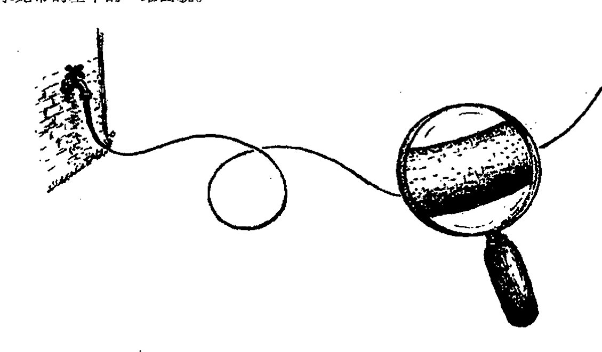
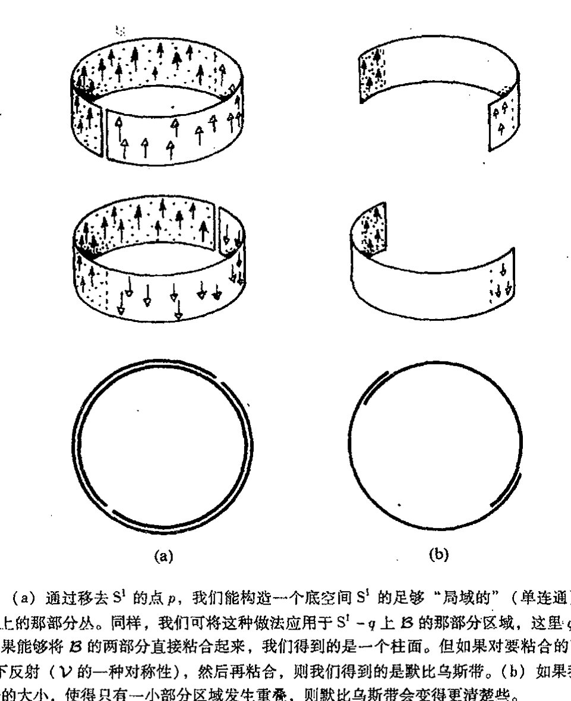
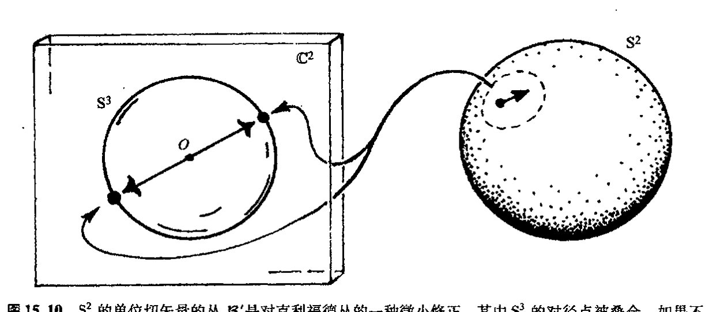
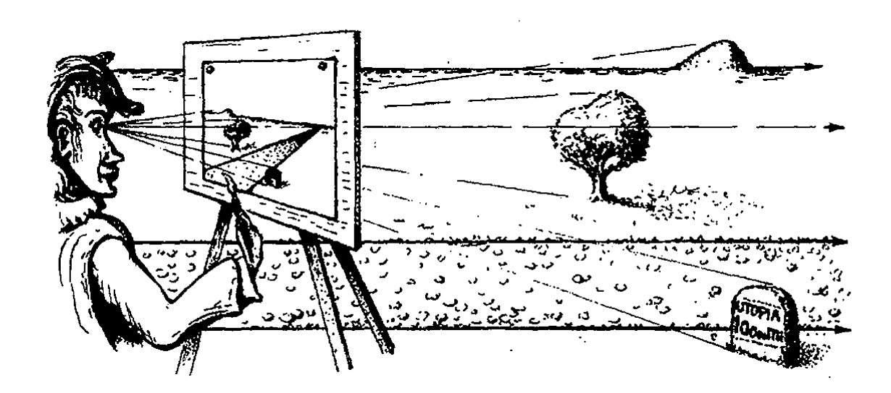
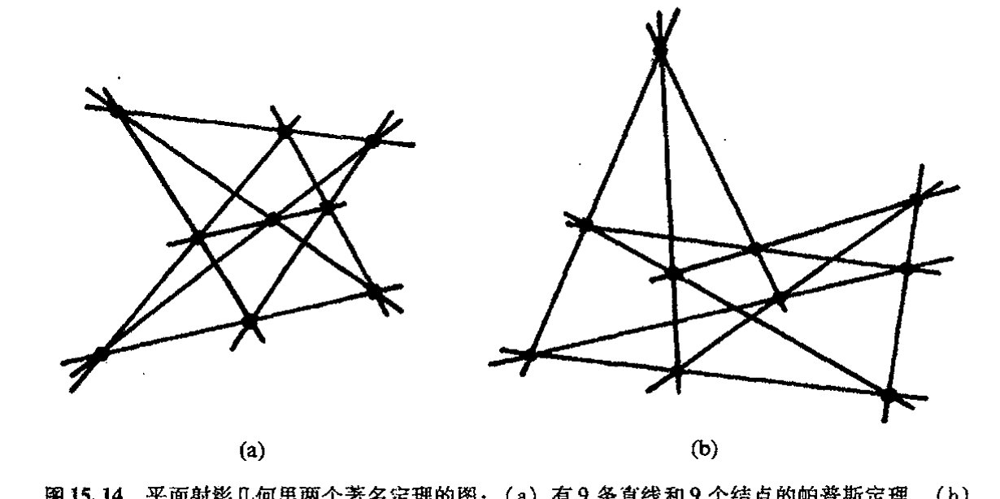
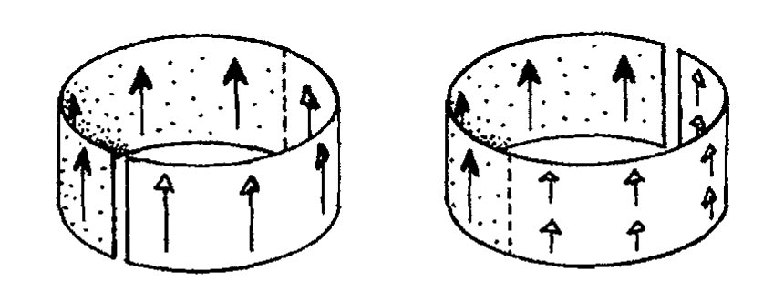
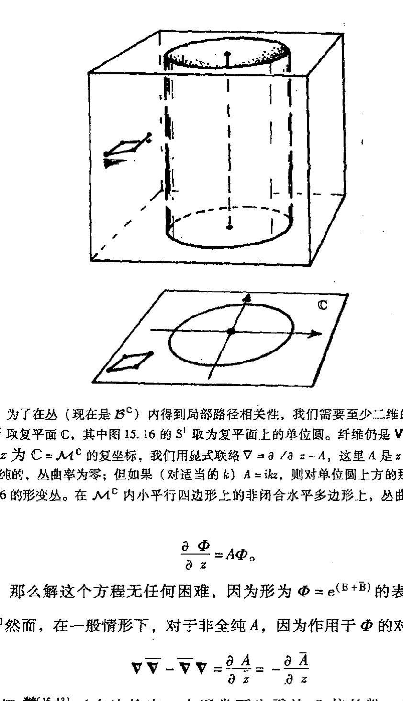
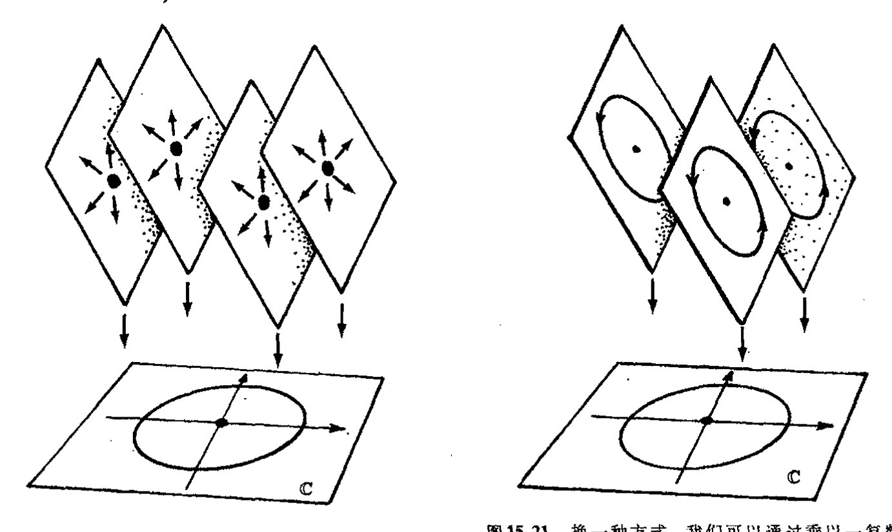

<!-- page 254 -->

第十五章 纤维丛和规范联络

# 第十五章
# 纤维丛和规范联络

## 15.1 纤维丛的物理背景

在第14、15章里引入的方法足以处理爱因斯坦的广义相对论和经典力学的相空间。然而，许多有关粒子相互作用的现代理论还有赖于[§14.3](chapter_14.md#143-协变导数)里引入的“联络”（或协变导数）这一特定概念的一般化。这里一般化指的是规范联络。基本说来，原始的协变导数概念是基于矢量沿流形 $\mathcal{M}$ 上曲线作平行移动（[§14.2](chapter_14.md#142-平行移动)）这一概念上的。有了矢量的平行移动概念，我们就可以唯一地将它扩展到任一张量的移动上（[§14.3](chapter_14.md#143-协变导数)）。这里，矢量和张量都是指 $\mathcal{M}$ 的各点上的切空间里的量（见[§12.3](chapter_12.md#123-标量矢量和余矢量)，[§14.1](chapter_14.md#141-流形上的微分)和[图12.6](assets/page179_fig01.jpg)）。但是规范联络指的却是物理上感兴趣的某些量的“平行移动”，我们最好把这些量看作是某种“空间”而不是 $\mathcal{M}$ 的某个点 $p$ 上的切空间，但在一定意义上，它仍然是“局域于点 $p$ 上”的。

为了把我们现在到底要的是什么这一点说得更透彻些，我们不妨回顾一下前面的内容。由[§12.3](chapter_12.md#123-标量矢量和余矢量)，8节可知，一旦有了矢量空间——这里指某一点的切矢量空间——我们就能够构造其对偶空间（余矢量空间）和所有 $\begin{bmatrix} p \\ q \end{bmatrix}$ 价张量空间。因此很显然，如果我们有 $p$ 点的切空间 $T_p$，那么 $\begin{bmatrix} p \\ q \end{bmatrix}$ 价张量空间（包括余切空间和作为 $\begin{bmatrix} 0 \\ 1 \end{bmatrix}$ 张量的余矢量）并“不是什么新东西”。（类似的叙述——至少在我看来——可以应用到 $p$ 点的旋量空间上；见[§11.3](chapter_11.md#113-四元数几何)。有些人试图对旋量采取不同的处理，这些观点不是我们这里要考虑的。）就处理粒子相互作用（而不是引力作用）的规范理论而言，所需的空间不同于上述空间（因此它们才真正是新的），我们不妨将它们看作是一种附加在普通时空上的“空间”维。这些额外的“空间”维经常被当作内部维；因此沿这种“内部方向”运动实际上并不能使我们离开我们所在的时空点。

我们需要用丛的概念来从几何上理解“内部维”。丛是一个非常精确的数学概念（我们将在[§15.2](#152-丛的数学思想)里予以研究）。早在物理学家认识它之前，在纯数学领域，人们就发现丛的概念很有用。¹

· 235 ·

<!-- page 255 -->

通向实在之路

后来物理学家们意识到，他们以前使用的一些重要概念其实都可以在丛的概念上来理解。这之后，理论物理学家对这一所需的数学概念变得非常熟悉，并将其纳入自己的理论中。在某些现代理论里，这些概念往往还以一种修正了的形式出现，相应的时空则被认为是获得了额外维。

在当代寻求基础物理的更基本框架（例如超引力或弦理论）的许多努力中，"时空"这一概念被扩展到更高的维数。于是"内部维"也成了额外的空间维。这些额外的空间维本质上具有与普通的时间和空间维相同的地位，"时空"因此获得了比标准的四维时空更多的维数。这种思想可追溯到1919年，当时卡鲁扎（Theodor Kaluza，1885~1954）和克莱因（Oskar Klein，1894~1977）对爱因斯坦的广义相对论进行了扩展，其中的时空维数由4维增至5维。这额外的1维使完美的麦克斯韦电磁理论被囊括进来成为某种意义上的"时空几何描述"。然而，这个"第五维"必须看成是"蜷曲的微小的圈"，因此我们无法像对普通空间维那样直接感知它。

对此人们常以水龙带作类比（见[图15.1](assets/page255_fig01.jpg)），它代表对卡鲁扎-克莱因型一维宇宙的修正。从大尺度上看，水龙带的确是1维的：就一个长度维。但当我们从更接近的地方来看，会发现水龙带的表面实际上是二维的，只是这额外的维在远小于水龙带长度的尺度上紧紧地蜷缩着。这可以直接类比解释为什么我们在五维卡鲁扎-克莱因整体"时空"上只能感知到四维物理时空。卡鲁扎-克莱因的五维时空是对水龙带的二维曲面的直接类比，其中我们实际感知的四维时空相当于水龙带的基本的一维面貌。

图15.1 水龙带模型。大尺度上看，它是一维的，但从小尺度上看，它具有二维表面。同样，按卡鲁扎—克莱因的概念，也存在通常尺度上无法观察到的"小的"额外的空间维。

从很多方面看，这都是一种有吸引力的思想，它的确富有创意。实际上，那些当代纯物理理论（如我们将在第31章遇到的超引力理论和弦理论）的倡导者们发现，他们不得不在比卡鲁扎-克莱因理论更高的维数上考虑问题（其中最流行的是总维数分别为26，11和10三种情形）。人们认识到，那些不同于电磁作用的各种相互作用，可以通过我们将要介绍的规范联络概念被

·236·

<!-- page 256 -->

第十五章 纤维丛和规范联络

包括进这些理论里。

然而，需要强调的是，卡鲁扎-克莱因思想仍属于猜测性的。我们并不认为有关粒子相互作用的现行规范理论所依据的这种“内部维”等同于普通的时空维，因此它们并非源自卡鲁扎-克莱因型理论。下述问题不啻为一种有趣的思索：从任何重要意义上说，将现行规范理论的“内部维”看作是最终来源于这种（卡鲁扎-克莱因型）“扩展时空”这么做是否理智？² 以后（[§31.4](chapter_31.md#314-高维时空)）我还会回到这个问题上来。

与将这些内部维看作是更高维时空的一部分不同，我们将其视为时空上的所谓纤维丛（或简称丛）可能更合适。这是一个在粒子相互作用的现代规范理论中占据中心位置的重要概念。我们想象一下，在时空的每个点的“上方”还有另一个称之为纤维的空间。根据前述的物理图像，这种纤维由所有内部维组成。但丛概念要比纤维有着更广泛的应用，因此我们最好不必拘泥于这种物理解释，至少眼下是这样。

## 15.2 丛的数学思想

丛（或纤维丛）$\mathcal{B}$ 是一个带有某种结构的流形，它由另两个流形 $\mathcal{M}$ 和 $\mathcal{V}$ 来定义，这里 $\mathcal{M}$ 称为底空间（在大多数物理应用中，它是时空本身），$\mathcal{V}$ 称为纤维（在大多数物理应用中，它是内部空间）。丛 $\mathcal{B}$ 本身可看作是完全由整个纤维族 $\mathcal{V}$ 组成的，实际上它是由“价值 $\mathcal{M}$ 的 $\mathcal{V}$”构成的——见图 15.2。最简单的丛是所谓的积空间。它是那种平凡的或是“非扭曲的”丛，而更有意思的是扭曲丛。一会儿我会给出这两种情形的例子。空间 $\mathcal{V}$ 也具有某种对称性，这一点很重要。因为正是有了这些提供扭曲自由的对称性才使得丛概念变得有意思。我们感兴趣的有关 $\mathcal{V}$ 的对称性的群 $\mathcal{G}$ 称为丛 $\mathcal{B}$ 的群。我们经常说 $\mathcal{B}$ 是 $\mathcal{M}$ 上的 $\mathcal{G}$ 丛。在很多情形下，我们将 $\mathcal{V}$ 看成是矢量空间，并称丛是矢量丛。因此群 $\mathcal{G}$ 是相应维度下的一般线性群或其子群（[§13.3](chapter_13.md#133-线性变换和矩阵), 6–10）。

我们不认为 $\mathcal{M}$ 是 $\mathcal{B}$ 的一部分（即 $\mathcal{M}$ 不在 $\mathcal{B}$ 内），而是将 $\mathcal{B}$ 看作是与 $\mathcal{M}$ 分离的空间，某种意义上说，我们更倾向于认为 $\mathcal{B}$ 是立于底空间 $\mathcal{M}$ 之“上”的。在丛 $\mathcal{B}$ 内，有许多纤维 $\mathcal{V}$ 的拷贝，在 $\mathcal{M}$ 的每一点的上方都立着一个完整的 $\mathcal{V}$ 拷贝。纤维的各个拷贝之间是不相连的（即无二者相交），它们的全体构成整个丛 $\mathcal{B}$。与 $\mathcal{B}$ 相关联的 $\mathcal{M}$ 可看作是从 $\mathcal{B}$ 除以纤维族 $\mathcal{V}$ 的商空间。就是说，$\mathcal{M}$ 的每一点精确对应于一个单独的 $\mathcal{V}$ 拷贝。从 $\mathcal{B}$ 到 $\mathcal{M}$ 存在连续映射，它称为 $\mathcal{B}$ 到 $\mathcal{M}$ 的规范投影，并将每根完整的纤维 $\mathcal{V}$ 投影到 $\mathcal{M}$ 上该纤维立于其上的那个特定的点。（见图 15.2。）

$\mathcal{M}$ 与 $\mathcal{V}$ 的积空间（$\mathcal{M}$ 上 $\mathcal{V}$ 的平凡丛）记作 $\mathcal{M} \times \mathcal{V}$。$M \times \mathcal{V}$ 的点是元素对$(a, b)$，其中 $a$ 属于 $\mathcal{M}$，$b$ 属于 $\mathcal{V}$，见[图 15.3](assets/page660_fig01.jpg)（a）。（在 [§13.2](chapter_13.md#132-子群和单群) 里我们已经看到过同样的思想应用于

<!-- page 257 -->

通向实在之路

---

[图15.2：具有底空间 $\mathcal{M}$ 和纤维 $\mathcal{V}$ 的丛 $\mathcal{B}$ 的示意图，显示纤维 $\mathcal{V}$ 在底空间 $\mathcal{M}$ 上的投影]

**图15.2** 具有底空间 $\mathcal{M}$ 和纤维 $\mathcal{V}$ 的丛 $\mathcal{B}$ 可看作是由"价值 $\mathcal{M}$ 的 $\mathcal{V}$"构成的。从 $\mathcal{B}$ 到 $\mathcal{M}$ 的规范投影可看作是每根纤维 $\mathcal{V}$ 坍缩到一个单点。

群。）³ $\mathcal{M}$ 上更为一般的"扭曲"丛 $\mathcal{B}$ 局部上类似于 $\mathcal{M} \times \mathcal{V}$，这是在下述意义上说的：$\mathcal{B}$ 在 $\mathcal{M}$ 的任意小开区域里的那部分在结构上与 $\mathcal{M} \times \mathcal{V}$ 在 $\mathcal{M}$ 的同样开区域里的那部分等同，见[图15.3](assets/page660_fig01.jpg)（b）。但是，当我们在 $\mathcal{M}$ 内移动时，上述纤维会扭曲，结果整体上看 $\mathcal{B}$ 并不等同于（往往是拓扑上不同于）$\mathcal{M} \times \mathcal{V}$。$\mathcal{B}$ 的维数总是 $\mathcal{M}$ 和 $\mathcal{V}$ 的维数之和，而与扭曲无关。*[15.1]

---

[图15.3：两个子图，(a) 显示积空间 $\mathcal{M} \times \mathcal{V}$ 的网格结构，标记点 $(a,b)$；(b) 显示扭曲丛 $\mathcal{B}$ 在底空间 $\mathcal{M}$ 上的投影，显示纤维的扭曲]

**图15.3** （a）作为"平凡"丛的特例的 $\mathcal{M}$ 与 $\mathcal{V}$ 的积空间 $\mathcal{M} \times \mathcal{V}$。它的点可理解为 $\mathcal{M}$ 里的 $a$ 和 $\mathcal{V}$ 里的 $b$ 构成的元素对 $(a,b)$。（b）$\mathcal{M}$ 上带纤维 $\mathcal{V}$ 的"扭曲"丛 $\mathcal{B}$ 局部类似于 $\mathcal{M} \times \mathcal{V}$——即 $\mathcal{B}$ 在 $\mathcal{M}$ 的任意小开区域里的那部分与 $\mathcal{M} \times \mathcal{V}$ 在同一个 $\mathcal{M}$ 开区域里的那部分等同。但纤维扭曲了，因此 $\mathcal{B}$ 整体上不等同于 $\mathcal{M} \times \mathcal{V}$。

所有这些很容易让人糊涂，因此，为使大家对丛像什么样儿这一点有个正确印象，我来举个例子。首先，将空间 $\mathcal{M}$ 取为圆 $\mathbf{S}^1$，将纤维 $\mathcal{V}$ 取为一维矢量空间（拓扑上我们可在将其描述为一根带有原点 $0$ 的实线 $\mathbb{R}$）。这种丛称为 $\mathbf{S}^1$ 上的（实）线丛。现在，$\mathcal{M} \times \mathcal{V}$ 是一个二维圆柱

---

*[15.1] 解释为什么 $\mathcal{M} \times \mathcal{V}$ 的维是 $\mathcal{M}$ 的维和 $\mathcal{V}$ 的维的和。

??? question "答案 [15.1]"
    积空间 $\mathcal{M}\times\mathcal{V}$ 的点是元素对 $(a,b)$，其中 $a\in\mathcal{M}$，$b\in\mathcal{V}$。要唯一确定这样一个点，需先给出 $a$ 在 $\mathcal{M}$ 中的局部坐标（共 $\dim\mathcal{M}$ 个），再给出 $b$ 在 $\mathcal{V}$ 中的局部坐标（共 $\dim\mathcal{V}$ 个）。

    这两组坐标彼此独立，合起来构成 $\mathcal{M}\times\mathcal{V}$ 的一个局部坐标系，其个数即维数为 $\dim\mathcal{M}+\dim\mathcal{V}$。由于丛 $\mathcal{B}$ 局部上与 $\mathcal{M}\times\mathcal{V}$ 等同，扭曲只改变整体的粘合方式而不改变局部维数，故也有 $\dim\mathcal{B}=\dim\mathcal{M}+\dim\mathcal{V}$。

· 238 ·

<!-- page 258 -->

第十五章 纤维丛和规范联络

面，见[图 15.4](assets/page258_fig01.jpg)（a）。那么如何来构造 $\mathcal{M}$ 上带纤维 $\mathcal{V}$ 的扭曲丛 $\mathcal{B}$ 呢？我们可以取默比乌斯带来考察，见[图 15.4](assets/page258_fig01.jpg)（b）（和[图 12.15](assets/page188_fig01.jpg)）。我们来看看为什么说它是一个丛——"局部"等同于圆柱

图 15.4 为了弄明白这种扭曲是如何出现的，我们来考虑取 $\mathcal{M}$ 为圆 $S^1$，纤维 $\mathcal{V}$ 取一维矢量空间（即仅有原点 0 别无它值（如恒等元 1）的 $\mathbb{R}$ 的模型空间）的情形。（a）平凡情形 $\mathcal{M}\times\mathcal{V}$，这里是普通的二维柱面；（b）扭曲情形，我们得到（如图 12.15 那样的）默比乌斯带。

面。我们可以从 $S^1$ 上移去点 $p$ 来产生底空间 $S^1$ 上一个足够"局域"的区域。这么做破坏了底圆，使之成了单连通的^4^ 线段^5 $S^1-p$，$\mathcal{B}$ 在这一线段上方的部分与 $S^1-p$ 上方立着的圆柱面部分完全相同。只有在我们对整个 $S^1$ 的上方进行检查的时候，默比乌斯丛 $\mathcal{B}$ 与圆柱面的差别才会显现出来。我们可以把 $S^1$ 想像成两个拼块 $S^1-p$ 和 $S^1-q$ 拼接成的结果，这里 $p$ 和 $q$ 是 $S^1$ 上不同的两点。然后，我们可以用两个相应的拼块拼出整个 $\mathcal{B}$，其中每个拼块都是 $S^1$ 的单个拼块上的平凡丛。正是在这两个平凡丛拼块的"粘合"过程中才出现柱面丛的"扭曲"（[图 15.5](assets/page259_fig01.jpg)）。事情已经非常清楚，出现的将是带有简单扭曲的默比乌斯带。如果我们像[图 15.5](assets/page259_fig01.jpg)（b）那样减小 $S^1$ 的拼块的尺寸，不会对 $\mathcal{B}$ 的结构产生任何影响。

认识到如下事实很重要：这种扭曲是由纤维 $\mathcal{V}$ 的特定对称性引起的，即由使一维矢量空间的元素发生符号反向的那种对称性所引起。（就是说，对 $\mathcal{V}$ 中每个 $\mathbf{v}$，有 $\mathbf{v}\mapsto-\mathbf{v}$。）这种运算保留了 $\mathcal{V}$ 的矢量空间结构。应当指出，这一运算并不是一种实数域 $\mathbb{R}$ 上实际的对称运算。$\mathbb{R}$ 本身不具有任何对称性。（例如，数字 1 肯定不同于 $-1$，$x\mapsto-x$ 不是 $\mathbb{R}$ 上的对称运算，它无法保持 $\mathbb{R}$ 的乘法结构不变。$^{*[15.2]}$）正是基于这个原因，我们才将 $\mathcal{V}$ 取为一维实矢量空间而不只是实线 $\mathbb{R}$ 本身。有时我们说 $\mathcal{V}$ 是对实线的模仿。不久我们还将看到其他纤维对称性是如何造成另一些扭曲的。

---

$^{*[15.2]}$ 解释这一点。

· 239 ·

<!-- page 259 -->

通向实在之路

(a)
(b)

**图 15.5** （a）通过移去 S¹ 的点 p，我们能构造一个底空间 S¹ 的足够“局域的”（单连通）区域，即在 S¹−p 上的那部分丛。同样，我们可将这种做法应用于 S¹−q 上 ℬ 的那部分区域，这里 q 是 S¹ 的另一点。如果能够将 ℬ 的两部分直接粘合起来，我们得到的是一个柱面。但如果对要粘合的两部分之一先作上/下反射（𝒱 的一种对称性），然后再粘合，则我们得到的是默比乌斯带。（b）如果我们减小 S¹ 的两部分的大小，使得只有一小部分区域发生重叠，则默比乌斯带会变得更清楚些。

## 15.3　丛的截面

一种能够刻画圆柱面与默比乌斯丛之间差别的方法是根据所谓丛的截面。几何上，我们把 ℳ 上丛 ℬ 的截面看作是 ℳ 在 ℬ 内连续的像，它与每根单个的纤维交于一点（见[图 15.6](assets/page260_fig01.jpg)(a)），并称其为底空间 ℳ 到丛的“提升”。注意，如果我们用映射将 ℳ 提升到 ℬ 的截面，然后再进行规范投影，我们恰好得到 ℳ 到自身的恒等映射（即是说，ℳ 的每一点都正好被映射回自身）。

对于平凡丛 ℳ×𝒱，它的截面可以简单理解为底空间 ℳ 上的在空间 𝒱 取值的连续函数（即它们是 ℳ 到 𝒱 的连续映射）。因此，ℳ×𝒱 的截面⁶ 以连续方式将 𝒱 的每一点赋给 ℳ 的每一点。这一普通概念可表现为如[图 15.6](assets/page260_fig01.jpg)（b）所展示的函数图。更一般地，扭曲丛 ℬ 的任一截面定义了一个“扭曲函数”概念，它比普通的函数概念更一般。

我们回到前述 [§15.2](#152-丛的数学思想) 里的特例上来。对柱面情形（积丛 ℳ×𝒱），截面可以简单地表示为环绕柱面一圈的曲线，它与每根纤维只相交一次（[图 15.7](assets/page260_fig02.jpg)(a)）。由于这个丛正好是积空间，所以我

·240·

<!-- page 260 -->

第十五章 纤维丛和规范联络

---

**图15.6** （a）丛 $\mathcal{B}$ 的截面是 $\mathcal{M}$ 在 $\mathcal{B}$ 内连续的像，它与每根单个的纤维交于一点。（b）截面可看作是对普通函数图概念的一般化。

们可连贯地将每根纤维看作是实线的一个拷贝，在每根纤维上，坐标值 0 标出的是带"记号点"的零截面，它代表矢量空间 $\mathcal{V}$ 的零。一般截面给出的是圆上的一个实值函数（零截面之上的"高度"即圆的每一点上的函数值）。显然，存在许多不与零截面相交的截面（$S^1$ 上的非零函数）。例如，我们可取平行于零截面但不与之重合的柱面截面。它表示的是圆上的常值非零函数。

---

**图15.7** （a）$S^1$ 上的线丛的截面是一个只绕行一周的环，它与每根纤维仅相交一次。（b）默比乌斯丛：每个截面都与零截面相交。

然而，当我们考虑默比乌斯丛 $\mathcal{B}$ 时，会发现情况非常不同。读者不难发现，现在 $\mathcal{B}$ 的每个截面必与零截面相交（[图 15.7](assets/page260_fig02.jpg)（b））。（零截面的概念仍可用，因为 $\mathcal{V}$ 是一个带零"标识"的矢量空间。）与前例的这种定性的差异清楚地说明，拓扑上 $\mathcal{B}$ 一定不同于 $\mathcal{M} \times \mathcal{V}$。说得更具体点儿，我们可以像以前一样开始将实数坐标赋给不同的纤维 $\mathcal{V}$，但必须采取一种约定，即在圆的某个点上使正负号"反向"（$x \mapsto -x$），这样，当我们沿着圆依次考察时，除了变号位置点之外，$\mathcal{B}$ 的截面与圆上实值函数的对应关系是处处连续的。任何这种截面必在某处取值为零。***[15.3]

在这个例子中，截面族的性质足以将默比乌斯丛和柱面区别开来。截面族的检验经常导致产生一种有用的方法，用以对相同底空间 $\mathcal{M}$ 上各种不同的丛进行区分。然而，与丛的其他情形

---

***[15.3] 用上述给定的两拼块的 $\mathcal{B}$ 结构说明这段论证。

??? question "答案 [15.3]"
    把 $S^1$ 分成两个拼块 $S^1-p$ 与 $S^1-q$，每个拼块上的 $\mathcal{B}$ 都是平凡丛，可用实坐标把截面写成该拼块上的实值函数。两拼块的重叠区有两段。在默比乌斯丛中，粘合时必须在其中一段重叠上对纤维坐标作反向 $x\mapsto -x$，另一段则保持不变。

    于是当我们沿 $S^1$ 绕行一周回到出发点时，所携带的实值随之改变了符号：起点取正值的截面，绕回来时表现为负值。这个实值函数沿圆连续变化却首尾异号，由介值定理它必在中途某处穿过零。因此默比乌斯丛 $\mathcal{B}$ 的每个截面都必与零截面相交，这与平凡的圆柱面截然不同。

· 241 ·

<!-- page 261 -->

通向实在之路

相比，在默比乌斯丛和积空间（圆柱面）之间进行的区分并不算极端。有时丛根本就没有截面！下面我们来考虑一种特别重要的著名例子。

## 15.4　克利福德丛

334

这个例子我们得认真对待！底空间 $\mathcal{M}$ 取二维球面 $\mathrm{S}^2$，这样，丛流形 $\mathcal{B}$ 是三维球面 $\mathrm{S}^3$，纤维 $\mathcal{V}$ 是圆 $\mathrm{S}^1$（"一维球面"）。这就是通常所说的 $\mathrm{S}^3$ 的霍普夫纤维化，一种由海因茨·霍普夫（Heinz Hopf，1894～1971）指出的拓扑结构（1931）。但霍普夫的做法显然是基于（适当参考了）更早的克利福德提出的"克利福德平行线"的几何构造（见第11章）。我将这种几何纤维化了的 $\mathrm{S}^3$ 称为克利福德丛。

获得克利福德丛的一种极富启发性的方法是先考虑复数对 $(w,z)$ 的空间 $\mathbb{C}^2$。（简单地说，这里 $\mathbb{C}^2$ 的有关结构就是一个二维复矢量空间，见[§12.9](chapter_12.md#129-复流形)。）丛空间 $\mathcal{B}$（$=\mathrm{S}^3$）可看作是位于 $\mathbb{C}^2$ 内的单位三维球面 $\mathrm{S}^3$，它由如下方程（见[§10.1](chapter_10.md#101-复维和实维-179)节末）定义：

$$|w|^2+|z|^2=1。$$

它表示实方程 $u^2+v^2+x^2+y^2=1$，这是一个三维球面的方程，其中 $w=u+iv$ 和 $z=x+iy$ 分别是 $w$ 和 $z$ 按各自的实部和虚部的表示。（这是对欧几里得三维空间里笛卡儿坐标系 $x,y,z$ 下的普通二维球面方程 $x^2+y^2+z^2=1$ 的直接类比。）

为了进行纤维化，我们来考虑过原点的复直线（即 $\mathbb{C}^2$ 的一维复矢量子空间）。每一根这样的直线都由如下形式的方程给出：

$$Aw+Bz=0,$$

335

这里 $A$ 和 $B$ 是复数（不全为零）。作为一维复矢量空间，这根直线是复平面的一个拷贝，它交 $\mathrm{S}^3$ 于圆 $\mathrm{S}^1$ 内，我们可将这个圆看成是它所在平面上的单位圆（图15.8）。这些圆都是纤维 $\mathcal{V}=\mathrm{S}^1$。不同的线只在原点相交，没有两个圆 $\mathrm{S}^1$ 会有共同点。因此，这族 $\mathrm{S}^1$ 的确构成作为 $\mathrm{S}^3$ 的丛结构的纤维。

底空间 $\mathcal{M}$ 是什么呢？显然，如果我们令 $A$ 和 $B$ 乘以同一个非零复数，我们得到的是同一条直线 $Aw+Bz=0$，因此只有比值 $A:B$ 能够区分不同的直线。不论 $A$ 还是 $B$ 都可以为零，但二者不能同时为零。这种比值下的空间就是[§8.3](chapter_08.md#83-黎曼球面)里较详尽地描述过的黎曼球面。因此，我们将这里的丛的底空间 $\mathcal{M}$ 等同于黎曼球面 $\mathrm{S}^2$。由此可见，$\mathrm{S}^3$ 可以看作是 $\mathrm{S}^2$ 上的 $\mathrm{S}^1$ 丛。（如果要求丛、底空间和纤维全都是球面，一般来说我们不能期望在其他维度上也能得到这样的关系。但可以证明，当我们用四元数取代上述讨论中的复数 $w$ 和 $z$ 后，就可将 $\mathrm{S}^7$ 看作是 $\mathrm{S}^4$ 上的 $\mathrm{S}^3$ 丛；***[15.4]类

---

***[15.4] 对此予以论证。你能看清在 $\mathrm{S}^{15}$ 情形下是如何做的吗？

· 242 ·

<!-- page 262 -->

第十五章 纤维丛和规范联络

[图：克利福德丛示意图，展示C²空间中的S³球面、纤维S¹、方程Aw+Bz=0以及比值A:B的黎曼球面S²]

**图15.8** 克利福德丛。取坐标为 $(w,z)$ 的空间 $\mathbb{C}^2$，它包含由 $|w|^2+|z|^2=1$ 给定的三维球面 $\mathcal{B}=S^3$。每根纤维 $\mathcal{V}=S^1$ 都是过原点的复直线 $Aw+Bz=0$（$\mathbb{C}^2$ 的一维复矢量子空间）内的由比值 $A:B$ 确定的单位圆。这种比值的黎曼球面 $S^2$ 是底空间 $\mathcal{B}$。

似地，将 $w$ 和 $z$ 替换为八元数（见[§11.2](chapter_11.md#112-四元数的物理角色)和[§16.2](chapter_16.md#162-物理上需要的是有限还是无限几何)），则 $S^{15}$ 可视为 $S^8$ 上的 $S^7$ 丛；但这种做法在其他更高维球面上行不通。⁷）

$S^3$ 内的这族圆称作克利福德平行线，是一族特别有意思的圆。这些都是大圆，它们互相缠绕，却始终保持相同的间距（这就是它们为什么会被认为是"平行的"原因）。任意两个圆相连，故它们都是斜的（不共球面）。在欧几里得三维空间里，斜直线（不共面）有如下性质：随着直线趋向无穷远，它们之间的距离也越来越大。而三维球面具有正曲率，因此作为 $S^3$ 内测地线的克利福德圆有一种补偿趋向，使得彼此间按[§14.5](chapter_14.md#145-测地线平行四边形和曲率)所述的测地线偏转效应而弯向对方（见[图14.12](assets/page242_fig02.jpg)）。这两种效应在克利福德平行线情形下精确地相互补偿，如图15.9。为了得到克利福德平行线族的图像，我们采用完全类似于[§8.3](chapter_08.md#83-黎曼球面)里研究黎曼球面时将 $S^2$ 球面投影到欧几里得平面的做法（见[图8.7](assets/page119_fig02.jpg)），从"南极"立体地将 $S^3$ 投影到作为赤道面的欧几里得三维空间，正如通过 $S^2$ 的球面投影，$S^3$ 上的圆映射为欧几里得三维空间里的圆。见[图33.15](assets/page719_fig01.jpg)所示的投影产生的克利福德圆族的图像。这种构形对扭量理论具有潜在的重要意义，⁸相关的几何将在[§33.6](chapter_33.md#336-作为无质量自旋粒子的扭量的几何)描述。

[图：(a) 两条斜直线，间距逐渐增大；(b) 两条弯曲的平行线，彼此靠拢]

(a) (b)

**图15.9** (a) 在欧几里得三维空间内，斜直线之间距离渐行渐远。(b) 在 $S^3$ 上，正曲率为弯曲的测地线（大圆）提供了一种补偿趋势，使它们（借助于测地线偏转，见图14.12）彼此靠拢。在克利福德平行线情形下，这种补偿相当精确。

·243·

<!-- page 263 -->

通向实在之路

依据上述事实可以断言，这种特殊的（克利福德）丛可能是一种根本不具有截面的丛。我们怎么来理解这一点呢？首先应当指出，克利福德丛的“扭曲”是因为存在如下事实：圆纤维有一种由圆的旋转给定的严格对称性（群 $O(2)$，或等价的 $U(1)$，见练习 $[13.59]$）。我们无法使每一根这种纤维等同为某个特定的圆，譬如复平面 $\mathbb{C}$ 的单位圆。如果我们做得到这一点，那么我们就可以顺理成章地在这个圆上选取某个特定的点（例如 $\mathbb{C}$ 的单位圆上的点 $1$），然后由此得到克利福德丛的截面。之所以会出现不存在截面这种情形，是因为克利福德圆只是 $\mathbb{C}$ 的单位圆上的模型，而不与之等同。

当然，这一事实本身并没有告诉我们为什么克利福德丛没有连续截面。为了弄清楚这一点，我们换一种方式来考察克利福德丛或许会有帮助。事实上，球面 $S^3$ 的每一点都可以看作是 $S^2$ 的某一点上单位长度的“自旋性”切矢量。***[15.5] 由 [§11.3](chapter_11.md#113-四元数几何) 可知，自旋体有这么一种性质：当完全转过 $2\pi$ 时，它会变到其初态的相反状态。根据这一陈述，丛 $\mathcal{B}$（$=S^3$）的截面表示的应是 $\mathcal{M}$ 上的一个连续的自旋性单位矢量场（$=S^2$）。而众所周知，拓扑上不存在 $S^2$ 上整体连续的普通单位切矢量场。使这些方向发生“自旋”显然无助于问题的解决，故整体连续的单位自旋性切矢量场也不可能存在。由此知，丛 $\mathcal{B}$（$=S^3$）没有截面。

这个问题值得作进一步讨论，因为从这个例子中我们可获取更多的东西。首先，对上述克利福德丛稍作调整，我们能得到 $S^2$ 的单位切矢量的实际丛 $\mathcal{B}'$。由于任何普通的单位切矢量只有两种自旋体的表现形式（一种是另一种的“负”态），如果我们打算从旋量矢量过渡到普通矢量，我们就必须叠合这二者。对克利福德丛 $\mathcal{B}$（$=S^3$）而言，这就意味着 $S^3$ 的两个点必须叠合起来以给出 $S^2$ 的单位矢量的丛 $\mathcal{B}'$ 的一个单点$^9$。$S^3$ 的这对必须叠合起来的点是这个三维球面上的对径点。见[图 15.10](assets/page264_fig01.jpg)。$\mathcal{B}'$ 的纤维仍是圆。$\mathcal{B}$（$=S^3$）的每根圆纤维恰好在 $\mathcal{B}'$ 的每根圆纤维上“缠绕两圈”。现在 $\mathcal{B}'$ 的每个点表示的是 $S^2$ 的有单位切矢量的一个点。事实上，空间 $\mathcal{B}'$ 与我们在 [§12.1](chapter_12.md#121-为什么要研究高维流形) 里遇到的空间 $\mathbb{R}$ 在拓扑上是等同的，后者表示三维欧几里得空间里的物体（如 [§11.3](chapter_11.md#113-四元数几何) 里所考虑的书）的不同空间取向。如果我们把“物体”想象成在每个点上都标有箭头（单位切矢量）的球面 $S^2$，这一点就会变得清楚。这个箭头使球面的空间取向完全确定下来。

## 15.5 复矢量丛，（余）切丛

将克利福德丛（以及 $\mathcal{B}'$ 的）背后的概念稍加扩展，我们可得到复矢量丛的一个好范例，这就是我称之为 $\mathcal{B}^\mathbb{C}$（或 $\mathcal{B}'^\mathbb{C}$）的情形。每一条直线 $Aw+Bz=0$ 本身都是一个一维复矢量空间。（整个直线由一个矢量 $(w,z)$ 与复数 $\lambda$ 的乘积族组成，这里 $(w,z)$ 倍乘为 $(\lambda w,\lambda z)$。）现在我们将这个一维复矢量空间看作是纤维 $\mathcal{V}$。黎曼球面 $S^2$ 同前一样是底空间。

---

*** $[15.5]$ 证明这一点。提示：取切矢量为 $u\partial/\partial v-v\partial/\partial u+x\partial/\partial y-y\partial/\partial x$。

??? question "答案 [15.5]"
    球面 $S^3$ 可看作单位四元数。Hopf 映射把单位四元数 $q$ 送到 $q\mathbf{i}q^{-1}$ 所确定的 $S^2$ 上一点；固定底点时，纤维是右乘相位因子得到的圆。题中给出的切矢量正是沿这条纤维的无穷小生成元。

    对标准单位半径度量，Hopf 映射在水平切向量上把长度放大 $2$ 倍；若把底面 $S^2$ 取半径 $1/2$ 的 Fubini--Study 度量，则它才成为黎曼子浸没。无论采用哪种归一化，$q$ 与 $-q$ 给出同一普通方向但相差一个自旋符号，所以 $S^3$ 的点可解释为 $S^2$ 上单位长度的自旋性切矢量。

· 244 ·

<!-- page 264 -->

第十五章 纤维丛和规范联络

**图 15.10** S² 的单位切矢量的丛 $\mathcal{B}'$ 是对克利福德丛的一种微小修正，其中 S³ 的对径点被叠合。如果不做这种叠合，我们得到的 S³ 即为 S² 的自旋性切矢量的（克利福德）丛 $\mathcal{B}$。$\mathcal{B}'$ 的纤维仍是圆的，但 $\mathcal{B}$（=S³）的每根圆纤维在 $\mathcal{B}'$ 的每根圆纤维上缠绕两圈。

为了得到正确的复矢量丛 $\mathcal{B}^\mathbb{C}$，我们还需要做下一步事情。在 $\mathbb{C}^2$ 内，不同的纤维是彼此不相连的，所有纤维有一个共同的原点 $(0, 0)$。因此，为了得到 $\mathcal{B}^\mathbb{C}$，我们必须用整个黎曼球面（$\mathbb{CP}^1$，见 [§15.6](#156-射影空间)）取代原点来改造 $\mathbb{C}^2$，这样，我们得到的不仅是一个零，而是整个黎曼球面的零值，每个零对应一根纤维，给出丛的零截面（见[图 15.11](assets/page264_fig02.jpg)）。这个过程就是所谓的 $\mathbb{C}^2$ 原点的拉开（代数几何学、复流形理论、弦理论、扭量理论和其他许多领域中的一个很重要的概念）。由

**图 15.11** 通过取整条线 $Aw + Bz = 0$（复平面）而不只是单位圆，我们得到复线丛 $\mathcal{B}^\mathbb{C}$ 的一个例子，现在纤维 $\mathcal{V}$ 是一个一维矢量空间。黎曼球面 $S^2 = \mathbb{CP}^1$（也是复流形，见 [§8.3](chapter_08.md#83-黎曼球面)，[§15.6](#156-射影空间)）仍是底空间 $\mathcal{M}$。但为使不同的纤维不相连，我们必须“拉开”原点 $(0, 0)$，代之以整个黎曼球面，由此得到黎曼球面的零值。

· 245 ·

<!-- page 265 -->

通向实在之路

于我们现在容许纤维上出现零，故存在 $\mathcal{B}$ 的连续截面。这些截面表示 $S^2$ 的旋量场。$S^2$ 的点上的一个"旋量"不是仅仅被刻画为 $S^2$ 的点上的一个"自旋性单位切矢量"，而是可以按正实数"比例增减"或变为零的矢量。可以证明，$S^2$ 的点上的这样一个"旋量"有可能为我们提供一种复二维矢量空间。*[15.6]

整个丛 $\mathcal{B}^\mathbb{C}$ 是一种复（即全纯的）结构——事实上，它称为复线丛，因为纤维都是一维复直线。由于这种结构完全是建立在全纯概念上的，因此是一种全纯体。**[15.7] 特别是，它的底空间是一复曲线——黎曼球面（见 [§8.3](chapter_08.md#83-黎曼球面)）——纤维是一维复矢量空间。相应地，还存在另一种与此相关的截面概念，即所谓全纯截面。全纯截面是这样一种复丛截面，它本身就是丛的一个复子流形（这仅意味着它由全纯方程局域给定）。有时，在复线丛情形下，这样一种截面是指一个底空间上的扭曲全纯函数。这些在纯数学和数学物理的许多领域都非常重要。¹¹它们在纽量理论（见 [§33.8](chapter_33.md#338-无质量场的扭量描述)）中也扮演着特殊角色。全纯截面构成一个严格可控且重要的截面族。在 $\mathcal{B}^\mathbb{C}$ 情形下，不存在异于零截面的（整体）全纯截面（即它处处为零）。

对这种结构作些许调整之后（相当于 $\mathcal{B}$ 到 $\mathcal{B}'$ 的变换），我们得到的是 $S^2$ 上的矢量场而不是旋量场。适当的丛 $\mathcal{B}'^\mathbb{C}$ 一样可以理解为一个复矢量丛——事实上它是所谓的矢量丛 $\mathcal{B}^\mathbb{C}$ 的平方。它完全按 $\mathcal{B}^\mathbb{C}$ 的方式构造，只有一点例外：我们现在是将每一点 $(w,z)$ 与其"对径"点 $(-w,-z)$ 叠合，$(w,z)$ 与复数 $\lambda$ 的乘积现在是 $(\lambda^{1/2}w, \lambda^{1/2}z)$ 而不是 $(\lambda w, \lambda z)$。

结束这一节之前，我要指出，丛 $\mathcal{B}'^\mathbb{C}$ 可以依据实际需要作其他解释，如 $S^2$ 的所谓切丛 $T(S^2)$。一般流形 $\mathcal{M}$ 的切丛 $T(\mathcal{M})$ 是这样一种空间，它的每一点表示 $\mathcal{M}$ 的一点以及这点上 $\mathcal{M}$ 的切矢量。见[图 15.12](assets/page266_fig01.jpg)（a）。***[15.8] $T(\mathcal{M})$ 的截面表示 $\mathcal{M}$ 上的一个矢量场。物理上更为重要的或许是流形 $\mathcal{M}$ 上的余切丛 $T^*(\mathcal{M})$ 概念，$T^*(\mathcal{M})$ 的每一点表示 $M$ 的一点以及这点上的余矢量（[图 15.12](assets/page266_fig01.jpg)（b））。在第 20 章，我们将探讨这些概念的某些重要方面。$T^*(\mathcal{M})$ 的截面表示 $\mathcal{M}$ 的一个余矢量场。可以证明，余切丛总是辛流形（见 §14.9，[§20.2](chapter_20.md#202-更为对称的哈密顿图像), 4），这一事实对经典力学相当重要。我们还可以相应地定义不同的张量丛，张量场可以看作是这种丛的截面。

## 15.6　射影空间

与一般矢量空间相关的另一个重要概念是射影空间的概念。矢量空间本身"几乎"就是射影空间上的一个丛。如果我们去掉矢量空间的原点，那么我们就切实得到射影空间上的丛，纤维就是去了原点的一条线。另一种做法是，就像 [§15.5](#155-复矢量丛余切丛) 给出的特例 $\mathcal{B}^\mathbb{C}$ 那样，我们可以"拉开"

---

*[15.6] 为什么每个这种旋量场可以在 $S^2$ 的至少一点上取值为零？

??? question "答案 [15.6]"
    设某旋量场处处不为零。则可在每一点按正实数把它归一化为单位长度，得到 $S^2$ 上处处非零的连续单位"自旋性"切矢量场；忽略其自旋符号后，即得到 $S^2$ 上处处非零的连续单位（普通）切矢量场。

    但 $S^2$ 的欧拉示性数为 $\chi(S^2)=2\neq 0$，由 Poincaré--Hopf 定理（"毛球定理"）可知 $S^2$ 上不存在处处非零的连续切矢量场，矛盾。让方向"自旋"也无济于事。故每个这种旋量场必在 $S^2$ 的至少一点上取值为零。

**[15.7] 详细解释这一点。

??? question "答案 [15.7]"
    丛 $\mathcal{B}^\mathbb{C}$ 之所以是"全纯的"（即复结构），是因为它的全部构造数据都是全纯的，不涉及取复共轭。底空间是比值 $A:B$ 的黎曼球面 $\mathbb{CP}^1$，这是一维复流形，它的两个坐标拼块之间由全纯过渡函数 $\zeta\mapsto 1/\zeta$ 相连。

    每根纤维是过原点的复直线 $Aw+Bz=0$，本身是一维复矢量空间，纤维上的标度作用是乘以复数 $\lambda$。当底点在 $\mathbb{CP}^1$ 上移动时，这些复直线随之以全纯方式变化，粘合函数取值于 $\mathbb{C}^*=GL(1,\mathbb{C})$ 且全纯。因此整个 $\mathcal{B}^\mathbb{C}$ 是一个复流形，规范投影是全纯映射，于是它构成一个全纯（复）线丛，其上可以谈论全纯截面。

***[15.8] 证明：被看作是 $S^2$ 上实丛的 $\mathcal{B}'^\mathbb{C}$ 的确与 $T(S^2)$ 相同。提示：重新检查练习 [15.5]。

??? question "答案 [15.8]"
    由 [15.5]，$\mathcal B$ 的点给出 $S^2$ 上单位自旋性切矢量。把纤维从单位圆扩展为允许正实数倍和零点，就得到每个底点处的二维实向量空间。

    这正与 $S^2$ 的切平面相同：方向由自旋性单位切矢量给出，长度由正实比例给出，零比例给出零切矢量。因此作为实向量丛，$\mathcal B^{\prime\mathbb C}$ 与 $T(S^2)$ 同构。

· 246 ·

<!-- page 266 -->

第十五章 纤维丛和规范联络

(a)

(b)

**图 15.12**　（a）对于一般流形 $\mathcal{M}$ 而言，它的切丛 $T(\mathcal{M})$ 的每一点表示的是 $\mathcal{M}$ 的一点以及这点上 $\mathcal{M}$ 的切矢量。$T(\mathcal{M})$ 的截面表示 $\mathcal{M}$ 上的一个向量场。（b）余切丛 $T^*(\mathcal{M})$ 的情况类似，只是余矢量替代了矢量。余切丛总是辛流形。

矢量空间的原点。（一会儿我还会回到这一点上来。）射影空间在数学里相当重要，它在量子力学的几何（[§21.9](chapter_21.md#219-波函数的概率分布) 和 [§22.9](chapter_22.md#229-二态系统的黎曼球面)）以及纽量理论（[§33.5](chapter_33.md#335-基本扭量几何及其坐标)）里也扮演着特殊角色。因此，在这里对这些空间给予简明的评述是合适的。

射影空间的概念大概起源于素描和绘画里的透视研究，这些研究都是在欧几里得几何框架下进行的。在欧几里得平面内，两条相异直线总要相交，除非它们是平行线。然而，如果我们在一张竖直放置的纸上画一幅延伸到远方地平线的平行线（譬如说一条直马路的边线）图，就会发现，图上的这些线表现为在地平线的“灭点（vanishing point）”相交（[图 15.13](assets/page267_fig01.jpg)）。射影几何通过在欧几里得平面上引入使平行线在无穷远相交的“无穷远点”来认真处理这些“灭点”。

关于普通的三维欧几里得空间有许多定理，由于有平行线这种例外情形要说明，这些定理总那么拗口。在图 15.14 里，我描述了两个著名的例子，即帕普斯（Pappos）定理^{12}（公元 3 世纪末发现）和德萨格（Desargues）定理（1636 年发现）。在每个例子中，定理（我以其“逆命

· 247 ·

<!-- page 267 -->

通向实在之路

**图 15.13**　射影几何将“无穷远点”与欧几里得平面相关联，使得平行线在无穷远点相交。在艺术家的直立画布上的画中，水平面上的一对延伸到远方的平行线（一条平直马路的两边）表现为在地平线的“灭点”处相交。

(a)

(b)

**图 15.14**　平面射影几何里两个著名定理的图：（a）有 9 条直线和 9 个结点的帕普斯定理，（b）有 10 条直线和 10 个结点的德萨格定理。两种情形都断言，如果除一点外的其他标记点都是 3 条直线的交点，那么余下的这一点一定也是 3 条直线的交点。

题”形式来陈述）断言，如果图中的所有直线（帕普斯定理中是 9 条，德萨格定理中是 10 条）都以三线共点的方式交于图中标出的黑结点（帕普斯定理中有 9 个，德萨格定理中有 10 个）中除了一点之外的所有点，那么余下的这个结点必也是三线的共点。但是对于存在彼此平行的 3 条直线情形，只要这 3 条平行线可视为共点（即有“无穷远点”），那么以这种方式叙述的这些定理仍是正确的。按这种理解，定理在线段平行时仍是正确的。甚至当某条线段完全处于无穷远时定理也成立。因此，帕普斯定理和德萨格定理在射影几何里比在欧几里得几何里更恰当。

343

我们如何构造 $n$ 维射影空间 $\mathbb{P}^n$ 呢？最直接的方法是取一个 $(n+1)$ 维矢量空间 $\mathbf{V}^{n+1}$，将空间 $\mathbb{P}^n$ 视为 $\mathbf{V}^{n+1}$ 的一维矢量子空间。（这些一维矢量子空间是过 $\mathbf{V}^{n+1}$ 的原点的直线。）$\mathbb{P}^n$ 的一

· 248 ·

<!-- page 268 -->

第十五章 纤维丛和规范联络

条直线（本身就是 $\mathbb{P}^1$ 的例子）由 $\mathbf{V}^{n+1}$ 的二维子空间（过原点的平面）给出，$\mathbb{P}^n$ 的共线点如同直线一样出现在这种平面上（[图 15.15](assets/page268_fig01.jpg)）。还存在 $\mathbb{P}^n$ 的更高维的平直子空间，它们是包含在 $\mathbb{P}^n$ 内的射影空间 $\mathbb{P}^r$（$r<n$）。每个 $\mathbb{P}^r$ 对应于 $\mathbf{V}^{n+1}$ 的一个 $(r+1)$ 维矢量子空间。

这种构造（在 $n=2$ 情形下）程式化了绘画技巧里的透视过程；我们可以想象，艺术家的眼睛处于矢量空间 $\mathbf{V}^3$ 的原点 $O$，这个空间代表着艺术家周围的三维欧几里得空间。过 $O$（艺术家的眼睛）的光线被感知成一个点。因此，艺术家的"视场"，也就是全部这种光线，可看作是一个射影平面 $\mathbb{P}^2$。（见[图 15.15](assets/page268_fig01.jpg)。）按照上述 $\mathbb{P}^2$ 内"直线"的定义，艺术家感知的空间内（不过 $O$）的任何直线对应于该直线与 $O$ 构成的平面。

**图 15.15** 为了构造 $n$ 维投影空间 $\mathbb{P}^n$，取一个 $(n+1)$ 维矢量空间 $\mathbf{V}^{n+1}$，并将空间 $\mathbb{P}^n$ 视为 $\mathbf{V}^{n+1}$ 的一维矢量子空间（过 $\mathbf{V}^{n+1}$ 的原点的直线）。$\mathbb{P}^n$ 的直线由 $\mathbf{V}^{n+1}$ 的二维子空间（过原点的平面）给出，$\mathbb{P}^n$ 的共线点以该平面上过 $O$ 的直线出现。这种处理既适用于实情形（$\mathbb{R}\mathrm{P}^n$），也适用于复情形（$\mathbb{C}\mathrm{P}^n$）。$\mathbb{R}\mathrm{P}^n$ 几何使绘画技巧里的透视过程程式化：考虑艺术家的眼睛处于 $\mathbf{V}^3$ 的原点 $O$，将 $\mathbf{V}^3$ 视为艺术家周围的三维欧几里得空间。艺术家看到的过 $O$ 的光线是一个点。他画在画布上的任何一条具体"直线"（$\mathbb{R}\mathrm{P}^2$ 内的 $\mathbb{R}\mathrm{P}^1$）则对应于该直线与 $O$ 构成的平面（$\mathbf{V}^2$）。过 $O$ 的平面对总是相交，即使它们是由 $\mathbf{V}^3$ 中的平行线与 $O$ 构成的。（例如，左图中两条底边界线就相当于图 15.13 里马路的边缘。）

设想这位艺术家在与某个（不过 $O$ 点的）具体平直平面重合的画布上精确绘制了一幅风景画。任何这种平面都只能捕捉到整个 $\mathbb{P}^2$ 的一个部分。它一定不与与之平行的光线相交。但若干个平面拼接起来就足以涵盖整个 $\mathbb{P}^2$（3 个就够[^13]，*[^15.9]*）。这种平面里的平行线将被看作是在另一个平面里共灭点的直线。

我们既可考虑实射影空间 $\mathbb{P}^n=\mathbb{R}\mathrm{P}^n$，也可考虑复射影空间 $\mathbb{P}^n=\mathbb{C}\mathrm{P}^n$。我们已经考虑过复射影空间的一个例子，即黎曼球面 $\mathbb{C}\mathrm{P}^1$。我们知道，黎曼球面是作为复数对 $(w,z)$（二者不全为零）的比值空间出现的，它是 $\mathbb{C}^2$ 内过原点的复直线空间（见图 15.8）。更一般地，任何射影空间都能够赋以所谓齐次坐标。对于产生 $\mathbb{P}^n$ 的 $(n+1)$ 维矢量空间 $\mathbf{V}^{n+1}$，齐次坐标为 $z^0,z^1,z^2,\cdots,z^n$，但 $\mathbb{P}^n$ 的"齐次坐标"则是 $n$ 个独立比值

---

*[^15.9]* 解释如何做到这一点。提示：考虑笛卡儿坐标 $(x,y,z)$。一次取两个，加上画布给出的第三个构成一个整体。

<!-- page 269 -->

通向实在之路

$$z^0 : z^1 : z^2 : \cdots : z^n$$

（这里各个 $z$ 不全为零），而不是单个 $z$ 的值。***[15.10] 如果 $z^r$ 都为实数，则这些坐标描述 $\mathbb{R}\mathrm{P}^n$，空间 $\mathbf{V}^{n+1}$ 可与 $\mathbb{R}^{n+1}$（$n+1$ 维实数空间，见 [§12.2](chapter_12.md#122-流形与坐标拼块)）叠合。如果它们都是复数，则描述的是 $\mathbb{C}\mathrm{P}^n$，空间 $\mathbf{V}^{n+1}$ 可与 $\mathbb{C}^{n+1}$（$n+1$ 维复数空间，见 [§12.9](chapter_12.md#129-复流形)）叠合。

由于我们将 $O = (0, 0, \ldots, 0)$ 排除在容许的齐次坐标之外，这样，当我们将 $\mathbb{R}^{n+1}$ 或 $\mathbb{C}^{n+1}$ 分别看作是 $\mathbb{R}\mathrm{P}^n$ 或 $\mathbb{C}\mathrm{P}^n$ 上的丛时，其原点被略去^14（给出的是 $\mathbb{R}^{n+1} - O$ 或 $\mathbb{C}^{n+1} - O$）。因此，纤维的原点也必须除去。在实数情形下，这种处理将纤维分成了两部分（但这不意味着丛也分成了两部分；事实上，当 $n > 0$ 时 $\mathbb{R}^{n+1} - O$ 是连通的）。****[15.11] 在复数情形下，纤维是 $\mathbb{C}^{n+1} - O$（经常写成 $\mathbb{C}^*$），它是连通的。无论哪一种情形，我们都倾向于复原纤维的原点，使得我们得到的是一个矢量丛。但如果我们要这么做，事情远非给 $\mathbb{R}^{n+1}$ 或 $\mathbb{C}^{n+1}$ 安个原点那么简单。以前述的 $\mathbb{C}^2$ 情形为例，我们必须为每个纤维分别找回原点，使得原点被"拉开"。丛空间变成内置了 $\mathbb{R}\mathrm{P}^n$ 而不是 $O$ 的 $\mathbb{R}^{n+1}$，或内置了 $\mathbb{C}\mathrm{P}^n$ 而不是 $O$ 的 $\mathbb{C}^{n+1}$。

在复数情形下，我们还可以考虑 $\mathbb{C}^{n+1}$ 内的 $(2n+1)$ 维单位球面 $S^{2n+1}$，就像我们在 $n = 1$ 时构造克利福德丛那样。每根纤维在圆 $S^1$ 内与 $S^{2n+1}$ 相交，由此我们得到 $\mathbb{C}\mathrm{P}^n$ 上作为 $S^1$ 丛的 $S^{2n+1}$。这种结构提供了量子力学的几何基础——尽管这种漂亮的几何只是偶尔给量子物理的思考带来启发——从中我们会发现，对 $(n+1)$ 维态系统，物理上不同的量子态组成的空间是 $\mathbb{C}\mathrm{P}^n$ 的。另外，存在所谓的相这样一个量，通常我们将它看作是单位模的复数（$e^{i\theta}$，其中 $\theta$ 是实数，见 [§5.3](chapter_05.md#53-多值性自然对数)），而且还是真正的扭曲单位模复数。^15^ 在本章末以及在 21 和 22 章（见 [§21.9](chapter_21.md#219-波函数的概率分布) 和 [§22.9](chapter_22.md#229-二态系统的黎曼球面)）认真考虑量子力学问题时，我们还会回到这个问题上来。

## 15.7 丛联络的非平凡性

刚刚我领着读者围绕一些重要的纤维丛和与之相关的概念迅速兜了一圈！涉及的几何和拓扑相当复杂，因此如果有些头晕目眩，大可不必慌张。现在我们回到那种简单得多的问题上来——我的意思是，为了弄懂概念，我们不需要（至少开始时如此）这么多维度。虽然下面这个关于丛的例子非常简单，但它却包含了我们以前尚未遇到过的一种重要且微妙的丛概念。在前面考虑的那些丛里，丛的非平凡性是以某种几何拓扑特征而出现的，"扭曲"就是一种这样的拓扑性质。然而，从重要性上说，丛完全可能是非平凡的，尽管它在拓扑上是平凡的。

---

*** [15.10] 解释为什么存在 $n$ 个独立比值。对于拼起来能覆盖 $\mathbb{P}^n$ 的 $n+1$ 个不同的坐标拼块，找出由 $n$ 个（$z^i$ 组成的）普通坐标构成的 $n+1$ 个集合。

??? question "答案 [15.10]"
    齐次坐标 $(z^0,z^1,\cdots,z^n)$ 共 $n+1$ 个，但它们整体相差一个非零标量倍数 $\lambda$ 时给出 $\mathbb{P}^n$ 的同一点。这一个标度自由度去掉一维，故独立的信息是 $n+1-1=n$ 个比值 $z^0:z^1:\cdots:z^n$，即 $\mathbb{P}^n$ 的维数为 $n$。

    取 $n+1$ 个坐标拼块 $U_i=\{\,z^i\neq 0\,\}$（$i=0,1,\cdots,n$）。在 $U_i$ 上用 $z^i$ 除掉各分量，所得比值 $\left(z^0/z^i,\cdots,z^{i-1}/z^i,z^{i+1}/z^i,\cdots,z^n/z^i\right)$（略去恒等于 $1$ 的第 $i$ 项）即为 $U_i$ 上的 $n$ 个普通坐标。由于任何点的齐次坐标不全为零，必有某个 $z^i\neq 0$，故这 $n+1$ 个拼块合起来覆盖整个 $\mathbb{P}^n$。

**** [15.11] 解释这种几何，证明：$\mathbb{R}\mathrm{P}^n$ 上的丛 $\mathbb{R}^{n+1} - O$ 可理解为 $S^n$ 上的丛 $\mathbb{R}^{n+1} - O$（纤维 $\mathbb{R}^+$ 为正实的）与 $\mathbb{R}\mathrm{P}^n$ 的二重覆盖 $S^n$ 的叠加。

??? question "答案 [15.11]"
    $\mathbb{RP}^n$ 的一点是 $\mathbb{R}^{n+1}$ 中过原点的一条直线，对应的纤维是该直线去掉原点 $\mathbb{R}-O$，分成正、负两条半射线。先把这条直线换成它所在的单位方向：每个非零矢量 $v$ 写成 $v=r\,u$，其中 $r=|v|\in\mathbb{R}^+$，$u\in S^n$ 为单位矢量。于是 $\mathbb{R}^{n+1}-O$ 自然分解为 $S^n\times\mathbb{R}^+$，即 $S^n$ 上以 $\mathbb{R}^+$ 为纤维的（平凡）丛。

    而 $S^n$ 正是 $\mathbb{RP}^n$ 的二重覆盖：对径点 $u$ 与 $-u$ 给出同一条过原点直线，映射 $u\mapsto[u]$ 把 $S^n$ 二对一地盖到 $\mathbb{RP}^n$ 上。把这两步叠合——先由 $\mathbb{RP}^n$ 上一点取其二重覆盖 $S^n$ 上的两个方向，再在每个方向上挂正实纤维 $\mathbb{R}^+$——恰好重建出 $\mathbb{RP}^n$ 上原来的丛 $\mathbb{R}^{n+1}-O$（每根纤维的两条半射线对应覆盖的两叶）。这说明 $n>0$ 时 $\mathbb{R}^{n+1}-O$ 连通：虽然单根纤维 $\mathbb{R}-O$ 断成两段，但二重覆盖把它们经 $S^n$ 连成一体。

· 250 ·

<!-- page 270 -->

第十五章 纤维丛和规范联络

让我们回到最初的例子上来，底空间 $\mathcal{M}$ 是普通圆 $\mathrm{S}^1$，纤维 $\mathcal{V}$ 是一维实矢量空间。现在我们将按与简单的纤维 $\mathcal{V}$ 的"触发反转"稍许不同的方式来构造丛 $\mathcal{B}$。当时我们绕 $\mathcal{M}$ 巡游一圈，得到的是默比乌斯丛，但现在我们要给出因子为 2 的如[图 15.16](assets/page270_fig01.jpg) 描述的一种伸展。它使用的也是一维实矢量的空间对称性，但这种对称性不同于默比乌斯丛所用的"触发"对称性 $v \mapsto v$。"伸展"变换 $v \mapsto 2v$ 同样保留了 $\mathbf{V}$ 的矢量空间结构。现在的问题已不在于丛的拓扑。拓扑上我们同样（如[图 15.4](assets/page258_fig01.jpg)(a)所示的第一个例子）有柱面 $\mathrm{S}^1 \times \mathbb{R}$，但现在丛上存在一种不同的"应变"，我们可根据丛上适当的联络来认识它。

图 15.16 $\mathcal{M}=\mathrm{S}^1$ 上的"应变"线丛 $\mathcal{B}$，这里用了图 15.4，15.5 和 15.7 里的纤维 $\mathbf{V}$ 的不同对称性（$\mathbf{V}$ 仍是一维实矢量空间 $\mathbf{V}^1$），即伸展了一个正因子倍数（此处是 2）。拓扑恰好是圆柱面 $\mathrm{S}^1 \times \mathbb{R}$，但从 $\mathcal{B}$ 的联络上可以看出存在"形变"。这个联络定义了 $\mathcal{B}$ 内曲线的"水平的"局部概念。如果考虑底空间内从 $a$ 到 $b$ 的两条路径，短道的标以黑箭头，绕道的标以白箭头，那么当我们沿不同路径走到 $b$ 时就会发现有差别（差一个因子 2），这说明"水平的"概念在这里是路径相关的。

我们前述的（第 14 章里讨论的）联络类型与流形 $\mathcal{M}$ 上曲线的切矢量的"平行性"概念有关，但眼下，我们将联络看作是定义在 $\mathcal{M}$ 的切丛 $T(\mathcal{M})$ 上的。由于 $T(\mathcal{M})$ 的一个点表示的是 $\mathcal{M}$ 上点 $a$ 处 $\mathcal{M}$ 的切矢量 $v$，因此 $v$ 沿 $\mathcal{M}$ 内曲线 $\gamma$ 的移动可以由 $T(\mathcal{M})$ 内曲线 $\gamma_v$ 来表示（见[图 15.17](assets/page271_fig01.jpg)（a））。有了所谓"平行"就是指 $v$ 的移动这一概念，也就有了丛内曲线 $\gamma_v$ 的"水平的"概念（因为在丛内保持 $\gamma_v$ "水平"就是指在底空间内保持 $v$ 沿曲线 $\gamma$ "不变"）。这里的思想是将"水平"这一概念一般化，以便应用到丛而不是切丛上，见[图 15.17](assets/page271_fig01.jpg)（b）。在第 14 章里（这种一般化的起初阶段）我们看到，由于联络概念的扩展，使得它可以应用到切矢量以外的地方，即一般地应用到余矢量和 $\begin{bmatrix} p \\ q \end{bmatrix}$ 张量上。然而正如 [§15.1](#151-纤维丛的物理背景) 指出的，这是一种非常有限的应用，因为联络从矢量到这些不同的量上的扩展是唯一指定的，没留下额外的自由度（本质上是因为余切丛和张量丛都完全由切丛确定）。对于 $\mathcal{M}$ 上的一般丛，没必要一定伴有切丛，因此联络在这种丛上的行为可以完全独立于它在切矢量上的行为模式。对于 $\mathcal{M}$ 上不伴有 $T(\mathcal{M})$ 的丛

·251·

<!-- page 271 -->

通向实在之路

**图 15.17** 一般流形 M 上不同类型联络的比较。(a) 根据 M 的切丛 T(M)（图 15.12）描述的原型概念（[§14.3](chapter_14.md#143-协变导数)），它定义了沿 M 的曲线移动的切矢量的“平行”概念。M 上 a 点的特定切矢量 v 由 a 点上方 T(M) 内纤维的一个特定点来表示。从该点出发的 T(M) 内“水平”曲线 γ_v 代表 v 沿 M 的曲线 γ 的水平移动。(b) 同样的思想应用到 M 上丛 B 而非 T(M)，这里 M 的“常值”移动由 B 的“水平的”概念定义。

而言，谈论“平行性”未必恰当，因为“平行”概念（局域上）指的就是方向，其基本意义就是指切矢量的方向。相应地，我们通常更多的是指丛所描述的量的局部“不变性”，而不是 T(M) 所描述的切矢量的“平行性”。这种局域的“不变性”概念——即丛的“水平性”——提供了一种所谓丛联络的结构。

348

现在，让我们回到[图 15.16](assets/page270_fig01.jpg) 描述的圆 S¹ 上的“应变”丛 B 上来。考虑 B 的这么一个部分，在立于 S¹ 的某个“拓扑平凡”区域上这个意义上它是平凡的；我们将它记为立于单连通区域 S¹ - p 上（如[图 15.5](assets/page259_fig01.jpg)）的部分 B_p，这里 p 是 S¹ 的某个点。我们将把 B_p 看成是积空间 (S¹ - p) × ℝ，丛联络提供了一种 S¹ - p 上普通实值函数意义上的截面不变性的概念。因此，在[图 15.18](assets/page272_fig01.jpg) 中，我们看得到 B_p 内表示实际水平线的常数截面。对第二个拼块 B_q（q ≠ p）作同样的应用，这里整个丛由两个拼块粘合而成。但在粘合时，右边拼块区域相对于左边伸展了一倍（右边区域相当于原来的两倍）。因此，当沿底空间 S¹ 环绕一周（[图 15.5](assets/page259_fig01.jpg)）时，保持局部水平的（非零）部分将相差因子 2。相应地，根据这种特定的丛联络要求，丛 B（除了零截面外）没有局部水平的截面。

我们可以从稍许不同的角度来看看这种情形。想象在底空间 S¹ 里有一段自 a 始到 b 止的曲线，并设想 S¹ 上一纤维取值函数从 a 到 b 作“常数移动”。就是说，我们在 B 上找一曲线，它局部上是前述曲线上方的一个水平截面（[图 15.16](assets/page270_fig01.jpg)）。现在，底空间上从 a 到 b 有不止一条曲线，如果我们沿其中的一条行走，我们在 b 点得到的终值将与沿另一条曲线行走时得到的终值不同。

349

· 252 ·

<!-- page 272 -->

我们定义的这种常数移动概念是路径相关的。

**图15.18** 考虑（图15.16里）$\mathcal{B}$ 的部分 $\mathcal{B}_p$，它立于 $S^1$ 的“平凡”区域 $S^1-p$ 的上方；类似地，我们有如图15.15(a)的 $\mathcal{B}_q$。在每个拼块上取通常意义上的“水平”。但在粘合时，右边拼块区域相对于左边伸展了一倍。它提供了如图15.16所示的联络。

这种路径相关性与我们在13章里讨论切丛联络 $\nabla$ 时遇到的路径相关性不完全一致。因为在那里，存在的是一种即使在无限小闭环上也会出现的局部路径相关性，它可看作是联络的曲率。而在“应变”丛 $\mathcal{B}$ 情形下，路径相关性则是一种整体性质。显然，这个例子中不可能存在局域的路径相关性，因为这里的底空间是一维的。但这个例子正好说明，即使不存在局部的路径相关性，仍然有可能存在整体的路径相关性。

## 15.8 丛曲率

我们还可以换个例子来研究二维空间上的丛，为此选取其中的一个特定的圆来代表最初的 $S^1$。出于方便起见，我们将 $S^1$ 取为复平面上的单位圆，由此得到新丛 $\mathcal{B}^\mathbb{C}$ 的底空间 $\mathcal{M}^\mathbb{C}$（由 $\mathcal{M}^\mathbb{C}=\mathbb{C}$ 给定，见[图15.19](assets/page273_fig01.jpg)）。纤维仍取实线 $\mathbb{R}$ 的拷贝。我来看看如何将丛联络扩展到这个空间。

如果新丛 $\mathcal{B}^\mathbb{C}$ 内不存在“应变”，那么我们可将这种联络视为复平面 $\mathcal{M}^\mathbb{C}$ 上直接由标准的关于坐标 $(z,\bar{z})$ 的微分给定。于是截面 $\Phi$（$z$ 和 $\bar{z}$ 的实值函数）的“不变性”可简单等同于普通意义上的不变性，即 $\partial\Phi/\partial z=0$（由于 $\Phi$ 是实的，故也有 $\partial\Phi/\partial\bar{z}=0$）。为了将“应变”引入丛联络，我们将算子 $\partial/\partial z$ 调整为新算子 $\nabla$，

$$\nabla=\frac{\partial}{\partial z}-A$$

量 $A$ 是 $z$ 的一个仅作（标量）倍乘“运算”的复（不必全纯）光滑函数。算子 $\nabla$ 作用在诸如 $\Phi$ 上。拓扑上看，丛 $\mathcal{B}^\mathbb{C}$ 只是一个平凡丛 $\mathbb{C}\times\mathbb{R}$，故我们可对 $\mathcal{B}^\mathbb{C}$ 用整体坐标 $(z,\Phi)$，其中 $z$ 是复的，$\Phi$ 是实的。

$\mathcal{B}^\mathbb{C}$ 的截面由作为 $z$ 函数的 $\Phi$

$$\Phi=\Phi(z,\bar{z})$$

确定（$\bar{z}$ 的出现说明不具有全纯性，见[§10.5](chapter_10.md#105-柯西黎曼方程)）。对于常（即水平的）截面，我们要求 $\nabla\Phi=0$（由于 $\Phi$ 是实的，故也有 $\bar{\nabla}\Phi=0$），即

<!-- page 273 -->

通向实在之路

**图 15.19** 为了在丛（现在是 $\mathcal{B}^\mathbb{C}$）内得到局部路径相关性，我们需要至少二维的底空间 $\mathcal{M}^\mathbb{C}$，现在 $\mathcal{M}^\mathbb{C}$ 取复平面 $\mathbb{C}$，其中图 15.16 的 $S^1$ 取为复平面上的单位圆。纤维仍是 $\mathbb{V}^1$（即仿效实线 $\mathbb{R}$）。取 $z$ 为 $\mathbb{C}=\mathcal{M}^\mathbb{C}$ 的复坐标，我们用显式联络 $\nabla=\partial/\partial z-A$，这里 $A$ 是 $z$ 的复光滑函数。当 $A$ 是全纯的，丛曲率为零；但如果（对适当的 $k$）$A=ikz$，则对单位圆上方的那部分，我们得到图 15.16 的形变丛。在 $\mathcal{M}^\mathbb{C}$ 内小平行四边形上的非闭合水平多边形上，丛曲率可以看得很清楚。

$$\frac{\partial\Phi}{\partial z}=A\Phi$$

如果 $A$ 是全纯的，那么解这个方程无任何困难，因为形为 $\Phi=e^{(B+\bar{B})}$ 的表达式符合要求，这里 $B=\int A dz$。**[15.12]** 然而，在一般情形下，对于非全纯 $A$，因为作用于 $\Phi$ 的对易子关系

$$\nabla\overline{\nabla}-\overline{\nabla}\nabla=\frac{\partial A}{\partial\bar{z}}=-\frac{\partial\bar{A}}{\partial z}$$

我们得不到非零解。**[15.13]**（右边给出一个通常不为零的 $\Phi$ 倍的数，尽管左边不具有方程 $\partial\Phi/\partial z=A\Phi$ 的任何实数解。）这个对易子用来定义 $\nabla$ 的曲率，它由 $\partial A/\partial\bar{z}$ 的虚部给出。该曲率度量丛的局部"应变"程度。

通过具体选取 $A$，$A=ik\bar{z}$（其中 $k$ 为适当实常数），使对易子取非零常数值，这样，当我们沿 $\mathcal{M}^\mathbb{C}$ 上闭环行走时，我们可得到正比于闭环面积的"伸展因子"。具体应用到单位圆 $S^1$ 上，我们可通过取 $S^1$ 上部分丛来再造 $S^1$ 上的初始"应变"丛 $\mathcal{B}$。通过取适当的 $\kappa$ 值，我们得到所要

---

**[15.12]** 验证该式。

??? question "答案 [15.12]"
    若 $A$ 全纯，取 $B=\int A dz$，则 $\partial B/\partial z=A$ 且 $\partial\bar B/\partial z=0$。令 $\Phi=e^{B+\bar B}$，就有 $\Phi^{-1}\partial\Phi/\partial z=\partial(B+\bar B)/\partial z=A$。

    同理，关于 $\bar z$ 的式子给出复共轭关系。因此该表达式确实解出正文中的局部规范因子。

**[15.13]** 证明该公式。

??? question "答案 [15.13]"
    把两个协变导数相继作用到截面上并相减，普通二阶偏导数项因可交换而抵消，剩下的正是联络系数的一阶导数差以及联络系数乘积的对易子项。

    在线丛情形乘积项彼此对易而抵消，于是曲率就是 $F_{ab}=\partial_a A_b-\partial_b A_a$；在一般矢量丛情形则多出 $[A_a,A_b]$。这就是正文公式。

· 254 ·

<!-- page 274 -->

第十五章 纤维丛和规范联络

求的单位圆上“因子为 2 的伸展”。***[15.14]

这个对易子由直接类比 [§14.4](chapter_14.md#144-曲率和挠率) 里生成挠率和曲率的算符 $\nabla_a$ 的对易子得到。我们可假定挠率为零。（挠率必须由切矢量上的联络来作用，与我们这里考虑的丛（如切丛）不相干。）对 $n$ 维底空间 $\mathcal{M}$，我们有类似于 14 章里 $\nabla_a$ 和 $\underset{\chi}{\nabla}$ 的量，只是它们现在是作用在丛上。^16^ 适当组成对易子，我们可得到丛联络的曲率。如果这种曲率为零，则我们有多个局部为常数的丛截面；否则我们在找寻截面时就会碰壁，就是说我们找到的是一条局部路径相关的联络。曲率在无穷小水平上描述这种路径相关性，见[图 15.19](assets/page273_fig01.jpg) 的说明。

在某些坐标系下，联络通常依据指标而表示为一般形式的算子

$$\nabla_a = \frac{\partial}{\partial x^a} - A_a,$$

这里，量 $A_a$ 可看作是某种被压缩的“丛指数”。我们可以用希腊字母来表示这些指标^17^（假定我们考虑的是矢量丛，这样将用到张量概念），于是量 $A_a$ 看起来就像 $A_a{}^\mu{}_\lambda$。（作为完全指数表示，或许是 $\delta^\mu_\lambda$ 乘以另两项。）丛曲率可以是量

$$F_{ab}{}^\mu{}_\lambda,$$

其中反对称指标对 $ab$ 表示的是 $\mathcal{M}$ 的二维切平面方向，这一点与我们前述的曲率张量情形完全相同，只是现在指标 $\lambda$ 和 $\mu$ 表示的是纤维的方向（通常被压缩）。还有一个比安基（第二）恒等式（[§14.4](chapter_14.md#144-曲率和挠率)）的直接类比。（复数坐标仅用在 $\mathcal{B}^\mathbb{C}$ 这个特例中才是方便的，指标法可以像在 $n$ 维情形下一样使用。）

应当指出，在许多纤维丛情形下，与丛结构有关的对称性不必完全与纤维的对称性重合。例如，$\mathrm{S}^1$ 上的“应变”丛 $\mathcal{B}$，或 $\mathbb{C}$ 上的 $\mathcal{B}^\mathbb{C}$，我们都可以将一维纤维看作是扩展到二维实矢量空间，这里纤维的“伸展”可用二维矢量空间的均匀膨胀来表示。我们还可以为这个二维实矢量空间提供附加结构，使它成为一维复矢量空间，“伸展”相当于乘以一个实数（[图 15.20](assets/page275_fig01.jpg)）。这促使我们考虑如果设置的是一个“复伸展”会是什么情形。一个特例是乘以单位模的复数（$\times \mathrm{e}^{\mathrm{i}\theta}$，其中 $\theta$ 是实数），它代表一种转动，而不是实际伸展（图 15.21）（它是一种前述的克利福德丛情形）。在此情形下，涉及的群为 $\mathrm{U}(1)$，即幺模复数乘法群（见 [§13.9](chapter_13.md#139-酉群)）。具有 $\mathrm{U}(1)$ 对称群的丛联络在物理上特别重要，因为它们描述电磁相互作用，我们将在 [§19.4](chapter_19.md#194-作为规范曲率的麦克斯韦场) 里谈到这一点。如果我们把纤维看成是建立在单位圆 $\mathrm{S}^1$ 上，而不是建立在整个复平面 $\mathbb{C}$ 上，那么我们就抓住了这个丛的本质。某种意义上说，这么做更“经济”，因为剩余平面被圆“带走”，不提供额外的信息。尽管如此，用复平面作纤维也有某些益处，因为丛可成为（复）矢量丛。^18^

在后面章节，我们将看到这些概念在表述物理力的现代理论中表现出的力量。在“规范联络”这一形式下，丛联络的确是关键，各种确定的物理场都以这些联络的曲率形式出现（麦克

---

***[15.14] 确认本段中这一命题，找出能给出所需因子 2 的 $k$ 的显式值。

??? question "答案 [15.14]"
    在复坐标中，圆周上的相位参数若写成 $e^{i\theta}$，旋量或平方根型坐标通常以 $e^{i\theta/2}$ 变化。于是底空间绕一圈时，纤维中的旋量只转半圈并变号。

    为了使旋量回到原值，底空间的圆必须绕两圈；等价地，从旋量相位圆到普通方向圆的映射是二重覆盖，所以表现为单位圆上因子为 2 的伸展。

· 255 ·

<!-- page 275 -->

通向实在之路

---

**图 15.20** 我们还可以将纤维做成一维复矢量空间，这里"伸展"相当于乘以一实数。

**图 15.21** 换一种方式，我们可以通过乘以一复数（$e^{i\theta}$，其中 $\theta$ 是实数）来设置"复伸展"，这样丛的群是 $\mathrm{U}(1)$，即这些复数的乘法群。

斯韦的电磁场是原型例证）。我们已看到，具有严格对称性的纤维对这一思想至关重要。它提出了这种对称性起源以及这些对称性实际上是什么这样的根本问题。我们以后特别是在第 28、31 和 34 章里还将再回到这个重要问题上来。

---

## 注 释

### §15.1

**15.1** 例如 Steenrod（1951）。1967 年前后，首先注意到物理学家的"规范理论"概念的确与丛上的联络相关的物理学家似乎只有 Andrzej Trautman；见 Trautman（1970）（亦见 Penrose 等，1997，pA4）。

**15.2** 事实上，通常并不认为弦理论中额外的时空维（卡拉比－丘空间，见 [§31.14](chapter_31.md#3114-神奇的卡拉比丘空间m-理论)）就是纤维丛的"纤维"。纤维可能是卡拉比－丘空间内的某种旋量场空间。

### §15.2

**15.3** 积空间的完整定义还需要更多的信息，因此 $\mathcal{M} \times \mathcal{V}$ 的拓扑和光滑等概念有明确定义。如果对每个 $\mathcal{M}$ 和 $\mathcal{V}$ 可以有体积量度，那么 $\mathcal{M} \times \mathcal{V}$ 的体积就是 $\mathcal{M}$ 和 $\mathcal{V}$ 各自体积的积。适时转到这些问题上来似乎有点儿离题，但尽管如此，技术上说，我认为是必要的。相关的文献见 Kelly（1965）；Lefshetz（1949）；或 Munkres（1954）。

**15.4** 见 [§12.1](chapter_12.md#121-为什么要研究高维流形)"单连通"的一般意义。

**15.5** 为记法简明计，对由去掉 $p$ 点的 $\mathrm{S}^1$ 构成的空间我一直记为"$\mathrm{S}^1 - p$"。讲究修辞的人可能会写成"$\mathrm{S}^1 - \{p\}$"或"$\mathrm{S}^1 \setminus \{p\}$"（见尾注 9.13）。这些记法之间的"区别"在于两个集合的不同上，"$\{p\}$"指的是仅含一个元素 $p$ 的集合。

### §15.3

**15.6** 通常纯数学家比较看重语法，但他们中许多人感到用 "associated with" 似乎意犹未尽的时候，已习惯于借用糟糕的短语 "associated to"。我不明白为什么他们不用语法纯正的 "assigned to"。在我看

· 256 ·

<!-- page 276 -->

第十五章 纤维丛和规范联络

来，"associated to" 比其他一般数学家滥用的 "associated as"（我得承认我自己有时也这么用）更糟糕，因为它和可替换的短语 "according to whether" 一样，有点儿饶舌。

[§15.4](#154-克利福德丛)

15.7 见 Adams and Atiyah（1966）。

15.8 见 Penrose（1987）；Penrose and Rindler（1986）。

15.9 我们说 $\mathcal{B}$ 是 $\mathcal{B}'$ 的覆盖空间。事实上，$\mathcal{B}$ 是 $\mathcal{B}'$ 的通用覆盖空间。由于是单连通的，它不可能作进一步覆盖。

[§15.5](#155-复矢量丛余切丛)

15.10 在 Penrose 和 Rindler（1986）合著的第一章里，对二维旋量的几何描述有详细讨论。

15.11 例如在 [§9.5](chapter_09.md#95-傅里叶变换的频率剖分) 里，我们根据全纯函数的扩展分析了（实变量）函数到正负频率部分的剖分（这对量子场论至为关键），但可能会使读者回忆起那种与常值函数有关的某种别扭。当我们在 [§33.8](chapter_33.md#338-无质量场的扭量描述), 10 里容许这些函数成为扭曲的全纯函数并与纽子理论相关联时，这个问题将大为改观。

[§15.6](#156-射影空间)

15.12 这里我用希腊拼法，尽管拉丁拼法 "Pappus" 可能更为常见。

15.13 认为艺术家的视角是球面 $S^2$ 而不是过 $\mathcal{O}$ 的定向光线 $\mathbb{P}^2$，这是有道理的，正因此在文中我一直用的都是非定向视线。球面恰好是射影平面的二重覆盖，从它的"几何"这一点上说，唯一麻烦的是两条"线"（即大圆）相交产生的是点对而不是单点。艺术家需要 4 张画布而不是 3 张才能覆盖球面 $S^2$。

15.14 见注 15.5。

15.15 这一事实与一种令人感兴趣而且十分重要的量子力学概念 "Berry 相" 有关（见 Berry 1984, 1985；Simon 1983；Aharonov and Anandan 1987；另见 Woodhouse 1991，225–49 页），这个概念认为，我们不知道"1"在单位圆上的位置，即是说，对 $S^1$ 丛而言，这个"数"是 $S^1$ 纤维的一个元素，在此情形下，$S^{2n+1}$ 超过 $\mathbb{CP}^n$。

[§15.8](#158-丛曲率)

15.16 对于 $\nabla_a$ 情形，我们还需要用它作用到（余）切矢量上，这样 $\nabla_a$ 可对具有时空指标的量进行运算，以便给出对易子 $\nabla_{[a}\nabla_{b]}$ 的意义。对于 $\underset{\smile}{\nabla}$，我们可以用对易子 $\underset{L}{\nabla}\underset{M}{\nabla}-\underset{M}{\nabla}\underset{L}{\nabla}-\underset{[L,M]}{\nabla}$，因此对它不作要求。

15.17 丛指标的这种指标记法在 Penrose and Rindler（1984）的第五章里有清楚的说明。

15.18 另一方面，当纤维是单位圆时，丛变成为一种在其他场合下很有用的主丛。主丛是这样一种丛，它的纤维 $\mathcal{V}$ 实际上建模在自身对称的群 $\mathcal{G}$ 上。简言之，对主丛而言，$\mathcal{G}$ 和 $\mathcal{V}$ 是相同的。更确切地说，在我们"忘记"哪些是 $\mathcal{G}$ 的恒等元素的地方，$\mathcal{V}$ 才是 $\mathcal{G}$。根据 [§14.1](chapter_14.md#141-流形上的微分) 和练习 [14.1]，[14.2]，$\mathcal{V}$ 是一种仿射空间（但不必是阿贝尔型的）。

·257·
