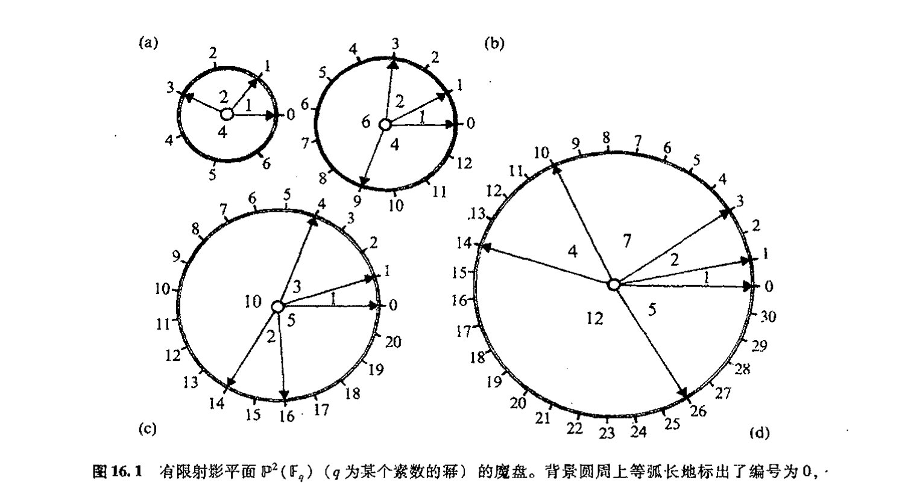
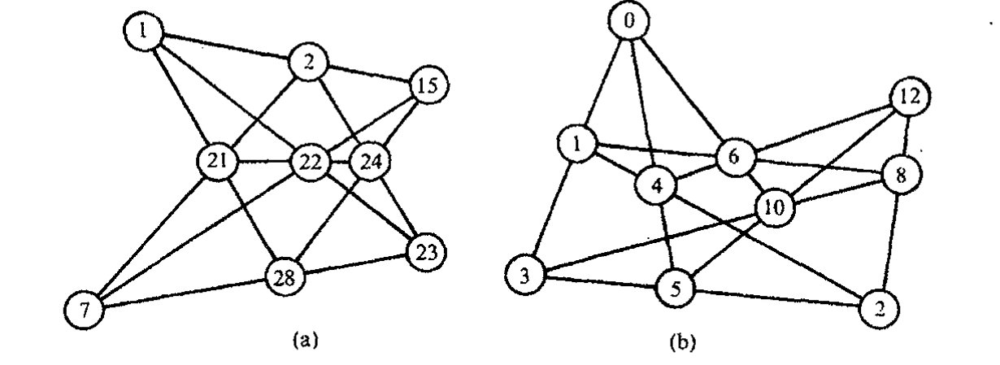
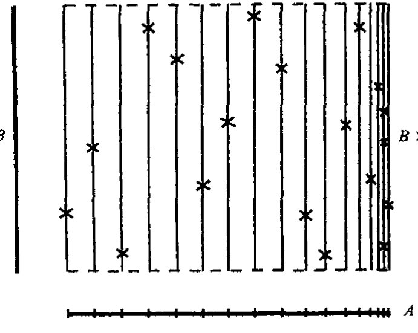

<!-- page 277 -->

通向实在之路

---

第十六章

# 无限的阶梯

## 16.1 有限域

357

通常认为，数学的一般特征就是强调物理宇宙的运行对无限有着根本的依赖关系。在古希腊人那里，甚至在发现他们不得不考虑实数系之前，他们对有理数的使用已经非常熟悉（见 [§3.1](chapter_03.md#31-毕达哥拉斯灾难)）。无穷有理数系不仅允许数量变得无限的大（一种与自然数本身共有的性质），而且也允许在无限小尺度上对数量作无止境的细分。有些人对无穷的这些特征感到困惑。他们更愿意宇宙在广度上是有限的，同时还是有限可分的，这样在最细小的层面上将出现一种基本的离散性。

虽然这种立场明显不合传统，但它并非具有内在矛盾性。的确，一直都有这样一种观点，认为实数系 $R$ 下表观的基本物理作用是对只有有限个元素的"真正的"物理数系的逼近。（这种做法一直有人在尝试，特别是阿玛瓦拉（Y. Ahmavaara, 1965）和他的合作者，见 [§33.1](chapter_33.md#331-几何上具有离散元素的理论)。）我们怎么来理解这种有限数系呢？最简单的例子是那些按"模 $p$ 约化"的整数所构造的例子，这里 $p$ 是某个素数（我们知道，素数是那些除了本身和 1 之外没有其他因子的自然数 2, 3, 5, 7, 11, 13, 17, $\cdots$, 1 本身不是素数。）为了约化模 $p$ 的整数，我们将两个整数视为等价的，如果它们的差是 $p$ 的倍数的话；就是说，

$$a \equiv b \pmod{p}$$

358

当且仅当

$$a - b = kp \text{（对某个 } k\text{）。}$$

按照这一描述，整数严格地划分为 $p$ 的"等价类"（见序言有关等价类的概念。因此只要 $a \equiv b$，$a$ 和 $b$ 就属同一类）。这些类可看作是有限域 $\mathbb{F}_p$ 的元素，而且只有 $p$ 个这样的元素。（这里我采用代数学家的术语"域（field）"，不要将它与流形上的"场"如矢量或张量场相混淆，也不要与物理场如电磁场相混淆。代数里的域只是一个交换性除环，见 [§11.1](chapter_11.md#111-四元数代数)。）通常的加法、减法、

· 258 ·

<!-- page 278 -->

（交换性）乘法和除法对 $\mathbb{F}_p$ 的元素均成立。**[16.1]** 但是，我们还有另外的奇妙性质，就是如果我们将 $p$ 个相同元素相加，我们得到的总是零（当然，素数 $p$ 本身必须算作“零”）。

注意，$\mathbb{F}_p$ 正如刚才描述的那样，其元素本身定义成“整数的无限集”——因为“等价类”本身就是无限集，例如等价类 $\{\cdots, -7, -2, 3, 8, 13, \cdots\}$ 定义了 $\mathbb{F}_5$（$p=5$）的元素。因此，为了定义构成有限数系的那些量，我们得借助于无限！这是数学家们经常使用的根据无限集来严格定义一个数学对象的方法的例子。涉及（序言中提到的）分数定义的“等价类”构造也同样如此。我认为，对于把数系（对某个适当的 $p$）$\mathbb{F}_p$ 看成是“真正”根植于自然的人来说，“等价类”构造只不过是出于数学家的方便，目的是依据（传统上）更为熟悉的无限构造来给出某种严格的表述。事实上，这里我们不必借助整数的无限集，它不过是最为系统的构造而已。对任何给定的情形，我们都可以通过另一种方式简单罗列出所有运算，因为这些运算在数量上总是有限的。

我们从细节上来看看 $p=5$ 的情形。为此将 $\mathbb{F}_p$ 的元素贴上标签 $0, 1, 2, 3, 4$，于是我们有加法表和乘法表

| $+$ | 0 | 1 | 2 | 3 | 4 |
|:---:|:---:|:---:|:---:|:---:|:---:|
| 0 | 0 | 1 | 2 | 3 | 4 |
| 1 | 1 | 2 | 3 | 4 | 0 |
| 2 | 2 | 3 | 4 | 0 | 1 |
| 3 | 3 | 4 | 0 | 1 | 2 |
| 4 | 4 | 0 | 1 | 2 | 3 |

| $\times$ | 0 | 1 | 2 | 3 | 4 |
|:---:|:---:|:---:|:---:|:---:|:---:|
| 0 | 0 | 0 | 0 | 0 | 0 |
| 1 | 0 | 1 | 2 | 3 | 4 |
| 2 | 0 | 2 | 4 | 1 | 3 |
| 3 | 0 | 3 | 1 | 4 | 2 |
| 4 | 0 | 4 | 3 | 2 | 1 |

注意，每个非零元素在 $2 \times 3 \equiv 1 \pmod{5}$，等的意义下有乘法性的逆：

$$1^{-1} = 1,\ 2^{-1} = 3,\ 3^{-1} = 2,\ 4^{-1} = 4。$$

（以后在涉及一个具体有限数系的元素时，我用“$=$”来代替“$\equiv$”。）

我们可以用更为精巧的方法构造出其他有限域 $\mathbb{F}_q$，这里元素的总数是某个素数的幂：$q = p^m$。我们只需看看最简单例子，即 $q = 4 = 2^2$。我们可以将不同的元素标以 $0, 1, \omega, \omega^2$，这里 $\omega^3 = 1$，对每个 $x$ 有 $x + x = 0$。这种做法稍稍扩展了作为单位立方根的复数 $1, \omega, \omega^2$ 的乘法群（其描述见 [§5.4](chapter_05.md#54-复数幂)，我们在 §5.5 里描述强相互作用粒子的“夸克性质”时也提到过这一点）。要得到 $\mathbb{F}_4$，我们只需加上“0”并给出与此有关的“加法”运算 $x + x = 0$。*[16.2]* 在一般情形 $\mathbb{F}_{p^m}$ 下，我们有 $x + x + \cdots + x = 0$，其中 $x$ 的数目为 $p$。

---

**[16.1]** 说明这些运算法则是如何作用的，解释为什么 $p$ 必须是素数。

??? question "答案 [16.1]"
    把整数按"模 $p$ 同余"分成 $p$ 个等价类 $\{0,1,\ldots,p-1\}$。加、减、乘的规则是：先按普通整数运算，再取除以 $p$ 的余数。结果与代表元的选取无关，因为改变代表元相当于加减 $p$ 的倍数，对和、差、积都只贡献 $p$ 的倍数。于是 $\mathbb{F}_p$ 在加、减、乘下总是一个交换环。

    但"域"还要求每个非零元都有乘法逆元（即除法可行）。若 $p$ 不是素数，设 $p=ab$（$1<a,b<p$），则 $a\cdot b\equiv 0\pmod p$，出现了非零的零因子；此时 $a$ 不可能有逆元（否则 $b=a^{-1}(ab)\equiv a^{-1}\cdot 0=0$，矛盾），除法失效。

    当 $p$ 为素数时，对任意 $0<a<p$，$a$ 与 $p$ 互素，由 Bézout 定理存在整数 $u,v$ 使 $ua+vp=1$，即 $ua\equiv 1\pmod p$，故 $a$ 有逆元。因此 $\mathbb{F}_p$ 恰好在 $p$ 为素数时成为域。

*[16.2]* 构造完整的 $\mathbb{F}_4$ 的加法和乘法表，检验代数律的有效性（这里假定 $1 + \omega + \omega^2 = 0$）。

<!-- page 279 -->

通向实在之路

## 16.2 物理上需要的是有限还是无限几何？

虽说这种观点代代相传不绝如缕，但我们并不清楚它是否真的对物理学产生过重要影响。从任何意义上说，如果用 $\mathbb{F}_q$ 取代实数系的位置，那么 $p$ 一定得相当大（这样“$x+x+\cdots+x=0$”将不会以一种观察得到的性态出现）。在我看来，一种基本依赖于某个极端大的素数的物理理论恐怕要比那种取决于简单的无限概念的理论远更复杂（且不可信）。但尽管如此，探究这些问题还是蛮有意思的。实际上，当某个 $\mathbb{F}_q$ 的元素作为坐标给定时，其大部分几何特征得以保留。演算概念更值得关心，毕竟其中许多思想也留存了下来。

我们不妨看看具有有限个点的射影几何是如何工作的，同时探究一下域 $\mathbb{F}_q$ 上的 $n$ 维射影空间 $\mathbb{P}^n(\mathbb{F}_q)$。我们发现，$\mathbb{P}^n(\mathbb{F}_q)$ 有恰好 $1+q+q^2+\cdots+q^n=(q^{n+1}-1)/(q-1)$ 个不同的点。***[16.3] 射影平面 $\mathbb{P}^2(\mathbb{F}_q)$ 尤为迷人，它们有着非常优美的结构，现描述如下：取一个硬纸板做成的圆盘，然后在圆心用大头针将它钉在另一张固定的背景（圆）卡片上使之可以自由转动；再在背景卡片的圆周上等弧长地标出 $1+q+q^2$ 个点，并按逆时针方向将其编号为 $0, 1, 2, \cdots, q(1+q)$。在活动圆盘上，在一些精心选定的区划上标出 $1+q$ 个特殊点，这些特定区划是这么选定的：对于选定的背景卡片上两个标记点，活动圆盘上恰好有这样一个区间，其相应的圆盘上的两特殊点与选定的背景卡片上的两个标记点重合。我们换一种说法：如果将圆盘上这些特定点之间的（背景圆周上的）弧长依次设为 $a^0, a^1, \cdots, a^q$（这里假设背景圆周上两相邻编号之间的弧长为单位长），那么整个圆周长就可以用所有这些 $a^i$ 的和来表示。我们把这个圆盘叫做魔盘。[图 16.1](assets/page280_fig01.jpg) 显示了 $q=2, 3, 4$ 和 $5$ 的情形，这里 $a^0, a^1, \cdots, a^q$ 分别取 $1, 2, 4$；$1, 2, 6, 4$；$1, 3, 10, 2, 5$；$1, 2, 7, 4, 12, 5$。****[16.4] 对于 $q=7, 8, 9, 13$ 和 $16$ 的情形，魔盘的 $a^0, a^1, \cdots, a^q$ 分别取 $1, 2, 10, 19, 4, 7, 9, 5$；$1, 2, 4, 8, 16, 5, 18, 9, 10$；$1, 2, 6, 18, 22, 7, 5, 16, 4, 10$；$1, 2, 13, 7, 5, 14, 34, 6, 4, 33, 18, 17, 21, 8$；$1, 2, 4, 8, 16, 32, 27, 26, 11, 9, 45, 13, 10, 29, 5, 17, 18$。有数学定理可证明，对每一个 $\mathbb{P}^2(\mathbb{F}_q)$（$q$ 为某个素数的幂）都存在一个魔盘。¹ 读者会发现，检验帕普斯定理和德萨格定理（见 [§15.6](chapter_15.md#156-射影空间)，图 15.14）的不同情形会非常有意思。²（取 $q>2$，这样对非退化构形将有足够多的点！）[图 16.2](assets/page280_fig02.jpg) 展示了两个这样的例子（分别为 $q=3$ 的德萨格定理和 $q=5$ 的帕普斯定理，用的都是[图 16.1](assets/page280_fig01.jpg) 的魔盘）。

---

*** [16.3] 证明该式。

??? question "答案 [16.3]"
    在 $\mathbb F_q^{n+1}$ 中，非零向量共有 $q^{n+1}-1$ 个。射影空间的一个点是一条过原点的直线，每条这样的直线含有 $q-1$ 个非零向量。

    因此射影点数为 $(q^{n+1}-1)/(q-1)=1+q+q^2+\cdots+q^n$。

**** [16.4] 对于 $q=3, 5$ 情形，说明如何构造新的魔盘？（你可以从魔盘的某个标记点开始，然后每隔一个角距离使下一个标记点倍增一个固定值。）为什么这么做能行？

??? question "答案 [16.4]"
    魔盘的本质是 $\mathbb{Z}/(1+q+q^2)$ 中的一个**完满差集** $D$：它含 $1+q$ 个标记位置，任意两个标记之差恰好遍历每个非零剩余各一次。这正是射影平面 $\mathbb{P}^2(\mathbb{F}_q)$ 的公理——任意两点确定唯一一条线——的循环（Singer）实现，而转动圆盘相当于对所有标记加同一常数。

    "新魔盘"可由**乘子定理**得到：对 $\mathbb{P}^2(\mathbb{F}_q)$ 的平面差集 $D$，数 $q$（及其幂）总是 $D$ 的一个乘子，即 $qD$ 恰好是 $D$ 的一个平移。因此把每个标记乘以固定因子 $q$ 后再适当转动，就得到另一张等价的合法魔盘——这就是题目"从某标记点出发、按固定倍数生成下一个标记"的做法之所以可行的原因。

    以 $q=3$ 为例（模 $1+3+9=13$）：取标记 $\{0,1,3,9\}=\{0\}\cup\{3^0,3^1,3^2\}$，对应弧长 $1,2,6,4$；其两两之差恰好覆盖 $\bmod 13$ 的全部非零剩余各一次。$q=5$ 时（模 $31$），标记 $\{0,1,3,10,14,26\}$（弧长 $1,2,7,4,12,5$）的两两之差遍历 $\bmod 31$ 的非零剩余各一次；由于 $5$ 是乘子，将这些标记乘以 $5$ 再转动即给出一张新的等价魔盘。因为差集性质等价于射影平面的关联公理，所以这样得到的圆盘必是合法魔盘。

- 260 -

<!-- page 280 -->

第十六章 无限的阶梯

图 16.1 有限射影平面 $\mathbb{P}^2(\mathbb{F}_q)$（$q$ 为某个素数的幂）的魔盘。背景圆周上等弧长地标出了编号为 $0, 1, 2, \cdots, q(1+q)$ 的 $1+q+q^2$ 个点。在自由转动的圆盘上，有箭头标出 $1+q$ 个特定位置：$\mathbb{P}^2(\mathbb{F}_q)$ 内线的端点。这些特定位置构成这么一种定位：对于选定的背景卡片上两个不同数字，活动圆盘上恰好有一个定位，其相应的箭头正好指向这两个数字。几个特定 $q$ 值的魔盘如 (a) $q=2$；(b) $q=3$；(c) $q=4$ 和 (d) $q=5$。

图 16.2 图 15.14 里两个定理的有限几何版本：(a) 帕普斯定理 ($q=5$)；(b) 德萨格定理 ($q=3$)，分别使用了图 16.1d 和图 16.1b 的魔盘。

从其他角度看，$q=2$ 的最简单情形特别有趣。***[16.5] 这个平面上有 7 个点，它称为法诺（Fano）平面，见[图 16.3](assets/page281_fig01.jpg)，这里圆被看成是"直线"。尽管作为一种几何它的范围十分有限，但它却在不同方面扮演着重要角色，如果八元数（[§11.2](chapter_11.md#112-四元数的物理角色)，[§15.4](chapter_15.md#154-克利福德丛)）的乘法律满足的话。法诺平

---

***[16.5] 有限域 $\mathbb{F}_8$ 有元素 $0, 1, \varepsilon, \varepsilon^2, \varepsilon^3, \varepsilon^4, \varepsilon^5, \varepsilon^6$，这里 $\varepsilon^7=1$，$1+1=0$。证明：要么 (1) 存在形如 $\varepsilon^a+\varepsilon^b+\varepsilon^c=0$ 的恒等式，这里 $a, b, c$ 是[图 16.1](assets/page280_fig01.jpg)(a) 中背景圆上可使活动圆盘上三点连成一线的数字；要么 (2) 其他同前，只是 $\varepsilon^3$ 取代了 $\varepsilon$（即 $\varepsilon^{3a}+\varepsilon^{3b}+\varepsilon^{3c}=0$）。

??? question "答案 [16.5]"
    $\mathbb{F}_8=\mathbb{F}_2[t]/(f(t))$，其中 $f$ 是 $\mathbb{F}_2$ 上的 3 次不可约多项式。本原元 $\varepsilon$ 的极小多项式只可能是两个 3 次本原多项式之一：$t^3+t+1$ 或 $t^3+t^2+1$。$\mathbb{F}_8$ 的 7 个非零元构成阶为 $7$ 的循环群，可与[图 16.1](assets/page280_fig01.jpg)(a) 魔盘上 7 个标记一一对应，标记编号即指数。

    图 16.1(a)（$q=2$）的魔盘给出完满差集 $\{0,1,3\}$（弧长 $1,2,4$），其平移即法诺平面的 7 条线，三点共线当且仅当三个指数构成 $\{0,1,3\}+k\pmod 7$。

    情形 (1)：若 $\varepsilon$ 满足 $t^3+t+1=0$，则 $\varepsilon^3+\varepsilon+1=0$，即 $\varepsilon^0+\varepsilon^1+\varepsilon^3=0$，正对应共线三点 $\{0,1,3\}$。两边乘 $\varepsilon^k$ 得 $\varepsilon^k+\varepsilon^{k+1}+\varepsilon^{k+3}=0$，于是每条线 $\{k,k+1,k+3\}$ 上三元素之和都为零。

    情形 (2)：若 $\varepsilon$ 改满足 $t^3+t^2+1=0$，则因 $\gcd(3,7)=1$，$\varepsilon^3$ 也是本原元，且它满足 $t^3+t+1=0$（两本原多项式互为"逆多项式"关系）。于是把 (1) 中的 $\varepsilon$ 换成 $\varepsilon^3$ 即得 $\varepsilon^{3a}+\varepsilon^{3b}+\varepsilon^{3c}=0$。两种情形必有其一成立。

· 261 ·

<!-- page 281 -->

通向实在之路

面上的这7个点，每个都与八元代数的一个生成元 $\mathbf{i}_0$，$\mathbf{i}_1$，$\mathbf{i}_2$，$\cdots$，$\mathbf{i}_6$ 相联系。这里的每个生成元都满足 $\mathbf{i}_r^2=-1$。为了找出不同生成元之间的积，我们只要在法诺平面上找到一条连接这两个生成元的代表点的线即可，于是这条线上的剩余那点就是这二者的积所代表的那个点（包括符号）。正因此，法诺平面的简单图并不充分，因为我们还需要去确定积的符号。我们可以通过回顾对[图 16.1](assets/page280_fig01.jpg)（a）所示魔盘的描述，或通过[图 16.3](assets/page281_fig01.jpg) 里（等价）箭头的安排（依次循环解释）来确认这个符号。让我们为魔盘上的标示点排个循环序，譬如说逆时针方向。于是，如果 $\mathbf{i}_x$，$\mathbf{i}_y$，$\mathbf{i}_z$ 的循环序与魔盘上的排布一致的话，则有 $\mathbf{i}_x\mathbf{i}_y=\mathbf{i}_z$；否则有 $\mathbf{i}_x\mathbf{i}_y=-\mathbf{i}_z$。特别地，我们有 $\mathbf{i}_0\mathbf{i}_1=\mathbf{i}_3=-\mathbf{i}_1\mathbf{i}_0$，$\mathbf{i}_0\mathbf{i}_2=\mathbf{i}_6$，$\mathbf{i}_1\mathbf{i}_6=-\mathbf{i}_5$，$\mathbf{i}_4\mathbf{i}_2=-\mathbf{i}_1$，等等。***[16.6]

**图 16.3** 由7个点和7条线（圆也算作"直线"）组成的法诺平面 $\mathbb{P}^2(\mathbb{F}_2)$，数字编号同图 16.1（a）。它提供了一种八元除法代数的基元 $\mathbf{i}_0$，$\mathbf{i}_1$，$\mathbf{i}_2$，$\cdots$，$\mathbf{i}_6$ 之间的乘法表，这里箭头给出的是"+"号的循环序。

虽然这些几何和代数结构十分优美，但它们与物理世界的运作似乎没有明显的联系。如果我们抱有 [§1.4](chapter_01.md#14-三个世界与三重奥秘) 里图 1.3 的观点，我们就不会对此感到奇怪，因为与支配宇宙的物理定律直接相关的那些数学不过是整个柏拉图数学世界的一小部分，就我们目前的理解而言，它似乎就是这样。只有当我们的知识在未来深化之后，八元数代数或有限几何的这种优美结构的重要意义才可能被认识到。但就现状来说，在我看来，情况还不足以让人信服地作出这种判断。³ 仅有数学上的完美是远远不够的（还可见 [§34.9](chapter_34.md#349-美和奇迹)）。这一点告诫我们，在研究宇宙规律的基本原理时务必小心从事！

我们还是把思绪从这些撩人的有限结构上移开，回到那种令人敬畏的内在的无限丰富的数学上来。有必要预先指出，无限结构（如自然数 $\mathbb{N}$ 的总体）可能是某种针对实在描述的数学形式体系的一部分，这种形式体系无意于将这些无限结构直接解释为无限大（或无限小）的物理对象。例如，某些理论试图发展出一种架构，在其中的最低层次上会出现离散性（当然也是有限的），而且它同时具有描述无限大结构的能力。我自己就曾将这种架构具体应用到原先的一些想法上，以便用自旋网络（spin networks，我将在 [§32.6](chapter_32.md#326-自旋网络) 对其简述）建立一种有限的空间，其理由是基于如下事实：按标准量子力学，一个物体的自旋的量度由确定量 $(\hbar/2)$ 的自然数的倍数给出。正如我在 [§3.3](chapter_03.md#33-物理世界里的实数) 提及的，在量子力学发展的早期，人们的确满怀希望（尽管未能为后来的发展所实现）地认为，量子理论将是描述世界的主流物理学，这个世界在最小层次上实际上就是离散的。在当今成功的各种理论中，正如事实证明的那样，我们是将时空看成为一个连续统，

---

*** [16.6] 证明：当 $a$，$b$，$c$ 是生成元时，"结合子" $a(bc)-(ab)c$ 关于 $a$，$b$，$c$ 是反对称的，并推导该式（故有 $a(ab)=a^2b$）对所有元均成立。提示：利用[图 16.3](assets/page281_fig01.jpg) 和法诺平面的完全对称性。

??? question "答案 [16.6]"
    八元数生成元的乘法由法诺平面的有向直线给出。若 $a,b,c$ 位于同一条有向线，生成的子代数是四元数型，结合子为零；若三者不在同一条线，则改变任意两个生成元会反转法诺平面的取向，乘积符号随之反转。

    所以 $a(bc)-(ab)c$ 对生成元是完全反对称的。由于结合子对每个变量都是线性的，这一反对称性推广到所有八元数元；特别是有两个变量相同时结合子为零，故 $a(ab)=(aa)b=a^2b$。

· 262 ·

<!-- page 282 -->

第十六章　无限的阶梯

即使在涉及量子概念时亦如此。与小尺度时空离散有关的概念则被视为“非规范的”（[§33.1](chapter_33.md#331-几何上具有离散元素的理论)）。甚至在那些试图将量子力学概念应用到时空结构本身的理论中，其基本特征仍是连续统。这种情形在阿什台卡–罗威利–斯莫林（Ashtekar-Rovelli-Smolin）的圈变量理论里表现得特别明显，其中许多离散（组合）概念，如包含在纽结（knots）和链（link）理论中的那些概念，起着至关重要的作用，这些理论的基本结构里也包括自旋网络。（我们将在第32章看到这个杰出架构的某些方面，在[§33.1](chapter_33.md#331-几何上具有离散元素的理论)，我们将讨论与“离散时空”有关的其他一些概念。）

因此，至少对于时间，我们似乎有必要认真对待无限的使用，特别是在物理连续统的数学描述方面。但在此我们需要的是一种什么样的无限呢？在[§3.2](chapter_03.md#32-实数系)里，我大致介绍了根据有理数的无限集来构建实数系的“戴德金分割”方法。实际上，这是在无限概念发展方面迈出的一大步，它大大超越了有理数本身具有的无限性。在此讨论这个问题有着一定的意义。事实上，正如伟大的丹麦/俄罗斯/德国数学家乔治·康托尔在1874年证明的那样（这是他直到1895年才完成的理论的一部分），无限存在不同的大小。自然数的无穷大实际上是各种无穷大里最小的一种，不同的无穷大在越来越大的尺度上保持着无尽的连续性。我们来看看康托尔具有首创意义的这些基本概念。

## 16.3　无限的不同大小

康托尔革命的第一个关键是一一对应概念。⁴我们说两个集合有相同的势（用通常的语言说，就是它们有“同样数目的元素”），是指能在两个集合的元素之间建立一一对应关系，使得没有元素得不到对应。对于有限集（即有有限个元素1，2，3，4…的集合，甚至可以是零个元素的集合，此时我们规定它对应于空）这种对应（“元素个数相同”）显然成立。但对于无限集，则存在一种新特征（伟大的物理学家和天文学家伽利略早在1638年就注意到了这一点），⁵即无限集有一个等势的真子集（这里“真”是指该子集不等同于整个集合）。

我们以自然数集ℕ

$$\mathbb{N} = \{0,1,2,3,4,5,\cdots\}^{[1]}$$

为例来看看这一特征。如果从这个集合里去掉0，⁶则新集ℕ−0显然与ℕ等势，因为我们可以在ℕ的元素r与ℕ−0的元素r+1之间建立一一对应。我们也可以采用伽利略的例子，由此看到，平方数集{0, 1, 4, 9, 16, 25, …}也必然与ℕ等势，尽管从严格意义上说平方数只是自然数总体数集中的一个微不足道的部分。我们还可以看到，所有整数的集合ℤ的势也与ℕ的势相等。如果我们将ℤ的序记为

$$\{0,1,-1,2,-2,3,-3,4,-4,\cdots\}$$

那么显然它可以和ℕ的元素{0, 1, 2, 3, 4, 5, 6, 7, 8, …}配对。更惊人的是有理数的势

---

[1] 注意，数学里的自然数定义不包括0。这里我们权且接受作者的这种安排。——译者

·263·

<!-- page 283 -->

通向实在之路

365 也与 $\mathbb{N}$ 的势相等。我们可以有多种方法来直接验证这一点，***[16.7]，***[16.8] 这里就不具体予以说明了，我们来看看这个特例是如何纳入康托尔神奇的无限基数理论的一般框架的。

首先，什么是基数？本质上说，就是某个集合里元素的“个数”，我们把两个集合看作是有“相同的元素个数”当且仅当它们之间可以建立一一对应。对此我们可以用“等价类”概念（在前面 [§16.1](#161-有限域) 里，我们用它定义了素数 $p$ 的 $\mathbb{F}_p$，还可见序言）作更精确的定义，这时我们说集合 $A$ 的基数 $\alpha$ 是所有与 $A$ 等势的集合的等价类。实际上，逻辑学家弗雷格（Gottlob Frege，1848～1925）在 1884 年就做过这种尝试，但在像“所有集”这样的开端概念面前遇到了基本困难，因为它们会引起严重的矛盾（在 [§16.5](#165-数学基础方面的难题) 里我们将看出这一点）。为了避免这一矛盾，似乎有必要对“所有可能的集合”设立某种限制。接下来我要对这种令人头晕的问题多说几句。我们暂且像以前那样（我是指象在序言里处理有理数的“等价类”定义时那样）先回避这个问题。我们把势简单地看作是可以从集合间一一对应概念里抽取出来的数学实体（柏拉图世界里的居民！）。当且仅当集合 $A$ 与 $B$ 之间可以建立一一对应时，我们说 $A$“有势 $\alpha$”或“有 $\alpha$ 个元素”，只要 $B$ 也“有势 $\alpha$”或“有 $\alpha$ 个元素”。注意，在下述意义下，自然数总是可视为基数——因为它比 [§3.4](chapter_03.md#34-自然数需要物理世界吗) 给出的“序”定义（$0=\{\}$，$1=\{0\}$，$2=\{0,\{0\}\}$，$3=\{0,\{0\},\{0,\{0\}\}\}$，…）更接近于自然数的直觉概念！实际上自然数的势是有限的（这是相对于像 $\mathbb{N}$ 那样的具有无限势的集合来说的，这些集合有与其自身等势的真子集）。

其次，我们可以建立基数间的关系。我们说势 $\alpha$ 小于或等于势 $\beta$，并记为

$$\alpha\leqslant\beta$$

（或等价地 $\beta\geqslant\alpha$），是指具有势 $\alpha$ 的集合 $A$ 的元素可以与具有势 $\beta$ 的集合 $B$ 的某个子集（不必是真子集）的元素建立一一对应。应当清楚，如果 $\alpha\leqslant\beta$ 且 $\beta\leqslant\gamma$，那么 $\alpha\leqslant\gamma$。*[16.9] 基数理论的一个漂亮的结果是，如果

$$\alpha\leqslant\beta\text{ 且 }\beta\leqslant\alpha,$$

那么

$$\alpha=\beta,$$

这意味着 $A$ 与 $B$ 之间存在一一对应。***[16.10] 我们可以问是否存在既不满足 $\alpha\leqslant\beta$ 也不满足 $\beta\leqslant\alpha$ 的

---

*** [16.7] 看看你能否通过找到某种为所有分数编序的系统方法来给出这种一种程序。你会发现练习 [16.8] 的结果很有用。

??? question "答案 [16.7]"
    每个正分数都可唯一写成既约形式 $a/b$（$a,b$ 为正整数，$\gcd(a,b)=1$），从而对应一个自然数偶 $(a,b)$。由练习 [16.8]，函数 $N(a,b)=\tfrac12((a+b)^2+3a+b)$ 给出自然数偶到自然数的一一对应。

    于是把分数 $a/b$ 排在序号 $N(a,b)$ 的位置（遇到非既约的 $(a,b)$ 就跳过），就按 $N$ 值递增把全体正分数排成一列。其几何含义即 Cantor 对角线法：先列出 $a+b$ 较小的偶，再依次列出 $a+b$ 较大的偶，每条反对角线上只有有限个分数。

    要包含全体有理数，只需在表头添 $0$，并在每个正分数后紧跟它的相反数：$0,\;\tfrac11,-\tfrac11,\;\tfrac12,-\tfrac12,\;\tfrac21,-\tfrac21,\ldots$。这样就得到单射 $\mathbb{Q}\hookrightarrow\mathbb{N}$，故 $\#\mathbb{Q}\leqslant\aleph_0$；又 $\mathbb{N}\subset\mathbb{Q}$ 给出 $\aleph_0\leqslant\#\mathbb{Q}$，从而 $\#\mathbb{Q}=\aleph_0$。

*** [16.8] 证明：函数 $\dfrac{1}{2}\left((a+b)^2+3a+b\right)$ 为在自然数和自然数偶 $(a,b)$ 之间明确提供了一种一一对应。

??? question "答案 [16.8]"
    令 $N(a,b)=\frac12((a+b)^2+3a+b)$。若按 $s=a+b$ 分层，则固定 $s$ 时 $a=0,1,\ldots,s$ 给出 $s+1$ 个值，而 $N(a,b)=s(s+1)/2+a$。

    这正是先列出和为 $0$ 的一对，再列出和为 $1$ 的两对，依此类推的 Cantor 配对方式。每个自然数唯一落在某个三角数区间 $s(s+1)/2$ 到 $(s+1)(s+2)/2-1$ 中，故唯一确定 $s$ 和 $a$，再由 $b=s-a$ 得到反向映射。

* [16.9] 仔细解释这一点。

??? question "答案 [16.9]"
    要证 $\leqslant$ 的传递性：设 $\alpha\leqslant\beta$ 且 $\beta\leqslant\gamma$，取势为 $\alpha,\beta,\gamma$ 的集合 $A,B,C$。

    按定义，$\alpha\leqslant\beta$ 意味着存在单射 $f:A\to B$（$A$ 与 $B$ 的某个子集一一对应）；$\beta\leqslant\gamma$ 意味着存在单射 $g:B\to C$。

    考虑复合映射 $g\circ f:A\to C$。它是单射：若 $g(f(x))=g(f(y))$，由 $g$ 单射得 $f(x)=f(y)$，再由 $f$ 单射得 $x=y$。于是 $A$ 与 $C$ 的某个子集一一对应，即 $\alpha\leqslant\gamma$。

*** [16.10] 证明这一点。思路：存在一一映射 $b$ 使 $A$ 映射到 $B$ 的某个子集 $bA(=b(A))$，和一一映射 $a$ 使 $B$ 映射到 $A$ 的某个子集 $aB$；考虑 $A$ 到 $B$ 的映射，它用 $b$ 将 $A-aB$ 映射到 $bA-baB$，将 $abA-abaB$ 映射到 $babA-babaB$，等等；并用 $a^{-1}$ 将 $aB-abA$ 映射到 $B-bA$，将 $abaB-ababA$ 映射到 $baB-babA$，等等；并对这么做的 $A$ 和 $B$ 的其余元素进行分类。

??? question "答案 [16.10]"
    这是康托尔–伯恩斯坦定理。把 $A$ 中那些沿交替逆映射最终无法再回到 $B$ 的元素归为一类，对它们使用嵌入 $b:A\to B$；对其余处于双向无限链或循环中的元素，使用 $a^{-1}$ 从 $A$ 回到 $B$。

    题中列出的 $A-aB,abA-abaB,\ldots$ 正是第一类链；$aB-abA,abaB-ababA,\ldots$ 的像由 $a^{-1}$ 处理。两部分互不重叠且覆盖全部元素，于是拼成 $A$ 到 $B$ 的双射。

· 264 ·

<!-- page 284 -->

第十六章　无限的阶梯

势偶 $\alpha$ 和 $\beta$，这样的势是不可比的。事实上，从著名的选择公理（参见[§1.3](chapter_01.md#13-柏拉图的数学世界真实吗)）可知，不存在不可比的势。

选择公理认为，如果有集合 $A$，它的元素均为非空集，则存在集合 $B$，它包含属于 $A$ 的每个集合里的一个元素。乍一看，这条选择公理的陈述似乎非常明白（见图16.4），但要将它看作为普适的命题也并非完全没有争议。我的态度是应对它谨慎从事。选择公理的麻烦在于它是一条纯粹的"存在性"判断，对于 $B$ 的内容未作任何规则上的说明。实际上这会带来一系列严重的后果。其中之一就是巴拿赫—塔斯基（Banach-Tarski）定理，这个定理认为，通常三维欧几里得空间内的单位球面可通过简单的欧几里得运动（即平移和转动）而被分割成具有如下性质的 5 个部分：这些部分可以重新组合成两个完整的单位球面！这里的"部分"当然不是刚性的物块，而是错综复杂的点集，它以一种完全非构造性的方式来定义，只是作为"存在"的判断被用在选择公理上。

图 16.4　选择公理认为，对所有元素均为非空集的任一集合 $A$，存在集合 $B$，它包含属于 $A$ 的每个集合里的一个元素。

现在，我们不加证明地罗列几条最基本的基数性质。首先，符号 $\leqslant$ 用于自然数（有限势）时具有通常的意义。从而有任何自然数小于或等于（$\leqslant$）任何无限基数——实际上是前者严格小于（$<$）后者。现在假定 $\beta\leqslant\alpha$，这里 $\alpha$ 是无限势，于是（与我们所熟悉的有限数目形成强烈对比的是）并 $A\cup B$ 的势明显大于这两者，即 $\alpha$ 的势，而积 $A\times B$ 的势仍是 $\alpha$。（我们此前已见识过积的例子，例如[§13.2](chapter_13.md#132-子群和单群) 和[§15.2](chapter_15.md#152-丛的数学思想)。集 $A\times B$ 由所有数偶 $(a,\,b)$ 组成，其中 $a$ 取自 $A$，$b$ 取自 $B$。对于有限集，其积的势就是各自的势的普通数量积，对于不止一个元素的有限集来说，积的势总是大于各自的势。）如果我们要找出那些远大于已有的无限，仅上述这一点是远远不够的。我们得"绑"定 $\alpha$。

下一节我们将讨论如何"松绑"。但眼下我们可看到，以上我们所做的至少足以说明有理数的数目和自然数的一样多。下面我们采用康托尔的符号 $\aleph_0$（$\aleph$ 是希伯来语的第一个字母，$\aleph_0$ 读作"阿列夫零"）来表示自然数集 $\mathbb{N}$ 的势，由上述知，它等同于整数集 $\mathbb{Z}$ 的势。实际上，无限数 $\aleph_0$ 是无限势里最小的。现在要问，有理数集的势 $\rho$ 是多少？任何有理数可写成 $a/b$ 的形式，其中 $a,\,b$ 均为整数。我们发现，有理数集与集 $\mathbb{N}\times\mathbb{N}$ 的一个子集之间存在一一对应，因此 $\rho$ 小于或等于 $\mathbb{N}\times\mathbb{N}$ 的势。但由前述（或通过直接利用练习 [16.8]），$\mathbb{N}\times\mathbb{N}$ 的势等于 $\mathbb{N}$ 的势，即 $\aleph_0$。故有 $\rho\leqslant\aleph_0$。但整数集包含于有理数集中，故有 $\aleph_0\leqslant\rho$。因此，$\rho=\aleph_0$。

## 16.4　康托尔对角线法

现在我们论述康托尔早期的惊人成就，即他的下述论断：确实存在严格大于 $\aleph_0$ 的无限势，实数集 $\mathbb{R}$ 的势就是这样一种无限势。在此我将把这一结果作为康托尔更一般的

<!-- page 285 -->

通向实在之路

---

$$\alpha < 2^{\alpha}$$

的特例来给出，这里 $\alpha < \beta$ 意味着 $\alpha \leqslant \beta$ 且 $\alpha \neq \beta$（我们当然还可以将 $\alpha < \beta$ 写成 $\beta > \alpha$）。康托尔对这一结果的证明是整个数学史上最富于原创意义和影响最为深远的成就之一。但它却简单到我可以在完整地给出。

首先我来解释一些记法符号。如果我们有两个集合 $A$ 和 $B$，则集合 $B^A$ 是所有从 $A$ 到 $B$ 的映射构成的集合。这个记法用到有理数会是什么意思？我们来考虑将 $A$ 散布开来，每个"点"代表 $A$ 的一个元素。于是，为了描述 $B^A$ 的元素，我们将 $B$ 的一个元素放到每个点上。这就是 $A$ 到 $B$ 的映射，因为它提供了一种 $B$ 的元素到 $A$ 的每个元素上的配分（见[图 16.5](assets/page285_fig01.jpg)）。采用"指数记法"$B^A$ 的理由，是因为当我们将这种做法应用到有限集，例如有 $a$ 个元素的 $A$ 和有 $b$ 个元素的 $B$ 时，$B$ 的元素到 $A$ 的每个元素上的配分总次数就是 $b^a$。（对 $A$ 的第一个元素有 $b$ 次配分，对 $A$ 的第二个元素也有 $b$ 次配分，对 $A$ 的第三个元素也有 $b$ 次配分，等等，因此对 $A$ 的 $a$ 个元素有总共 $a$ 个 $b$ 的连乘积 $b \times b \times b \times \cdots \times b$ 次配分，即 $b^a$。）康托尔将 $B^A$ 的势记为

$$\beta^{\alpha},$$

这里 $\beta$ 和 $\alpha$ 分别是 $B$ 和 $A$ 的势。

当 $\beta = 2$ 时这种记法有特别重要的意义。这里我们取 $B$ 为有两个元素"in"和"out"的集。由此 $B^A$ 的元素是"in"或"out"到 $A$ 的每个元素的配分。这样一种配分就相当于选取 $A$ 的子集（即"in"元素的子集）。故此时的 $B^A$ 恰好是 $A$ 的子集的集合（我们常用 $2^A$ 来表示这种子集的集合）。相应地，

> $2^{\alpha}$ 是具有 $\alpha$ 个元素的任一集合的子集的总数。

现在我们给出康托尔的证明。它采用的是经典的古希腊传统的"反证法"（[§2.6](chapter_02.md#26-双曲几何的历史渊源)，[§3.1](chapter_03.md#31-毕达哥拉斯灾难)）。首先，我们假定 $\alpha = 2^{\alpha}$，因此在集合 $A$ 和它的子集的集合 $2^A$ 之间存在一一对应。于是这种对应将使 $A$ 的每个元素 $a$ 与 $A$ 的特定子集 $S(a)$ 相联系。我们可预期，有时 $S(a)$ 能够将 $a$ 作为一个元素包括进来，但有时则不能。我们来考虑在 $S(a)$ 不包含 $a$ 的情形下所有元素 $a$ 的集合。该集合必是 $A$ 的某个特定子集 $Q$（根据需要，这个集既可以是空集也可以是整个 $A$ 本身）。在一一对应

· 266 ·

<!-- page 286 -->

第十六章　无限的阶梯

假定下，对 $S$ 中的某个 $q$，必有 $Q=S(q)$。现在我们要问：“$q$ 是否在 $Q$ 中？”首先假定 $q$ 不在 $Q$ 中。于是 $q$ 必属于 $A$ 的那个我们刚刚取定为子集 $Q$ 的元素集合，即 $q$ 必属于 $Q$，矛盾。这样只留下另一个选择，就是 $q$ 在 $Q$ 中。但这样 $q$ 就不能属于我们称之为 $Q$ 的集合，即 $q$ 不属于 $Q$，再次出现矛盾。因此我们有结论：$A$ 和 $2^A$ 之间不存在一一对应。

最后，我们需要证明 $\alpha\leqslant2^\alpha$，即在 $A$ 和 $2^A$ 的某个子集之间存在一一对应。这可将一一对应简单应用于配分 $A$ 的每个元素 $a$ 到 $A$ 的只包含元素 $a$ 而无其他元素的特殊子集这一点来实现。由此我们建立起所需的 $\alpha<2^\alpha$，因此也就证明了 $\alpha\leqslant2^\alpha$ 但 $\alpha\neq2^\alpha$。

虽然这个推导有点让人犯晕（任何犯糊涂的读者可以仔细多看几遍），但从它不诉诸任何需要专业知识就能掌握的数学概念这一点来看，它极为“优美”。也正是在这一点上，它所得出的那种非比寻常的推论才显得尤为突出。它不仅使我们看到，存在远比自然数多得多的实数，而且证明了可能的无限大的数在大的方面是无止境的。进一步，通过适当调整，这一论证可证明，不存在任何可以确定一般计算是否能够完成的计算途径（图灵命题）。与此相关的一个结果是哥德尔著名的不完备定理，该定理表明，不存在一组预先指定的可信的数学法则，可用之于概述判定数学真理的所有程序。下一节我将聊一聊如何得到这个结果方面的一些趣事。

但作为本节内容的结束，我们来看看为什么上述结果事实上确立了康托尔在有关无限方面的第一个非凡的突破，即居然存在比自然数多得多的实数。（这一突破使人们确信，的确存在非平凡的无限理论！）如果我们能够看出实数的势（通常记为 $\mathbf{C}$）实际上就等于 $2^{\aleph_0}$：

$$\mathbf{C}=2^{\aleph_0},$$

那么，通过上述论证，就有 $\mathbf{C}>\aleph_0$。

可以有多种方法看出 $\mathbf{C}=2^{\aleph_0}$。为了证明 $2^{\aleph_0}\leqslant\mathbf{C}$（实际上我们只需证明 $\mathbf{C}>\aleph_0$ 就够了），我们只需在 $2^\mathbb{N}$ 和 $\mathbb{R}$ 的某个子集之间建立起一一对应就足够了。我们可以将 $2^\mathbb{N}$ 的每个元素看成是 0 或 1（“out”或“in”）到每个自然数的一种赋值，即这种元素可视为一无穷序列，例如

$$100110001011101\cdots$$

（$2^\mathbb{N}$ 的这个特定元素将 1 赋给自然数 0，将 0 赋给自然数 1，将 0 赋给自然数 2，将 1 赋给自然数 3，将 1 赋给自然数 4，$\cdots$，因此子集为 $\{0, 3, 4, 8, \cdots\}$。）现在我们可以将它看作是某个实数的二进制展开来试着读取这个完整的数字序列，这里我们认为小数点处于最左边。不幸的是，这么做并不成功，因为在确定这么一种表示时还存在不确定性，即这个序列可能是以完全由 0 或完全由 1 组成的无限序列来结束。*[16.11] 我们可以借助任意多台傻瓜机来绕开这个难题，方法之一是在二进制数字之间插入（譬如）数字 3，从而得到

$$0.313030313130303031303131313031\cdots,$$

---

*[16.11] 解释这一点。

??? question "答案 [16.11]"
    问题在于二进制展开不唯一：末尾全为 $0$ 的序列与末尾全为 $1$ 的序列可表示同一实数（如 $0.0111\cdots_2=0.1000\cdots_2$）。若直接把 $2^{\mathbb{N}}$ 的元素读作二进制小数，这两种不同的 $0/1$ 序列会映到同一个实数，破坏了单射性。

    插入数字 $3$ 的技巧绕开了这一点：把序列 $s_0 s_1 s_2\cdots$（每个 $s_i\in\{0,1\}$）改写成 $0.s_0\,3\,s_1\,3\,s_2\,3\cdots$，再按十进制读取。所得实数只用到数字 $0,1,3$，且每隔一位必为 $3$，永远不会出现末尾循环 $9$（或末尾循环 $0$）这种造成歧义的情形。

    因此这种十进制写法对每个序列都是唯一的：不同的 $0/1$ 序列必给出不同的十进制数字串，从而对应不同的实数。这就建立了 $2^{\mathbb{N}}$ 到 $\mathbb{R}$ 的某个子集的真正一一对应，于是 $2^{\aleph_0}\leqslant\mathbf{C}$。

·267·

<!-- page 287 -->

通向实在之路

然后将其作为某个实数的普通十进制表达式来读取。这样，我们确实在 $2^\mathbb{N}$ 和 $\mathbb{R}$ 的某个子集之间建立起一一对应。因此 $2^{\aleph_0}\leqslant\mathbf{C}$ 得证（由此得到康托尔的 $\mathbf{C}>\aleph_0$）。

371

为了导出 $\mathbf{C}=2^{\aleph_0}$，我们必须证明 $\mathbf{C}\leqslant2^{\aleph_0}$。现在，严格处于 $0$ 和 $1$ 之间的每个实数都有一个（如上述考虑的）二进制展开，虽然有时显得冗长；因此，这个特定的实数集一定有 $\leqslant2^{\aleph_0}$的势。在整个 $\mathbb{R}$ 上可以有多种简单函数来得到这个区间，\*[16.12]故 $\mathbf{C}\leqslant2^{\aleph_0}$，从而有 $\mathbf{C}=2^{\aleph_0}$。

康托尔给出的原始论证与上述过程有些不同，虽然本质上一样。他用的也是反证法，但更直接。他设想在 $\mathbb{N}$ 和严格处于 $0$ 和 $1$ 之间的实数之间存在一一对应，将所有这种实数以垂直列表形式列出，每个实数写成十进制展开式。通过"对角线法"，（一种生成无法列入表中的新实数的方法。整个列表中小数点后的数字看作是一个数字阵列，自该阵列左上角始，将表中第 $n$ 个实数的第 $n$ 位数字代换为不同的数字，然后将所有更改过的主对角线数字排成一排，这样得到的实数与表中所有实数都不相同。许多科普书里都介绍过这种方法，例如，见我的《皇帝新脑》一书第三章。）\*\*[16.13]我们可得到一个与假定该列表是完备的相冲突的矛盾。这种论证的一般形式（包括本节开头我们用来论证 $\alpha<2^\alpha$ 的方法）有时被称为康托尔"对角线删除法"。

## 16.5 数学基础方面的难题

如上所述，连续统（即 $\mathbb{R}$）的势，$2^{\aleph_0}$，经常记为字母 $\mathbf{C}$。康托尔比较偏爱将其标以"$\aleph_1$"，用来表示它是较 $\aleph_0$ 为大的"第二级最小"势。他试图证明 $2^{\aleph_0}=\aleph_1$，但没能成功；事实上，在康托尔提出之后的这么多年来，这种以连续统假说著称的"$2^{\aleph_0}=\aleph_1$"主张已成为一个著名的未解决问题。从"绝对"意义上说，它至今仍未解决。哥德尔（Kurt Gödel，1906～1978）和柯恩（Paul Cohen，1934～2007）能够证明，连续统假说（和选择公理）不可能通过标准集合论方法来解决。但是，由于哥德尔不完备定理（我一会儿就会讲到）和其他一些相关问题，这种证明本身并不能解决连续体假说的真理性问题。仍有可能存在一种比标准集合论更强有力的方法被用来决定连续体假说的真理性，换句话说，这个问题可能属于这样一种情形，其真

372 伪是一个取决于人们持有什么样的数学标准的主观性问题。⁸ 我们在 [§1.3](chapter_01.md#13-柏拉图的数学世界真实吗) 曾谈到过这种问题，但涉及的是选择公理，而不是连续体假说。

我们看到，关系 $\alpha<2^\alpha$ 告诉我们，不可能存在任何最大的无穷大；因为如果假设某个基数 $\Omega$ 为最大，那么基数 $2^\Omega$ 就会更大。这个事实（和康托尔为建立这个事实所作的论证）一直对数学基础有着深远的影响。特别是哲学家罗素（Bertrand Russell，1872～1970），他先前的观点认为，一定存在一个为康托尔的结论所否认的最大的基数。但1902年前后，在仔细研究了这个问题之

---

\* [16.12] 给出一个例子。提示：参考[图 9.8](assets/page134_fig01.jpg)。

\*\* [16.13] 对要证明的 $\alpha<2^\alpha$ 的情形 $\alpha=\aleph_0$，解释为什么它与我前面讨论的问题在本质上是一样的。

· 268 ·

<!-- page 288 -->

第十六章 无限的阶梯

后，他改变了自己的观点。实际上，他将康托尔的论证应用到"所有集合的集合"上，使他立刻提出了今日著名的"罗素悖论"！

这个悖论概述如下。考虑集合 $\mathcal{R}$，它由"所有那些不包含自身为元素的集合"组成。（现在你信不信一个集合可以是该集合本身的一个元素这一点已无关紧要，因为如果没有集合属于其自身，那么 $\mathcal{R}$ 就是所有这种集合的集合。）我们要问的问题是，$\mathcal{R}$ 本身是一种什么样的集合？$\mathcal{R}$ 是它自身的一个元素吗？如果是，那么好，因为它（作为元素）所属的集合 $\mathcal{R}$ 的元素都不包含自身，因此（作为元素）它不属于 $\mathcal{R}$，矛盾！另一种推理是假定 $\mathcal{R}$ 不属于自身，但这样它（作为集合）必是所有那些不包含自身的集合中的一员，即 $\mathcal{R}$ 中的一员，因此 $\mathcal{R}$ 属于 $\mathcal{R}$，这与假定 $\mathcal{R}$ 不属于自身相矛盾！

或许您已经注意到，这个悖论简直就是康托尔证明 $\alpha < 2^\alpha$ 时思路的翻版，如果我们将 $\alpha$ 改换成"所有集合的集合"的话。罗素的确就是这样提出他的悖论的。⁹这个推理实际上要说的是不存在如"所有集合的集合"这样的事情。（事实上康托尔已经意识到这一点，在罗素提出"罗素悖论"之前若干年就知道这个悖论。¹⁰这似乎有点儿怪，像"所有集合的集合"这样明了的概念却是禁用概念。）我们可以想象，对于一个集合，如果存在一种明确的规则能告诉我们哪些属于它哪些不属于它，那么任何一种有关集合的提议都应当是完全可接受的。这里似乎就存在这么一种规则，即每个集合都处于集合中！其隐义似乎是，我们认可这个巨大的集合与它的元素享有同样的地位，即二者都是一个"集"。整个论证取决于我们对集合实际上指的是什么有明确概念。但一旦我们有了这样一个概念，问题来了：所有这些事儿的集合本身算不算是一个集？康托尔和罗素要告诉我们的就是这种问题的答案不存在！

事实上，数学家们默许这种明显的悖论的方法是想象在"集合"与"类"之间存在某种区分。（幸好有"类"这种可将那些通常很难确定其归属的事情拢到一块儿的概念，而"集"则总是用于指有明确归属的概念。）粗略地说，集合的集合，不论其是否容许被当作一个整体来考虑，都可以称之为类。有些类相当完备足以作为集来对待，但另一些类因为"太大"或"太不规则"就很难看成是集。另一方面，我们不必要求把各种类集合一块儿来得到一个更大的概念。因此，"所有集合的集合"是没有意义的（"所有类的类"也是没有意义的），但"所有集合的类"则是合法的。康托尔将这种"超级类"记为 $\Omega$，并为它赋予了近乎自然神的意义。数学上不容许有比 $\Omega$ 更大的类了。"$2^\Omega$"的麻烦在于它将 $\Omega$ 的所有不同的"子类""集合在一块儿"，其中许多并非集合，因此是不容许的。

对所有这些似乎非常令人不满的事总是存在的。我得承认我自己对此也绝对不满意。如果有一种明快的判据能告诉我们一个类何时有资格成为集，那么这套程序或许是合理的。但是，"区别"经常是以一种圆滑的方式出现的。一个类一定是一个集，当且仅当它本身可以作为另一个类的一员——在我看来这更像在诡辩！问题是我们无法明确画出一条界限。一旦画出一条界限，不久我们就会发现，它圈定的范围过窄了。我们没有理由不将某个更大的（或更难驾驭的）

· 269 ·

<!-- page 289 -->

通向实在之路

类看作是集的大家庭里的一员。当然，我们必须避开那种彻头彻尾的矛盾。但更开明的是做好确认集合大家庭成员的规则工作，我们需要为集合提供更有力的数学证明方法。但这个大家庭敞开的门只要稍大一点，灾难——矛盾——就会降临，整个大厦就会坍塌！这样一条界限的划定是数学上最复杂最困难的操作之一。¹¹

许多数学家宁愿从这种极端的自由主义立场上后撤，甚至采取一种顽固的保守主义"结构学派"的观点。按照这种观点，一个集合仅当存在一种我们可辨认哪些元素属于它哪些不属于它的直接构造时才是容许的。在这种严厉规则下，那些只能由选择公理定义的"集"肯定是拿不到进入集合大家庭的通行证了！但事实证明，从避开康托尔对角线法这一点上看，这些极端的保守主义做法并不比极端的自由主义更高明。下一节我们来看看问题出在哪里。

## 16.6 图灵机和哥德尔定理

首先，我们需要弄懂什么是数学上的"结构"概念。为此我们最好是将注意力集中在自然数集 ℕ 的子集上，至少眼下是如此。我们要问，哪些子集是"结构性的"？幸运的是我们有一个绝妙的概念可资利用。这就是20世纪30年代由众多逻辑学家¹²引入、并由图灵（Alan Turing，1912～1954）于1936年确立的可计算性概念。由于今天我们对电子计算机已非常熟悉，因此我认为，在这里说说这些物理仪器的工作而不是根据精确的数学公式来给出相关概念就足够了。简言之，计算（或算法）就是那种理想化计算机要执行的东西。这里"理想化"的意思是指它可以在无限长的时间里毫无"磨损"地运行下去，从不出错，并且有无限大的存贮空间。这种概念在数学上就叫做图灵机。¹³

一台特定的图灵机 **T** 对应于某个具体的自然数计算。**T** 对自然数 *n* 的执行记为 ***T***( *n* )，我们通常认为这个执行会产生另一个自然数 *m*：

$$\mathbf{T}(n)=m_{\circ}$$

图灵机可能有这样一种特性，就是"死机"（或"进入死循环"），因为计算再也不终止了。如果在我们执行某个自然数 *n* 时遇到这种情况，我们就说这台图灵机有缺陷。而另一方面，如果不论执行什么数都会结束，我们就说它有效。

无法终止（有缺陷的）图灵机 **T** 的一个可能的例子是：对给定的 *n*，要求找出不是 *n* 个平方数之和的最小的自然数（包括 0² = 0）。我们发现，***T***(0) = 1，***T***(1) = 2，***T***(2) = 3，***T***(3) = 7（这些方程的意义可用最后一个式子来代表："7 是非三个平方数之和的最小自然数"），\*[16.15] 但对于 4，**T** 就无休止地计算下去了。死机的原因是因为有这样一条著名定理（这是由18世纪法国－意大利数学家拉格朗日证明的）：任何自然数总可以表为四个平方数之和。（以后在不同场合我们

---

\* [16.15] 粗略描述我们的程序该如何演算，并解释这些特定的值。

· 270 ·

<!-- page 290 -->

将会看到，特别是在第 20 和 26 章里，拉格朗日具有非常重要的地位！）

每台具体的图灵机（不论“好”“坏”）都有确定的“指令表”来刻画该机要执行的具体算法。这种指令表可完全由某种“码”来具体化，也就是我们可将其写成一个数字序列。然后再将该序列编译成一个自然数 $t$，这样 $t$ 就被编进了机器可执行的“程序”。按自然数 $t$ 编码的图灵机记做 $\mathbf{T}_t$。这种编码并非对所有自然数 $t$ 都有效，如果失效，我们就说 $\mathbf{T}_t$ 是“有缺陷的”。这种“缺陷”也包括那些对于某个 $n$ 机器无法停机的情形。只有那些在有限的时间里能给出答案的图灵机 $\mathbf{T}_t$ 才是唯一有效的。

图灵的一项重要成就，就是认识到有可能构造一台所谓普适的图灵机 $\mathbf{U}$，它可以模拟任何一种图灵机。$\mathbf{U}$ 所需要做的就是先作用于自然数 $t$，使自身成为特定的图灵机 $\mathbf{T}_t$，然后再作用于数 $n$，以便得到 $\mathbf{T}_t(n)$。（基本上说，现代广普计算机都是普适图灵机。）我把这种综合作用写成 $\mathbf{U}(t,n)$，因此，

$$\mathbf{U}(t,n) = \mathbf{T}_t(n)。$$

但是我们应记住，这里定义的图灵机只对单个的自然数有效，对诸如 $(t,\ n)$ 这样的数偶无效。但正如我们前面看到的（例如练习 [16.8]），将一对自然数编码成一个自然数并非难事。机器 $\mathbf{U}$ 本身也定义成某个自然数，譬如说 $u$，故我们有

$$\mathbf{U} = \mathbf{T}_u。$$

我们如何来判断一台图灵机是有效的还是有缺陷的？我们能找到某种作此决定的算法吗？这个问题的答案是“不”，这是图灵取得的重要的成就之一！证明利用了康托尔对角线删除法。如同前述，我们考虑集合 $\mathbb{N}$，但不是考虑 $\mathbb{N}$ 的所有子集，而只是那些可通过计算来认定一个元素是否属于其中的子集。（这些不可能是 $\mathbb{N}$ 的所有子集，因为不同的计算的数目只是 $\aleph_0$，而 $\mathbb{N}$ 的所有子集的数目则是 $\mathbf{C}$。）这种由计算定义的集称作递归的。实际上，$\mathbb{N}$ 的递归子集取决于有效图灵机 $\mathbf{T}$ 的输出，这种输出只有两种：$0$ 或 $1$。如果 $\mathbf{T}(n)=1$，那么 $n$ 就是 $\mathbf{T}$ 所定义的递归集的数字（“in”）；如果 $\mathbf{T}(n)=0$，则 $n$ 就不是其中的数字（“out”）。现在我们采用如同前述的康托尔论证方法，但对象换成了 $\mathbb{N}$ 的递归子集。这个论证告诉我们，使 $\mathbf{T}_t$ 成为有效图灵机的那些自然数 $t$ 的集合不可能是递归集。不存在一种可用于一台给定图灵机 $\mathbf{T}$ 的算法，由它告诉我们 $\mathbf{T}$ 是否有缺陷！

这个论证很值得我们作更细致的探讨。图灵/康托尔论证真正要说明的是，使 $\mathbf{T}_t$ 成为有效的那些自然数 $t$ 的集合甚至不是递归可列的。什么是 $\mathbb{N}$ 的递归可列子集呢？它是这样一种自然数集，当我们将一台有效图灵机依次用到 $0,1,2,3,4,\cdots$ 上时，它能最终生成这个集合中的每一个数（有可能出现不止一次）。（就是说，$m$ 是该集中的一个数，当且仅当对某个自然数 $n$ 有 $m=\mathbf{T}(n)$。）$\mathbb{N}$ 的一个子集 $S$ 是递归的，当且仅当它是递归可列的，并且其补集 $\mathbb{N}-S$ 也是递归可列的。***[16.16]

---

*** [16.16] 证明这一点。

??? question "答案 [16.16]"
    若有效图灵机编号集合是递归可列的，就存在一台机器依次枚举所有会停机的 $T_t$。于是可构造对角机器：对输入 $n$，等待枚举确认第 $n$ 台机器在输入 $n$ 上停机，然后故意进入不停止或给出相反行为。

    这台对角机器若在枚举表中，就在自身编号处产生矛盾；若不在表中，则表没有列出所有有效停机情形。因此这些 $t$ 的集合不可能递归可列。

· 271 ·

<!-- page 291 -->

通向实在之路

使得图灵/康托尔论证推出矛盾的一一对应关系是有效图灵机的递归枚举。我们略加思考就会知道，前面所说的可归结为：不存在一种通用算法，它能告诉我们一台图灵机的工作何时会造成无法停机。

所有这些最终要告诉我们的就是，尽管我们希望坚持“极端保守主义”观点，就是说，唯一可接受的集合是递归集，其成员资格由清楚的计算规则确定，但这种观点使我们立刻意识到该如何考虑非递归集。这种观点甚至会遇到基本困难，就是不存在一种通用方法能够决定两个递归集是否相同，如果它们是用两台不同的有效图灵机 $T_i$ 和 $T_s$ 定义的话。****[16, 17] 此外，如果我们按过分的保守主义观点试图对“集合”概念加以限制的话，那么这个问题将会在不同水平上一而再再而三地遇到。我们总是被推到这样一种境地，对那些不属于容许集合大家庭的情形必须考虑类。

377

这些问题与哥德尔的著名定理紧密相关。他关心的是数学家的证明方法的有效性问题。在20世纪初叶，数学家们穷多年之努力，力图在集合论极为开放的使用中通过引入数学形式系统来避免出现悖论（如罗素悖论）。按照这一体系，存在一组绝对明确的规则，使得那些长串的推理能被看成是一种数学证明。哥德尔所证明的结果表明，这样一套程序无效。实际上，他表明了，如果我们接受这种观点，即某种形式系统 $F$ 的规则能够给出数学上唯一正确的结论，那么我们也必须承认，作为一种明确的数学陈述 $G(F)$，其结论的正确性不可能仅通过 $F$ 的规则来证明。这样，哥德尔就向我们证明了任何我们准备采纳的 $F$ 是如何被超越的。

有这样一种错觉：哥德尔定理告诉我们，存在“无法证明的数学命题”，这意味着在数学真理的“柏拉图世界”（见 [§1.4](chapter_01.md#14-三个世界与三重奥秘)）里存在着原则上我们无法接近的区域。这种认识与我们应当从哥德尔定理中得到的结论实在相差太远。哥德尔定理真正要告诉我们的是，不论我们预先建立什么样的证明规则，如果我们已经视这些规则为真（即它们不会使我们导出谬误），那么就会有一套新的接近确定的数学真理的法则向我们证明，那些特定的规则不足以导出正确的结论。

我们可以从图灵的结果直接导出哥德尔的结果（尽管历史事实并非如此）。怎么做呢？形式系统的观点认为，我们不需要进一步的数学评判来检验 $F$ 的规则是否得到了正确运用。用 $F$ 来决定数学证明的正确性完全是一个计算问题。我们发现，对任何 $F$，那些能够用这套规则证明的数学定理的集合必须是递归可列的。

现在，某些著名的数学陈述可按“如此这般图灵机就不停机”这样的语言来表达。我们已经看到过一个例子，即拉格朗日定理“每个自然数都是四个平方数的和”。另一个更著名的例子是20世纪末由怀尔斯（Andrew Wiles）证明的“费马大定理”（[§1.3](chapter_01.md#13-柏拉图的数学世界真实吗)）。^14^ 但还有个（未解决的）

**** [16, 17] 你能看出为什么这样吗？提示：对于任意一台 $T$ 作用于 $n$ 的图灵机的作用，我们认为具有如下性质的图灵机 $Q$ 是有效图灵机：如果作用于 $n$ 的 $T$ 在 $r$ 次计算步骤之后不停机且有 $Q(r)=0$；或者到第 $r$ 步时停机，但有 $Q(r)=1$。取 $Q(n)$ 与 $T_i(n)$ 的模 2 的和来得到 $T_s(n)$。

· 272 ·

<!-- page 292 -->

例子是著名的“哥德巴赫猜想（每个大于 2 的偶数是两个素数之和）”。这种性质的陈述就是数理逻辑学家所熟知的 $\Pi_1$ 语句。从图灵的上述论证我们立刻可知，真 $\Pi_1$ 语句族组成一个非递归可列集（即不是递归可列的集合）。因此，存在不可能得自 $F$ 规则的真 $\Pi_1$ 语句（这里我们假定 $F$ 是可信的）。这是哥德尔定理的基本形式。实际上，通过对该定理更细致的检验，我们可改进论证以便得到如上陈述的定理版本，就是说，如果我们相信 $F$ 生成真 $\Pi_1$ 语句，那么我们将得到一个特定的 $\Pi_1$ 语句 $G(F)$，它一定能逃脱 $F$ 张起的网，尽管我们能断定 $G(F)$ 也是真 $\Pi_1$ 语句！***[16.18]

## 16.7 物理学中无限的大小

最后，我们来看看这些无限和可构造性问题是如何展现与我们前面章节的数学、以及与我们当前理解的物理之间的关系的。从它们与数学和物理之间的紧密关系上看，似乎很明显，像无限集合理论和可计算性这样的对数学来说具有基本重要性的问题在对物理世界的描述方面影响还非常有限。我个人认为，我们会发现，可计算性问题最终将与未来的物理理论产生深刻的联系，^15^但目前这些概念在数学物理方面的运用做得还非常之少。^16^

至于无限的大小，几乎还没有一种物理理论需要超过实数系 $\mathbb{R}$ 的势 $\mathbf{C}$（$=2^{\aleph_0}$）的。复数域 $\mathbb{C}$ 的势与 $\mathbb{R}$ 的一样大（即也是 $\mathbf{C}$），因为 $\mathbb{C}$ 正好是 $\mathbb{R} \times \mathbb{R}$（实数偶），在其上定义有确定的加法律与乘法律。同样，我们考虑的矢量空间和流形都建立在这样的点族之上：它们有源自某个 $\mathbb{R} \times \mathbb{R} \times \cdots \times \mathbb{R}$（或 $\mathbb{C} \times \mathbb{C} \times \cdots \times \mathbb{C}$）的坐标，或这种坐标的有限拼接，故其势也是 $\mathbf{C}$。

对这种空间上的函数族会怎样呢？譬如，如果我们考虑具有 $\mathbf{C}$ 点的某个空间上的所有实值函数族，那么就会发现，这个族有 $\mathbf{C}^{\mathbf{C}}$ 个元（从 $\mathbf{C}$ 元空间映射到 $\mathbf{C}$ 元空间）。这肯定比 $\mathbf{C}$ 大。实际上 $\mathbf{C}^{\mathbf{C}} = 2^{\mathbf{C}}$。（这是因为 $\mathbb{R}^{\mathbb{R}}$ 的每个元素可重新理解为 $2^{\mathbb{R} \times \mathbb{R}}$ 的一个特定元素，即从 $\mathbb{R} \times \mathbb{R}$ 的一个（通常远非连续的）截面，$\mathbb{R} \times \mathbb{R}$ 的势为 $\mathbf{C}$。）然而，流形上的连续实（或复）函数（或张量场、联络）在数上仅为 $\mathbf{C}$，因为连续函数取决于它在具有有理坐标的点集上的值。由于具有有理坐标的点数正好是 $\aleph_0$，因此这些函数的数目为 $\mathbf{C}^{\aleph_0}$，但 $\mathbf{C}^{\aleph_0} = (2^{\aleph_0})^{\aleph_0} = 2^{\aleph_0 \times \aleph_0} = 2^{\aleph_0} = \mathbf{C}$。*[16.19] 在 [§6.4](chapter_06.md#64-欧拉的-函数概念), 6，我们考虑了连续函数的某种推广，并导致所谓超函数（[§9.7](chapter_09.md#97-超函数)）的一般化。但这些函数的数目仍未超过 $\mathbf{C}$，因为它们是由全纯函数对（数目皆为 $\mathbf{C}$）来定义的。

在 [§22.3](chapter_22.md#223-幺正结构希尔伯特空间和狄拉克算符)，我们将看到，量子力学要用到具有无限维的所谓希尔伯特空间。然而，虽然这些特定的无限维空间与有限维空间有很大的不同，但其连续函数却并不比有限维空间情形下的多，因此我们再次得到总数为 $\mathbf{C}$。当我们考虑时空上杂乱的曲线空间（或杂乱的物理场构形）时，

---

*** [16.18] 看看您能否建立这个关系式。

* [16.19] 解释：对于集 $A$，$B$，$C$，为什么 $(A^B)^C$ 会等价于 $A^{B \times C}$？

??? question "答案 [16.19]"
    $(A^B)^C$ 的元素是映射 $F:C\to A^B$，即对每个 $c\in C$ 给出一个映射 $F(c):B\to A$。$A^{B\times C}$ 的元素是映射 $g:B\times C\to A$，即对每对 $(b,c)$ 给出 $A$ 中一个值。

    定义对应 $F\mapsto g$，其中 $g(b,c)=F(c)(b)$；其逆为 $g\mapsto F$，其中 $\big(F(c)\big)(b)=g(b,c)$。两者互逆，故给出 $(A^B)^C$ 与 $A^{B\times C}$ 之间的一一对应（这正是"柯里化"：把"先给 $c$ 再给 $b$"的两步映射等同于"同时给 $(b,c)$"的映射）。

    用基数表示即指数律 $(\alpha^{\beta})^{\gamma}=\alpha^{\beta\times\gamma}$，它把有限情形的 $(a^b)^c=a^{bc}$ 推广到任意（含无限）基数。本节正用它得到 $\mathbf{C}^{\aleph_0}=(2^{\aleph_0})^{\aleph_0}=2^{\aleph_0\times\aleph_0}=2^{\aleph_0}=\mathbf{C}$。

· 273 ·

<!-- page 293 -->

通向实在之路

最好的办法是将其与量子场论（我们将在 [§26.6](chapter_26.md#266-相互作用拉格朗日量和路径积分) 讨论）的路径积分公式联系起来。但得到的似乎还是总数为 **C**，因为不管曲线有多乱，其结构中总有足够的连续性。

对物理上的空间而言，势的概念似乎不足以增进我们对大小概念的把握。几乎所有有意义的空间都有 **C** 个点。然而，这些空间在"大小"上却迥然不同，这里我们首先想到的"大小"就是矢量空间或流形 $\mathcal{M}$ 的维数。$\mathcal{M}$ 的维数可以是自然数（例如对于普通空间是 4，对于 [§12.1](chapter_12.md#121-为什么要研究高维流形) 的相空间情形是 $6 \times 10^{19}$），也可以是无穷大，如出现在量子力学里的（大多数）希尔伯特态空间情形。数学上说，最简单的无限维希尔伯特空间是无限和 $|z_1|^2 + |z_2|^2 + |z_3|^2 + \cdots$ 收敛的复数序列 $(z_1, z_2, z_3, \cdots)$ 空间。对于无限维希尔伯特空间，最适于将其维视为 $\aleph_0$。（对于这一点有许多微妙之处值得说叨，但我们在这里还是打住为佳。）对 $n$ 实数维空间，我们可以说它有 "$\infty^n$" 个点（它表示这些连续的点组成一 $n$ 维阵列）。对无限维情形，我们认为它有 "$\infty^\infty$" 个点。

我们也对定义在 $\mathcal{M}$ 上的不同场的空间感兴趣。这些场通常取光滑的，但有时它们过于一般（例如以分布形式出现），这也包括超函数理论的情形（见 [§9.7](chapter_09.md#97-超函数)）。它们可能（部分）从属于限制其自由度的微分方程。如果它们不受此限制，则可看作是"$n$ 个变量的函数"。在每一点上，场可以有 $k$ 个独立分量。于是我们说，场的自由度为 $\infty^{k\infty^n}$。这个概念可（局域上粗略地）理解为，^{17}该场是有 $\infty^n$ 个点的空间到有 $\infty^k$ 个点的空间的映射，这里我们利用了记法之间的关系

$$(\infty^k)^{\infty^n} = \infty^{k\infty^n}.$$

当对场加以适当偏微分方程限制时，则这些场完全取决于其初始数据（特别是在 [§27.1](chapter_27.md#271-动力学演化的时间对称性) 中），就是说，取决于某个较低维（譬如说 $q$ 维）空间 $S$ 所规定的辅助场数据。如果这些数据在 $S$ 上可自由选取（这意味着它们基本上不受数据在 $S$ 上所满足的微分方程或代数方程的限制），且如果数据是由 $S$ 的每个点上的 $r$ 个独立分量组成的，那么我们说场中的自由度是 $\infty^{r\infty^q}$。在许多情形下，要找出 $r$ 和 $q$ 不是件容易的事儿，但重要的是它们都是不变量，从而与场如何按另外的等价量来表示无关。^{18}这些问题对以后（见 [§23.2](chapter_23.md#232-巨大的多粒子系统态空间)，[§31.10](chapter_31.md#3110-为什么我们看不见额外的空间维)–12,15–17）相当重要。

## 注释

### §16.2

16.1 见 Stephenson (1972)，§7；Howie (1989)，269~271 页；Hirschfeld (1998)，98 页；魔盘等价于所谓完满差集。

16.2 目前显然还不知道是否存在德萨格理论（或等价的帕普斯定理）不成立的魔盘（必须不是出自 $\mathbb{P}^2(\mathbb{F}_q)$ 的）——或者说，是否一定存在非德萨格（或等价的非帕普斯）有限射影平面。

16.3 八元数的物理作用毕竟年年都有人讨论（例如，见 Gürsey and Tze 1996；Dixon 1994；Mangogue and Dray 1999；Dray and Mangue 1999）；但要构造一个一般的"八元量子力学"（Addler 1995）尚存在基本困难，至于"四元量子力学"，情况要乐观些。曾有人建议将另一种所谓"$p$ 进数"系当作有物理意义的备选者。这些 $p$ 进数组成可用。演算法则计算的数系，它们可以像通常扩展了的十进位实数那样来表示，当然代表 0，1，2，3，$\cdots$，$p-1$（这里 $p$ 是选定的素数）的数字除外，它们还可以是无限的，只是趋向无限的方式与十进位的方式正相反（这里我们不需要负号）。例如，

·274·

<!-- page 294 -->

第十六章 无限的阶梯

……24033200411.3104，

表示一个具体的5进数。加法和乘法法则与它们作为“普通的”$p$进制算术完全相同（符号“10”表示素数$p$，等等）。见 Mahler (1981)；Gouvêa (1993)；Brekke and Frend (1993)；Vladimirov and Volovich (1989)；Pitkänen (1995) 以及 $p$ 进数在物理学领域的应用。

[§16.3](#163-无限的不同大小)

16.4 现代数学词汇称它为集的同构。还有其他如“自同态”、“满态射”和“单态射”（或就叫“态射”）等，数学家们倾向于在一般意义上用它们来刻画一个集或结构到另一个集或结构的映射。我则倾向于在本书避免这种词汇，因为我认为我们没必要也不值得花那么大功夫去熟悉它。

16.5 对这种性质更早的研究见 Moore (1990)，第三章。

16.6 回想一下注释15.5，我打算采用一种古怪的记法，在这种记法下，$\mathbb{N}-0$ 表示非零自然数集。有点搞笑的是，如果我们打算采纳貌似“更正确的” $\mathbb{N}-\{0\}$，同时又采纳 [§3.4](chapter_03.md#34-自然数需要物理世界吗) 里的 $\{0\}=1$，那么在考虑集合时，就会遇到更混乱的“$\mathbb{N}-1$”。

16.7 见 Wagon (1985)；一般评述见 Runde (2002)。

[§16.5](#165-数学基础方面的难题)

16.8 类似评述用于康托尔的一般连续统假设：$2^{\aleph_\alpha}=\aleph_{\alpha+1}$（这里 $\alpha$ 是“序数”，我这里没有讨论其定义），这些评述也可用于选择公理。

16.9 见 Russell (1903)，362页，第二项脚注 [1937年版]。

16.10 见 Van Heijenoort (1967)，114页。

16.11 关于这些问题的新的处理方法见 Woodin (2001)。有关数学基础的一般性参考文献，见 Abian (1965) 和 Wilder (1965)。

[§16.6](#166-图灵机和哥德尔定理)

16.12 图灵的先驱主要有：Alonzo Church，Haskell B. Curry，Stephen Kleene，Kurt Gödel 和 Emil Post，见 Gandy (1988)。

16.13 对图灵机的细节描述，见 Penrose (1989)，第二章；例子，Davis (1978)，原始参考文献：Turing (1937)。

16.14 见 Singh (1997)；Wiles (1995)。

[§16.7](#167-物理学中无限的大小)

16.15 见 Penrose (1989, 1994d, 1997c)。

16.16 见 Komar (1964)；Geroch and Hartle (1986)，[§34.7](chapter_34.md#347-心智在物理理论中的作用)。

16.17 这种有用的记法应归功于 John A. Wheeler，见 Wheeler (1960)，67页。

16.18 见 Cartan (1945)，特别是75~76页上的 §§68, 69（原版）。要注意的是，保证 $\infty^{r\infty^q}$ 里的 $r$ 被正确计入。两个系统可以是等价的，但毕竟乍一看 $r$ 值不相同。而 $q$ 值的确定则非常清楚。对这些问题的严格的现代处理已使问题变得更明了；它是根据节丛理论（见 Bryant *et al.* 1991）给出的。可以提一下，存在一种惠勒记法的精致化（见 Penrose 2003），例如 $\infty^{2\infty^2+3\infty^1+5}$ 表示“这个场依赖于2个二变量函数，3个单变量函数，和5个常数”。这启发我们考虑形如 $\infty^{p(\infty)}$ 的表达式，这里 $p$ 是非负整系数多项式。

·275·
