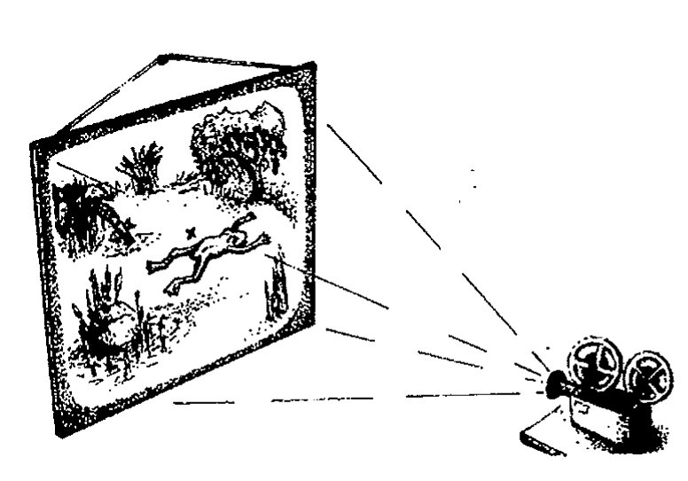
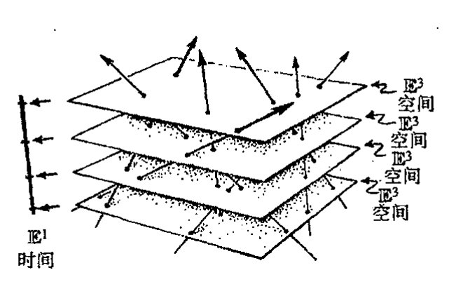
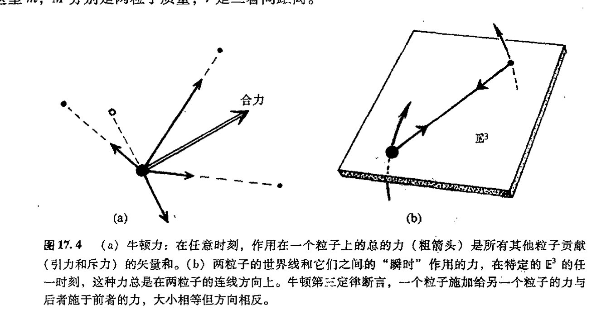
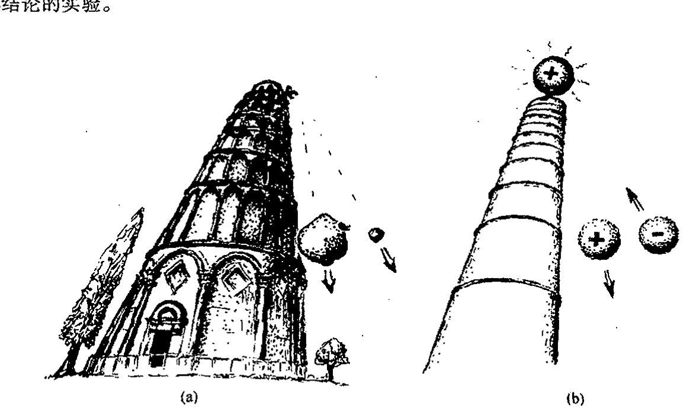
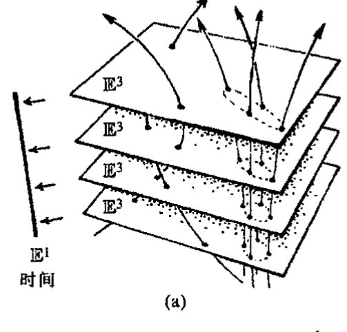
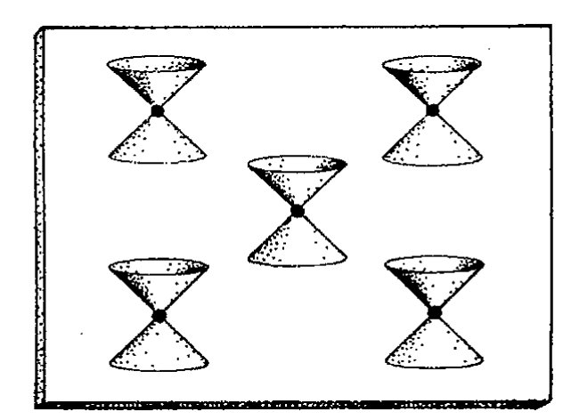
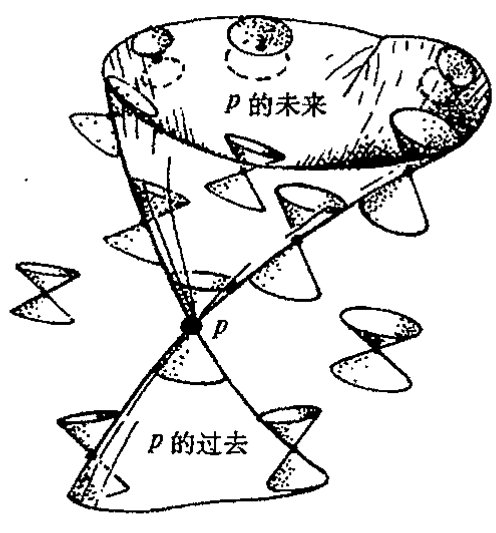
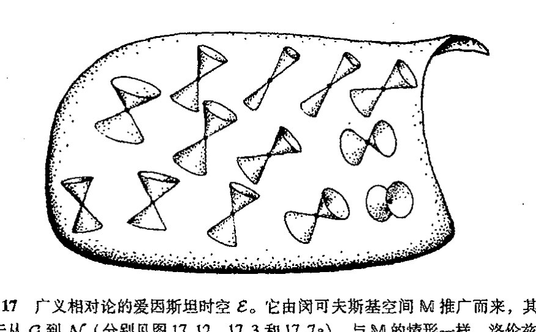

<!-- page 295 -->

通向实在之路

---

# 第十七章

# 时　空

## 17.1　亚里士多德物理学的时空

本书从现在起，我们的注意力将从前几章的主要以数学为主的思考，转向通过理论和观察而获得的物理世界的实际面貌。让我们从理解物理世界里所有现象赖以存在的竞技场——时空——开始。我们将发现，这个概念在本书余下的大部分内容里扮演着至关重要的角色。

首先我们要问的是，为什么说“时空（spacetime）”^1（而不说空间和时间）？将空间和时间分开来考虑，而不是把这两个看起来明显不同的概念结合成一个概念来考虑，有什么不对？尽管对时空这个问题大家似有同感，尽管爱因斯坦在他的广义相对论框架下将这一概念运用得相当纯熟，但时空概念却不是爱因斯坦的原创。而且在他第一次听到这个概念时，他似乎也并不热衷于此。此外，如果我们以事后诸葛亮的聪明回顾一下伽利略和牛顿的更为古老的相对性观点，我们发现，原则上说，他们同样能够因时空的观点大受裨益。

为了领悟这一点，让我们回到更远的历史，去看看在亚里士多德和他的同时代人的动力学框架下哪一种时空结构是恰当的。在亚里士多德物理学里，存在着欧几里得三维空间 $\mathbb{E}^3$，用来表示物理空间，空间里的点在时间上保持着自身的同一性。这是因为在亚里士多德的框架下，相对于各种动态而言，静态才是动力学上的优先态。在某一时刻一旦取定某个特定的空间点，则在下一时刻这个空间点仍是原来的那个点，只要处于该点上的粒子在这前后两个时刻之间保持静止。实在的这种图像就好比影剧院里的银幕，不论多么激烈的画面投射上去，银幕上的特定点始终保持着自身的同一性，见[图 17.1](assets/page296_fig01.jpg)。

时间也可以表示为一种欧几里得空间，只是相当平凡，仅是一维空间 $\mathbb{E}^1$。因此，我们可以把时间，还有物理空间，看作是一种“欧几里得几何”，而不仅仅是一种实值线 $\mathbb{R}$ 的拷贝。这是因为 $\mathbb{R}$ 有一个优先元 0，它可以表示为时间上的“零”，但从亚里士多德动力学观点上说，却不存在优先的原点。（在这一点上，我一直持所谓“亚里士多德动力学”或“亚里士多德物理学”

· 276 ·

<!-- page 296 -->

第十七章 时空

的理想化观点，我不采纳那种所谓亚里士多德实际是怎么想的观点！）²如果存在优先的“时间上的原点”，那么可以想见，在原点之后的时间里，动力学规律将发生变化。而如果不存在这样一种优先的原点，那么这些规律就将在时间上保持同一性，因为它们不取决于时间。

同样，我不认为存在优先的空间原点，空间在所有方向上无限延伸，使动力学规律处处起着完全相同的作用。（这同样与亚里士多德实际是怎么想的无关！）不论在一维还是三维的欧几里得几何中，都存在距离概念。在三维空间情形，这就是普通的欧几里得距离（可用譬如米或英尺来量度）；而在一维情形，就是普通的时间间隔（用譬如秒来量度）。

在亚里士多德物理学——和此后的伽利略和牛顿动力学框架下——存在一种绝对的时间上的同时性概念。因此按这种动力学理论，此时此刻，当我坐在我在牛津的家里的办公桌前敲这一行字时，仙女座同时发生了某件事（譬如一次超新星爆发），这二者间的“同时性”具有绝对意义。如果还用我们的电影银幕来比喻，则我们要问的是，这两个投影影像在银幕的相距遥远的两个位置上是同时放映的吗？这里答案很清楚，当且仅当它们出现在同一幅电影画面上时，两事件才是同时发生的。因此，我们不仅对（不同时刻的）两个事件是否发生于银幕的同一空间位置有明确的概念，而且对（不同空间位置的）两个事件是否发生于同一时刻也有明确的概念。此外，如果两事件的空间位置不同，那么不论它们是否同时发生，我们都有明确的二者间的距离概念（即在银幕上测得的距离）；同样，如果两事件发生的时间不同，那么不论它们是否发生于同一位置，我们都有明确的二者间的时间间隔概念。

所有这些告诉我们，在亚里士多德框架下，将时空看作是简单的积

$$\mathcal{A} = \mathbb{E}^1 \times \mathbb{E}^3$$

是合适的，我们称这个时空为亚里士多德时空。这是简单的偶 $(t, \mathbf{x})$ 空间，其中“时间”$t$ 是 $\mathbb{E}^1$ 的元素，“空间点”$\mathbf{x}$ 是 $\mathbb{E}^3$ 的元素（见[图 17.2](assets/page297_fig01.jpg)）。对于两个不同的 $\mathbb{E}^1 \times \mathbb{E}^3$ 点，譬如说 $(t, \mathbf{x})$ 和 $(t', \mathbf{x}')$——即两不同的事件——我们有明确的二者间空间间隔的概念（即 $\mathbb{E}^3$ 的点 $\mathbf{x}$ 与 $\mathbf{x}'$ 之间的距离），也有明确的二者间的时间差概念（即在 $\mathbb{E}^1$ 中测得的 $t$ 与 $t'$ 之间的间隔）。特别是，我们知道两个事件是否发生于同一地点（空间位移为零），也知道它们是否发生于同一时刻（时间差为零）。

---

· 277 ·

<!-- page 297 -->

通向实在之路

**图 17.2** 亚里士多德时空 $\mathcal{A}=\mathbb{E}^1\times\mathbb{E}^3$ 是偶 $(t,\mathbf{x})$ 空间，其中 $t$（“时间”）在一维欧几里得空间 $\mathbb{E}^1$ 上取值，$\mathbf{x}$（“空间点”）在 $\mathbb{E}^3$ 上取值。

## 17.2 伽利略原理下的时空相对性

现在我们来看看，对于伽利略于 1638 年引入的动力学框架来说，什么样的时空概念是适当的。但愿我们能把伽利略相对性原理结合进时空图像里。我们来看看这条原理是怎么叙述的。最好的方法就是援引伽利略本人的叙述（我这里只给出斯蒂尔曼·德雷克）³ 的译文节选，我强烈建议懂原文的读者去查看一下这段引文的全部）：

> 将你自己、一位朋友和几只苍蝇、蝴蝶或其他会飞的小动物一并关在一艘大船的甲板下的船舱内……天花板上吊一只瓶子，使瓶内液滴逐滴滴入正下方的容器内……让船以任意速度匀速地行驶并保证没有任何速度快慢上的波动……尽管液滴在空中下落的过程中船已向前行驶了一段距离，但液滴还是落入下方的容器内，丝毫不偏向船尾……蝴蝶和苍蝇仍是无拘无束地飞向各个地方，看不出任何因疲劳跟不上船的行驶而向船尾集中的迹象……

这里伽利略告诉我们的是，在任何匀速运动的参照系下，动力学规律都精确地一致。（这是他笃信哥白尼学说的基本信条，这个学说认为，与早先亚里士多德理论的地球必须保持静态的认识相反，地球始终处于运动中，不论我们是否注意这一点。）没什么东西可以将静态下的物理与匀速运动状态下的物理区分开来。由此我们知道，说一个特定空间点在以后的时间里还是不是选定的空间同一点，这在动力学上毫无意义。换句话说，在这里用银幕类比并不恰当！不存在时间演化中保持不变的背景空间——“银幕”。为了更有力地说明这个问题，我们来考虑地球的转动。按这种运动，地表上（譬如说，在牛津所在位置的纬度上）某一固定点每分钟约移动 10 英里。相应地，我们刚刚选定的点 $p$ 现在将被移至邻近的威特尼镇的附近或更远。但且慢！我这里还没将地球的绕日运动考虑进去。如果考虑这种运动，那么我们发现 $p$ 点会远出去一百多倍距

· 278 ·

<!-- page 298 -->

离，而且是在相反方向（因为在午后，地表上该点的运动方向与地球公转方向相反），同时地球离开 $p$ 点是如此遥远以至 $p$ 点已移出地球的大气层！但是我是否还应该考虑太阳绕银河系中心的运动？或考虑所谓银河系本身在本星系群内的“自行”？或考虑本星系群关于室女星团中心的运动（前者只是后者中的一小部分），还有室女星团相对于巨大的后发超级星系团的运动，甚至后发星系团向“巨引力源”的移动？

显然，我们应当认真对待伽利略理论。所谓空间一特定点过了一分钟后还是我们所选定的同一个空间点这种概念没有任何意义。在伽利略动力学里，我们有的不只是一个（像物理世界的活动得以在其中随时间展开的一种场所那样的）三维欧几里得空间 $\mathbb{E}^3$，而是在每个时刻有一个不同的 $\mathbb{E}^3$，这些不同的 $\mathbb{E}^3$ 之间没有自然的同一性。

或许你会感到惊奇，这种特有的物理空间概念似乎就像是此刻一过即刻蒸发，而下一时刻一到又以完全不同的方式重新再现！对此第 15 章的数学倒是可以帮上忙，因为那种情形正是我们现在研究的这种状况。伽利略时空 $\mathcal{G}$ 不是积空间 $\mathbb{E}^1 \times \mathbb{E}^3$，而是以 $\mathbb{E}^1$ 为底空间、$\mathbb{E}^3$ 为纤维的纤维丛！在纤维丛内，纤维与纤维之间不存在逐点同一，而是相互间协调共同组成一个连通的整体。每个时空事件被自然地赋予一个时间作为一个明确的“时钟空间” $\mathbb{E}^1$ 的一个特定元素，但不存在一种明确的可以在其中自然地赋予一个空间位置的“位置空间” $\mathbb{E}^3$。用 [§15.2](chapter_15.md#152-丛的数学思想) 的丛语言来表达，就是这种对时间的自然赋值是由 $\mathcal{G}$ 到 $\mathbb{E}^1$ 的规范投影来取得的（见[图 17.3](assets/page298_fig01.jpg)；并与[图 17.2](assets/page297_fig01.jpg) 比较）。

**图 17.3** 伽利略时空 $\mathcal{G}$ 是由底空间 $\mathbb{E}^1$ 和纤维 $\mathbb{E}^3$ 组成的纤维丛，因此不同的 $\mathbb{E}^3$ 纤维之间不存在逐点同一（无绝对空间），而每个时空事件通过规范投影被自然地赋予一个时间（绝对时间）。（比较图 15.2，但这里到底空间的规范投影是在水平面上描述的。）粒子的历史（世界线）是丛截面（比较图 15.6a），粒子的惯性运动被视为 $\mathcal{G}$ 的结构的具体化，即“直的”世界线。

## 17.3 时空的牛顿动力学

时空的这种“丛”图像非常有效，但我们怎样来表述这种时空的伽利略－牛顿动力学呢？毫不奇怪，在牛顿开始系统表述他的动力学定律时，发现他必须对所偏爱的“绝对空间”概念做出描述。事实上，至少在起初，牛顿更多的是像伽利略本人一样是个伽利略相对论者。这一点可以从他最初对运动定律的表述上看得很清楚。他明白地把伽利略相对性原理阐述为基本定律（这一原理认为，物理作用与作匀速运动的参照系之间的变换无关，时间概念如同它在上述伽利略时空 $\mathcal{G}$ 的图像里一样是绝对的）。

牛顿最初给出的是 5（或 6）条定律，其中定律四就是伽利略原理，但后来在他出版《自然

<!-- page 299 -->

通向实在之路

《哲学的数学原理》一书时，他将这些定律简化为我们今天所熟知的“牛顿三定律”，因为他认为这三条定律已足以导出所有其他定律。为使理论结构精确化，他需要采用“绝对空间”来描述运动。如果当时牛顿有“纤维丛”的概念（姑妄言之），那么他很可能会以“伽利略不变量”方式用之于表述定律。但没有这样一种概念，我们很难想象牛顿除了引入某种“绝对空间”概念之外，还能如何阐述其理论。

我们应当为“伽利略时空”$\mathcal{G}$安排怎样一种结构呢？如果是带丛联络（[§15.7](chapter_15.md#157-丛联络的非平凡性)）的纤维丛那也未免太强了。**[17.1]**其实我们要做的是给出一种相应于牛顿第一定律的东西。这条定律认为，如果没有力作用其上的话，粒子的运动必保持匀速和直线运动状态。此即所谓惯性定律。从时空角度看，粒子是否在做惯性运动（即“历史”）可由称之为粒子的世界线的曲线来表示。实际上，在伽利略时空里，世界线必然是伽利略丛的截面（见[§15.3](chapter_15.md#153-丛的截面)。*[17.2]*和图17.3）。（惯性运动）按通常的空间概念理解，“保持匀速和直线运动状态”概念就是指时空上的简单“直线”。因此，伽利略丛$\mathcal{G}$必然具有一种可描述世界线的“直线性”的结构。或者说，我们可断定$\mathcal{G}$是

389

这样一种仿射空间（[§14.1](chapter_14.md#141-流形上的微分)），其中的仿射结构在限定到单个的$\mathbb{E}^3$纤维时等同于每个$\mathbb{E}^3$的欧几里得仿射结构。另一种办法是直接指定自然归属于$\mathbb{E}^1 \times \mathbb{E}^3$（“亚里士多德”匀速运动）的$\infty^6$直线族，并用作为伽利略丛的“直线”结构，同时“忘掉”其实际的亚里士多德时空$\mathcal{A}$的积结构。（回忆一下，$\infty^6$意味着六维族，见[§16.7](chapter_16.md#167-物理学中无限的大小)。）此外还有一种办法是认定伽利略时空是一种流形，它具有零曲率和零挠率的联络（当看成是$\mathbb{E}^1$上的丛时，这与具有丛联络完全不同）。**[17.3]**

事实上，这第三种观点是最令人满意的，因为它允许我们将（在[§17.5](#175-嘉当的牛顿时空), 9里描述的那种与爱因斯坦引力理论相一致的）引力概念一般化。有了定义在$\mathcal{G}$上的联络，也就有了测地线（[§14.5](chapter_14.md#145-测地线平行四边形和曲率)）的概念。这些测地线（那些在单个$\mathbb{E}^3$上的简单直线除外）定义了牛顿的惯性运动。我们还可以考虑那些不是测地线的世界线。在通常的空间概念下，这些世界线表示的是粒子的加速运动。从时空上看，这个加速度的大小可用世界线的曲率来量度。***[17.4]*按照牛顿第二定律，这个加速度等于粒子受到的总的力除以其质量。（即牛顿的$f=ma$，写成$a=f\div m$形式，这里$a$是粒子的加速度，$f$是作用到粒子上的总的力。）因此，对给定质量的粒子，世界线的曲率提供了一种对作用在粒子上的总的力的量度。

在标准牛顿力学里，作用到一个粒子上的总的力是来自所有其他粒子贡献的（矢量）和（图17.4(a)）。在任一特定的$\mathbb{E}^3$下（即任一时刻），一个粒子受到的源自另一个粒子的力作用在沿连接二者的连线方向上（处于该特定的$\mathbb{E}^3$内）。就是说，这种作用是同时作用在这两个粒子上（见图17.4(b)）。牛顿第三定律断言，这两个粒子中每个粒子受到的力，正如作用到对方时那样，总是大

---

**[17.1]** 为什么？

*[17.2]* 给出这么做的理由。

**[17.3]** 更充分地解释这三种方法，说明为什么它们都能给出同样的结构。

***[17.4]*** 试根据联络$\nabla$写出这种曲率的表达式。（如果有的话）切矢量的归一化条件是什么？

·280·

<!-- page 300 -->

第十七章 时空

小相等，方向相反。另外，对每一种不同性质的力，有一个力定律，它告诉我们粒子间的空间距离与力的大小之间应有什么样的函数关系，每一种粒子应配以什么样的参数，并描述力的作用范围。具体到引力，这个函数取距离平方反比关系，而且在所有尺度上都是一个确定常数，即牛顿引力常数 $G$，再乘以两粒子的质量积。用符号表示，就是著名的牛顿引力公式，即

$$\frac{GmM}{r^2}$$

这里 $m$，$M$ 分别是两粒子质量，$r$ 是二者间距离。

**图 17.4** （a）牛顿力：在任意时刻，作用在一个粒子上的总的力（粗箭头）是所有其他粒子贡献（引力和斥力）的矢量和。（b）两粒子的世界线和它们之间的"瞬时"作用的力，在特定的 $\mathbb{E}^3$ 的任一时刻，这种力总是在两粒子的连线方向上。牛顿第三定律断言，一个粒子施加给另一个粒子的力与后者施于前者的力，大小相等但方向相反。

这真是绝了，仅仅从这些简单的量上我们就可以得到一个力量非凡的普适的理论，它能够以很高的精度来描述宏观物体的行为（在绝大多数情形下，对微观粒子也适用），只要它们的速度远小于光速。在引力情形，鉴于对太阳系行星运动的细致观察，理论和观察之间的一致性特别明了。现已发现，牛顿理论在 $10^{-7}$ 的精度上仍是正确的，这是非常了不起的成就，要知道牛顿当时可利用的数据精度可只有现在的万分之一（即 $10^3$ 分之一）。

## 17.4 等效原理

尽管具有非凡的精度，尽管牛顿的伟大理论在近两个半世纪来几乎未遇到挑战，但我们现在知道，这个理论并不是绝对准确的；此外，为了改进牛顿理论，我们需要用爱因斯坦的更深刻的关于引力性质的非常革命性的观点。然而，就任何观察结果而言，这一特定的观点本身并未完全改变牛顿理论。只是当涉及接近光速的情形和狭义相对论概念（我们将在 §§ 17.6，8 里予以考虑）时，我们才会注意到爱因斯坦的观点带来的变化。引力理论与狭义相对论的完满结合产生了爱因斯坦的广义相对论，我们将在 [§17.9](chapter_17.md#179-爱因斯坦广义相对论的时空) 予以定性说明，并在 §§ 19.6–8 里给予更细致的

<!-- page 301 -->

通向实在之路

讨论。

那么，爱因斯坦更深刻的观点是什么？这就是对等效原理这一基本重要性的认识。什么是等效原理呢？我们得（再次）回到伟大的伽利略那儿（16 世纪末——虽然在他之前已有先驱，如 1586 年的西蒙·斯蒂文以及更早以前的像公元 5 或 6 世纪的约安尼斯·菲利普诺斯（Ioannes Philiponos））去才能说清楚这个根本性的概念。回顾一下（据称是）伽利略的比萨斜塔实验（从比萨斜塔顶端同时落下一大一小两块石头，见[图 17.5](assets/page301_fig01.jpg)(a)）。伽利略卓越地洞察到二者将以同样的速度下落，如果不计空气阻力的话。不论他是否真的从塔上落下过石块，但他的确做过其他确认其结论的实验。

**图 17.5** （a）（据称是）伽利略的比萨斜塔实验。一大一小两块石头从比萨斜塔顶端落下。伽利略洞察到，如果不计空气阻力的话，二者将以同样的速度下落。（b）（具有相同质量的）带异号电荷的木髓球在指向地面的电场作用下，一个可能向"下"落，另一个则可能向上升。

现在要确定的第一点是，这是一种特定的引力场性质，而不是任何其他的力使然。伽利略的洞察所赖的这种引力性质取决于这样一个事实：由某种引力场施加在物体上的引力强度正比于该物体的质量，而运动的阻力（出现在牛顿第二定律里的量 $m$）也是质量。我们有必要区分这两种质量概念，为此将前一种称为**引力质量**，后一种称为**惯性质量**。（我们也可以选择保守质量和主动质量这样一种区分。所谓保守质量是指在我们考虑 $m$ 微粒受到 $M$ 微粒的引力作用时牛顿平方反比律 $GmM/r^2$ 里的 $m$，而在考虑 $m$ 微粒施加到 $M$ 微粒的引力作用时，质量 $m$ 则扮演着主动的角色。但牛顿第三定律判定，这两种质量是相等的，因此我这里不再区分这二者。⁶）因此，伽利略的洞察有赖于引力质量和惯性质量的相等（或更准确地说，呈正比性）。

从牛顿整个动力学框架的视角来看，这两种质量的同一真是自然的万幸。如果场不是引力性质的，而是譬如说电场性质的，那么结果就会完全不同。与保守的引力质量对应的电性质是电

· 282 ·

<!-- page 302 -->

荷，而惯性质量（即加速度的阻力性质）则仍与引力情形相同（即仍是牛顿第二定律 $f = ma$ 里的 $m$）。如果伽利略比萨斜塔实验里的两块石头代换为具有相等的小质量但带异号电荷的木髓球[^1]，在指向地面的背景电场作用下，一个球可能朝"下"落，而另一个球则上升——一种完全反向的加速运动！（见[图 17.5](assets/page301_fig01.jpg)(b)。）所以会出现这种情形，是因为物体携带的电荷与惯性质量无关，甚至带的电荷符号亦可以不同。伽利略的见识不能用于电场，它只对引力这一特定情形有效。

为什么这种引力特性会称为"等价原理"呢？原来这里"等价"指的是均匀引力场等价于一种加速度。这种效应与人在空中旅行时的感觉非常相似。当飞机在加速运动时，机舱里的人可能会有一种完全错误的"下"的感觉（这里只是掉了个方向）。机舱里的人不可能仅仅通过"感觉"来区分加速效应和地球引力场效应，这两种效应能够通过两个不同方向上的叠加来使你感到"应当是"在下的情形，而其实却是处在与实际的下的方向完全不同的状态下（你或许会对窗外所见感到惊奇）。

为了说明为什么这种加速度与引力效应之间的等价性正是上面描述的伽利略的洞察力所在，我们再来考察他的落体运动。想象一只昆虫叮在其中的一块石头上正看着另一块。对这只昆虫来说，另一块石头看起来只是飘浮在空中而没有运动，就像完全没有引力场一样（见[图 17.6](assets/page303_fig01.jpg)(a)）。在与石头一起的下落过程中，昆虫共享的加速度摒除了引力场，就好像引力根本不存在——直到石头和昆虫都落了地，这场"失重"经历[^7]才戛然而止。

我们都知道宇航员也有"失重"经历——但他们是处于绕地球的轨道上（[图 17.6](assets/page303_fig01.jpg)(b)）（或正处于飞机开始俯冲的时刻）从而避免了昆虫难堪的突然结局。他们都像昆虫一样处于自由落体状态，只不过取道一种更明智的途径。引力可以（依据等效原理）通过加速来取代的事实是（保守的）引力质量等同于（或正比于）惯性质量的直接结果，它正是伽利略伟大洞察力的一个事实。

如果我们要认真对待这条等价原理，我们就必须采取一种不同于 [§17.3](#173-时空的牛顿动力学) 里对待"惯性运动"所采取的观点。以前，惯性运动是作为粒子处于零合外力作用下的一种状态出现的。但这对于引力有困难。由于等效原理，故不存在局域的分辨是否有引力作用或"感到的"引力是否是加速效应的方法。此外，正如伽利略石头上的昆虫或轨道上的宇航员感知的，引力可以被简单的自由落体所摒除，并且由于我们能够依此来去除引力，因此我们必须对此采取不同的观点。这就是爱因斯坦意义深远的新观点：将惯性运动视为这样一种质点运动：当质点上总的非引力性的力为零时，它们必定在引力场内做自由落体运动（因此有效的引力也减为零）。这样，昆虫的下落轨迹和宇航员的地球轨道运动必然都可视为是惯性运动。另一方面，在爱因斯坦框架下，站在地面上的某个人不经历惯性运动，因为静立于引力场里不是一种自由落体运动状态。而对牛顿来说，这一直被看作是惯性，因为在牛顿框架下"静态"总是当作"惯性"来看待的。作用于这个人

---

[^1]: 一种用木芯海绵体搓成的小球，很轻，常用作验电体。——译者

· 283 ·

<!-- page 303 -->

通向实在之路

**图 17.6** （a）在图 17.5（a）中的叮在一块石头上的昆虫看来，另一块石头只是飘浮在空中而没有运动，就像不存在引力场一样。（b）类似地，自由轨道上的宇航员也有失重经历，其空间形态也像是飘浮，没有运动，尽管显然存在着地球。

上的引力由向上的地面支撑力来补偿，但按爱因斯坦的要求，它们各自都不为零。另一方面，在牛顿看来，昆虫或宇航员的惯性运动则都不是惯性的。

## 17.5　嘉当的“牛顿时空”

我们如何将爱因斯坦的“惯性”运动概念综合进时空结构里？作为迈向完全的爱因斯坦理论的一步，考虑按爱因斯坦的观点来重构牛顿引力理论无疑是有帮助的。正如 [§17.4](#174-等效原理) 开头提到的，这并不真正代表牛顿理论的变化，而仅仅是给出一种不同的描述。这么做只当是我再一次擅改历史，因为提出这种重新表述的是杰出的几何学家和代数学家嘉当——我们在第 13 章（也可回顾一下 [§12.5](chapter_12.md#125-形式的积分)）记述过他在连续群理论方面的重要影响——时间差不多是在爱因斯坦提出他的革命性观点之后的六年里。

概略地说，在嘉当理论里，正是爱因斯坦的而非牛顿意义上的惯性运动提供了“直的”时空世界线。否则这种几何就像 [§17.2](#172-伽利略原理下的时空相对性) 里的伽利略几何了。我把这种几何称为牛顿时空 $\mathcal{N}$，牛顿引力场可以完全编译进这种结构里。（我大概应称之为“嘉当时空”，但这是个别扭的词。毕竟亚里士多德不知道积空间，伽利略也不懂纤维丛！）

如同前述的伽利略时空 $\mathcal{G}$ 一样，时空 $\mathcal{N}$ 是由底空间 $\mathbb{E}^1$ 和纤维 $\mathbb{E}^3$ 构成的丛。但现在 $\mathcal{N}$ 上有不同于 $\mathcal{G}$ 上的某种结构，这是因为这种代表惯性的“直的”世界线族是不同的（见[图 17.7](assets/page304_fig01.jpg)（a）），至少在除了引力可被自由落体的整个参照系摒除的情形之外的所有情形里是如此。这种例外的情形可能是整个空间呈完全均匀（各点的大小和方向均相同），但可随时间变化的牛顿引力场。对这种引力场里的自由落体观察者来说，可能根本感觉不到场的存在！**[17.5]** 在这样一种

---

**[17.5]** 对给定的空间均匀但幅度和方向随时间变化牛顿引力场 $\mathbf{F}(t)$，给出 $\mathbf{x}$ 作为 $t$ 的函数的显变换式。

· 284 ·

<!-- page 304 -->

第十七章 时空

情形里，$\mathcal{N}$ 的结构等同于 $\mathcal{G}$ 的结构（[图 17.7](assets/page304_fig01.jpg)b，c）。但大多数引力场与无引力场情形“本质上不同”。你能看出为什么吗？我们能否认识到在什么条件下 $\mathcal{N}$ 的结构才不同于 $\mathcal{G}$ 的结构？现在我们就来讨论这个问题。

**图 17.7** （a）牛顿-嘉当时空 $\mathcal{N}$，与伽利略时空 $\mathcal{G}$ 一样，是具有底空间 $\mathbb{E}^1$ 和纤维 $\mathbb{E}^3$ 的丛。其结构取决于引力作用下自由落体（爱因斯坦意义上的惯性）运动的类型。（b）全空间均匀的牛顿引力场特例。（c）其结构完全等同于 $\mathcal{G}$ 的情形，这一点可以通过水平“滑移”纤维 $\mathbb{E}^3$ 使所有自由落体的世界线都取直为止看出来。

这里的关键是流形 $\mathcal{N}$ 像特定情形 $\mathcal{G}$ 一样有一个联络。这个联络 $\nabla$（见 [§14.4](chapter_14.md#144-曲率和挠率)）的测地线是“直的”世界线，它代表着爱因斯坦意义上的惯性运动。这个联络是无挠的（[§14.4](chapter_14.md#144-曲率和挠率)），但一般来说有曲率（[§14.4](chapter_14.md#144-曲率和挠率)）。正是曲率的出现使得一种引力场“本质上不同于”无引力场情形，这一点与仅考虑均匀空间的场不同。我们来看看这种曲率的物理意义。

想象宇航员阿尔伯特（我们称他为“A”）正在地球大气层外不远的空间里作落向地面的自由落体运动，速度是多大无关紧要，我们关心的只是他（和邻近质点）的加速度。A 在轨道上是安全的，不必落向地面。想象 A 处于一个质点球内，开始时周围质点相对于 A 静止。现在，按一般的牛顿力学理解，球内的不同质点都在向着地球球心 E 做加速运动，但因为各自面对 E 的方向略有不同，与 E 的距离也各不相同，因此各质点的加速度方向和大小各不相同。我们关

· 285 ·

<!-- page 305 -->

通向实在之路

心的是各质点相对于 A 的相对加速度，因为我们感兴趣的是一个惯性观察者——在此情形下就是 A——能从周围的惯性质点上观察到什么变化。整个情形如[图 17.8](assets/page305_fig01.jpg)(a)。与 A 呈水平偏离的质点在向 E 加速时其相对于 A 的加速度指向球内（因为它到地心的距离有限），而与 A 呈垂直偏离的质点的相对于 A 的加速度则指向球外（因为引力随距 E 的距离增加而减小）。这样，质点球将畸变成一个旋转椭球面（一种扁长的椭球面），它的主轴（对称轴）在 AE 连线的方向上。此外，最初球是畸变成一个与球等体积的椭球。****[17.6] 这是牛顿引力的平方反比律的特征表现，当我们切入爱因斯坦的广义相对论时就会体会到这一事实的意义。应当指出，这种保体积效应只在开始时（粒子相对于 A 呈静止时）成立；尽管如此，在 A 处于真空区域时，这个效应毕竟是牛顿引力场的一个普遍特征。（另一方面，椭球的旋转对称性只是这里特定的几何对称性的一种巧合。）

图 17.8　（a）潮汐效应。宇航员 A（Albert）处于粒子球内，开始时周围粒子相对于 A 静止。按牛顿理论，他们都有一个指向着地心 E 的加速度（细箭头），只是方向和大小略有差别。用各质点的加速度减去 A 的加速度，我们得到各质点相对于 A 的相对加速度（粗箭头）。对于与 A 呈水平偏离的质点来说，其相对于 A 的加速度指向球内，而与 A 呈垂直偏离的质点的相对加速度则指向球外。这样，质点球将畸变成一个（扁长的）旋转椭球面，其对称轴沿 AE 方向。初始畸变保体积。（b）现在将 A 置换为地心 E，粒子球处于地球大气层的外层，则球面各处的相对加速度（相对于 A = E）都指向内，初始体积收缩的加速度为 4πGM，这里 M 是包围的总质量。

现在，我们如何依据时空 𝒩 的图像来考虑这一切呢？在图 17.9(a)，我试着说明了从 A 和周围粒子的世界线的角度看这种情形会是怎样的。（不用说，我得去掉一个空间维，因为很难描述真正的四维几何！幸好两个空间维已足以说清楚基本概念。）注意，因为与 A 的测地世界线相邻的测地线存在测地偏差，因此质点球（这里描述成质点圆）出现畸变。在 [§14.5](chapter_14.md#145-测地线平行四边形和曲率) 里，我说明过为什么这种测地偏差实际上是对联络 ∇ 的曲率 **R** 的一种测度。

**** [17.6] 利用 O( ) 符号推导这些性质，其中无穷小应当保留到哪一级？

· 286 ·

<!-- page 306 -->

---

**图 17.9** 依据相邻测地线的相对畸变给出的图 17.8 的（图 17.7 的牛顿–嘉当的 $\mathcal{N}$）的时空图像。(a) 从 A 和周围质点（压缩了一个空间维）的世界线上看到的虚空空间里的测地线偏差（大体是 [§19.7](chapter_19.md#197-进一步的问题宇宙学常数外尔张量) 里的外尔曲线），如同从附近物体 E 的引力场导出的情形一样。(b) 由于测地线丛内的质量密度引起的相应向心加速度（基于里奇曲率）。

在牛顿物理学里，上述畸变效应被描述成所谓引力的潮汐效应。如果交换一下 E 与 A 的位置，将 A 视为地心，而 E 视为月亮（或太阳），这个概念就很容易理解。我们把粒子球看作是地球上的洋面，于是我们看到，由于月亮（或太阳）的非均匀引力场，洋面必然会出现畸变。*[17.7] 这种畸变就是海洋的潮汐现象，因此"潮汐效应"用来直接说明时空曲率的确是合适的。

实际上，在这种情况下，对单个质点而言，月亮（或太阳）对地球表面的质点的相对加速作用只是对这些粒子受到的主要引力作用（即地球本身的引力作用）的一项小修正。当然，这种主效应是向心的，即指向地心的方向（就是这里的 A 点，见[图 17.8](assets/page305_fig01.jpg)(b)）。如果现在我们把质点球当作地球大气层的外围（这样我们可忽略空气阻力），那么球内所质点都作向心的自由落体运动（爱因斯坦意义上的惯性运动），而不是整个球面畸变到与初态体积相等的椭球面，因此这里有一种体积收缩效应。一般来说，这两种效应都存在。在虚空空间，只有畸变没有初始体积的收缩；而当球面充满物质时，则存在着与所包围的物质总质量成正比的初始体积收缩。设这个质量为 $M$，则体积收缩的初始"速率"（可看作是对向心加速度的一种量度）为

$$4\pi GM$$

这里 $G$ 是牛顿引力常数。*[17.8]，**[17.9]

正如嘉当所说，我们可以按照联络 $\nabla$ 的数学条件完全重构牛顿引力理论。这些条件是一些

---

*[17.7] 证明：这种潮汐畸变正比于 $mr^{-3}$，这里 $m$ 是引力体（看成是质点）的质量，$r$ 是距离。从地球上看，太阳和月亮像是具有差不多相等的角大小的圆盘，但月亮引起的地球洋面的潮汐畸变差不多是太阳的五倍。由此我们可以知道它们的相对密度之间有什么关系？

??? question "答案 [17.7]"
    质点引力加速度大小为 $Gm/r^2$，在大小为 $R$ 的小球两端的差别约为导数乘以 $R$，即 $2GmR/r^3$。去掉共同自由落体加速度后，剩下的相对加速度正比于 $m r^{-3}$，这就是潮汐畸变的尺度。

    太阳和月亮视角大小近似相同，故其半径与距离之比近似相同，$R_s/r_s\simeq R_m/r_m$。潮汐比为 $m_m/r_m^3$ 与 $m_s/r_s^3$ 之比，也就是平均密度之比。月潮约为日潮五倍，说明月球平均密度约为太阳平均密度的五倍。

**[17.8] 假定所有质量都集中在球心，给出这一结果。

***[17.9] 证明：不论稳态质点周围的壳层有多大，取什么形状，质量分布如何，这个结果大体上总是对的。

??? question "答案 [17.9]"
    在牛顿引力中，远离一个有界质量分布时，引力势的多极展开首项只由总质量给出：$\Phi=-GM/r+O(r^{-2})$。偶极及更高多极项随距离衰减更快。

    因此只要观察尺度远大于壳层大小，外部场的主导项总等价于位于质心的点质量场；形状和内部质量分布只影响较小的高阶修正。

· 287 ·

<!-- page 307 -->

通向实在之路

关于曲率 *R* 的基本方程，它们提供了一种对上述讨论所必需的数学表示，并将物质密度 *ρ*（单位体积质量）与 *R* 的“体积收缩”项联系起来。这里我就不给出嘉当的具体细节描述了，因为这对我们后面要讨论的完整的爱因斯坦理论（某种意义上说还更为简单）不是必需的。但是，这里重要的是概念本身，它不仅引导我们逐渐进入爱因斯坦理论，而且在后面第30章（[§30.11](chapter_30.md#3011-与爱因斯坦原理的基本冲突)）讨论量子引力难题及其可能的解时也有一定作用。

## 17.6　确定不变的有限光速

上述讨论中，我们考虑的是爱因斯坦广义相对论的两个基本面，即相对性原理和等效原理。前者告诉我们物理定律无法区分静态和匀速运动，后者则告诉我们要囊括引力场我们该对这些概念作怎样的调整。现在我们得转到爱因斯坦理论的第三个基本要点上来，这就是有限光速的概念。真不可思议，爱因斯坦理论的所有三个基本要点居然都可追溯到伽利略那里！伽利略可能是清楚表述光速有限思想的第一人，为此他实际测量过光速。其所用的方法是观察相距遥远的山顶上提灯闪光的同时性；现在我们知道，这种方法是过于粗略简单了。但在1667年，他根本无法预见光的实际传播速度是如此之快。

似乎伽利略和牛顿^8^ 在光的本性与将物质凝聚在一起的力之间可能存在深刻联系这一点上都存有深深的疑虑。这些远见卓识的真正实现要等到20世纪了，此时人们对化学力和将各个原子聚合起来的各种力的本性已有了真正的了解。现在我们知道，这些力本质上说都是基本的电磁作用（要考虑带电粒子间的电磁场），而电磁场理论也就是光的理论。要理解原子和化学，就需要搞懂更为基本的量子力学要点。但描述电磁场和光的基本方程则早在1865年就由苏格兰物理学家麦克斯韦（James clark Maxwell，1831~1879）给出了，这归功于30年前法拉第（Michael Faraday，1791~1867）的影响深远的实验发现对他的启发。我们稍后再来讨论麦克斯韦理论（[§19.2](chapter_19.md#192-麦克斯韦电磁场理论)），当务之急是要搞清楚光速有一个确定不变的有限值，通常我们用 *c* 来表示，在实用单位制里其大小是每秒 3 × 10^8^ 米。

但这给我们出了个难题，如果我们要保留相对性原理的话。常识告诉我们，如果在一个观察者静止的参照系里测得的光速取特定值 *c*，那么在相对于静止参照系做高速运动的另一个参照系里的第二个观察者测得的光速就该有不同的值，是增大还是减小要依第二个观察者的运动状态来定。但相对性原理又要求第二个观察者的物理定律——具体到这里的情形，就是第二个观察者测得的光速——与第一个观察者的保持同一。光速不变性与相对性原理之间的这种明显的矛盾导致爱因斯坦——事实上此前也曾导致丹麦物理学家洛伦兹，更完整地说，还包括法国数学家庞加莱——提出一种完全去除这一矛盾的著名观点。

这个矛盾是怎么解决的呢？我们认为在这两个基本要求之间会出现这种无法解决的冲突是很自然的：一边是麦克斯韦理论，它包含绝对光速；另一边是相对性原理，它要求物理定律与据

· 288 ·

<!-- page 308 -->

以描述的参照系的速度无关。我们为什么就不能取光速甚至超过光速的参照系呢？在这样一种参照系里，光速还能保持它原先的值吗？这些毫无疑问的矛盾不会出现在牛顿（我猜想还有伽利略）所钟爱的理论里。在他们的理论里，光的行为表现得像粒子，其速度取决于源的速度。因此伽利略和牛顿仍可以幸福地与相对性原理生活在一起。但这样一种光的本性的图像随着经年的观察遇到越来越多的矛盾，例如，据对遥远的双星的观察，光速与光源的速度无关。⁹ 另一方面，麦克斯韦理论变得越来越有力，不仅得到了来自实验观察的有力支持（最著名的当属1888年的海因里希·赫兹实验了），而且理论本身也显示出令人信服的统一性质，它可以将支配电场、磁场和光的物理规律整个儿地统一到一个非常优美而且本质简单的数学框架里。在麦克斯韦理论里，光取波动而非粒子形式，我们必须面对这样一个事实：在这个理论里，光的传播速度的确就是不变的。

## 17.7　光锥

时空几何观点使我们有了一条特别清晰的途径用来解决麦克斯韦理论和相对性原理之间的矛盾。正像我前面提到的，这种时空观并非爱因斯坦原先采用的观点（也不是洛伦兹的观点，显然更不是庞加莱的观点）。但作为后见之明，我们可以看出这种处理的强有力之处。现在，我们暂时撇开引力以及由相对性原理带来的枝微末节和繁琐，由一块空白的白板开始——或者说，由平凡的实四维流形开始。我们希望看到存在一个基本的速度，而这个速度就是光速。在时空的任意一点（即“事件”）$p$，我们可设想过 $p$ 点的沿各种不同空间方向的一簇光线。用时空语言描述就是一簇过 $p$ 点的世界线，见[图 17.10](assets/page308_fig01.jpg)(a),(b)。

**图 17.10**　光锥确定了基本光速。过时空点（事件）$p$ 的光子历史。（a）仅从单纯的空间上看，（未来）光锥是一个自 $p$ 向外扩张的球面（波前）。（b）从时空上看，过上 $p$ 点的光子历史扫过 $p$ 点的光锥。（c）鉴于后面要考虑弯曲时空，我们不妨将 $p$ 点的光锥看作是时空（即 $p$ 点的切空间 $T_p$）的局域结构。

尽管麦克斯韦理论将光看作是波动效应，但这里我们不妨将这簇世界线当成过 $p$ 点的“光子的历史”来看待。我们有很多理由来说明这么做并不会引起重要的冲突。我们可将麦克斯韦理

· 289 ·

<!-- page 309 -->

通向实在之路

402 论里的“光子”当作细微的极高频电磁扰动丛，作为以光速运动的小粒子，其行为足以满足我们的目的。（此外，我们还可用“波前”或数学家所谓的“次特征（bicharacteristics）”概念来考虑，当然更好的是用量子理论，按照这一理论，光也可以认为是由“粒子”组成，这种粒子指的正是“光子”。）

在 $p$ 点附近，过 $p$ 的光子历史族形成一个如[图 17.10](assets/page308_fig01.jpg)(b) 所示的时空锥，我们称它为 $p$ 点的光锥。在时空范畴里，视光速为基本量就是视光锥为基本量。实际上，从流形几何（见第 12、14 章）的观点看，将“光锥”看作是 $p$ 点切空间 $T_p$ 里的一种结构（[图 17.10](assets/page308_fig01.jpg)(c)）更合适。（因为我们关心的是 $p$ 点的速度，而速度被定义为切空间里的某个量。）人们经常用零锥这个术语来指这种切空间结构——我自己实际上也爱这么用——“光锥”这个术语则多强调它在时空中的实际位置。注意，光锥（或零锥）有过去锥和未来锥两个部分。我们可以将过去锥看作是 $p$ 点发生向心爆聚的一次闪光的历史，因此所有光线同时会聚到事件 $p$；相应地，未来锥代表的是 $p$ 点发生爆炸的一次闪光的历史，见图 17.11。

403 我们怎么给出 $p$ 点零锥的数学描述呢？第 13 和 14 章提供了这一基础。我们要求光速在 $p$ 点的所有方向上相等，因此一次闪光后的某个瞬间围绕该点的空间构形应是一个球面而不是其他某种卵形面。^10^ 这里的“瞬间”我是指所有这些考虑都只是在 $p$ 点的一个无限小时间（和空间）邻域内。说零锥看似“球状”实际上是指这个锥可以由切空间 ^1^ 内的二次方程给出。就是说这个方程有形式

$$g_{ab}v^a v^b = 0,$$

这里 $g_{ab}$ 是洛伦兹符号差的某个非奇异对称 $\begin{bmatrix} 0 \\ 2 \end{bmatrix}$ 张量 $\mathbf{g}$ 的指数形式（[§13.8](chapter_13.md#138-正交群)）。^**[17.10] “零锥”里的“零”是指矢量 $v$ 对（伪）度规 $\mathbf{g}$ 有零长度（$|v|^2 = 0$）。

在此，我们只从按上述方程定义零锥的角度来考虑 $\mathbf{g}$。如果 $\mathbf{g}$ 乘以任一非零实数，得到的仍是原来的零锥（亦见 [§27.12](chapter_27.md#2712-共形图) 和 [§33.3](chapter_33.md#333-共形群紧化闵可夫斯基空间)）。简言之，我们要求 $\mathbf{g}$ 起到提供时空度规的物理作用，

404 为此我们将要求适当的尺度因子；但目前处理的只是每个时空点一个的一族零锥。为了能判断光速是常数，我们取这样一种情形：不同事件的零锥彼此平行，因为空间里的“速度”就是时

---

^** [17.10] 解释为什么。

· 290 ·

<!-- page 310 -->

空里的“斜率”。由此我们得到时空的图像如[图 17.12](assets/page310_fig01.jpg)。

**图 17.12** 闵可夫斯基空间 $\mathbb{M}$ 是平直的，其零锥均匀排布，这里显示的是所有零锥呈平行排布。

---

## 17.8　放弃绝对时间

现在我们可以问，伽利略时空 $\mathcal{G}$ 的丛结构是否适于另外加入？换句话说，我们能将绝对时间概念整合到现在的图像里吗？如果是，那么我们得到的图像将是如[图 17.13](assets/page310_fig02.jpg) 的样子。时空的 $\mathbb{E}^3$ 切片使得每个切空间 $T_p$ 成为三维平面元加上个零锥（[图 17.13](assets/page310_fig02.jpg)）。但正如我在下一章里要详细解释的，$g$ 决定了正交性，这意味着每个事件 $p$ 都有一个优先方向（该三维平面元关于 $g$ 的正交完备性），这个优先方向使得静态在每个点上处于优先位置。我们失去了相对性原理！

**图 17.13** 引入到 $\mathbb{M}$ 绝对时间概念确定了过 $\mathbb{M}$ 的一族 $\mathbb{E}^3$ 切片，也就是每个事件点的局部三维元。但每个零锥定义一个（伪）度规 $g$，彼此之间至多成比例，其正交性决定了存在一种静态。

用更平实的语言说，这个讨论可简单表述为这样一种“常识性”概念：如果存在绝对光速，那就会存在优先的“静态”，在此状态下光速在各方向上是相同的。不够显然的是这种冲突仅当我们试图保留绝对时间概念（或至少是为每个 $T_p$ 保留一个优先的三维空间）时才会凸现。我们现在很清楚该怎么做了。绝对时间概念（因此 $\mathcal{G}$ 和 $\mathcal{N}$ 的丛结构）必须放弃。在我们目前达到的复杂水平上，这么做并不让我们感到特别吃惊。我们已经看到，只要认真采纳伽利略相对性原理，我们就必须放弃绝对空间（虽然这种意识并不像它应有的那样为人所知）。因此现在，接受这样一种事实——时间如同空间一样不是一个绝对概念——似乎不应当是一场革命。

因此，我们必须向时空的 $\mathbb{E}^3$ 切片挥手作别，并承认绝对时间的观念之所以在我们的思想中

· 291 ·

<!-- page 311 -->

通向实在之路

如此根深蒂固全是因为光速按我们熟悉的速度标准来看实在太大。在[图 17.14](assets/page311_fig01.jpg) 里，我以更接近于我们日常生活感受到的那种纵横比重画了[图 17.13](assets/page310_fig02.jpg) 的部分。但这也只是稍许接近点儿，因为我们得记着在实用单位制里，时间是用秒而距离是用米来计量的，我们发现光速 $c$ 为

$$c = 299\ 792\ 458\ \text{米/秒},$$

**图 17.14** 重画的零锥，使空间和时间标度看起来更接近我们通常的感觉。

这个值是精确的！[^11] 由于我们的时空图（和公式）在传统单位制下显得如此别扭，因此在相对论里通常总是取 $c = 1$。由此带来的结果是，如果我们以秒作为时间单位，那么就必须用光秒（即 299792458 米）作为距离单位；如果用年作为时间单位，那么就必须用光年（约为 $9.46 \times 10^{15}$ 米）作为距离单位；如果用米作为距离测度，那么时间测度就必须用类似 $3\frac{1}{3}$ 纳秒这样的单位，如此等等。

图 17.12 的时空图像最先是由极其优秀和富于创造力的数学家赫尔曼闵可夫斯基（Hermann Minkowski, 1864 ~ 1909）引入的。巧的是他还是（19 世纪 90 年代末）爱因斯坦在苏黎世联邦技术学院的老师。事实上，时空本身这一概念正是出自闵可夫斯基于 1908 年出版的著作，[^12] "因此单独的空间本身和时间本身注定要消失，仅仅留下个影子，只有二者的统一才能够作为独立的实体保留下来。" 在我看来，尽管有爱因斯坦卓越的物理洞察力和洛伦兹以及庞加莱杰出的贡献，但狭义相对论在他们那里并没有完成，只有到了闵可夫斯基提出了基本的革命性的观点——时空——之后，才算真正大功告成。

要完成闵可夫斯基关于狭义相对论基础的几何观点，即要定义闵可夫斯基时空 $\mathbb{M}$，我们必须固定 $\mathbf{g}$ 的标度，以便由此提供一种对世界线"长度"的量度。这种标度可用于 $\mathbb{M}$ 内的曲线上，这里的曲线是指类时曲线，其切线总是处于零锥之内（[图 17.15](assets/page312_fig01.jpg)(a)，亦见图 17.11），理论上说，它们可能是通常有质量粒子的世界线。这种"长度"实际上是时间，按照公式（[§14.7](chapter_14.md#147-度规能为你做什么) 和 [§13.8](chapter_13.md#138-正交群)），它测得的是（理想）时钟记录的曲线上两点 $A$ 和 $B$ 之间的真实时间 $\tau$

$$\tau = \int_A^B ds,\qquad \text{这里 } ds = (g_{ab}\,dx^a dx^b)^{\frac{1}{2}}.$$

因此，我们要求时空度规 $\mathbf{g}$ 的选择具有符号差 $+---$（这是我偏爱的选择，也有人出于不同的理由偏爱 $+++-$）。光子具有所谓零（或类时）世界线，它们与零锥相切（[图 17.15](assets/page312_fig01.jpg)(b)）。相应地，光子经历的"时间"（如果光子真的能有此经历的话）必为零！

在我们上面的讨论中，较之时空度规我更强调时空的零锥结构。在某些场合，零锥的确比度

· 292 ·

<!-- page 312 -->

第十七章 时空

---

**图 17.15** （*a*）有质量粒子的世界线是类时曲线，故其切线总是处于局域零锥之内，给出正的 $ds^2 = g_{ab}dx^a dx^b$。量 $ds = (g_{ab}dx^a dx^b)^{1/2}$ 测量的是曲线的无限小时间间隔，因此“长度” $\tau = \int ds$ 是曲线上两事件之间的粒子所携理想时钟测得的时间。（*b*）无质量粒子（即光子）的世界线与零锥（零世界线）相切，故时间间隔 $\tau = \int ds$ 总是零。

**图 17.16** $p$ 点的未来是一个可由自 $p$ 出发的未来类时曲线达到的区域。图中展示了弯曲时空的情形。这个区域的边界（处处光滑）与光锥相切。有质量粒子或光子携带的信号只能到达该区域内的点或其边界上的点。$p$ 点的过去有类似地定义。

---

规更为基本。特别是它们决定着时空的因果性质。正如我们已看到的，实物粒子的世界线位于零锥之内，而光线的世界线则处于零锥面上。没有物理粒子被允许有类空世界线，即处于相伴的零锥之外。^{13}如果我们把实际信号看成是由实物粒子或光子传递的，那么我们就会发现，没有信号可以在零锥所确定的区域之外传播。如果我们考虑 $\mathcal{M}$ 内某点 $p$，我们发现，处于未来光锥面上或光锥内的这个区域原则上是由能够收到 $p$ 点发出的信号的那些事件组成的。类似地，$\mathcal{M}$ 的处于 $p$ 点的过去光锥面上或光锥内的那些点，则是那些原则上能够发送信号到 $p$ 点的事件，见[图 17.16](assets/page312_fig02.jpg)。即使考虑到传播场甚至量子力学的效应（虽然伴随着所谓量子纠缠态有可能出现某种奇怪的令人迷惑的局面——我们将在 [§23.10](chapter_23.md#2310-量子纠缠) 遇到这种情况），情形也大体类似。零锥的确规定了 $\mathcal{M}$ 的因果结构：没有任何实物或信号可以超光速传播；它们都必须限定在光锥之内（或之上）。

相对性原理会怎样呢？在 [§18.2](chapter_18.md#182-闵可夫斯基空间的对称群) 里我们将看到，闵可夫斯基几何正好有着与伽利略物理时空 $\mathcal{G}$ 所具有的同样大的对称群。不仅 $\mathcal{M}$ 的每个点是平权的，而且所有可能的速度（未来类时方向）也都彼此平权。这一点我们将在 [§18.2](chapter_18.md#182-闵可夫斯基空间的对称群) 里做详细解释。相对性原理在 $\mathcal{M}$ 上如同在 $\mathcal{G}$ 上一样成立！

---

· 293 ·

<!-- page 313 -->

通向实在之路

408

## 17.9 爱因斯坦广义相对论的时空

最后，我们考虑爱因斯坦广义相对论的时空 $\mathcal{E}$。我们做的基本上就是将闵可夫斯基的 $\mathbb{M}$ 一般化，正如前面通过对伽利略的 $\mathcal{G}$ 一般化来得到牛顿（-嘉当）时空 $\mathcal{N}$ 一样。但与[图 17.12](assets/page310_fig01.jpg) 所描述的零锥的均匀排布不同，现在的零锥排布显得更不规则，如[图 17.17](assets/page313_fig01.jpg)。我们同样有洛伦兹 $(+---)$ 度规 $g$，其物理意义仍是定义理想时钟测得的时间，用的是与 $\mathbb{M}$ 内同样的公式，只是现在 $g$，一种不具有 $\mathbb{M}$ 度规的那种均匀性的更一般化的度规。

**图 17.17** 广义相对论的爱因斯坦时空 $\mathcal{E}$。它由闵可夫斯基空间 $\mathbb{M}$ 推广而来，其过程类似于从 $\mathcal{G}$ 到 $\mathcal{N}$（分别见图 17.12，17.3 和 17.7a）。与 $\mathbb{M}$ 的情形一样，洛伦兹 $(+---)$ 伪度规 $g$ 定义了时间的物理测量。

与闵可夫斯基空间 $\mathbb{M}$ 的情形一样，由这个 $g$ 定义的零锥结构规定了 $\mathcal{E}$ 的因果结构。局部上看二者差别不大，但当我们考察一个复杂的爱因斯坦时空 $\mathcal{E}$ 的整体因果结构时，事情就变得微妙多了。一种极端情形是出现所谓因果性破坏，即出现"闭合类时曲线"情形，这时某个事件

409

发出的信号有可能被送回到该事件的过去！见[图 17.18](assets/page313_fig02.jpg)。对一个典型的可接受时空而言，这种情形一般是作为"非物理的"情形被排除的，我的立场是肯定要将其排除掉的。但有些物理学家

**图 17.18** $\mathcal{E}$ 的因果结构取决于 $g$（与 $\mathbb{M}$ 的情形一样，见图 17.16），因此对于"闭合类时曲线"这种极端非物理情形，有可能出现未来方向的信号回到过去。

· 294 ·

<!-- page 314 -->

却持有更宽容的物质观，容许存在沿闭合类时曲线作时间旅行的可能性。（见 [§30.6](chapter_30.md#306-基灵矢量能量流时间旅行) 对这些问题的讨论。）另一类尽管古怪但尚不极端的情形是，因果结构会出现在某些与当代天体物理学紧密相关的有趣时空里，即出现在黑洞情形里。我们将在 [§27.8](chapter_27.md#278-黑-洞) 考虑这些情形。

在 [§14.7](chapter_14.md#147-度规能为你做什么)，我们曾有这样的事实：（伪）度规 $g$ 通过 $\nabla g = 0$ 决定着唯一的无挠联络 $\nabla$。这一事实也可以用在这里。它告诉我们，爱因斯坦的惯性运动概念完全取决于时空度规。这是一种非常不同于恰当的牛顿时空的情形，在后者的情形下，"$\nabla$" 必须由度规概念和之外的其他概念共同规定。这里的好处还在于现在 $g$ 是因此非退化的，因此 $\nabla$ 完全取决于度规。事实上，$\nabla$ 的类时测地线（惯性运动）由这些（局部）曲线使所谓原时最大化的性质决定。这种原时其实就是测得的世界线的长度。（这是一种奇妙的与 [§14.7](chapter_14.md#147-度规能为你做什么) 里通常具有正定度规的黎曼曲面上的测地线的"伸长弦"性质"相反的"性质。）

联络 $\nabla$ 有曲率张量 $\mathbf{R}$，其物理意义与 $N$ 情形下给出的基本相同。局部上看，狭义相对论的闵可夫斯基时空 $\mathbb{M}$ 与广义相对论的爱因斯坦时空 $\mathcal{E}$ 的区别就在于对 $\mathbb{M}$，$\mathbf{R} = 0$。下一章我们将更充分地探讨洛伦兹几何，接下来看看爱因斯坦场方程是如何自然地整合进 $\mathcal{E}$ 的结构的。我们还将见证爱因斯坦革命性理论的超凡力量、完美和精确性。

## 注 释

**§ 17.1**

17.1 虽然以前我一直建议使用连字符 "space-time"，但我发现在本书的许多地方这么用会使修辞变得复杂。因此这里统一采用 "spacetime"。

17.2 对于物理上的无穷小空间概念想必会使亚里士多德感到非常困难，就像非要用欧几里得几何 $\mathbb{E}^3$ 来精确描述空间几何一样。但他关于时间的观点则与 $\mathbb{E}^1 \times \mathbb{E}^3$ 图像里的 $\mathbb{E}^1$ 非常一致。见 Moore (1990)，第二章。

**§ 17.2**

17.3 见 Drake (1953)，186~187 页。

17.4 见 Arnol'd (1978)，Penrose (1968)。

**§ 17.3**

17.5 见他写于 1684 年的《论运动》（《原理》的前身）的手稿。亦见 Penrose (1987d)，49 页。

**§ 17.4**

17.6 见 Bondi (1957)。

17.7 现在，在俄罗斯就有乘飞机和轨道飞行体验这种经历的"旅行机会"。

**§ 17.6**

17.8 见 Drake (1957)，278 页，上面有伽利略在《化学家》杂志上所作的评述；亦见 Newton (1730)；Penrose (1987d)，23 页。

17.9 见 de Sitter (1913)。

**§ 17.7**

17.10 人们如何鉴别球与椭球是一个难解的问题，因为我们可以在不同方向上重新校准距离，使得任何椭球看起来像"球面"。但重新校准做不到使一个非椭球的卵形面看上去像球面，至少"光滑"复校技术做不到这一点。这种卵形面将产生芬斯勒（Finsler）空间，它没有狭义相对论的（伪）黎曼结构所具有的那种优美的局部对称性。

**§ 17.8**

<!-- page 315 -->

通向实在之路

17.11 读者或许会对光速用米/每秒单位测得的精确整数感到非常迷惑。这一点儿都不奇怪，这一事实不过反映了极为精确的距离测量要比极为精确的时间测量更加困难。因此，米的最精确标准是用光在 1 秒的时间内通过的距离（规定为 299 792 458 米）来定义的。这样给出的米值较保存在巴黎的标准米尺更精确。

17.12 见 Minkowski（1952）。这是一篇提交到第 80 届德国自然科学和物理学大会（科隆，1908 年，9 月 21 日）上的《闵可夫斯基致词》的译文。

17.13 某些物理学家玩弄假想的所谓超光速“粒子”概念，这种粒子有类空世界线（因此跑得比光快）。见 Bilaniuk and Sudarshan（1969）；更技术性的见 Sudarshan and Dhar（1968）。从这种包含超光速粒子的理论中很难发展出什么东西。

[§17.9](chapter_17.md#179-爱因斯坦广义相对论的时空)

17.14 例如，见 Novikov（2001）；Davies（2003）。

· 296 ·
