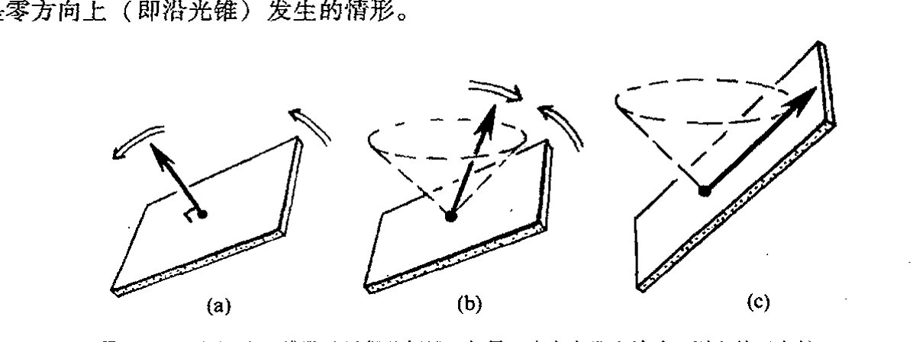
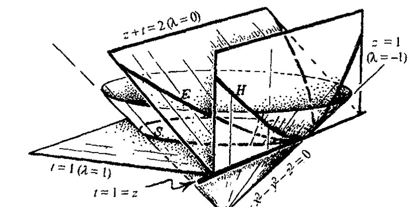
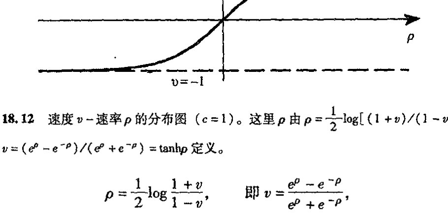
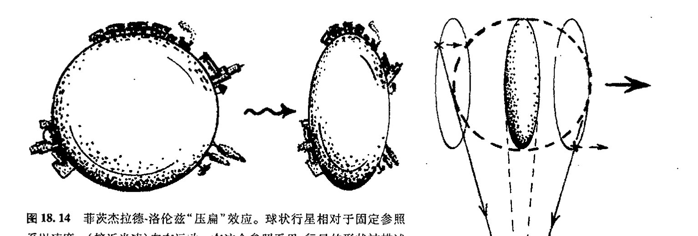
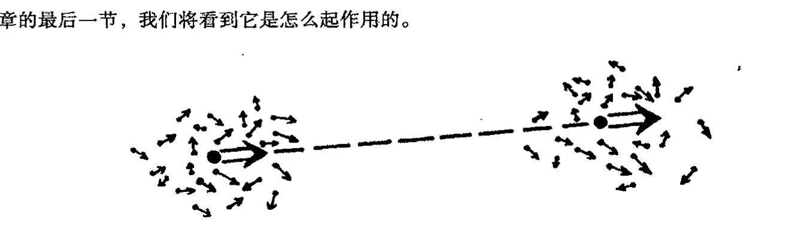
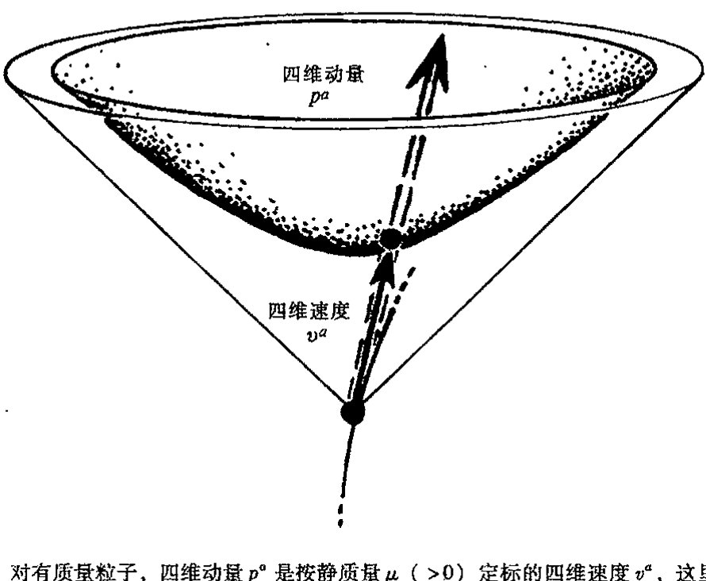

<!-- page 316 -->

第十八章 闵可夫斯基几何

---

# 第十八章

# 闵可夫斯基几何

## 18.1 欧几里得型与闵可夫斯基型四维空间

我们已经非常熟悉二维和三维空间的欧几里得几何。进一步来说，到四维欧几里得几何 $\mathbb{E}^4$ 的推广原则上并不困难，虽然从"视直觉"上看并非很快就能把握。存在许多明显很漂亮的四维构形——它们真的是非常优美，我们要是能实际看到该多好！一种较为简单（!）的这种构形是三维球面上的克利福德平行线图案，这里我们认为这个球面坐落在 $\mathbb{E}^4$ 内。从可视化上说，对这种情形我们可做得好些，因为 $S^3$ 是三维的，我们可以通过其立体投影（见[图 33.15](assets/page719_fig01.jpg)）获得某种实际的克利福德构形。（如果我们真的能"看到"作为 $\mathbb{E}^4$ 一部分的这种构形，我们就会对 $\mathbb{C}^2$ 的二维复矢量空间结构实际"看上去像什么"¹ 有一定感觉，见 [§15.4](chapter_15.md#154-克利福德丛)，图 15.8。）闵可夫斯基空间 $\mathbb{M}$ 在许多方面非常类似于 $\mathbb{E}^4$，但下面我们会看到，它还有许多重要的不同点。

代数上说，$\mathbb{E}^4$ 的处理非常接近于"通常的"三维空间 $\mathbb{E}^3$ 的处理。仅有的差别就是在标准的 $x, y, z$ 之外多了一维笛卡儿坐标 $w$。$\mathbb{E}^4$ 的点 $(w,x,y,z)$ 到点 $(w',x',y',z')$ 的距离由毕达哥拉斯关系给定：

$$s^2 = (w-w')^2 + (x-x')^2 + (y-y')^2 + (z-z')^2。$$

如果将 $(w,x,y,z)$ 和 $(w',x',y',z')$ 看成彼此间仅为"无穷小"位移，并将差 $(w,x,y,z)-(w',x',y',z')$ 正规地写为 $(\mathrm{d}w, \mathrm{d}x, \mathrm{d}y, \mathrm{d}z)$，即²

$$w' = w + \mathrm{d}w, \quad x' = x + \mathrm{d}x, \quad y' = y + \mathrm{d}y, \quad z' = z + \mathrm{d}z,$$

则我们发现，

$$\mathrm{d}s^2 = \mathrm{d}w^2 + \mathrm{d}x^2 + \mathrm{d}y^2 + \mathrm{d}z^2。$$

$\mathbb{E}^4$ 的曲线长度由与 $\mathbb{E}^3$ 情形下相同的公式给定，即 $\int \mathrm{d}s$（$\mathrm{d}s$ 取正号）。

现在，闵可夫斯基时空 $\mathbb{M}$ 的几何与此非常相似，唯一区别就是符号。许多同行倾向于使用

·297·

<!-- page 317 -->

通向实在之路

（＋＋＋－）符号差的伪度规

$$dl^2 = -dt^2 + dx^2 + dy^2 + dz^2,$$

因为这样在考虑空间几何时较方便，且“$dl^2$”所代表的量对类空位移为正（即位移不在未来或过去零锥之内或之上，见[图 18.1](assets/page317_fig01.jpg)）。但由（＋－－－）符号差定义的量“$ds^2$”

$$ds^2 = dt^2 - dx^2 - dy^2 - dz^2$$

**图 18.1**　在闵可夫斯基时空 $\mathbb{M}$ 中，度规 $dl^2$ 提供了一种对类空位移（不在未来或过去零锥之内或之上）的空间（间隔$^2$）的量度。对类时位移（零锥之内），$ds^2$ 提供了一种对时间（间隔$^2$）的量度，这里 $\int ds (ds > 0)$ 为理想化时钟测得的物理时间。对于零位移（沿零锥面）$dl^2$ 和 $ds^2$ 都是零。

具有更直接的物理意义，因为它沿作为允许的有质量粒子世界线的类时曲线为正，积分 $\int ds$（$ds > 0$）可直接理解为理想化时钟沿世界线测得的实际的物理时间。在选择（伪）度规 $\boldsymbol{g}$（其指标形式为 $g_{ab}$）时，我将用（＋－－－）符号差定义，以便上述表达式可写成指标形式（[§13.8](chapter_13.md#138-正交群)）

$$ds^2 = g_{ab} dx^a dx^b.$$

---

418　　但由 [§17.8](chapter_17.md#178-放弃绝对时间) 可知，与有质量粒子情形不同，光子的世界线的 $\int ds$ 为零（故其世界线上不存在能给出"零距离"间隔的非重合点）。这一点对其他沿光的世界线行走的粒子来说也是正确的。无论走多远，这种粒子所"经历的"时间总是零！所以如此是缘于 $g_{ab}$ 的非正定（洛伦兹）性质。

　　在相对论早期，曾有一种趋势，通过取时间坐标 $t$ 为纯虚数

$$t = iw$$

来强调 $\mathbb{M}$ 几何与 $\mathbb{E}^4$ 几何的相似性。这样做使得闵可夫斯基度规的"$dl^2$"形式看起来与 $\mathbb{E}^4$ 的

· 298 ·

<!-- page 318 -->

第十八章 闵可夫斯基几何

“ds²”形式完全一样。当然，表面的东西往往是一种错觉，因为这种看上去不自然的形式隐藏了“真实”条件，就是时间以纯虚数为单位而空间坐标则取普通的实单位。此外，在运动参照系下，这种真实条件会因为实坐标与虚坐标相互混杂而变得更复杂。事实上，目前在所谓“欧几里得量子场论”名誉下，存在着各种改头换面的与这种做法极为相似的趋势。在后面[§28.9](chapter_28.md#289-哈特尔霍金的无界假说)，我会谈到为什么我认为这种处理不能令人非常满意的理由（多数情况下，至少当它作为处理新的基本物理理论的关键时是如此。这种做法还被当作获得量子场论问题解的“诀窍”，在这方面它的确起着真实有用的作用）。

与采用这种看起来不自然的处理（至少我认为是这样）方式不同，我们来试着“走极端”，看看将所有坐标都取为复数（见图18.2）会怎样。这时不存在符号差上的区别，复坐标ω，ξ，η，ζ现在表示的是复空间 ℂ⁴，我们可以将它视为 𝔼⁴ 的复化空间 ℂ𝔼⁴。作为复仿射空间（[§14.1](chapter_14.md#141-流形上的微分)），它与 𝕄 的复化 ℂ𝕄 一样。此外，ℂ𝔼⁴ 和 ℂ𝕄 的每个复四维空间有一个完全等价的平直（曲率为零）复度规 ℂ**g**。这个度规可取 ds² = dω² + dξ² + dη² + dζ² 形式，这里 𝔼⁴ 是 ℂ𝕄 的实子空间，它的所有坐标 ω，ξ，η，ζ 都是实的；而 𝕄 的 ω 坐标是实的，ξ，η，ζ 都是纯虚的。作为 ω 是纯虚的但 ξ，η，ζ 都是实坐标的另一种闵可夫斯基实子空间 𝕄̃，其“ds²”有闵可夫斯基度规的“dl²”形式。𝔼⁴、𝕄 和 𝕄̃ 这三种子空间称为 ℂ𝔼⁴ 的实切片。如果我们对 ℂ𝔼⁴ 赋予一种

图18.2 复欧几里得空间 ℂ𝔼⁴ 在复笛卡儿坐标（ω，ξ，η，ζ）下有复（全纯）度规 ds² = dω² + dξ² + dη² + dζ²。欧几里得四维空间 𝔼⁴ 在 ω，ξ，η，ζ 都是实数情形下为“实截面”。具有 + − − − ds² 度规的闵可夫斯基时空是一种不同的实截面，其 ω 坐标是实的，ξ，η，ζ 都是纯虚的。我们可通过取 ω 是纯虚的但 ξ，η，ζ 是实的来得到另一种洛伦兹实截面 𝕄̃，由此导出的 ds² 有闵可夫斯基度规的 + + + − “dl²”形式。

·299·

<!-- page 319 -->

通向实在之路

对合的复共轭运算 C（即 C² = 1，它只允许选定的实切片逐点不变），则我们从这三者中挑出一个即可。*[18.1]

## 18.2　闵可夫斯基空间的对称群

415　　E⁴ 的对称群（即其欧几里得运动群）有 10 维，因为（i）原点固定的对称群是六维转动群 O(4)（当 n = 4 时，n(n−1)/2 = 6，见 [§13.8](chapter_13.md#138-正交群)），（ii）另有原点的四维平移对称群，见[图 18.3](assets/page320_fig01.jpg)a。当我们将 E⁴ 复化为 CE⁴ 时，就得到一个十维复数群。这是显然的，因为如果我们将 E⁴ 的任意一种实欧几里得运动根据坐标写成代数公式时，我们必须做的就是使出现在公式里的量（坐标和系数）变成复数而非实数，于是我们得到相应的 CE⁴ 的复运动。由于前者保度规，因此后者也保度规。此外，保复度规 Cg 的 CE⁴ 的所有连续运动本身也有这种性质。*[18.2]

416　　现在，如果我们具体化 CE⁴ 的一个不同的"实截面"（譬如是坐标 (ω, ξ, η, ζ) 的实际条件为 ω 是纯虚的，ξ, η, ζ 是实的（符号差 +++−）情形，或 ω 是实的，ξ, η, ζ 是纯虚的（符号差 +−−−）情形；见[图 18.2](assets/page318_fig01.jpg)），非常可能但却十分不明显的是，群有相同的维数，即 10（现在是实数维）。平移部分显然还是四维。实际上，这部分告诉我们群在 M 上是可递的，这意味着 M 的任一指定点都可像 E⁴ 情形下那样通过群的某个元素变换到 M 的另一指定点。但对洛伦兹群 (O(1,3) 或 O(3,1)) 会怎样呢？我们怎么才能看出它像 O(4) 那样只是"六维"的呢？事实上，洛伦兹群的确是六维的（见[图 18.3](assets/page320_fig01.jpg)(b)）。看出这一点的最一般方法是作李代数分析（见 [§14.6](chapter_14.md#146-李导数)），检查它在所需的小的符号变动下是否有效。*[18.3] 不久我们就会看到（[§18.5](#185-作为黎曼球面的天球)），通过将它与黎曼球面联系起来，还存在另一种相当好的看 O(1,3) 并检查其 6 个维度的方法。

417　　闵可夫斯基空间 M 的完全十维对称群称为庞加莱群，以纪念杰出的法国数学家亨利·庞加莱（1854~1912）在 1898~1905 年间为建立狭义相对论的基本数学结构（独立于 1905 年爱因斯坦所做的奠基性工作）所做出的贡献。³ 庞加莱群在相对论物理，特别是粒子物理和量子场论（第 25, 26 章）等方面是非常重要的。它表明，按照量子力学法则，单个粒子对应于庞加莱群的表示（[§13.6](chapter_13.md#136-表示理论与李代数), 7），其中粒子的质量和自旋的值决定着具体的表示（[§22.12](chapter_22.md#2212-相对论性量子角动量)）。

　　本质上说，正是这种群的广泛性使得我们断定相对性原理在 M 上仍成立，即使光速是不变的（[§17.6](chapter_17.md#176-确定不变的有限光速), 8）。首先，我们看到，由于平移子群的可递性，时空 M 的每一点是平权的。另外，我们有完全的（三维）空间转动对称，使得剩下的另外 3 个维可用来表达这样一个事实：

---

*[18.1] 对 E⁴、M 和 M̃ 这三种情形找出明确的 C。提示：考虑 C 如何作用到 ω, ξ, η, ζ。在 M 和 M̃ 的情形，它不是标准的复共轭运算。

*[18.2] 你能知道为什么吗？

*[18.3] 在此情形下通过检验 4×4 李代数矩阵来确认这一点。

· 300 ·

<!-- page 320 -->

第十八章 闵可夫斯基几何

图18.3 (a) $\mathbb{E}^4$ 的欧几里得运动群是10维的：原点固定的6维转动对称群 $\mathrm{O}(4)$ 加上原点的四维平移对称群。(b) 对于 $\mathbb{M}$ 的对称性，我们得到原点固定的六维洛伦兹群 $\mathrm{O}(1,3)$（或 $\mathrm{O}(3,1)$）和四维平移对称群，从而有十维庞加莱对称群。

一种速度（$<c$）可完全自由地变换到另一种速度，同时保持整体结构不变——这就是基本的 $\mathbb{M}$ 的相对性原理！说得更正规点儿，相对性原理断言的是，在 $\mathbb{M}$ 的未来类时方向丛上，庞加莱群的作用是可递的。^4^ 这些方向指向未来零锥的内部，并可作为观察者世界线的可能的切线方向。*[13.4] 但应当指出，这只是表明可以有这种效果，因为我们已经不用伽利略或牛顿时空的"同时性切片"族概念。保留这些可能会减少 $\mathrm{O}(3)$ 的三维时空点的对称性，使得速度失去变换的自由。

## 18.3 洛伦兹正交性；"时钟悖论"

这种观点将 $\mathbb{M}$ 视为复空间 $\mathbb{CE}^4$（或 $\mathbb{C}^4$）的"实截面"或"切片"，而不是 $\mathbb{E}^4$ 本身的有不同特征的截面。如果有正确认识，那么这不啻为一种非常实用的观点。例如，在欧几里得 $\mathbb{E}^4$ 内，我们有"正交"概念。我们可通过"复化"处理直接将其运用到 $\mathbb{CE}^4$。^5^ 但是我们必须看到，这种处理一定会带来某些特征上的变化。例如我们会发现，在 $\mathbb{CE}^4$ 中，一个方向可以垂直于自身，而这在 $\mathbb{E}^4$ 中是决然不可能发生的。但当我们折回到新的实切片洛伦兹 $\mathbb{M}$ 时，这一特征仍得以保留。因此，在 $\mathbb{M}$ 中我们仍有正交的概念，只是这些与自身正交的实方向都是指向光子世界线的零方向（见下述）。

我们可以进一步贯彻这种正交性概念，在一个点 $p$ 上考虑 $r$ 维平面元 $\boldsymbol{\eta}$ 的正交补 $\boldsymbol{\eta}^\perp$。它是 $p$ 点上所有与 $p$ 点 $\boldsymbol{\eta}$ 的所有方向呈正交的 $(4-r)$ 维平面元 $\boldsymbol{\eta}^\perp$。因此，一个线元的正交补是一个三维平面元，二维平面元的正交补是另一个二维平面元，三维平面元的正交补是线元。在每一种

---

*[13.4] 稍微全面点解释庞加莱群的这种作用。

·301·

<!-- page 321 -->

通向实在之路

情形里，再取正交补就将得到这个正交补据以成立的那个元。换句话说，$(\boldsymbol{\eta}^\perp)^\perp = \boldsymbol{\eta}$。回顾一下，我们曾在 [§13.9](chapter_13.md#139-酉群) 和 [§14.7](chapter_14.md#147-度规能为你做什么) 分别考虑过带 $g_{ab}$ 和 $g^{ab}$ 的矢量和张量的升降指标运算。当我们按 [§12.4](chapter_12.md#124-格拉斯曼积), 7 将升/降运算应用到表示 $r$ 维曲面元的单 $r$ 维矢量和单 $(4-r)$ 形式上时（例如 $\eta_{ab} \mapsto \eta^{ab} = \eta_{cd}g^{ac}g^{bd}$；$\eta^{ab} \mapsto \eta_{ab} = \eta^{cd}g_{ac}g_{bd}$），这种运算相当于取正交补，还可参见 [§19.2](chapter_19.md#192-麦克斯韦电磁场理论)。

例如，在 $\mathbb{E}^4$ 里，三维平面元 $\boldsymbol{\eta}$ 的正交补是不包含于 $\boldsymbol{\eta}$ 的线元 $\boldsymbol{\eta}^\perp$（正交于 $\boldsymbol{\eta}$），见[图 18.4](assets/page321_fig01.jpg)。但像[图 18.2](assets/page318_fig01.jpg) 一样，我们可将这一概念贯彻到复化 $\mathbb{CE}^4$ 以及不同的截面 $\mathbb{M}$ 上。实际上，我们在前一章里（[§17.8](chapter_17.md#178-放弃绝对时间)）寻求 $p$ 点上时间切片（三维类空平面元）的正交补以找出类时方向（"静态"）时，已经运用了这种处理方法。它向我们表明，如果我们既要光速有限又要绝对时间的话，就不可能保有相对性原理（见[图 17.15](assets/page312_fig01.jpg)）。***[18.5] 但我们现在要从反面来理解这一点。考虑 $\mathbb{M}$ 内特定事件 $p$ 位置上的一个惯性观察者。假定观察者的世界线在 $p$ 点有（类时）方向 $\boldsymbol{\tau}$。于是三维空间 $\boldsymbol{\tau}^\perp$ 表示观察者在 $p$ 点的"纯空间"方向族，即观察者确信是与 $p$ 同时发生的那些相邻事件。

这里，我的本意不是要不问缘由地在细节上发展有关相对性的特殊理论，特别是在为什么它是一种合理的"同时性"概念方面。关于这些读者可以参考几种优秀的教科书。⁶ 然而，这里我要强调，这种同时性概念实际上取决于观察者的速度。在欧几里得几何里，空间方向的正交补随方向的改变而改变（[图 18.5](assets/page322_fig01.jpg)(a)）。相应地，在洛伦兹几何里，正交补同样随方向（即观察者

---

***[18.5]（i）在 $\mathbb{M}$ 内，一个三维平面元 $\boldsymbol{\eta}$ 在什么样的条件下才能包含其法矢量 $\boldsymbol{\eta}^\perp$？（ii）证明：在 $\mathbb{CE}^4$ 内，存在两族不同的二维平面，它们是自身的正交补，但二者都不可能出现在 $\mathbb{M}$ 内。（这些所谓"自对偶"和"反自对偶"二维复平面在后面具有相当的重要性，见 [§32.2](chapter_32.md#322-阿什台卡变量的手征输入) 和 [§33.11](chapter_33.md#3311-非线性引力子)。）

· 302 ·

<!-- page 322 -->

第十八章 闵可夫斯基几何

的速度）的改变而改变。唯一的区别是这种改变使正交补向与欧几里得情形相反的方向倾斜（见[图 18.5](assets/page322_fig01.jpg)(b)），因此一个方向的正交补有可能包含该方向（见[图 18.5](assets/page322_fig01.jpg)(c)），正如上面提到的，这就是零方向上（即沿光锥）发生的情形。

图 18.5 （a）在四维欧几里得几何里，如果一个方向发生转动，则它的正交补三维平面元也随之发生转动。（b）这一点对四维洛伦兹几何也是对的，但对于类时方向，正交补三维平面元（"同时性"的空间方向）的斜率作反向移动；（c）相应地，如果方向变成零的，则正交补实际上包含该方向。

在 $\mathbb{E}^4$ 到 $\mathbb{M}$ 的传递过程中，还存在与不等式相关的变化。最富戏剧性的是这些变化包含了狭义相对论里所谓"时钟悖论"（或"孪生子悖论"）的要素。某些读者对这个"悖论"可能很熟悉，它是指，一个以接近光速的速度乘火箭去遥远星球的空间旅行者返回后将发现，在他旅行的这几年中，地球上的时间已过去了几个世纪。正如邦迪（1964，1967）强调的，如果我们同意这样一种观点，即按运动时钟的记录，时间的流逝的确是一种沿世界线测得的"弧长"，那么这种现象就不会比下述现象更令人吃惊：欧几里得空间的两点间距离依赖于该距离测得的具体途径。二者都由同样的公式测量，即 $\int ds$，但在欧几里得情形，平直路径表示的是两固定端点间测得的最小距离，而在闵可夫斯基情形，这种平直（即惯性）路径表示的则是两确定事件之间测得的最大时间（亦见 [§17.9](chapter_17.md#179-爱因斯坦广义相对论的时空)）。

导致这种现象的基本不等式就是普通欧几里得几何里所谓的三角不等式。如果 $\triangle ABC$ 是任意欧几里得三角形，则边长满足

$$AB + BC \geq AC,$$

等号仅当 $A$，$B$ 和 $C$ 退化为三点共线（见[图 18.6](assets/page323_fig01.jpg)(a)）时成立。很自然，此处边是对称的，我们选取哪一条边作 $AC$ 无关紧要。在洛伦兹几何里，仅当所有边都是类时的我们才有这种三角不等式，我们必须小心恰当地排序以便使 $AB$，$BC$ 和 $AC$ 都指向未来（见[图 18.6](assets/page323_fig01.jpg)(b)）。现在我们得到的不等式为

$$AB + BC \leq AC,$$

同样，等号仅当 $A$，$B$ 和 $C$ 三点共线即共一条惯性粒子的世界线时成立。这个不等式的解释就是所谓的"时钟悖论"。空间旅行者的世界线为折线 $ABC$，而地球上居民的世界线为 $AC$。我们看

· 303 ·

<!-- page 323 -->

通向实在之路

**图18.6** (a) 欧几里得三角不等式 $AB + BC \geq AC$，等号仅当 $A, B, C$ 共线时成立。(b) 在洛伦兹几何里，$AB, BC, AC$ 都是类时的，不等式反向：$AB + BC \leq AC$，等号仅当 $A, B$ 和 $C$ 共一条惯性粒子的世界线时成立。这个不等式展示了狭义相对论的"时钟悖论"：沿世界线 $ABC$ 行走的空间旅行者经历的时间间隔要比地球上居民经历的 $AC$ 要短。(c) "磨光"欧几里得三角形的角不会对边长造成太大的不同，直线仍是最短的。(d) 类似地，取有限加速度（"磨光"角）也不会引起时间有太大的不同，直线（惯性）路径仍是最长的。

到，按此不等式，空间旅行者的时钟记录的总时间的确比地球上记录的要短。

有人担心在这种描述中火箭的加速度未能得到正确的反映。理想情形的确应当是宇航员在事件 $B$ 处受到一个冲击（无限大的）加速度（那可是致命的！）。但是，我们可以像[图 18.6](assets/page323_fig01.jpg)(d) 那样通过简单地磨光三角形的角来处理这个问题。带来的时间差的影响并不严重，这可由[图 18.6](assets/page323_fig01.jpg)(c) 描述的欧几里得"光滑三角形"的相应情形清楚地看出。经常争议的还包括认为有必要通过爱因斯坦的广义相对论来处理加速度，而这则完全错了。这两种理论下的时钟时间均得自公式 $\int ds$（其中 $ds > 0$）。宇航员在狭义相对论中是允许加速的，正如同在广义相对论情形下一样。区别仅在于衡量 $ds$ 时实际所用的度规，即依赖于实际的 $g_{ij}$。只要度规取闵可夫斯基几何 $\mathbb{M}$ 下的平直度规，我们就可以在狭义相对论下工作。物理上说，这意味着引力场可以忽略。当我们需要考虑引力场时，我们必须引入爱因斯坦广义相对论的弯曲度规。这将在下一章里作充分讨论。

## 18.4 闵可夫斯基空间的双曲几何

我们来看看闵可夫斯基几何的更多的方面以及它与欧几里得几何的关系。在欧几里得几何里，距定点 $O$ 距离为 $a$ 的点的轨迹是圆。在 $\mathbb{E}^4$ 上，这个圆自然就是三维球面 $S^3$。那么在 $\mathbb{M}$ 下情

· 304 ·

<!-- page 324 -->

第十八章 闵可夫斯基几何

形会如何呢？我们有两种场合要考虑，是哪一种取决于 $a$ 取（正）实数还是取纯虚数（这里我采用 $+---$ 符号差，否则角色要颠倒），[图 18.7](assets/page324_fig01.jpg) 展示了这两种情形。

**图 18.7** $\mathbb{M}$ 里的"球面"。它是自定点 $O$ 取闵可夫斯基定长 $a$ 的点的轨迹。如果 $a>0$（$\mathrm{d}s^2$ 符号差 $+---$），我们得到两个"双曲"部分："碗状的" $\mathcal{H}^+$（处于未来光锥内）和"帽状的" $\mathcal{H}^-$（处于过去光锥内）。对虚数 $a$（或实 $a$ 但 $\mathrm{d}l^2$ 符号差 $+++-$）情形，我们得到一片与 $O$ 类空分离的双曲面。

这里我们不具体考虑虚数 $a$ 的情形。因此我们总是取 $a>0$（$a<0$ 情形是一样的）。现在，圆由两部分组成，一部分是"碗状的" $\mathcal{H}^+$，处于未来光锥内；另一部分是"帽状的" $\mathcal{H}^-$，处于过去光锥内。我们主要讨论 $\mathcal{H}^+$（$\mathcal{H}^-$ 情形类似）。那么 $\mathcal{H}^+$ 的内禀度规是什么呢？它一定是由内嵌于 $\mathbb{M}$ 的度规导出。（例如，$\mathcal{H}^+$ 内的曲线长度可通过将曲线视为 $\mathbb{M}$ 内的曲线而定。）实际上对于这种情形，由于沿 $\mathcal{H}^+$ 的方向是类空的，故 $\mathrm{d}l^2$（符号差 $+++-$）是个较好的量度。我们可以对 $\mathcal{H}^+$ 的度规作一个好的假定，因为它从某种程度上说仍是个"圆"，只不过带有"符号跳变"。它是怎么得来的呢？这得追溯到 1786 年兰伯特对一种违反欧几里得第五公设的几何的研究。他认为，虚半径的"球"可以提供这样一种几何，只要这种情形能说得通。实际上，上述 $\mathcal{H}^+$ 的构造正是这么一种空间——一种双曲几何模型——只不过现在是三维的。为了得到兰伯特非欧几何平面（双曲面），我们要做的就是在上述情形中去掉一个空间维。不论哪一种情形，"双曲直线"（测地线）就是 $\mathcal{H}^+$ 与过 $O$ 的二维平面的交（[图 18.8](assets/page325_fig01.jpg)）。

当然，认为兰伯特的构思里已有这种结构是有点儿想入非非了。但它毕竟展示了这种一般性概念的内在协调性。在这种概念里，符号差可以"跳变"，实数量变成虚的，同时虚数量变成

· 305 ·

<!-- page 325 -->

通向实在之路

---

**图 18.8** H⁺ 内的“双曲直线”（测地线）就是 H⁺ 与过 O 的二维平面的交。
（图中显示的是二维情形，三维 H⁺ 的情形类似。）

实的。兰伯特在这些方面具有相当强的天赋。考察[图 18.9](assets/page325_fig02.jpg) 或许会给我们某种启发。这里我画的是具有坐标 (t, x, y, z) 的闵可夫斯基四维空间上的一个光锥 t² - x² - y² - z² = 0（y 被压缩掉），并用平面

z + t + λ(t - z) = 2

**图 18.9** 用三维平面 z + t + λ(t - z) = 2 截得的光锥 t² - x² - y² - z² = 0 的一族截面。截面过二维平面 t = 1 = z。坐标 y 被压缩，故维数看起来减少 1。当 λ > 0，截面 S 有二维球型 dl² 度规，显示如 λ = 1 的水平情形；当 λ = 0，我们得到抛物状截面 E 的平直的欧几里得型 dl² 度规；当 λ < 0，我们得到双曲型 dl² 度规，显示如垂直双曲截面 H（λ = -1 情形）。

截得光锥的一族截面（λ 取不同的值），所有截面都过 t = z = 1 这个特定平面。这个截面是二维的（光锥本身是三维的），可以看出，对每个正的 λ 值，二维曲面的度规正是半径为 λ⁻¹ᐟ² 的球面度规（关于 dl² 的度规）。当 λ = 0，我们得到通常的欧几里得平面。（这个截面看起来不“平

424

· 306 ·

<!-- page 326 -->

第十八章 闵可夫斯基几何

直"，而是呈"抛物面"状，但其内禀度规的确是平直的。）**[18.6]** 当 $\lambda$ 变成负值时，截面是虚半径（$=\lambda^{-1/2}$）的兰伯特"球面"。它的确具有双曲几何的内禀度规（关于 $\mathrm{d}l^2$ 的度规）。通过这种方式我们看到，兰伯特关于可能存在虚半径球面的试探性解释是站得住脚的，尽管早了好几个世纪。

我们可将"伪球面" $\mathcal{H}^+$ 的双曲几何的构造与 [§2.4](chapter_02.md#24-双曲几何共形图像), 5 里描述的贝尔特拉米的共形表示和投影表示（二维情形）直接联系起来。在[图 18.10](assets/page326_fig01.jpg) 里，我展示了直接从 $\mathcal{H}^+$ 得到的两种表示的图，它清楚地说明了闵可夫斯基三维空间 $\mathbb{M}^3$（坐标 $t, x, y$）里伪球面的情形。在 $\mathcal{H}^+$ 上取方程 $t^2-x^2-y^2=1$，然后从原点 $(0,0,0)$ 将其投影到 $t=1$ 平面，我们得到贝尔特拉米的"克莱因"（即投影）表示；从"南极" $(-1,0,0)$ 将其投影到"赤道面" $t=0$，我们得到贝尔特拉米的"庞卡莱"表示（即"立体投影"，见 [§8.3](chapter_08.md#83-黎曼球面)，[图 8.7](assets/page119_fig02.jpg)）。**[18.7]**

**图 18.10** 在闵可夫斯基三维空间 $\mathbb{M}^3$ 里，$\mathcal{H}^+$ 的二维双曲几何（由 $t^2-x^2-y^2=1$ 给定）直接与贝尔特拉米的共形和投影表示（分别见图 2.11 和 2.16——埃舍尔的作品及其变形版）相关联。贝尔特拉米的投影（"克莱因"）表示由从原点 $(0,0,0)$ 将 $\mathcal{H}^+$ 投影到 $t=1$ 平面的单位圆内部而获得。贝尔特拉米的共形（"庞加莱"）表示由从 $(-1,0,0)$ 将 $\mathcal{H}^+$ 投影到 $t=0$ 内的单位圆内部而获得。（亦见图 2.17 的贝尔特拉米几何。）对 $\mathbb{M}^4$ 内的三维双曲几何，同样存在类似的结构。

我们注意到，未来类时方向由 $\mathcal{H}^+$ 的点表示（这里作为定义，我取 $a=1$）。这些方向是有质量粒子可能的速度方向。因此，我们可将 $\mathcal{H}^+$ 看成是相对论的速度空间。（回顾一下，这个问题曾在 [§2.7](chapter_02.md#27-与物理空间的关系) 的节末提出过。）这是相对论中经常容易误解的一个方面，那就是我们不能按通常

---

**[18.6]** 证明所有这些。提示：用坐标 $x, y, w$ 将是方便的，这里 $w=(t-z-1/\lambda)\sqrt{\lambda}=(1-t-z)/\sqrt{\lambda}$。

??? question "答案 [18.6]"
    把五维平直空间中的二次曲面写成约束方程后，用提示中的 $x,y,w$ 作为内坐标消去 $t,z$。代回环境空间度规，交叉项抵消，得到的内禀线元就是平直欧几里得型或双曲型的标准形式，只差一个整体曲率尺度 $|\lambda|^{-1/2}$。

    当 $\lambda>0$ 时，该截面可视为实半径球面的共形/投影模型；当 $\lambda<0$ 时半径形式上变为虚数，诱导度规的号差变为双曲几何。所谓“抛物面”只是嵌入形状，内禀曲率由诱导线元决定。

**[18.7]** 说明为什么双曲直线在"克莱因"情形下可以用直线来表示，而在"庞加莱"情形下则要用与边界垂直相交的圆来表示。并用"符号差跳变"概念来说明，为什么第二种情形的确是共形的。

· 307 ·

<!-- page 327 -->

通向实在之路

方式来提高速度。因此，如果一个火箭相对于地球以 $\frac{3}{4}c$ 沿某个方向运动，同时火箭又以相对于自身的 $\frac{3}{4}c$ 速度沿前进方向发射一枚导弹，则导弹相对于地球的速度只有 $\frac{24}{25}c$，而不是超光速的 $(\frac{3}{4}+\frac{3}{4})c=\frac{3}{2}c$。（这里 $c$ 是光速，为清晰起见，以后我们取单位 $c=1$。）这可以理解为双曲几何里的长度增加效应（见[图 18.11](assets/page327_fig01.jpg)）。***[18.8]

图 18.11 相对论里的速度空间是双曲空间 $\mathcal{H}^+$，这里速率 $\rho$（$=\tanh^{-1}v$）量度沿 $\mathcal{H}^+$ 的双曲距离（光速 $c=1$ 对应于无穷远 $\rho$）。它是（借助"符号差跳变"）对单位圆上圆心角 $\theta$ 所对弧长的一种类比。

为了说清楚这一点，我们需要搞懂物理上对双曲几何"长度"的解释。它实际上是一个速率量，我们用希腊字母 $\rho$ 来表示这个量，它通过速度 $v$ 定义为（[图 18.12](assets/page327_fig02.jpg)）：

图 18.12 速度 $v$ - 速率 $\rho$ 的分布图（$c=1$）。这里 $\rho$ 由 $\rho=\frac{1}{2}\log[(1+v)/(1-v)]$，即 $v=(e^\rho-e^{-\rho})/(e^\rho+e^{-\rho})=\tanh\rho$ 定义。

$$\rho=\frac{1}{2}\log\frac{1+v}{1-v},\quad\text{即 }v=\frac{e^\rho-e^{-\rho}}{e^\rho+e^{-\rho}},$$

（右边的表达式就是所谓 $\rho$ 的"双曲正切"，写成"$\tanh\rho$"）。这个速率是对双曲空间 $\mathcal{H}^+$ 的"距离"的量度（在 $\alpha=1$ 时取作单位伪半径，见 [§2.4](chapter_02.md#24-双曲几何共形图像), 6）。对于速度 $v$ 远小于光速的情形，这个

---

***[18.8] 用"符号差跳变"论证来说明，在双曲几何里，对于同空间方向的速度 $uc$ 和 $vc$ 的"相加"，为什么长度的加长将导致这里给出的速度加法公式，即 $(u+v)c/(1+uv)$？考虑圆周或球面上的弧长的相加，对应于每个弧长的"速度"是该弧所对圆心角的正切。

·308·

<!-- page 328 -->

第十八章 闵可夫斯基几何

速率等于 $v$。***[18.9] 注意，在[图 2.11](assets/page042_fig01.jpg) 显示的埃舍尔图中，描述双曲几何的无穷远（$\rho=\infty$）的边缘区代表的是不可达到的极限速度 $c$（$=1$）。

**图 18.13** 双曲速度空间 $\mathcal{H}^+$ 里的相对论速度合成。(a) 同方向速度的合成就是简单的速率相加。(b) 对不同方向的速度合成，我们用三角形法则来合成，这里双曲边长取相应速率值的一半。（比较图 11.4(b)，它描述了三维空间里普通转动的合成，证明过程相同。）

同方向速度的合成就是简单的速率相加（即增加双曲长度）；见[图 18.13](assets/page328_fig01.jpg)(a)。不同方向的速度合成可通过 [§11.4](chapter_11.md#114-转动如何叠加) 给出的普通转动叠加过程来进行，见[图 11.4](assets/page167_fig01.jpg)（正确使用“符号差跳变”）。这里我们将双曲三角形法则应用到待合成的两个速度上，其中每个速度由双曲长度值恰为速率值一半的一段双曲线段来代表（相应于[图 11.4](assets/page167_fig01.jpg) 中的弧长正好是转角的一半），见[图 18.13](assets/page328_fig01.jpg)(b)。

## 18.5 作为黎曼球面的天球

下面我们来看看双曲几何 $\mathcal{H}^+$ 的“无穷远边缘”的内部几何。这里必须清楚，我们考虑的是完整的四维闵可夫斯基时空，因此其边缘区是一球面 $S^2$ 而不是[图 2.11](assets/page042_fig01.jpg) 中埃舍尔图的边界圆（$S^1$）。这个球面上的每个点代表沿零锥本身的一个方向，它代表着有质量粒子不可达到的极限速度。但无质量粒子则可达到这些极限速度，事实上，它们是无质量粒子在自由飞行中唯一可取的速度。幸运的是光子就是这样一种无质量粒子，因此你能够看见光。如果你在明澈无云的夜晚抬头仰望天空，你几乎能看到头顶上整个半圆形穹顶，上面缀满了无数的星星。事实上你正如实地描绘着构成光锥的光线族，这个光锥的中心就是此刻你用来感知天球景致的眼睛所代表的事件 $O$。实际上，你只能感知到光锥的一半光线，但如果你想象一下，你能跳出天外，用一种完全的视角来观察周围的天球，那么你将获得一幅更好的构成整个 $O$ 点光锥的射线球的图。可能把这个球面看成是 $O$ 的过去光锥更容易些，因为我们关心的是进入眼睛的光线，而不是由眼睛发出的光线。但从零直线沿两方向伸展的意义上说，光线是从过去走向未来，因此这个天球也可看

***[18.9] 验证这个论断；证明上述两公式的等价性。

??? question "答案 [18.9]"
    把速度参数写成双曲角 $\phi$，令 $v/c=\tanh\phi$。洛伦兹变换可写成 $t\prime=t\cosh\phi-xc^{-1}\sinh\phi$、$x\prime=x\cosh\phi-ct\sinh\phi$。

    由 $\cosh\phi=(1-v^2/c^2)^{-1/2}$、$\sinh\phi=(v/c)(1-v^2/c^2)^{-1/2}$，立刻恢复通常含 $v$ 的洛伦兹公式；反向代换也给出双曲函数形式。

· 309 ·

<!-- page 329 -->

通向实在之路

成是代表着过 $O$ 的整个光线族 $\mathcal{S}$（亦见 [§33.2](chapter_33.md#332-作为光线的扭量)）。

拓扑上空间 $\mathcal{S}$ 是一个二维球面，但它有某种特定结构吗？我们可以想象地为它提供一个度规，并将它看成是一个二维黎曼空间。最明显的做法是取一个过光锥的切片，譬如说用空间三维平面 $t=1$（从光锥方程 $t^2-x^2-y^2-z^2=0$）得到单位半径度规的球面 $x^2+y^2+z^2=1$ 用以表示 $\mathcal{S}$。另一种做法是用 $t=-1$ 来做光锥切片，同样可得到单位半径的球面。这二者间的关系是一种过对径点的（保度规）映射关系，别无二致，除非我们要挑出某个观察者的过 $O$ 的世界线并采用这个观察者的 "$t$ 坐标"。如果还存在另一个遇上同一事件 $O$ 的观察者（相对于前一个具有很高的速度），那么在一个观察者所做的天球映射与另一个观察者做的映射之间会存在某种失真。

的确会存在这种失真，这是因为存在着所谓恒星光行差效应。1725 年，布拉德利（James Bradley，1693～1762）观察到这种效应。根据这种效应，恒星在天球上的视在位置与实际位置之间存在小的季节性偏差，这是由地球在公转轨道的不同位置上存在速度差异引起的。这种效应与高速行驶在雨中的车内的人所看到的情形十分相似。对车内的人来说，雨似乎是迎面扑来的，而地面观察者看到的雨则是垂直降落的。这种效应源于这样一个事实，雨的有限速度必须以恰当方式与车速合成才能解释车中观察到的相对性效应。事实上，在此情形下，车速必须远远高于雨速我们才能得到明显的表观效果。另一方面，在恒星的情形，地球的轨道速度变化要远小于恒星的光速。因此，恒星在天球上表观位置的季节性变化是非常小的（对较近的恒星，约为 $0.5''$）。但这种效应是存在的，它代表天球的速度型偏差，由此可知，我们不能将这个球面看作是与观察者速度无关的自然度规结构。

我在这里提出的问题是，在 $\mathcal{S}$ 上是否存在某种优美的数学结构，它较度规结构要弱，但在我们从某个观察者所做的天球映射过渡到另一个观察者做的映射时，或当两个观察者恰在事件 $O$ 上以高速（二者间相对速度）错过时保持不变。事实上，的确存在这样一种结构，这就是我们早先在 [§8.2](chapter_08.md#82-共形映射)，3 里研究黎曼球面时提出过的那种结构。回顾一下，黎曼球面有这样一种共形结构，虽然它没有特定的度规，因此不存在相邻点之间的距离概念或曲线长度概念，但却有定义在球面上曲线间角度的绝对概念。任何容许的（即共形的）黎曼球面到自身的变换必须是保角的。因此，（无限小的）小块形状在这种变换下必然是保形的，虽然其大小会改变。此外，球面上任意大小的圆仍变换为圆。这正是天球 $\mathcal{S}$ 拥有的结构。相应地，某个观察者感知的恒星的圆形模式在另一个观察者看来也必然是圆形的。***[18.10] 这意味着星体在天空中的一个方便的标签就是赋给每个（可以到 $\infty$）星体的一个复数！我不知道这个建议是否会被天文学采纳，但这种复参

*** [18.10] 这个天才的论断是由极富创新精神和影响力的爱尔兰相对论学者辛格（John L. Synge）提出的，它毋需任何计算！试从细节上将论证补充完整。论证过程大致如下：考虑一种由事件 $O$ 的过去光锥 $\mathcal{C}$ 和过 $O$ 的三维（类时）平面 $P$ 组成的几何构形。令 $\Sigma$ 是 $\mathcal{C}$ 和 $P$ 的截面。在某个特定的闵可夫斯基参照系下，分别就 $\mathcal{C}$、$P$ 和 $\Sigma$ 的空间轨迹，描述其随时间的变化。解释为什么处于 $O$ 点的观察者看 $\Sigma$ 是个圆，并用与参照系无关的方式说明，这种几何构形刻画了观察者看成圆的那个射线靶。

· 310 ·

<!-- page 330 -->

第十八章 闵可夫斯基几何

数（称为“球极坐标”，与标准的球面极角按公式 $\zeta = e^{i\varphi}\cot\frac{1}{2}\theta$ 相关联***[18.11]）的使用在广义相对论里则是普遍的。⁷

**图 18.14** 菲茨杰拉德-洛伦兹“压扁”效应。球状行星相对于固定参照系以速度 $v$（接近光速）向右运动。在这个参照系里，行星的形状被描述成沿运动方向按因子 $\gamma=\sqrt{1-v^2/c^2}$ 被压扁。

这种性质看起来让人惊奇，特别是对那些熟悉菲茨杰拉德-洛伦兹收缩的人更是如此。通常认为，一个球面在以速度 $v$ 运动时，在运动方向会按收缩因子 $\gamma=\sqrt{1-v^2/c^2}$ 被压扁，见[图 18.14](assets/page330_fig01.jpg)。（这里我不仔细地讨论这种效应了，在我们考虑运动物体的空间描述时它还会出现，你可以从大多数标准的相对论论述中找到它）。⁸,***[18.12] 想象一下这个球面以接近光速的速度水平地掠过头顶时的情形。很容易想到，地面上静止的观察者一定能感知到这种压扁效应。按相对性原理，如果是观察者以 $v$ 沿相反方向运动而球面保持静止，那么观察者感知到的这种效应是一样的。但对相对于球面呈静态的观察者来说，感知到的则仍是具有圆形轮廓的客体。这似乎与前一段的断言“感觉是圆的在哪儿感觉仍是圆”相矛盾。实际上，这里并没有矛盾，因为这种菲茨杰拉德-洛伦兹“压扁效应”不是直接可观察的，它是由对进入观察者视线的光的路径长度的细致分析带来的，对这个观察者来说，球面处于运动中，见图 18.15。那些看上去是来自球面后部的光显然要比看上去是来自球面前部的光走更远的路程。⁹,***[18.13]

**图 18.15** 菲茨杰拉德—洛伦兹“压扁效应”不是直接可观察的，因为观察者所看到的是来自球面后部的光要比来自球面前部的光走更远的路程（后部做偏离光路运动而前部做进入光路运动）。于是表观上，球面后缘代表的是较球面前缘代表的更早时刻的球面所在的位置。这样，图像在运动方向上受到补偿性拉伸。

---

\*\*\* [18.11] 导出这个公式。

\*\*\*\* [18.12] 试用上述时空几何概念导出这个公式。

\*\*\*\* [18.13] 从细节上发展这个论证，然后说明，为什么菲茨杰拉德-洛伦兹的压扁效应正好能用路径差引起的效应来补偿？证明：对小的角直径，表观效应是曲面的旋转而非压扁。

·311·

<!-- page 331 -->

通向实在之路

## 18.6 牛顿能量和（角）动量

我打算在本章里讨论的闵可夫斯基几何的最后一部分内容，是有关相对论里能量、动量和角动量等重要问题。我们将在 [§18.7](#187-相对论性能量和角动量) 里讨论这些问题，但在这之前，我想先对牛顿理论里的这些核心概念作些探讨，因为此前我们还没介绍过这些概念。这些量之所以如此重要是因为它们在牛顿理论里都是意义十分明确的守恒量，即是说，对于一个不受外力作用的系统，其总能量、总动量和总角动量在时间上是个常数。

系统的能量可认为由两部分组成，即动能（运动能）和势能（粒子间的力存储的能）。在牛顿理论里，（无结构）粒子的动能由表达式

$$\frac{1}{2}mv^2$$

给出，这里 $m$ 是粒子的质量，$v$ 是其速度。要得到整个动能，我们仅需将所有单个粒子的动能加起来即可（虽然对于大量组分粒子做随机运动的系统，我们可以称其能量为热能，见 [§27.3](chapter_27.md#273-熵)）。而要得到总势能，我们需要知道所涉及的所有力的详细性质。单是总动能或总势能未必守恒，但二者的总和则一定是守恒的。

粒子的动量 **p** 是一个矢量，由下式给定：

$$\mathbf{p} = m\mathbf{v}$$

这里 **v** 是粒子的速度矢量。要得到整个动量，我们取所有单个粒子动量的矢量和。这个总动量在时间上也是守恒的。**[18.14]

现在，我们回顾一下 [§17.3](chapter_17.md#173-时空的牛顿动力学) 里牛顿理论下的相对性原理（伽利略相对性）。当我们从一个惯性参照系变换到另一个，能量和动量都发生变化时，守恒律又该如何起作用呢？如果第二个参照系相对于第一个参照系以速度 **u** 做匀速运动，那么在第一个参照系里有速度 **v** 的粒子在第二个参照系里的速度为 **v** − **u**，可以证明，在第一个参照系里守恒的能量和动量在第二个参照系里依然是守恒的，只要质量是不变的话（我们必须用到牛顿第三定律，见[图 17.4](assets/page300_fig01.jpg)b，[§17.3](chapter_17.md#173-时空的牛顿动力学)）。***[18.15]

应当指出，在牛顿力学里还有其他守恒量，其中最重要的是角动量（或动量矩）。取某一点为原点 $O$，假定某个粒子关于 $O$ 的位置矢量为

$$\mathbf{x} = (x^1, x^2, x^3),$$

$x^1, x^2, x^3$ 是粒子的笛卡儿坐标，**p** 是其动量，则其角动量

---

**[18.14] 用能量守恒和动量守恒证明：如果一只以 $v_1$ 做匀速直线运动的台球受到另一只同质量的以 $v_2$ 做匀速直线运动的台球的碰撞，那么碰撞后二者将相互垂直地分离（假定碰撞是完全弹性的，不存在动能到热能的转换）。

***[18.15] 证明所有这些。

??? question "答案 [18.15]"
    四维速度定义为世界线按固有时的导数 $u^a=dx^a/d\tau$。由于 $d\tau^2=dt^2(1-v^2/c^2)$，其时间分量为 $\gamma c$，空间分量为 $\gamma\mathbf v$，其中 $\gamma=(1-v^2/c^2)^{-1/2}$。

    用闵可夫斯基度规计算得 $u^a u_a=c^2$，所以四维速度的长度恒定。乘以静质量 $m$ 得四维动量，其时间分量给能量除以 $c$，空间分量给相对论三动量。
    - 312 -

- 312 -

<!-- page 332 -->

由下式给出

$$\mathbf{M} = 2\mathbf{x} \wedge \mathbf{P}$$

（$\wedge$ 的意义见 [§11.6](chapter_11.md#116-格拉斯曼代数)）。^{10}要得到整个系统的角动量，我们只需将所有单个粒子的角动量加起来即可。*[18.16]

在牛顿力学里，如果没有外力的话，还存在另一个时间上守恒的量，尽管它不像角动量那样经常讨论到。对于单个粒子，这个量定义为

$$\mathbf{N} = t\mathbf{p} - m\mathbf{x},$$

这里 $t$ 是时间，将所有每个粒子的 $\mathbf{N}$ 值加起来我们就得到系统的总 $\mathbf{N}$ 值。这个总 $\mathbf{N}$ 值有与上面定义的一样的形式，只不过现在 $\mathbf{x}$ 是质心的位置矢量，$\mathbf{p}$ 是系统的总动量。这个总 $\mathbf{N}$ 值守恒表示质心在做匀速直线运动，见[图 18.16](assets/page332_fig01.jpg)。**[18.17]

我们要问一个问题：所有这些量在狭义相对论下会怎样？我们还有能量、动量、角动量和质心运动的守恒概念吗？什么是质量守恒？对前四个量的回答是“是”，尽管我们必须对这些量作正确仔细的定义。至于质量守恒，就另当别论了。这时能量和质量这两个单独的牛顿守恒律合并为一个。或者说，按爱因斯坦最著名的方程

$$E = mc^2,$$

质量和能量已完全变成彼此等价的了，这里 $E$ 是系统总能量，$m$ 是系统总质量，$c$ 是光速。在本章的最后一节，我们将看到它是怎么起作用的。

图 18.16 质心的匀速运动。量 $\mathbf{N} = t\mathbf{p} - m\mathbf{x}$（这里 $t$ 是时间，$\mathbf{x}$ 是质心位置矢量）守恒。它表示质心以速度 $\mathbf{p}/m$ 沿直线做匀速运动。

## 18.7 相对论性能量和（角）动量

我们先回顾一下在相对论里空间和时间是如何变成一个概念“时空”的。将时间坐标 $t$ 加入到三维空间位置矢量 $\mathbf{x} = (x^1, x^2, x^3)$ 中，我们得到四维矢量

$$(x^0, x^1, x^2, x^3) = (t, \mathbf{x}).$$

---

*[18.16] 为什么滑冰者自旋时收紧双臂可以增加转动速度？

**[18.17] 证明这一点。（注意，质心的位置矢量是量 $m\mathbf{x}$ 的和除以质量和 $m$。）

??? question "答案 [18.17]"
    设系统总质量 $M=\sum m_i$，质心为 $\mathbf X=M^{-1}\sum m_i\mathbf x_i$。对时间求导，得 $M\dot{\mathbf X}=\sum m_i\dot{\mathbf x_i}$，再求导得 $M\ddot{\mathbf X}=\sum m_i\ddot{\mathbf x_i}$。

    由牛顿第二定律，右边是所有外力与内力之和。内力按作用反作用成对抵消，所以质心运动只由总外力决定。

<!-- page 333 -->

通向实在之路

我们发现，动量和能量也可以作类似联合。在狭义相对论里，任何有限系统都有一个总能量 $E$ 和一个总动量三维矢量 $\mathbf{p}$ 它们联合成所谓能量动量四维矢量，其空间分量为

$$(p^1, p^2, p^3) = c^2\mathbf{p},$$

时间分量 $p^0$ 测量的不仅是系统的总能量，而且包括系统的总质量 $m$：

$$p^0 = E = mc^2,$$

它们合并成爱因斯坦著名的质-能关系式。

在 $c=1$ 的自然单位下，能量和质量直接相等。但我一直明确地使用光速 $c$（不取使 $c=1$ 的空间/时间单位）以便明白非相对论描述是如何转换的。我用的约定是将度规分量 $g_{ab}$ 写成矩阵，其主对角线上的非零分量为 $(1, -c^{-2}, -c^{-2}, -c^{-2})$；它的逆 $g^{ab}$ 的主对角线是 $(1, -c^2, -c^2, -c^2)$。

虽然刚开始我们将能量-动量视为这样一种时空矢量，但可以证明，在分量为

$$(p_0, p_1, p_2, p_3) = (E, -\mathbf{p})$$

的下角标量 $p_a$ 的描述下，这个量更适合当作余矢量（见 [§20.2](chapter_20.md#202-更为对称的哈密顿图像) 和 [§21.2](chapter_21.md#212-量子哈密顿量)）。它有一个讨厌的负号（虽然 $c$ 已经去掉了）。不论哪一种情形（$p_a$ 还是 $p^a$），这个四维动量都满足守恒律。因此，对于两个或多个（或系统）粒子碰撞的情形，或单个粒子（或系统）衰变成两个或多个粒子的情形，或一个粒子被另一个粒子俘获的情形，碰撞前的所有四维动量的和等于碰撞后的所有四维动量的和。这样，能量守恒律、动量守恒律还有质量守恒律就合并成一个守恒律。它们所以能作这种合并是因为，根据相对论，在参照系变换下，这些量正如指标记法（见 [§12.8](chapter_12.md#128-张量抽象指标记法和图示记法)）所要求的那样，只在它们之间进行转换。

我们注意到，在相对论里，系统总质量不是一个标量，因此它的值取决于对其测量的参照系。例如，在相对自身静止的参照系里测得的质量为 $m$ 的粒子，在另一个相对它运动的参照系里测得的质量将大于 $m$。当然，要使这种效应显著，两参照系之间的相对速度应与光速可比拟。**[18.18]**

然而，这些论述只能用于前述的保守质量系（系统不受外力）。相对论里还有另一种质量概念，即不依赖于参照系的静质量 $\mu$（$\geqslant 0$）。它等于系统自身静止的参照系里测得的质量——即在动量为零的参照系里测得的质量。静质量 $\mu$ 等于 $c^{-2}$ 倍静能量 $(p_a p^a)^{1/2}$，因此，

$$(c^2\mu)^2 = p_a p^a = E^2 - c^2\mathbf{p}^2;$$

我们得到 $\mu = c^{-2}(E^2 - c^2\mathbf{P}^2)^{1/2}$。这里，我采用三维矢量记法，即对于任一三维矢量 $\mathbf{a}$，我们定义 $\mathbf{a}^2 = \mathbf{a}\cdot\mathbf{a} = a_1^2 + a_2^2 + a_3^2$。这里 "$\cdot$" 表示 "标量积"（类似于 [§12.3](chapter_12.md#123-标量矢量和余矢量) 里的记法）：对于 $\mathbf{a} = (a_1, a_2, a_3)$ 和 $\mathbf{b} = (b_1, b_2, b_3)$，

$$\mathbf{a}\cdot\mathbf{b} = a_1b_1 + a_2b_2 + a_3b_3$$

---

**[18.18]** 证明：所增质量公式为 $m(1-v^2/c^2)^{-1/2}$，这里 $v$ 是粒子在第二个参照系里的速度；见后述。

??? question "答案 [18.18]"
    四维动量为 $p^a=mu^a$。在粒子自身静止系中能量为 $mc^2$；在相对速度为 $v$ 的参照系中，四维速度时间分量乘上 $\gamma=(1-v^2/c^2)^{-1/2}$。

    因此能量变为 $E=\gamma mc^2$。若把能量除以 $c^2$ 称为“增质量”或相对论质量，就得到 $m\gamma=m(1-v^2/c^2)^{-1/2}$。

·314·

<!-- page 334 -->

第十八章 闵可夫斯基几何

对 $\mu>0$ 的单个有质量粒子，我们可将四维动量取为按静质量 $\mu$ 定标的四维速度。这个四维速度 $v^a$ 是一个与粒子世界线相切的（未来）类时矢量，它具有（闵可夫斯基）长度 $c$（如果取 $c=1$，即为单位矢量）：

$$p^a=\mu v^a,\qquad\text{这里}\qquad v_a v^a=c^2;$$

**图 18.17** 对有质量粒子，四维动量 $p^a$ 是按静质量 $\mu$（$>0$）定标的四维速度 $v^a$，这里 $v^a$ 是一个与粒子世界线相切的（未来类时）单位四维矢量（取 $c=1$）。

见[图 18.17](assets/page334_fig01.jpg)。如上所述，有质量粒子的静质量是在自身静止的参照系里测得的质量（质量能量）。将粒子的普通三维速度取为 $\mathbf{v}$，故有 $\mathbf{v}=(\mathrm{d}x^1/\mathrm{d}t,\,\mathrm{d}x^2/\mathrm{d}t,\,\mathrm{d}x^3/\mathrm{d}t)$，这里 $t=x^0$，我们得到**[18.19],**[18.20]

$$\mathbf{p}=m\mathbf{v},\qquad m=\gamma\mu,\qquad v^a=\gamma(c^2,\mathbf{v})$$

其中

$$\gamma=(1-\mathbf{v}^2/c^2)^{-1/2}$$

粒子可以是无质量的（即静质量为零），光子就是这样一种情形。这时四维动量是零矢量。由于静质量不守恒，因此有质量粒子完全可以衰变成无质量粒子，无质量粒子也可以变成有质量粒子。事实上，像"中性介子"（记为 $\pi^0$）这样的有质量粒子通常在 $10^{-16}$ 秒时间内衰变为两

---

**[18.19]** 为什么？

**[18.20]** 用 [§6.4](chapter_06.md#64-欧拉的-函数概念) 里的泰勒级数推导 $(1+x)^{1/2}=1+\dfrac{1}{2}x-\dfrac{1}{8}x^2+\dfrac{1}{16}x^3-\cdots$ 由此，对静质量 $\mu$ 三维动量 $\mathbf{p}$ 的粒子能量 $E=[(c^2\mu^2)+c^2\mathbf{p}^2]^{1/2}$ 导出其幂级数表达式。证明：第一项正好是静能量为 $\mu$ 的爱因斯坦质能关系式 $E=mc^2$，第二项是动能的牛顿力学表达式。写下后续的两项，以便给出完整的相对论能量的一个较好的估计。

· 315 ·

<!-- page 335 -->

通向实在之路

个光子。

在任一具体参照系内，总质量能量（不是静质量）是加和守恒的，每个单光子的质量能量不为零。四维动量的叠加方式见[图 18.18](assets/page335_fig01.jpg)。

最后，我们来看看在相对论里角动量需要如何处理。我们可将它描述为一个关于其两指标反对称的张量 $M^{ab}$：

$$M^{ab} = -M^{ba}。$$

（见 [§22.12](chapter_22.md#2212-相对论性量子角动量) 里 $M^{ab}$ 与量子力学的关系。）对单个无结构点粒子，我们有$^{11}$

$$M^{ab} = x^a p^b - x^b p^a，$$

这里 $x^a$ 是在考虑角动量时粒子世界线上某点的（指标形式下的）四维位置矢量。如果粒子处于惯性运动状态，则 $M^{ab}$ 在粒子世界线的所有点上都相同。*[18.21] 要得到总的相对论性角动量，我们只需将每个粒子的角动量张量简单相加即可。对单个（无自旋）粒子，[§18.6](#186-牛顿能量和角动量) 里考虑的普通角动量 $\mathbf{M}=2\mathbf{x}\wedge\mathbf{p}$ 有三个独立的纯空间分量（$\times c^2$）$M^{23}, M^{31}$ 和 $M^{12}$，而独立分量 $M^{01}, M^{02}$ 和 $M^{03}$ 则构成量 $\mathbf{N}=t\mathbf{p}-m\mathbf{x}$（$\times c^2$）。（总 $\mathbf{N}$ 守恒表示质心的匀速运动，见[图 18.16](assets/page332_fig01.jpg)。）**[18.22]

图 18.18 有质量的"中性介子"π⁰衰变为两个无静质量的光子。四维质量/能量矢量是加和守恒的，（虽然静质量不守恒）。

回顾一下，在 [§18.2](#182-闵可夫斯基空间的对称群) 里，闵可夫斯基空间的十维庞加莱对称群有 4 维是关于时空平移的，其他 6 维是关于（洛伦兹）转动的。在 [§20.6](chapter_20.md#206-如何从拉格朗日量导出现代理论) 里我们将看到，经典力学里著名的内特尔定理作为一条重要原理是如何将对称性和守恒律联系起来的。在 [§21.1](chapter_21.md#211-非对易变量)—5 和 [§22.8](chapter_22.md#228-自旋和旋量) 里，我们将看到这种联系在量子理论里的表现。它为我们提供了一种对四维动量 $p_a$ 和六维角动量 $M^{ab}$ 的深刻的理解，因为它们分别起因于闵可夫斯基空间的四维平移对称和六维（洛伦兹）转动对称。$p_a$ 和 $M^{ab}$ 的守恒在第 21 章和 [§22.8](chapter_22.md#228-自旋和旋量), 12, 13 里有着重要的应用。

---

## 注释

### §18.1

18.1 布朗大学的 Tom Banchoff 多年来一直在发展针对发展四维直觉的交互式计算系统，特别是基于 $\mathbb{C}^2$ 上黎曼曲面的复函数可视化，见 Banchoff（1990, 1996）。

18.2 "ds" 这个量应简单看作"无穷小量"（就像 [§13.6](chapter_13.md#136-表示理论与李代数) 里的 $\varepsilon$）。比较注释 12.8。

### §18.2

---

\*[18.21] 为什么？

\*\*[18.22] 对相对论情形，详细解释这一点。

·316·

<!-- page 336 -->

第十八章 闵可夫斯基几何

---

18.3 有关洛伦兹、庞加莱和爱因斯坦在狭义相对论发展上的作用的特别详细的讨论，见爱因斯坦（1995），249–356页，在我看来，在1905年，即使是爱因斯坦也没能完全建立狭义相对论，只有到1908年采用了闵可夫斯基的四维观点，才能算是完成了这种图像；见 [§17.8](chapter_17.md#178-放弃绝对时间)。

18.4 还存在庞加莱群的时间反演元，它将未来类时方向变成过去类时方向。

[§18.3](#183-洛伦兹正交性时钟悖论)

18.5 应当强调指出，特别是对那些已经熟悉量子力学的读者，我这里用的“正交性”复概念必须是全纯的（此即“复化”的全部含义），而不是 [§13.9](chapter_13.md#139-酉群) 里带来复共轭的那种埃尔米特概念。这个概念在数学和物理的许多其他领域也有应用。

18.6 例如，见 Rindler（1982，2001）；Synge（1956）；Taylor and Wheeler（1963）；Hartle（2002）。

[§18.5](#185-作为黎曼球面的天球)

18.7 具体见 Newmann and Penrose（1966）；Penrose and Rindler（1984， [§1.2](chapter_01.md#12-数学真理)–4， §4.15；1986， §9.8）。

18.8 例如，见 Rindler（1982，2001）。

18.9 例如，见 Terrell（1959）；Penrose（1959）。

[§18.6](#186-牛顿能量和角动量)

18.10 某些读者可能会对这个表达式里的“2”感到迷惑不解，他们应当重新检验我在 [§11.6](chapter_11.md#116-格拉斯曼代数) 给出的“∧”的定义。$\mathbf{x} \wedge \mathbf{p}$ 的分量是 $x^{[i}p^{j]} = \frac{1}{2}(x^i p^j - x^j p^i)$。因此，$\mathbf{M}$ 有分量 $x^i p^j - x^j p^i$。

[§18.7](#187-相对论性能量和角动量)

18.11 在 [§22.8](chapter_22.md#228-自旋和旋量) 里我们将看到，大多数（量子化）粒子还具有内禀自旋，除了这里的“轨道 $M^{ab}$ 之外”，这种（常数）内禀自旋也对 $M^{ab}$ 有贡献（见 [§22.12](chapter_22.md#2212-相对论性量子角动量)）。

---

·317·
