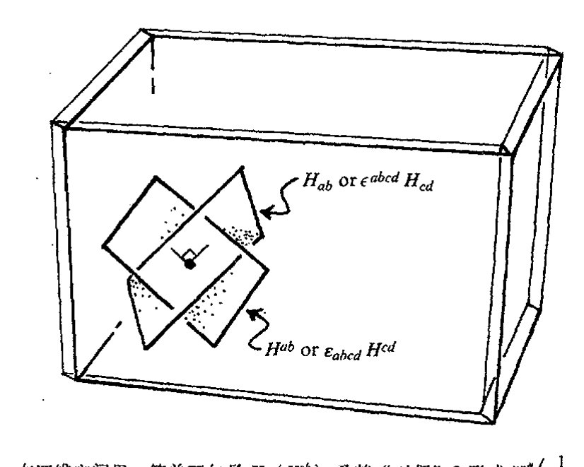
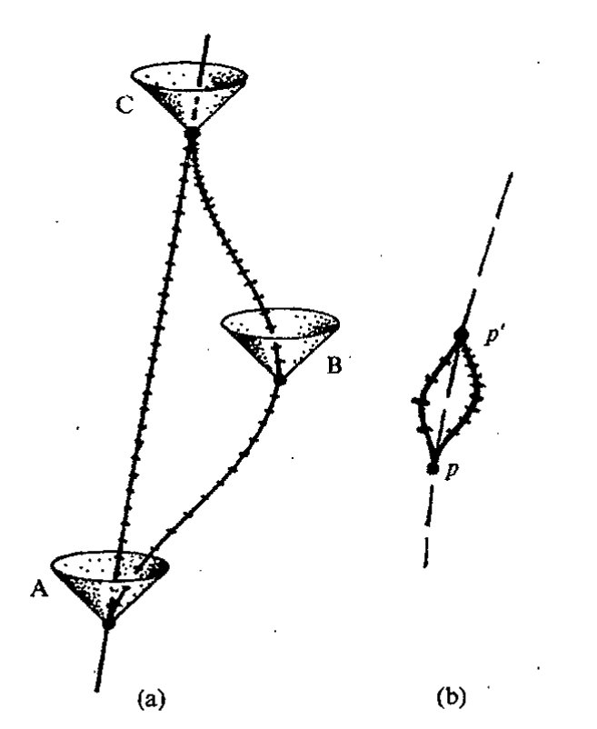
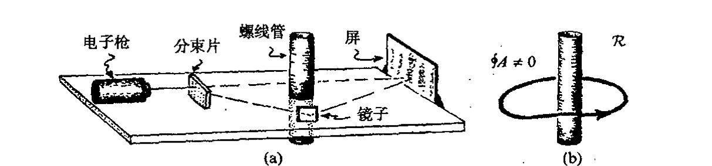
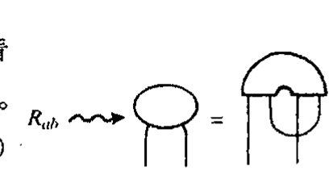
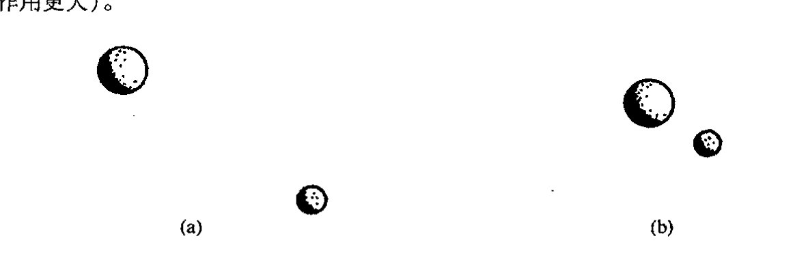
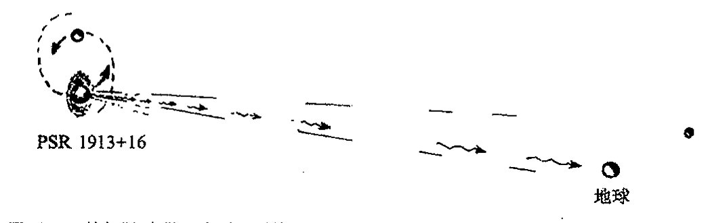
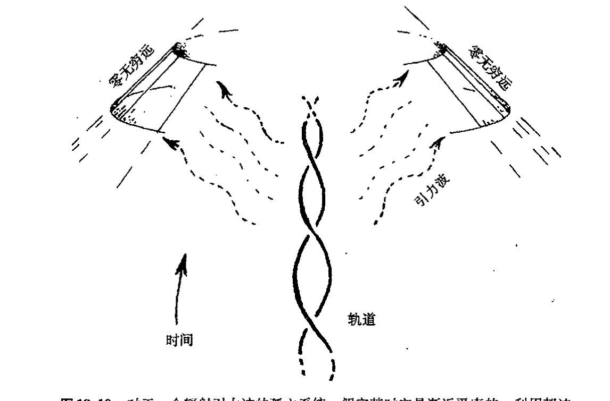

<!-- page 337 -->

通向实在之路

---

第十九章

麦克斯韦和爱因斯坦的经典场

---

## 19.1　背离牛顿动力学的演化

从1687年牛顿的《原理》出版为标志的牛顿动力学框架建立始，到1905年以爱因斯坦第一篇相对论论文发表为标志的狭义相对论的出现，其间出现了许多涉及基本物理学图像的重要发展。其中最大的变化就是出现了物理场的概念。由于主要是法拉第和麦克斯韦在19世纪的工作，人们认识到，与早先掌握的具有瞬时作用^1^的单个粒子这种“牛顿实在”共存的，一定还存在一种弥漫于空间的物理场。后来，这种“场”的概念又成了1915年爱因斯坦提出的引力的弯曲时空理论里的核心概念。我们今天的所谓经典场，指的就是麦克斯韦的电磁场和爱因斯坦的引力场。

现在我们知道，物理世界的本质要远比经典物理所描述的复杂得多。1900年，马克斯·普朗克揭示了需要“量子论”的第一个迹象，此后人们为完善这一理论又花去了近半个世纪。应当明了的是，除了所有这些针对“牛顿”物理基础的深刻变化之外，在此前后，牛顿理论本身的框架内也存在许多其他重要的发展，它们以强有力的数学进步的面貌出现。我们将在下一章论述这一主题。这些数学与经典场论有着重要关联，但更重要的是，它们是准确理解量子力学所必不可少的先决条件。热力学（及其精致化了的统计力学）就是这种重要进展的一个领域。它研究的是由大量个体组成的系统的整体行为，运动的细节并不重要。这种系统的整体行为通常用适当的平均量来描述。这项成就发轫于19世纪中叶，至20世纪初完成，其中卡诺、克劳修斯、麦克斯韦、玻尔兹曼、吉布斯和爱因斯坦等人的贡献尤为突出。我将在第27章里对热力学里最重要也最令人迷惑的一些问题进行论述。

本章描述麦克斯韦和爱因斯坦的物理场理论，即电磁场和引力场的“经典物理学”。电磁理论在量子论中也起着重要作用，它为我们将在第26章论述的量子场论的进一步发展提供了原型

·318·

<!-- page 338 -->

第十九章 麦克斯韦和爱因斯坦的经典场

“场”。另一方面，对引力场的适当量子化处理则仍是扑朔迷离，充满争议。我们将在本书的后半部分（第 28 章以后）对这些量子/引力问题予以论述。但就下面将要考虑的物理来说，我们主要是研究经典意义下的物理场。

在本章开头，我已指出，牛顿基础的动摇早在 20 世纪里相对论革命和量子论革命之前的 19 世纪就已经开始。这种变化的最初迹象来自米歇尔·法拉第 1833 年前后作出的惊人的实验发现以及他为此提出的实在图像。根本上说，这种基础的变化就是人们认识到，“牛顿粒子”以及作用在粒子间的“力”已不再是宇宙间唯一的实在。“场”的观念，一种无形的实在的存在方式，必须得到认真考虑。1864 年，伟大的苏格兰物理学家詹姆斯·克拉克·麦克斯韦将这种“无形场”必须满足的方程系统化，并证明，这些场可以将能量从一个地方带到另一个地方。将电场、磁场、甚至光统一起来的这些方程就是现在人们熟知的麦克斯韦方程，也是第一个相对论性的场方程。

按 20 世纪的观点（今天，我们的数学已取得了长足进步，这里我特别要提到我们在第 12～15 章看到的流形上的微积分技术），麦克斯韦方程似乎有一种令人叹服的本性和简单性，让我们怀疑这些电/磁场还怎么去服从其他物理规律。但这种观点忽视了一个事实，那就是正是麦克斯韦方程本身导致了数学的这种极为丰富的发展；正是这些方程的形式导致了洛伦兹、庞加莱和爱因斯坦提出了狭义相对论的时空变换，由此又导致闵可夫斯基的时空概念。在时空框架下，我们可以为这些方程找到一种形式，使之能够自然发展到嘉当的微分形式理论（[§12.6](chapter_12.md#126-外导数)），并使与麦克斯韦理论中电荷守恒律和磁通量守恒律有关的积分表达式变得非常优美，这些绝妙的公式就是 [§12.5](chapter_12.md#125-形式的积分)，6 里的外微积分基本定理。

看起来好像我把所有这些进展都归功于麦克斯韦方程的影响，在叙述中采取了过于极端的态度。应当说，麦克斯韦方程在这些方面的确具有不容置疑的重要意义。方程得以确立的许多先驱，像拉普拉斯、达朗贝尔、高斯、格林、奥斯特罗格拉茨基、库伦、安培和其他人当然都有着重要影响，但我们仍需要弄懂电场和磁场，它们是这些发展背后的主要驱动力——这些认识对于引力场的情形也一样。本章的其余部分就是关于如何正确理解电磁场和引力场，以及如何将其纳入现代数学的框架之内。

## 19.2 麦克斯韦电磁场理论

那什么是麦克斯韦方程呢？它们是用来描述电场的 3 个分量 $E_1$，$E_2$，$E_3$ 和磁场的 3 个分量 $B_1$，$B_2$，$B_3$ 的时间演化的偏微分方程（见 [§10.2](chapter_10.md#102-光滑偏导数)），其中电荷密度 $\rho$ 和电流密度的 3 个分量 $j_1$，$j_2$，$j_3$ 被认为是给定的量。那些被视为场在其中传播的环境因素作为其他场量也可以包括进来。在作基础物理讨论时，通常我们略去麦克斯韦方程中与环境媒质有关的那些方面，因为这些媒质本身实际上是由众多的细微成分组成的，每种成分原则上都能在更为基础的水平上进行处理。

<!-- page 339 -->

通向实在之路

为方便起见，我们取所谓“高斯”单位，并采用（[§18.1](chapter_18.md#181-欧几里得型与闵可夫斯基型四维空间)的）闵可夫斯基坐标，即 $x_0=t$，$x_1=x$，$x_2=y$，$x_3=z$（+---符号差）的时空单位（光速 $c=1$）。

电磁场和电荷-电流密度（按闵可夫斯基当初使用的规范）分别综合成时空2形式 $\boldsymbol{F}$（称为麦克斯韦场张量）和时空矢量 $\boldsymbol{J}$（称为电荷-电流矢量），其分量的矩阵形式为

$$
\begin{pmatrix} F_{00} & F_{01} & F_{02} & F_{03} \\ F_{10} & F_{11} & F_{12} & F_{13} \\ F_{20} & F_{21} & F_{22} & F_{23} \\ F_{30} & F_{31} & F_{32} & F_{33} \end{pmatrix} = \begin{pmatrix} 0 & E_1 & E_2 & E_3 \\ -E_1 & 0 & -B_3 & B_2 \\ -E_2 & B_3 & 0 & -B_1 \\ -E_3 & -B_2 & B_1 & 0 \end{pmatrix},
$$

$$
\begin{pmatrix} J^0 \\ J^1 \\ J^2 \\ J^3 \end{pmatrix} = \begin{pmatrix} \rho \\ j_1 \\ j_2 \\ j_3 \end{pmatrix}.
$$

注意到2形式要求满足反对称 $F_{ba}=-F_{ab}$。我还将使用所谓 $\boldsymbol{F}$ 和 $\boldsymbol{J}$ 的霍奇对偶，它们分别是2形式 ${}^*\boldsymbol{F}$ 和3形式 ${}^*\boldsymbol{J}$，定义为

$$
\begin{pmatrix} {}^*F_{00} & {}^*F_{01} & {}^*F_{02} & {}^*F_{03} \\ {}^*F_{10} & {}^*F_{11} & {}^*F_{12} & {}^*F_{13} \\ {}^*F_{20} & {}^*F_{21} & {}^*F_{22} & {}^*F_{23} \\ {}^*F_{30} & {}^*F_{31} & {}^*F_{32} & {}^*F_{33} \end{pmatrix} = \begin{pmatrix} 0 & -B_1 & -B_2 & -B_3 \\ B_1 & 0 & -E_3 & E_2 \\ B_2 & E_3 & 0 & -E_1 \\ B_3 & -E_2 & E_1 & 0 \end{pmatrix},
$$

$$
\begin{pmatrix} {}^*J_{123} \\ {}^*J_{023} \\ {}^*J_{013} \\ {}^*J_{012} \end{pmatrix} = \begin{pmatrix} -\rho \\ j_1 \\ -j_2 \\ j_3 \end{pmatrix}.
$$

这里所需的反对称性质 ${}^*F_{ab}={}^*F_{[ab]}$ 和 ${}^*J_{abc}={}^*J_{[abc]}$ 均满足。根据列维-齐维塔张量 $\boldsymbol{\varepsilon}$（[§12.7](chapter_12.md#127-体积元求和规则)），并由整体反对称性 $\varepsilon_{abcd}$（$=\varepsilon_{[abcd]}$）和归一化条件，故有 $\varepsilon_{0123}=1$，于是这些对偶可写成

$${}^*F_{ab}=\frac{1}{2}\varepsilon_{abcd}F^{cd}\qquad\text{和}\qquad{}^*J_{abc}=\varepsilon_{abcd}J^d,$$

这里，按[§14.7](chapter_14.md#147-度规能为你做什么)，$F_{ab}$ 的指标升 $F^{ab}$ 就是 $g^{ac}g^{bd}F_{cd}$。注意到 $\varepsilon^{abcd}=g^{ap}g^{bq}g^{cr}g^{ds}\varepsilon_{pqrs}$ 满足 $\varepsilon^{0123}=-1$，因此[§12.7](chapter_12.md#127-体积元求和规则)里的 $\boldsymbol{\varepsilon}$ 由 $\boldsymbol{\varepsilon}_{abcd}=-\boldsymbol{\varepsilon}^{abcd}$ 给定。*[19.1] 图19.1以图表方式给出了这些“对偶”运算（以及麦克斯韦方程本身）。我们将发现，这种意义（以及其他相关意义）下的“对偶”在各种不同

---

*[19.1] 检验这些公式。

·320·

<!-- page 340 -->

场合下都有着重要应用。

图 19.1 霍奇对偶和麦克斯韦方程的图示记法。在标准闵可夫斯基框架下，量 $\varepsilon_{abcd}$（$=\varepsilon_{[abcd]}$）和 $\epsilon^{abcd}$（$=\epsilon^{[abcd]}$），按 $\varepsilon_{0123}=\varepsilon^{0123}=1$ 归一化与它们的升/降（分别通过 $g^{ab}$ 和 $g_{ab}$）有关系 $\varepsilon_{abcd}=-\epsilon_{abcd}$ 和 $\epsilon^{abcd}=-\varepsilon^{abcd}$。在图示法下，这种符号的变化被指标的倒置所取代。右上框出的是麦克斯韦方程，第一个是场张量 $F$（及其升 $F^{ab}=g^{ac}g^{bd}F_{cd}$；参见图 14.21）的形式，这样，方程变为 $\nabla_a F^{ab}=4\pi J^b$，$\nabla_{[a}F_{bc]}=0$，等等。相应地，用其对偶 $^*F$（这里 $^*F_{ab}=\frac{1}{2}\varepsilon_{abcd}F^{cd}$，$^*J_{abc}=\varepsilon_{abcd}J^d$）则方程为 $\nabla_{[a}^*F_{bc]}=\frac{4}{3}\pi\,^*J_{abc}$，$\nabla_a\,^*F^{ab}=0$。

我们还必须对霍奇对偶的几何意义作些陈述。从 [§12.7](chapter_12.md#127-体积元求和规则) 我们知道，双矢量 $\boldsymbol{H}$（由反对称量 $H^{ab}$ 描述）到其"对偶"2 形式 $\boldsymbol{H}^\#$（由 $\frac{1}{2}\varepsilon_{abcd}H^{cd}$ 给出）的运算不会对其几何解释造成太大影响。例如，如果 $\boldsymbol{H}$ 是简单双矢量，从而 2 形式 $\boldsymbol{H}^\#$ 也是简单的（见 [§12.7](chapter_12.md#127-体积元求和规则) 节末），那么，由 $\boldsymbol{H}^\#$ 确定的二维平面元与由 $\boldsymbol{H}$ 确定的二维平面元将完全相同（正如 [§12.7](chapter_12.md#127-体积元求和规则) 指出的，唯一差别就是 $\boldsymbol{H}^\#$ 具有密度性质）。另一方面，从 2 形式 $H_{ab}$ 到双矢量 $H^{ab}$（$=H_{cd}g^{ca}g^{db}$）的指标升运算则更具重要的几何作用。对于简单双矢量情形，由 $H_{ab}$ 确定的二维平面元是由 $H^{ab}$ 确定的二维平面元的正交补（见 [§18.3](chapter_18.md#183-洛伦兹正交性时钟悖论)）。霍奇对偶，正如它作用到 2 形式 $H_{ab}$ 上将我们带到 $\frac{1}{2}\varepsilon_{abcd}H^{cd}$（即 $\boldsymbol{H}^\#$）一样，使用指标升 $H_{ab}\mapsto H^{ab}$ 并因此牵涉到正交补的传递，见[图 19.2](assets/page341_fig01.jpg)。相应地，将我们从 $\boldsymbol{F}$ 带到 $^*\boldsymbol{F}$ 的霍奇对偶也涉及正交补。

有了这种记法，我们就可以非常简洁地将麦克斯韦方程写成**(19.2)**

$$\mathrm{d}\boldsymbol{F}=0,\quad \mathrm{d}\,^*\boldsymbol{F}=4\pi\,^*\boldsymbol{J}.$$

---

**〔19.2〕** 以电场和磁场分量形式完整地写出这些公式，用算符 $\partial/\partial t$ 说明这些公式如何给出了电场和磁场的时间演化。

· 321 ·

<!-- page 341 -->

通向实在之路

**图 19.2** 在四维空间里，简单双矢量 $\boldsymbol{H}$（$H^{ab}$）及其"对偶"2形式 $\boldsymbol{H}^\#\left(\frac{1}{2}\varepsilon_{abcd}H^{cd}\right)$表示的是同一个二维平面元。但 $\boldsymbol{H}$ 的指标降（即简单2形式 $H_{ab}$，它等价于其"对偶"双矢量 $\frac{1}{2}\varepsilon^{abcd}H_{cd}$）表示的则是二维正交补平面元（见图 18.4）。因此，正是霍奇对偶中的指标升/降导致了到正交补的通道。

我们还可以将麦克斯韦方程完全写成指标形式\*[19.3]

$$\nabla_{[a}F_{bc]}=0\quad,\quad \nabla_a F^{ab}=4\pi J^b。$$

注意，如果我们将外导数算子 $\mathbf{d}$ 用到麦克斯韦方程第二式 $\mathbf{d}\,{}^\ast\!\boldsymbol{F}=4\pi\,{}^\ast\!\boldsymbol{J}$ 的两边，并利用 $\mathbf{d}^2=0$ 这一事实（[§12.6](chapter_12.md#126-外导数)），则可得推论：电荷-电流矢量 $\boldsymbol{J}$ 满足"零散度"方程\*\*[19.4]

$$\mathbf{d}\,{}^\ast\!\boldsymbol{J}=0\qquad\text{或等价地}\qquad \nabla_a J^a=0。$$

这里，我要稍稍偏离些主题，介绍一下麦克斯韦张量的自对偶和反自对偶概念，它们在后面（[§32.2](chapter_32.md#322-阿什台卡变量的手征输入) 和 [§33.6](chapter_33.md#336-作为无质量自旋粒子的扭量的几何), 8, 11，见 [§18.3](chapter_18.md#183-洛伦兹正交性时钟悖论)）相当重要。这两个概念分别由下式给出：

$${}^+\!\boldsymbol{F}=\frac{1}{2}(\boldsymbol{F}-\mathrm{i}\,{}^\ast\!\boldsymbol{F})\quad\text{和}\quad {}^-\!\boldsymbol{F}=\frac{1}{2}(\boldsymbol{F}+\mathrm{i}\,{}^\ast\!\boldsymbol{F})$$

446

（二者彼此间复共轭）。在量子论里可以证明，这些复量分别描述右自旋光子和左自旋光子（电磁场量子）；见 [§22.7](chapter_22.md#227-类光测量螺旋性), 12，[图 22.7](assets/page412_fig02.jpg)。自对偶/反自对偶性质表现为\*\*\*[19.5]

$${}^\ast({}^\pm\!\boldsymbol{F})=\pm\,\mathrm{i}\,{}^\pm\!\boldsymbol{F}$$

记住，${}^\ast\!\boldsymbol{J}$ 是实的，我们可以将两组麦克斯韦方程（分别按实部和虚部）叠加成一组：

$$\mathbf{d}\,{}^+\!\boldsymbol{F}=-2\pi\mathrm{i}\,{}^\ast\!\boldsymbol{J}$$

---

\* [19.3] 证明它们与前述方程的等价性。

\*\* [19.4] 证明这两种零散度形式是等价的。

\*\*\* [19.5] 证明该式。首先说明，一个变量对偶两次产生负的原变量。这个负号与时空的洛伦兹符号差有关吗？请予以解释。

· 322 ·

<!-- page 342 -->

第十九章　麦克斯韦和爱因斯坦的经典场

光子提供了光的粒子描述。我们将在第21章里看到，量子论是如何容许光的粒子描述和波的描述共存的。麦克斯韦的巨大成就之一，就是通过以他名字命名的这组方程，证明了存在以光速传播的电磁波，它具有所有已知的光的偏振特性（我们将在[§22.7](chapter_22.md#227-类光测量螺旋性)对其进行考察）。根据这些事实，麦克斯韦提出，光是一种电磁波现象。1888年，差不多在麦克斯韦发表他的方程后的四分之一世纪，海因里希·赫兹通过实验确认了麦克斯韦的惊人的理论预言。

在上面的简短叙述中，我假定背景空间是平直的闵可夫斯基空间M，在接下来的[§19.3](#193-麦克斯韦理论中的守恒律和通量定律)，4和[§19.5](#195-能量动量张量)的前一部分讨论中，我们也都采用这一假设。然而，它不是真正必要的，如果存在时空弯曲，所有结论依然有效。因此，上述分量必须看成是某个闵可夫斯基局域参照系下的量，指标记法也同样要注意这一点。***[19.6]

## 19.3　麦克斯韦理论中的守恒律和通量定律

我们由电荷－电流矢量的零散度可得到电荷守恒方程。因为通过外演算基本定理（[§12.6](chapter_12.md#126-外导数)），我们有$\int_{\mathcal{R}} \mathrm{d} {}^{*}\boldsymbol{J} = \int_{\partial\mathcal{R}} {}^{*}\boldsymbol{J}$，因此

$$\int_{\mathcal{Q}} {}^{*}\boldsymbol{J} = 0,$$

积分在闵可夫斯基空间M的任意三维闭曲面$\mathcal{Q}$上进行。（M的任意三维闭曲面是M的某个四维紧致区域$\mathcal{R}$的边界$\partial\mathcal{R}$。）见图19.3。量${}^{*}\boldsymbol{J}$可理解为穿过$\mathcal{Q} = \partial\mathcal{R}$的"电荷通量"（或电荷"流量"）。因此，上述方程告诉我们的是，穿过边界的净电荷通量为零；即所有流入$\mathcal{R}$的电荷量精确等于所有从$\mathcal{R}$流出的电荷量：电荷守恒。***[19.7]

我们还可以从麦克斯韦方程第二式$\mathrm{d} {}^{*}\boldsymbol{F} = 4\pi {}^{*}\boldsymbol{J}$导出所谓"高斯定理"。在某一时刻$t = t_0$应用这一定理，就可得到三维的外演算基本定理。它告诉我们，$t_0$时刻处于二维闭曲面$S$内的总电荷值（见图19.4），可以表为麦克斯韦张量${}^{*}\boldsymbol{F}$的对偶在$S$上的积分。或者说，通过积分穿过$S$的电场$\boldsymbol{E}$的总通量，我们可以获得$S$包围的总电荷量。***[19.8]

更一般地，即使$S$不处于某个固定时间点$t = t_0$，这个定理一样可用。假定$S$是某个三维紧致空间区域$\mathcal{A}$的二维类空边界。于是$S$所包围的（或用时空术语说，就是"穿过"$S$的，见图19.4）区域$\mathcal{A}$内的总电荷量$\chi$为

$$\int_{S} {}^{*}\boldsymbol{F} = 4\pi\chi,\ \text{这里}\ \ \chi = \int_{\mathcal{A}} {}^{*}\boldsymbol{J}.$$

***〔19.6〕你能看出这一点吗？在曲线坐标系下$\boldsymbol{F}$和${}^{*}\boldsymbol{F}$的分量是什么？为什么麦克斯韦方程不受其影响？

***〔19.7〕对于$\mathcal{R}$取时空"柱面"（由固定的有限时间间隔$t$里的某个界定出的空间区域构成）情形，写出该方程的完整细节，并解释，这里的"电荷通量"概念与由类空的"顶"和"底"以及类时"侧面"组成的柱面情形有何不同？

***〔19.8〕解释这个量正好就是电通量。

·323·

<!-- page 343 -->

通向实在之路

---

**图 19.3** 时空中的电荷守恒。三维闭曲面 $\mathcal{Q}$ 是闵可夫斯基时空 $\mathbb{M}$ 的某个四维紧致区域 $\mathcal{R}$ 的边界 $\partial\mathcal{R}$，因此，由外演算基本定理，我们有 $\displaystyle\int_{\mathcal{Q}}{}^*\!J=\int_{\mathcal{R}}\mathrm{d}^*\!J=0$，因为 $\mathrm{d}^*\!J=0$。量 ${}^*\!J$ 描述穿过 $\mathcal{Q}$ 的电荷"通量"，因此穿过 $\mathcal{Q}$ 流入的电荷总"通量"等于流出的电荷总"通量"，故电荷守恒。

---

**图 19.4** 在某一时刻 $t=t_0$ 的三维曲面内，从麦克斯韦方程第二式 $\mathrm{d}^*\!F=4\pi\,{}^*\!J$ 可得到高斯定理。这里，电通量在二维空间闭曲面的积分（${}^*\!F$ 的积分）给出所包围的总电荷。实际上，这个积分不限于特定时间的二维曲面，由此高斯定理得到推广。

---

· 324 ·

<!-- page 344 -->

第十九章 麦克斯韦和爱因斯坦的经典场

从麦克斯韦方程第一式 $\mathrm{d}\boldsymbol{F}=0$ 我们也可以得到相关的守恒律。除了 $\boldsymbol{F}$ 取代了 ${}^{*}\boldsymbol{F}$，相应的源项 ${}^{*}\boldsymbol{J}$ 为零，这个式子与麦克斯韦方程第二式别无二致。因此，对闵可夫斯基空间内任意二维闭曲面，[^2] 我们总有通量定律

$$\int_{\mathcal{S}} \boldsymbol{F} = 0 \text{。}$$

注意，从 ${}^{*}\boldsymbol{F}$ 变换到 $\boldsymbol{F}$（或从 $\boldsymbol{F}$ 到 ${}^{*}\boldsymbol{F}$），我们只是交换了电场和磁场矢量（符号也作相应变化）。$\boldsymbol{F}$ 的无源性表达了这么一个（迄今所知的）事实：自然界不存在磁单极子。一个磁单极子本身就是一个磁北极或磁南极——而不是像普通磁体那样南北极总是成对出现。（普通的磁极不是一个独立的物理实体，只是电荷环流的一种表现。）自然界里，物理客体上似乎不存在净"磁荷"（非零"磁力"）。单从麦克斯韦方程的观点上看，似乎找不到好的理由来说明为什么不存在磁单极子，因为我们可以简单地为麦克斯韦方程第一式 $\mathrm{d}\boldsymbol{F}=0$ 的右边配备一个量，这并不造成协调性的破坏。事实上，物理学家们一直在思考磁单极子存在的可能性，并试图找到它们。它们的存在对粒子物理有着重要影响（见 [§28.2](chapter_28.md#282-宇宙的拓扑缺陷)），但直到目前还没有任何迹象表明这种单极子在宇宙中实际存在着。

## 19.4 作为规范曲率的麦克斯韦场

对某个 1 形式 $\boldsymbol{A}$，麦克斯韦方程第一式 $\mathrm{d}\boldsymbol{F}=0$ 还隐含着

$$\boldsymbol{F} = 2\mathrm{d}\boldsymbol{A} \text{，}$$

（这里用到了"庞加莱引理"：如果 $r$ 形式 $\boldsymbol{\alpha}$ 满足 $\mathrm{d}\boldsymbol{\alpha}=0$，那么局域上总存在一个 $(r-1)$ 形式 $\boldsymbol{\beta}$ 使得 $\boldsymbol{\alpha}=\mathrm{d}\boldsymbol{\beta}$。见 [§12.6](chapter_12.md#126-外导数)。）此外，在一个具有欧几里得拓扑的区域内，这个局域结果可扩展到整个区域。[^3] 量 $\boldsymbol{A}$ 称为电磁势。它并不由场 $\boldsymbol{F}$ 唯一地确定，但可以有一个增量 $\mathrm{d}\Theta$，\*[19.9] 这里 $\Theta$ 是某个实标量场：

$$\boldsymbol{A} \mapsto \boldsymbol{A} + \mathrm{d}\Theta$$

在指标记法下，这些关系为

$$F_{ab} = \nabla_a A_b - \nabla_b A_a$$

并有自由度

$$A_a \mapsto A_a + \nabla_a \Theta \text{。}$$

电磁势的这个"规范自由度"告诉我们，$\boldsymbol{A}$ 不是一个局域可测的量。我们不可能从实验上测得"$\boldsymbol{A}$ 在某点的值"，因为 $\boldsymbol{A}+\mathrm{d}\Theta$ 可以像 $\boldsymbol{A}$ 一样满足同样的物理要求。但这个势为处理麦克斯韦场与某种其他物理实体 $\Psi$ 之间的相互作用提供了数学上的线索。它是怎么起作用的呢？$A_a$

---

\*[19.9] 为什么我们可以加上这个量？

· 325 ·

<!-- page 345 -->

通向实在之路

的具体作用是提供了一种规范联络（或叫丛联络，见 [§15.8](chapter_15.md#158-丛曲率)）

$$\nabla_a = \partial/\partial x^a - ieA_a,$$

这里 $e$ 是一个特定的实数，用以量化 $\Psi$ 所代表的那个实体的电荷。实际上，这个"实体"一般是指某个带电的量子化粒子，像电子和质子，但这个 $\Psi$ 还可以代表粒子的量子力学波函数。这些概念的全部意义要等到第 21 章才能明了，在那里我们将解释波函数概念。现在我们只需知道，$\Psi$ 可被看作是丛的截面（[§15.3](chapter_15.md#153-丛的截面)），丛描述带电的场，正是在丛上 $\nabla$ 才起着联络的作用。

电磁场量 $\boldsymbol{F}$ 和 $\boldsymbol{A}$ 是不带电荷的（它们的 $e=0$），因此，所有麦克斯韦方程等都不受这个新定义的 $\nabla_a$ 的影响，即这些方程在闵可夫斯基坐标下，仍有 $\nabla_a = \partial/\partial x^a$（如果考虑到弯曲时空，这个式子可作适当推广，见 [§14.3](chapter_14.md#143-协变导数)）。那么这个联络所在的丛的几何性质又如何呢？一种观点认为，这个丛具有时空 $\mathcal{M}$ 上描述 $\Psi$ 的相因子 $e^{i\theta}$ 的圆（$S^1$s）纤维。（这是那种发生在"卡鲁扎—克莱因"图像上的事儿，我们在 [§15.1](chapter_15.md#151-纤维丛的物理背景) 指出过这一点，但在那里整个丛都视为"时空"。）更恰当的是将丛看作是每一点上可能的 $\Psi$ 值的矢量丛，相的乘积的自由度使丛成为时空 $\mathcal{M}$ 上的 U(1)丛。（我们在 [§15.8](chapter_15.md#158-丛曲率) 的节末考虑过这种问题。）为使这一点讲得通，$\Psi$ 必须是复场，其物理解释是，在某种适当意义上对位移 $\Psi \rightarrow e^{i\theta}\Psi$ 不敏感（这里 $\theta$ 流形 $\mathcal{M}$ 上的某个实值场）。这里位移是指一种电磁规范变换，物理上将这种对位移不敏感的理解称为规范不变性。丛联络的曲率就是麦克斯韦场张量 $F_{ab}$。**[19.10]**

在对这些概念作进一步探讨之前，我们不妨作些历史评述。在 1915 年爱因斯坦发表他的广义相对论之后不久，1918 年，外尔提出了一种一般化设想，其中长度的概念变得与路径无关。（Hermann Weyl，1885~1955，20 世纪里重要的数学天才。在那些其工作完全发表于 20 世纪的数学家中，我认为他是最有影响力的一位——他不仅是一位重要的纯数学家，而且也是一位重要的物理学家。）在外尔的理论里，零锥仍保持了它们在爱因斯坦理论里的具有的基础地位（例如，通过限定有质量粒子的极限速度，通过引入作用仅限于每一点的邻域的局域"洛伦兹群"），这样，洛伦兹（譬如说 $+---$）度规 $\boldsymbol{g}$ 对定义这些零锥的要求来说仍是局域的。然而，在外尔框架下，对时间和空间测量不存在绝对定标。因此这种度规至多只是比例性的。这样，对时空 $\mathcal{M}$ 上的某个（譬如说正的）标量函数 $\lambda$ 来说，形式的变换

$$\boldsymbol{g} \mapsto \lambda \boldsymbol{g},$$

是允许的。它们不影响 $\mathcal{M}$ 的零锥。（这种变换称为度规 $\boldsymbol{g}$ 的共形重定标。在外尔理论里，每个 $\boldsymbol{g}$ 的选取都为我们提供了一种可能的规范（gauge），距离和时间据以得到量度。）虽然外尔考虑的更多的是空间距离，但我们（按第 17 章的观点）认为它对时间测量一样可以适用。因此，在外尔几何里，不存在绝对的"理想化时钟"。任何时钟记录时间的快慢都将取决于其历史。

这种情形要比我在 [§18.3](chapter_18.md#183-洛伦兹正交性时钟悖论) 里描述的标准的"时钟悖论"情形（[图 18.6](assets/page323_fig01.jpg)(d)）更"糟"。在

---

**[19.10]** 证明这一点。提示：参见 [§15.8](chapter_15.md#158-丛曲率)。

· 326 ·

<!-- page 346 -->

第十九章　麦克斯韦和爱因斯坦的经典场

外尔几何里，我们可以设想，一个前往遥远恒星的空间旅行者返回地球后将发现，不只是地球上的人老了很多，就连地球上的时钟也变得与飞船上的不同步了！见[图 19.5](assets/page346_fig01.jpg)（a）。外尔正是用这些与众不同的思想将麦克斯韦电磁场理论的方程结合到时空几何里。

他的基本方法是将电磁势编译到丛联络里，就像我前面做的那样，但 $\nabla_a$ 的表达式里不含虚单位“i”。我们可将 $\mathcal{M}$ 上有关的丛看成是由那些相同的零锥共同所具有的洛伦兹度规给定的。这样，$\mathcal{M}$ 的某个点 $x$ 上的纤维组成一族成正比的度规族（如果愿意，我们可取比例系数为正）。这些度规就是上述 $g \mapsto \lambda g$ 里可能的“$\lambda$”。对任一特定选取的度规，我们有一种沿曲线定义的距离和时间规范。但规范的选取不是绝对的，因此不存在从成比例的度规 $g$ 等价族中进行优选的问题。除了零锥的（共形）结构之外还存在某种结构，即丛联络——或叫规范联络——它是外尔为使麦克斯韦的 $\boldsymbol{F}$（即 $F_{ab}$）成为其曲率而引入的。这种曲率测度的是如[图 19.5](assets/page346_fig01.jpg)（a）所示的（当世界线出现如[图 19.5](assets/page346_fig01.jpg)（b）的无穷小偏离时的）时钟快慢上的偏差。（这一点也可与 [§15.8](chapter_15.md#158-丛曲率) 的[图 15.16](assets/page270_fig01.jpg) 和[图 15.19](assets/page273_fig01.jpg) 里 $\mathbb{C}$ 上的“张紧的丛” $\mathcal{BC}$ 进行比较，基本的丛概念非常类似。）

当爱因斯坦得知这一理论后，他致信外尔说，尽管外尔概念在数学上非常优美，但其中存在基本的物理缺陷。例如，频谱似乎本应完全与原子的历史无关，但外尔理论预言的则不是这样。更主要的是，虽然当时不是所有相关的量子力学规律都已公式化（我会在后面谈到这些，见 [§21.4](chapter_21.md#214-量子理论的实验背景)，[§23.7](chapter_23.md#237-玻色子和费米子)，8），但外尔理论却与量子力学里同类型的不同粒子之间存在严格同一性这一原理（见 [§21.4](chapter_21.md#214-量子理论的实验背景)）相冲突。特别是，时钟频率与粒子质量存在直接联系。正如我们将要看到的，静质量 $m$ 的粒子具有自然频率 $mc^2h^{-1}$，这里 $h$ 是普朗克常数，$c$ 是光速。因此在外尔几何里，不只是时钟频率，而且粒子的质量都依赖于其历史。例如，按照外尔理论，如果两个光子有不同的历史，那就几乎一定会有不同的质量，这就违反了量子力学有关同类粒子具有严格同一性（[§23.7](chapter_23.md#237-玻色子和费米子)，8）这一原理。

虽然在最初的外尔理论里存在这种致命的缺陷，但后来发现，⁴ 如果我们将“规范”从（由

· 327 ·

<!-- page 347 -->

通向实在之路

λ）实定标改为由单位模的复数（$e^{i\theta}$）定标，那么这一理论仍行得通。这种思想看起来很怪，但在第21章及其后章节（特别是 §§ 21.6, 9）我们将看到，量子力学规则迫使我们必须采用复数来描述系统的态。特别是，单位模复数 $e^{i\theta}$ 可以乘上这种"量子态"（经常用 $\Psi$ 表示）而局域上却不带来可观察的后果。这种"非可观察的"替代物 $\Psi \mapsto e^{i\theta}\Psi$ 就是今天仍在使用的"规范变换"，尽管现在它涉及的不是长度标长的变化，而是复平面上的转动（这种复平面既不与空间维也不与时间维直接关联）。在这种奇异的扭曲形式下，外尔理论为 $U(1)$ 联络提供了一种恰当的物理定位（我在第15章的末尾提到过这一点），并且已成为电磁场实际相互作用的现代图像的基础。定义在电磁势上的算子 $\boldsymbol{\nabla}$（即 $\nabla_a = \partial/\partial x^a - ieA_a$）提供了荷电量子化波函数 $\Psi$ 丛（[§21.9](chapter_21.md#219-波函数的概率分布)）上的 $U(1)$丛联络。

有意思的是，联络的路径依赖性（我们可以比较一下图19.5里的路径依赖性）表现为一种出人意表的实验现象，即所谓阿哈罗诺夫-玻姆（Aharonov-Bohm）效应。由于联络 $\boldsymbol{\nabla}$ 的作用只是一种量子现象，因此我们在经典实验上是看不到这种路径依赖性的。阿哈罗诺夫-玻姆效应有赖于量子干涉现象（见 [§21.4](chapter_21.md#214-量子理论的实验背景) 和图21.4）。在其典型实验里，电子被准直成束后由分束片分成两束通过一个无电磁场（$\boldsymbol{F}=0$）的区域，区域中两束电子路径之间置有一长直密绕螺管（管内充满磁力线，管外无磁场），最后两束电子在检测屏上形成干涉条纹（见图19.6(a)）。整个过程中电子都处于无场 $\boldsymbol{F}$ 作用状态。但相关的无场区 $\mathcal{R}$（自源始，分束绕过密绕螺管，直至屏）却不是单连通的，对于 $\mathcal{R}$ 外的场 $\boldsymbol{F}$，不存在一种规范选择使得在 $\mathcal{R}$ 内电磁势 $\boldsymbol{A}$ 处处为零。正是这种非单连通 $\mathcal{R}$ 内的非零势的存在——或更准确地说，$\mathcal{R}$ 内 $\boldsymbol{\nabla}$ 的路径依赖性——导致屏上干涉条纹出现位移。

**图19.6** 阿哈罗诺夫-玻姆效应。(a) 一束电子被分成两束绕过导电长直密绕螺管的两边，最后在检测屏上形成量子干涉条纹（比较图21.4）。尽管电子经过的是一个零场强（$\boldsymbol{F}=0$）区域，但干涉条纹却与螺管内的磁通量强度有关。(b) 这个效应依赖于 $\oint\!A$ 的值，这个值在积分路径是拓扑上非平凡闭合曲线时不为零，尽管路径上的 $\boldsymbol{F}$ 是零。在无场区无论怎么连续地改变路径，$\oint\!A$ 的值都不会变化。

事实上，干涉条纹位移效应并不依赖于 $\boldsymbol{A}$ 在局部的具体值（这也不可能，因为如上所述，$\boldsymbol{A}$ 不是一个局部可观测量），而是取决于 $\boldsymbol{A}$ 的某个非局域积分。这就是量 $\oint\!A$，环路取为 $\mathcal{R}$ 内的拓扑非平凡闭曲线。见图19.6(b)。由于 $\mathcal{R}$ 内 $\mathrm{d}A$ 为零（因为 $\mathcal{R}$ 内 $\boldsymbol{F}=0$），因此如果在 $\mathcal{R}$ 内沿

<!-- page 348 -->

第十九章　麦克斯韦和爱因斯坦的经典场

这条闭曲线行走，积分 $\oint A$ 不变。**[19.11]** 由此可知，$\oint A$ 在无场区 $\mathcal{R}$ 内非零。也就是说，阿哈罗诺夫–玻姆效应本身取决于这个拓扑上非平凡的无场区。

由于这个电磁联络 $\nabla$ 概念历史上源于外尔的杰出思想（它最初是作为路径依赖性“规范”来用的），因此我们称它为规范联络——这一称呼也为一般化的电磁理论，如“杨–米尔斯”理论（一种描述弱、强相互作用的现代粒子物理理论），所采用。应当指出，严格说来，“规范联络”概念依赖于一种确切但非直接可观测的对称性的存在（对于电磁场，就是 $\Psi \to e^{i\theta}\Psi$ 对称性）。回想一下，实际上，当时爱因斯坦之所以反对外尔最初的规范概念，就是因为这个概念里包含了粒子的质量（及其自然频率）等直接可测量量，因此认为它不可能用作所需意义上的“规范场”。以后我们将发现，在某些使用“规范”概念的现代理论里，这个问题显然已变得模糊不清。

## 19.5　能量动量张量

下面，我们将把注意力转向以“规范理论”面貌出现的其他基本经典场，也就是引力场。作为前提，首先来考虑场的能量密度（即引力源的密度）问题无疑是重要的。爱因斯坦的著名方程 $E = mc^2$ 告诉我们，质量和能量本质上是一回事儿（[§18.6](chapter_18.md#186-牛顿能量和角动量)）。而牛顿又说过，质量是引力之源。因此，我们需要弄明白如何来描述场（如麦克斯韦电磁场）的能量密度，这个密度如何才能像引力源那样起作用。爱因斯坦告诉我们的是，通过所谓能量动量张量就能做到这一点。这个张量是一个对称的 $\begin{bmatrix} 0 \\ 2 \end{bmatrix}$ 价张量 $\boldsymbol{T}$（指标形式 $T_{ab} = T_{ba}$），它满足守恒律

$$\nabla^a T_{ab} = 0。$$

（在本章余下部分，我们用时空协变导数 $\nabla_a$ 代替 $\partial/\partial x^a$。因为这里的场都是不带电的，故早先的那些表达式都将被原封不动地移过来，亦见 [§19.2](#192-麦克斯韦电磁场理论) 的最后一段，注释 19.2 和练习 [19.6]。）我们可以将这种表达式与电荷的守恒方程 $\nabla^a J_a = 0$ 比较一下。$T_{ab}$ 需要附加指数的理由是，守恒量能量–动量是一个不同于标量电荷的四维（余）矢量（即 [§18.7](chapter_18.md#187-相对论性能量和角动量) 里的四维能量动量（余）矢量 $p_a$）。为了更清楚地描述 $T_{ab}$ 的物理意义，我们不妨过渡到等效量 $T^a{}_b = g^{ac}T_{cb}$，这里有一个指标被度规张量 $g^{ab}$ 提升。*[19.12]* 量 $T^a{}_b$ 将所有场与粒子的不同的密度和能量动量通量综合到一块儿。更具体地说，在标准的闵可夫斯基坐标系下，余矢量 $T^0{}_b$ 定义了四维动量密度，而 3 个余矢量 $T^1{}_b$，$T^2{}_b$，$T^3{}_b$ 则提供了四维动量在 3 个独立空间方向上的通量。这是直接比照 $J^a$ 情形得来的，因为

---

**[19.11]** 解释这一点。

*[19.12]* 在局域闵可夫斯基参照系下，单个分量 $T^a{}_b$ 与 $T_{ab}$ 有怎样的关系？这里分量 $g_{ab}$ 有对角形式 $(1, -1, -1, -1)$。

<!-- page 349 -->

通向实在之路

$J^0$ 是电荷密度，3 个量 $J^1, J^2, J^3$ 则提供了电荷在 3 个独立空间方向上的通量（即电流）。正是附加指数 $b$ 告诉我们，现在守恒律指的是（余）矢量守恒。可以证明，量 $T_{00}$ 测度的是能量密度，$T_{11}, T_{22}, T_{33}$ 测度的是 3 个空间坐标轴方向上的压强。

正如麦克斯韦曾指出的，电磁场本身携带能量。在指标记法下，可以证明，电磁场的能量动量张量为**[19.13]

$$\frac{1}{8\pi}(F_{ac}F^{c}{}_{b} + {}^*F_{ac}{}^*F^{c}{}_{b}) \text{。}$$

其他物理场也有各自的能量动量张量，各种不同的能量动量张量加在一块儿给出总的能量-动量张量，并且满足守恒方程 $\nabla^a T_{ab} = 0$。

然而，存在引力场时能量动量则相当不同。在没有引力时，时空是平直的（即闵可夫斯基空间），这时我们可以用平直（闵可夫斯基）坐标系。于是 4 个矢量 $T^a{}_0, T^a{}_1, T^a{}_2$ 和 $T^a{}_3$ 中的每一个都单独满足矢量 $J^a$ 所满足的守恒方程（即类似 $\nabla_a J^a = 0$ 有 $\nabla_a T^a{}_0 = 0$，等），这意味着对能量-动量的 4 个分量中的每一个都有类似于电荷情形下的积分守恒律（即类似于 $\int_{\mathcal{Q}} {}^*J = 0$ 的量）。因此，总质量是守恒的，总动量的 3 个分量也是守恒的。但从第 17 章对爱因斯坦的等效原理的讨论，以及为什么会有弯曲时空的讨论中可知，当存在引力场时，我们必须认识到此时 "$\nabla_a$" 已不再是简单的 "$\partial/\partial x^a$"，而是（按 [§14.3](chapter_14.md#143-协变导数)）有附加项 $\Gamma^b{}_{ac}$，它使 "$\nabla_a T^a{}_0$" 的真正意义变得模糊不清，并使我们无法从"守恒方程" $\nabla^a T_{ab} = 0$ 导出能量和动量的积分守恒律。这个问题可以表述为这样一个事实：$T_{ab}$ 的附加指数 $b$ 使 $T_{ab}$ 不能成为 3 形式的对偶，我们不可能写出（像 "$\mathrm{d}{}^*J = 0$" 中的 3 形式 ${}^*J$ 的零外导数那样的）与坐标无关的"守恒方程"表达式。我们似乎失去了这些物理学中最重要的守恒律——能量动量守恒律！

实际上，在能量动量守恒问题上有一种更令人满意的观点，它可以像用于闵可夫斯基空间那样用在弯曲时空 $\mathcal{M}$ 中，还可以用到角动量守恒上（见 [§18.6](chapter_18.md#186-牛顿能量和角动量) 和 [§22.8](chapter_22.md#228-自旋和旋量), 11）。按这种观点，假定 $\mathcal{M}$ 有基灵矢量 $\kappa$（满足 $\nabla_{(a}\kappa_{b)} = 0$，见 [§14.7](chapter_14.md#147-度规能为你做什么)），它描述 $\mathcal{M}$ 的某种连续对称性。那么在闵可夫斯基空间中，就有 10 个这种独立对称性，分别是 4 个独立平移对称（3 个空间量和 1 个时间量）和 6 个独立时空转动对称（洛伦兹群 $O(1,3)$ 的非反射部分），[Figure: [图 18.3](assets/page320_fig01.jpg)b]。因此，闵可夫斯基空间有 10 个独立的基灵矢量。正如我们在下一章里要说的，拉格朗日表述（内特尔定理）使我们能够从系统所具有的每一种连续对称性导出相应的守恒律。时间平移对称给出能量守恒，空间平移对称给出三维动量守恒，而旋转对称则给出角动量守恒。（对普通的空间转动，我们不仅有普通角动量的 3 个分量，还存在源自洛伦兹"递升（boosts）"的 3 个分量，我们借

---

**[19.13] 证明：如果 $J=0$，则该式满足守恒方程 $\nabla^a T_{ab} = 0$。找出这个量的 00 分量，并用 $(E_1, E_2, E_3)$ 和 $(B_1, B_2, B_3)$ 形式将电磁场能量密度恢复到麦克斯韦的原初形式 $(E^2 + B^2)/8\pi$。

· 330 ·

<!-- page 350 -->

---

第十九章　麦克斯韦和爱因斯坦的经典场

以从一个速度变换到另一个速度，并得到质心运动的守恒，见 §§ 18.6，7，[图 18.16](assets/page332_fig01.jpg)。）为了从任一具体的基灵矢量 $\boldsymbol{\kappa}$ 得到适当的守恒律，我们构造通量

$$L_a = T_{ab}\kappa^b,$$

只要对称张量 $T_{ab}$ 满足 $\nabla^a T_{ab}=0$，就一定有守恒律 $\nabla_a L^a = 0$。***[19.14] 因此，如同 § 19.3 情形，存在积分守恒律 $\int_{\mathcal{Q}} {}^*L = 0$。

这些守恒律只在具有适当的、由基灵矢量 $\boldsymbol{\kappa}$ 给出的对称性的时空里才成立。物理上看，其原因在于时空几何的自由度——即引力——受到场的去耦。时空几何仅仅是一个背景，因此不受其中的场的干扰。此外，由于对称性，场不能够从背景中得到前面所讨论的那个量（或将这个量遗留在背景里）。这些考虑对以后的讨论（特别是第 30 章里的 §§ 30.6，7）非常重要，但它们毕竟无助于我们了解守恒律在出现了引力情形下的命运，此时我们仍无法找回失去了的能量和动量守恒律。

自广义相对论出现以后，这一令人难堪的事实一直引起人们对这一理论的强烈质疑，多年来许多物理学家都表达过这种不快。⁶ 以后（§ 19.8）我们会看到，实际上爱因斯坦理论是以一种相当圆滑的方式来考虑能量动量守恒的——至少在这种守恒律必不可少的情形下是如此。现在，我们就来谈谈这一点。在爱因斯坦理论里，出现在场方程里的对称 $\begin{bmatrix} 0 \\ 2 \end{bmatrix}$ 价张量 $\boldsymbol{T}$ 包含了所有非引力场（和粒子）的能量动量。而引力场本身的能量则排除在 $\boldsymbol{T}$ 的表示之外。

如果我们再次考虑到等效原理，就会明白这种观点是合理的。想像一个处于自由轨道上的观察者，譬如说处于没有窗户的飞船中，于是乎，至少从一级近似上看，根本就不存在引力场。观察者将看到，在飞船内能量是守恒的，因此方程 $\nabla^a T_{ab}=0$ 里不含任何引力场的贡献。当然这种"守恒"只是一种近似，只要存在由引力场的不均匀性（如 § 17.5 中的[图 17.8](assets/page305_fig01.jpg)(a), 17.8(b) 和 17.9）引起的相对加速度（潮汐）效应，就必须给予修正。于是问题变得微妙起来，我们得确认在不同情形下哪一"级"效应开始起作用。但总的来说，其结果是：量 $\boldsymbol{T}$ 及其方程 $\nabla^a T_{ab}=0$ 应当在不受引力场非均匀性的干扰下——即不受时空联络 $\boldsymbol{\nabla}$ 的曲率 $\mathcal{R}$ 的影响下——得到保留，引力对能量动量守恒的影响应当作为某种非局域效应在总能量动量计算中进行修正。（唯一的例外可能是我们如何来考虑时空曲率带来的修正，但这个问题在这里并不重要。）从这个观点来看，引力对能量动量的影响在一定意义上——将局域方程 $\nabla^a T_{ab}=0$ 从总体能量动量的积分守恒律分离开来——"被遗漏了"。

---

***[19.14] 为什么？为什么说这种处理使 $\nabla^a T_{ab}=0$ 等式具体化了？对于一个四维动量在碰撞过程中是保守量的离散粒子系统，你能给出类似于连续场守恒律 $\nabla^a(T_{ab}\kappa^b)=0$ 的守恒律吗？提示：对给定基灵矢量 $\kappa^a$，找到一个对碰撞中的每个粒子皆为常数的量。

· 331 ·

<!-- page 351 -->

通向实在之路

## 19.6 爱因斯坦场方程

在 [§19.8](#198-引力场能量) 我们再回到这个问题上来。眼下我们要了解的是爱因斯坦场方程的实际形式。这个方程是以读者并不陌生（希望如此）的张量表述形式给出的。所以如此，部分是因为四维的时空曲率是一个复杂的问题。想象一下 [§17.5](chapter_17.md#175-嘉当的牛顿时空) 里那位阿尔伯特，也就是处于不受地球引力场影响的自由轨道上的宇航员 A。在以 A 为中心的径向上存在向心加速度，而在其他方向上则是外向的加速度。这使 A 受到潮汐力作用。潮汐力是时空曲率的表现。要综合这些复杂效应，我们就需要带 $R_{abcd}$ 的张量，它在虚空空间里有 10 个独立分量，在含物质的空间里有 20 个独立分量。实际上，$R_{abcd}$ 就是我们在 [§14.7](chapter_14.md#147-度规能为你做什么) 里遇到的黎曼（-克里斯托费尔）张量 **R** 的指标形式。

张量表述尽管构造复杂，但仍需要它的另一个理由是这种计算在爱因斯坦理论里起着基本的作用。我们还是回到基本的等效原理这一爱因斯坦整个思路的出发点上来。对于处于自由落体中的观察者（如宇航员 A）来说，引力并不成其为力，因为它无法被感知。另一方面，引力可以时空弯曲的方式表现出来。如果这种思想行得通，那么很重要的一点就是理论中不存在"优先坐标系"。因为如果某一有限类的坐标系被当作优先选择的话，那么这些坐标系就可以定义为"自然的观察者参照系"，在这些参照系下，我们可以重新引入"引力"概念，这样等效原理就失效了。实际上，这一点相当微妙，许多物理学家都试图在不同场合以不同方式避开这一点。但我认为，保持坐标独立性的概念正是爱因斯坦理论的精华所在。它就是所谓的广义协变原理。这条原理不仅告诉我们不存在优先坐标系，而且告诉我们，即使存在两种代表着两种物理上不同的引力场的时空，也不存在什么可以对二者进行逐点区分的自然的优先方法，因此我们不能说一个时空里的某个点就是另一个时空里的同样的一点！这个哲学问题还涉及爱因斯坦理论与量子力学原理的关系问题，我们以后（[§30.11](chapter_30.md#3011-与爱因斯坦原理的基本冲突)）再来讨论。眼下应当明白的是，广义协变原理之所以重要，就在于它迫使我们接受一种与坐标无关的引力理论。正是基于这个原因，张量表述才成为爱因斯坦理论的核心。

现在我们来看看爱因斯坦方程实际上是什么。本质上说，方程的这种形式是出于两个更深层次的要求：（i）（局域的）引力源应当是服从 $\nabla^a T_{ab} = 0$ 的能量-动量张量 $T$，（ii）在适当的牛顿极限（远小于光速，弱引力）下，能够过渡到标准的牛顿引力理论。让我们回到 [§17.5](chapter_17.md#175-嘉当的牛顿时空) 的讨论。在那里我们曾发现，在牛顿理论里，与观察者世界线 $\gamma$ 初始平行且相邻的测地线有一种体积收缩效应。这些相邻的测地线以这样一种方式相对于 $\gamma$ 加速：它们所包围的（无限小）三维类空体积 $\delta V$ 具有 $-4\pi G\,\delta M$ 的整体加速度，其中 $\delta M$ 是测地线所包围的（无限小）体积里的主动引力质量。符号表示体积的收缩性，见[图 17.8](assets/page305_fig01.jpg)(b)。考虑到质量分布的主动引力效应，这是牛顿理论的完整表述。

怎么才能将它转换到时空曲率 **R** 与能量动量张量 $T$ 之间存在联系的方程上呢？这里的一个

· 332 ·

<!-- page 352 -->

---

第十九章　麦克斯韦和爱因斯坦的经典场

---

关键是，这个体积收缩加速度由 $\begin{bmatrix} 0 \\ 2 \end{bmatrix}$ 价对称张量量度，这个张量称为里奇张量，定义如下：

$$R_{ab} = R_{acb}{}^c,$$

其中 $R_{abcd}$ 是黎曼张量。\**[19.17]*（见[图 19.7](assets/page352_fig01.jpg) 的图示记法。我们再次看到，在符号、指标级、符号差等方面可以有无穷多种不同的约定。像以前一样，我在此向读者推荐我自己的这套方法，见 [§14.4](chapter_14.md#144-曲率和挠率)。）

更具体地说，体积（自静止开始的）加速度为\**\**[19.16]

$$\mathbf{D}^2(\delta V) = R_{ab}t^a t^b \delta V,$$

这里 $\mathbf{D}$ 表示观察者原时（[§17.9](chapter_17.md#179-爱因斯坦广义相对论的时空)）下沿观察者世界线 $\gamma$ 的变化率，因此 $\mathbf{D}^2$ 表示加速度。我们有

$$\mathbf{D} = t^a \nabla_a = \nabla,$$

这里 $t^a$ 是与 $\gamma$ 相切的未来类时单位矢量（故 $t^a t_a = 1$）。

在观察者的局部参照系中，观察者测得的质量密度（由 $E=mc^2$ 和 $c=1$ 知，它也是能量密度，见 [§18.6](chapter_18.md#186-牛顿能量和角动量)）是 $T_{ab}$ 的"00"分量，即量 $T_{ab}t^a t^b$，因此相邻测地线所包围的体积 $\delta V$ 内的质量 $\delta M$ 是

$$\delta M = T_{ab}t^a t^b \delta V。$$

这样，由物质密度引起的体积加速度的"牛顿期望值" $-4\pi G\,\delta M$（[§17.5](chapter_17.md#175-嘉当的牛顿时空)）为

$$-4\pi G T_{ab}t^a t^b \delta V。$$

但我们前面已经看到，由时空曲率引起的体积加速度效应为 $R_{ab}t^a t^b \delta V$，于是有

$$R_{ab}t^a t^b \delta V = -4\pi G T_{ab}t^a t^b \delta V。$$

上式两边除以 $\delta V$，并注意到它对经历该事件的所有观察者都成立，因此我们可以去掉 $t^a t^b$，\**\**\**[19.17]* 这样就得到了场方程

$$R_{ab} = -4\pi G T_{ab},$$

它正是爱因斯坦最初的形式。但这个形式并不令人满意，因为"守恒方程" $\nabla^a T_{ab} = 0$ 会导致 $\nabla^a R_{ab} = 0$，而这又会引起麻烦！

麻烦是什么呢？在 [§14.4](chapter_14.md#144-曲率和挠率) 里我们有比安基恒等式 $\nabla_{[a} R_{bc]d}{}^e = 0$，通过缩并，我们得到\**\**\**[19.18]*

$$\nabla^a\left(R_{ab} - \frac{1}{2}Rg_{ab}\right) = 0,$$

---

\** [19.15]* 为什么 $R_{ab}$ 是对称的？

\**\** [19.16]* 看看你能否用里奇恒等式和李导数性质证明这个式子。

\**\**\** [19.17]* 充分说明为什么我们可以"去掉"所有的 $t^a$？解释张量对称性的作用。

\**\**\** [19.18]* 用图示记法证明这一点。

---

·333·

<!-- page 353 -->

通向实在之路

这里里奇标量（或叫标量曲率，尽管在正定情形下，数学上采用“$-R$”可能更合乎大多数的约定）定义为

$$R = R_a{}^a$$

（这里 $R$ 不要和粗黑体 $\mathbf{R}$ 相混淆，后者表示的是一个完整的曲率张量。）上述方程 $R_{ab} = -4\pi G T_{ab}$ 的“麻烦”是，当与缩并了的比安基恒等式合并时，导致的一个结论是能量动量张量的迹 $T$

$$T = T_a^a$$

必须在整个时空上为常量。***[19.19] 这显然是与普通的（非引力）物理图像不相协调的。对此爱因斯坦得出的最终结论是（1915 年），从一致性上说，两个满足“守恒方程” $\nabla^a(\cdots) = 0$ 的张量应当相等（仅差一个常数因子），并提出了我们现在所知的爱因斯坦场方程：^8,***[19.20]

$$R_{ab} - \frac{1}{2}Rg_{ab} = -8\pi G T_{ab}$$

在无物质（包括电磁场）存在的特定情形下，我们有 $T_{ab} = 0$。这是真空情形。爱因斯坦方程——真空方程——变成 $R_{ab} - \frac{1}{2}Rg_{ab} = 0$，它可重写为***[19.21]

$$R_{ab} = 0$$

里奇张量为零的空间有时也称为是里奇平直的。

## 19.7 进一步的问题：宇宙学常数；外尔张量

现在，我们来考虑爱因斯坦在 1917 年建议的附加项，称作宇宙学常数 $\Lambda$。这是一个非常小的常量，其实际存在性受到当代宇宙学观察的强烈置疑，它即使不为零其上限也不可能超出 $10^{-55}\text{cm}^{-2}$。在我们所达到的宇宙学尺度上，没有任何观察事实与此直接相关。在上述方程中，如果用 $R_{ab} - \frac{1}{2}Rg_{ab} + \Lambda g_{ab}$ 来替代 $R_{ab} - \frac{1}{2}Rg_{ab}$ 项，那么它仍然满足“守恒方程”，因为 $\Lambda$ 是常数（且 $\nabla\mathbf{g} = 0$）。爱因斯坦方程现在写成

$$R_{ab} - \frac{1}{2}R\,g_{ab} + \Lambda g_{ab} = -8\pi G\,T_{ab}$$

爱因斯坦当初引入这个额外的项是为了在宇宙学上寻求可能的空间封闭的静态宇宙。^9 但自有了 1929 年埃德温·哈勃的观测结果之后，问题已变得很清楚，宇宙是膨胀的，因此不存在静态宇宙。爱因斯坦收回了他对宇宙学常数的支持，并声称这是他一生中“最大的错误”（大概是因为他因此错过了预言宇宙膨胀！）。但无论怎样，一个概念一经产生就不会轻易地消失。自爱

---

***[19.19] 为什么？
***[19.20] 比较 $-4\pi G$ 来解释系数 $-8\pi G$。
***[19.21] 为什么？

· 334 ·

<!-- page 354 -->

第十九章　麦克斯韦和爱因斯坦的经典场

因斯坦首次提出这个概念后，宇宙学常数就一直出没于宇宙学理论的背景中，让一些人忧虑，使另一些人宽慰。最近，对遥远超新星的观察使大多数理论学家重新引入 $\Lambda$ 或类似的量，来解释"暗能量"，以图这些观察与另一些已知的要求相协调。${}^{10}$以后（特别是 [§28.10](chapter_28.md#2810-宇宙学参数观察的地位)）我还会回到这个宇宙学常数问题上来。在我看来（大多数相对论学家同样这么认为），虽然方程中容许存在这么个非零常数，但我很怀疑大自然是否乐于接受这个项。然而，正如我们将在 [§28.10](chapter_28.md#2810-宇宙学参数观察的地位) 看到的，最近的宇宙学证据似乎都指向这个方向。

我们还可以换一种方式来写爱因斯坦场方程（包含宇宙学常数）：${}^{*(19.22)}(R_{ab}=-8\pi G(T_{ab}-\frac{1}{2}Tg_{ab})+\Lambda g_{ab})$。用时间轴为 $t^a$ 的局部坐标系，以便与 $t^at^b$ 缩并后给出 00 分量。我们发现，向内的体积加速度由 $8\pi G\left(T_{00}-\frac{1}{2}Tg_{00}\right)-\Lambda$ 给定，形式为 $4\pi G\left(\rho+P_1+P_2+P_3\right)-\Lambda$，其中 $P_1$，$P_2$ 和 $P_3$ 是物质沿 3 个（正交）空间轴的压强值。我们将此与牛顿理论给出的 $4\pi G\,\delta M$ 作一比较，就会发现，主动引力质量密度 $\rho_G$ 在爱因斯坦广义相对论里为

$$\rho_G=\rho+P_1+P_2+P_3-\frac{\Lambda}{4\pi G},$$

而不是 $\rho_G=\rho$，后者是我们期望从 "$E=mc^2$" 中导出的量（单位已经取得使 $c=1$）。$\Lambda$ 的贡献极其微小，与能量相比，附加的压强项通常也极小，可以说，这是因为组成该物质的粒子运动速度与光速相比极为缓慢所致。但是，在某些极端条件下，压强对主动引力质量的贡献还是相当重要的。当一个大质量恒星处在自身引力引起的坍缩的危险边缘时，我们发现星体内的压强在增大，我们期望这有助于抵御星体的坍缩，但实际上却是加快了坍缩趋势，因为这种压强产生了额外的引力质量！

如前所述（[§19.5](#195-能量动量张量)），爱因斯坦理论里的能量动量张量 $T_{ab}$类似于麦克斯韦理论里的电荷电流矢量 $J_a$。因此，正如 $J_a$ 是电磁场的源一样，量 $T_{ab}$可看作是引力源。那么我们是否有恰当的类似于麦克斯韦场张量 $F_{ab}$的量来描述引力自由度呢？答案不是度规张量 $\mathbf{g}$，它更类似于电磁势 $\mathbf{A}$。一些人认为可将整个黎曼曲率张量 $R_{abcd}$比作 $\boldsymbol{F}$，但更合适的是取所谓外尔张量（或共形张量）$C_{abcd}$来类比 $\boldsymbol{F}$，它像完整的黎曼张量，只是"去掉了"里奇张量部分。这是合理的，因为里奇张量几乎与源 $T_{ab}$等同，因此，如果我们要确认那些直接描述引力场的自由度，那么我们就需要去掉这些"源的自由度"。在无物质的自由空间里（为简单计，取宇宙学常数 $\Lambda$ 为零），外尔张量就等于黎曼曲率张量，但通常外尔张量是通过一种看上去有些复杂的公式来定义的（其中将里奇张量从曲率里去掉了，这里我提升了两个指标，以便充分利用 [§11.6](chapter_11.md#116-格拉斯曼代数) 的方括号记法）：${}^{**(19.23)}$

---

\*〔19.22〕为什么？

\*\*〔19.23〕证明：$C$ 的所有"迹"为零（例如 $C_{abc}{}^d=0$，等等）。这种计算可以用图示记法进行吗？

<!-- page 355 -->

通向实在之路

$$C_{ab}{}^{cd} = R_{ab}{}^{cd} - 2R_{[a}{}^{[c}g_{b]}{}^{d]} + \frac{1}{3}Rg_{[a}{}^{c}g_{b]}{}^{d}。$$

在[§28.8](chapter_28.md#288-外尔曲率假说)我们将看到外尔张量所起的关键的物理作用。时空的共形平直条件是这个量为零。

## 19.8　引力场能量

我们回到引力场本身的质量/能量问题上来。虽然在诸如能量动量张量 $T$ 的问题上没有回旋余地，但显然还存在这样一种情形，就是“无形的”引力能量实际所起的物理角色。想象两个大质量物体（譬如行星）。如果它们靠得很近（我们可以假定它们同时处于相互间的静态），那么总能量里就会有（负的）引力势能的贡献，因此总质量较二者远离时为小（图19.8）。忽略更小的能量效应（如星体表面因另一个星体的引潮场作用而产生的变形），我们看到，不论两个星体之间是靠近还是远离，实际能量动量张量 $T$ 的总贡献都是一样的。但总质量/能量在两种情形下则不同，这种差异可能起因于引力场本身的能量（实际上是负贡献，二者接近的情形较远离的情形作用更大）。

**图19.8**　引力势能的非局域性。想象两颗行星（为简单计，我们可以假定它们同时处于相互间的静态）构成的系统：（a）二者相距遥远，于是负的（牛顿）势能要比（b）二者相邻情形小。因此，尽管由能量动量张量测得的总能量密度在两种情形下几乎相同，但情形（a）的总能量（或系统总质量）要大于情形（b）。

现在我们来考虑星体在各自轨道上运动时的情形。作为爱因斯坦场方程的一个结果，引力波——时空链波——将从系统中释放出来，并携（正）能量离开系统。在正常情形，这种能量损失非常小。例如，我们太阳系里从木－日系统产生的最大的这种效应及其能量损失率只相当于一只40瓦灯泡的辐射损失！但对于质量更大、运动更为激烈的系统，如两个相互盘绕的黑洞的最终并合态来说，能量损失就会大到足以用现今的探测器进行记录。我们现在已可以记录出现在15兆秒差距或 $4.6 \times 10^{23}$ 米距离上的引力波。

介于这两个极端之间的中间情形是著名的双中子星系统 PSR1913+16 发出的引力波，由约瑟夫·泰勒（Joseph Taylor）和罗素·赫尔斯（Russell Hulse）领导的诺贝尔获奖小组曾对此展开研究，见图19.9。（中子星是一种高致密星体，主要由中子组成，整个星体的密度堪比原子核。一颗由这种物质构成的网球其质量差不多相当于火卫二的质量！）人们对这个系统已观察了

·336·

<!-- page 356 -->

25年，其运动规律得到了非常精确的记录（之所以可能是因为其中的一颗是个脉冲星，它以每秒发出17个电磁"脉冲信号"精确地出现在雷达屏上）。这些信号的计时性非常精确，而且系统本身又如此"干净"，从而通过观测与理论预言的比较使爱因斯坦的广义相对论在前所未有的10^14分之一的准确度上得到确认。这个数字指的是整个20多年里总的计时准确度。^11

图19.9 赫尔斯-泰勒双中子星系统PSR1913+16。其中的一个是精确定时发出电磁信号的脉冲星。根据这种信号我们可以极高的精度确认其轨道。由观察确认的系统能量损失与爱因斯坦理论对这种系统所作的引力辐射能量损失预言非常一致。这些波表现为能量动量张量为零的时空真空里的褶皱。

作为对广义相对论的观测检验，人们对这种性质以及[§28.8](chapter_28.md#288-外尔曲率假说)所述的引力透镜效应的观察，从早期开始至今已经进行了许多年。但在1915~1969年（1969年对遥远的类星体的射电观测标志着广义相对论的验证进入了一个新阶段^12）期间，只有著名但令人印象相当模糊的"三个检验"来支持这一理论。其中最重要的是对爱因斯坦的水星"近日点反常进动"的解释的观察验证。这种反常与牛顿引力理论的预言之间实际上只有非常微小的偏差（仅每百年43角秒，或300万年误差一周！），但观察检验则逾半个世纪（亦见§30.1和[§34.9](chapter_34.md#349-美和奇迹)）。^13 第二项观察是遥远星光经过太阳时产生的微弱的偏折效应。这是1919年亚瑟·爱丁顿（Arthur Eddington）率领的远征队在普林西比岛（Principe，靠近西非海岸）观察日全食时确认的。它是上面提到的"引力透镜"现象的一个例证。现在人们把这种效应应用到宇宙学距离尺度上，以期获得有关宇宙中质量分布的重要信息（[§28.8](chapter_28.md#288-外尔曲率假说)）。最后，按爱因斯坦理论的预言，在引力势场里存在一种时钟变慢效应。1925年，亚当斯通过对一颗作为天狼伴星的白矮星（一种密度是太阳密度数千倍的星体）的细致（而存疑的）观察来确认这种效应。但更为可信的证据是后来（1960年）庞德（Pound）和雷布卡（Rebka）在对地球自身引力场所进行的精巧实验中取得的。（但这种效应被认为是广义能量和基本量子理论的结果，因此属于一种对爱因斯坦理论的相当弱的检验。）1964年，埃尔温·夏皮罗（Erwin Shapiro）还提出过另一种不同的"延时"效应，即来自太阳背后的星体的光到达地球时产生的"延时"效应。1968~1971年，他通过对水星和火星的观察确认了这种效应。更精确的观察（0.1%，1971年）是由雷森伯格和夏皮罗利用海盗号火星探测器进行的，他们将由此获得的数据与地面得到的火星数据进行了比较。

显然，爱因斯坦理论现在已得到非常好的观测支持。引力波的存在似乎已得到赫尔斯-泰勒观察的明确证实，尽管还不是对这种波的直接探测。目前还有一些直接探测引力波的项目，其

·337·

<!-- page 357 -->

通向实在之路

目的是利用这种波来探知宇宙范围的剧烈活动（如黑洞碰撞），它们形成了一种全球性的关注。实际上，这些综合性项目^14将建造引力波望远镜，可以说，爱因斯坦理论使我们有了另一种探索广袤宇宙的能力。

我们看到，尽管一些人对能量守恒还心存担忧，但事实上广义相对论已得到非常显著的观测支持。因此我们再来探讨一下引力能的问题。这个问题是理论和观察两方面内在统一的一个关键。观察上，PSR1913+16和其他类似系统发出的引力波引起的虚空空间褶皱的确带走了能量。而虚空空间的能量动量张量为零，因此引力波能量的检测必须以不依赖局域能量“密度”的方式来进行。引力能是一种真正的非局域量，但这并不意味着我们没法对它进行数学描述。虽然客观地说，我们还没有完全搞懂引力质量/能量，但有些重要情形是我们已完全可以给出答案的。这些情形就是那些渐近平直的情形，即那些（由于与其他客体存在巨大的距离）可以与宇宙中其他客体隔离开来的引力系统。比如说，像赫尔斯–泰勒的双脉冲星那样的双星系统，我们可以对其中的引力辐射能损失进行观测。赫尔曼·邦迪及其合作者的工作（后由萨克斯（Rayner Sachs）进行了推广，去掉了邦迪对轴对称的简化假设）^15为这种系统里以引力波形式带走的质量/能量提供了清楚的数学描述，并使能量动量守恒律得以保留，^16见图19.10。这个守恒律不具有非引力场情形所具有的那种局域性质（即“守恒方程”$\nabla^a T_{ab}=0$），而且只能用于空间上完全孤立的系统。但其“神奇”之处在于它能够说明系统的组成，包括一些后来证明是有“积极”意义的定理，我们由此可知系统的总质量（包括上面讨论的“负引力能贡献”）不可能是负的。^17

图19.10 对于一个辐射引力波的孤立系统，假定其时空是渐近平直的，利用邦迪–萨克斯质能守恒律，我们可以精确测定其总质量/能量动量以及引力辐射损失。有关的数学量是非局域的，并定义在“零无穷远”（[§27.12](chapter_27.md#2712-共形图)里将讨论这个几何概念）。

·338·

<!-- page 358 -->

第十九章　麦克斯韦和爱因斯坦的经典场

还有一些关于相互作用场系统的守恒律的一般的解决办法。它们采用我们在下一章要介绍的拉格朗日方法。这种处理非常有力、一般而且漂亮，尽管事实上它并不能（至少是不能直接地）解决我们在引力问题上要解决的所有问题。拉格朗日方法以及与此紧密相关的哈密顿方法在当代物理中具有中心地位，对其有所了解是非常重要的，下面我们就去这一神奇的领域作一番探险。

## 注　释

### §19.1

19.1　我很怀疑牛顿自己会这么武断地持有这种微粒说图像（见 1730 年出版的牛顿《光学》里置疑）。但这种“牛顿的”观点在 18 世纪受到 R. G. Boscovich 的强烈支持，见 Barbour（1989）。

### §19.3

19.2　这个结果也可以用到拓扑平凡的弯曲时空中，这样，一个（主要是空间上）闭合的二维曲面总能够张起一个三维紧致区域。

### §19.4

19.3　例如，见 Flanders（1963）。

19.4　见外尔（1928），英译版，100～101 页。W·戈登、泡利和海森伯都分别独自进行过这种观察，见 Pais（1986），345 页。

19.5　见 Aharonov and Bohm（1959）。事实上这个效应 10 年前就已被 Ehrenberg and Siday（1949）提到过。它是由 Chambers 给予实验确认，并由 Tonomura 等更确实地建立起来的（1982，1986）。

### §19.5

19.6　见 Pais（1982）。

### §19.6

19.7　文中“无优先坐标系”的要求不仅相当模糊，而且某种程度上说也过于严苛了。例如在平直空间，我们有理由说“笛卡儿坐标系”（这里指 [§18.1](chapter_18.md#181-欧几里得型与闵可夫斯基型四维空间) 的闵可夫斯基坐标系 $(t, x, y, z)$，度规取最简单形式 $\mathrm{d}s^2 = \mathrm{d}t^2 - \mathrm{d}x^2 - \mathrm{d}y^2 - \mathrm{d}z^2$）的选择“优”于所有其他坐标系，宇宙模型也有其中度规看起来特别简单的特定坐标系（见 [§27.11](chapter_27.md#2711-宇宙学)，练习 [27.18]）。这个问题毋宁说是理论方程的最自然的表达方式就是不依赖于任何具体坐标系。

19.8　见 Stachel（2002），353～364 页。

### §19.7

19.9　爱因斯坦模型是具有拓扑 $\mathrm{S}^3 \times \mathrm{E}^1$ 的空间 $\mathcal{E}$，我们将在 [§31.16](chapter_31.md#3116-全息原理) 研究它。

19.10　爱因斯坦对宇宙学概念的引入是这些年里对原初的广义相对论的众多修正之一。除了 [§19.4](#194-作为规范曲率的麦克斯韦场) 讨论的外尔理论和 [§31.4](chapter_31.md#314-高维时空) 的高维卡鲁扎–克莱因概念（现今通常与超对称性综合，见 [§31.2](chapter_31.md#312-超对称), 3）之外，还有布兰斯–迪克修正模型，其中有额外的标量场。爱因斯坦自己也在 1925～1955 年间提出的“统一场论”中作过多种尝试。见 Einstein（1925）；Einstein（1945）；Einstein and Straus（1946）；Einstein（1948）；Einstein and Kaufman（1955）；Schrödinger（1950）；最近的文献见 Antoci（2001）。其中大部分提议都是试图将电磁场和其他场综合进广义相对论的大框架内。还应指出，这个框架也指爱因斯坦–嘉当–夏默–基布尔（Einstein-Cartan-Sciama-Kibble）理论，其中引入的挠率被用来描述自旋密度的直接引力效应（见 [§22.8](chapter_22.md#228-自旋和旋量)）。

### §19.8

19.11　这里，我们认为爱因斯坦理论包括了牛顿理论。需要强调的是，“$10^{14}$”这个数字并不表示精度上比牛顿情形有所提高。应当明白，计时精度往往取决于未知参数，如质量、轨道倾角、偏心率等。他们都需要对系统细节进行计算。“$10^{14}$”实际上是对图像的总体符合程度的一种量度。

19.12　1991 年，D. S. Robinson 小组用“甚长基线干涉仪”测得的结果，现在确认的广义相对论的光线弯曲效应的精度是 $10^{-4}$。

·339·

<!-- page 359 -->

通向实在之路

19.13 关于水星近日点反常的详细解释，见 Roseveare (1982)。

19.14 这些引力波研究形象地缩写成 LIGO、LISA 和 GEO。见 Shawhan (2001)；Abbott (2004)；Grishuk et al. (2001)；Thorne (1995b) 和 John Baez 的 web-commentary http://math.ucr.edu/home/baez/week143.html。

19.15 Trautman (1958)；Bondi (1960)；Bondi et al. (1962)；Sachs (1961, 1962a) 对这项工作做出了特别贡献。

19.16 亦见 Newman and Unti (1962)；Penrose (1963, 1964)；Sachs (1962b)；Bonnor and Rotenberg (1966)；Penrose and Rindler (1986)，423~427 页。

19.17 Schoen and Yau (1979, 1982)；Witten (1981)；Nester (1981)；Parker and Taubes (1982)；Ludvigsen and Vickers (1982)；Horowitz and Perry (1982)；Reula and Tod (1984)；亦见 Penrose and Rindler (1986)；和 [§32.3](chapter_32.md#323-阿什台卡变量的形式)，特别是注释 32.11。

· 340 ·
