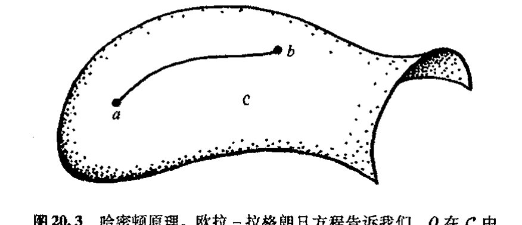
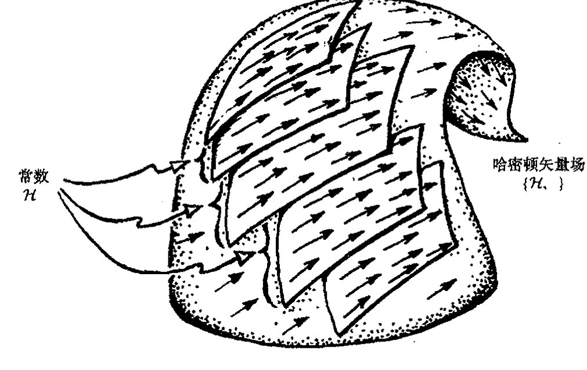
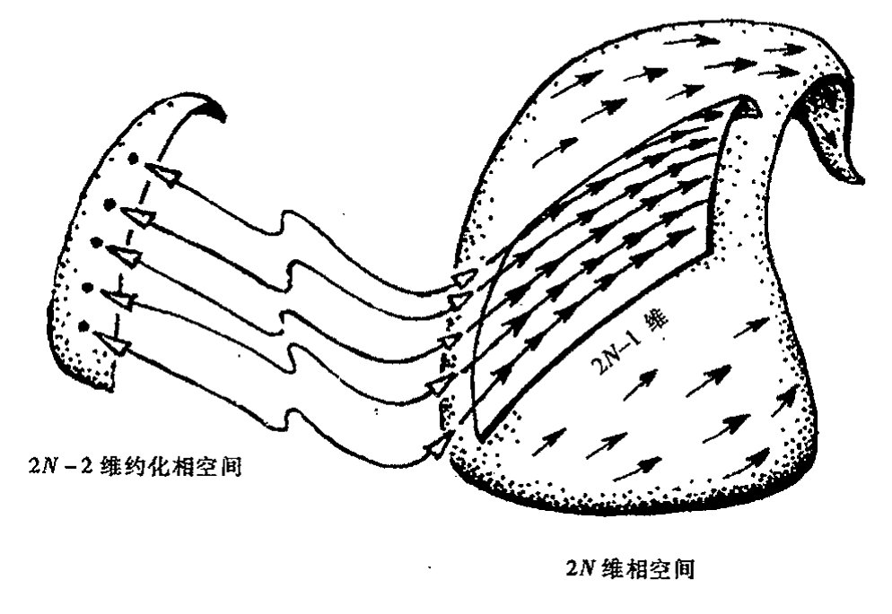
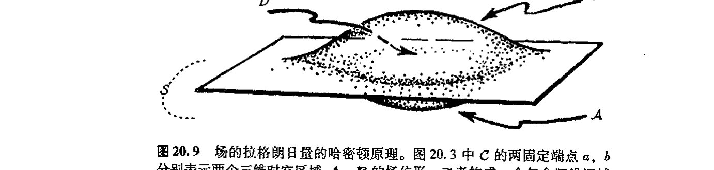

<!-- page 360 -->

第二十章 拉格朗日量和哈密顿量

---

第二十章

# 拉格朗日量和哈密顿量

## 20.1 神奇的拉格朗日形式体系

在牛顿动力学定律诞生后的几个世纪里，出现了一批建立在牛顿力学基础上的令人印象深刻的理论工作。欧拉、拉普拉斯、拉格朗日、勒让德、高斯、刘维尔、奥斯特罗格拉德斯基、泊松、雅可比、哈密顿和其他一些人纷纷重新表述那种导致深刻统一认识的思想。这里我将对这一动力学发展概貌作一简述，尽管这种介绍可能对这一成就阐述得并不充分。还应当指出，这种数学上完美统一图像的出现似乎在告诉我们物理世界有着深厚的数学基础，即使是 17 世纪牛顿力学所揭示的各种定律也同样如此。物理世界里可以导致如此壮美的数学结构的定律并不是很多。 471

由牛顿力学产生的这种完美统一图像是什么呢？基本上看，它是以两种不同但紧密联系的形式出现的，二者各有所长。我们把第一种称为拉格朗日图像，第二种叫哈密顿图像。（通常命名上总有些困难。人们很容易注意到，这两种图像往往都叫拉格朗日图像，尤其是在哈密顿之前更是如此，而这种拉格朗日图像至少还部分包括了欧拉的贡献。）我们来考虑一个由众多（但有限）独立粒子和一些不可分刚体组成的牛顿体系。存在一个 $N$（某个大数）维的位形空间 $\mathcal{C}$，其中的每个点表示所有这些粒子和刚体的一种空间状态（见 [§12.1](chapter_12.md#121-为什么要研究高维流形)）。随着时间流逝，这个表示整个系统状态的单点将按体系的牛顿力学定律在 $\mathcal{C}$ 中运动，见[图 20.1](assets/page361_fig01.jpg)。一个明显的（很值得尝试的）事实是，这条定律可直接通过数学程序从单一函数中导出。在拉格朗日图像（至少是在其最简单最常用的形式¹）里，这个函数——称为拉格朗日函数——是定义在位形空间 $\mathcal{C}$ 的切丛 $\mathrm{T}(\mathcal{C})$ 上的（[图 20.2](assets/page361_fig02.jpg)(a)），见 [§15.5](chapter_15.md#155-复矢量丛余切丛)。而在哈密顿图像里，这个函数——称为哈密顿函数——是定义在称为相空间（[图 20.2](assets/page361_fig02.jpg)(b)）的余切丛 $\mathrm{T}^*(\mathcal{C})$ 上的（见 [§15.5](chapter_15.md#155-复矢量丛余切丛)）。我们注意到，$\mathrm{T}(\mathcal{C})$（它的每个点代表 $\mathcal{C}$ 的一点 $Q$ 以及 $Q$ 点的切矢量）和 $\mathrm{T}^*(\mathcal{C})$（它的每个点代表 $\mathcal{C}$ 的一点 $Q$ 以及 $Q$ 点的余切矢量）都是 $2N$ 维流形。 472

在本节里，我们研究拉格朗日图像而把哈密顿图像留到下一节。拉格朗日的 $\mathrm{T}(\mathcal{C})$ 的坐标用

· 341 ·

<!-- page 361 -->

通向实在之路

---

**图 20.1** 位形空间。N维流形C的每个点Q表示一族牛顿点粒子和刚体的一种可能的空间状态。随着系统的时间演化，Q在C中画出一条曲线。

---

**图 20.2** （a）在标准的拉格朗日图像里，拉格朗日量L是位形空间C的切丛T(C)上的光滑函数。（b）在哈密顿图像里，哈密顿量H是称之为相空间的余切丛T*(C)上的光滑函数。

于确定牛顿体系里所有物体的位置（包括表示刚体空间取向的适当的角）及其速度（包括相应的刚体的角速度）。位置坐标$q^1, \cdots, q^N$通常叫"广义坐标"，用以标记位形空间C（大概还是"逐个拼块的"，见[§12.2](chapter_12.md#122-流形与坐标拼块)）中不同的点q。它们可以是任意（合适的）坐标，不必非得是笛卡儿坐标或其他标准坐标。这正是拉格朗日图像（哈密顿图像也一样）的优美之处。坐标的选择取决于方便。当我们考虑各种不同的一般流形时，像第8，10，12，14和15章里的坐标其作用都是一样的。与广义坐标相应的是"广义速度"$\dot{q}^1, \cdots, \dot{q}^N$，这里，字符上的"点"表示时间变化率"d/dt"：

$$\dot{q}^1 = \frac{dq^1}{dt}, \cdots, \dot{q}^N = \frac{dq^N}{dt}.$$

473　　拉格朗日量L可以写成所有这些广义坐标和广义速度的函数²。

· 342 ·

<!-- page 362 -->

第二十章 拉格朗日量和哈密顿量

$$\mathcal{L}=\mathcal{L}(q^1,\cdots,q^N,\dot{q}^1,\cdots,\dot{q}^N)。$$

在这个表达式里，每个 $\dot{q}^r$ 都是独立变量（特别是独立于 $q^r$）。这也是拉格朗日量初看起来让人难以理解的地方之一，但它却是可行的。³

实际函数 $\mathcal{L}$ 值的标准的物理意义是系统动能 $K$ 和外力或内力引起的势能（坐标表示见 [§18.6](chapter_18.md#186-牛顿能量和角动量)）$V$ 之间的差 $\mathcal{L}=K-V$。系统的运动方程——涵盖了系统整个的牛顿力学行为——由所谓欧拉-拉格朗日方程给出，这组方程具有非常广泛的应用范围，同时又相当简单：

$$\frac{\mathrm{d}\partial\mathcal{L}}{\mathrm{d}t\partial\dot{q}^r}=\frac{\partial\mathcal{L}}{\partial q^r}(r=1,\cdots,N)。$$

记住，每个 $\dot{q}^r$ 都是一个独立变量，因此表达式"$\partial\mathcal{L}/\partial\dot{q}^r$"的意义是很清楚的（即指"保持其他变量固定时 $\mathcal{L}$ 对 $\dot{q}^r$ 的偏导数"）。

这些方程表达了一个明显的事实，有时我们称它为哈密顿原理或平稳作用原理。如果我们考虑 $\mathcal{C}$ 中一点 $Q$ 的运动，那么这条原理的意义就会看得非常清楚。我们知道，$\mathcal{C}$ 表示的是由整个系统所有可能的空间位形组成的空间。当点 $Q$（其任意时刻的位置由 $q^r$ 表示）以一定速率沿 $\mathcal{C}$ 中的某条曲线运动时，这个速率和它沿曲线的切向都由 $\dot{q}^r$ 的值确定。本质上说，欧拉-拉格朗日方程告诉我们的是，点 $Q$ 在 $\mathcal{C}$ 中的运动是按作用量极小化方向进行的，这里"作用量"是指 $\mathcal{L}$ 沿位形空间 $\mathcal{C}$ 中两固定点 $a,b$ 间曲线的积分，见[图 20.3](assets/page362_fig01.jpg)。

图 20.3 哈密顿原理。欧拉-拉格朗日方程告诉我们，$Q$ 在 $\mathcal{C}$ 中的运动是这么进行的：使作用量——$\mathcal{L}$ 沿 $\mathcal{C}$ 中两固定点 $a,b$ 间曲线的积分——在曲线变分下保持平稳。

更确切地说，这个积分未必真的达到"极小值"，说"平稳"较为恰当。这种情形基本上类似于通常的微积分运算（见 [§6.2](chapter_06.md#62-函数的斜率)），在那里，光滑实值函数 $f(x)$ 要达到极小值，就要求 $\mathrm{d}f/\mathrm{d}x=0$，但有时 $\mathrm{d}f/\mathrm{d}x=0$ 未必对应于函数 $f$ 的极小值，而是极大值或可能是拐点，在高维情形下，还可能是所谓的鞍点（[图 20.4](assets/page363_fig01.jpg)(b)）。所有出现 $\mathrm{d}f/\mathrm{d}x=0$ 的地方都称为是平稳的。见图 6.4 和 20.4。我们还可以回顾一下在 [§14.8](chapter_14.md#148-辛流形)，[§17.9](chapter_17.md#179-爱因斯坦广义相对论的时空) 和 [§18.3](chapter_18.md#183-洛伦兹正交性时钟悖论) 里作为（局域）正定情形下"最短路径"（有时在洛伦兹情形下是"最大类时长度路径"，虽然在一般情形里只是"定长"）的（伪）黎曼空间里的测地线的类似性质。因此，$Q$ 的轨迹可看成是空间 $\mathcal{C}$ 中某种"测地线"。

我们不妨来考虑一个简单的拉格朗日量的例子，譬如说质量 $m$ 的单个牛顿粒子在某个不变

<!-- page 363 -->

通向实在之路

**图20.4** 多变量光滑实值函数 $f$ 的平稳值。图中显示的是两变量函数 $f(x, y)$ 的情形。处于水平的函数图（二维曲面，$\partial f/\partial x = 0 = \partial f/\partial y$）是平稳的。这种情形出现在（a）$f$ 的极小值；（b）鞍点；（c）极大值等处。在满足哈密顿原理（图20.3）——或连接 $a, b$ 两点的测地线——情形下，拉格朗日量 $\mathcal{L}$ 取代了 $f$，但路径的确定要求有无限多参数，而不只是 $x, y$。同样，$\mathcal{L}$ 可以是某种平稳点，但未必是极小值。

的外加势场 $V$（$V$ 仅是位置的函数：$V = V(x, y, z, t)$）中的运动。$V$ 的意义在于它确定了粒子在外场中的势能。对于地球（近地表面）的重力场情形，考虑到此时重力是恒量，我们可取 $V = mgz$，这里 $z$ 是地面的高度，$g$ 是重力加速度。三个速度分量为 $\dot{x}, \dot{y}, \dot{z}$，故动能为 $\frac{1}{2}mv^2$（见[§18.6](chapter_18.md#186-牛顿能量和角动量)），于是拉格朗日量为

$$\mathcal{L} = \frac{1}{2}m(\dot{x}^2 + \dot{y}^2 + \dot{z}^2) - mgz$$

$z$ 的欧拉—拉格朗日方程为 $\mathrm{d}(m\dot{z})/\mathrm{d}t = -mg$，由此我们可得到指向地球的伽利略加速度常数。*[20.1]

## 20.2 更为对称的哈密顿图像

476

在哈密顿图像里，我们仍用广义坐标，但现在与广义位置坐标 $q^1, \cdots, q^N$ 相应的是所谓广义动量坐标 $p_1, \cdots, p_N$（而不是速度）。对于单个自由粒子，动量就是其速度乘以质量。但一般情形下，广义动量的表示不需要这么精确。我们总是将它取为拉格朗日量关于某个广义速度的偏导数[1]

$$p_r = \frac{\partial \mathcal{L}}{\partial \dot{q}^r}$$

不管怎样，这些参数 $p_r$ 提供了 $\mathcal{C}$ 的余切空间的坐标，因此余矢量可写成

$$p_a \mathrm{d}q^a$$

---

*[20.1] 将细节补充完整，完成论证以便给出伽利略的重力下自由落体的抛物运动。

[1] 原文误为 $P_r = \partial \mathcal{L}/\partial q^r$。——译注

·344·

<!-- page 364 -->

（这里用到 [§12.7](chapter_12.md#127-体积元求和规则) 的求和约定，即使将它视为 [§12.8](chapter_12.md#128-张量抽象指标记法和图示记法) 的抽象指标表示，也依然是正确的）。自然，这是一种 1 形式，其外导数（[§12.6](chapter_12.md#126-外导数)）

$$\mathbf{S} = \mathrm{d}p_a \wedge \mathrm{d}q^a$$

是一个 2 形式（满足 $\mathrm{d}\mathbf{S} = 0$），*\[20.2]*它将一个自然辛结构赋给相空间 $\mathrm{T}^*(\mathcal{C})$（见 [§14.8](chapter_14.md#148-辛流形)）。哈密顿图像的有力之处在于相空间是渐近流形，这种辛结构独立于具体的用以描述动力学的哈密顿量。我们在 [§20.4](#204-辛几何的哈密顿动力学) 会看到，经典力学与这种优美的辛流形几何密切相关。

作为理解这种几何的准备，我们来看看哈密顿动力学方程的形式。这些方程将系统的时间演化描述成这个完整的牛顿力学体系的代表点 P 在相空间 $\mathrm{T}^*(\mathcal{C})$ 里的轨迹。演化完全由哈密顿函数支配

$$\mathcal{H} = \mathcal{H}\left(p_1, \cdots, p_N; q^1, \cdots, q^N\right)。$$

这个量（这里都是时间独立的拉格朗日量和哈密顿量）用（广义）动量和位置描述了系统的总能量。实际上，我们可通过下式来得到这个量（视为加和约定或抽象指标）：

$$\mathcal{H} = \dot{q}^r \frac{\partial \mathcal{L}}{\partial \dot{q}^r} - \mathcal{L},$$

我们可以借助广义动量来去掉其中所有的广义速度（一般来说，这么做并不容易）。在这些动量和位置坐标下，哈密顿演化方程显得非常优美对称：

$$\frac{\mathrm{d}p_r}{\mathrm{d}t} = -\frac{\partial \mathcal{H}}{\partial q^r}, \qquad \frac{\mathrm{d}q^r}{\mathrm{d}t} = \frac{\partial \mathcal{H}}{\partial p_r},$$

这些方程描述点 $P$ 在 $\mathrm{T}^*(\mathcal{C})$ 里的速度。这个速度对每一点 P 都有定义，因此我们有一个由哈密顿量 $\mathcal{H}$ 定义的 $\mathrm{T}^*(\mathcal{C})$ 的速度场。这个矢量场可按 [§12.3](chapter_12.md#123-标量矢量和余矢量) 给定的"偏导数算子"记法表示为*\*\[20.3]*

$$\frac{\partial \mathcal{H}}{\partial p_r} \frac{\partial}{\partial q^r} - \frac{\partial \mathcal{H}}{\partial q^r} \frac{\partial}{\partial p_r},$$

它提供了 $\mathrm{T}^*(\mathcal{C})$ 中描述系统牛顿力学行为的"流"（[图 20.5](assets/page365_fig01.jpg)）。

具体到常重力场中的粒子运动情形（[§20.1](#201-神奇的拉格朗日形式体系)），哈密顿量 0 为

$$\mathcal{H} = \frac{p_x^2 + p_y^2 + p_z^2}{2m} + mgz = \frac{\mathbf{p}^2}{2m} + mgz,$$

这里，$p_x, p_y$ 和 $p_z$ 分别是笛卡儿坐标轴 $x, y, z$ 方向上的普通空间动量分量。根据粒子总能量总可以表为位置和动量的分量形式，我们可直接写出这个量。我们也可以从前述的拉格朗日量来得到这个量。*\*\*\[20.4]*

---

\* \[20.2] 为什么？

\*\* \[20.3] 解释这一点。

??? question "答案 [20.3]"
    若作用量在端点固定的所有小变分下一阶变化为零，则实际路径是作用量的驻值路径。把路径写成 $q^a(t)+\epsilon\eta^a(t)$，其中 $\eta^a$ 在端点为零，对 $\epsilon$ 的一阶项积分分部。

    端点项消失后，任意 $\eta^a$ 的系数必须为零，于是得到欧拉-拉格朗日方程。这就是“最小作用量”更准确地说应为“驻作用量”的原因。

\*\*\* \[20.4] 将它清楚地写出来。对常重力场中的落体运动，用哈密顿方程导出牛顿方程。

·345·

<!-- page 365 -->

通向实在之路

**图 20.5** 表示系统牛顿力学时间演化（见 [§20.4](#204-辛几何的哈密顿动力学)）的哈密顿流 $\{\mathcal{H},\}$ 是相空间 $\mathbf{T}^*(\mathcal{C})$ 中的矢量场。按照能量守恒，$\mathcal{H}$ 值固定的超曲面（能量固定，将 $\mathcal{H}$ 取为时间独立的）上的轨迹始终处于该超曲面内。

现在，我得承认我拿这些繁难的记号还没办法，但最好还是清理一下。在 [§18.7](chapter_18.md#187-相对论性能量和角动量) 我们看到，在表示平直时空的具有符号差 $(+---)$ 的闵可夫斯基坐标下，空间动量分量 $p_1, p_2, p_3$ 分别是普通动量分量的负值。因此我们有 $p_x=-p_1$，$p_y=-p_2$ 和 $p_z=-p_3$。在哈密顿量的一般讨论中，我们很自然会用动量的"下指标"形式 $p_a$，但它与符号差 $(+---)$ 的相对论里的 "$p_a$"（即 $p_1, p_2, p_3$）不协调。在本书里，我对此的处理是联合使用 $q^a$ 和 $p_a$ 来给出一般形式，这里每个 $p$ 与 $q$ 之间的关系按通常的符号约定，同时对可能出现的每个 $p$ 或 $q$ 不给予特定意义（读者可以自己决定其符号）。但当我将 $x^a$ 和 $p_a$ 连用时，我是在 [§18.7](chapter_18.md#187-相对论性能量和角动量) 的意义下使用这些符号，此时 $-p_1, -p_2, -p_3$ 就是通常空间动量的分量（等于标准闵可夫斯基坐标下的 $p^1, p^2, p^3$）。在用到 $x$ 而不是 $q$ 时，我的哈密顿方程以反号形式出现：

$$\frac{\mathrm{d}p_r}{\mathrm{d}t}=\frac{\partial\mathcal{H}}{\partial x^r}},\qquad\frac{\mathrm{d}x^r}{\mathrm{d}t}=-\frac{\partial\mathcal{H}}{\partial p_r}。$$

那些不是非常关注我给出的形式细节的读者完全可以不理会这些问题。（大部分专家亦可如此，除非他们要写有关这方面的文章和书！）

## 20.3 小振动

在下节应用哈密顿量来描述几何性质的研究之前，我们先来考虑一种重要的情形：平衡态物理系统的振动。这个问题在许多不同的领域都会遇到，而且对我们后面处理量子力学（[§22.11](chapter_22.md#2211-球谐函数)）问题也有特别重要的意义。振动理论既可以方便地用拉格朗日方法来描述，也可以

· 346 ·

<!-- page 366 -->

用哈密顿方法来描述。我这里主要采用哈密顿方法，因为它能使我们更直接地过渡到量子力学的振动上来（[§22.11](chapter_22.md#2211-球谐函数)）。振动的拉格朗日理论非常类似于哈密顿理论，我们留给读者自己去处理（见练习［20.10］）。

振动系统的一个简单例子是通常在重力下振荡的单摆。如果振幅很小，则摆锤的运动可视为正弦波的时间函数（图20.6）（这是我们在[§9.1](chapter_09.md#91-傅里叶级数-153)就遇到过的单一的“傅立叶分量”的性态。）对于小振子，振动周期实际上与振幅（即摆锤摆过的距离）无关——这是伽利略1583年就观察得出的一个结果。这种运动称为简谐运动。

**图20.6** 重力场中摆动的单摆。作为小振动，摆锤的运动相当于简谐运动，摆锤的位移（画成时间函数）给出“正弦波”。

本节里，我们来看看这种运动的特点。只有在非常特殊的条件下，一般物理系统（假定不考虑摩擦效应）才能在平衡位置附近做“摆动”。我们会发现，每一种小范围的摆动都可以分解成特定的振动模——称为简正模——整个系统结构只有一种按所谓简正频率振荡的简谐运动。

我们先看看如何对简谐运动进行分析。令$q$为偏离摆锤最低点的水平距离——也就是我们考虑的振动物理量偏离平衡点的位移。于是这个小位移$q$的运动方程为

$$\frac{\mathrm{d}^2 q}{\mathrm{d}t^2}=-\omega^2 q,$$

这里，正的常量$\omega/2\pi$是振动频率。上式说明，指向平衡位置的加速度$\mathrm{d}^2 q/\mathrm{d}t^2$正比于（比例因子$\omega^2$）向外的位移。从[§6.5](chapter_06.md#65-微分法则)可知，$q=\cos\omega t$和$q=\sin\omega t$都满足这个方程，二者的一般线性组合也满足这个方程：

$$q=a\cos\omega t+b\sin\omega t,$$

这里$a$和$b$是常数。***[20.5] 对于摆长为$h$的重力摆（运动限于平面内），当$q$值较小时，摆的运动

---

***［20.5］验证这一点，解释为会么$\omega/2\pi$是频率。解释为什么这张函数图仍像正弦曲线。为什么这是一般结果？

·347·

<!-- page 367 -->

通向实在之路

方程非常类似于上式，此时 $\omega^2=g/h$；但对于较大的 $q$ 值，则偏离这个方程。**[20.6]

假定一个一般的哈密顿系统处于广义坐标 $q$ 取特定值 $q^a=q_0^a$ 的平衡态。我们不妨用广义坐标的原点来代表这种平衡态，即取 $q_0^a=0$。"平衡"是指这样一种位形，如果初始无运动，那么系统将保持静态。我们感兴趣的是这种平衡是否稳定——即是否具有这样的性质：如果我们对处于平衡位形的系统施以一小扰动，系统将不会偏离平衡太远，而只是做小振动。在研究振动时，我们的确只关心这种稳定平衡位形下的振动，因此也只关心小的广义坐标 $q^a$ 的值。此外，由于振动只涉及低速下的小扰动，故只考虑小动量 $p_a$。

假定哈密顿量可以表为 $q$ 和 $p$ 的解析形式（"解析"的意义见 [§6.4](chapter_06.md#64-欧拉的-函数概念)），于是我们可以把它展开成 $q$ 和 $p$ 的幂级数形式。对于稳定平衡态，$q_0^a=0$ 代表的一定是（局域）最小势能态。**[20.7] 在此基础上，系统在外力作用下开始运动后，其能量（动能）将增加；在 $p_a=0$ 时动能最小。因此总能量——就是哈密顿量 $\mathcal{H}$——在 $q_0^a=0=p_a$ 时局域处于最小值。这样，幂级数展开的形式为（$q$ 和 $p$ 的线性项，或二者皆为零）：

$$\mathcal{H}=\text{常数项}+\frac{1}{2}Q_{ab}q^aq^b+\frac{1}{2}P^{ab}p_ap_b+q\text{ 和 }p\text{ 的三阶或高阶项,}$$

这里 $Q_{ab}$ 和 $P^{ab}$ 正定常系数对称矩阵（若 $q^a\neq0$，则 $Q_{ab}q^aq^b>0$；同时若 $p_a\neq0$，则 $P^{ab}p_ap_b>0$。见 [§13.8](chapter_13.md#138-正交群)）。因子 $\frac{1}{2}$ 属出于方便而置。**[20.8]

我们略去高阶项来考察一下小振动的性质。现在哈密顿方程为

$$\frac{\mathrm{d}q^a}{\mathrm{d}t}=\frac{\partial\mathcal{H}}{\partial p_a}=P^{ab}p_b;$$

对 $t$ 再微分一次，

$$\frac{\mathrm{d}^2q^a}{\mathrm{d}t^2}=\frac{\mathrm{d}}{\mathrm{d}t}P^{ab}p_b=P^{ab}\frac{\mathrm{d}p_b}{\mathrm{d}t}$$

$$=-P^{ab}\frac{\partial\mathcal{H}}{\partial q^b}=-P^{ab}Q_{bc}q^c=-W^a_{\;c}q^c。$$

这里 $W^a_{\;c}=P^{ab}Q_{bc}$ 是矩阵 $Q_{ab}$ 和 $P^{ab}$ 的积（[§13.3](chapter_13.md#133-线性变换和矩阵)），我们可以写成

$$\mathbf{W}=\mathbf{PQ},$$

这样，前述方程可改写为

---

**[20.6] 用下述三种方法证明这一点，并找出完整的方程：(a) 用拉格朗日方法；(b) 用哈密顿方法；(c) 直接用牛顿定律。提示：证明 $\mathcal{L}=\frac{1}{2}mh^2\dot{q}^2\;(h^2-q^2)^{-1}+mg\;(h^2-q^2)^{1/2}$。（注意，对这种简单情形，拉格朗日量和哈密顿量不会给我们什么新东西，它们的有力之处在于处理一般情形方面。）

??? question "答案 [20.6]"
    取约束坐标 $q$ 为粒子沿水平直径的位移，则高度为 $-(h^2-q^2)^{1/2}$（差一个常数不影响方程），速度平方为 $h^2\dot q^2/(h^2-q^2)$。因此 $\mathcal L=\frac12mh^2\dot q^2/(h^2-q^2)+mg(h^2-q^2)^{1/2}$。

    欧拉-拉格朗日方程给出沿圆弧切向的重力分量。哈密顿方法由 $p=\partial\mathcal L/\partial\dot q$ 得到同一运动方程。直接牛顿法则把加速度投影到切向，也得到完全相同的摆方程，只是坐标选取不同。

**[20.7] 为什么？

**[20.8] 你能更充分地解释这一切吗？如果平衡是不稳定的，能有线性项吗？为什么？

??? question "答案 [20.8]"
    平衡点处势能的一阶导数为零，所以在平衡点附近的泰勒展开没有线性项。若有线性项，粒子在该点会受到非零力，因而根本不是平衡。

    稳定性由二阶项决定：二次型正定时势能有局部极小，扰动产生回复力；若二次型有负方向，则势能沿该方向降低，平衡不稳定。线性项与稳定或不稳定无关，而是与是否平衡有关。

·348·

<!-- page 368 -->

第二十章 拉格朗日量和哈密顿量

$$\frac{\mathrm{d}^2 \mathbf{q}}{\mathrm{d}t^2} = -\mathbf{W}\mathbf{q}。$$

我们感兴趣是矢量 $\mathbf{q}$ 所满足的矩阵 $\mathbf{W}$

$$\mathbf{W}\mathbf{q} = \omega^2 \mathbf{q}$$

的本征矢量（[§13.5](chapter_13.md#135-本征值与本征矢量)），这里 $\omega^2$ 是与 $\mathbf{q}$ 相应的矩阵 $\mathbf{W}$ 的本征值。实际上，这个本征值必为正，因为矩阵 $\mathbf{P}$ 和 $\mathbf{Q}$ 都是正定的，***[20.9] 这样，我们可以把它写成正的量 $\omega$ 的平方形式。任何这样的本征矢量 $\mathbf{q}$ 必满足方程

$$\frac{\mathrm{d}^2 \mathbf{q}}{\mathrm{d}t^2} = -\omega^2 \mathbf{q}，$$

它表示频率为 $\omega/2\pi$ 的简谐振动。**[20.10]

每个本征矢量 $\mathbf{q}$ 都是广义坐标 $q^a$ 的某种组合，因此 $\mathbf{q}$ 对应的振动要求这些坐标同频振动，这就是振动的简正模，相应的 $\omega/2\pi$ 称为这种模对应的简正频率。在一般情形下，这些频率各不相同，但在特定的"退化"情形，某些简正频率会重合，***[20.11] 退化的本征值也会有相应的多重个数。因此简正模的总数目仍等于广义坐标 $q_1, \cdots, q_N$ 的个数 $N$。应当指出，相应于不同频率的任意两个简正模 $\mathbf{q}$ 和 $\mathbf{r}$ 彼此在 $\mathbf{Q}$ 定义的"度规"下是正交的，即 $\mathbf{r}^\mathrm{T}\mathbf{Q}\mathbf{q} = 0$。***[20.12]

从中我们了解到什么呢？我们得出了一个非常一般但明确的结论，就是一个具有 $N$ 个自由度的经典系统能够在一种稳定平衡位形下振动。任何这样的振动都是由简正模组成的——它们可以彼此独立地进行处理——每个模都有自己的特征频率，因此共有 $N$ 个模。在这种描述中，我们忽略了耗散效应，这种效应可使实际的宏观系统的振动最终停止，其能量被转移到成分粒子的无轨运动上。如果所有成分都在考虑的范围内（例如考虑到分子水平），那么就无所谓耗散。

从这一点上说，我所考虑的普通情形都是指系统自由度数 $N$ 为有限的情形，但前述的理论也可以用到——至少在理想化意义上——无限维情形。如果我们用乐器发出的声音为例，相信大家就会熟悉这一概念。例如一面鼓或一个三角铁在受到敲击时就会引起不同频率的振动，这些频率决定了各自特有的音色。类似地，管乐器的发声取决于管中气柱的振动，弦乐器则取决于弦的振动，等等。

第9章研究的傅立叶分析可用于描述有限长弦的振动。我们可将弦看成是两端固定，或弯成一个圆。傅立叶分析将一般振动表示为各种模的线性组合，这些模是音质纯净的正弦波或余弦波——数量上为无限个。在此情形下，各种振动频率是基模频率的整数倍。这也正是制造一部音

*** [20.9] 看看你能否证明这个推导。提示：证明正定矩阵的逆是正定的。

??? question "答案 [20.9]"
    正定矩阵 $A$ 满足 $x^TAx>0$。若 $A$ 可逆，任取非零 $y$，令 $x=A^{-1}y$，则 $y^TA^{-1}y=x^TAx>0$。所以 $A^{-1}$ 也是正定的。

    把小振动方程写成 $M\ddot q=-Kq$，其中 $M,K$ 正定。乘以 $M^{-1}$ 后得到本征值问题；上述正定性保证频率平方为正，从而简正频率为实数。

** [20.10] 看看你能否在拉格朗日形式而不是哈密顿形式下进行前述的分析。

*** [20.11] 描述退化情形下的本征矢量系统。

??? question "答案 [20.11]"
    退化本征值意味着同一个频率对应一个维数大于一的本征子空间。在这个子空间内，任意线性组合仍是同一频率的解。

    因此虽然单个“方向”的本征矢量不唯一，但本征空间的维数给出该频率的重数。把所有本征空间维数相加，仍等于广义坐标空间的总维数。

*** [20.12] 证明这一点。（由 [§13.7](chapter_13.md#137-张量表示空间可约性) 知，"T"表示"转置"。）

??? question "答案 [20.12]"
    若矩阵 $A$ 是实对称的，则不同本征值的本征矢量正交：$Av=\lambda v$、$Aw=\mu w$，于是 $v^TAw=\mu v^Tw$，同时 $(Av)^Tw=\lambda v^Tw$。两者相等给出 $(\lambda-\mu)v^Tw=0$。

    对重根本征值，可在对应本征子空间中使用 Gram-Schmidt 正交化。于是总能选取一组正交本征矢量，构成正文需要的正交模分解。

<!-- page 369 -->

通向实在之路

质嘹亮的乐器所追求的目标！但一般而言（例如对于鼓或铃），简正频率的关系并非如此简单。

在这种情形下，哈密顿形式体系或拉格朗日量形式体系可以迅速扩展到 $N=\infty$ 情形。我们还注意到，某种意义上说，我们很自然得到了一种场的拉格朗日（或哈密顿）理论（对此我们将在 [§20.5](#205-场的拉格朗日处理) 节里予以讨论）。这种理论在现代物理里有着广泛应用，特别是在关于自然界的基本理论——我们称之为弦论——里，点粒子替代为小圈（或开端的"弦"），此时的处理必须要用这种方法。在这里，自然界的各种场或粒子都被当作是由"弦"振动的简正模产生出来的（见 [§31.5](chapter_31.md#315-原初的强子弦论), 7, 14）。

最后还应指出，本节讨论的只涉及稳定平衡的振动，但这种方法也可以用到不稳平衡的运动。其基本差异在于实对称矩阵 $\mathbf{Q}$ 现在不是正定的（甚至是非负定的），因此 $\mathbf{W}=\mathbf{PQ}$ 可以有负的本征值。相应的小扰动会造成远离平衡的指数发散。**[20.13]

## 20.4 辛几何的哈密顿动力学

让我们回头看看有限维的哈密顿方程是如何与辛几何联系起来的。如 [§14.8](chapter_14.md#148-辛流形) 所述，任何辛流形都有一种称之为泊松括号的运算，它能够通过对流形上两个标量场 $\boldsymbol{\varPhi}$ 和 $\boldsymbol{\varPsi}$ 的演算产生另一个标量场 $\boldsymbol{\varTheta}$：**[20.14]

$$\boldsymbol{\varTheta}=\{\boldsymbol{\varPhi},\boldsymbol{\varPsi}\}=\frac{\partial\boldsymbol{\varPhi}}{\partial p_a}\frac{\partial\boldsymbol{\varPsi}}{\partial q^a}-\frac{\partial\boldsymbol{\varPhi}}{\partial q^a}\frac{\partial\boldsymbol{\varPsi}}{\partial p_a}。$$

如果花括号里的 $\boldsymbol{\varPsi}$ 位置空着，则我们得到微分算子 $\{\boldsymbol{\varPhi},\quad\}$，它相当于一个矢量场（[§12.3](chapter_12.md#123-标量矢量和余矢量)），作用到 $\boldsymbol{\varPsi}$ 上给出 $\{\boldsymbol{\varPhi},\boldsymbol{\varPsi}\}$。如果我们用 $\mathcal{H}$ 代替 $\boldsymbol{\varPhi}$，会发现矢量场 $\{\mathcal{H},\quad\}$"指向"系统在 $\mathrm{T}^*(\mathcal{C})$ 上的时间演化的轨迹方向。实际上，按哈密顿方程（[§20.2](#202-更为对称的哈密顿图像)），$\{\mathcal{H},\quad\}$ 就代表这种演化。辛几何的突出特点是系统的动力学演化，因此可以在几何上概括为一个标量函数（即哈密顿量）。

辛几何还有许多其他作用。例如，刘维尔曾有这么一个著名的结果：相空间体积在动力学演化中保持不变，见[图 20.7](assets/page370_fig01.jpg)。相空间的体积元取 $2N$ 形式

$$\boldsymbol{\varSigma}=\boldsymbol{S}\wedge\boldsymbol{S}\wedge\cdots\wedge\boldsymbol{S},$$

这里有 $N$ 个 $\boldsymbol{S}$ 相楔积（我们可以回顾一下，辛几何的 2 形式 $\boldsymbol{S}$ 由 $\boldsymbol{S}=\mathrm{d}p_a\wedge\mathrm{d}q^a$ 给定）。不难检验，$\boldsymbol{S}$ 本身在哈密顿量的演化中是不变的（即对于矢量场 $\{\mathcal{H},\quad\}$，$\boldsymbol{S}$ 的李导数为零）。**[20.15] 于是我们有：全体积形式 $\boldsymbol{\varSigma}$ 在这种演化中也是不变的，这就是刘维尔定理。

由 $\{\mathcal{H},\mathcal{H}\}=0$*[20.16] 可知哈密顿量本身是不变的，即沿轨迹是一常数。它反映了这样

---

**[20.13] 描述这种性态。

**[20.14] 对 $\{\boldsymbol{\varPhi},\boldsymbol{\varPsi}\}$ 验证这个表达式与 §14.9 里的一致。

??? question "答案 [20.14]"
    第 14.9 节的泊松括号由辛形式的逆给出。若把相空间坐标写成 $\boldsymbol{\Phi}=(q,p)$、$\boldsymbol{\Psi}=(Q,P)$，则括号就是坐标导数按辛矩阵收缩。

    展开这个收缩，得到 $\sum_i(\partial\Phi/\partial q^i\partial\Psi/\partial p_i-\partial\Phi/\partial p_i\partial\Psi/\partial q^i)$，与第 14.9 节的表达式一致。

**[20.15] 证明这一点。

??? question "答案 [20.15]"
    哈密顿方程说任意量 $F$ 的时间变化为 $dF/dt=\partial F/\partial t+\{F,H\}$。若 $F$ 无显含时且与哈密顿量泊松括号为零，则 $F$ 沿运动守恒。

    反过来，若一个量沿所有哈密顿运动都守恒，则它与 $H$ 的泊松括号必须消失。这把守恒律与相空间中的生成变换直接联系起来。

*[20.16] 为什么？

·350·

<!-- page 370 -->

第二十章 拉格朗日量和哈密顿量

---

**图 20.7** 刘维尔定理。哈密顿流保持相空间区域（表示一系列可能的初态）的体积，即使该区域的形状在时间演化中可能发生相当大的变化。

一个事实：封闭系统的总能量为常数。因此，每一条轨迹都在由 $\mathcal{H} =$ 常数确定的 $(N-1)$ 维曲面上，见[图 20.5](assets/page365_fig01.jpg)。现在，我们可将系统的整个历史看作是它在 $\mathrm{T}^*(\mathcal{C})$ 上的轨迹。对确定的 $\mathcal{H}$ 值，轨迹空间是 $(N-2)$ 维的，见[图 20.8](assets/page370_fig02.jpg)。（保持 $\mathcal{H}$ 值固定去掉了一维，"析出"一维轨迹又去掉一维。）这是一个明显而又重要的结果：得出的 $(N-2)$ 维流形仍是辛的。这种做法（不

---

**图 20.8** $N$ 维 $\mathcal{C}$ 的相空间 $\mathrm{T}^*(\mathcal{C})$ 是一个 $2N$ 维辛流形。对给定的能量值（常数 $\mathcal{H}$，见图 20.5），我们有一个包含 $(2N-2)$ 维哈密顿流轨迹族的 $(2N-1)$ 维区域。表示这些轨迹的点所构成的约化相空间本身是一个 $2(N-1)$ 维辛流形。

· 351 ·

<!-- page 371 -->

通向实在之路

限于 $\mathcal{H}$ 替代 $\varPhi$）在经典力学和辛几何里有着广泛应用。

牛顿力学的这种高度综合的图像无疑是优美的，但与后来的物理理论联系起来看，我们应意识到，不迷失于这种数学形式上的完美和确定性是非常重要的。大自然有个习惯，开始时，她总是向我们展示数学结构的力量和完美，使我们狂喜不已，将此作为领略宇宙万物的指南；然后再一次次地将我们从概念的麻木中摇醒，向我们证明，我们找到的这本指南不可能是对的！当然，这种轮替总是非常艺术，先前的大厦还会骄傲地屹立着，尽管它的基础已被彻底地更替了。

哈密顿方法提供了这么一种绝妙的例证。虽然它所物化的经典力学在量子世界的严酷事实面前显得矛盾，但这种方法却提供了一条通往实际的量子力学理论的重要途径。不仅如此，量子力学里的哈密顿量还是标准量子形式体系的核心成分。我这里指的是标准的非相对论性的量子理论，其中无需按照相对性原理将时间和空间结合起来考虑。而在相对论量子力学里，人们发现拉格朗日方法可以提供一种更为自然的起跳点。但我们要跃向何方呢？这需要将狭义相对论原理与那种诱使我们堕入量子场论泥潭的量子力学适当地结合起来才能回答。

在第21–23、26章，我们将着手处理量子理论和量子场论。但在此之前，我们还需要作些基础性准备。"量子场论"这个概念意味着它指的是场，而不是粒子。因此，我们先要看看用拉格朗日（或哈密顿）方法如何处理各种场。

## 20.5 场的拉格朗日处理

在上面的拉格朗日（和哈密顿）方法讨论中，牛顿力学体系是由有限数量的粒子和刚体组成的。这些对象有多个但有限的自由度，因此位形空间流形 $\mathcal{M}$ 及其切丛 $\mathrm{T}(\mathcal{M})$（也包括余切丛 $\mathrm{T}^*(\mathcal{M})$）都是普通的有限维流形。但是，拉格朗日（和哈密顿）形式系统比这更为一般，它还可以用于物理场。场往往从一处连续地变化到另一处，它不可能用有限个参数来规定。例如，某个区域的麦克斯韦自由场的位形空间就是无限维的。

对于无限维的位形空间我们仍可以采用拉格朗日（和哈密顿）形式系统，这是经典和量子场论的标准做法。从数学上看，主要特色是函数微分概念。拉格朗日量不再仅仅是有限数目的广义坐标 $q^1,\cdots,q^N$ 和广义速度 $\dot{q}^1,\cdots,\dot{q}^N$ 的函数，而是一系列场 $\varPhi,\cdots,\varPsi$ 和这些场的导数 $\nabla_a\varPhi,\cdots,\nabla_a\varPsi$ 的函数。每个场本身都是一个时空函数，还可能带有标识其张量或旋量性质的指标；而这里出现的导数通常只是一阶的，尽管高阶导数也是允许的。注意，现在我们不为时间导数专设记号（像当初在拉格朗日量里用字母上的"·"为标记），而是采用更为对称的 $\nabla_a$ 算子。相应地，形式体系也取与有关要求保持一致的形式。

在这种场合下，拉格朗日函数经常称为泛函，因为我们关心的它们所具有的形式，而不是在自变量取具体值的实际函数值。现在，欧拉–拉格朗日方程包括了"关于场的导数"和"场的梯度"。这种运算形式上很像第6章里的普通微积分运算，经常还会涉及些数学技巧，如果我们

·352·

<!-- page 372 -->

第二十章 拉格朗日量和哈密顿量

要保证结果严格正确的话。习惯上物理学家们不是太在意这些，他们的注意力主要集中于形式法则的正确性上。

我不打算在此讨论这些问题的细节。这种"泛函导数"的欧拉-拉格朗日方程为（其中函数导数记为"δ"而不是"∂"）：

$$\nabla_a \frac{\delta \mathcal{L}}{\delta \nabla_a \Phi} = \frac{\delta \mathcal{L}}{\delta \Phi}, \quad \cdots, \quad \nabla_a \frac{\delta \mathcal{L}}{\delta \nabla_a \Psi} = \frac{\delta \mathcal{L}}{\delta \Psi}.$$

如上所述，场 $\Phi$, $\cdots$, $\Psi$ 可以有指标。本质上说，泛函的求导用的是与普通微积分相同的法则，再加上若干"数学常识"（例如，如果 $\mathcal{L} = \Phi^a \Phi^b \nabla_a \Psi_b$，那么 $\delta \mathcal{L}/\delta \Phi^c = \Phi^b \nabla_c \Psi_b + \Phi^a \nabla_a \Psi_c$，$\delta \mathcal{L}/\delta \nabla_c \Phi^d = 0$，$\delta \mathcal{L}/\delta \Psi_c = 0$，$\delta \mathcal{L}/\delta \nabla_c \Psi_d = \Phi^c \Phi^d$）。

存在类似于哈密顿原理的拉格朗日原理。对于平稳作用，这个原理就是欧拉-拉格朗日方程，这个作用量是拉格朗日量沿位形空间内两固定点 $a$, $b$ 之间曲线的积分（[图 20.3](assets/page362_fig01.jpg)）。在现在所考虑的更一般情形下，$\mathcal{C}$ 的两固定点 $a$, $b$ 替代为三维时空区域内的场位形。我们经常把这些位形取为两个三维时空区域 $\mathcal{A}$ 和 $\mathcal{B}$，它们张在同一个二维空间 $\mathcal{S}$ 里（$\mathcal{S}$ 或许是无穷大），见[图 20.9](assets/page372_fig01.jpg)。这个图对于后面（[§26.6](chapter_26.md#266-相互作用拉格朗日量和路径积分)）量子场论里的路径积分公式同样很重要。如果需要，我们可将 $\mathcal{A}$ 和 $\mathcal{B}$ 合起来（其中之一取向要反向）形成四维时空 $\mathcal{D}$（有可能是紧的，见[§12.6](chapter_12.md#126-外导数)）的边界 $\partial \mathcal{D}$，见[图 20.10](assets/page372_fig02.jpg)。不管怎样，哈密顿原理反映了拉格朗日量在区域 $\mathcal{D}$ 的时空积分的平稳性。

**图 20.9** 场的拉格朗日量的哈密顿原理。图 20.3 中 $\mathcal{C}$ 的两固定端点 $a$, $b$ 分别表示两个三维时空区域 $\mathcal{A}$, $\mathcal{B}$ 的场位形，二者构成一个包含四维区域 $\mathcal{D}$ 的"气泡"。我们可以取 $\mathcal{A}$, $\mathcal{B}$ 在有限二维曲面 $\mathcal{S}$（图中未画出）上连接，也可以将"$\mathcal{S}$"视为延伸到无穷远，或沿类空超曲面向外延伸，在该超曲面上，$\mathcal{A}$, $\mathcal{B}$ 在区域 $\mathcal{D}$ 之外重合（图中所示情形）。

**图 20.10** 如果需要，我们可以将图 20.9 中的 $\mathcal{A}$, $\mathcal{B}$ 连接起来——但取向相反（见图 12.16）——由此构成（紧致）时空四维体积 $\mathcal{D}$ 的边界 $\partial \mathcal{D}$。对 $\partial \mathcal{D}$ 上给定的场位形，哈密顿原理（图 20.3）表示为 $\int_{\mathcal{D}} \mathcal{L} \varepsilon$ 的平稳性。

· 353 ·

<!-- page 373 -->

通向实在之路

因此，我们可将拉格朗日量 $\mathcal{L}$ 看成是时空密度，严格说来，这意味着不变量是4形式 $\mathcal{L}\varepsilon$，这里自然4形式 $\varepsilon$ 是一个通常表为 $\varepsilon=\mathrm{d}x^0\wedge\mathrm{d}x^1\wedge\mathrm{d}x^2\wedge\mathrm{d}x^3\sqrt{(-\det g_{ij})}$ 的量^4^ 于是作用量积分为

$$S=\int_\mathcal{D}\mathcal{L}\varepsilon.$$

场方程可以从 $S$ 对所有变量的变分都是平稳的（由此给出类似测地线的量，见图20.3）这一论断中导出，这意味着 $\mathcal{L}$ 关于所有成分场及其导数的变分导数为零。这个条件写成

$$\delta S=0.$$

量 $S$ 是后面 [§26.6](chapter_26.md#266-相互作用拉格朗日量和路径积分) 里量子场论中路径积分方法的核心。

## 20.6 如何从拉格朗日量导出现代理论

拉格朗日理论（以及哈密顿理论）对现代物理有着深刻的影响。例如，有一条重要的定理，称为内特尔定理，告诉我们，如果普通拉格朗日量具有某种连续（光滑）对称性，则存在与此对称性相应的守恒律。特别是，如果在时间平移下存在拉格朗日不变量（即与时间无关），则存在能量守恒；如果这个不变量是空间平移下的不变量，则存在动量守恒；更进一步，如果存在关于某个轴的转动不变量，则关于这个轴有角动量守恒。对于平直时空内的孤立系统，这些对称性都是存在的。如果我们选取坐标使得给定的拉格朗日量 $\mathcal{L}$ 的对称性可以表达为这样一个事实：$\mathcal{L}$ 与某个广义"位置"坐标 $q_r$ 无关，则守恒量将是此坐标 $q_r$ 对应的"共轭动量" $p_r=\partial\mathcal{L}/\partial\dot{q}^r$（[§20.2](#202-更为对称的哈密顿图像)）。从欧拉－拉格朗日方程可知，这个 $p_r$ 在时间上的确是常数。*[20.17]*

这种处理可以推广到场的拉格朗日泛函。例如，如果存在"规范不变量"，那么我们就可找到相应的"守恒荷"（例如在电磁场情形，满足 $\Psi\mapsto\mathrm{e}^{\mathrm{i}\theta}\Psi$ 的规范不变量是电荷）。但在此情形下问题也会复杂化。例如，能否将它用于得到广义相对论下的能量动量守恒就完全不是一个清楚的问题，严格地说，这个方法在此无效。将规范对称性 $\Psi\mapsto\mathrm{e}^{\mathrm{i}\theta}\Psi$ 类比到引力情形，知相应的量"在广义坐标变换下是不变量"（对于广义相对论可以根据张量运算来得到相应的方程），但在此情形下内特尔定理无效，给出的是"$0=0$"。显然，对于广义相对论，我们似乎还需要从非常不同的角度来处理。尽管在其他场合（如 [§21.1](chapter_21.md#211-非对易变量) 的量子理论）内特尔定理显示出强有力的作用，但它对于引力情形的作用却非常有限，甚至在渐近平直时空里，广义相对论的角动量还仍是个问号。^5^

正如渊博而多产的数学家戴维·希尔伯特第一次（1915年）所显示的那样，爱因斯坦理论可以由拉格朗日方法导出。希尔伯特的引力拉格朗日量基本上是除以常数 $-16\pi G$ 的标量曲率 $R$，但需要乘上 [§20.5](#205-场的拉格朗日处理) 里的自然4形式 $\varepsilon$ 才能成为密度（或4形式），再加上物质的拉格朗日量 $\mathcal{L}$，我们就得到总的作用量

---

*[20.17]* 说明为什么。

??? question "答案 [20.17]"
    辛变换保持泊松括号，也就是保持相空间体积形式。哈密顿流由辛结构生成，所以它不会压缩或膨胀相空间体积。

    这就是刘维尔定理的几何内容：一团初始条件在相空间中随时间会被拉伸和折叠，但总体相空间体积保持不变。

· 354 ·

<!-- page 374 -->

第二十章 拉格朗日量和哈密顿量

$$S = \int_{\mathcal{D}} \left( \mathcal{L} - \frac{1}{16\pi G} R \right) \varepsilon.$$

在希尔伯特提出这个作用量的时候，他已知道当时著名的物质理论——米氏理论，他是仅针对适合米氏理论的物质的拉格朗日量这种情形来阐述其引力作用原理的。他似乎一直坚信他的这套总拉格朗日量能够给出我们今天所谓的"包罗万象理论"。那是 1915 年，今天还有谁记得米氏理论？

虽然麦克斯韦理论难与米氏理论协调，但实际上，用于标准麦克斯韦电磁场的适当拉格朗日量许多年前就有了，⁶ 这就是

$$\mathcal{L}_{\text{EM}} = -\frac{1}{4} F_{ab} F^{ab}.$$

但要使这个量有用，我们还需要确信它可以写成关于电磁势 $A_a$ 的形式。如果还存在带电的场，则还需要有表示这些作用的附加项，它们也都涉及 $A_a$。重要的是，所有这些都要用规范不变量来检验。当引力也被包括进来，就需要有一种适合引力的"规范不变量"，即坐标不变量。通常我们将其写成适当形式的张量（或按照基标架下的其他不变量形式或适当的旋量形式）来处理。

在基础物理的各种当代研究中，新理论的提出几乎都是以某种拉格朗日函数形式来给出。⁴⁹¹ 这有许多好处，例如导出的理论能有更好的（但也不是绝对的）协调性和不变性，或者蕴含着某种形式的"牛顿第三定律"（即如果两个场之间发生作用，则这种作用是相互的：如果一个场作用到对方，那么它也受到对方给予的同等的作用）。此外，拉格朗日量还有一个可人的性质，就是如果引入了一个新的场，则它的贡献通常就是简单地在此前的拉格朗日量中增加一项，当然所需的相互作用项也需加上。更重要的是，通过路径积分方法可以直接形成量子理论，我们将在 [§26.6](chapter_26.md#266-相互作用拉格朗日量和路径积分) 里对此予以介绍。

然而，我得承认对这种基本处理我并不满意。我很难说清楚具体在什么地方，但在拉格朗日方法的通用性方面一定还有工作要做，以便能有些许导引可以用来发现新理论。另外拉格朗日量的选取也常常不唯一，有时显得过于人为做作——某种程度上甚至可说是明摆着复杂化。特别是在场的拉格朗日表述方面，存在着一种远离实际物理"口耳相传"即可领会的趋势。即使是自由麦克斯韦理论的拉格朗日量 $\frac{1}{4} F_{ab} F^{ab}$，也缺少明显的物理意义（这个量是三维形式下电场和磁场矢量长度平方差的 $\frac{1}{8}$）。*⁽²⁰·¹⁸⁾ 此外，"麦克斯韦型拉格朗日量"起不到拉格朗日量的作用，除非它表示为势的形式，虽然势 $A_a$ 的实际值不是一个直接可观察的量。在引力场情形（不像电磁场情形），当满足场方程时，自由爱因斯坦理论的拉格朗日量恒等于零（因为 $R_{ab} - \frac{1}{2} R g_{ab} = 0$

---

*［20.18］ 证明这一点。

· 355 ·

<!-- page 375 -->

通向实在之路

意味着 $R=0$）。$R$ 还是不能作为拉格朗日量来起作用，除非它可以表示为不具有不变意义的那种量（通常是某种坐标系下的度规分量）。在大多数情形下，拉格朗日密度本身不具有明确的物理意义，从而使得对同一个场方程会存在多个不同的拉格朗日量。

作为数学工具，场的拉格朗日量无疑是非常有用的，它使我们能够得出有关物理理论的大量见解。但我一直对过分依赖它们来增进我们对基础物理理论的理解这一点表示担忧。这种担忧也涉及 [§26.6](chapter_26.md#266-相互作用拉格朗日量和路径积分) 的量子场论问题，但这里我得就此打住了。

492

**注 释**

§ 20.1

20.1 （非牛顿系统的）更为一般的拉格朗日量可能涉及较高阶的导数，它们定义在 $\mathcal{C}$ 的所谓"节丛"上，我们这里用不上。

20.2 通过假定系统是所谓完整的（holonomic），我简化了拉格朗日量的一般讨论。对于非完整系统，不是所有广义坐标都有与之对应的速度坐标。这种情形的一个好的例子是一只在水平面上滚动的铁环，限定条件是环不发生滑移，这样，它的接触点只能在滚动中沿环的切线方向移动。确定这个接触点位置只需两个坐标，而确定其速度仅需一个坐标。

对于在基础水平上进行描述的系统，我们可以认为这种非完整情形不会出现。对于环的情形，纯滚动限定是一种理想化，滑移情形被排除了。只要允许存在小的滑移，系统就变成了完整情形。

20.3 为简单计，我这里仅考虑"与时间无关的拉格朗日量"。但我们很容易将外力的时间相关性引进来，只要取另一个"广义坐标" $q^0=t$ 以及形式量 $\dot{q}^0$（其最大值为 1）即可。

§ 20.5

20.4 确定 $\varepsilon$ 的另一种方法，是在局域右手正交系下令 $\varepsilon$ 的分量 $\varepsilon_{0123}$ 满足 $\varepsilon_{0123}=1$（[§19.2](chapter_19.md#192-麦克斯韦电磁场理论)）。

通过取满足 $\varepsilon_{abcd}\varepsilon_{pqrs}g^{ap}g^{bq}g^{cr}g^{ds}=-24$ 的度规，我们可将 $\begin{bmatrix} 0 \\ 4 \end{bmatrix}$ 张量 $\varepsilon$ 确定到仅相差一个符号，$\varepsilon$ 的符号选定可依时空体积的取向来定。***[20.19]

§ 20.6

20.5 见 Penrose (1982); Penrose and Rindler (1986); Winicour (1980); Rizzi (1998)。

20.6 见 Pais (1986)，342 页，及其 357 页上的参考文献 46，47，48。

---

***[20.19] 证明：这个规定与正文中给出的是等价的。

??? question "答案 [20.19]"
    若规定量子对易子对应经典泊松括号，即 $[A,B]/(i\hbar)$ 对应 $\{A,B\}$，则正则坐标满足 $[q^i,p_j]=i\hbar\delta^i{}_j$。这正是正文给出的基本量子化规则。

    由这些基本对易关系和莱布尼茨规则，可恢复多项式函数的泊松括号对应关系。因此两种规定在通常正则量子化范围内等价。

·356·
