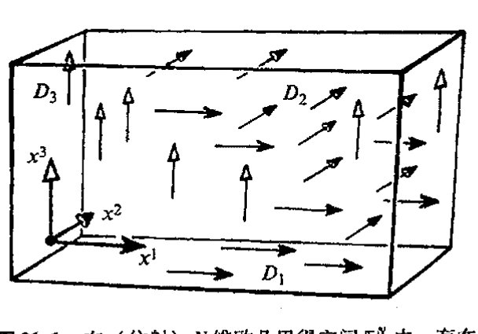
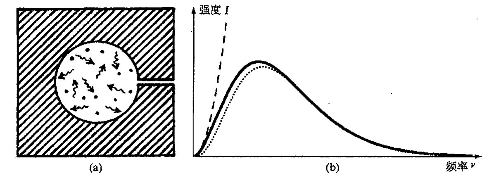
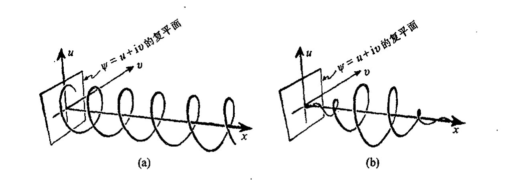
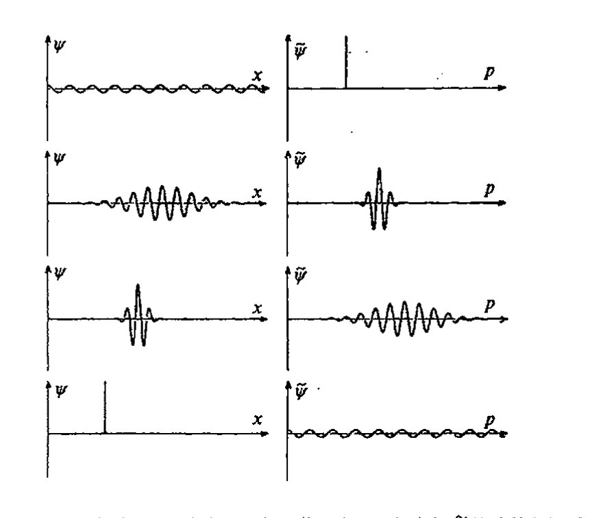

<!-- page 376 -->

第二十一章 量子粒子

---

第二十一章

# 量子粒子

## 21.1 非对易变量

大概大多数物理学家都会把量子力学带来的我们对世界认识上的改变看得比爱因斯坦广义相对论的非凡的弯曲时空更具有革命性意义。的确，正如本章和下两章里我们将看到的，量子理论实际上向我们表明，原子或基本粒子的亚微观水平上的“实在”离我们通常的经典图像是如此遥远，以至我们简直对整个量子层次上的“图像”感到绝望。许多物理学家甚至怀疑量子尺度上的“实在”是否真的存在，它们可能仅仅是赖以获得答案的一种量子力学的数学形式。（在第 29 章，我将更详细地说明充满争议的“量子实在”问题。）

但尽管如此，上一章给出的拉格朗日/哈密顿理论——一种出自 17 世纪牛顿力学的全面而又经典的框架——却为量子力学理论提供了核心基础。当然，数学形式上会存在一定变化，否则新理论就成了旧理论的翻版了。但这种源自牛顿理论的形式体系好像一直在等待量子力学的到来，其结构是如此合体，以至新的量子组件来了就可以简单地各归其位。

使这一切成为可能的数学上的关键显然是出于一种“好奇心”。19 世纪末，富于创造力的电气工程师和数学物理学家奥利弗·赫维塞德（Oliver Heaviside，1850～1925，我们在 [§6.1](chapter_06.md#61-如何构造实函数) 曾提到过他）发现，微分算符经常可以像通常的数字那样来处理，这在解某些种类的微分方程时特别有用。我们来举个例子。考虑微分方程^1

$$y + \frac{\mathrm{d}^2 y}{\mathrm{d}x^2} = x^5,$$

（符号的意义见 [§6.3](chapter_06.md#63-高阶导数cinfty-光滑函数)），我们来找出满足该方程的函数 $y = y(x)$。赫维塞德的方法是将算符 $\mathrm{d}/\mathrm{d}x$ 看成一个数，为“清楚”计，我们不妨将这个算符记为 $D$：

$$D = \frac{\mathrm{d}}{\mathrm{d}x}。$$

<!-- page 377 -->

通向实在之路

"$D^2$" 表示二次微分项 $\mathrm{d}^2/\mathrm{d}x^2 = (\mathrm{d}/\mathrm{d}x)^2$，我们称它为二阶微分算符，"$D^3$" 表示三次微分项 $\mathrm{d}^3/\mathrm{d}x^3$，等等。于是上述方程变成 $y + D^2 y = x^5$，或写成

$$(1 + D^2)y = x^5 \text{。}$$

我们可以像"除以 $1 + D^2$"那样来"解"这个方程，答案写成 $y = (1 + D^2)^{-1} x^5$。将 $(1 + D^2)^{-1}$ 展开成"$D$ 的幂级数"，我们有

$$y = (1 - D^2 + D^4 - D^6 + \cdots)x^5$$

（我们在 [§4.3](chapter_04.md#43-幂级数的收敛) 曾考虑过这个幂级数，那里是用 $x$ 而不是 $D$。）注意到（[§6.5](chapter_06.md#65-微分法则)）$Dx^5 = 5x^4$，$D^2 x^5 = 20x^3$，$D^3 x^5 = 60x^2$，$D^4 x^5 = 120x$，$D^5 x^5 = 120$，$D^6 x^5 = 0$，等等，我们得到（正确的！）特解 * [21.1] ** [21.2] *** [21.3]

$$y = x^5 - 20x^3 + 120x \text{。}$$

只要我们注意运用适当的规则，这种形式化处理可以得到严格解——虽然赫维塞德刚开始用时曾遇到相当大的反对！

虽然 $D$（$= \mathrm{d}/\mathrm{d}x$）可以像普通的数一样用代数方法来处理，但当遇到 $D$ 和 $x$ 混合一块儿出现的情形时我们必须小心，因为它们不对易。我们可以将"$x$"和"$D$"看成是对其右边无形函数譬如 $\Psi(x)$ 的作用。算符 $x$ 的作用就是简单地乘上 $x$，而 $D$ 的作用则是对其右边的函数作关于 $x$ 的微商。于是我们有对易关系

$$Dx - xD = 1 \text{。}$$

为什么是这样的呢？由 [§6.5](chapter_06.md#65-微分法则) 的"莱布尼茨法则"可知，$D(x\Psi) = (D(x))\Psi + xD(\Psi)$，即 $D(x\Psi) - xD(\Psi) = (D(x))\Psi$。故有 $(Dx - xD)\Psi = 1\Psi$，记住 $D(x) = 1$（即 $D$ 直接作用到 $x$ 上结果是 1），这样我们就得到了上述应用于任意函数 $\Psi = \Psi(x)$ 的关系。

我们现在将这种关系扩展到多变量 $x^1$，$\cdots$，$x^N$ 和相应的 $D_1 = \partial/\partial x^1$，$\cdots$，$D_N = \partial/\partial x^N$（偏导数，这里 $x^N$ 是第 $N$ 个坐标，不是 $x$ 的 $N$ 重积）的情形，这里右边的"无形"函数现在是所有这些变量的函数：$\Psi = \Psi(x^1, \cdots, x^N)$。我们得到对易关系

$$D_b x^a - x^a D_b = \delta^a_b \text{。}$$

（这里克罗内克 $\delta$ 定义见 [§13.3](chapter_13.md#133-线性变换和矩阵)，这个关系包含了两方面内容：当 $a = b$，就是前述关系；当 $a \neq b$，则 $x$ 和 $D$ 可对易。* [20.4]）我们可以假定坐标 $x^a$ 是普通的空间坐标或时空坐标，但也可以一般化，将其视为拉格朗日或哈密顿形式下的广义坐标 $q^a$。但要更进一步一般化，则会出现很

---

\* [21.1] 证明：$(1 + D^2)\cos x = 0$ 和 $(1 + D^2)\sin x = 0$（参考 [§6.5](chapter_06.md#65-微分法则) 的公式）。

??? question "答案 [21.1]"
    因为 $D=d/dx$，有 $D^2\cos x=-\cos x$，所以 $(1+D^2)\cos x=\cos x-\cos x=0$。同理 $D^2\sin x=-\sin x$，故 $(1+D^2)\sin x=0$。

    这说明 $\cos x$ 和 $\sin x$ 是算符 $1+D^2$ 的齐次解。

\*\* [21.2] 由练习 [21.1]，找出 $(1 + D^2)y = x^5$ 的通解，并证明你的解是最一般的解。

??? question "答案 [21.2]"
    先找一个多项式特解。设 $y_p=x^5+ax^3+bx$，则 $(1+D^2)y_p=x^5+(20+a)x^3+(6a+b)x$。令系数匹配得 $a=-20$、$b=120$，所以 $y_p=x^5-20x^3+120x$。

    齐次方程 $(1+D^2)y=0$ 的解是 $A\cos x+B\sin x$。通解为 $y=x^5-20x^3+120x+A\cos x+B\sin x$，这是最一般解，因为二阶线性方程只多出两个独立齐次常数。

\*\*\* [21.3] 看看你能否解释：为什么文中给出的程序会漏掉练习 [21.2] 通解中的大多数解？你能够提出一种找到全部解的修正了的一般程序吗？提示：对 $(1 + D^2)$ 的倒数，在什么范围内 "$1 - D^2 + D^4 - D^6 + \cdots$" 才真正满足要求？试将此无穷展开式作用到 $(1 + D^2)\cos x$ 上看看有什么结果。

??? question "答案 [21.3]"
    形式级数 $1-D^2+D^4-\cdots$ 只在作用对象使这个算符级数有效收敛或终止时才可作为 $(1+D^2)^{-1}$。对多项式右端它会终止，所以能给出一个特解。
    但对齐次解如 $\cos x$，有 $D^2\cos x=-\cos x$，级数变成 $1+1+1+\cdots$，完全不适用。因此该程序只给出某个特解，漏掉了核空间。修正方法是先求齐次解，再加上任一特解。

\* [20.4] 为什么？

· 358 ·

<!-- page 378 -->

大的困难。因此至少是目前，我们最好还是先考虑某种 $N$ 维平直空间 $\mathbb{E}^N$（不限于3或4维）情形。算符 $D_1,\cdots,D_N$ 描述的是 $\mathbb{E}^N$ 沿各个轴方向的无限小平移（[图 21.1](assets/page378_fig01.jpg)），每一个都表示一种仿射空间 $\mathbb{E}^N$ 的独立对称性。

由内特尔定理（[§20.6](chapter_20.md#206-如何从拉格朗日量导出现代理论)）可知，空间对称性与动量守恒之间存在紧密联系：在某个方向上，如果拉格朗日量在平移下不变，那么该方向上的动量就是守恒的。这是一个优美而又重要的事实，数学上也很好理解。量子力学某种程度上就有点儿与此类似，只是在数学上不是这么好理解。我们甚至可以说它在数学上完全是出格的！但毫无疑问，这种奇怪的量子力学处理仍具有某种数学美。因为在量子力学里，不仅是存在与对称性相关的守恒动量，而且动量本身实际上就等同于产生这个特定对称性的微分算符！

图 21.1 在（仿射）$N$ 维欧几里得空间 $\mathbb{E}^N$ 内，存在 $N$ 个由算子（矢量场）$D_1=\partial/\partial x^1, D_2=\partial/\partial x^2, \cdots, D_N=\partial/\partial x^N$ 产生的平移对称，这些算子与笛卡儿坐标 $x^1, x^2, \cdots, x^N$ 之间满足对易关系 $D_b x^a - x^a D_b = \delta_b^a$。（图中显示的是 $N=3$ 情形。）

## 21.2 量子哈密顿量

一个动量怎么能等同于一个微分算符呢？这话听起来就出格！准确地说，应是存在一个 $\hbar$ 因子（狄拉克形式的普朗克常数，即 $h/2\pi$，这里 $h$ 是真正的普朗克常数），并结合有一个虚单位 $\mathrm{i}$。这样，我们作一个古怪的定义 $p_a = \mathrm{i}\hbar D_a$，即对于与此动量相对应的 $x^a$，有

$$p_a = \mathrm{i}\hbar \frac{\partial}{\partial x^a},$$

依此而行，我们得到一个称之为位置和动量之间的正则对易法则的对易律：

$$p_b x^a - x^a p_b = \mathrm{i}\hbar \delta_b^a.$$

我们用这种模样古怪的算符/动量能做什么呢？这个"量子力学动量" $\mathrm{i}\hbar\partial/\partial x^a$ 的作用在于可以置于经典哈密顿函数 $\mathcal{H}(p_1,\cdots,p_N;x^a,\cdots,x^N)$ 中来取代旧的经典动量 $p_a$ 的位置。这是所谓（正则）量子化处理的关键。我们尚不考虑相对论情形，因此"动量"就是空间动量，² 不是指能量。空间 $\mathbb{E}^N$ 远比三维情形大，因为我们可以有许许多多的粒子或其他结构，所有这些对象的不同位置和动量都在考虑之列。按照第20章的一般讨论，哈密顿量不容许存在显性的时间依赖性。³

一般来说，我们可以将这些坐标 $x^a$ 理解为众多粒子（或其他适当参量）的位置。在本节里，我将只考虑单粒子的量子力学，这也是为第23章考虑更为复杂的多粒子体系做个形式上的准备。在单粒子这种特定情形下，有证据表明，在时间分量 $x^0$ 和3个空间分量 $x^1, x^2, x^3$ 之间

<!-- page 379 -->

通向实在之路

存在相对论性对称性。一会儿我们就会看到，这一点对于定义量子力学实际的时间演化具有重要意义。但不管怎么说，作为（正则）"量子化"处理，特别是涉及多粒子情形时，这些处理都是一种非相对论处理，其中对物理上空间和时间的处理是相当不同的。

我们来看看量子哈密顿量的一个简单例子，以便了解这一概念是如何工作的。为此考虑质量为 $m$ 的单个牛顿粒子在外场（由仅依赖于位置的势能函数 $V = V(x, y, z)$ 给出）下运动的情形。在 [§20.2](chapter_20.md#202-更为对称的哈密顿图像) 里，我们已经知道了经典哈密顿量 $\mathcal{H} = (p_x^2 + p_y^2 + p_z^2)/2m + V(x, y, z)$，这里 $p_x, p_y, p_z$ 分别是沿笛卡儿坐标轴 $x, y, z$ 的空间动量。因此量子（正则量子化）哈密顿量为

$$\mathcal{H} = \frac{p_x^2 + p_y^2 + p_z^2}{2m} + V(x, y, z) = -\frac{\hbar^2}{2m}\nabla^2 + V(x, y, z),$$

这里 $\nabla^2 = (\partial/\partial x)^2 + (\partial/\partial y)^2 + (\partial/\partial z)^2$（即 $\partial^2/\partial x^2 + \partial^2/\partial y^2 + \partial^2/\partial z^2$）是拉普拉斯算符（见 [§10.5](chapter_10.md#105-柯西黎曼方程)，不过现在是三维情形）。

在这个例子里，一切都是在光滑情形下进行的（下一节我们再考虑其他情形）。但一般来说，在哈密顿量里用量子动量取代经典动量不会是一个简单明了的过程，这主要是因为在量子力学的 $p$ 与其对应的 $x$ 之间存在非对易关系。例如，经典哈密顿量里可以出现形式为 $px$ 的乘积项，但我们并不清楚在相应的量子哈密顿量里是应该出现 $px$ 呢，还是 $xp$，抑或 $\frac{1}{2}(px + xp)$，甚至是其他无限多种可能性的一种。这种不确定性就是所谓因子有序化问题。在许多实际情形里，由于存在某些"明显的"取舍，这种不确定性尚不严重。这些取舍通常受普遍的指导原则（如对称性或不变性要求，也可能是些强制性的物理或数学上的直觉或美学原则）支配。有时还可能出现不同的选择却导致等价的量子理论。但是，存在这种不确定性的事实表明，一个经典理论的"量子化"过程有时会涉及严重的选择问题。

498

有一个相关的问题涉及坐标 $x^1, \cdots, x^N$ 选择的"一般化"。由 [§20.1](chapter_20.md#201-神奇的拉格朗日形式体系), 2 可知，在相空间 $\mathcal{C}$ 里，广义坐标 $q^1, \cdots, q^N$ 的选择是完全自由的。我们要问：当我们过渡到量子理论之后，这种完全自由化还允许吗？事实上，如果我们期望每个 $q^a$ 的经典共轭动量 $p^a$ 都按 $-i\hbar\partial/\partial q^a$ "量子化"，则答案是"不"。这是个非常微妙的问题，它把我们带入了所谓几何量子化的神奇领域。⁴ 它在广义相对论所涉的领域里相当重要，不论是"引力场量子化"还是仅仅讨论弯曲时空背景下的量子场，都是如此。（我将在 [§30.4](chapter_30.md#304-霍金的黑洞温度) 讨论弯曲背景下的量子场问题。）但只要我们能够小心从事，仍然有许多标准的情形允许我们在较平直坐标更为一般的坐标情形下进行处理。此时角坐标特别有用，其共轭的动量是角动量。以后我们将考虑角动量问题（[§22.8](chapter_22.md#228-自旋和旋量)，相对论情形见 [§22.12](chapter_22.md#2212-相对论性量子角动量)）。

## 21.3 薛定谔方程

让我们暂且忽略因子有序化和广义坐标等问题，并假定有一个满意的量子力学哈密顿量。

· 360 ·

<!-- page 380 -->

第二十一章 量子粒子

我们能拿它干什么呢？答案是它在下述的薛定谔方程里起着关键作用，这个方程是我们理解一个量子系统随时间演化的基础。实际上，这个方程的形式取决于我们前面建立的法则。它是怎么工作的呢？首先，我们得认为在整个对易关系的最右端存在着这么一个“无形”函数 $\psi$。由于所有这些 $\partial/\partial x$ 的缘故，现在哈密顿量只是个算符，它需要作用到（至少是潜在地）最右端的那个对象上。作为一个时间演化方程，薛定谔方程将使得 $\psi$ 随时间变化，因此 $\psi$ 是时间 $t$ 和空间 $x^\alpha$ 的函数：

$$\psi=\psi(x^1,\cdots,x^N;\ t)。$$

但它不依赖于 $p_\alpha$，因为这些量现在不是“独立变量”，而是关于 $x^\alpha$ 的微分。这个函数 $\psi$ 称为波函数。它给出系统的量子态。适当的时候我们将看到波函数的物理意义。

怎么才能使 $\psi$ 关于 $t$ 的微分与哈密顿量相统一呢？这也正是薛定谔方程如何开始时间演化的问题。由 [§20.2](chapter_20.md#202-更为对称的哈密顿图像) 知，“经典的与时间无关的”哈密顿量表示的是系统的总能量。同时我们注意到（正如 [§21.2](#212-量子哈密顿量) 所提示的），如果量子理论能够满足相对论的要求，那么量子法则 $p_\alpha=\mathrm{i}\hbar\partial/\partial x^\alpha$（对单粒子）就应扩展到 $\alpha=0$ 分量和三个空间分量（[§18.7](chapter_18.md#187-相对论性能量和角动量)）。相应地，在“量子化”过程中，能量应当被关于时间的微分所取代（$E=\mathrm{i}\hbar\partial/\partial t$）。薛定谔方程表示的正是这种哈密顿量的总能量“量子角色”：

$$\mathrm{i}\hbar\,\frac{\partial\psi}{\partial t}=\mathcal{H}\psi,$$

这里

$$\mathcal{H}=\mathcal{H}\left(\mathrm{i}\hbar\,\frac{\partial}{\partial x^1},\cdots,\mathrm{i}\hbar\,\frac{\partial}{\partial x^N};x^1,\cdots,x^N\right)。$$

我们还是用 [§21.2](#212-量子哈密顿量) 所提供的量子哈密顿量为例。质量 $m$ 的单个牛顿粒子在势能函数 $V=V(x,y,z)$ 的外场里运动的薛定谔方程为：**[21.5]***[21.6]

$$\mathrm{i}\hbar\,\frac{\partial\psi}{\partial t}=-\frac{\hbar^2}{2m}\nabla^2\psi+V\psi。$$

自然，这种微分算符对动量和能量的取代看起来就像是在玩数学魔术，令人难懂，我们满可以问这劳什子怎么用于处理拳击手或高尔夫选手挥出的动量。但按量子力学，一切还都得靠它。动量的关键在于守恒，对方受到一击的效果就是这种守恒的结果。动量只可传递，不会消失，因为它是守恒的。能量也是如此。

满怀狐疑的读者满可以抱怨，在经典哈密顿理论里，我们已经有动量守恒和能量守恒，为什么还要在物理量和那种实际上不具实体意义的微分算符之间建立奇妙的等同关系（尽管它可能

---

**[21.5]** 对处于常牛顿引力场 $V=mgz$ 中的质量为 $m$ 的粒子，解此薛定谔方程，这里 $z$ 是地表上方的垂直高度，$g$ 是向下的引力加速度。

**[21.6]** 通过坐标变换 $X=x, Y=y, Z=z-\frac{1}{2}t^2g, T=t$ 将其变换到自由落体参照系，然后证明：练习 [21.5] 的薛定谔方程变换成无引力场下情形，其波函数为 $\Phi=\exp\left[\mathrm{i}\left(\frac{1}{6}mt^3g^2+mtzg\right)\right]\psi$。当我们将爱因斯坦的等效原理（[§17.4](chapter_17.md#174-等效原理)）应用到量子系统时，这种变换能告诉我们什么？（注意运用 [§21.9](#219-波函数的概率分布) 内容。）

??? question "答案 [21.6]"
    作坐标变换 $Z=z-\frac12gt^2$、$T=t$ 后，时间导数多出 $-gt\partial/\partial Z$，空间拉普拉斯则保持形式。若同时令 $\Phi=e^{i(mt z g+m t^3g^2/6)/\hbar}\psi$（按正文单位约定可吸收 $\hbar$），相位导数产生的项正好抵消重力势 $mgz$ 和混合的一阶导数项。

    代回薛定谔方程后，剩下的就是自由粒子方程。这展示了均匀引力场可由自由落体参照系消去，但波函数必须同时获得相应的质量依赖相位。

·361·

<!-- page 381 -->

通向实在之路

很好）？**[21.7]** 要回答这个问题，要使这个理论更可信，我们就需要借助实验。（任何其他招数对此都显得无能为力！）实验细节问题不是我这里要强调的，但大量实验证据的确反映了这样一个本质：在频率和能量之间以及相应的波数（波长的倒数）和动量之间存在关联，而且这种关联在所有实验现象里是普遍存在的。在 [§21.5](#215-理解波粒二象性) 里我们将看到以 “$p_a = \mathrm{i}\hbar\partial/\partial x^a$” 出现的这种关联，同时也可以从实验上了解到为什么能量和动量具有“波动”性质的原因。

## 21.4　量子理论的实验背景

可能最直接明显的实验证据是出自晶体材料。晶体在结构上具有晶格原子排列的空间周期性。正如著名的戴维孙–革末（C. J. Davison and L. H. Germer 1927）实验首次所显示的那样，如果我们将具有适当初始三维动量的电子射向这种晶体材料，那么电子将在晶体表面以一系列特定的角度发生折射（或反射）。实验发现，这些方向和角度取决于入射和出射的、与晶格的周期性相关的三维动量。这些实验结果表明，电子的三维动量与晶格的周期性位移距离之间存在精确的反比关系，见[图 21.2](assets/page381_fig01.jpg)。用其他粒子进行实验也可得到同样的结论。这一结论就是，动量 $p$ 的粒子似乎像波一样具有周期性，其波长 $\lambda$ 与动量幅度大小 $p$ 之间存在着普适的反比关系（所涉的普朗克常数 $h = 2\pi\hbar$）：

$$\lambda = hp^{-1} = \frac{2\pi\hbar}{p}。$$

**图 21.2**　戴维孙–革末实验。一束具有三维动量 **P** 的电子遇到具有周期性晶格结构的材料后，如果原子排布的特征标长与电子的德布罗意波长相匹配，则晶体上就会出现散射或反射。这些电子可视为具有波长 $\lambda$ 的波，$\lambda$ 与电子动量 $p$ 有关系 $\lambda = h/p$，这是 $h$ 是普朗克常数。

这个与粒子动量 $p$ 相联系的波长 $\lambda$ 称为粒子的德布罗意波长，以纪念思想深邃的法国贵族和物理学家德布罗意（Prince Louis Victor de Broglie），他在 1923 年首次提出，所有物质粒子都具有上述公式给定的波长的波特性。而且，按相对论要求（[§18.7](chapter_18.md#187-相对论性能量和角动量)），具有能量 $E$ 的粒子还具有由普朗克公式确定的频率 $\nu$**[21.8]**

$$E = h\nu = 2\pi\hbar\nu。$$

在自身静止的参照系中，粒子的能量由爱因斯坦公式 $E = \mu c^2$ 给出，这里 $\mu$ 是静质量，故与之对

---

**[21.7]** 证明：如果量子哈密顿量 $\mathcal{H}$ 有一个平移不变量，譬如说是位置变量 $x^3$，那么相应的动量 $p_3$ 在算子 $p_3$ 与时间演化算子 $\partial/\partial t$ 可对易的意义下是守恒的。根据后面给出的解释说明为什么这种对易包含着守恒性。

??? question "答案 [21.7]"
    若哈密顿量在 $x^3$ 方向平移不变，则 $[\mathcal H,p_3]=0$。时间演化算符由 $\mathcal H$ 生成，所以 $p_3$ 与时间演化对易。
    于是若态先演化再测 $p_3$，或先按 $p_3$ 分解再演化，结果相同；$p_3$ 的本征值概率不随时间改变。这就是量子形式的动量守恒。

**[21.8]** 看看你能否解释：为什么狭义相对论的要求能从德布罗意的 $p = h\lambda^{-1}$ 导出普朗克的 $E = h\nu$。提示：你可以假定，$M$ 中的超平面（波沿此平面取常值）都洛伦兹正交于粒子的四维速度。

??? question "答案 [21.8]"
    德布罗意关系说空间波矢与动量成正比。相对论要求波的等相位超平面作为四维对象变换，且其法 covector 与粒子的四动量同方向。
    若空间部分满足 $\mathbf p=\hbar\mathbf k=h/\lambda$，洛伦兹协变性迫使时间部分也满足 $E=\hbar\omega=h\nu$。否则四动量和波四矢量在不同惯性系下不会保持同一个比例关系。

· 362 ·

<!-- page 382 -->

第二十一章 量子粒子

应的频率为 $\mu c^2/2\pi\hbar$，即 $\mu c^2/h$。

由此可知，普通粒子会表现出波动性，这种性质通过普朗克公式和德布罗意公式与粒子的静质量有着普适的联系。但在此之前二十年，其逆命题就已经出现了：早先认为纯属波性质的客体——就是那种构成光的基本的麦克斯韦振动电磁场（[§19.2](chapter_19.md#192-麦克斯韦电磁场理论)）——也可以看作是具有粒子性，并同样与普朗克公式和德布罗意公式相一致。关于这一点的最令人信服的证据就是光电效应，这一效应最早由海因里希·赫兹于 1887 年观察到，而它的最惊人的特性则是由菲利普·勒纳德（Philipp Lenard）于 1902 年揭示的，并由爱因斯坦于 1905 年借助光的粒子图像给予了清楚的解释。（正是这一成就，而不是相对论，使爱因斯坦赢得了 1921 年的诺贝尔奖！）当足够高频率 $\nu$ 的光照射在适当的金属材料上时，会引起电子发射，这就是光电效应。这个事实让人不解的是，发射出来的电子的能量与（频率 $\nu$ 一定的）光强完全无关。从波的图像上看，我们可预期，波的强度越大，则发射出的电子所携的能量应越大。但实际发生的却不是这么回事儿（尽管光强越大出射的电子越多）。爱因斯坦基于将光的粒子说对此予以了解释，他将光视为入射粒子——现在称之为光子——其每个光子的能量由普朗克公式 $E=h\nu$ 给定，这样每个出射电子可看作是单个原子受到一个光子碰撞的结果。爱因斯坦将普朗克公式用于这个效应，并提出了若干预言，这些预言随后都得到了证实，特别是得到了当初持怀疑态度的美国实验物理学家罗伯特·密立根（Robert Millikan）直到 1916 年的实验的支持。

事实上，光的量子力学的粒子性质在更早以前就表现出来了。这就是 1900 年由马克斯·普朗克掀起的量子革命。这一革命起自他对黑体辐射的杰出分析。这种辐射是指"黑的"材料环境下处于平衡态（整个体系维持一个特定温度 $T$）的电磁辐射（见[图 21.3](assets/page382_fig01.jpg)(a)）。普朗克得到了一个作为频率 $\nu$ 函数的辐射比强度 $I$ 的（正确）公式（[图 21.3](assets/page382_fig01.jpg)(b)）：

$$2h\nu^3/(\exp(h\nu/kT)-1)$$

图 21.3 黑体辐射。（a）"黑"空腔确保了其中的辐射与周边环境处于温度为 $T$ 的热平衡态。（b）对给定的 $T$，每个频率 $\nu$ 下的强度 $I$ 是 $\nu$ 的特定函数。观察得到的曲线是一条连续曲线，它可由普朗克著名公式 $I=2h\nu^3/(\exp(h\nu/kT)-1)$（这里 $h$ 和 $k$ 分别是普朗克常数和玻尔兹曼常数）。虚线是瑞利—金斯曲线 $I=2kT\nu^2$，其中辐射被视为经典波，它在小 $\nu$ 时近似于普朗克公式，但在大 $\nu$ 时发散。点线描述的是维恩定律 $I=2h\nu^3\exp(-h\nu/kT)$，其中辐射被视为经典粒子。

· 363 ·

<!-- page 383 -->

通向实在之路

503 这里 $k$ 是玻尔兹曼常数（[§27.3](chapter_27.md#273-熵)）。

事实证明，普朗克公式与观察符合得相当好。在此之前，黑体谱的性质一直是个谜。电磁辐射图像从整体来看很不协调：瑞利–金斯公式 $I=2kT\nu^2$ 在低频段较准确，但对于大的 $\nu$ 强度 $I$ 将发散到无穷。维恩对此做了明显的改进：$I=2h\nu^3\exp{(-h\nu/kT)}$，这个公式在大 $\nu$ 情形下是准确的，它允许将这种辐射看成是一个经典粒子浴场。维恩将量 $h$ 视为自然界的一个新的基本常数（今天人们称它为普朗克常数，它也出现在普朗克公式里），它的值非常小，只有 $6.62\times 10^{-34}$ 焦耳秒。为了协调这两个公式，普朗克发现，他必须将电磁振荡看成是以一个特定能量 $E$ 来吸收或辐射的，这个能量值 $E$ 与振荡频率 $\nu$ 按下式直接关联：

$$E=h\nu,$$

这里他还采用了一种"疯狂的"统计处理，这就是极富预见性的玻色–爱因斯坦统计，我们将在 [§23.7](chapter_23.md#237-玻色子和费米子) 研究它。

而当我们观察电子在晶体上的遭遇时，遇到的则是另一种物理谜团，因为在当时电磁效应一直被认为是一种纯粹的波效应，而现在它们似乎还具有粒子性！用狄拉克形式的普朗克常数，我们有 $E=2\pi\hbar\nu$，因此振荡的时间周期 $\nu^{-1}$ 满足相应公式 $\nu^{-1}=2\pi\hbar/E$。今天，（由于爱因斯坦、玻色和其他人的进一步贡献）我们懂得，普朗克关系指的不是"电磁场的振荡"，而是实际的"粒子"——一种我们称之为光子的麦克斯韦电磁场量子——尽管从爱因斯坦独有的洞察力到今天广为接受期间用了许多年。在那些进一步的验证中，光电效应之后的另一个判决性实验是康普顿（Arthur Compton, 1923）实验，它表明，按照 [§18.7](chapter_18.md#187-相对论性能量和角动量) 的相对论性动力学，光子在遇到带电粒子时的确表现得像个无质量粒子（见 [§25.4](chapter_25.md#254-正反共轭宇称和时间反演)，[图 25.9](assets/page476_fig01.jpg)）。相应地，二者能量和动量反比于（对能量是时间，对动量是空间）周期，这种周期总以 $2\pi\hbar$ 定标。

504 粒子具有波动性、波具有粒子性的最令人信服（也最著名）的理由之一是双缝实验。^6^ 这里我们有一个粒子源和一个检测屏，在它们之间有一个刻有一对平行狭缝的挡板，见[图 21.4](assets/page384_fig01.jpg)(a)。假定粒子源对着检测屏一次发射一个粒子。如果开始时我们敞开一条狭缝盖住另一条缝，那么屏上出现的将是一次一点地打在屏上形成的随机图案。图案的亮度（点的最大密度）如所期望的那样以在接近开口狭缝的一侧形成的中心亮纹为最亮，逐渐向两边递减（[图 21.4](assets/page384_fig01.jpg)(b)）。如果我们换一个狭缝，结果的性质一样（[图 21.4](assets/page384_fig01.jpg)(c)），这很好理解。但如果我们将两个狭缝都打开，奇迹就出现了（[图 21.4](assets/page384_fig01.jpg)(d)）。粒子仍然是一次一个地打在屏上，但现在则形成一系列平行的波动性质的干涉条纹。我们甚至发现，此时屏的有些地方再也不会打上粒子，尽管这些地方在单狭缝情形下同样会受到粒子的光顾！虽然从局部来看打到屏上的仍是一次一点，而且从源来说每个发射出的粒子都是全同的，但在源与屏之间（包括与挡板上双狭缝的莫名遭遇），粒子的行为

505 却表现得像波。更重要的是——这一点与我们的根本目的直接相关——我们从屏上的条纹宽度就可以读出波/粒子的波长应是多少，这个波长正是上述由粒子动量 $p$ 给出的那个量 $\lambda=2\pi\hbar/p$。

· 364 ·

<!-- page 384 -->

第二十一章 量子粒子

图 21.4 （a）双缝实验安排。每次向双缝后面的屏发射一个电子。（b）当右边狭缝被遮盖时屏上的图案。（c）当左边狭缝被遮盖时屏上的图案。（d）当两狭缝都敞开时屏上将出现干涉现象。屏的某些区域现在无法再打上粒子，尽管在单狭缝情形下粒子能够到达这些地方。

## 21.5 理解波粒二象性

尽管如此，固执的怀疑论者可能会争辩说，那也不能说在能量动量和算符之间就存在这种古怪的等同关系！这的确不能，但我们也不应当对出现的奇迹视而不见！这个奇迹是什么呢？那就是这些实验所反映出来的看起来极为荒谬的事实——波是粒子，粒子就是波——可以用漂亮的数学形式体系来处理，在这种数学形式里，动量的确就等同于“关于位置的微分”，而能量则等同于“关于时间的微分”。

这种形式体系怎么帮助我们来理解神秘的波粒二象性呢？为了描述波/粒子，我们需要这样一种数学存在，它能清楚地定义粒子的四维动量 $P_a$，同时在空间和时间上还具有波的周期性。（这里我用大写字母 $P$，是因为在此特殊情形下，它是指粒子的四维动量的“经典”值。我们仍将“四维量子动量”看作是微分算符。）这个数学存在的一种自然的形式就是带有时空关联形式的波函数（见 [§5.3](chapter_05.md#53-多值性自然对数)）

$$\psi(x^a) = e^{-iP_a x^a/\hbar}$$

（平面波）。如果我们将 $P_a x^a$ 增加一个 $2\pi\hbar$，这个量仍是原来的量（因为整个指数增加的是 $-2\pi i$，故表达式相当于乘上 $e^{-2\pi i} = 1$）。因此它有时间周期 $2\pi\hbar/P_0$ 和（$x_1$ 方向上的）空间周期 $2\pi\hbar/P_1$，其他两个空间方向类似。这与我们前面所要求的完全相同。

那么，这个特殊量的特别之处何在呢？这就是所谓的量子动量算符的本征函数

$$p_a = i\hbar \frac{\partial}{\partial x^a}$$

它意味着，如果我们将这个算符用到 $\psi(x^a)$ 上，我们将再次得到 $\psi(x^a)$ 的一个常数倍（[§6.5](chapter_06.md#65-微分法则)）：

$$i\hbar \frac{\partial}{\partial x^a}\psi(x^b) = i\hbar \frac{\partial}{\partial x^a}e^{-iP_b x^b/\hbar} = P_a e^{-iP_b x^b/\hbar} = P_a \psi(x^b)$$

<!-- page 385 -->

通向实在之路

我们注意到，这个常数因子实际上正是我们所要求的（经典）四维动量 $P_a$。因此，只要 $\psi(x^a)$ 取适当形式，例如像上面那样，那么神秘的量子动量 $p_a = \mathrm{i}\hbar\partial/\partial x^a$ 作用于这个 $\psi$ 之后，就会直接变换成经典动量 $P_a$：

$$p_a\psi = P_a\psi,$$

但对另一些态则不能这么做。我们说上述 $\psi$ 有四维动量确定值，并称它为**动量态**。我们来考虑一个自由飞行的粒子，它恰好有这样一种特殊波函数 $\psi$ 所描述的确定的经典等价动量 $P_a$，这个波函数是量子算符 $p_a$ 的**本征波函数**，其对应的本征值就是 $P_a$。惟有那些具有确定的经典动量值的波函数才是量子动量算符的本征函数。

在 [§13.5](chapter_13.md#135-本征值与本征矢量)，我们引入了线性算符 $T$ 的本征矢量概念，这个矢量 $v$ 满足 $Tv = \lambda v$，这里 $\lambda$ 是标量，称为本征值。现在我们用 $\mathrm{i}\hbar\partial/\partial x^a$ 代表算符 $T$，$P_a$ 代表 $\lambda$（按 $a$ 的顺序取值），但在 [§13.5](chapter_13.md#135-本征值与本征矢量) 里，所指的都是有限维矢量空间及其线性变换。而现在，我们要处理的所有可能的 $\psi(x^a)$ 的矢量空间 $W$ 则是**无限维**矢量空间。它之所以是一个矢量空间，是因为我们可以将所有 $x^a$ 的函数加起来，也可以用数乘以 $x^a$ 的函数，两种情形都使我们得到新的 $x^a$ 的函数。而它是无限维的则是因为对于无限多种 $P_a$ 的不同选取，所有我们得到的函数都是线性独立的。***[21.9]

在量子形式化体系里，本征函数（或称为**本征态**）具有重要作用。用量子力学的语言来说，不同的算符（像 $p_a = \mathrm{i}\hbar\partial/\partial x^a$，以及后面要遇到的位置动量和角动量）都叫作**动力学变量**。我们的波函数 $\psi$，就是先前作为"无形函数"置于算符右端的那个量，现在也开始扮演起活跃的角色。我们将它看作是物理系统的**态**。有时也称它为**态矢**（这些都是相当一般的术语，它们毋需用我在前面对 $\psi$ 用过的时空坐标来具体描述）。具体到前述的四维情形，某个动力学变量的本征态就是这样一些态：该动力学变量有与这些态相应的所谓"确定的值"，这些值就是所谓**本征值**。

还应指出，上面我一直是在满足狭义相对论要求的情形下来处理完全四维时空下的动量本征态的。这主要是出于节省思维的考虑，因为表达式***[21.10]

$$\mathrm{e}^{-\mathrm{i}P_ax^a/\hbar} = \mathrm{e}^{-\mathrm{i}Et/\hbar}\mathrm{e}^{\mathrm{i}\mathbf{P}\cdot\mathbf{x}/\hbar}$$

（这里 $P_a = (E, -\mathbf{P})$，$x^a = (t, \mathbf{x})$，如 [§18.7](chapter_18.md#187-相对论性能量和角动量)）既包含了使之成为带有本征值 $\mathbf{P}$ 的普通三维空间动量

$$\mathbf{P} = (-p_1, -p_2, -p_3) = -\mathrm{i}\hbar\left(\frac{\partial}{\partial x^1}, \frac{\partial}{\partial x^2}, \frac{\partial}{\partial x^3}\right)$$

的空间相关性，也包含了使之成为带有能量本征值 $E$ 的薛定谔方程解的时间相关性。然而，总体上看，薛定谔形式系统并不是一个相对论性的体系，它对时间变量的处理不同于对空间变量的处理，因此，对本章以下部分的讨论，我们还是回到非相对论描述上来。

---

***[21.9] 为什么？这里线性相关可包括连续求和，即积分。

??? question "答案 [21.9]"
    动量本征态构成连续谱时，普通有限线性组合不足以表示局域波包。需要把不同动量本征态按连续权重积分叠加，即傅里叶积分。
    这种“线性相关”不再是有限求和，而是广义函数意义下的连续叠加。位置态、平面波归一化等都要在这个广义意义下理解。

***[21.10] 为什么我可以将其分开？

??? question "答案 [21.10]"
    因为四维内积在洛伦兹分量下自然分裂为时间部分与空间部分：$P_a x^a = Et - \mathbf{P}\cdot\mathbf{x}$（用 $P_a=(E,-\mathbf{P})$、$x^a=(t,\mathbf{x})$）。指数函数对和式可分解为各因子之积 $\mathrm{e}^{A+B}=\mathrm{e}^A\mathrm{e}^B$，故 $\mathrm{e}^{-\mathrm{i}P_ax^a/\hbar}=\mathrm{e}^{-\mathrm{i}Et/\hbar}\,\mathrm{e}^{\mathrm{i}\mathbf{P}\cdot\mathbf{x}/\hbar}$。

    由于时间变量 $t$ 与空间变量 $\mathbf{x}$ 在指数中互不耦合，这个乘积把只含时间的相位因子（能量本征值 $E$）与只含空间的因子（三维动量本征值 $\mathbf{P}$）完全分离开来，于是动量本征态可写成时间部分与空间部分的乘积。

· 366 ·

<!-- page 386 -->

第二十一章 量子粒子

## 21.6 什么是量子"实在"？

现在我们回到这些细节问题上来。我们要问，所有这些告诉我们的其背后的"实在"是什么？动力学变量是"实在的"吗？抑或态就是"实在"？是不是只有当我们追索到出现像动力学变量（或其他算符）的本征值这样一种表面的"经典"量时才算完成任务？事实上，量子物理学家们对此的态度并不十分明确。许多人对这样来认识"实在"明显不满意。他们声称将坚持所谓的"实证主义"立场，不再在这种经典意义上来考虑"实在"，并将这种要求斥之为"不科学"。我们对这种形式体系的要求只能是，他们声称道，它能给出我们对一个系统所提出的适当问题的答案，并且这些答案与观察事实相一致。

对一个量子系统，如果我们相信其中有些东西是一种"实际的"存在的话，那么我认为只能是描述量子实在的波函数（或叫态矢）。（在后面第29章，我将阐述某些其他可能性；也见[§22.4](chapter_22.md#224-幺正演化薛定谔绘景和海森伯绘景)的节末。）我的观点是，"实在"问题的讨论必须置于量子力学的语境中进行才有意义——特别是对那些认为量子体系可以普适地用到整个物理学的人（好像许多物理学家都多多少少有此观点）就更是如此——因为如果不存在量子实在，那也就不存在任何层面（按这种观点，所有层面都是量子层面）上的实在了。在我看来，全盘否认这种实在毫无意义。我们需要物理实在的概念，即使是暂时的或粗略的也好，因为缺了它我们的客观世界以及整个科学就会在沉思默想的注目中烟消云散！

那么态矢怎样呢？用它来表示实在困难在哪里？为什么物理学家们在采取这种哲学立场时会经常表现得那么勉强？要了解这些困难，我们必须更深入地研究波函数的实质以及它们的物理意义。

我们先来研究动量态 $\psi = e^{i\mathbf{P}\cdot\mathbf{x}/\hbar}$（为方便计，这里取时间 $t = 0$）。我们注意到，我们没办法像对普通粒子那样对其进行局域化，它甚至弥漫到整个宇宙。其"振幅大小"，即模 $|e^{i\mathbf{P}\cdot\mathbf{x}/\hbar}|$，在空间各处都有同样的值1（见[§5.1](chapter_05.md#51-复代数几何)）。读者或许会认为，对在某个空间方向上有明确动量定义的单个粒子来说，这种图像未免太奇怪了吧。那么我们通常的粒子图像是怎样的呢？就能够局域于（至少大致上）某一点吗？应当说，动量态只是一种理想化，我们可以将它看作类似于一种"波包"，以便明白其意义（如果不需要非常精确的话）。这些波包由在某处具有峰值的波函数给出，一定意义上说，这些波函数"几乎"都是动量的本征函数。对于一维情形，这种波包可用动量态与高斯分布 $\exp(-x^2)$（或更恰当地，是与一般高斯分布

$$Ae^{-B^2(x-C)^2},$$

这里 $A, B, C$ 皆实数）的乘积明白地表示出来。这就是著名的"钟形"统计曲线（图像可见[§27.4](chapter_27.md#274-熵概念的鲁棒性)的[图27.5](assets/page518_fig02.jpg)），它的"峰"以 $x = C$ 点为中心。这种通过取积而得到的波包允许 $C$ 为复数，

<!-- page 387 -->

通向实在之路

这样计算上较方便。**[21.11]** 完全三维空间的波包可由高斯量 $A\exp[-B^2(x^2+y^2+z^2)]$ 进行类似的构造，只是峰值位置在复方向上有一位移。不论哪一种情形，$B^{-1}$ 都是一种对曲线展宽的测度。事实上，有这么一条基于“海森伯不确定原理”的定理：这种展宽能达到多小存在一个绝对极限，它与实际动量态对曲线的逼近程度有关。我们将在 [§21.11](#2111-动量空间描述) 更详细地解释这一点。

现在，我们设法来得到更好的动量态和波包的图像。请记住，波函数是一个复值的波，其“波”特性不必像振动那样得通过振幅（或强度）表示出来。在动量态情形，表示这种“波”特性的是波函数的幅角 $-P_a x^a/\hbar$（[§5.1](chapter_05.md#51-复代数几何)），即在复平面的单位圆上取 $e^{-iP_a x^a/\hbar}$。在量子理论里，我们倾向于将波函数值的幅角看成是它的相。相不会像“一圈圈缠绕”那般“波动”。在[图 21.5](assets/page387_fig01.jpg)（a）里，我展示了波函数在某个特定方向上的这种行为。注意，图中 $x$ 方向对应于普通的空间方向，但 $u$ 和 $v$ 的方向则不是普通的空间方向，它们代表的是波函数 $\psi$ 可能取值的垂直于 $x$ 方向的复平面。对图中的动量态，其波函数 $\psi$ 呈螺旋状（对沿图中 $x$ 方向为正的动量，这个螺旋是右旋的）。在[图 21.5](assets/page387_fig01.jpg)（b）里，我画出了相应的波包的图像。它像一个撑开的螺旋（因此只有一个适度定义的动量），两端收缩到零，波包在这段区域外变得非常小。

图 21.5 作为位置 $x$ 的复函数的粒子波函数 $\psi$。（a）动量态 $e^{-ipx/\hbar}$，其描述就像个螺旋（动量 $p$ 的本征函数）。（b）波包 $e^{-A^2x^2}e^{-ipx/\hbar}$。

很显然，要得到这些波的完整图像，我们就得想象出它的 3 个空间维的样子，这很难，因为我们还需要两个额外的维（共五维）才能满足复平面和空间维的要求！但天无绝人之路，对于动量态，如果我们只考虑常数相的平面，则这些平面在垂直于动量的方向上是彼此平行的，平面间的间距都是 $2\pi\hbar/p$，这里 $p$ 是三维（空间）动量的大小，见[图 21.6](assets/page388_fig01.jpg)。这种描述对建立如[图 21.2](assets/page381_fig01.jpg) 中与晶体作用的光子波函数的图像是很用的。我们也可以用它来描述双缝实验的情形，这时我们将狭缝看成是直到检测屏的长长的通道，粒子就像是局域于屏的某个区域，每个粒子的波函数都可看成是由两部分叠加所组成，每一部分相当于一种动量态（实则为单频平面波——因为狭缝到屏距离相当远），但这两个分量的方向稍有不同。两列波在屏上某处相互加强，

**[21.11]** 在上述表达式中用复数 $C+iD$（这里 $C, D$ 都是实数）替代实数 $C$，然后找出波包的频率和峰的位置。

??? question "答案 [21.11]"
    把 $C$ 换为 $C+iD$ 后，高斯因子为 $\\exp[-B^2(x-C-iD)^2]$。展开可得一个实高斯峰仍位于 $x=C$，同时多出相位因子 $\\exp[2iB^2D(x-C)]$。
    因此波包的局部波数增加 $2B^2D$，相应频率由所采用的色散关系给出；虚位移并不移动概率峰的位置，而是改变平均动量。

· 368 ·

<!-- page 388 -->

第二十一章 量子粒子

**图 21.6** 间距为 $hp^{-1}$ 的动量本征态在给定相位情形下的平面，这里 $p$ 是三维空间动量的大小。（试与图 21.2 比较。）

**图 21.7** 图 21.4 的双缝实验中奔向屏幕的电子波函数，可视为图 21.6 的两个彼此间有一定倾角的平面波的叠加。在同相位置上（沿虚线），两列波相干增强，从而在屏上出现的概率最大。在两最大值之间，相位相反，波相消，使得电子到达屏上的概率为零。

在另一些地方相互抵消，从而形成强弱分明的条纹（[图 21.4](assets/page384_fig01.jpg)d）。我们可以通过[图 21.7](assets/page388_fig02.jpg) 来看看这种几何图像，这里各平面表示的是每个有固定相位的分波所在的区域。整个波函数是这两个分波的叠加。因此，如果我们假定每个分波单独来看都是等幅波，那么它们必然在异相相消，同相相长。由此给出双缝实验中观察到的亮条纹。

是的，是的，不耐烦的读者还可能辩解道，但是这只说明了波的行为是怎样的，我还是不能接受波/粒子就是波/粒子这一事实。尽管这里的波是复波，显得有点儿花哨，但我们对波相干的描述却与对普通波（如声波、经典电磁场的麦克斯韦波（即射电波，可见光，X 射线等））的相干的描述并无二致。但双缝实验的要点——这正是我感兴趣的地方——是它揭示了波图像与粒子图像之间的冲突。在这个实验里，最明显的莫过于粒子每次一点地打在屏上所表现出的性质！

## 21.7 波函数的"整体"性质

这里要强调的是，你可以将小点在屏上一次次地出现想象成波的局域密度达到某个临界值的结果，或更确切地说，小点在屏上的出现存在某种概率性，这个概率随波的强度加强而增加。512 但这种认识对理解双缝实验的结果毫无帮助。因为如果它只是一个个别位置上单独的概率问题，那么我们就可期望，只要强度允许，有时两个点会同时出现在屏上间隔距离很大的位置上，而在源端描述这个单粒子发射的波函数则只有一个。如果我们把粒子想象成是电子那样的带电粒子，则这一困难就愈加明显。因为如果源发射的单电子结果导致两个电子打到屏上，哪怕只是非常罕见的少数几次，我们也得承认电荷守恒律已经被破坏。这种推理可以用到粒子的其他守恒的

· 369 ·

<!-- page 389 -->

通向实在之路

“量子数”上，例如重子数守恒（[§25.6](chapter_25.md#256-强相互作用粒子)），如果我们考虑的是中子的话。\*\*\*[21.12] 这种不守恒现象是无数实验证据中的主要矛盾所在。但电子和中子的确显示出我们刚刚描述的那种导致双狭缝实验行为的自干涉现象！

因此，在理解波粒二象性上我们已经无路可走——那些急性子读者一定变得愈加不耐烦了！但且打住，我们并不打算纠缠于波函数解释。我们必须将整个波视“同”一个粒子。虽然这在一定意义上决定着点出现在屏的不同位置的概率，但这个概率指的却是一个粒子。如果我们只是从局域上来看待波函数，认为它独立地提供了点在屏的不同位置上出现的概率，那这种解释仍然行不通。我们必须把波函数看成是一个整体。如果它使得某个位置上出现一个点，它就完成了工作，这种表观的生成行为不允许它再造成出现在其他位置上的点。在这一点上，波函数与经典物理里的波有着重要区别。我们不能将波的不同部分看成是局部扰动，每一部分都单独执行着可能地处遥远区域里的某个事情。波函数有着强烈的非局域性质，在这个意义上它们完全是一个整体。

这一点甚至可以通过某种不同的实验情形表现出来。它还有个额外的好处，就是让我们更清楚地看到，波/粒子的波包图像根本不适于用来解释粒子类的量子行为。我们想象有一个先前那种的粒子源，但只发射一个粒子，刻有双缝的挡板则替代为粒子路径上的分束器。为方便计，不妨假定这个粒子是光子，分束器是一种“半镀银镜面”，^7^ 它将光子波包分成两个分离的部分。为了明晰概念，我们设想这个“实验”是在星际空间进行的（读者能理解，设置这种极端条件只是想说明某种非常基本的量子力学预言可以在没有任何干扰的条件下得到）。我们可以将刚从源出射的光子的波函数设想为一个纤小的波包形式，但经过分束器后，它一分为二，一个波包被反射，另一个透射过分束器，两束光呈正交方向传播（[图21.8](assets/page389_fig01.jpg)）。总波函数是这两部分的和。只要你愿意，你可以等上一年再用照相底板或其他探测器来截取这两个光子波函数。现在这两部分已分离得足够远。假如我有两个同事（分属两个不同的空间实验室）正好处于两束光的路径上，彼此相距1.4光年以上，各执一个探测器，并都有一个大抛物状反射镜用来接受波包并将其聚焦到各自的探测器上。这时会出现什么量子力学结果呢？两人中一定会有一位探测到光

图21.8 一个展示测量所揭示的波函数非局域性质的假想空间实验。光子波函数以小波包形式由源出发，在遇到分束器后分成两部分，一年后到达两个相隔距离以光年计的探测器D和E，但只有二者之一能够记录下光子。

---

\*\*\*[21.12] 证明：按照这一图像，不论波函数密度遵从什么样的概率分布律，这种双迹出现的概率一定相当大。提示：将接收屏分成两部分，点在每一部分上的出现都是等概率的。

??? question "答案 [21.12]"
    把接收屏分成左右两半，并假定每个粒子落在每半边的概率都是 $1/2$。若两个粒子独立按同一密度分布出现，则它们落在不同半边的概率为 $1/2$。
    即使密度分布不是均匀的，只要两边各占总概率一半，双迹分离的概率仍相当大，不会自动消失。因此若把波函数密度理解为许多真实粒子同时分布，就会预言大量双迹事件，与单粒子干涉实验不符。

·370·

<!-- page 390 -->

第二十一章　量子粒子

子，但不可能两人都接收到光子。这不是那种经典波的结果。相对论者可能会认为，我的这两位同事之间的距离超过 1.4 光年，在不足 1.4 光年的时间里当然收不到任何信号啦（[§17.8](chapter_17.md#178-放弃绝对时间)）。但事实是一个波包转变为光子后就会阻止另一个发生转变，1.4 光年前如此，之后也一样。仅仅一年后，我就得知了他们每个人的结果，其中只有一人接收到光子。每个人接收到的波函数似乎“知道”对方波函数的状况！每次做这种实验，我都发现是只有其中之一接收到光子，而不是二者都如此。在这两个波函数之间不可能有任何经典的波效应能够达成这种“瞬时交流”。量子波函数的确不同于经典波。

然而，多疑的读者仍不能确信：是否光子在离开分束器时就做出了这种选择，因此根本就无需这种交流？的确如此。上述实验要说明的是光子的粒子特征。假定光子可以局域化并保持粒子性，那么走那条路的决定就必然是在离开分束器时就做出了。（一个局域化的粒子不可能同时跨越以光年计的距离！）如果实验中所有光子都必须做出如此选择，那么波函数就没必要了。但我们可以对从分束器出来的光子再进行另一些实验。当可怜的光子出现时，它怎么知道我的同事不打算为它安排另一种命运？假如接下来我们不是要探测每一路光子，而是将它们按如下方案重新混合：两路光分别由反射镜反射到第四个位置，在这里遇到第二个分束器（[图 21.9](assets/page390_fig01.jpg)）。每个到达的波包又分成两个，使得其中的一个从这个分束器出来后径直到达探测器 A，另一个则去往探测器 B。如果所有路径长度都精确固定（譬如说都等长），则我们将惊奇地发现，A、B 两个探测器中只有一个探测到光子，譬如说是 A，因为到 A 的两个波包干涉相长而去 B 的两个波包干涉相消。

图 21.9　星际尺度上的马赫–曾德尔干涉仪。当从第一个分束器出来时，光子怎么会知道现在情形与图 21.8 不同，D 处和 E 处的镜面会将波函数分量反射到第二个分束器？在此之后，只有探测器 A 能够收到光子。

光子的任何纯粹的粒子图像不可能做到这一点。要解释波粒二象性的这种波动特征就一定要用到波函数。如果光子在离开第一个分束器时就已经做出路径选择，那么第二条路径就变得无关紧要了。在此情形下，光子只可能从一个方向到达第二个分束器，然后选择任意一条路径到达 A 或 B。这时我们不需要通过干涉相消来阻止光子取道 B。由于 A 总是记录到光子，因此不可能出现这种光子在离开第一个分束器时就已经做出路径选择的情形。有必要指出，光子可取的这两条路径是它在从第一个分束器到第二个分束器的路径上才感知到的。⁸

上面这种描述当然有点儿夸张，任何这种量子实验显然是不可能实际进行的！另一方面，在地面上进行的类似实验（上述第二种实验装置就是所谓马赫–曾德尔干涉仪）则经常进行，只是光路臂长以米计而不是以光年计。在这些实验中量子力学的期望从未出现过矛盾。关键就在

· 371 ·

<!-- page 391 -->

通向实在之路

于光子（或其他量子化粒子）好像事先“知道”要做那种类型的实验。当它离开（第一个）分束器时，它是怎么预见到该是以“粒子形态”出现还是以“波动形态”出现的呢？

量子理论的工作方式不是要给出这种有“远见的”粒子，而是要找出波函数的非局域的整体性质。在上述两个实验中，我们认为波函数在第一个分束器那里分成了两个部分，而波/粒子的粒子性只有到最终测量时才在探测器那里显示出来。测量使得波函数的整体性质得以显现，也就是说，粒子总是在某个具体位置上才表现为粒子，它在一处的出现同时也就排除了它出现在其他地方。

## 21.8 奇怪的“量子跳变”

516

但现在另一个问题正变得越来越突出。我们怎么知道这就是构成“测量”所需的物理环境？在把粒子看成波并用波函数描述了它在两个截然不同的空间方向上的传播之后，为什么一旦检测了我们就又回到了局域粒子描述？这种神秘的量子化粒子图像似乎也适用于双缝实验里屏的探测。在我到目前的描述里，粒子的运动过程似乎一直都保持着波动特性，直到我们进行粒子检测的“测量”时，我们突然又回到粒子描述，这里有一种难堪的不连续的（也是非局域的）态变化——量子跳变——就是从波函数图像变到测量结果所展示的“实在”。为什么会是这样？从薛定谔方程给出的标准量子演化过程来看，在“测量”这一事件中，检测过程要求采用不同的（高度非局域的）数学处理，这意味着什么？

在第23、29和30章我将对这个令人迷惑的问题做较深入的讨论。但即使是至少在数学描述的形式上，我们必须采纳这种奇怪的“跳变”过程，这里仍有关于波函数的“实在”告诉了我们什么这样的问题。正是量子态的“跳变”——一种无法用薛定谔方程的连续演化性质解释的过程——使得很大一部分物理学家怀疑态矢的演化值得被当作物理实在的适当描述来认真对待。薛定谔本人就对这种“量子跳变”极为不满，他曾在与尼尔斯·玻尔的通信中表达过这一点：^9

> 如果这种该死的量子跳变真的存在，我得说声抱歉我不会再从事量子理论了。

眼下，我们暂且接受这种奇怪的描述，至少作为量子世界的数学模型是如此。由此，量子态先以波函数形式演化，通常指通过空间的传播（但也可能被再次聚焦到一个更加局域的区域）；但当要进行测量时，态就塌缩成某种局域而明确的形式。不论波函数在测量前传播得多远，这种瞬时局域化都会发生。这之后，态再按照薛定谔方程规定的波的形式演化，从这个具体的局域的构形开始，态再次以波的形式传播直到开始下一次测量。从上述实验（“思想实验”）情形可知，波/粒子的粒子特征就是测量所显示的那种东西，而两次测量之间显示的都是波特征。

这并没有远离量子力学的真理，但波/粒子的这两种特性的描述并非如此简单。尽管有些物理学家认为所有测量说到底都是位置测量，^10^ 而我则认为这种观点过于狭隘了，我们并不要求通

·372·

<!-- page 392 -->

第二十一章 量子粒子

常的量子形式体系测量的仅是位置。例如，量子动量（或对某个轴的角动量）的测量同样是一种重要的测量。我将在 [§21.11](#2111-动量空间描述) 里讨论位置测量和动量测量之间的关系，而量子形式体系如何看待测量这个一般性问题则留待下一章。人们会发现，在数学上描述量子系统的物理测量将很大程度上不同于（薛定谔的）量子演化描述。由此带来的争议下面会述及，但完备的讨论见第 29 章。

## 21.9 波函数的概率分布

这里我们来具体讨论一下被认为给出粒子位置的波函数 $\psi$。量子理论法则告诉我们，$\psi$ 的模的平方 $|\psi|^2$（$=\bar{\psi}\psi$，见 [§10.1](chapter_10.md#101-复维和实维-179)）可理解为在不同的空间位置上找到粒子的类似于位置测量的概率分布。因此，在波函数的绝对值达到最大的地方就是粒子最可能出现的地方。而在波函数为零的地方则不存在粒子。现在，空间各处找到粒子的总概率为 1，即 $|\psi|^2$ 的全空间积分[^11]

$$\|\psi\| = \int_{\mathbb{E}^3} |\psi(\mathbf{x})|^2 \mathrm{d}x^1 \wedge \mathrm{d}x^2 \wedge \mathrm{d}x^3,$$

为 1：

$$\|\psi\| = 1。$$

如果这个条件满足，我们说波函数是归一化的。

这种归一化要求包含着这样一层意思，它不遵从先前所述的"动量态"波函数 $\psi = e^{i\mathbf{P}\cdot\mathbf{x}/\hbar}$ 的意义，因为在整个无限空间上 $|\psi|^2 = 1$，故这个积分（等于空间总体积）是发散的。这样，我们不得不将动量态看成是不可能实现的理想化。另一方面，如果我们对波函数采取一种更宽松的态度，那么我们就可以弱化动量态带来的麻烦。我们仍称 $\psi$ 为"波函数"，即使它不满足归一化条件，但如果它满足，则称它为归一化波函数。

如果 $\|\psi\|$ 所定义的积分收敛，则称 $\psi$ 是可归一化的。在此情形下，我们可用 $\|\psi\|$ 的平方根来除以 $\psi$，得到归一化波函数 $\psi\|\psi\|^{-1/2}$。只有这个归一化波函数才是物理上可实现的。其他（像动量态）都是些物理上的理想化。波函数的复矢量空间（不必归一化）就是态空间 $\mathcal{W}$。我们也允许某种波函数取超函数形式（[§9.7](chapter_09.md#97-超函数)），其原因不久就会明白。

至于（可以采取这种松弛做法的）物理解释，我们注意到，如果 $\psi$ 乘以一个非零常复数，那么它表示的仍是原来那种物理状态。无论何种情形，将 $\psi$ 和 $e^{i\theta}\psi$ 视为物理上等同是量子理论的标准做法，这里 $\theta$ 是个实常数。换句话说，用常相位乘以波函数不会对物理态造成任何变化。（它显然不影响 $|\psi(x)|^2$ 的值。）带有一个小量并允许乘以一个非零常复数 $\kappa$ 后波函数仍是等价的：

$$\psi \equiv \kappa\psi,$$

（薛定谔方程显然也不受这种替换的影响，）这么做并非没有意义。这种等价性所凸现的因子相当于从波函数的复矢量空间 $\mathcal{W}$ 过渡到其理想化的"物理态"射影空间 $\mathbb{P}\mathcal{W}$。（射影空间概念见

· 373 ·

<!-- page 393 -->

通向实在之路

[§15.6](chapter_15.md#156-射影空间)。¹²）自然，一般的常数定标关系 $\psi \mapsto \kappa\psi$ 并不保 $|\psi|^2$ 不变，因此我们需要重新解释粒子的位置概率密度，以便将它应用到 $\psi$ 不是归一化的情形。这一点可以通过修改规则来做到：我们用 $|\psi|^2$ 除以 $|\psi|^2$ 在全空间的积分

$$\frac{|\psi(x)|^2}{\|\psi\|}$$

来得到概率密度。对于某些态，如动量态，$\|\psi\|$ 发散，这时我们无法照此得到有意义的概率分布（概率密度处处为零，这对于无限宇宙里的单个粒子是有意义的）。

与此概率解释相一致，波函数通常称为“概率波”。但我认为这是一个难以令人满意的描述。首先，$\psi(x)$ 本身是复的，它不可能是一种概率；此外，$\psi$ 的相位（确定到一个常数乘积因子）是薛定谔演化方程的一个关键因子。即使将 $|\psi|^2$（或 $|\psi|^2/\|\psi\|$）看作是“概率波”我也觉得难以满意。我们回想一下，对一个动量态，$\psi$ 的模 $|\psi|$ 在整个时空区域实际上是常数，它无法提供任何信息，甚至连波的运动方向都给不出！使 $\psi$ 具有“波”特性的唯有相位这个量。

另外，概率从不为负值，更甭说是复的了。如果波函数是这种概率波，那么就不会存在相消干涉的取消。而这种取消正是量子力学的一个特征，唯其如此才有双缝实验（[图 21.4](assets/page384_fig01.jpg)(d)）的生动描述！

在这方面，将 [§19.4](chapter_19.md#194-作为规范曲率的麦克斯韦场) 里对电磁场及其相关的规范联络 $\nabla$ 所作的讨论扩大到这里是合适的。如果波函数描述的是一个带电粒子，那么我们现在可以作形式为 $\psi \mapsto e^{i\theta}\psi$ 的规范变换，这里 $\theta$（$=\theta(x)$）位置的任意实数函数，只要必需的“规范对称性”能够确保电磁场按规范联络来作用。但我是不是就不能由此断定薛定谔时间演化本质上依赖于波函数的相位随位置变动而改变的信息呢？规范变换 $\psi \mapsto e^{i\theta}\psi$ 的应用允许我们将相位改变到我们想要的任何方式！这与我刚才指出的相位变化具有关键的物理重要性这一点相矛盾吗？

一点也不会：尽管允许有非常数的相位变化，但这仅当在伴有（动量中）$\partial/\partial x^\alpha$ 算符的补偿性变化的情形下才是允许的。这种变化（即 $\partial/\partial x^\alpha \mapsto \partial/\partial x^\alpha - ieA_\alpha$，这里，$A_\alpha = \nabla_\alpha\theta, e=1$）正是那种保持丛联络 $\nabla$ 不变的作用。“相位信息”仍有意义，只是现在结合进了 $\nabla$ 的定义。对任意变化的 $\theta$，我们不能简单地单独运用 $\psi \mapsto e^{i\theta}\psi$ 并希望保持物理状态不变。$\theta$（关于 $\nabla$）的空间变化细节对态的动力学演化至为关键，我将证明 $\psi$ 显然远不止是一个概率波。在任何情形下，如果 $\psi$ 描述一个不带电的波/粒子（$e=0$），那么这种情形就是前述的那种情形。

## 21.10 位置态

似乎很清楚，波函数必须是那种远比“概率波”更为“实在”的东西。我们从薛定谔方程得到了这种实在（不论带电与否）的精确的时间演化，这是一种根本上依赖于相位如何随位置变化的演化。但如果我们打算通过对波函数实施位置测量来问“粒子在哪儿？”我们就必须做好

·374·

<!-- page 394 -->

第二十一章　量子粒子

丢失相位分布信息的准备。事实上，测量之后，一切必须由新的波函数重新开始。如果测量结果断定"粒子在这儿"，那么按薛定谔演化，新的波函数就必须在"这儿"的位置上有强烈的峰值，然后又迅速弥散掉。如果位置测量是绝对精确的，则新的态就会在该位置有"无限大的峰值"；实际上它只能由狄拉克 $\delta$ 函数来表示，我们在 [§6.6](chapter_06.md#66-积分) 里曾遇到过这个量，它也在 [§9.7](chapter_09.md#97-超函数) 里以超函数形式出现过。

我们来看看这种形式体系是如何进行作用的。为简单计，考虑粒子只有一个位置分量的测量，比如说坐标 $x^1$。测量结果应当是"$x^1$ 有确定值"的一个态；这样，相应于所谓动量情形，我们要求 $\psi$ 必须是算符 $x^1$ 的本征态（即 $x^1$ 的倍乘），本征值为粒子在位置坐标 $x^1$ 的具体值 $X^1$。为了使 $x^1$ 的作用，即

$$\psi \mapsto x^1\psi$$

有确定的 $x^1$ 的坐标值 $X^1$（一个实数），我们要求存在本征值方程

$$x^1\psi = X^1\psi$$

（我们知道，这里 $x^1$ 是一个线性算符，$X^1$ 是一个数）。它满足

$$\psi = \delta(x^1 - X^1),$$

这里 $\delta(x^1)$ 是 [§9.7](chapter_09.md#97-超函数) 里（以超函数）定义的狄拉克"$\delta$ 函数"。因为它有性质 $^{**(21.13)}$ $x\delta(x) = 0$，故有 $(x^1 - X^1)\delta(x^1 - X^1) = 0$，此即如所需的 $x^1\delta(x^1 - X^1) = X^1\delta(x^1 - X^1)$。这个波函数不是通常意义下的函数，而是一个理想化函数（一种超函数或分布），如上所述，它在本征值 $x^1 = X^1$ 处有无限大峰值。

这种特殊测量对其余的空间坐标而言，结果别无二致。在这些坐标中，波函数仍可以任意变化，这使得 $\delta$ 函数的定标为一种剩余坐标 $x^2$ 和 $x^3$ 的任意函数，因此对算符 $x^1$ 的一般本征态，我们有

$$\psi = \phi(x^2, x^3)\delta(x^1 - X^1)。$$

我们可以进一步处理并要求一个态同时是所有三个空间坐标的本征态。这是一种合法的要求，因为 $x^1, x^2, x^3$ 皆可对易。量子力学的可观察量的确存在这么一种性质，即如果我们有这些可观察量的一个集合，它们之间均可对易，那么所有这些量有共同的本征态，见 [§22.13](chapter_22.md#2213-一般的孤立量子客体)。$^{13}$ 对（三重）空间测量的结果值（本征值）$\mathbf{X} = (X^1, X^2, X^3)$，我们要求（确定到一个总的比例因子）

$$\psi = \delta(x^1 - X^1)\delta(x^2 - X^2)\delta(x^3 - X^3) = \delta(\mathbf{x} - \mathbf{X}),$$

最后一行由前述定义。$^{14}$ 这就是所谓的位置态。

这种"位置态"是一种与动量态意义相反的理想化波函数。当动量态无限发散时，位置态则无限集中。二者都不是可归一化的（$\psi = \delta(\mathbf{x} - \mathbf{X})$ 的麻烦在于 $\delta$ 函数不能平方，见 [§9.7](chapter_09.md#97-超函数)）。最后还应指出，在说明这个问题的位置和动量之间存在重要的对偶关系。

---

**\*\* [21.13]** 由 [§9.7](chapter_09.md#97-超函数) 给出的超函数定义出发检验这一点。

<!-- page 395 -->

通向实在之路

## 21.11　动量空间描述

到目前为止，我都是将量子态完全作为位置函数即波函数来表示的。实际上，这意味着每个态——**W** 的元素——都是位置算符 **x** 即位置态($\delta(\mathbf{x}-\mathbf{X})$)的本征态的一个线性组合。将一个波函数 $\psi$ 表示为一个位置函数，就意味着它可以被处理为这种 $\delta$ 函数的一个线性组合。我们是通过公式

$$\psi(\mathbf{x}) = \int\!\psi(\mathbf{X})\delta(\mathbf{x}-\mathbf{X})\,\mathrm{d}^3\mathbf{X}$$

来做到这一点的，这里 $\psi(\mathbf{x})$ 是这些函数的一个连续组合，$\mathrm{d}^3\mathbf{X} = \mathrm{d}X^1 \wedge \mathrm{d}X^2 \wedge \mathrm{d}X^3$。在这个公式里，线性组合的"系数"是复数 $\psi(\mathbf{X})$。

但还存在许多其他种表示量子态 $\psi$ 的方式，例如，我们可以将它表示为动量态 $\mathrm{e}^{\mathrm{i}\mathbf{P}\cdot\mathbf{x}/\hbar}$ 的一个线性组合。这里"系数"是不同的复数，我们将它取为量 $\tilde{\psi}(\mathbf{P})$ 的 $(2\pi)^{-3/2}$ 倍，这样，我们有公式：

$$\psi(\mathbf{x}) = (2\pi)^{-3/2}\!\int_{\mathbb{E}^3}\tilde{\psi}(\mathbf{P})\,\mathrm{e}^{\mathrm{i}\mathbf{P}\cdot\mathbf{x}/\hbar}\,\mathrm{d}^3\mathbf{P}。$$

（取 $(2\pi)^{-3/2}$ 的理由容我稍后解释。）这个公式将 $\psi(\mathbf{x})$ 表示为某个函数 $\tilde{\psi}(\mathbf{p})$ 的傅里叶变换，就如同我们在 [§9.4](chapter_09.md#94-傅里叶变换) 所做的那样，只不过这里是三维傅里叶变换——它可以看成是对 [§9.4](chapter_09.md#94-傅里叶变换) 的公式运用了三次。

这说明用 $\tilde{\psi}$（它是 $\mathbf{P}$ 的函数，但现在我们可以将它写成是 $\mathbf{p}$ 的函数）来表示粒子的量子态可以做得和用原初函数 $\psi(\mathbf{x})$ 来表示一样好。在位置变量和动量变量之间的确存在着一种非常精确的对称。现在我们可以将动量变量 $\mathbf{p}$ 看成是基本量，并将位置变量 $\mathbf{x}$ 表示成"关于 $\mathbf{p}$ 的微分"，这样，我们可作相反的解释（注意符号变化）：

$$x^a = -\mathrm{i}\hbar\frac{\partial}{\partial p_a}$$

（至少对空间变量 $x^1$，$x^2$，$x^3$ 是如此）。***[21.14] 这里，对易关系同前述一样可得到满足：

$$p_b x^a - x^a p_b = \mathrm{i}\hbar\delta^a_b。$$

最右边的这个"无形"函数现在是动量 $p_a$ 的函数而不是位置 $x^a$ 的函数。动量态现在由 $\delta$ 函数 $\delta(\mathbf{p}-\mathbf{P})$ 来表示，而位置态则由平面波 $\mathrm{e}^{-\mathrm{i}\mathbf{p}\cdot\mathbf{X}/\hbar}$ 来表示。根据位置本征态 $\mathrm{e}^{-\mathrm{i}\mathbf{p}\cdot\mathbf{X}/\hbar}$ 表示的动量"波函数"由几乎等同的（逆）傅里叶变换给出：

$$\tilde{\psi}(\mathbf{p}) = (2\pi)^{-3/2}\!\int_{\mathbb{E}^3}\!\psi(\mathbf{X})\,\mathrm{e}^{\mathrm{i}\mathbf{P}\cdot\mathbf{x}/\hbar}\,\mathrm{d}^3\mathbf{X},$$

---

***[21.14] 证明：分别用 $x^1\psi$ 或 $\mathrm{i}\hbar\partial\psi/\partial x^1$ 取代 $\psi$，相当于用 $-\mathrm{i}\hbar\partial\tilde{\psi}/\partial p_1$ 或 $p_1\tilde{\psi}$ 取代 $\tilde{\psi}$。证明：用 $\psi(x^a+C^a)$ 取代 $\psi(x^a)$ 相当于用 $\exp(-\mathrm{i}C^a p_a/\hbar)\tilde{\psi}$（这里 $a$ 取 1,2,3）取代 $\tilde{\psi}$。

??? question "答案 [21.14]"
    傅里叶变换中，乘以 $x^1$ 可通过对指数 $e^{-ipx/\hbar}$ 对 $p_1$ 求导得到，所以对应于 $-i\hbar\partial/\partial p_1$。而位置空间中的 $i\hbar\partial/\partial x^1$ 作用到指数上，变成乘以 $p_1$。

· 376 ·

<!-- page 396 -->

第二十一章 量子粒子

只是指数上差一负号。（我们现在可以看出取 $(2\pi)^{-3/2}$ 的道理了，它起着平衡作用，使得傅里叶逆变换形式上与原变换几乎相同。）

我们也可以像在位置空间里那样在动量空间表示下对波包进行描述。***[21.15] 我们可以在位置描述或动量描述下引入波包的"扩展"（或非局域）概念，并分别用 $\Delta x$ 和 $\Delta p$ 来表示两种描述下的扩展测量值。由海森伯不确定关系知，这两个扩展的乘积不可能小于普朗克常数量级，即我们有$^{15}$。

$$\Delta p \Delta x \geq \frac{1}{2}\hbar$$

位置和动量表示下的位置态、动量态和波包见[图 21.10](assets/page396_fig01.jpg)。我们注意到，在纯动量态情形下，动量的扩展为零，故 $\Delta p = 0$（即取动量空间中的 $\delta$ 函数）。由海森伯关系，此时 $\Delta x$ 为无限大（[§21.6](#216-什么是量子实在)），即波函数均匀扩展到整个位置空间。而在纯位置态下情形则正好相反，此时 $\Delta x = 0$，位置可足够精确，但动量却变得无限大。

图 21.10 左图是波函数 $\psi$ 的位置空间图像，右图是相应的 $\tilde{\psi}$ 的动量空间图像。最上面一对描述动量态，最下面一对描述位置态。中间的两对描述波包。海森伯不确定关系表现为位置上大的展宽同时动量上小的展宽，或位置上小的展宽而动量上则为大的展宽。

这里我们不妨来看看量子力学里非对易测量的这种不相容性的一个绝好的例子（这是我们在后面经常会遇到的一种普遍现象）。粒子的动量测量将使它进入动量态，相当于具有某个经典值 $P$，在这种态下，随后的动量测量都将得到同一个结果 $P$。但是，如果在动量测量后接着进行位置测

*** [21.15] 用练习 [21.10]、[21.13] 和 [21.14] 的结果证明：波包 $\psi = A\exp(-B^2(x-C)^2)\exp(i\omega x)$ 的傅里叶变换是 $\tilde{\psi} = (A\exp(i\omega C)/B\sqrt{2})\exp(-(\pi-\omega)^2/4B^2)\exp(-iCp)$（为方便计，取 $\hbar = 1$）。

??? question "答案 [21.15]"
    对高斯波包作傅里叶变换时，先把 $x-C$ 平移出来，得到整体相位因子 $e^{-ipC/\hbar}$；再把振荡因子 $e^{i\omega x}$ 合并进傅里叶核，使动量变量平移为 $p-\omega$。

    平移 $\psi(x+C)$ 会使傅里叶变换多出相位因子 $e^{-ipC/\hbar}$。这些都是积分分部和变量代换的直接结果。剩下的是标准高斯积分 $\int e^{-B^2u^2}e^{-i(p-\omega)u/\hbar}du$，其结果仍为高斯，宽度倒转为 $1/B$。按正文归一化约定整理常数，就得到给出的 $\tilde\psi$ 表达式。
<!-- page 397 -->

通向实在之路

量，则结果将是完全不确定的，任何位置值都是可能的。这种测量使得态变成了位置的 $\delta$ 函数。在动量空间，这个态是一平面波，它均匀扩展到取任何动量可能值的地方。因此随后的动量测量将是完全不确定的。也就是说，正是插在中间的位置测量行为完全搅乱了最初纯净的动量态。

还应当指出，按照相对论（[§18.7](chapter_18.md#187-相对论性能量和角动量)），在能量与时间之间也存在类似的海森伯不确定关系：

$$\Delta E\Delta t \geqslant \frac{1}{2}\hbar。$$

通常认为，这一关系所描述的物理态与动量/位置不确定关系所描述的稍有不同，因为在标准量子力学里，时间只是个外参量，而不是动力学变量。人们通常将能量/时间不确定关系解释为：如果量子系统的能量是在时间 $\Delta t$ 内由某个测量确定，那么这种能量测量的不确定性 $\Delta E$ 必将满足上述关系。

这一点对譬如说不稳定核有重要关系。这种不稳定核（譬如铀）意味着其存在在时间上有上限，即粒子的寿命——仅在此时间范围内粒子的能量才是确定的。相应地，对一个不稳定粒子或核，海森伯关系给出了与其寿命相关的基本的能量不确定性。由于爱因斯坦质能关系 $E=mc^2$（[§18.7](chapter_18.md#187-相对论性能量和角动量)），这种能量/时间不确定关系还能够给出基本的质量不确定性。例如，铀 $^{238}\text{U}$ 核的寿命约为 $10^9$ 年，故其能量不确定性为 $10^{-51}$ 焦耳；相应的质量不确定性就更小，约为 $10^{-68}$ 千克。（对于某些确定的实$^{16}$能量值 $E$ 的不稳定粒子，其波函数与定态情形 $\text{e}^{-\text{i}Et/\hbar}$ 有一定偏差，而且指数上也差一衰减因子。由于不是能量本征态，因此其所测得的能量有一定的展宽，这个展宽给出其能量不确定性。）海森伯能量/时间不确定关系在 [§30.11](chapter_30.md#3011-与爱因斯坦原理的基本冲突) 中也扮演着重要角色，它与量子测量之谜的分辨率有着特殊的关联！

## 注 释

### §21.1

**21.1** 这是一个所谓常微分方程（或称 ODE）的例子，因为这个方程仅涉及常微分算子 $\text{d}/\text{d}x, \text{d}/\text{d}y$ 等，或其指数 $\text{d}^3/\text{d}x^3$ 等。偏微分方程（或称 PDE）涉及偏微分算子 $\partial/\partial x, \partial^2/\partial x^2, \partial^2/\partial x\partial y$，等等，如第 19 章里的麦克斯韦方程或爱因斯坦方程。

### §21.2

**21.2** 然而从一致性上说（亦见 [§21.3](#213-薛定谔方程)），我坚持用适于相对论的记法（[§18.7](chapter_18.md#187-相对论性能量和角动量)），这样，动量的空间分量“$p_a$”将是通常动量分量的负值（为空间分量 $p^a$ 的 $c^{-2}$ 倍）。这种选择与我在 [§20.2](chapter_20.md#202-更为对称的哈密顿图像) 的论述是一致的，因为现在我用的是 $x$（而不是一般拉格朗日/哈密顿形式下的 $q$）。

**21.3** 这个时间独立性确保了 $\mathcal{H}$ 仍可解释为保守的总能量。读者可能对下述事实感到迷惑不解：既然容许依赖于空间坐标，那么按基本的相对论性不变性要求，我们也应当容许时间依赖性（见注释 20.3）。但在基本水平上，时间和空间依赖性都是一种常规要求。

**21.4** 见 Wadhouse (1991)。

### §21.4

**21.5** 这里“black”一词是指物体对辐射的（尽可能）完全吸收性质。在早期实验中，人们用接近完全黑体的球状空腔来容纳辐射，这个空腔从内到外开有一条极为狭小的孔。环境中的物体可以是炽热的，故由于温度的关系，这个黑体实际上可能看上去并非是黑的。

**21.6** 在对这个实验的描述中，我将情形理想化了。为了解释清楚基本要点，我这里忽略了所有实际困难。

· 378 ·

<!-- page 398 -->

第二十一章 量子粒子

[§21.7](chapter_21.md#217-波函数的整体性质)

21.7 在精确实验中，这种事不太可能涉及到实际的镀银面，而是采用薄透明材料的两个端面反射波的干涉效应。

21.8 在德布罗意–玻姆理论（Bohm and Hiley 1994）为代表的量子力学描述中，实际上波和粒子的特征是同时存在的。这里，粒子在分束器端起着选择的作用，而波执行的是同时探测两条路径的作用。在到达最后那个分束器时，波指示粒子去往 A 处的探测器，同时禁止它接近 B。我将在 [§29.2](chapter_29.md#292-量子理论的非传统本体论) 来评估这一有趣而“不寻常”的观点。

[§21.8](chapter_21.md#218-奇怪的量子跳变)

21.9 如 Heisenberg（1971）的报告，73 页。

21.10 见 Goldstein（1987）；Bell（1987）。

[§21.9](chapter_21.md#219-波函数的概率分布)

21.11 许多作者会将“norm”定义为我这里的 $\|\psi\|$ 的平方根，即他们的 $\|\psi\|^2$ 等于我的 $\|\psi\|$。

21.12 不同的作者完全在投影框架内以完美的方式发展了量子力学形式体系。见 Brody and Hughston（2001）；Hughston（1995）；Ashtekar and Schilling（1998）。

[§21.10](chapter_21.md#2110-位置态)

21.13 可对易观察量的这种性质的讨论可见于任何一本量子力学教科书，例如，见 Shankar（1994）。

21.14 如果这些 $\delta$ 函数指的是不同的变量，则它们的乘积是合法的，见 Arfken and Weber（2000）中关于 $\delta$ 函数的性质。

[§21.11](chapter_21.md#2111-动量空间描述)

21.15 见 Shankar（1994）；Hannbuss（1997）。

21.16 在粒子物理中，利用同一个 $e^{-iEt/\hbar}$ 的时间依赖性是一种通行做法，但对于复数 $E$，其实部是能量的平均值，虚部是半衰期倒数的 $-\frac{1}{2}\hbar\log 2$ 倍。（例子见 Das and Ferbel 2004。）***[21.16]

---

*** [21.16] 你能看出怎么证明因子 $-\frac{1}{2}\hbar\log 2$ 吗？（半衰期是指衰变概率降到一半的时间。）

??? question "答案 [21.16]"
    若衰变振幅随时间为 $e^{-iEt/\hbar}$，而能量有虚部 $E=E_0-i\Gamma/2$，则概率按 $e^{-\Gamma t/\hbar}$ 衰减。半衰期 $t_{1/2}$ 满足 $e^{-\Gamma t_{1/2}/\hbar}=1/2$。
    因此 $t_{1/2}=\hbar\\log2/\Gamma$。若把能量虚部写作 $-\frac12\hbar/t$ 之类形式，就出现正文所说的 $-\frac12\hbar\\log2$ 因子；负号表示能量虚部导致衰减而非增长。
