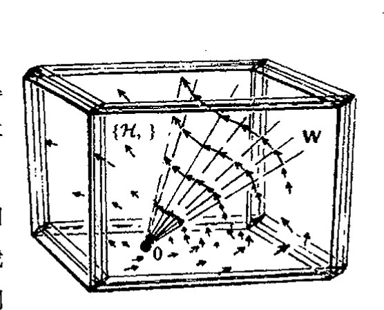
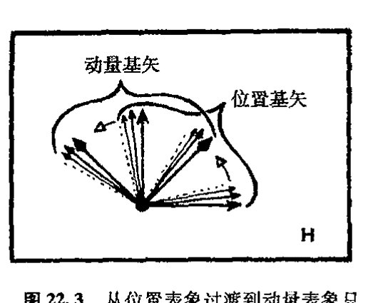
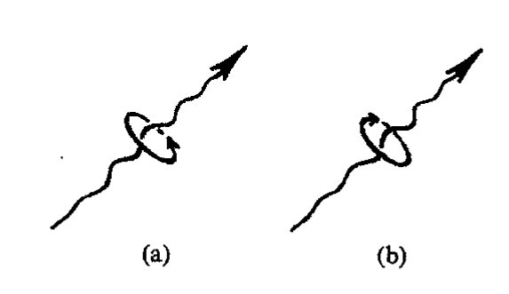
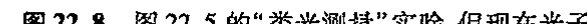
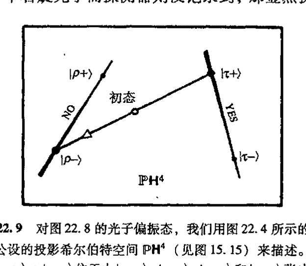
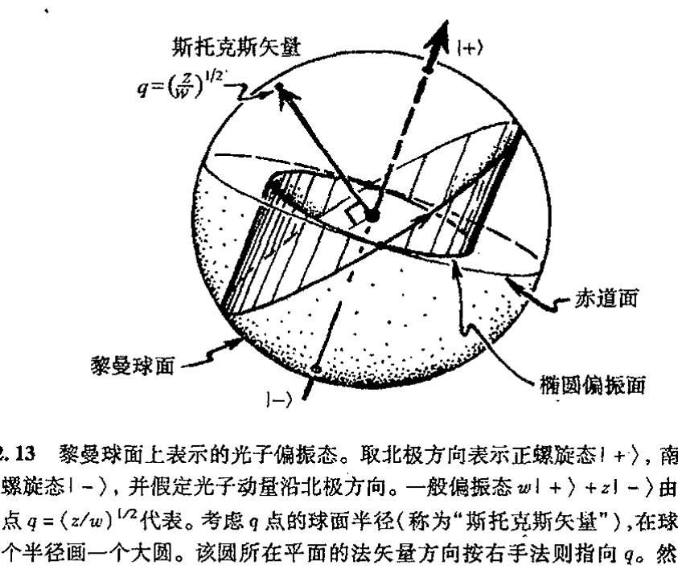

<!-- page 399 -->

通向实在之路

---

第二十二章

# 量子代数、几何和自旋

## 22.1 量子步骤 U 和 R

527

量子力学的非直观性质——或者说，大自然本身在量子活动水平上表现出的非直观性——使许多人对找到量子现象可信的物理图像感到绝望。然而，在量子力学优美的代数结构之外，还存在各种漂亮的几何性质。遗憾的是，为了在量子作用的描述方面取得进展，我们所依靠的只有一种不可具象的形式体系。尽管如此，我们看到，甚至一个不具任何特征的"点粒子"在量子形式体系下都会以一种神秘的四处弥散的波的方式出现，这是一个可具象的"事情"，它有迷人的数学结构，复数的许多奇妙性质正是通过这种结构来展现的。

这种波的图像使我们逐渐学会了单个点粒子的量子描述，懂得了所谓单个量子化粒子是什么样子，我们似乎可以坐下来喘口气了，因为这种图像原则上为我们提供了对涉及多种不同粒子的复杂体系的理解。只是这一期望还远不能令人满意，我们还需要更为广泛的认识，如果我们要得到整个世界的综合的量子图景的话。在第23章我们将看到，当考虑由若干个粒子组成的体系时，其图像会有多乱。这时不是每个粒子单独有一套"态矢"，而是整个量子体系要求有一套完全自我纠缠的单态矢。

但即使是单个的"点粒子"，实际上也具有比我们之前所描述的多得多的结构。例如它们具有所谓自旋，它带来了额外的复杂性。幸好，我们后面将看到，这种自旋本身是一种能够用丰富优美的数学加以描述的现象，在这里几何和复数奇妙的其他性质都派得上用场。

528

我们先来综述一下前一章。在那里我们已经熟悉了用态矢（或波函数）来描述（非相对论）量子化粒子，在我们对体系实施测量之前，这些态矢或波函数的时间演化由薛定谔方程精确地描述。我们将在第23章更清楚地看到，这种处理将运用到描述复杂的整体量子系统的态矢上。测量本身的数学描述完全不同于薛定谔演化方程。我们在 §§ 21.4, 7, 8 已经看到过这一点。在 §§ 21.10, 11，我们考虑了位置测量，经此过程，粒子态将跳变到（通常是不同的）局域于某

· 380 ·

<!-- page 400 -->

个具体位置的状态——即跳变到位置算符 **x** 的本征矢所指的态（这个本征矢是一个关于位置坐标的 δ 函数）。我们还考虑了动量测量的结果（§§ 21.5，6，11），经此测量，粒子态将跳变到动量算符 **p** 的本征态，于是粒子的状态弥散成波的形式（原则上布满全空间）。更一般地，测量相当于一个算符 **Q**（通常是哈密顿算符，见 [§22.5](chapter_22.md#225-量子可观察量)），它对态作用的结果是使态跳变到 **Q** 的某个本征态。至于跳变到哪个本征态，从量子力学看，这纯粹是随机的，但计算其概率则有一套精确的规则（见 [§22.5](chapter_22.md#225-量子可观察量)）。

量子态到 **Q** 的本征态的跳变¹ 是一个涉及态矢收缩或波函数坍缩的过程。这是量子理论令人迷惑不解的重要特性之一，在本书中我们将不时回到这个问题上来。我相信大多数量子物理学家都不会把态矢收缩看成是物理世界的一种真正作用，而是认为它反映了这么一种事实：我们不应将态矢看成是对“实际的”量子物理现实的描述。在第 29 章我们将详细讨论这个充满争议的问题。但不管怎样，不论我们对这一现象背后的物理实在抱有什么样的认识，实际应用中，无论何时，只要进行测量，就都是按这种古怪的方式来对待态的跳变的。一经测量，薛定谔演化就即刻再次开始——直到对系统进行另一次测量为止，如此循环往复。

我把薛定谔演化记为 **U**，态收缩记为 **R**。这两种看上去完全不同的过程的交替大概是宇宙万物的行为中一种特别古怪的方式！见[图 22.1](assets/page400_fig01.jpg)。实际上，我们可以将它想象为是对另一种未知事情的近似：有无可能还存在一种更为一般的数学方程，或某种相关的数学门类，将 **U** 和 **R** 当作是两种极限情形？我个人的观点是，这种量子理论的变化很可能是正确的——它或许是 21 世纪新物理的一部分——在第 30 章，我将针对这种可能性做出一些具体建议。但许多物理学家似乎不相信这是一条富于成果的途径。

**图 22.1** 物理系统的态的时间演化。按量子力学所公认的原则，两个完全不同的过程——（薛定谔型的连续、确定的）幺正演化 **U** 和（非连续、概率性的）态收缩 **R**——之间可以发生交换。

他们不愿意改变量子力学基本框架的理由，是因为量子理论与实验事实之间有着令人印象极其深刻而又精确一致这一事实（另外还有 **U** 形式的数学完美性），至今还没有什么已知的实验现象与这种（混杂形式的）量子理论相抵触，恰恰相反，各种不同结果在很高精度上都支持这一理论。与此同时，大多数粒子物理学家则采取这样一种哲学立场（有关各种不同的哲学立场论述见 [§29.1](chapter_29.md#-291)）：他们试图学着逐渐适应 **U** 和 **R** 过程之间的这种明显矛盾，而不是对目前的这种量子体系作明显的改变。本章和下一章的目的之一就是检验这种量子体系，但并不偏离当今量子理论的传统。以后我将再回到 **U**/**R** 问题上来，特别是在 §§ 29.1，2，7~9，和 §§ 30.10~13 等节，我将更充分阐述我对这个问题的看法。

我认为，公允地说，对量子力学的“传统”认识的共同点很大程度上在于将 **U** 过程当作一

· 381 ·

<!-- page 401 -->

通向实在之路

个“基本真理”来接受，同时人们必须以这种或那种方式学会将 **R** 看成是某种近似、假象或方便，采取这种处理的文献有很多。² 甚至那些（也包括我自己）认为量子形式体系需要在某种程度上有所改变的人，也认为现今的构架至少是一种绝好的近似，因此有必要彻底地弄懂它，如果想超越它的话。因此，我们必须更深入地了解 **U** 是怎样运作的，此外，还必须清楚它是怎样做到与 **R** 之间的完美接合的，尽管二者之间并不一致！

我还应解释一下字母 **U** 的使用。它表示幺正演化。我们有必要了解在何种意义上薛定谔方程才是“幺正”的（[§13.9](chapter_13.md#139-酉群)），这一点将在 [§22.4](#224-幺正演化薛定谔绘景和海森伯绘景) 论述。表示这种“幺正演化”还有一些其他的（等价）方式；尤为特殊的是，存在所谓海森伯绘景，我们也将在 [§22.4](#224-幺正演化薛定谔绘景和海森伯绘景) 加以论述。无论如何，薛定谔方程提供的图像已被证明是最适于我们这里所进行的描述。

## 22.2　**U** 的线性性以及它给 **R** 带来的问题

在全面讨论幺正性问题之前，我们先考察一下更基本的 **U** 的线性性问题。我们看到，单是这方面就存在与 **R** 的严重不协调性。因此，我们再来检查薛定谔方程 iℏ∂ψ/∂t = ℋψ。我们将哈密顿量 ℋ 设想为已知（即由它所描述的粒子性质、粒子间的力以及对系统所施影响的外部守恒——即能量守恒——的力所规定）。于是从方程的一般形式立即得到某种确定的结论，而且它不依赖于哈密顿量的具体性质。

我们要说明的是，这是一个确定性方程（在任一时刻，一旦态已知，则时间演化完全确定）。这会使充分了解“量子不确定性”的那些人以及认为量子体系的行为总是不确定的那些人大吃一惊。其实这种确定性的缺乏主要是因为只考虑了 **R** 过程，在薛定谔方程描述的量子态的时间演化（**U**）中则没有发现。我们从薛定谔方程还可以看到，它还是一个复方程，因为方程左边显然有一个 i（在哈密顿表述下 i 出现的机会会更多）。

最后，我们看到，薛定谔方程的确是线性的，就是说，如果 ψ 和 φ 是（同一个 ℋ）方程

$$
\mathrm{i}\hbar\frac{\partial\psi}{\partial t}=\mathcal{H}\psi,\qquad\mathrm{i}\hbar\frac{\partial\phi}{\partial t}=\mathcal{H}\phi,
$$

的解，则任意线性组合 wψ + zφ 也是它们的解，这里 w 和 z 是复常数。因为我们把第一个方程的 w 倍加上第二个方程的 z 倍，就得到（[§6.5](chapter_06.md#65-微分法则)）：

$$
\mathrm{i}\hbar\frac{\partial}{\partial t}(w\psi+z\phi)=\mathcal{H}(w\psi+z\phi)
$$

由此可见，薛定谔演化保态空间 **W**（通常是无限维空间）的复矢量空间结构。

哈密顿量 ℋ 定义了 **W** 的无穷小线性变换，这种变换描述了无穷小时间间隔内态演化之后发生的态的改变。因此，这个哈密顿量的作用由 **W** 的矢量场描述（见[图 22.2](assets/page402_fig01.jpg)）。经过一段有限时间，态在有限的线性变换下已发生变化，由此我们得到经过所谓“指数化”无穷小哈密顿作

· 382 ·

<!-- page 402 -->

第二十二章 量子代数、几何和自旋

用的态。这种指数化非常类似于我们此前所说的“指数化”（[§14.6](chapter_14.md#146-李导数)），在那里它描述的是从李代数元素的指数化中得到李群元素的过程。而哈密顿量演化的指数化执行起来要困难得多。（困难还在于 **W** 的无穷维性质。）

但撇开困难不论，这里的要点是，经过一段有限时间 *T*，量子态空间 **W** 的变换总是线性的。这等于说（这里我用符号 ↝ 来表示一个态经规定时间周期 *T* 之后如何演化到新的态）：

如果

$$\psi \leadsto \psi', \quad \text{且} \quad \phi \leadsto \phi',$$

则

$$w\psi + z\phi \leadsto w\psi' + z\phi'.$$

这里，$\psi$ 和 $\phi$ 是两个任意选定的态（波函数），$w$ 和 $z$ 是任意复常数。*[22.1]

图 22.2 哈密顿流 {ℋ, }（矢量场）定义了态空间 **W** 的一个无穷小线性变换，并给出经过无穷小时间后态的变化。要得到经历有限时间后的（幺正）变化，我们必须将这种无穷小哈密顿作用“指数化”。

从上述事实可以得到非常奇妙的推断，如果我们采取如下这种观点的话：**U** 就是事情的全部，测量过程只是我们对掌握局面（包括量子态具有非常复杂的、系统内充满难以计数的“纠缠”粒子的状态，以及相关的测量手段）的某种“方便”的称呼。（在第 23 章我们将具体解释量子力学的“纠缠”概念。我们将看到，量子态是一种比 [§21.7](chapter_21.md#217-波函数的整体性质) 所述的更严格意义上的“整体”性质，系统的不同部分不具有各自独立的量子态，而是一个纠缠着的“整体”的一部分。但这些都不影响到我们这里的讨论。）按照这种关于 **R** 的“方便”的观点，我们认为 **R** 只是作为对“真正的”基本 **U** 演化的某种近似而出现。但这种观点导致严重的悖论。

例如，在 [§21.7](chapter_21.md#217-波函数的整体性质) 的思想实验中，我的两个同事各执一个探测器，我们可以想象，每个探测器的响应正是从它与所接收的波包相互作用开始的薛定谔演化的结果。探测前的量子态实际上是两个单个波包的和，其中一个波包到达一个探测器，另一个波包到另一个探测器。因此，由线性性可知，每个探测器对薛定谔演化响应的结果必与另一个探测器的响应存在叠加。薛定谔演化导致的是一个探测器的响应叠加上另一个的响应，而不是一个探测器的响应或另一个的响应（“或”是指实际上总是这么发生的）。在我看来，**U** 道出了事情的全部这一点是站不住脚的（尼尔斯·玻尔的“哥本哈根解释”下的“传统”量子力学也并不是这么认为，因为这一学说将探测器本身也看作是“经典项”）。

依我之见，要坚持 **U** 适用于（包括测量的）全过程的唯一办法，就是采取一种“多世界”的观点（[§29.1](chapter_29.md#-291)），按这种观点，两个探测器的响应实际上是同时存在的，只不过是存在于“不同的世界”内。³ 但即便如此，**U** 也不可能是“解决一切问题”，因为我们或许需要有一种理论来

---

*[22.1] 为什么说薛定谔演化的作用是线性的，尽管实际上 ℋ 可以是 p 和 x 的高阶非线性函数？

??? question "答案 [22.1]"
    "高阶非线性" 是就 $\mathcal{H}$ 作为算符 $p=-\mathrm{i}\hbar\,\partial/\partial x$ 与 $x$ 的函数而言的：$\mathcal{H}$ 可以是 $p,x$ 的任意高次多项式（如 $x^2p^2$ 之类）。但薛定谔方程 $\mathrm{i}\hbar\,\partial\psi/\partial t=\mathcal{H}\psi$ 的线性性指的是它对态 $\psi$ 的依赖，而不是对 $p,x$ 的依赖。

    无论 $\mathcal{H}$ 是 $p,x$ 多么复杂的函数，它作为希尔伯特空间上的算符总是线性的：$\mathcal{H}(w\psi+z\phi)=w\,\mathcal{H}\psi+z\,\mathcal{H}\phi$。于是演化算符 $\mathrm{e}^{-\mathrm{i}\mathcal{H}t/\hbar}$ 也是线性的，把 $w\psi+z\phi$ 演化成 $w\psi'+z\phi'$。这正是叠加性在演化中得以保持的原因。

· 383 ·

<!-- page 403 -->

通向实在之路

解释我们认知世界的特点，就是说，我们的认知能力只认可我们的意识所觉察到的单个探测器响应，而那种与无响应的叠加则永远无法被意识所感知！（在 §§ 29.1，8 这些问题还会出现。）在此我要说明，我并不认为"多世界"就是一条正确的途径，我只是指出，如果你打算坚持"用 **U** 来对付一切"，这似乎不失为一种思路。

我将在第 29、30 章再回到这些问题上来，在那里，我们必须将 **U** 和 **R** 视为对未来更为综合的理论的一种近似。眼下，我们还是遵循传统形式体系的思路。如果理论需要更新，那么这种更新也必须与当前的理论保持高度一致。每一位有志于开创新理论的读者（我希望他就在本书的读者群中），都应当充分了解传统理论都说了些什么。

## 22.3　幺正结构、希尔伯特空间和狄拉克算符

我还没有充分说明薛定谔演化的"幺正"方面特点。这要用到前一章所述的波函数的"归一化"性质。对单（无自旋）粒子的波函数 $\psi$，它的"模"是指量 $\|\psi\|$，由 $|\psi(x)|^2$ 的全空间积分定义。$\psi$ 的归一化条件为 $\|\psi\| = 1$（如果设置了这个条件，则 $|\psi(x)|^2$ 就是位置测量中在点 $x$ 处找到粒子的概率密度）。在一般量子力学情形下，可能存在许多相互作用着的自旋粒子（或许是更一般的类型，如弦等），我们总是要求知道与模 $\|\psi\|$ 相对应的某个概念，对于适当可接受的量子态 $\psi$，它是一个正实数。虽然这个模与量子系统的 **U** 部分有关，但它在 **R** 部分内也起着关键作用，实际上，它决定着粒子出现的概率。

数学上，我们可将模看成是一种平方长度的概念，它作为态空间 **W** 内"可接受的"矢量应当是有限的。我们从用于描述时间演化的形容词"幺正的"可知，这个模在演化中是守恒的。稍后（[§22.4](chapter_22.md#224-幺正演化薛定谔绘景和海森伯绘景)）我们将看到，为什么它被用于薛定谔方程。

首先，我们来建立一些概念并了解可归一化量子态的某些特性。为此，我们不妨将模看成是各态之间的哈密顿标量积（[§13.9](chapter_13.md#139-酉群)）的特殊情形。对于态 $\phi$ 和 $\psi$，这个标量积通常写成 $\langle\phi|\psi\rangle$，在量子力学文献中，$\psi$ 的模就是 $\phi = \psi$ 时的特殊情形：

$$\|\psi\| = \langle\psi|\psi\rangle。$$

在单（无自旋）粒子情形下，这个标量积为：

$$\langle\phi|\psi\rangle = \int_{\mathbb{E}^3} \bar{\phi}\psi dx^1 \wedge dx^2 \wedge dx^3，$$

它将 [§21.9](chapter_21.md#219-波函数的概率分布) 给出的 $\|\psi\|$ 的特定表达式一般化了。由此我们得到由任意两个一维的粒子归一化波函数 $\phi$ 和 $\psi$ 定义的正定哈密顿标量积。***[22.2]

---

*** [22.2] 你能否解释为什么不论 $\langle\phi|\phi\rangle$ 和 $\langle\psi|\psi\rangle$ 是否收敛，$\langle\phi|\psi\rangle$ 都是积分收敛的？提示：考虑在 $\mathbb{E}^3$ 的任何有限区域内 $|\phi - \lambda\psi|^2$ 的积分非负意味着什么，导出连接 $\bar{\phi}\psi$ 积分的模平方与 $\bar{\phi}\phi$ 积分和 $\bar{\psi}\psi$ 积分之积之间关系的不等式。作为中间步骤，找出对所有 $\lambda$ 满足 $a + \lambda b + \bar{\lambda}c + \bar{\lambda}\lambda d \geqslant 0$ 的复数 $a, b, c, d$ 的条件。

??? question "答案 [22.2]"
    在任意有限区域 $R$ 上，非负性 $\int_R|\phi-\lambda\psi|^2\ge0$ 对所有复数 $\lambda$ 成立。把它看成关于 $\lambda$ 的二次式，判别式非正，就得到柯西-施瓦茨不等式 $|\int_R\bar\phi\psi|^2\le(\int_R|\phi|^2)(\int_R|\psi|^2)$。

    因而只要 $\phi,\psi$ 是平方可积的，令 $R$ 增大到全空间即可得到有限且良定义的内积。若单独范数发散，则必须改用广义归一化或分布意义；普通希尔伯特空间内积本身不再由这个极限直接给出。

· 384 ·

<!-- page 404 -->

第二十二章 量子代数、几何和自旋

实际上，归一化波函数构成复矢空间 **H**（**W** 的子空间），这个矢量空间也称为希尔伯特空间。*[22.3]* 希尔伯特空间是一种具有标积算符〈 | 〉的复矢空间，这种标积算符的值是一个复数，它满足如下代数性质：

$$\langle\phi|\psi+\chi\rangle=\langle\phi|\psi\rangle+\langle\phi|\chi\rangle,$$

$$\langle\phi|a\psi\rangle=a\langle\phi|\psi\rangle,$$

$$\langle\phi|\psi\rangle=\overline{\langle\psi|\phi\rangle}$$

$$\psi\neq 0 \quad \text{意味着} \quad \langle\psi|\psi\rangle>0$$

（对上述一维粒子积分情形，所有这些关系立即可证）。*[22.4]* 这些方程还意味着〈φ+χ|ψ〉=〈φ|ψ〉+〈χ|ψ〉和〈aφ|ψ〉=ā〈φ|ψ〉。*[22.5]* 此外，一旦模已知，标量积就可以由此而定，**[22.6]** 因此，保模的线性变换也一定保标量积。再补充一点，希尔伯特空间应当满足某些基本的连续性。⁵

上述这些记号属于量子力学中广泛应用的符号系统的一部分，这一符号系统是由20世纪伟大的物理学家保尔·狄拉克引入的。业已证明，作为这个一般系统的组成部分，下面这些符号

$$|\psi\rangle,|\uparrow\rangle,|\rightarrow\rangle,|\leftrightarrow\rangle,|0\rangle,|7\rangle,|+\rangle,|X\rangle,|DEAD\rangle,\text{或 }|OFF\rangle$$

可以表示希尔伯特空间 **H** 的各种态矢，这里，|…〉里的符号是表征这个态的适当（且易记住的）标签。这些记号通常称为“右（ket）”矢。对应于每个右矢，对偶空间 **H**\*（[§12.3](chapter_12.md#123-标量矢量和余矢量)）里都有一个“左（bra）”矢，它表征这个态（[§13.9](chapter_13.md#139-酉群) 意义上）的埃尔米特共轭，分别记为

$$\langle\psi|,\langle\uparrow|,\langle\rightarrow|,\langle\leftrightarrow|,\langle0|,\langle7|,\langle+|,\langle X|,\langle DEAD|,\text{或 }\langle OFF|。$$

由于左矢与右矢对偶，因此它们有 [§12.3](chapter_12.md#123-标量矢量和余矢量) 的点积意义上的标量积。左矢〈ψ|和右矢|φ〉的这个标量积——或“bracket”——正好构成上述的埃尔米特标量积〈ψ|φ〉。它与复数〈ψ|φ〉是〈φ|ψ〉的复共轭相一致。如果〈φ|ψ〉=0，即〈ψ|φ〉=0，则我们称态|φ〉和|ψ〉是正交的。

线性算符 **L** 作用到|ψ〉上记做 **L**|ψ〉，〈φ|与 **L**|ψ〉的标量积写作

$$\langle\phi|L|\psi\rangle。$$

它也是左矢“〈φ|**L**”与|ψ〉的标量积。“〈φ|**L**”的意义是什么呢？它是右矢 **L**\*|ψ〉的复共轭，这里 **L**\* 是 **L** 的共轭⁶。用于线性算符 **L** 的这种共轭运算正是我们在 [§13.9](chapter_13.md#139-酉群) 里考虑过的有限维情形下的埃尔米特共轭运算 \*。复数〈φ|**L**|ψ〉的复共轭是复数〈ψ|**L**\*|φ〉。

## 22.4 幺正演化：薛定谔绘景和海森伯绘景

现在我们来看看薛定谔演化的“幺正”性质。在 [§22.3](#223-幺正结构希尔伯特空间和狄拉克算符) 里我们已经看到，这种演化是线性

---

\* [22.3] 由练习 [22.2] 证明，归一化波函数的确构成矢量空间。

\* [22.4] 证明这一点，并仔细说明用到了积分的什么性质。

\* [22.5] 证明为什么。

\*\* [22.6] 说明〈φ|ψ〉是如何由模平方定义的。提示：计算 φ+ψ 和 φ+iψ 的模平方。

· 385 ·

<!-- page 405 -->

通向实在之路

的，因此，我们要做的就是建立起这样的概念：这种演化保 **H** 的两个元素 $|\phi\rangle$ 和 $|\psi\rangle$ 之间的标量积，就是说，$\langle\phi|\psi\rangle$ 在时间上是常数：$\mathrm{d}\langle\phi|\psi\rangle/\mathrm{d}t=0$。（由上所述可知，作为必要条件，保模和保标量积是等价的。）根本上说，我们需要从量子哈密顿量 $\mathcal{H}$ 得到的是：（i）它能使我们保持在希尔伯特空间内；（ii）它是埃尔米特的。这些都是最低要求，通过合理假定都能使哈密顿量得到满足。例如，哈密顿量的性质要求其本征值——系统能量的可能值——应为实数。通常我们还要求 $\mathcal{H}$ 是正定的，这意味着对所有非零 $|\psi\rangle$，有 $\langle\psi|\mathcal{H}|\psi\rangle>0$，因此 $\mathcal{H}$ 的所有本征值（能量值）都是正的——尽管这对演化的幺正性质并非是必需的。我们立即得到（利用积的导数的莱布尼茨性质，见 [§6.5](chapter_06.md#65-微分法则) 和上述性质）

$$\begin{aligned}\frac{\mathrm{d}}{\mathrm{d}t}\langle\phi\mid\psi\rangle&=\left\langle\frac{\mathrm{d}}{\mathrm{d}t}\phi\Bigg|\psi\right\rangle+\left\langle\phi\Bigg|\frac{\mathrm{d}\psi}{\mathrm{d}t}\right\rangle\\&=\langle-\mathrm{i}\hbar^{-1}\mathcal{H}\phi|\psi\rangle+\langle\phi|-\mathrm{i}\hbar^{-1}\mathcal{H}\psi\rangle\\&=\mathrm{i}\hbar^{-1}\langle\phi|\mathcal{H}|\psi\rangle-\mathrm{i}\hbar^{-1}\langle\phi|\mathcal{H}|\psi\rangle=0,\end{aligned}$$

它们说明标量积确实是时间不变量，即薛定谔演化是幺正的。***[22.7] 对其他埃尔米特算符，如空间平移或旋转的生成元，我们可做同样的论证来证明它们也相当于 **H** 的幺正变换。

这些方程说明，标量积 $\langle\phi|\psi\rangle$ 的变化率为零。由此可知，$\langle\phi|\psi\rangle$ 在时间上是不变的，这里 $|\phi\rangle$ 和 $|\psi\rangle$ 各自经历着相同 $\mathcal{H}$ 的薛定谔演化。假定我们在时间 $t=0$ 有量子态 $|\phi\rangle$ 和 $|\psi\rangle$，它们按薛定谔方程演化到时间 $T$ 时，分别为 $|\phi_T\rangle$ 和 $|\psi_T\rangle$：

$$|\phi\rangle\leadsto|\phi_T\rangle\quad\text{和}\quad|\psi\rangle\leadsto|\psi_T\rangle$$

（这里使用了 [§22.2](#222-u-的线性性以及它给-r-带来的问题) 的记号）。于是

$$\langle\phi|\psi\rangle=\langle\phi_T|\psi_T\rangle。$$

它告诉我们，从某时刻 $t=0$ 开始到某个 $t=T$ 时刻止，薛定谔演化的线性作用在希尔伯特空间 **H** 上是幺正的，就是说，存在一个作用于该变换的算符 $U_T$，使得

$$|\phi_T\rangle=U_T|\phi\rangle,\quad|\psi_T\rangle=U_T|\psi\rangle,\text{等等},$$

这里算符 $U_T$ 在 [§13.9](chapter_13.md#139-酉群) 的意义上是幺正的，即它的逆等于其共轭：

$$U_T^{-1}=U_T^*,\quad\text{即}\quad U_TU_T^*=U_T^*U_T=I。$$

其中 $I$ 是 **H** 上的恒等算符。（见 [§13.9](chapter_13.md#139-酉群) 中关于 $U_T$ 性质的说明。）

正如 [§22.1](#221-量子步骤-u-和-r) 提到的，量子系统的演化还有其他表示方法，其中最为熟悉的就是所谓的海森伯绘景。在这种图像下，系统的"态"在时间上是不变的，于是时间演化由动力学变量替代。读者或许会问，量子态怎么能看成是"不变的"呢？即使实际上存在的只是量子水平上的物理变化！这的确问得在理，但从薛定谔绘景到海森伯绘景的变化实际上只是一个符号重定义的

*** [22.7] 更充分地说明这段论证。你能解释为什么我们必须要求莱布尼茨性质对希尔伯特空间的标量积成立吗？

??? question "答案 [22.7]"
    薛定谔演化若由埃尔米特哈密顿量生成，则 $d\langle\phi|\psi\rangle/dt=0$。证明时必须对标量积使用莱布尼茨法则，把时间导数分别作用在 bra 和 ket 上。
    若没有这个性质，就无法把“生成元反埃尔米特”转化为范数守恒。对平移、旋转等其他连续变换同理：其生成元满足相应埃尔米特条件时，指数化后给出幺正变换。

· 386 ·

<!-- page 406 -->

问题。

首先，考虑通常的薛定谔绘景。在 $t=0$ 时刻，我们有量子态 $|\psi\rangle$，由此开始给定量子哈密顿量 $\mathcal{H}$ 的薛定谔演化，于是在随后的某个时刻 $T$，态变为 $|\psi_T\rangle$：

$$|\psi\rangle \rightsquigarrow |\psi_T\rangle = U_T |\psi\rangle。$$

由于 $U_T$ 的作用在整个希尔伯特空间 $\mathbf{H}$ 上是线性的，因此，另外的任意一个态 $|\phi\rangle$ 在同一个 $U_T$ 的作用下也将经历相应的演化 $|\phi\rangle \rightsquigarrow |\phi_T\rangle = U_T |\phi\rangle$。在海森伯绘景下，我们则将 $T$ 时刻的"态"看作是

$$|\psi\rangle_{\mathrm{H}} = U_T^{-1} |\psi\rangle = U_T^* |\psi\rangle。$$

显然，"海森伯态" $|\psi\rangle_{\mathrm{H}}$ 不随时间变化（定义使然！）。另一方面，为使所有的代数演算一如以往，以便得到与薛定谔绘景下相同的本征值（测定的物理参数），我们要求动力学变量亦有补偿性演化。这样，（$\mathbf{H}$ 上）任一线性算符 $Q$ 必为相应的海森伯型算符

$$Q_{\mathrm{H}} = U_t^{-1} Q U_t = U_t^* Q U_t。$$

所取代。由此可知，任一标量积的海森伯型本征值与薛定谔型的是相同的。$^{**[22.8]}$ 现在将海森伯演化用到算符 $Q$ 上（在薛定谔绘景下假定为常数）。我们有$^{**[22.9]}$

$$\mathrm{i}\hbar \frac{\mathrm{d}}{\mathrm{d}t} Q_{\mathrm{H}} = \mathcal{H} Q_{\mathrm{H}} - Q_{\mathrm{H}} \mathcal{H}，$$

这就是海森伯运动方程。（注意，在 $Q_{\mathrm{H}} = \mathcal{H}$ 时，该方程的一个明显结果就是能量守恒。）

读者或许会问，这么折腾我们得到了什么？某些时候，海森伯绘景能够带来技术上的方便，但海森伯绘景无助于解开量子力学之谜。"量子跳变"问题依然存在，但我们可以重新考虑态，使 $|\psi\rangle_{\mathrm{H}}$ "跳变"为 $\mathbf{R}$ 运行的某个结果，或使海森伯动力学变量发生"跳变"！在我看来，这些"跳变"问题在海森伯绘景下显得更加晦涩，不解决任何问题。

在薛定谔绘景下，我们至少还有演化的态矢，使我们还能看出一点"量子实在"是什么样子！而海森伯绘景则连这一点机会都给剥夺了，因为在这种图像下，甭管发生什么物理作用，其态矢都是不变的。更有甚者，由于动力学变量完全不描述具体的物理系统，因此这些动力学变量的演化居然不能表示任何具体物理系统的变化，就更甭说诸如"你处于什么位置"这样的问题了。

存在这两种不同图像的原因有着深刻的历史背景。1925年7月，海森伯首先发表了他的理论，半年后的1926年1月，薛定谔才提出他的学说，不久之后人们才认识到二者其实是等价的。率先给出薛定谔波函数的模平方 $|\psi|^2$ 的概率解释的（[§21.9](chapter_21.md#219-波函数的概率分布)）是马克斯·波恩（1926年6月）。薛定谔自己则试图给出一种 $\psi$ 的"经典场"图像。而量子力学算符理论总体上则源自海森伯、

---

$^{**}$ [22.8] 详细解释这一点。

$^{**}$ [22.9] 试试你能否确认这一点。

· 387 ·

<!-- page 407 -->

通向实在之路

波恩和约尔丹（Pascual Jordan, 1902—1980）的工作，并由狄拉克给予彻底的系统化，详见狄拉克首版于1930年的重要著作《量子力学原理》。⁷

自然，量子理论最终还是起了变化，一种图像比另一种图像得到了更多的青睐，二者的等价性被打破了。特别是量子场论（见第26章）的出现，将量子理论和（狭义）相对论有机地结合起来。狄拉克曾对这种场合下偏爱⁸海森伯绘景做过论证。其实不论海森伯绘景还是薛定谔绘景，都不具有相对论性的不变性，但在量子场论的场合，有时混杂的“相互作用图像”可能更有益。⁹

## 22.5　量子“可观察量”

我们现在来考虑如何在形式体系下表示对量子系统的测量。正如[§22.1](#221-量子步骤-u-和-r)所说，第21章给出的位置测量和动量测量的例子说明了在一般的量子测量下会出现什么样的情形。量子系统的某种“可测量”性质可用某个称之为可观察量的算符*Q*来表示，我们可将其用于量子态。动力学变量（譬如说位置或动量）是可观察量的例子。¹⁰理论要求可观察量*Q*能够表示为线性算符（如位置算符或动量算符），以便它对空间**H**的作用具有**H**的线性变换意义——尽管可能只有这一种意义（[§13.3](chapter_13.md#133-线性变换和矩阵)）。我们说态*ψ*对于可观察量*Q*有确定值，如果*ψ*是*Q*的本征态的话，相应的本征值*q*就是这个确定值。¹¹这些概念正是我们在[§21.5](chapter_21.md#215-理解波粒二象性)，10，11的位置和动量情形下遇到过的概念。

在传统量子力学里，通常要求所有本征值都是实数。现在这一点可通过要求*Q*是埃尔米特的来保证，就是说，要求*Q*等于其共轭*Q*\*：\*[22.10]

$$Q^* = Q。$$

在我看来，对可观察量*Q*的这种埃尔米特性的要求是一种不合理的强要求，因为在经典物理里，如天球的黎曼球面表示（[§18.5](chapter_18.md#185-作为黎曼球面的天球)），谐振子的许多标准讨论（[§20.3](chapter_20.md#203-小振动)）等等，复数是经常用到的。¹²可观察量的基本要求是，它的对应于不相等的本征值的本征矢应彼此正交。通常人们说的“正规的”指的就是算符的这种性质。正规算符*Q*就是可与其共轭对易的算符：

$$Q^* Q = QQ^*，$$

对应于不相等的本征值的任何一对这样的本征矢必定彼此正交。\*\*\*[22.11]由于测量的结果（本征值）都是复数，而测量引起的各种态之间的正交性要求可得到保证，因此我只需要求量子“可观察量”是正规线性算符，没必要像传统强条件那样要求它们是埃尔米特的。

---

\* [22.10] 证明：埃尔米特算符*Q*的任何本征值都是实数。

\*\*\* [22.11] 试试你能否证明这一点。提示：考虑表达式〈*ψ*|(*Q*\* − *λ̄***I**)(*Q* − *λ***I**)|*ψ*〉，先证明，如果*Q*|*ψ*〉= *λ*|*ψ*〉，则*Q*\*|*ψ*〉= *λ̄*|*ψ*〉。

·388·

<!-- page 408 -->

第二十二章 量子代数、几何和自旋

这里，我将对量子可观察量的进一步要求作些阐述，就是说，要求它们的本征矢张起整个希尔伯特空间 **H**（因此 **H** 的任一元素都能够用这些本征矢线性地表示出来）。在有限维情形，这个性质是 *Q* 的埃尔米特（或正规）性质的数学结果。但对无限维 **H** 情形，我们需要将它看作是对 *Q* 的一条独立的假定。具有这种性质的埃尔米特算符 *Q* 称作自伴的。

对量子可观察量的正交性要求对于量子测量极为重要。按量子力学法则，对应于某个算符 *Q* 的测量结果总是 *Q* 的本征态之一：这就是随 **R** 过程出现的量子态的“跳变”（[§22.1](#221-量子步骤-u-和-r)）。不论测量前系统处于什么态，一经测量它就会跳变到对应于 **R** 的 *Q* 的某个本征态。测量之后，这个态要求可观察量 *Q* 有确定的值，即相应的本征值 *q*。因此，对可观察量 *Q* 的测量的每个不同的可能结果——即对于每个不同的本征值 *q*₁，*q*₂，*q*₃，…——我们得到一组各不相同的结果态中的一个，所有这些态都是正交的。

为什么这一点是重要的呢？这与我们一会儿将看到的计算每个态出现概率的量子法则有关。这些法则的一个推论就是，对于测量引起的一个态到另一个与之正交的态的跳变，概率总是零。相应地，如果我们重复可观察量 *Q* 的测量，则第二次测量给出的是与第一次测量得到的同一个本征值——即相同的测量结果。要给出不同的结果，就需要从一个态跳变到另一个与之正交的态，而这是概率法则所不允许的。但这个结论取决于 *Q* 的所有本征值对应的本征态均彼此正交，这就是为什么我们要求 *Q* 必须是正规算符的原因。

现在我们回到为可观察量 *Q* 的不同的本征态赋概率值这一问题上来。量子 **R** 过程的显著特点，就是量子力学概率仅依赖于测量之前和之后的量子态，而与可观察量 *Q* 的其他方面（例如测得的本征值等）无关。*Q* 的从态 |*ψ*⟩ 跳变到本征态 |*φ*⟩ 的概率由下式给出：

|⟨*ψ*|*φ*⟩|²，

这里假定 |*ψ*⟩ 和 |*φ*⟩ 都是归一化的（‖*ψ*‖ = 1 = ‖*φ*‖）。否则的话，我们需要将上式除以 ‖*ψ*‖ 和 ‖*φ*‖ 才能得到概率值。对非归一化情形，我们习惯将这个概率写成对称的形式

$$\frac{\langle\phi|\psi\rangle\langle\psi|\phi\rangle}{\langle\psi|\psi\rangle\langle\phi|\phi\rangle}。$$

这个概率值总是 0 和 1 之间的实数，仅当各态之间成正比时取 1。***[22.12] 由上述讨论可知，薛定谔演化保标量积 ⟨*φ*|*ψ*⟩。这是 **U** 和 **R** 过程之间的一个重要的协调关系，它表示这样一个事实：尽管二者不一致，但 **U** 和 **R** 之间确实是“吻合的”。我们看到，一个态从没有在测量中直接跳变到一个与之正交的态，因为 ⟨*φ*|*ψ*⟩ = 0 意味着这么做的可能性为零。

对于规范正交态 *ψ* 和 *φ* 的量子叠加情形，譬如说 *wψ* + *zφ*，这里 *w* 和 *z* 是两个复数权重因子，有时称其为幅度——或“概率幅度”，我们可通过鉴别态 *wψ* + *zφ* 中的 *ψ* 和 *φ* 的实验来得到 *ψ* 的概率 *w̄w* = |*w*|² 和 *φ* 的概率 *z̄z* = |*z*|²，即我们取幅度的模的平方来得到概率。这种方法对多于两个态叠

*** [22.12] 从练习 [22.2] 所用的 ⟨|⟩ 的代数性质出发证明这一点。

??? question "答案 [22.12]"
    设 $Q\psi=\lambda\psi$、$Q\phi=\mu\phi$，且 $Q$ 正规。正规性保证不同本征值的本征子空间同时适合用 $Q$ 与 $Q^*$ 比较；特别地，对本征矢量有 $Q^*\phi=\bar\mu\phi$。

    采用物理记号内积，$\langle\phi|Q\psi\rangle=\lambda\langle\phi|\psi\rangle$，另一方面 $\langle\phi|Q\psi\rangle=\langle Q^*\phi|\psi\rangle=\mu\langle\phi|\psi\rangle$。故 $(\lambda-\mu)\langle\phi|\psi\rangle=0$，若 $\lambda\ne\mu$，内积为零。

<!-- page 409 -->

通向实在之路

加的情形也适用。

正规算符 $Q$（假定其本征矢张起整个 $\mathbf{H}$）的一个有用性质是它总有一组构成希尔伯特空间规范正交基的本征矢。规范正交基（与 [§13.9](chapter_13.md#139-酉群) 比较）是 $\mathbf{H}$ 的一组元素 $e_1, e_2, e_3, \cdots$，它们满足

$$\langle e_i | e_j \rangle = \delta_{ij}$$

（$\delta_{ij}$ 是克罗内克 $\delta$），$\mathbf{H}$ 的每个元素 $\psi$ 都能够表示成

$$\psi = z_1 e_1 + z_2 e_2 + z_3 e_3 + \cdots,$$

（$z_1, z_2, z_3, \cdots$ 是 $\psi$ 的复"笛卡儿坐标"）。这种表示类似于如下意义的一般波函数表示：对于单个的无结构粒子，这种波函数是（傅里叶变换下的）动量态或位置态（$\psi(x) = \int \psi(X)\delta(x-X)\mathrm{d}^3X$）的连续线性叠加（[§21.11](chapter_21.md#2111-动量空间描述)），这是因为动量态和位置态分别是动量算符 $\mathbf{p}$ 和位置算符 $\mathbf{x}$ 的本征矢。从位置表象过渡到动量表象相当于是希尔伯特空间 $\mathbf{H}$ 的基变换（见[图 22.3](assets/page409_fig01.jpg)）。但是，从技术上说，动量态和位置态其实都不构成基，因为它们不是归一化的，故不属于 $\mathbf{H}$！（量子力学里充满了这类烦人的问题。就量子态而言，你既可以对这种精妙的数学抱以马虎的态度，甚至把位置态和动量态就当作实际的态；也可以花上所有时间来把这种数学彻底搞清楚，但这时又会有另一种堕入"僵化"境地的危险。我选择的则是中间道路，并尽可能做得最好，但在这个问题上，我也不能完全确信取得进展的答案究竟是什么！）

**图 22.3** 从位置表象过渡到动量表象只需要改变希尔伯特空间 $\mathbf{H}$ 的基（尽管技术上说，不论是动量态还是位置态（均非归一化）实际上都不属于 $\mathbf{H}$）。

## 22.6 YES/NO 测量；投影算符

对于本征态不是归一化的位置算符或动量算符情形，找到粒子的概率为零。这个答案之所以"正确"，是因为位置或动量取任何具体值的概率的确为零（位置和动量都是连续参数）。于是我们得考虑用其他可观察量，例如我们可以这样来提出问题："这个位置是否处在某个取值范围内？"对动量（或任何其他连续的可观察量）也可以提出类似问题。这种所谓 YES/NO 问题可通过譬如说令 YES 对应于本征值 1、NO 对应于本征值 0 而被结合到量子形式体系里，用来描述它的可观察量称之为投影算符。

投影算符 $\mathbf{E}$ 具有自共轭和等于自身平方的性质 $^{**}[22.13]$

$$\mathbf{E}^2 = \mathbf{E} = \mathbf{E}^*.$$

---

$^{**}[22.13]$ 证明：如果可观察量 $Q$ 满足某个多项式方程，那么它的每一个本征值也满足该方程。

· 390 ·

<!-- page 410 -->

这一点提供了一种最基本的测量。对量子力学里由测量引起的一系列问题，我们都可以用它来解决。但在进行 YES/NO 测量时，有一个问题变得突出了，那就是（大于二维情形下）这些算符是简并的。我们说 $Q$ 关于某个本征值 $q$ 是简并的，是指 $q$ 所对应的本征矢空间大于一维，即对同一个本征值 $q$，存在 $Q$ 的非比例本征矢（[§13.5](chapter_13.md#135-本征值与本征矢量)）。由相同本征值 $q$ 的所有本征矢组成的 $\mathbf{H}$ 的整个线性子空间，就是 $q$ 所对应的 $Q$ 的本征空间。在此情形下，测量得到的“结果”（即本征值的确定）本身并不能告诉我们将要“跳变”到哪个态。这个问题是通过所谓投影公设来解决的，这条投影公设认为，我们可将作为测量结果的态正交投影到 $q$ 所对应的 $Q$ 的本征空间上。^{13}实际上，这条“投影公设”经常被用作为 [§22.1](#221-量子步骤-u-和-r) 所说的标准的量子力学处理（正如冯·诺伊曼清楚表明的那样^{14}），就是说，对可观察量 $Q$ 进行测量的结果，就是使态跳变到本次测量得到的本征值所对应的 $Q$ 的某个本征态。在本节和下一节，我将反复强调简并本征值情形下这条公设的投影性质的重要性。^{15}

表示这种投影的最好方式就是运用适当的投影算符 $\mathbf{E}$，这种算符对应于 YES 本征值 1 的本征空间等同于 $q$ 所对应的 $Q$ 的本征空间。（这一点总是能做到的，$\mathbf{E}$ 所提出的问题比 $Q$ 所提出的更基本：“$q$ 是 $Q$ 测量的结果吗？”）因此，投影公设所陈述的是：测量的结果（不论是由 $Q$ 得到的 $q$，还是由 $\mathbf{E}$ 得到的 1）为

$$|\psi\rangle \quad \text{跳变到} \quad \mathbf{E}|\psi\rangle。$$

这里不用担心归一化问题。如果我们要求结果态归一化，我们可以让 $|\psi\rangle$ 跳变到看上去更凌乱的

$$\mathbf{E}|\psi\rangle\langle\psi|\mathbf{E}|\psi\rangle^{-1/2}。$$

但在这里，我倒觉得不作归一化更方便，这样可以使公式看起来更简洁。

图 22.4 在希尔伯特空间 $\mathbf{H}$ 内展示了投影公设的几何性质。我们注意到，如果我们用 $\mathbf{I}-\mathbf{E}$（也是算符）取代 $\mathbf{E}$，则 YES 和 NO 本征空间正好交换。（这里 $\mathbf{I}$ 是 $\mathbf{H}$ 上的恒等算符。）因此，如果 $\mathbf{E}$ 测量得到的结果是 0，则 $|\psi\rangle$ 跳变到 $(\mathbf{I}-\mathbf{E})|\psi\rangle$（$=|\psi\rangle-\mathbf{E}|\psi\rangle$）。注意，$|\psi\rangle$ 是两个态 $\mathbf{E}|\psi\rangle$ 和 $(\mathbf{I}-\mathbf{E})|\psi\rangle$ 的和，他们彼此正交，*^{[22.14]}而且测量 $\mathbf{E}$ 决定着二者之一，YES 对应于前者，NO 对应于后者：

$$|\psi\rangle = \mathbf{E}|\psi\rangle + (\mathbf{I}-\mathbf{E})|\psi\rangle。$$

---

* [22.14] 证明这一点。

??? question "答案 [22.14]"
    投影算符 $\mathbf{E}$ 满足厄米性 $\mathbf{E}^\dagger=\mathbf{E}$ 与幂等性 $\mathbf{E}^2=\mathbf{E}$。要证 $\mathbf{E}|\psi\rangle$ 与 $(\mathbf{I}-\mathbf{E})|\psi\rangle$ 正交，计算二者的标积：$\langle\mathbf{E}\psi|(\mathbf{I}-\mathbf{E})\psi\rangle=\langle\psi|\mathbf{E}^\dagger(\mathbf{I}-\mathbf{E})|\psi\rangle=\langle\psi|(\mathbf{E}-\mathbf{E}^2)|\psi\rangle=\langle\psi|(\mathbf{E}-\mathbf{E})|\psi\rangle=0$。

    故两个分量正交，$|\psi\rangle=\mathbf{E}|\psi\rangle+(\mathbf{I}-\mathbf{E})|\psi\rangle$ 正是 $|\psi\rangle$ 沿 YES 与 NO 两个相互正交本征子空间的分解。

· 391 ·

<!-- page 411 -->

通向实在之路

544 有一种直接的几何方法可以表示这种二者择一的概率，即利用每个投影算符各自的“模”（平方长度）。*\[22.15]* 这一简单的几何事实在坚持用归一化态的情形下是无法得到的！

## 22.7 类光测量；螺旋性

一些物理学家对投影公设持怀疑态度（认为它“没必要”或是“不可观察的”），其困难在于我们无法断定测量后系统处于什么态。这或许是因为测量过程本身已使得待观察量与测量仪器纠缠在一块儿，从而使待观察量的态无法作单独考虑。这一点有时的确是一个复杂的问题，但也存在一些明显可用投影公设来描述（如必要，还是简并的）测量的场合。最明显的当属所谓类光（或无相互作用）测量情形。这种测量表现出的神奇性质完全在于其自身原因，它展示了量子力学行为中最为奇妙的一面。为此我们不妨看一两例。

545 我们来考虑 [§21.7](chapter_21.md#217-波函数的整体性质) 讨论过的一种情形，单个光子瞄准分束器，它的态部分被反射，部分透过分束器。经过分束器之后，这个态成为两个正交的态——透射态 $|\tau\rangle$ 和反射态 $|\rho\rangle$（这里，为了得到漂亮的直和，我们在 $|\tau\rangle$ 和 $|\rho\rangle$ 的定义中包括了相对相位因子，也不再坚持归一化）——之和：

$$|\psi\rangle = |\tau\rangle + |\rho\rangle$$

（见[图 22.5](assets/page411_fig01.jpg)）。假定在透射束方向上设有一探测器，并假定（仅出于论证考虑）探测器的探测效率 100%。此外，我们还假定光子源的每个光子发射事件都 100% 被记录。（这些显然都是理想化的；实际实验中很难做到这种高效率。但这些合理的理想化毕竟能为我们说明量子力学是如何工作的。）如果我们发现有这样的情形：源发射了一个光子而探测器却没有接收到，那么我们就可以断定，在这些情形里，光子走的是“另一条路径”，它的态因此是反射态 $|\rho\rangle$。尤其突出的是，这种光子的零接受测量引起光子态发生量子跳变（从叠加态 $|\psi\rangle$ 跳变到反射态 $|\rho\rangle$），尽管实际上并没有和测量仪器发生相互作用！这就是类光测量的例子。

这种情形的一个典型事例是埃利策（Avshalom Elitsur）和韦德曼（Lev Vaidman）建议的。\[^16] 考虑分束器是马赫–曾德尔干涉仪一部分的情形（请回忆 [§21.7](chapter_21.md#217-波函数的整体性质) 描述的星际思想实验，见[图 21.9](assets/page390_fig01.jpg)），但现在我们并不知道是否在第一个分束器的透射方向上安置了探测器 C。我们假定，一旦探测器 C 接收到光子，它就引爆一枚炸弹。另外还存在两个

*\[22.15]* 为什么？

· 392 ·

<!-- page 412 -->

第二十二章 量子代数、几何和自旋

终点探测器 A 和 B，（由 [§21.7](chapter_21.md#217-波函数的整体性质)）我们知道如果没有 C 则只有 A 能记录接收到的光子，见[图 22.6](assets/page412_fig01.jpg)。我们希望在某种场合下——炸弹的爆炸并不能毁掉 C——确定 C（和炸弹）的存在。这一点可以通过探测器 B 实际记录到光子来做到，因为只有当探测器 C 进行了测量而又未接收到光子时才会出现这种情形！这之后光子实际上可以取其他路径，A 和 B 各有 $\frac{1}{2}$ 可能性记录到光子（因为此时不存在两束间的干涉），而没有 C 时则只有 A 能够接收到光子。¹⁷

**图 22.6** 埃利策-韦德曼炸弹实验。连着炸弹的探测器 C 可以置于也可以不置于马赫-曾德尔干涉仪（图 21.9）的光路上。（图中白色薄矩形表示分束器，黑的表示反射镜。）干涉仪内的臂长是相等的，这样源发射的光子在没有 C 时必到达探测器 A。如果探测器 B 记录到光子（炸弹没爆炸），我们就知道 C 一定处于光路上，即使它 C 没遇到光子。

**图 22.7** 像光子这样的无静质量粒子只能绕其运动方向自旋。每一种无静质量粒子的自旋的大小 $|s|$ 是个常量，但如果旋量 $s$ 不为零（如光子），则自旋可以是(a)右旋的（$s>0$：正螺旋）或(b)左旋的（$s<0$：负螺旋）。对于光子，我们有 $|s|=1$（$\hbar$ 单位下），于是有两种情形：$s=1$ 对应右旋圆偏光，$s=-1$ 对应左旋圆偏光。由量子叠加法则，我们可由此组成复线性复合，产生如图 21.12 和 21.13 所示的另一种可能的光子偏振态。

这个例子中不存在简并问题，因此不会出现前面所说的那种纯粹的测量结果无法确定系统将"跳变到"什么态的问题。由 [§22.6](#226-yesno-测量投影算符) 可知，我们需要适当运用投影公设来解决这些由简并本征值所引起的问题。现在，我们引入另一个自由度，它可以通过光子的极化现象来实现。这是一种我们早先提到过的所谓量子力学自旋的物理性质。关于自旋概念我将在 [§22.8](#228-自旋和旋量)~11 里给予详细讨论，这里我们仅需了解无静质量粒子的基本性质就够了。光子就是这么一种有自旋但无静质量的粒子，其自旋表现与我们将在 [§22.8](#228-自旋和旋量)~10 看到的有静质量的粒子（如电子或质子）的自旋表现稍有不同，我们必须将光子（或其他无静质量粒子）看成是关于其运动方向的自身旋转，如[图 22.7](assets/page412_fig02.jpg)。

对给定的无静质量粒子类型，其自旋的大小 $|s|$ 总是不变的，但自旋的方向可依照粒子的运动方向区分为右旋（$s>0$）和左旋（$s<0$）。另外，由量子力学的一般原理可知，自旋态可以是两个自旋的（量子）线性叠加。量 $s$ 本身称为无静质量粒子的螺旋性（[§22.12](#2212-相对论性量子角动量)），它的值总是取整数或半整数（或带适当的单位，应当说，这种螺旋性是 $\frac{1}{2}\hbar$ 的整数倍）。如果一个无静质量粒子的 $|s|=j$（或带单位，$|s|=j\hbar$），我们就说它有自旋 $j$。光子的自旋为 1（故其螺旋性为 $\pm 1$）；引力

·393·

<!-- page 413 -->

通向实在之路

子的自旋为 2（其螺旋性为 ±2）。中微子的自旋为 $\frac{1}{2}$，如果存在无静质量中微子的话，[^18]其螺旋性为 $-\frac{1}{2}$，相应的反中微子的螺旋性为 $\frac{1}{2}$。

对于光子情形，其螺旋态（确定的螺旋性态）是圆偏振态，右旋对应于 $s=1$，左旋对应于 $s=-1$。光子还存在其他可能的态，如平面偏振态，但这些态都属右旋态和左旋态的简单线性叠加。在 [§22.9](#229-二态系统的黎曼球面) 的节尾我们将简述其几何性质，但眼下这还没必要。现在我们要做的是确认这样一个事实：反射中的圆偏振是如何表现的？我们假定，圆偏振态下的光子垂直地撞向分束器（或我们使用的其他镜面），这样反射束将沿原方向的相反方向返回。于是我们得到，反射光子的偏振态正好与源发射的光子的偏振态相反，而透射束的偏振态则与源发射光子的相同。[^22.16]只要我们愿意，当然也可以让人射束与垂直方向有一微小偏差，这样反射束就不至于完全返回到发射光源。这对讨论无实质性影响。

现在我们回到原初的[图 22.5](assets/page411_fig01.jpg) 所示的"类光测量"实验上来，只是现在光子像[图 22.8](assets/page413_fig01.jpg) 那样取正入射。假定我们可以将光源调制到只发射右旋圆偏振光子或左旋圆偏振光子。现在，它发射一个右旋光子（记住这个事实）。在光子经过分束器之后，光子的态变成为一种叠加态（同前一样，为带适当相因子的和）：

$$|\psi+\rangle = |\tau+\rangle + |\rho-\rangle,$$

这里，右矢里的 + 或 - 是指螺旋性的符号。我们像以前一样，在透射束路径上置一探测器（并假定它对偏振不敏感）。于是，如果源记录表明发射了一个右旋光子而探测器则没记录到，那显然探测

图 22.8 图 22.5 的"类光测量"实验，但现在光子取几乎正入射。光源发射一个右旋光子。经过分束器之后，光子的态变成为 $|\psi+\rangle = |\tau+\rangle + |\rho-\rangle$，这里，右矢里的"+"或"-"是螺旋性的符号。如果（对偏振不敏感的）探测器没接收到光子，则可断定态跳变到反射的左旋态 $|\rho-\rangle$。由于结果 NO（由 $|\rho+\rangle$ 和 $|\rho-\rangle$ 张成的二维空间）和 YES（由 $|\tau+\rangle$ 和 $|\tau-\rangle$ 张成的二维空间）都存在简并问题，因此断定结果态要用到全投影公设。本例中，初态必须是 $|\tau+\rangle + |\rho-\rangle$，以便确定测量使得态跳变到何种状态（即这里的"未检测到"结果）。

图 22.9 对图 22.8 的光子偏振态，我们用图 22.4 所示的投影公设的投影希尔伯特空间 $\mathbb{P}\mathbb{H}^4$（见图 15.15）来描述。初态 $|\tau+\rangle + |\rho-\rangle$ 位于由 $|\tau+\rangle$、$|\tau-\rangle$、$|\rho+\rangle$ 和 $|\rho-\rangle$ 张成的全空间 $\mathbb{P}\mathbb{H}^2$ 内。白三角箭头表示从初始点 $(|\tau+\rangle + |\rho-\rangle)$ 沿横截于 YES 和 NO 直线的方向到 $|\rho-\rangle$ 的投影。按全投影公设，（未）检测结果表明，结果态处于 NO 直线上，但初态的选取破坏了这种简并性。

---

\*\*\* [22.16] 你能否给出个简单理由。

· 394 ·

<!-- page 414 -->

第二十二章 量子代数、几何和自旋

器没接收到光子，故可断定态跳变到反射的左旋态 $|\rho-\rangle$。这里我要指出，完整的投影公设要求我们断定该结果态的性质，见[图 22.9](assets/page413_fig02.jpg)。测量是一种纯粹的 YES/NO 行为，因为结果不是“未检测到”（NO）就是“检测到”（YES）。这两种情形都存在简并问题，因为 NO 答案的本征空间是由 $|\rho+\rangle$ 和 $|\rho-\rangle$ 张成的二维空间，同样，YES 的本征空间是由 $|\tau+\rangle$ 和 $|\tau-\rangle$ 张成的二维空间。由于本例中初态为 $|\tau+\rangle + |\rho-\rangle$，对于“未检测到”这一结果，投影公设$^{19}$使我们在 NO 情形正确地得到了 $|\rho-\rangle$ 而不是 $|\rho+\rangle$ 或 $|\rho+\rangle + |\rho-\rangle$（或其他各种 $|\rho+\rangle$ 和 $|\rho-\rangle$ 的线性叠加）。$^{20,**[22.17]}$

## 22.8 自旋和旋量

这不能算是一个非常振奋的实验，但它向我们展示了问题的关键。在第 23 章我们将看到一些更惊人的结果。作为一种准备，我们有必要在此对自旋多说几句。在有静质量粒子的情形，自旋就是指绕质心旋转的角动量。$^{21}$ 在 [§21.1](chapter_21.md#211-非对易变量)–5，我们分别谈到过量子规律当中作为时间平移对称的质量能量守恒和作为空间平移对称的动量守恒的意义。类似地，旋转对称性给出角动量守恒（亦见 [§18.7](chapter_18.md#187-相对论性能量和角动量) 和 [§20.6](chapter_20.md#206-如何从拉格朗日量导出现代理论)）。对有质量粒子，我们可以想象我们是处在粒子静止的参照系里，于是相关的转动构成关于粒子在参照系中位置的转动群 O(3)。

量子力学里，动量分量表示为 $\mathrm{i}\hbar$ 乘以沿相应位置坐标生成无限小平移的算符（[§21.1](chapter_21.md#211-非对易变量), 2）。同样，角动量分量则表现为 $\mathrm{i}\hbar$ 乘以关于相应的（笛卡儿空间）坐标轴作无限小转动的生成元。因此，在量子力学里，角动量分量涉及的是无限小转动的代数（[§13.6](chapter_13.md#136-表示理论与李代数), 10），即转动群 O(3) 或等价的 SO(3) 群的李代数，因为李代数并不区分这二者。

由于 SO(3) 是非阿贝尔的，故李代数元素并不全对易。事实上，这种代数关于三维笛卡儿空间轴的无限小转动的生成元 $l_1, l_2$ 和 $l_3$ 满足 $^{**[22.18]}$

$$l_1 l_2 - l_2 l_1 = l_3, \qquad l_2 l_3 - l_3 l_2 = l_1, \qquad l_3 l_1 - l_1 l_3 = l_2。$$

按照量子力学法则，这些关系反映了关于三个轴的角动量分量 $\mathbf{L}_1, \mathbf{L}_2, \mathbf{L}_3$

$$\mathbf{L}_1 = \mathrm{i}\hbar l_1, \; \mathbf{L}_2 = \mathrm{i}\hbar l_2, \; \mathbf{L}_3 = \mathrm{i}\hbar l_3$$

之间的联系。于是角动量对易规则为$^{22}$

$$\mathbf{L}_1 \mathbf{L}_2 - \mathbf{L}_2 \mathbf{L}_1 = \mathrm{i}\hbar \mathbf{L}_3, \; \mathbf{L}_2 \mathbf{L}_3 - \mathbf{L}_3 \mathbf{L}_2 = \mathrm{i}\hbar \mathbf{L}_1, \; \mathbf{L}_3 \mathbf{L}_1 - \mathbf{L}_1 \mathbf{L}_3 = \mathrm{i}\hbar \mathbf{L}_2。$$

和量子力学里其他算符一样，角动量分量 $\mathbf{L}_1, \mathbf{L}_2, \mathbf{L}_3$ 也必须是希尔伯特空间 $\mathbf{H}$ 上的线性算符。因此，具有角动量的量子系统提供了一种 SO(3) 关于 $\mathbf{H}$ 的线性变换的李代数表示（见 [§13.6](chapter_13.md#136-表示理论与李代数)–8, 10, [§14.6](chapter_14.md#146-李导数)）。

这一点展现了量子力学中最优美和最富启迪的一面，是值得详细研究的一个方面。但此处不

---

**\*\* [22.17]** 详细解释为什么“投影”给出的是正确答案。

**\*\* [22.18]** 用四元数证明这一点。

· 395 ·

<!-- page 415 -->

通向实在之路

宜深谈，我仅就特别重要之处作些说明。首先，我们要指出，下述矩阵（不带 $\hbar/2$ 时称为泡利矩阵）

$$L_1=\frac{\hbar}{2}\begin{pmatrix} 0 & 1 \\ 1 & 0 \end{pmatrix}, \qquad L_2=\frac{\hbar}{2}\begin{pmatrix} 0 & -i \\ i & 0 \end{pmatrix}, \qquad L_3=\frac{\hbar}{2}\begin{pmatrix} 1 & 0 \\ 0 & -1 \end{pmatrix},$$

满足所要求的对易关系。*[22.19] 它们为角动量提供了一种最简单的（非平凡）表示，我们想象一下这些 $2\times2$ 矩阵作用到具有二分量 $\{\psi_0(x),\psi_1(x)\}$（看成列矢量）的波函数的情形。当我们开始转动这个态时，这两个分量 $\psi_0(x)$ 和 $\psi_1(x)$ 就按泡利矩阵产生的矩阵乘法规则搅动。

我们可以用下指标 $A$ 将这个二分量波函数标为 $\psi_A$（这里 $A$ 取值 $0$ 和 $1$，或将它看成是 [§12.8](chapter_12.md#128-张量抽象指标记法和图示记法) 里的"抽象指标记法"下的抽象指标）。$\psi_A$ 描述的量称为旋量，其指标 $A$ 称为二维旋量指标。可以证明，$\psi_A$ 就是 [§11.3](chapter_11.md#113-四元数几何) 所描述意义下的自旋体（连续 $2\pi$ 转动将使其变到相反态）。如果我们对某个泡利矩阵连续"取幂"（[§14.6](chapter_14.md#146-李导数)），直到转过完整的 $2\pi$ 转动为止，我们就会得到算符 $-I$，它将 $\psi_A$ 变成 $-\psi_A$。**[22.20]

这种记法是下述那种强有力的形式系统的组成部分，我们可以通过由"$\psi_A$"构成的"类张量"将这种形式发展成张量计算形式体系的补充（甚至取代它^23）。尽管这里不需要，但当我们将它用到相对论下的这种形式体系时，就会看出它的真正力量。为此，我们在不带"'"的指标 $A,B,C,\cdots$ 之外，还需要带"'"的指标 $A',B',C',\cdots$。在一定意义上，这两种指标互为复共轭，见 [§13.9](chapter_13.md#139-酉群)。这种记法在量子场论（事实或许不像应当的那样，^24^ 见 [§25.2](chapter_25.md#252-电子的-zigzag-图像) 和 [§34.3](chapter_34.md#343-物理理论中时尚的作用)）和广义相对论^25（它在扭量理论里扮演着基本角色，见 [§33.6](chapter_33.md#336-作为无质量自旋粒子的扭量的几何)）里都有着巨大价值。眼下就讨论这些或许不适当（尽管我们在 [§25.2](chapter_25.md#252-电子的-zigzag-图像) 还要回到这上面来），但多少借重一下二维旋量形式体系将是有益的。这里和 [§22.9](#229-二态系统的黎曼球面)–11 里所需要的只是用简洁方式来表示一般自旋态。我们还用不到带"'"的指标（那要到 [§25.2](chapter_25.md#252-电子的-zigzag-图像), 3 和 [§33.6](chapter_33.md#336-作为无质量自旋粒子的扭量的几何), 8 里才用得到），因为现在处理的都是非相对论情形。

在进入这一主题之前，我还想作些记法上的简化。从本节得余下部分到 [§22.11](#2211-球谐函数) 的节尾，出于方便起见，我将采用使 $\hbar=1$ 的单位。实际上，这总是可以的——在 [§27.10](chapter_27.md#2710-黑洞熵)（和 [§31.1](chapter_31.md#311-令人费解的参数)）将看到，我们可以走得更远，用所谓"普朗克单位"来描述，这时光速和引力常数皆为 1。但这里还不需要如此。任何时候，只要需要，我们很快就能依据物理量纲来恢复 $\hbar$。（例如，要在取 $\hbar=1$ 的物理公式里恢复 $\hbar$，我们只需对由质量的 $q$ 次幂定标的那些量，略去长度和时间，然后用 $\hbar^{-q}$ 乘以这个量来取代即可。特别是，质量、能量、动量和角动量只需简单除以 $\hbar$ 即可得 $\hbar=1$ 单位下的相应的物理量。）

现在回到二维旋量形式体系。我们记得，单值的旋量 $\psi_A$ 可用来描述自旋 $\frac{1}{2}$ 的粒子。对于更大值的自旋（它们对应于 SO(3) 的李代数的其他表示）也可以采用这种记法。自旋的值总是 $\frac{1}{2}$

---

\* [22.19] 检验这一点。解释其乘法律是如何与这些四元数关联的。

\*\* [22.20] 用显式证明这一点。

· 396 ·

<!-- page 416 -->

第二十二章 量子代数、几何和自旋

的非负整数倍：

$$0,\ \frac{1}{2},\ 1,\ \frac{3}{2},\ 2,\ \frac{5}{2},\ \cdots$$

（或带 $\hbar$，这时我们说“自旋/$\hbar$”取这些值。）波函数可用 $\psi_{AB\ldots F}$（“自旋张量”）来描述，在自旋 $\frac{n}{2}$ 情形下，它是关于 $n$ 个指标完全对称的

$$\psi_{AB\ldots F}=\psi_{(AB\ldots F)}$$

（这里圆括号表示关于所有 $n$ 个指标对称，见 [§12.7](chapter_12.md#127-体积元求和规则)）。事实上，SO(3) 的所有表示——这里我们包括二值的自旋体——都可以写成这些单个波函数的直和，即不可约表示（[§13.7](chapter_13.md#137-张量表示空间可约性)）。总而言之，一般表示可以表示为（可能是无限多的）波函数的集合

$$\{\psi_{AB\ldots F},\ \phi_{GH\ldots K},\ \chi_{LM\ldots R},\ \cdots\},$$

其中每一个都是关于各自的全部旋量指标对称的。

对单个粒子，只存在一个这种对称场，例如其波函数为 $\psi_{AB\ldots F}$。（或许有人会错误地认为，对两个粒子存在两个不相关的波函数，三个粒子存在三个不相关的波函数，等等。下一章我们就会看到如何来描述多于一个粒子的系统，它将远比单粒子情形复杂。）自旋为 0 的粒子称为标量子（如 $\pi$ 介子），其波函数有 0 指标，这就是第 21 章所处理的情形。最熟悉的粒子，如电子、$\mu$ 子、中微子、质子、中子以及它们的组分夸克都有自旋 $\frac{1}{2}$（仅一个指标）。氘核（重氢的核）和 W 波色子（见 [§25.4](chapter_25.md#254-正反共轭宇称和时间反演)）有自旋 1（两个对称旋量指标）。许多更重的核，甚至整个原子，则可处理成带有更高自旋值的单粒子。对自旋 $n/2$，带 $n$ 个指标的波函数 $\psi_{AB\ldots F}$ 有 $n+1$ 个独立$^{26}$复分量。*[22.21] 虽然自旋张量 $\psi_{AB\ldots F}$ 经常是指带 $n$ 个指标的旋量，但当 $n$ 是奇数时它指的是一个自旋体（[§11.3](chapter_11.md#113-四元数几何)），那些自旋为半奇数的情形都是这种自旋体。还应指出，自旋值 $j=\frac{1}{2}n\ (\geqslant 0)$ 本身决定了（又决定于）“总自旋”算符的本征值 $j(j+1)^{27}$

$$\mathbf{J}^2=\mathbf{L}_1^2+\mathbf{L}_2^2+\mathbf{L}_3^2;$$

它是三维矢量算符 $\mathbf{J}=(L_1,L_2,L_3)$ 的“被省略的长度”。

总自旋 $\mathbf{J}^2$ 可与角动量的每一个分量 $L_1,L_2,L_3$ 对易（尽管这些分量本身之间不对易）。**[22.22] ***[22.23] 这一性质刻画了 $\mathbf{J}^2$ 作为 SO(3) 的卡西米尔（Casimir）算符的特点，见 [§22.12](#2212-相对论性量子角动量)。为了完整地

---

\* [22.21] 试试你能否从给定信息出发详细说明这一点。

\*\* [22.22] 直接从角动量对易法则出发检验这一对易关系。

\*\*\* [22.23] 考虑算符 $L^+=L_1+iL_2$ 和 $L^-=L_1-iL_2$，说明它们与 $L_3$ 的对易式。根据 $L^\pm$ 和 $L_3$ 说明 $\mathbf{J}^2$。证明：如果 $|\psi\rangle$ 是 $L_3$ 的本征态，则 $L^\pm|\psi\rangle$ 中的每一个也都是，不论它是否为零，并根据 $|\psi\rangle$ 的本征态找出其本征值。证明：如果 $|\psi\rangle$ 是由这些本征态张成的一个有限维不可约表示空间，那么它的维数为整数 $2j$，这里 $j(j+1)$ 是 $\mathbf{J}^2$ 关于空间所有态的本征值。

· 397 ·

<!-- page 417 -->

通向实在之路

描绘量子态，我们通常组成一个对易算符完全集（[§22.12](#2212-相对论性量子角动量)），并找出那些作为集内所有算符本征态的态。对角动量，我们通常取关于垂直（“$z$”）方向的角动量算符 $\mathbf{L}_3$ 来伴随 $\mathbf{J}^2$。两个“量子数”$j$ 和 $m$ 用来标识这个态，这里 $j(j+1)$ 是 $\mathbf{J}^2$ 的本征值，$m$ 是 $\mathbf{L}_3$ 的本征值。我们取 $j \geqslant 0$ 并取 $-j \leqslant m \leqslant j$，这里 $j$ 和 $m$ 要么都是半奇数（自旋体情形），要么都是整数。$2j+1$（$n+1$）个不同的 $m$ 值对应于 $\psi_{AB\ldots F}$ 的不同分量。

对旋量分量而言，垂直方向的选择是任意的，它相当于上/下基（[§22.9](#229-二态系统的黎曼球面) 的 $|\uparrow\rangle$，$|\downarrow\rangle$）的选择。任何其他空间方向都同样可以用来作为“上”方向。偶尔我也会用“$m$ 值”来指其他给定方向（如 [§22.10](#2210-高自旋马约拉纳绘景) 的马约拉纳（Majorana）描述情形）。

## 22.9　二态系统的黎曼球面

我们来考虑自旋 $\dfrac{1}{2}$ 粒子（如电子、质子、中子、夸克）的单个自旋态的非常精确——甚至奇妙的——几何性质。这种性质也一般地理解为二态量子系统的性质。这种系统可用复二维希尔伯特空间 $\mathbf{H}^2$ 来描述，自旋 $\dfrac{1}{2}$ 表示其几何。

对于自旋 $\dfrac{1}{2}$ 粒子，我们只关心它在粒子静止参照系下的自旋自由度。说得更清楚点儿，我们可以把粒子想象成处于其零动量本征态意义上的“静止”状态，因此这个态在变量 $\mathbf{x}$ 空间内是常量。*[22.24] 于是，$\psi_0$ 和 $\psi_1$ 就是两个复数，譬如说 $\psi_0 = w$，$\psi_1 = z$，我们把态写成 $\{w, z\}$。我们可用“自旋上”$|\uparrow\rangle$ 指自旋态 $\{1,0\}$，“自旋下”$|\downarrow\rangle$ 指自旋态 $\{0,1\}$。这两个基态是正交的：

$$\langle\uparrow|\downarrow\rangle = 0。$$

我们还可归一化：

$$\langle\uparrow|\uparrow\rangle = 1 = \langle\downarrow|\downarrow\rangle。$$

一般的自旋 $-\dfrac{1}{2}$ 态 $\psi_A = \{w, z\}$（$\mathbf{H}^2$ 的一般元素）是这两个基态的线性叠加：

$$\{w, z\} = w|\uparrow\rangle + z|\downarrow\rangle。$$

另一个态 $\{a, b\}$（即 $a|\uparrow\rangle + b|\downarrow\rangle$）与 $\{w, z\}$ 的标积为 *[22.25]

$$\langle\{a, b\}|\{w, z\}\rangle = \bar{a}w + \bar{b}z。$$

可以证明，每个自旋 $-\dfrac{1}{2}$ 态必为纯粹的关于某个空间方向的右旋自旋态，因此我们有

$$w|\uparrow\rangle + z|\downarrow\rangle = |\nearrow\rangle，$$

---

*[22.24] 为什么？

??? question "答案 [22.24]"
    动量算符为 $\mathbf{p}=-\mathrm{i}\hbar\nabla$。零动量本征态满足 $\mathbf{p}\psi=0$，即 $\nabla\psi=0$，故 $\psi$ 在整个 $\mathbf{x}$ 空间内不随位置变化，是常量。等价地说，动量本征态是平面波 $\psi\propto\mathrm{e}^{\mathrm{i}\mathbf{p}\cdot\mathbf{x}/\hbar}$，当 $\mathbf{p}=0$ 时指数因子化为 $1$，空间部分变成常数。

    因此粒子的位置自由度被 "冻结"，只剩下自旋自由度，态可仅用两个复振幅 $\psi_0,\psi_1$ 来描述。

*[22.25] 导出这一表达式。

??? question "答案 [22.25]"
    标积对左矢（bra）是反线性的、对右矢（ket）是线性的。把 $\langle\{a,b\}|=\bar a\langle\uparrow|+\bar b\langle\downarrow|$ 与 $|\{w,z\}\rangle=w|\uparrow\rangle+z|\downarrow\rangle$ 代入并展开：$\langle\{a,b\}|\{w,z\}\rangle=\bar a w\langle\uparrow|\uparrow\rangle+\bar a z\langle\uparrow|\downarrow\rangle+\bar b w\langle\downarrow|\uparrow\rangle+\bar b z\langle\downarrow|\downarrow\rangle$。

    利用基态的正交归一关系 $\langle\uparrow|\uparrow\rangle=\langle\downarrow|\downarrow\rangle=1$、$\langle\uparrow|\downarrow\rangle=\langle\downarrow|\uparrow\rangle=0$，交叉项消失，立即得到 $\langle\{a,b\}|\{w,z\}\rangle=\bar a w+\bar b z$。

· 398 ·

<!-- page 418 -->

第二十二章 量子代数、几何和自旋

这里“↗”是某个实际空间方向！**[22.26]** 这使我们能将投影空间 $\mathbb{P}\mathbf{H}^2$（[§15.6](chapter_15.md#156-射影空间)）和空间方向几何很好地等同起来，这些方向被认为是自旋方向。物理上不同的自旋 $\frac{1}{2}$ 态都可由这个投影空间来提供（[§21.9](chapter_21.md#219-波函数的概率分布)），$\mathbb{P}\mathbf{H}^2$ 上不同的点可用不同的比值

$$z:w$$

来标识。换句话说，$\mathbb{P}\mathbf{H}^2$ 正是我们首次在 [§8.3](chapter_08.md#83-黎曼球面) 遇到的那种黎曼球面。球面上的每一点代表一个不同的自旋 $-\frac{1}{2}$ 态，它是在该点上自球心沿半径指向外的方向上测得的自旋 “$m=\frac{1}{2}$” 的本征态（[图 22.10](assets/page418_fig01.jpg)）。

**图 22.10** 二态系统的投影空间 $\mathbb{P}\mathbf{H}^2$ 是一个黎曼球面（见图 8.9）。对自旋 $\frac{1}{2}$ 的有静质量的粒子，我们用北极来表示自旋态 $|\uparrow\rangle$（自旋“上”），南极表示自旋态 $|\downarrow\rangle$（自旋“下”）。一般的自旋态 $|\nearrow\rangle$ 由球面上的点（$|\uparrow\rangle$ 和 $|\downarrow\rangle$ 的适当的相）表示，$|\nearrow\rangle$ 的方向自球心沿半径指向外（即沿此方向的自旋测量 $E_{\nearrow}$ 测得确定的结果“YES”），如图中双线箭头所示。我们可将态 $|\nearrow\rangle$ 看成是一种线性复合 $|\nearrow\rangle = w|\uparrow\rangle + z|\downarrow\rangle$（这里我们可以将复数 $w, z$ 看成是二维旋量 $\psi_A$ 的分量 $w=\psi_0, z=\psi_1$）。球面上的点对应于不同的比值 $z:w$。每个这种比值都可用复平面上的一个复数 $u=z/w$（容许取值 $\infty$）来表示，这个复平面取黎曼球的赤道面。从南极向球面上表示 $|\nearrow\rangle$ 的点作立体投影，射线与复平面的交点即 $u$ 的位置。

如果我们利用球极平面投影，从南极点将球面投影到其赤道面（[图 8.7](assets/page119_fig02.jpg)（a）），我们就能更清楚地看出这种几何关系。我们可以将这个赤道面看成是比值 $u=z/w$ 的复平面（不是 [§8.3](chapter_08.md#83-黎曼球面) 里的 “$z$”），这里 $z$ 和 $w$ 都是量子力学幅度。它将球面上（与空间方向 ↗ 所对应）的特定点直接与比值 $z/w$ 联系起来。

我们用投影算符 $E_{\nearrow}$ 来表示对“自旋在 ↗ 的方向上吗？”这一问题所进行的测量，如果发现自旋态为（或被投影到）$|\nearrow\rangle$，则本征值为 1（YES）；如果自旋被投影到与前者正交的自旋态 $|\swarrow\rangle$（空间方向相反，对应于黎曼球面上的对径点），则本征值为 0（NO）。（注意：在本例中，希

---

**[22.26]** 试试你能否用两种不同方式导出这个事实：（i）在某个适当的笛卡儿坐标系下明确表示出方向，这里态 $\{a, b\}$ 将 $b/a$ 定义为[图 8.7](assets/page119_fig02.jpg)（a）的复平面上的一个点；（ii）不作直接计算，而是用如下事实：因为 $\mathbf{H}^2$ 是 SO(3) 的表示空间，故它包括了自旋的每一个方向，但 $\mathbb{P}\mathbf{H}^2$ 并非“足够大”到可以包含比这更多的态。

??? question "答案 [22.26]"
    二分量自旋态 $(a,b)$ 的射影比 $z=b/a$ 是黎曼球面坐标。球面上的每一点对应一个空间方向，反极点对应正交自旋态。
    另一方面，$\mathbf H^2$ 是 SU(2) 的基本表示，射影化后给出 $S^2$，而 SU(2) 双覆盖 SO(3)。因此所有空间自旋方向都出现，且每个方向对应射影希尔伯特空间中的一个点。

· 399 ·

<!-- page 419 -->

通向实在之路

尔伯特空间的“正交”不对应于空间上的“直角”，而是“相反”。）如果我们由态 $|\uparrow\rangle$ 出发，则 $E_{\nearrow}$ 测得 YES 的概率为 $|w|^2/(|w|^2+|z|^2)$。如果自旋开始时处于 $|\nwarrow\rangle$ 态，然后对其进行测量，以便确认态是否处在 $|\nearrow\rangle$ 方向上，$\nwarrow$ 和 $\nearrow$ 之间的普通三维欧几里得空间夹角为 $\theta$，于是得到 YES 结果得概率为**[22.27]

$$\frac{1}{2}(1+\cos\theta)。$$

我们还可以根据球面几何直接得到这个概率，这里 $\nwarrow$ 和 $\nearrow$ 由球面上两点 A 和 B 分别给定，我们垂直地将 B 投影到过 A 的直径上的 C 点（[图 22.11](assets/page419_fig01.jpg)）。如果 A' 是 A 的对径点，那么 YES 的概率就是长 A'B 除以球面直径 AA'。*[22.28]

注意，这里的“黎曼球面”要比 [§8.3](chapter_08.md#83-黎曼球面) 的黎曼球面和 [§18.5](chapter_18.md#185-作为黎曼球面的天球) 的天球有更多的结构，因此这里“对径点”的概念是这种球面结构的一部分（目的是为了能够看出哪一种态在希尔伯特空间上是“正交的”）。这个球面是“度规球面”而不是“共形球面”，因此，其对称性由通常意义下的转动给出，我们无法得到那种表示天球上光行差效应的共形运动。但不管怎样，这里黎曼球面的应用毕竟清楚地显示了量子力学的复数比与通常的空间方向之间的关系。我们看到，量子态形式体系下的复数不完全是一种抽象概念；它们内在地与几何和动力学行为相关联。（我们还可以回忆一下 [§21.6](chapter_21.md#216-什么是量子实在) 所描述的决定动量态动力学的复相位角色。）

应当指出，[图 22.11](assets/page419_fig01.jpg) 的几何（表示与 $\mathbb{P}\mathbf{H}^2$ 关联的量子测量所产生的概率）并不仅限于自旋情形，而是二态系统的普遍特性。自旋 $\frac{1}{2}$ 情形的特殊性在于，它可以立即将普通的空间方向与黎曼球面 $\mathbb{P}\mathbf{H}^2$ 上的点联系起来。在二态系统情形，只要存在经典物理量的“量子对应物”，黎曼球面总是存在的。然而，在许多物理场合，这种球面以及基本量子力学复数（概率幅）的几何角色并不是如此直接可看出的，物理学家们倾向于把它们看成是纯粹的“形式”量。这种态度部分是源于这样一个事实：对一个完整的物理系统，态矢的总相位是不可观察的，这样人们经常就不去了解其内在复系数可能具有的潜在的几何意义。一部分与另一部分之间的相对

**图 22.11** 假定（如图 22.10 那样的）二态系统的初态由黎曼球面上 B 点表示，我们对球面上另一个点作 YES/NO 测量，其中 YES 表示系统处于点 A，NO 表示处于 A 的对径点 A'。如果黎曼球面的半径为 $\frac{1}{2}$，球面上 B 点在轴 AA' 上的垂直投影为 C 点，我们发现，YES 的概率为长 AC' = $\frac{1}{2}(1+\cos\theta)$，NO 的概率为长 CA = $\frac{1}{2}(1-\cos\theta)$，其中 $\theta$ 是半径 OB 与 OA 的夹角。

**[22.27] 证明这一点。

??? question "答案 [22.27]"
    若两自旋方向夹角为 $\theta$，对应射影球面上的旋量内积模平方为 $\cos^2(\theta/2)$。这可由把一个方向取为北极、另一个方向旋转到经线角 $\theta$ 直接算出。
    因此从 $|\uparrow\rangle$ 测得 $|\nearrow\rangle$ 的 YES 概率就是这个模平方；相反方向对应正交态，概率为 $\sin^2(\theta/2)$。

*[22.28] 确认这一点。

??? question "答案 [22.28]"
    取半径为 $\frac12$、球心为 $O$ 的圆，$A$ 与对径点 $A'$ 为直径两端，$B$ 在圆上，$OB$ 与 $OA$ 夹角为 $\theta$。将 $B$ 沿垂直方向投影到直径 $AA'$ 上得 $C$。以 $O$ 为原点、$OA$ 为正轴，则 $B$ 在该轴上的投影坐标为 $\frac12\cos\theta$，故 $C$ 到 $A'$ 的距离为 $A'C=\tfrac12+\tfrac12\cos\theta=\tfrac12(1+\cos\theta)$。

    直径 $AA'=1$，于是 $A'C/AA'=\tfrac12(1+\cos\theta)$，恰是 [22.27] 算出的 YES 概率。（文中 "A'B" 应理解为 $B$ 在直径上的投影到 $A'$ 的长度 $A'C$。）这就用纯球面几何确认了同一概率值。

· 400 ·

<!-- page 420 -->

第二十二章 量子代数、几何和自旋

相位一定是可观察的。有一种方法可以表示这一点，那就是系统的整个投影性质的希尔伯特空间 **P**H 的复几何具有物理意义。虽然总相位完全取决于 **P**H 的定义，但所有的相对相位则刻画了系统的几何特征。事实上存在各种处理 **P**H 的复投影几何的量子力学方法。²⁸

对于黎曼球面几何将量子力学复数与自旋的空间性质直接联系起来这一点，还存在其他情形。最重要的是，它可以用到具有更高自旋值的有质量粒子的一般自旋态（[§22.11](#2211-球谐函数)）。但作为本节的结束，我们还是回到[§22.7](#227-类光测量螺旋性)所述的光子偏振上来。我们知道，光子的一般偏振态是正螺旋态|+⟩和负螺旋态|−⟩的复线性叠加：

$$|\phi\rangle = w|+\rangle + z|-\rangle。$$

这种态的物理解释的依据是所谓椭圆偏振，它是平面偏振和圆偏振这两种特殊情形的一般化。这里我不打算对此作详细描述，但如果我们按经典平面电磁波来考虑，就能得到足够好的图像。这里"平面"是指垂直于波的运动方向的波前。空间每一点上都存在电矢量 **E** 和磁矢量 **B**，对平面波而言，它们总是正交的，并处于波前。如果我们从某个固定空间点上看，当波通过时，它的电矢量不断摆动，其矢量箭头在波前平面上画出一个椭圆，磁矢量紧跟其后，也画出同样的椭圆，只是方向转过了一个直角，见图22.12。在特定情形下，椭圆被压扁成一条线段：即平面偏振情形。当椭圆变成圆时，出现的则是圆偏振。如果我们迎着波的传播方向看，则矢量的摆动是按逆时针为正螺旋、顺时针为负螺旋方向进行的。

我们来看看黎曼球面是如何与此相联系的。为此，取北极方向代表正螺旋态|+⟩，南极方向

**图22.12** 作为平面电磁波特征的光子偏振（见图21.7）。(a) 由观察者看出去方向的平面偏振波。电矢量（黑箭头）和磁矢量（白箭头）在两个固定的相互垂直平面内往复振动。(b) 在圆偏振平面波情形下，电矢量和磁矢量以不变的大小始终相互垂直地绕运动方向转动。(c) 从后面看，电矢量和磁矢量是如何随波传播而转动的（正螺旋情形），下图显示的是圆偏振情形，上图显示的是一般椭圆偏振情形，双箭头画出主轴相互垂直的两个全等的椭圆。单光子的波函数大致就是这种性态。

·401·

<!-- page 421 -->

通向实在之路

代表负螺旋态 $|-\rangle$，并假定光子沿 $|+\rangle$ 方向向上运动。现在，我们不是看黎曼球面上的 $z/w$，而是看它的平方根 $q=(z/w)^{1/2}$（不在乎看哪个）。所以相应的 $q=0,\infty$，给定 $|+\rangle,|-\rangle$。我们来考虑 $q$ 点的球面半径（"斯托克斯矢量"），在球面上垂直于这个半径画一个大圆。该圆所在平面的法矢量方向按右手法则指向 $q$。然后将这个圆垂直投影到球面的赤道面。我们就得到了所需的极化椭圆及其正确的取向，见[图 22.13](assets/page421_fig01.jpg)。***[22.29]

图 22.13 黎曼球面上表示的光子偏振态。取北极方向表示正螺旋态 $|+\rangle$，南极方向表示负螺旋态 $|-\rangle$，并假定光子动量沿北极方向。一般偏振态 $w|+\rangle+z|-\rangle$ 由黎曼球面上的点 $q=(z/w)^{1/2}$ 代表。考虑 $q$ 点的球面半径（称为"斯托克斯矢量"），在球面上垂直于这个半径画一个大圆。该圆所在平面的法矢量方向按右手法则指向 $q$。然后将这个圆垂直投影到球面的赤道面。我们就得到了所需的椭圆偏振面及其正确的取向。

## 22.10 高自旋：马约拉纳绘景

560

作为展示量子力学里抽象复数与空间几何紧密关系的又一例证，我们来考虑自旋为 $j=n/2$ 的有质量粒子——或原子——的自旋态。如前所述（[§22.8](#228-自旋和旋量)），它可以用对称的 $n$ 指标自旋张量 $\psi_{AB\ldots F}$ 来描述。这里有一个定理：每个这种自旋张量都有一个"典型分解"，将该自旋张量表示成若干个单指标旋量的对称积，至多相差尺度因子和序：***[22.30]

$$\psi_{AB\ldots F}=\alpha_{(A}\beta_B\cdots\varphi_{F)}$$

这里由 [§12.7](chapter_12.md#127-体积元求和规则) 知，指标位置上的圆括号表示对称化。由[图 22.10](assets/page418_fig01.jpg) 的图像知，单指标旋量 $\psi_A$ 几何上可由黎曼球面上的一个点（即一个空间方向）来表示（至多差一个总复数因子），因此我们可以断定，自旋张量 $\psi_{AB\ldots F}$ 也可以表示为黎曼球面上 $n$ 个点的无序集（即 $n$ 个无序的空间方向），至多差

***[22.29] 验证所有这些。为什么我不担心 $q$ 的符号？

??? question "答案 [22.29]"
    对自旋 $n/2$，完全对称旋量 $\psi_{AB\ldots F}$ 与 $n$ 个基本旋量因子的对称乘积对应。每个因子给出黎曼球面上的一个 Majorana 点。
    整体乘以非零常数不改变射影态，所以只关心这 $n$ 个点的无序集合。$q$ 的符号不重要，因为旋量射影点识别非零复比例，符号只是比例因子的一种。

***[22.30] 你能否用注解 4.2 所述的"代数基本定理"证明这一点。提示：考虑多项式 $\psi_{AB\ldots F}\zeta^A\zeta^B\cdots\zeta^F$，这里 $\zeta^A$ 的分量为 $\{1,z\}$。

??? question "答案 [22.30]"
    构造多项式 $P(z)=\psi_{AB\ldots F}\zeta^A\zeta^B\cdots\zeta^F$，其中 $\zeta^A=(1,z)$。这是次数 $n$ 的复多项式。
    由代数基本定理，它可分解成 $n$ 个一次因子（计重数）。每个根给出一个射影旋量方向，也就是球面上的一个点。于是任意自旋 $n/2$ 态都可由 $n$ 个这样的点表示。

· 402 ·

<!-- page 422 -->

第二十二章 量子代数、几何和自旋

一个总尺度因子，见[图 22.14](assets/page422_fig01.jpg)。一般自旋 $n$ 态的这种表象称为马约拉纳描述。它最早由杰出的意大利物理学家 E. 马约拉纳于 1932 年提出（对它的不同处理$^{29}$我将在 [§22.11](#2211-球谐函数) 述及）。（32 岁时，或许是自杀，马约拉纳神秘地死在了那不勒斯海湾的一条船上。）

自旋 $j=n/2$ 态有标准基。按马约拉纳描述，这些基可通过这样一些态来实现：这些态在马约拉纳描述下的点要么指向北极，要么指向南极：

$$|\uparrow\uparrow\uparrow\cdots\uparrow\rangle, |\downarrow\uparrow\uparrow\cdots\uparrow\rangle,$$

$$|\downarrow\downarrow\uparrow\cdots\uparrow\rangle, \cdots, |\downarrow\downarrow\downarrow\cdots\downarrow\rangle。$$

这 $n+1$ 个态都是可观察量 $\mathbf{L}_3$ 的本征态（$x^3$ 轴为"向上"方向），因此彼此正交。它们可通过 $n+1$ 个不同的自旋本征值来区分，这些本征值称为 $m$ 值（[§22.8](#228-自旋和旋量)），分别为 $j, j-1, j-2, \cdots, -j$。在 [§22.11](#2211-球谐函数) 里我们将更仔细地来讨论这一点。

有一种标准的测量装置，叫施特恩－格拉赫实验仪，它经常被用来测量原子的"$m$值"。这里，我们要求原子具有磁矩（因此它是一个小磁体），磁矩矢量为自旋矢量的若干倍。当这些原子通过一个极不均匀的磁场区时，会发现每个 $m$ 值原子的径迹都有稍许不同，这是因为 $m$ 决定了每个原子的磁矩矢量如何在非均匀磁场中取向，见[图 22.15](assets/page422_fig02.jpg)。

虽然每个不同 $m$ 值的态彼此正交，但一般的马约拉纳描述下的正交条件是复杂的。$^{30}$可以指出的是，以某个方向 $\nearrow$ 为特征的马约拉纳态，一定垂直于态 $|\swarrow\swarrow\swarrow\cdots\swarrow\rangle$，这里 $\swarrow$ 是与 $\nearrow$ 处同一直径但反方向上。此外，如果 $\nearrow$ 是马约拉纳描述下的 $r$ 重态，那么这种态正交于任何其他的这样一些 $n/2$ 自旋态：它们的马约拉纳描述都包含反方向的 $\swarrow$，重数至少为 $n-r+1$。***[22.31]

---

***[22.31] 看看你能否用 [§22.9](#229-二态系统的黎曼球面) 的几何性质证明这一点，并用这个结果证明 $\mathbf{L}_3$ 的不同本征态之间的正交性。

??? question "答案 [22.31]"
    在 Majorana 球面表示中，$L_3$ 的本征态对应点全部堆在南北极的特定组合。不同本征值有不同数目的点位于两极。
    SU(2) 不变内积可在球面几何中表现为这些配置的正交性；等价地，绕 $z$ 轴旋转时不同本征态获得不同相位。若内积非零，它必须在所有旋转下不变，但不同相位不可能恒等抵消，所以不同 $L_3$ 本征值态正交。

·403·

<!-- page 423 -->

通向实在之路

这些结果使我们能够从物理上解释马约拉纳方向。马约拉纳方向是指这样一些方向，对这些方向进行施特恩－格拉赫测量，得到自旋完全处在相反方向的概率为零。对重数为 $r$ 的马约拉纳方向，在该方向上 $m$ 值取值为 $-j$ 到 $-j+r-1$ 的概率为零。$^{31}$

应当指出，大部分物理学家并不熟悉上面勾勒出的用于表示有质量粒子的一般自旋态的这种处理，他们往往采用的是涉及所谓谐波分析的另一种处理。这种技术在许多方面都有着重要应用，下一节我们就对此进行扼要的讨论。

## 22.11 球谐函数

在 [§20.3](chapter_20.md#203-小振动)，我们讨论了（小振幅非耗散）振动的经典理论，主要关心的是有限数目自由度的系统。但也（简单）提到了鼓或气柱的振动，它们被认为是具有无限自由度的系统。这些振动由简正模组成，每个简正模都有自己的振动频率，即简正频率。如果振动体是紧致的（这个概念的意义见 [§12.6](chapter_12.md#126-外导数)，图 12-14），则它的模将构成一离散族，给出不同简正频率的离散谱。对于球面 $S^2$ 这一特定情形，不同的振动模（我们可通过肥皂泡或球状气球的振动模来具体化）对应于所谓的球谐函数。这些与角动量的量子力学有什么关系呢？我们这就来看看。

要对这些球谐函数进行分类，我们需要找出定义在 $S^2$ 上的拉普拉斯算符 $\nabla^2$ 的本征态。在 [§10.5](chapter_10.md#105-柯西黎曼方程)，我们已经研究过通常由 $\nabla^2=\partial^2/\partial x^2+\partial^2/\partial y^2$ 定义在欧几里得平面上的二维拉普拉斯量。在单位球面 $S^2$ 上，这一表达式必须考虑曲线度规来调整。在通常的球极坐标 $(\theta,\phi)$ 下，这种度规的形式为

$$\mathrm{d}s^2=g_{ab}\mathrm{d}x^a\mathrm{d}x^b=\mathrm{d}\theta^2+\sin^2\theta\,\mathrm{d}\phi^2$$

$S^2$ 上点的球极坐标与其三维笛卡儿坐标之间的关系为 $x=\sin\theta\cos\phi, y=\sin\theta\sin\phi, z=\cos\theta$（图 22.16）。因此，$\phi$ 表示经度，$\frac{1}{2}\pi-\theta$ 表示纬度（均以弧度为单位）。（带协变导数 $\nabla_a$ 的）拉普拉斯算符为***[22.32]

$$\nabla^2=g^{ab}\nabla_a\nabla_b=\frac{\partial^2}{\partial\theta^2}+\frac{\cos\theta}{\sin\theta}\frac{\partial}{\partial\theta}+\frac{1}{\sin^2\theta}\frac{\partial^2}{\partial\phi^2}。$$

$\nabla^2$ 的可能的本征值是数 $-j(j+1)\,(j=0,1,2,3,\cdots)$，于是

$$\nabla^2\Phi=-j(j+1)\Phi,$$

这里 $\Phi$ 是对应的本征函数。$^{32}$ 这些本征函数都是球谐函数，通常要求它们同时也是算符 $\partial/\partial\phi$（可

---

*** [22.32] 你能导出这个球极坐标下的表达式吗？

??? question "答案 [22.32]"
    曲面上的拉普拉斯（拉普拉斯-贝尔特拉米）算符为 $\nabla^2=\dfrac{1}{\sqrt{g}}\partial_a\!\left(\sqrt{g}\,g^{ab}\partial_b\right)$，其中 $g=\det(g_{ab})$。由度规 $\mathrm{d}s^2=\mathrm{d}\theta^2+\sin^2\theta\,\mathrm{d}\phi^2$ 可读出 $g_{\theta\theta}=1,\;g_{\phi\phi}=\sin^2\theta$，非对角项为零，故 $g=\sin^2\theta$、$\sqrt{g}=\sin\theta$，逆度规 $g^{\theta\theta}=1,\;g^{\phi\phi}=1/\sin^2\theta$。

    代入并对 $\theta,\phi$ 求和：$\nabla^2=\dfrac{1}{\sin\theta}\dfrac{\partial}{\partial\theta}\!\left(\sin\theta\dfrac{\partial}{\partial\theta}\right)+\dfrac{1}{\sin\theta}\dfrac{\partial}{\partial\phi}\!\left(\dfrac{1}{\sin\theta}\dfrac{\partial}{\partial\phi}\right)$。

    展开第一项 $\dfrac{1}{\sin\theta}\partial_\theta(\sin\theta\,\partial_\theta)=\partial_\theta^2+\dfrac{\cos\theta}{\sin\theta}\partial_\theta$；第二项中 $1/\sin\theta$ 不含 $\phi$，给出 $\dfrac{1}{\sin^2\theta}\partial_\phi^2$。于是 $\nabla^2=\dfrac{\partial^2}{\partial\theta^2}+\dfrac{\cos\theta}{\sin\theta}\dfrac{\partial}{\partial\theta}+\dfrac{1}{\sin^2\theta}\dfrac{\partial^2}{\partial\phi^2}$，与正文表达式一致。

·404·

<!-- page 424 -->

第二十二章 量子代数、几何和自旋

与 $\nabla^2$ 对易）的本征函数。$\partial/\partial\phi$ 的可能的本征值为 $im$，这里整数 $m$ 的取值范围 $-j \leq m \leq j$：

$$\frac{\partial\Phi}{\partial\phi} = im\Phi。$$

这种本征函数的例子有 $\Phi = 1$（对应于 $j = m = 0$），$\Phi = \cos\theta$（对应于 $j = 1, m = 0$），$\Phi = e^{\pm i\phi}\sin\theta$（对应于 $j = 1, m = \pm 1$），$\Phi = 3\cos^2\theta - 1$（对应于 $j = 2, m = 0$），等等。³³

极为相似的总角动量算符 $\mathbf{J}^2 = L_1^2 + L_2^2 + L_3^2$ 的本征值 $j(j+1)$ 和分量 $L_3$ 的本征值 $m$ 都已经分别在 [§22.8](#228-自旋和旋量) 和 [§22.10](#2210-高自旋马约拉纳绘景) 里指出，读者想必不会忘记。具有整数自旋 $j$ 的粒子的波函数的角度相关性必然要求这种波函数取 $j$ 次球谐函数。此外，$L_3$ 的本征态对应于作为 $\partial/\partial\phi$ 的本征函数的球谐函数。事实上，对这些波函数的角变化，我们可将

$$\mathbf{J}^2 = -\nabla^2 \qquad \text{与} \qquad L_3 = -\mathrm{i}\frac{\partial}{\partial\phi}$$

看成是"等同的"。³⁴

对 $j$（及 $m$）取半奇数情形，我们得不到有关的"旋量"。对此我们可将所谓"带自旋权重的球谐函数"一般化。³⁵它们不仅是球面 $S^2$ 上的函数，而且依赖于 $S^2$ 上每一点的单位（旋量的）切矢量（[图 22.17](assets/page424_fig01.jpg)）。它们可看成是 $S^2$ 上"旋量"单位切矢量丛的函数，这种丛就是 [§15.4](chapter_15.md#154-克利福德丛) 所描述的克利福德丛。³⁶关于这一点我们就不在此详述了，读者可参考相关文献。

事实上，由 [§22.8](#228-自旋和旋量) 引入并用于 [§22.10](#2210-高自旋马约拉纳绘景) 的马约拉纳绘景的自旋态的二维旋量描述，与球谐函数和带自旋权重的球谐函数理论密切相关。任何 $n$ 指标对称的自旋张量 $\psi_{AB\cdots F}$ 明确对应一个 $j = n/2$ 的（带自旋权重的）球谐函数的集合。为了找出这些函数，我们取二维旋量 $\xi^A$ 和 $\eta^A$，其分量为

$$\{\xi^0, \xi^1\} = e^{\mathrm{i}\phi/2}\cos\frac{\theta}{2}, \qquad e^{-\mathrm{i}\phi/2}\sin\frac{\theta}{2}$$

$$\{\eta^0, \eta^1\} = -e^{\mathrm{i}\phi/2}\sin\frac{\theta}{2}, \qquad e^{-\mathrm{i}\phi/2}\cos\frac{\theta}{2}$$

<!-- page 425 -->

通向实在之路

这样，$\xi^A$ 和 $\eta^A$ 就表示 $S^2$ 的直径上相反的点。***(22.33) 为了写出每个（带自旋权重的）球谐函数，我们取 $\psi_{AB\ldots F}$ 关于 $\xi^A$ 和 $\eta^A$ 的分量（二者相当于一个可变旋量参照系）：

$$\psi_{A\ldots CD\ldots F}\xi^A\cdots\xi^C\eta^D\cdots\eta^F。$$

如果在这种表示下 $\xi$ 的数目等于 $\eta$ 的数目（$=j$），我们得到普通的（而不是带自旋权重的）球谐函数。（一般来说，$\xi$ 和 $\eta$ 的数目分别是 $j+s$ 和 $j-s$，这里 $s$ 是"自旋权重"。）反过来，如果我们将 $\psi_{AB\ldots F}$ 取为 [§22.10](#2210-高自旋马约拉纳绘景) 的标准基态的每一个态，即 $|\downarrow\ldots\downarrow\uparrow\ldots\uparrow\rangle$，那么我们得到的是作为 $\partial/\partial\phi$ 的本征态的标准球谐函数（或其若干倍³⁷）。（对这些态，$\psi_{AB\ldots F}$ 的 $n+1$ 个独立分量中只有一个不为零。）我们应当记住，这些基态都是对称的。例如，$|\downarrow\uparrow\uparrow\rangle$ 是 $|\downarrow\rangle|\uparrow\rangle|\uparrow\rangle+|\uparrow\rangle|\downarrow\rangle|\uparrow\rangle+|\uparrow\rangle|\uparrow\rangle|\downarrow\rangle$ 的倍数。在这个特例中，$\psi_{ABC}$ 的所有分量，除了一个独立分量 $\psi_{011}=\psi_{101}=\psi_{110}$ 之外，其他全为零。虽然出于简洁考虑，我对这些问题的描述相当不充分，³⁸ 但毕竟给出了一个框架，读者借此可以领略到，旋量提供了一种非常有效的（非传统的）得到球谐函数的方法。***(22.34) 从 [§22.8](#228-自旋和旋量) 可知（参考 [§13.7](chapter_13.md#137-张量表示空间可约性)），自旋张量 $\psi_{AB\ldots F}$ 为转动群 SO(3) 提供了一种 $n+1$ 维不可约表示空间，因此它同样可用到 $j=2n$ 的（带自旋权重的）球谐函数的空间上。

用这种方法我们可迅速得到马约拉纳描述，分解 $\psi_{AB\ldots F}=\alpha_{(A}\beta_B\cdots\varphi_{F)}$ 中的旋量 $\alpha_A$，$\beta_A$，$\cdots$，$\varphi_A$ 对应的是（带自旋权重的）球谐函数的零，这种函数就是其中只出现 $\xi$、不出现 $\eta$ 的上述描述所产生的那种函数。事实上，马约拉纳正是通过类似的考虑才得到以他名字命名的那种描述的。运用二维旋量形式体系可以使我们获得对球谐函数的某些有价值的认识。在许多方面旋量处理都显得更为简单，但人们对这一点并不十分清楚。

在诸如经典物理和许多并非专门涉及角动量的应用中，球谐函数都很重要。（在后者所指的情形下，通常用字母 $l$ 替代 $j$，因为 $l$ 与角动量有某种联系。）肥皂泡的小振动即为一例。另一例当属对天球上来自宇宙深处的（2.7K）微波辐射的温度分布分析，我们特别感兴趣的是它的高 $l$ 值（200 以上）部分。我们将在 [§27.7](chapter_27.md#277-大爆炸的角色),10,11 和 [§28.4](chapter_28.md#284-暴胀宇宙学) 看到，这种分析对宇宙学有重要意义。

对比球谐函数在量子和经典理论里的表现，我们发现二者间存在明显但并不直观的差异。在 $\theta$ 和 $\phi$ 坐标取标准的空间球极坐标的量子系统内，$j$（或 $l$）值总是解释成角动量，但在经典系统内则远不是这样。特别是，一个零量子力学角动量系统必然具有球对称性，因为 $j=0$ 的波函数只能是球面上的球谐函数常量；但在经典物理里，零角动量（即"非自旋"）并不一定意味着球对称！

反过来看，一个具有大角动量（大 $j$ 值）的任意量子系统都有一个由马约拉纳描述定义的态，它由球面 $S^2$ 上随即分布的 $2j$ 个点组成。在经典的大角动量系统内找不到与此对应的经典角动量态，尽管一般总认为大量子数³⁹的量子系统应当更接近经典系统！对于类经典的量子态，我

---

*** {22.33} 说明这些点为什么是对径点。

**** {22.34} 对 $j=1,2,3$ 用此方法计算普通球谐函数（到相差一个总的因子）。验证它们的确都是 $\nabla^2$ 和 $\partial/\partial\phi$ 的本征态。

· 406 ·

<!-- page 426 -->

第二十二章 量子代数、几何和自旋

们要求马约拉纳描述主要指向自 $S^2$ 中心发出的某个特定方向周围，即经典自旋的（正）轴方向周围。两种图像间为什么会存在这么大的差异呢？这是因为，几乎所有"大"量子态都与经典情形不相同。最著名的例子就是薛定谔猫，它处于生和死的量子叠加中（见 [§29.7](chapter_29.md#297-哥本哈根本体论的薛定谔猫)）。为什么我们实际看不到经典意义上的这种事情呢？这要涉及到第 29 和 30 章里讨论的测量悖论问题。

比 $S^2$ 上更一般的空间谐波分析是许多科学研究领域内的重要内容。尤其是考虑系统的小扰动或小振动时，这种分析特别有用。但应当指出，对于非紧空间情形，谐波分析远较上述的 $S^2$ 情形下复杂。我们在第 9 章从（紧圆上的）傅里叶分析过渡到（非紧的开直线上的）傅里叶变换时就看到过这一点。经常存在这种情形：人们相信，我们仅作些符号上的改变就可以从紧致分析过渡到非紧分析——或者说从球面过渡到双曲面（按照 [§18.4](chapter_18.md#184-闵可夫斯基空间的双曲几何) 的"符号差跳变"概念，就是双曲函数替代三角函数）。不幸的是真理要远比这种想当然复杂得多。由于谐波系统的极端不完备性，这种不完备的"谐波分析"只能在极其有限的双曲空间里得到应用。

## 22.12 相对论性量子角动量

现在我们来讨论相对论性量子角动量问题。从 [§18.7](chapter_18.md#187-相对论性能量和角动量) 描述的经典表达式可知，与质量/能量和动量组成的四维矢量 $p_a$ 相似，也存在描述物体角动量和质心运动的反对称六维张量 $M^{ab}$。我们怎么来处理量子力学上的这些相应概念呢？⁴⁰

从 [§21.1](chapter_21.md#211-非对易变量)~3 我们已经知道能量和动量的量子概念是如何神秘地表示——或（实质上）是——时空的时间平移和空间平移运动的生成元的。类似地，六维角动量 $M^{ab}$ 的分量表示——是——闵可夫斯基空间 $\mathbb{M}$ 的（洛伦兹）转动生成元。加上平动 $p_a$，这些转动产生完整的（非反射性的）庞加莱群（[§18.2](chapter_18.md#182-闵可夫斯基空间的对称群)）——欧几里得几何下刚体运动的闵可夫斯基类比物。

说得更清楚点儿，庞加莱平移运动的生成元是四维动量矢 $p_a$ 的分量 $p_0, p_1, p_2, p_3$，此处能量 $E = p_0 = \mathrm{i}\hbar\partial/\partial x^0$ 生成时间平移，余下三个分量（即动量）生成相似的空间平移：$p_1 = \mathrm{i}\hbar\partial/\partial x^1$，$p_2 = \mathrm{i}\hbar\partial/\partial x^2$，$p_3 = \mathrm{i}\hbar\partial/\partial x^3$——请记住，$(-p_1, -p_2, -p_3)$ 是三维动量 $\mathbf{p}$ 的三个分量，见 [§18.7](chapter_18.md#187-相对论性能量和角动量)。三维空间的庞加莱转动由我们在 [§22.8](#228-自旋和旋量) 所考虑的分量 $c^{-2}M^{23} = L_1 = \mathrm{i}\hbar l_1$，$c^{-2}M^{31} = L_2 = \mathrm{i}\hbar l_2$，$c^{-2}M^{12} = L_3 = \mathrm{i}\hbar l_3$ 生成，它们定义了通常角动量的量子概念。这些就是六维角动量 $M^{ab}$ 的全部空间分量，余下的⁴¹三个独立分量 $c^{-2}M^{01}$，$c^{-2}M^{01}$，$c^{-2}M^{03}$ 生成洛伦兹速度变换，代表质心的匀速运动（[§18.7](chapter_18.md#187-相对论性能量和角动量)，[图 18.16](assets/page332_fig01.jpg)）。

由于庞加莱群是非阿贝尔群，其生成元不完全对易。它们的对易律也就是量子算符 $p_a$ 和 $M^{ab}$ 的对易律：

$$[p_a, p_b] = 0,$$

$$[p_a, M^{bc}] = \mathrm{i}\hbar\left(g_a{}^b p^c - g_a{}^c p^b\right),$$

·407·

<!-- page 427 -->

通向实在之路

---

$$[M^{ab}, M^{cd}] = i\hbar(g^{bc}M^{ad} - g^{bd}M^{ac} + g^{ad}M^{bc} - g^{ac}M^{bd})。$$

这些对易律看上去有点复杂，但在相对论物理里却具有根本的重要性，因为它们定义了庞加莱群的李代数（[§14.6](chapter_14.md#146-李导数)）。在图 22.18 的图示记法下，它们看起来会简单点。**[22.35]

![相对论四维动量和六维角动量量子对易子的图示记法，包含 $p_a$、$p^a$、$M^{ab}$ 的符号定义以及三行对易关系图示：$[p,p]=0$、$[p,M]=i\hbar$ 相关项、$[M,M]=i\hbar$ 相关项](assets/page427_fig01.jpg)

对非相对论性角动量，我们可根据两个对易的可观察量 $\mathbf{J}^2$ 和 $L_3$ 的本征值 $j(j+1)$ 和 $m$ 来描述态的基，见 [§22.8](#228-自旋和旋量)，11。这些算符给出完备的对易集（这是在下述意义上说的：任何由生成元 $L_1$，$L_2$，$L_3$ 构成的其他算符，以及那些可与 $\mathbf{J}^2$ 和 $L_3$ 对易的算符，不可能给出新东西，因为它本身必为这两个量的函数）。一般来说，对一给定系统，找出这种完备对易集是量子力学的重要内容。尤其是，对由 $p_a$ 和 $M^{ab}$ 的分量构成的算符，我们应能够做到这一点，并用它们的本征值来区分相对论性粒子或相对论系统。

为什么我们对对易的可观察量这么感兴趣呢？这是因为，如果 $A$ 和 $B$ 是这样的可观察量——故有 $AB = BA$——那么我们就可以找到态 $|\psi_{rs}\rangle$，它同时是这两个可观察量的本征态，并有一对相应的本征值 $(a_r, b_s)$ 可用来标识这些态。⁴² 如果我们有由对易的可观察量 $A$，$B$，$C$，$D$，…（其本征态张成所考虑的空间）组成的完备集，那么对应于本征值族 $(a_r, b_s, c_t, d_u, \cdots)$，我们有一族基态 $|\psi_{rstu\cdots}\rangle$，它们可用于标识这些态。***[22.36]

为了得到完备对易集，我们通常从寻找卡西米尔算符开始，它们是可与系统所有算符对易的（标量）算符。在通常的三维角动量（[§22.8](#228-自旋和旋量)）情形下，只存在一个（独立的⁴³）卡西米尔算符，即 $\mathbf{J}^2 = L_1^2 + L_2^2 + L_3^2$。这里有一个重要的问题：对由 $p_a$ 和 $M^{ab}$ 产生的满足上述对易律的系统，其卡西米尔算符是什么？

现在，关于质心的自旋定义为

$$S_a = \frac{1}{2}\varepsilon_{abcd}M^{bc}p^d,$$

它称为泡利–卢班斯基（Pauli-Lubanski）自旋矢，这里列维–齐维塔反对称量 $\varepsilon_{abcd}$ 定义如 [§19.2](chapter_19.md#192-麦克斯韦电磁场理论)，但现在我们有 $\varepsilon_{0123} = c^{-3}$（这里不假定 $c=1$）。（在"数学家记法"下，我们可以写成 $\mathbf{S} = {}^*(\mathbf{M} \wedge \mathbf{p})$，这里用 $\mathbf{p}$ 表示四维动量而不是以前的三维动量，参见 [§11.6](chapter_11.md#116-格拉斯曼代数)，[§12.7](chapter_12.md#127-体积元求和规则)，[§19.2](chapter_19.md#192-麦克斯韦电磁场理论)。）我们看到，单个的经典无结构粒子有 $M^{ab} = x^a p^b - x^b p^a$，这里 $x^a$ 是粒子世界线上一点的位置矢量

---

** [22.35] 证明：[§22.8](#228-自旋和旋量) 里三维角动量的对易关系也包含在这些式子中。

??? question "答案 [22.35]"
    洛伦兹代数生成元 $M_{ab}$ 中，纯空间分量 $M_{ij}$ 生成三维旋转。定义 $L_1=M_{23}$、$L_2=M_{31}$、$L_3=M_{12}$。
    把这些代入四维对易关系 $[M_{ab},M_{cd}]$，只保留空间指标，就得到 $[L_i,L_j]=i\hbar\epsilon_{ijk}L_k$（按正文常数约定）。这正是三维角动量代数。

*** [22.36] 详细说明这些判断的具体内容——这里出于方便，你可以假定，本征值组成一离散而非连续的系统。首先考虑不存在简并的本征值的情形，再考虑存在简并时如何来论证。提示：用 $B$ 的本征态来表示 $A$ 的每一个本征态，依此类推。

??? question "答案 [22.36]"
    若 $A$ 与 $B$ 对易，且 $B$ 的本征值无简并，则 $B$ 的每个本征态在 $A$ 作用后仍属于同一一维本征空间，因此也是 $A$ 的本征态。于是两者有共同本征基。
    若存在简并，则每个 $B$ 的本征子空间在 $A$ 下保持不变。只需在该有限维子空间内再对 $A$ 对角化；若还存在简并，继续选择正交基即可。由此得到同时本征态。

· 408 ·

<!-- page 428 -->

第二十二章 量子代数、几何和自旋

（见 [§18.7](chapter_18.md#187-相对论性能量和角动量) 节尾）。在量子情形我们取同样的表达式——由此，对这种粒子有 $S^a=0$。但对由两个或多个粒子组成的总系统，$S^a$ 不必为零。此外，对有自旋的粒子，角动量 $M^{ab}$ 没有这种简单形式，而是附加了自旋项 $\mu^{-2}\varepsilon^{abcd}S_cp_d$，假定 $\mu\neq0$（见注解 18.11）。我们发现，$S^a$ 总是垂直于 $p_a$（$p_aS^a=0$），但可与 $p_a$ 对易（即 $\lfloor S^a,p_b\rfloor=0$），因此，$S^a$ 和 $p_a$ 一样都是原始独立的。**[22.37]

有两个独立的卡西米尔算符（庞加莱群的卡西米尔算符），即

$$p_ap^a=c^4\mu^2 \qquad \text{和} \qquad S_aS^a=-\mu^2\mathbf{J}^2,$$

其中 $\mu$ 是整个系统的静质量。*[22.38] 我们发现，上述方程中第二项定义的 "$\mathbf{J}^2$" 的确是 $\mathbf{J}^2=L_1^2+L_2^2+L_3^2$，这里 $L_1, L_2, L_3$ 是静止参照系里关于质心的角动量分量。为了完成对易算符集，我们可选取 $p_1, p_2, p_3$ 和自旋矢的分量，譬如说 $S_3$，再加上 $p_ap^a$ 和 $S_aS^a$，构成全部 6 个独立算符。（虽然还存在许多其他选择，但总的独立算符数总是^44 6 个。）它与 [§22.13](#2213-一般的孤立量子客体) 和 [§31.10](chapter_31.md#3110-为什么我们看不见额外的空间维) 的讨论密切相关。

这种情形与非相对论情形非常相似，在那里，为了将时间和空间平移包括进来，我们可以选能量 $E$ 作为"卡西米尔算符"来补足量 $\mathbf{J}^2$，3 个动量分量加到 $L_3$。应当指出，在相对论情形，我们不直接得到 $\mathbf{J}^2$，而是

$$\mathbf{J}^2=-c^4(p_ap^a)^{-1}S_aS^a,$$

这个式子给出基本等价的量，只要 $p_ap^a\neq0$ 即可。的确，在上述讨论中，我们假定了静质量 $\mu$ 不为零。如果 $\mu=0$，我们就不能像这样来表示自旋的大小。

那么我们如何处理 $\mu=0$ 的无静质量情形呢？我们退回到螺旋度——一个在 [§22.7](#227-类光测量螺旋性), 9 的光子情形里已经熟悉的量。它由下述物理要求定义：泡利-卢班斯基矢量 $S^a$ 正比于四维动量 $p_a$：**[22.39]

$$S_a=sp_a.$$

右边的螺旋度由 $s>0$ 给定，左边的为 $s<0$，故仅当 $s=0$ 时才是允许的。现在，我们有了 4 个独立的对易可观察量，它们可定名为 $s, p_1, p_2, p_3$。事实上，我们可以证明，到目前为止，处理无静质量情形的最简洁方法就是借助于扭量理论。我们将在 [§33.6](chapter_33.md#336-作为无质量自旋粒子的扭量的几何) 来讨论这一问题（那里我们将看到，"扭变量" $Z^0, Z^1, Z^2, Z^3$ 也能够用作 4 个独立对易算符）。

## 22.13 一般的孤立量子客体

量子力学是如何描述一般的孤立对象如原子或分子的呢？假定这个对象上无外力作用，且

---

**[22.37]** 导出这四句话所断言的性质。

??? question "答案 [22.37]"
    若一组可观察量两两对易，就可按 [22.36] 逐步在共同本征子空间中对角化。每加入一个算符，通常会进一步分裂简并。
    当这组算符已经把所有简并完全分开时，共同本征值就唯一标记态；若仍有简并，就需要再加入与它们对易的可观察量来完成标记。

*[22.38] 用简单的理由说明为什么这两个算符必与 $p_a$ 和 $M^{ab}$ 对易。提示：利用 [§22.13](#2213-一般的孤立量子客体) 的结果。

??? question "答案 [22.38]"
    $p_ap^a$ 和 $S_aS^a$ 都是洛伦兹标量（庞加莱不变量），即它们是庞加莱群的两个卡西米尔算符。按 [§22.13](#2213-一般的孤立量子客体) 的论证，凡是在群的对称操作下不变的量必与该群的全部生成元对易：若 $\mathbf{Q}$ 在对称算符 $\mathbf{S}$ 下不变，则 $\mathbf{S}\mathbf{Q}\mathbf{S}^{-1}=\mathbf{Q}$，即 $\mathbf{S}\mathbf{Q}=\mathbf{Q}\mathbf{S}$。

    依次取 $\mathbf{S}$ 为平移生成元 $p_a$ 和洛伦兹生成元 $M^{ab}$ 的各分量。由于这两个卡西米尔标量在平移与洛伦兹变换下都不变，便有 $[p_ap^a,p_b]=[p_ap^a,M^{cd}]=0$ 以及 $[S_aS^a,p_b]=[S_aS^a,M^{cd}]=0$。这正是卡西米尔算符与所有生成元对易的定义性质。

*[22.39] 如何能使 $S_a$ 和 $p_a$ 彼此正交且成比例？

<!-- page 429 -->

通向实在之路

处于某个局域范围内，内部允许存在作用力。对这种粒子进行描述的一个重要特征，是将描述划分成（i）粒子整体的外部特征和（ii）内部细节及其几何结构。

外部特征是指它的总体质量/能量、动量、质心位置及其运动以及它的角动量。这里我们是在相对论意义下取这些量，并用 [§22.12](#2212-相对论性量子角动量) 的 $p_a$ 和 $M^{ab}$ 来描述这些外参数。内部机制是指其成分粒子以及它们的性质、它们之间力的性质、以及它们的几何关系。这些关系可由完全相对的^45^性质（例如某个部分相对于质心的距离、各部分之间的夹角以及相对距离等）的广义坐标 $q_r$ 来表示。因此，如果整个对象处于空间或时间上的平移运动，或转过一个有限角度，或沿某方向做匀速运动时，这些内部参量都不会变化。

由于其相对性质，所有内部坐标均不随庞加莱群的对称性变化。因此它们必然与 $p_a$ 和 $M^{ab}$ 对易。为什么呢？假定某个对称算符 $\mathbf{S}$ 按下述关系作用到量子系统上：

$$|\psi\rangle \mapsto \mathbf{S}|\psi\rangle。$$

$\mathbf{Q}$ 是某个量子算符，于是，对称算符对 $\mathbf{Q}$ 的作用为*^(22.40)^

$$\mathbf{Q} \mapsto \mathbf{S}\mathbf{Q}\mathbf{S}^{-1}。$$

如果 $\mathbf{Q}$ 在 $\mathbf{S}$ 作用下不变化，那么 $\mathbf{S}\mathbf{Q}\mathbf{S}^{-1}=\mathbf{Q}$，故

$$\mathbf{S}\mathbf{Q}=\mathbf{Q}\mathbf{S}。$$

因此，依次取 $\mathbf{S}$ 为 $p_a$ 和 $M^{ab}$ 的每一个分量，我们看到，每个内部参数必与 $p_a$ 和 $M^{ab}$ 对易。

就这里的情形而言，它意味着我们可以将表示内部自由度的波函数与表示外部参量的 4 个动量和 6 个角动量波函数分离开来。在通常处理当中，我们假定系统处于外部可观察量的适当完备系统的本征态。特别是，我们认为能量和动量取确定的本征值，并且，我们通常是在三维动量为零（[§21.5](chapter_21.md#215-理解波粒二象性) 的记法下，$\mathbf{P}=0$）的参照系下进行这些处理的。于是角动量可按照 [§22.8](#228-自旋和旋量)–11 的非相对论情形来处理，这样，我们就可以将系统看成是总角动量 $\mathbf{J}^2$，也就是 $L_3$ 的本征态。

内部参数显然依赖于所考虑系统的具体细节。在某些情形下，将内部自由度看成是由平衡下的小振动来描述不失为一种好的近似。这样，[§20.3](chapter_20.md#203-小振动) 的经典分析就派上了用场。由 [§20.3](chapter_20.md#203-小振动) 可知，如果将哈密顿量取为

$$\mathcal{H}=\frac{1}{2}Q_{ab}q^a q^b+\frac{1}{2}P^{ab}p_a p_b，$$

这里 $Q_{ab}$ 和 $P^{ab}$ 是时间上对称的正定常数，那么，在经典情形下，每个简正频率 $\omega/2\pi$ 都可以从矩阵 $\mathbf{W}=\mathbf{PQ}$（即 $W^a{}_c=P^{ab}Q_{bc}$）的本征值 $\omega^2$ 得到。

但在量子力学情形下如何呢？从普朗克关系 $E=h\nu=2\pi\hbar\nu$（其中 $\nu$ 是频率）可知，对特定简正模的振动，我们能够期望能量 $E=\hbar\omega$。由于经典的振幅可以非常大（只要"小振动"性质的近似成立），因此我们还可以期望得到更高的能量值和更大的振幅。假定可以有"高阶球谐函

---

*\*〔22.40〕解释为什么。提示：利用 [§22.4](#224-幺正演化薛定谔绘景和海森伯绘景) 的结果。*

??? question "答案 [22.40]"
    海森伯绘景中态矢量固定，时间依赖转移到算符 $Q(t)=U(t)^{-1}Q(0)U(t)$ 上。若把整个孤立系统的能量本征态作为基底，时间演化只给各能量分量乘以相位。

    对定态或能量本征态而言，所有可观察期望值的时间变化可由算符演化完全描述；若算符与哈密顿量对易，它在海森伯绘景中不变。这正是第 22.4 节幺正演化给出的结论。

·410·

<!-- page 430 -->

第二十二章 量子代数、几何和自旋

数”——从[§9.1](chapter_09.md#91-傅里叶级数-153)可知，这些函数具有基频 $\omega/2\pi$ 的整数倍频率——那么可以想象，量子能量本征值将为：

$$0,\ \hbar\omega,\ 2\hbar\omega,\ 3\hbar\omega,\ 4\hbar\omega,\ \cdots$$

事实上，这已很接近正确的量子力学答案了，但能量上还差一个 $\dfrac{1}{2}\hbar\omega$，它称为零点能。⁴⁶于是允许的能量本征值为

$$\frac{1}{2}\hbar\omega,\ \frac{3}{2}\hbar\omega,\ \frac{5}{2}\hbar\omega,\ \frac{7}{2}\hbar\omega,\ \frac{9}{2}\hbar\omega,\ \cdots$$

这个解获自对一维谐振子的标准量子力学讨论，⁴⁷其哈密顿量为 $\mathcal{H}=(m^2\omega^2 q^2+p^2)/2m$。每个离散的模都对应一份由矩阵 $\mathbf{W}$ 的本征值 $\omega$ 确定的能量贡献。

对于一般量子系统，这些值只是近似，这是因为高阶项的作用会变得重要起来。但各种系统都可按这种方法得到非常好的近似。此外，光子（或其他作为“玻色子”的粒子，见[§23.7](chapter_23.md#237-玻色子和费米子)和[§26.2](chapter_26.md#262-产生算符和湮没算符)）的量子场论可作为振子集合的完整的玻色子系统来处理。当玻色子处于无相互间作用的定态时（这时哈密顿量没有高阶项），这些振子全都是简正型的。⁴⁸这种“谐振子”图像提供了一种应用极其广阔的框架。当然，要进行更彻底的处理，我们还需要有关的相互作用细节知识。

例如，氢原子由质子核和一个核外电子构成（一种好的近似通常是将核视为固定不动，因为质子的运动很小，其质量约是电子的1836倍）。但量子力学法则告诉我们，量子轨道不只包括核的单一的经典轨道，而基本上是众多这种轨道的量子叠加。这些叠加的“量子轨道”是薛定谔方程的定态解，其中的哈密顿量基本上等同于经典哈密顿量，但按[§21.2](chapter_21.md#212-量子哈密顿量), 3的法则（必要时还用到[§23.8](chapter_23.md#238-玻色子和费米子的量子态)的法则）进行了“规范量子化”。作为角动量的本征态，我们找到的波函数都是角相关的球谐函数（[§22.11](#2211-球谐函数)）。一般来讲，我们可以用能量本征值 $E$ 和角动量本征值 $j$（适当时还加上 $m$）作为量子数来标识不同的态。在氢原子情形（如果我们忽略电子和质子的自旋，并取非相对论性哈密顿量的话），我们发现，能量本征值 $E$ 正好由总角动量本征值 $j$ 决定，而不是 $j$ 取决于 $E$。在更精确的氢原子（以及更复杂的原子）理论里，我们发现，一般来说，都是 $E$ 决定 $j$，因此所有各种态实际上都是由能量本征值唯一刻画的。

在最初的玻尔原子理论（1913年发表，十多年后发展为大为精确完备的海森伯–薛定谔–狄拉克量子力学）里，容许的氢原子角动量和能量是通过计算像经典的开普勒–牛顿椭圆轨道那样的轨道而得到的——即由质子和轨道电子间静电吸引力的平方反比律得到——但加上了“量子化条件”，即电子的轨道角动量必须取 $\hbar$ 的整数倍。这种“量子轨道”有时被当作轨函，见图22.19。这种处理特别有效，⁴⁹但却得不到后来的量子力学理论的支持，而后者则可以导出更一般的、精确的结果。利用上述的量子形式体系，我们可以处理所有那些更复杂的原子、简单分子、相对论效应以及带有电子和核自旋等的各种情形，尽管这种处理要用到近似技术和数值计算而不是精确的数学处理。

·411·

<!-- page 431 -->

通向实在之路

上述的静电处理也是近似的，我们必须容许氢原子通过辐射/吸收光子而从一个定态跳到另一个定态。这些处理需要用到量子化形式的麦克斯韦理论，严格地说，就是要用到量子场论的形式体系（第26章将予以综述）。第24章里的狄拉克相对论电子也需要精确处理。处于最低能量本征态（称为基态）的原子将保持在这个态上（假定它完全不受环境干扰），但如果它处于较高能态上——即激发态——那么就有可能^{50}存在一定的概率使它跃迁回基态，同时辐射出一个或几个光子。正因此，我们期望能找到处于基态或接近基态的自由原子或分子。当原子或分子从一个态跳到另一个态时，辐射的单个光子频率 ν 是固定的，我们可以通过普朗克公式 E = 2πℏν（[§21.4](chapter_21.md#214-量子理论的实验背景)）和能量守恒，由两个态之间的能量差来得到这个频率。

图22.19 “玻尔原子”，这里，轨道电子仍被认为具有经典的、由静电引力的平方反比律决定的开普勒-牛顿椭圆轨道，但其能量和角动量则受到“量子化条件”的限制，即电子的轨道角动量必须取 ℏ 的整数倍。这一概念极其成功地解释了氢原子的单电子圆轨道。

这种频率早就以谱线形式被观察到，但很长时间里对这种谱线的科学解释却一直是个谜。量子力学的解释充分揭示了这些观察到的谱线规律背后所包含的异常丰富的信息，这成为20世纪物理学的辉煌胜利之一！经典物理的期望（包括正负电荷间的库仑平方反比律和麦克斯韦方程，它能够解释加速电子是如何辐射电磁能的）曾明确预言，轨道电子将不可避免地旋入核中，从而在极短时间内形成单一的态。这个结果显然与观察事实相矛盾。量子力学不仅清除了这个矛盾，而且提供了谱线的细节解释，由此形成的光谱分析方法，已成为许多科学领域——从司法科学到核物理和宇宙学——的强有力的工具。

最后，值得指出的非常重要的一点是，之所以存在离散的量子数（如角动量的 j 和 m）和谐振子或氢原子的能量本征态，根本原因在于某种空间的紧致性。^{51}在角动量情形，它起因于空间方向球面（S² 的，需用到 [§22.11](#2211-球谐函数) 的谐波分析）的紧致性。如果没有紧致性（或周期性），我们得到的是诸如 ∇²Φ = −kΦ 方程的解，这时本征值 k 可以取任意值。实在是巧得很，如果没有这种紧致性，量子力学的一般形式体系就不可能有本章主题的离散性，而当初命名的“量子”则更是无从谈起！

---

**注释**

[§22.1](#221-量子步骤-u-和-r)

22.1 这些跳变似乎就是通常所说的“量子跳跃”。在物理学家看来，选择这个词相当奇怪，因为在量子态还原时出现的这种量子跳变极为稀少，几乎探测不到，可能根本就是虚幻的事件！

22.2 关于不同量子力学观点的一般性讨论，见 Rae (1994)；Polkinghorne (2002)；Home (1997)；或 DeWitt and Graham (1973)。

[§22.2](#222-u-的线性性以及它给-r-带来的问题)

· 412 ·

<!-- page 432 -->

第二十二章 量子代数、几何和自旋

---

22.3 见第29章和 Everett (1957)；Wheeler (1957)；DeWitt and Graham (1973)；Geroch (1984)。

[§22.3](#223-幺正结构希尔伯特空间和狄拉克算符)

22.4 至于单粒子情形（[§21.9](chapter_21.md#219-波函数的概率分布)），一些作者可能会用"$\|\psi\|^2$"来当作我这里的$\|\psi\|$。

22.5 关于这种空间的引入，见 Chen (2002)；Reed and Simon (1972)。

22.6 在量子力学文献里，经常用记法 $Q^\dagger$ 而不是众多数学文献里的 $Q^*$，见[§13.9](chapter_13.md#139-酉群)。

[§22.4](#224-幺正演化薛定谔绘景和海森伯绘景)

22.7 见 Dirac (1982) 最新版。见 Shankar (1994) 的最新处理。

22.8 见 Dirac (1966) 的讨论：在相对论性量子场论里不存在薛定谔绘景。

22.9 例如，相互作用图像经常被用于"不定扰动理论"的计算，其中哈密顿量是不定的。见 Shankar (1994)，18章；Dirac (1966)。

[§22.5](#225-量子可观察量)

22.10 这里我不考虑这种情形：本征态不是可归一化的，这使得位置和动量无法成为某种形式下的真正的"可观察量"。

22.11 更一般地，它是否是本征值？如果 $q=\langle\psi|Q|\psi\rangle$，则我们说 $q$ 是归一化态 $|\psi\rangle$ 的 $Q$ 的期望值。

22.12 见 Dirac (1982)。许多场合下都会用到复参数，例如 Fortney (1997)。

[§22.6](#226-yesno-测量投影算符)

22.13 投影测量的一种精巧的处理见 Kraus (1983)；Nielsen and Chuang (2000)。

22.14 见 von Neumann (1955)。

22.15 见 Lüders (1951)，亦见 Penrose (1994)。

[§22.7](#227-类光测量螺旋性)

22.16 见 Elitzur and Vaidman (1993)。

22.17 无作用测量的最初概念似乎源于 Robert Dicke (1981)。它在某些方面有着重要应用，如引力波探测，见 Braginsky (1977)。这里所描述的（亦见 Penrose (1994)）非凡的 Elitzur–Vaidman"炸弹检验"思想实验也有着其他应用。

22.18 目前有充分证据表明，至少大多数种类的中微子是有静质量的，也许所有中微子都有静质量。即使这样，对它们所作的"无静质量"假定仍是对其行为的一种好的近似。在[§25.3](chapter_25.md#253-电弱相互作用反射不对称性)我还会回到这个问题上来。

22.19 投影公设的精致化似乎出于 Lüders (1951)，在这方面，$\mathbb{P}\mathbf{H}^4$ 的点 $|\rho-\rangle$ 可称为"Lüders 点"。

22.20 一个更经济（也更有趣）的例子是，我们可以考虑一种稍许不同的情形，其中的折射介质面用作分束器，为了产生偏振，光子以介质的布儒斯特角入射。这时反射束具有确定的线偏振，透射束为正交方向上的部分线偏振。分析基本同前（线偏振而不是圆偏振），但现在我们不必要求入射光子必须是偏振的，唯一的要求是它（以适当的入射角）来自介质外，而不是生自介质内部，这足以保证零测量产生所要求的结果偏振态。关于一般的电磁理论的好的参考文献见 Becker (1982)；Jackson (1998)。

[§22.8](#228-自旋和旋量)

22.21 "无结构粒子"没有关于质心的角动量，因为当 $\mathbf{x}=0$ 时，[§18.6](chapter_18.md#186-牛顿能量和角动量)的表达式 $\mathbf{M}=2\mathbf{x}\wedge\mathbf{p}$ 为零。但正如注释18.11指出的，当存在粒子自旋定义的"结构"时，我们就必须将描述"内自旋"的量加到角动量上去。这一点在[§22.11](#2211-球谐函数)里会看得更清楚。

22.22 细心的读者会疑惑，这里是否有我们在[§21.5](chapter_21.md#215-理解波粒二象性)里遇到的、由度规符号差引起的符号问题。关于量子力学里由 SO(3) 的李代数引出的角动量理论的细节发展，请见 Jones (2002)；Elliot and Dawber (1984) 给出的清楚说明。另一方面，更强调角动量代数的"物理"性质的文献见 Shankar (1994)；虽然在我看来这方面还有相当多的工作要做。

22.23 见 Penrose and Rindler (1984)。

22.24 见 Geroch（芝加哥大学讲座，未发表）。

22.25 Witten (1959)；Geroch (1968, 1970)；Penrose and Rindler (1984, 1986)。

22.26 "独立"一词在这里是指 $\psi_{AB\ldots F}$ 的所有分量可以从这个集（而不是较小的集）以代数方式得到。此处由于对称性，故总计 $2^n$ 个分量减为 $n+1$ 个独立分量（即 $\psi_{001}$，$\psi_{010}$，$\psi_{100}$ 不是独立分量，因为

·413·

<!-- page 433 -->

通向实在之路

$$\psi_{001} = \psi_{010} = \psi_{100})。$$

22.27 通常是指规范参照系下的情形，Shankar（1994）。

[§22.9](chapter_22.md#229-二态系统的黎曼球面)

22.28 见注释 21.12；Nielsen and Chuang（2000）也从类似角度讨论了量子信息科学的某些方面。

[§22.10](chapter_22.md#2210-高自旋马约拉纳绘景)

22.29 见 Majorana（1932）。

22.30 一般综述见 Biedenharn and Louck（1981）。一个有趣的现代应用见 Swain（2004）。

22.31 见 Penrose（1994，2000）；Zimba and Penrose（1993）。

[§22.11](chapter_22.md#2211-球谐函数)

22.32 在球谐函数情形，经常要用到字母 $l$ 而不是我这里用的 $j$。

22.33 更多细节见任何一本量子力学教材，例如 Shankar（1994）或 Arfken and Weber（2000）。

22.34 Shankar（1994）。

22.35 见 Newman and Penrose（1966）；Penrose and Rindler（1984）。

22.36 见 Goldberg，et al.（1967）。

22.37 球谐函数还具有正交性和（固定总尺度的）归一化性质，这些性质对球谐函数的应用和计算是非常重要的。但我们不想在这个问题上走得太远，有兴趣的读者可参阅 Groemer（1996）；Byerly（2003）。

22.38 打算深入研究旋量代数和几何的读者要注意，旋量指标可按 $\xi_1 = \xi^0$，$\xi_0 = -\xi^1$ 方式“升”或“降”。见 Penrose and rendler（1984）；Zee（2003），附录。

22.39 “量子数”这个术语通常指某个重要的量子可观察量（如角动量、电荷、重子数等等）的可能的离散本征值，它被用来区分粒子和简单的量子系统，见 [§3.5](chapter_03.md#35-物理世界里的离散数)。

[§22.12](chapter_22.md#2212-相对论性量子角动量)

22.40 在 24~26 章我们将看到，（狭义）相对论性量子力学的一个性质要求比本节的基本考虑要多得多，但那不影响我们这里的讨论。

22.41 由注解 22.6 可知，这里的独立性考虑了 $M^{ab}$ 的反对称性。

22.42 这一点与“分离变数”现象有关，当一般函数 $f(\theta, \phi)$（譬如说）可以写成和的形式，

$$f(\theta, \phi) = \Sigma \lambda_{ij} g_i(\theta) h_j(\phi)$$

这里 $g_i(\theta)$ 和 $h_j(\phi)$ 分别是适当（对易）算符 $\mathbf{A}$ 和 $\mathbf{B}$ 的本征函数。球谐函数就具有这种性质。见 Groemer（1996）；Byerley（2003）。

22.43 这里“独立”是指函数的独立性（比较注释 22.26）。因此，$2\mathbf{J}^2$，$(\mathbf{J}^2)^3$ 和 $\cos\mathbf{J}^2$ 都不像 $\mathbf{J}^2$ 那样是卡西米尔算符，它们不独立于 $\mathbf{J}^2$。

22.44 对“独立对易算符数”的不变性我们必须注意，严格说来，它是指用于偏微分方程局域解的空间的维数。在量子力学问题里，解空间往往设有紧致性要求（如 [§22.11](#2211-球谐函数) 的 $S^2$），这种要求严重限制了容许的本征值，并搞乱了自由度的计算。

[§22.13](chapter_22.md#2213-一般的孤立量子客体)

22.45 这里略去了广义相对论问题，因此“相对性”都是指狭义相对论意义上的相对性。

22.46 但如同 [§20.3](chapter_20.md#203-小振动)，对哈密顿量存在增加一个常数的自由，由于可重新定义能量的零值（参见 [§24.3](chapter_24.md#243-量子力学里能量的正定性) 的练习[24.2]），因此增加的这个 $\frac{1}{2}\hbar\omega$ 有时被认为无直接的物理意义。

22.47 例如，见狄拉克在《量子力学原理》里的经典处理，Dirac（1982）。

22.48 在 [§22.4](#224-幺正演化薛定谔绘景和海森伯绘景) 的海森伯绘景里，量 $\eta = (2m\hbar\omega)^{-1/2}(p + imq)$ 扮演着 [§26.2](chapter_26.md#262-产生算符和湮没算符) 的产生算符的角色。

22.49 具体地说，它导出了之前无法理解的氢光谱频率的巴尔末公式：$v = R(N^{-2} - M^{-2})$，这里 $R$ 是常数（Rydberg－Ritz 常数），$M > N > 0$ 是整数。

22.50 可能存在由守恒律给出的“选择定则”，它禁止其中的某些跃迁。

22.51 比较注释 22.44。

· 414 ·
