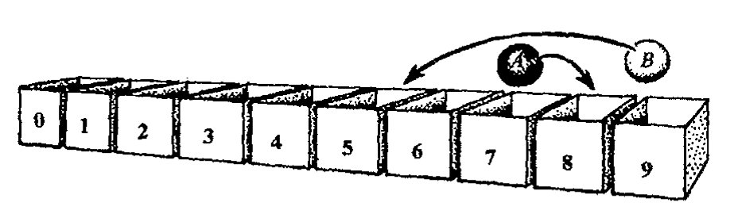
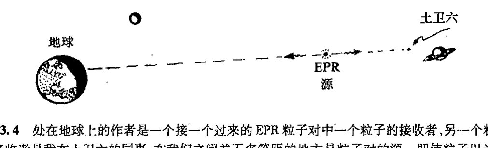
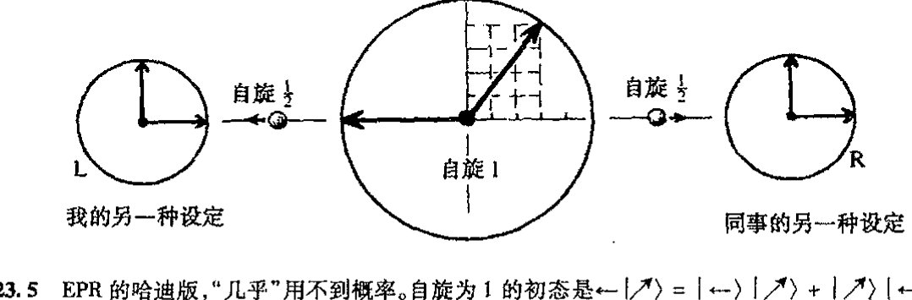
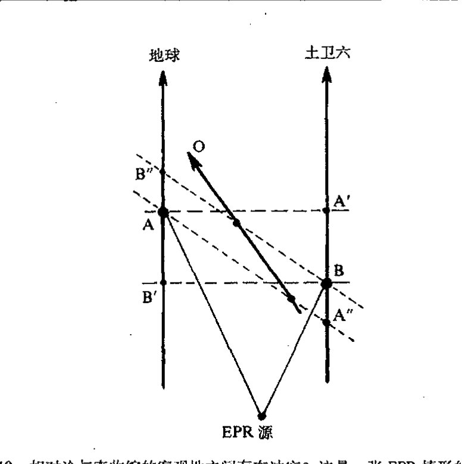

<!-- page 434 -->

第二十三章 纠缠的量子世界

第二十三章

# 纠缠的量子世界

## 23.1 多粒子系统的量子力学

从前两章我们已经看到那些带或不带自旋的单个量子粒子的行为有多神秘，以及为了描述这种行为，神奇的数学形式体系又是如何演变的。但仅仅因为这种形式体系能够描述单粒子或其他孤立体的量子行为，我们就指望它也能用于描述那些包含以不同方式相互作用的多粒子体系，这恐怕不尽合理。但一定意义上，这又是对的——尽管只在某种程度上——因为 [§21.2](chapter_21.md#212-量子哈密顿量) 的一般形式宽泛到足以适用于这一情形。但是，当系统中不止一个粒子时，一些明显是新的面貌出现了。这种新面貌的基本特征就是量子纠缠现象，正是这种现象使得多粒子系统必须被当作一个整体单元来处理，而且它所展现的不同面貌让我们看到了比以往更神秘的量子行为。此外，那些彼此全同的粒子总是自动地纠缠在一起，虽然根据不同的粒子性质，这种纠缠会有两种迥异的方式。

让我们回到前两章所建立的量子系统的数学上来。借以得到量子态矢演化的薛定谔方程的量子哈密顿方法，仍可用于处理可能具有相互作用和自旋的多粒子系统，只是我们需要适当的哈密顿量来具体体现所有这些特性。但现在我们要的不是每个粒子各自的波函数，而是一个描述整个系统的态矢。在位置空间表象下，这个单一的态矢仍可视为波函数 Ψ，但它是所有粒子的所有位置坐标的函数——因此它实际上是粒子系统构形空间上的函数（[§12.1](chapter_12.md#121-为什么要研究高维流形)），它也可能依赖于某些表征自旋态的离散的参数（例如，如果我们像 [§22.8](chapter_22.md#228-自旋和旋量) 那样用二维旋量 Ψ_{AB...F} 来描述自旋粒子，则这些"离散的参数"用来区分不同的分量）。薛定谔方程将告诉我们 Ψ 如何随时间演化，因此 Ψ 还必须依赖于时间参数 t。

标准量子理论的一个明显特点是，多粒子系统除了只有一个时间坐标外，系统中的每个独立粒子都有各自独立的一套位置坐标。这是非相对论量子力学奇特的地方，如果我们将其视为"更完备的"相对论性理论的某种极限近似的话。因为在相对论框架下，空间处理方式本质上等

·415·

<!-- page 435 -->

通向实在之路

同于时间处理方式，因此每个粒子既然有各自的一套空间坐标，它就应当有各自的时间坐标。但普通的量子力学并不是这样，而是所有粒子共有一个时间。

当我们按普通的"非相对论"方式考虑这种物理时，这么做或许是明智的，因为在非相对论物理里，时间是绝对的外生变量，它只是在背景下"滴答"地走着，任何时刻都独立于这个世界里的具体活动。但我们知道，由于相对论的引入，这种图像只是一种近似。一个观察者的所谓"时间"对另一个观察者来说则是空间和时间的混合，反之也一样。普通量子理论要求每个粒子必须有各自的空间坐标，而完全的相对论量子理论还要求有各自的时间坐标。自 20 世纪 20 年代以来，不同的作者就一直都采取这种观点，^1 但似乎没能发展出一套成熟的相对论性理论。容许每个粒子有各自的时间的基本困难在于，每个粒子如果都按各自的时间维各行其是，这样就需要更多的处理才能使我们回到现实世界。

在 [§26.6](chapter_26.md#266-相互作用拉格朗日量和路径积分)，我将引入"路径积分"来处理相对论量子理论，这是一种基于拉格朗日形式体系而非哈密顿形式体系的处理，由此可避开"一个时间/多个空间"问题。但我们也将看到，无论采用什么（已知）方法，都会出现严重的新问题。此外，普通的薛定谔方程本身并不能解决"回到现实"的困难。在我看来，薛定谔方法的这种时空非对称性隐藏着某种仍不为量子图像所表现的东西，但眼下我们还无法顾及这一点。我们将略去这些问题，仅按非相对论量子理论观点来叙述，并采用统一的外部时间概念。但相对论方面的考虑也不会完全忽略，在本章末的 [§23.10](#2310-量子纠缠)，我们将回到这个问题上来。

580 那么，我们如何按照标准的非相对论薛定谔图像来处理多粒子系统呢？如 [§21.2](chapter_21.md#212-量子哈密顿量) 所述，我们有一个单独的哈密顿量，它包含系统内所有粒子的所有动量变量。而在（薛定谔）位置空间表象下，每个动量则代之为关于该粒子位置坐标的偏微分算符。为与其解释相一致，所有这些算符必须作用于同一个波函数，即上述整个系统的那个波函数 Ψ。这个波函数必须是所有粒子的不同位置坐标的函数。

## 23.2 巨大的多粒子系统态空间

上述这些听起来似乎没什么不对，果真如此吗？我们暂且先琢磨一下上面最后一项（看上去简单的）要求的丰富内涵。假设有这样一种情形，每个粒子都有各自的波函数，那么对 n 个标量（即无自旋）粒子，我们需要有 n 个不同的复位置函数。尽管对这 n 个小粒子需要在视觉上发挥一定的想象力，但我们还能够应付自如。（在这些考虑中我略去了时间，一切只取某一时刻下情形。）从直观性考虑，它的图像不像有 n 个不同分量的空间场，而是每个分量本身都可看成是一个分立的"场"。（每个这种分立的场表示一个单粒子的波函数。）我们似乎可以把它看成是 2n 个分量，如果我们讨论实分量的话，因为波函数都是复的。电磁场有 6 个实分量，但请记住——那是 3 个变量的 6 个函数（类似于 3 个复 1 标量波函数）——而且电矢量和磁矢量的场也不难想象！

·416·

<!-- page 436 -->

第二十三章 纠缠的量子世界

我们如何来计算诸如三维空间里一个标量粒子波函数的复标量场的“自由度”呢？这种场的各种可能的“数”是指什么？按 [§16.7](chapter_16.md#167-物理学中无限的大小) 的记号，表达式 $\infty^{a\infty^b}$ 表示的是在 $b$ 维实空间里具有 $a$ 个实分量的自由选定的（光滑）场的自由度。因此，对一个复标量场，$a=2$（因为一个复数相当于两个实数），故自由度为 $\infty^{2\infty^3}$。这只是取某一时刻（即 $t$ 是常数）的场，由于我们考虑的是普通三维空间，故 $b=3$（不是时空总维数 $b=4$）。我们也可以考虑时空情形，这时自由度要受到场方程限制。在波函数情形，限制来自薛定谔方程，它将自由度减少到可由初始三维空间上的初值指定的数目，因此我们仍取 $\infty^{2\infty^3}$ 作为场的自由度。

我们顺便来检查一下无源（无电荷）的自由麦克斯韦场情形。这时我们有普通三维空间里的 6 个实分量，因此，如果我们只取某一固定时刻 $t$ 时的场，并且不考虑麦克斯韦方程，则得到自由度 $\infty^{6\infty^3}$。但麦克斯韦方程意味着初始数据的三维空间必须满足两个限定条件：电场矢量和磁场矢量的散度为零。**[23.1]** 这使得初始数据的三维曲面上的有效自由分量数减少了 2 个，故实际自由度为 $\infty^{4\infty^3}$。

现在我们来考虑 $n$ 个标量粒子的量子力学描述。如果这种描述只涉及 $n$ 个不同的波函数，则自由度是 $\infty^{2n\infty^3}$，因为这是一个三维空间里对每个点取 $n$ 个复数的自由度问题。但在描述 $n$ 个标量粒子的实际量子波函数情形下，我们有的是一个具有 $3n$ 实变量的复函数。这相当于一个 $3n$ 维空间里的复标量场，故自由度为 $\infty^{2\infty^{3n}}$，它是一个极其大的数。

要判断这种增长大到什么程度还真不太容易。我们先来考虑一种只有 10 个点的“玩具”宇宙。为此，将这 10 个点分别标以 **0**，**1**，**2**，**3**，**4**，**5**，**6**，**7**，**8**，**9**。该宇宙中的标量粒子的波函数由这 10 个点中的每一个的复数组成，即 10 个复数 $z_0$，$z_1$，$z_2$，……，$z_9$。所有这些波函数构成的空间是一个 10 个复数维（20 个实数维）的希尔伯特空间 **H**$^{10}$。如果我们归一化波函数，使得这些 $z$ 的模平方的和为 1，则 $|z_6|^2$ 表示位置测量发现粒子处于 **6** 位置的概率，如此等等。

这其实并不荒谬。在实际物理情形下，我们可以有一溜儿 10 个盒子，其中的某个盒子装有电子，见[图 23.1](assets/page437_fig01.jpg)。实验上可以建立起具有这种量子点性质的装置，它们与理论上提出的构建量子计算机的设想紧密相关，这种计算机能够利用上面所考虑的波函数空间的海量资源。

假定这个宇宙中只有两个粒子。当然最好不是同种粒子，理由我会在下面给出。我们暂且称它们为 A 粒子和 B 粒子。每个粒子可以有 10 个不同的可选择位置，这样，这一对粒子就有 100 种可能的不同的配置状态（容许二者置于同一个盒中）。我们需要 100 个不同的复数，譬如说 $z_{00}$，$z_{01}$，…，$z_{09}$，$z_{10}$，$z_{11}$，…，$z_{19}$，$z_{20}$，…，$z_{99}$，来定义波函数，一个复数指派给一种配置。如果我们对其归一化使得所有这些 $z$ 的模平方的和为 1，则 $|z_{38}|^2$ 表示发现 A 粒子处于 **3** 同时 B 粒子处于 **8** 位置的概率。我们处理的是 **H**$^{100}$。假定现在是 3 个不同粒子——A 粒子、B 粒子和 C

**[23.1]** 你能解释这个零吗？回顾一下 [§19.3](chapter_19.md#193-麦克斯韦理论中的守恒律和通量定律) 里所述的四维“散度”概念；这里我们用的是三维空间的散度。提示：见练习 [19.2]。

<!-- page 437 -->

通向实在之路

**图23.1** 我们想象一种只有10个粒子可能位置的“玩具宇宙”，这里用10个盒子来表示这10个位置。图中画出了两个可分辨的粒子，每一个都可以独立地占据任何一个盒子。

粒子——于是波函数由1000个复数 $z_{000}, z_{001}, \cdots, z_{999}$ 组成，态空间为 $\mathbf{H}^{1000}$。如果规则针对的只是3个单个的波函数，那么态空间就只是 $\mathbf{H}^{30}$。对4个不同粒子，我们有 $\mathbf{H}^{10000}$，而对4个单个的波函数，则态空间只是 $\mathbf{H}^{40}$，等等。

回到前面的“$\infty^{a\infty^{3n}}$”记号，我们注意到，上指标“$\infty^3$”指的是欧几里得三维空间 $\mathbb{E}^3$ 里的“点数”。现在这个数字代之为10，即上述玩具宇宙的点数，于是 $\infty^{a\infty^{3n}}$ 变成 $\infty^{a10^n}$（它表示 $(a \times 10^n$ 维实空间里的“点数”），$\mathbb{E}^3$ 里 $n$ 维粒子标量波函数的自由度 $\infty^{2\infty^{3n}}$ 则落实为玩具宇宙里 $n$ 维粒子波函数的自由度 $\infty^{2 \times 10^n}$。这个玩具宇宙里 $n$ 维粒子波函数的复希尔伯特空间是 $\mathbf{H}^{10^n}$，而 $n$ 个离散的一维粒子复波函数的希尔伯特空间则只是 $\mathbf{H}^{10^n}$。因此，$n$ 维粒子波函数是定义在 $2 \times 10^n$ 维空间（即 $10^n$ 维复希尔伯特空间）上的，而不是 $n$ 个离散波函数的 $20n$ 维空间。例如，对8个粒子，维数是200 000 000维而不只是160维。

## 23.3 量子纠缠：贝尔不等式

所有这些额外信息起什么作用呢？我们说，它表示粒子间的所谓“纠缠”关系。这个概念最早是由薛定谔明确提出来的（1935b）。所谓粒子间的“纠缠”，是指一种令人非常迷惑但又实际观察得到的现象，即所谓爱因斯坦-波多尔斯基-罗森（Einstein-Podolski-Rosen, EPR）效应。² 要从实验上演示这种相当奇妙的量子效应是一件非常困难的事。值得注意的是，就多粒子系统而言，我们似乎得和这个问题背后几乎关于波函数全部“信息”的那个深奥的谜团打交道！稍后（[§23.6](#236-量子纠缠的两个谜团)）我再来讨论这个谜团。在我看来，这个谜团要告诉我们的，是当前量子形式体系应当迈向一个什么样的新方向。如果情况确实如此，那么它就必定能够向我们展示有关量子计算³ 的潜在力量——这是一个当前极为活跃的、旨在开发利用这些纠缠关系背后无穷的“信息”资源的研究领域。

那么何谓量子纠缠？何谓EPR效应呢？如果我们只就有限维情形下的自旋态来考虑，问题将变得十分清楚。最简单的EPR情形是戴维·玻姆（David Bohm, 1951）给出的。这里，我们设想有一对自旋 $\frac{1}{2}$ 的粒子，譬如说，粒子 $\mathbf{P}_\mathbf{L}$ 和粒子 $\mathbf{P}_\mathbf{R}$，起初它们一起组成总自旋为0的态，然后

· 418 ·

<!-- page 438 -->

第二十三章 纠缠的量子世界

彼此分离，分别向左和向右行进相当远的距离到达探测器 L 和 R（见[图 23.2](assets/page438_fig01.jpg)）。假定每个探测器都能测量沿某个方向行进的粒子的自旋。我们来看看是否有可能利用某种经典性质的模型重新得到量子力学的期望值，在这种模型里，粒子被当作一种彼此不相关的、独立的类经典粒子，二者分离后就再也无法彼此联系。

但北爱尔兰物理学家约翰·贝尔（John S. Bell）的著名定理告诉我们，要按这种方式重建量子理论的期望是不可能的。贝尔导出了一个关于两个分开进行的物理测量的结果的联合概率的不等式⁴，它与量子力学的期望相悖，但却是任何描述两个独立粒子物理上分离后行为的模型所必须满足的条件。因此，如果贝尔不等式不成立，就说明存在某些基本的量子理论效应——即两 584 个物理上分离的粒子间的量子纠缠效应——它们无法用经典的独立粒子模型来解释。

**图 23.2** EPR–Bohm 思想实验。一对自旋 $\frac{1}{2}$ 粒子 $\mathbf{P}_L$ 和 $\mathbf{P}_R$ 起初处于总自旋为 0 的态，然后分别向左和向右运动，到达相距很远的两个探测器 L 和 R，每个探测器设定为沿某个方向测量粒子的自旋，但这个方向只能由处于飞行中的粒子来定。贝尔定理告诉我们，不可能存在一种可用来重建量子力学期望值的模型，其中两个粒子可以表现得像经典粒子那样，一旦分离，就再也没有联系了。

背离贝尔不等式的各种惊人的例子已见诸文献。⁵ 其中有些属"非概率型贝尔不等式"⁶ 性质的特别值得注意，它们仅涉及 YES/NO 问题，无需用到概率——或者说，我们只需考虑完全确定的概率 0（"总不"）和 1（"总是"）情形。这里我只给出两种量子粒子结果和单个粒子结果之间明显矛盾的贝尔不等式。二者都用到一对自旋 $\frac{1}{2}$ 的粒子，它们分别射向设置在左边的探测器 L 和右边的探测器 R。第一个例子来源于亨利·斯塔普（Henry Stapp, 1971, 1979），这是直接论证玻姆原初给出的 EPR 的例子，其中需要检验实际的概率值。第二个例子出自卢希恩·哈迪（Lucien Hardy 1992, 1993），"几乎"不涉及概率，但稍稍多绕了一些弯。

在叙述这些例子之前，我要引入更多的（狄拉克）记号。假定我们的量子系统由两部分 $|\psi\rangle$ 和 $|\phi\rangle$ 组成，它们彼此独立。于是，如果我们考虑的量子态由这两部分共同组成，我们就记为

$$|\psi\rangle|\phi\rangle。$$

它仍是一个单态，我们可以写成方程 $|\chi\rangle = |\psi\rangle|\psi\rangle$ 来表达这一事实。这里用的积是代数学家的所谓张量积，它满足法则：$(z|\psi\rangle)|\phi\rangle = z(|\psi\rangle|\phi\rangle) = |\psi\rangle(z|\phi\rangle)$，$(|\theta\rangle + |\psi\rangle)|\phi\rangle = |\theta\rangle|\phi\rangle + |\psi\rangle|\phi\rangle$，$|\psi\rangle(|\theta\rangle + |\phi\rangle) = |\psi\rangle|\theta\rangle + |\psi\rangle|\phi\rangle$。数学文献里，张量积运算通常用 $\otimes$ 来表示（亦见 [§13.7](chapter_13.md#137-张量表示空间可约性)），故积 $|\psi\rangle|\phi\rangle$ 也可以写成 $|\psi\rangle \otimes |\phi\rangle$。

用符号 $\otimes$ 来联系积所属的（希尔伯特）空间是方便的。就是说，如果 $|\psi\rangle$ 属于 $\mathbf{H}^p$，$|\phi\rangle$ 属于 $\mathbf{H}^q$，则积 $|\psi\rangle|\phi\rangle$ 属于 $\mathbf{H}^p \otimes \mathbf{H}^q$。$\mathbf{H}^p \otimes \mathbf{H}^q$ 的维数是其两个因子维数的积，故也可写成 $\mathbf{H}^p \otimes \mathbf{H}^q = \mathbf{H}^{pq}$。

· 419 ·

<!-- page 439 -->

通向实在之路

585 这里 $p$ 和 $q$ 都可以是 $\infty$，此时积也是 $\infty$。$\mathbf{H}^p \otimes \mathbf{H}^q$ 中只有很少一部分组成型 $|\psi\rangle|\phi\rangle$ 的元素（假定 $p, q > 1$），这里 $|\psi\rangle$ 属于 $\mathbf{H}^p$，$|\psi\rangle$ 属于 $\mathbf{H}^q$。这些是非纠缠态。$\mathbf{H}^p \otimes \mathbf{H}^q$ 的一般元素是这些非纠缠态的线性组合（如果 $p$ 和 $q$ 都是无穷大，就可能涉及无限求和和积分）。^7^ 但请记住，纠缠的概念正是取决于完整的希尔伯特空间 $\mathbf{H}^{pq}$ 分裂为某种 $\mathbf{H}^p \otimes \mathbf{H}^q$ 形式。（对一般的希尔伯特空间 $\mathbf{H}^{pq}$，所有分裂形式都是平权的，不存在一种更优越的分裂形式。代数上讲，可以有多种方式将 $\mathbf{H}^n$ 表示为张量积，只要 $n$ 是一个合数。）在我们所感兴趣的纠缠概念情形下，物理上特别有意义的分裂是 EPR 所说的那种两个"单"粒子间分开很大距离时产生的情形。

在这种情形下，抽象指标形式（[§12.8](chapter_12.md#128-张量抽象指标记法和图示记法)）经常是有用的。右矢 $|\psi\rangle$ 可写成带上抽象指标的 $\psi^\alpha$，其相应的（复共轭）左矢 $\langle\psi|$ 则写成带下抽象指标的 $\bar{\psi}_\alpha$。整个尖括号 $\langle\psi|\phi\rangle$ 为 $\bar{\psi}_\alpha \phi^\alpha$，而 $\langle\psi|\mathbf{Q}|\phi\rangle$ 则写成 $\bar{\psi}_\alpha Q^\alpha{}_\beta \phi^\beta$。$\psi^\alpha$ 和 $\phi^\beta$ 的张量积 $|\psi\rangle|\phi\rangle$ 可以写成 $\psi^\alpha \phi^\beta$。非纠缠态总是按这种方式分裂。但一般的（可能是纠缠的）态可以简单地取 $\phi^{\alpha\beta}$ 形式。在本章稍后部分我们会看到这种记号的特殊用途。

## 23.4 玻姆型 EPR 实验

现在我们回到玻姆型 EPR 问题上来。考虑测量前的初态。两个离散的自旋 $\frac{1}{2}$ 的粒子待在一起时，由于角动量守恒，必定构成自旋为 0 的态。因此，对每一个粒子的自旋，我们需要一种总自旋为 0 的基态的组合。这可由自旋为 0 的态 $|\Omega\rangle$ 按下式给出

$$|\Omega\rangle = |\uparrow\rangle|\downarrow\rangle - |\downarrow\rangle|\uparrow\rangle$$

（这里我并不急于对态进行归一化）。*^{[23.2]}，**^{[23.3]} 文献中，我们经常看到这样的写法：$|\uparrow \text{L}\rangle$ 586 $|\downarrow \text{R}\rangle - |\downarrow \text{L}\rangle|\uparrow \text{R}\rangle$。这是要清楚写出哪个指的是左旋粒子、哪个是右旋粒子。但我认为无此必要，因为（i）记号只是标出波函数的自旋，不涉及粒子的位置或动量或其他什么，故讨论中自旋的方向是固定的；（ii）由于张量积不对易，我们可以毫不含糊地辨别出积的"左右边"。我约定的是：积的左边项指左旋粒子，右边项指右旋粒子。那些对此感到困惑的读者不妨在以后的讨论中重将 L 和 R 置于右矢中，如果他们愿意的话。

由于我们不可能将 $|\Omega\rangle$ 写成 $|\alpha\rangle$ 在左边 $|\beta\rangle$ 在右边的 $|\alpha\rangle|\beta\rangle$ 形式，***^{[23.4]} 因此上述写法就是纠缠态的一个明显的例子。我们来看看这种纠缠态究竟意味着什么。现在，我设想自己处于左边

---

* [23.2] 如果 $|\uparrow\rangle$ 和 $|\downarrow\rangle$ 是归一化的，则需要什么样的因子才能使 $|\Omega\rangle$ 归一化？（你可以假定 $\||\alpha\rangle|\beta\rangle\| = \|\alpha\| \cdot \|\beta\|$。）
* [23.3] 你能看出为什么它有自旋 0 吗？提示：方法是用指标记号证明，任何这种反对称组合本质上一定是一个标量，记住，自旋空间是二维的。
* [23.4] 为什么不能？但如果 $|\alpha\rangle$ 和 $|\beta\rangle$ 都是非定域的，请找出一种可将 $|\Omega\rangle$ 写成 $|\alpha\rangle|\beta\rangle$ 形式的方法。

· 420 ·

<!-- page 440 -->

第二十三章　纠缠的量子世界

（即处于 L），并在"上"方向↑（↑表 YES，↓表 NO）对左旋粒子 $P_L$ 的自旋进行测量。如果我得到答案 YES，说明测量将整个态 $|\Omega\rangle$ 投影到 $|\uparrow\rangle|\downarrow\rangle$，如果答案是 NO，则说明测量将整个态 $|\Omega\rangle$ 投影到 $(-)|\downarrow\rangle|\uparrow\rangle$。这些结果都是非纠缠的——除非标准的 U 演化告诉我们，现在 $P_L$ 已与测量仪器 L 本身纠缠到一起。问题很清楚，如果我们得到 YES，那么我的处在右边探测器 R 的同事将得到自旋态 $|\downarrow\rangle$；而如果我的测量结果是 NO，那么他得到的则是 $|\uparrow\rangle$。如果接下来在 $P_R$ 进行"上"测量，我的同事仍将得到与我相反的结果。

这里的结果与探测器上/下取向的选择无关。不论我选那个方向来测量，譬如说 $\swarrow$，那么如果我的同事也选择 $\swarrow$ 方向，则结果必定是相反的。从自旋 0 的旋转不变性看，这是很清楚的，但它启发我们直接采用代数计算以确认下式（其中 $\propto$ 是指"等于或相差一个非零因子"，见 [§12.7](chapter_12.md#127-体积元求和规则)）：

$$|\Omega\rangle \propto |\swarrow\rangle|\nearrow\rangle - |\nearrow\rangle|\swarrow\rangle,$$

这里 $\nearrow$ 的方向与 $\swarrow$ 相反。（注意：如果 $|\swarrow\rangle = a|\uparrow\rangle + b|\downarrow\rangle$，则 $|\nearrow\rangle \propto \bar{b}|\uparrow\rangle - \bar{a}|\downarrow\rangle$。）*^{[23.5]}

从这里我们还可以得出 YY、YN、NY 和 NN（Y 为 YES 的缩写，N 为 NO 的缩写）情形下的联合概率，如果我和我的同事选择不同方向来测量自旋的话。假定我取 $\nwarrow$ 的方向而我的同事取 $\nearrow$ 方向，这里 $\nwarrow$ 和 $\nearrow$ 的夹角为 $\theta$。那么，由 [§22.9](chapter_22.md#229-二态系统的黎曼球面) 给出的概率值（见[图 22.11](assets/page419_fig01.jpg)），我们得到联合概率

$$\text{相同：}\frac{1}{2}(1-\cos\theta)\text{，相异：}\frac{1}{2}(1+\cos\theta)$$

（这里"相同"是指 YY 或 NN，"相异"是指 YN 或 NY）。

现在，我们来考虑斯塔普的例子。实验安排使得我自己的仪器既可以测量垂直方向↑的自旋，也可以测量水平方向→（垂直于↑）的自旋。而我同事的仪器则安排得既可以测量 $\nearrow$ 方向（位于→和↑构成的平面上，与二者成 45°）的自旋，也可以测量 $\nwarrow$ 方向（位于→和↑的同一个平面上，但与↑成 45°，与→成 135°）的自旋（[图 23.3](assets/page440_fig01.jpg)）。在我的测量方向与同事的成 45°的方向上，有 3 种可能性，而在 135°方向上则只有一种可能性。在 45°的方向上得到"相同"的概率小于 15%，而在 135°方向上则大于 85%。

图 23.3　贝尔不等式的一个例子：斯塔普对 EPR-Bohm 粒子对的偏振方向安排。起初，我们取自旋测量的方向如图中实箭头所示，但随后，其中的一个或两个测量方向都转到了虚箭头所示的方向。量子联合概率不可能通过类经典粒子对模型来得出，这种经典粒子对表现为一种无信息交流的独立实体，它们对将进行的自旋测量的方向毫无预见。

---

*^{[23.5]} 证明括号里的式子，对 $|\Omega\rangle$ 通过直接计算来验证这个表达式。提示：利用练习 [22.26] 的结果。

· 421 ·

<!-- page 441 -->

通向实在之路

我们假定，仪器取什么方向进行测量可以等到粒子处于飞行中再定。现在，假定我的同事处于土卫六（土星的一颗卫星）位置，我们之间的某处有一粒子源，距两端的距离即使以光速行走也得三刻钟时间！见[图 23.4](assets/page441_fig01.jpg)。粒子是不"知道"我和我的同事（各自独立地）取什么方向的。

**图 23.4** 处在地球上的作者是一个接一个过来的 EPR 粒子对中一个粒子的接收者，另一个粒子的接收者是我在土卫六的同事，在我们之间差不多等距的地方是粒子对的源。即使粒子以光速行走，也得大约 45 分钟后才能决定探测器的取向。

假定我和我的同事各自收到一束看似随机取向的粒子时，我取 ↑ 而我的同事取 ↗ 方向。粒子的到来一次一个，而且每一个都是由源发出的 EPR - 玻姆对中的一个，这一对粒子一个冲我而来另一个奔向我的同事。当我们比较记录时（这大概是若干年后我的同事回来后的事了），会发现，结果"相同"的小于 15%，这与上述预期一致。

现在，假定粒子仍不知道我们如何设定检测仪的取向，而且表现得就像独立无关的（类经典）粒子，如果在测量前的最后时刻我突然改主意取 → 方向测量，那么，我们得到的实际测量结果没有什么不同。如果我这么做了，那么——因为方向间夹角仍是 45°——仍将只有不到 15% 的测量结果是"相同"的。另一方面，如果我没改主意，而是我的同事在最后时刻将测量方向由 ↗ 转到 ↖。由于他的改变并不影响我在初始 ↑ 方向上的测量，因此他在新方向 ↖ 上测得的结果仍将只有不到 15% 的与我在初始 ↑ 方向上的结果"相同"。

但假定我们双方都在最后一刻改变取向，即我的测量方向转到 →，而他的转到 ↖。于是测量的方向间夹角为 135°，此时量子力学的期望认为，结果"相同"的概率应当高于 85%。那么每一对探测器可能的取向提供的粒子对的联合概率是否与此一致呢？我们来看看。粒子对必须面对的是 4 种可能的探测器取向组合中的一种，并对每一种取向组合都给出正确的量子力学概率。我们知道，我的仪器转到 → 测得的结果与我同事在初始 ↗ 方向上测得的结果"相同"的概率不到 15%。我取 ↑ 方向的、我同事取 ↖ 方向的也都不到 15%。如果在 →，↖ 情形下粒子对得到"相同的"结果，那么在所有 →，↗、↑，↗、↑，↖ 三种情形下的结果就不可能"相异"。因此，在这三种可能的取向组合中至少有一种必为"相同"的结果。但它在每一种取向组合下发生的概率小于 15%，而且只有这三种，因此在我们取 →，↖ 的情形下，"相同"的概率不会超过 15% + 15% + 15% = 45%。（实际上，"相同"的百分比比这还要小，因为我这里考虑的是所有三种情形下都得到"相同"结果。）但 45% 怎么说也与 85% 相去甚远，因此，该结果与粒子对的类经典假定明显矛盾。

有些人可能担心，这种论证是建立在"好像会但实际上不可能"发生的测量假定上的（哲学家称之为"反事实条件陈述"）。但这并不重要。这里的关键在于，我们假定粒子在离开源以后其行

· 422 ·

<!-- page 442 -->

第二十三章 纠缠的量子世界

为是彼此独立的，并且不论探测器以什么取向组合进行探测，都应得到正确的联合量子力学概率。要点是粒子必须给出量子力学的期望值。我们发现，这些期望值不可能分解为两个粒子单独的期望值。要得到与量子力学答案相一致的唯一办法就是以某种方式将二者"关联"起来，直到二者之一再次被测量。这种神秘的"关联"就是量子纠缠。

显然不可能存在如此遥远距离上的这种性质的实验。但实际进行的许多 EPR 实验本质上与此类似（实际使用的是光子的偏振态，而不是自旋 $\frac{1}{2}$ 粒子的自旋取向，但二者区别并不重要）。由此得到的实验结果与量子力学的（而不是普通意义上的）期望值总相一致！虽然在地球－土星距离上的这种直接的量子力学纠缠态还没有观察到，但最近的实验结果表明，在大于 15 千米的距离上，贝尔不等式仍不成立。⁸

## 23.5 哈迪的 EPR 事例：几乎与概率无关

现在我们来研究哈迪给出的漂亮的例子。⁹ 我和我的同事仍做自旋测量，我像以前一样在 ↑ 和 →（垂直和水平）上作选择，但我的同事现在也在这二者之间作选择，只是完全独立于我。另一个重要的新颖之处是粒子对的源不是按总自旋为 0 的要求来发射，而是按自旋为 1 的特定态来发射。我将这种初态取为一种马约拉纳描述 $|\leftarrow\nwarrow\rangle$（[§22.10](chapter_22.md#2210-高自旋马约拉纳绘景)，[图 22.14](assets/page422_fig01.jpg)），这里 $\nwarrow$ 的方向处于 ↑ 和 → 所张平面的 $\frac{1}{4}$ 平面内，倾角 $\theta$ 的斜率为 $\frac{4}{3}$（→和 $\nwarrow$ 之间的倾角 $\theta$ 满足 $\cos\theta=3/5$）；←的方向与→相反，见[图 22.5](assets/page411_fig01.jpg)。我们可以将这个态表示为*⁽²³·⁶⁾

$$|\leftarrow\nwarrow\rangle = |\leftarrow\rangle|\nwarrow\rangle + |\nwarrow\rangle|\leftarrow\rangle$$

这里忽略了总因子。这个态有一个重要特点，就是它不垂直于

$$|\downarrow\rangle|\downarrow\rangle$$

（这里 ↓ 与 ↑ 相反），但与下面的每一个正交**⁽²³·⁷⁾

$$|\downarrow\rangle|\leftarrow\rangle, |\leftarrow\rangle|\downarrow\rangle, |\rightarrow\rangle|\rightarrow\rangle。$$

这些正交关系分别表示下述 YES/NO 结果 (0)，(1)，(2) 和 (3)：

(0) 有时我在 ↑ 测量时得到 NO，而我的同事在 ↑ 测量时也得到 NO；

(1) 如果我在 ↑ 测量时得到 NO，那么我的同事在 → 测量时必定得到 YES；

(2) 如果我的同事在 ↑ 测量时也得到 NO，那么我在 → 测量时必定得到 YES；

(3) 如果我的同事在 → 测量时也得到 YES，那么我在 → 测量时就不可能得到 YES。

---

\* [23.6] 为什么？

\*\* [23.7] 看看你能否证明这些式子。提示：用 [§22.9](chapter_22.md#229-二态系统的黎曼球面) 里的坐标和/或几何描述。

· 423 ·

<!-- page 443 -->

通向实在之路

**图23.5** EPR的哈迪版，“几乎”用不到概率。自旋为1的初态是←|↗⟩ = |←⟩|↗⟩ + |↗⟩|←⟩，这里↗的方向处于↑和→所张平面的1/4平面内，倾角的斜率为4/3。每个探测器取垂直方向或水平方向来测量粒子的自旋。

可以告诉读者，在结果(0)情形下，实验给出的实际量子力学概率正好是1/12，**[23.8]** 即1/12 = 8.33%，而哈迪经过适当调整后的优化值约为9.017%。^10

现在我可以清楚地说明，为什么在两个粒子为单个的不对易粒子、且不知道会以何种测量方式进行测量的条件下，不可能有结果(0), …, (3)。因为对于结果(0)，这就要求两个粒子（非对易、无先兆）中每一个都必须准备好提供NO结果，而且每次测量都需如此（事实上一次只有1/12的概率），直到最终我和我的同事同时进行↑测量。此外，粒子的准备还必须经过精心地事先安排，即在这些场合（我们同时做↑测量时同时得到NO结果）下，如果我们中的一个做的是→测量，那么实验必须能确定地给出YES结果，以使不与结果(1)和(2)冲突。要得到结果(3)就更不可能，因为这要求我和我的同事恰巧都做→测量，而得到的结果却是违禁的YES, YES。

## 23.6 量子纠缠的两个谜团

我认为，量子纠缠十分清楚地凸现出两个谜团，每个的答案都有完全不同（尽管相互关联）的特点。第一个谜团是这一现象本身。我们怎么才能正确看待量子纠缠，并从我们能够把握的概念上来理解它呢？只有解决了这个问题我们才能将它纳入我们现实宇宙中的重要的一部分。第二个谜团是对前一个的某种补充。因为按照量子力学，纠缠是这样一种独特现象——我们知道，绝大多数量子态其实都是纠缠态——为什么我们的直接经验几乎觉察不到这种现象？为什么这些独特的纠缠效应不是每次都呈现在我们面前？我不认为这第二个谜团已受到应有的重视，人们往往都是把注意力集中在第一个谜团上。

让我们从第二个谜团开始，到时候自然会转向前一个问题。首先要说的是，纠缠无处不在。

---

**[23.8]** 证明这一点。

·424·

<!-- page 444 -->

第二十三章　纠缠的量子世界

似乎宇宙间的每一个粒子最终都与其他粒子纠缠在一起。也许它们一直就这么纠缠着？为什么我们不能像感受（几乎所有）经典粒子那样感受到纠缠的混乱？系统的薛定谔演化解决不了这个问题，而且，系统演化一经开始，随着时间流逝，会有越来越多的东西加入进来，问题只会越来越复杂。从希尔伯特空间 **H** 上看，一般认为薛定谔方程（**U** 过程）本身无助于解决这些困难。如果我们从 **H** 的相对来说无纠缠的部分开始，那么薛定谔演化（通常）将立即置我们于纠缠之中，并且没有任何途径（甚至提示）使我们逃离这一海藻般密布的纠缠态的海洋（[图 23.6](assets/page444_fig01.jpg)）。

**图 23.6**　一旦离开了初始的非纠缠态（右下端的石头所示），薛定谔演化几乎总是使得态变得越来越纠缠（如充满海藻的洋面所示）。但为什么我们日常感觉不到这种纠缠呢？

但我们每天的生活还是这么井井有条，根本感觉不到这些纠缠的存在，为什么呢？如果我们从量子理论的 **U** 过程得不到答案，那就只好诉诸 **R** 过程了。事实上，在我们考虑 EPR 效应时已经看到了希望的苗头。我们设想对一对 EPR 粒子做一次测量，其中之一奔向我在土卫六的同事。如果我先测量，而且这一测量一经开始就剥夺了去往他那里的粒子的与我这个粒子发生纠缠的自由，此后一段时间（直到我的同事测到结果）里，粒子有它自己的态矢，且不受同伴粒子的影响。因此，似乎正是测量引起纠缠。事实的确如此么？解决这种量子纠缠现象的答案果真就是 **R** 过程么？

我认为确实如此，至少在我们根据量子力学方法考虑问题时是如此。这一点与我们如何建立量子实验有关。在前面的 EPR 验证实验中，我们要求粒子对必须处于特定的态：在斯塔普情形下是自旋为 0 的态，在哈迪情形下是自旋为 1 的态。仅用 **U** 过程我们如何能保证粒子不会与周边的其他东西发生纠缠呢？我认为，要保证态不受各种不希望出现的纠缠的干扰，那么测量的某种“性质”就始终是建立量子实验的基本要素。我并不是要暗示实验者通过精心安排测量就可以做到这一点。在我看来，大自然本身就一直在实施着 **R** 过程作用，根本无需实验者的刻意安排或“自觉的观察者”的任何干涉。

我正步入争论之中，我在这些问题上的立场且容后述（[§30.9](chapter_30.md#309-更激进的观点)~13）。但这个问题怎么在“传统的”量子力学框架下处理呢？“实践中”物理学家们总是假定这些与外部世界的纠缠可以忽略。否则无论是经典力学还是传统量子力学就皆不足信了。这种观点似乎认为，所有纠缠都可以某种方式“平均掉”，因此不必在实际应用中考虑。但我还没看到有哪种令人信服的证据可以说明这一点。恐怕不是平均掉，而是这么一种情形：正像我们所知的宇宙，那些不取决于宇宙中其他众多存在物的事情正变得越来越少，这些个体甚至无法确定其在宇宙中的大致的位置。如果我们将这个问题与在量子力学解释中具有中心地位的 **U/R** 悖论割裂开来处理，我是看不到有什么出路。

但是对这个宇宙中已无处不在的纠缠问题，我们必须将它与下述更广泛的问题结合起来考

· 425 ·

<!-- page 445 -->

通向实在之路

虑：一方面，为什么 **U** 处理对足够简单的系统会这么有效，而另一方面，我们却不得不放弃 **U** 转而一次次地求助于 **R** 过程？不只是为什么，而且这一切是何时和怎么开始的？按 2003 年度诺贝尔获奖者莱格特（Anthony Leggett, 1938～ ）的话说，这是个测量问题或（更准确地说）是个测量悖论。我们在第 29 章再回到这个问题上来。

我还没完成纠缠所呈现的另一些谜团。其中的一些必须涉及相对论要求下的纠缠系统的测量，这是因为对纠缠系统某一部分的测量必然要影响到另一部分过程的同时性，正如我们在第 17 章看到的，如果我们要坚持相对性原理，我们就不应当支持这种同时性。在我展开这个问题之前，我先来说说纠缠的另一个特性。这个性质要比前述的那些更为独特，甚至测量都难以介入。此外，这还是个独立于我们迄今所述的量子力学性质的新的性质。我指的是量子力学处理全同粒子体系的方式。

## 23.7　玻色子和费米子

还记得"玩具宇宙"吧？我们正好有 10 个不同的位置（分别标以 **0, 1, 2, …, 9**）可用于放置粒子。当我们考虑这个宇宙有不止一个粒子时，我得小心地要求这些粒子不能是"同一种粒子"，我称它们是"A 粒子"和"B 粒子"，等等，而不说"两个电子"或类似的称谓。其原因在于，量子力学是按完全不同于我们以往所讨论的程序来处理大自然的实际粒子的。事实上，我们必须在此对两种截然不同的处理作一区分！其中的一种程序用于所谓玻色子粒子，另一种用于费米子。玻色子是具有整数自旋（即以 ℏ 为单位，自旋为 0, 1, 2, …）的粒子，费米子则是具有半整数自旋 $\frac{1}{2}$, $\frac{3}{2}$, $\frac{5}{2}$, $\frac{7}{2}$, …的粒子。（这种相伴关系出自著名的数学定理，在量子场论里，我们称它为自旋统计定理，见 [§26.2](chapter_26.md#262-产生算符和湮没算符)。）复合粒子，像原子核或整个原子，或单个的强子如质子或中子（视为由夸克组成），也可以在适当程度上当作单个的玻色子或费米子。因此，光子是玻色子，介子（π 介子、K 介子等）、负责传递弱作用的粒子（W 和 Z 粒子）和传递强作用的胶子也都是。明显属复合的 α 粒子（2 个质子 + 2 个中子）、氘粒子（1 个质子 + 1 个中子）等等行为上接近玻色子。另一方面，电子、质子、中子，它们的组分夸克、中微子、μ 子和许多其他粒子则属费米子。费米子的波函数是 [§11.3](chapter_11.md#113-四元数几何) 所说的自旋体（比较 [§22.8](chapter_22.md#228-自旋和旋量)），而玻色子则不是。

为了能够真正区别玻色子和费米子，我们再回到标有 **0, 1, 2, …, 9** 恰好 10 个点的玩具宇宙上来。每个单粒子的波函数相当于复数 $z_0, z_1, z_2, \cdots, z_9$ 的一个集合，每一对可区分粒子的波函数相当于复数 $z_{00}, z_{01}, \cdots, z_{99}$ 的一个集合，三个这种粒子的波函数相当于复数 $z_{000}, z_{001}, \cdots, z_{999}$ 的一个集合，等等。但对于一对玻色子，我们要求复数 $z_{ij}$ 的集合关于指标对称：

$$z_{ij} = z_{ji},$$

· 426 ·

<!-- page 446 -->

第二十三章 纠缠的量子世界

故举例来说有 $z_{38} = z_{83}$。即是说，就"波函数"而言，哪个粒子处于 **3** 位置上，哪个粒子处于 **8** 位置上，这并无区别。重要的是存在这么一个占据了 **3** 和 **8** 两个位置的粒子对。注意，一对玻色子可以同处于一个位置上，例如 $z_{33}$ 就是两个玻色子同处于位置 **3** 的复权重因子。我们看到，将（无序）粒子对置于这 10 个位置上仅有 $\frac{1}{2}(10 \times 11) = 55$ 种可分辨方式，我们只需要这么多个复数（即 $\mathbf{H}^{55}$ 而非 $\mathbf{H}^{100}$）。对三个全同玻色子，我们有关于所有三个变元的对称性：

$$z_{ijk} = z_{jik} = z_{jki} = z_{kji} = z_{kij} = z_{ikj},$$

因此，我们需要 $\frac{1}{6}(10 \times 11 \times 12) = 220$ 个复数来定义态：即 $\mathbf{H}^{220}$ 而非 $\mathbf{H}^{1000}$ 里的一个元素。对 $n$ 个全同玻色子，这个数字是 $(9+n)!/9!\ n!$，即有这么多个独立复数 $z_{ij\ldots m}$，它们关于指标对称（记号见 §§ 12.4, 7 和 § 14.7）：

$$z_{ij\ldots m} = z_{(ij\ldots m)}。$$

现在我们来考虑费米子。它与玻色子的区别在于，费米子的波函数要求对变元反对称，

$$z_{ij} = -z_{ji},$$

$$z_{ijk} = -z_{jik} = z_{jki} = -z_{kji} = z_{kij} = -z_{ikj},$$

$$z_{ij\ldots m} = z_{[ij\ldots m]},$$

因此，对两个全同费米子，我们有 $\frac{1}{2}(10 \times 9) = 45$ 个复数；对 3 个全同费米子，我们有 $\frac{1}{6}(10 \times 9 \times 8) = 120$ 个复数；对 $n$ 个全同费米子，这个数字是 $10!/n!\ (10-n)!$。**[23.9]** 计数的差异源自我们不容许两个费米子处于同一个位置，因为反对称意味着复权重 $z\cdots$ 在下述情形中必须为零：$z_{33} = 0$，$z_{474} = 0$，等等。

注意，当玩具宇宙里有多于 5 个全同费米子时，这个数字又会减小。当我们有 10 个费米子时，则只有一种可能的态，我们的玩具宇宙中不可能有超过 10 个全同的费米子。在这个模型里，我们看到了量子物理里一条重要的原理，即泡利不相容原理。它告诉我们，两个全同费米子不可能共处一个态（这是费米波函数的反对称性一个特征）。固体材料不会塌缩根本原因就在于这条原理。通常的固体物质都是由电子、质子、中子这样的费米子组成的。由于泡利原理，它们必须"彼此不处于同一个态"。

玻色子则完全不同。似乎它"更喜欢"处于同一个态。（当我们将不同的玻色子态的计数与相应的不同的经典态进行比较时，就会看出这种纯粹的统计效应。）在温度非常低的情形下，这种效应会变得极为重要，此时将发生所谓玻色–爱因斯坦凝聚，就是大部分粒子集聚同一个态。超流体是这方面的一个例子，激光也与此有关。在超导体情形，电子有一种"配对"方式，这些电子对表现得就像单个的玻色子。某些非常重要但并不直观的量子力学应用就来自于这种"集体"现象。

---

**[23.9]** 对玻色子和费米子情形解释这些数。

· 427 ·

<!-- page 447 -->

通向实在之路

## 23.8 玻色子和费米子的量子态

虽然我是在"玩具宇宙"里讲述玻色子和费米子的对称和反对称要求，但普通空间里实际的波色子/费米子集群的对称和反对称要求本质上是一样的。波函数是空间一系列点 **u**, **v**, …, **y** 以及包含每个点的（旋量或张量）指标群的不同的离散参数 $u, v, \cdots, y$ 的函数。我们首先要问，对于一对全同玻色子，其波函数 $\psi$ 像什么样子。答案是，我们要求这个函数 $\psi = \psi(\mathbf{u}, u; \mathbf{v}, v)$ 必须是粒子交换条件下对称的：

$$\psi(\mathbf{u}, u; \mathbf{v}, v) = \psi(\mathbf{v}, v; \mathbf{u}, u)。$$

对三个全同玻色子，波函数应当是关于这三个粒子排列对称的：

$$\psi(\mathbf{u}, u; \mathbf{v}, v; \mathbf{w}, w) = \psi(\mathbf{v}, v; \mathbf{u}, u; \mathbf{w}, w) = \psi(\mathbf{v}, v; \mathbf{w}, w; \mathbf{u}, u) = \cdots,$$

等等。

对费米子情形，这些关系代之为粒子交换下反对称：

$$\psi(\mathbf{u}, u; \mathbf{v}, v) = -\psi(\mathbf{v}, v; \mathbf{u}, u)。$$

$$\psi(\mathbf{u}, u; \mathbf{v}, v; \mathbf{w}, w) = -\psi(\mathbf{v}, v; \mathbf{u}, u; \mathbf{w}, w) = \psi(\mathbf{v}, v; \mathbf{w}, w; \mathbf{u}, u) = \cdots,$$

等等。注意，在每种情形下，粒子的自旋态（由离散变量 $u, v, \cdots$ 刻画）必须在粒子交换时保持不变。这意味着，在运用泡利不相容原理时，只有在自旋态相同而且位置态也相同时，我们才认为态是全同的。这在化学上很重要，例如，两个电子只有在它们的自旋相反时才能共处同一个轨道（[图 24.2](assets/page466_fig01.jpg)）。

这个地方用 [§23.3](#233-量子纠缠贝尔不等式) 所述的态的（抽象）指标记号（也可以用 [§12.8](chapter_12.md#128-张量抽象指标记法和图示记法) 描述的图示记号，见图 26.1）最合适了。对此我们可以用记号 $\psi^\alpha$ 表示特定粒子（用上标 $\alpha$ 表示）的波函数，$\phi^\beta$ 表示第二个粒子（用上标 $\beta$ 表示）的波函数，等等。如果粒子不全同，则这一对粒子的波函数为（张量）积态：

$$\psi^\alpha \phi^\beta,$$

如果二者为全同玻色子，则态（不必担心归一化因子）为

$$\psi^\alpha \psi^\beta + \phi^\alpha \psi^\beta.$$

（抽象指标形式的关键在于有可交换乘法（例如 $\phi^\alpha \psi^\beta = \psi^\beta \phi^\alpha$）作保证。张量积的非交换性涉及到指标序，因此 $|\phi\rangle|\psi\rangle \neq |\psi\rangle|\phi\rangle$ 可表示为 $\phi^\alpha \psi^\beta \neq \psi^\alpha \phi^\beta$。）我们可将这个对称态写成（略去了因子 2）

$$\psi^{(\alpha} \phi^{\beta)},$$

即用圆括号来表示对称化（[§12.7](chapter_12.md#127-体积元求和规则)，[§22.8](chapter_22.md#228-自旋和旋量)）。它的好处是我们能够立即写出 $n$ 个全同玻色子的量子态。如果每个玻色子的态为 $\psi^\alpha, \phi^\beta, \cdots, \chi^\kappa$，则对称化积为

$$\psi^{(\alpha} \phi^\beta \cdots \chi^{\kappa)}.$$

对费米子我们也可以这么做。设每个费米子的单个的态为 $\psi^\alpha, \phi^\beta, \cdots, \chi^\kappa$，全部 $n$ 个全同

·428·

<!-- page 448 -->

第二十三章 纠缠的量子世界

费米子的集合有反对称态（[§12.4](chapter_12.md#124-格拉斯曼积)）

$$\psi^{[\alpha}\phi^{\beta}\cdots\chi^{\kappa]}$$

技术上说，多粒子态都是纠缠的（正如我们看到的，一对全同费米子的描述是 $\psi^\alpha\phi^\beta - \phi^\alpha\psi^\beta$）。这是一种温和的纠缠，但由于作为"物理上不可分辨的"态的叠加，它只能用于全同粒子。对玻色子和费米子，态 $\psi^{(\alpha}\phi^{\beta}\cdots\chi^{\kappa)}$ 和 $\psi^{[\alpha}\phi^{\beta}\cdots\chi^{\kappa]}$ 是我们能够得到的最接近"非纠缠的"态，在其他场合我们就称它们为"非纠缠"态。（在这种记号下，一般的 $n$ 个玻色子的态可写成 $\Psi^{\alpha\beta\cdots\kappa} = \Psi^{(\alpha\beta\cdots\kappa)}$，类似地，$n$ 个费米子的态可写成 $\Phi^{\alpha\beta\cdots\kappa} = \Phi^{[\alpha\beta\cdots\kappa]}$。）如果用右矢符号表示，我们有"楔积" $|\psi\rangle \wedge |\phi\rangle \wedge \cdots \wedge |\chi\rangle$，它用来表示对称和反对称要求，^11^ 这里要记住，项的对易和反对易取决于单个因子的"阶"（见 [§11.6](chapter_11.md#116-格拉斯曼代数)）。

虽然随全同玻色子或费米子出现的这种"纠缠"相对来说是"无害的"（实际上可看成是减少而不是增加了量子体系可选择的数目），但它们至少为我们有效地扩展到大物理尺度情形提供了一种重要的暗示。利用布朗和特威斯 and Twiss 提出的一种方法（Hanbury Brown, 1954, 1956），我们可以利用来自地球附近恒星发出的光子的玻色型"纠缠"性质来测量恒星的直径。当他们第一次提出这种方法时，曾遭到许多量子物理学家的激烈反对，这些物理学家认为，"光子只能发生自身干涉，不会与其他光子产生干涉"；但他们忽略了这样一个事实，"其他光子"也是玻色型纠缠总体的一部分。

## 23.9 量子隐形传态

为结束本章，我们回到 EPR 效应解释所内含的谜团上来。这个谜团最特别之处是它与狭义相对论之间的表观矛盾：EPR 对之间的"通信"似乎可以不遵从爱因斯坦的信息传递不可能超过光速的要求。为了演示这些问题，我将给出量子纠缠的一种更为神秘的推论，即所谓量子隐形传态（quantum teleportation）。在我看来，这一推论为我们指出了一个值得深入探索的方向，如果我们打算适当利用 EPR 效应的话。但我们也将看到，这个方向将把我们带入一个很多人不愿进入的领域！

什么是"隐形传态"呢？我们不禁联想到电影《星际旅行》里柯克船长和他的船队被发射到不知名的星球上的画面。在那里人们认为，要想成功发射一个人的"身份"，就必须把一个实际的量子态如实地发射到这个星球表面，而不仅仅发过去粒子位置等等的某种经典排列。从哲学上看，这种处理的好处在于隐形传态过程不能被用于个体的复制——这涉及二者中哪一个代表着个体"意识流"延续这一敏感问题。^12^ 为什么不可能复制未知的量子态呢？已有文献对此做出了令人信服的回答，^13^ 但这里我们可以从基本认识的角度来看看，如果存在这种可能性将导致与标准的 U/R 量子力学原理发生什么样的矛盾。除非我们打算毁掉原版，否则我们不可能产生一个完全精确的复制品，我们也不可能从一个未知量子态拷贝出两个完全一样的样本。

· 429 ·

599

<!-- page 449 -->

通向实在之路

为什么不行呢？因为如果可行的话，那么重复这个过程，我们将得到4个、然后是8个、16个等等的复制品。假定态就是简单的自旋$\frac{1}{2}$的有质量粒子的自旋态$|\nearrow\rangle$，于是，经多次复制之后，我们有$|\nearrow\rangle|\nearrow\rangle\cdots|\nearrow\rangle = |\nearrow\nearrow\cdots\nearrow\rangle$，而它在足够大的角动量情形下是可按经典方式测量的，这样，我们可得到这个特定的空间方向$\nearrow$。通过这种方法，我们可得到一种实际的态呈什么样子的测量方法（至多差一个比例因子）。但量子力学的标准U/R过程不容许我们这么做。在态$|\nearrow\rangle$上，**R**容许的唯一测量是由哈密顿算符（或正规算符）所进行的测量，这些测量会提出这样的问题：“自旋会处于方向$\searrow$吗？答案YES或NO。”测量后，态将处于两个方向$\searrow$（YES）和$\nwarrow$（NO）中的一个方向上。如果我们处理的是一种与其他事情有纠缠的自旋态，则实际上我们还可以进行其他测量（不久我们就会看到这种情形的结果）。但如果所检测的态不与外部世界存在纠缠，那么我们能做到最好的就是直接测量了。我们能从中得到的只有一个答案：YES或NO，即只有1个比特的（二进制数字）信息。我们可以将测量仪器转到我们设定的任意角度，但系统不会告诉我们态的$\nearrow$方向实际是指什么方向。事实上，这个方向只能由如下事实唯一地确认：对其而言YES答案以确定的方式（概率为1）得到，但在此之前我们无法知道它指的是那个方向。（如果有人能建立一种量子态，告诉我们哪个方向是$\nearrow$，那么我们就能够对其进行复制，但这里问题的关键是：我们所测的是一种事先未知的量子态，我们不可能估计到要复制是什么。）

量子隐形传态要做的就是将量子态由一个地方传态到另一个地方，譬如说由柯克船长的飞船“企业号”传到未知星球的地面。量子力学并没对这种传态设置障碍，我们的确能以通常的方式将量子客体整个儿地从一地传到另一地。但对于所设想的情形，我们一般认为，对可信的量子客体或任何一种量子信号的隐形传态来说，上述条件还是过于“嘈杂”了。这种噪声水平对普通的经典意义下的信息的传态来说是可以忍受的，但仅用经典的信号传态方式是不可能传递量子态的。理由很明白，经典意义下的信号由其本性决定了它是可复制的。如果我们用它来传递一个量子态，那么量子态也就可以复制了，但我们从上述内容已经知道，这是不可能的。我们需要做的是先“打基础”。由于前述的“未知星球”图像不太适合于这里的情形，因此我还得设法让我的那位在土卫六上的同事来帮忙，我打算把自旋$\frac{1}{2}$的量子态传到他那儿。

要做的“基础准备”包括我们每人必须已经拥有一对EPR自旋$\frac{1}{2}$粒子中的一个。我们可以假定，这两个粒子起初在一块儿时处于自旋为0的态，即玻姆原初的EPR情形。我们想象得到，就这样跨过地球和土卫六之间的遥远距离将量子态传递到土卫六显然是不可靠的。但我们说，五年前，也就是在我的这位同事前往土卫六之前，我俩分别携带着这个纠缠粒子对中的一个，此时每个粒子都还完全保持着独立于外界干扰的状态。如果到我的这位同事回来之时，我们的粒子仍未受干扰，那么将它们再行叠加，我们仍将得到自旋为0的态。

·430·

<!-- page 450 -->

第二十三章　纠缠的量子世界

现在，我们假定，一位朋友带给我另一个同样隔绝于外界干扰的自旋$\frac{1}{2}$粒子，要求我将它的自旋态完好无损地直接传到我在土卫六的同事那儿。请记住，现在的条件并未假定容许量子态能够可靠地跨越地球和土卫六之间的遥远距离，我能够做的只是传递经典意义地的射频信号。但在传递之前，我将朋友的这个粒子带到我的EPR粒子那儿，并使它们合一块儿。每个粒子有自旋$\frac{1}{2}$，故它们的所有态构成一个四维系统（如果不考虑我和我同事的粒子间的纠缠，即为$\mathbb{H}^4$）。现在我对它们（我和我朋友的这一对粒子）进行测量，它区分为4种正交态（称为贝尔态）

$$
\begin{aligned}
&(0)\,|\!\uparrow\rangle|\!\downarrow\rangle - |\!\downarrow\rangle|\!\uparrow\rangle \\
&(1)\,|\!\uparrow\rangle|\!\uparrow\rangle - |\!\downarrow\rangle|\!\downarrow\rangle \\
&(2)\,|\!\uparrow\rangle|\!\uparrow\rangle + |\!\downarrow\rangle|\!\downarrow\rangle \\
&(3)\,|\!\uparrow\rangle|\!\downarrow\rangle + |\!\downarrow\rangle|\!\uparrow\rangle
\end{aligned}
$$

我把这个测量结果以普通的经典信号（譬如说就按上述四种态对应的数字0，1，2，3编码）传给在土卫六的同事。接到我的信息后，同事取出另一个EPR粒子——直到此时该粒子一直未受外界干扰——并使其作下述旋转：

- (0) 保持原态；
- (1) 绕$x$轴转过180°；
- (2) 绕$y$轴转过180°；
- (3) 绕$z$轴转过180°。

可以直接检验，这种方法成功实现了将我朋友的量子态"隐形传态"到我在土卫六的同事那儿。**[23.10]**

量子隐形传态的特别惊人之处在于，仅仅通过发给我的同事两比特的经典信息（0，1，2，3中的任意一个数字可分别编码为00，01，10，11），我就传递了整个黎曼球面上某一点的"信息"（见图22.14）。按一般的经典概念，要做到这一点，我们需要有在连续统当中自由选取一点的信息量：严格来说就是$\aleph_0$的信息量（见[§16.3](chapter_16.md#163-无限的不同大小)，4）！我们是怎么做到这一点的呢？这里我要指出，已经有真实的实验确认了量子力学隐形传态的期望值（当然距离不是地球—土星这种跨度量级上的），[14]因此我们必须认真对待这些事儿。不仅如此，日益繁荣的量子加密技术也依赖于这种传递的普遍性质，许多量子计算概念也是如此。

我们来看一下图23.7。这幅时空图画出了我自己的、我朋友的和我的同事的世界线、所有相关粒子的世界线，还包括了我发给在土卫六的同事的经典信号。尽管实际上只传递了两比特的信息，朋友的粒子的自旋方向（标为$|\!\swarrow\rangle$）的"信息"就传到了土卫六。所有其他$\aleph_0$比特的信息是

---

**[23.10]** 用适当的传统意义上的坐标轴等等来确认这一点。

<!-- page 451 -->

通向实在之路

602

如何传到我同事那儿的呢？

有人或许以量子态“不是真实的可测量的东西”这种观点或其他某种观点来搪塞。我自己也发现要学着用这种特殊的概念来看待世界很难。可以这么说，如果（土卫六上）某个人选择了测量某特定方向上自旋，并且只在这个特定方向上进行测量，那么他一定能得到答案 YES。不仅如此，我的朋友，或我朋友的朋友，蛮可以准备好在某个预先设定方向上有自旋的原始粒子，并确切知道土卫六上在同一方向（或相反方向）上实施测量的结果。这听起来就像真的。（不必因我的例子显得古怪而泄气，原理才是最重要的！）

让我们再看一眼[图 23.7](assets/page451_fig01.jpg)。确实有某种实在的东西从我朋友那儿传到了我同事那儿，但（仅 2 比特的）经典通道显得太窄以致无法使 $\aleph_0$ 比特通过。因此一定存在一种联络通道。它由下述 3 段构成：从我朋友抻长到我这儿一小段、逆时地从我这儿到我们的 EPR 对的原点一长段和从原点到我在土卫六

603

的同事那儿的另一长段。这确实是我们之间能够支持所需“信息”量的唯一联络途径。麻烦在于它包含了延伸到过去 5 年的一个跨度！

图 23.7 显示量子纠缠（quanglement）的非因果性传播的“量子隐形传输”。时空图中显示了如何仅通过传递 2 比特的经典信息就将我朋友给的自旋 $\frac{1}{2}$ 的未知量子态（$|\kappa\rangle$）传递到我在土卫六的同事那儿，条件是这位同事和我事先拥有一对 EPR 粒子对。非因果性量子纠缠态的联系用点画线标出。

## 23.10 量子纠缠

我必须讲清楚，我无意支持那种普通信息在时间上可传播回到过去（EPR 效应也不可能用来以快于光速的方式传递经典信息，见后述）的思想。这种事情将导致各种我们绝对无法应付的悖论（在 [§30.6](chapter_30.md#306-基灵矢量能量流时间旅行) 我还将回到这个问题上来）。在通常意义上，信息不可能在时间上倒着传播。我们现在讨论的是某种相当不同的事情，有时人们称它为量子信息。用这个术语的困难在于“信息”一词上。我认为，前置的“量子”一词不足以强调与通常意义上信息的关联，因此我建议我们采用一个新词15：

**QUANGLEMENT**

至少在这本书里，我将把通常所说的“量子信息”称为 quanglement（量子纠缠）。这个词既暗合“量子力学”也意旨“纠缠”，因此非常贴切。量子纠缠概念远较信息一词复杂，而且不是信息。我们没办法单独利用量子纠缠来传递通常的信号。这一点从下述事实可以看得很清楚：量子纠缠的指

· 432 ·

<!-- page 452 -->

第二十三章 纠缠的量子世界

向过去的通道可以像指向未来的通道一样来使用。如果量子纠缠是可传递的信息，那么我们就能够将信息送回到过去，这显然是不可能的。但量子纠缠可以与通常的信息通道关联起来来确保实现普通信号传递单独无法实现的功能。这是非常奇妙的事情。一定意义上说，量子计算、量子加密以及量子隐形传态，根本上都依赖于量子纠缠的性质以及它与普通信息之间的相互作用。

按我的理解，量子纠缠链路如同普通的信息链路一样，始终受到光锥的制约，但量子纠缠链路具有新颖的特点，即它们在时间上能够曲折地向前或向后传播，^16^由此实现有效的"类空传播"。由于量子纠缠不是信息，因此它不容许实际信号以快于光速的速度传递。量子纠缠与通常的空间几何之间（像[图 22.10](assets/page418_fig01.jpg)、22.14 和 22.16 那样，通过黎曼球与自旋的关联）也存在着联系，这种联系在空间上以有趣的隐含形式表现为时间方向的反向。^17^我们不再在细节上对此作进一步探讨了。

量子纠缠概念的一个最直接的应用出现在如下的实验里：一对纠缠光子由所谓参变下转换过程（见[图 23.8](assets/page452_fig01.jpg)）产生。一旦激光产生的一个光子进入特定的（"非线性"）晶体，晶体就会将该光子转换成一对光子。这些由晶体产生的光子以各种不同的方式纠缠在一起。它们的动量之和必须等于入射光子的动量，二者的偏振如同前述例子那样以 EPR 方式彼此关联。

**图 23.8** 参变下转换过程。由激光产生的一个光子打在适当的"非线形"晶体上生成一对纠缠光子。这种纠缠不仅具有二次光子的关联偏振态的 EPR 性质，而且它们的三维动量态之和必须等于入射光子动量。

在一项特别惊人的实验里，一个光子（光子 A）在飞向探测器 $D_A$ 时穿过一个特定形状的洞。另一个光子（光子 B）则经过一个将其适当聚焦到探测器 $D_B$ 的透镜。每发射一对光子，$D_B$ 的位置都会挪动一点点，整个情形如[图 23.9](assets/page453_fig01.jpg)(a)所示。一旦 $D_A$ 记录下接收到光子 A，同时 $D_B$ 记录下接收到光子 B，我们就记下相应的 $D_B$ 的位置。重复多次之后，探测器 $D_B$ 就会渐渐形成一幅图像，其中在 $D_A$ 记录的同时只有 B 的位置被统计。$D_B$ 所建立的这幅图像就是 A 所穿过的洞的形状，尽管光子 B 从未直接穿过这个洞！这就好像 $D_B$ 通过某种方式"看见了"洞的形状：先在时间上倒回到晶体上辐射点 C，再像 A 一样顺着时间方向向前传播。所以能够如此正因为这里"看"的过程是由量子纠缠来实现的。只有量子纠缠才可以有这种时间上的前行和回溯，甚至透镜的口径和位置都可以按量子纠缠的概念来理解。为了得到透镜的位置，我们来考虑在辐射点 C 处安有一面反射镜的情形。透镜（正透镜）被设置成使得由 C 处镜面反射来的洞的像能够被聚焦到探测器 $D_B$。C 处当然不存在实际的反射镜，但量子纠缠链路起着镜面反射作用，而且是像空间反射一样的时间反射。^**[23.11]**^

---

^**[23.11]**^试试您能否对此用量子纠缠或其他什么概念给出一种更完满的解释。

· 433 ·

<!-- page 453 -->

通向实在之路

**图 23.9** 由量子效应形成的像的传递。(a) 在 C 点，由参变下转换过程产生纠缠光子 A 和 B。光子 A 穿过一个特定形状的洞到达探测器 D_A，同时光子 B 经过一个透镜被聚焦到探测器 D_B。D_B 的位置在关联中逐渐移动，且当两个探测器均记录到光子时，D_B 的位置被记下。经多次重复后，D_B 就将逐步形成洞的形状的像，其中当 D_A 有光子记录时只有 B 的位置被统计。（图中所示的是将 D_B 作为一固定的照相底板，在 D_A 记录光子时它被曝光。）量子纠缠由 C 处的透镜来演示，它就像一面按原方向逆时反射光子的镜子。(b) 作为改编的图 22.6 的艾立策-韦德曼炸弹检验的另一种方案（取水平反射面）。仅当光子似乎为 C 处的挡板"阻止"，但实际上是取较低的路径通过时，B 处的照相底板才接受到光子。

对于那些认为这个实验过于牵强的读者，我要强调指出，这是一种实际存在的效应。它已由马里兰州的巴尔的摩大学所进行的实验^18 成功地确认。基于参变下转换过程（它最适于用量子纠缠来理解）的各种其他实验也正在进行中。^19

另一方面，[图 23.9](assets/page453_fig01.jpg)(a) 所演示的一般情形还可看成是非"基本量子力学的"。因为人们可设想在 C 处有这么一台装置，其作用就是沿适当方向发射经典光子对，如果不考虑聚焦，我们得到的是类似的结果。这个结果还可以用调整了的艾立策-韦德曼（Elitzur-Vaidman）装置（[图 22.6](assets/page412_fig01.jpg)，水平反射）来修正，见[图 23.9](assets/page453_fig01.jpg)(b)。这里一次只有一个光子。它可以用照相底板 B 来记录，只要光子能够有另一条道来避开穿越 C 点的洞，干涉效应就可以不考虑。

现在，我们再来考虑早先斯塔普和哈迪所考察的通常的 EPR 效应。在一般的量子 **R** 过程应用中，人们设想有一个特殊参照系，其中的时间坐标 t 可分成一系列平行的时间切片，每一片对应时空里一个固定的时间值。正规的程序是采用如下的（非相对论）观点，即对一个 EPR 粒子的测量同时使得另一个粒子的态发生收缩，因此随后的测量看到的是一个收缩的（非纠缠）态，而不是纠缠态。这种解释可用到我前面说的 EPR 例子上。我们假定，从关于太阳静止的参照系来看，我在土卫六的同事的测量先发生，约早于我在地球上的测量 15 分钟。因此，正是他的测量使态发生收缩，我随后进行的是对一个非纠缠态粒子的测量。但我们可以想象，如果整个情形是从一个沿土卫六到地球的方向高速（譬如说 $\frac{2}{3}c$）行进的观察者 O 的视角来看，则应是我先对 EPR 对进行了测量，由此造成态收缩，然后才是我的同事探测到收缩了的非纠缠态（[图 23.10](assets/page454_fig01.jpg)）（见 [§18.3](chapter_18.md#183-洛伦兹正交性时钟悖论)，[图 18.5](assets/page322_fig01.jpg)(b)）。尽管在两种情形下联合概率是相同的，但 O 得到的却是与"实际的"孰先孰后的测量顺序完全不同的图像。如果我们认为 **R** 是真实的过程，那么似乎就会与狭义相对论原理发生冲突，因为这里对于谁引起态收缩而后又是谁观察到收缩态存在着两个不相容的观察结果。

· 434 ·

<!-- page 454 -->

第二十三章　纠缠的量子世界

**图23.10**　相对论与态收缩的客观性之间存在冲突？这是一张EPR情形的时空图，两位观测者分别处于地球和土卫六，粒子辐射源离土卫六较近。从相对于太阳静止的惯性系角度看，土卫六的观察者先记录到粒子（B点），同时使得地球上的态（B'点）收缩。然后地球上进行的态观测（A点）只针对后者且是非纠缠性的（同时使得土卫六上位于A'的态收缩）。但对于沿土六站到地球的方向高速行进的观察者O来说，则应是地球上的测量先发生（位于A点，同时使得土卫六上位于A''的态收缩，按O的"倾斜的"同时性直线来看的话），然后才是土卫六上接收到收缩了的非纠缠态（位于B，同时使得地球上B''的态收缩）。

从中我们可以推断，尽管EPR效应看起来不具因果性，但这种效应是不可能直接用来非因果地传递普通信息的，它会影响到与发射者具有类空间隔的接收者的行为。我们总可以通过选取参照系使得其中的"接收事件"先发生，而"发射事件"的态只能以收缩态形式被检验。对于信号的纠缠来说，这未免"太迟"了点，因为纠缠已被态收缩给毁了。

这些问题从量子纠缠的角度来看会怎样呢？^20^见[§30.3](chapter_30.md#303-量子态收缩的时间不对称性)。这种图像认为（我或我的同事的）测量中一个造成态收缩而另一个测量的是收缩态的观点是不对的。这两个测量有着同样的地位，我们认为量子纠缠提供了这两个测量事件间的一种联系。二者间无所谓孰先孰后之别，因为我们可将传向过去的和传向未来的量子纠缠看成是等同的。既然不能够直接携带信息，量子纠缠自然也就不受相对论性的因果关系的制约。它只是招致不同的探测结果的联合概率有所不同。

虽然量子纠缠在"解读"这种令人迷惑的量子实验时是一种有用的概念，但我也说不清这些思想能够应用到什么程度，也不知道量子纠缠效应可以描述得有多准确。实际上，量子纠缠并不能解决有关**R**取代**U**的条件等量子测量问题，不说完全没有，起码是少得可怜。这个问题我们将在第29和30章（特别是[§30.12](chapter_30.md#3012-优先的薛定谔牛顿态)）再作详细探讨，但量子纠缠在这个问题里究竟扮演何种角色我心里也不十分清楚。它与扭量理论中某些概念的联系可能更值得期待，我们将在[§33.2](chapter_33.md#332-作为光线的扭量)中对此予以介绍。

·435·

<!-- page 455 -->

通向实在之路

---

## 注 释

### §23.1

23.1　见 Eddington (1929b); Mott (1929); Dirac (1932)。

### §23.3

23.2　见 Einstein et al. (1935); Schrödinger (1935b); 亦见 Afriat (1999)。

23.3　但它所告诉我们的关于量子计算的细节相当复杂，见 Jozsa (1998)。

23.4　这个不等式的最简洁也是引用的最多的一种形式大概要属 Clauser et al. (1969) 给出的那种。其形式为 $|E(A,B)-E(A,D)|+|E(C,B)+E(C,D)|\leq 2$，其中 $E(x,y)$ 是 EPR 对的一个分量的备选的测量结果 $A,C$ 与另一个分量的备选的测量结果 $B,D$ 之间符合的期望值（完全符合 $E=1$，完全不符合 $E=-1$）。

23.5　最令人惊奇的例子之一见 Tittel et al. (1998)。

23.6　见 Stapp (1971, 1979); Hardy (1992, 1993)。

23.7　见 Nielsen and Chuang (2000) 关于量子纠缠中这个问题的一般性论述。

### §23.4

23.8　见注释 23.5。

### §23.5

23.9　见 Hardy (1992, 1993)。

23.10　见 Hardy (1993)。

### §23.8

23.11　我在《心灵的影子》一书的 §5.15 中有效采用了一整套这种方法，但没有明确使用“楔积”。

### §23.9

23.12　见 Penrose (1989a)。

23.13　见 Wooters and Zurek (1982)。

23.14　见 Jennewein et al. (1995)。

### §23.10

23.15　见 Penrose (2002a)。

23.16　见 Jozsa (1998)。

23.17　见 Penrose (1998)。

23.18　见 Shih et al. (1995)。

23.19　例如，有关这个重要领域的尝试见 Gisin et al. (2003)。

23.20　请与下列文献比较：Aharonov and Vaidman (2001); Cramer (1988); Costa de Beauregard (1995); 以及 Werbos and Dolmatova (2000)。

---

· 436 ·
