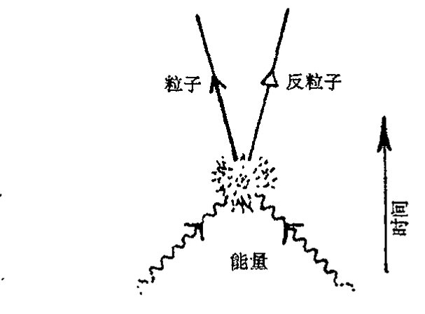
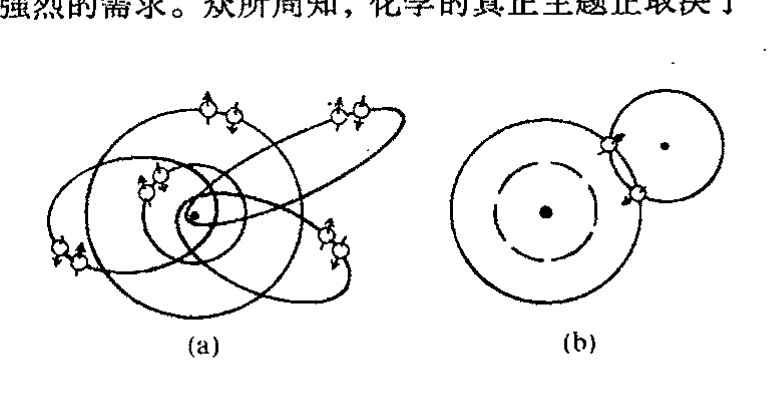

<!-- page 456 -->

第二十四章 狄拉克电子和反粒子

# 第二十四章

# 狄拉克电子和反粒子

## 24.1 量子理论与相对论之间的张力

[§23.10](chapter_23.md#2310-量子纠缠) 所作的讨论使我们开始接触到某些深刻的量子力学原理和相对论原理之间的矛盾。在前三章对量子理论运算进行的具体讨论中，我的确一直采用一种非相对论性的处理，似乎忘记了爱因斯坦和闵可夫斯基所教导的（如第17章所描述的）那些关于时间和空间相互依存的重要知识。事实上，这种做法在量子理论中相当普遍。标准处理采用的是一种"实在的图像"，其中对时间的处理不同于对空间的处理，正如第23章所指出的那样，只有一种外在的时间坐标，但空间坐标却有许多，每个粒子都要求有各自的一套空间坐标。我们通常将这种不对称性看作是非相对论性量子理论的"暂时的"特征，它可能仅仅是某种更完善的相对论性理论的一种近似。在本章和后两章里，当我们试着认真地将量子力学原理与狭义相对论原理结合起来时，我们将开始看到由此出现的深刻矛盾。（更为雄心勃勃的与爱因斯坦的广义相对论的统一——其中引力和时空曲率都将介入——则要求更多的条件，迄今即使是最有前途的那些工作也还未取得广泛的认可。我将在第28章、第30~33章介绍有关的工作。）

量子理论与狭义相对论结合的一个显著特征，就是产生出来的不是那种只涉及量子粒子的理论，而是关于量子场的理论。其理由可概括为如下事实：相对论的引入意味着单个粒子不再守恒，而是可以在与相应的反粒子关联的过程中被产生和消灭。这句话需要作些解释。为什么在相对论量子理论中需要"反粒子"概念呢？反粒子的出现怎么就能使我们从关于粒子的量子理论转到关于场的量子理论了呢？本章的主要内容就是要回答这两个问题，尤其是前一个问题，使我们看到了狄拉克在电子的数学描述上的深邃的洞察力。

量子场论本身将放在第26章讨论，这里我们先看看普遍存在于狭义相对论和量子理论之间的紧张关系，它导致粒子物理的研究越来越数学精致化。我们将发现我们已被引领着进行一次长长的令人着迷的旅行。当这种紧张关系通过粒子物理里的标准模型（我们在第25章予以介绍）得

·437·

<!-- page 457 -->

通向实在之路

到妥善解决后，我们会发现作为其结果的理论与观察事实之间符合得相当好。

但在许多方面，这种紧张关系依然存在，无法得到根本解决。严格地说，量子场论（至少在我们已知的这个理论的许多有关的非平凡情形下）在数学上不是充分协调一致的，许多重要的计算都需要运用不同的"技巧"。要清楚这些技巧仅仅是一种可以让我们在数学框架内勉强渡过难关（在深层次上看这种困难或许是一种根本性的缺陷）的权宜之计，还是反映了自然界本身的深刻真理，这需要有非常准确的判断力。最近许多力图推进基础物理学发展的努力的确将很多这类"技巧"视为基本手段。在本章和下一章里，我们将看到这种天才思想的一些例子，它们中有些似乎真正揭示了自然界的某些秘密，但另一些则受到大自然的无情嘲弄！

## 24.2 为什么反粒子意味着量子场？

在相对论量子理论里，反粒子的理论预言似乎揭示了大自然的一个真正秘密，现在这个预言得到了实验观察的充分支持。在本章的后面（特别是[§24.8](#248-正电子的狄拉克途径)）我们将从理论上看到反粒子存在的一些理由。眼下我们主要把注意力集中在上述第二个问题上，即：为什么反粒子的存在会使我们从粒子的量子理论转向场的量子理论？我们暂且先接受这样一个论断，即每一种粒子都有其反粒子，并且学着逐步接受这一非同寻常的事实的结果。

反粒子的根本性质（至少对有质量粒子的反粒子是如此）是粒子和反粒子能够成对地产生和湮没，它们的合质量按爱因斯坦的 $E=mc^2$ 转换成能量。如果我们将足够大的能量引入到局域于非常小区域的系统的话，那么这些能量很可能被用作产生某种粒子及其反粒子。因此，正由于这种产生反粒子的潜在可能性，使得越来越多的粒子有可能不断涌现出来，每个粒子都伴随着反粒子。也因此，相对论性的量子理论肯定不会是一种单纯的粒子理论，也不会局限于处理固定数目的粒子。（在我们将从25和26章看到的量子理论里，如果说存在出现某种情形的可能性——例如大量粒子/反粒子对的产生——那么这种潜在可能性实际上主要反映在量子态上。）因此，在处理相对论性粒子的理论尝试中，人们不得不拿出一种具有产生无限多粒子可能性的理论。

这种理论使我们脱离了第21~24章的框架结构，但在第26章我们将看到，场的量子理论是如何使我们能够处理这种行为的。按通常的观点，这一理论中的主要概念就是量子场，粒子本身只是作为"场致激发态"而出现。但我们会发现，这并不是看待量子场论的唯一方法。通过运用第25和26章里将要阐述的费恩曼图处理技术，我们看到，构造量子场论的基本过程中存在很强的"类粒子"观点。

对基本粒子的产生——一种合理的相对论性量子理论的特征——进行详细说明不失为一种富于启发性的做法。这里我仍然假定存在反粒子。本质上说，期望粒子产生的理由可归结到爱因斯坦的著名公式 $E=mc^2$。能量本质上与质量是可相互交换的（$c^2$ 仅仅是所用的能量单位和质量单位之间的"转换常数"）。如果可获得足够多的能量，则粒子质量就可以从能量中产生出来。

· 438 ·

<!-- page 458 -->

第二十四章 狄拉克电子和反粒子

然而，有了产生粒子质量的办法还不足以魔术般地变出粒子。还要考虑各种守恒的（加和性）量子数，例如电荷（或其他的如重子数），我们并没有假定它会在物理过程中发生变化。因此，简单地从能量中变出带电粒子将违反电荷守恒（对其他的守恒的量子数，如重子数等，可作同样推理）。但是，通过假定每一种粒子都存在一种相应的反粒子，它们的每一项加和性量子数都取相反的符号，那么粒子就可以和其反粒子一道从纯粹的能量中产生出来（见[图 24.1](assets/page458_fig01.jpg)）。在此过程中，所有加和性量子数均守恒。

**图 24.1** 粒子和它的反粒子能够从能量中产生出来。反粒子的所有守恒的加和性量子数都与粒子的符号相反，以保证这些量子数在产生过程中守恒。

另一方面，反粒子的静质量（静质量属非加和性质）等同于原粒子的静质量。在能量转换为粒子的过程中，我们需要足够的能量——至少两倍于粒子本身的静质量/能量——来产生粒子及其反粒子。相反，如果一个给定的粒子遇上它的反粒子，则可能发生彼此湮没并放出能量。这里，放出的能量仍必须至少是两倍于单个粒子的静质量/能量。不论是产生过程还是湮没过程，能量都必须大于这个值，因为粒子和反粒子很可能正处于相对论运动状态，运动本身储有能量——动能——它应加到总能量里去。无论哪一种情形，我们都看到，反粒子的出现迫使我们必须走出 21~23 章所描述的单粒子的量子理论。

## 24.3 量子力学里能量的正定性

现在我们回到那条最终促使我们在相对论量子理论中提出反粒子要求的道路上来。我们需要从比以往更深邃的视角来检验量子理论的框架。首先，我们回顾一下薛定谔方程的基本形式

$$\mathrm{i}\hbar\frac{\partial\psi}{\partial t}=\mathcal{H}\psi。$$

假定我们要求量子系统有确定的能量值 $E$，使得 $\psi$ 是本征值 $E$ 的能量本征态；就是说（因为 $\mathcal{H}$ 是定义在系统总能量上的算符），我们要求

$$\mathcal{H}\psi=E\psi。$$

按照量子力学的 **R** 过程（§§ 22.1, 5），这种态 $\psi$ 是我们对系统进行测量的结果，这种测量要

<!-- page 459 -->

通向实在之路

回答的是“你的能量是什么？”问题，得到的具体答案是“$E$”。于是薛定谔方程告诉我们

$$\mathrm{i}\hbar\frac{\partial\psi}{\partial t}=E\psi.$$

这个方程的解的形式为*^{[24.1]}

$$\psi=Ce^{-\mathrm{i}Et/\hbar},$$

这里 $C$ 是与时间 $t$ 无关的量（例如，仅为空间变量的复函数）。

现在，能量 $E$ 为正数很重要。在量子力学里负能态往往“不是好事”（它们会导致灾难性的不稳定性^1）。**^{[24.2]} 如果能量 $E$ 确为正的，则（$e^{-\mathrm{i}Et/\hbar}$ 的）指数中 $t$ 的系数 $-\mathrm{i}E/\hbar$ 为 $\mathrm{i}$ 的负整数倍。从 [§9.5](chapter_09.md#95-傅里叶变换的频率剖分)（以及注释 9.3）可知，这种性质的函数 $\psi(t)$（或这类函数的线性组合）都具有正频率（这有点儿让人迷惑）。

从 [§9.3](chapter_09.md#93-黎曼球面上的频率剖分) 我们还可知，一个（实变量 $x$）函数 $f(x)$ 可按完全不同的方式（即根据黎曼球面几何）剖分为正的和负的频率分支。^2 这里我们可以将它作为一种优美的纯数学对象来处理。实线相当于绕黎曼球面一周的赤道线，函数 $f$ 的正频率部分可理解为全纯地（见 [§7.1](chapter_07.md#71-复光滑全纯函数)）扩展到整个南半球的部分，负频率部分对应于北半球部分。但现在我们对这个极为重要的概念有了相当好的物理上的理由。任何“自尊的”波函数，虽然其本身不必是能量的本征态，都应能表示为能量本征态的线

614 形组合，每个能量本征值都应当是正的。这样，任何“体面的”波函数都应具有这种至关重要的正频率特性。在我看来，基本的物理要求与优美的数学性质这两方面的显著的联系，正是高深的数学概念与我们这个宇宙内部机制之间那种深奥的、微妙的、乃至神秘的关系的突出例证。

在非相对论量子力学里，只要哈密顿量是出自合理的物理问题（其中经典能量是正的），作为理论的自然本性，这种正频率要求大都能自动实现。例如，对（正）质量 $\mu$ 的单个的自由的非相对论（无自旋）粒子情形，其哈密顿量为 $\mathcal{H}=\mathbf{p}^2/2\mu$（见 [§20.2](chapter_20.md#202-更为对称的哈密顿图像)，[§21.2](chapter_21.md#212-量子哈密顿量)）。表达式 $\mathbf{p}^2$ 以及哈密顿量 $\mathcal{H}$ 本身是所谓“正定的”^3（[§13.8](chapter_13.md#138-正交群), 9）。从经典的观点看，所以如此是因为 $\mathbf{p}^2$ 是一平方和，它不可能是负的：$\mathbf{p}^2=\mathbf{p}\cdot\mathbf{p}=(p_1)^2+(p_2)^2+(p_3)^2$。而在量子力学里，我们必须用 $-\mathrm{i}\hbar\mathbf{\nabla}$ 取代 $\mathbf{p}$，这里 $\mathbf{\nabla}=(\partial/\partial x^1,\partial/\partial x^2,\partial/\partial x^3)$，现在“正定性”指的是算符 $-\nabla^2$ 的本征值（对归一化态，就是适当希尔伯特空间 $\mathbf{H}$ 的元素），这些也不可能是负的，其理由与经典情形本质上一样。***^{[24.3]}

---

\*^{[24.1]} 验证这的确是一个解。

??? question "答案 [24.1]"
    令自由粒子平面波为 $\psi=A\exp[i(\mathbf p\cdot\mathbf x-Et)/\hbar]$。于是 $\partial\psi/\partial t=-(iE/\hbar)\psi$，而 $\nabla^2\psi=-(\mathbf p^2/\hbar^2)\psi$。

    代入薛定谔方程 $i\hbar\partial_t\psi=-(\hbar^2/2\mu)\nabla^2\psi$，左边为 $E\psi$，右边为 $(\mathbf p^2/2\mu)\psi$。只要 $E=\mathbf p^2/2\mu$，它确实是解。

\*\*^{[24.2]} 解释：为什么在哈密顿量上加上一个常数 $K$ 就能够起到使薛定谔方程的所有解都乘以同一个因子的效果。找出这个因子。假定我们考虑的是量子系统的引力效应，它会从根本上影响到量子动力学吗？为什么在此条件下我们不能简单地用这种方法“重整化”能量？

??? question "答案 [24.2]"
    若把哈密顿量改为 $\mathcal H+K$，薛定谔方程的解只多出整体相位 $\exp(-iKt/\hbar)$。所有态同时乘以这个因子，普通非相对论量子力学中的相对概率和干涉相位差不变。

    但引力耦合到能量本身，而不只是能量差。整体加常数会改变等效的引力质量或时空相位积累；若引力场也是动力学的，就不能把这种能量零点简单地重整化掉。

\*\*\*^{[24.3]} 这里，薛定谔方程为 $\partial\psi/\partial t=(\mathrm{i}\hbar/2\mu)\nabla^2\psi$。先来确认：对能量 $E$ 的能量本征态，我们有 $-\nabla^2\psi=A\psi$，这里 $A=2\mu\hbar^{-2}E$，然后用格林定理（$\int\bar{\psi}\nabla^2\psi\mathrm{d}^3x=-\int\mathbf{\nabla}\bar{\psi}\cdot\mathbf{\nabla}\psi\mathrm{d}^3x$）证明，对归一化态，$A$ 必为正值。（相反，下述事实也是正确的：对正的 $A$，$-\nabla^2\psi=A\psi$ 有多个解，在变量趋于无穷时这些解趋于零，以保证模 $\|\psi\|$ 有限，^4 只要我们愿意，可将其归一化到 $\|\psi\|=1$。）并说明如何从外运算基本定理导出格林定理。

??? question "答案 [24.3]"
    能量本征态满足 $\mathcal H\psi=E\psi$，而 $\mathcal H=-(\hbar^2/2\mu)\nabla^2$，所以 $-\nabla^2\psi=(2\mu E/\hbar^2)\psi$。

    乘以 $\bar\psi$ 并在空间积分，格林恒等式给出 $\int\bar\psi(-\nabla^2\psi)d^3x=\int |\nabla\psi|^2d^3x$，边界项在合适衰减条件下为零。右边非负，因此 $A=2\mu E/\hbar^2\ge0$，也即 $E\ge0$。

·440·

<!-- page 460 -->

第二十四章 狄拉克电子和反粒子

---

## 24.4 相对论能量公式的困难

现在，我们来考虑相对论粒子。在此情形下，从能量的相对论表达式得到的哈密顿量不是 $p^2/2\mu$，而是

$$[(c^2\mu)^2 + c^2p^2]^{1/2}。$$

这个表达式直接得自 [§18.7](chapter_18.md#187-相对论性能量和角动量) 的方程 $(c^2\mu)^2 = E^2 - c^2p^2$，这里 $\mu$ 是粒子的静质量。担心这个表达式看上去不像 $p^2/2\mu$ 的读者应回头参考练习 [18.20]。它从 $[(c^2\mu)^2 + c^2p^2]^{1/2}$ 的幂级数展开式告诉我们，这个相对论表达式将爱因斯坦公式 $E=mc^2$ 并作了第一项。这一项反映的是粒子静质量的贡献，还要加上粒子运动的动能。第二项给出的才是牛顿（动能）哈密顿量 $p^2/2\mu$。

读者对我们选择的相对论哈密顿量大可放心！但不管怎么说，这种实际的哈密顿量的指数展开式用起来的确非常别扭（而且相当不直观），尤其是因为在 $p^2 > \mu^2$ 时这个经典序列甚至不收敛。615 而且我们发现，联系到维持正频率要求，精确表达式 $[(c^2\mu)^2 + c^2p^2]^{1/2}$ 中的平方根（半指数幂）将带来难以解决的困难。我们来看看这个重要问题反映了什么。

为使表达式不显得复杂，我们取光速为 1 的单位

$$c = 1,$$

这样，相对论哈密顿量（包括静能量）为

$$\mathcal{H} = (\mu^2 + p^2)^{\frac{1}{2}}。$$

我们必须记住，在量子力学里，$p^2$ 是二阶偏微分算符 $-\hbar^2\nabla^2$，因此，如果我们打算让表达式 $(\mu^2 - \hbar^2\nabla^2)^{1/2}$ 这个偏微分算符的平方根具有前后统一的意义，我们就必须接受这种相当复杂的数学形式！（例如，要体会这种困难，你不妨试试如何解释 $\sqrt{(1-\mathrm{d}^2/\mathrm{d}x^2)}$ 的意义。***[24.4]）

这个平方根表达式包含着严重的困难，因为它含有隐秘的符号不确定性。在经典物理中，这种事难不倒我们，因为所考虑的量通常是实值函数，我们可以想象将正值与负值分开。但在量子力学里却不那么容易。部分是因为量子波函数是复数，一个复数表达式的两个平方根并不能以总体协调的方式正好分成"正的"和"负的"（[§5.4](chapter_05.md#54-复数幂)）。它必须与下述事实联系起来考虑：量子力学处理的是作用在复函数上的算符，像平方根这样的事将导致根本的不确定性，这个问题不是说"取正根"就可以轻易地解决的。

这一困难还有另一种表现形式。在量子力学里，物理上各种"可能发生"的事都会对量子态有贡献，因此所有这些可能性都会对所发生的事有影响。就平方根而言，两个根的每一个都是一种"可能性"，甚至"非物理的负能量"也必须视作一种"物理上的可能性"。只要可能存在负能态，616 那么能量就有可能从正能量转变到负能量，这种转变将导致灾难性的不稳定性。对于非相对论自

---

*** [24.4] 就如下情形提出建议：作傅里叶变换（[§9.4](chapter_09.md#94-傅里叶变换)），或作幂级数展开，或作环路积分，等等。

??? question "答案 [24.4]"
    算符 $\sqrt{1-d^2/dx^2}$ 最自然的定义是在傅里叶空间中给出。若 $f(x)$ 的傅里叶分量为 $\tilde f(k)$，则 $-d^2/dx^2$ 变成乘以 $k^2$，所以平方根算符变成乘以 $\sqrt{1+k^2}$。

    这说明它通常不是有限阶微分算符，而是非局域的伪微分算符。对 $\sqrt{\mu^2-\hbar^2\nabla^2}$ 也是同样：动量空间中它只是乘以 $\sqrt{\mu^2+\mathbf p^2}$，但位置空间表达很复杂。

· 441 ·

<!-- page 461 -->

通向实在之路

由粒子，不存在出现负能量的可能，因为正定的量 $p^2/2\mu$ 不会有这种别扭的平方根。但对于相对论性的表达式 $(\mu^2+p^2)^{1/2}$，则问题多多，因为我们通常没有清楚的程序来排除负平方根。

业已清楚，对于单个自由粒子（或类似的非相互作用粒子体系）情形，这不会造成实际的真正困难，因为我们可以只关心自由薛定谔方程的正能量平面波解的叠加，它们就是 [§21.5](chapter_21.md#215-理解波粒二象性) 里考虑的那些形式，而且不存在到负能态的转换。然而，当粒子间存在相互作用时，情形就不是这样了。即使只是固定电磁场背景下的单个相对论带电粒子，其波函数一般来讲也无法保持正频率条件。在这种地方，我们开始感觉到量子力学原理与相对论原理之间的紧张关系。

正如在 [§24.8](#248-正电子的狄拉克途径) 我们将看到的那样，伟大的物理学家狄拉克找到了解决这种紧张关系的途径。首先，他创造性地提出了一个极富远见的思想——以他名字命名的电子方程——以一种漂亮的意想不到的方式避开了讨厌的平方根。这一思想从根本上树立起一种排除负能量的高度原创性观点：负能量效应可用存在反粒子这一预言来取代。为了理解所有这些概念，让我们回到导致平方根的相对论理论的基本特性上来。

## 24.5 $\partial/\partial t$ 的非不变性

我们知道，在相对论情形里必须采用哈密顿量 $(\mu^2+p^2)^{\frac{1}{2}}$ 的根本原因，是基于这样一个事实：薛定谔方程要用到算符 $\partial/\partial t$（即"关于时间的变化率"），而在相对论里，$\partial/\partial t$ 不是一个不变量，因为时间和空间不能分开来考虑，而是以合二为一的"时空"面貌出现。因此，$\partial/\partial t$ 不是一个基本的"相对论性的不变量"。正如我们在 [§21.3](chapter_21.md#213-薛定谔方程) 看到的，薛定谔方程里的 $\partial/\partial t$ 源自一般的"量子化技巧"，由此，标准的 4 维时空动量 $p_a$（即能量 $E$ 和负的 3 维动量 $-\mathbf{p}$）替换为微分算符 $\mathrm{i}\hbar\partial/\partial x^a$（即能量 $E$ 替换为 $\mathrm{i}\hbar\partial/\partial t$，$-\mathbf{p}$ 替换为 $\mathrm{i}\hbar\mathbf{\nabla}$）。因此 $\partial/\partial t$ 的"相对论性非不变性"与能量的非不变性紧密相关。正如 [§18.7](chapter_18.md#187-相对论性能量和角动量) 所显示的那样，在相对论里，能量和动量如同时间和空间的关系一样也是合二为一的。

此外，爱因斯坦的 $E=mc^2$（按约定 $c=1$）告诉我们，能量即质量，质量即能量，因此质量也是"非不变量"。但这是指加和性的"质量"概念 $m$（4 维能量动量矢量的时间分量），它并非粒子本身的内在性质，而是在未必与粒子速度相同的某个参照系下测得的质量。粒子的速度越大，这种"感知的"质量也越大（这确实是 $m$ 不是不变量的一个理由）。粒子的静质量 $\mu$ 倒是个不变量，但麻烦在于它不是加和性的，在粒子转换过程中静质量不守恒，因此我们很难选择一个可与哈密顿量等价的量。不仅如此，$\mu$ 还是能量动量表达式的平方根，就是说（$c=1$）

$$\mu^2=p_ap^a=m^2-p^2,\text{ 即 }\mu=(m^2-p^2)^{\frac{1}{2}},$$

这个式子不过是先前的质量/能量 $m=E(=\mathcal{H})$ 的平方根表达式 $m=(\mu^2+p^2)^{\frac{1}{2}}$ 的另一种形式。

不管怎样，在薛定谔型方程中，我们可以摆弄的是具有不变性的静质量 $\mu$ 或其平方 $\mu^2$ 等概

·442·

<!-- page 462 -->

第二十四章 狄拉克电子和反粒子

念，而不是非不变性的能量分量 $m$。应用于平方静能量（即 $\mu^2 = m^2 - p^2$）的量子化技巧（即用 $m$ 替换为 $\mathrm{i}\hbar \partial/\partial t$，$\mathbf{p}$ 替换为 $-\mathrm{i}\hbar \mathbf{\nabla}$）提供的是闵可夫斯基坐标 $(t, x, y, z)$ 下 $(\mathrm{i}\hbar)^2$ 倍的算符^5

$$\square = \left(\frac{\partial}{\partial t}\right)^2 - \nabla^2 = \left(\frac{\partial}{\partial t}\right)^2 - \left(\frac{\partial}{\partial x}\right)^2 - \left(\frac{\partial}{\partial y}\right)^2 - \left(\frac{\partial}{\partial z}\right)^2$$

它称为波算符或达朗贝尔算符，具有不变量意义。（我们知道 $(\partial/\partial x)^2$ 意味着二阶导数算符 $\partial^2/\partial x^2$，等等。）尽管传统的薛定谔方程不容许我们直接使用这种算符（理由如上，薛定谔方程要求一阶的"$\partial/\partial t$"，而不是二阶的 $(\partial/\partial t)^2$），但我们仍可期望对于相对论粒子，二阶方程 $(\mathrm{i}\hbar)^2 \square \psi = \mu^2 \psi$ 具有波方程的意义（这里 $(\mathrm{i}\hbar)^2 \square$ 由 $\mu^2$ 通过量子化技巧得来，方程里的 $\mu$ 实际就是静质量）。这个方程可重写为

$$(\square + M^2)\psi = 0,$$

这里 $M = \mu/\hbar$，它在相对论量子理论里具有重要意义。这个方程现在经常被称为"克莱因—戈登方程"，虽然薛定谔本人似乎应该是第一个给出这个相对论不变性方程的人，这一点甚至在他写下更著名的"薛定谔方程"之前就已经做出了（见 [§21.3](chapter_21.md#213-薛定谔方程) 的描述）。^6

从现代量子场论的发展来看，一定意义上说，克莱因—戈登方程可用于描述有质量的无自旋粒子，就是那些称之为介子的粒子（像 $\pi$ 介子或 K 介子这样中等质量的粒子）。但这需要在完整的量子场论框架上来理解，而这在 1928 年狄拉克率先提出他对电子波动方程的全新解释时还只是个雏形。狄拉克偏好的是以一阶形式出现的时间导数"$\partial/\partial t$"（如同出现在薛定谔方程里的那样），而不是像现在出现在波算符 $\square$ 里的二阶形式 $(\partial/\partial t)^2$。他的理由不仅与上面所说的那些概念有关，而且更与他所强调的要求有关：粒子的波函数应当能够给出在任何选定地点发现粒子的概率密度表达式，这个表达式定性上类似于标准的非相对论量子力学里的 $\bar{\Psi}\Psi$（[§21.9](chapter_21.md#219-波函数的概率分布)），且应是正定的，以使概率不会变负。这一点与能量的正定性要求大不相同，但却是有着同等重要性的补充条件。^7

## 24.6 波算符的克利福德—狄拉克平方根

通过对相对论要求和所偏好的一阶 $\partial/\partial t$ 要求之间看似无法解决的矛盾的独创性的成功处理，狄拉克设法找到了一个方程，它是一阶 $\partial/\partial t$ 的，做法是巧妙地以相对论不变性方式直接取波算符 $\square$ 的平方根。狄拉克是通过引入一定的加和性非对易量来做到这一点的。这样的量在量子力学里是合法的，因为它们可以当作作用在波函数上的线形算符来处理，就像我们起初在 [§21.2](chapter_21.md#212-量子哈密顿量) 处理非对易位置算符和动量算符那样。我们不久将看到，令人吃惊的是，狄拉克被迫引入的这些非对易算符能够描述自然界中大部分基本费米子（[§23.6](chapter_23.md#236-量子纠缠的两个谜团)，即狄拉克当时所知道的电子、质子，以及我们今天所知道的中子、$\mu$ 子、夸克和其他自旋 $\frac{1}{2}$ 粒子）的物理自旋自由度。

事实上，在发现非对易"自旋"量的过程中，狄拉克重新发现了我们在 [§11.5](chapter_11.md#115-克利福德代数) 介绍的克利福德

<!-- page 463 -->

通向实在之路

代数（的一个例子）。但狄拉克似乎并未注意到克利福德早先的工作，也不知道克利福德（1877）甚至在他之前的哈密顿已经注意到这些代数元可以用来对拉普拉斯量“取平方根”——波算符□就是一个特殊的广义拉普拉斯量，这里维数是4，符号差为+ − − −。实际上，克利福德本人知道，在1840年前后，哈密顿已经证明，普通3维拉氏量的平方根可通过四元数（[§11.1](chapter_11.md#111-四元数代数)）

$$\left(\mathbf{i}\frac{\partial}{\partial x}+\mathbf{j}\frac{\partial}{\partial x}+\mathbf{k}\frac{\partial}{\partial x}\right)^{2}=-\left(\frac{\partial}{\partial x}\right)^{2}-\left(\frac{\partial}{\partial x}\right)^{2}-\left(\frac{\partial}{\partial x}\right)^{2}=-\nabla^{2}$$

来得到。⁸ 克利福德的处理将此推广到了高维。⁹ 狄拉克没注意到半个世纪前的克利福德的发现，这一点也不足为怪，因为这项工作在20世纪20年代并不广为人知，甚至许多代数方面的专家亦不知晓。即使狄拉克当时知道克利福德代数，也不掩其认识到这些概念对自旋电子量子力学重要性的光芒——这一认识构成了物理学知识上重要的意想不到的进步。

在狄拉克情形里，波算符需要取平方根来得到闵可夫斯基几何下4维（洛伦兹型）拉氏量：

$$\square=\left(\frac{\partial}{\partial x}\right)^{2}-\nabla^{2}。$$

因此我们用“洛伦兹型”克利福德代数元 $\mathbf{\gamma}_{0},\cdots,\mathbf{\gamma}_{3}$，它们满足

$$\mathbf{\gamma}_{0}^{2}=1,\mathbf{\gamma}_{1}^{2}=-1,\mathbf{\gamma}_{2}^{2}=-1,\mathbf{\gamma}_{3}^{2}=-1。$$

在标准的（符号差++…+）克利福德代数里，上述每一个平方项均为−1。这里，我按照标准的物理学家的习惯来处理符号，因此作为空间量的 $\mathbf{\gamma}$ 仍保留克利福德原初的负平方形式。¹⁰ 而时间量的 $\mathbf{\gamma}_{0}$ 则取正平方。正是在这种意义上，狄拉克的克利福德代数是“洛伦兹型”的。对不同的 $\mathbf{\gamma}$，克利福德代数的反对易性质仍成立（[§11.5](chapter_11.md#115-克利福德代数)）：

$$\mathbf{\gamma}_{i}\mathbf{\gamma}_{j}=-\mathbf{\gamma}_{j}\mathbf{\gamma}_{i}(i\neq j)。$$

620 狄拉克采取的关键步骤，是通过这些克利福德元将波算符定义为一阶算符的平方\*⁽²⁴˙⁵⁾

$$\square=(\mathbf{\gamma}_{0}\partial/\partial t-\mathbf{\gamma}_{1}\partial/\partial x-\mathbf{\gamma}_{2}\partial/\partial y-\mathbf{\gamma}_{3}\partial/\partial z)^{2}。$$

我们可利用矢量形式 $\mathbf{\gamma}=(\mathbf{\gamma}_{1},\mathbf{\gamma}_{2},\mathbf{\gamma}_{3})$ 将上式更简洁地写成

$$\square=(\mathbf{\gamma}_{0}\partial/\partial t-\mathbf{\gamma}\cdot\mathbf{\nabla})^{2}，$$

或

$$\square=\not\partial^{2}，$$

这里量

$$\not\partial=\mathbf{\gamma}_{0}\partial/\partial t-\mathbf{\gamma}\cdot\mathbf{\nabla}=\mathbf{\gamma}^{a}\partial/\partial x_{a}$$

（$\mathbf{\gamma}^{a}=g^{ab}\mathbf{\gamma}_{b}$）称为狄拉克算符。这个简约的“斜杠”记号是理查德·费恩曼引入的。推而广之，矢量 $A^{a}$ 可用克利福德–狄拉克代数元

$$\not A=\mathbf{\gamma}_{a}A^{a}$$

---

\* ⁽²⁴˙⁵⁾验证这一点。

·444·

<!-- page 464 -->

来表示。

## 24.7 狄拉克方程

现在让我们回到"波方程" $(\square + M^2)\psi = 0$。利用狄拉克算符 $\not\partial$，我们可以将出现在这个方程里的量 $\square + M^2$ 分解成：

$$\square + M^2 = \not\partial^2 + M^2; \quad = (\not\partial - \mathrm{i}M)(\not\partial + \mathrm{i}M),$$

这里 $M = \mu/\hbar$。于是电子的狄拉克方程为 $(\not\partial + \mathrm{i}M)\psi = 0$，即

$$\not\partial\psi = -\mathrm{i}M\psi,$$

或根据静质量 $\mu$ 恢复公式里的 $\hbar$：

$$\hbar\not\partial\psi = -\mathrm{i}\mu\psi.$$

显然，由分解式可以看出，只要这个方程成立，那么波方程 $(\square + M^2)\psi = 0$ 就一定成立。（这一点还可以用到"反狄拉克方程" $(\not\partial - \mathrm{i}M)\psi = 0$ 上，但按照标准习惯，它指的是具有负质量 $-\hbar M$ 的粒子。）因此，满足上述狄拉克方程的波函数也必然满足支配具有静质量 $\hbar M$ 的相对论粒子的"波方程"。

狄拉克方程优于波方程就在于它是关于一阶 $\partial/\partial t$ 的方程。的确，狄拉克方程可以重写成薛定谔方程的形式 *〔24.6〕

$$\mathrm{i}\hbar\frac{\partial\psi}{\partial t} = \left(\mathrm{i}\hbar\gamma_0\mathbf{\gamma}\cdot\mathbf{\nabla} + \gamma_0\mu\right)\psi,$$

这里 $\mathrm{i}\hbar\gamma_0\mathbf{\gamma}\cdot\mathbf{\nabla} + \gamma_0\mu$ 起着哈密顿算符的作用。从算符 $\partial/\partial t$ 分离出的单个的量自然不具有相对论不变性，但整个狄拉克方程 $\not\partial/\psi = -\mathrm{i}M\psi$ 是相对论不变的。（为了看清这一点，我们需要对克利福德代数元与洛伦兹变换之间的相互作用做仔细的检查。***〔24.7〕令当时的物理学家大为吃惊的是，从中可知，相对论性不变量居然可以出现在矢量/张量运算的标准框架之外（12 章和 14 章）。）狄拉克有效地开创了一种全新的强有力的形式体系，我们现在称之为旋量运算，^11^这是一种超乎当时传统意义上矢量/张量运算的计算方式。

排除讨厌的平方根同时保留相对论不变性的"代价"，是产生了这些奇怪的非对易的克利福德代数元 $\gamma_a$。它们有什么意义呢？我们说，我们得把它们看作是作用在波函数上的算符。由于这些特殊的算符是新事物，不是像我们以前处理的那样直接产生于粒子的（非对易的）位置和动量量子变量，因此它们应当表示的是（和作用于）粒子的某些新的自由度。我们必须搞清楚这些新自由度能够担当的物理目的是什么。用当今的术语来表达，这个答案就是"旋量"——描述电子自旋的新自由度。^12^由 [§11.5](chapter_11.md#115-克利福德代数) 我们知道："旋量可看成是克利福德代数元算符的作用对象"。在狄

---

*〔24.6〕证明这一点。

??? question "答案 [24.6]"
    令狄拉克方程写成 $\not\partial\psi=-iM\psi$。把时间项从 $\not\partial$ 中分离出来，并用适当的 $\gamma_0$ 左乘，就可把它改写为 $i\hbar\partial_t\psi=H\psi$ 的薛定谔形式。

    整理空间导数项得到的哈密顿量正是正文所写的 $i\hbar\gamma_0\mathbf{\gamma}\cdot\mathbf{\nabla}+\gamma_0\mu$（依单位和符号约定可有等价变形）。因此狄拉克方程既是相对论协变的一阶方程，也可在选定时间坐标后写成哈密顿演化方程。
***〔24.7〕解释这一点。提示：将练习〔22.18〕一般化。

??? question "答案 [24.7]"
    洛伦兹变换作用在向量指标上，要求克利福德元满足相同的内积关系；也就是说，若 $\gamma_a$ 变为 $\Lambda_a{}^b\gamma_b$，克利福德反对易关系保持不变。另一方面，旋量本身需由相应的自旋表示矩阵作用。

    这正是练习 [22.18] 中四元数/旋量转动关系的四维推广：空间转动由双覆盖群作用在旋量上，而相应向量由夹乘或相似变换得到。狄拉克方程中 $\gamma_a\partial^a$ 的两个变换相互补偿，所以整个方程保持洛伦兹不变。

·445·

<!-- page 465 -->

通向实在之路

拉克方程里，克利福德元作用在波函数 $\psi$ 上。因此，$\psi$ 本身必须是一个旋量。一个普通的标量波函数除了位置和时间的依赖关系之外还有额外的自由度，这些自由度的确描述了电子的自旋！

622　　现在我们开始看到，为能够利用克利福德元分解波算符所付出的代价已经为我们带来了令人难以置信的巨大利益！我们不仅有了精确描述电子自旋的理论，而且当我们将这一标准项加到表示与背景电磁场（这是按 §19.54 和 [§21.9](chapter_21.md#219-波函数的概率分布) 的“规范要求”^13 引入电动力学的一项）相互作用的哈密顿量上时，我们发现，狄拉克电子能够像普通电子那样对电磁场做出正确的响应，包括由电子相对论运动产生的某些次级效应。

但是，这里不只是电子的带电粒子行为得到了正确描述，而且狄拉克电子可按其具有的非常明确的磁矩大小

$$\hbar^2 e/4\mu c,$$

来作出响应，这里 $-e$ 是电子电荷，$\mu$ 是电子质量。也就是说，狄拉克电子不仅是带电的，而且表现得像一个小磁体，其场强就是上面给出的值。狄拉克给出的电子磁矩的这个明确值与实际观测值非常接近，误差仅为千分之几。电子磁矩的最新确定值与狄拉克上述值之间的误差可表为下述乘积性因子

$$1.0011596521188\cdots$$

甚至这一小偏差现在也可以从量子电动力学的修正效应中得到解释，它是狄拉克方程中基本成分之一。狄拉克的精巧方程 $\partial/\psi=-iM\psi$ 所反映出的与大自然的那种协调一致性的确异乎寻常！

## 24.8　正电子的狄拉克途径

但这个故事不能就这么结束了，我才刚刚开了个头呢。让我们继续考察关于电子自旋的狄拉克方程在数学上的那种表观反常性。这种表观上的反常就是我们如何看待所发现的狄拉克旋量 $\psi$ 的独立分量的个数。业已知道狄拉克的 $\psi$ 有 4 个独立分量，但表面上看，我们可以预期的只有两个，因为自旋 $-\frac{1}{2}$ 粒子只有两个独立自旋态（见 [§22.8](chapter_22.md#228-自旋和旋量)）。让我们试着更深入地了解这个问题。

623　　1925 年，在狄拉克发表他的方程（1928 年）之前不到 3 年，乌伦贝克（George Uhlenbeck, 1900～1974）和古德斯米特（Samuel Goudsmit, 1901～1978）已得出结论，电子一定拥有由两个基本自旋态构成的量子力学自旋。1927 年，沃尔夫冈·泡利说明了如何用我们今天称之为“泡利矩阵”的数学工具来表示这些自旋态的转动变换（见 [§22.8](chapter_22.md#228-自旋和旋量)，以及[图 22.6](assets/page412_fig01.jpg) 描述的自旋 $\frac{1}{2}$ 态的黎曼球面图像）。泡利矩阵（本质上是带因子 i 的四元数）也是克利福德代数元，只不过属 3 维转动群下情形罢了。**[24.8]

---

**[24.8] 与 [§11.5](chapter_11.md#115-克利福德代数) 解释的四元数与克利福德元之间的关系联系起来，解释这一段叙述。

??? question "答案 [24.8]"
    四元数的三个虚单位满足类似空间三维旋转生成元的乘法规则，而克利福德代数把向量乘法规定为 $uv+vu=2g(u,v)$。在三维欧氏情形中，偶克利福德代数与四元数代数同构。

    因此泡利矩阵既可看作自旋 $1/2$ 的矩阵表示，也可看作三维克利福德/四元数结构的具体实现。正文把电子自旋、泡利矩阵和克利福德元联系起来，正是利用了这种代数同构。

·446·

<!-- page 466 -->

第二十四章 狄拉克电子和反粒子

事实上，物理上对于电子的两个自旋态有着强烈的需求。众所周知，化学的真正主题正取决于这一点。在原子里，原子核周围的电子被限定在所谓“轨道”的特定状态下绕核运动（[§22.13](chapter_22.md#2213-一般的孤立量子客体)）。由泡利不相容原理，每个电子轨道只能容纳一个电子，但我们发现，每个轨道总是容许存在第二个电子。一对电子能够共存并仍能满足不相容原理，就因为它们的态不全同，而是有相反的自旋。但每个轨道上不容许超过两个电子，因为电子只有两个独立的自旋态。化学上的“共价键”概念依据的也是这一点，两个公用的电子可在同一个态下共存，因为它们的自旋相反，见图24.2。

泡利对电子的描述是一个二分量的项ψ_A=(ψ_0,ψ_1)，相应地，泡利矩阵为2×2。但我们发现，狄拉克的克利福德元(γ_0,γ_1,γ_2,γ_3)要求4×4矩阵以表示克利福德乘法律。***[24.9]因此，狄拉克电子是一个四分量的实体，而非只有“泡利旋量”的两个分量（它们用来描述[§22.8](chapter_22.md#228-自旋和旋量)里所述的自旋1/2的非相对论粒子的两个独立的自旋态）。

事实上，狄拉克方程描述的粒子只有两个分量，尽管其波函数有四个分量。数学上看，所以如此是因为狄拉克方程∂̸ψ=iMψ是一个一阶的方程，其解空间只有二阶波方程(□+M²)ψ=0的一半。（这个波方程也满足“反狄拉克”方程∂̸ψ=+iMψ，后者是具有负的静质量-M的狄拉克方程。）但从物理上看，狄拉克方程解的“计算”^14必须考虑到，电子的反粒子即正电子的自由度也藏在狄拉克方程的解里。但如果认为狄拉克方程的两个分量指的是电子，另两个分量是指正电子，这也可能属误导。我们将看到，事情远比这精巧复杂。

还记得吧，引领我们考虑狄拉克方程的主要任务之一，就是搞清楚怎么处理不想要的薛定谔方程的负频率（即负能）解。但业已证明，狄拉克方程的解不限于正频率，尽管我们的（确切地说，是狄拉克的）全部聪明才智和艰苦努力都用在了如何排除哈密顿量的平方根上。正如前面尝试的，更早的时候所描述的，诸如背景电磁场这样的相互作用的存在，将导致初始的正频率波拾取负频率部分。

但正是在这个地方狄拉克表现出非凡的创造力。在他最终确信负频率解不可能从数学上加以排除之后，他作了如下根本性的论证解释。在负频率解中难办的到底是什么呢？问题或许是这样，如果负能态存在，那么电子就会通过辐射掉能量落入这个态中；如果有无限多个这种态，则

***[24.9] 说明为什么2×2矩阵不满足所有这些条件；找出一个满足这些条件的4×4矩阵。

??? question "答案 [24.9]"
    若用四个 $2\times2$ 矩阵表示四维狄拉克克利福德元，它们必须两两反对易并有规定平方号。但 $2\times2$ 复矩阵空间只有四维，去掉单位矩阵后只有三个独立的无迹方向，即泡利矩阵方向，容不下四个满足四维克利福德关系的独立生成元。

    一种标准 $4\times4$ 表示是取 $\gamma^0=\begin{pmatrix}I&0\\0&-I\end{pmatrix}$，$\gamma^i=\begin{pmatrix}0&\sigma^i\\-\sigma^i&0\end{pmatrix}$，其中 $\sigma^i$ 为泡利矩阵。它们满足 $\gamma^a\gamma^b+\gamma^b\gamma^a=2\eta^{ab}I$（符号依度规约定调整）。

·447·

<!-- page 467 -->

通向实在之路

将出现灾难性的不稳定性，在此情形下，所有电子堕入负能态，使得负能量越来越大，同时伴随着越来越多的能量辐射，没有止境。但是，狄拉克解释道，电子满足泡利原理，因此如果一个态已经被占据了，这条原理就不会容许同样的粒子再占据这个态。于是他提出了一项惊人的建议，所有负能态应当都已被占满！这个被占领的负能态海洋就是通常所说的“狄拉克海”。因此，按照狄拉克的“狂想”，我们确实得想象着负能态已占满；按泡利原理，电子已没有落入这种态的余地。

图 24.3 作为狄拉克负能态“海”里的“洞”的正电子。狄拉克认为，几乎电子所有负能态均占满，泡利原理不容许电子落入这种态。偶尔出现的未占据的态——负能海的“洞”——就像一个反电子（正电子），从而有正能量。(a) 电子填入这种洞可解释为电子与正电子的湮没，同时释放出能量——电子与正电子的正贡献之和。(b) 反过来，足够大的能量将使狄拉克海生成电子-正电子对。（这里的图像只是示意性的，这种晶格结构描述与狄拉克海实际上不相关。）

但是，狄拉克又解释道，偶尔可能会出现一些负能态未被占据的情形。这时将发生什么呢？这种狄拉克负能态海里的“洞”似乎就像一个正能粒子（即正质量粒子），其电荷与电子电荷相反。这种空的负能态可被普通电子所占据；因此电子将“落入”伴随能量辐射的态（通常以电磁辐射形式出现，即释放出光子）。这将导致“洞”和电子彼此湮没，这种方式我们今天理解为粒子和它的反粒子发生相互湮没（[图 24.3](assets/page467_fig01.jpg)（a））。反过来说，如果当初不存在洞，但一股足够大的能量（譬如说以光子形式）涌入系统，那么电子就会被从负能态轰出并留下一个洞（[图 24.3](assets/page467_fig01.jpg)（b））。狄拉克的“洞”的确就是电子的反粒子，现在称之为正电子。

起初，狄拉克表现得小心谨慎，他声称他的理论实际上预言了存在电子的反粒子，刚开始他认为（1929 年）这个“洞”可能是质子，这是当时知道的唯一的有质量、带正电荷的粒子。但不久事情变得很清楚，¹⁵每个洞的质量必须等于电子质量，而不是质子质量，二者要相差不止 1836 倍。1931 年，狄拉克得出结论，洞必须是“反电子”——一种此前不知道的、今天我们称之为正电子的粒子。在狄拉克理论预言的第二年，卡尔·安德森发现了一种确如狄拉克所预言的粒子：第一个反粒子被找到了！

---

**注 释**

**§ 24.3**

24.1 技术上说，如果能量是所谓“下有界的”，灾难是可以避免的，这意味着能量要大于某个固定值 E₀（E₀ 也许是负的）。在此情形下，我们能够通过将 -E₀ 加到哈密顿量上来“重正化”能量，其结果能量值总是正的。

24.2 对点∞的处理需要有一定的技巧，因为在这里 f 很可能是奇异的。[§9.7](chapter_09.md#97-超函数) 的超函数处理是适当的，见 Bailey（1982）。

· 448 ·

<!-- page 468 -->

第二十四章　狄拉克电子和反粒子

24.3　严格来说，应当叫半正定的，因为（连续的）本征值谱不必衰减到零，并包括零。

24.4　关于量子力学的应用见 Shankar（1994），一般性讨论见 Arfken and Weber（2000）。

**[§24.5](#245-partialpartial-t-的非不变性)**

24.5　有些人将算符定义为相反的符号，通常是因为他们的符号差取 `+ + + -`，而不是我这里用的 `+ - - -`。

24.6　见 Pais（1986）；Miller（2003）；Dirac（1983）。薛定谔的动机可能始终是既唯美又好色的！！

24.7　这两个要求共同构成 CPT 定理证明的基本要素，我们在 [§25.4](chapter_25.md#254-正反共轭宇称和时间反演) 将介绍它。

**[§24.6](#246-波算符的克利福德狄拉克平方根)**

24.8　见 Trautman（1997）关于这些“平方根”概念的参考文献。

24.9　见 Clifford（1882），778～815 页；亦见 Lounesto（2001）的一般性讨论。

24.10　这种习惯似乎不同于通常数学家的习惯（见 Harvey1990；Budinich and Trautman 1988；Lounesto 2001；Lawson and Michelson 1990），也不同于我自己的习惯（见 Penrose and Rindler 1986，附录）。如果时空采用这里的符号差，则一般克利福德代数的定义方程是 $\gamma_i\gamma_j-\gamma_j\gamma_i=-2g_{ij}$。

**[§24.7](#247-狄拉克方程)**

24.11　见 Clifford（1878）；Cartan（1966）；van der Waerden（1929）；Infeld and van der Waerden（1933）。在 [§22.8](chapter_22.md#228-自旋和旋量) 的二维旋量记号下，将导致如 [§25.2](chapter_25.md#252-电子的-zigzag-图像) 给出的狄拉克方程的“zig－zag”形式。

24.12　“旋量”这个术语显然是 Paul Ehrenfest 在给 Bartel van der Waerden 的一封信里提出的。

24.13　增加的项为 $\mathrm{i}e\slashed{A}$，这里 $\slashed{A}=g^{ab}A_a\gamma_b$，$A_a$ 是电磁势，这相当于用 $\mathbf{\partial}-\mathrm{i}e\slashed{A}$ 取代 $\mathbf{\partial}$ 算符。\**[24.10]

**[§24.7](#247-狄拉克方程)**

24.14　对相对论性方程，解的统计用二维旋量计算里的“正合集”方法来进行最方便（见 Penrose and Rindler 1984）。

24.15　这个工作是由 Igor Tamm，Hermann Weyl 和 J. Robert Oppenheimer 完成的，见 Oppenheimer（1930）为事后解释所举的例子。在通向正电子的道路上还有许多其他技术性细节，讲述起来就太冗长了，对所有这些所做的完全、严格、乐见的处理见 Zee（2003）。

---

\**[24.10]　解释为什么这是标准的“规范方法。”

??? question "答案 [24.10]"
    “规范方法”就是把全局对称变成局域对称，并引入联络来补偿局域相位或内部空间基底的变化。普通导数会看到这种局域基底变化，因而不再协变；把它替换为协变导数后，物理方程重新具有局域规范不变性。

    在电磁情形中，这个联络就是 $A_a$，协变导数形如 $\nabla_a-i e A_a$。改变相位约定时 $A_a$ 同时变换，使可观测量只依赖曲率 $F_{ab}$，这正是标准规范理论的构造。

·449·
