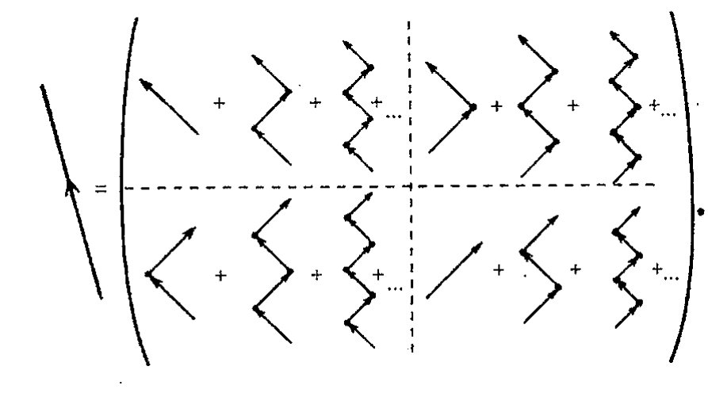
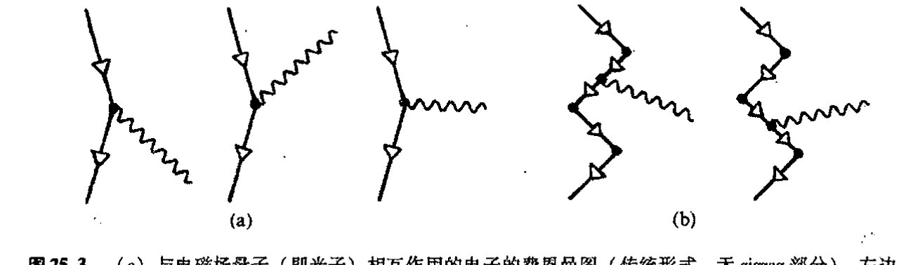
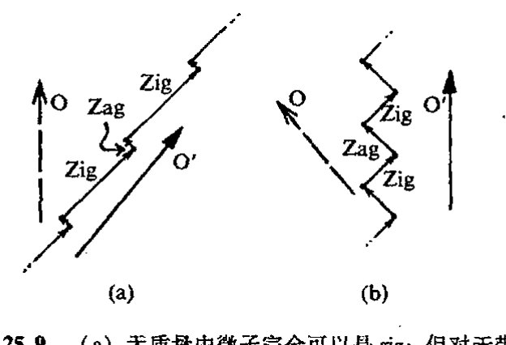
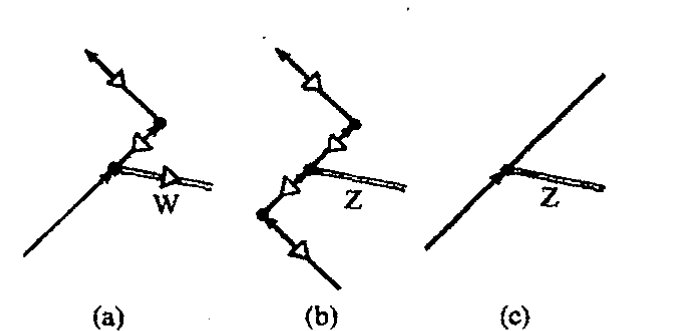

<!-- page 469 -->

通向实在之路

---

## 第二十五章

# 粒子物理学的标准模型

## 25.1 现代粒子物理学的起源

627

电子的狄拉克方程在许多方面是物理学的转折点。1928 年，当狄拉克发表他的方程时，科学上已知的粒子只有电子、质子和光子。如同爱因斯坦在 1905 年所成功预言的那样，自由麦克斯韦方程描述光子。这种早期的工作逐渐由爱因斯坦、玻色和其他人发展，直到 1927 年，约旦和泡利根据量子化自由场的麦克斯韦理论提出了描述自由光子的总体数学框架。此外，像电子一样，似乎质子也可以用狄拉克方程来很好地描述。而描述电子和质子如何受光子影响的电磁相互作用则由狄拉克开出的处方，即规范概念（这基本上是由外尔于 1918 年引入的，见 [§19.4](chapter_19.md#194-作为规范曲率的麦克斯韦场)），来绝好地支配，1927 年，狄拉克本人已经将光子作用于电子（或质子）的完整理论（即量子电动力学）进行系统化。^1^ 因此，就描述大自然中所有已知粒子及其非常明显的相互作用而言，基本工具差不多已具备。

但当时的大多数物理学家不会傻到认为不久就可以得到一种"包罗万象的理论"。因为他们知道；在没有进一步的重大进展之前，不论是使原子核聚集一块儿的力——我们今天称之为强作用力——还是用于放射性衰变的作用机制——现在称之为弱作用力——都还没有准备好。如果原子以及原子核的唯一成分只是以电磁相互作用相联系的狄拉克型质子和电子，那么所有普通的原子核（除了由单个质子构成的氢核）都将因为正电荷间的静电排斥而瞬间解体。因此一定有一种尚不为人知的其他作用，在核内起着非常强的吸引性作用！1932 年，查德威克发现了

628 中子，于是人们彻底认识到，早先流行的原子核的质子/电子模型必须被这样一种模型取代：原子核中不仅有质子而且有中子，强的质子－中子相互作用使核聚合在一起。但就当时的理解来说，即使是这种强作用力也不能解决所有问题。自 1896 年亨利·贝克勒耳的发现之后，铀的放射性已为人知，它显然是另一种既不同于强作用也不同于电磁作用的相互作用——弱作用力——的结果。如果单独来看，甚至中子本身都存在周期约为 10 分钟的放射性蜕变。放射性的神

·450·

<!-- page 470 -->

第二十五章　粒子物理学的标准模型

秘产物之一是难以捕捉的中微子，泡利在1929年就推断过它的存在，但直到1956年人们才直接观察到它。正是放射性研究最终使物理学家们在第二次世界大战末期和战后的一段时间里变得恶名昭著，影响极坏……

今天，我们对粒子物理的认识已较早期（20世纪前三分之一）有了相当大的进展。随着进入21世纪，我们已掌握了更为完备的图像，这就是粒子物理的标准模型。这个模型几乎可用于描述所有观察到的、现今已知的各种粒子的行为。光子、电子、质子、正电子、中子和中微子，已经可拆分为各种不同的其他中微子、μ子、π介子（汤川1934年成功预言）、K介子、Λ和σ粒子，以及著名的通过预言得到的Ω⁻粒子。1955年，通过直接观察得到了反质子，1956年观察到反中子。已知的新粒子还有夸克、胶子、W和Z玻色子；还有一大堆寿命极为短暂以致我们无法直接观察到的粒子，我们通常把它们仅当作“共振态”。现代理论的形式化体系还要求存在瞬态的所谓“虚拟”粒子，以及无法进一步从直接可观察性方面去除的所谓“鬼”。拟用的粒子则更多——都还未观察到——它们为某种理论模型所预言，但却无法从公认的粒子物理的一般框架推断出来，例如“X玻色子”、“轴子”、“光微子”、“标量夸克”、“胶微子”、“磁单极子”、“伸缩子”等等。还有虚幻的希格斯粒子——到我现在写作时还没观察到——其不论以这样或那样（或许不是单个粒子）形式存在，都对当今的粒子物理学有着根本的重要性，因为相关的希格斯场决定着每种粒子的质量。

## 25.2　电子的 zigzag 图像

在这一章里，我将对当今的粒子物理的标准模型作一简明的介绍——虽然我的处理在许多方面可能被看作是不起眼的“非标准”做法。我们的确是以一种稍许非标准的方式，即利用[§22.8](chapter_22.md#228-自旋和旋量)引入的“二维旋量记号”来重新检查狄拉克方程开始。如[§24.8](chapter_24.md#248-正电子的狄拉克途径)评述的，自旋$\frac{1}{2}$粒子的“泡利旋量”描述是一个2分量的量$\psi_A$（分量为$\psi_0$和$\psi_1$）。按照[§22.8](chapter_22.md#228-自旋和旋量)，当我们考虑相对论情形时，我们还需要带撇的指标$A'$，$B'$，$C'$，…，这里带撇的指标是不带撇指标的复共轭。可以证明，²前述的带有4个复分量的狄拉克旋量$\psi$可表示为一对二维旋量³ $\alpha_A$和$\beta_{A'}$：

$$\psi = (\alpha_A, \beta_{A'})。$$

于是狄拉克方程可写成耦合了这两个二维旋量的方程，每一个都作为另一个的“源”而起作用，“耦合常数”$2^{-1/2}M$描述二者间的相互作用强度：

$$\nabla^A_{B'}\alpha_A = 2^{-1/2}M\beta_{B'}, \quad \nabla^{B'}_A\beta_{B'} = 2^{-1/2}M\alpha_{A'}$$

算符$\nabla^A_{B'}$和$\nabla^{B'}_A$是普通梯度算符$\nabla$的二维旋量形式。我们不必在意下标、$2^{-1/2}$和这些方程的精确形式。我在这里写出它们只是要说明狄拉克方程是如何被变换到二维旋量计算的一般框架里的，一旦做到了这一点，我们就可看出狄拉克方程的新的性质。⁴

·451·

<!-- page 471 -->

通向实在之路

从这些方程的形式我们看到，狄拉克电子可看成是由这两种成分 $\alpha_A$ 和 $\beta_{B'}$ 组成的。对这些成分可以有一种物理解释。我们构造一幅有两个"粒子"的图像，一个粒子由 $\alpha_A$ 描述，另一个由 $\beta_{A'}$ 描述，每个粒子都是无质量的，\*[25.1] 且每个粒子连续变换自身而成为另一个粒子。我们把这些粒子称为"zig"粒子和"zag"粒子，其中 $\alpha_A$ 描述"zig"粒子，$\beta_{A'}$ 描述"zag"粒子。作为无质量粒子，它们每一个都以光速运动，但更确切地说，我们可以将它们看成是在前后"摇晃"，前进的 zig 运动紧接着变为后退的 zag 运动，反之亦然。实际上，这就是那种所谓的"颤动"现象，按照这种理解，我们测得的电子的瞬时速度总是光速，因为电子做的正是这种摇摆运动，尽管电子的总体平均速度要小于光速。⁵ 每个成分都有关于自身运动方向的自旋，大小为 $\frac{1}{2}\hbar$，这里 zig 的自旋是左旋的，zag 的自旋是右旋的。（这一点必须与下述事实相一致：zig 的 $\alpha_A$ 有不加撇的指标，它具有负螺旋性；而 zag 的 $\beta_{B'}$ 有加撇的指标，相当于带正螺旋性。所有这些都与 [§33.6](chapter_33.md#336-作为无质量自旋粒子的扭量的几何)–8 的讨论有关，但这里不适于作具体展开。）我们指出，虽然速度方向一直在变，但在电子静止的参照系中，自旋的方向则保持不变（[图 25.1](assets/page471_fig01.jpg)）。在这种解释中，zig 粒子是 zag 粒子的源，反过来 zag 粒子也是 zig 粒子的源，二者的耦合强度由 $M$ 确定。

图 25.1 电子的 zigzag 图像。（a）电子（和其他自旋 $\frac{1}{2}$ 的有质量粒子）可看作是时空内左旋的无质量 zig 粒子（螺旋性 $-\frac{1}{2}$，由不加撇的二维旋量 $\alpha_A$ 或按物理学家们更常用的记号由 $\frac{1}{2}(1-\gamma_5)$ 的投影部分表示）和右旋的无质量 zag 粒子（螺旋性 $+\frac{1}{2}$，由加撇的二维旋量 $\beta_{B'}$ 或由 $\frac{1}{2}(1+\gamma_5)$ 的投影部分表示）之间的振荡。（b）从三维空间里电子的"静止参考系"来看，电子的速度（始终是光速）存在持续的倒向，但自旋的方向不变。（由于手征性的原因，这个图并不完全反映电子在静止参考系中的图像，而是向右缓慢漂移。）

在[图 25.2](assets/page472_fig01.jpg) 中，我给出一张图表演示这个过程是如何带来完整的"费恩曼传播子"（见 [§26.7](chapter_26.md#267-发散的路径积分费恩曼响应)）的，这是一种我们在下一章要详细介绍的费恩曼图⁶ 的样式。每个 zigzag 过程都有有限

---

\* [25.1] 参考 [§25.3](#253-电弱相互作用反射不对称性) 给出的外尔的中微子方程，解释：为什么说取如下观点是合理的：$\alpha_A$ 和 $\beta_{A'}$ 中每一个都描述无质量粒子，二者通过相互作用反转为对方而耦合。

??? question "答案 [25.1]"
    关键在于质量项是否存在。若在狄拉克方程的二维旋量形式中令 $M=0$，方程就分解为两个彼此独立的外尔方程：$\nabla^A_{B'}\alpha_A=0$ 和 $\nabla^{B'}_A\beta_{B'}=0$。每个方程本身都描述一个无质量、自旋 $\frac{1}{2}$、定手征性的粒子；前者是左手的 zig，后者是右手的 zag。

    当 $M\ne0$ 时，右端的 $2^{-1/2}M\beta_{B'}$ 与 $2^{-1/2}M\alpha_A$ 使一个分量成为另一个分量的源。于是单独的 zig 或 zag 不再独立传播，而是在传播中不断转化为对方；这正是正文所说的 zigzag 图像。因此，说每个分量“就自身而言”是无质量粒子，而有质量狄拉克粒子由二者耦合而成，是合理的。

· 452 ·

<!-- page 472 -->

第二十五章 粒子物理学的标准模型

**图25.2** 作为无限量子叠加的一部分，每个zigzag过程分别对费恩曼图中总的"传播子"作出贡献。传统的单线型费恩曼传播子画在了左边，它表示的是右边反画的有限个zigzag粒子的无限叠加构成的整个矩阵。

的长度，但对长度不断增长的zigzag来说，按照图25.2的2×2矩阵描述，其总效果相当于电子的整体移动。典型的情形是一个zig粒子变成一个zag粒子，接着zag粒子再变成zig粒子，然后这个zig粒子又变成zag粒子，如此反复，构成一段有限长度。从总的过程我们发现，这种转变的平均速率与质量耦合参数*M*有关，事实上，这个速率本质上就是电子的德布罗意频率（[§21.4](chapter_21.md#214-量子理论的实验背景)）。

关于如何解读费恩曼图的结构我有句忠告。我们可以将上述过程合法地看成是一种时空描述，但在量子水平上，我们必须采取这样一种观点：即使是对单粒子，也一样同时存在大量的这种过程。每个单独的过程都可看成是参与到为数众多的不同过程的巨大的量子叠加。系统的实际量子态就是由所有这些叠加组成的。一个费恩曼图仅表示其中的一种。

与此相应，我对电子运动的上述描述（运动呈前后摇摆状，zig粒子不断地变成zag粒子然后又变回来）必然会恰当地贯彻这一精神。电子的实际运动由大量的（实际上是无限多个）这种单个过程的叠加构成，我们可以将检测到的电子运动看成是这些过程的某种"平均"（虽然严格说来属量子叠加）。甚至这种描述也只对自由电子成立。实际电子始终处于与其他粒子（如光子、电磁场的夸克）相互作用中。所有这些相互作用过程都应在总的叠加态里加以考虑。

记住这一点之后，我们来提出这么个问题：这些zig和zag粒子是否"真的"存在？抑或是电子的狄拉克方程描述所采用的特有的数学形式的产物？我们还可以将问题提得更一般些：使我们囿于数学描述的形式美并试图将它当作对"实在"的描述的物理根据是什么？在目前情形下，我们将从质疑只是作为数学技术的二维旋量形式体系本身的重要性（和美感）开始。我要忠告读者，实际上，这不是那些关心狄拉克方程及其应用（例如在量子场论最成功的量子电动力学QED中的应用）的物理学家最常用的形式。^7^大多数物理学家用的是所谓"狄拉克旋量"（或四维旋量）形式，其中免去了旋量指标。他们不用二维旋量"α~A~"，而是用四维旋量(1－γ~5~)ψ（它叫做"狄拉克电子的左手螺旋性部分"或类似的称呼，而不是我用的"zig粒子"）。^8^

·453·

<!-- page 473 -->

通向实在之路

这里，量 $\gamma_5$ 是积

$$\gamma_5 = -i\gamma_0\gamma_1\gamma_2\gamma_3,$$

其性质为：它与克利福德代数的每个元反对易，且有 $(\gamma_5)^2 = 1$。^{**[25.2]} 类似地，他们用 $(1+\gamma_5)$ $\psi$ 而不用 $\beta_{A'}$（右手螺旋性部分）。人们或许认为，这只是个记号问题，在二维旋量和四维旋量形式之间完全可以变换来变换去。我这里给出的 "zigzag" 图像确实是按其中的一种形式给出的有效（但不常见的）描述，只是它更倾向于使用二维旋量而非四维旋量。

那么这些 zig 和 zag 真实存在吗？要我说，我认为是这样。它们和 "狄拉克电子" 本身一样是真实的——就作为对宇宙最基本的统一体之一的非常合适的理想化数学描述而言。但它是真正的 "实在" 吗？在 [§1.3](chapter_01.md#13-柏拉图的数学世界真实吗), 4，我谈到过这种一般意义上的数学和物理实在性以及它们之间的关系。在本书的最后，即 [§34.6](chapter_34.md#346-什么是实在)，我还将再次提到这个问题。

## 25.3 电弱相互作用；反射不对称性

每个 zig 和 zag 粒子都有相同的电荷——因为电荷守恒，故必须如此。每个粒子又都持续地转变为对方。在费恩曼图中，荷电粒子与电磁场的相互作用由拖着一条代表光子的波纹线表示。通常的处理如[图 25.3](assets/page473_fig01.jpg)（a），其中电子的轨迹由单个的狄拉克四维旋量线按通常方式表示，[图 25.3](assets/page473_fig01.jpg)（b）显示的是用于 "zigzag" 描述的情形（尽管不是很常见）。

**图 25.3** （a）与电磁场量子（即光子）相互作用的电子的费恩曼图（传统形式，无 zigzag 部分）。左边的图显示的是光子的吸收过程，中间的图是光子的发射过程，右边的图为静电的影响，所有这些过程被认为是相同的，都是与 "虚"（离壳的）光子相互作用。（b）用 zigzag 表示的上述 3 种过程。（虚）光子平等地作用于 zig 和 zag。在所有图中，电荷的传播由白色三角形箭头表示。图中所有图均指向过去，因为我们考虑的是电子，带负电荷。

注意，左旋粒子（zig）和右旋粒子（zag）平等地参与电磁作用。但业已证明，在另一种相互作用——弱作用——下，二者则完全不同，就是说，只有电子的 zig 参与弱作用，而 zag 则根本不

---

^{**}[25.2]** 证明这二者。

??? question "答案 [25.2]"
    设克利福德生成元满足反对易关系 $\gamma_a\gamma_b+\gamma_b\gamma_a=2\eta_{ab}$，并令 $\gamma_5=-i\gamma_0\gamma_1\gamma_2\gamma_3$。若 $\gamma_\rho$ 是其中任一生成元，把它穿过另外三个不同的 $\gamma$ 因子时各产生一次负号，总共给出 $(-1)^3=-1$。把它穿过与自身相同的那一项时只留下相应的度规因子；合起来正是 $\gamma_\rho\gamma_5=-\gamma_5\gamma_\rho$，即 $\gamma_5$ 与每个克利福德生成元反对易。

    再看平方：$\gamma_5^2=(-i)^2(\gamma_0\gamma_1\gamma_2\gamma_3)(\gamma_0\gamma_1\gamma_2\gamma_3)$。用反对易关系把第二串中的同类因子移到一起，会得到由换位次数和各 $\gamma_a^2=\eta_{aa}$ 共同决定的符号。在本书采用的相对论符号约定下，这个符号正好抵消 $(-i)^2=-1$，于是 $\gamma_5^2=1$。不同教材的度规号差可能改变中间符号或把定义中的 $i$ 放在不同位置，但目标总是同一对关系：$\gamma_5$ 与所有 $\gamma_a$ 反对易，且 $\gamma_5^2=1$。

·454·

<!-- page 474 -->

第二十五章 粒子物理学的标准模型

参与（见[图 25.4](assets/page474_fig01.jpg)）。弱作用由类似光子的 W 和 Z 玻色子为媒介。如前所述，这些相互作用可以解释放射性衰变，例如，平均而言，铀 U$^{238}$ 核可以在长达 $5 \times 10^9$ 年的时间内通过这些相互作用自发地衰变成钍和氦核（$\alpha$ 粒子），自由的中子也通过这些相互作用在平均约 15 分钟的时间内衰变成质子、电子和反中微子，见[图 25.5](assets/page474_fig02.jpg)。这些衰变过程通称为“$\beta$ 衰变”，（由于历史原因）电子被当作了“$\beta$ 粒子”。

**图 25.4** 另一方面，在弱相互作用情形下，只有弱作用粒子的 *zig* 部分与 W 或 Z 玻色子发生相互作用。（但对于“反粒子”，参与弱作用的则是其 *zag* 部分。）

**图 25.5** 中子到质子、电子和反中微子的 $\beta$ 衰变，自由中子的这种衰变（平均）约需 15 分钟。反中微子的逆箭头表示它在轻子分类表上属“反粒子”。如同图 25.4 一样，电子和质子线上的白箭头表示电荷极性。

**图 25.6** 弱相互作用不像图 25.5 暗示的那样是“点状的”（原始的费米理论），而是有“矢量玻色子”（W$^\pm$ 或 Z$^0$）居间作用——图中是 W 粒子。

多年以来，弱作用一直被当作单一的点过程来对待——如[图 25.5](assets/page474_fig02.jpg) 所示的单一的衰变点——其背景可追溯到 1933 年杰出的意大利物理学家恩里科·费米提出的设想。但后来这一设想开始遇到理论上的困难，最终这些困难通过温伯格、萨拉姆、沃德和格拉肖的电弱理论（我们在 [§25.5](#255-电弱对称群) 将略加叙述）得到了解决。作为这些更为新颖的思想的一部分，人们认识到，取代价米点状作用的将是居间的“规范玻色子”——前面提到的 W 和 Z 粒子——来传递弱作用，按照这种理论，[图 25.5](assets/page474_fig02.jpg) 的 $\beta$ 衰变可用[图 25.6](assets/page474_fig03.jpg) 来解释。但 zig/zag 不对称的意义何在呢？1956 年，李政道和杨振宁提出了一个惊人的理论，在物理学界引发了的一次大震荡。这一理论认为，$\beta$ 衰变——从而一般的弱相互作用——不应当是反射不变的。不久之后，1957 年 1 月，吴健雄和她领导的小组通过实验确认了这一理论。按照这一理论，弱作用过程的镜像反射一般来说不是一种容许的弱作用过程，因此弱作用具有手征性。特别是，吴健雄的实验检验了放射性钴 60 的电子

· 455 ·

<!-- page 475 -->

通向实在之路

发射模式，发现在辐射电子的分布和钴核的自旋取向之间具有明显的镜像不对称关系（见图 25.7）。这一结果令人震惊，因为此前人们从未观察到基本物理过程具有反射不对称现象！

根据我们的 zig 和 zag 粒子，手征不对称源于如下事实：在镜像情形下，zig 看上去像 zag，zag 看上去则像 zig。我们知道，zig 具有左手螺旋性，而 zag 具有右手螺旋性。它们中每一个都能在镜像反射下变成另一个。（用更常用的术语，就是 $\gamma_5$ 在反射变换下变号，故电子波函数的左旋部分 $(1-\gamma_5)\psi$ 和右旋部分 $(1+\gamma_5)\psi$ 发生交换。）因此，反射对称下弱作用的非不变性可看成是这样的事实：只有电子的 zig 部分参与弱作用。同样，对经历自发 $\beta$ 衰变的中子和作为结果的质子，都可作同样的理解。某种程度上说，中子和质子也可以用狄拉克方程来描述，这时 zigzag 描述对二者也都是合适的。同样，只有中子和质子的 zig 部分参与弱衰变过程，见图 25.8（a）。按照现代理论的图像，更恰当的是将中子和质子都看成是成分粒子，每个都由 3 个夸克组成。夸克本身则由狄拉克方程单独描述，于是 zigzag 图像对每一种都是合适的，图 25.8（b）就是按这些概念来表示中子的 $\beta$ 衰变的。

这里中微子也特别引人注目。至少在非常好的近似上，我们可将它当作无质量粒子来处理。

<!-- page 476 -->

第二十五章 粒子物理学的标准模型

（在任何情况下，其质量较之电子质量都极其微小，肯定不超过电子质量的 $6 \times 10^{-6}$。）如果在二维旋量表示的狄拉克方程中令 $M = 0$，则方程解耦，变成

$$\nabla_{B'}^{A} \alpha_A = 0, \quad \nabla_{A}^{B'} \beta_{B'} = 0。$$

两个方程都可以在没有对方的情形下存在（二者中的每一个方程本身都是表示中微子的"外尔方程"^{10}）。但只有 zig 型的（由不加撇的 $\alpha_A$ 给出，服从 $\nabla_{B'}^{A} \alpha_A = 0$）参与弱作用，或者说可在弱作用过程中产生。因此，中微子是带有左手螺旋性的粒子。

实际的中微子是否有质量呢？现在看来似乎有很好的实验证据表明，至少 3 种中微子中有两种一定是有质量的。这 3 种中微子是"电子中微子" $\nu_e$（参与通常的 $\beta$ 衰变，其反粒子 $\bar{\nu}_e$ 由中子衰变放出，见[图 25.5](assets/page474_fig02.jpg)）、"$\mu$ 中微子" $\nu_\mu$ 和 "$\tau$ 中微子" $\nu_\tau$。日本的探测器 Superkamiokande 的观察清楚地显示了这 3 种中微子类型在质量上的差别，尽管很小（合计约为电子质量的 $10^{-7}$）但不为零，因为它们之间存在相互跃变（"中微子振荡"）的趋势，这在无质量粒子是不可能发生的。我推断 $\nu_e$（或可感知的三者的某种量子"线形组合"）仍可能为零质量，但关于这些的确定性证据仍告阙如。一个无质量中微子可能是完全 zig 粒子，但若有些许质量，则图像更像[图 25.9](assets/page476_fig01.jpg)（a）所描述的那样，zig 难得有机会瞬息跃变为 zag 并再变回来。然而，从随中微子运动的静止参照系来看，zig 和 zag 两方面似乎对整个运动的贡献是相等的（[图 25.9](assets/page476_fig01.jpg)（b））。

这里还有必要澄清几句。在我说参与弱作用的是 zig（即左旋的）粒子而不是 zag 粒子时，我的意思是我们知道如何将"粒子"与"反粒子"区别开来。对于反粒子，事情就不会是这个样子了。在电子的反粒子即正电子情形，我们可以用"zigzag"描述，其中 zig 是左手的，zag 是右手的，但正电子的 zig 是电子的 zag 的反粒子，反之一样。因此，在正电子情形，是右手的 zag（电子的 zig 的反粒子）参与弱作用，而不是 zig。类似判断可应用到反质子和反中子上，也可以用到反夸克上。它还可以用到反中微子上，如果该中微子无质量，则它是一个完全 zag 粒子。

这里可能会造成某些糊涂，因为我还没给出任何判据来确定一个（自旋 $\frac{1}{2}$）类粒子的项可否被看成是"粒子"抑或"反粒子"，以便我们能够知道是它的 zig 粒子还是 zag 粒子参与弱作用。虽然在前一章，我只是依据狄拉克的原始概念"负能态海"中的"洞"给出了反粒子的概念，但反粒子其实不应被认为是总体上从粒子分离出来的一种东西。在现代量子场论里，不必按狄拉克原初的（表观反对称的）形式来表示各种粒子。反粒子和"粒子"一样都是粒子。此外，

<!-- page 477 -->

通向实在之路

反粒子概念可以指玻色子（整数自旋的粒子），如同它用于费米子一样，只是费米子必须服从泡利原理（§§ 23.7, 8），因此关于反粒子的“狄拉克海”的观点不能用于玻色子。例如，带正电的 π 子（π⁺ 介子）是玻色子，它有带负电的反粒子 π⁻ 介子。事实上，好些玻色子就是其自身的反粒子。光子是为一例，中性 π 子（π⁰ 介子）也是这样。就目前所知（当然是根据标准模型），本质上每一种粒子都有反粒子。

## 25.4　正反共轭、宇称和时间反演

用反粒子取代粒子的运算称为 C 运算（表示正反共轭）。在反粒子取代粒子（或其相反）时物理相互作用保持不变的性质称为 C 不变性。空间反射（镜面反射）运算称为 P 运算（表示宇称）。按 [§25.3](chapter_25.md#253-电弱相互作用反射不对称性) 的讨论，通常，不论在 P 下还是在 C 下，弱作用都不是不变的，但可证明它们在组合运算 CP( = PC)下是不变的。我们可将 CP 看成是使一个粒子被反射为其反粒子的特殊镜面上的运算。我们看到，CP 使粒子的 zig 变成了其反粒子的 zag，反之一样。通常还讨论与此相关的另一种运算，称为时间反演 T 运算。如果我们从与日常相反的时间方向上看一种相互作用，发现它与正常时间方向上的情形没有什么不同，我们就说这种相互作用在 T 下是不变的。量子场论里有一条著名的 CPT 定理：每一种物理相互作用在同时应用于所有 3 种 C、P、T 运算时是不变的。自然，一条定理“只是一些数学”，其物理真实性有赖于其假说的物理有效性。这个问题以后（[§30.2](chapter_30.md#302-来自宇宙学时间不对称的线索)）会显得非常重要，在那里我将提出一个至关重要的问题，它可能导致我们对 CPT 定理的结论（同样是假说）产生质疑。但对通常的弱相互作用来说，没有理由担心会有任何困难。相应地，通常弱相互作用的 CP 不变性意味着它们在 T（时间反演对称）下也是不变的。

应当指出，在本书写作期间，又得知有一种 CP 不变的物理过程（一种“非同寻常的”弱作用过程，由菲奇（V. L. Fitch）和克罗宁（J. W. Cronin）于 1964 年首次观察到）。它也是 T 下非不变的（但按照 CPT 定理，我们可以说它在 CPT 下是不变的）。这是一种 K⁰ 介子的衰变模式（可衰变成 2 个或 3 个 π 子，这个过程非常复杂，涉及 K⁰ 翻转为反粒子 K̄⁰，而且在二者间还伴有振荡）。

CPT 定理为我们提供了另一种不同于狄拉克“海”的看待反粒子的观点，它更令人满意，因为它同样能够用于玻色子。有了 CPT，我们就可以将 C——粒子与反粒子交换——等同于 PT，这样，我们就能够将某种粒子的反粒子当成粒子的“时空反演”（PT）。如果不考虑其中的空间反射方面，则我们可将反粒子理解为做时间反向运动的粒子。这正是费恩曼爱用的理解反粒子的方式。它为处理费恩曼图中的反粒子提供了一种相当方便而又和谐的方法。（这一思想是惠勒（John A. Wheeler）向费恩曼建议的，更早些时候（1942）施蒂克尔博格（von B. Stückelberg）曾独立提出过这一思想。）尽管方式各异，它同样是一种犹如狄拉克海那样的“疯狂”思想！

在费恩曼图里，没有反粒子的粒子必须有某种形式取向的线，例如每条线带有适当的箭头。我们可以将这种箭头看成是指向未来的——当线描述的是粒子的时候——反之，在箭头指向过

· 458 ·

<!-- page 478 -->

---

第二十五章　粒子物理学的标准模型

去时，我们认为此时线表示的是该粒子的反粒子。这种关于反粒子的观点有很大的好处，许多看起来非常不同的粒子处理，可由此变成基本上相同的处理过程，当然这是就不同的时空“角度”而言的。例如，在[图 25.10](assets/page478_fig01.jpg) 中（图中未画出 zigzag 粒子），我描述了电子-正电子湮没生成一对光子的过程，显示了这一过程“基本等同于”（即时空重组）光子作用于电子的康普顿散射过程。（稍后我们将看到，我们仍有必要容许粒子的线能够指向类空方向，以描述所谓的“虚粒子”，但眼下这足以让人糊涂！）

**图 25.10**　交叉对称性。在不同空间位置上时序不同、但图的拓扑结构不受影响的两个过程，在数学上（通过解析延拓）基本上是等价的。整个图说明，左边所示的粒子-反粒子对湮没生成两个光子的过程，等价于右边所示的康普顿散射过程（图中未画出 zigzag 粒子）。

现在让我们回到如何确定自旋 $\frac{1}{2}$ 粒子的 zig 或 zag 参与弱相互作用的问题上来。我们需要有明确的法则来判定它是“粒子”还是“反粒子”。所用的这一法则应能够判定，那些称作为“轻子”（电子及其较重的姐妹粒子、$\mu$ 子、$\tau$ 子以及相应的中微子 $\nu_e$、$\nu_\mu$ 和 $\nu_\tau$）的微粒、组成质子和中子（以及其他强子）的夸克，都应算作“粒子”。它们有参与弱作用的 zig 粒子。而这些粒子的“反粒子”则算作反粒子，此时是 zag 粒子参与弱作用。由于弱作用还涉及自旋为 1 的（有质量）粒子，即 W 和 Z 玻色子，^1^ 因此情况更加复杂。这些玻色子是弱作用中的媒介子，起着类似于电磁相互作用中光子的传递作用（光子是电磁场的量子）。这样的粒子有时称为“规范量子”，理由容我后述。存在两种不同的 W 玻色子，分别标以 W⁺ 和 W⁻（二者互为反粒子），它们分别有电荷 1 和 −1（这里以正电子电荷为单位），而 Z 玻色子则只有一种不带电的 Z⁰（它的反粒子就是它自身）。这些玻色子中的每一种都参与弱作用，并在费恩曼图上有一条线，线的一端连着轻子或夸克的 zig 部分，或连着反轻子或反夸克的 zag 部分（见[图 25.11](assets/page478_fig02.jpg)）。在整个弱作用过程中，电荷是守恒的，轻子数也是守恒的。事实上，有 3 种不同的轻子数（电子数、$\mu$ 子数和 $\tau$ 子数），在弱相互作用的标准模型里，每一种都分别守恒，W 和 Z⁰ 的轻子数记为零。为了在费恩曼图中检查这 4 种守恒律，我们所需要做的就是确保线上 4 种箭头的每一种都能以连续、协调一致的取向和路径出现在图上。

**图 25.11**　zig 粒子与弱作用规范玻色子之间相互作用的图示。(a) 带电的 W⁺ 和 W⁻（二者互为反粒子）引起 zig 的电荷发生变化（以保证电荷守恒）。(b) 不带电的 Z⁰ 则不会（它的反粒子就是它自身）。(c) 中微子的 zig 可以和不带电的 Z⁰ 发生相互作用。

640

· 459 ·

<!-- page 479 -->

通向实在之路

## 25.5　电弱对称群

作为一项基本理论，这个题目无疑听起来就有点儿复杂。是的，是复杂，尽管也有一套我还没来得及解释的基本模式。但我在这里还只是以非常定性的方式开始来描述我们目前所理解的粒子物理，按所谓“标准模型”，这些还不到整个内容的一半。此外，到目前为止，我针对参与弱（和电磁）相互作用的各种粒子所做的评述更多地带有“植物分类”特点。事实上，在标准模型里，弱作用和电磁作用被统一到所谓电弱理论的框架内，根据群 SU(2) × U(1)，或更确切地说，^12^是群 U(2)（见 [§13.9](chapter_13.md#139-酉群)，如果你需要回忆一下这些群的话），在这种电弱理论中，存在一种与 W^+^、W^−^、Z^0^ 和光子 γ 有关的特殊对称性，应用于基本模式的正是这种（隐藏着的）对称性。

在本章后面，我会较详细地解释这种对称性的作用。这种对称性也与各种轻子和夸克的 *zig* 部分相关联。从更基本的观点看，由此导致的结果是，所有 W^+^、W^−^、Z^0^ 和 γ 从一定意义上说都可以连续地“彼此轮换”，因此，这些粒子的各种（量子）线性组合与单个粒子本身具有同等地位！

正如我上面所说，这种“对称性”看起来非常奇怪，难以捉摸，因为纯粹的电磁作用是反射不变的，源的 *zig* 和 *zag* 部分具有同等地位，而弱作用在反射变换下则不是不变的，而且只有粒子的 *zig* 部分参与作用。此外，这个理论在考虑所有玻色子时，光子显然因为是无质量粒子而不计其内。实验观察表明，光子的质量即使不为零，也肯定不到电子质量的 10^−20^，更不足 W 和 Z 玻色子的观测质量的 5 × 10^−26^。还有，W 玻色子带电荷而光子不带，但反过来，光子带弱作用荷。

在[图 25.12](assets/page479_fig01.jpg) 中，我罗列了所有可能的只包括规范玻色子（即 W^+^、W^−^、Z^0^ 或 γ）的 3 分支费恩曼顶角。它们只有两种形式。但实际上二者根本就是自由规范场下的某种非线性性表示，它起因于规范群的非阿贝尔性质——这一点用到 U(2) 上结果也一样。（纯粹的电磁作用来源于阿贝尔规范群 U(1)，因此不存在只包含光子的 3 分支费恩曼图。这些可能导致无源麦克斯韦场的非线形性。这些论述可以类比用到 n > 2 的 n 分支顶角情形。）见 [§15.8](chapter_15.md#158-丛曲率)，[§19.2](chapter_19.md#192-麦克斯韦电磁场理论)。从[图 25.12](assets/page479_fig01.jpg) 中图的形状所反映出的有限性质可以看出，所有规范玻色子之间不可能完全对称。

我们怎么才能使这些看上去明显偏离对称性的状况与统一的对称性理论所要求的目标协调起来呢？首先是认识到，费恩曼图实际上藏有比一眼看上去更丰富的对称性，如果以适当方式来看，它们实际表现为 U(2) 对称性。我们先来看[图 25.12](assets/page479_fig01.jpg) 中的两个图。为了更好地理解这里的基

·460·

<!-- page 480 -->

第二十五章 粒子物理学的标准模型

本对称性概念，考虑一个 2 × 2 埃尔米特矩阵（[§13.9](chapter_13.md#139-酉群)）。我们可以想象，它的两个实对角元相当于 Z⁰ 和 γ，另两个非对角元——二者互为复共轭——相当于 W⁺ 和 W⁻。对角元的实数性质相当于说 Z⁰ 和 γ 就等于它们各自的反粒子（[图 25.12](assets/page479_fig01.jpg) 里不带箭头的线），而非对角元的复共轭性质相当于说 W⁺ 和 W⁻ 互为反粒子（在由此及彼的过程中箭头倒向）。这种埃尔米特矩阵的一般 U(2) 变换（我们必须记住，这既包括 U(2) 的自左乘，也包括其逆矩阵的自右乘）以一种非常特殊的方式"搅拌"了埃尔米特矩阵元，但埃尔米特矩阵性质则始终保持不变。实际上，这种类比与 U(1) 在电弱理论中的作用方式非常相似（唯一复杂的就是在这种同化过程中，我们必须考虑迹中对角元的线性叠加，这里的迹与后面 [§25.7](#257-色夸克) 要讲的"温伯格角"有关）。我们之所以感到在真实世界里似乎能看见的这些粒子的反对称性仅出现在电弱理论里，就因为大自然为它们选择了特定的组合方式——即这些元的特殊的量子叠加——使它们以真实的自由粒子面貌出现。

但费恩曼图里其他的明显不对称，即 Z⁰ 和 W± 只能附带粒子的 zig 线，而 γ 则可以不加分辨地附带 zig 或 zag，又作何解释呢？这同样是一个大自然允许我们作何种叠加来发现自由粒子的问题。例如，Z⁰ 和 γ 或许存在某种特定的叠加方式——我们姑且称之为 Y——它只看得见粒子的 zag 部分。（粗略地说，从 γ"减去"Z⁰ 以除去 zig 相互作用，只留下 zag。）我们可以从 Z⁰ 和 Y 中找回 γ，但如果大自然以另一种方式来进行选择的话，那么就有可能存在多种这样的叠加方式，它们起着光子所起的同样的作用。

因此，问题的关键在于：在允许我们找到作为自由粒子而非其他的特定的叠加方式方面，大自然采用的是什么样的标准？基本答案是这样，对自由粒子，我们要求它是一种质量的本征态，为此我们需要知道是什么一般地决定了粒子的质量。这里，我们不能指望在 U(2) 下有完全对称性，换句话说，质量涉及某种对称性破缺。在标准模型里是怎么处理它的呢？这个概念，至少就通常的表现形式来说，也就是目前我们在粒子相互作用中实际观察到的非对称性，源于宇宙早期出现的自发对称性破缺。在那之前，条件与今天的大不相同，标准电弱理论认为，在宇宙早期的极端高温条件下，U(2) 对称性严格成立，因此 W⁺、W⁻、Z⁰ 和 γ 与这些粒子的各种量子叠加态完全是等同的，这时光子 γ 与按这种方式形成的所有其他组合具有同等的地位。但是，随着宇宙温度的降低（大爆炸后约 10⁻¹² 秒温度降到 10¹⁶K 以下，见 §§28.1~3），我们今天观察到的 W⁺、W⁻、Z⁰ 和 γ 就是被这种自发对称破缺过程给"冻结出来"的。因此在这个过程中，4 种实际的粒子之间的矛盾就在早期宇宙的完全对称流形下得到了解释。其中只有 3 种要求有质量，这就是 W⁺、W⁻ 和 Z⁰；余下的那个仍保持无质量的就叫做光子。在最初"纯粹"的无破缺理论中，U(2) 对称性是完整的，此时 W⁺、W⁻、Z⁰ 和 γ 全都是无质量的。作为这种对称性破缺理论的基本面，另一种称为希格斯（粒子）的粒子/场根据需要出现了。希格斯（场）被认为负责将质量派分给所有这些粒子（包括希格斯粒子本身），当然也包括组成宇宙间其他粒子的夸克。

它是怎么做到这一点的呢？很遗憾，这一整套惊人而极富创意的思想的全部细节已超出本书的范围，但我在后面的 [§26.11](chapter_26.md#2611-费恩曼图和真空选择) 和 §28.1 将给出某些片断。眼下，我认为我们通过参考前面图

· 461 ·

<!-- page 481 -->

通向实在之路

---

25.2 所示的狄拉克电子的 "zigzag" 描述就能够很好（虽然是相当不完善）地描述希格斯场的作用。我们知道，电子可看成是左旋的 zig($\alpha_A$) 和右旋的 zag($\beta_{B'}$) 之间的振荡，后二者就自身而言是无质量的。支配狄拉克旋量这两部分 $\alpha_A$ 和 $\beta_{B'}$ 之间 "翻转" 频率的是 "耦合常数" $2^{-\frac{1}{2}}M$。实际上，"希格斯" 观点就是把 $2^{-\frac{1}{2}}M$ 当作场——本质上就是希格斯场——即前面所说的具有耦合常数 $2^{-1/2}M$ 的相互作用（见[图 25.13](assets/page481_fig01.jpg)）。极早期宇宙的自发对称破缺作用的效果之一，就是希格斯场开始变得处处取某个常数值。这个值为确定所有粒子的质量规定了一个总体范围；每种粒子的不同质量值由取决于各个粒子具体情况的某个比例因子确定。

**图 25.13** 在狄拉克粒子的 zigzag 图像中，顶角可看成是与（常态的）希格斯场相互作用。

我打算把对这一整套异乎寻常的概念的评述放到 §§28.1~3 中进行，在那里这么做更合宜。但不论我们对这些概念作何考虑，作为成果的弱作用力和电磁力的统一理论——电弱理论13——已经获得惊人的成功。其所做的预言就是一定存在 Z0（和 W±，但 W± 的存在已从更早些的理论中推断出来了）以及 W± 和 Z0 质量的非常具体的值（分别为约 80 和 90GeV）。141983 年，在（瑞士日内瓦）欧洲核子中心 CERN，通过实验观察到了 W± 和 Z0，预言的质量值经检验吻合得非常好，现代的观测值分别是约 81.4 和 91.2 GeV。许多其他预言也得到确认，到本书写作时，电弱理论已在观察基础上强健地挺立起来。

## 25.6 强相互作用粒子

645

什么是强相互作用呢？描述强相互作用的现代理论构成了标准模型的 "另一半"，这就是量子色动力学或简称为 QCD。这个名字有点儿古怪，因为它的词源希腊语 *khroma* 的意思是 "颜色"，我们也许会问在支配核力的强相互作用理论的什么地方 "着色"。答案是这里 "色" 的概念完全是想入非非的，与通常的那种可见光频率确定的 "色" 的概念毫无关系。15为了解释什么是（核）粒子物理里 "色" 的概念，我们有必要回顾一下并考虑强子的令人迷惑的粒子阵列，其中的中子和质子是两个特例。

"强子（hadron）" 这个名字来源于希腊语 *hadros*，意思是 "强壮的"。强子是自然界中质量较大的基本粒子，它们参与强相互作用（这些相互作用的强度为质量提供了大量的能量）。强子族包括称为 "重子" 的费米子和称为 "介子" 的玻色子。在传统理论中，所有强子都由夸克组成，这一点一会儿还要详细论述。具体来看，称为重子的那些强子都是普通的"核子"（中子或质

· 462 ·

<!-- page 482 -->

第二十五章 粒子物理学的标准模型

子），它们要比称为“超子”（由宇宙线观测和粒子加速器发现）的堂兄弟们重。介子最初是日本物理学家汤川秀树（Hideki Yukawa）于1934年基于核力分析而提出的一种理论预言，1947年，C·F·鲍威尔终于从宇宙线径迹里发现了 $\pi$ 子（$\pi$ 介子）。现在已找到多种 $\pi$ 子的介子兄弟。

“重子（baryon）”这个词来源于希腊语 *barys*，意思是“重的”；而“轻子（lepton）”则源于希腊语 *leptos*，意为“小的”。轻子有电子及其姐妹粒子 $\mu$ 子和 $\tau$ 子，以及相应的中微子；这些粒子的反粒子称为反轻子。轻子和重子都是自旋 $\frac{1}{2}$ 的费米子，而轻子区别于重子则在于它们不直接参与强相互作用——这也许是轻子质量上远小于重子的主要“原因”（虽然 $\tau$ 子是一个例外，它差不多两倍于质子或中子的质量）。

自20世纪40年代后期以来，人们从宇宙线和加速器里已发现了大量的强子：$\Lambda^0$，$\Sigma^\pm$，$\Sigma^0$，$\Xi^-$，$\Xi^0$，$\Delta^{++}$，$\Delta^\pm$，$\Delta^0$，$\Omega^-$，$\rho^0$，$\rho^\pm$，$\omega^0$，$\eta^0$，$K^\pm$，$K^0$，这些粒子中许多更重的类型往往具有较高的自旋（这里以附加的星花作为标记，例如 $\Xi^{*-}$），它们称为“雷杰复现（Regge recurrences）”（见图31.6）。要不是观察表明这些粒子可归入确定的称之为多重态的类中，恐怕至今都令人莫名其妙。对这些多重态性质的完好理解是由盖尔曼（Murray Gell-Mann）和尼曼（Yuval Ne'eman）于1961年给出的。他们认为这些多重态提供了对群 SU(3) 的表示，或更确切地说，是对 SU(3)/$\mathbb{Z}_3$ 的表示（“表示”的概念见 [§13.6](chapter_13.md#136-表示理论与李代数)，“除号”/ 使用所涉及的“商群”概念的解释见 [§13.2](chapter_13.md#132-子群和单群)；这里 $\mathbb{Z}_3$ 是指有3个元的循环群，它是作为 SU(3) 的正规子群而自然出现的；**[25.1]** 亦见 §5.5）。

理解这些表示中所涉概念的最好方法是做这样的假设（如同茨威格和盖尔曼分别在1963年清楚地做出的那样）：每个强子都由确定的自旋 $\frac{1}{2}$ 的基本成分组成，盖尔曼将其命名为“夸克”（3种）和“反夸克”（3种）。每个重子被认为是由3种这样的夸克组成，每个介子则是有1个夸克和1个反夸克组成，这里，夸克的3种类型——称之为3种味——分别叫做（极其缺乏想象力地）“上夸克”、“下夸克”和“奇异夸克”。夸克的神秘之处在于它们拥有分数电荷（以质子电荷为单位），上夸克、下夸克和奇异夸克的电荷值分别为 $\frac{2}{3}$、$-\frac{1}{3}$ 和 $-\frac{1}{3}$。

大概主要是因为这些看起来不合情理的夸克电荷值——相关的事实是夸克本身从未被直接观察到（观察到的粒子总是具有整数电荷值，见 §5.5）——夸克起初并不被认为是真实的粒子，而只是作为对 SU(3)/$\mathbb{Z}_3$ 的不同表示的一种方便的“簿记”。但如果将夸克当作满足自旋 $\frac{1}{2}$ 粒子的“错误统计”的项的话，这个簿记反而是有效的。就是说，对于证明是正确的多重态，人们不得不假托夸克是“玻色子”，而不是需要满足自旋统计定理（见 [§23.7](chapter_23.md#237-玻色子和费米子) 和 [§26.2](chapter_26.md#262-产生算符和湮没算符)）的费米子。

---

**[25.3]** 找出这一正规子群。提示：考虑 $3 \times 3$ 矩阵的行列式。

??? question "答案 [25.3]"
    这个正规子群就是 $\mathrm{SU}(3)$ 的中心。若一个矩阵要与所有 $\mathrm{SU}(3)$ 元素对易，它只能是标量矩阵 $\omega I_3$。又因为它属于 $\mathrm{SU}(3)$，必须满足 $\det(\omega I_3)=\omega^3=1$。

    因此 $\omega$ 只能取三次单位根：$1,e^{2\pi i/3},e^{4\pi i/3}$。所以这个子群是 $\{I_3,\ e^{2\pi i/3}I_3,\ e^{4\pi i/3}I_3\}\cong\mathbb Z_3$。

    它是正规子群，因为中心中的元素与群中每个元素都对易，故对任意 $g\in\mathrm{SU}(3)$ 都有 $g(\omega I_3)g^{-1}=\omega I_3$。

<!-- page 483 -->

通向实在之路

为了理解最后这一点，我们来考虑两个例子。看得最清楚的是一组 10 个自旋 $\frac{3}{2}$ 的粒子。1962 年，盖尔曼和尼曼通过这组粒子预言了 $\Omega^-$ 粒子的存在（此时多重态里所有其他粒子已找到），1964 年，这一预言被确认：$^{16}$

$$\begin{array}{cccc}
\Delta^{++} & \Delta^+ & \Delta^0 & \Delta^- \\
\Sigma^{*+} & \Sigma^{*0} & \Sigma^{*-} \\
\Xi^{*0} & \Xi^{*-} \\
\Omega^-
\end{array}$$

这个阵列很好理解，如果我们将其中的每个粒子都看成是由 3 个不同味的夸克组成的话，其中 d 表示下夸克，u 表示上夸克，s 表示奇异夸克：*$^{[25.4]}$

$$\begin{array}{cccc}
uuu & uud & udd & ddd \\
uus & uds & dds \\
uss & dss \\
sss
\end{array}$$

应当说，这一预言之所以成功，就在于 3 个夸克处于对称态。例如，uud 与 udu 是不可分辨的。此外，其中含 2 个相同夸克构成的态，如 uuu 和 uud，不等同于零，而是可能处于泡利原理起作用的反对称态。自旋 $\frac{3}{2}$ 意味着所有 3 个夸克的自旋（每个都是 $\frac{1}{2}$）成一直线，因此，就态的自旋而言，它们是完全对称的。如果夸克表现得像个费米子，那么我们将在夸克交换下得到反对称，而不是对称性，这显然与这里的图像不一致。**$^{[25.5]}$

对更复杂的情形可作类似的（也更复杂）说明，如通常质子（$N^+$）和中子（$N^0$）所属的一组 8 个自旋 $\frac{1}{2}$ 粒子就属于这种情形：$^{17}$

$$\begin{array}{cc}
N^+ & N^0 \\
\Sigma^+ & \begin{array}{c} \Sigma^0 \\ \Lambda^0 \end{array} & \Sigma^- \\
\Xi^0 & \Xi^-
\end{array}$$

这里，我们必须将 $\Sigma^0$ 和 $\Lambda^0$ 视为本质上占据着六角阵列中心的"同一位置"。这种排列的出现是因为我们考虑到现在的自旋是 $\frac{1}{2}$，因此可认为每个粒子中有 2 个夸克的自旋是平行的，另一个反平行。现已清楚，出现在中心位置的夸克组分 uds 的排列只能有这两种线形独立的方式（对应于

---

\* [25.4] 对第一行验证上标标称的电荷值是正确的。

??? question "答案 [25.4]"
    只需把夸克电荷相加。上夸克 $u$ 的电荷为 $+\frac{2}{3}$，下夸克 $d$ 的电荷为 $-\frac{1}{3}$。于是第一行四个态的总电荷分别是 $uuu:2$，$uud:1$，$udd:0$，$ddd:-1$。

    这正对应于 $\Delta^{++}$、$\Delta^+$、$\Delta^0$ 和 $\Delta^-$ 的上标电荷标记。

\*\* [25.5] 用 [§22.8](chapter_22.md#228-自旋和旋量) 所述的夸克自旋的 2 维旋量描述和新的 3 维 "SU(3) 指标"（取 u, d, s 3 个值）方法，更全面地解释这一点。

??? question "答案 [25.5]"
    自旋 $\frac{3}{2}$ 的三夸克态要求三个自旋 $\frac{1}{2}$ 都按对称方式合成；用二维旋量说，就是自旋部分取完全对称的三指标旋量。另一方面，十重态中的味部分也按对称方式排列：例如 $uuu$ 显然对称，而 $uud$ 表示的是 $uud,udu,duu$ 的对称组合。

    如果夸克只是带有“自旋指标 × 味指标”的普通费米子，那么交换两个夸克时总波函数必须变号；但十重态的空间基态、自旋部分和味部分在这些例子中都是对称的，整体不会变号。这就是正文所说的“错误统计”矛盾。

    解决办法是再给每个夸克加一个三值的色指标 $a=1,2,3$。三夸克颜色部分可取完全反对称的组合 $\epsilon_{abc}$。这样，交换两个夸克时颜色部分给出负号，而可见的自旋—味—空间部分仍可保持对称；总态于是仍满足费米子的反对称性。

· 464 ·

<!-- page 484 -->

第二十五章 粒子物理学的标准模型

强子对 $\Sigma^0$ 和 $\Lambda^0$）；对 uuu，ddd 和 sss 则根本不存在这种排列，这就解释了对其余粒子的排列为什么呈六角形而不是矩形，以及为什么它们每个都只有一种位置。***[25.6]

## 25.7 “色夸克”

我们怎么才能像处理真实粒子那样来处理夸克呢，如果它们有错的“自旋统计”关系的话（见 [§23.7](chapter_23.md#237-玻色子和费米子) 和 [§26.2](chapter_26.md#262-产生算符和湮没算符)）？在标准模型里处理这个问题的方法，^18^ 是要求每味夸克有 3 种（所谓的）“色”，任何由夸克组成的实际粒子在色自由度上必须完全是反对称的。这种反对称性不考虑夸克态本身，因此，在 3 夸克粒子中，单个（费米子型的）夸克之间的反对称性可以有效地转变为对称性。***[25.7] 在自由粒子中，色从不表现出来，因此本质上说，色是“不可观察的”。任何自由粒子都是“色中性的”。例如，我们不会有 3 种不同的 $\Delta^{++}$ 粒子，不论“uud”中的 d 夸克取什么样的色。实际自由粒子的色自由度的反对称性保证了这一点。***[25.8]

这个“色”有时指的是“红”、“白”和“蓝”，这既使我感到困惑（因为我不认为白是一种颜色），也反映出某种误置的爱国情怀。有时“色”是指“红”、“绿”和“蓝”，这稍好点儿；但因为从任何科学意义上看，“夸克色”和眼睛的色感受器之间都不存在关联，因此我用“红”（R）、“黄”（Y）和“蓝”（B）来代替。这样选择术语的好处是我可以更容易地“混合”颜色，我们注意到，“橙黄”、“绿”和“紫”（它们可视为 3 种基本色 R，Y 和 B 的量子叠加）也可以起到和原色集一样的效果。这里确有一种远非仅仅是颜色置换这么简单的对称性，即存在一种完全的色对称的 8 实维 SU(3) 群，其中 R，Y 和 B 只是给出 SU(3) 矩阵作用其上的矢量空间的一组基元（见 [§13.9](chapter_13.md#139-酉群)）。

就目前情况看，这些明显不可观察的“色”自由度的引入显得相当不自然，因为我们要有 9 种基本夸克（包括它们的不同的反粒子和量子叠加）：

$$\mathrm{d}_{\mathrm{R}},\ \mathrm{d}_{\mathrm{Y}},\ \mathrm{d}_{\mathrm{B}};\ \mathrm{u}_{\mathrm{R}},\ \mathrm{u}_{\mathrm{Y}},\ \mathrm{u}_{\mathrm{B}};\ \mathrm{s}_{\mathrm{R}},\ \mathrm{s}_{\mathrm{Y}},\ \mathrm{s}_{\mathrm{B}};$$

其中没有一种是可以直接观察到的。实际上，在标准模型里，情形要比现在的“加倍”糟糕，因为还必须引入夸克的另外 3 种味，称为（同样缺乏想象力）“粲”（c）、“底”（b）和“顶”（t），于是我们还有：

$$\mathrm{c}_{\mathrm{R}},\ \mathrm{c}_{\mathrm{Y}},\ \mathrm{c}_{\mathrm{B}};\ \mathrm{b}_{\mathrm{R}},\ \mathrm{b}_{\mathrm{Y}},\ \mathrm{b}_{\mathrm{B}};\ \mathrm{t}_{\mathrm{R}},\ \mathrm{t}_{\mathrm{Y}},\ \mathrm{t}_{\mathrm{B}};$$

---

*** [25.6] 看看你能否适当地从细节上解释所有这些。如果要用到二维旋量指标，处理时细心点儿。一对粒子如果出现反对称，则这种粒子对应去掉（因为按 [§23.4](chapter_23.md#234-玻姆型-epr-实验) 的自旋 $\frac{1}{2}$ 粒子的性质，这样的一对粒子表示的是自旋为 0 的态）。但还有（隐蔽的）对称性，因为每个夸克只有两个独立的自旋态。

??? question "答案 [25.6]"
    三个自旋 $\frac{1}{2}$ 的粒子合成时，完全对称的自旋部分给出自旋 $\frac{3}{2}$；自旋 $\frac{1}{2}$ 则来自混合对称的组合。换句话说，不可能让三个二值自旋指标全都按独立方式反对称化，因为二维空间中三个完全反对称指标的对象为零；可用的是“两个先耦合，再与第三个耦合”的混合对称结构。

    对味指标也类似。三个不同味 $u,d,s$ 可以形成两种线性独立的混合对称组合：一种对应同位旋三重态中的 $\Sigma^0$，另一种对应同位旋单态 $\Lambda^0$。它们占据同一个六角形中心位置，是因为二者有相同的总电荷和奇异数，但内部味对称性不同。

    对 $uuu,ddd,sss$ 这类三个味全相同的情形，不存在这种“中心处两种混合味态”的自由度；味部分已被相同夸克固定。因此八重态自然形成六角形加中心双态，而不是十重态那样的三角阵列。

*** [25.7] 用指标解释这段说明，这里除了练习 [25.5] 的 3 维味指标外，还有 2 维 SU(3) 色指标。

??? question "答案 [25.7]"
    这里的“2 维 SU(3) 色指标”应理解为文字中的误写：色 $\mathrm{SU}(3)$ 的基本指标是三值的。设三夸克态的颜色指标为 $a,b,c=1,2,3$，味指标为 $i,j,k$，自旋指标为 $A,B,C$。一个色中性的重子态可示意写成 $\Psi_{ABC}^{ijk}\,\epsilon_{abc}\,q^a_{iA}q^b_{jB}q^c_{kC}$。

    若可见部分 $\Psi_{ABC}^{ijk}$ 对交换两个夸克是对称的，那么交换两整个夸克时，$\epsilon_{abc}$ 会因两个颜色指标互换而变号。于是总波函数仍然反对称，符合费米统计。正文说“色自由度上必须完全反对称”，指的正是这个 $\epsilon_{abc}$ 因子。

*** [25.8] 给予解释。

??? question "答案 [25.8]"
    自由强子必须是色单态，也就是在色 $\mathrm{SU}(3)$ 变换下不变的态。对重子来说，颜色部分是 $\epsilon_{abc}$ 这样的完全反对称组合；对介子来说，则是夸克和反夸克颜色指标收缩成的单态。

    因此，“红、黄、蓝”只是内部颜色空间中选取的一组基。把基换成另一组线性组合，只是做了一次色 $\mathrm{SU}(3)$ 变换，并不会产生新的可观测粒子。像 $\Delta^{++}$ 这样的自由强子只有一个色中性态，而不是按某个夸克颜色分裂成三种可观察版本。

· 465 ·

<!-- page 485 -->

通向实在之路

649 这样总共就有 18 种独立夸克，而且每一种都不可直接观察到。

如果说，令人满意的自旋统计关系是这种假设性的、庞大的不可观察粒子群的唯一收获的话，那么这种理论的人为痕迹就太浓重了。但实际上，“自由”夸克色的完全不可观察性质带来了充分的回报！因为这种不可观察性，以及（与此紧密相关的）色 SU(3) 系统的整体不破缺性质，使我们有可能直接将这种对称性当作 §§ 15.1,8 所述的神奇的规范联络概念的基础。回顾一下我们如何描述电磁相互作用就会知道，在那种情形下，规范群是 U(1)（见 [§19.4](chapter_19.md#194-作为规范曲率的麦克斯韦场)，§ 213.9 和 [§24.7](chapter_24.md#247-狄拉克方程)）。电磁作用的 U(1) 规范对称的确被认为是精确而完整的。^19^ 再回顾一下，第 15 章描述的纤维丛概念的真正基础正是作用于纤维的精确对称群。强子的 SU(3) 强相互作用“色群”正好提供了这样一种精确对称性，这与电磁规范群 U(1) 非常相似。将基于阿贝尔群 U(1) 规范联络的电磁理论推广到基于非阿贝尔群 SU(2) 或 SU(3) 规范联络而得到的相应理论，称为杨—米尔斯理论。^20

它确实是量子色动力学（QCD）的基础。正如在电磁学里我们能够用诸如电磁势 A_a 这样的量来调整导数 ∂/∂x^a 一样，作用到夸克场的适当的“协变导数算符”概念（犹如电磁学里的 ∂/∂x^a - ieA_a）带来了丛联络（[§15.8](chapter_15.md#158-丛曲率) 和 [§19.4](chapter_19.md#194-作为规范曲率的麦克斯韦场)）。由于色空间是 3 维的，因此我们这里得到的要比 1 维电磁学情形下的更复杂，恰当的做法是引入指标来对付这些额外的自由度。电动力学情形与强相互作用情形之间的关键区别，就在于 U(1) 是阿贝尔型的（即对易性的，见 [§13.1](chapter_13.md#131-变换群)），而色群 SU(3) 则是非阿贝尔型的，相应的理论称为非阿贝尔规范理论。这一理论带来了特殊的复杂性和有趣的特点。要详尽了解其中的细节，我建议读者去看文献，^21^ 但关于强相互作用如何表现等方面的基本概念大致就是我刚才描述的那些。

QCD 的“规范玻色子”（SU(3) 里类似光子的东西）是叫做胶子的量。在费恩曼图描述中，胶子线附于夸克线上，就像光子线附于带电粒子线上一样（[图 25.14](assets/page485_fig01.jpg)（a））。SU(3) 的非阿贝尔性质表现为：胶子线本身具有“色荷”，故会出现三分支胶子的费恩曼图（[图 25.14](assets/page485_fig01.jpg)（b）），这是在阿贝尔型的电磁情形下不可能发生的现象。

650 由此，在标准模型里，群 SU(3) 的主要作用已经从 20 世纪 60~70 年代的“味对称性”转为当今标准模型的“色对称性”。事实上，在这种标准模型里，3 种味 d，u 和 s 现在都已不是基本组群。起而代之的是 2 元一组的 3 代 (d, u)、(s, c) 和 (b, t)。构成 3 代的概念也适用于轻子，这些代是电子一代、μ 子一代、τ 子一代（均包含各自的中微子）。

整体上看，在标准模型里，强相互作用和电弱相互作用之间存在复杂的相互关联。特别是，在认定为属强作用的基本项和属弱作用的基本项之间出现了一定的“转动”。K^0 介子就是一个例子，它可以在高能的质子—质子碰撞中产生，因此我们说 K^0 是一种强相互作用的本征态。但

· 466 ·

<!-- page 486 -->

第二十五章 粒子物理学的标准模型

当 K⁰ 本身衰变时，它是按弱作用方式衰变的，因此必须将它看成是两个弱作用本征态 K_L（K－长）和 K_S（K－短）的量子线形组合。（K_L 通常在约 5 × 10⁻⁸ 秒时间内衰变成 3 个 π 子，而 K_S 一般则在短得多的时间尺度 10⁻¹⁰ 秒内衰变成 2 个 π 子。）K_L 和 K_S 都是 K⁰ 和它的反粒子 K̄⁰ 的线形叠加，K⁰ 能够通过弱作用而不是强作用“转变为”K̄⁰。强作用基态（K⁰，K̄⁰）与弱作用基态（K_L，K_S）之间的“转动”可用（抽象的）所谓卡比博角（Cabbibo angle，约为 0.26 弧度）来度量。这个角一般性地刻画了强作用和弱作用之间的相互关系。

类似地，还有所谓温伯格角（Weinberg angle）或叫弱混合角（weak mixing angle）（[§25.5](#255-电弱对称群)），用以刻画弱作用和电磁作用之间的相互关系，并构成电弱理论的一个组成部分。的确，电弱理论里某些令人印象最为深刻的证据均来自不同类型的（似乎是独立的）对这个角的观察认定，这些观察得出的结果彼此间非常一致。但就理论而言，卡比博角和温伯格角的地位是不同的，因为一般认为电磁相互作用和弱相互作用是统一了的，因此在大爆炸（§28.1）后的约 10⁻¹² 秒时刻，当电弱理论的 U(2) 对称性被“破坏”时，可以认为温伯格角被“冻结”。但卡比博角在标准模型里就没有这种地位，因为这个模型的电弱相互作用和强相互作用如何统一还没有定论。整个标准模型的基本对称群²²取为 SU(3) × SU(2) × U(1)/ℤ₆。

## 25.8 超越标准模型？

另一方面，我们对卡比博角可以采用对温伯格角所采用的那种观点，但这需要某些超出当今粒子物理标准模型的东西。我们需要这样一种模型，其中的强作用和弱作用在更大的、囊括了 SU(3) 和 U(2) 的对称群下得到统一。这种理论称为大统一理论，或简称为 GUT。目前还没有广泛接受的 GUT，而是存在多种尝试（主要是基于 SU(5)，或 SO(10)，或例外群 E₈ 的模型，见 [§13.2](chapter_13.md#132-子群和单群)）。在 [§31.14](chapter_31.md#3114-神奇的卡拉比丘空间m-理论) 我们将看到，弦论也与此有关。那些可靠的 GUT 模型的某些值得注意的推断将在 [§28.2](chapter_28.md#282-宇宙的拓扑缺陷) 里介绍。

不管怎样，关于粒子物理的标准模型显然不是“最终答案”，因为它包含了许多无法解释的方面和“粗糙的边界”，尽管它无疑是成功的。这个模型包含了差不多 17 种无法解释的、仅出于观察需要而设的参数（像卡比博角和温伯格角、夸克质量和轻子质量、以及各种其他参数）。而且在 SU(3) 和 U(2) 的角色之间还存在相当奇怪的反对称性——就是说 SU(3) 被认为是精确的，而 U(2) 则受到严重破坏。在我看来，将 U(2) 取为“规范群”的特殊做法的确显得奇怪，这种群似乎要求有严格完整的对称性（见第 15 章，特别是 [§15.8](chapter_15.md#158-丛曲率) 结尾的段落）。

在这里，另一项不同于 GUT 概念的发展也值得一提，它从一个新的角度来讨论这个问题。我个人对此特别感兴趣，这有几方面的原因，我们到 [§33.13](chapter_33.md#3313-面向粒子物理的扭量理论) 就会明白。这是由一对华裔英籍夫妻小组陈匡武（Chan Hong-Mo）和周尚真（Tsou Sheung Tsun）提出的理论（2002）。在他们的理

· 467 ·

<!-- page 487 -->

通向实在之路

论中，每个（非阿贝尔）粒子对称群有一个相应的对偶群，它与原来的群一样是抽象群，但扮演的则是相反的角色。还记得 [§19.2](chapter_19.md#192-麦克斯韦电磁场理论) 引入的麦克斯韦张量 $F$ 的对偶张量 $^*F$ 吧，我们可想象有这么一个“对偶的”U(1)规范联络，它有丛曲率 $^*F$（[§15.8](chapter_15.md#158-丛曲率)）而不是 $F$。这一概念可起到类似于标准模型 SU(2)和 SU(3)的剩余对称群的作用。但由于这些群是非阿贝尔群，因此我们不能简单地再将相应的对偶曲率直接当作丛曲率***[25.9]，而是需要作更复杂的处理（这里需要考虑“路径相关”项）。

这一理论吸引人的一个方面，是群及其对偶群定性来看起着不同的作用，其中一个是严格的，就像 QCD 的 SU(3)（或电磁理论的 U(1)），而另一个则像电弱理论里的 SU(2)是破缺的，这里严格群要求有“约束”（此即所谓在 SU(3)情形下阻止“变色的”夸克逃到外部世界）。（这个性质与特霍夫特和温伯格的早期工作有关。^{23}）在陈–周理论中，有一个新的严格 SU(2)（对偶于电弱理论中普遍存在的破缺项），它可能就是一种迄今尚未发现的对称性，就好比那种作为被约束的“双色”轻子组分的夸克。（这些亚粒子会很重，这或许就是为什么它们至今未被探测到，以及为什么在当今能量水平上轻子看起来还像是点粒子的原因。）相应地，必然还存在破缺的 SU(3)（对偶于色 SU(3)），它正好当作夸克 3 代和轻子 3 代的“SU(3)”，这在传统意义上的标准模型里是难于理解的。陈–周理论还对标准模型中的 17 种（甚至更多）自由参数给予了明确预言，其中 14 个参数通过 3 个可调参数计算得到。我认为这是向前迈进的决定性一步，一旦这些预言被证实的话。照目前情况看，前景应该说相当光明。

在对待标准模型的普遍看法上，有一点我不甚清楚，群 SU(2)在受到严重破坏时怎么才能作为实际的规范群。一些人也许将这种 SU(2)当作某种“隐对称”的反映，这种隐对称是真正严格的对称，它只是作为规范群“潜在地”起作用，电弱理论的 SU(2)就是这个群的某种外在表现。（这或许离陈–周的概念不远，但不像后者那么明白。）关于电弱理论的 SU(2)的传统观点大致是这样：它实际上是（或不如说，但愿是）严格的，只是在早期宇宙的极端条件下发生了破缺。我们将在第 28 章一睹由此引出的一些让人失望的结论。与此同时，作为下一章讨论的一部分，我们将考察标准模型里对称性破缺背后的那些奇特而基本的数学概念。

---

**注 释**

**§ 25.1**

25.1 见 Pais（1986），334 页和 356 页，参考文献 25，26。（中译本《基本粒子物理学史》，派斯著，关洪、杨建邺、王自华、付冬梅译，武汉出版社 2002 年第 1 版，421 页和 447 页。——译者）

**§ 25.2**

25.2 我一直没有从细节上给出如何将 [§24.7](chapter_24.md#247-狄拉克方程) 所述的狄拉克方程变换为这里的二维旋量形式。感兴趣的读

---

***〔25.9〕你能看出这里的困难是什么吗？提示：写出规范曲率、比安基恒等式等的表达式。

??? question "答案 [25.9]"
    阿贝尔情形中，电磁曲率是普通二形式 $F=dA$，并满足比安基恒等式 $dF=0$。在无源情形，麦克斯韦方程还给出 $d{*F}=0$，所以至少局部地可以把 $*F$ 也看成某个“对偶势”的曲率。

    非阿贝尔规范理论中，联络为 $A$，曲率为 $F=dA+A\wedge A$，比安基恒等式不是 $dF=0$，而是 $DF=dF+A\wedge F-F\wedge A=0$。

    曲率 $F$ 是李代数值的，并且在规范变换下按共轭方式变换；不同点处的李代数元素不能不经平行移动就直接比较。即使场方程可写成类似 $D{*F}=0$ 的形式，$*F$ 也并不自动满足某个新联络所需的非阿贝尔比安基恒等式。若要把它解释成“对偶联络”的曲率，就必须引入路径有序和平行输运等非局部、路径相关结构。这就是正文所说不能简单地把非阿贝尔对偶曲率直接当作另一个丛曲率的困难。

· 468 ·

<!-- page 488 -->

第二十五章 粒子物理学的标准模型

者可参考 Zee (2003) 的附录。外尔引入了二维旋量 (Weyl, 1929)，见 van der Waerden (1929)；Infeld and van der Waerden (1933)；Penrose and Rindler (1984)，221～223 页；以及 Zee (2003) 的附录。

25.3 这些是 [§11.5](chapter_11.md#115-克利福德代数) 指出的约化旋量（或半旋量）。

25.4 见 Penrose and Rindler(1984, 1986)；van der Waerden(1933)；Laporte and Uhlenbeck(1931)。

25.5 见 Schrödinger (1930)；Huang (1949) 或 Hestenes (1990) 的有趣的现代观点。

25.6 那些已经熟悉费恩曼图的读者会发现我画的垂直方向的时序令人糊涂。在 QFT 圈子里，更为常见的是取向右为时间增长方向。我之所以偏爱将时间增长方向取为向上，是因为要与相对论圈子里惯常使用的记号保持一致，这样就与大多数时空图（特别是见第 17 章）协调一致了。

25.7 实际上，在 QED 中使用二维旋量公式系统可以使这些物理学家省出不少时间！见 Geroch（芝加哥大学讲课笔记，未出版），亦见 [§34.3](chapter_34.md#343-物理理论中时尚的作用)。

25.8 我自己的习惯是写成这里的 $(1 \pm i\gamma_5)\psi$，而不是其他作者的 $(1 \pm \gamma_5)\psi$（见 Penrose and Rindler1984, 1986, 附录）。这里，我是让自己来适应这种似乎要成为物理学界的标准的形式。

## § 25.3

25.9 这大概是受到了马丁·布洛克（Martin Block）建议（由理查德·费恩曼转述）的部分影响；见 Martin Gardner 在 *The New Ambidextrous Universe* (W. H. Freeman 1990) 一书第 22 章里所作的精彩描述。

25.10 这个问题是外尔于 1929 年提出的。在狄拉克得到他的“电子的狄拉克方程”之前，他也考虑过这个问题；见 Dirac (1928)；Dirac (1982)。泡利曾因它在空间反射变换下不具不变性从而强烈反对外尔方程。遗憾的是，在为其理论辩护的弱相互作用下空间反射的非不变性提出来之前，外尔就去世了。Zee (2003) 讨论了这两个方程。

## § 25.4

25.11 自旋为 1 的有质量粒子可以用 3 种成分来描述，譬如说，左旋的 zig（螺旋度为 1），右旋的 zag（螺旋度 -1）和无旋的“zog”（螺旋度为 0）。（zig 的二维旋量和 zag 的二维旋量分别有两个不带撇的指标和两个带撇的指标，而 zog 的二维旋量则各带一个。）我们可以认为，正是 zog 粒子传递着弱作用。

## § 25.5

25.12 这个群可表示为 $\mathrm{SU}(2) \times \mathrm{U}(1)/\mathbb{Z}_2$，这里“$/\mathbb{Z}_2$”意味着“由 $\mathbb{Z}_2$ 子群析出因子”。然而，由于存在不止一个这样的子群，因此这个记号并不十分显然。记号“U(2)”自动地取正确形式。（这一观察还要感谢周尚真。）电弱对称群无法表示为“U(2)”的原因似乎是它很难扩展为整个标准模型的对称性，标准模型并入了强相互作用对称群 SU(3)，整个群为 $\mathrm{SU}(3) \times \mathrm{SU}(2) \times \mathrm{U}(1)/\mathbb{Z}_6$；见 [§25.7](chapter_25.md#257-色夸克)。

25.13 电弱理论由斯蒂芬·温伯格、谢尔登·格拉肖和阿布杜勒·萨拉姆于 20 世纪 60 年代后期提出——这一工作使三人共同荣获了诺贝尔物理奖。见 Weinberg (1967)；Salam and Ward (1959)；Glashow (1959)。关于电弱理论的一般性参考文献见 Zee (2003) 或 Halzen and Martin (1984)；Kaku (11993)。

25.14 GeV 是吉(giga)电子伏。Giga 是希腊语前缀，意为 $10^9$ 倍；电子伏是能量单位，特指一个自由电子在电势差为 1 伏的情形下获得的能量，其值约为 $1.6 \times 10^{-19}\mathrm{J}$。

## § 25.6

25.15 波长在 $\lambda = 400 \sim 700$ 纳米之间的电磁波是可见光，人们可按照关系 $\nu = c/\lambda$ 在波长和频率间进行换算。

25.16 理论方面见 Gell-Mann and Ne'eman (2000)；V. E. Barnes 关于 $\Omega^-$ 子的实验观察的论文初版于 1964 年，也是这方面的工作，见 88～92 页。

25.17 按现代粒子物理学的术语，“N$^+$”和“N$^0$”似乎已经代替了质子“p”和中子“n”。这么做与其他粒子的记号是一致的，因为 $(\mathrm{N}^+, \mathrm{N}^0)$ 构成 SU(3) 分类表中如同 $(\Xi^0, \Xi^-)$ 等一样的双重态，因此我们可以把核子一般地称作为“N”子。

## § 25.7

25.18 见 Han and Nambu (1965)。

25.19 见 Weinberg(1992)。

25.20 1954 年，杨振宁和米尔斯发现了这一理论 (*Phys. Rev.* **96**, 191～195)，虽然此前沃尔夫冈·泡利在二战

· 469 ·

<!-- page 489 -->

通向实在之路

后的那几年就发现了它的基本概念，1955年，罗纳德·肖也得到了这些概念。见阿布杜勒·萨拉姆（1980）在诺贝尔奖获奖演说中关于这些史实的详尽叙述。现在用来绕开“无质量”问题的杀手锏就是我们在[§25.5](#255-电弱对称群)里提到的对称破缺的“希格斯机制”，我将在[§26.11](chapter_26.md#2611-费恩曼图和真空选择)对此作进一步讨论。

25.21 技术细节的讨论，见 Aitchison and Hey（2004），第2卷，或 Zee（2003）；规范理论概念的综述见 Chan and Tsou（1993）。

25.22 见注释25.12。标准模型的综述可在任何一本好的量子场论教科书中找到，如 Zee（2003）。

[§25.8](#258-超越标准模型)

25.23 陈—周的思想见 Chan and Tsou（2002）；它基于 t'Hooft（1978）发展起来的一种性质。

·470·
