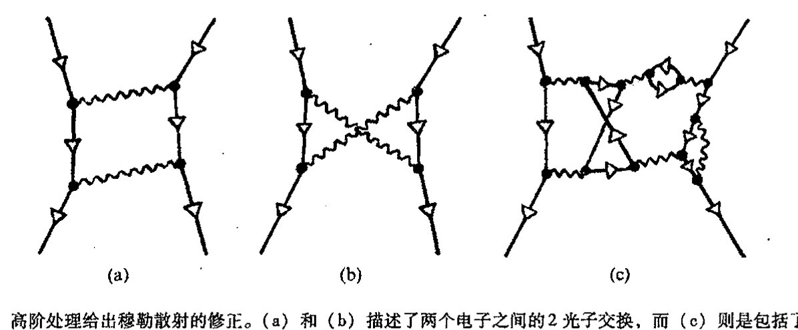
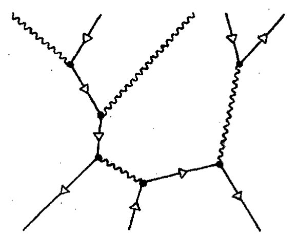

<!-- page 490 -->

第二十六章 量子场论

第二十六章

量子场论

26.1 量子场论在现代物理中的基础地位

在上一章里，我们已经简单了解了20世纪粒子物理的标准模型。它是一个在很多方面与观察事实符合得非常好的数学模型，这个模型包括了好些独创的、与大自然有着深刻和谐统一的数学要素。然而正如我所展示的，这个模型的数学结构似乎有些复杂和随意。当然，大部分结构出自粒子物理的严峻事实，而且物理学家们也已经逐步接受了这些大自然呈现的事实。对任何一项严肃的科学理论，原本就该这样。但是，标准模型之所以选择这样一种结构还有着非常充足的理论上的理由。理论的预言能力从根本上说就依赖于作为这一理论基础的数学相容性。

理论上的驱动力来自从第24章开始的故事续篇：我们怎么才能找到一种与爱因斯坦的狭义相对论要求相容的粒子物理的量子理论？在那一章里我们看到，狄拉克将反粒子引入相对论量子理论中具有重要意义，它迫使我们进入场量子理论的架构。实际上，标准模型只是相互作用场的量子理论的一个特例，它主要是受到强有力的相容性要求的推动，而这一点是这种理论很难满足的。为了评估这些相容性要求背后的力的作用（它一直推动着当今更现代的抽象理论，如弦论），我们有必要看看量子场论结构的某些方面。这也有助于我们把握好前面引入的费恩曼图的意义。此外，我们还将获得关于反粒子的另一种观点，某种意义上，它比我们在23、24章所采用的观点更广泛。

量子场论构成了标准模型的实质性基础，它也是所有其他试图探询物理实在基础的物理理论的基础。因此我们有必要通览一下这座宏伟壮观的理论大厦，这一理论很大程度上源自保罗·狄拉克的远见卓识，我们在第24章就提到过这一点。应当指出，狄拉克本人就是量子场论的主要创始人，虽然做出重要原创性贡献的还有约旦、海森伯和泡利。当然，这一理论在当时对许多饶有兴趣的问题都无法给出有限的答案——相反，结果中会不断出现"∞"，直到后来贝蒂（Bethe）、朝永振一郎（Tomonaga）、代森（Dyson）、施温格（Schwinger）和（特别是）费恩曼

<!-- page 491 -->

通向实在之路

通过“可重正化”技术才使得量子场论理论变得可用。再后来，沃德（Ward）、温伯格、萨拉姆、威尔逊（Wilson）、费尔特曼（Veltman）、特霍夫特（t'Hooft）等人提出了一系列适当分类的可重正化理论，为今天所谓的粒子物理的标准模型做出了关键性贡献（第25章），我们方可从中得到一致的答案。¹（理论要求似乎总是那么严苛，好像这些答案与实验结果之间的高度一致性纯属偶然！）基本问题一直都围绕着解决某种形式的无穷大来进行，这一点以及由实验观察带来的重要结果始终是理论沿正确而富于成果的方向发展的驱动力。

事实上，量子场论似乎是几乎所有试图以认真的方式在最深入层面上图解宇宙机制的那些物理理论的基础。许多（差不多绝大多数）物理学家都持这样的观点：量子场论的架构已“为大家所公认”，任何关于不协调（通常是指来自发散积分或发散求和或二者兼而有之的无穷大）的非难都是针对量子场论所应用的具体领域，而非量子场论框架本身。这一理论一般由服从一定的对称性原理的拉格朗日量具体化。在[§26.6](#266-相互作用拉格朗日量和路径积分)，10，我们将看到拉格朗日量的概念如何应用于量子场论的一般方法。

试图去掉量子场论中无穷大的现代做法大都看好引力，以图从极小尺度上来根本改变时空行为，并由此提供某种“截断”来解决目前仍存在的发散问题（例如，见[§31.1](chapter_31.md#311-令人费解的参数)）。但在引入爱因斯坦广义相对论的（引力）原理之后，这里也还存在量子场论本身是否需要调整的问题（见第30章）。从当前该领域众多研究者的工作来看，目前形式的量子场论基本上没什么问题，关键是我们应当尽快熟悉掌握这些复杂概念。显然，我不可能对这一宏伟的、影响深远的、困难的、有时现象上是精确的、但更多时候则是作弄人般自相矛盾的复杂理论作过细的描述。在最后转回到为标准模型提供理论推动力的那些专题之前，我将尽可能让大家品味量子场论的芬芳，虽然难以顾及全面。

## 26.2　产生算符和湮没算符

量子场论最早的概念之一是所谓“二次量子化”过程，这个名字很容易引起误解。在此过程中，我们将某个粒子的波函数ψ本身看成是作用到记号为|0⟩的影子态矢的“算符”，这种影子态矢往往躲在算符的最右边（比较[§21.3](chapter_21.md#213-薛定谔方程)的薛定谔绘景和[§22.4](chapter_22.md#224-幺正演化薛定谔绘景和海森伯绘景)的海森伯绘景）。我将用大写黑体希腊字母Ψ来标记这种“波函数算符”，与此相应的希腊字母ψ则标记单粒子波函数。如同在普通量子力学中一样，Ψ可看成是粒子的三维空间位置**x**的函数，即Ψ=Ψ(**x**)，或三维动量**p**的函数Ψ̃=Ψ̃(**p**)，如果在动量表象下的话。

我们怎么来理解这个奇怪的“波函数算符”Ψ（或Ψ̃）呢？它不表示实际的量子态，而是对“产生”新粒子运算的描述，这种新粒子具有给定的波函数²Ψ，并将它引入到先前的态——这个“先前的”态就是紧跟在算符Ψ（或Ψ̃）右边的那个表达式。这种算符称为产生算符。

处于算符最右边的影子态矢|0⟩通常看成是“真空态”，表示完全不存在任何粒子。然后

·472·

<!-- page 492 -->

第二十六章　量子场论

一连串这样的产生算符产生一连串粒子，一个个地加入到真空中，因此

$$\Psi\Phi\cdots\Theta|0\rangle$$

是持续引入粒子所形成的结果态，这些粒子分别具有波函数

$$\theta,\ \cdots,\ \phi,\ \psi。$$

由于任何一种粒子不是费米子就是玻色子，因此这个因素也需要考虑。尤其是泡利原理必须加进来，使我们不至于将两个费米子引入到同一个态上。在这种体系里，对任意一个费米子波函数 $\psi$，泡利原理表现为性质 $\Psi^2=0$（即 $\Psi\Psi=0$），它说明，如果我们试图两次引入这个特殊的费米子波函数到这个态，我们得到的便是零，零不是一个可容许的态矢。这条“泡利原理”法则只是反对易性质的一个特例

$$\Psi\Phi=-\Phi\Psi,$$

这里 $\Psi$ 和 $\Phi$ 是描述同类型费米子的产生算符。对于描述同类型玻色子的产生算符 $\Theta$ 和 $\Xi$，我们有对易性质***(26.1)

$$\Theta\Xi=\Xi\Theta。$$

因此，我们看到，产生算符满足我们在 [§11.6](chapter_11.md#116-格拉斯曼代数) 中描述的（分次的）格拉斯曼代数规则，这里，费米子的产生算符被认为是奇次的，玻色子的产生算符则是偶次的。

按照 [§24.3](chapter_24.md#243-量子力学里能量的正定性) 的讨论，对粒子的产生来说，引入到态的波函数必须有正频率。负频率的量也在体系中扮演着角色，即湮没算符。正频率波函数 $\psi$ 的复共轭 $\bar{\psi}$ 是一个具有负频率的量。与它相伴的是湮没算符 $\Psi^*$——产生算符 $\Psi$ 的埃尔米特共轭³（[§13.9](chapter_13.md#139-酉群)）。$\Psi^*$ 的意义是表示从总的态去掉一个粒子的运算（总的态是指这样一种态，它像前面一样，由处于 $\Psi^*$ 右边的所有项来表示）。由于影子真空态 $|0\rangle$ 不含任何粒子，因此任何湮没算符直接作用到它上必为零：

$$\Psi^*|0\rangle=0。$$

当然，这并不意味着湮没算符给出的总是零，因为在这之前我们可以有某些粒子。例如 $\Psi^*\Phi\Theta|0\rangle$ 的表达式就不必为零。即使是态 $\Phi$ 和 $\Theta$ 中没有一个与要去掉的 $\Psi$ 相同的情形，这一点仍然成立。因此我们不应认为算符 $\Psi^*$ 只起着从态中除去粒子的具体波函数 $\psi$ 的作用。⁴ 一般来说，具体波函数 $\psi$ 通常并不是态的某个部分的精确刻画，相反，实际上 $\Psi^*$ 的作用是与态中要去掉的那种粒子类型所对应的部分构成标量积。（在图 26.1 中——主要是专家游戏——我展示了我所说的这些在费米子和玻色子两种情形下的图示记号形式，其中还给出了产生算符和湮没算符的图示记号。）***(26.2) 与此相应，产生算符和湮没算符（对同一种粒子）必须满足（反）对易法则

---

***〔26.1〕解释：对玻色子和费米子，为什么它像 [§23.8](chapter_23.md#238-玻色子和费米子的量子态) 所述那样，都给出带正确对称性的态？

??? question "答案 [26.1]"
    玻色子的多粒子态取对称张量积，交换两个同类玻色子不改变态；费米子的多粒子态取反对称外积，交换两个同类费米子使态变号。产生算符的对易或反对易关系正是在算符层面实现这种对称性：玻色子产生算符可交换，所以顺序无关；费米子产生算符反对易，所以交换顺序只改变符号，而同一费米态重复产生给出零。

****〔26.2〕用 [§23.8](chapter_23.md#238-玻色子和费米子的量子态) 的指标记号或图 12.17 的图示记号，或同时用这两者，并利用 $\bar{\psi}_\alpha\psi^{[\alpha}\phi^\beta\cdots\chi^{\kappa]}$ 这样的表达式来解释所有这些（并对某种给定粒子证明其产生和湮没的对易律）。对费米子和玻色子两种情形，找出所有保持态归一化的阶乘因子。

??? question "答案 [26.2]"
    用指标记法看，产生一个粒子就是把一个单粒子波函数添入已对称化或反对称化的多指标态中；湮没一个粒子就是用共轭波函数对其中一个指标作缩并。费米子情形的方括号反对称化给出反对易关系，玻色子情形的圆括号对称化给出对易关系。若 $n$ 粒子态按 $1/\sqrt{n!}$ 归一化，则产生算符带因子 $\sqrt{n+1}$，湮没算符带因子 $\sqrt{n}$；费米子同一态最多占据一次，符号由把相应指标移到缩并位置所需的置换奇偶性给出。

<!-- page 493 -->

通向实在之路

$$\psi\alpha = |\psi\rangle = \Psi|0\rangle \leadsto \downarrow, \qquad \overline{\psi}_\alpha = \langle\psi| = \langle 0|\Psi^* \leadsto \uparrow$$

| 玻色子情形 | 费米子情形 |
|-----------|-----------|
| 产生算符 $\Psi$： | |
| [图示：N个圆圈的弹簧状线上增加一个向下的三角形] | [图示：N个圆圈的横线上增加一个向下的三角形] |
| 湮灭算符 $\Psi^*$： | |
| [图示：N个圆圈的弹簧状线上增加一个向上的三角形] | [图示：N个圆圈的横线上增加一个向上的三角形] |

图26.1 下列作用量的图示形式：玻色子情形 $\phi_1^{(\beta}\phi_2^\gamma\cdots\phi_N^{\nu)} \mapsto \psi^{(\alpha}\phi_1^\beta\phi_2^\gamma\cdots\phi_N^{\nu)}$ 和费米子情形 $\phi_1^{[\beta}\phi_2^\gamma\cdots\phi_N^{\nu]} \mapsto \psi^{[\alpha}\phi_1^\beta\phi_2^\gamma\cdots\phi_N^{\nu]}$ 下产生算符 $\Psi$ 的作用量；玻色子情形 $\phi_1^{(\alpha}\phi_2^\beta\cdots\phi_N^{\mu)} \mapsto \overline{\psi}_\alpha\phi_1^\alpha\phi_2^\beta\cdots\phi_N^{\mu)}$ 和费米子情形 $\phi_1^{[\alpha}\phi_2^\beta\cdots\phi_N^{\mu]} \mapsto \overline{\psi}_\alpha\phi_1^\alpha\phi_2^\beta\cdots\phi_N^{\mu]}$ 下湮没算符 $\Psi^*$ 的作用量。

$$\Psi^*\Phi \pm \Phi\Psi^* = i^k\langle\Psi|\varphi\rangle I,$$

这里，"+"号用于费米子，"－"号用于玻色子，$I$ 是单位算符，$\langle\ |\ \rangle$ 为单个粒子的普通希尔伯特空间的标量积（我们已在[§22.3](chapter_22.md#223-幺正结构希尔伯特空间和狄拉克算符)考虑过无自旋的情形，这里适当推广到有自旋的粒子⁵），$i^k$ 按自旋的不同取 $1,\ i,\ -1,\ -i$ 中的一个（我不担心你会搞错）。对两个产生算符（仍取上面这两个）和两个湮没算符，我们还有如下（反）对易法则（"+"号用于费米子，"－"号用于玻色子）：

$$\Psi\Phi \pm \Phi\Psi = 0,\quad \Psi^*\Phi^* \pm \Phi^*\Psi^* = 0.$$

需要指出的是，按[§23.7](chapter_23.md#237-玻色子和费米子)给出的自旋统计定理，我们得有针对半奇数自旋 $\left(\dfrac{1}{2},\ \dfrac{3}{2},\ \dfrac{5}{2},\ \cdots\right)$ 粒子的反对易法则（因是费米子，故皆取正号），和针对整数自旋 $(0,\ 1,\ 2,\ 3,\ \cdots)$ 粒子的对易法则（玻色子，取负号）。这么做的道理已超出本书的范围，就不在这儿叙述了。⁶ 但实质问题是要解决能量正定性（对费米子情形）和粒子数正定性（玻色子情形），以及相关旋量指标的组合性质。⁷

## 26.3 无穷维代数

对费米子情形，这些反对易法则正好与[§11.5](chapter_11.md#115-克利福德代数)描述的克利福德代数法则一致。***[26.3] 唯一的基本区别就在于普通的克利福德代数是有限维的，而对于费米子场，产生算符和湮没算符的空间则是无限维的——单粒子波函数是无限维的。不过读者应当明白，尽管无限维空间在很多方

---

***[26.3] 解释这种克利福德代数结构，更明确地指出标积的作用。（将克利福德代数的定义关系取为形式 $\gamma_p\gamma_q + \gamma_q\gamma_p = -2g_{pq}I$。）提示：$g_{pq}$ 不必是对角阵。

??? question "答案 [26.3]"
    给每个矢量 $p$ 配一个克利福德乘法算符 $\gamma_p$，并要求反对易子只留下标量部分：$\gamma_p\gamma_q+\gamma_q\gamma_p=-2g_{pq}I$。这意味着乘积的对称部分完全由标积 $g(p,q)$ 决定，而反对称部分携带外积式的信息。若 $g_{pq}$ 非对角，关系仍然成立，只是不同基方向的 $\gamma$ 不再简单反对易；它们的反对易子等于相应非零标积。

·474·

<!-- page 494 -->

第二十六章 量子场论

面与有限维空间情形相似，但仍有着非常不同的性质，而且常常更难于处理。

有意思的是，量子场论体系还用到我们前面考虑过的某种有限维代数结构的无限维版本。例如标积〈|〉就是[§13.9](chapter_13.md#139-酉群)考虑过的希尔伯特标量积的无限维形式（参见[§22.3](chapter_22.md#223-幺正结构希尔伯特空间和狄拉克算符)）。事实上，在量子场论中，我们发现不止是"埃尔米特形式"（么正性），而且对称形式（"伪正交性"）、反对称（辛）形式和复结构也都有类似性质。⁸普通有限维的伪正交形式和辛形式见[§13.8](chapter_13.md#138-正交群)，10；普通有限维复结构见[§12.9](chapter_12.md#129-复流形)。

量子场论中如何产生（无限维）复结构，这一点特别有意义。我们已看到，复数、全纯函数和复矢空间在量子力学（从而在我们的宇宙结构）中具有重要的作用。但在量子场论研究中，具有相同地位的无限维复结构似乎与早先的这些复数魔方有着不一样（尽管有关）的作用。这里仅仅宣称量子力学的希尔伯特空间是复的（即量子叠加具有复系数）是远远不够的。我们来看看这里还有什么。

让我们回顾一下，在[§12.9](chapter_12.md#129-复流形)中，我们是如何引入一个复结构概念的。n维复矢空间可看成是2n维的实矢空间，其中运算**J**满足**J**² = -1，它对2n维实空间的作用相当于n维复空间上的"乘i运算"。对于量子场论的无限维情形，我们必须找到一条由经典场过渡到量子场的途径。截至目前，我都是用粒子/波函数语言来描述事情，但我们仍需知道如何直接从经典场迈矢量子场，因为不存在一种可资利用的经典粒子图像，使我们能够按照21～23章的程序对经典场进行"量子化"。

将电磁场作为模型铭记在心是有用的。这里，麦克斯韦方程（[§19.2](chapter_19.md#192-麦克斯韦电磁场理论)）的线性性质使问题变得简单了。自由麦克斯韦方程（设立适当的在无穷远处衰减到零的条件使得相关积分收敛）的解空间**F**是一个无限维实矢空间。*[26.4]用与[§9.5](chapter_09.md#95-傅里叶变换的频率剖分)中那些描述有关的程序，我们可以将麦克斯韦方程的每个解⁹表示为正频率解**F**⁺和负频率解**F**⁻之和：

$$\mathbf{F} = \mathbf{F}^+ + \mathbf{F}^-。$$

将解分成正负频率对于构造恰当的QFT具有重要意义（读者不妨回顾一下[§24.3](chapter_24.md#243-量子力学里能量的正定性)和[§26.2](#262-产生算符和湮没算符)里对这个问题的评述）。运算**J**将这个无限维实矢空间**F**变换为（无限维）复矢空间，同时也给出了正/负频率剖分的方法。它是按下述方式作用到每个自由麦克斯韦场**F**做到这一点的：

$$\mathbf{J}(\mathbf{F}) = \mathrm{i}\mathbf{F}^+ - \mathrm{i}\mathbf{F}^-。$$

**J**的本征值为i的本征态是正频率（复）场，本征值为-i的本征态则是负频率场。*[26.5]正频率场提供由产生算符引入的单光子波函数。如有必要，同样存在明确的可用于归一化态的标积表达式（这涉及下述这种表达式的三维类空曲面上的积分，这个表达式包括麦克斯韦场分量与麦克斯韦势分量的乘积，¹⁰比较[§21.9](chapter_21.md#219-波函数的概率分布)和[§22.3](chapter_22.md#223-幺正结构希尔伯特空间和狄拉克算符)的标量情形）。另一些经典场可做类似处理，

---

*[26.4] 解释：在此空间中加上一个或乘以一个标量常数意味着什么？

??? question "答案 [26.4]"
    场构型空间中的一个点是一整个场函数。两个这样的点相加，就是逐点相加各自的场值；乘以标量常数，就是逐点把场值乘以该常数。因而这个“空间”是函数空间或截面空间，线性结构来自场方程线性化时对场值的线性运算。

*[26.5] 证明这一点。（要不要考虑像"衰减条件"这样的问题？）

??? question "答案 [26.5]"
    若场空间足够线性，例如取满足适当边界或衰减条件的光滑场，则逐点加法和数乘保持这些条件，所以构成矢量空间。需要限制衰减条件，是因为任意场相加后若作用量、内积或傅里叶变换发散，就不能作为同一物理态空间中的元素；在选定函数类后，线性公理逐项成立。

·475·

<!-- page 495 -->

通向实在之路

但当“自由场方程”不是线性的时候（例如像广义相对论），深刻的差别就出现了。我们可以将非线性场称为“自相互作用”场，并将由此出现的困难归结为对含相互作用的情形进行量子化所带来的问题，很快我们就会遇到这种问题。

## 26.4　量子场论中的反粒子

我们暂且先回到反粒子问题上来。在第 24 章和 § 26.1 里，我强调了反粒子对量子场论的重要性。那么在目前的量子场论理论中反粒子的表现如何呢？正如 § 25.3 所述，某些粒子是它自己的反粒子，而大部分粒子则不是。数学上说，这个问题就是，复共轭运算是否能像直接用于经典场量（或用于单粒子波函数）那样，产生一个与以前一样的量。在标量场情形，它通常（但并非充分）表示成这样一个问题：经典场是否是一个实场？复场被认为是带电的场，其中的复相角（$e^{i\theta}$因子）被当成 § 15.8 和 § 19.4 里描述的电磁相互作用的“规范场”处方。这种场的复共轭有相反的电荷，因此不是“同种的量”（例如，我们可以将一个场加到它的复共轭上，但这样做毫无意义）。在此情形下，粒子和反粒子是明确不同的两种东西。然而，经典场的复数性——或“荷电”性——还远不是事情的全部。例如，不带电的 $\mathrm{K}^0$ 介子不同于其反粒子，而不带电的 $\pi^0$ 介子则等同于其反粒子。在这两种情形下，经典场都是实场。

旋量场（或费米子场）怎样呢？对于狄拉克电子，其电荷由于有与原场不同的性质，故足以刻画它的复共轭。但在中微子情形，如果它们有质量，就有不止一种可能性。例如，在所谓马约拉那旋量场情形，（有质量的）中微子是其自身的反粒子。（在第 25 章的描述中，中微子的 zig 是反中微子的 zag，反之一样。）按照目前的理解，[^1]所有中微子都不同于它们的反粒子。

663　　这样，量子场论理论如何来处理反粒子呢？考虑经典场——或单粒子波函数 $\psi$——上复共轭运算的情形，这种运算产生一个不同字符的量，故量子粒子不同于其反粒子。（我们已在前面 § 26.2 处理过粒子和反粒子相同的情形。）现在，一个正常波函数 $\psi$ 应当有正频率，但我们也可以考虑与 $\psi$ 同类、却具有负频率的某个量 $\phi$。$\phi$ 的复共轭 $\bar{\phi}$ 可能是某种不同于 $\psi$ 的波函数，尽管 $\bar{\phi}$ 和 $\psi$ 现在都是正频率。量 $\bar{\phi}$ 给出的可能是单反粒子态的波函数。在这种态下，该反粒子的产生算符将是 $\bar{\Phi}$，其湮没算符是 $\bar{\Phi}^*$。

　　让我们再来考虑狄拉克原初的“海”（见 § 24.8），不过在狄拉克情形下，我们不是将所有算符最右边的“影子”态看成是通常那种完全没有粒子或反粒子的真空态 $|0\rangle$，而是认为这种新“真空”态就是狄拉克“海”本身，记为 $|\Sigma\rangle$，它充满了负能电子态，别无他物。现在让我们按狄拉克原初的图像来考虑单个正电子情形，早先它被认为是负能电子态中的一个“洞”。除了这个丢失的负能态外，所有负能态都被占满，这种情形可用某个负频率 $\phi$ 来表示。有了 $|\Sigma\rangle$ 真空概念，量子场论就可以将这种单个正电子情形看成是湮没算符 $\bar{\Phi}^*$ 作用到 $|\Sigma\rangle$ 上的结果，因为这个算符的作用就

· 476 ·

<!-- page 496 -->

第二十六章 量子场论

是从真空中移去负能态，得到总的结果态 $\boldsymbol{\Phi}^*|\Sigma\rangle$。***[26.6]

如果我们打算用通常的真空态 $|0\rangle$ 来描述，我们就得这么来考虑，这时不是移去负能电子态 $\phi$，而是置入具有波函数 $\bar{\phi}$ 的正电子态。这可以由产生算符 $\bar{\boldsymbol{\Phi}}$ 作用到 $|0\rangle$ 上来实现，得到的总结果态为 $\bar{\boldsymbol{\Phi}}|0\rangle$。它看上去与我们从"狄拉克海"的描述中得到的 $\bar{\boldsymbol{\Phi}}^*|\Sigma\rangle$ 并不一样，但 $\bar{\boldsymbol{\Phi}}|0\rangle$ 与 $\boldsymbol{\Phi}^*|\Sigma\rangle$ 实质上是等同的。算符 $\bar{\boldsymbol{\Phi}}$ 和 $\boldsymbol{\Phi}^*$ 引入到总态的是同一个代数量，即单粒子波函数的希尔伯特空间内定义为 $\bar{\phi}$ 的这个特定矢量。二者间的区别仅在于这个希尔伯特空间矢量作用到总态上的代数***[26.7]形式不同。由于我们总能够用反对易法则将 $\bar{\boldsymbol{\Phi}}$ 或 $\boldsymbol{\Phi}^*$ 移至最右边，因此认为 $\bar{\phi}$ 是作用到总态上的这种认识可归结为对处于最右端的指定真空态 $|0\rangle$ 或 $|\Sigma\rangle$ 的作用。这个信息可视为该真空态实际意味着什么的规定部分。

## 26.5 备择真空

我们得对这里所说的备择"真空态"作些重要说明。我们会发现，这个"备择真空"问题在现代量子场论中相当重要。我们来考虑代数 $\mathcal{A}$，它由产生算符和湮没算符中能够有代数表达式或收敛幂级数表达式的所有算符 $\boldsymbol{A}$ 组成。两种"真空态"，譬如说 $|0\rangle$ 和 $|\Sigma\rangle$，都有这样一种性质：$\mathcal{A}$ 中没有一个元素可以作用到 $|0\rangle$ 或 $|\Sigma\rangle$ 上来得到另一个。在此情形下，必须将态 $|0\rangle$ 和 $|\Sigma\rangle$ 看成是属于不同的希尔伯特空间，这样，我们会发现存在形如

$$\langle\Sigma|\boldsymbol{A}|0\rangle \quad \text{或} \quad \langle0|\boldsymbol{A}|\Sigma\rangle,$$

的表达式，这里 $\boldsymbol{A}$ 属于 $\mathcal{A}$，它可以有无数种答案，也可能没一个答案有意义。这一点阻碍了我们构造一个态 $|0\rangle$ 和 $|\Sigma\rangle$ 都出现在其中的协调的量子理论。（从 [§22.5](chapter_22.md#225-量子可观察量) 的讨论中可知，像 $\langle\Sigma|\boldsymbol{A}|0\rangle$ 这样的量是我们为了计算概率所采用的一种一般表达式，它的记号见 [§22.3](chapter_22.md#223-幺正结构希尔伯特空间和狄拉克算符)。）

这里带来的问题对量子场论影响重大，它在现代粒子物理的处理方法中扮演着关键角色。"真空态的选择"是一个可以同（由产生算符和湮没算符生出的）代数 $\mathcal{A}$ 的选择相媲美的重要问题，某种意义上说，也就是可与量子场论动力学相媲美的重要问题。在自由电子情形，这两个真空态，也就是我们前面所考虑的 $|0\rangle$（不含任何粒子和反粒子）和 $|\Sigma\rangle$（所有负能粒子态均占满），在一定意义上可以认为实际上是等价的，尽管 $|0\rangle$ 和 $|\Sigma\rangle$ 给出的是不同的希尔伯特空间。我们可以将 $|\Sigma\rangle$ 真空和 $|0\rangle$ 真空之间的这种差别看成是如何定义"电荷零"的划界问题。

我们的确认为，在物理上，狄拉克海与真正的真空是有区别的，因为负能电子海能够提供大量的——可以说是无穷的——电荷。要使态 $|\Sigma\rangle$ 具有物理意义，我们必须"重正化"电荷使得

***[26.6] 解释为什么我们能够按这种方式去掉一个特定的态，尽管我前面已定性讨论过湮没算符的实际作用是什么。（提示：参考练习[26.2]。）

??? question "答案 [26.6]"
    湮没算符不是“寻找一个已经贴上标签的粒子并删除它”，而是用单粒子波函数对多粒子态作内积缩并。若多粒子态中含有与该波函数有非零重叠的分量，缩并就留下少一个粒子的态；若完全正交则给零。练习 [26.2] 的指标表达式正说明了这一点：共轭波函数与对称化或反对称化指标缩并，可抽出相应的一粒子分量。

***[26.7] 参考练习[26.2]和[图 12.18](assets/page193_fig01.jpg)，说明这种代数的抽象指标表示或图示记号表示的区别。

??? question "答案 [26.7]"
    抽象指标记法把多粒子态写成带许多对称或反对称指标的张量，产生算符添一个指标，湮没算符用共轭指标缩并一个指标。图示记号把同一过程画成线的加入、连接和消去。二者的区别只是表示方式：抽象指标更适合追踪对称化、符号和阶乘因子，图示记号更直观地显示收缩和粒子线连接。

<!-- page 497 -->

通向实在之路

“海”的无穷大的（实际上是负无穷大，因为电子电荷是负的）电荷值归零。当我们考虑狄拉克海的质量时，情形亦类似，只是这里我们应顾及其（主动的）引力影响。狄拉克海的无穷大的总负能（由 $E=mc^2$ 表示）提供了无穷多的负质量，这一点如同无穷多电荷情形一样没有物理意义。我们再一次看到，如果要认真对待狄拉克海，我们还必须通过在海的质量密度上“加上一个无穷大质量密度”来重正化真空质量，以使总的质量密度为零值，如同我们对实际观察到的真空的质量密度所要求的那样。

读者或许会形成这样一个印象，这个“备择真空”的问题，以及显然需要对诸如电荷和质量等加以“重正化”（其实就是为了得到有物理意义的答案而添加一个无穷大常数）的问题，只是对狄拉克当初发现需要引入的奇怪的“海”的概念的一种人为加工。然而我们将看到，这两个概念绝不可能具体化为狄拉克超常的“海”。它们似乎广泛存在于所有现实的粒子物理理论的认真处理过程中——至少在当今那些站得住脚的理论中是如此。标准模型对重正化和备择真空进行了彻底的使用。当我们试图前行，至少是面对我们所了解的万物复杂的整体性之时，将狄拉克海作为一种模型了然于胸，这不能看作是对历史的反常。合于观察和数学上的协调性这两个准则，尽管还不十分完备，已经把我们领上了至今仍有赖于重正化和非唯一真空概念的道路。

## 26.6 相互作用：拉格朗日量和路径积分

所有这些困难都源自我们试图在量子场论框架下处理相互作用时所引发的问题。的确，截至目前，我的讨论基本上考虑的都只是自由场情形，虽然我没给出整个细节，但我希望读者相信，如果不考虑相互作用，事情将会以毫无实质性困难的方式进行下去。我们可以构造出各种态，其中各种粒子和反粒子甚至是无穷多的这种粒子以叠加方式存在。这些态可以用 $\mathcal{A}$ 的任意元素，即产生算符和湮没算符的某个表达式（多项式或级数形式，对于后者要注意是否收敛），作用到 $|0\rangle$ 上得到。我们把这种态空间叫做福克空间（以纪念俄罗斯物理学家 V. A. Fock，他是这类研究的首创者之一），也可以将它看成是所谓伴有粒子数递增的希尔伯特空间的直和$^{12}$（见[§13.7](chapter_13.md#137-张量表示空间可约性)）。态中的粒子数可以是无穷的，例如相干态，在明确定义的意义上，$^{13}$就是一种最“类经典的”量子场态。这些态有形式

$$e^{\Xi}|0\rangle,$$

这里 $\Xi$ 是与粒子场构形 $\boldsymbol{F}$ 相伴的场算符（我们可以将它当作自由实麦克斯韦场，它在无穷远点具有适当衰减特性以确保存在有限的模平方）。我们把 $\Xi$ 定义成分别对应于 $\boldsymbol{F}$ 的正、负频率部分的产生算符和湮没算符的和。

从[§26.2](#262-产生算符和湮没算符)我们知道，产生算符和湮没算符满足确定的对易关系。因此，场算符的不同部分一般来说并不彼此对易。例如，在电磁场情形，定义磁场 $\boldsymbol{B}$ 的算符分量和定义电磁势 $\boldsymbol{A}$（[§19.2](chapter_19.md#192-麦克斯韦电磁场理论), 4）的算符分量之间满足正则对易法则（像粒子的位置和动量之间所满足的关系，见

·478·

<!-- page 498 -->

第二十六章 量子场论

[§21.2](chapter_21.md#212-量子哈密顿量)）。^14 此外，这些量之间还必须满足海森伯不确定关系（见 [§21.11](chapter_21.md#2111-动量空间描述)），它为这些量的同时测量设定了精度上的极限。

那么我们怎么来处理相互作用呢？现代量子场论的一般框架的关键是拉格朗日量（见 [§20.1](chapter_20.md#201-神奇的拉格朗日形式体系)），它在许多方面都比哈密顿量更适于处理相对论性理论。正如我们在 [§21.2](chapter_21.md#212-量子哈密顿量)、见 [§23.2](chapter_23.md#232-巨大的多粒子系统态空间) 和第 24 章看到的，标准的薛定谔/哈密顿量子化步骤讨厌地依赖于相对论的时空对称性。但与需作时间坐标选择的哈密顿量不同，拉格朗日量可以是一个完全的相对论性不变量（见 [§20.4](chapter_20.md#204-辛几何的哈密顿动力学)）。我们如何从拉格朗日量出发来构造量子场论呢？如同量子理论体系中其他许多基本思想一样，这一基本思想同样可追溯到狄拉克，^15 虽然将这一思想奠定为相对论量子理论基础的是才华横溢的美国物理学家理查德·费恩曼。^16 相应地，人们通常用费恩曼路径积分或费恩曼历史求和来指这个形式化体系。它也是我们在第 25 章谈到的费恩曼图的基础。

这一基本思想对我们早先遇到并在 [§22.5](chapter_22.md#225-量子可观察量) 明确阐述的复线性叠加的基本量子力学原理提出了一种不同的观点。这里我们认为，基本量子力学原理针对的不止是具体的量子态，而是整个时空历史。我们倾向于把这些历史看成是（构形空间下）"可供选择的任何可能的经典轨道"。这一基本思想认为，在量子世界里，存在着不止由一条轨道（一个历史）表示的一个经典"实在"，而是所有这些"可供选择的实在"的大量的复数叠加（叠加了的各种可能的历史）。相应地，每个历史被赋予一个复权重因子，我们称它为幅度（[§22.5](chapter_22.md#225-量子可观察量)）如果总体被归一化到模数为 1 的话。因此，幅度的模的平方给出概率。我们通常感兴趣的是构形空间内从点 *a* 到点 *b* 的幅度大小。

拉格朗日量的神奇作用在于，它告诉我们给每一个历史赋以什么样的幅度，见[图 26.2](assets/page498_fig01.jpg)。如果知道了拉格朗日量 $\mathcal{L}$，我们就能得到这个历史的作用量 $S$（按照 [§20.5](chapter_20.md#205-场的拉格朗日处理) 的定义，作用量就是 $\mathcal{L}$ 关于一个经典历史的积分，见[图 20.3](assets/page362_fig01.jpg)）。于是，赋予一个特定历史的复幅度由下列看似简单的公式给出

$$\text{幅度} \propto e^{iS/\hbar}$$

图 26.2 在量子理论和量子场论的路径积分方法中，我们考虑各种经典历史的量子叠加态，一个历史就是构形空间内的一条路径，即这里两固定点 *a* 和 *b* 之间的路径。路径的幅度是 $e^{iS/\hbar}$（乘以一固定常数），其中作用量 $S$ 是拉格朗日量沿该路径的积分（见 [§20.1](chapter_20.md#201-神奇的拉格朗日形式体系) 的图 20.3）。总幅度是这些由 *a* 到 *b* 的路径积分的和。

这个公式里的"幅度"并非一个（复）数，而是某种密度。如果我们处理的只是各种离散的经典历史，譬如说标以 1，2，3，4，…，那么可以想象，第 *n* 个历史可被赋予一个真正的复数 $\alpha_n$ 作为其幅度，其平方模 $|\alpha_n|^2$ 可解释为这个历史按量子测量规则（[§22.5](chapter_22.md#225-量子可观察量)）出现的概率，通过归一化，有 $\Sigma|\alpha_n|^2 = 1$，求和遍及所有可能的经典路径，最后得到总概率 1。但现在我们处理的是一个连续的无穷多的经典可能性，因此上述"幅度"只能看成是"幅密度"，我们需要类似于 $\int|\alpha(X)|^2 dX = 1$ 这样的表达式，这里我们必须在

<!-- page 499 -->

通向实在之路

经典态空间上积分，以得到所需的总概率为 1。这并不特别麻烦——我们在 [§21.9](chapter_21.md#219-波函数的概率分布) 针对点粒子的常规量子力学波函数情形就做过这样的计算（当时 $|\psi(x)|^2$ 给出的是在点 $x$ 处找到粒子的概率密度）。但现在问题是“经典路径空间”几乎肯定是无穷维的。而在无穷维空间内要使所有所需的量有明确定义，我们就需要解决各种量的不同阶大小的问题，这样才能确保最后得到的是有限的答案。

最容易得到的路径积分的实例是单个点粒子在某个力场下运动的情形（这时构形空间就是空间本身）。这里，我们来考虑自某个时空点 $a$ 开始到另一个时空点 $b$ 结束的所有不同的历史，见[图 26.3](assets/page499_fig01.jpg)（a）。这些历史可看成是从 $a$ 到 $b$ 的连续的时空路径。按狭义相对论法则，我们不要求路径是“合法的”（即像经典相对论所要求的那样，路径必须限制在光锥之内，见 [§17.8](chapter_17.md#178-放弃绝对时间)），甚至不要求路径必须伸向未来。如果愿意，“历史”可以在时间上上下摆动（[图 26.3](assets/page499_fig01.jpg)（b））！*⁽²⁶·⁸⁾ 我们假定有某个拉格朗日量 $\mathcal{L}$ 用来（按 [§20.1](chapter_20.md#201-神奇的拉格朗日形式体系)）描述粒子的动能与力场的势能之差。对于每一个历史，都有一个作用量 $S$，这里 $S$ 是拉格朗日量沿路径的积分（见[图 20.3](assets/page362_fig01.jpg)）。在经典力学里，我们的朋友拉格朗日曾告诉我们去找一个特定的历史以使作用量积分是平稳的（哈密顿原理，见 [§20.1](chapter_20.md#201-神奇的拉格朗日形式体系)），这个历史就是实际粒子的运动，它与给定力的经典运动是一致的。但在量子力学的路径积分处理中，我们要采取一种不同的观点，即所有历史都“共存于”量子叠加态中，每一个历史被赋予一个幅度 $e^{iS/\hbar}$。那么我们怎么来理解拉格朗日的这项要求，即（或许仅仅从某种意义上）一定可以挑出一个在其上作用量的确是平稳的特定的历史呢？

**图 26.3** （a）对于单个的无结构粒子，经典历史就是时空（这里指闵可夫斯基空间 M）中两固定点 $a$ 和 $b$ 之间的一条曲线。（b）曲线不必是总具有切向未来类时的经典允许的光滑世界线，它在时间上甚至可以折回和前伸。

这一思想可这么来理解：叠加态中那些不具有“平稳作用量”历史的历史基本上都对抵消掉相邻历史的作用有贡献（[图 26.4](assets/page500_fig01.jpg)（a））。这是因为，历史变化带来的 $S$ 的变化将产生时刻变化

---

\* [26.8] 用粒子产生和湮没的概念给出[图 26.3](assets/page499_fig01.jpg)b 的“物理解释”。

??? question "答案 [26.8]"
    图 26.3(b) 中在时间上折回的路径，可解释为粒子传播到某处后被湮没，同时在较早或较晚的另一处又产生相同粒子的过程。若把反向时间段重释为反粒子沿正时间方向传播，这就接近费恩曼图的语言：一条看似单粒子的曲线可分解成若干产生、传播、湮没以及反粒子传播的片段。

· 480 ·

<!-- page 500 -->

着的相角 $e^{iS/\hbar}$，因此平均来看，这种变化被抵消。（这一观点特别适用于[图 26.3](assets/page499_fig01.jpg)（b）中那些根本没有因果关系的历史所带来的“非物理的”贡献。）只有那些非常接近于作用量既大且又平稳（因此其幅角可以累加）的轨道的历史，其相邻历史间的贡献才彼此加强，而不是彼此相消（[图 26.4](assets/page500_fig01.jpg)（b））因为在这种情形下，沿同一方向会有很大的相角。***[26.9]

这的确是一种非常完美的思想。按照“路径积分”的观点，我们不仅像总幅度——因而对总概率——的主要贡献者那样得到了经典历史，而且得到了较小的、对这种经典行为的量子修正，这种修正源于那些非经典的、且其效果无法抵消的历史，我们经常可从实验上观察到这些现象。虽然我上面的这些描述是针对力场中运动的点粒子而言的，但这些思想的应用极为广泛，既可用于场动力学，也可用于描述粒子的运动。作为场方程经典结果的“场历史”一样会以主要贡献者面目出现，也存在源于近经典历史的量子修正。

## 26.7　发散的路径积分：费恩曼响应

至少，我们认为这是一种可能发生的情形。那么它的作用机制是什么呢？我上面给出的粗浅的数学描述合理吗？即使不合理，也不考虑数学完美性，我们能够得到与实验结果一致的好的物理答案吗？

对这些问题我只能给出非常含混的答案。数学合理性的问题尤难定论，最公正的答案大概是：“不，事情肯定不是现在这个样子。”即使是上述的单粒子情形也必定问题多多。路径空间必定是无限维的，*[26.10]我们需要适当的“度量”（无限维中体积）来把握这一点。现在看来，这种度量特别倚重历史，即使它们不是平稳的，因此，我们有理由担心在这种场合下拉格朗日量还是否有意义。如定义的那样，一切都是发散的。

从数学上看，这些发散性无疑是严重的，我们不妨用 [§4.3](chapter_04.md#43-幂级数的收敛)“欧拉”的观点来看待这一问

---

*** [26.9] 用（[§14.5](chapter_14.md#145-测地线平行四边形和曲率) 中）符号“$O$”所代表的路径的一阶变化更准确地表述这些内容，并将它与 [§20.1](chapter_20.md#201-神奇的拉格朗日形式体系) 中的讨论联系起来，注意考虑“平稳作用量”的意义。（假定在 ℏ 单位制下 S 是个大量。）

??? question "答案 [26.9]"
    设路径作一阶变化 $O(\delta)$。作用量变化为 $\delta S$，若经典方程不满足，则通常已有一阶项 $O(\delta)$，相位 $e^{iS/\hbar}$ 在邻近路径间迅速转动并相互抵消。若作用量平稳，一阶变分为零，最先出现的是二阶变化 $O(\delta^2)$，邻近路径相位接近，贡献能相干相加。这正是第 20 章拉格朗日变分原理的量子版本。

* [26.10] 为什么？

??? question "答案 [26.10]"
    一条路径不是由有限个数指定的，而是由每个参数值处的时空位置函数指定的。函数的自由度可看作无穷多个采样点的极限，因此路径空间是无限维的。场的路径积分更甚：每一种“历史”是整个时空上的场构型，也有无限多个自由度。

· 481 ·

<!-- page 501 -->

通向实在之路

题，就是说，我们可以寄希望于“无意义”求和

$$2^0 + 2^2 + 2^4 + 2^6 + 2^8 + \cdots = -\frac{1}{3},$$

这个式子可由将 $x=2$ 代入到 $1+x^2+x^4+x^6+x^8+\cdots=(1-x^2)^{-1}$ 来得到。的确，路径积分方法几乎完全依赖于这样一种信念：我们所面临的严重的发散问题（像上述的发散级数）实际上有着更深的、我们尚未充分注意到的“柏拉图”意义。我们似乎不得不承认某些性质就是如此，因为从物理上说，当我们以高度的敏锐和精确性如推土机般碾过数学领域的时候（如果允许我做一个未必十分恰当的比喻的话），我们经常能得到物理上极为精确的答案！例如，在 [§24.7](chapter_24.md#247-狄拉克方程) 里，通过这些计算程序，我们得到了对狄拉克电子磁矩原初值的校正因子 1.001 159 652 188，理论与观察值之间的吻合精度高达 $10^{-11}$ 以上。^{17}

在许多方面，我们都是利用对数学/物理的灵敏嗅觉而得到极好的答案，这显得多么不可思议！在单个自由量子粒子情形，使这种路径积分变得可行的有价值的第一步，^{18} 是用所谓费恩曼传播子来取代各种历史的任意集合。^{19} 数学上它被理解为费恩曼图上的一条线（就像我们在第 25 章遇到的情形）。

为了更具体地说明这一点，让我们考虑时空中始于 $p$ 点终于 $q$ 点的某个自由粒子的历史集合。原则上，我们得对自 $p$ 至 $q$ 的所有路径做 $e^{iS/\hbar}$ 求和（积分），但这么做的结果无疑是发散的。另一方面，我们可假定这个级数和 $K(p,q)$ 具有某种数学上的（“欧拉/柏拉图意义上的”）存在性，我们要问，如果存在的话，这个级数和应当具有什么样的代数形式和微分性质？这些性质（包括适当的“正频率”条件，见 [§24.3](chapter_24.md#243-量子力学里能量的正定性)）唯一地确定了 $K(p,q)$ 的形式（如果有幸的话），并且给出了我们所要的费恩曼传播子。实际上，我们更经常的（尽管并非必须如此^{20}）是在动量空间而非位置空间来描述事情，动量空间描述往往看起来更简单。

在狄拉克粒子（例如电子）情形，动量空间传播子往往取 $i(P-M+i\varepsilon)^{-1}$ 的形式，这里 $P=\gamma^a P_a$（见 [§24.6](chapter_24.md#246-波算符的克利福德狄拉克平方根), 7），量 $P_a$ 是粒子此时（选定的路径下）具有的四维动量。量“$\varepsilon$”是一个非常小的正实数，它用来确保费恩曼传播子所需的正/负频率。在 $\varepsilon \to 0$ 的极限情形下，可以证明，当粒子在所选路径上的“静质量”$(P_a P^a)^{1/2}$ 取为粒子实际静质量 $M$ 值时，传播子有一个奇点——无穷大值。^{****[26.11]} 对经典粒子，我们要求这个“静质量”就取这个值，即 $P_a P^a = M^2$，但对于求量子力学历史和的情形，我们必须允许粒子试探出使静质量出“错”的各种动量值。但由于存在奇点，我们发现，当 $P_a P^a$ 越来越接近 $M^2$ 时，振幅就会变得很大很大，由此质量的经典值成为主要贡献。这是一种非狄拉克粒子所专有的特性，它的应用极为广泛。

---

**** [26.11] 解释这个奇点是如何生出的，方法是将 $(P-M+i\varepsilon)^{-1}$ 重写成商的形式，其中分母为 $P_a P^a - M^2 - \varepsilon^2$。

??? question "答案 [26.11]"
    利用克利福德关系有 $(P-M+i\varepsilon)(P+M-i\varepsilon)=P^2-(M-i\varepsilon)^2$，其中 $P^2=P_aP^a$（按正文约定）。于是 $(P-M+i\varepsilon)^{-1}$ 可写成 $(P+M-i\varepsilon)/(P_aP^a-M^2+2iM\varepsilon+\varepsilon^2)$，忽略只负责绕开极点位置的无穷小虚部时，分母的实部正是在 $P_aP^a\simeq M^2$ 处消失。不同符号约定会把 $\varepsilon^2$ 的符号写成正文提示的形式，但奇点来源相同：质量壳使标量分母为零。

· 482 ·

<!-- page 502 -->

第二十六章 量子场论

## 26.8 构建费恩曼图；S 矩阵

上节所描述的只是得到费恩曼图的第一步。这里有必要对此作进一步解释。我们所发现的只是图上的单独的一条线（片断）。费恩曼图上一条具体的线通常只是某个复杂表达形式（例如包括其他粒子线和由这些线构成的各种顶角）的一个部分。顶角对总幅度的贡献通常^21^只是些简单因子，它包括支配相互作用强度的标量耦合常数（如电荷），或许还包括用来"匹配指标"的$\gamma_a$项，和每个顶点上四维动量守恒所需的、用以确保对总幅度有唯一非零贡献的"δ 函数"项。^22^还存在源自费恩曼图中不同线的各种项（取决于线所代表的粒子的自旋和静质量）。当动量$P_a$取得经典路径期望的特定值（基本上就是$P_a P^a = M^2$）时，表达式就会出现无穷大（那些δ函数项除外，它们通常只起到确保四维动量守恒的作用）。这是合理的，因为我们希望经典行为支配着路径积分。因此，奇点（δ函数除外的无穷大）的出现与下述要求有着紧密的内在联系：某种意义上，经典行为是量子力学幅度的主要成因。但是正如我们很快将看到的，这些奇点隐藏着危险。

强调了这些必要的奇点表达式之后，我要指出，由于存在着如[图 26.5](assets/page502_fig01.jpg) 那样的基本过程，其中两个电子"交换一个光子"（光子像 [§25.3](chapter_25.md#253-电弱相互作用反射不对称性)~5 中那样由波浪线表示），我们不可能将条件$P_a P^a = M^2$看成是一种约束（像顶角中的动量守恒那样）。这是两个带负电的粒子之间（库仑）静电斥力的一种基本的量子力学现象（穆勒散射 Møller scattering）。两条入射线（位于图的底部）代表初态的两个电子，两条出射线（位于图的顶部^23^）代表终态的两个电子。这些可看成是"给定事实"——提供了外部动量——而不是在计算最终幅度时被"积"出来的。

对这些（也仅对这些）外部的态，我们取满足经典关系$P_a P^a = M^2$的动量。当这一关系满足时，我们说粒子质量处于壳上，这是一种"质量壳"，它是动量空间里的碗状双曲面，见[图 26.6](assets/page503_fig01.jpg)。实粒子（即实际观察到的自由粒子）总是处于壳上。然而，对于费恩曼图的内线，我们不能指望这种壳面分布要求会满足。特别是对[图 26.5](assets/page502_fig01.jpg) 的费恩曼图中用于交换的光子，不论存在什么样的非平凡相互作用，都不可能位于壳面上（即它的四维动量不满足$P_a P^a = 0$）。*[26.12] 这种离壳粒子通常称为虚粒子，它们只能出现在费恩曼图的内部。[图 26.5](assets/page502_fig01.jpg) 的交换用光子就是一种虚粒子，它不可能"逃出来"被我们从远距离上观察到。

图 26.5 电子的穆勒散射：两个带电粒子之间（库仑）静电力的最基本的量子力学现象。这里，静电力来源于两个电子间的单光子（波浪线）"交换"。按照每个顶角上四维动量守恒，这个光子是"离壳"的因而是虚的。

---

*[26.12] 为什么不行？解释：每个顶角上的四维动量守恒是如何确定虚光子的四维动量的？提示：所有电子都有同样的静质量。

??? question "答案 [26.12]"
    在两个顶角上四维动量守恒固定了交换光子的动量：它等于某条电子线入射和出射四动量之差，例如 $k=p_{\rm in}-p_{\rm out}$。外部电子都在同一质量壳上，$p_{\rm in}^2=p_{\rm out}^2=M^2$，但这并不推出差 $k$ 满足 $k^2=0$；一般散射角非零时 $k^2$ 是空间样的。因此内线光子不能同时满足顶角动量守恒和实光子的壳条件，只能是虚光子。

<!-- page 503 -->

通向实在之路

**图 26.6** 动量空间里的质量壳。（比较图 18.7，18.17。）对真实的静质量 $M$ 的（自由）粒子，其四维动量 $p^a$ 处于质量壳上（因此 $p^a$ 是未来类时的或未来类光的，$P_a P^a = M^2$），但费恩曼图内部的虚光子则可以是“离壳”的。

674

图 26.5 的过程非常特殊，其内线（虚光子）所代表的态完全由外线确定。在此情形下，通常所要求的“内态的积分”完全是平凡的，仅由一个单项组成。但在如图 26.7（a），（b）所描述的更复杂的过程里，两个光子发生交换，内线的四维动量具有某种自由度。[26.13] 在此（以及如图 26.7（c）显示的不计其数的那些更复杂的）情形下，我们的确应当对内线就所有可能的经确认了的动量进行积分，并加上所有与带给定动量的外线相一致的各种可能的“费恩曼图拓扑”的贡献。（这里“拓扑”是指图中各线有确定的四维动量值的费恩曼图各种不同连通方式中的一种。）

**图 26.7** 高阶处理给出穆勒散射的修正。（a）和（b）描述了两个电子之间的 2 光子交换，而（c）则是包括了内部产生和湮没的更高阶处理。每个费恩曼图代表一种积分，所有这些积分的贡献必须加起来。

对“给定”的“内”动量和“外”动量的具体组合，我们可以从上述程序中得到其总幅度。对各种可能的内态和外态，幅度的集合构成一个矩阵（尽管是无限维的），其“行”和“列”分别对应于内态和外态的基。它就是散射矩阵，更多时候我们称它为 S 矩阵。S 矩阵的计算被认为是量子场论的主要目标。[24]

675

就计算而言，上述程序是对原始的“历史求和”的巨大进步，因为实际上我们已经可以有

---

[26.13] 这个自由度是什么？

??? question "答案 [26.13]"
    在单光子交换的图 26.5 中，外部四动量和顶角守恒已唯一确定内线动量。两光子交换时，只固定两条光子动量之和等于电子动量转移；如何在两条内光子之间分配这部分四动量仍有连续自由度。这个未由外线确定的内部四动量就是需要积分的自由度。

· 484 ·

<!-- page 504 -->

第二十六章 量子场论

效地求解这种与图中每一条线相对应的无穷维（表观上怎么说也是发散的）路径积分。费恩曼图拓扑的每一种选择表示一种通常的有限维积分（如同[§12.6](chapter_12.md#126-外导数)中考虑的那样），这是对发散的无穷维积分的相当大的进步。此外，这些有限维积分还可以当作（[§7.2](chapter_07.md#72-周线积分)中讨论的）复周线积分的有力方法。出现在传播子中的费恩曼参数ε（见[§26.7](#267-发散的路径积分费恩曼响应)的最后一段）正是将积分周线导引到表达式中奇点适当边缘的解决之道。

但我们还远远没有"走出森林"，因为对每个费恩曼图拓扑，只要图中存在闭圈，有限维积分本身就仍是发散的。这真是"太让人沮丧"了，因为正是用了闭圈我们才开始学着如何做积分。在所有其他情形（即所谓不带闭圈的"树状图"，见图26.8），内动量均可由外部值简单确定。树状图简直复生了经典理论！

## 26.9 重正化

这样看来，似乎我们（应当说是费恩曼）尽了力，但对于真正的量子过程总幅度的发散性问题还是穷于应付。对此感到疲惫不堪的读者有理由怀疑，这方面我们到底做了多少有益的事情。的确，从严格的数学观点来看，大体上可说是"毫无进展"，因为我们的表达式仍"毫无数学意义"（如欧拉的$1+2^2+2^4+2^6+\cdots=-\frac{1}{3}$）。但优秀的物理学家不会这么轻易就放弃。他们做出了正确的选择。他们的努力得到了回报，^25^他们发现，在QED（量子电动力学：关于电子、正电子和光子之间相互作用的理论）情形，单个费恩曼图的所有发散部分可以"打包"成不同形式，使得无穷大被当作可以忽略的"重标定"因子，这种处理叫做重正化（我们在[§26.5](#265-备择真空)就暗示过这一点）。

所以会出现这种特殊的无穷大，是因为仅当动量值变得极其大——或相应地，当距离变化无限小——时，费恩曼图才产生发散的积分。（读者不妨回顾一下[§21.11](chapter_21.md#2111-动量空间描述)的海森伯动量-位置不确定关系$\Delta p\Delta x\geq\hbar/2$。）这种无穷大被看成是紫外发散。它们虽然不是量子场论中唯一的发散，但却是最严重的发散。还有所谓红外发散，它们源于无限远距离（即源于无限小动量）。这些通常认为是可以用不同方法来"医治的"，经常采取的办法是将所涉的物理上有意义的问题类型限定为在一个系统内来解答。

为了了解紫外发散都包含了哪些内容，我们来考察最明显的重正化事例的物理意义。这就是电子的电荷值问题。我们将电子想象成居于空间某个位置E的点电荷，这时将出现所谓真空极化现象。可以想象，在E附近的某一点将产生一对（虚）粒子：电子和正电子，它们在极短

·485·

<!-- page 505 -->

通向实在之路

---

**图 26.9** （a）电荷重正化所包含的费恩曼图。它表示正电子—电子对在背景电子场（见图 26.10）中的产生和湮没过程。（b）完全不连通的费恩曼图。一般认为我们无法直接观察到它们。

**图 26.10** 真空极化：电荷重正化的物理基础。电子 E 诱导真空中瞬间产生的虚拟的电子—正电子对出现微小的电荷分离。这种分离使 E 的有效电荷值比裸值降低了一些——直接计算表明，这正是无穷大因子引起的后果。

的时间内彼此湮没。（我们将这段时间看成足够短，使得产生粒子对的能量满足 [§21.11](chapter_21.md#2111-动量空间描述) 的海森伯能量—时间关系 $\Delta E\Delta t \gtrsim \hbar/2$）。这个过程的费恩曼图见[图 26.9](assets/page505_fig01.jpg)（a）。过程的起始（和结束）阶段出现（虚）光子线表示在 E 点的电子瞬态电场中出现的粒子产生（和湮没）过程。（我们也可以假想存在完全不连通的费恩曼"圈"，见[图 26.9](assets/page505_fig01.jpg)（b），这时产生和湮没过程发生在 E 点不存在电子瞬态电场的情形下，但这种"完全不连通"过程被认为在物理上没有可观察效应。）瞬态电场的效应是产生出来的电子要受到 E 点电子的轻微排斥，而产生出来的正电子则受到 E 点电子的轻微吸引，于是在粒子对存在的瞬间，两个粒子间存在物理上的电荷分离。整个 E 点电子附近这种情形随时都在发生，其净效应，也就是"真空极化"，是减小了^26^通过其他电荷测知的 E 点电荷的表观值，见图 26.10。^**[26.14]^ 真空"屏蔽"了电子电荷，使它的值看上去要小一点——它称为电荷的表观值——而不是电子实际的"裸"电荷值。物理实验中直接测量的正是这种表观值。

一切似乎都很合理。但问题在于由裸值计算得到的数值因子必须按表观值重新标定，结果还是无穷大！可以清楚地看出，这个无穷大是量子电动力学计算中诸多无穷大中的一个（其基本图类似于[图 26.9](assets/page505_fig01.jpg)（a））。我们可以采取这样一种观点，按照某种未来的理论，发散积分之所以应当由某个有限数来取代，或许是因为在很小距离上（即对于很大的动量，见 [§21.11](chapter_21.md#2111-动量空间描述)）存在某种"截断"，正确的重正化因子应当是某个相当大的有限数，但不是 $\infty$。（实际上，按我们后面（[§31.1](chapter_31.md#311-令人费解的参数)）将引入的"自然单位"，测得的电子的表观电荷约为 0.0854，这使人不禁联想到其裸值应当譬如说是 1。它对应的尺度因子为 11.7062 或 $\sqrt{137}$，而不是 $\infty$。）另一种观点认为，裸电荷并不比概念上方便的值更大，"裸电荷"概念实际上是"无意义的"，因为它"不可观察"。

在这个问题上，无论取哪一种哲学观点，重正化都是现代量子场论的一种基本特征。正如事

---

^**[26.14]^ 你能看出为什么如此吗？

??? question "答案 [26.14]"
    虚电子—正电子对在外部电子电场中短暂极化：正电子被吸引而电子被排斥，平均上形成与原电荷方向相反的感生电荷云。远处测试电荷看到的是裸电荷加上这种感生云的总效应，因此有效电荷被屏蔽而变小。越靠近裸电子、探测尺度越短，屏蔽云包住的部分越少，测得电荷越接近裸值。

- 486 -

<!-- page 506 -->

第二十六章 量子场论

情本身所表明的那样，不存在任何公认的方法可以不经过"无限重定标"过程而得到有限的答案；这不仅对电荷或对质量是如此，对其他量也一样。包含这种有效程序的理论叫可重正化的理论。在可重正化的量子场论中，可以将费恩曼图的所有发散项整合成有限个"包"，^27这些包可在重正化时被"定标掉"，剩下的那些发散项一定可以根据某种一般性原理（如标准模型中非常重要的对称性原理）而互相抵消掉。QED是一种可重正化理论，总体上说，标准模型也是。而另一方面，绝大多数量子场论则不是。粒子物理学家们普遍地将可重正化性当作提出理论的选择定则。由此，任何不可重正化的理论都被视为与大自然不相容而自动被淘汰。的确，这一定则曾为我们在第25章提到的20世纪粒子物理的标准模型的确立提供过强有力的指导。因此从这一点来说，量子场论中无穷大的盛行绝非"坏"事，而是能给我们带来巨大好处的一个方面。^28很少有理论能过可重正化这一关，只有通过者才有可能被物理学所接受。

然而，并非所有物理学家都严格遵守这一立场。甚至连为展示标准模型的可重正化性做出过关键贡献的诺贝尔奖获得者杰拉德·特霍夫特（Gerard t'Hooft，1946～）也声称要对严格遵守可重正化性这一点持某种保留意见。（1971年，当时还是乌德勒支大学研究生的特霍夫特，通过证明带有"自发破缺"对称性的理论具有可重正化性质而震动了物理学界，现在这种自发破缺对称性已成为电弱理论的基本特征。）一次他对我说，可重正化性对于理论是否重要全在于所考虑的相互作用的耦合常数的大小。他特别列举了引力情形，比起粒子物理里的力，引力显得极其微弱，但按照对广义相对论中爱因斯坦方程的标准量子化处理，引力的量子理论被证明是不可重正化的，见[§19.6](chapter_19.md#196-爱因斯坦场方程)和[§31.1](chapter_31.md#311-令人费解的参数)。（氢原子里电子和质子间的引力只有静电力的10^-40，这说明引力要比放射性衰变的"弱作用"弱得不知多少倍。）他的话表达了对量子场论的一种务实的观点。甚至是可重正化的理论也摆脱不了我们刚才讨论的无穷大问题。他怀疑理论中潜在的无穷大在物理上是否真的与那种实验上遥不可及的能量有关。在"量子化引力"情形，这种能量大得超乎想象，而且物理理论中各种其他形式的不确定性可能在引力的不可重正化性表现出来之前就已反映在了图像里。

在尺度的另一端，他认为，我们有强相互作用，其耦合常数是如此之大，以致令人怀疑单独依据费恩曼图描述还是否有效，因为递增序列很快就会发散。单独的重正化并不足以保证量子色动力学有有限的答案。此时人们还要利用强相互作用力的所谓渐近自由。对非常大的动量——在量子理论里，就是在非常窄小的距离上——强作用力有一种奇异性质，即此时这种作用力实际上为零。这与我们熟悉的粒子间的电或引力作用力完全不同，在后者情形下，由平方反比律可知，距离越小力越大。强作用力有点像弹簧，力的大小随伸张的距离线性地增加，当形变距离为零时力也为零。^29这种力的定律被用来解释这样一个事实——这里指的是约束（见[§25.7](chapter_25.md#257-色夸克)，8）——就是说夸克不可能单独从强子中被拉出。但不像普通的弹簧，强作用力不能够"弹回"，尽管你使的拉力足够大，但只能从真空中拉出诸如反夸克或夸克对这样的其他成分——这些也正是出现在粒子加速器的那些"喷射状"东西。渐近自由的这种奇异性质使得强相互作用理论

·487·

<!-- page 507 -->

通向实在之路

免于无谓的计算，尽管它具有可重正化性。就现有数据来说，强耦合常数大约为 10，这完全不同于电磁耦合常数——所谓精细结构常数——它的值约为 $\frac{1}{137}$，而弱作用力，虽然无法进行直接的数值比较，就更弱了（亦见 [§31.1](chapter_31.md#311-令人费解的参数)）。

## 26.10 拉格朗日量的费恩曼图

在我描述费恩曼图、重正化等概念时，我跳跃得比较大，没来得及解释某个具体场论里的这些图是如何得到的。我也没来得及将费恩曼图描述与本章开始的量子场论的一般体系联系起来。现在让我们稍许弥补一下这种省略，将费恩曼图在量子场论的一般框架下的地位阐述得更清楚些。

我们将出发点选在了拉格朗日量，这样较符合理论要求。对此，费恩曼图表示的是一种带拉格朗日量的量子理论的微扰展开。微扰展开本质上只是一种按某个小参数（或小参数族）的幂级数展开。这种类型的展开与我们在 [§4.3](chapter_04.md#43-幂级数的收敛) 讨论的那种情形相同，都是把 $f(x)$ 展开成 $x$ 的幂级数。费恩曼图里相当于 $x$ 的通常是某个耦合常数。例如在 QED 情形，这个参数是电荷 $e$，因此级数项就是顶角数目越来越多的那些图，有 $n$ 个顶角的图总起来给出 $e^n$ 的系数。对具有不止一个耦合常数的理论，我们可以有更复杂的不止一个变量的幂级数。由相应于[图 25.2](assets/page472_fig01.jpg) 和[图 25.3](assets/page473_fig01.jpg)（b）的 zigzag 粒子取代电子线的标准处理而构成的 QED 就是这样一个例子。其中两个"耦合参数"分别为电子的电荷和质量 $M$。

我在前面说了，可重正化理论不必是有限的。即使是原型的可重正化理论 QED，甚至在重正化后实际上仍不是有限的理论。这又怎么解释？重正化是指去除有限个费恩曼图集合中的无穷大，但它并不能告诉我们，作为结果的所有这些有限量的和是否收敛。QED 提供的只是一个类似于 $f_0 + f_1 e + f_2 e^2 + f_3 e^3 + \cdots$ 的幂级数，这里每个系数 $f_0, f_1, f_2, f_3, \cdots$ 都是有限量，它们获自按顺序阶 0, 1, 2, 3, $\cdots$ 对费恩曼图积分的公认的"重正化"处理。（实际上，具体情形下只可能存在偶数阶或奇数阶系数。$^{*[26.15]}$）可重正化性质并不告诉我们整个级数的和是否有限。事实上，它不是有限的，而是具有"对数发散性"（就像 $-\log(1-x)$ 在 $x=1$ 时的级数 $1 + \frac{1}{2} + \frac{1}{3} + \frac{1}{4} + \cdots$），就 QED 而言，这种发散性要到大约 137 阶项时才显露出来，这远远超出了通常考虑的范围。

对一般的量子场论，要精确计算出每一阶上出现的图，我们就得求助于原始的路径积分表达式，即使这个表达式表示的是某种非常糟糕的发散，如果我们打算直接求和的话。这种处理过程将路径积分当作一个完整的形式量来处理，其中要用到直接的形式函数求导处理（[§20.5](chapter_20.md#205-场的拉格朗日处理)）。

---

$^{*[26.15]}$ 你能看出为什么吗？

??? question "答案 [26.15]"
    每个顶角都会带来相应耦合常数，并且还必须满足守恒律和外线类型匹配。若相互作用顶角总是成对改变某种量，或某个过程从初态到终态需要固定奇偶数的顶角，错误奇偶阶就没有可画的连通图或因对称性相消。例如 QED 中许多振幅受电荷守恒、费米子线连接和 Furry 定理等限制，因而微扰级数只出现偶数阶或奇数阶的一部分系数。

· 488 ·

<!-- page 508 -->

第二十六章 量子场论

求出了阶数越来越高的函数导数，我们也就得到了具有持续多个顶角的费恩曼图。这里我不打算深入到细节了，只想表明，按照这种形式程序，费恩曼图可以十分清楚地得到。^30^拉格朗日量在这里自然指的是[§20.5](chapter_20.md#205-场的拉格朗日处理)里讨论过的一般性的场的拉格朗日量。对这种拉氏量，所涉的“路径”不是通常那种无限维构形空间内的一维曲线。对一个完全是相对论不变量的图像而言，其“历史”必然是特定时空区域内的一个完整的四维场构形。在全部区域中，拉格朗日量密度的积分就是作用量 $S$，然后 $e^{iS/\hbar}$ 给出每个特定构形的幅度（密度）。

## 26.11 费恩曼图和真空选择

对某种群下具有对称性（像电弱理论的 U(2)对称性或量子色动力学的 SU(3)对称性，或兼具二者）的理论而言，这个对称性通常是指拉格朗日量的表观对称性。存在这种对称性对量子场论的重正化是重要的。粗略地说，这种对称性被用来确保那些注定发散的项彼此抵消，出现（或认为会出现）抵消是因为如果存在残留的发散表达式，那么这个表达式就不可能具有理论所假定的对称性。

至少，上述那种理解可看成是一般性思想。然而，在电弱理论中还存在另一种微妙关系，因为作为结果的理论毕竟不具有原初假定的 U(2)对称性。^31^缺少 U(2)对称性被认为是对称性破缺（[§25.5](chapter_25.md#255-电弱对称群)）的结果，但要弄懂它是如何形成的，则需要回到一般的量子场论形式体系上来。基本思想是，对称性破缺是由真空态的 U(2)非对称选择引起的。相应地，那个想象中处于所有产生算符和湮没算符最右端的影子态$|0\rangle$，则必然会从其阴影中开始显露出来，尽管到目前为止我们大都在费恩曼图中忽略了它。

首先，我们需要知道，尽管是粗略地，如何将量子场论代数 $\mathcal{A}$ 的元素与费恩曼图联系起来。这里的关键是，费恩曼传播子（表现为费恩曼图上的线）基本上有[§26.2](#262-产生算符和湮没算符)所说的对易子或反对易子的值（即这些表达式中的$\langle\psi|\phi\rangle$）。实用上，这些式子通常是在动量空间表示的——虽然在定义精确的费恩曼传播子方面还存在不确定因素，但都是些由正/负频率引起的问题（或许我们从[§9.7](chapter_09.md#97-超函数)的超函数观点能够很好地理解它们）。这里我们就不再对这些细节问题做过多的追究了。

现在，假定我们关心的是这样一种情形，它由一群入射粒子开始，最后出现某些出射粒子。我们由真空态$|0\rangle$开始，然后运用不同的产生算符来产生入射粒子所需的态。这个过程生成初态$|\psi_{\text{in}}\rangle$。类似地，我们可以采用同样的程序将产生算符用于出射粒子，然后再作用到$|0\rangle$，由此产生终态$|\psi_{\text{out}}\rangle$。幅度$\langle\psi_{\text{out}}|\psi_{\text{in}}\rangle$是我们要计算的，由它我们可以通过简单应用[§22.5](chapter_22.md#225-量子可观察量)给出的公式来得到从“入”到“出”的概率，即$|\langle\psi_{\text{out}}|\psi_{\text{in}}\rangle|^2$，如果态是归一化了的话。

这里，表达式$\langle\psi_{\text{out}}|\psi_{\text{in}}\rangle$包含了处于左边的湮没算符（因为在从$|\psi_{\text{out}}\rangle$传递到$\langle\psi_{\text{out}}|$的过程中，哈密顿共轭将产生算符变成了湮没算符）。在$|\psi_{\text{in}}\rangle$里，这些算符都处于产生算符的左侧，因此我们可以设想，将所有这些湮没算符“推”过处于右边的产生算符，直到它们在很右边的地方遇到$|0\rangle$。一旦发

682

·489·

<!-- page 509 -->

通向实在之路

生此事，$|0\rangle$ 将“被消灭”（见 [§26.2](#262-产生算符和湮没算符)），因此表达式为零。但湮没算符每推过一次产生算符，我们都要考虑前述的对易子（和正/负频率要求），同时在费恩曼图上产生一条线。每做一次这种操作，费恩曼图上就会多出一条这样的线。最终，我们得到的是 $\langle0|0\rangle$ 乘以作为费恩曼图上线的费恩曼传播子的集合——由于对规范化真空态 $\langle0|0\rangle = 1$，因此我们得到的刚好是费恩曼图本身。

到目前为止，费恩曼图都是完全平凡的，没任何顶角——这是因为我还没有在算符 $\mathcal{A}$ 的代数上加入任何相互作用。要考虑相互作用影响，我们就得检验与具体问题有关的具体拉格朗日量，并用它来生成正确的 $\mathcal{A}$。基本来看，这些过程只是 [§26.10](#2610-拉格朗日量的费恩曼图) 里生成带适当顶角的费恩曼图的那些过程的镜像。

683

说到现在，我们所得有限，但将费恩曼图运用于量子场论的一般框架的好处在于现在我们能够用另一种真空态 $|\Theta\rangle$ 来取代真空态 $|0\rangle$，这二者是不等价的（前者就像我们在 [§26.4](#264-量子场论中的反粒子) 里考虑的狄拉克海态 $|\Sigma\rangle$）。对电弱理论和其他严重依赖于基本的破缺对称性的理论来说，这么做的好处是，由于拉格朗日量——以及理论上相应的费恩曼图——服从严格对称性（在电弱理论情形，即群 $\mathrm{U}(2)$），故系统的实际态只服从更低的对称性（在电弱理论情形，为电磁场的规范群 $\mathrm{U}(1)$），因为真空态 $|\Theta\rangle$ 只具有这种更低的对称性。通过这种方法，完全无破缺对称性的理论的重正化不受任何影响，尽管整体上这种理论出现过较小的“破缺”对称群。

对构造物理理论来说，费恩曼图显然是个不错的工具，它能够带来精确对称性的好处，但同时观察上却是对称性远不能满足的另一番情形。这是一种能为试图构造更好更深入理论的物理学家们带来巨大诱惑的力量。可以说，所有试图超越标准模型的当代思想都打算从这种“对称性破缺”中获益。然而，所有这些企图，无论多么走俏——像我在 §§28.1~5 将点到的那些做法——都必然是非常投机的。我们有必要对这种性质的理论保持警惕和置疑，以免被过于轻易地带入歧途。

作为阐述这些理论的一个先导，我们还需要熟悉下一章的大爆炸概念。然后在第 28 章，我们介绍一些值得关注的、与宇宙早期的自发对称性破缺概念结伴出现的问题。最后，我们还需振作精神，将这一普适的思想用到第 31 章，在那里我们将考察弦论里的原始概念——超对称性，以及由它衍生出来的某些异乎寻常的概念。

---

**注释**

**§26.1**

26.1 见 Aitchison and Hey (2004)；或 Zee (2003)。

**[§26.2](#262-产生算符和湮没算符)**

26.2 我这里的描述有些“非标准”，就是容许“波函数” $\psi$ 取一般的正频率场，而不必是归一化了的。这种不加以归一化的做法也用在产生算符 $\Psi$（和湮没算符 $\Psi^*$）上。在许多传统描述中，$\psi$ 都取某个动量态。

684 26.3 在许多标准文献里，符号 $a$ 用于湮没算符，而 $a^\dagger$（$a$ 的厄米共轭）用于相应的产生算符，而且通常采用动量空间，见 Shankar (1994) 和 Zee (2003)。

· 490 ·

<!-- page 510 -->

第二十六章 量子场论

26.4 某些熟悉标准模型的读者可能会对此感到迷惑，因为经常出现这样的情形：所用的产生算符和湮没算符被限定为针对各种不同的动量态，它们组成正交基。这时湮没算符移动特定的态。

26.5 见 Zee (2003)，Perkin and Schröder (1995)。

26.6 这一要求的一种非常切题的说明见 Zee (2003)。

26.7 还存在某些饶有兴趣的拓扑问题，它们与带 $2\pi$ 旋转的粒子的交换有关，但这些问题对量子场论的全部意义还不清楚。见 Finkelstein and Rubinstein (1968)；Feynman (1986)；Berry (1984)；贝里相的讨论见 Shankar (1994)。

§ 26.3

26.8 有相当挑战性的技术参考见 Landsman (1998)；亦见 Ashtekar and Magnon (1980)。

26.9 可能写成势的形式。

26.10 态归一化的一般性处理见 Ryder (1996)。用更为传统的处理方式给出的电磁场的量子化见 Shankar (1994)。

§ 26.4

26.11 有关中微子的最新信息见 Shrock (2003) ——这是当前物理学的一个非常"热"的领域！

§ 26.6

26.12 对于粒子就是它自己的反粒子的玻色子场的简单情形，福克空间可写成 $\mathbb{C} \oplus \mathcal{H} \oplus \{\mathcal{H} \odot \mathcal{H}\} \oplus \{\mathcal{H} \odot \mathcal{H} \odot \mathcal{H}\} \oplus \{\mathcal{H} \odot \mathcal{H} \odot \mathcal{H} \odot \mathcal{H}\} \oplus \cdots$，这里 $\oplus$ 表示直和运算，$\odot$ 表示对称张量积。具有自旋和电荷等等的更复杂情形可做相应的处理。一般概念见 Shankar (1994)；Davydov (1976) 也很有用。

26.13 见 Hannabuss (1977)；相干态（出现在多变量如费米子、自旋等等的情形下）的讨论见 Shankar (1994)。

26.14 见 Wald (1994)；Birrell and Davies (1984)。

26.15 见 Dirac (1933)；Schwinger (1958)。

26.16 见 Feynman (1948, 1949)。这个概念的一个绝好的综述见 Feynman and Hibbs (1965)。

§ 26.7

26.17 正如费恩曼指出的，这个精确程度相当于说洛斯阿拉莫斯到纽约之间的距离误差不超过一根头发的粗细！

26.18 某些其他重要概念，如所谓"欧几里得化"，将在 § 28.9 讨论。

26.19 这是一个所谓格林函数（以纪念杰出的、出生于磨坊主之家自学成才的英国数学家乔治·格林，685 1793～1841）的例子。费恩曼传播子是一种特殊的格林函数 $K(p,q)$，它由量子理论的正频率要求定义，详见 § 24.3。

26.20 这个似乎有点儿"过时了"，经典例子见 Bjorken and Drell (1965)。

§ 26.8

26.21 有一些称作"跑动耦合常数"的量，它们是处于费恩曼顶角的整个入射粒子体系的静能的函数。这些在许多现代的粒子物理理论里有着重要意义。

26.22 因此，如果 $P_a^{(1)}$，$P_a^{(2)}$，…是顶角的入射动量，$Q_a^{(1)}$，$Q_a^{(2)}$，…是出射动量，则将包含项 $\delta\left(P_a^{(1)} + P_a^{(2)} + \cdots - Q_a^{(1)} - Q_a^{(2)} - \cdots\right)$。

26.23 见注释 25.5。

26.24 （由极富原创力的美国物理学家惠勒提出的）"S 矩阵"的重要概念与费恩曼图概念没有联系，它属另一种评价方法。

§ 26.9

26.25 见 Zee (2003)；相关细节亦见 Ryder (1996)。

26.26 由于电子电荷是负的，这里"减少"意味着"使模更小"。

26.27 存在某种优美的数学程序可以使这一方法变得更为系统化，其中利用了"余积"的概念，这个概念与将在 § 32.1 简述的非对易几何概念有关；见 Connes and Kreimer (1998)。

26.28 "重正化群"的概念提供了一整套重要的技术。Zee (2003)、Ryder (1996) 和 Perkin and Schröder (1995) 都有对这些概念的处理；基于统计力学的内容详见 Zinn-Justin (1996) 的百科全书式的

· 491 ·

<!-- page 511 -->

通向实在之路

著作。

26.29　引力仍是需要注意的（甚至对大于银河系尺度的情形亦如此），尽管按照平方反比律，这种力随距离增大迅速下降。读者或许会嘀咕，为什么强力在大于原子核尺度之外几乎完全不被注意，虽然它也随距离而增大。理由是，与引力的累加作用（因为总是吸引性的）相比，强力是吸引力和排斥力的叠加，这种叠加完全抵消了不同核之间的强力作用（单个的核就是一种“色单态”）。

[§26.10](#2610-拉格朗日量的费恩曼图)

26.30　Zee（2003）和 Zinn-Justin（1996）提供有这类程序；相当有趣而又直观的，见 Mattuck（1976）。

[§26.11](#2611-费恩曼图和真空选择)

26.31　见注释 25.12。

·492·
