<!-- page 512 -->

第二十七章 大爆炸及其热力学传奇

# 第二十七章

# 大爆炸及其热力学传奇

## 27.1 动力学演化的时间对称性

什么样的定律描述宇宙万物呢？从伽利略时代开始，所有成功的物理学理论给出的答案都采取了动力学形式——就是说，具体化为在给定时刻处于一定条件下的物理系统的状态如何随时间演化的问题。这些理论不能告诉我们世界像什么样子，而只会说：“如果世界在某时刻是这个样子，那么这之后它将是那个样子。”这样的理论不会告诉我们当前的世界是如何形成的，除非我们告诉它过去是什么样子的。

这种理论形式也有重要的例外，如1609年开普勒的惊人结果：行星的绕日轨道有确定的几何形状——以太阳为一焦点的椭圆——它可以用满足一定规则的速度来描述。这是一个关于宇宙是怎样的理论，而不是它的状态根据某种动力学规律如何随时间变化的理论。但我们目前关于开普勒几何运动的观点，则认为它们只是17世纪牛顿于1687年出版的伟大的《原理》一书中首次提出的引力动力学的结果，因此人们不认为开普勒定律是大自然的直接基础。我们的确可以说，开普勒——乃至整个科学——真的非常幸运，支配牛顿引力的力定律，平方反比律（[§17.3](chapter_17.md#173-时空的牛顿动力学)），具有这样的属性，即所有在中心力场里运动的小物体的轨道都具有非常简单和优美的数学形状（这些形状已为古希腊人和18世纪早期的学者深入研究过）。这是一种非常独特的性质，几乎没有其他的简单中心力定律能够拥有这一性质。一般来说，现代观点强调，动力学定律应当具有完美的数学形式，如果我们有幸为这些定律找到了简单的数学形式，那真可算得上是天公作美。

通常考虑这些动力学定律如何起作用的方法，是选取一定的初始条件，它们决定了动力学系统按什么样的特定方式演化。一般来说，我们都是根据系统过去的数据来判断它的未来，具体的演化朝什么方向发展取决于微分方程。（这些方程也许是偏微分方程——场方程——如果存在动力学演化场或波函数的话；见[§10.2](chapter_10.md#102-光滑偏导数)，[§19.2](chapter_19.md#192-麦克斯韦电磁场理论)，6，[§21.3](chapter_21.md#213-薛定谔方程)，练习［19.2］和注释21.1。）另

·493·

<!-- page 513 -->

通向实在之路

一方面，我们基本不考虑通过这些方程演化到过去，尽管事实上经典和量子力学的动力学方程在时间反演方向上是对称的！就数学而言，我们同样能将遥远未来的某个时刻规定为最终条件，然后让系统沿时间反方向演化到过去。数学上看，最终条件和决定系统演化的初始条件地位上完全一样。

关于时间对称的动力学系统的决定论，还有些话要交代。首先，读者尽管放心，不论是狭义相对论还是广义相对论，都不会从根本上无效。确定系统态的数据是按某个初始“时间”给定的，是某个初始三维类空曲面，它们依照动力学方程演化来决定系统的这个三维曲面在未来或过去的物理状态。但是，广义相对论提出了一些新问题，因为演化发生其中的时空结构本身就是待定的物理状态的一部分。（这一点对于黑洞有重要意义，我们将在后面的 [§28.8](chapter_28.md#288-外尔曲率假说)、[§30.4](chapter_30.md#304-霍金的黑洞温度), 9 予以探讨。）

在量子力学情形，决定论指的是理论的 **U** 部分，即由薛定谔方程（或等价的方程）支配的量子态。在时间反演（[§25.4](chapter_25.md#254-正反共轭宇称和时间反演) 里的 **T**）下，薛定谔方程的时间导数算符 $i\hbar\partial/\partial t$（[§21.3](chapter_21.md#213-薛定谔方程)）必须为 $-i\hbar\partial/\partial t$ 所取代（因为 $t\mapsto-t$）。如果哈密顿量是一个常量，它在 **T** 的作用下仍是其本身，我们就说薛定谔演化的结果还是其本身，只要在作时间反演 $t\mapsto-t$ 的同时伴以虚单位符号的替换：$i\mapsto-i$。这就是我们在量子力学里考虑的 **T** 作用。（还必须指出，在联合变换 $t\mapsto-t$ 和 $i\mapsto-i$ 下，正频率函数 $f(t)$ 仍转换成一个正频率函数，这样一切才正常。**[27.1]**）**T** 作用下量子态收缩 **R** 的行为也是个问题，这个问题将是我们在第30章要认真讨论的重要问题（[§30.3](chapter_30.md#303-量子态收缩的时间不对称性)）。

## 27.2　亚微观成分

688

然而，还有另一些问题困扰着内行的读者，甚至在经典动力学情形亦如此。在经典力学里，时间反演对称对于单个粒子及其相伴场的亚微观动力学无疑是正确的。但实际上，我们对系统内单个成分的行为了解很少。了解每一个粒子的具体位置和动量通常既不可能也无必要，通过对单粒子的物理参数的适当平均，我们就能很好地描述系统的总体行为。这些参数可以是质量、动量和能量的分布，也可以是质心的位置和速度，不同地点的温度和压强，弹性性质，转动惯量，整体形状及其空间取向，等等。因此，实践上重要的是我们能否得到这些平均意义上的“总体”参数的好的初值，它们足以确定系统的动力学行为到所需的要求程度。

情形当然并非总是如此。例如像混沌系统就具有终态行为强烈依赖于初态的性质。熟悉的例子可举一种“办公玩具”，这是一个悬于事先安排好的一组磁体上方的磁摆，见[图 27.1](assets/page514_fig01.jpg)。摆的动力学行为是一种严格可控的确定性行为，由牛顿定律、静磁力作用律、空气的摩擦阻力等共同决定。但摆的最终静止位置则强烈依赖于显然不可预知的初态，尽管初态的具体细节以及演化

---

**[27.1]** 为什么？然后解释为什么空间动量在这个替换中保持协调。

??? question "答案 [27.1]"
    正频率因子可写为 $e^{-i\omega t}$，其中 $\omega>0$。时间反演若只令 $t\mapsto -t$，它会变成 $e^{+i\omega t}$，看似负频率；但量子力学的时间反演还伴随复共轭，即 $i\mapsto -i$，于是仍保持正频率形式。

    空间动量也协调：平面波 $e^{i(\mathbf p\cdot\mathbf x-Et)/\hbar}$ 在反幺正时间反演下变为对应 $\mathbf p\mapsto-\mathbf p$、$E\mapsto E$ 的波。能量保持正值，速度和动量反向，这正是经典时间反演应有的行为。

· 494 ·

<!-- page 514 -->

第二十七章 大爆炸及其热力学传奇

过程中所有成分粒子和场都是唯一确定了的。^1^ 这类“混沌系统”的事例可以举出很多。天气预报的不确定性通常也归咎于大气动力学系统的混沌性质。甚至太阳系中天体的高度有序的（很大程度上可预测的）牛顿引力运动从技术上都可以说是一种混沌系统，虽然这种“混沌”的相关时间尺度要远大于天文观测所及的能力。

演化到过去而不是未来的情形又会怎样呢？公平地说，通常这种“混沌不可预知性”在“倒叙”指向过去的演化方面要比正常的“预言”未来的演化表现得更糟糕。这涉及热力学第二定律，它的最简单的表述形式是：^2

> 热由较热物体流向较冷物体。

按照这一定律，如果我们将一个热物体和一个冷物体用某种导热物质连起来，那么热的物体就会冷却，冷的物体就会变热，直到二者达到相同的温度。这就是预言的期望值，这种演化具有确定性特征。另一方面，如果从时间反方向来看待这个过程，则会发现两个同温度的物体自发演化到为不同温度的物体，要确定哪个物体变得更热哪个更冷，有多热，何时始，这些实际上都是不可能做到的。系统的这种动力学倒叙过程在实践中显然是空想。

事实上，几乎任何具有大量成分粒子、其行为由热力学第二定律描述的宏观系统都存在这种时间上倒叙的困难。正出于这一理由，物理学通常只关心预言，而不是倒叙。^3^ 另一方面，第二定律被认为是物理学预言能力的基础，因为它去除了诸如倒叙这样的问题。

尽管如此，大多物理学家却认为，这一定律不像能量守恒律、量子力学的线性叠加原理以及粒子物理的标准模型那样是“基本的”。他们认为，第二定律是任何说得通的物理理论的非常“明显的”必要成分。许多人认为它缺乏清晰和精确性，因此无法和我们在控制基本理论的动力学定律里看到的那种超凡的精确性相比。我的看法则完全不同，我认为，隐藏在表面下模糊的统计规律（通常指的就是“第二定律”）背后的是极为“令人着迷的”精确性。

## 27.3 熵

让我们用稍微严格点的方式来考察第二定律的实际内涵。作为预备，我得先交代一下热力学第一定律。第一定律可简述为任何孤立系统的总能量守恒。读者也许会抱怨这没多少新意（[§18.6](chapter_18.md#186-牛顿能量和角动量)，[§20.4](chapter_20.md#204-辛几何的哈密顿动力学)，[§21.3](chapter_21.md#213-薛定谔方程)）。但要知道，在这个定律刚提出时（最初由萨迪·卡诺于19世纪20年代早期提出，虽然他不是正式发表^4），此前对于热只是一种能量形式这一点并不清楚——能量本身属通常的宏观概念这一点也不十分清楚。第一定律挑明了，譬如说当一个物体由于空气阻力而慢下来从而其动能（[§18.6](chapter_18.md#186-牛顿能量和角动量)）减小时，它的总能量并没有减少，动能减少的那部分转化

图 27.1 混沌运动。一个由一组固定磁体和悬于上方的磁摆组成的“办公玩具”。磁摆的实际路径对其初态的位置和速度高度敏感。

<!-- page 515 -->

通向实在之路

为空气和物体发热的形式。这个热能可理解为空气分子的运动动能和组成物体的粒子的振动动能。此外，温度只是对每个自由度上能量的量度，因此，热和温度的热力学概念与以前理解的动力学概念基本上是一致的，只不过前者是用于物质的单个成分水平上，而且用的是统计的处理方式。第一定律具有我们熟悉的那种清晰性：不论发生多么复杂过程，总能量的值总是个常数。过程后的总能量等于过程前的总能量。

与作为一个恒等式的第一定律不同，第二定律是一个不等式。它给出一种称之为熵的物理量，这个量的值在过程之后会变得比之前更大（至少不减小）。粗略地说，熵是一种对系统“混乱程度”的量度。在空气中运动的物体开始时能量是一种有序的形式（运动动能），但当它因空气摩擦阻力慢下来时，这种能量就转化为空气分子和物体内粒子的无轨运动。“无序程度增加了”，更明确地说，就是熵增加了。

熵的概念是 1865 年克劳修斯引入的，但其明确的定义却是杰出的奥地利物理学家路德维希·玻尔兹曼于 1877 年给出的。为了理解玻尔兹曼的思想（对经典系统而言），我们需要相空间的概念（[§12.1](chapter_12.md#121-为什么要研究高维流形)，[§14.1](chapter_14.md#141-流形上的微分)，8，[§20.1](chapter_20.md#201-神奇的拉格朗日形式体系)，2，4）。我们知道，对于 $n$ 个（无特征）粒子组成的经典系统，相空间是 $6n$ 维空间 $\mathcal{P}$，它的每个点表示所有 $n$ 个粒子的一组位置和动量。为了严格定义熵的概念，我们需要所谓“粗粒”的概念。⁵ 这里的粗粒就是把相空间 $\mathcal{P}$ 的一个单元分割成我下面所说的“盒子”这样的更小区域。见[图 27.2](assets/page515_fig01.jpg)。其思想是，$\mathcal{P}$ 中表示宏观上彼此不可分辨的系统态的那些点的集合，都处于同一个盒子里，而 $\mathcal{P}$ 中属于不同盒子的那些点宏观上一定是可分辨的。对 $\mathcal{P}$ 中某点 $x$ 所代表的系统态，玻尔兹曼熵 $S$ 为

$$S = k \log V,$$

这里 $V$ 是包含 $x$ 的盒子 $\mathcal{V}$ 的体积（$\log V$ 叫自然对数，见 [§5.3](chapter_05.md#53-多值性自然对数)），$k$ 是玻尔兹曼常数，⁶ 其值为

$$k = 1.38 \times 10^{-23} \text{JK}^{-1}$$

（单位 J 读作焦耳，K⁻¹“每开尔文度”）。

我刚才说过，玻尔兹曼的定义使熵的概念变得“明确”。但对上述关于 $S$ 的公式，我们还有必要对“盒子”所代表的粗粒作一说明。具体 $\mathcal{P}$ 的哪一部分成为盒子这种选择完全是“随机的”。这个定义似乎取决于我们对一个系统的考察选取得多稠密。对实验者来说，两个“宏观不可分辨”的态可以是彼此可分辨的。而且，两个盒子之间可以划界的地方也是非常任意的，因为处于 $\mathcal{P}$ 的边界两边的相邻两点可以有相当大不同的熵，尽管二者几乎是全同的。$S$ 的定义中

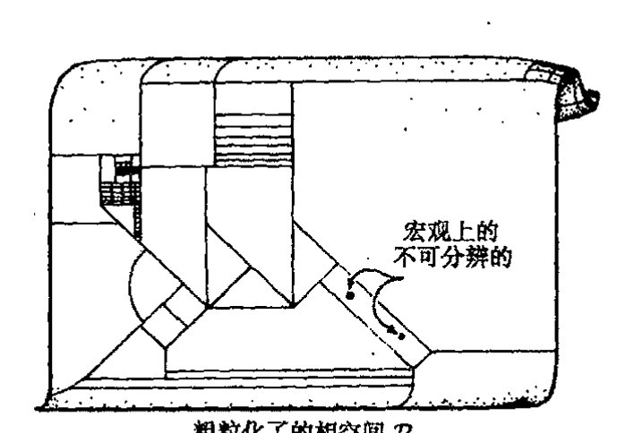

**图 27.2** 玻尔兹曼熵。它涉及将相空间 $\mathcal{P}$ 的单元分割成子区域（“盒子”）——称为 $\mathcal{P}$ 的“粗粒”——这里一个给定盒子里的那些点代表宏观不可分辨的物理态。体积 $V$ 的盒子 $\mathcal{V}$ 中态 $x$ 的熵为 $S = k \log V$，其中 $k$ 是玻尔兹曼常数。

·496·

<!-- page 516 -->

第二十七章 大爆炸及其热力学传奇

还有些相当主观的成分，虽然它比早先那种应用相当有限的概念有着明显的进步，而且仅就作为系统“无序度”的量度概念这一点就无疑是一种进步。

我自己对熵的物理地位的立场是，我不认为它是当今物理理论里的一个“绝对”概念，虽692然它无疑是个非常有用的概念。然而，它在未来有可能获得更为基础的地位。对此我们需要考虑量子理论——毕竟是量子力学提供了对 $\mathcal{P}$ 内具体相空间区域 $\mathcal{V}$ 的绝对量度，这里我们取 $\hbar=1$的单位（即普朗克单位，见 [§27.10](#2710-黑洞熵)）。\*[27.2]事实就是如此，粗粒的任意性对热力学计算几乎没什么影响，这非常令人惊奇。其理由似乎是，在绝大多数情形下，我们关心的只是有关的相空间盒子体积大小的比值，这使得边界划在何处变得无关紧要，只要粗粒化能够“合理地”反映所涉系统是宏观可分辨的这一直观概念就成。由于熵定义成盒子体积的对数，因此确有必要重划边界以获得 $S$ 的任何明显变化。\*\*[27.3]在我看来，熵在当代理论中具有的是一种“方便”的地位，而非“基础性”地位——虽然有迹象表明，在量子引力变得重要的更深入场合（特别是与黑洞熵联系起来看），这个概念将获得更基本的地位。我们将在本章后面（[§27.10](#2710-黑洞熵)）和 [§30.4](chapter_30.md#304-霍金的黑洞温度)～8、[§31.15](chapter_31.md#3115-弦与黑洞熵) 和 [§32.6](chapter_32.md#326-自旋网络) 再回到这个问题上来。

## 27.4 熵概念的鲁棒性

我们举一个简单例子以使玻尔兹曼熵公式的作用看得更清楚些。考虑一个封闭的容器，其中区域 $\mathcal{R}$ 被单独做成球状，其体积为整个容器体积的十分之一，$\mathcal{R}$ 与容器其他部分通过一个小阀门连接，见[图 27.3](assets/page516_fig01.jpg)。假定容器内的气体分子数为 $m$。我们来求所有气体分子都处于 $\mathcal{R}$ 的情形下的熵 $S$，并与气体分子均布于整个容器情形下的熵进行对比。

由玻尔兹曼公式，我们有 $S=k\log\mathcal{V}_\mathcal{R}$ 这里 $\mathcal{V}_\mathcal{R}$ 是所有分子处于 $\mathcal{R}$ 时相空间 $\mathcal{V}_\mathcal{R}$ 的体积。为简明起见，我们假定粒子遵从所谓玻尔兹曼统计，与之相对的是 [§23.7](chapter_23.md#237-玻色子和费米子) 描述的玻色子的“玻色－爱因斯坦统计”和费米子的“费米－狄拉克统计”。也就是说，我们假定所有气体分子（至少原则上）都是彼此可分辨的。\*\*\*[27.4]将气体取为大气压下的普通空气，即 1 升容积内约有 $m=10^{22}$个分子。对于容器内的气体，

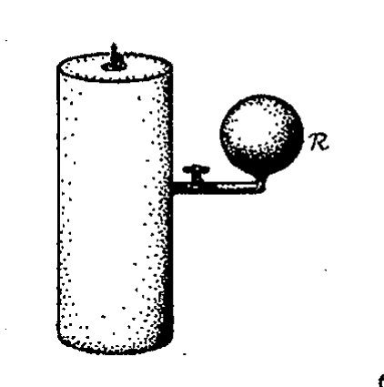

图 27.3 密闭容器。球状区域 $\mathcal{R}$ 的体积为整个容器体积的十分之一。当最初集中于 $\mathcal{R}$ 的气体充满整个容器时，系统的熵增加了多少？

相空间区域 $\mathcal{V}_\mathcal{R}$ 的体积与整个相空间 $\mathcal{P}$ 的体积比是 $10^{-m}(=\frac{1}{10^m})$，\*\*\*[26.5]即

---

\*[27.2] 说明：如果取 $\hbar=1$，如何安排相空间体积的绝对测量。

??? question "答案 [27.2]"
    量子力学给相空间体积提供了自然单位：每个正则自由度的相空间单元大小为 $2\pi\hbar$，或按约定吸收到 $h$ 中。若取 $\hbar=1$，相空间体积就可除以这些基本单元而成为无量纲的态数近似。

    因此对 $n$ 个构型自由度，经典体积除以 $(2\pi\hbar)^n$ 后给出可容纳的量子态数数量级。熵公式中的 $V$ 就可理解为这种以量子态数计量的粗粒盒子体积。

\*\*[27.3] 玻尔兹曼公式里的对数是如何与盒子体积的“巨大”差异相联系的？

??? question "答案 [27.3]"
    对数把乘法尺度差异变成加法差异。若盒子体积改变一个因子 $r$，熵只改变 $k\log r$；反过来，一个普通大小的熵差 $\Delta S$ 对应的体积比却是 $e^{\Delta S/k}$。

    宏观系统含有 $10^{22}$ 量级的粒子，所以相空间体积常相差如 $10^{10^{22}}$ 这类巨大倍数。粗粒边界的普通调整只改变前面的较小因子，取对数后几乎不影响宏观熵值。

\*\*\*[27.4] 解释三种情形下计算会有怎样的差别。

??? question "答案 [27.4]"
    玻尔兹曼统计把分子看作可区分，位置部分直接给出每个分子落入 $\mathcal R$ 的比例因子，因此全在 $\mathcal R$ 中约为 $10^{-m}$。玻色统计或费米统计则把粒子看作不可区分，计数应改用占据数；费米子还受泡利不相容原理限制，玻色子允许多重占据。

    不过普通空气在常温常压下处于经典稀薄极限，单粒子态占据数很低，玻色或费米修正相对于 $m\log 10$ 的主导项很小。因此三种统计在这个熵增估计中只带来很小修正，不改变数量级。

\*\*\*[26.5] 为什么？

??? question "答案 [27.5]"
    每个分子的位置可用体积比例估计：区域 $\mathcal R$ 占总容积十分之一，所以单个分子在 $\mathcal R$ 中的相空间位置体积约少一个因子 $10^{-1}$。若忽略动量部分差异且分子近似独立，$m$ 个分子全在 $\mathcal R$ 的相空间体积比就是 $(10^{-1})^m=10^{-m}$。

    这就是正文中 $10^{-m}$ 的来源。它只用了位置自由度的体积比例；动量自由度在两种宏观态中近似相同，因此在比值中抵消。

<!-- page 517 -->

通向实在之路

$$10^{-1000000000000000000000},$$

因此我们看到，这是一个“很难想象”的体积比。上面这个数据表示出现——即使是纯粹碰巧——所有气体分子都处于 $\mathcal{R}$ 的概率简直是微乎其微。这种极端不可能情形的熵要比气体分子随机分布情形下的熵远小得多，由玻尔兹曼公式，二者的差大约为***[26.6]

$$-k\log(10^{-1000000000000000000000}) = 2.3 \times 10^{22}k,$$

$$= 0.32 \text{ JK}^{-1}$$

这里我用了 10 的自然对数约为 2.3 这一事实。因此，如果我们假定起初气体处于 $\mathcal{R}$，由阀将它与容器的其他部分隔离开来，然后打开阀，让气体充满整个容器，于是我们发现，熵增加了 $2.3 \times 10^{22}k$，按通常单位，它大约是 $\frac{1}{3}\text{ JK}^{-1}$。

694

读者或许会担心，实践上，容器在初态时非 $\mathcal{R}$ 部分绝对没有气体分子是做不到的。因此，我们放宽区域 $\mathcal{V}_\mathcal{R}$ 的规定，使得 $R$ 含有全部气体分子的 99.9%。于是 $\mathcal{V}_\mathcal{R}$ 要求处于 $\mathcal{R}$ 之外的分子不超过全部分子的 1‰。以当今的技术要使容器的非 $\mathcal{R}$ 区域达到这种真空条件并非难事。可以证明，结果几乎不受影响，打开阀后的熵增仍是 $2.3 \times 10^{22}k$ 的量级。***[26.7] 这是一个出人意表的事实：虽然粗粒盒子的划分（譬如说 $\mathcal{V}_\mathcal{R}$）带有主观性，但只要盒子划分得“合理”，它就不会引起严重的问题。

玻尔兹曼公式里的对数，除了使大数看起来好处理之外，还有一个重要的目的，就是展示了独立系统的熵的加和性。因此，如果两个独立系统的熵分别是 $S_1$ 和 $S_2$，那么由这两部分总合起来的系统的总熵将为 $S_1 + S_2$。这里假定总系统的相空间是 $\mathcal{P} = \mathcal{P}_1 \times \mathcal{P}_2$，这里 $\mathcal{P}_1$ 和 $\mathcal{P}_2$ 分别是两独立系统的相空间，总系统的粗粒盒子是 $\mathcal{P}_1$ 和 $\mathcal{P}_2$ 的粗粒盒子的乘积，对独立系统 $S_1$ 和 $S_2$，这是十分自然的假定。*[26.8]（应用到空间的 $\times$ 的定义见 [§15.2](chapter_15.md#152-丛的数学思想)，练习 [15.1] 和[图 15.3](assets/page660_fig01.jpg)a。）由于盒子体积是乘积关系，故相应的熵是加和关系（对数的标准性质，见 [§5.2](chapter_05.md#52-复对数概念)）。

在通常的物理系统的例子里——也就是已经过深入研究的常规容器里的寻常气体情形——存在一种特殊的粗粒盒子 $\mathcal{E}$，它的体积 $\mathcal{E}$ 要远大于其他盒子。这个 $\mathcal{E}$ 代表的是热平衡态。$\mathcal{E}$ 通常就等于整个相空间的体积 $\mathcal{P}$，因此 $\mathcal{E}$ 很容易超过所有其他盒子的体积之和，见[图 27.4](assets/page518_fig01.jpg)。对于寻常气体，我们常将其看作是热平衡下全同的球对称的若干个小球组成，其速度分布取所谓麦克斯韦分布（由我们以前在论述电磁学时遇到的那个詹姆士·麦克斯韦发现）。其概率密度形式为

$$Ae^{-\beta v^2},$$

---

***〔26.6〕说明：如果我们考虑的是费米子/玻色子，或如果我们考虑到气体分子禁锢在 $\mathcal{R}$ 中时可能的动量减小，这些为什么不会对结果有实质性影响。

??? question "答案 [26.6]"
    费米或玻色统计主要改变不可区分粒子的组合计数。普通空气在常温常压下接近经典稀薄极限，这些修正相对 $10^{22}\log 10$ 的主导位置熵差极小。

    把气体限制在 $\mathcal R$ 内也许会略改可用动量态，但若温度和能量尺度相同，主导熵差仍来自位置体积少了 $10^m$。因此结果的实质量级不变。

***〔26.7〕试试看你能否看出为什么取不同的数学近似估计时，熵增只会下降一个很小的量，大约从 $2.30 \times 10^{22}k$ 降到 $2.29 \times 10^{22}k$。（如果愿意，你可用斯特林公式 $n! \approx (n/e)^n(2\pi n)^{-1/2}$。）

??? question "答案 [26.7]"
    允许 $0.1\%$ 分子在外部时，体积比例不再是单一的 $10^{-m}$，而是一个二项分布尾和：大致为 $\sum_{j=0}^{0.001m}\binom mj(0.9)^j(0.1)^{m-j}$，其中 $j$ 是外部区域中的分子数。

    用斯特林公式估计这个尾和，其对数仍接近 $-m\log 10$，只增加一个相对很小的组合熵项。于是熵增从约 $2.30\times10^{22}k$ 降到约 $2.29\times10^{22}k$，差别只在百分之一量级。

*〔26.8〕为什么这种粗粒假设是自然的？

??? question "答案 [26.8]"
    独立系统的宏观不可分辨性应分别由各自粗粒描述；总系统的一个宏观态就是“系统 1 在某盒中且系统 2 在某盒中”。因此总粗粒盒自然是两个盒子的笛卡儿积，体积相乘，$V=V_1V_2$。

    玻尔兹曼公式于是给出 $S=k\log V=k\log V_1+k\log V_2=S_1+S_2$。这正符合独立系统熵应相加的热力学性质。

· 498 ·

<!-- page 518 -->

第二十七章 大爆炸及其热力学传奇

（它叫做高斯分布，有时也叫“钟形曲线”。）这里 $v$ 是气体粒子的三维速度大小，$\beta$ 是一个与温度有关的常数，$A$ 是使所有可能的速度空间上概率积分等于 1 的常数，见[图 27.5](assets/page518_fig02.jpg)。根据第二定律，使系统取最大可能的熵的热平衡态，一种我们期望系统能够停留足够长时间的态。

如上所述，麦克斯韦分布是指由没有内部自由度的全同经典粒子组成的气体状态。如果考虑到不同大小的多种成分和各种内部自由度（如自旋或不同组分间的来回振荡），事情就会变得更加复杂。对热平衡系统，有一条称之为能量均分的一般原理。根据这一原理，系统的能量在系统的各个自由度上是等分布的。

图 27.4 代表热平衡的特殊盒子 $\mathcal{E}$，它的体积 $E$ 通常就等于整个相空间 $\mathcal{P}$ 的体积 $P$，因此远远超过所有其他盒子的体积之和。

使麦克斯韦分布得到推广的另一种途径是先偏离严格的热力学平衡态，然后问，（依照第二定律）我们怎样才能期望气体达到平衡。在这种场合，我们有玻尔兹曼方程用来描述演化。读者大概已意识到，当存在数量巨大的成分粒子且其动力学都须单独跟踪时，理论上如何理解这些经典宏观粒子的行为，将是一个巨大的课题。这个课题就是统计力学。

图 27.5 气体平衡态的麦克斯韦速度分布有形式 $Ae^{-\beta v^2}$，这里 $A$ 和 $\beta$ 都是常数，$\beta$ 是一个与气体温度有关的常数，$v$ 是粒子速度。曲线的虚线部分表示 $v$ 的负值，用来显示统计学中熟悉的高斯分布的“钟形曲线”形式。

## 27.5 第二定律的导出

现在让我们来看看第二定律背后隐藏着什么。想象一下我们有这么一个物理系统，它由适当粗粒化相空间 $\mathcal{P}$ 中的一个点 $x$ 代表。假定（[图 27.6](assets/page519_fig01.jpg)(a)）此刻 $x$ 由某个体积为 $V$ 的小粗粒盒子 $\mathcal{V}$ 开始，以某种动力学方程规定的方式在 $\mathcal{P}$ 中运动。记住，不同粗粒盒子之间存在巨大的体积上差异，我们没法预料 $x$ 点关于盒子位置的动力学运动，我们能知道的，就是总体上说，$x$ 是朝着体积越来越大的盒子运动。换句话说，随着时间推移，系统的熵将越来越大。一旦 $x$ 有了进入具有确定熵的盒子的途径，那么在可感知的时间尺度上，它是无论如何再也不愿意回到先前熵值较小

<!-- page 519 -->

通向实在之路

的盒子里去了。要达到熵值明显较小的状态，就意味着要找到一个比它体积更小的盒子，而这极有可能是不成功的。我们还是来考虑刚刚所举的例子，由于玻尔兹曼公式的对数关系以及玻尔兹曼常数很小，一定程度上熵的减少总伴随着相空间体积的非常明显的减小。一旦气体找到了逃逸出 $\mathcal{R}$ 的途径，你就绝无可能再让它回到 $\mathcal{R}$ 中去（至少在不是“无穷长”的时间尺度上是这样）。***[27.9]

这个论证包含了热力学第二定律成立的基本要点。我们注意到，论证中除了无偏地要求点 $x$ 刻意找到更小的盒子这一点外，并不依赖动力学的具体形式。这就是第二定律存在的全部意义吗？这似乎也太简单了——可能正是这种论证的明显的普适性质使得许多物理学家认为第二定律不存在根本性的令人费解之处，而且认为任何物理理论都必须与第二定律相容。杰出的天体物理学家爱丁顿爵士的一段话很适合引述于此：

> 如果有人对你说，你所珍爱的宇宙论与麦克斯韦方程不符——你可以反驳说麦克斯韦方程实在糟糕。如果发现你的理论与观察结果相矛盾——你可以指责说这些实验有时做得很不细致。但如果你的理论被发现违反了热力学第二定律，我敢保证你是彻底没希望了，除了蒙羞放弃它实在是别无他法。⁷

但是一瞬间的反应告诉我们，这个论证的结论一定还有某种例外的情形，或有某些非常重要的因素在基本考虑中被忽视了。我们所推出的是一种时间不对称的定律，而基本物理学通常总被认为是时间上对称的。这是怎么发生的呢？我们可以设想将同样的论证用到指向过去时间方向上（[图 27.6](assets/page519_fig01.jpg)（b）），结论似乎是，如果我们此刻把相空间点 $x$ 置于我们前面选定的那种小盒子里，然后考查它从此刻向更早以前的方向演化，那么具有压倒性的可能是，随着我们越来越远地走向过去，$x$ 是从越来越大的盒子进入到现在这个盒子里！这一点告诉我们，第二定律的反面在过去方向上是成立的，熵在过去方向上增大，尽管从这一论证的基础上看，我们期望的是第二

**图 27.6** 第二定律的作用。物理系统的演化由相空间中的某条曲线表示。(a) 如果我们知道当前时刻系统是由体积 $V$ 很小的盒子 $\mathcal{V}$ 中的一点 $x$ 来表示的，我们想看看它未来的可能行为，则可断定，由于盒子体积间的巨大差异，在没有明显定向运动的情形下，根据第二定律，这条曲线肯定是进入越来越大的盒子。(b) 但假定我们将这种论证用到过去方向上，要问曲线直接找到进入 $\mathcal{V}$ 的路径的最大可能性是多少，则这种论证将导致十分可笑的结论：最大可能是，随着我们逐步走向过去，$x$ 将从越来越大的盒子进入 $\mathcal{V}$，这明显违背第二定律。

---

***[27.9] 就所有气体全都回到 $\mathcal{R}$ 和 99.9% 的气体回到 $\mathcal{R}$ 这两种情形，试估计这个过程要多长时间。你需要知道气体分子的运动速度吗？

??? question "答案 [27.9]"
    若所有分子自发回到 $\mathcal R$，单次随机宏观采样概率约为 $10^{-10^{22}}$，等待时间约为微观混合或碰撞时间乘以这个数的倒数，远远超过任何宇宙学时间。

    若只要求 $99.9\%$ 回到 $\mathcal R$，概率仍是指数级极小，等待时间同样荒谬巨大。分子速度只影响前面的普通时间因子，不影响压倒性的指数结论；所以不需要知道精确速度才能得出物理判断。

· 500 ·

<!-- page 520 -->

第二十七章 大爆炸及其热力学传奇

定律的确应当用于未来方向。大体上说，这个结论与我们对宇宙在过去方向上的实际观察不相符，见图 27.7。

哪儿出错了呢？为了弄清楚这一点，我们把这些论证用到容器内的气体行为上。我们从全部气体都处于 $\mathcal{R}$ 开始（时间上取为 $t_0$），这时 $x$ 处于 $\mathcal{V}_\mathcal{R}$。我们似乎能够得到正确的气体的未来行为，就是说，阀门一旦被打开，气体会从 $\mathcal{R}$ 跑出来充满整个空间，熵值明显增大，同时 $x$ 很快就进入代表热力学平衡态的区域 $\varepsilon$。但它在过去的行为是怎样的呢？我们得这么来提出问题：在 $t_0$ 时刻之前发生了什么？气体达到全都处于 $\mathcal{R}$ 这一状态的最可能的途径是什么？如果我们想象一下，阀门恰好在 $t_0$ 时刻之前的某个瞬间被打开，那么"最可能的演化"是，气体开始弥散到整个容器，并在早于 $t_0$ 的某个时刻达到热平衡，然后它自发地逐渐集中到区域 $\mathcal{R}$，并在 $t_0$ 时刻完全处于 $\mathcal{R}$ 中。

[图：熵S随时间t变化的曲线图，显示"外推情形"虚线（指向过去熵增大）与"实际情形"实线（过去熵较小）的对比，标注"现在"时刻]

**图 27.7** 用熵 $S$ 关于时间 $t$ 的曲线来表示图 27.6 的结论。这一论证正确地引导我们用第二定律来预测现在之后的未来行为，但如果认为第二定律在过去方向上也成立，那它就将导致极为荒谬的与实际经验严重不符的结论。

尽管荒谬，但它却是上述问题的正确答案，而且与外部条件无关。实际上，我们从未发现气体完全处于 $\mathcal{R}$ 中。这个论证只是要告诉我们，如果我们想看到气体全都自发地处于 $\mathcal{R}$ 中的情形，则随机运动气体的行为将会是怎样的。这里并无悖论。但它回避了一个问题，而这个问题正是我想让读者考虑的，那就是，实际过程中怎样才会出现这种所有气体聚于 $\mathcal{R}$ 中的情形？毫无疑问，在实际宇宙中发生这种事是可能的（这里，我们放宽了对区域 $\mathcal{V}_\mathcal{R}$ 的定义，允许有千分之一的气体逸出 $\mathcal{R}$ 外）。我们可设想有某个实验者开始时向容器内泵入了 10 倍于所需的气体，然后关上阀，最后再在容器主体上接入真空泵将主体内的气体（全部气体的 90%）抽走。在整个过程中，按照第二定律，熵始终是增的。如果要用相空间的概念来谈这个问题，显然我们就需要更大的相空间，它应将实验者也包括其中——大概还应包括宇宙间的许多东西，甚至扩展到太阳或太阳系之外。实验者体内的熵由于通过进食和呼吸因而保持得非常低。为简单计，我们假定真空泵是手工运作的——否则我们还得考虑燃油动力的低熵来源（这个不是我们现在要考虑的关键所在）。实验者的部分低熵通过气体转移到容器内，而且被用来使气体回到 $\mathcal{R}$。实验者食物中和空气中的低熵最终还是来自太阳。后面我会转到太阳的特殊作用上来。

因此，我们能得到所需的使容器内几乎所有气体回到区域 $\mathcal{R}$ 的状态，而且不违反第二定律，它的适当的物理形式为："熵随时间增加。"那么对于回到过去的行为，我们在推导时间反向的第二定律时遇到的困难是什么呢？它解决了吗？没有，肯定还没有！实验者的身体应当（也的确是）按实际的第二定律来起作用，就像太阳和扩大了的相空间中描述的一切一样。如果我们要用相空间来讨论——现在是扩大了的相空间——那么我们仍免不了会得到物理上的荒谬性，就是熵面向过去方向依然是增的，这里的过去可以是我们此刻考察整个系统之前的任何

· 501 ·

<!-- page 521 -->

通向实在之路

时间。

## 27.6 整个宇宙可看作一个“孤立系统”吗？

一些理论学家试图对“孤立系统”和“开放系统”做出区分，他们认为，当孤立系统内熵增加时（直到达到平衡态），我们总可以从外部世界引入某种东西使熵一次次地减小——譬如人为干预或从太阳汲取低熵，等等。在我看来，任何按这些方式得到的关于第二定律的时间不对称性的解释都只是暂时性的，因为这些外部因素都应包括进系统内。这意味着所考虑的“系统”必须是宇宙这个整体。人们时常反对这种看法，但我认为这种反对意见没什么道理。的确，宇宙在广延上是无限的，但这与将其视为一个整体来考虑并不冲突（见第16章）。毕竟，宇宙在空间上很可能还是有限的（稍后我们将谈到这种可能性），奇怪的是这种有限性的论证要依赖于第二定律的讨论，而后者的有效性则建立在宇宙实际上是空间无限的这一事实之上。正如我们将要看到的，有限/无限的界定与第二定律起源的相关性非常弱。熵的讨论的确可用到整个宇宙 $\mathcal{U}$，其相空间 $\mathcal{P}_\mathcal{U}$（它的体积可以是无限的）描述了包含各种可能的宇宙，以及它们按（适当的）经典动力学方程所进行的演化。

但是，有一个难题必须解决。要想将宇宙作为一个整体对待，我们需要先了解宇宙学领域，但如果不具备广义相对论知识，我们就不能充分地做到这一点。为了能完全在广义相对论的广义协变原理（[§19.6](chapter_19.md#196-爱因斯坦场方程)）基础上进行讨论，有必要采用这样一种描述，其中标示宇宙“演化”的时间坐标不具任何特殊性。时间演化图像一直是我们考虑物理系统的一种方式，我们将它当作相空间 $\mathcal{P}$ 中运动的一个点 $x$。每个 $x$ 的位置代表系统在一个时间点上的一种空间描述（包括动量）。但有一种观点认为，要采用更为相对论性的处理，就必须使这种描述复杂化。但我不这么看。从我要达到的目的来说，采用严格的相对论性观点是有益的。实际上，我们将看到，标准宇宙学模型有着自然的时间坐标定义，它是对用来描述整个宇宙演化的“时间参数”$t$ 的一个很好的近似。$\mathcal{P}_\mathcal{U}$ 中的每个点被认为不仅是对宇宙在 $t$ 时刻的物质内容的描述，而且是对连续场分布（和动量）的描述。引力场就是这样一种场。因此，$\mathcal{P}_\mathcal{U}$ 中 $x$ 的位置也包含了宇宙的空间几何（及其变化率——它由引力场适当的初值给定）⁸ 信息。

事实上，$\mathcal{P}_\mathcal{U}$ 是无限维的，但这种性质与宇宙 $\mathcal{U}$ 在广延上是否无限无关，其他各种场，像电磁场，也具有这种特征。这在熵的定义上会引起一些技术上的困难，因为这会使每个所需的相空间区域 $\mathcal{V}$ 都具有无限大体积。通常我们借助于量子（场）论的概念来处理这个问题，它能够保证我们对能量和空间维数适当约束下的系统得到有限的相空间体积。这方面细节对我们来说并不重要。尽管从来不曾有过一种完全让人满意的处理引力情形下这些问题的方法——原因是缺乏令人满意的量子引力理论——但我还是打算将这些看成是技术性问题，它们不影响我们对第二定律产生的问题进行一般性讨论。

· 502 ·

<!-- page 522 -->

第二十七章 大爆炸及其热力学传奇

在这里，我必须指出一个在宇宙学背景下第二定律认识上经常引起混乱的错误概念。一般认为，第二定律的熵增恰是宇宙膨胀的必然结果。（我们将在 [§27.11](#2711-宇宙学) 讨论这个膨胀问题。）这种观点看来是基于这样一种误解：在宇宙还“很小”的时候，它可支配的自由度也相对较少，只能为可能的熵值提供较低的“上限”；随着宇宙逐渐长大，可支配的自由度也越来越多，它给出的“上限”也就相对较高，因而容许较大的熵值；随着宇宙膨胀，这个可容许的最大熵值将增大，因此实际的宇宙熵也可以变得很大。

可以有多种办法看出这种观点是错的。例如，它意味着，在存在坍缩阶段的那些宇宙模型中，坍缩阶段的熵必然开始减小，第二定律被破坏。有些人并不认为这有什么不对，⁹ 但这种观点遇到了基本困难，特别是在黑洞问题面前。¹⁰

我们过一会儿再来探讨黑洞问题（[§27.8](#278-黑-洞)），但要看穿上述观点——要求熵值“上限”以来与宇宙的大小——的荒谬性，我们其实用不着知道这些。这种观点不可能正确解释熵增，也不可能正确解释由总相空间 $\mathcal{P}_\mathcal{U}$ 描述的宇宙可支配的自由度。广义相对论动力学（它包括了定义宇宙大小的自由度）像所有其他的物理过程一样可以通过相空间 $\mathcal{P}_\mathcal{U}$ 里点 $x$ 的运动来描述。这个相空间就在“那儿”，任何意义上都谈不上“随时间增长”，时间不是 $\mathcal{P}_\mathcal{U}$ 的一部分。根本就没有什么“上限”，因为宇宙（或宇宙家族）动力学上可达到的所有态必然都处于 $\mathcal{P}_\mathcal{U}$ 内。$x$ 从某个较小的粗粒化盒子出发到达一个大的盒子可能要花上一段时间，但“熵限”的概念显然是不妥的。（亦见 [§27.13](#2713-异乎寻常的特殊大爆炸)。）

让我们回到第二定律的论证上来。我们用相空间 $\mathcal{P}_\mathcal{U}$ 来代表整个宇宙，这样，宇宙的整体演化就可以用 $\mathcal{P}_\mathcal{U}$ 中点 $x$ 沿曲线 $\xi$ 的运动来表示。曲线 $\xi$ 经过了时间坐标 $t$ 的参数化，由第二定律我们可以预料，$\xi$ 将随 $t$ 的增长进入越来越大的粗粒化盒子。假定 $\mathcal{P}_\mathcal{U}$ 可进行某种“合理的”粗粒化，如果我们想得到 $x$ 所在位置熵的有限值，我们就必须要求这些盒子的体积是有限的。在物理上实现适当的粗粒化这一点似乎不难做到，因为宇宙必须看成是有限的，它要受到可资利用能量的约束。事实上我们将看到，三种标准宇宙模型中的其中一种就具有这种性质，因此我们可以认为这一论证适于这种情形。但如果任何情形下我们都不在意实际熵值是否取得无限大，那么就不必对此做出明确规定。（对某些盒子要比另一些盒子“大到无穷多倍”这样的概念，我们仍能作数学上的理解，尽管它们的实际体积从而它们的熵是无限的。）

## 27.7 大爆炸的角色

我们怎么才能设想相空间 $\mathcal{P}_\mathcal{U}$ 中一条表示可能的宇宙历史的参数化曲线 $\xi$ 呢？如果 $\xi$ 只是 $\mathcal{P}_\mathcal{U}$ 中的一条任意曲线，那么我们可预料它有极大可能是完全（或几乎完全）处于最大的热力学平衡态盒子 $\mathcal{E}$ 中，其长度不存在明显可区分的“熵增”量度，见[图 27.8](assets/page523_fig01.jpg)a。这种情形与我们实

·503·

<!-- page 523 -->

通向实在之路

际知道的宇宙完全不符，在实际宇宙中，第二定律具有支配力量。[图 27.8](assets/page523_fig01.jpg)（b），（c）所示的情形亦如此，在表示现在的某个特定时刻 $t_0(>0)$，$\xi$ 上的点 $x$ 处于某个一定大小（但不是特别大）的区域 $\mathcal{V}$（表示我们现在观察到的熵值的宇宙）内，但这里 $\xi$ 是另一条任意选定的曲线，它对应于这样一种宇宙，其熵不仅从现在向未来是增长的，而且从现在向过去也是增长的——违反第二定律！对第二定律严格成立的宇宙，我们实际找到的是类似[图 27.8](assets/page523_fig01.jpg)（b），（d）所示的情形，这里 $\xi$ 有一端——过去端（譬如说 $t=0$）——在 $\mathcal{P}_\mathcal{U}$ 的一个极其狭小的区域 $\mathcal{B}$（对应于极低熵）内。从那儿开始，随着时间增长，曲线就不断如愿地（按照动力学规律）向体积越来越大的盒子延伸。在表示现在的时间点 $t_0$，我们正好发现 $x$ 处于我们观察到的宇宙所对应的那个仍然相当小的体积 $\mathcal{V}$ 中。这就是所谓的第二定律，我们要（d），（b），反对（c），（b）。

我再重申一遍：假定从某个我们称为“现在”的时间点 $t_0(>0)$ 开始，并假设 $t_0$ 时刻 $x$ 处于某个特定大小的区域 $\mathcal{V}$ 内，来考察对于更大的 $t$ 值曲线 $\xi$ 会趋向何方，我们就会发现，随着 $t$ 增长，它将进入体积越来越大的盒子。这既符合第二定律，也和 $x$ 与盒子位置“无关”的假设相一致。但正如我们在时间反方向上所看到的，由 $\mathcal{V}$ 中时刻 $t_0$“出发”的 $x$ 给人印象就像是受到刻意引导似的，逆时趋于极其狭窄的区域 $\mathcal{B}$。

图 27.8 由可能的宇宙态（总质量或其他守恒量固定）的相空间 $\mathcal{P}_\mathcal{U}$ 中的参数化曲线 $\xi$ 描述的各种不同可能的宇宙演化。（a）如果曲线 $\xi$ 是随机地出现在 $\mathcal{P}_\mathcal{U}$ 中的，那么它将在 $\mathcal{E}$ 中度过几乎其全部时间，尽管存在小的涨落，宇宙差不多始终处于“热平衡”（如果曲线闭合，则可比作图 27.20（d）的情形）。（b）如果我们只是要求曲线从很小的盒子 $\mathcal{V}$ 中的当前开始，取 $\mathcal{V}$ 中的点表示宇宙当前的位置，但曲线 $\xi$ 仍可以随机游走，那么我们将发现一个与我们一直看到的相一致的未来演化，它也与第二定律的熵增规律相一致。（c）如果我们将同样考虑应用到整个曲线 $\xi$ 只是在某个特定时刻（当前）$t_N>0$ 穿过 $\mathcal{V}$ 的情形，则我们发现宇宙有一个合理的未来，但如同图 27.6（b），第二定律在过去方向上是总体不成立的。（d）补救的办法是我们为 $\xi$ 的开端（$t=0$）找一个更小的区域 $\mathcal{B}$，宇宙从这里以非同寻常的大爆炸开始，这在我们这个真实宇宙中曾出现过。

$x$ 在时间反方向上的行为似乎是一种令人难以置信的“有偏”行为。随着时间追溯到越来越遥远的过去，$x$ 找到的盒子也越来越小到一个极端的程度。我们是否应将这一点理解为一种不正当的“蓄意”谋求越来越小的盒子的恶毒行径呢？不是的，这只不过是因为 $\mathcal{B}$ 刚好被越来越小的盒子所包围（见[图 27.8](assets/page523_fig01.jpg)）——因此，如果 $t$ 回到 0 时 $\xi$ 完全到达 $\mathcal{B}$，那么整个过程就只能是这

704

· 504 ·

<!-- page 524 -->

个样子。这个谜团仅仅基于这样一个事实：*ξ* 的一端必须处于 *B* 内！如果我们要领会寻求第二定律的根源，就得学会这么来理解。区域 *B* 表示宇宙的大爆炸起源，不久我们就会看到，这个区域实际看上去该有多小！

我们必须学会了解这里所提出的问题：*B* 的特殊性表现在哪里？对这种特殊性我们有办法给出数值量度吗？确信大爆炸的观察基础是什么？

相信宇宙起源于大爆炸的理由最初来自弗里德曼（Alexandr Friedmann，1888～1925）1922年对宇宙学中爱因斯坦方程的理论研究（见 [§27.11](chapter_27.md#2711-宇宙学) 后面部分）。随后在1929年，哈勃（Edwin Hubble，1889～1925）做出了惊人的发现：遥远的河外星系确实正在退行，^11^ 其方式就像是宇宙中物质行为均来自一次巨大的爆炸。按现代推测，这次爆炸——现在我们称之为大爆炸——大约发生在 1.4 × 10^10^ 年前。哈勃的结论是基于这样一个事实：迅速退行天体发出的光存在多普勒效应引起的红移（谱线移向“谱的红端侧”即长波长侧）。^**[27.10]^ 他发现，星系越远，这种系统性的红移就越大，这说明星系的退行速度正比于它与我们之间的距离，这与“爆炸”的图像是一致的。

但大爆炸的最直接的观察证据来自弥漫于空间的温度约为 2.7 K 的宇宙背景辐射。^12^ 虽然对大爆炸这样的剧烈事件来说这点温度低得简直是微不足道，但这种辐射据信却是大爆炸本身衰减（红移）和冷却的“遗迹”。在现代宇宙学中，2.7 K 辐射具有极其重要的作用。通常认为它是一种“（宇宙）微波背景”，有时也称为“背景黑体辐射”或“宇宙遗迹”辐射。它极为均匀（相当于每 10^5^ 单位有一个），这说明在刚大爆炸后的宇宙早期，宇宙就如此均匀，也与我们在 [§27.11](chapter_27.md#2711-宇宙学) 考虑的宇宙模型所描述的结果非常一致。

现在，让我们从大爆炸巨大的低熵性质抽取出一些物理观点。^13^ 我们将看到，大爆炸最大的特殊之处实际上就是它的这种均匀性。我们必须弄清楚，为什么这种均匀性对应于低熵，它是如何以我们熟悉的方式给出第二定律的。

首先，还是考虑作为低熵之源的太阳。有一种误解认为，太阳所提供的能量是我们赖以生存的基础。这是一种误解，因为我们所用的能量必须以低熵形式提供。假定整个天空都处于温度均匀的状态——甭管这种温度条件是源于太阳还是其他什么东西——那么我们就根本无法利用这种能量（没有一种生物可以演化到适应此条件）。热平衡方式提供的能量是没用的。好在太阳只是冷背景下的一个热点。白天，能量自太阳到达地球，但在日夜交替期间它又返回到空间。能量的净平衡（平均而言）简单来讲就是将我们接收到的能量如数送回去。^14

但是，我们从太阳得到的是单个的高能光子（由于太阳的高温，基本上属黄色的高频光子）形式，而返回空间的则基本上是低能（红外的，低频）的光子形式。（光子间的能量关系依照黑

---

^** [27.10] 分别用（a）光波图像，（b）四维矢量标积和 *E* = *hν*，导出退行速度为 *v* 的光源的狭义相对论性多普勒频移。

??? question "答案 [27.10]"
    光波图像中，相邻波峰从退行光源发出时，第二个波峰比第一个多走一段距离，并且源的发射周期还受狭义相对论时间膨胀修正。合起来得到 $\nu_{\rm obs}=\nu_{\rm em}\sqrt{(1-v/c)/(1+v/c)}$，或 $1+z=\sqrt{(1+v/c)/(1-v/c)}$。

    四矢量图像中，观测频率满足 $h\nu=-p_a u^a$，其中 $p^a$ 是光子四动量，$u^a$ 是观测者四速度。把光源四速度相对观测者作洛伦兹变换，并取沿视线退行的情形，就得到同一个频移公式。

<!-- page 525 -->

通向实在之路

体辐射的普朗克公式 $E = h\nu$，见 [§21.4](chapter_21.md#214-量子理论的实验背景)）。由于来自太阳的光子能量高（高温），从能量守恒可知，返回空间的光子要比来自太阳的光子多得多。来自太阳的光子数量少意味着自由度也较少，从而也意味着相空间区域较小，熵较低。植物正是以光合作用方式来利用这种低熵能量，并借以减少自身的熵。然后我们再通过食取植物、食取那些吃植物的其他东西，并通过呼吸植物放出的氧气来减低我们自身的熵，见[图 27.9](assets/page525_fig01.jpg)。

**图 27.9** 地球向太空释放出与它接收自太阳的同样多的能量，但它接收自太阳的是相当低的熵的形式，因为太阳的黄光频率上要远高于地球返回太空的红外光频率。相应地，由普朗克公式 $E = h\nu$ 知，每个太阳光子携带的能量要多于每个从地球返回太空的光子携带的能量，因此来自太阳的光子数要少于从地球返回太空的光子数。这些较少的光子数意味着较少的自由度，而这相当于较小的相空间区域，从而比返回太空的光子具有更低的熵。植物的光合作用正是利用这种低熵能量来降低自身的熵，我们人类则通过食用植物和呼吸植物放出的氧气来减少我们自身的熵。这些最终都来自于我们生活其中的空间的温度平衡，而这种平衡则起源于产生太阳的引力聚集作用。

但为什么说太阳是冷空中的一个热点呢？虽然细节复杂，但最终可归结为这么一个事实：太阳——以及所有恒星——都是从此前的均匀气体（主要是氢）在引力作用下凝聚而成的。不论是否存在其他影响（主要是核力），没有引力太阳甚至不可能存在！太阳的"低"熵（远离热平衡）来自于气体均匀性所含的巨大的低熵库，太阳正是从中经引力收缩而来。

相对熵而言，引力因其普适的吸引性质而令人迷惑。我们一直是按普通气体来考虑熵的，并认为集中于小区域内的气体具有低熵（像[图 27.3](assets/page516_fig01.jpg) 的容器所示的情形），而在热平衡的高熵态，气体呈均匀分布。但有了引力，情形就大不一样了。引力物体呈均匀分布的系统表示熵相对较低（除非天体的速度非常快，或体积非常小，或弥散的范围非常大，使得引力的贡献变得不重要），而当这些引力物体聚集一块儿时则是高熵态（[图 27.10](assets/page526_fig01.jpg)）。

最大熵的状态是怎样的呢？气体在热力学平衡下的最大熵状态就是气体均匀分布于整个容器空间，与此不同，大的引力物体的最大熵状态则是所有质量集中于一处——即以所谓的黑洞形式出现。为了进行深入讨论，我们有必要了解这些古怪而又神奇的对象，并由此得到对宇宙整

· 506 ·

<!-- page 526 -->

第二十七章 大爆炸及其热力学传奇

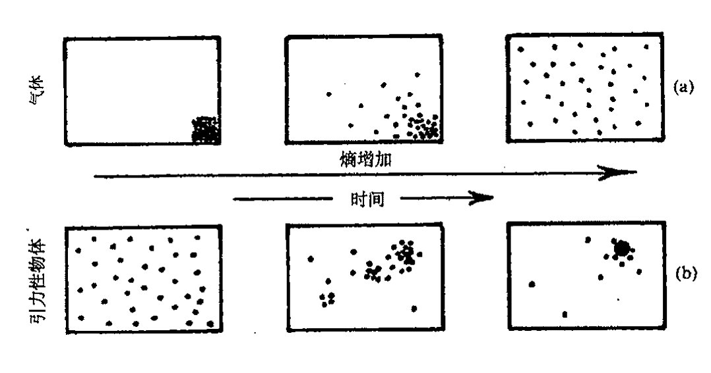

**图 27.10** 从左至右依次为随时间增大着的熵。（a）盒中的气体最初都处于某个角落，随着气体开始弥散到整个盒子，最终达到均匀的热力学平衡态，熵变大了。（b）由于引力作用，事情呈现出另一种景象。原初均匀弥散的引力物体系统表示的是一种较低的熵，随着熵增，聚集开始出现。最终当黑洞形成后，熵增长到一个极高的水平，侵吞着所有物质。

体的熵的一个好的估计。我们可据此来估计 $\mathcal{B}$ 和 $\mathcal{P}_\mathcal{U}$ 的体积。

## 27.8 黑 洞

什么是黑洞？粗略地讲，就是一个物质引力坍缩所形成的时空区域，其中的引力是如此之强以至连光都无法逃脱。为了直观地说明为什么这种情形是可能的，我们来考虑牛顿的逃逸速度概念。如果我们从地面上以一定速度 $v$ 向上扔出一块石头，那么在它达到一定高度后就会落回地面，这个高度由石头的动能完全被用于克服自地面起算的引力势能而定（[§17.3](chapter_17.md#173-时空的牛顿动力学)，[§18.6](chapter_18.md#186-牛顿能量和角动量)）。在不计空气阻力条件下，这个高度完全由抛射速度而定。**[27.11]** 然而，当速度超过逃逸速度 $(2GM/R)^{1/2}$ 时，石头就会完全逃出地球的引力场（这里 $M$ 和 $R$ 分别是地球的质量和半径，$G$ 是牛顿引力常数）。现在假定我们考虑的不是地球，而是质量更大更集中的天体，那么逃逸速度就会更大（因为如果 $M$ 增大而 $R$ 减小，则 $M/R$ 变大），我们可以想象，质量和集中程度是如此之高，从而使得表面的逃逸速度超过光速。

在牛顿理论情形下，我们能够确信，当这事发生时，从远距离上看，该物体将是完全黑的，因为没有光逃得出来——这就是著名的英国天文学家和牧师约翰·米歇尔（John Michell，1724～1793）在 1784 年得到的结论。后来在 1799 年，伟大的法国数学物理学家拉普拉斯（Pierre Simon Laplace，1749～1827）得到了同样的结论。^[15] 但在我看来事情似乎未必这么明了，因为光速在牛顿理论里不具有绝对地位，人们完全可以找到这样的例子，在物体表面，光速可以大到远远

---

**[27.11]** 证明：这个高度为 $v^2R(2gR-v^2)^{-1}$，这里 $R$ 是地球半径，$g$ 是地球表面的重力加速度。

??? question "答案 [27.11]"
    用牛顿能量守恒。地表半径为 $R$，抛射到最高点半径为 $R+h$，有 $\frac12v^2=GM(1/R-1/(R+h))$。又 $g=GM/R^2$，所以 $\frac12v^2=gRh/(R+h)$。

    解得 $h=v^2R/(2gR-v^2)$。当 $v^2\to2gR$ 时高度趋于无穷，对应逃逸速度。

· 507 ·

<!-- page 527 -->

通向实在之路

超过它在真空自由空间中的速度，这样，不论物体的质量和集中度有多高，光依然可以逃逸到无穷远。^{16**[27.12]}因此，米歇尔的“黑星”尽管是黑洞概念的先觉先知，但在我看来却并非提供了一种牛顿理论下“不可见”引力对象的有说服力的例证。

这个问题在相对论的背景下讨论更为恰当，因为在那里光速具有基础性地位，是一切信号的极限速度（[§17.8](chapter_17.md#178-放弃绝对时间)）。但由于我们讨论的是引力现象，因此需要用广义相对论时空而不是闵可夫斯基空间。在广义相对论里，出现逃逸速度超过光速是可能的，并由此导致所谓的黑洞。

当大质量天体进入到这样一个阶段，即其内部压强不足以维持星体抵御自身引力引起的向内塌缩时，黑洞就出现了。当总质量为太阳质量的若干倍——譬如为10M_⊙（1M_⊙为一个太阳质量单位）——的大的恒星耗尽了其内部可资利用的能源，以致无法继续保持足够的压强来避免坍缩时，这种引力坍缩就成了不争的事实。这种坍缩一经开始，就不可能停止，因为引力效应是无情的。

709

具体的图像会非常复杂，特别是压强条件可能千差万别，有关物质行为的复杂问题变得重要起来，特别是电子或中子的简并压，这要用到泡利不相容原理。从[§23.7](chapter_23.md#237-玻色子和费米子)我们知道，这条原理不允许两个或两个以上的相同费米子占据同一个量子态。白矮星，一种质量如同太阳但体积却只有地球般大小的星体，就是靠电子简并压来维持的；同样质量的中子星，其体积线度大约只有10千米，则是靠中子简并压来维持的。（一个乒乓球大小的中子星物质的重量大约等于火星的卫星火卫二那么重！）但按照相对论的要求，如果星体质量超过2M_⊙，那么单靠简并压是无法维持的。1931年，钱德拉塞卡（Subrahmanyan Chandrasekhar，1910～1995）得到了至关重要的结果，当时他为白矮星给出的极限是1.4M_⊙。后来对中子星给出的结果要比这大一点点。^{17}所有这些最终可归结为，质量大于差不多2M_⊙（也可能不大于1.6M_⊙）的冷星体不会有静态的构造。这样一种星体将持续向内塌缩，直到塌缩到米歇尔的考虑变得重要起来，然后将发生什么呢？

让我们再回到大的（譬如说10M_⊙）恒星上来。假定初始时温度足够高，使得热压强就能够维持星体抵御自身引力。但随着星体冷却到某个阶段，其压缩的核超过了钱德拉塞卡极限，此后就将坍缩。外部塌陷还可能引发强烈的爆炸，即所谓超新星。我们经常可以观察到这种爆发型的星体，它们大都属于其他星系，在爆发期的几天里，超新星要比它所在的整个星系还要亮。但如果爆发没能使足够多的物质被扔掉——对初始质量为10M_⊙的星体，似乎没办法扔掉那么多——于是星体将继续坍缩直到它进入米歇尔考虑的那种尺度。我们来看看[图27.11](assets/page528_fig01.jpg)，它描述的是坍缩到黑洞的时空图。（这里我们压缩了一个空间维。）我们看到，物质持续向内坍缩，所经过的表面——称为（绝对）事件视界——上的逃逸速度达到光速。因此，外部观察者不会再得到来自星体的信息，黑洞就此形成。

---

**[27.12]** 你能看出为什么吗？提示：根据光的粒子理论和外部的光落到物体表面情形来考虑。如果光落到物体表面的水平镜面上会怎样？

??? question "答案 [27.12]"
    在牛顿粒子图像中，光若由物体表面向外发出，会因引力损失动能；但若外来的光从无穷远落到表面，则会获得动能，速度可变大。牛顿理论没有固定不变的极限光速，因此“表面逃逸速度超过真空光速”本身不严格禁止所有光逃走。

    若落下的光打到水平镜面并被反射，切向分量可保持而径向分量改变方向。反射后的光可能以与落下前不同的速度和方向离开，所以单靠牛顿逃逸速度论证并不能给出相对论黑洞那样的绝对不可逃逸性。

·508·

<!-- page 528 -->

第二十七章 大爆炸及其热力学传奇

图 27.11 的图像是基于爱因斯坦方程的著名的史瓦西解，它是由史瓦西（Karl Schwarzschild，1873～1916）于 1916 年发现的，——时间上距爱因斯坦理论发表不久。几个月后，史瓦西死于一种在第一次世界大战东部前线染上的罕见疾病。这个解描述了球对称天体周边的静态引力场，与该天体是否收缩无关。视界出现在径向距离 $r = 2MG/c^2$（严格的米歇尔临界值）位置上。***[27.13]

事件视界不是由任何物质材料构成的。它只是一种特殊的时空（超）曲面，用来区别可传递到外部无穷远的信号源所在位置与信号不可避免地要被黑洞俘获的源所在位置。从外部穿过事件视界落入其内部的倒霉的观察者不会注意到视界所包容的事情局部上有什么异样。甚至黑洞本身也不是什么值得费心去想的物体。我们不过是将它看成是任何信号无法逃出去的时空引力区域。这可怜的星体本身的命运如何？这个问题我们在 [§27.9](chapter_27.md#279-事件视界与时空奇点) 来讨论。

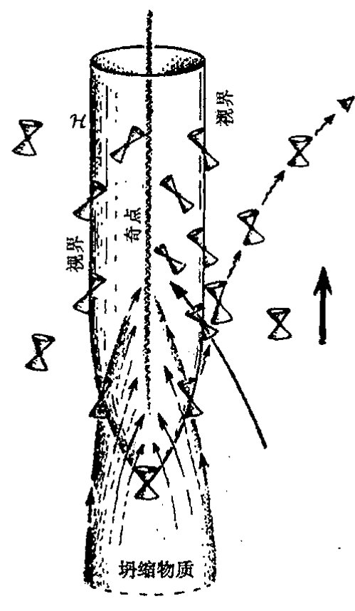

**图 27.11** 坍缩到黑洞的时空图（有一维已被压缩掉）。物质穿过变成（绝对）事件视界的三维表面向内坍缩。黑洞一旦形成，就没有物质或信号能够逃出其魔爪。光锥与视界相切，允许物质或信号进入但不允许出来。外部观察者无法看到黑洞内部，能看到的只是物质进入黑洞前的极其昏暗的红移。

首先，我们从观察方面来考察。黑洞存在有什么证据吗？确实有。20 世纪 70 年代，人们知道有许多奇妙的"双星"体系，而一对双星中只有一个发出的光在可见光范围。另一个的存在，其质量及其运动都是从那个可见的搭档的运动细节中推断出来的。而且从邻近的 X 射线信号的辐射来推断，这个不可见的伴侣是一个致密天体，其质量远大于当时公认的物理原理所允许的两种致密星类型——白矮星和中子星——中的任何一种。X 射线的辐射与这个不可见天体是黑洞的预言是一致的：黑洞周围是由气体和尘埃组成的所谓"吸积盘"，它以巨大的旋转速度盘旋着逐步趋向洞内，而且越接近洞的中心就越热。最终，物质在真正进入黑洞之前将辐射出 X 射线（[图 27.12](assets/page529_fig01.jpg)（a））。最著名的（也是观察时间最为持久的）黑洞是称为天鹅座 X-1 的 X 射线源，

---

***[27.13] 史瓦西原初的度规形式为 $ds^2 = (1 - 2M/r)\,dt^2 - (1 - 2M/r)^{-1}dr^2 - r^2(d\theta^2 + \sin^2\theta\,d\phi^2)$，这里取 $G = c = 1$ 的单位，$\theta$ 和 $\phi$ 分别是标准球极坐标（[§22.11](chapter_22.md#2211-球谐函数)）。解释：如何根据常数 $r$ 和 $t$ 球面面积的要求来确定径向坐标 $r$？这个度规形式不能光滑地过渡到 $r \leq 2M$ 区域；因此有必要利用爱丁顿—芬克勒施坦因度规形式 $ds^2 = (1 - 2M/r)\,dv^2 - 2\,dv\,dr - r^2(d\theta^2 + \sin^2\theta\,d\phi^2)$。找出二者之间的明确的坐标变换。解释：为什么每个 $(v, r)$ 平面上的零曲线必为径向零测地线？用这个结果找出它们的方程并画出曲线。（垂直画等 $r$ 线，向右倾斜 $45^\circ$ 画等 $v$ 线。）找出事件视界和奇点（[§27.9](chapter_27.md#279-事件视界与时空奇点)）

??? question "答案 [27.13]"
    史瓦西坐标 $r$ 由面积半径定义：常数 $t,r$ 的二维球面面积为 $4\pi r^2$。令入射爱丁顿–芬克尔斯坦坐标 $v=t+r_*$，其中 $r_*=r+2M\log|r/2M-1|$，则 $dv=dt+(1-2M/r)^{-1}dr$，代入史瓦西度规得到 $ds^2=(1-2M/r)dv^2-2dv\,dr-r^2d\Omega^2$。

    径向零曲线满足 $d\Omega=0$ 与 $(1-2M/r)dv^2-2dv\,dr=0$，故一族为 $dv=0$，另一族为 $dr/dv=\frac12(1-2M/r)$。由于球对称，径向零曲线没有角动量，必为零测地线。事件视界是 $r=2M$，奇点是 $r=0$；在图上 $r=2M$ 是一条零线，$r=0$ 为未来类空奇异边界。

· 509 ·

<!-- page 529 -->

通向实在之路

这个致密暗星的质量差不多有 $7M_\odot$，按照公认的理论，这使它不可能成为白矮星或中子星。

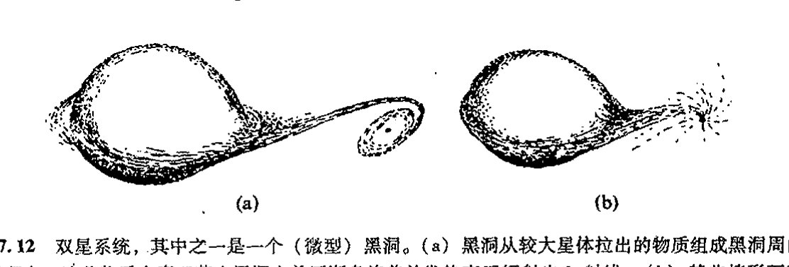

**图 27.12** 双星系统，其中之一是一个（微型）黑洞。(a) 黑洞从较大星体拉出的物质组成黑洞周围的吸积盘，这些物质在真正落入黑洞之前逐渐盘旋着并发热直至辐射出 X 射线。(b) 某些情形下不存在吸积盘，物质“直接”落入黑洞。如果吸引性的致密天体有一个可测的表面，落入的物质就会加热这个表面，但外部看不到它发出的光，从而无法断定黑洞的存在。

这一类证据总是相当间接的，总体上很难令人满意，因为它们依赖于那种认为质量如此巨大的致密星体不可能作为延展天体存在的理论。但现在已经有了关于黑洞的相当直接的明确证据。吸积盘不是物质落入黑洞的唯一方式。在某些情形下，物质是“直接”掉下去的，现在可以说已经观察到这种行为（[图 27.12](assets/page529_fig01.jpg)(b)）。如果说吸引性的致密天体存在任何形式的物质表面的话，那么不断落入的物质也将热得使这种表面融化掉，它发出的光应在一段时间内被观察到。但我们从未观察到这种光，因此现在直接的证据就是这种致密天体完全没有表面，我们可以相当有把握地说，这种天体确实就是黑洞。^19^

所有这些都是指“星体状”黑洞，其质量只是太阳质量的若干倍。还存在比这要大得多的黑洞的明显证据。可能绝大多数——也许是所有的——星系在其中心都有非常巨大的黑洞。特别是在我们银河系的中心可能就存在质量约为 $3 \times 10^6 M_\odot$ 的黑洞，人们一直在详细研究各种星体绕这个中心的实际轨道运动，所得的结果与黑洞图像高度一致。

## 27.9 事件视界与时空奇点

在[图 27.11](assets/page528_fig01.jpg) 里，我画了一些零（光）锥，从而使时空的因果性可以看得很清楚。这个图的最基本特征就是存在着黑洞的事件视界，它是时空里的三维曲面 $\mathcal{H}$。正如 [§27.8](#278-黑-洞) 所述，事件视界具有这样的性质，它使得 $\mathcal{H}$ 内发出的信号无法逃出该区域之外。这一点可以从零锥向内倾斜的效应看出来，即这些小零锥都与 $\mathcal{H}$ 相切。任何从内到外穿越 $\mathcal{H}$ 的世界线都将破坏零锥的因果性（[§17.7](chapter_17.md#177-光锥)）。我已经描述过完全球对称的引力坍缩情形，这是奥本海默（J. Robert Oppenheimer，1904～1967）和斯奈德（Hartland Snyder）于 1939 年最初研究的情形，其中用了史瓦西几何来描述外部塌陷物质的区域。

虽然视界 $\mathcal{H}$ 的性质古怪，但其局部几何却与其他地方没有根本的不同。如上所述，飞船上的观察者在由外向内穿过视界时，不会感到有何异样。然而一旦穿过视界，就再也无法返回了。

·510·

<!-- page 530 -->

第二十七章 大爆炸及其热力学传奇

零锥的顶端具有这样的性质：没有东西可以从这里逃出去，观察者在此处会感到急速增强的潮汐效应（时空曲率，见 [§17.5](chapter_17.md#175-嘉当的牛顿时空) 和 [§19.6](chapter_19.md#196-爱因斯坦场方程)），使一切在中心处（$r=0$）的时空奇点上发散到无穷。这些特征并不仅仅是球对称情形下才会有，而是非常普遍的。许多综合性理论都会告诉我们，任何跨越"不可返回点"的引力坍缩都不可避免地存在奇点。^20^有关问题我们会在 [§28.8](chapter_28.md#288-外尔曲率假说) 作详细讨论。

对于几个太阳质量的黑洞，潮汐力很容易达到在人还远没有接近视界时就已毙命的强度，就更别说穿越视界了。但对于质量为 $10^6 M_\odot$ 或更大的大黑洞，据信它们多处于星系的中心，在穿越视界（这个视界可能跨越几百万千米范围）时则不存在这种特殊的潮汐效应问题。实际上，就我们银河系而言，中心区黑洞的视界曲率大约是地球表面的时空曲率（我们甚至从没注意过）的 20 倍！但将观察者无情地拖向中心奇点的拉力将使得潮汐效应迅速增大到无穷，不用一分钟就将观察者整个儿地吞噬了！迅速增大的潮汐效应的这种毁灭性作用将吞噬一切奔向黑洞中心的物质材料。回顾一下，我们曾关心过 $10 M_\odot$ 坍缩星体的命运，现在很清楚，甚至连其组成成分的单个粒子，在遇到强大的潮汐力时，都将很快被撕成碎片——谁也不知道撕成什么！

至少，我们所知道的是，只要爱因斯坦的经典时空图像能够成立，并且按爱因斯坦方程（无负的能量密度，加上其他一些温和的"合理的"假定）进行作用，那么黑洞中就一定会出现时空奇点。^21^我们可以预期，爱因斯坦方程将告诉我们，这种奇异性不可能通过黑洞中的任何物质来避免，"潮汐力"（即外尔曲率，见 [§19.7](chapter_19.md#197-进一步的问题宇宙学常数外尔张量)）必将发散到无穷——一般情形下很可能是以准震荡的模式进行的。^22^事实上，这些讨论不可避免地要涉及量子引力（或与此相关概念）的内容，因此，这些在经典理论下的预言都将作相应的调整。我们目前还不知道正确的"量子引力"理论该是什么样子，但这些对黑洞的考虑将提供重要的线索，这些线索能够为我们在探索正确的"量子引力"理论的道路上提供适当的方向。这些问题在以后的章节里依然很重要，特别是在第 30、31 和 32 章里。

一般认为，引力坍缩的时空奇点总是处于事件视界之内，因此在奇点附近无论发生什么超常的物理效应，外界观察者都不可能探测到。这不是由数学建立起来的广义相对论的性质。这个奇点总藏在背后的假设就是所谓的宇宙监督概念^23^，我们将在 [§28.8](chapter_28.md#288-外尔曲率假说) 来讨论这个问题。

另一方面说，为了寻找引力坍缩引起的超常效应，我们不必非得只盯着奇点。宇宙中有许多可观察的强烈过程。例如，特别亮的类星体就被认为是由处于星系中心的旋转黑洞提供的能量，黑洞的旋转就像个发电站，虽然抛出的物质（显然是沿旋转轴方向）均来自洞外（[§30.7](chapter_30.md#307-来自负能量途径的能量流)）。类星体辐射出的能量，尽管来自狭窄区域（约太阳系大小），可以比整个星系的亮度高上 $10^2$ 或 $10^3$ 甚至更多倍！虽相距遥远，我们依然能够看见它们，这是宇宙学的一种重要的观察工具。还有另一些强 $\gamma$（极高能量光子）射线源，据信它们也与黑洞有关，特别是相互碰撞的一对黑洞。^24^

· 511 ·

<!-- page 531 -->

通向实在之路

---

## 27.10　黑洞熵

让我们回到“较为安全”的孤立静态（“死”）黑洞的外部区域。我们将看到这种天体的熵会是多么巨大！首先，我们注意到这样一个事实：许多数学理论^25^给出的令人信服的证据表明，一般性的黑洞，尽管初始时可能具有非对称坍缩——如紊乱的旋绕和不可逆的崩塌——引起的复杂结构，都将迅速平复（就其外部时空几何而言）到一个相当简单完美的几何形式。它由克尔度规^26^所刻画，用于描述的物理/几何参数（实数）只有两个：$m$ 和 $a$。^27^这里 $m$ 是黑洞的总质量，$a \times m$ 是总角动量（在 $G=c=1$ 单位制下）。正如诺贝尔奖获得者钱德拉塞卡（如 [§27.8](#278-黑-洞) 所述，他在 1931 年的著名的工作结果确立了天体物理学通往黑洞的道路）写到的：

> 宇宙中存在的自然黑洞是最完美的宏观物体：其结构的唯一要件就是时空概念。由于广义相对论只能为描述提供单一的解族，因此它们也是最简单的物体。^28^

黑洞的那种横扫一切物质的秉性——也许有巨大的结构——使它变成了一种仅需 10 个参数（它们是 $a$，$m$，自旋轴的方向，质心位置和三维速度）就可描述的单一构形。这种无情性质是对第二定律强有力的证明。这 10 个参数也是对终态进行充分的宏观描述所必需的。^29^虽然黑洞看上去不像是通常的热平衡物质态，但它具有后者的关键性质，即数量巨大的微观上不同的态导致出现可用非常有限的几个参数来描述的情形。正由于这一点，所以相应的相空间粗粒化盒子巨大，从而黑洞具有巨大的熵。

事实上，黑洞熵可以有一种绝妙的几何解释：它正比于黑洞的视界面积！按照著名的贝肯斯坦–霍金公式，明确定义的熵可以源自黑洞，即

$$S_{\text{BH}} = \frac{kc^3 A}{4G\hbar}$$

这里 $A$ 是黑洞视界的表面积——你可以用 BH 来表示贝肯斯坦–霍金或黑洞！注意，普朗克常数和引力常数的出现表明这个熵是一种“量子引力”效应。这也是我们第一次在一个公式里同时遇到量子力学基础常数（普朗克常数，取狄拉克形式 $\hbar$）和广义相对论常数（牛顿引力常数 $G$）。

对于包括量子力学和广义相对论的基础物理学而言，采用这两个常数均取 1 的单位通常是方便的。在 [§17.8](chapter_17.md#178-放弃绝对时间) 和 [§19.2](chapter_19.md#192-麦克斯韦电磁场理论), 6, 7（还有第 24 章）我们已经看到，取光速 $c$ 为 1 的单位能够带来极大的方便。在不失协调性的前提下，我们将它扩展到 $\hbar$ 和 $G$ 都取 1 的单位。这意味着在所谓的普朗克单位（或称为自然单位或绝对单位）下，时间、空间、质量和电荷的等单位都完全固定。此外，我们还可以将玻尔兹曼常数 $k$ 也取为 1（[§27.3](#273-熵)）

$$G = c = \hbar = k = 1,$$

这样，温度的单位也被纳入绝对单位制下。

这是些远离我们日常所用的单位，在普朗克单位下，普通单位为：

·512·

<!-- page 532 -->

---

1 克 $=4.7\times10^4$，

1 米 $=6.3\times10^{34}$，

1 秒 $=1.9\times10^{43}$，

1 K $=4\times10^{-33}$。

在这些单位下，质子的电荷（或负的电子电荷）可以写成 $e=\frac{1}{\sqrt{137}}$，或精确地写为$^{30}$

$$e=0.0854245\cdots$$

反过来，这些关系为

1 普朗克质量 $=2.1\times10^{-5}$ 克，

1 普朗克长度 $=1.6\times10^{-35}$ 米，

1 普朗克时间 $=5.3\times10^{-44}$ 秒，

1 普朗克温度 $=2.5\times10^{32}$ 开，

1 普朗克电荷 $=11.7$ 质子电荷。

在 [§31.1](chapter_31.md#311-令人费解的参数) 我们将看到更多的普朗克单位。

回到黑洞熵的贝肯斯坦–霍金公式上来。我们现在发现，在普朗克单位下，表面积 $A$ 的黑洞熵 $S_\text{BH}$ 为

$$S_\text{BH}=\frac{1}{4}A\text{。}$$

在克尔解情形下，它们可以写成（普通单位制下）

$$A=\frac{8\pi G^2}{c^4}m\left(m+\sqrt{m^2-a^2}\right)\text{。}$$

$$S_\text{BH}=\frac{2\pi Gk}{c\hbar}m\left(m+\sqrt{m^2-a^2}\right)\text{。}$$

在 [§30.4](chapter_30.md#304-霍金的黑洞温度) 我们将给出贝肯斯坦–霍金公式之所以成立的理由。

为了对黑洞中超常熵值的大小有一个概念，我们来考虑 20 世纪 60 年代出现的一种观点：对宇宙熵贡献最大的一块是 2.7 K 微波辐射的熵——大爆炸的残迹。这个熵在自然单位下大约是平均每个重子 $10^8$ 到 $10^9$。（大致上说，这就是每个重子在大爆炸时留下的光子数。）让我们比较一下这个巨大的数字与源自宇宙黑洞的熵。天文学家对到底有多少个黑洞、这些黑洞有多大并无确切的认识，但有确切证据表明，我们银河系中心的黑洞质量大约有 $3\times10^6 M_\odot$，这可以看成是一个典型值。某些星系有更大的黑洞，它们可用来补缺那些大量的其他星系里较小的黑洞，因为大的黑洞很容易支配总体熵值。$^{*[27.14]}$ 我们以银河系为例粗略地（也是保守地）估计一下，每个重子的熵约为 $10^{21}$，这使微波背景辐射的 $10^8$ 或 $10^9$ 相形见绌。此外，不论这个数字现在是多

---

$^{*[27.14]}$ 你能看出为什么吗？

??? question "答案 [27.14]"
    黑洞熵近似与视界面积成正比，而史瓦西半径与质量成正比，所以 $S_{\rm BH}\propto M^2$。若把同一总质量分成许多小黑洞，熵和为 $\sum_i M_i^2$；合成一个大黑洞则为 $(\sum_i M_i)^2$，更大。

    因此在黑洞族群中，少数超大质量黑洞会支配总熵。一个质量大十倍的黑洞贡献约大一百倍，而不是只大十倍。

· 513 ·

<!-- page 533 -->

通向实在之路

少，它在将来都将无情地剧烈增长。

## 27.11 宇宙学

在试着给出这个公认的巨大熵的数字（它意味着我们可能接近的宇宙大小——由此我们能够得到对我们的宇宙现在到底有多“特殊”，以及我们的宇宙在大爆炸的那段时间里想必会有多“特殊”的一种认识）的估计之前，我们需要了解有关宇宙学的一些概念。我们将用宇宙学证据来估计表示大爆炸的相空间盒子的 $\mathcal{B}$ 的大小，并将它与整个相空间 $\mathcal{P}_\mathcal{U}$ 进行比较，同时也将它与表示宇宙现在的粗粒化盒子 $\mathcal{N}$ 的相空间体积相比较。

让我们从叙述什么是宇宙学的标准模型开始。一般来说，存在 3 种标准模型。从 [§27.7](#277-大爆炸的角色) 的讨论我们知道，1922 年，俄罗斯人阿列克谢·弗里德曼最先发现了带物质源的爱因斯坦方程的适当的宇宙学解，这个物质源可用一个大尺度上完全均匀的星系分布（有时称它为“无压强流体”或“尘埃”）来近似。弗里德曼研究的一般的宇宙学模型（有时带不同类型的物质源）现在通常称为弗里德曼－勒迈特－罗伯逊－沃克（Friedmann-Lemaître-Robertson-Walker，FLRW）模型，因为后面这几位对这一模型的说明和推广都做出过贡献。

718

基本上说，FLRW 模型的特征是空间均匀且各向同性。粗略来讲，“各向同性”就是宇宙从各个方向看上去都一样，因此它有 O(3) 旋转对称群。同样，“空间均匀”是指宇宙的每个空间点在任何时间看上去都是一样的，因此在每一个类空三维曲面上存在可迁的对称群（[§18.2](chapter_18.md#182-闵可夫斯基空间的对称群)），这些曲面是常数“时间”$t$ 时刻的“空间”三维曲面 $\mathcal{T}_t$（总共给出六维对称群*[27.15]）。这两个假设与甚大尺度上对物质分布的观察结果有很好的一致性，也和微波背景的性质相一致。（从对遥远星系的观察以及主要从 2.7 K 背景辐射）我们直接就可以发现，空间各向同性是一种很好的近似。此外，如果宇宙不是均匀的，那么其各向同性性质就只可能发生在一个非常有限的区域，**[27.16] 这样，我们就被置于一种非常优越的位置上，因为我们看到的宇宙是如此各向同性，除非它还是均匀的。当然，观察得到的各向同性不是严格的，因为我们只能从一个方向上来看单个的星系、星系团和超星系团。物质在甚大尺度上的分布不均匀性并非总是可观察到的，例如像所谓的“大吸引子”就不仅拉动着我们银河系所在的星系团，而且也拉动着附近的几个星系团。但情形似乎是我们看得越远，这种对空间均匀性的偏离就越小。我们能够得到的关于宇宙最遥远范围上的信息来自 2.7 K 黑体背景辐射。COBE、BOOMERanG 和 WMAP 的数据[1]表明，尽管

---

\* [27.15] 为什么是 6 维的？

??? question "答案 [27.15]"
    三维均匀各向同性空间的等距群有三维“平移”自由度和三维绕点旋转自由度。欧几里得空间中这就是 $E(3)$ 的 $3+3$ 维。

    三维球面和三维双曲空间也分别有六维等距群，可看作在嵌入空间中的相应旋转群。故常曲率三维空间的对称群为六维。

\*\*\* [27.16] 给出一般论证：为什么一个连通的（三维）空间如果不均匀就不可能关于两不同点具有同样的各向同性性质。

??? question "答案 [27.16]"
    若一个点具有完整各向同性，则在该点测得的曲率等张量量不能含有优先方向；因此局部几何只能依赖标量数据。若两个不同点都具有同样的完整各向同性，沿连接它们的测地线比较这些局部数据，会迫使几何在这些方向上相同。

    更一般地，不同点处的完整旋转各向同性会生成把一点移到另一点的等距变换；若没有这种可迁性，则不同点不可能都呈现同样的全方向各向同性。因此一个连通空间若真正不均匀，就至多能关于某个特殊点保持各向同性，而不能关于两个不同点都如此。

[1] COBE，宇宙背景探测器，美国宇航局于 1989 年 11 月发射的绕地球轨道运行的宇宙飞船，任务是测量宇宙微波背景辐射谱分布；BOOMERanG，“河外毫米波辐射和地磁气球观测”的缩写。WMAP 是“威尔金森微波各向异性探测器”的缩写，这是美国宇航局 2001 年发射的新一代宇宙微波探测卫星。——译注。

·514·

<!-- page 534 -->

第二十七章 大爆炸及其热力学传奇

在这么大的尺度上存在很小的偏离（$10^5$ 分之几），各向同性性质还是满足的。$^{31}$

均匀且各向同性的宇宙学——FLRW 模型——是对实际宇宙结构的一种极好的近似，至少在超出我们可观察宇宙的限定范围上仍是如此，这个范围包括了 $10^{11}$ 个星系，含有的重子数高达 $10^{80}$ 个。（不久我们就会看到，这个“可观察宇宙”概念指的是什么。）空间各向同性且均匀意味着$^{32}$“常数时间”的三维空间区域 $\mathcal{T}_t$（互不相交地）充满整个时空 $\mathcal{M}$，每个三维几何 $\mathcal{T}_t$ 都具有 $\mathcal{M}$ 的均匀/各向同性的对称群，见[图 27.13](assets/page534_fig01.jpg)。这种三维几何的 3 种（本性）不同的可能性取决于（常）空间曲率是正（$K>0$）、零（$K=0$）还是负（$K<0$）。在宇宙学文献中，对 $K\neq0$ 情形，通常对曲率半径进行归一化，即 $K>0$ 和 $K<0$ 分别代之为 $K=1$ 和 $K=-1$。但我在这里不这么做，为以后讨论方便，我情愿还是分别用 $K>0$ 和 $K<0$ 来描述。

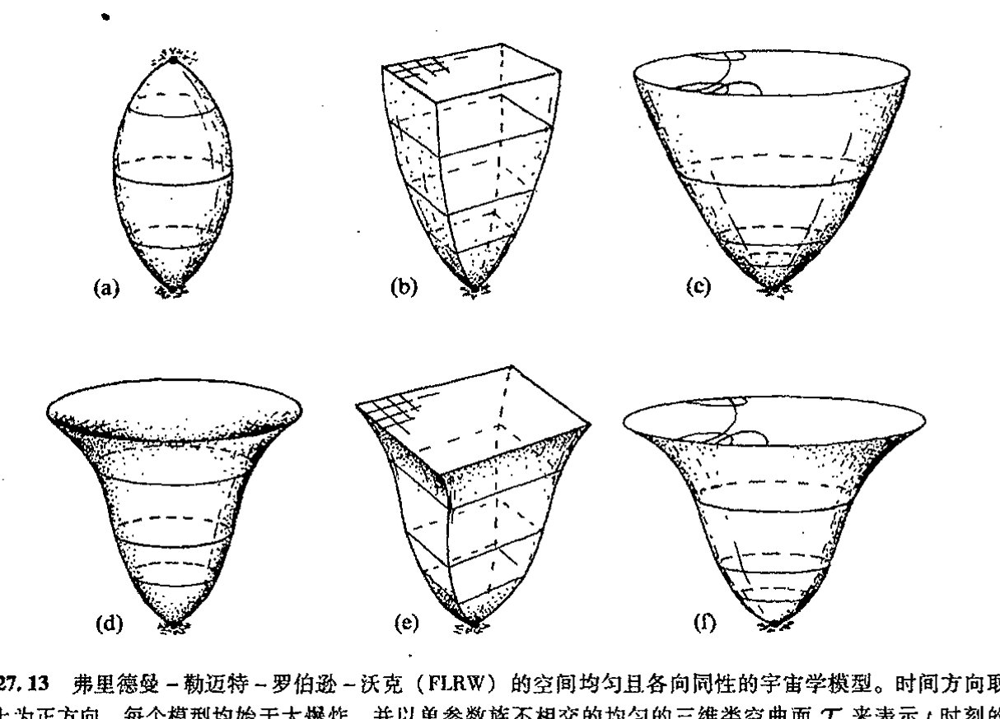

**图 27.13** 弗里德曼–勒迈特–罗伯逊–沃克（FLRW）的空间均匀且各向同性的宇宙学模型。时间方向取向上为正方向。每个模型均始于大爆炸，并以单参数族不相交的均匀的三维类空曲面 $\mathcal{T}_t$ 来表示 $t$ 时刻的“空间”。在弗里德曼模型里，实物物质被当作无压强流体（“尘埃”）。前 3 种情形：（a）$K>0$，$\mathcal{T}_t$ 为三维球面 $S^3$（图中显示为约束圆 $S^1$），这个模型最终将坍缩到大收缩；（b）$\mathcal{T}_t$ 为三维欧几里得空间 $\mathbb{E}$，如顶部的二维平面所示；（c）$\mathcal{T}_t$ 为三维双曲空间（顶部为其共形表示）。在（d），（e）和（f）中，正的宇宙学常数 $\Lambda$ 以及最终的指数膨胀的影响被分别加入（a），（b），（c）中，在情形（d）中，假定 $\Lambda$ 足够大使得不出现坍缩阶段。

在[图 27.13](assets/page534_fig01.jpg)（a），（b），（c）中，我按照弗里德曼对爱因斯坦方程的原初分析，就不同的空间曲率选择画出了宇宙的时间演化。对每一种情形，宇宙都始于奇点——所谓的大爆炸——此时空曲率变得无穷大，然后宇宙开始急速向外膨胀，最终的性态关键取决于 $K$ 值。如果 $K>0$（[图 27.13](assets/page534_fig01.jpg)（a）），膨胀最终会停止并逆转为收缩，最后回到奇点（即所谓的大收缩），这个过程相当于在严格的弗里德曼模型里取初始大爆炸的时间反向。如果 $K=0$（[图 27.13](assets/page534_fig01.jpg)（b）），那么膨胀将

<!-- page 535 -->

通向实在之路

会一直持续下去，不存在坍缩阶段。如果 $K<0$（[图 27.13](assets/page534_fig01.jpg)（c）），也不存在坍缩阶段，膨胀将最终达到一个常速率。（这里可用 [§27.8](#278-黑-洞) 讨论的从地面竖直上抛的一块石头作类比。如果石块的初速度小于逃逸速度，则它最终将回到地面上，这好比是 $K>0$ 的弗里德曼宇宙；如果石块的初速度等于逃逸速度，则它刚好不能返回，相当于 $K=0$ 情形；如果石块的初速度大于逃逸速度，则它将持续趋近一个永不变慢的极限速度，这相当于 $K<0$ 情形。）

原初的弗里德曼工作并不包括宇宙学常数 $\Lambda$，但实际上在这之后的所有关于宇宙学的系统讨论中，³³爱因斯坦 1917 年建议的宇宙学项 $\Lambda g_{ab}$ 都被考虑进来——尽管爱因斯坦本人倾向于取 $\Lambda=0$（1929 年后，见 [§19.7](chapter_19.md#197-进一步的问题宇宙学常数外尔张量)）。事实证明考虑 $\Lambda$ 是对的，最近各种不同的观察证据均明显有利于在我们的宇宙中存在正的宇宙学常数（$\Lambda>0$）的观点。我将在 [§28.10](chapter_28.md#2810-宇宙学参数观察的地位) 讨论这个问题，眼下我们先研究[图 27.13](assets/page534_fig01.jpg)（d），（e），（f），它们分别是含（足够大）正 $\Lambda$ 的弗里德曼方程对[图 27.13](assets/page534_fig01.jpg)（a），（b），（c）的类比。从目前的观测结果与宇宙学家的观点对比来看，这些模型中总有一个是对我们这个真实宇宙的至少是从退耦[1]那一刻之后的历史的正确描述，宇宙到退耦时的寿命大约是 $3\times10^5$ 年，这个时间只有宇宙目前寿命 $1.5\times10^{10}$ 年的 1/50000，这个退耦时间也就是我们从微波背景观察等效地"倒推回去"的时间。

在退耦之前，宇宙基本上属"辐射为主"的时期，退耦之后，则是"实物为主"的时期。我们不指望弗里德曼的"尘埃"模型能够恰当地描述辐射为主的阶段，这个阶段的描述更恰当的是用含辐射项的图尔曼（Tolman，1934）模型。它在我们的图像里并不造成很大的差别，与我在[图 27.14](assets/page535_fig01.jpg) 给出的"弗里德曼模型"的寿命预期※※[27.17]相比，只不过是将宇宙从大爆炸到退耦这段寿命缩短到原先的 3/4。暴胀宇宙学的支持者们认为在演化上存在过一个非常大的变化，即一种指数膨胀，其间宇宙尺度差不多增长了 $10^{60}$ 倍。但这个过程在宇宙起始的 $10^{-32}$ 秒时就已经

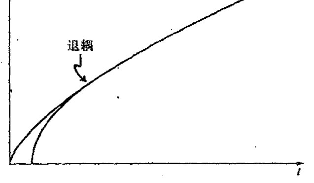

图 27.14 在宇宙年纪约 300000 年（仅为目前年龄的 1/50000）时发生的"退耦"（这也是我们能够用微波背景辐射"倒推回去"的最早时间）之前，宇宙以"辐射为主"，弗里德曼的"尘埃"近似失效。取而代之的是更迅速的图尔曼膨胀，如图中内曲线所示。

721 结束了，因此从[图 27.13](assets/page534_fig01.jpg) 或[图 27.14](assets/page535_fig01.jpg) 看不出什么差异！但在其他方面的差异可能是严重的，如果暴胀图像正确的话。我将在 [§28.4](chapter_28.md#284-暴胀宇宙学)，5 来考虑暴胀宇宙学。不管怎样，"标准宇宙学模型"不包

---

[1] 这里"退耦"是指光子与实物（由原子结团形成的宏观物体）之间的退耦，即光子不再参与实物间的相互作用。——译者

※※ [27.17] 看看你能否导出这个 3/4 因子，假定对小的时间 $t$ 值，弗里德曼的"尘埃"模型取 $t=AR^{3/2}$ 形式，图尔曼模型的"辐射"项取 $t=BR^2$ 形式，这里 $R=R(t)$ 是宇宙"半径"，$A$ 和 $B$ 是常数，提示：曲线的切线必须匹配吗？

??? question "答案 [27.17]"
    早期尘埃模型给 $t=AR^{3/2}$，辐射模型给 $t=BR^2$。在退耦点令两曲线的切线匹配，即 $dt/dR$ 相同：尘埃为 $\frac32AR^{1/2}$，辐射为 $2BR$。

    同时尘埃年龄为 $t_d=AR^{3/2}$，辐射年龄为 $t_r=BR^2$。由切线匹配得 $BR^2=\frac34AR^{3/2}$，所以 $t_r=\frac34t_d$。

·516·

<!-- page 536 -->

第二十七章 大爆炸及其热力学传奇

括暴胀阶段是合理的，我这里就取这种方式。^34

但[图 27.13](assets/page534_fig01.jpg)（d），（e），（f）中究竟哪一个更适合于实际宇宙呢？这个问题我放到 [§28.10](chapter_28.md#2810-宇宙学参数观察的地位) 去讨论。目前我们暂且认为它们基本上都正确。我们进一步检验一下这些不同的空间几何。

$K>0$ 情形通常表示三维球面。但应指出，从 $S^3$ 的全同对径点还可得到投影空间 $\mathbb{R}P^3$（见 [§2.7](chapter_02.md#27-与物理空间的关系)，[§15.4](chapter_15.md#154-克利福德丛)～6）；很难想象这两个空间在观察上是可分辨的。$S^3$ 的分离点之间还存在另一种全同性，即所谓透镜空间，但它们不是全域上各向同性的。^35（各向同性）情形 $K=0$ 是普通的三维欧几里得空间，$K<0$ 则为我们在 [§2.4](chapter_02.md#24-双曲几何共形图像)～7 和 [§18.4](chapter_18.md#184-闵可夫斯基空间的双曲几何) 研究的三维双曲空间，其中[图 2.21](assets/page050_fig01.jpg)（a），（b）和（c）分别表示埃舍尔对 $K>0$，$K=0$ 和 $K<0$ 这 3 种空间几何（其二维版本）的优美、天才的表示。$K>0$ 情形通常称为闭宇宙，就是说它是空间闭合的（即包含紧类空超曲面^36）。宇宙学家经常将 $K<0$ 情形称为"开"宇宙，而技术上说 $K=0$ 情形的空间也是开的。因此我这里不用这种让人糊涂的术语。如果我们不考虑总体各向同性，则如同上述 $K>0$ 的透镜空间一样，也存在（非各向同性的）$K=0$ 和 $K<0$ 的闭宇宙模型。^37

正如我们看到的，四维全空间 $\mathcal{M}$ 是用三维空间几何的时间演化来描述的，这里有一个整体尺度随时间变化的问题。在标准图像里，宇宙最初从大爆炸急速膨胀而生，但认为这种爆炸是从某个"中心点"开始并且万物由此后退的观点则是错误的。就两空间维的情形而言，膨胀宇宙的一种较合适的图像是一个被吹胀的气球表面。球面上的每一点都在随时间逐渐拉开彼此间的距离，故宇宙模型不存在"中心点"。在这个类比中，气球表面代表的是整个宇宙。因此，气球的中心不属于膨胀宇宙的一部分，不在气球表面上的那些点也不属于膨胀宇宙的部分。

我们用记号 $\mathrm{d}\Sigma^2$ 来代表这三种几何之一的度规形式，对 $K\neq 0$ 情形，我们将度规归一化到单位三维球面或单位双曲空间（即分别取 $K=1$ 和 $K=-1$）。^****[27.18] 于是整个时空的四维度规可表示成形式

$$\mathrm{d}s^2 = \mathrm{d}t^2 - R^2 \mathrm{d}\Sigma^2,$$

这里 $t$ 是"宇宙时间"参数，其常数值决定了每个的 $\mathcal{T}_t$，而

$$R = R(t)$$

是时间参数 $t$ 的某个函数，它给出"$t$ 时刻"宇宙空间的"大小"。因此，每个 $\mathcal{T}_t$ 的度规由 $R^2\mathrm{d}\Sigma^2$ 给定。在[图 27.15](assets/page537_fig01.jpg)（a），（b），（c），我按原初 $\Lambda=0$ 的弗里德曼"尘埃"（无压强流体）模型^****[27.19] 分别画出了 $K=1$，$0$，$-1$ 各情形下 $R=R(t)$ 的图，而在[图 27.15](assets/page537_fig01.jpg)（d），我画出了

---

^**** [27.18] 看看你能否用 [§18.1](chapter_18.md#181-欧几里得型与闵可夫斯基型四维空间) 的程序证明，$\mathrm{d}\Sigma^2 = \mathrm{d}r^2 + \sin^2\varphi(\mathrm{d}\varphi^2 + \sin^2\theta\mathrm{d}\theta^2)$ 描述了单位三维球面度规，$\mathrm{d}\Sigma^2 = \mathrm{d}r^2 + \sinh^2\chi(\mathrm{d}\chi^2 + \sin^2\theta\,\mathrm{d}\theta^2)$ 描述了单位双曲空间。提示：先写下任意半径的三维球面度规形式。

??? question "答案 [27.18]"
    单位三维球面可嵌入四维欧几里得空间。取嵌入坐标 $X_0=\cos\chi$，其余三维空间半径为 $\sin\chi$，再对这个二维球面用角坐标 $\theta,\phi$，诱导度规为 $d\chi^2+\sin^2\chi(d\theta^2+\sin^2\theta\,d\phi^2)$。原文第一个径向符号应理解为相应角变量的微分项。

    双曲空间可嵌入闵可夫斯基空间为 $X_0=\cosh\chi$、空间半径 $\sinh\chi$，诱导正定度规为 $d\chi^2+\sinh^2\chi(d\theta^2+\sin^2\theta\,d\phi^2)$。这正是单位负曲率三维双曲空间度规。

^**** [27.19] $K>0$，$\Lambda=0$ 的弗里德曼"尘埃"解可表示为 $R=C(1-\cos\xi)$，$t=C(\xi-\sin\xi)$，这里 $C$ 是常数，$\xi$ 是方便的参数。证明：这是一个摆线方程——摆线是沿水平直线滚动的圆的圆周上一点在空间的轨迹曲线。你能看出如何利用类似 [§18.1](chapter_18.md#181-欧几里得型与闵可夫斯基型四维空间) 中所用的"技巧"和练习 [27.16]，从 $K>0$ 情形导出 $K<0$ 的情形吗？如何又能通过取适当极限导出 $K=0$ 的情形（涉及坐标变换）？

??? question "答案 [27.19]"
    摆线的标准参数方程为 $x=C(\xi-\sin\xi)$、$y=C(1-\cos\xi)$，所以 $t=C(\xi-\sin\xi)$、$R=C(1-\cos\xi)$ 正是一条摆线，只是坐标名不同。

    把三角函数解析延拓为双曲函数，即 $\xi\mapsto i\eta$ 并适当重定义常数，可得到 $K<0$ 的开宇宙参数式，典型形式为 $R=C(\cosh\eta-1)$、$t=C(\sinh\eta-\eta)$。令曲率半径趋于无穷并重标空间坐标，可从闭或开情形取得 $K=0$ 极限，得到尘埃平坦模型 $R\propto t^{2/3}$。

·517·

<!-- page 537 -->

正 Λ 下的情形，所有 3 种 K 值下的曲线都非常相似（在 K > 0 情形，假定 Λ 足够大到能克服相应的坍缩——正如观察所表明的）。最终的膨胀率呈指数型。

**图 27.15** 弗里德曼模型的 R=R(t) 图：(a) K>0, Λ=0；(b) K=0, Λ=0；(c) K<0, Λ=0；(d) Λ>0。（(d) 画的是 K>0 情形，其他情形均非常相似，只要与空间曲率相关的 Λ 足够大。）

## 27.12　共形图

为了正确理解“可观察宇宙”指的是什么，采用所谓共形图³⁸是方便的，这种图下的整个时空（通常是二维的）表现为零（null，亦作“类光”——译者）方向与垂直方向呈 45°，无穷远则表现为图的边界（部分）。我们通常用花体字母 𝓘——读作“scri”——来表示这个“无穷远”，这里 𝓘⁺ 表示向外光线最终“达到”的未来（或未来零）无穷远，𝓘⁻ 表示向内光线最终“达到”的过去无穷远。在 Λ=0 的标准爱因斯坦理论中，它们通常构成三维零曲面，而在 Λ>0 情形下则为三维类空曲面。³⁹

共形图描述时空的因果结构，我们感兴趣的正是这族零锥而不是整个时空度规。它是我们在 [§2.4](chapter_02.md#24-双曲几何共形图像)、[§8.2](chapter_08.md#82-共形映射) 和 [§18.4](chapter_18.md#184-闵可夫斯基空间的双曲几何), 5 遇到的共形几何的洛伦兹版本（通过度规等价类的定义，g 等价于 Ω²g，这里 Ω 是时空上的正标量函数，因此 Ω 调整的是一地到另一地的距离标长）。在 [§12.2](chapter_12.md#122-流形与坐标拼块)，我们看到整个双曲平面是如何在有限的欧几里得平面区域里共形表示的（[图 2.11](assets/page042_fig01.jpg)，2.12，2.13）。共形时空图的概念基本同此，但现在共形表示的是时空的洛伦兹（非正定）度规。这里关键的新特征是，在洛伦兹几何下，零锥本身定义共形几何。

在二维情形，零锥由一对零方向组成，它将二维度规确定到一个局部共形因子。这种二维表示特别有用的一个地方是整个四维空间上具有球对称的那种场合。由此我们可将这种四维时空看成是一个“转动的”二维时空，这个二维空间上的每一点表示四维空间内一个完整的 S²。这种时空的共形图可以做得非常精确，我称这样的共形图为严格共形图。不严格的共形图则称为示意性共形图。严格共形图上的点表示整个（度规）球面 S²。（在弦论等考虑的 n 维洛伦兹“时空”情形——见 [§31.4](chapter_31.md#314-高维时空), 7——这些点表示 (n−2) 维球面 Sⁿ⁻²。）对于例外的情形，即共形图上那些表示单个时空点的点，它们将以图中表示对称轴的那部分边界的形式出现，在[图 27.16](assets/page538_fig01.jpg)a

· 518 ·

<!-- page 538 -->

第二十七章 大爆炸及其热力学传奇

中，我们用虚线来表示它，因此你必须将图设想成绕这根虚线有一个转动。***[27.20] 表示无穷远的边界部分用[图 27.16](assets/page538_fig01.jpg)（a）中实线来表示，而表示奇点的那部分则用锯齿线来表示。共形图中不同边界线的相交处还存在折角。如果这些折角是用小空心圆 ○ 表示的，则它表示的是完整的二维球面（就像三维双曲空间的边界，见 [§2.4](chapter_02.md#24-双曲几何共形图像) 和 [§18.4](chapter_18.md#184-闵可夫斯基空间的双曲几何)）；如果是用实心点 • 表示，则表示的是点（零半径球面）。[图 27.16](assets/page538_fig01.jpg)（b）是闵可夫斯基空间的严格共形图，[图 27.16](assets/page538_fig01.jpg)（c）表示的是史

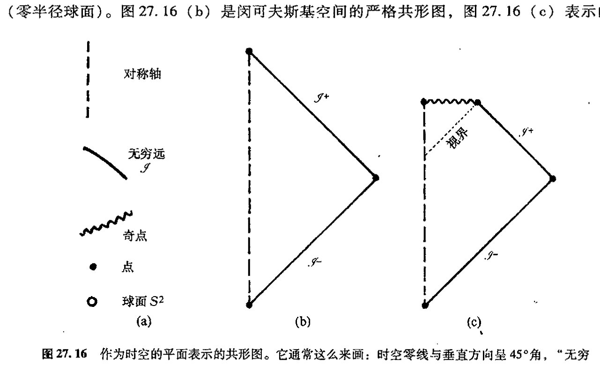

图 27.16 作为时空的平面表示的共形图。它通常这么来画：时空零线与垂直方向呈 45°角，“无穷远”表示为图中有限的边界——在边界上，物理度规对图的度规的共形比值为零。（a）在严格共形图（相对于示意性共形图）上，图内的每一点表示一个严格的二维球面；但在对称轴（虚线所示）上这个二维球面收缩为一个点，如同图中折角处那样，我们用实心点 • 表示；但如果折角处标的是○，则这个边界点仍共形于一个二维球面。无穷远用实线边界来表示（常记为 $\mathscr{I}$——读作“scri”）；奇点用锯齿线边界来表示。（b）闵可夫斯基空间 $\mathbb{M}$ 的严格共形图。（c）图 27.11 所描述的球对称坍缩到黑洞的严格共形图。

瓦西黑洞的引力坍缩（[图 27.11](assets/page528_fig01.jpg) 里描述的球对称坍缩）。在[图 27.17](assets/page539_fig01.jpg)，我描述了与[图 27.13](assets/page534_fig01.jpg) 相应的宇宙学模型。***[27.21]

共形图之所以有用就在于它能够将时空的因果性显示得十分明白。例如，在[图 27.16](assets/page538_fig01.jpg)（b）描述的球对称坍缩到黑洞的过程中，黑洞的视界处于 45°位置上。任何实物粒子的世界线与垂直方向的倾角不可能大于 45°，因此一旦它穿越视界进入到视界内部，就不可能再从视界内逃逸出

*** [27.20] 看看你能否按下述做法明确给出[图 27.16](assets/page538_fig01.jpg)a 的四维闵可夫斯基空间：取整个二维闵可夫斯基空间（度规 $ds^2 = dt^2 - dr^2$，$r \geq 0$）的一半，然后按文中所说的垂直轴旋转。用 $t$，$r$ 和球极坐标角度 $\theta$，$\phi$ 组成的适当函数（见练习 [27.18]）写出这个四维空间度规。（为直观起见，可先给出三维闵可夫斯基空间，这时转动要熟悉得多。）

??? question "答案 [27.20]"
    四维闵可夫斯基空间的球对称写法是 $ds^2=dt^2-dr^2-r^2(d\theta^2+\sin^2\theta\,d\phi^2)$，其中 $r\ge0$。这可看成二维 $(t,r)$ 半平面绕 $r=0$ 轴旋转，每个 $r>0$ 点代表一个半径为 $r$ 的二维球面。

    三维类比更直观：$ds^2=dt^2-dr^2-r^2d\phi^2$，即二维半平面绕轴生成圆。四维情形只是把圆换成二维球面。

*** [27.21] 看看你能否看出[图 27.11](assets/page528_fig01.jpg) 和[图 27.16](assets/page538_fig01.jpg)b 的共形图是如何相匹配的。对[图 27.16](assets/page538_fig01.jpg) 和 27.17 的每一个例子找出与度规相乘的适当的共形因子。

??? question "答案 [27.21]"
    闵可夫斯基空间可用零坐标 $u=t-r$、$v=t+r$，再令 $U=\arctan u$、$V=\arctan v$ 压缩到有限区域。此时度规乘以共形因子 $\Omega^2=\cos^2U\cos^2V$ 后成为爱因斯坦静态宇宙中的有限三角区域，零线仍为 $45^\circ$。

    FLRW 度规 $ds^2=dt^2-R(t)^2d\Sigma^2$ 引入共形时间 $d\eta=dt/R(t)$ 后成为 $ds^2=R(\eta)^2(d\eta^2-d\Sigma^2)$，所以主要共形因子为 $R(\eta)^{-2}$，再配合把空间无穷远压缩到有限边界的因子。黑洞坍缩图与传统时空图相配，是因为事件视界为向外光线刚好不能到达 $\mathscr I^+$ 的零边界，故在共形图中是一条 $45^\circ$ 零线。

· 519 ·

<!-- page 539 -->

通向实在之路

来。进一步说，一旦进入了该区域，它就不得不走向奇点（[图 27.18](assets/page539_fig02.jpg)（a））。奇点似乎是到时空内部区域的类空未来边界，这是一个与[图 27.11](assets/page528_fig01.jpg) 更为传统的观点很不相同的反直觉的事实。大爆

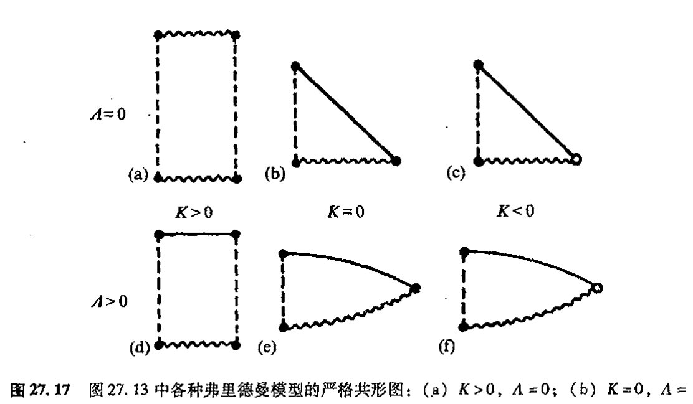

**图 27.17** 图 27.13 中各种弗里德曼模型的严格共形图：（a）K>0，Λ=0；（b）K=0，Λ=0；（c）K<0，Λ=0；（d）K>0，Λ>0（Λ 足够大）；（e）K=0，Λ>0；（f）K<0，Λ>0。

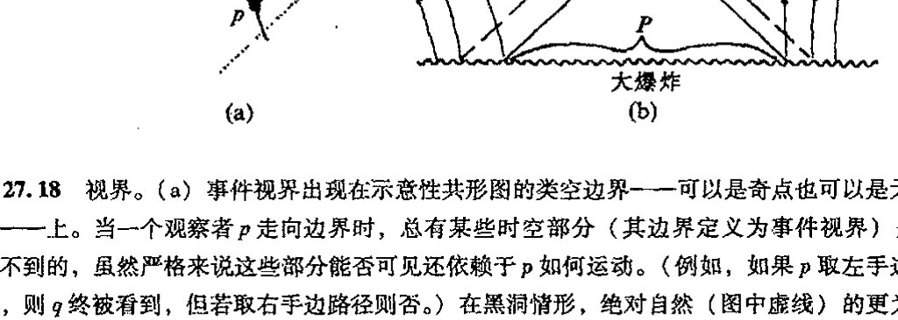

**图 27.18** 视界。（a）事件视界出现在示意性共形图的类空边界——可以是奇点也可以是无穷远——上。当一个观察者 p 走向边界时，总有某些时空部分（其边界定义为事件视界）是 p 看不到的，虽然严格来说这些部分能否可见还依赖于 p 如何运动。（例如，如果 p 取左手边路径，则 q 终被看到，但若取右手边路径则否。）在黑洞情形，绝对自然（图中虚线）的更为熟悉的"事件视界"是所有外部观察者共同的视界。（b）所有标准宇宙学里都会出现的粒子视界。它起源于过去的类空奇点。p 点的观察者只能看到大爆炸（及其产生的粒子）的有限部分 P，尽管这一部分的大小随时间增长。

725 炸所展示的情形则像充当了一种反时间的角色，起着时空的类空过去边界的作用（[图 27.18](assets/page539_fig02.jpg)（b））。这同样也是与直觉相悖的，因为我们总倾向于认为大爆炸是一个（奇）点。⁴⁰

这种初始边界的类空性质导致一种粒子视界的概念，它是大爆炸的一个重要特点。考虑[图 27.18](assets/page539_fig02.jpg)（b），观察者处于接近大爆炸边界的 p 点。宇宙中可传递信息到观察者的那部分区域是 p 点的过去光锥面上及其内部区域，我们注意到，这部分区域仅与大爆炸初始超曲面的 P 部分相交。⁴¹在大爆炸的 P 之外区域产生的粒子是永远不为 p 点的观察者所能看到的。这些区域处于 p

· 520 ·

<!-- page 540 -->

点的粒子视界之外。我们说它们处于 $p$ 点的可观察宇宙之外——宇宙的可观察部分即为 $p$ 点的过去光锥面上或内部区域。*[27.22]

## 27.13 异乎寻常的特殊大爆炸

现在我们回到大爆炸的异乎寻常的"特殊性"上来。从大爆炸时刻仅仅存在热力学第二定律这一点上看，很明显大爆炸一定具有极低的熵。但低熵可以有多种不同的形式。我们打算弄清楚我们的宇宙在初始阶段到底特殊在什么地方。

大爆炸的一个特别惊人的——尽管看上去很矛盾——性质来自甚早期宇宙热状态的非常令人信服的观察证据。证据之一是 2.7 K 微波背景辐射谱与普朗克"黑体"辐射理论曲线（见 [§21.4](chapter_21.md#214-量子理论的实验背景)，[图 21.3](assets/page382_fig01.jpg)(b)）的高度契合（[图 27.19](assets/page540_fig01.jpg)），这种背景辐射代表着大爆炸经宇宙膨胀（"红移"）冷却后遗留至今的实际"闪光"。另一个证据则来自对早期宇宙核过程观察与理论预期的明显一致性。这些理论计算严重依赖于早期宇宙中物质的热平衡假定——也包括对宇宙快速膨胀的假定。

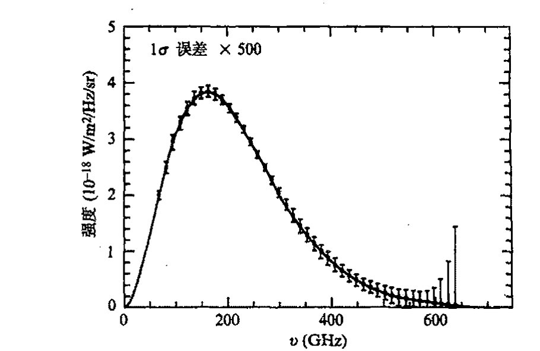

**图 27.19** 微波背景强度谱。它与普朗克的黑体辐射谱（图 21.3(b)）极为一致。（注意，这里显示的"误差棒"被放大了 500 倍。）

我认为早期宇宙的这种明显的热平衡很大程度上误导了一些宇宙学家，使他们认为大爆炸是某种高熵"随机"（即热平衡）态，尽管按照第二定律，它实际上必然是一种非常有序的（即低熵）态。流行的观点似乎认为，解决这个悖论的出路只能是，在大爆炸发生刚不久，宇宙

---

*[27.22] 利用这里给出的共形图证明：对于 $K=0$ 或 $K<0$，同时 $\Lambda=0$ 的情形，最初处于 $p$ 点的粒子的可观察宇宙将在粒子的未来时间极限内增大到包括整个宇宙，而这种情形对于 $K>0$ 或 $\Lambda>0$ 下的任意 $K$（如[图 27.17](assets/page539_fig01.jpg) 所描述）的情形则是不成立的（这时出现的叫"宇宙学事件视界"）。

??? question "答案 [27.22]"
    在 $\Lambda=0$ 且 $K=0$ 或 $K<0$ 的模型中，未来共形时间范围足够大，观察者未来极限的过去光锥可向大爆炸面扩展到任意远处，因此粒子视界最终覆盖整个空间。

    对 $K>0$，空间闭合且未来有大收缩或有限共形高度，光锥覆盖受限；对 $\Lambda>0$，未来类空无穷远和指数膨胀导致存在宇宙学事件视界，足够远的区域永远不能发送信号给观察者。因此后两类不能在未来极限看到整个宇宙。

· 521 ·

<!-- page 541 -->

通向实在之路

“很小”，因此能够取得的自由度相对较少，从而给出一个很低的熵的可能“上限”。正如 [§27.6](#276-整个宇宙可看作一个孤立系统吗) 所指出，这种观点是错误的。这个貌似的悖论的正确解释在于这样一个事实：在大爆炸后的瞬间，引力自由度没有随这些物质和所谓电磁场自由度“热能化”，这里的电磁场自由度定义了涉及宇宙“热状态”的参数。事实上，这些引力自由度——提供巨大熵的来源——经常根本没被考虑进来！

回想一下，在没有引力的情形下，最大熵确实是由通常“热状态”来表示的，当引力效应开始起主导作用的时候，即在黑洞情形下，最大熵的内涵非常不同。由于引力作用，物质的聚集，尤其是在这种聚集导向黑洞的情形下，可以有远大于普通热运动的熵。如果我们考虑的是闭合宇宙，那么这一点会变得特别明显。下面我们就来设想一种接近 FLRW 模型的宇宙，这里取 $K>0$ 和 $\Lambda=0$。初始物质的某种扰动$^{42}$会导致引力凝聚，我们假定这些初始物质足以产生以黑洞为归宿的星系（譬如说质量在 $10^6 M_\odot$ 量级），它提供的单位重子的熵约为 $10^{21}$。如果我们取这种闭合宇宙所含的重子数约为 $10^{80}$（可观察宇宙的重子数量），则它给出的总熵为 $10^{101}$，远大于大爆炸后 300000 年时辐射与实物退耦那段时间里的 $10^{88}$。星系的黑洞是逐渐形成的，但其主要增长期出现在宇宙的最后坍缩阶段，这时星系重新聚集到一块儿凝结成黑洞。最终的大收缩并非如[图 27.13](assets/page534_fig01.jpg)(a)所描述的对称的 FLRW 大爆炸模型的时间反演那样简洁，而是更像[图 27.20](assets/page542_fig01.jpg)（a）描述的逐渐凝聚的黑洞奇点那样参差不齐。我们可以用贝肯斯坦–霍金的熵公式来估计一下终态前的一段时间里这种大收缩的熵，这里我们仍将这种杂乱状态看成是由实际黑洞组成的，这种终态黑洞凝聚有 $10^{80}$ 个重子，这些重子的 $S_{\text{BH}}$ 值约为 $10^{123}$，这与按大收缩计算的熵值应当相差不是很大。

当然，这里读者有理由反驳说，即使 $K>0$ 情形的确如此，但目前的观察证据似乎强烈否定 $\Lambda=0$ 的假设，观察到的正 $\Lambda$ 值（在空间曲率上已考虑了观察极限因素）似乎很容易大到阻止出现我们所说的坍缩阶段，何况还有最终指数膨胀因素。但恰当地说，前面的讨论仍是成立的，我们发现不论是否有 $\Lambda>0$，同样的熵值（$\sim 10^{123}$）量度对 $10^{80}$ 个重子的闭宇宙也是有效的。[图 27.13](assets/page534_fig01.jpg)（d）描述的宇宙的时间反演结果与[图 27.13](assets/page534_fig01.jpg)(d)本身的动力学方程的解是一致的（因为我们这里考虑的动力学规律是可时间反演的）。如果我们考虑这种宇宙的扰动，我们就能找出那种描述成形黑洞聚集在一起产生类似前述的凝聚黑洞“杂乱”状态的模型（见[图 27.20](assets/page542_fig01.jpg)(b)）。再重申一遍，通过与前面相同的论证，我们得到结论：熵值的量级是 $10^{123}$。（当我们在 [§28.5](chapter_28.md#285-暴胀的动机有效吗) 考虑暴胀宇宙学时，这种论证方法还将再次用到。）

因此，我们得到一个对 $\mathcal{P}_\mathcal{U}$ 总体积的合理估计（它基本上等同于[图 27.4](assets/page518_fig01.jpg) 的最大熵盒子 $\mathcal{E}$ 的体积 $E$），即非常接近这个熵值的指数：※※[27.23]

---

※※ [27.23] 为什么这些数字——在现有精度下表示为数字“123”——几乎相同？为什么 $B$ 的实际值没出现在后面的结论中？

??? question "答案 [27.23]"
    数字 $123$ 来自把可观察宇宙量级的总质量放入一个黑洞后 $S_{\rm BH}\sim M^2$ 的估计。无论通过闭宇宙大收缩、带正 $\Lambda$ 的时间反演扰动，还是把 $10^{80}$ 个重子聚成最大黑洞，主导量都是同一个总质量的平方，因此指数中的数量级几乎相同。

    后面对相空间比例的结论由最大熵 $E\sim e^{10^{123}}$ 主导，而 $B$ 或 $N$ 的指数如 $10^{88}$、$10^{101}$ 相比 $10^{123}$ 小得多；在双重指数尺度上，它们对“占总体积的多小”这个结论几乎不起作用。

· 522 ·

<!-- page 542 -->

第二十七章 大爆炸及其热力学传奇

**图 27.20**　（a）在图 27.13（a）的 $K>0$，$\Lambda=0$ 情形下，如果允许存在我们在实际宇宙中看到的那种不规则性，那么我们得到的将不是严格的弗里德曼模型给出的那种"干净的"大收缩，而是一丛非常凌乱的具有极高熵（$S\approx 10^{123}$）的凝聚着的黑洞奇点。（b）这种情形与 $\Lambda=0$ 无关，当我们考虑图 27.13（d）（$K>0$，$\Lambda>0$）的时间反演的相应扰动时，我们再次得到相似的凝聚着的黑洞的巨大熵值（$S\approx 10^{123}$）。（c）一般大爆炸看起来如同一般大坍缩的时间反演（图中显示的是 $K>0$ 和 $\Lambda=0$ 或 $\Lambda>0$ 之一）。（d）最"可能"的情形（像图 27.8（a）的曲线）——为清楚起见，图中显示的是 $K>0$ 和 $\Lambda=0$——与早期阶段的实际宇宙没有一点相似性。

$$=e^{10^{123}}\approx 10^{10^{123}}。$$

（这个式子源自自然单位制下的玻尔兹曼公式 $S=\log V$。）现在的问题是：我们如何将这个量与今天的熵的盒子 $\mathcal{N}$ 的体积 $N$ 进行比较，以及如何与大爆炸时的熵的盒子 $\mathcal{B}$ 的体积 $B$ 进行比较（假定现在我们就生活在 $10^{80}$ 个重子的宇宙中）？取上述黑洞来估计，对今天的熵，即 2.7 K 背景辐射下单位重子的熵 $10^8$ 这个值，我们有

$$\mathcal{B}:\ \mathcal{N}:\ E=10^{10^{88}}:\ 10^{10^{101}}:\ 10^{10^{123}}。$$

因此，$B$ 和 $N$ 中的每一个都只有总体积 $E$ 的

$$10^{10^{123}}分之一。$$

进一步说，体积 $B$ 只有当今宇宙相空间体积 $N$ 的

$$10^{10^{101}}分之一。$$

作为对如此细小的 $\mathcal{B}$ 的相空间体积所带来的问题的一种欣赏，我们来想象造物主是如何用针来定位空间 $\mathcal{P}_\mathcal{U}$ 中的这一极其微小的位置，从而产生我们今天见到的这个宇宙的。在[图 27.21](assets/page543_fig01.jpg) 中，我描绘了想象中的这一刹那事件！如果造物主哪怕仅仅是错过这个位置一丁点，或者胡乱地将针戳到了最大熵区域 $\mathcal{E}$ 上，那么产生的将是如[图 27.20](assets/page542_fig01.jpg)（d）（$\Lambda=0$，$K>0$ 情形）那样的无人居住的宇宙，或者是像[图 27.20](assets/page542_fig01.jpg)（c）那样的永远膨胀着的宇宙，其中不存在第二定律用来定义（像[图 27.8](assets/page523_fig01.jpg)a）统计学的时间方向。（如果我们想象造物主只是想构造一个其中有像我们这样的智慧生物的宇宙，那么事情就不是那么好解释。这里产生出"人存原理"的问题，我将在 [§28.6](chapter_28.md#286-人存原理), 7 和 [§34.7](chapter_34.md#347-心智在物理理论中的作用) 讨论这些问题。）

另一方面，宇宙在空间上很可能像 $K=0$ 或 $K<0$ 的 FLRW 模型那样是无限的。但这不会使

<!-- page 543 -->

通向实在之路

上面的讨论变得无效。我们可通过想象仅将它应用到（目前的）可观察宇宙而不是整个宇宙。在取包含约 $10^{80}$ 个重子的目前这个可观察宇宙的情形下，我们很难看出上述考虑会受到严重影响。另一方面，如果我们将上述讨论用到整个宇宙（仍将 FLRW 看作是好的近似），我们需要的将是造物主能够无限精确，而不仅仅是具有极高的精度。我看不出有什么办法能够解决根植于大爆炸的超常精确的“音准”所体现的这个难题——第二定律的基本关联。

我们从这些讨论中得到了什么信息呢？我们不仅了解到宇宙的大爆炸起源具有异乎寻常的特殊性，而且认识到这种特殊本性所蕴含的重要信息。就实物物质（包括电磁场）而言，“热平衡”描述对于膨胀宇宙来说似乎是非常恰当的。“热大爆炸”图像已成为宇宙学标准模型里重要的组成部分。大约 $10^{-11}$ 秒之后，宇宙似乎还具有 $10^{15}$ K 的温度，但到了 $10^2$ 秒之后，温度则降至 $10^9$ K。温度的这种下降与图尔曼-弗里德曼膨胀率是一致的，许多观察细节（例如氢/氘/氦的比值）与在此温度下发生的核过程是相吻合的。

但说到引力，事情就完全不是那回事了，就是说，引力自由度根本就不能“热能化”。初始时空的几何的真正一致性（即 FLRW 本性）正在于大爆炸的特殊性。宇宙初始的奇点状态“不需如此”的情形见[图 27.20](assets/page542_fig01.jpg)（b）——或[图 27.20](assets/page542_fig01.jpg)（a）的物理上适当大收缩的时间反演。引力似乎有着不同于其他场的很特殊的地位。它特立独行，不参与早期宇宙所有其他场都投身其中的热能化，其自由度只作壁上观，因此当这些自由度不被考虑时第二定律才开始发挥作用。这一点不仅给出第二定律，而且给定了我们观察自然的特定形式。引力的确是够特殊的！

但它为什么如此特殊呢？要回答这个问题我们不得不进入更具猜测性的领域。在第 28 章，我们会看到物理学家试图解决这个谜团的一些途径，这个问题与宇宙的起源问题紧密相连。照我看，这些尝试没有一个是接近我在上一段所陈述的问题的。为了使我自己的信念保持前后一致，我们需要回到对量子力学的真正基础的检验上来，我坚信这些问题需要更深入地去探讨。我

**图 27.21** 宇宙的创生：虚构的描述！造物主已经用针点出了一个微小的盒子，其体积只有全部相空间体积的 $10^{10^{123}}$ 分之一，目的就是为了从我们实际发现的大爆炸里产生出一个宇宙来。

· 524 ·

<!-- page 544 -->

们把它放在第29章中进行。在随后的第30章，我将试着给出我对这些基本问题的一个好的解决方案。

## 注释

### §27.2

27.1 这里将动力学看成是完全经典的。技术上说，一个"混沌系统"是这样一种经典系统，在这种系统中，初态任何微小的变化都会导致系统行为发生随时间指数增长那样的非线性的根本变化。但从决定论上说，这种"不可预料性"经常被认为只是程度上的而非原理性的。

27.2 这里假定通常情况下比热是正的。但对于黑洞情形，这个假定通常不正确，见[§31.15](chapter_31.md#3115-弦与黑洞熵)。

27.3 但这里有一种奇妙的"悖论"，在日常生活中，事情往往别开生面！人们经常仅凭记忆过去所发生的事情来做准确的"倒叙"，而我们却不能依此来接近未来。进一步说，考古学调查可将这种"记忆"延伸到远到人类出现之前。但这种倒叙在任何明显的意义上都不包括动力学方程的演化，它与第二定律之间的具体联系在我看来仍显得扑朔迷离。（见Penrose（1979a））。

### §27.3

27.4 见Pais（1986）。

27.5 见Gibbs（1960）；Ehrenfest and Ehrenfest（1959）；Pais（1982）。

27.6 实际上，玻尔兹曼本人从未用过这个常数，因为他并不关心实际应用中所用的单位，见Cercignani（1999）。首次明确写出包含了这一常数的公式$S=k\log V$的似乎是普朗克，见Pais（1982）。

### §27.5

27.7 见Eddington（1929a）。

### §27.6

27.8 见Hawking and Ellis（1973）；Misner *et al.*（1973）；Wald（1984）；Hartle（2002）。

27.9 见Gold（1962）；至于这些概念得出的相当肤浅的结论，见Tipler（1997）。

27.10 见Penrose（1979a）。

### §27.7

27.11 在哈勃之前的1917年，美国天文学家Vesto Slipher已经发现了宇宙膨胀的某些迹象。见Slipher（1917）。虽然当时没人相信他的这些观察结果，但他还是以发现冥王星而蜚声学界！

27.12 1946年，George Gamow基于大爆炸图像第一次从理论上预言了这种辐射，1948年Alpher、Bethe和Gamow对此做了更清楚的表述；随后，Robert Dicke于1964年又重新独立地提出了这一预言。1965年，Arno Penzias和Robert Wilson通过观察发现了这种辐射，Dicke及其同事立即对此予以说明，见Alpher *et al.*（1948）；Dicke *et al.*（1965）和Penzias and Wilson（1965）——他们的文章大概是有史以来最诚实简约的科学论文了！（Penzias和Wilson的论文很短，仅一千字左右，它只指出，在4080兆赫发现有一个3.5K的过剩天线温度；在测量的限度内，它是各向同性、非极化的和与季节变化无关的。……Penzias和Wilson因此而获得了1978年度的诺贝尔物理奖。——译者摘自俞允强：《热大爆炸宇宙学》，北京大学出版社，2001年第1版，74页。）

27.13 进一步讨论见Penrose（1979a，1989）。

27.14 实际上，总的来说，地球返回到太空的能量要比它接收到的多一点点。略去人类燃烧化石燃料放出的能量不计（这些属地球在几百万年前接收到并存贮的来自太阳的能量，于今终于返回太空。另一方面，还可以略去"温室效应"带来的全球变暖因素，这些是地球俘获了较以前更多的太阳能量引起的），地球内部还存在由放射性衰变产生的能量，这种能量会通过大气非常缓慢地释放到太空。见§34.10。

### §27.8

27.15 见Michell（1784）；Tipler *et al.*（1980）。

27.16 见Penrose（1978）。

27.17 有关这个问题见van Kerkwijk（2000）。

·525·

<!-- page 545 -->

通向实在之路

27.18 见 Schwarzschild（1916），其现代表述见 Wald（1984）。

27.19 最近的证据见 Narayan（2003）。

**§ 27.9**

27.20 这种“不可返回点”的一个有用的特征是出现所谓“俘获面”。俘获面是一种紧致二维曲面 $S$，它有这样的性质：垂直于 $S$ 的两族零曲面收敛到未来。（更“通俗”点说，就是如果 $S$ 发出一个闪光，那么这个闪光向外和向内传播的两部分的面积都将逐渐减小。）我们有望在黑洞的视界 $\mathcal{H}$ 之内找到这种俘获面。俘获面判据的好处在于它不依赖于对称性假设，在几何的小扰动下是“稳定”的。俘获面一旦形成，就将不可避免地出现奇点（假定满足爱因斯坦理论中很弱但合理的因果性和能量正定条件）。类似结果还可以用于宇宙学的大爆炸奇点。见 Penrose（1965b），Hawking and Penrose（1970）。

27.21 见 Penrose（1965b），Hawking and Penrose（1970）。Wald（1984）在教学中综述了这些定理。

27.22 见 Penrose（1969a, 1998b），Belinskii *et al.*（1970）。

27.23 见 Penrose（1969a, 1998b）。

27.24 关于这些问题的最新观点见 Reeves *et al.*（2002），和 Cheng and Wang（1999）；碰撞理论见 Hansen and Murali（1998）。

**§ 27.10**

27.25 见 Israel（1967）；Carter（1970）；Hawking（1972）；Robinson（1975）。

27.26 见 Kerr（1963）；带电情形见 Newman *et al.*（1965）。Wald（1984）则给出了其教学形式。

27.27 像本章开头所述的开普勒椭圆，克尔度规提供了另一种例外的情形，其相对简单的几何构形实际上源自动力学定律。

27.28 见 Chandrasekher（1983），1 页。

27.29 实际上（正如我们在 [§31.15](chapter_31.md#3115-弦与黑洞熵) 所见），还有一个描述总电荷（也是一个守恒量，见 [§19.3](chapter_19.md#193-麦克斯韦理论中的守恒律和通量定律)）的参数。但对实际的天文学黑洞来说，比起 $m$ 和 $a$，它可以从黑洞几何中忽略掉，因为黑洞具有使自身电中性化的强烈趋势。

27.30 应注意不要将这个“$e$”与自然对数的底 $\mathrm{e}=2.7182818285\cdots$ 混淆了，见 [§5.3](chapter_05.md#53-多值性自然对数)。

**§ 27.11**

27.31 COBE 的证据见 Smoot *et al.*（1991），WMAP 的证据见 Spergel *et al.*（2003）。

**§ 27.11**

27.32 Liddle（1999）是一本优秀的宇宙学导论性著作。Wald（1984）包含了更复杂的问题。

27.33 见 Bondi（1961）；Rindler（2001）；Dodelson（2003）。

27.34 已出现所谓“和谐模型（concordance model）”概念用来描述 $K=0$ 和 $\Lambda>0$ 的情形，其中包含了暴胀期，见 Blanchard *et al.*（2003），Bahcall *et al.*（1999）。我对目前这种情形的评述见 [§28.10](chapter_28.md#2810-宇宙学参数观察的地位)。

27.35 很可能存在这样一种古怪情形，古希腊人是对的（[图 1.1](assets/page025_fig01.jpg)），宇宙就是个正十二面体（或是一个这样的拼贴物）。见 Luminet（2003）。

27.36 超曲面是指某个 $n$ 维流形（即这里的 $\mathcal{T}_1$）上 $(n-1)$ 维亚流形。

27.37 见 Killing（1983）；Wolf（1974）。

**§ 27.12**

27.38 这些图有时称为“彭罗斯图”或“卡特–彭罗斯图”，因为我在华沙讲座（1962）中用过这些图。严格共形图的系统定义是由 Carter（1966）引入的。

27.39 见 Penrose（1964, 1965a）；Carter（1966）；Penrose and Rindler（1986），第 9 章。

27.40 一些理论家喜欢这样的假说性模型，其中大爆炸共形于一个（因果关系）点（称为“$\Omega$ 点”），见 Tipler（1997）。为与第 27 章的论述保持一致，我不对此加以讨论，但这种模型在物理上有一定道理。

27.41 “超曲面”概念见注释 27.36。在这里，我们将共形表示下的大爆炸看成是三维的。（我们可将它与其他表示进行对比，见 Rindler 2001）。

**§ 27.13**

27.42 人们经常认为这种扰动现象本质上是大爆炸初始物质密度的一种“量子涨落”。（讨论见 [§30.14](chapter_30.md#3014-早期宇宙涨落的起源)。）

· 526 ·
